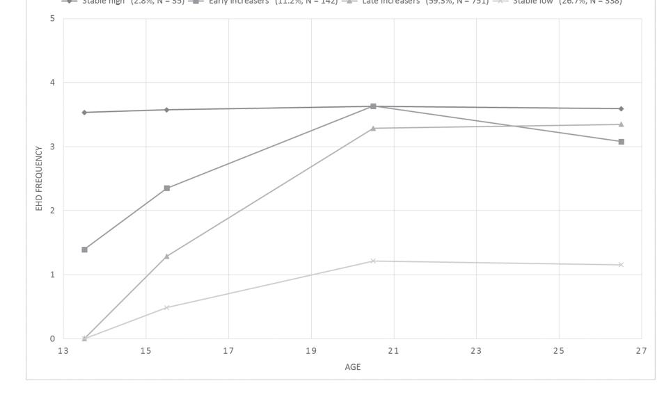

Drug and Alcohol Review (2017) DOI: 10.1111/dar.12565 *Drug and Alcohol Review* (March 2018), 37, 389–395 DOI: 10.1111/dar.12565

# Latent developmental trajectories of episodic heavy drinking from adolescence to early adulthood: Predictors of trajectory groups and alcohol problems in early adulthood as outcome

# GEIR SCOTT BRUNBORG1 , THOR NORSTRÖM2,3 & ELISABET E. STORVOLL2

1 Department of Substance Use, Norwegian Institute of Public Health, Oslo, Norway, 2 Department of Drug Policy, Norwegian Institute of Public Health, Oslo, Norway, and 3 Swedish Institute for Social Research, Stockholm University, Stockholm, Sweden

## Abstract

Introduction and Aims. To identify latent developmental episodic heavy drinking (EHD) trajectory groups for Norwegian adolescents, investigate risk factors associated with group membership and to assess differences in alcohol problems between different groups in early adulthood. Design and Methods. Data were from 1266 individuals measured at four time points from age 13/14 years to age 26/27 years. Latent class growth analysis was used to identify groups with different EHD development. Multinomial logistic regression was used to investigated if gender, impulsivity, school commitment, parents' socio-economic status, frequency of seeing parents drunk and parental knowledge could predict group membership. Differences in alcohol problem scores at age 26/27 were also assessed. Results. Four trajectory groups were identified: 'stable high', 'early increasers', 'late increasers' and 'stable low'. Membership of the high-risk trajectory groups 'stable high' and 'early increasers' was predicted by high impulsivity, low school commitment, high frequency of seeing parents drunk and low parental knowledge. The risk of alcohol problems at age 26/27 was greater for the 'stable high' group, the 'early increasers' and the 'late increasers' compared with the 'stable low' group. The 'stable high' and 'early increasers' had similar risk of alcohol problems. Discussion and Conclusions. Stable high and early increasing EHD in adolescence was associated with more alcohol problems in early adulthood. Such trajectories were predicted by high impulsivity, low school commitment, high frequency of seeing parents drunk and low parental knowledge. [Brunborg GS, Norström T, Storvoll EE. Latent developmental trajectories of episodic heavy drinking from adolescence to early adulthood: Predictors of trajectory groups and alcohol problems in early adulthood as outcome. Drug Alcohol Rev 2017;00:000-000]

Key words: episodic heavy drinking, latent trajectory, adolescence, risk factor, alcohol problem.

#### Introduction

Episodic heavy drinking (EHD) in young people is a serious health and social problem due to its relation to numerous adverse outcomes, including violence, casualties, injuries, unsafe sex and alcohol dependence [1–3]. For the average young person in Norway, the frequency of EHD increases from early to late adolescence, peaks in the early twenties and decreases and stabilises thereafter [4–7]. Such an inverted V shape in EHD has been observed in other countries as well [8]. However, a growing number of studies indicate that there is a high degree of heterogeneity underlying this average trajectory. First of all, some adolescents never start to drink or never begin to engage in EHD. Those who do engage in EHD differ with respect to age of onset © 2017 Australasian Professional Society on Alcohol and other Drugs2018;37:389–395]

and change in EHD frequency over time [7,9–12]. During the past 20 years, we have witnessed the emergence of methodological approaches [e.g. latent class growth analysis (LCGA)] that use longitudinal data to identify latent trajectory groups that differ with regard to EHD in adolescence and early adulthood. Most previous studies that use LCGA or related methods have been based on samples from the USA or other English speaking countries [8]. Adolescent drinking trajectories are likely to be different in different countries, and predictors of trajectories may also differ. Therefore, investigations from other countries are warranted.

Previous studies have identified three to approximately five different adolescent drinking trajectories. The trajectory groups have typically been labelled 'abstainers/light drinkers', 'stable-moderate drinkers',

Geir Scott Brunborg PhD, Senior Researcher, Thor Norström PhD, Senior Researcher, Elisabet E. Storvoll PhD, Department Director. Correspondence to Geir Scott Brunborg, Department of Substance Use, Norwegian Institute of Public Health, PO Box 4404 Nydalen, 0403 Oslo, Norway. Tel.: +47 41 10 48 42; E-mail: geir.brunborg@fhi.no

Received 2 November 2016; accepted for publication 6 April 2017.

'chronic heavy drinkers', 'late-onset heavy drinkers/increasers', 'decreasers' and 'fling drinkers' (a limited period of heavy drinking). According to the review by Maggs and Schulenberg [8], the identified trajectory groups have been fairly similar despite great methodological differences, such as different indicators of alcohol use (volume of consumption or frequency of EHD), time spans and types of samples. With a few exceptions (New Zealand [9] and Australia [13]), previous studies outside of Europe are based on samples from the USA. We have identified three studies based on European data that have used LCGA: one Dutch [12], one Finnish [14] and one Norwegian [7]. The Dutch study [12] found four trajectory groups based on the number of glasses a sample of adolescent had consumed during the previous week, measured at age 13 to 17. The four trajectory groups were labelled ('light drinkers', 'abstainers', 'increasers' and 'heavy drinkers'), and there was one additional trajectory from age 15 to age 17 ('stable drinkers'). They also found that boys were more likely than girls to be members of the 'increasers' or 'heavy drinkers' groups. In addition, they found that heavy drinking trajectories could be predicted by having a best friend or father who drank heavily and having permissive parents. The Finnish study [14] followed a cohort of adolescents at four time points from age 16 to age 42. Using LCGA, five EHD trajectory groups were identified ('moderate', 'steady high', 'steady low', 'increasing' and 'decreasing'). This study did not, however, investigate predictors of trajectory groups. The Norwegian study [7] used data for a cohort observed annually from age 13 to 18 years (except for age 17 years). LCGA of probability of drinking to intoxication at least once in the last 6 months identified four EHD trajectories ('intermediate onset', 'late onset', 'early onset' and 'early onset and stable'). These four trajectory groups were subsequently compared on symptoms of depression at each time point. The 'late onset' and 'intermediate onset' had similar symptom levels, but the 'early onset' and 'early onset and stable' groups had higher symptom levels.

These previous studies have either observed the early to late adolescent period or mid-adolescence to midadulthood period. In the present study, we followed a cohort of Norwegian adolescents from early adolescence (age 13/14) into early adulthood (age 26/27). This enabled observation of a critical phase in EHD development. Our aim was to identify developmental trajectory groups of EHD. Also, since few studies have investigated what may predict different trajectory groups, we investigated the role of gender, impulsivity, school commitment, socio-economic status, experiencing parents drunk and parental knowledge. Such information is important in the design of targeted interventions to reduce EHD and its adverse consequences. In addition,

we estimated differences between the trajectory groups in terms of alcohol problems in the mid-twenties.

#### Methods

Data were obtained from the Young in Norway Longitudinal Study, which has been described in detail elsewhere [15]. Data were collected at four time points: 1992 (t1), 1994 (t2), 1999 (t3) and 2005 (t4). The initial sample (1992) was obtained by selecting schools from a national register of all junior and senior high schools. The sampling procedure was designed to obtain a sample representative of the student population in Norway. At this time, 98.5% of the adolescents between age 12 and 16 attended the ordinary public junior high schools and 97% began in the voluntary senior high school [16]. All students in the selected schools were included in the 1992 survey (response rate: 97%) and the 1994 survey (response rate: 92%; whereof 91% were willing to participate in future follow ups), while the follow ups in 1999 (response rate: 84%) and 2005 (response rate: 82%) were confined to respondents who attended 7th or 10th grades in 1992. In both 1992 and 1994, questionnaires were distributed and completed in the classroom, while a postal survey was carried out in 1999 —which partly explains the drop in the response rate. In 2005, the respondents could choose between a paper questionnaire, telephone interview or an online questionnaire. In the present work, we focused on those who were in the age span of 13–14 years in 1992 and who had participated at all four time points (n = 1266; 677 girls; 589 boys). At the follow-up rounds, the respondents were 15–16, 20–21 and 26–27 years old.

Previous analyses showed that the following characteristics at the first assessment predicted attrition: being male, older age, poor school grades, suburban/urban residence and the participant's prediction of manual work as his/her occupation at 40 years of age [17]. Moreover, the sample had a lower probability than the population of having been charged for any criminal offence [18] or having received a prescription for benzodiazepines [19].

The study was conducted in accordance with the National Guidelines for Research Ethics in the Social Sciences and approved by the Norwegian Social Science Data Services.

#### Measures

Episodic heavy drinking (measured at t1, t2, t3 and t4). The frequency of EHD was measured by using the item: 'During the past 12 months, have you had so much to drink that you felt clearly intoxicated?' There were six response alternatives: 0 times (coded 0), 1 time (1), 2–5

Impulsivity (measured at t3) was measured with five items: Example items are 'I0 m an impulsive person' and 'I act on the spur of the moment'. There were four response alternatives, ranging from 'Corresponds very poorly' to 'Corresponds very well'. Internal consistency (Cronbach's alpha) for the sample was equal to 0.67.

School commitment (measured at t1). The amount of time spent doing homework was used as a proxy for school commitment. It was assessed by one item 'How many hours do you spend per day on homework on average'. There were seven response categories that ranged from 'I never or almost never do homework' to 'more than 4 hours'.

Parents' socio-economic status (measured at t1). Participants were asked to indicate, in separate questions, if their mother and father were currently working. There were six response categories ('full time', 'part time', 'unemployed', 'homemaker', 'on welfare', 'attending school'). Participants were also asked about their mother's and father's current occupations by using two open-ended questions: (i) 'Which occupation does your father/mother have?'; and (ii) 'What does he/she do at work?'. The responses were coded into five ISCO-88 categories ranging from 'Workers' (coded 1) to 'Higher administrative occupation' (coded 5). The ISCO-88 code was replaced by zero if the parent was unemployed or on welfare. The value that was the highest out of the mother's and the father's was as used as an indicator of parents' socio-economic status in the analysis.

Frequency of seeing parents drunk (measured at t1) was measured with the item: 'Have you ever seen your parents drunk?'. There were five response alternatives, ranging from 'never' to 'a few times a week'.

Parental knowledge (measured at t1) was measured by using four items: (i) 'My parents usually know where I am and what I do during the weekends'; (ii) 'My parents pretty much know who I spend my spare time with'; (iii) 'My parents know most of the friends I'm with on my spare time'; and (iv) 'My parents usually know where I am and what I do on the weekdays'. There were six response alternatives, ranging from 'not at all correct' to 'totally correct'. Internal consistency (Cronbach's alpha) was 0.85.

Alcohol problems (measured at t4). We used seven items from the Alcohol Use Disorders Identification Test (AUDIT) [20]. The complete version of the AUDIT comprises three subscales: AUDIT-C (three items measuring alcohol consumption), AUDIT-D (three items measuring symptoms of alcohol dependence) and AUDIT-P (four items measuring problems due to drinking). However, to reduce overlap between frequency of EHD and alcohol problems, only AUDIT-D and AUDIT-P were included. Starting with 'How often in the last year have you…', example items are as follows: '…found that you were not able to stop drinking once you have started', '…had a feeling of guilt or remorse after drinking' and '…been unable to remember what happened the night before because you had been drinking'. Responses were made by using frequency categories (e.g. ranging from 'never' to 'daily or almost daily'), but they were recoded into dichotomous yes/no variables indicating whether or not each symptom had been experienced in the last 12 months. The sum of these dichotomous variables was used in the analysis.

Descriptive statistics are shown in Table 1. The frequency distributions for EHD at all four time points are shown in Table 2.

# Analysis

LCGA in Mplus version 7 [21] was used to determine the number of latent EHD trajectory groups. This method is used to identify an optimal number of groups (also called classes) where individuals are more similar within than between groups. We used EHD frequency measured at age 13/14, 15/16, 20/21 and 26/27 to identify trajectory

Table 1. Means and standard deviations for the predictor variables (N = 1266)

| Variable                                       | Range      | Valid N      | M (SD)                     |
|------------------------------------------------|------------|--------------|----------------------------|
| Impulsivity                                    | 1–4        | 1118         | 2.61 (0.49)                |
| School commitment                              | 0–4.5      | 1232         | 1.43 (0.80)                |
| Parents' socio-economic                        | 0–5        | 1245         | 3.32 (1.27)                |
| status Frequency of seeing parents drunk | 0–4        | 1224         | 0.52 (0.80)                |
| Parental knowledge Alcohol problems         | 1–6 0–7 | 1194 1266 | 4.83 (1.01) 1.45 (1.58) |

Note: Impulsivity was measured in 1999 at 20/21 years old. Alcohol problems were measured in 2005 at age 26/27. All the other variables were measured in 1992 at 13/14 years old.

Table 2. Frequency of episodic heavy drinking (EHD) in the last 12 months at four time points (N = 1266)

| Frequency of | t1:    | t2:    | t3:    | t4:    |
|--------------|--------|--------|--------|--------|
| EHD          | 1992   | 1994   | 1999   | 2005   |
| >50 times    | 0.16%  | 1.35%  | 10.38% | 8.09%  |
| 11–50 times  | 1.14%  | 5.84%  | 37.18% | 30.98% |
| 6–10 times   | 1.47%  | 6.49%  | 16.34% | 18.57% |
| 2–5 times    | 4.48%  | 16.65% | 20.31% | 22.98% |
| 1 time       | 6.93%  | 10.49% | 6.50%  | 5.92%  |
| 0 time       | 85.82% | 59.17% | 9.30%  | 13.45% |

© 2017 Australasian Professional Society on Alcohol and other Drugs © 2017 Australasian Professional Society on Alcohol and other Drugs

groups. For each group, the intercept, slope and the quadratic term were estimated with their within-group variances set to zero. The robust maximum likelihood estimator was used for the LCGA analysis, as suggested by Feldman et al. [22]. To determine the number of groups, we started with one and added groups in a stepwise fashion. The Bayesian information criterion (BIC) and the Lo–Mendell–Rubin likelihood ratio test with its associated P-value were used to determine the number of groups. Four models were estimated, ranging from a two-group to a four-group model. The models were conditioned on gender.

The predicted group for each individual in the sample was added to the dataset, and the remaining data analysis was performed in StataCorp LP version 14 [23]. Multinomial logistic regression was used to estimate the relations between each putative predictor and the likelihood of trajectory group membership. As the reference category, we chose the group that had the lowest EHD throughout the study period ('stable low' ). In preliminary analysis, simple multinomial regression models were estimated that included the interaction terms of gender and each of the other putative predictors. However, none of the interaction terms were statistically significant; therefore, women and men were not analysed separately. In the main analysis, all the predictor variables were entered simultaneously.

Multiple imputations was used to handle missing data in the regression model (see [24] for details). The procedure involved generating 10 datasets using linear regression imputation based on all variables included in the regression model. The analysis is then performed on each dataset separately, and the results are pooled to a single multiple imputation result by using the 'mi estimate' command in Stata.

Differences between the trajectory groups in problematic drinking at age 26/27 years were estimated with Poisson regression.

#### Results

The LCGA showed that a three-group solution (BIC = 13 623) gave lower BIC compared with the two group solution (BIC = 13 918). A four-group solution, in turn, gave lower BIC than the three-group solution (BIC = 12 760). The P-value for the Lo–Mendell–Rubin likelihood ratio test was smaller than 0.01 in both comparisons. A five group model was also attempted, but it was not identified because of empty gender by class cells. Thus, the four-group solution was preferred.

Figure 1 shows average EHD scores at each time point for the four trajectory groups. The first group (N = 338, 26.7% of the sample) was labelled 'stable low' because of little EHD throughout the study years. The second group (N = 751, 59.3% of the sample) was labelled 'late increasers'. This group had no EDH at age 13/14, but it increased from age 13/14 to age 15/16 and from age 15/16 to age 20/21, after which it remained stable up to age 26/27. The third group (N = 142, 11.2% of the sample) was labelled 'early increasers'. This group had some EDH at age 13/14, and it increased from age 13/14 to age 15/16 and from 15/16 to 20/21, after which it had a small decline up to age 26/27. Finally, the fourth

Figure 1. Mean last 12 months frequency of episodic heavy drinking for four latent trajectory groups at age 13/14 to 26/27 years. The vertical axis indicates mean episodic heavy drinking frequency on the original response scale: 0 = 0 times, 1 = 1 time, 2 = 2–5 times, 3 = 6–10 times, 4 = 11–50 times and 5 = more than 50 times. The x-axis is age in years. The ages at which observations were made are indicated by the horizontal placements of dots on the lines. The measurement years were 1992, 1994, 1999 and 2005.

|                                   | 'Stable high' RRR (95% CI) | P      | 'Early increasers' RRR (95% CI) | P      | 'Late increasers' RRR (95% CI) | P      |
|-----------------------------------|-------------------------------|--------|------------------------------------|--------|-----------------------------------|--------|
| Gender (male)                     | 1.56 (0.74, 3.28)             | 0.244  | 1.82 (1.18, 2.80)                  | 0.007  | 2.07 (1.56, 2.74)                 | <0.001 |
| Impulsivity                       | 3.13 (1.33, 7.36)             | 0.009  | 2.38 (1.45, 3.91)                  | 0.001  | 1.92 (1.37, 2.68)                 | <0.001 |
| School commitment                 | 0.45 (0.24, 0.85)             | 0.013  | 0.53 (0.38, 0.73)                  | <0.001 | 0.94 (0.79, 1.11)                 | 0.449  |
| Parents' SES                      | 1.25 (0.93, 1.70)             | 0.145  | 1.07 (0.91, 1.26)                  | 0.430  | 1.12 (1.01, 1.25)                 | 0.033  |
| Frequency of seeing parents drunk | 2.60 (1.78, 3.79)             | <0.001 | 2.41 (1.85, 3.15)                  | <0.001 | 1.41 (1.13, 1.76)                 | 0.002  |
| Parental knowledge                | 0.44 (0.32, 0.62)             | <0.001 | 0.59 (0.48, 0.74)                  | <0.001 | 0.74 (0.63, 0.87)                 | <0.001 |

Table 3. Multinominal logistic regression predicting trajectory group membership with 'stable low' as the reference category

CI, confidence interval; RRR, relative risk ratio; SES, socio-economic status.

group (N = 35, 2.8% of the sample) was labelled 'stable high' because of high EDH frequency throughout the study period.

The results of the multinomial logistic regression model are shown in Table 3. Using 'stable low' as a reference category, male gender predicted membership in the 'early increasers' and 'late increasers' group, but not the 'stable high' group. High impulsivity predicted membership in all three groups. Low school commitment predicted membership of the groups 'stable high' and 'early increasers' , but not the 'late increasers'. High parents' socio-economic status only predicted membership in the 'late increasers' group. Finally, high frequency of seeing parents drunk and low parental knowledge predicted membership in all three groups.

There were differences between the four trajectory groups in terms of alcohol problems at age 26/27 (Table 4). Compared with the 'stable low' group, the risk of alcohol problems was greater for the 'stable high' group, the 'early increasers' and the 'late increasers'. The 'stable high' group had greater risk of alcohol problems compared with the 'late increasers' (incidence rate ratio = 1.29, 95% confidence interval 1.02, 1.61, P = 0.030), but 'stable high' and 'early increasers' had quite similar risk of alcohol problems (incidence rate ratios = 1.12, 95% confidence interval 0.87, 1.44, P = 0.370).

Table 4. Poisson regression comparing incidence of alcohol problems at age 26/27 between four adolescent episodic heavy drinking trajectory groups

| Trajectory group                                                         | IRR (95% CI)                                                                    | P                          |  |
|--------------------------------------------------------------------------|---------------------------------------------------------------------------------|----------------------------|--|
| 'Stable high' 'Early increasers' 'Late increasers' 'Stable low' | 4.89 (3.73, 6.41) 4.36 (3.59, 5.30) 3.80 (3.22, 4.49) 1.00 (reference) | <0.001 <0.001 <0.001 |  |

CI, confidence interval; IRR, incidence rate ratios.

#### Discussion

We identified four trajectory groups for EHD development from age 13/14 to age 26/27 years: 'stable low' , 'early increasers' ,'late increasers' and 'stable high'. The 'late increasers' was the most common developmental trajectory group, with 59.3% of the respondents, while 'stable high' was the smallest group with 2.8% of the sample. Due to differences in methodologies, the trajectory groups identified in the current study are not directly comparable to those identified in previous studies. However, the largest class identified by Skogen et al. [7] had low probability of drinking to intoxication at age 13 and rapidly increasing to age 18, which resembles the two groups of increasers identified in the current study. Skogen et al. also identified an early onset group, which appears similar to our 'stable high' group, and a late onset group, which resembles our 'stable low' group. The main difference between the studies is that Skogen et al. identified a group with early onset of moderate probability of intoxication followed by a weakly declining development, which was not identified in the current study.

Knowledge of what factors may predict different developmental trajectories is important in the design of targeted interventions to reduce adolescent EHD. Male gender predicted membership of the 'early increasers' and 'late increasers' , but not the 'stable high' group. This is partly in line with van der Horst et al. [12] who found that boys were less likely to be 'light drinkers' versus 'increasers'. But they also found that boys were more likely to be 'heavy drinkers' versus 'increasers', which is in contrast to our finding of no gender difference in the likelihood of membership in the 'stable high' group.

Higher impulsivity was associated with greater likelihood of belonging to the 'stable high' ,'early increasers' and 'late increasers' groups. This is in line with previous findings that high impulsivity is associated with early onset and greater increase in alcohol use over the adolescent years [25].

The results showed that less school commitment was associated with increased likelihood of membership in the 'stable high' or'early increasers' groups. This is in line with previous research showing that poor school performance and low school commitment are related to early onset of heavy alcohol use [26]. While it may be a risk factor, low school commitment probably also is a marker for a variety of factors, such as parenting style, future expectations and self-esteem [27].

Parents' socio-economic status was weakly related to trajectory group membership. This is in line with a review of the literature that concluded that there is no clear pattern of association between alcohol use and socioeconomic status in adolescence [28]. Some studies have reported an inverse relationship between parents' socioeconomic status and adolescent drinking, but this relationship can probably be explained by differences between low and high socio-economic families in terms of the parent–child relationship, alcohol-related permissiveness and drinking with children present [29]. In the current study, we found that belonging one of the three groups with elevated drinking was predicted by frequency of seeing parents drunk. This is consistent with van der Horst et al. [12], who found that following a heavy drinking trajectory was associated with having a best friend or a father who drank heavily. Genetic and/or environmental heredity may explain this relationship. It may also be the case that having parents with high alcohol consumption involves high accessibility to alcohol for adolescents, which has been found to be associated with heavy consumption [11].

We found that greater parental knowledge of their children's company and whereabouts was associated with lower likelihood of belonging to one of the three groups with elevated drinking. This is consistent with van der Horst et al. [12], who found that having permissive parents predicted a heavy drinking trajectory. Parents who carefully monitor their child's behaviour are probably more likely to detect development of heavy drinking patterns and to take steps to reduce heavy drinking. It could also be the case that adolescents with a good relationship with their parents are likely to keep their parents updated on their activities as well as to refrain from problem behaviours, including heavy drinking [30].

At age 26/27 years, the three trajectory groups with elevated drinking also had elevated levels of alcohol problems, especially the two groups with early high frequency EHD, which is consistent with previous studies [11]. This difference would not have been detectable without considering the drinking history. The implication of this is that alcohol problems in young adulthood can be reduced by curbing EHD in adolescence. Another implication of our findings is that prevention strategies may benefit from knowing that high impulsivity, poor school commitment, high frequency of seeing parents drunk and low parental knowledge may be predictive of following a potentially hazardous EHD trajectory.

### Strengths and limitations

The current study followed a Norwegian sample from early adolescence (age 13/14 years) to early adulthood (age 26/27 years), which is a strength since no European study has investigated EHD development throughout this critical life phase. This allowed investigation of risk factors present before most adolescents start to drink and allowed investigation of problematic drinking outcomes in early adulthood. As with most research studies, there are some limitations that should be noted. As is generally the case with longitudinal studies, our data were plagued by panel attrition, which limits the generalisability of the findings. On balance, our data originated from a nationally representative school study with an unusually high response rate, while many previous studies are based on convenience samples. There were relatively long time spans between the measurements, which make the shape of the trajectories fairly rough. Some individuals may have been misclassified due to lack of information about their EHD between measurement points. Also, the average peak in EHD may actually have been some years earlier or some years later. Further, it cannot be taken for granted that our findings can be generalised to the present situation. New studies are thus warranted. These should include a wide range of individual and contextual factors to investigate their relative importance. Also, a wide range of outcomes should be studied, for instance with the use of registry linkages.

#### Conclusion

In summary, those who start to drink heavily in early adolescence and persist throughout adolescence have elevated risk of problematic drinking in early adulthood. Risk factors for following this developmental trajectory are high impulsivity, low school commitment, high frequency of seeing parents drunk and low parental knowledge.

# Conflicts of interest

The authors have no conflicts of interest.

#### References

[1] Wechsler H, Davenport A, Dowdall G, Moeykens B, Castillo S. Health and behavioral consequences of binge drinking in college: a national survey of students at 140 campuses. JAMA 1994;272:1672–7.

- [2] Cooper MJ. Alcohol use and risky sexual behavior among college students and youth: evaluating the evidence. J Stud Alcohol Drugs 2002;63:101–17.
- [3] Guo J, Collins LM, Hill KG. Developmental pathways to alcohol abuse and dependence in young adulthood. J Stud Alcohol Drugs 2000;61:799–808.
- [4] Skretting A, Vedøy TF, Lund KE, Bye EK. Rusmidler i Norge 2016 [substance use in Norway 2016]. Oslo: Norwegian Insitute of Public Health, 2016.
- [5] Strandheim A, Holmen TL, Coombes L, Bentzen N. Alcohol intoxication and mental health among adolescents—a population review of 8983 young people, 13–19 years in North-Trøndelag, Norway: the Young-HUNT Study. Child Adolesc Psychiatry Ment Health 2009;3:18.
- [6] Nordlund S. Rusmiddelbruk i Norge. Norsk epidemiologi. 2009;6(1).
- [7] Skogen JC, Knudsen AK, Hysing M, Wold B, Sivertsen B. Trajectories of alcohol use and association with symptoms of depression from early to late adolescence: the Norwegian Longitudinal Health Behaviour Study. Drug Alcohol Rev 2016;35:307–16.
- [8] Maggs JL, Schulenberg JE. Trajectories of alcohol use during the transition to adulthood. Alcohol Res Health 2004;28:195–201.
- [9] Casswell S, PledgerM, Pratap S. Trajectories of drinking from 18 to 26 years: identification and prediction. Addiction 2002;97:1427–37.
- [10] Chassin L, Pitts SC, Prost J. Binge drinking trajectories from adolescence to emerging adulthood in a high-risk sample: predictors and substance abuse outcomes. J Consult Clin Psychol 2002;70:67–78.
- [11] Danielsson AK, Wennberg P, Tengström A, Romelsjö A. Adolescent alcohol use trajectories: predictors and subsequent problems. Addict Behav 2010;35:848–52.
- [12] van der Horst H, Vermulst AA, Meeus WHJ, Dekovic M, Engels RCME. Identification and prediction of drinking trajectories in early and midadolescence. J Clin Child Adolesc 2009;38:329–41.
- [13] Toumbourou JW, Williams IR, White VW, Snow PC, Munro GD, Schofield PE. Prediction of alcohol-related harm from controlled drinking strategies and alcohol consumption trajectories. Addiction 2004;99:498–508.
- [14] Berg N, Kiviruusu O, Karvonen S, et al. A 26-year follow-up study of heavy drinking trajectories from adolescence to mid-adulthood and adult disadvantage. Alcohol Alcohol 2013;48:452–7.
- [15] Strand NP, von Soest T. Young in Norway—Longitudinal. Documentation of design, variables, and scales. Oslo: NOVA–Norwegian Social Research, 2007.
- [16] Wichstrøm L, Skogen K, Øia T. Increased rate of conduct problems in urban area: what is the mechanism? J Am Acad Child Psychiatry 1996;35:471–9.
- [17] Pedersen W. Childbirth, abortion and subsequent substance use in young women: a population-based longitudinal study. Addiction 2007;102:1971–8.
- [18] Pedersen W, Skardhamar T. Cannabis and crime: findings from a longitudinal study. Addiction 2010;105:109–18.
- [19] Kornør H, Pedersen W, von Soest T, Rossow I, Bramnes JG. Bruk av benzodiazepiner og cannabis blant unge voksne Use of cannabis and prescribed benzodiazepine anxiolytic in young adults. Tidsskr Norske Laege 2010;130:928–31.
- [20] Babor TF, Higgins-Biddle JC, Saunders JB, Monteiro MG. The alcohol use disorders indentification test: guidelines for use in primary care. Geneva: World Health Organization, 2001.
- [21] Muthén LK, Muthén BO. Mplus. Statistical analysis with latent variables Version. 2007;3.
- [22] Feldman BJ, Masyn KE, Conger RD. New approaches to studying problem behaviors: a comparison of methods for modeling longitudinal, categorical adolescent drinking data. Dev Psychol 2009;45:652–76.
- [23] StataCorp LP. Stata/ SE 14.1 for Windows (64-bit x86–64). College Station: TX: StataCorp LP 2015.
- [24] StataCorp LP. Stata multiple-imputation reference manual release 14. College Station: TX: Stata Press, 2015.
- [25] Khurana A, Romer D, Betancourt LM, Brodsky NL, Gianetta JM, Hurt H. Working memory ability predicts trajectories of early alcohol use in adolescents: the mediating role of impulsivity. Addiction 2012;108:506–15.
- [26] Flory K, Lynam D, Milich R, Leukefeld C, Clayton R. Early adolescent through young adult alcohol and marijuana use trajectories: early, predictors, young adult outcomes, and predictive utility. Dev Psychopathol 2004;16:193–213.
- [27] Jessor R. Problem-behavior theory, psychosocial development, and adolescent problem drinking. Br J Addict 1987;82:331–42.
- [28] Hanson MD, Chen E. Socioeconomic status and health behaviors in adolescence: a review of the literature. J Behav Med 2007;30:263–85.
- [29] Pape H, Norström T, Rossow I. Adolescent drinking—a touch of social class? Addiction 2017;112:792–800.
- [30] Kerr M, Stattin H. What parents know, how they know it, and several forms of adolescent adjustment: further support for a reintepretation of monitoring. Dev Psychol 2000;36:366–80.

Copyright of Drug & Alcohol Review is the property of Wiley-Blackwell and its content may not be copied or emailed to multiple sites or posted to a listserv without the copyright holder's express written permission. However, users may print, download, or email articles for individual use.