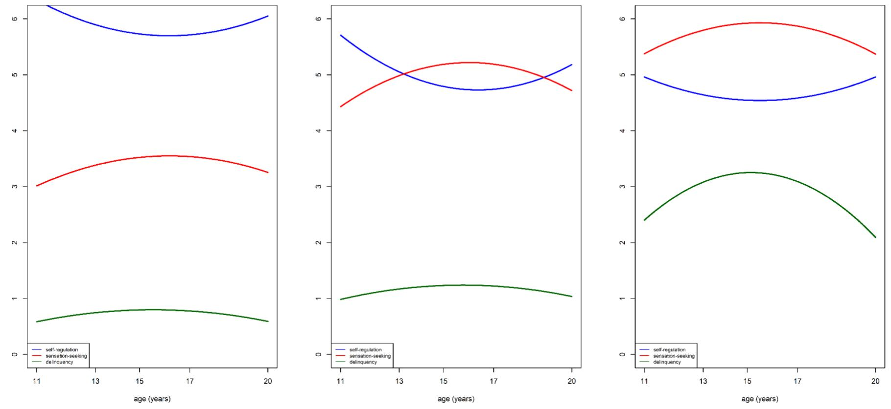

#### **Identifying childhood predictors of delinquency escalations in adolescence**

Aja Louise Murray1 | Xinxin Zhu1 | Jessica Mirman2 | Arthur Caye3 | Luis Augusto Rohde3 | Denis Ribeaud4 | Manuel Eisner4,5

1Department of Psychology, University of Edinburgh, UK

2 Department of Clinical and Health Psychology, University of Edinburgh UK

3 ADHD and Developmental Psychiatry Programs, Hospital de Clínicas de Porto Alegre,

Universidade Federal do Rio Grande do Sul, Brazil & National Institute of Developmental Psychiatry

for Children and Adolescents, Brazil.

4 Jacobs Center for Productive Youth Development, University of Zurich, Switzerland 5 Institute of Criminology, University of Cambridge, UK

## **Correspondence**

Aja Louise Murray, Department of Psychology, University of Edinburgh, UK EH8 9JZ. Email: aja.murray@ed.ac.uk

## **Funding**

We are grateful to the research assistants and participants of the z-proso study. Funding from the Swiss National Science Foundation (Grants 405240-69025, 100013\_116829, 100014\_132124, 100014\_149979, 100014\_149979, 10FI14\_170409/1, 10FI14\_170409/2, 10FI14\_198052/1), the Jacobs Foundation (Grants 2010-888, 2013-1081-1), the Jacobs Center for Productive Youth Development, the Swiss Federal Office of Public Health (Grants 2.001391, 8.000665), the Canton of Zurich's Department of Education, the Swiss Federal Commission on Migration (Grants 03-901 (IMES), E-05-1076), the Julius Baer Foundation, and the Visana Foundation is gratefully acknowledge.

## **Abstract**

*A subset of youth show an escalation of delinquency in adolescence and there is considerable potential value in identifying early life markers that could be used to help target preventive interventions for those at risk. Within a dual systems framework, this study examined childhood predictors of adolescent escalations of delinquency in the normative z-proso cohort (n=1522). Trajectories were summarised using latent class growth analysis of self-reported sensation-seeking, self-regulation, and delinquency across ages 11 to 20. Predictors examined included task-based measures of risk-taking, and sensation-seeking at age 7/8 and parent- and teacher-reports of ADHD symptoms and a range of conduct problems at age 7. Adjusting for gender, all predictors except parented-reported indirect aggression, inattention, and hyperactivity/impulsivity symptoms were associated with membership in a class characterised by an adolescent escalation of delinquency (n=112; 7.4%) relative to a class with no escalation(n=816; 53.7%). Mutually adjusting for all predictors, gender, age 7 sensation seeking, age 8 risk-taking propensity, parent-reported physical aggression and teacher-reported reactive aggression emerged as unique significant predictors. Results suggest that later delinquency escalations can be predicted based on child characteristics at age 7/8 years of age. This knowledge could help to identify children who could benefit from preventive interventions.*

#### **KEYWORDS**

adolescence, dual systems theory, delinquency, risk-taking

#### **1** | **INTRODUCTION**

Adolescent delinquency is a major societal concern and is associated with considerable economic costs, harm to victims, and risks of life-altering consequences for the perpetrator, including involvement with criminal justice systems or exclusion from school (Lopes et al., 2012; Makarios et al., 2017; Reckers-Droog et al., 2019). As such, there is considerable interest in identifying early markers of risk for adolescent delinquency to inform early prevention. Further, while early manifestations of delinquency can emerge in childhood and can show continuity into adolescence, there is also a marked increase in delinquency in adolescence that must be taken into account when predicting who is at risk during this period of development (Fairchild & Smaragdi, 2018).

One perspective that is thought to hold promise for explaining adolescent delinquency (and its escalation during this developmental period) is a risk-taking perspective, in which delinquency is viewed as on the extreme end of a continuum of a broader adolescent tendency to engage in risky behaviours (Murray, Mirman, et al., 2021). Within this perspective, dual systems theories have emerged as dominant explanations of risk-taking behaviour escalations in adolescence (Luna & Wright, 2016; Steinberg et al., 2008), where risk-taking refers to behaviours such as substance use, sexual risk-taking, and delinquency that carry a risk of serious adverse consequences. These theories explain escalations in risk-taking in terms of a 'developmental' or 'maturational' imbalance between the socioemotional and cognitive control systems of the brain. The former is assumed to serve reward processing and to show a peak in reactivity during mid-adolescence, manifesting as increased sensation-seeking. The latter is assumed to underpin self-regulation and to show a developmental trajectory characterised by more gradual gains that doesn't reach full maturity until adulthood. These differential developmental trajectories are assumed to result in a period in adolescence where high reward drive is mis-matched with insufficient self-regulation, leading to greater engagement in risktaking behaviours.

While these basic tenets have been supported in some studies, recent research has highlighted considerable heterogeneity in the developmental trajectories of the neural, psychological, and behavioural markers of these two systems and there is growing evidence that a developmental imbalance model describes only to a small subset of youth (Meeus et al., 2021; Mills et al., 2014;

Murray, Zhu, et al., 2021; Romer et al., 2017). For example, a previous analysis of z-proso data used a longitudinal operationalisation of developmental imbalance to test risk-taking theories of delinquency as a specific form of adolescent risk-taking (Murray, Zhu, et al., 2021). It used longitudinal latent growth analysis to identify subgroups of sensation seeking/self-regulation developmental imbalance and delinquency across ages 11-20. While these methods are unlikely to uncover 'true' groups or 'natural types' they are a helpful way to summarise heterogeneity in developmental trajectories, especially involving multiple phenotypes and/or groups with non-linear change (Murray et al., 2020; Nagin & Odgers, 2010). Indeed, the groups that emerge from such analyses often differ on clinically or otherwise meaningful predictors and/or outcomes, suggesting that they are a helpful way to summarise and encode information about potential etiological and/or prognostic differences between individuals with different developmental histories (e.g., Murray, Hall, et al., 2021). Results of the longitudinal latent class analysis of the z-proso data indicated that only a small subgroup of youth (7% of the sample) showed a pronounced developmental imbalance and attendant escalation of risk-taking. Stratifying by gender suggested that only males showed strong evidence of a subgroup characterised by a developmental imbalance and associated adolescent delinquency increases. Little is known, however, about the characteristics that differentiate these youth from the majority who do not exhibit a developmental imbalance and associated adolescent escalation in risk-taking and whether they are the same youth who show early behaviour problems. Identifying the characteristics of youth who are vulnerable to developmental imbalances and associated delinquency , especially early life markers, can help with the targeting of preventive interventions to reduce harmful escalations of risk-taking in adolescence. These youth may benefit from intervention approaches focused on developing self-regulation or channelling risk-taking tendencies into 'positive risk-taking' that allow opportunities for more adaptive risk-taking (e.g., see Duell & Steinberg, 2019).

Recent theoretical developments within the adolescent risk-taking field offer insights into candidate early markers for developmental imbalances and associated adolescent risk-taking escalations. The Lifespan Wisdom Model, for example, posits that a small subgroup of youth are prone to developmental imbalances because of stable (pre-existing) self-regulation difficulties that interact with a normative adolescent peak in sensation-seeking (Romer et al., 2017). This perspective implies that early performance and behavioural markers of difficulties in self-regulation should predict later developmental imbalances and attendant increases in risk-taking. The goal of the present study is thus to examine early markers of self-regulation alongside early externalising problems that may show continuity with adolescent delinquency (indirect, physical, proactive, and reactive aggression; non-aggressive conduct problems, and oppositional defiant disorder symptoms) as predictors of later delinquency escalations. Since children can display different symptoms in different contexts and in interaction with different adults, we include both parent- and teacher- reports of child behaviour (De Los Reyes, 2013; Murray, Booth, et al., 2018). To complement parent and teacher reports of behaviour in everyday life, we also include task-based measures of sensation-seeking and risk-taking propensity, as central components in dual systems theories (Shulman et al., 2016). Given that externalising problems are likely to partially reflect self-regulation and/or sensation-seeking issues, especially reactive aggression (characterised by 'emotionally hot' impulsive reactions to provocation) and oppositional defiant disorder (ODD) symptoms (often characterised by difficult, emotionally reactive interactions with authority figures) (American Psychiatric Association, 2013; Hubbard et al., 2010), we examine the extent to which each of these domains uniquely (i.e., adjusting for other domains) predict adolescent escalations in delinquency.

#### **2** | **METHOD**

## **2.1** | **Participants**

We used the data (n=1522, 50% male) from the Zurich project on social development from childhood to adulthood (z-proso, http://www.cru.ethz.ch/en/projects/z-proso.html), which is a multirater longitudinal study of the psychosocial development of Swiss youth (Ribeaud et al., 2022). The zproso participants were selected from 56 primary schools based on a stratified random sampling approach by considering both school size and location. The current analysis focuses on eight waves of longitudinal data from the baseline wave (age 7) to the latest wave (age 20) and builds on the study of Murray, Zhu, et al. (2021) which examined the joint developmental trajectories of sensation seeking, self-regulation and delinquency between ages 11 and 20. Further details about the z-proso study can also be found in other previous publications including recruitment and assessment procedures,

demographic characteristics, and comprehensive analyses of non-response and attrition (see in particular M. Eisner & Ribeaud, 2007; N. L. Eisner et al., 2018). Descriptive statistics for the sample are provided in Table 1.

[Table 1 about here]

#### **2.2** | **Ethics**

The z-proso study was approved by the Ethics Committee from the Faculty of Arts and Social Sciences of the University of Zurich. The active informed consent at each wave was obtained from the youth (aged 13 onwards) and/or their parents (when they were younger).

## **2.4** | **Measures**

#### **2.4.1** | **Dual systems constructs and adolescent delinquency**

The dual systems constructs of sensation-seeking, self-regulation and delinquency were measured using self-reports at the age 11,12,13,15,17, and 20 waves. Participants were administered Grasmick's self-control scale (Grasmick et al., 1993) which is inspired by Gottfredson & Hirschi's (1990) general theory of crime, which views low self-control as core to crime perpetration. Grasmick's self-control scale, however, incorporates more recent evidence that has suggested that self-control is more appropriately conceptualised and operationalised a multi-dimensional and not a unitary construct as specified in the original general theory of crime (Forrest et al., 2019). Two of its sub-scales have been argued to map to the constructs of dual systems theory (Forrest et al., 2019). It has been suggested that the 'risk-seeking' subscale captures the dual systems construct of sensationseeking; and the 'impulse control' subscale (when reverse scored) captures the dual systems construct of self-regulation. In the version administered in z-proso, two items each were used from each of these subscales. The two sensation-seeking items were: "Excitement and adventure are more important to me than security" and *"*Sometimes I do dangerous things just for the fun of it"*.* The two self-regulation items were: "I often act on the spur of the moment without stopping to think*"* and "I often do whatever brings me pleasure here and now, even at the cost of some distant goal"*.* Item responses were recorded on a 4-point scale from 1=*false* to 4=*true*. Scores for each construct were

summed (reversed and summed for impulse control to form a self-regulation score) to provide overall sensation-seeking and self-regulation scores, with possible ranges from 2-8. The two scales were scored in this way (i.e., in opposite directions) to map more directly to the dual systems theory, which discusses the drivers of risk taking in terms of one system that promotes and one that constrains risktaking behaviour. Higher scores thus indicate higher levels of sensation-seeking and self-regulation. Previous factor analyses in the current and other samples have supported the proposed multidimensionality of Grasmick's self-control scale, including the distinction between the sensationseeking and self-regulation components (Ribeaud & Eisner, 2006). For example, in a factor analysis of the scale in a previous study in the current dataset, the impulse control and risk-seeking latent factors shared approximately half of their variance, with the rest unique to each sub-dimension (Ribeaud & Eisner, 2006).

Delinquency was measured via self-report at the same ages as sensation-seeking and selfregulation (the age 11,12,13,15,17, and 20 waves). It is often considered a prototypical example of the kind of behaviour that adolescent-risk seeking models aim to explain because it shows a clear spike in adolescence, often occurs in the presence of peers, and offers both immediate rewards and carries risks of serious consequences (see Murray, Mirman et al., 2021). Delinquency was measured using a variety score indexing the range of different delinquent acts that were reported by the participant. Variety scores were the sum of 7 dichotomously scored items capturing engagement in different delinquent acts over the previous 12 months. These 7 items were used as they were the subset of items that were measured consistently across the age 11 to age 20 waves of the z-proso study. A variety score was created from these item responses because other methods of scoring delinquency are vulnerable to issues such as the disproportionate influence of frequent but more minor delinquent acts in overall scores (Sweeten et al., 2013). The 7 items captured the following behaviours: stealing at home, shoplifting goods worth less than 50CHF, shoplifting goods worth more than 50CHF, vehicle theft, fare dodging, vandalism, and assault. Higher delinquency variety scores can be interpreted as engagement in a greater variety of delinquent behaviours, with a possible range from 0 to 7.

### **2.4.2** | **Sensation-seeking at age 7**

Sensation-seeking at the age 7 wave of z-proso was measured using an adapted version of the 'Travel Game', originally developed by (Alsaker & Gutzwiller-Helfenfinger, 2010). Adaptions compared to the original include the use of a different board game design, a different order of items, and the addition of three items measuring delay gratification. The assessment was administered in an individual assessment conducted by specially trained investigators and carried out during normal school time. It involves children playing a game in which they progress between 'stations', each of which offers a choice between an imaginary 'risky/thrilling' option and a 'not risk/not thrilling' option (9 stations) or between an 'immediate gratification' versus 'delayed gratification' option (3 stations). Example choices include choosing between riding a 'funny carousel' versus a 'very fast rollercoaster'; between riding a 'fire-spitting dragon' versus a 'fairy tale goose'; and watching a 'funny cartoon' versus a 'thrilling scary film'. Sensation-seeking scores were derived as the sum of the scores on the 9 'risky/thrilling' stations.

#### **2.4.3** | **Risk-taking at age 8**

Risk-taking propensity was measured using an abbreviated version of the balloon analogue risk task (BART; Lejuez et al., 2002) administered at the age 8 wave. Specially trained investigators administered the task during normal school time. The BART is a computerised behavioural assessment of risk taking in which children play a game involving the inflation of a balloon by clicking on a 'pump' button. Children score more points the more the balloon is inflated; however, at some stage, with increasing pumps, the balloon bursts resulting in a loss of all points previously won in that round. Children played 20 rounds and total risk-takings scores were derived as the number of balloons burst over the 20 rounds.

#### **2.4.4** | **Conduct and oppositional defiant problems at age 7**

Several measures of parent-reported behavioural problems at age 7 were included. All were derived from the Social Behavior Questionnaire (SBQ; Tremblay et al., 1991). Both parent and teacher reports were used given previous evidence for the importance of a multi-informant perspective and that these two informants capture functioning in different contexts (e.g., Murray et al., 2018). The

psychometric properties of the SBQ scores in the current sample have been examined in several previous studies and support their reliability and validity (e.g., Murray et al., 2017). *Oppositional defiant disorder (ODD) symptoms* were measured using the sum of 4 items (2 for teacher reports) capturing disobedience of parents and at school/kindergarten. *Non-aggressive conduct problems* were measured using the sum of 5 items (4 for teacher reports) capturing stealing, destroying things, and telling lies/cheating. *Indirect aggression* was measured using the sum of 5 items (3 for teacher reports) capturing socially aggressive acts such as inciting others to dislike someone, excluding someone, and saying bad things about someone. *Physical aggression* was measured using the sum of 5 items (4 for teacher reports) capturing kicking/biting/hitting, getting into fights, and physically attacking. *Proactive aggression* was measured using the sum of 4 items capturing threatening people, encouraging other children to pick on someone, attempting to dominate other children, and scaring other children to get what they want. Finally, *reactive aggression* was measured using the sum of 3 items capturing aggressive responses to being teased, when something is taken from them, and when contradicted.

#### **2.4.5** | **ADHD symptoms at age 7**

ADHD symptoms at age 7 were also measured using the SBQ teacher- and parent report versions. Four items captured the concept of hyperactivity/impulsivity, e.g., fidgeting, difficulty sitting still, acting impulsively, and difficulty with waiting turns. Five items (4 for teacher reports) captured the concept of inattention, e.g., having difficulty concentrating for long, being distractible, being inattentive. Hyperactivity/impulsivity and inattention sum scores were derived by summation of the respective item scores in each subscale.

### **2.5** | **Statistical Procedure**

A dual systems categorical variable was specified, based on previous work in this sample (Murray, Zhu, et al., 2021). In this previous research latent class growth analyses were conducted and the model fits compared for between 0 and 8 classes. The Lo-Mendell-Rubin (LMR) test, together with information theoretic (AIC, BIC) criteria and substantive considerations (e.g., considering

whether k-class models added distinct classes to k-1 class models) were used to select an optimal model. The three classes of the selected model were labelled "large developmental imbalance/high delinquency"; "slight developmental imbalance/low delinquency"; and "no developmental imbalance/very low delinquency". The "large developmental imbalance/high delinquency" accounted for 7.4% of the sample and was characterised by the developmental imbalance and associated escalation in risk-taking described by the dual systems model. The "slight developmental imbalance/low delinquency" (38.7% of the sample) showed an escalation in sensation-seeking, as predicted by dual systems theory but no associated substantive escalation in delinquency. The "no developmental imbalance/very low delinquency" (53.7% of the sample) class showed no evidence of a developmental imbalance nor of any adolescent increase in delinquency. These trajectories are shown in Figure 1 and summarised in Table 2. They were not assumed to represent true groups, but a convenient discretisation of a complex continuous distribution, conducted to make the interpretation of individual differences in the developmental trajectories of three traits more manageable. Further, the 'developmental imbalance' labelling is based on the scoring system in which sensation-seeking and self-regulation are scored in opposite directions. For example, an alternative conceptualisation for the subset (7.4%) of youth with marked delinquency escalations would be 'low impulse control/high sensation-seeking/high delinquency'. Analogous alternative conceptualisations could be applied to the groups with very low and delinquency.

# [Table 2 about here]

## [Figure 1 about here]

Predictors of class membership within this three-class model were explored by regressing the categorical dual systems variable on the above-described predictors, using the three-step method described in (Asparouhov & Muthén, 2014) to account for class membership uncertainty. The three steps are to: i) fit the latent class model ii) create a nominal 'most likely class' variable from the posterior distribution obtained in step 1and compute the classification uncertainties for this variable iii) use the most likely class variable as an indicator of an analagous latent nominal class variable with the classification uncertainties used to fix the measurement relation between the observed and latent class variable to take account of measurement error. In this model, the latent class variable is used as the outcome in a regression. We estimated two versions of these models. First, the effects of each predictor adjusting only for gender were estimated in a series of separate multi-nomial logistic regression models (one for each predictor). Then, a model with all predictors and gender mutually adjusted for was fit to estimate the unique effects of each predictor. The class with the lowest delinquency ("no developmental imbalance/very low delinquency") was used as the reference class. All models were fit in Mplus (Muthén & Muthén, 2015) using robust maximum likelihood estimation (MLR).

## **3** | **RESULTS**

Descriptive statistics are provided in Table 1. Results of the models adjusted only for gender are provided in Table 3. Effect sizes are given in terms of odds ratios. In these models, all predictors except parent-reported inattention, hyperactivity/impulsivity, and indirect aggression significantly predicted membership in the "large developmental imbalance/high delinquency" class relative to the "no developmental imbalance/very low delinquency", with those in the former category having higher levels of these risk factors at age 7/8. Parented-reported ODD symptoms, NACD symptoms, physical aggression, and proactive aggression additionally significantly differentiated the "slight developmental imbalance/low delinquency" class from the "no developmental imbalance/very low delinquency".

## [Table 3 about here]

Results for the fully adjusted models where gender and all predictors were simultaneously included in the models as predictors are provided in Table 4. In these, male gender, age 7 sensationseeking, age 8 risk-taking, parent-reported physical aggression at age 7, and teacher-reported reactive aggression at age 7 predicted membership in the "large developmental imbalance/high delinquency" class relative to the "no developmental imbalance/very low delinquency". Only male gender increased the risk of membership in the "slight developmental imbalance/low delinquency" class relative to the "no developmental imbalance/very low delinquency".

[Table 4 about here]

#### **4** | **DISCUSSION**

The goal of the present study was to build on previous developmental criminological and adolescent risk-taking research suggesting that only a subset of youth show adolescent increases in delinquency (Murray, Zhu, et al., 2021; Romer et al., 2017) and to identify early predictors of following this trajectory. We found that in models only adjusting for gender, all predictors except parent-reported inattention, hyperactivity/impulsivity and indirect aggression scores were associated with membership in a latent class characterised by this trajectory as compared to one characterised by no delinquency escalation. That is, a delinquency escalation trajectory was predicted by age 7 sensation-seeking, age 8 risk-taking propensity, age 7 parent- and teacher-reported physical aggression, oppositional defiant disorder symptoms, and non-aggressive conduct disorder symptoms, and age 7 teacher-reported inattention, hyperactivity/impulsivity, and indirect aggression symptoms. The largest effects were observed for age 7 sensation-seeking, parent-reported physical aggression, and parent-reported non-aggressive conduct problems. In models mutually adjusting for all predictors and gender, gender, age 7 sensation-seeking, age 8 risk-taking, age 7 physical aggression reported by parents and age 7 reactive aggression reported by teachers emerged as significant unique predictors of a later delinquency escalation trajectory.

Our findings suggest that later trajectories of delinquency escalations in adolescence and associated sensation-seeking/self-regulation trajectories are partly predictable based on much earlier behaviours and characteristics (at age 7 and 8). Thus, it may be possible to identify youth early on who can benefit most from preventive interventions aimed at reducing risk-taking in adolescence. According to our joint trajectory analyses, these youth may be characterised by high levels of sensation-seeking and low levels of self-regulation accompanied by an increase in delinquency in adolescence and may thus benefit from interventions that target a strengthening of self-regulation

and/or a channelling of risk-taking propensities into more adaptive forms of risk-taking that carry a lower risk of harm (e.g., see Duell & Steinberg, 2019).

Our findings also support the idea that the subset of youth who show a delinquency escalation trajectory are those with stable issues in self-regulation (Romer et al., 2017). For example, almost all early markers of behavioural regulation problems, including those that might represent early manifestations of delinquency itself (i.e., early conduct problems) predicted membership in this latent class. The only exceptions were parent-reported ADHD symptoms and indirect aggression, neither of which predicted membership in the high-risk trajectory.

Our findings suggested that early sensation-seeking is also a significant predictor of membership of the high risk trajectory group. As such, in addition to possessing the stable selfregulation deficits posited by the Lifespan Wisdom Model, youth who show a 'developmental imbalance' may also begin with higher levels of sensation-seeking and risk-taking propensity prior to adolescence. This points to possible extensions to models such as the Lifespan Wisdom Model to more comprehensively capture profiles of youth who may follow a developmental imbalance trajectory with associated risk-taking escalations.

Our mutually adjusted models suggested that only physical aggression reported by parents and reactive aggression reported by teachers were significant unique predictors of following a developmental imbalance trajectory in adolescence. This suggests that early markers largely predicted common variance in trajectory group membership. Reactive and physical aggression may, however, be particularly important markers of later developmental imbalance because they tend to capture some of the most maladaptive and under-controlled forms of behavioural issues. In terms of functions of aggression, reactive aggression, in contrast to proactive aggression which is emotionally cool and instrumental, is characterised by impulsive and emotionally hot aggression (Hubbard et al., 2010). Similarly, physical aggression, compared to indirect aggression is more overt and thus arguably more likely to be detected and sanctioned by adults. That physical aggression reported by parents and reactive aggression reported by teachers were significant in particular suggests that the former may be a particularly important marker at home and the latter at school; however, further research will be

required to further illuminate the implications of differences in /pervasiveness of behaviours across contexts for predicting developmental imbalance trajectories. For example, it may be that proactive aggression in schools is more likely to take be concealed from teachers than reactive aggression, characterised by less exertion of control over the aggressive behaviour.

#### **4.1** | **Future directions**

While the current study focused on delinquency, it will be helpful to establish whether the same and/or different early markers predict trajectories defined by other risk-taking behaviours and outcomes, such as sexual risk-taking, substance use, and reckless driving. It will also be beneficial in future studies to examine adolescent risk-taking increases in the context of developmental trajectories of sensation-seeking and self-regulation beginning in childhood and further into adulthood to gain insights into their longer-term trajectories.

## **4.2** | **Limitations**

It is important to note the limitations of the current study. A primary limitation is that while we used different informants for our predictors (teacher- and parent- reports) and outcomes (selfreports) to help minimise shared method variance, our outcomes were based on only one informant (self-reports). Replication using informant reports or official records in the case of delinquency and task-based measures and neural markers of sensation-seeking and self-regulation would thus be valuable.

### **5** | **CONCLUSION**

Early markers of behavioural regulation difficulties, risk-taking propensity, and sensationseeking at age 7/8 can predict whether a child is likely to later follow a trajectory characterised by an escalation of delinquency in adolescence.

## **REFERENCES**

- Alsaker, F., & Gutzwiller-Helfenfinger, E. (2010). *Social behavior and peer relationships of victims, bully-victims, and bullies in kindergarten*.
- American Psychiatric Association, & American Psychiatric Association (Eds.). (2013). *Diagnostic and statistical manual of mental disorders: DSM-5* (5th ed). American Psychiatric Association.
- Asparouhov, T., & Muthén, B. (2014). Auxiliary variables in mixture modeling: Three-step approaches using M plus. *Structural Equation Modeling: A Multidisciplinary Journal*, *21*(3), 329–341.
- De Los Reyes, A. (2013). Strategic objectives for improving understanding of informant discrepancies in developmental psychopathology research. *Development and Psychopathology*, *25*(3), 669– 682.
- Duell, N., & Steinberg, L. (2019). Positive risk taking in adolescence. *Child Development Perspectives*, *13*(1), 48–52.
- Eisner, M., & Ribeaud, D. (2007). Conducting a criminological survey in a culturally diverse context: Lessons from the Zurich Project on the Social Development of Children. *European Journal of Criminology*, *4*(3), 271–298.
- Eisner, N. L., Murray, A. L., Eisner, M., & Ribeaud, D. (2018). A practical guide to the analysis of non-response and attrition in longitudinal research using a real data example. *International Journal of Behavioral Development*, 0165025418797004.
- Fairchild, G., & Smaragdi, A. (2018). The Neurobiology of Offending Behavior in Adolescence. In *The Wiley Blackwell Handbook of Forensic Neuroscience* (pp. 421–453). John Wiley & Sons, Ltd. https://doi.org/10.1002/9781118650868.ch16
- Forrest, W., Hay, C., Widdowson, A. O., & Rocque, M. (2019). Development of impulsivity and riskseeking: Implications for the dimensionality and stability of self-control. *Criminology*, *57*(3), 512–543.
- Gottfredson, M. R., & Hirschi, T. (1990). *A general theory of crime.* Stanford University Press.
- Grasmick, H. G., Tittle, C. R., Bursik Jr, R. J., & Arneklev, B. J. (1993). Testing the core empirical implications of Gottfredson and Hirschi's general theory of crime. *Journal of Research in Crime and Delinquency*, *30*(1), 5–29.
- Hubbard, J. A., McAuliffe, M. D., Morrow, M. T., & Romano, L. J. (2010). Reactive and proactive aggression in childhood and adolescence: Precursors, outcomes, processes, experiences, and measurement. *Journal of Personality*, *78*(1), 95–118.
- Lejuez, C. W., Read, J. P., Kahler, C. W., Richards, J. B., Ramsey, S. E., Stuart, G. L., Strong, D. R., & Brown, R. A. (2002). Evaluation of a behavioral measure of risk taking: The Balloon Analogue Risk Task (BART). *Journal of Experimental Psychology: Applied*, *8*(2), 75.
- Lopes, G., Krohn, M. D., Lizotte, A. J., Schmidt, N. M., Vasquez, B. E., & Bernburg, J. G. (2012). Labeling and cumulative disadvantage: The impact of formal police intervention on life chances and crime during emerging adulthood. *Crime & Delinquency*, *58*(3), 456–488.
- Luna, B., & Wright, C. (2016). *Adolescent brain development: Implications for the juvenile criminal justice system.*
- Makarios, M., Cullen, F. T., & Piquero, A. R. (2017). Adolescent criminal behavior, population heterogeneity, and cumulative disadvantage: Untangling the relationship between adolescent delinquency and negative outcomes in emerging adulthood. *Crime & Delinquency*, *63*(6), 683–707.
- Meeus, W., Vollebergh, W., Branje, S., Crocetti, E., Ormel, J., van de Schoot, R., Crone, E. A., & Becht, A. (2021). On Imbalance of Impulse Control and Sensation Seeking and Adolescent Risk: An Intra-individual Developmental Test of the Dual Systems and Maturational Imbalance Models. *Journal of Youth and Adolescence*, 1–14.
- Mills, K. L., Goddings, A.-L., Clasen, L. S., Giedd, J. N., & Blakemore, S.-J. (2014). The developmental mismatch in structural brain maturation during adolescence. *Developmental Neuroscience*, *36*(3–4), 147–160.
- Murray, A. L., Booth, T., Ribeaud, D., & Eisner, M. (2018). Disagreeing about development: An analysis of parent-teacher agreement in ADHD symptom trajectories across the elementary school years. *International Journal of Methods in Psychiatric Research*, e1723.
- Murray, A. L., Eisner, M., Nagin, D., & Ribeaud, D. (2020). A multi-trajectory analysis of commonly co-occurring mental health issues across childhood and adolescence. *European Child & Adolescent Psychiatry*, 1–15.
- Murray, A. L., Eisner, M., & Ribeaud, D. (2017). Can the Social Behavior Questionnaire help meet the need for dimensional, transdiagnostic measures of childhood and adolescent psychopathology? *European Journal of Psychological Assessment*.
- Murray, A. L., Hall, H. A., Speyer, L. G., Carter, L., Mirman, D., Caye, A., & Rohde, L. (2021). Developmental trajectories of ADHD symptoms in a large population-representative longitudinal study. *Psychological Medicine*, 1–7.
- Murray, A. L., Mirman, J. H., Carter, L., & Eisner, M. (2021). Individual and developmental differences in delinquency: Can they be explained by adolescent risk-taking models? *Developmental Review*, *In Press*.
- Murray, A. L., Ribeaud, D., Eisner, M., Murray, G., & McKenzie, K. (2018). Should We Subtype ADHD According to the Context in Which Symptoms Occur? Criterion Validity of Recognising Context-Based ADHD Presentations. *Child Psychiatry & Human Development*, 1–13.
- Murray, A. L., Zhu, X., Mirman, J. H., Ribeaud, D., & Eisner, M. (2021). *An evaluation of dual systems theories of adolescent delinquency in a normative longitudinal cohort study of youth*.
- Muthén, L. K., & Muthén, B. (2015). Mplus. *The Comprehensive Modelling Program for Applied Researchers: User's Guide*, *5*.
- Nagin, D. S., & Odgers, C. L. (2010). Group-based trajectory modeling in clinical research. *Annual Review of Clinical Psychology*, *6*, 109–138.
- Reckers-Droog, V. T., Goorden, M., Dijkgraaf, M. G., Van Eeren, H. V., McCollister, K. E., & Hakkaart-van, R. L. (2019). Unit costs of delinquent acts for use in economic evaluations of interventions aimed at reducing substance use and delinquency in adolescents. *The Journal of Mental Health Policy and Economics*, *22*(2), 71.
- Ribeaud, D., & Eisner, M. (2006). The 'drug–crime link'from a self-control perspective: An empirical test in a Swiss youth sample. *European Journal of Criminology*, *3*(1), 33–67.
- Ribeaud, D., Murray, A., Shanahan, L., Shanahan, M. J., & Eisner, M. (2022). Cohort Profile: The Zurich Project on the Social Development from Childhood to Adulthood (z-proso). *Journal of Developmental and Life-Course Criminology*. https://doi.org/10.1007/s40865-022-00195-x
- Romer, D., Reyna, V. F., & Satterthwaite, T. D. (2017). Beyond stereotypes of adolescent risk taking: Placing the adolescent brain in developmental context. *Developmental Cognitive Neuroscience*, *27*, 19–34.
- Shulman, E. P., Smith, A. R., Silva, K., Icenogle, G., Duell, N., Chein, J., & Steinberg, L. (2016). The dual systems model: Review, reappraisal, and reaffirmation. *Developmental Cognitive Neuroscience*, *17*, 103–117.
- Steinberg, L., Albert, D., Cauffman, E., Banich, M., Graham, S., & Woolard, J. (2008). Age differences in sensation seeking and impulsivity as indexed by behavior and self-report: Evidence for a dual systems model. *Developmental Psychology*, *44*(6), 1764.
- Sweeten, G., Piquero, A. R., & Steinberg, L. (2013). Age and the explanation of crime, revisited. *Journal of Youth and Adolescence*, *42*(6), 921–938.
- Tremblay, R. E., Loeber, R., Gagnon, C., Charlebois, P., Larivee, S., & LeBlanc, M. (1991). Disruptive boys with stable and unstable high fighting behavior patterns during junior elementary school. *Journal of Abnormal Child Psychology*, *19*(3), 285–300.

| Variable                                                  | N    | Mean  | Variance |
|-----------------------------------------------------------|------|-------|----------|
| Age 7 travel game sensation-seeking                       | 1355 | 13.95 | 1.81     |
| Age 8 BART risk-taking                                    | 1333 | 3.89  | 5.73     |
| Parent-reported age 7 inattention symptoms                | 1210 | 6.27  | 5.98     |
| Parent-reported age 7 hyperactivity/impulsivity symptoms  | 1203 | 9.36  | 9.92     |
| Parent-reported age 7 ODD symptoms                        | 1174 | 7.86  | 6.11     |
| Parent-reported age 7 NACD symptoms                       | 1219 | 3.47  | 0.70     |
| Parent-reported age 7 Indirect aggression                 | 1056 | 4.31  | 2.84     |
| Parent-reported age 7 Physical aggression                 | 1210 | 4.31  | 2.71     |
| Parent-reported age 7 Proactive aggression                | 1166 | 4.18  | 1.96     |
| Parent-reported age 7 reactive aggression                 | 1185 | 6.95  | 6.15     |
| Teacher-reported age 7 inattention symptoms               | 1319 | 9.35  | 18.85    |
| Teacher-reported age 7 hyperactivity/impulsivity symptoms | 1325 | 8.62  | 18.33    |
| Teacher-reported age 7 ODD symptoms                       | 1339 | 3.08  | 2.66     |
| Teacher-reported age 7 NACD symptoms                      | 1315 | 4.84  | 2.55     |
| Teacher-reported age 7 Indirect aggression                | 1291 | 4.97  | 6.95     |
| Teacher-reported age 7 Physical aggression                | 1323 | 5.93  | 9.39     |
| Teacher-reported age 7 Proactive aggression               | 1302 | 5.61  | 6.48     |
| Teacher-reported age 7 reactive aggression                | 1321 | 5.78  | 8.22     |
| Self-reported age 11 Sensation-seeking              | 1134 | 3.69  | 1.55     |
| Self-reported age 13 Sensation-seeking                    | 1346 | 4.24  | 1.54     |
| Self-reported age 15 Sensation-seeking                    | 1426 | 4.40  | 1.46     |
| Self-reported age 17 Sensation-seeking                    | 1279 | 4.25  | 1.47     |
| Self-reported age 20 Sensation-seeking                    | 1179 | 4.00  | 1.41     |
| Self-reported age 11 self-regulation                      | 1128 | 6.05  | 1.34     |
| Self-reported age 13 self-regulation                      | 1340 | 5.41  | 1.22     |
| Self-reported age 15 self-regulation                      | 1437 | 5.26  | 1.13     |
| Self-reported age 17 self-regulation                      | 1289 | 5.34  | 1.20     |
| Self-reported age 20 self-regulation                      | 1179 | 5.61  | 1.22     |
| Self-reported age 11 delinquency                          | 1132 | 0.83  | 1.01     |
| Self-reported age 13 delinquency                          | 1350 | 1.15  | 1.11     |
| Self-reported age 15 delinquency                          | 1442 | 1.19  | 1.07     |
| Self-reported age 17 delinquency                          | 1299 | 1.02  | 1.05     |
| Self-reported age 20 delinquency                          | 1175 | 0.90  | 0.95     |

**TABLE 1.** Descriptive Statistics for predictor variables

*Note.* Descriptive statistics are prior to imputation. BART= balloon analogue risk task; ODD=

oppositional defiant disorder; NACD= non-aggressive conduct disorder.

|       |                                                         |       | Self-regulation  |                      |                         | Sensation-seeking |                         |                         | Delinquency       |                         |                         |
|-------|---------------------------------------------------------|-------|------------------|----------------------|-------------------------|-------------------|-------------------------|-------------------------|-------------------|-------------------------|-------------------------|
| Class | Label                                                   | Size  | Intercept (SE)   | Linear slope (SE) | Quadratic slope (SE) | Intercept (SE) | Linear slope (SE) | Quadratic slope (SE) | Intercept (SE) | Linear slope (SE) | Quadratic slope (SE) |
| 1     | Large developmental imbalance/high delinquency | 7.4%  | 4.959 (0.171) | -1.667 (0.645)    | 1.662 (0.546)        | 5.381 (0.193)  | 2.204 (0.692)        | -2.204 (0.611)       | 2.411 (0.256)  | 3.675 (1.040)        | -3.988 (0.949)       |
| 2     | Slight developmental imbalance/low delinquency | 38.7% | 5.710 (0.082) | -3.288 (0.272)    | 2.769 (0.226)        | 4.426 (0.127)  | 2.848 (0.318)        | -2.565 (0.269)       | 0.982 (0.069)  | 0.970 (0.220)        | -0.917 (0.188)       |
| 3     | No developmental imbalance/ very low delinquency  | 53.7% | 6.340 (0.054) | -2.224 (0.226)    | 1.937 (0.192)        | 3.011 (0.059)  | 1.861 (0.224)        | -1.619 (0.198)       | 0.583 (0.032)  | 0.853 (0.129)        | -0.847 (0.117)       |

**TABLE 2.** Model parameters defining the dual systems trajectory groups

*Note.* These classes can vary slightly across models. Full model output for all models is available at: [OSF link].

| TABLE 3. |  |  |  |  |  |  |  |  | Predictor associations with class membership adjusting only for gender |
|----------|--|--|--|--|--|--|--|--|------------------------------------------------------------------------|
|          |  |  |  |  |  |  |  |  |                                                                        |

|                                     |       |       | Class 1: Developmental imbalance |       |           | Class 2: Slight developmental imbalance |       |       |      |       |        |       |  |
|-------------------------------------|-------|-------|----------------------------------|-------|-----------|-----------------------------------------|-------|-------|------|-------|--------|-------|--|
| Predictor                           | B     | SE    | P                                | OR    | OR 95% CI |                                         | B     | SE    | p    | OR    | 95% CI |       |  |
|                                     |       |       |                                  |       | lower     | upper                                   |       |       |      |       | lower  | upper |  |
| Task-based measures                 |       |       |                                  |       |           |                                         |       |       |      |       |        |       |  |
| Age 7 travel game sensation-seeking | 0.315 | 0.091 | .001                             | 1.370 | 1.146     | 1.638                                   | 0.076 | 0.053 | .147 | 1.079 | 0.97   | 1.20  |  |
| Age 8 BART risk-taking              | 0.102 | 0.047 | .032                             | 1.107 | 1.010     | 1.214                                   | 0.046 | 0.029 | .114 | 1.047 | 0.99   | 1.11  |  |
| Parent reports                      |       |       |                                  |       |           |                                         |       |       |      |       |        |       |  |
| Age 7 inattention symptoms          | 0.039 | 0.050 | .445                             | 1.039 | 0.943     | 1.147                                   | 0.051 | 0.032 | .107 | 1.053 | 0.99   | 1.12  |  |
| Age 7 hyperactivity/impulsivity     | 0.038 | 0.037 | .299                             | 1.039 | 0.966     | 1.117                                   | 0.030 | 0.024 | .205 | 1.031 | 0.98   | 1.08  |  |
| symptoms                            |       |       |                                  |       |           |                                         |       |       |      |       |        |       |  |
| Age 7 ODD symptoms                  | 0.129 | 0.047 | .007                             | 1.138 | 1.038     | 1.247                                   | 0.103 | 0.031 | .001 | 1.109 | 1.04   | 1.18  |  |
| Age 7 NACD symptoms                 | 0.383 | 0.133 | .004                             | 1.467 | 1.130     | 1.903                                   | 0.269 | 0.102 | .008 | 1.308 | 1.07   | 1.60  |  |
| Age 7 Indirect aggression           | 0.053 | 0.073 | .466                             | 1.055 | 0.914     | 1.217                                   | 0.044 | 0.045 | .331 | 1.045 | 0.96   | 1.14  |  |
| Age 7 Physical aggression           | 0.281 | 0.067 | <.001                            | 1.325 | 1.161     | 1.510                                   | 0.169 | 0.050 | .001 | 1.184 | 1.07   | 1.31  |  |
| Age 7 Proactive aggression          | 0.188 | 0.083 | .023                             | 1.207 | 1.026     | 1.420                                   | 0.125 | 0.057 | .028 | 1.133 | 1.01   | 1.27  |  |
| Age 7 reactive aggression           | 0.117 | 0.047 | .014                             | 1.124 | 1.025     | 1.233                                   | 0.061 | 0.031 | .050 | 1.063 | 1.00   | 1.13  |  |

| Teacher reports                 |       |       |       |       |       |       |       |       |       |       |      |      |  |  |
|---------------------------------|-------|-------|-------|-------|-------|-------|-------|-------|-------|-------|------|------|--|--|
| Age 7 inattention symptoms      | 0.060 | 0.027 | .026  | 1.062 | 1.007 | 1.120 | 0.007 | 0.017 | 0.667 | 1.007 | 0.97 | 1.04 |  |  |
| Age 7 hyperactivity/impulsivity | 0.068 | 0.026 | .010  | 1.070 | 1.017 | 1.126 | 0.021 | 0.018 | .229  | 1.022 | 0.99 | 1.06 |  |  |
| symptoms                        |       |       |       |       |       |       |       |       |       |       |      |      |  |  |
| Age 7 ODD symptoms              | 0.159 | 0.064 | .013  | 1.173 | 1.034 | 1.329 | 0.063 | 0.046 | .172  | 1.065 | 0.97 | 1.17 |  |  |
| Age 7 NACD symptoms             | 0.153 | 0.067 | .021  | 1.166 | 1.022 | 1.329 | 0.029 | 0.047 | .535  | 1.029 | 0.94 | 1.13 |  |  |
| Age 7 Indirect aggression       | 0.106 | 0.042 | .012  | 1.112 | 1.024 | 1.207 | 0.026 | 0.028 | .341  | 1.027 | 0.97 | 1.08 |  |  |
| Age 7 Physical aggression       | 0.073 | 0.036 | .040  | 1.076 | 1.002 | 1.154 | 0.046 | 0.025 | .061  | 1.047 | 1.00 | 1.10 |  |  |
| Age 7 Proactive aggression      | 0.112 | 0.040 | .005  | 1.118 | 1.034 | 1.210 | 0.057 | 0.029 | .050  | 1.058 | 1.00 | 1.12 |  |  |
| Age 7 reactive aggression       | 0.133 | 0.038 | <.001 | 1.143 | 1.060 | 1.231 | 0.037 | 0.026 | 0.161 | 1.038 | 0.99 | 1.09 |  |  |

*Note.* Reference class is 'no developmental imbalance'. Significant p-values indicated in boldface. BART= balloon analogue risk task; ODD = oppositional

defiant disorder; NACD= non-aggressive conduct problems.

|                                     | Class 1: Developmental imbalance |       |       |       |                |       |        | Class 2: Slight developmental imbalance |         |       |        |       |  |  |  |
|-------------------------------------|----------------------------------|-------|-------|-------|----------------|-------|--------|-----------------------------------------|---------|-------|--------|-------|--|--|--|
| Predictor                           | B                                | SE    | p     | OR    | 95% CI         |       | B      | SE                                      | p OR |       | 95% CI |       |  |  |  |
|                                     |                                  |       |       |       | lower upper |       |        |                                         |         |       | lower  | upper |  |  |  |
| Gender                              | -2.030                           | 0.377 | <.001 | 0.131 | 0.063          | 0.275 | -0.478 | 0.166                                   | .004    | 0.620 | 0.45   | 0.86  |  |  |  |
| Task-based measures                 |                                  |       |       |       |                |       |        |                                         |         |       |        |       |  |  |  |
| Age 7 travel game sensation-seeking | 0.338                            | 0.098 | .001  | 1.402 | 1.157          | 1.699 | -0.095 | 0.055                                   | .088    | 1.099 | 0.82   | 1.01  |  |  |  |
| Age 8 BART risk-taking              | 0.102                            | 0.051 | .047  | 1.107 | 1.002          | 1.224 | -0.046 | 0.030                                   | .132    | 1.047 | 0.90   | 1.01  |  |  |  |
| Parent reports                      |                                  |       |       |       |                |       |        |                                         |         |       |        |       |  |  |  |
| Age 7 inattention symptoms          | -0.028                           | 0.069 | .682  | 0.972 | 0.849          | 1.113 | 0.022  | 0.041                                   | .597    | 1.022 | 0.94   | 1.11  |  |  |  |
| Age 7 hyperactivity/impulsivity     | -0.058                           | 0.050 | .249  | 0.944 | 0.856          | 1.041 | -0.031 | 0.032                                   | .325    | 0.969 | 0.91   | 1.03  |  |  |  |
| symptoms                            |                                  |       |       |       |                |       |        |                                         |         |       |        |       |  |  |  |
| Age 7 ODD symptoms                  | 0.075                            | 0.059 | .203  | 1.078 | 0.960          | 1.210 | 0.072  | 0.038                                   | .056    | 1.075 | 1.00   | 1.16  |  |  |  |
| Age 7 NACD symptoms                 | 0.262                            | 0.156 | .093  | 1.299 | 0.957          | 1.764 | 0.205  | 0.112                                   | .067    | 1.227 | 0.99   | 1.53  |  |  |  |
| Age 7 indirect aggression           | -0.115                           | 0.101 | .254  | 0.892 | 0.731          | 1.086 | -0.054 | 0.055                                   | .326    | 0.948 | 0.85   | 1.06  |  |  |  |
| Age 7 physical aggression           | 0.254                            | 0.087 | .004  | 1.289 | 1.087          | 1.529 | 0.117  | 0.061                                   | .055    | 1.124 | 1.00   | 1.27  |  |  |  |
| Age 7 proactive aggression          | 0.085                            | 0.118 | .468  | 1.089 | 0.864          | 1.372 | 0.056  | 0.070                                   | .427    | 1.058 | 0.92   | 1.21  |  |  |  |

## **TABLE 4.** Predictor associations with class membership mutually adjusting for all predictors and gender

| Age 7 reactive aggression       | 0.031  | 0.064 | .626 | 1.032 | 0.910 | 1.169 | -0.004 | 0.039 | .912 | 0.996 | 0.92 | 1.08 |
|---------------------------------|--------|-------|------|-------|-------|-------|--------|-------|------|-------|------|------|
| Teacher reports                 |        |       |      |       |       |       |        |       |      |       |      |      |
| Age 7 inattention symptoms      | 0.031  | 0.040 | .443 | 1.031 | 0.954 | 1.116 | -0.014 | 0.024 | .573 | 0.986 | 0.94 | 1.03 |
| Age 7 hyperactivity/impulsivity | 0.011  | 0.045 | .811 | 1.011 | 0.926 | 1.104 | 0.012  | 0.028 | .664 | 1.012 | 0.96 | 1.07 |
| symptoms                        |        |       |      |       |       |       |        |       |      |       |      |      |
| Age 7 ODD symptoms              | -0.009 | 0.104 | .929 | 0.991 | 0.808 | 1.215 | 0.022  | 0.070 | .751 | 1.023 | 0.89 | 1.17 |
| Age 7 NACD symptoms             | 0.039  | 0.113 | .732 | 1.040 | 0.833 | 1.298 | -0.057 | 0.068 | .403 | 0.945 | 0.83 | 1.08 |
| Age 7 indirect aggression       | -0.048 | 0.086 | .579 | 0.953 | 0.805 | 1.128 | -0.058 | 0.049 | .230 | 0.943 | 0.86 | 1.04 |
| Age 7 physical aggression       | -0.109 | 0.071 | .128 | 0.897 | 0.780 | 1.031 | 0.006  | 0.043 | .881 | 1.006 | 0.92 | 1.09 |
| Age 7 proactive aggression      | 0.091  | 0.080 | .258 | 1.095 | 0.936 | 1.281 | 0.086  | 0.056 | .124 | 1.090 | 0.98 | 1.22 |
| Age 7 reactive aggression       | 0.143  | 0.061 | .019 | 1.154 | 1.024 | 1.300 | 0.010  | 0.040 | .812 | 1.010 | 0.93 | 1.09 |

*Note.* Reference class is 'no developmental imbalance'. Significant *p*-values in boldface. BART= balloon analogue risk task; ODD = oppositional defiant

disorder; NACD= non-aggressive conduct problems.

**FIGURE 1.** Dual systems and delinquency trajectory groups

*Note.* From left to right: "no developmental imbalance/very low delinquency", "slight developmental imbalance/low delinquency", and "large developmental imbalance/high delinquency". Note that these may vary slightly across models.