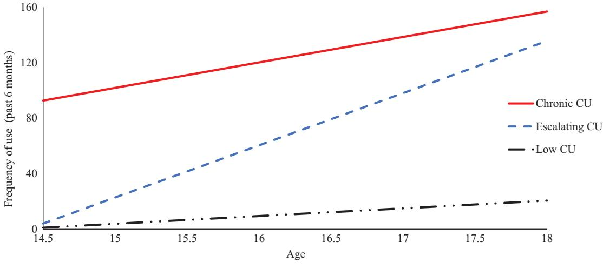

#### ORIGINAL ARTICLE

# Developmental pathways of adolescent cannabis use: Risk factors, outcomes and sex-specific differences

Samuel W. Hawes [,](http://orcid.org/0000-0001-7173-1749) Elisa M. Trucco, Jacqueline C. Duperrouzel, Stefany Coxe, and Raul Gonzalez

Department of Psychology, Center for Children and Families, Florida International University, Miami, Florida, USA

#### ABSTRACT

Background: Characterizing patterns of adolescent cannabis use (CU), as well as risk factors and outcomes uniquely associated with these pathways is essential for informing treatment and prevention efforts. Yet, few studies have examined these issues among youth at-risk of engaging in problematic cannabis use. Further, research accounting for use of other substances or sex differences in patterns of CU remains exceedingly sparse. Methods: Trajectorybased modeling was used to identify underlying CU pathways among a predominantly Hispanic (90%) sample of at-risk youth (n ¼ 401; 46% female) across adolescence (ages-14–18), controlling for baseline substance use and participant demographics. Adolescent psychopathology (i.e., conduct disorder, attention deficit hyperactivity disorder, anxiety, and depression) was examined as a predictor and outcome of CU. Results: Three trajectories of adolescent CU were identified, with most youth (74%) engaging in relatively "low" levels of use, followed by -12% exhibiting an early-initiating "chronic" course, and 14% "escalating" in use. Although boys and girls both experienced increased levels of CU across adolescence, boys were more likely to exhibit escalating and chronic patterns of use. Findings revealed unique associations between adolescent CU pathways and facets of psychopathology; most notably, the relatively robust and bidirectional association between CU trajectories and conduct problem symptoms. Conclusions: Specific facets of psychopathology may confer unique associations with CU across development, including the initiation and exacerbation of CU during adolescence.

## Introduction

A growing body of research demonstrates that cannabis use (CU) promotes risk for a range of maladaptive outcomes (e.g., cognitive impairments, behavioral disinhibition, poor academic performance, mental health problems), particularly among individuals who exhibit an early-onset and persistent pattern of use (Casadio, Fernandes, Murray, & Di Forti, [2011](#page-8-0); Lisdahl & Price, [2012;](#page-9-0) National Academies of Sciences & Medicine, [2017;](#page-10-0) Solowij et al., [2012](#page-10-0)). In addition, youth who engage in problematic levels of CU are at increased risk of juvenile offending and developing a substance abuse or dependence disorder in adulthood (D'Amico, Edelen, Miles, & Morral, [2008\)](#page-8-0). Adolescent youth are particularly vulnerable to the adverse effects of CU (Johnston, O'Malley, Miech, Bachman, & Schulenberg, [2017;](#page-9-0) Rubino et al., [2009;](#page-10-0) Schneider & Koch, [2003;](#page-10-0) Spear, [2010\)](#page-10-0); however, there is some evidence that intervention efforts focused on at-risk youth during this time can be effective (D'Amico, Osilla, & Hunter, [2010](#page-8-0)). This is noteworthy, considering the increased potential for negative long-term outcomes among these at-risk youth. To date however, insight into unique patterns of CU among these youth, as well our understanding of the factors that contribute to these distinct patterns of use, remains remarkably limited. This highlights an important shortcoming of current research, as improving our understanding of the developmental pathways of CU and associated risk markers and outcomes is essential for informing pre-

vention and treatment efforts (D'Amico et al., [2010;](#page-8-0) Johnston, O'Malley, Bachman, & Schulenberg, [2009\)](#page-9-0). There is ample evidence of heterogeneity in pat-

terns of CU across time, including marked variability in the onset, stability, severity, and duration of CU (Homel, Thompson, & Leadbeater, [2014;](#page-9-0) White, Bechtold, Loeber, & Pardini, [2015\)](#page-10-0). Conceptually, youth have been categorized into distinct subgroups of CU, with most either abstaining from or engaging only in low levels of infrequent use. A small contingent of early-onset chronic users initiate use during

CONTACT Samuel W. Hawes samuel.hawes@fiu.edu Department of Psychology, Center for Children and Families, Florida International University, 11200 S.W. 8th Street, AHC-4 Room 434, Miami, Florida 33199, USA.

#### KEYWORDS

Cannabis use; adolescence; externalizing; gender; conduct disorder

early- to mid-adolescence and continue to engage in high levels of CU into early adulthood; while another subset of youth experience a delayed onset of CU but exhibit a precipitous increase in their use across adolescence (Brook, Zhang, & Brook, [2011](#page-8-0); Pardini, Bechtold, Loeber, & White, [2015\)](#page-10-0). Evidence of additional trajectories of adolescent CU have also been found (e.g., "occasional" "desisting" "fling" users; Brook, Lee, Brown, Finch, & Brook, [2011](#page-8-0); Schulenberg et al., [2005\)](#page-10-0), albeit less consistently than the aforementioned patterns of use.

### CU risk factors and outcomes

In addition to delineating patterns of CU, identifying risk factors and outcomes that are uniquely associated with distinct trajectories of use is critical for determining appropriate targets for prevention and intervention efforts. One set of factors that have long been implicated as both a risk factor and outcome of substance use is psychopathology. While research suggests that, on average, the onset of mental disorders begins earlier than that of substance use disorders (Kessler et al., [2005](#page-9-0); Merikangas et al., [1998](#page-9-0)), the reciprocal effects of substance use has also been shown to exacerbate psychopathology (Sloboda, Glantz, & Tarter, [2012](#page-10-0)). Notably, accounts of the underlying processes that contribute to the comorbidity among these processes vary widely, ranging from direct causal mechanisms (e.g., self-medication) to shared etiological factors (e.g., impaired regulatory functioning; Sloboda et al., [2012](#page-10-0)).

To date, a relatively large body of research has documented strong associations between adolescent CU and externalizing symptomology (Oshri, Rogosch, Burnette, & Cicchetti, [2011](#page-10-0)), particularly links to conduct problems (Fergusson, Horwood, & Ridder, [2007\)](#page-9-0) and attention deficit hyperactivity disorder (ADHD; Lee, Humphreys, Flory, Liu, & Glass, [2011\)](#page-9-0). While severe behavioral problems among youth are often considered to be a predisposing risk factor for later CU (Rettew & McKee, [2005](#page-10-0); Wills & Dishion, [2004](#page-10-0)), atypical neurodevelopment (e.g., poor executive functioning) has been shown to underlie both, behavioral regulation and problematic substance use. Similarly, neurobiological deficits linked to negative affect, poor coping skills, and internalizing problems more broadly, have also been associated with CU (de Wit, [2009](#page-8-0); Sloboda et al., [2012](#page-10-0)). However, evidence of these associations has been less consistent than those for CU and externalzing problems. Although some research has shown CU to be related to increased symptoms of anxiety and depression (Kedzior & Laeber, [2014](#page-9-0); Lev-Ran et al., [2014](#page-9-0)), other research has found no evidence of a relationship (Manrique-Garcia, Zammit, Dalman, Hemmingsson, & Allebeck, [2012\)](#page-9-0). Notably, most research to date has only examined patterns of CU and associations between CU and psychopathology via the use of variable-centered approaches; this may mask unique information allotted by the delineation group-based trajectories when using more person-oriented analyses (Scholes-Balog, Hemphill, Evans-Whipp, Toumbourou, & Patton, [2016;](#page-10-0) Sloboda et al., [2012\)](#page-10-0).

#### Sex differences

Few studies have examined sex specific differences in the developmental course of CU and distinctions between boys' and girls' patterns of CU, as well as associated risk factors and outcomes of use are poorly understood (Brady & Randall, [1999](#page-8-0); Walitzer & Dearing, [2006\)](#page-10-0). Some research suggests that differences in neurocognitive maturation, such as the earlier development of regions associated with attention and decision-making among girls, may contribute to sex differences in substance use trajectories (Schulte, Ramo, & Brown, [2009\)](#page-10-0). Other accounts hypothesize that traditional gender roles (e.g., masculinity, nurturance) contribute to differences in male and female patterns of use (Ricciardelli, Connor, Williams, & Young, [2001](#page-10-0); Schulte et al., [2009\)](#page-10-0). In addition, among those studies that have examined sex differences in the course of CU, findings have been equivocal (Bryan, Schmiege, & Magnan, [2012;](#page-8-0) Chen & Jacobson, [2012;](#page-8-0) Mitchell, Novins, & Holmes, [1999\)](#page-9-0). Namely, some studies note few differences in the developmental course of CU across sex (Oshri et al., [2011](#page-10-0)), yet others suggest that girls may evidence higher initial levels of CU (Chen & Jacobson, [2012\)](#page-8-0) and an accelerated early transition into use (Khan et al., [2013\)](#page-9-0). Alternatively, other research suggests that boys exhibit a more precipitous increase in their patterns of substance use during adolescence, particularly during middle to late adolescence (Duncan, Duncan, & Strycker, [2006](#page-8-0); Mitchell et al., [1999](#page-9-0)). These inconclusive and at times conflicting findings underscore the need for longitudinally informed research that delineates these relationships.

#### Current study

Using a cohort-sequential design, this study follows five cohorts of youth across 4 bi-annual assessments to examine patterns of CU during adolescence (ages -14–18). Developmental trajectories of CU are delineated while accounting for baseline substance use, as well as demographic covariates (i.e., sex, ethnicity, intelligence quotient [IQ], and parental education). In addition, CU trajectory associations with internalzing and externalizing psychopathology as risk factors and outcomes are examined, while also testing for sex-related differences and accounting for important covariate and autoregressive influences of baseline psychopathology symptoms.

## Method

#### Design and participants

Data for this study include a community sample of 401 adolescents (46% girls) taking part in an ongoing longitudinal investigation examining the relationship between cannabis use, neurocognitive functioning, and socio-emotional development. Youth were between 14 and 17 years-old (x̅¼15.40, SD ¼0.72) at the time of their initial assessment and were predominantly Hispanic/Latino (90%), reflecting the demographics of the community from which they were recruited. Participants were recruited from the community via strategic placement of recruitment materials and study staff at locations identified as providing high visibility for youth in this age range (e.g., shopping malls, outside high schools, parks, movie theatres). Study incentives increased over time (i.e., Visit 1 – \$100, Visit 5 – \$140) and participants earned a bonus (\$20) for completing all visits. A primary aim of the overall longitudinal investigation was to enroll a large number of youth at-risk of escalating in their cannabis use, but who had a low prevalence of cannabis dependence at the time of their T1 evaluation. In turn, study inclusion criteria consisted of the ability to read and write in English, along with any self-reported use of cannabis, alcohol, or cigarettes, even if only minimal (e.g., a sip of alcohol, puff from a cigarette or joint). In addition, the study sample also included a small subset of youth (10%; n¼ 40) reporting no history of substance use at the time of the T1 assessment.

Study exclusionary criteria included self-reported developmental disorders, neurological conditions, birth complications, history of a significant psychiatric or mood disorder (i.e., received a diagnosis and were either prescribed medication for or underwent therapy in relation to that specific diagnosis), traumatic brain injury or loss of consciousness >10 min, history of significant alcohol or other substance use suggestive of an alcohol use disorder (AUD) or a substance use disorder (SUD), use of other drugs (besides alcohol, cannabis, and nicotine) more than 10 times, use of any other drugs in the 2 weeks prior to assessment, and use of any other drug to an extent greater than their cannabis use. Of the 1183 youth who were screened for this study, 782 were excluded based on these criteria, thus resulting in the final study sample at baseline (N ¼ 401). All study procedures were approved by the Institutional Review Board at Florida International University. Adolescent assent and parental consent were obtained prior to each assessment from participants and/or participant's parent/guardian.

A primary aim of the overall longitudinal investigation was to enroll a large number of youth who had experimented with cannabis, but who had a low prevalence of cannabis dependence and other illicit drug use at the time of their initial evaluation. Inclusion criteria consisted of the ability to read and write in English, and exposure to either alcohol, cigarettes, or cannabis (even if only minimal), although a subset of participants (-10%) with no substance use at baseline were included in the study. Exclusion criteria included self-reported developmental disorders, neurological conditions, birth complications, history of a significant psychiatric mood or thought disorder (i.e., received a diagnosis and were either prescribed medication for or underwent therapy in relation to that specific diagnosis), traumatic brain injury or loss of consciousness >10 min, history of significant alcohol or other substance use suggestive of an AUD or a SUD, use of other drugs (besides alcohol, cannabis, and nicotine) more than 10 times, use of any other drugs in the 2 weeks prior to assessment, and use of any other drug to an extent greater than their CU. All study procedures were approved by the Institutional Review Board at Florida International University. Adolescent assent and parental consent were obtained prior to each assessment from participants and/or participant's parent/guardian. Additional information on sample characteristics are provided in [Table 1.](#page-3-0)

A cohort-sequential design was employed, allowing for adjacent segments of longitudinal data to be linked across different age cohorts in the estimation of a common developmental trajectory (Baltes, Cornelius, & Nesselroade, [1979](#page-8-0); Duncan et al., [2006](#page-8-0)). CU data were collected at four bi-annual assessments across a 2-year period among five temporally overlapping age cohorts (N ¼ 48 14.5-years-old; N ¼ 64 15-years-old; N ¼ 82 15.5-years-old; N ¼ 104 16-years-old; N ¼ 103 16.5-years-old). Linking data across cohorts allowed for examining a longer window of adolescent development, spanning from ages -14–18 (Chen & Jacobson,

# Table 1. Participant characteristics by assessment wave.

|                                        |                | Assessment wave |            |            |             |
|----------------------------------------|----------------|-----------------|------------|------------|-------------|
|                                        | T1             | T2              | T3         | T4         | T5          |
| Demographics                           |                |                 |            |            |             |
| Age (M, SD)                            | 15.40 (.72)    |                 |            |            |             |
| Sex (% male)                           | 54%            |                 |            |            |             |
| Ethnicity/Race (% Hispanic)            | 89.6%          |                 |            |            |             |
| Years of education (M, SD)             | 9.1 (.84)      |                 |            |            |             |
| Years of maternal education (M, SD)    | 14.23 (2.49)   |                 |            |            |             |
| Years of paternal education (M, SD)    | 13.77 (2.89)   |                 |            |            |             |
| WRAT-4 Reading Standard Score (M, SD)  | 108.31 (14.73) |                 |            |            |             |
| Substance use (past 6 months)          |                |                 |            |            |             |
| Cannabis (days of use; Md [IQR])       | 6 [0, 30]      | 7 [0, 48]       | 10 [0, 75] | 10 [0, 90] |             |
| Alcohol (days of use ; Md [IQR])       | 1 [0, 5]       | 2 [0, 8]        | 3 [1, 9]   | 4 [0, 13]  |             |
| Tobacco (days of use; Md [IQR])        | 0 [0, 1]       | 0 [0, 0]        | 0 [0, 1]   | 0 [0, 1]   |             |
| Current cannabis abuse diagnosis (%)   | 10%            | 9%              | 14%        | 14%        |             |
| Current alcohol abuse diagnosis (%)    | 1%             | 3%              | 2%         | 2%         |             |
| Current other drug abuse diagnosis (%) | <1%            | <1%             | <1%        | <1%        |             |
| Mental health (M, SD)                  |                |                 |            |            |             |
| Conduct Problems (# of symptoms)       | 5.05 (4.09)    |                 |            |            | 4.49 (3.83) |
| ADHD (# of symptoms)                   | 5.96 (4.64)    |                 |            |            | 3.05 (3.35) |
| Anxiety (# of symptoms)                | 3.59 (3.00)    |                 |            |            | 2.06 (1.86) |
| Depression (# of symptoms)             | 6.95 (4.81)    |                 |            |            | 4.21 (4.07) |

Notes: For substance use diagnoses, "Current" refers to "within the past month". Mental health "# of symptoms" based on CDISC-IV.

[2012](#page-8-0); Duncan et al., [2006\)](#page-8-0). For study analyses, data were restructured into wide format (i.e., phase-to-age). Prior research has shown linking participants' ages and substance use levels via a cohort-sequential design to be ideal for investigating developmental patterns of substance (Chen & Jacobson, [2012](#page-8-0); Duncan et al., [2006](#page-8-0)).

#### Measures

Cannabis use (CU). The Drug-Use History Questionnaire (DUHQ; Gonzalez et al., [2004](#page-9-0); Rippeth et al., [2004\)](#page-10-0) was used to assess participants' frequency of CU during the past 6 months (i.e., number of days used). The DUHQ is a semi-structured interview that uses the time-line followback procedure to obtain selfreported frequency and quantity of use across 15 different classes of substances during a participant's lifetime, the past 6 months, and the past 30 days. This measure has demonstrated evidence supporting its validity in assessing drug use history for a range of substances across both adolescent (Gonzalez et al., [2012\)](#page-9-0) and adult samples (Gonzalez et al., [2012;](#page-9-0) Rippeth et al., [2004](#page-10-0)). In the present study, CU was assessed at four consecutive 6-month follow-up assessments beginning at participant's initial evaluation. Additional information for this measure is provided in Table 1.

### Adolescent psychopathology

The Computerized Diagnostic Interview Schedule for Children, Version IV (CDISC-IV; Shaffer, Fisher, Lucas, Dulcan, & Schwab-Stone, [2000](#page-10-0)) was administered to assess symptoms of youth psychopathology (i.e., conduct disorder, oppositional defiant disorder, ADHD, generalized anxiety disorder, and depression). The CDISC-IV is a structured interview that uses a series of standardized probes and follow-up questions to gather information about DSM-IV disorder symptoms. CDISC data used in this study was collected at the time of participant's baseline evaluation (i.e., study predictors) and at an additional assessment that took place 6 months following participant's final assessment for CU (i.e., study outcomes). Each category of psychopathology was scored based on the "total number of symptoms endorsed."

#### Adolescent psychopathology

Alcohol, tobacco, and other drug use The Drug-Use History Questionnaire (DUHQ; Gonzalez et al., [2004](#page-9-0); Rippeth et al., [2004](#page-10-0)) was also used to assess and control for baseline alcohol, tobacco, and other drug use, using the same scoring criteria as used to delineate trajectories of CU. For "tobacco" and "other drug" use, a binary variable was created to indicate whether participants did (tobacco – 38%; other drugs – 35%) or did not (tobacco – 62%; other drugs – 65%) report any use of these substances across assessments.

#### Adolescent psychopathology

Participant characteristics In addition to demographic variables of sex and race/ethnicity, we also controlled for parental education (i.e., maternal and paternal years of education) and participant's scores on the reading subsection of the Wide Range Achievement Test 4 (WRAT-4; Wilkinson & Robertson, [2006](#page-10-0)) which was used as a measure of general intelligence.

#### Data analysis plan

Latent class growth analysis (LCGA; Jung & Wickrama, [2008\)](#page-9-0) was used to delineate trajectories of CU. Prior to delineating CU trajectories, study data was structured into wide format (i.e., phase-to-age) so that CU was modeled across participant's age, rather than assessment phase. Thus, while each study participant only contributed data at four assessment waves, this design allowed for CU to be modeled across nine age points, from ages 14.5 to 18.5-years-old. As this approach is based on the assumption that cohort effects do not influence the data (Preacher, Wichman, Briggs, & MacCallum, [2008\)](#page-10-0), initial analyses were conducted to assess for any such cohort effects. More specifically, a multiple-group multiple-cohort latent growth model of CU was specified using Mplus 7.2 (Muthen & Muthen, [1998](#page-10-0)–2012) and invariance testing was conducted to determine whether or not there were any cohort differences in the growth model parameters (i.e., residual variances and intercept and slope means, variances, and covariance). These results revealed no significant differences across these model parameters, indicating that a common underlying trajectory of CU can be modeled across all ages included in this study design.

LCGA trajectories of CU were estimated from a series of one- to four-class models. Participant's sex was included as a covariate in these models to examine the effect of sex on CU class membership. Other covariates include ethnicity, intelligence, and baseline substance use. Models were estimated using full information maximum likelihood estimation with standard errors and a chi-square statistic that is robust to nonnormality. Model fit was assessed according to entropy values (Muthen, [2004\)](#page-10-0) and parsimony indices including the Bayesian Information Criterion (Schwarz, [1978](#page-10-0)) and the Bootstrapped Likelihood Ratio Test Feng (BLRT; Feng & McCulloch, [1996](#page-9-0)). Identification of the best fitting model was based on interpretability, parsimony, and theoretical justification. All analyses were conducted using Mplus 7.2 (Muthen & Muthen, 1998–[2012\)](#page-10-0).

### CU trajectory predictors and outcomes

To examine psychopathology as a predictor and outcome of CU trajectory group status, we implemented a recently developed three-step approach for modeling auxiliary variables (Asparouhov & Muthen, [2014](#page-8-0)). This procedure first estimates trajectories without the predictor or outcome included in the model. In two subsequent sets of analyses, we examined (1) baseline psychopathology as a predictor of CU trajectory group membership and (2) CU trajectory group membership as a predictor of psychopathology at the final assessment wave (which occurred 6-months after the final assessment of CU). When examined as a distal outcome variable, CDISC scores were treated having unequal means and variances across the CU trajectory groups (via the DU3STEP command in MPlus; Asparouhov & Muthen, [2014](#page-8-0)). This approach computes an overall test of association using Wald's test, as well as pairwise class comparisons between the CDISC score means and probabilities (Asparouhov & Muthen, [2014](#page-8-0)). These analyses accounted for covariate effects (e.g., participant demographics, baseline substance use), including controlling for psychopathology symptoms assessed at baseline when predicting study outcomes. Importantly, the three-step method statistically accounts for classification uncertainty in individuals' trajectory group assignments by using class membership probabilities, leading to reduced bias in model parameter estimates and standard errors when contrasted with other commonly used approaches (e.g., "hard" classification of cases).

#### Missing data

All study participants (N ¼ 401) provided complete data at the time of their initial evaluation and retention rates across follow-up assessments remained high (94–98%). In addition, full information maximum likelihood (FIML) estimates were used to handle missing data, as this procedure uses all available data points to construct parameter estimates under the assumption that the data are missing at random. No differences were found for any study variable when comparing between participants having complete data and those missing data for any assessment. In addition, even when data are not missing at random, FIML estimation tends to produce less biased estimates than more traditional techniques for handling missing data (Enders & Bandalos, [2001\)](#page-9-0).

## Results

### Trajectories of CU

LCGA trajectories of CU were explored in a step-wise fashion, beginning with a conventional single class solution and ending with a four-class solution, with all models controlling for study covariates (e.g., participant demographics, baseline substance use). Based on substantive interpretation, parsimony, and fit, a threeclass model of adolescent CU was identified as

Table 2. Model fit of cannabis use trajectories.

|             | BIC      | Entropy | BLRT |
|-------------|----------|---------|------|
| Two-class   | 14498.25 | 0.96    | 0.00 |
| Three-class | 14329.39 | 0.93    | 0.00 |
| Four-class  | 14246.29 | 0.91    | 0.00 |

Abbreviations: BIC, sample size adjusted Bayesian information criterion; BLRT, bootstrapped likelihood ratio.

providing the best overall solution (see Table 2). Although a four-class model was also considered, two of these four trajectory groups, were relatively small (<10% and <5% of total N) and class groupings appeared to be largely captured by the more parsimonious, three-class solution. For the three-class model (see [Figure 1](#page-6-0)), the total sample size for each of the classes exceeded 10% of the total sample, and the trajectories were similar to those observed in prior research (Flory, Lynam, Milich, Leukefeld, & Clayton, [2004](#page-9-0)). The first class, with 53 participants (13%), displayed chronically high levels of CU, which were characterized by high initial levels of use that remained persistent across assessments ("chronic"). The second class included 71 participants (18%) and showed initially low levels of CU that escalated across development ("escalating"). The third class included 272 participants (69%) and these individuals demonstrated consistently low levels of CU across the study period ("low"). Model estimated means for CU by trajectory group are presented in [Table 3](#page-6-0).

#### CU trajectory sex differences

Further investigation of the LCGA model revealed that participant's sex exhibited a significant influence CU trajectory group membership. These results showed that boys were significantly more likely than girls to be in the chronic (B ¼ 1.34, SE ¼ 0.45, e B ¼ 3.81, p<.01) or escalating (B ¼ 1.70, SE ¼ 0.42, e B¼ 5.47, p<.001) CU groups (relative to the low CU group). However, there was no significant effect of sex on participant's likelihood of being in the escalating CU trajectory relative to the chronic CU trajectory (B ¼ 0.36, SE ¼ 0.59, e B¼ 1.43, p ¼ .53). The only additional significant covariate effect identified was that participants who endorsed use of "other drugs" were significantly more likely to follow a chronic (B ¼ 2.87, SE ¼ 0.46, e B¼ 17.63, p<.001) or escalating (B ¼ 2.60, SE ¼ 0.37, e B¼ 13.46, p<.001) CU pathway, relative to the low CU trajectory.

#### CU trajectories predictors and outcomes

After delineating trajectories of CU, we turned our focus toward examining predictors and outcomes associated with these trajectories. For study predictors, odds ratios indicate the relative odds of belonging to one CU trajectory group as compared to another, per one-unit increase in scores on the predictor variable (see [Table 4](#page-7-0)). Findings revealed that of the facets of psychopathology examined in this study, antecedent conduct problem symptoms best delineated youth's patterns of CU. More specifically, a one symptom increase in conduct problems at T1 was associated with an approximate 30% increase in the log odds of belonging to either the chronic or escalating trajectory groups, compared to being in the low CU trajectory (B ¼ 0.29 and B ¼ 0.28, respectively). There was also some evidence to suggest that increased symptoms of ADHD and depression may also distinguish among these CU subgroups, although the magnitude of these effects were less consistent.

A similar pattern of associations were found for the relationship between CU trajectory groups and prospectively assessed study outcomes. These analyses revealed that youth in the chronic and escalating trajectories endorsed significantly more conduct problem symptoms than those in the low CU group (see [Table 5](#page-7-0)). Notably, conduct problems did not distinguish between the chronic and escalating trajectories groups when assessed either as an antecedent predictor or as a prospective outcome. Across the overall study sample there was no evidence to suggest that CU trajectory group status was associated with the ADHD, anxiety, or depression outcomes.

## Discussion

This study sought to characterize adolescents' patterns of CU and improve upon our limited knowledge of the early risk factors and outcomes associated with diverging pathways of CU. To this end, we identified three distinct developmental trajectories of CU among a sample of youth at-risk for early initiation and escalation of substance use – a group for whom achieving a better understanding of these issues is markedly important. Findings suggest that early markers of psychopathology, particularly conduct problem symptoms, may confer unique risks toward the onset and exacerbation of CU during adolescence and that CU may exhibit a reciprocal influence on subsequent conduct problem behaviors. Moreover, these results indicate that boys are more likely to follow a chronic or escalating course of CU during adolescence compared to girls. Given that adolescence marks a critical period of development during which youth are thought to be markedly vulnerable to the effects of substance use

Figure 1. Cannabis use trajectories plots.

Table 3. Cannabis use frequency model estimated means by trajectory group membership.

|              |                |       |        | Age    |        |        |        |        |        |
|--------------|----------------|-------|--------|--------|--------|--------|--------|--------|--------|
| Trajectories | % Total sample | 14.5  | 15     | 15.5   | 16     | 16.5   | 17     | 17.5   | 18     |
| Low          | 69%            | 1.01  | 3.31   | 5.61   | 7.91   | 10.20  | 12.50  | 14.80  | 17.10  |
| Escalating   | 18%            | 7.02  | 22.31  | 37.60  | 52.89  | 68.18  | 83.46  | 98.75  | 114.04 |
| Chronic      | 13%            | 90.81 | 100.14 | 109.46 | 118.79 | 128.12 | 137.45 | 146.77 | 156.10 |

Note: Cannabis use frequency refers to days of use in the past 6 months (see measures section). Abbreviation: ADHD, attention deficit hyperactivity disorder.

(Clark, Thatcher, & Tapert, [2008](#page-8-0); Squeglia, Jacobus, & Tapert, [2009\)](#page-10-0), findings from this study have important implications for programs focused on attenuating and preventing negative outcomes linked to adolescent CU.

Individual differences in participant's patterns of CU were characterized after accounting for baseline substance use and important participant characteristics (i.e., sex, ethnicity, IQ, parental education). Patterns of adolescent CU delineated in this study were consistent with patterns of use identified in prior works (e.g., Homel et al., [2014;](#page-9-0) White et al., [2015](#page-10-0)). At the time of the initial assessment, most youth in this study (74%) reported engaging in low levels of use and the vast majority continued along this "low use" trajectory throughout the study. However, approximately 14% adolescents in the current sample experienced a precipitous increase in their level of CU during the course of this study. Prior work identifying a similar group of "escalating" users indicates that these individuals often continue using into adulthood (e.g., Pardini et al., [2015\)](#page-10-0). Moreover, the proportion of participants exhibiting this trajectory coincides with previously reported rates of "conditional dependence" for cannabis: that is, the proportion of individuals that develop dependence at some point after trying the drug (Anthony, Warner, & Kessler, [1994;](#page-8-0) Lopez-Quintero & Anthony, [2015](#page-9-0)). In addition, and paralleling findings from prior research, we also observed a small subset of youth who demonstrated relatively high levels of use consistently throughout the course of the study. Prior studies indicate that these youth are at increased risk for continued heavy use as adults and that they have a greater likelihood of experiencing a number of negative outcomes in adulthood (e.g., criminality, poor health) as compared to other cannabis user subgroups (Bechtold, Simpson, White, & Pardini, [2015;](#page-8-0) Pardini et al., [2015;](#page-10-0) Tucker, Ellickson, Orlando, Martino, & Klein, [2005](#page-10-0)). In contrast to several other studies (Brook, Lee, et al., [2011;](#page-8-0) Brook, Zhang, et al., [2011](#page-8-0)), we did not find evidence for a group of cannabis users whose use dissipated across the study period. It is important to note that prior work demonstrates that CU generally peaks at age 18 and declines during the early- to mid-20s (Chen & Jacobson, [2012](#page-8-0); Homel et al., [2014;](#page-9-0) Schulenberg et al., [2005](#page-10-0)). Thus, considering the follow-up window of this study it may be that a "desisting" group would be revealed if assessments continued into early adulthood.

An investigation of sex differences across CU trajectories indicated that boys were more likely follow a chronic or escalating course of CU across adolescence. Although this may appear to contrast to some degree with Chen & Jacobson ([2012](#page-8-0)) finding that girls exhibit higher initial levels of CU than boys, it is important

Table 4. Psychopathology risk factors predicting cannabis use trajectories.

| Predictors                | B(SE)       |  |  |  |  |
|---------------------------|-------------|--|--|--|--|
| Conduct problems          |             |  |  |  |  |
| Chronic vs. low CU        | 0.28 (0.04) |  |  |  |  |
| Escalating vs. low CU     | 0.29 (0.04) |  |  |  |  |
| Chronic vs. escalating CU | 0.01 (0.03) |  |  |  |  |
| ADHD                      |             |  |  |  |  |
| Chronic vs. low CU        | 0.08 (0.03) |  |  |  |  |
| Escalating vs. low CU     | 0.05 (0.03) |  |  |  |  |
| Chronic vs. escalating CU | 0.02 (0.03) |  |  |  |  |
| Anxiety                   |             |  |  |  |  |
| Chronic vs. low CU        | 0.02 (0.06) |  |  |  |  |
| Escalating vs. low CU     | 0.06 (0.05) |  |  |  |  |
| Chronic vs. escalating CU | 0.08 (0.07) |  |  |  |  |
| Depression                |             |  |  |  |  |
| Chronic vs. low CU        | 0.07 (0.02) |  |  |  |  |
| Escalating vs. low CU     | 0.05 (0.03) |  |  |  |  |
| Chronic vs. escalating CU | 0.01 (0.03) |  |  |  |  |

Note: Regression coefficients derived from multinomial regression estimates using the Mplus manual three-step approach. First CU trajectory group listed for each comparison serves as the reference group. p < .05. p < .001.

to note the differences in "age at initial assessment" for these two studies. More specifically, Chen et al. found higher levels of CU among girls when assessed at age 12, however from age 15 (closer to age when CU was initially assessed in this study) onward, boys demonstrated higher levels of use in their study.

Examining symptoms of psychopathology as risk markers and outcomes that differentiate between youths' patterns of CU revealed the most consistent and robust effects were associated with heightened conduct problem symptoms. This coincides with other studies that have provided evidence of strong concurrent (Schepis et al., [2011\)](#page-10-0) and prospective (Korhonen et al., [2010;](#page-9-0) Maslowsky, Schulenberg, & Zucker, [2014\)](#page-9-0) associations between conduct problems and adolescent substance use. As youth often begin engaging in problem behaviors prior to the initiation of substance use (Merikangas et al., [2010](#page-9-0); Swendsen et al., [2010\)](#page-10-0), there is some indication that core underlying features often found among conduct disordered youth (e.g., impulsiveness, rule-breaking), may also influence the onset and escalation of substance use (Lejuez et al., [2010](#page-9-0); MacPherson, Magidson, Reynolds, Kahler, & Lejuez, [2010](#page-9-0)). Findings from this study offer some suggestion that conduct problems act as a more global risk marker of CU, as they were similarly associated with both early and later onset of CU, rather than acting as a unique risk marker paired to a specific pathway of high CU. In turn, targeting factors commonly found in conduct problem youth (e.g., impulsivity, aggression, and rule-breaking), particularly those youth thought to be at-risk for future CU problems, may be an important goal for early prevention efforts. Yet, it should also be noted that the relationship between

Table 5. Mean differences on psychopathology outcomes across trajectory groups.

| Outcomes                               | M (SE)                                |
|----------------------------------------|---------------------------------------|
| Conduct problems                       |                                       |
| Chronic                                | 6.74 (0.75)a                          |
| Escalating                             | 7.34 (0.66)a                          |
| Low                                    | 3.06 (0.30)b                          |
| Mean difference (between trajectories) | v2 ¼ 42.51, df ¼ 2, p < .001 |
| ADHD                                   |                                       |
| Chronic                                | 4.03 (0.71)a                          |
| Escalating                             | 3.19 (0.49)a                          |
| Low                                    | 2.76 (0.28)a                          |
| Mean difference (between trajectories) | v2 ¼ 2.95, df ¼ 2, p ¼ .23   |
| Anxiety                                |                                       |
| Chronic                                | 1.96 (0.31)a                          |
| Escalating                             | 2.04 (0.29)a                          |
| Low                                    | 2.09 (0.16)a                          |
| Mean difference (between trajectories) | v2 ¼ 0.12, df ¼ 2, p ¼ .94   |
| Depression                             |                                       |
| Chronic                                | 4.87 (0.83)a                          |
| Escalating                             | 4.95 (0.70)a                          |
| Low                                    | 3.81 (0.34)a                          |
| Mean difference (between trajectories) | v2 ¼ 2.79, df ¼ 2, p ¼ .25   |

Notes: Subscripts indicate which subgroup means are significantly different from each other for overall sample comparison of trajectory classes based on pairwise comparisons at p<.05.

conduct problems and substance use remains complex, undoubtedly consisting of a number of other reciprocal, bidirectional, and third variable influences.

#### Strengths and limitations

Strengths of this study include the use of a relatively large sample of at-risk youth who were followed longitudinally during the critical period of adolescent development. The use of trajectory-based modeling to investigate developmental subpopulations, together with controlling for important participant characteristics, the influence of baseline substance use, and autoregressive effects of psychopathology at the initial assessment in the prediction of outcomes provides a strict model for examining patterns of adolescent CU. In addition, the use of a three-step method to reduce error when modeling auxiliary variables further enhances the rigor of the study design. However, study findings should also be interpreted within the context of several limitations. For instance, this study primarily consisted of Hispanic youth and findings may not generalize well to non-Hispanic populations or different developmental periods; though we have no theoretical reasons to suspect the former. Youth enrolled in this study exhibited diverse levels of cannabis use at the time of their baseline evaluation, but did not meet criteria for dependence. While it is possible that this may effect the generalizability of the CU trajectories delineated in this study, we do note that the patterns identified here are consistent with prior research in this area (e.g., Flory et al., [2004](#page-9-0); Homel et al., [2014](#page-9-0); White et al., [2015\)](#page-10-0). In addition, a small subset of youth screened for inclusion into this study (<4%) reporting having been diagnosed with major depression or an anxiety disorder and reported undergoing treatment (i.e., medication or therapy) for that diagnosis and as a result were excluded. Although this base rate is relatively small, it is possible that this exclusion criteria may have attenuated some associations between CU and these facets of psychopathology. Also trajectories of CU were delineated based on participant's frequency of use and therefore, other factors that may be important for understanding developmental patterns of CU were not taken into account (e.g., mode of administration, potency, quality, quantity, or type of cannabis).

#### Clinical implications and future directions

Delineating developmental pathways of CU, along with risk factors and outcomes associated with these patterns of use is essential for informing treatment and prevention efforts. Research that focuses on these issues during key points of development and within at-risk samples can enhance the ecological validity of study results, a particularly critical component for improving targeted interventions. This study offers several important insights into the etiology and outcomes associated with developmental patterns of CU, as well as important sex differences. First, even among a sample of youth at heightened risk for engaging in problematic CU, we found marked heterogeneity in their levels of use during adolescence. This provides further support for the idea that this period of development represents a time in which individuals undergo pronounced changes in their use of cannabis, which in turn may represent an important window for intervention. Additionally, these findings suggest that early efforts to treat conduct disorder symptoms may also reduce risk for engaging in problematic CU at later periods. Similarly, higher levels of adolescent CU were also associated with subsequent increases in conduct problems. Thus, treatments focused on reducing CU, particularly among high risk youth, may also serve to attenuate these problem behaviors over time. These remain important avenues of investigation for future studies.

## ORCID

Samuel W. Hawes http://orcid.org/0000-0001-7173-1749

## References

Anthony, J. C., Warner, L. A., & Kessler, R. C. [\(1994\)](#page-6-0). Comparative epidemiology of dependence on tobacco, alcohol, controlled substances, and inhalants: Basic findings from the National Comorbidity Survey. Experimental and Clinical Psychopharmacology, 2(3), 244.

- Asparouhov, T., & Muthen, B. ([2014\)](#page-4-0). Auxiliary variables in mixture modeling: Three-step approaches using M plus. Structural Equation Modeling: A Multidisciplinary Journal, 21(3), 329–341.
- Baltes, P. B., Cornelius, S. W., & Nesselroade, J. R. ([1979\)](#page-2-0). Cohort effects in developmental psychology. In J. R. Nesselroade & P. B. Baltes (Eds.), Longitudinal Research in the Study of Behavior and Development. New York, NY: Academic Press.
- Bechtold, J., Simpson, T., White, H. R., & Pardini, D. [\(2015\)](#page-6-0). Chronic adolescent marijuana use as a risk factor for physical and mental health problems in young adult men. Psychology of Addictive Behaviors, 29(3), 552–563.
- Brady, K. T., & Randall, C. L. [\(1999](#page-1-0)). Gender differences in substance use disorders. The Psychiatric Clinics of North America, 22(2), 241–252.
- Brook, J. S., Lee, J. Y., Brown, E. N., Finch, S. J., & Brook, D. W. ([2011\)](#page-1-0). Developmental trajectories of marijuana use from adolescence to adulthood: Personality and social role outcomes. Psychological Reports, 108(2), 339–357. doi:[10.2466/10.18.Pr0.108.2.339-357](https://doi.org/10.2466/10.18.Pr0.108.2.339-357)
- Brook, J. S., Zhang, C. S., & Brook, D. W. ([2011\)](#page-1-0). Developmental trajectories of marijuana use from adolescence to adulthood: Personal predictors. Archives of Pediatrics & Adolescent Medicine, 165(1), 55–60.
- Bryan, A. D., Schmiege, S. J., & Magnan, R. E. ([2012\)](#page-1-0). Marijuana use and risky sexual behavior among high-risk adolescents: Trajectories, risk factors, and event-level relationships. Developmental Psychology, 48(5), 1429.
- Casadio, P., Fernandes, C., Murray, R. M., & Di Forti, M. [\(2011\)](#page-0-0). Cannabis use in young people: The risk for schizophrenia. Neuroscience and Biobehavioral Reviews, 35(8), 1779–1787.
- Chen, P., & Jacobson, K. C. [\(2012\)](#page-1-0). Developmental trajectories of substance use from early adolescence to young adulthood: Gender and racial/ethnic differences. Journal of Adolescent Health, 50(2), 154–163.
- Clark, D. B., Thatcher, D. L., & Tapert, S. F. ([2008\)](#page-6-0). Alcohol, psychological dysregulation, and adolescent brain development. Alcoholism: Clinical and Experimental Research, 32(3), 375–385. doi:ACER601 [pii] 10.1111/ j.1530-0277.2007.00601.x
- D'Amico, E. J., Osilla, K. C., & Hunter, S. B. ([2010\)](#page-0-0). Developing a group motivational interviewing intervention for adolescents at-risk for developing an alcohol or drug use disorder. Alcoholism Treatment Quarterly, 28(4), 417–436.
- D'Amico, E. J., Edelen, M. O., Miles, J. N., & Morral, A. R. [\(2008\)](#page-0-0). The longitudinal association between substance use and delinquency among high-risk youth. Drug and Alcohol Dependence, 93(1-2), 85–92.
- de Wit, H. ([2009\)](#page-1-0). Impulsivity as a determinant and consequence of drug use: A review of underlying processes. Addiction Biology, 14(1), 22–31. doi[:10.1111/j.1369-](https://doi.org/10.1111/j.1369-1600.2008.00129.x) [1600.2008.00129.x](https://doi.org/10.1111/j.1369-1600.2008.00129.x)
- Duncan, S. C., Duncan, T. E., & Strycker, L. A. ([2006\)](#page-1-0). Alcohol use from ages 9 to 16: A cohort-sequential latent growth model. Drug and Alcohol Dependence, 81(1), 71–81.
- Enders, C. K., & Bandalos, D. L. ([2001](#page-4-0)). The relative performance of full information maximum likelihood estimation for missing data in structural equation models. Structural Equation Modeling: A Multidisciplinary Journal, 8(3), 430–457.
- Feng, Z. D., & McCulloch, C. E. ([1996](#page-4-0)). Using bootstrap likelihood ratios in finite mixture models. Journal of the Royal Statistical Society. Series B (Methodological), 58, 609–617.
- Fergusson, D. M., Horwood, L. J., & Ridder, E. M. ([2007](#page-1-0)). Conduct and attentional problems in childhood and adolescence and later substance use, abuse and dependence: Results of a 25-year longitudinal study. Drug and Alcohol Dependence, 88, S14–S26.
- Flory, K., Lynam, D., Milich, R., Leukefeld, C., & Clayton, R. ([2004](#page-5-0)). Early adolescent through young adult alcohol and marijuana use trajectories: Early predictors, young adult outcomes, and predictive utility. Development and Psychopathology, 16(01), 193–213.
- Gonzalez, R., Rippeth, J. D., Carey, C. L., Heaton, R. K., Moore, D. J., Schweinsburg, B. C., … Grant, I. ([2004](#page-3-0)). Neurocognitive performance of methamphetamine users discordant for history of marijuana exposure. Drug and Alcohol Dependence, 76(2), 181–190.
- Gonzalez, R., Schuster, R. M., Mermelstein, R. J., Vassileva, J., Martin, E. M., & Diviak, K. R. ([2012\)](#page-3-0). Performance of young adult cannabis users on neurocognitive measures of impulsive behavior and their relationship to symptoms of cannabis use disorders. Journal of Clinical and Experimental Neuropsychology, 34(9), 962–976.
- Homel, J., Thompson, K., & Leadbeater, B. ([2014](#page-0-0)). Trajectories of marijuana use in youth ages 15–25: Implications for postsecondary education experiences. Journal of Studies on Alcohol and Drugs, 75(4), 674–683.
- Johnston, L. D., O'Malley, P. M., Bachman, J. G., & Schulenberg, J. E. [\(2009](#page-0-0)). Monitoring the future national results on adolescent drug use: overview of key findings, 2008. Bethesda, MD: National Institute on Drug Abuse.
- Johnston, L. D., O'Malley, P. M., Miech, R. A., Bachman, J. G., & Schulenberg, J. E. [\(2017](#page-0-0)). Monitoring the Future national survey results on drug use, 1975-2016: Overview, key findings on adolescent drug use. Ann Arbor: Institute for Social Research, The University of Michigan, 113 pp.
- Jung, T., & Wickrama, K. A. S. [\(2008](#page-4-0)). An introduction to latent class growth analysis and growth mixture modeling. Social and Personality Psychology Compass, 2(1), 302.
- Kedzior, K. K., & Laeber, L. T. ([2014](#page-1-0)). A positive association between anxiety disorders and cannabis use or cannabis use disorders in the general population-a metaanalysis of 31 studies. BMC Psychiatry, 14(1), 136
- Kessler, R. C., Berglund, P., Demler, O., Jin, R., Merikangas, K. R., & Walters, E. E. [\(2005](#page-1-0)). Lifetime prevalence and age-of-onset distributions of DSM-IV disorders in the National Comorbidity Survey Replication. Archives of General Psychiatry, 62(6), 593–602.
- Khan, S. S., Secades-Villa, R., Okuda, M., Wang, S., Perez-Fuentes, G., Kerridge, B. T., & Blanco, C. ([2013\)](#page-1-0). Gender differences in cannabis use disorders: Results from the National Epidemiologic Survey of Alcohol and Related Conditions. Drug and Alcohol Dependence, 130(1-3), 101–108.
- Korhonen, T., van Leeuwen, A. P., Reijneveld, S. A., Ormel, J., Verhulst, F. C., & Huizink, A. C. ([2010\)](#page-7-0). Externalizing behavior problems and cigarette smoking as predictors of cannabis use: The TRAILS study. Journal of the American Academy of Child and Adolescent Psychiatry, 49(1), 61–69.
- Lee, S. S., Humphreys, K. L., Flory, K., Liu, R., & Glass, K. ([2011\)](#page-1-0). Prospective association of childhood attentiondeficit/hyperactivity disorder (ADHD) and substance use and abuse/dependence: A meta-analytic review. Clinical Psychology Review, 31(3), 328–341.
- Lejuez, C., Magidson, J. F., Mitchell, S. H., Sinha, R., Stevens, M. C., & De Wit, H. [\(2010](#page-7-0)). Behavioral and biological indicators of impulsivity in the development of alcohol use, problems, and disorders. Alcoholism: Clinical and Experimental Research, 34(8), 1334–1345.
- Lev-Ran, S., Roerecke, M., Le Foll, B., George, T., McKenzie, K., & Rehm, J. [\(2014](#page-1-0)). The association between cannabis use and depression: A systematic review and meta-analysis of longitudinal studies. Psychological Medicine, 44(04), 797–810.
- Lisdahl, K. M., & Price, J. S. ([2012\)](#page-0-0). Increased marijuana use and gender predict poorer cognitive functioning in adolescents and emerging adults. Journal of the International Neuropsychological Society, 18(04), 678–688.
- Lopez-Quintero, C., & Anthony, J. C. [\(2015\)](#page-6-0). Drug use disorders in the polydrug context: New epidemiological evidence from a foodborne outbreak approach. Annals of the New York Academy of Sciences, 1349(1), 119–126.
- MacPherson, L., Magidson, J. F., Reynolds, E. K., Kahler, C. W., & Lejuez, C. W. ([2010\)](#page-7-0). Changes in sensation seeking and risk-taking propensity predict increases in alcohol use among early adolescents. Alcoholism: Clinical and Experimental Research, 34(8), 1400–1408. doi: 10.1111/j.1530-0277.2010.01223.x
- Manrique-Garcia, E., Zammit, S., Dalman, C., Hemmingsson, T., & Allebeck, P. ([2012](#page-1-0)). Cannabis use and depression: A longitudinal study of a national cohort of Swedish conscripts. BMC Psychiatry, 12(1), 112.
- Maslowsky, J., Schulenberg, J. E., & Zucker, R. A. ([2014](#page-7-0)). Influence of conduct problems and depressive symptomatology on adolescent substance use: Developmentally proximal versus distal effects. Developmental Psychology, 50(4), 1179.
- Merikangas, K. R., He, J-P., Burstein, M., Swanson, S. A., Avenevoli, S., Cui, L., … Swendsen, J. ([2010\)](#page-7-0). Lifetime prevalence of mental disorders in US adolescents: Results from the National Comorbidity Survey Replication–Adolescent Supplement (NCS-A). Journal of the American Academy of Child and Adolescent Psychiatry, 49(10), 980–989.
- Merikangas, K. R., Mehta, R. L., Molnar, B. E., Walters, E. E., Swendsen, J. D., Aguilar-Gaziola, S., … Kessler, R. C. [\(1998](#page-1-0)). Comorbidity of substance use disorders with mood and anxiety disorders: Results of the International Consortium in Psychiatric Epidemiology. Addictive Behaviors, 23(6), 893–907.
- Mitchell, C. M., Novins, D. K., & Holmes, T. ([1999](#page-1-0)). Marijuana use among American Indian adolescents: A growth curve analysis from ages 14 through 20 years. Journal of the American Academy of Child and Adolescent Psychiatry, 38(1), 72–78.
- Muthen, B. O. ([2004](#page-4-0)). Latent variable analysis. Growth mixture modeling and related techniques for longitudinal data. In D. Kaplan (Ed.), Handbook of Quantitative Methodology for the Social Sciences (pp. 345–368). Newbury Park, CA: Sage Publications.
- Muthen, L. K., & Muthen, B. O. ([1998](#page-4-0)–2012). Mplus user's guide. 7th edition. Los Angeles, CA: Muthen & Muthen.
- National Academies of Sciences & Medicine ([2017](#page-0-0)). The Health Effects of Cannabis and Cannabinoids: The Current State of Evidence and Recommendations for Research.
- Oshri, A., Rogosch, F. A., Burnette, M. L., & Cicchetti, D. [\(2011](#page-1-0)). Developmental pathways to adolescent cannabis abuse and dependence: Child maltreatment, emerging personality, and internalizing versus externalizing psychopathology. Psychology of Addictive Behaviors, 25(4), 634.
- Pardini, D., Bechtold, J., Loeber, R., & White, H. [\(2015\)](#page-1-0). Developmental trajectories of marijuana use among men examining linkages with criminal behavior and psychopathic features into the mid-30s. Journal of Research in Crime and Delinquency, 52(6), 797–828.
- Preacher, K. J., Wichman, A. L., Briggs, N. E., & MacCallum, R. C. [\(2008](#page-4-0)). Latent growth curve modeling. Los Angeles, CA: Sage.
- Rettew, D. C., & McKee, L. ([2005](#page-1-0)). Temperament and its role in developmental psychopathology. Harvard Review of Psychiatry, 13(1), 14–27.
- Ricciardelli, L. A., Connor, J. P., Williams, R. J., & Young, R. M. [\(2001\)](#page-1-0). Gender stereotypes and drinking cognitions as indicators of moderate and high risk drinking among young women and men. Drug and Alcohol Dependence, 61(2), 129–136.
- Rippeth, J. D., Heaton, R. K., Carey, C. L., Marcotte, T. D., Moore, D. J., Gonzalez, R. L., … HNRC Group. [\(2004\)](#page-3-0). Methamphetamine dependence increases risk of neuropsychological impairment in HIV infected persons. Journal of the International Neuropsychological Society, 10(01), 1–14.
- Rubino, T., Realini, N., Braida, D., Guidi, S., Capurro, V., Vigano, D., … Parolaro, D. ([2009\)](#page-0-0). Changes in hippocampal morphology and neuroplasticity induced by adolescent THC treatment are associated with cognitive impairment in adulthood. Hippocampus, 19(8), 763–772.
- Schepis, T. S., Desai, R. A., Cavallo, D. A., Smith, A. E., McFetridge, A., Liss, T. B., … Krishnan-Sarin, S. [\(2011\)](#page-7-0). Gender differences in adolescent marijuana use and associated psychosocial characteristics. Journal of Addiction Medicine, 5(1), 65.
- Schneider, M., & Koch, M. [\(2003\)](#page-0-0). Chronic pubertal, but not adult chronic cannabinoid treatment impairs sensorimotor gating, recognition memory, and the performance in a progressive ratio task in adult rats. Neuropsychopharmacology, 28, 1760–1769.
- Scholes-Balog, K. E., Hemphill, S. A., Evans-Whipp, T. J., Toumbourou, J. W., & Patton, G. C. [\(2016\)](#page-1-0). Developmental trajectories of adolescent cannabis use and their relationship to young adult social and behavioural adjustment: A longitudinal study of Australian youth. Addictive Behaviors, 53, 11–18.
- Schulenberg, J. E., Merline, A. C., Johnston, L. D., O'Malley, P. M., Bachman, J. G., & Laetz, V. B. ([2005\)](#page-1-0). Trajectories of marijuana use during the transition to adulthood: The big picture based on national panel data. Journal of Drug Issues, 35(2), 255–279.
- Schulte, M. T., Ramo, D., & Brown, S. A. [\(2009\)](#page-1-0). Gender differences in factors influencing alcohol use and drinking progression among adolescents. Clinical Psychology Review, 29(6), 535–547.
- Schwarz, G. [\(1978](#page-4-0)). Estimating the dimension of a model. The Annals of Statistics, 6 (2), 461–464. doi:[10.1214/aos/](https://doi.org/10.1214/aos/1176344136) [1176344136](https://doi.org/10.1214/aos/1176344136)
- Shaffer, D., Fisher, P., Lucas, C. P., Dulcan, M. K., & Schwab-Stone, M. E. [\(2000](#page-3-0)). NIMH diagnostic interview schedule for children version IV (NIMH DISC- IV): Description, differences from previous versions, and reliability of some common diagnoses. Journal of the American Academy of Child and Adolescent Psychiatry, 39(1), 28–38.
- Sloboda, Z., Glantz, M. D., & Tarter, R. E. ([2012\)](#page-1-0). Revisiting the concepts of risk and protective factors for understanding the etiology and development of substance use and substance use disorders: Implications for prevention. Substance Use and Misuse, 47(8-9), 944–962.
- Solowij, N., Jones, K. A., Rozman, M. E., Davis, S. M., Ciarrochi, J., Heaven, P. C. L., … Yucel, M. ([2012\)](#page-0-0). € Reflection impulsivity in adolescent cannabis users: A comparison with alcohol-using and non-substance-using adolescents. Psychopharmacology, 219(2), 575–586.
- Spear, L. [\(2010](#page-0-0)). The behavioral neuroscience of adolescence. New York: WW Norton & Company.
- Squeglia, L. M., Jacobus, J., & Tapert, S. F. [\(2009](#page-6-0)). The influence of substance use on adolescent brain development. Clinical EEG and Neuroscience, 40(1), 31–38.
- Swendsen, J., Conway, K. P., Degenhardt, L., Glantz, M., Jin, R., Merikangas, K. R., … Kessler, R. C. ([2010\)](#page-7-0). Mental disorders as risk factors for substance use, abuse and dependence: Results from the 10-year follow-up of the National Comorbidity Survey. Addiction, 105(6), 1117–1128.
- Tucker, J. S., Ellickson, P. L., Orlando, M., Martino, S. C., & Klein, D. J. [\(2005\)](#page-6-0). Substance use trajectories from early adolescence to emerging adulthood: A comparison of smoking, binge drinking, and marijuana use. Journal of Drug Issues, 35(2), 307–331.
- Walitzer, K. S., & Dearing, R. L. [\(2006](#page-1-0)). Gender differences in alcohol and substance use relapse. Clinical Psychology Review, 26(2), 128–148.
- White, H. R., Bechtold, J., Loeber, R., & Pardini, D. ([2015\)](#page-0-0). Divergent marijuana trajectories among men: Socioeconomic, relationship, and life satisfaction outcomes in the mid-30s. Drug and Alcohol Dependence, 156, 62–69.
- Wilkinson, G. S., & Robertson, G. ([2006\)](#page-3-0). Wide range achievement test (WRAT4). Lutz: Psychological Assessment Resources.
- Wills, T. A., & Dishion, T. J. [\(2004\)](#page-1-0). Temperament and adolescent substance use: A transactional analysis of emerging self-control. Journal of Clinical Child and Adolescent Psychology, 33(1), 69–81.

Copyright of Substance Use & Misuse is the property of Taylor & Francis Ltd and its content may not be copied or emailed to multiple sites or posted to a listserv without the copyright holder's express written permission. However, users may print, download, or email articles for individual use.