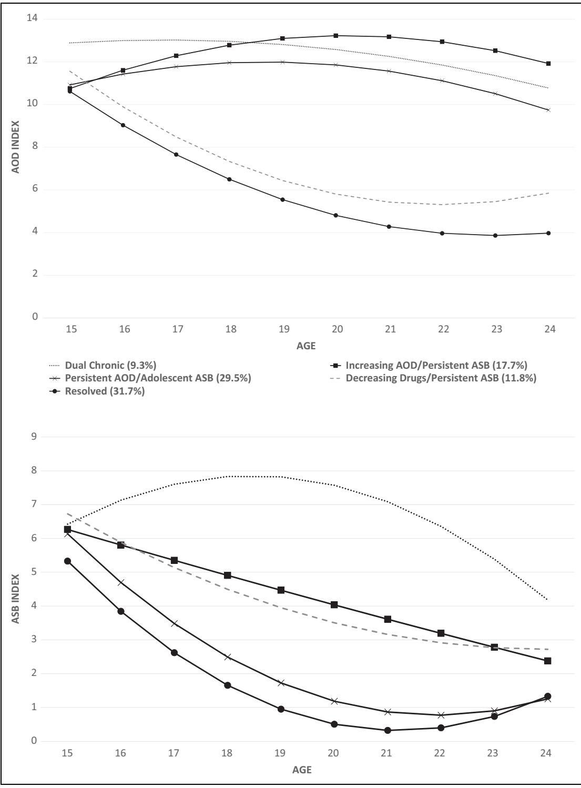

# Bivariate Trajectories of Substance Use and Antisocial Behavior: Associations With Emerging Adult Outcomes in a High-Risk Sample

Emerging Adulthood 2015, Vol. 3(4) 265-276 ª 2015 Society for the Study of Emerging Adulthood and SAGE Publications Reprints and permission: [sagepub.com/journalsPermissions.nav](http://www.sagepub.com/journalsPermissions.nav) DOI: 10.1177/2167696815573791 [ea.sagepub.com](http://ea.sagepub.com)

Ryan S. Trim1,2, Matthew J. Worley1 , Tamara L. Wall1,2, Christian J. Hopfer3 , Thomas J. Crowley3 , John K. Hewitt4 , and Sandra A. Brown1

#### Abstract

Substance use and antisocial behavior (ASB) are complex and interrelated behaviors. This study identified model trajectory classes defined by concurrent substance use and ASB and examined trajectory associations with emerging adult outcomes. Participants from a high-risk sample of youth (n ¼ 536; 73% male) completed interviews at baseline (mean age ¼ 16.1 years) and follow-up (mean age ¼ 22.6 years). Latent class growth analyses identified five trajectory classes based on alcohol/drug use (AOD) and ASB, namely, dual chronic, increasing AOD/persistent ASB, persistent AOD/adolescent ASB, decreasing drugs/persistent ASB, and resolved. Many individuals (56%) exhibited elevated/increasing AOD, and most (91%) reported ASB decreases. Those associated with the dual chronic class had the highest rates of substance dependence, antisocial personality disorder, and negative psychosocial outcomes. There were no differences in adult role attainment across classes. Conjoint examination of these behaviors provides greater detail regarding clinical course and can inform secondary prevention and intervention efforts.

#### Keywords

trajectories, antisocial behavior, substance use/abuse, longitudinal, at-risk populations

Substance use and antisocial behavior (ASB) are highly correlated both cross-sectionally and across the life span, share common risk factors, and are predictive of negative life outcomes (Compton, Conway, Stinson, Colliver, & Grant, 2005; Kendler, Prescott, Myers, & Neale, 2003; Krueger, Markon, Patrick, Benning, & Kramer, 2007; Moffitt, 1993; Windle, 1990). There is an extensive literature examining these domains early in adolescence, and much is known about the dynamic relations and links between alcohol use and aggression in this developmental period (White, Fite, Pardini, Mun, & Loeber, 2013). Epidemiological studies have reported the lifetime prevalence of adult ASB at \*12% and this has significant associations with all substance use disorders (SUDs; Compton et al., 2005). Previous studies have also shown how these constructs change over time using group based, latent trajectory approaches (i.e., Hussong, Curran, Moffitt, Caspi, & Carrig, 2004; Lee, Winters, & Wall, 2010; Odgers et al., 2007). However, no known study has examined trajectory groups based on both substance use and ASB from adolescence into emerging adulthood, a crucial period of development (from 18 to 25 years) that is associated with major life transitions toward independence and adult role attainment (Arnett, 2000).

Trajectory studies have examined a variety of substance use behaviors from adolescence into emerging adulthood, including alcohol use (Orlando, Tucker, Ellickson, & Klein, 2005), marijuana use (Brook, Zhang, & Brook, 2011; Windle & Wiesner, 2004), other illegal drug use (Roettger, Swisher, Kuhl, & Chavez, 2011), and alcohol/drug (AOD) dependence (Anderson, Ramo, Cummins, & Brown, 2010; Chassin, Fora, & King, 2004; Lee et al., 2010). While the number and shape of trajectories vary across samples and outcomes, studies typically identify four to six trajectory groups characterized by distinct patterns of substance use, such as chronically high, decreasing, increasing, consistently low, and abstainers (described as a ''cat's cradle'' pattern by Sher, Jackson, &

3 Department of Psychiatry, University of Colorado Denver, Aurora, CO, USA 4 Institute for Behavioral Genetics, University of Colorado, Boulder, CO, USA

#### Corresponding Author:

1 Department of Psychiatry, University of California, La Jolla, San Diego, CA, USA 2 VA San Diego Healthcare System, San Diego, CA, USA

Sandra A. Brown, PhD, Department of Psychiatry, University of California, 9500 Gilman Drive, La Jolla, San Diego, CA 92093-0043, USA. Email: sandrabrown@ucsd.edu

Steinley, 2011). Previous researchers have identified a range of risk factors, including male gender (Schulenberg et al., 2005), early onset of use (Lee et al., 2010; Windle, Mun, & Windle, 2005), low parental education (Jackson et al., 2005), and low religiosity (Jackson et al., 2005) to be associated with classification in more problematic trajectory groups, which in turn is associated with negative adult outcomes, including alcohol and other drug use (AOD; Chassin et al., 2004), lower perceived health (Ellickson, Martino, & Collins, 2004), lower educational attainment (Hill, White, Chung, Hawkins, & Catalano, 2000; Windle & Wiesner, 2004), and greater unemployment (Schulenberg et al., 2005). Recent research has shown that heavy substance use from adolescence through emerging adulthood is associated with visuospatial and memory decline (Hanson, Medina, Padula, Tapert, & Brown, 2011), highlighting the impact of long-term use on cognitive abilities and subsequent outcomes.

Previous examinations of ASB have also incorporated trajectory-based approaches. Moffitt and colleagues specified a theoretically based taxonomy of ''life-course persistent'' versus ''adolescent-limited'' ASB (Moffitt & Caspi, 2001; Moffitt, Caspi, Dickson, Silva, & Stanton, 1996). In studies using growth mixture modeling (Odgers et al., 2007; Odgers et al., 2008), this taxonomy was confirmed and extended with the addition of ''low'' and ''childhood-limited'' trajectories. Other studies have found a similar range and shape of antisocial trajectories (Miller, Malone, & Dodge, 2010; Monahan, Steinberg, Cauffman, & Mulvey, 2009). Individuals associated with a ''life-course persistent'' trajectory had greater levels of childhood risk factors such as more peer delinquency, low reading achievement, and low socioeconomic status (Odgers et al., 2008), while adverse outcomes associated with more severe antisocial trajectories include violent behavior, criminal convictions, substance dependence, and economic problems (Odgers et al., 2007; Odgers et al., 2008).

Previous trajectory studies have examined associations between substance use and ASB over time. Severe substance use trajectories were related to both prior conduct disorder (CD; Lee et al., 2010) and future ASB (Brook et al., 2011; Chassin et al., 2004; Lee et al. 2010); adult alcohol and drug dependence were predicted by antisocial trajectories (Odgers et al., 2007); and elevations from age-related declines in ASB were related to periods of greater substance abuse (Hussong et al., 2004). However, no known study has examined trajectory groups based both on substance use and ASB across adolescence and emerging adulthood; the predictors and outcomes associated with comorbid behaviors may differ from those that are associated with either of the single behavior alone (Chassin et al., 2004). Baseline characteristics related to subsequent substance use and ASB likely include both shared and disorderspecific components, and examination of trajectories defined by both substance use and ASB can help clarify whether baseline predictors for either behavior alone also confer risk for the comorbidity of these behaviors. Specifically, we examined trajectory class differences on gender, age, ethnicity, and religiosity as well as baseline measures of hard drug use and age of onset of CD and substance use. In addition, a range of psychosocial (recent job loss, incarceration, and relationship problems), role attainment (parent, marital, and employment status), and clinical (SUDs, antisocial personality disorder [ASPD], and treatment seeking) outcomes were selected based on previous trajectory-based outcomes research (i.e., Anderson et al., 2010; Chassin et al., 2004; Schulenberg et al., 2005; Windle & Wiesner, 2004).

Prior studies examining longitudinal associations between substance use and ASB are limited in that they have modeled trajectory groups based on only one of these behaviors. As such, this study has the following two primary aims: (1) to identify patterns of combined AOD and ASB for a high-risk sample originally recruited in adolescence and (2) examine the baseline characteristics and developmental outcomes (psychosocial, role-based, and clinical) for emerging adults who best represent these combined patterns of both AOD and ASB over time. Based on recent findings (i.e., Jackson et al., 2005; Sher et al., 2011), we expected to identify at least four distinct trajectory classes defined by both AOD and ASB over time. Given the high-risk nature of the sample, we expected most individuals to have elevations in both AOD and ASB at baseline, and subsequent trajectories would be characterized as follows: (1) increasing/persistent on both domains, (2) decreasing on both domains, (3) increasing/persistent AOD and decreasing ASB, and (4) increasing/persistent ASB and decreasing AOD. In general, we expected that baseline characteristics known to confer risk for either substance use and/or ASB problems (i.e., male gender, early onset of CD symptoms and substance use) would most strongly be associated with the trajectory characterized by increasing/persistent levels on both domains. Based on the cumulative risk hypothesis (see Appleyard, Egeland, Dulmen, & Sroufe, 2005 for review), which posits that more risk factors (including problem behaviors such as AOD and ASB) leads to more clinical problems across development, we expected this trajectory would also be associated with the most negative emerging adult outcomes. Conversely, the trajectory characterized by decreases on both domains would have better psychosocial outcomes, greater likelihood of adult role attainment, and lower rates of clinical disorders.

## Method

## Participants

This study reports on a sample of youth who participated in studies on familial transmission and genetic linkage of SUDs and CD (for more detailed information, see Hartman, Lessem, Hopfer, Crowley, & Stallings, 2006; Hopfer, Stallings, Hewitt, & Crowley, 2003; Stallings et al., 2003). Between 1993 and 2007, youth were recruited from three sites: 352 participants were in substance use treatment programs in Denver, Colorado, 202 adjudicated adolescents were identified through Colorado criminal justice records as adjudicated adolescents, and 245 participants were from alternative schools for behaviorally troubled youth or treatment programs in San Diego, California. All youth (n ¼ 799) met inclusion criteria for having at least one CD symptom and one SUD symptom at initial assessment. From this original sample, those who completed a follow-up interview and were at least 19 years old at follow-up were included in this study (n ¼ 536, 67.1%).

Of the total sample (n ¼ 536), 51% were White, non-Hispanic and 73% were male. Participants were an average of 16.1 years (standard deviation [SD] ¼ 1.19, range ¼ 13–19 years) at enrollment and 22.6 years (SD ¼ 2.00, range ¼ 19–30 years) at follow-up. The time from enrollment to follow-up was an average of 6.2 years (SD ¼ 1.42, range ¼ 3–10 years). Approximately, 39% of participants were recruited from Denver substance use treatment programs, 23% were recruited through the Colorado criminal justice system, and 38% were recruited from schools for troubled youth or treatment programs in San Diego.

A series of attrition-based analyses were conducted to compare the current sample (n ¼ 536) to those original participants who were excluded (n ¼ 263). The two groups did not differ on age, ethnicity, religiosity, ASB index, substance use index, age of onset of first conduct symptom, and age of substance use onset (youngest age that either alcohol or drugs was used). The retained sample had a higher proportion of females (27% vs. 20%) and more years of education at baseline (9.6 years vs. 9.3 years). There was a significant site difference in followup, F(2, 796) ¼ 23.47, p < .001, with 84% of the San Diego sample followed compared to 60% of the Colorado sites. Due to concerns about the impact of recruitment site on study outcomes, it was treated as a covariate in all subsequent analyses.

## Measures

At the baseline assessment (age range 13–19 years), each youth was asked to report on substance use and ASB for the past year. At the follow-up assessment (age range 19–30 years), in addition to providing ratings for the past year, participants also provided retrospective reports on these behaviors at age 18 years and at age 21 years. In total, a majority of participants provided AOD reports at three (44%) or four ages (25%) and most provided ASB reports at three (47%) or four different ages (43%).

Substance Use. At both baseline and follow-up, substance use was assessed using the Composite International Diagnostic Interview—Substance Abuse Module (CIDI-SAM; Crowley, Mikulich, Ehlers, Whitmore, & MacDonald, 2001). The CIDI-SAM provided diagnostic data regarding the lifetime and past-year occurrence of abuse and dependence symptoms for 10 different drug classes according to Diagnostic and statistical Manual of Mental Disorders (Third Edition Revised; DSM-III-R) and/or Diagnostic and statistical Manual of Mental Disorders (Fourth Edition; DSM-IV)criteria.

A ''substance use index'' (hereafter referred to as ''AOD'') was created based on the CIDI review of the past-year frequency of use of alcohol, marijuana, and other illicit drugs. The frequency of use for each item ranged from 0 (no use) to 7 (more than once a day), and the composite index had a range of 0–21. An EFA conducted on these three indicators at baseline and follow-up showed they loaded on one single factor. The mean levels of AOD fluctuated across time, with the highest overall levels reported at 17 years (mean ¼ 11.24, SD ¼ 4.46) and lowest levels at 20 years (mean ¼ 7.65, SD ¼ 4.13). The retrospective reports of AOD at ages 18 and 21 years were correlated (r ¼ .51, p < .001).

ASB. At baseline, CD was assessed using the Diagnostic Interview Schedule for Children, which is a highly structured interview that can be implemented by lay interviewers and has strong psychometric properties (Piacentini et al., 1993; Schwab-Stone et al., 1993; Shaffer et al., 1993). Participants reported on behaviors representative of CD, including the 13 symptoms using DSM-III-R criteria and 15 symptoms using DSM-IV criteria. At follow-up, participants were interviewed with the Diagnostic Interview Schedule (DIS-IV; Helzer, Spitznagel, & Mcevoy, 1987). The DIS-IV is a structured interview for adults who use DSM-IV criteria (American Psychiatric Association, 1994). The DIS-IV assessed ASPD symptoms and diagnosis.

An ''ASB index'' (hereafter referred to as ''ASB'') was created from items that were assessed both at baseline and at follow-up. These behavioral domains included law/rule breaking, truancy/irresponsibility, stealing/deceitfulness, property destruction, and fighting/aggression. Individuals were coded 0 (none), 1 (1 behavior), or 2 (2 or more behaviors) for each of these domains endorsed in the past year (possible range of 0–10; items derived from Moffitt et al., 1996). An EFA conducted on these 5 items at baseline and follow-up suggested that the indicators were unidimensional, loading on a single factor. Across time, the highest overall levels of ASB were reported at 15 years (mean ¼ 6.32, SD ¼ 2.32) and lowest levels at 24 years (mean ¼ 1.48, SD ¼ 1.63). The retrospective reports of ASB at ages 18 and 21 years were correlated (r ¼.76, p < .001).

Demographic variables. Information regarding age, gender, ethnicity, years of education, and religiosity (5-item measure adapted from Jessor & Jessor, 1977) were assessed to help characterize group differences at baseline among the bivariate trajectory classes.

Emerging adult outcomes. A range of psychosocial outcomes hypothesized to relate to AOD and ASB were examined to assess overall functioning in emerging adulthood (Anderson et al., 2010). These outcomes included graduating from high school, past-year job loss, past-year incarceration, past-year relationship problems, and past-year serious illness/injury. In addition, the role-based outcomes of current employment, household income, marital status, and parent status were examined as outcomes in these analyses. The AOD-related outcomes of past-year seeking help for substance use and lifetime history for alcohol treatment also were examined.

## Statistical Analyses

Our analyses involved the following phases: (1) identifying trajectory classes of AOD and ASB separately, (2) estimating trajectory classes based on both AOD and ASB over time, (3) examining baseline characteristics across bivariate trajectory classes, and (4) testing associations between bivariate trajectory classes and emerging adult psychosocial and clinical outcomes. Trajectory classes were identified using latent class growth analysis (LCGA; Nagin, 1999), which assumes individual variability in growth trajectories but uses a latent categorical variable to identify subgroups defined by similar patterns of change. Here, within-class variance and covariance estimates for growth factors are constrained to zero, allowing relative homogeneity within trajectory groups. LCGA does not assume the literal existence of distinct, homogenous subgroups in the population but is best considered a statistical technique for approximating a continuous distribution of trajectories of unknown shape (Nagin & Odgers, 2010). The effects of time were modeled using chronological age to examine age-related patterns from adolescence to emerging adulthood, similar to previous investigations of this developmental period (Windle et al., 2005). We modeled linear and quadratic age effects, expecting nonlinear peaks in emerging adulthood for both domains, given previous studies of these behaviors.

In our dual LCGA, latent class was defined by longitudinal trajectories of AOD and ASB. The key feature of this approach and novelty over previous methods is the specification of similar patterns on both variables within the latent trajectory class. All available AOD and ASB data points were included in LCGA via the restricted maximum likelihood function Maximum likelihood estimation with robust standard errors (estimator ¼ MLR), an appropriate technique with data missing at random (Schafer & Graham, 2002); age-specific observations of ASB were missing completely at random (Little's Missing Completely at Random [MCAR] test [88] ¼ 103.76, p ¼.12) while the same test suggests that AOD data were missing completely at random once the retrospective reports from 18 to 21 years were removed (Little's MCAR test [40] ¼ 39.33, p ¼.50). Models with one to six classes were evaluated using data from the range of 15–24 years (intercept centered at the youngest age, 15 years); data reported at ages outside this range were not included in the estimation of the LCGA models due to concerns about sparseness and model convergence (1– 7% of the sample had data at ages not included in analyses). Model fit was evaluated according to interpretability and common statistical indices (Nylund, Asparouhov, & Muthen, 2008; Ramaswamy, Desarbo, Reibstein, & Robinson, 1993), with better fit indicated by (a) lower Bayesian information criterion (BIC), entropy above .80 and closer to 1.0, all class proportions greater than 1%, and statistically significant Lo-Mendell-Rubin likelihood ratio test (LMR-LRT) and bootstrapped likelihood ratio test (BLRT). It is common for mixture models to have multiple maxima (Hipp & Bauer, 2006; McLachlan & Peel, 2000), so each model was estimated with the random starts algorithm in MPlus, using 300 random starts and 30 final stage solutions (Muthe´n & Muthe´n, 1998–2012). The final selected model was then reanalyzed with 7,000 random starts and 60 final stage solutions to minimize the risk that the reported model was a product of local (and not global) maxima.

A series of multinomial logistic regressions were examined to determine how the trajectory classes varied on baseline characteristics. If either analysis of variance omnibus F-test or Fisher's exact test was significant, post hoc corrected pairwise comparisons were evaluated. A similar procedure was used to determine whether trajectory class membership predicted emerging adult outcomes measured at follow-up. For each outcome significantly predicted by trajectory class membership, we examined pairwise differences between trajectory groups. Covariates for each logistic regression included gender, baseline age, recruitment site, and baseline substance dependence (for diagnostic outcomes).

## Results

## Identification of Single Trajectory AOD and ASB Classes

For AOD, a two-class model fit the data best (the posterior probabilities for class assignment was .92 for both classes). The larger class (55% of sample) is best described as ''persistent high,'' intercept ¼ 11.03 (p < .001), linear slope ¼ 0.69 (p < .01), quadratic slope ¼ -.07 (p < .05), and the second class (45% of sample) is best described as ''decreasers,'' intercept ¼ 11.13 (p < .001), linear slope ¼ -1.62 (p < .001), quadratic slope ¼ .10 (p > .05).

For the ASB LCGA, a three-class model fit the data best (the posterior probabilities for class assignment ranged from .92 to .97 for these classes). The largest class (61% of sample) is best described as ''rapid decreasers,'' intercept ¼ 5.62 (p < .001), linear slope ¼ -1.56 (p < .001), quadratic slope ¼ .12 (p < .001); the next largest class (28% of sample) is considered ''gradual decreasers,'' intercept ¼ 6.54 (p < .001), linear slope ¼ -.73 (p < .001), quadratic slope ¼.03 (p > .05); and the smallest class (11% of sample) is labeled ''increase–decrease'' (intercept ¼ 6.26 (p < .001), linear slope ¼ .85 (p < .001), quadratic slope ¼ -.12 (p < .001).

## Identification of Bivariate Trajectory Classes

Next, we estimated LCGA models with two to six classes defined by both AOD and ASB over time. There was improvement in model fit with each successive model, up to five classes (BIC ¼ 16,710, entropy ¼ .822, LMR-LRT p < .05, BLRT p < .001). The sixth-class model yielded a nonsignificant LMR-LRT (p ¼ .11) and the BLRT did not result in successful bootstrap draws, thus the fifth-class solution (whose estimates were confirmed after rerunning with 7,000 random starts and 60 final stage optimization) was selected; the posterior probabilities of the fifth-class solution ranged from .84 to .96. Figure 1 displays the estimated means of AOD and ASB for each class across time, and Table 1 shows the class-specific means of the latent growth factors.

Figure 1. Estimated means of alcohol/drug use (AOD) and antisocial behavior (ASB) bivariate trajectory classes.

Class 1: Dual chronic (9.3%). Individuals most likely to be assigned to this class had the most severe and persistent patterns of both AOD and ASB. They had the highest initial levels of AOD with no significant change in AOD over time. Baseline ASB was high, and this was the only class associated with a significant increase in ASB over time, which is most apparent from baseline to age 18 years.

Class 2: Increasing AOD/persistent ASB (17.7%). The defining feature of individuals assigned to this class was consistently

| Latent Trajectory Group            | Percentage of Sample | Substance Use Index |             |           | ASB Index |             |             |
|------------------------------------|----------------------|---------------------|-------------|-----------|-----------|-------------|-------------|
|                                    |                      | Intercept           | Linear      | Quadratic | Intercept | Linear      | Quadratic   |
| 1. Dual chronic                    | 9.3                  | 12.89***            | 0.15        |  0.04  | 6.42***   | 0.83**      |  0.12*** |
| 2. Increasing AOD/persistent ASB   | 17.7                 | 10.88***            | 0.91*       |  0.09  | 6.27***   |  0.46    | 0.00        |
| 3. Persistent AOD/adolescent ASB   | 29.5                 | 11.03***            | 0.55        |  0.08* | 6.11***   |  1.55*** | 0.11***     |
| 4. Decreasing drugs/persistent ASB | 11.8                 | 11.49***            |  1.71*   | 0.12      | 6.72***   |  0.93**  | 0.05*       |
| 5. Resolved                        | 31.7                 | 10.59***            |  1.68*** | 0.11**    | 5.28***   |  1.60*** | 0.13***     |

Table 1. Growth Factor Means for Bivariate Trajectory Classes Identified in Using Latent Class Growth Analysis.

Note. N ¼ 536. ASB ¼ antisocial behavior; AOD ¼ alcohol/drug use.

\*p < .05. \*\*p < .01. \*\*\*p < .001.

high AOD, as it was the only class with a significant increase in AOD over time. As seen in Figure 1, AOD increased during middle to late adolescence, leveled off around age 20–21 years, and remained higher at follow-up than at baseline despite this early peak. Baseline ASB was slightly lower than Class 1, with a nonsignificant declining trend in ASB over time.

Class 3: Persistent AOD/adolescent ASB (29.5%). Individuals most likely assigned to this class were distinguished by consistently elevated levels of AOD use and rapidly declining ASB. Baseline AOD was elevated and there was no change in the rate of AOD over time. The rapid decline in ASB by age 18 suggested that ASB for this group was limited to adolescence.

Class 4: Decreasing drugs/persistent ASB (11.8%). Individuals most likely assigned to this class had the second highest rates of baseline AOD, and this class had the largest decrease in AOD over time. Follow-up analyses showed that the largest reduction was in marijuana use with a more modest reduction in other drug use; alcohol use declined slightly through 21 years but returned to near-baseline levels at older ages. Individuals associated with this class had the highest levels of baseline ASB and there was a decline in ASB. At older ages, this class still had levels of ASB second only to Class 1, despite declines in ASB over time.

Table 2. Baseline Characteristics Across Trajectory Classes.

Class 5: Resolved (31.7%). Individuals most likely assigned to this class had rates of initial AOD similar to Classes 2 and 3, and there was a rapid decline in AOD over time, which was fairly linear from early adolescence through age 21 years (and then stabilized at low levels). Rates of initial ASB were the lowest of the sample and there was a rapid decline in ASB by age 18 years (reflecting adolescent-limited ASB, much like Class 3).

# Baseline Characteristics of Trajectory Classes

Next, we examined whether baseline characteristics predicted latent trajectory class membership (see Table 2). There were more males in dual chronic, increasing AOD/persistent ASB, and persistent AOD/adolescent ASB classes compared to those in the decreasing drugs/persistent ASB and resolved classes. There was a significant omnibus effect of baseline age on class; however, no post hoc corrected pairwise comparisons were significant. Those assigned to the resolved class had a significantly older age of CD symptom onset and drinking onset compared to the other groups. Those endorsing hard drug use at baseline were more likely assigned to dual chronic, increasing AOD/persistent ASB, or persistent AOD/adolescent ASB classes compared to those in the decreasing drugs/persistent ASB or resolved classes. There were no significant trajectory class differences on ethnicity, years of education, religiosity, and age of substance use onset.

|                                 | F-test or w2 test | Dual chronic | Increasing AOD/ persistent ASB | Persistent AOD/ adolescent ASB | Decreasing drugs/ persistent ASB | Resolved |
|---------------------------------|----------------------|-----------------|-----------------------------------|-----------------------------------|-------------------------------------|----------|
| Gender (% male)                 | 59.55***             | 92%A            | 89%A                              | 82%A                              | 62%B                                | 55%B     |
| Age (years)                     | 2.74*                | 16.34           | 16.19                             | 16.25                             | 16.03                               | 15.88    |
| Ethnicity (% White)             | 9.02                 | 54%             | 57%                               | 59%                               | 44%                                 | 45%      |
| Education (years)               | 0.67                 | 9.48            | 9.74                              | 9.71                              | 9.58                                | 9.50     |
| Religiosity score               | 0.47                 | 2.08            | 2.26                              | 2.20                              | 2.32                                | 2.31     |
| Age first CD symptom (years)    | 3.66**               | 7.66A           | 7.75A                             | 8.59A                             | 8.17A                               | 9.13B    |
| Age first alcohol use (years)   | 3.28*                | 11.92A          | 12.36A,B                          | 12.77B,C                          | 12.49A,C                            | 13.06D   |
| Age first substance use (years) | 2.00                 | 10.46           | 10.60                             | 10.96                             | 11.27                               | 11.64    |
| Hard drug use at baseline (%)   | 23.82***             | 82%A            | 83%A                              | 82%A                              | 65%B                                | 63%B     |

Note. N ¼ 536. ASB ¼ antisocial behavior; AOD ¼ alcohol/drug use. CD ¼ conduct disorder. Groups that do not share a subscript differ significantly at p < .05. \*p < .05. \*\*p < .01. \*\*\*p < .001.

|                                         | b (SE)           | Dual Chronic | Increasing AOD/ Persistent ASB | Persistent AOD/ Adolescent ASB | Decreasing Drugs/ Persistent ASB | Resolved |
|-----------------------------------------|------------------|-----------------|-----------------------------------|-----------------------------------|-------------------------------------|----------|
| Currently employed                      |  .11 (.07)    | 46%             | 56%                               | 51%                               | 54%                                 | 64%      |
| Household income                        | .08 (.05)        | 2.34            | 1.98                              | 2.26                              | 2.29                                | 2.40     |
| Currently married                       | .03 (.10)        | 12%             | 9%                                | 15%                               | 13%                                 | 15%      |
| Currently parent                        |  .12 (.08)    | 37%             | 24%                               | 26%                               | 40%                                 | 42%      |
| Graduated high school                   | .24 (.09)**      | 26%A            | 57%BC                             | 51%B                              | 56%BC                               | 63%C     |
| Past-year job loss                      |  .17 (.09)*   | 33%A            | 23%AB                             | 18%C                              | 29%BC                               | 15%C     |
| Past-year incarcerated                  |  .44 (.09)*** | 36%A            | 20%B                              | 8%C                               | 16%BC                               | 12%BC    |
| Past-year relationship problem          |  .27 (.08)*** | 59%AB           | 45%ACD                            | 27%E                              | 52%BC                               | 33%DE    |
| Past-year serious illness/injury        |  .26 (.11)*   | 19%A            | 13%A                              | 10%A                              | 15%A                                | 6%B      |
| Past-year alcohol dependence            |  .44 (.08)*** | 66%A            | 36%B                              | 26%B                              | 37%B                                | 16%C     |
| Past-year marijuana dependence          |  .47 (.11)*** | 26%A            | 25%A                              | 15%A,B                            | 8%B,C                               | 5%C      |
| Past-year other drug dependence         |  .76 (.15)*** | 20%A            | 20%A                              | 7%B                               | 6%BC                                | 1%C      |
| Past-year any substance dependence      |  .62 (.08)*** | 76%A            | 61%A                              | 41%B                              | 41%B                                | 19%C     |
| Past-year ASPD                          |  .77 (.09)*** | 84%A            | 56%B                              | 14%C                              | 62%B                                | 9%C      |
| Past-year sought help for alcohol/drugs |  .26 (.17)    | 10%             | 6%                                | 1%                                | 6%                                  | 3%       |
| Lifetime treatment for alcohol          |  .31 (.07)*** | 60%A            | 46%A,B                            | 37%B                              | 40%A,B                              | 24%C     |

Note. N ¼ 536. ASDP ¼ antisocial personality disorder. Groups that do not share a subscript differ significantly at p < .05. \*p < .05. \*\*p < .01. \*\*\*p < .001.

# Bivariate Trajectories and Emerging Adult Psychosocial/ Role-Based Outcomes

Trajectory class predicted a range of psychosocial outcomes (see Table 3). Individuals assigned to dual chronic had lower high school completion rates and higher past-year incarceration rates compared to all other classes. Those assigned to persistent AOD/adolescent ASB had lower high school graduation rates compared to the resolved class, while those assigned to increasing AOD/persistent ASB had higher recent incarceration rates than those associated with persistent AOD/adolescent ASB. Individuals assigned to dual chronic, increasing AOD/ persistent ASB, and decreasing drugs/persistent ASB had the highest rates of recent job loss and past-year relationship problems. The resolved class had rates of past-year serious illness/ injury rates significantly lower than all other classes. Trajectory class did not predict role-based outcomes. Rates of current employment, household income, being married, and having children were generally highest in the resolved class and lowest in the increasing AOD/persistent ASB class, but these differences were not significant.

# Bivariate Trajectories and Emerging Adult Diagnostic Outcomes

Trajectory class membership predicted clinical outcomes at follow-up. All diagnostic outcomes were predicted by trajectory group (see Table 3). Individuals most likely assigned as dual chronic had higher alcohol dependence rates than all other classes, and those associated with resolved had lower alcohol dependence rates than all other classes. Those assigned to dual chronic, increasing AOD/persistent ASB, and persistent AOD/adolescent ASB classes had higher rates of marijuana dependence than those assigned to resolved; those assigned to dual chronic and increasing AOD/persistent ASB classes had higher marijuana dependence rates than those assigned to decreasing drugs/persistent ASB. Individuals assigned to dual chronic and increasing AOD/persistent ASB classes had higher rates of other drug dependence than those assigned to persistent AOD/adolescent ASB, decreasing drugs/persistent ASB, and resolved classes; those associated with persistent AOD/adolescent ASB had higher rates of other drug dependence than the resolved class. Individuals assigned to dual chronic and increasing AOD/persistent ASB classes had greater rates of any substance dependence than those assigned to classes persistent AOD/adolescent ASB, decreasing drugs/persistent ASB, and resolved classes; those assigned to persistent AOD/adolescent ASB and decreasing drugs/persistent ASB classes also had greater rates of any substance dependence than those assigned to resolved. Individuals assigned to dual chronic had higher rates of ASPD than all other classes, while those assigned to increasing AOD/persistent ASB and decreasing drugs/persistent ASB classes had higher ASPD rates than those assigned to persistent AOD/adolescent ASB and resolved classes. Trajectory class did not predict seeking treatment for AOD use in the past year but did predict lifetime history of alcohol treatment. The rate of lifetime alcohol treatment for resolved was lower compared to all other classes; in addition, the lifetime treatment rate for dual chronic was higher than the rate for those considered persistent AOD/adolescent ASB.

## Discussion

This study provides several key contributions to our understanding of how two correlated high-risk problem behaviors progress over time in a sample of severely affected youth. Although prior studies have examined trajectories of AOD and ASB separately and described how these two constructs are related over time, this study is to our knowledge the first to utilize bivariate mixture modeling, which provides a greater level of detail regarding the clinical course of concurrent AOD and ASB overtime. The five identified bivariate trajectories were consistent with patterns outlined in the study hypotheses: increasing/persistent on both domains (represented by both dual chronic and increasing AOD/persistent ASB), decreasing on both domains (resolved), increasing/persistent AOD and decreasing ASB (persistent AOD/adolescent ASB), and increasing/persistent ASB and decreasing drug use (decreasing drugs/persistent ASB). The baseline predictors of trajectory classes largely replicates previous studies; however, this was the first study to show that unique patterns of AOD and ASB over time differentially predict a wide range of psychosocial and diagnostic outcomes (with those classified into more severe trajectories experiencing more adverse consequences). Furthermore, the results indicate that high-risk emerging adults acquire adult roles similarly, regardless of their involvement with AOD and ASB overtime.

Overall, our findings are consistent with previous research on AOD trajectories over this developmental period. The AOD-only analyses revealed two predominant patterns (persistent high and decrease) that were largely replicated in the bivariate approach. The longitudinal patterns of AOD observed in increasing AOD/persistent ASB, persistent AOD/adolescent ASB, decreasing drugs/persistent ASB, and resolved classes roughly correspond to the ''increasing,'' consistently ''high,'' ''decreasing,'' and consistently ''low'' patterns seen in the previous studies (i.e., Feldman, Masyn, & Conger, 2009; Jackson & Sher, 2005; Schulenberg et al., 2005). Consistent with prior research, results indicated that poorer outcomes in emerging adulthood were associated with classes characterized by increasing and persistent AOD. An additional smaller fifth group (dual chronic) exhibited levels of AOD that started and remained ''extremely high'' compared to the AOD rates for the rest of the sample. Clearly, these individuals persist on a severely maladaptive developmental path and had the poorest outcomes for clinical diagnoses (i.e., 84% rate of ASPD and 76% rate of any substance dependence) and adverse psychosocial functioning in emerging adulthood (i.e., a 36% rate of pastyear incarceration).

Perhaps because this sample was high in adolescent ASB at baseline, the majority (\*91%) demonstrated a pattern of decline in ASB by emerging adulthood in both the ASB-only and the dual trajectory analysis, even in classes with persistent substance use (increasing AOD/persistent ASB and persistent AOD/adolescent ASB). The rapid ASB decline in persistent AOD/adolescent ASB and resolved classes approximated an ''adolescent-limited'' pattern of ASB commonly described in the literature (i.e., Moffitt & Caspi, 2001; Odgers et al., 2007; Odgers et al., 2008). In comparison, only dual chronic reflected a pattern similar to ''life course persistent'' with continually high ASB into emerging adulthood. We did not observe chronically high ASB in combination with declining AOD, which may suggest that severe ASB rarely persists into emerging adulthood without conjoint problematic substance use. Thus, persistent ASB in emerging adults appears to increase the risk for substance-related problems, indicating the potential benefit of initially targeting ASB (as opposed to AOD) through prevention/intervention efforts with this highrisk population.

As hypothesized, our findings regarding predictors and outcomes in relation to the bivariate trajectory classes were generally consistent with previous studies (i.e., Anderson et al., 2010; Lee et al., 2010; Schulenberg et al., 2005; Windle et al., 2005): Males were more likely to comprise the higher substance-using classes (dual chronic, increasing AOD/persistent ASB, and persistent AOD/adolescent ASB); greater than 80% of individuals associated with these classes also reported drug use at baseline compared to rates of \*64% in the other two classes; mean age of CD symptom onset was similar across all groups (7.6–8.5 years) except for those in the resolved class, (9.1 years); and mean age of first drink was also similar across all groups (11.9–12.8 years) except for those in the resolved class, (13.1 years). Thus, these known risk factors for both AOD and ASB separately also increase risk for involvement in combined comorbid trajectories. Note that the trajectory classes were similar on age of first substance use, age, ethnicity, year of education, and religiosity.

Regarding psychosocial outcomes in emerging adulthood, the national rates for job loss have ranged from 2% to 4% over the past 10 years (http://data.bls.gov), past-year incarceration is consistently about 1% of the U.S. adult population (http:// www.bjs.gov), and 85% of adults aged 25 years and older reported high school completion or equivalent (http:// www.census.gov). In comparison, those assigned to the dual chronic class had the highest rates for past-year job loss (33%) and past-year incarceration (36%) and the lowest rate of high school completion (26%). Thus, individuals associated with extreme levels of both substance use and ASB throughout adolescence typically report the most negative life outcomes in emerging adulthood. Compared to the dual chronic class, individuals classified to the increasing AOD/persistent ASB class had lower rates of past year incarceration (20%) and higher rates of high school graduation (57%). These relatively better outcomes are unsurprising given that the ASB patterns for the increasing AOD/persistent ASB class were not as consistently elevated as seen in the dual chronic class. Persistent AOD/adolescent ASB and decreasing drugs/persistent ASB classes had similar rates for all outcomes except for past-year relationship problems, which was markedly higher in decreasing drugs/persistent ASB (52% vs. 27%). For these outcomes, there appears to be a cumulative risk conferred by increasing levels of both AOD and ASB as seen in the dual chronic class and, to a lesser degree, the increasing AOD/persistent ASB class. As AOD and/or ASB trajectories decrease (as seen in the other three classes), so do these levels of negative psychosocial outcomes. These findings are consistent with studies identifying the risk of AOD or ASB alone on emerging adult functioning, while also highlighting the impact of cumulative risk of AOD and ASB together on psychosocial outcomes.

Although there were trajectory class differences in psychosocial outcomes, there were no significant differences in the attainment of adult roles in this sample. The employment rate for all classes (46–64%) was well below the typical employment rate of 84–93% for adults aged 20–24 years in the past 10 years (http://data.bls.gov). The marriage rate (9–15% across classes) and rate of having a child (24–42% across classes) were both higher than the national marriage rate (\*8%) and the parent rate (\*22%) for 20- to 24-year-olds (http:// www.census.gov). It should be noted that both marital and parental status are somewhat ambiguous in terms of how adaptive the mere acquisition of these roles are to individual development and functioning, particularly in high-risk emerging adults (Little, Handley, Leuthe, & Chassin, 2009); future research should evaluate these outcomes from a broader perspective by examining qualities such as satisfaction and quality of marital and parent roles in this population. Regardless, this increased likelihood of adult role attainment combined with poorer overall psychosocial functioning highlights the lasting impact of adolescent substance use and ASB on subsequent life domains. One surprising result was the lack of class differences on household income; even the dual chronic class had a mean self-reported income level equivalent to the other groups, despite a lower rate of employment. Future research should obtain more detailed information on the sources of income in high-risk populations.

In terms of diagnostic outcomes, those in the dual chronic class were associated with extreme elevations in past-year alcohol dependence (66%) and ASPD (84%) diagnoses, whereas both the dual chronic and increasing AOD/persistent ASB classes had the highest rates of past-year marijuana dependence, other drug dependence, and any substance dependence. Persistent AOD/adolescent ASB and decreasing drugs/persistent ASB classes had similar rates for all outcomes except for past-year marijuana dependence (15% vs. 8%) and ASPD (14% vs. 62%). Thus, it appears the high initial levels of ASB associated with decreasing drugs/persistent ASB have longterm impacts on subsequent clinical outcomes, although ASB decreased significantly over time for this group. The group with the best outcomes (resolved) still had rates of substance dependence (19%) and ASPD (9%) higher than that would be observed in the general population. The resolved group also had the lowest rates of lifetime alcohol treatment (24%), suggesting that many of these individuals were able to ''mature out'' of or ''naturally recover'' from problematic adolescent drinking without the assistance of formal treatment services. There was a striking discrepancy between past-year rates of any substance dependence (ranged from 19% to 76% across classes) and past-year rates of seeking help for substance use problems (ranged from 1% to 10% across classes); the most extreme example in the persistent AOD/adolescent ASB class with 41% substance dependent but only 1% seeking treatment in the past year. The relations between various combinations of AOD and ASB and diagnostic outcomes are more nuanced than the findings from previous studies examining AOD and ASB separately. For example, persistent ASB associated with high levels of ASPD (increasing AOD/persistent ASB and decreasing drugs/persistent ASB) predicted similar levels of alcohol dependence but differential levels of drug dependence based on AOD patterns overtime. The persistent AOD/adolescent ASB and decreasing drugs/persistent ASB classes had equivalent levels of substance dependence in emerging adulthood, but those with persistent ASB past adolescence (decreasing drugs/ persistent ASB) had levels of ASPD about four times higher.

Overall, the poor psychosocial and diagnostic outcomes in the more extreme trajectory classes support targeted intervention and secondary prevention efforts for youth exhibiting these characteristics early in adolescence. Similarly, having an older age of onset of CD symptoms, alcohol use, and drug use (potential prevention targets in adolescence) were all predictive of the high-risk youth in the resolved class, which had the most successful outcomes in emerging adulthood. It is possible that programs shown to prevent ASB in childhood and adolescence such as Family Check-Up (Van Ryzin & Dishion, 2012) and Linking the Interests of Family and Teachers (Eddy, Reid, & Fetrow, 2000) may be difficult to implement in high-risk youth already exhibiting these behaviors. Components of these programs might be adapted for these populations depending on the available resources and support systems. Similarly, treatment approaches for adolescent ASB, such as multisystemic therapy (Henggeler, Schoenwald, Borduin, Rowland, & Cunningham, 2009), could be adapted for older adolescents who have strong family and caregiver support. There is evidence that cognitive behavioral therapy (CBT; Armelius & Andreassen, 2007), motivational interviewing (MI; Rotgers & Maniacci, 2006), and dialectical behavior therapy (McCann, Ball, & Ivanoff, 2000) can be effective in reducing ASB and ASPD in various populations; there is also a robust literature that CBT and MI-based treatment approaches are effective in reducing problematic adolescent substance use (Belendiuk & Riggs, 2014; Jensen et al., 2011). Given the overall poor outcomes in these high-risk youth, additional research focused on targeted early prevention and intervention may lead to significantly reduced social and economic burden to society.

Although findings from this study highlight the importance of examining both AOD and ASB across time, there are several caveats that should be noted. First, the sample was of moderate size and was comprised entirely of high-risk youth; the generalizability of these findings is limited and it is unknown how these behaviors might develop over time in more normative samples of youth. Second, the main outcomes of interest were obtained through self-report and retrospective reports at ages 18 and 21 years were prone to recall bias. Finally, as with many studies employing mixture modeling and similar techniques, there is caution against reifying trajectory groups or assuming them to have clinical or theoretical meaning (Nagin & Tremblay, 2005). As such, study findings are considered statistical abstractions of the data (Sher et al., 2011) and additional replications and complementary analytic approaches are needed to increase confidence that these bivariate trajectory groups indeed represent valid subgroups over time. Future studies employing more frequent assessments of AOD and ASB across developmentally sensitive time periods are needed to provide a more nuanced understanding of the dynamic relationship between these constructs. The availability of intensive longitudinal data would allow researchers to evaluate which factors influence changes in both AOD and ASB over time.

#### Declaration of Conflicting Interests

The authors declared no potential conflicts of interest with respect to the research, authorship, and/or publication of this article.

#### Funding

The authors disclosed receipt of the following financial support for the research, authorship, and/or publication of this article: This work was supported by National Institute of Drug Abuse grants R01 DA021692 (PIs: Brown & Wall), R01 DA035804 (PIs: Hopfer, Stallings & Wall), F31 DA030861 (PI: Worley), P60 DA011015 (PI: Hewitt), R01 DA012845 (PI: Hewitt), R01 DA021913 (PI: Hopfer), R01 DA015522 (PI: Hopfer), and National Institute on Alcohol Abuse and Alcoholism grant R37 AA07033 (PI: Brown).

#### References

- American Psychiatric Association. (1987). Diagnostic and statistical manual of mental disorders (DSM-III-R). Washington, DC: Author.
- American Psychiatric Association. (1994). Diagnostic and statistical manual of mental disorders (DSM-IV). Washington, DC: Author.
- Anderson, K. G., Ramo, D. E., Cummins, K. M., & Brown, S. A. (2010). Alcohol and drug involvement after adolescent treatment and functioning during emerging adulthood. Drug and Alcohol Dependence, 107, 171–181.
- Appleyard, K., Egeland, B., van Dulmen, M. H. M., & Sroufe, L. A. (2005). When more is not better: The role of cumulative risk in child behavior outcomes. Journal of Child Psychology Psychiatry, 46, 235–245.
- Armelius, B., & Andreassen, T. H. (2007). Cognitive-behavioral treatment for antisocial behavior in youth in residential treatment. Cochrane Database System Review, 4, 1–35.
- Arnett, J. J. (2000). Emerging adulthood: A theory of development from the late teens through the twenties. American Psychologist, 55, 469–480.
- Belendiuk, K. A., & Riggs, P. (2014). Treatment of adolescent substance use disorders. Current Treatment Options in Psychiatry, 1, 175–188.
- Brook, J. S., Zhang, C., & Brook, D. W. (2011). Antisocial behavior at age 37: Developmental trajectories of marijuana use extending from adolescence to adulthood. American Journal on Addictions, 20, 509–515.
- Chassin, L., Fora, D. B., & King, K. M. (2004). Trajectories of alcohol and drug use and dependence from adolescence to adulthood: The effects of familial alcoholism and personality. Journal of Abnormal Psychology, 113, 483–498.
- Compton, W. M., Conway, K. P., Stinson, F. S., Colliver, J. D., & Grant, B. F. (2005). Prevalence, correlates, and comorbidity of DSM-IV antisocial personality syndromes and alcohol and specific drug use disorders in the United States: Results from the national epidemiologic survey on alcohol and related conditions. Journal of Clinical Psychiatry, 66, 677–685.
- Crowley, T. J., Mikulich, S. K., Ehlers, K. M., Whitmore, E. A., & MacDonald, M. J. (2001). Validity of structured clinical evaluations in adolescents with conduct and substance problems. Journal of the American Academy of Child and Adolescent Psychiatry, 40, 265–273.
- Eddy, J. M., Reid, J. B., & Fetrow, R. A. (2000). An elementary school-based prevention program targeting modifiable antecedents of youth delinquency and violence: Linking the Interests of Families and Teachers (LIFT). Journal of Emotional and Behavioral Disorder, 8, 165–176.
- Ellickson, P. L., Martino, S. C., & Collins, R. L. (2004). Marijuana use from adolescence to young adulthood: Multiple developmental trajectories and their associated outcomes. Health Psychology, 23, 299–307.
- Feldman, B. J., Masyn, K. E., & Conger, R. D. (2009). New approaches to studying problem behaviors: A comparison of methods for modeling longitudinal, categorical adolescent drinking data. Developmental Psychology, 45, 652–676.
- Hanson, K. L., Medina, K. L., Padula, C. B., Tapert, S. F., & Brown, S. A. (2011). Impact of adolescent alcohol and drug use on neuropsychological functioning in young adulthood: 10-year outcomes. Journal of Child & Adolescent Substance Abuse, 20, 135–154.
- Hartman, C. A., Lessem, J. M., Hopfer, C. J., Crowley, T. J., & Stallings, M. C. (2006). The family transmission of adolescent alcohol abuse and dependence. Journal of Studies on Alcohol, 67, 657–664.
- Helzer, J. E., Spitznagel, E. L., & Mcevoy, L. (1987). The predictive validity of lay diagnostic interview schedule diagnoses in the general population—A comparison with physician examiners. Archives of General Psychiatry, 44, 1069–1077.
- Henggeler, S. W., Schoenwald, S. K., Borduin, C. M., Rowland, M. D., & Cunningham, P. B. (2009). Multisystemic therapy for antisocial behavior in children and adolescents. New York, NY: Guilford.
- Hill, K. G., White, H. R., Chung, I. J., Hawkins, J. D., & Catalano, R. F. (2000). Early adult outcomes of adolescent binge drinking: Person—and variable-centered analyses of binge drinking trajectories. Alcoholism-clinical and Experimental Research, 24, 892–901.
- Hipp, J. R., & Bauer, D. J. (2006). Local solutions in the estimation of growth mixture models. Psychological Methods, 11, 36–53.
- Hopfer, C. J., Stallings, M. C., Hewitt, J. K., & Crowley, T. J. (2003). Family transmission of marijuana use, abuse, and dependence. Journal of the American Academy of Child and Adolescent Psychiatry, 42, 834–841.
- Hussong, A. M., Curran, P. J., Moffitt, T. E., Caspi, A., & Carrig, M. M. (2004). Substance abuse hinders desistance in young adults' antisocial behavior. Development and Psychopathology, 16, 1029–1046.
- Jackson, K. M., & Sher, K. J. (2005). Similarities and differences of longitudinal phenotypes across alternate indices of alcohol involvement: A methodologic comparison of trajectory approaches. Psychology of Addictive Behaviors, 19, 339–351.
- Jensen, C. D., Cushing, C. C., Aylward, B. S., Craig, J. T., Sorell, D. M., & Steele, R. G. (2011). Effectiveness of motivational interviewing interventions for adolescent substance use behavior change: A meta-analytic review. Journal of Consulting and Clinical Psychology, 79, 433–440.
- Jessor, R., & Jessor, S. L. (1977). Problem behavior and psychosocial development: A longitudinal study of youth. New York, NY: Academic Press.
- Kendler, K. S., Prescott, C. A., Myers, J., & Neale, M. C. (2003). The structure of genetic and environmental risk factors for common psychiatric and substance use disorders in men and women. Archives of General Psychiatry, 60, 929–937.
- Krueger, R. F., Markon, K. E., Patrick, C. J., Benning, S. D., & Kramer, M. D. (2007). Linking antisocial behavior, substance use, and personality: An integrative quantitative model of the adult externalizing spectrum. Journal of Abnormal Psychology, 116, 645–666.
- Lee, C. Y., Winters, K. C., & Wall, M. M. (2010). Trajectories of substance use disorders in youth: Identifying and predicting group memberships. Journal of Child & Adolescent Substance Abuse, 19, 135–157.
- Little, M., Handley, E., Leuthe, E., & Chassin, L. (2009). The impact of parenthood on alcohol consumption trajectories. Development and Psychopathology, 21, 661–682.
- McCann, R. A., Ball, E. M., & Ivanoff, A. (2000). DBT with an inpatient forensic population: The CMHIP forensic model. Cognitive and Behavioral Practice, 7, 447–456.
- McLachlan, G., & Peel, D. (2000). Finite mixture models. New York, NY: John Wiley.
- Miller, S., Malone, P. S., & Dodge, K. A. (2010). Developmental trajectories of boys' and girls' delinquency: Sex differences and links to later adolescent outcomes. Journal of Abnormal Child Psychology, 38, 1021–1032.
- Moffitt, T. E. (1993). Adolescence-limited and life-course persistent antisocial behavior—A developmental taxonomy. Psychological Review, 100, 674–701.
- Moffitt, T. E., & Caspi, A. (2001). Childhood predictors differentiate life-course persistent and adolescence-limited antisocial pathways among males and females. Development and Psychopathology, 13, 355–375.
- Moffitt, T. E., Caspi, A., Dickson, N., Silva, P., & Stanton, W. (1996). Childhood-onset versus adolescent-onset antisocial conduct problems in males: Natural history from ages 3 to 18 years. Development and Psychopathology, 8, 399–424.
- Monahan, K. C., Steinberg, L., Cauffman, E., & Mulvey, E. P. (2009). Trajectories of antisocial behavior and psychosocial maturity from adolescence to young adulthood. Developmental Psychology, 45, 1654–1668.
- Muthen, L. K., & Muthen, B. O. (1998–2012). Mplus user's guide (7th ed.). Los Angeles, CA: Muthen & Muthen.
- Nagin, D. S. (1999). Analyzing developmental trajectories: A semiparametric, group-based approach. Psychological Methods, 4, 139–157.
- Nagin, D. S., & Odgers, C. L. (2010). Group-based trajectory modeling in clinical research. Annual Review of Clinical Psychology, 6, 109–138.
- Nagin, D. S., & Tremblay, R. E. (2005). Developmental trajectory groups: Fact or a useful statistical fiction? Criminology, 43, 873–904.
- Nylund, K. L., Asparouhov, T., & Muthen, B. O. (2008). Deciding on the number of classes in latent class analysis and growth mixture

modeling: A Monte Carlo simulation study. Structural Equation Modeling, 15, 182–182.

- Odgers, C. L., Caspi, A., Broadbent, J. M., Dickson, N., Hancox, R. J., Harrington, H., ... Moffitt, T. E. (2007). Prediction of differential adult health burden by conduct problem subtypes in males. Archives of General Psychiatry, 64, 476–484.
- Odgers, C. L., Moffitt, T. E., Broadbent, J. M., Dickson, N., Hancox, R. J., Harrington, H., ... Caspi, A. (2008). Female and male antisocial trajectories: From childhood origins to adult outcomes. Development and Psychopathology, 20, 673–716.
- Orlando, M., Tucker, J. S., Ellickson, P. L., & Klein, D. J. (2005). Concurrent use of alcohol and cigarettes from adolescence to young adulthood: An examination of developmental trajectories and outcomes. Substance Use Misuse, 40, 1051–1069.
- Piacentini, J., Shaffer, D., Fisher, P., Schwab-Stone, M., Davies, M., & Gioia, P. (1993). The diagnostic interview schedule for children revised version (DISC-R). 3. Concurrent criterion validity. Journal of the American Academy of Child and Adolescent Psychiatry, 32, 658–665.
- Ramaswamy, V., Desarbo, W. S., Reibstein, D. J., & Robinson, W. T. (1993). An empirical pooling approach for estimating marketing mix elasticities with pims data. Marketing Science, 12, 103–124.
- Roettger, M. E., Swisher, R. R., Kuhl, D. C., & Chavez, J. (2011). Paternal incarceration and trajectories of marijuana and other illegal drug use from adolescence into young adulthood: Evidence from longitudinal panels of males and females in the United States. Addiction, 106, 121–132.
- Rotgers, F., & Maniacci, M. (2006). Antisocial personality disorder: A practitioner's guide to comparative treatments. New York, NY: Springer.
- Schafer, J. L., & Graham, J. W. (2002). Missing data: Our view of the state of the art. Psychological Methods, 7, 147–177.
- Schulenberg, J. E., Merline, A. C., Johnston, L. D., O'Malley, P. M., Bachman, J. G., & Laetz, V. B. (2005). Trajectories of marijuana use during the transition to adulthood: The big picture based on national panel data. Journal of Drug Issues, 35, 255–279.
- Schwab-Stone, M., Fisher, P., Piacentini, J., Shaffer, D., Davies, M., & Briggs, M. (1993). The diagnostic interview schedule for children revised version (DISC-R). 2. Test–retest reliability. Journal of the American Academy of Child and Adolescent Psychiatry, 32, 651–657.
- Shaffer, D., Schwab-Stone, M., Fisher, P., Cohen, P., Piacentini, J., Davies, M., ... Regier, D. (1993). The diagnostic interview schedule for children revised version (DISC-R). 1. Preparation, field testing, interrater reliability, and acceptability. Journal of the American Academy of Child and Adolescent Psychiatry, 32, 643–650.
- Sher, K. J., Jackson, K. M., & Steinley, D. (2011). Alcohol use trajectories and the ubiquitous cat's cradle: Cause for concern? Journal of Abnormal Psychology, 120, 322–335.
- Stallings, M. C., Corley, R. P., Hewitt, J. K., Krauter, K. S., Lessem, J. M., Mikulich, S. K., ... Crowley, T. J. (2003). A genome-wide search for quantitative trait loci influencing substance dependence vulnerability in adolescence. Drug and Alcohol Dependence, 70, 295–307.
- Van Ryzin, M. J., & Dishion, T. J. (2012). The impact of a familycentered intervention on the ecology of adolescent antisocial

behavior: Modeling developmental sequelae and trajectories during adolescence. Development and Psychopathology, 24, 1139–1155.

- White, H. R., Fite, P., Pardini, D., Mun, E., & Loeber, R. (2013). Moderators of the dynamic link between alcohol use and aggressive behavior among adolescent males. Journal of Abnormal Child Psychology, 41, 211–222.
- Windle, M. (1990). A longitudinal study of antisocial behaviors in early adolescence as predictors of late adolescent substance use—Gender and ethnic group differences. Journal of Abnormal Psychology, 99, 86–91.
- Windle, M., Mun, E. Y., & Windle, R. C. (2005). Adolescentto-young adulthood heavy drinking trajectories and their prospective predictors. Journal of Studies on Alcohol, 66, 313–322.
- Windle, M., & Wiesner, M. (2004). Trajectories of marijuana use from adolescence to young adulthood: Predictors and outcomes. Development and Psychopathology, 16, 1007–1027.

#### Author Biographies

Ryan S. Trim, PhD, is an assistant professor of psychiatry at the University of California, San Diego, and director of the Substance Abuse/Mental Illness Clinic at the VA San Diego Healthcare System. His research focuses on identifying risk and protective factors for substance use problems across the life span, with a special focus on the application of longitudinal modeling techniques.

Matthew J. Worley, PhD, MPH, is a postdoctoral fellow in family medicine at the University of California, Los Angeles. His research examines determinants of prescription opioid abuse in persons with chronic pain, and individual differences in response to treatment for substance use disorders.

Tamara L. Wall, PhD, is a professor of psychiatry at the University of California, San Diego, and an associate chief of the psychology service at the VA San Diego Healthcare System. Her research is focused on factors and processes that predispose and/or protect individuals, particularly ethnic minorities, from alcohol, and other substance involvement.

Christian J. Hopfer, MD, is a professor of psychiatry at the University of Colorado School of Medical with a research focus on child and adolescent substance use disorders (SUDs).

Thomas J. Crowley, MD, is an emeritus professor of psychiatry at the University of Colorado School of Medicine, Aurora, Colorado. He studies adolescent conduct and substance disorders, using functional magnetic resonance imaging.

John K. Hewitt, PhD, is director of the Institute for Behavioral Genetics and professor of psychology and Neuroscience at the University of Colorado Boulder.

Sandra A. Brown, PhD, is vice chancellor for research and distinguished professor of psychology and psychiatry at the University of California, San Diego. She is internationally recognized for her developmentally focused alcohol and drug intervention research. Her primary foci include models of development and remission of substance use disorders (SUDs), psychiatric comorbidity, as well as the impact of alcohol and drug use on neurocognitive development.