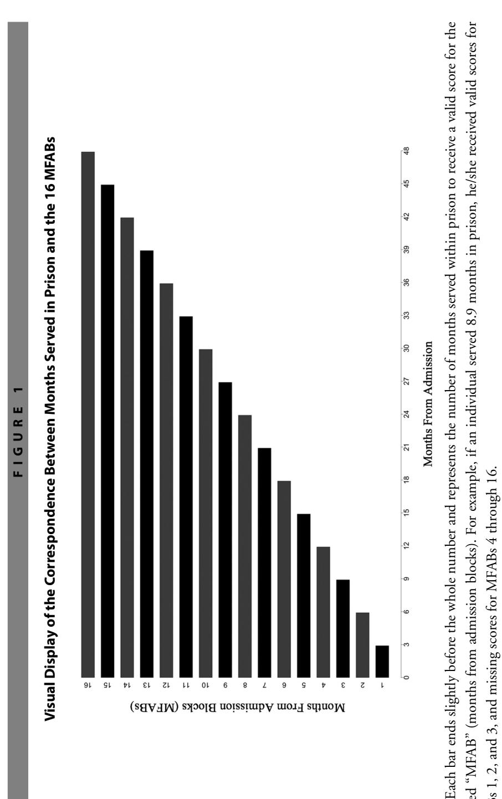
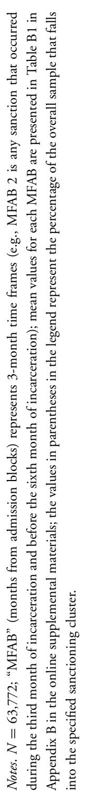
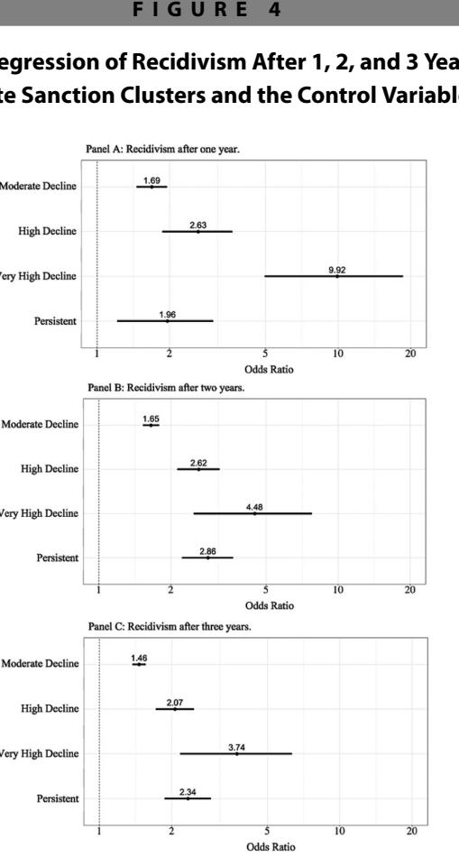

# RESEARCH ARTICLE

## **WITHIN-PRISON SANCTIONING AND RECIDIVISM**

# Ensnarement During Imprisonment

Re-Conceptualizing Theoretically Driven Policies to Address the Association Between Within-Prison Sanctioning and Recidivism

**Ian A. Silver Joseph L. Nedelec** *University of Cincinnati*

#### **Research Summary**

*We used data collected during the Evaluation of Ohio's Prison Programs. The analytical sample of N* = *63,772 inmates represents one of the largest samples used to assess the association between within-prison sanctioning and recidivism. Latent class growth analysis (LCGA) demonstrated that five guilty sanctioning clusters existed within the data: Persistent (0.72%), Very High Decline (0.11%), High Decline (1.38%), Moderate Decline (27.03%), and Abstainers (70.75%). The examination of sanctioning cluster classification on post-release recidivism suggested that greater exposure to formal sanctions during imprisonment predicted recidivism 1, 2, and 3 years post-release.*

#### **Policy Implications**

*The outcome of the empirical analysis suggested an association between within-prison sanctioning clusters and recidivism. Furthermore, longitudinal sanctioning clusters exposed to higher levels of within-prison sanctioning possessed a greater probability of recidivism 1, 2, and 3 years post-release. If replicated, two policy implications could be derived from the contextualization of these results within the ensnarement framework.*

Additional supporting information can be found in the listing for this article in the Wiley Online Library at [http://onlinelibrary.wiley.com/doi/10.1111/capp.2018.17.issue-4/issuetoc.](http://onlinelibrary.wiley.com/doi/10.1111/capp.2018.17.issue-4/issuetoc)

This work was supported by the Ohio Department of Rehabilitation and Correction. All conclusions or opinions expressed are those of the authors and not of the Ohio Department of Rehabilitation and Correction. Direct correspondence to Ian A. Silver, School of Criminal Justice, University of Cincinnati, TDC 560-O, Cincinnati, OH 45221-0389 (e-mail: silveria@ucmail.uc.edu).

*First, it is recommended that the frequency and severity of sanctions be reduced, to the extent possible, during imprisonment. Second, increased access to prosocial opportunities (e.g., rehabilitation programs) during sanctioning efforts is also encouraged based on the analyses.*

#### **Keywords**

*prison sanctioning, sanctioning clusters, ensnarement, inmate recidivism, rehabilitation during sanctioning, latent class growth analysis, within-prison antisocial behavior*

For the past three decades life-course criminology has generated substantive advancements in our understanding of antisocial continuity and discontinuity (e.g., DeLisi and Piquero, 2011; Moffitt, 1993; Sampson and Laub, 1995, 2003). At the forefront of this endeavor has been Moffitt's developmental taxonomy (1993; DeLisi, 2013; Moffitt, 2006a, 2007). Although numerous key hypotheses existed within the original formulation that are relevant to recidivism, of particular interest is Moffitt's (1993) ensnarement hypothesis. In essence, the ensnarement hypothesis argues that entrapment within the antisocial lifestyle and variation in subsequent antisocial trajectories is a function of decreased access to prosocial opportunities, resulting from the exposure to and the accumulation of negative life events (Moffitt, 1993). As such, even though negative life events can refer to a variety of adverse environmental stimuli resulting from preceding antisocial actions, sanctions implemented by the criminal justice system are generally considered the most detrimental (Moffitt, 1993, 1997, 2006a).

Although criminal justice sanctions, in general, have been of interest in the corrections literature, recent scholarship in this area has primarily focused on within-prison sanctions (Clark and Rydberg, 2016; Kigerl and Hamilton, 2016; Labreque, 2016; Marquart and Trulson, 2016; Matejkowski, 2017; Viglione, Lerch, Rudes, and Taxman, 2016). Specifically, the focus has shifted toward assessing the link between disciplinary segregation, security classification, or other punishments and subsequent antisocial tendencies (e.g., Cochran and Mears, 2017; Garcia et al., 2016; Marquart and Trulson, 2016; Mears and Bales, 2010). Overall, findings have suggested a link between some within-prison sanctions and recidivism (e.g., Cochran and Mears, 2017; Lovell, Johnson, and Cain, 2007). Nevertheless, although the scholarship has been informative, the theoretical explanations and policy implications have been generally limited, unclear, and primarily focused on reducing or removing practices that are perceived to deprive inmates of social freedoms (Mears, 2016). Furthermore, the policies generated from deprivation theory often disregard the existence of alternative theoretical explanations for the association between within-prison sanctioning and recidivism (e.g., Arrigo and Bullock, 2008; Browne, Cambier, and Agha, 2011; Henderson, 2015; Lucas and Jones, 2017). In an effort to address the limitations of the prior literature, the current article offers a re-conceptualization and reexamination of the empirical association between within-prison sanctioning and recidivism in an effort to develop policy implications that are not dependent on deprivation theory and are suitable to a wide variety of correctional departments.

## **Ensnarement Hypothesis**

Though Moffitt's (1993) developmental taxonomy provided various hypotheses describing the causes of antisocial behavior, of importance to the current study is the ensnarement hypothesis. Consistent with explanations offered by other life-course perspectives (e.g., Piquero, 2008; Piquero, Brame, and Lynam, 2004; Piquero and Moffitt, 2010; Sampson and Laub, 1995), the ensnarement hypothesis relies heavily on the cumulative effects of negative life events. Ensnarement is characterized as the cumulative effects of diminished access to prosocial opportunities resulting from participation in antisocial activities, which in turn reinforces the reliance on antisocial behavior to cope with the circumstances (Moffitt, 1993, 2006a). Generally, access to prosocial opportunities is diminished through exposure to negative life events. Although one severe negative life event (e.g., imprisonment) can result in ensnarement, Moffitt (1993) has argued that the frequency of exposure to negative life events is the primary factor ensnaring individuals in the antisocial lifestyle. Thus, when compared to only a single negative life event, multiple events such as being arrested, expelled from school, and removed from a household increases the probability of ensnarement in an antisocial lifestyle (Moffitt, 2006b, 2007). Contemporary scholars assessing the validity of the ensnarement hypothesis have generally provided support for Moffitt's (1993) assertions. They have illustrated that substance abuse, gang affiliation, and overall antisocial involvement are associated with longer antisocial trajectories (Hussong, Curran, Moffitt, Caspi, and Carrig, 2004; Petkovsek, Boutwell, Barnes, and Beaver, 2016), higher rates of poor health outcomes (Odgers et al., 2007), and psychiatric disorders (Moffitt, 2006a; Odgers et al., 2007), respectively.

## **Potential for Within-Prison Ensnarement**

Although originally proposed as the theoretical reasoning for the existence of continuity in antisocial behavior, the relevance of the ensnarement hypothesis is widespread (Moffitt, 1993). This is especially true when considering noncommunity environments that rely heavily on sanctions that diminish access to prosocial opportunities. Within prison the pervasiveness of sanctions cannot be understated (Shalev, 2009). Specifically, as outlined by correctional scholars (e.g., Lovell and Jemelka, 1996; Marquart and Trulson, 2016; Shalev, 2009), prison sanctions are often perceived by correctional staff as a necessary mechanism for controlling disobedient inmates and function as both deterrent and retributive punishments for unruly inmates. Although differences in the use and severity of the sanctions exist in the field, three punishments are generally found across agencies and prisons: disciplinary segregation, increased security classification, and the removal of privileges (Marquart and Trulson, 2016). As outlined in this article, these punishments often remove access to prosocial opportunities within prison and can potentially diminish access to prosocial opportunities upon release from prison.1

Often regarded as the most severe punishment instituted by correctional agencies, disciplinary segregation, which is also termed *solitary confinement*, generally refers to the social isolation of inmates within prison cells (Labreque, 2016). Disciplinary segregation is also one of the most pervasive forms of punishment within U.S. correctional facilities (Butler and Steiner, 2017; Morgan et al., 2016; Rogers, 1993). In essence, disciplinary segregation isolates disobedient inmates from the general population by incarcerating them in singleand sometimes double-person units for up to 23 hours per day (Shalev, 2009). During the 23 hours in isolation, inmates receive limited social interactions and are essentially stripped of all privileges. Generally, the 24th hour is reserved for recreation time in which the inmates are encouraged to exercise. The recreation time can also occur in isolation or with other inmates, and the isolation component varies widely depending upon the facility. Scholars have argued that disciplinary segregation can aggravate psychological problems, which in turn could potentially reduce access to prosocial opportunities upon release from prison (e.g., Fellner and Mariner, 1997; Haney, 2009; Kupers, 2008; Lovell, 2008; Toch, 2003). However, some evidence refutes this contention suggesting that the structural characteristics associated with disciplinary segregation do not aggravate psychological problems but potentially result in the inability to maintain employment, peer-networks, and educational goals upon release into the community as a function of reduced access to rehabilitative programming (Gendreau and Lebreque, 2016).

Similar to disciplinary segregation, staff at correctional facilities transfer disobedient inmates to higher security facilities. Generally, although designations differ, correctional departments have a hierarchical structure to their security classification, where the most disobedient and dangerous inmates are housed in the most secure facilities (Bonta and Motiuk, 1992; Glaser, 1987). Furthermore, the most secure facilities mimic the structure of disciplinary segregation, where inmates are housed in single- or double-inmate cells for approximately 23 hours a day (National Institute of Corrections, 1997; Pizarro, Zgoba, and Haugebrook, 2014; Rhodes, 2004). Importantly, each incremental increase in security classification is generally associated with commensurate loss of privileges (Bonta and Motiuk, 1992; Glaser, 1987; Pizarro, Stenius, and Pratt, 2006; Toch, 2001). For example, inmates housed in supermax prisons generally have limited treatment opportunities,

1. Although Moffitt's (1993) ensnarement hypothesis is a theoretically justifiable explanation of the association between within-prison sanctioning and subsequent recidivism, stark differences exist between community samples and prison samples. One relevant difference is the general knowledge that incarcerated individuals have engaged in a serious pattern of offending. Furthermore, a pattern of serious offending preceding imprisonment could increase the probability of ensnarement during imprisonment or recidivism. As such, even though the mechanisms of ensnarement remain the same, the functionality of ensnarement might differ from Moffitt's (1993) original proposition when discussing incarcerated populations.

limited educational opportunities, and limited contact with any potential prosocial peers (e.g., family members; Mears, 2013). Furthermore, higher security prisons generally provide less reentry opportunities than their lower security counterparts (Pizarro et al., 2006). Some scholars have argued that the limited reentry opportunities and limited rehabilitation efforts associated with higher security prisons could potentially diminish access to employment and prosocial peers upon reentry into the community (e.g., Gaes and Camp, 2009; Lovell et al., 2007; Smith, 2006).

In addition to disciplinary segregation and increased security classification, correctional agencies institute a wide variety of formal punishment to decrease disobedience amongst correctional populations (Marquart and Trulson, 2016). For example, correctional agencies will remove individuals from rehabilitation programming, restrict movement within the correctional facility, reassign cells, restrict commissary, decrease the possibility of parole, restrict employment opportunities, and remove visitation (Marquart and Trulson, 2016). As suggested by the commonality between the punishments, they are generally designed to remove privileges from the inmates and encourage prosocial behavior. Nonetheless, these punishments could have a detrimental effect on post-imprisonment recidivism because the sanctions generally result in the removal of prosocial opportunities for the inmates. For instance, by removing inmates from treatment opportunities, correctional agencies could be diminishing the ability of inmates to develop meaningful behavioral change or generate interpersonal relationships with prosocial actors upon release (Camp and Gaes, 2005; Chen and Shapiro, 2007; Lovell et al., 2007). Furthermore, the removal of inmates from treatment opportunities could be indicative of the inability to maintain fidelity. The fidelity principle of the risk–need–responsivity (RNR) model argues that variation in the execution of the principles of effective intervention during program implementation can impact the effectiveness of rehabilitation programs (Latessa and Lowenkamp, 2005). Sanctioning inmates with the removal from treatment opportunities could diminish the adherence to the principles of effective intervention through the inability to maintain both dosage and regulated exposure to rehabilitative efforts.

### *Examining Within-Prison Ensnarement*

Although the effects of within-prison sanctions on post-release antisocial behavior have been examined by a variety of scholars (e.g., Berecochea and Gibbs, 1991; Camp and Gaes, 2005; Chen and Shapiro, 2007; Cochran and Mears, 2017; Gaes and Camp, 2009; Lovell et al., 2007; Pizarro et al., 2014; Smith, 2006), potential limitations still exist. Currently, most of the empirical literature in which within-prison sanctions is assessed is focused on the severity of a single sanction, rather than on the effects of exposure to within-prison sanctions (i.e., severity vs. frequency; Mears, 2016). Only recently have scholars begun to examine the effects of frequency of within-prison sanctions on post-release recidivism. For example, Cochran and Mears (2017) used group-based trajectory analysis (GBTA) to analyze the association between guilty misconduct clusters (i.e., inmates who were sanctioned for behavioral infractions) and felony recidivism within a 3-year period. The results provided support for their hypothesis that the clusters with a higher average number of misconducts across various time periods would recidivate at higher rates than clusters with a lower average number of misconducts. The authors concluded that variation in within-prison offending predicts variation in post-release offending. Although the findings lend *prima facie* support for a potential within-prison ensnarement effect, the scholars provided limited theoretical justifications and policy implications associated with the findings.

Overall, scholarship on the association between within-prison sanctioning and recidivism has been limited in three ways. First, scholars have generally assumed and created policies that rely on the hypothesis that the social deprivation associated with within-prison sanctions results in psychological harm for inmates (e.g., Grassian, 1983; Haney, 2008, 2009). Such practices are driven by reliance on deprivation theory. Quantitative findings, however, have demonstrated that the hypothesized effects of deprivation (e.g., psychological harm) are rarely associated with within-prison sanctions (O'Keefe, Klebe, Stucker, Sturm, and Leggett, 2010; O'Keefe et al., 2013). Second, consistent with the first limitation, prior scholarship has examined the severity of within-prison sanctioning with little consideration for the effects of the *frequency* of within-prison sanctioning on subsequent antisocial tendencies (Mears, 2016; Sturgess, Woodhams, and Tonkin, 2016). Although the severity of sanctioning is important, the ensnarement hypothesis would argue that the frequency of within-prison sanctioning could influence subsequent antisocial tendencies to a higher degree than the severity of a single sanction (Moffitt, 1993). Finally, prior scholarship in which the association between within-prison sanctioning and recidivism has been assessed has generally been limited regarding the sample size and sentence length of inmates (e.g., Camp and Gaes, 2005; Cochran and Mears, 2017; Gaes and Camp, 2009). Overall, in the current study, we address these limitations through examining the frequency of inmate sanctioning over a 4-year period on a state-wide representative sample of inmates and employ the ensnarement hypothesis to contextualize the findings and guide the development of various policy implications.

## **Current Study**

Informed by Moffitt's (1993) ensnarement hypothesis, one can theorize that the frequency of exposure to within-prison sanctioning generates an increased likelihood of recidivism post-release. A potential mechanism for this association could be the reduction in prosocial opportunities (e.g., rehabilitation programs) resulting from within-prison sanctioning. With this theoretical consideration in mind, we re-contextualized the association between sanctioning clusters (i.e., clusters of individuals who received formal punishments) and inmate recidivism in an effort to develop logical and prevalent policy implications for correctional departments. Moffitt's (1993) ensnarement hypothesis is used to guide the development of various policy implications designed to increase access to prosocial opportunities during sanctioning efforts. Following the guidance of prior research in this area (Cochran and Mears, 2017) we assess the association between longitudinal variation in the frequency of exposure to within-prison sanctions and recidivism. Consistent with prior scholarship aimed at examining the effects of inmate behavior on recidivism, latent class growth analysis (LCGA) is used to assess the existence of sanctioning clusters within prison (e.g., Cochran and Mears, 2017). Additionally, binary logistic regression analysis is employed to assess whether classification into a sanctioning cluster predicts post-release recidivism. The analytical sample of *N* = 63,772 inmates represents the largest assessment of sanctioning clusters in prison to date.

## **Methods**

## *Sample*

The data were collected during the Evaluation of Ohio's Prison Programs study conducted by the University of Cincinnati Corrections Institute (UCCI). The Evaluation of Ohio's Prison Programs study, which began in 2011, involved the retrospective collection of official information from the Ohio Department of Rehabilitation and Correction (ODRC) on a variety of topics for inmates incarcerated between January 2008 and June 2012. For example, demographic information, prison misconduct, prison programming, and recidivism were collected from 105,945 cases (88,621 unique individuals). For a more thorough review of the Evaluation of Ohio's Prison Programs study, please see Latessa, Lugo, Pompoco, Sullivan, and Wooldredge (2015); Pompoco, Wooldredge, Lugo, Sullivan, and Latessa (2017); and Lugo, Wooldredge, Pompoco, Sullivan, and Latessa (2017). As a result of the 3-year followup period for offender recidivism, the sample was limited to participants who were released prior to January 1, 2013 (*N* = 64,240). An additional 468 individuals were removed from the analytical sample because they were younger than 18 years of age at admission.2 In total, the analytical sample for the current study was *N* = 63,772 inmates.

## *Measures*

*Dependent variable in LCGA: Frequency of sanctioning.* Corresponding with prior literature on within-prison antisocial behavior, we employed a stringent definition of institutional sanctioning (e.g., Lugo et al., 2017; Pompoco et al., 2017). Herein, *sanctioning* refers to an infraction subjected to a rules infraction board (RIB) hearing, in which the inmate was found guilty and was formally punished. Although more conservative than other operationalizations of sanctioning, the current measure limits potential bias introduced by correctional officers (Steiner and Wooldredge, 2014). Specifically, previous scholars have indicated that correctional officers might excessively ticket and punish inmates for noncriminogenic behaviors (i.e., behaviors that would not be subjected to a RIB hearing;

2. Four hundred and sixty-eight cases were removed because they were younger than 18 years of age at the time of their admission into prison. These cases were removed from the analytical sample because the policy implications provided in the current study are not intended to apply to juvenile corrections.

Steiner and Wooldredge, 2014). Seven types of infractions can be subjected to RIB hearings: violence, drug, property, disturbance, escape, weapons, and all other infractions (Latessa et al., 2015; Pompoco et al., 2017). The Evaluation of Ohio's Prison Programs study captured three measures associated with inmate sanctions: type of infraction, date of inmate sanction, and outcome associated with the inmate sanction. In an effort to create longitudinally standardized frequency of sanctioning variables, we only used the date of inmate sanction to identify if and when an inmate was sanctioned for a behavioral infraction.

A three-step process was used to standardize the data longitudinally. First, we created standardized months from admission blocks (hereafter known as "MFABs") as an indicator of the amount of time an inmate served in prison. The 16 standardized MFABs signify 3-month time intervals conditioned upon the inmates' admission and release dates. Figure 1 provides a visual representation of the time intervals for each MFAB. Second, through the employment of a *date of inmate sanction measure*, each inmate sanction was classified into 1 of the 16 MFABs, corresponding to the 3-month time period in which the inmate sanction occurred. For example, a MFAB of "1" represents that the inmate sanction occurred between 0.0 and 2.9 months from admission and a MFAB of "16" represents that the inmate sanction occurred between 45.0 and 47.9 months from admission. In the preceding example, a MFAB of "16" only represents the time from admission in which the inmate sanction occurred. Third, the inmate sanctions were totaled, generating a *frequency of inmate sanctions* variable for each valid MFAB. For instance, a value of "6" at MFAB 3 represents that the inmate was incarcerated in prison and received six sanctions between 6.0 and 8.9 months from his or her admission date. A value of "0" was recorded if the inmate was incarcerated and no inmate sanction occurred during that MFAB. Notably, all MFABs after an inmate's release from prison were classified with missing values. The *frequency of inmate sanctions* variable for each valid MFAB was employed as the longitudinal dependent variable for the latent class growth analysis (LCGA).

*Dependent variable in binary logistic regression analysis: Recidivism.* Consistent with the prior literature, we defined *recidivism* as the reincarceration of an individual within ODRC for a new crime (Lugo et al., 2017; Pompoco et al., 2017). Notably, although the definition of recidivism was conservative, the measure diminishes the potential biases associated with more common operationalizations of recidivism such as rearrest (Maltz, 1984). Furthermore, as a result of potential biases associated with technical violations (e.g., being sent back to prison for not paying court fees), only reincarceration for a new crime was counted as recidivism (Maltz, 1984).3 Within the Evaluation of Ohio's Prison

3. In an effort to demonstrate the validity of our primary dependent variable (i.e., reincarceration of an individual within ODRC for a new crime), we conducted subsequent analyses where both new crimes and technical violations were included in our dependent variable. The results of these analyses are presented in Appendix E in the online supplemental material, as well as illustrated findings similar to the results described within the main text. Nonetheless, we present the findings of analyses with technical

Volume 17 -Issue 4 **1013**

*Notes*. specified

MFABs Programs data set, three time-based measures of recidivism were captured: reincarceration for a new crime within ODRC 1, 2, and 3 years after release, respectively. All three measures were demarcated respectively and dichotomously coded such that "0" represented that an individual was not reincarcerated for a new crime within ODRC up to 3 years after their release, and "1" represented that an individual was reincarcerated for a new crime within ODRC up to 3 years after their release.

*Control variables.* Eleven variables theoretically and empirically related to recidivism were included as covariates in the multivariate analyses conducted in the current study (see Andrews and Bonta, 2010; Bales and Piquero, 2012; Cochran and Mears, 2016; Liebling and Maruna, 2013; Moffitt, 1993; Steiner and Wooldredge, 2014). First, a measure of *cognitive abilities* was created using the Comprehensive Adult Student Assessment Survey (CASAS) placement exam. The CASAS BOP exam provides two scores specifying an inmate's proficiencies in reading and math on a scale between 160 and 270 (CASAS, 2012, 2014). We operationalized cognitive abilities as the average of the reading and math scores. Second, *age* was captured as the inmate's age at arrival at ODRC's Correctional Reception Center (CRC). Third, a measure tapping the number of *prior prison sentences* was created based on the number of prior ODRC identification numbers received preceding an inmate's current incarceration. Fourth, *male,* which was captured dichotomously (0 = female, 1 = male), indicated the sexual specification of the inmate. Fifth, *non-White* captured the racial category the inmate was classified as upon their arrival to the CRC (0 = White, 1 = non-White). Sixth, *Hispanic* was measured dichotomously, where "0" represented that the inmate was non-Hispanic, and "1" represented that the inmate was Hispanic. Seventh, *moderate/high reentry accountability plan (RAP)* was a dichotomous measure of static risk factors captured by ODRC (0 = low RAP score; 1 = moderate/high RAP score).4 Eighth, the variable *no programming* dichotomously measured participation in reentry approved programming (i.e., programs expected to decrease recidivism) during imprisonment (0 = participated in programming, 1 = did not participate in programming). Ninth, *security level* was measured as the security classification of the prison where the inmate is housed (1 = minimum security, 2 = low/moderate security, 3 = moderate security, 4 = maximum security, and 5 = super maximum security). Tenth, *sex offender* measured if the current incarceration resulted from an offense that was sexual in nature (0 = current offense was not sexual in nature, 1 = current offense was sexual in nature). Finally, *mental health*

violations removed from the operationalization of the dependent variable to be consistent with best methodological practices (Lugo et al., 2017).

4. Please note that this measure has not been validated and was only used to control for variation in static risk factors. Specifically, the RAP was created to help correctional officers develop a reentry plan for inmates. The RAP only measures criminal history, gender, and age. Furthermore, as noted by the descriptive statistics, the RAP scores are divergent from contemporary knowledge and should only be considered a control variable within the current study.

*diagnosis* measured if the inmate received treatment during incarceration for any mental health problems (0 = did not receive treatment for mental health problems; 1 = did receive treatment for mental health problems). Only individuals who were diagnosed with a mental health disorder from a professional psychologist were coded as a "1" for this variable.

## *Analytical Strategy*

We employed a four-step analytical strategy to evaluate the relationship between withinprison sanctioning clusters and recidivism upon release from prison. First, descriptive statistics and bivariate statistics were generated for the entire sample and for the inmate sanctioning subsample.5 As detailed in succeeding sections, the inmate sanctioning subsample was created to account for the potential limitations associated with LCGA. Second, frequency of misconduct for each of the 16 MFABs were subjected to LCGA to assess the existence of longitudinal sanctioning clusters. Third, the identified clusters were subjected to an analysis of variance (ANOVA).6 Fourth, three binary logistic regression analyses were conducted where the identified clusters and the control variables were used to predict recidivism after 1, 2, and 3 years, respectively.

*Latent class growth analysis.* As one of the foremost techniques for identifying longitudinal behavioral clusters within a sample, LCGA is especially advantageous for examinations where clusters of longitudinal variation could potentially exist (Cihan, Davidson, and Sorensen, 2017; Cihan, Sorensen, and Chism, 2017; Moffitt, 1993; Nagin, Farrington, and Moffitt, 1995; Nagin and Land, 1993; Reidy, Cihan, and Sorensen, 2017). Specifically, although scholars have employed other methodologies for classifying individuals into longitudinal trajectories (e.g., Moffitt, Caspi, Dickson, Silva, and Stanton, 1996; Moffitt, Lynam, and Silva, 1994), LCGA relies on a series of robust statistical estimations to generate the least biased prediction of unobserved clustering within longitudinal data. In summary, LCGA is one adaptation of growth mixture modeling that uses maximum likelihood estimations and expectation maximization algorithms to probabilistically classify individuals into unobserved longitudinal clusters (Muthen, 2004; Nagin, 1999; Nagin and Land, 1993; ´ Nagin and Odgers, 2010). To state differently, LCGA identifies statistical clusters (i.e., groups of cases that are statistically different from each other) on a longitudinal dependent variable of interest. As a result of the statistical limitations of LCGA, scholars must approximate multiple models to determine the number of behavioral clusters theoretically and empirically appropriate for the sample (Nagin and Land, 1993; Muthen, 2004). Gener- ´ ally, empirical appropriateness has been established through reliance on fit criteria statistics

5. The results of the descriptive statistics and bivariate analyses are presented in the appendix material.

6. Please note that the primary text only presents the results of the ANOVA examination; the results of the binary logistic regression analyses predicting class membership are presented in Table C1 of Appendix C in the online supplemental material.

such as -2loglikelihood, Bayesian information criterion (BIC), and the Akaike information criterion (AIC; Hickert, Tahamont, and Bushway, 2017; Nagin, 2005).

The various LCGA within the current study were estimated using a three-step process. First, as a result of the statistical limitations associated with LCGA, an Abstainers cluster was identified and removed from the analytical sample prior to the LCGA.7 Specifically, corresponding to prior scholarship (e.g., Moffitt et al., 1996; Moffitt, Caspi, Harrington, and Milne, 2002; Nagin et al., 1995), the Abstainers were identified as individuals who never received a sanction during their incarceration. In total, the Abstainers cluster encompassed 45,210 inmates (70% of the analytical sample). Second, after the removal of the Abstainers, a subsample of inmates who had received at least one sanction during their incarceration was created. This subsample, labeled as the inmate sanctioning subsample, included 18,652 inmates (30% of the analytical sample) with 121,250 observations across the 16 MFABs and formed the analytical sample for the LCGA. Finally, nine different LCGA models were estimated including five linear models (one-group to five-group, inclusive) and four quadratic models (one-group to four-group, inclusive).

Generally, the findings from prior corrections scholarship in which LCGA was employed have indicated that unbalanced data designs might bias the identification of clusters (e.g., Cochran and Mears, 2017; Hickert et al., 2017). At the forefront of these concerns is the misclassification of inmates into the longitudinal clusters resulting from the variation in sentence length (Cochran and Mears, 2017). Although the misclassification is a reasonable concern, the mathematical calculations conducted during LCGA are generally robust and rarely result in the misclassification of individuals into longitudinal clusters when using an unbalanced data design (Muthen, 2004; Nagin and Land, 1993). Notably, these concerns ´ have been directly addressed by Nagin and Tremblay (2005), who reiterated that LCGA is a probabilistic process based on a semi-parametric statistical technique that clusters observations together by comparing the probability of falling into one cluster when compared to another cluster. Furthermore, the primary factor increasing the probability of misclassifying individuals into longitudinal clusters is the misspecification of the model, which is why multiple iterations of LCGA are suggested by a variety of scholars (e.g., Muthen, 2004; ´ Nagin and Land, 1993; Nagin and Tremblay, 2005) and followed herein. In summary, we employ LCGA to assess the association between longitudinal sanctioning clusters and recidivism amongst inmates released from prison.

#### **Results**

Figure 2 presents the mean number of sanctions for the entire sample and the inmate sanctioning subsample. For simplicity, the results will be described in terms of "MFAB." As

7. We recognize that imprisoned individuals do not abstain from antisocial activity. The label was primarily used to clearly delineate between individuals that did receive sanctions during prison and individuals that did not receive sanctions during prison.

for 17459133, 2018, 4, Downloaded from https://onlinelibrary.wiley.com/doi/10.1111/1745-9133.12397 by Utrecht University, Wiley Online Library on [18/03/2025]. See the Terms and Conditions (https://onlinelibrary.wiley.com/terms-and-conditions) on Wiley Online Library for rules of use; OA articles are governed by the applicable Creative Commons License

(e.g.,

a reminder, each MFAB (months from admission blocks) captures 3-month time intervals conditioned on an inmate's incarceration within ODRC. For instance, the MFAB 1 refers to 0.0 to 2.9 months from incarceration, MFAB 9 denotes 24.0 to 26.9 months from incarceration, and MFAB 16 represents 45.0 to 47.9 months from incarceration (see Appendix A in the online supplemental material). As presented within Figure 2, the mean trajectory line for the entire sample appears relatively stable across the 16 MFABs. However, the trajectory line for the inmate sanctioning subsample peaks at MFAB 1 (0.0 to 2.9 months from incarceration), steadily declines until MFAB 8 (21.0 to 23.9 months from incarceration), increases slightly between MFAB 9 (24.0 to 26.9 months from incarceration) and MFAB 10 (27.0 to 29.9 months from incarceration), and declines between MFAB 11 (30.0 to 32.9 months from incarceration) and MFAB 16 (45.0 to 47.9 months from incarceration). Appendix A, Table A2, presents the mean number of sanctions, the *N* size, and the range of inmate sanctions received for both the entire sample and the inmate sanctioning subsample across the 16 MFABs. As illustrated in Table A2, the majority of individuals received a small number of sanctions during each MFAB, whereas the highest number of sanctions an inmate received during any single MFAB was 24.

## *Latent Class Growth Analysis*

Presented in Table 1 are the summary statistics for the nine LCGA models. The LCGA were estimated using the inmate sanctioning subsample (i.e., only those individuals who received at least one guilty misconduct during their incarceration) and the "LCMM" command

|           |                 |            | TAB LE 1 |               |                                               |          |          |
|-----------|-----------------|------------|-------------|---------------|-----------------------------------------------|----------|----------|
|           | Summary         | Statistics | for the  | Seven LCGA | Models                                        |          |          |
|           |                 |            |             |               | Proportion of Cases (Posterior Probabilities) |          |          |
| Model     | -2loglikelihood | BIC        | AIC         | Group 1       | Group 2                                       | Group 3  | Group 4  |
| Linear    |                 |            |             |               |                                               |          |          |
| 1 group   | –148406.81      | 296843.11  | 296819.61   | 1.00(1.00)    | —                                             | —        | —        |
| 2 group   | –141719.72      | 283498.45  | 283451.45   | .95(.99)      | .05(.91)                                      | —        | —        |
| 3 group   | –140278.69      | 280645.88  | 280575.38   | .93(.98)      | .06(.89)                                      | .01(.93) | —        |
| 4 group   | –139576.28      | 279270.56  | 279176.55   | .92(.96)      | .05(.86)                                      | .01(.98) | .03(.79) |
| 5 group   | –140279.36      | 280706.24  | 280588.73   | .92(.75)      | .08(.83)                                      | .01(.94) | —        |
| Quadratic |                 |            |             |               |                                               |          |          |
| 1 group   | –148198.64      | 296436.62  | 296405.28   | 1.00(1.00)    | —                                             | —        | —        |
| 2 group   | –141506.30      | 283091.28  | 283028.61   | .95(.99)      | .05(.91)                                      | —        | —        |
| 3 group   | –140063.93      | 280236.03  | 280149.86   | .93(.98)      | .06(.89)                                      | .01(.93) | —        |
| 4 group   | –140063.93      | 280265.53  | 280155.86   | .93(.98)      | .06(.89)                                      | .01(.93) | —        |

*Notes*. Best fit model is presented in **bold**; as a result of the strict convergence criteria associated with the LCMM package in R, the 5 group linear model and the 4 group quadratic model did not converge; "—" indicates that the group was not represented within the model.

in the statistical program R. As a result of the strict convergence criteria associated with this package, the five-group linear model and the four-group quadratic model did not converge upon a local norm.8 As noted by various scholars (e.g., Hickert et al., 2017; Nagin, 2005; Nagin, 1999; Nagin and Land, 1993; Nagin and Odgers, 2010), the best fit model can be designated by the lowest values on the -2loglikelihood, BIC, and AIC fit statistics. Following the criteria set forth by prior scholarship (Nagin, 2005), the four-group linear model appeared to be the best fit model (–2loglikelihood = –139576.28; BIC = 279370.56; AIC = 279176.55).

Figure 3 displays the mean number of sanctions for the four clusters estimated by the LCGA and the Abstainers cluster across the 16 MFABs.9 As indicated by the legend for Figure 3, the five sanctioning clusters were labeled as Persistent (*N* = 462; 0.72%), Very High Decline (*N* = 73; 0.11%), High Decline (*N* = 877; 1.38%), Moderate Decline (*N* = 17,240; 27.03%), and Abstainers (*N* = 45,210; 70.75%). Despite being the smallest sanctioning cluster, the Very High Decline sanctioning cluster had the highest mean number of sanctions from MFAB 1 (0.0 to 2.9 months from incarceration; 5.33 sanctions per individual) to MFAB 13 (36.0 to 38.9 months from incarceration; 1.10 sanctions per individual).

Although the Very High Decline sanctioning cluster had the highest number of sanctions for the majority of the MFABs, the Persistent sanctioning cluster was the only group that experienced an increase in the number of sanctions between MFAB 1 (0.0 to 2.9 months from incarceration) and MFAB 9 (24.0 to 26.9 months from incarceration). After MFAB 9 (24.0 to 26.9 months from incarceration), the mean number of sanctions for the Persistent sanctioning cluster appeared to stabilize and slightly decline until MFAB 16 (45.0 to 47.9 months from incarceration). In reference to the High Decline and the Moderate Decline sanctioning clusters, a similar pattern of consistent decline between MFAB 1 (0.0 to 2.9 months from incarceration) and MFAB 16 (45.0 to 47.9 months from incarceration) was observed. Table B1 in Appendix B presents the results of the ANOVA analyses conducted to examine whether the mean number of sanctions per MFAB differed between the five sanctioning clusters. The results indicated that the largest mean differences were observed at MFAB 1 (0.0 to 2.9 months from incarceration; *F*(4, 63175) = 30256.04, *p <* .05) and the smallest mean differences were observed at MFAB 16 (45.0 to 47.9 months from incarceration; *F*(4, 2487) = 118.56, *p <* .05).

17459133, 2018, 4, Downloaded from https://onlinelibrary.wiley.com/doi/10.1111/1745-9133.12397 by Utrecht University, Wiley Online Library on [18/03/2025]. See the Terms and Conditions (https://onlinelibrary.wiley.com/terms-and-conditions) on Wiley Online Library for rules of use; OA articles are governed by the applicable Creative Commons License

8. Please note that despite variation in the initializing values and increasing the maximum number of iterations, the five-group linear model and the four-group quadratic model did not satisfying the convergence criteria associated with the "LCMM" package in R. Divergent from other statistical software, Proust-Lima et al. (2015) designed the "LCMM" package with a three-way convergence criteria that require the simultaneous satisfaction of the parameter stability, the log-likelihood stability, and the size of the derivatives at the .0001 level. The current authors' position was that the stringent convergence criteria associated with this package provided a more robust examination of behavioral clusters than other methodologies.

9. The Abstainers sanctioning cluster was removed from the sample prior to the LCGA.

| MFABs 6 1 the Across                                                                 |  | occurred in falls B1 that Table mple that in sa sanction presented overall any the are of is MFAB percentage 2 MFAB each (e.g., for the values mes                                                                                                                       |
|--------------------------------------------------------------------------------------------------|--|-----------------------------------------------------------------------------------------------------------------------------------------------------------------------------------------------------------------------------------------------------------------------------------------------------------------------------------------------------------|
| Clusters Sanctioning Five the for Sanctions Prison of mber Nu Mean |  | represent fra mean me legend ti incarceration); month the 3- in represents parentheses of month blocks) in sixth values mission the the before materials; ad m and fro incarceration months mental supple ( MFAB" of online month " the |

**1020** *Criminology & Public Policy*

**FIGURE**

 **3**

Table 2 displays the descriptive statistics and the results of the ANOVA analysis for the five sanctioning clusters. As indicated by the results, the five clusters significantly differ on the mean level of recidivating after 1 year (*F*(4, 63175) = 298.83, *p <* .05), 2 years (*F*(4, 63175) = 1003.60, *p <* .05), and 3 years (*F*(4, 63175) = 1070.10, *p <* .05). Specifically, the Very High Decline sanctioning cluster possessed the highest percentage of individuals who recidivated after 1 year (23%), 2 years (34%), and 3 years (44%), and the Abstainers cluster had the lowest percentage of individuals who recidivated after 1 year (2%), 2 years (5%), and 3 years (8%).

#### *Predicting Recidivism*

Figure 4 presents the results of the binary logistic regression models, where the five sanctioning clusters and the control variables were used to predict recidivism after 1, 2, and 3 years. Please note that the Abstainers cluster served as the reference category for the five sanctioning clusters in the three binary logistic regression models. As illustrated in Panel A, the odds of recidivating within the first year post-release for the Very High Decline sanctioning cluster was approximately 9.92 times higher than the odds of recidivating for the Abstainers cluster (*b* = 2.30, standard error [SE] = .33, odds ratio [OR] = 9.92, [OR 95% confidence interval {CI} = 4.96, 18.58], *p <* .05). In reference to the Persistent sanctioning cluster, the odds of recidivating within the first year after release were approximately 1.96 times higher than the Abstainers cluster (*b* = .67, SE = .23, OR = 1.96, [OR 95% CI = 1.21, 3.03], *p <* .05). Similar results were observed for both the High Decline (*b* = .97, SE = .17, OR = 2.63, [OR 95% CI = 1.86, 3.65], *p <* .05) and the Moderate Decline (*b* = .52, SE = .07, OR = 1.69, [OR 95% CI = 1.46, 1.95], *p <* .05) sanctioning clusters, where the odds of recidivating within the first year were approximately 2.63 and 1.69 times higher than the Abstainers cluster, respectively.

Panel B of Figure 4, which displays the results of models wherein recidivism after 2 years was regressed on the five sanctioning clusters and the control variables, illustrates a similar pattern of findings to those displayed in Panel A. Relative to the Abstainers cluster, the Very High Decline sanctioning cluster had approximately a 4.47 times increase in the odds of recidivism after 2 years (*b* = 1.50, SE = .29, OR = 4.47, [OR 95% CI = 2.49, 7.78], *p <* .05). Additionally, the Persistent sanctioning cluster (*b* = 1.05, SE = .13, OR = 2.86, [OR 95% CI = 2.23, 3.64], *p <* .05) had an increase in the odds of recidivism after 2 years of approximately 2.86 times the Abstainers cluster, whereas the High Decline sanctioning cluster (*b* = .96, SE = .10, OR = 2.62, [OR 95% CI = 2.13, 3.20], *p <* .05) had approximately a 2.62 times increase in the odds of recidivism after 2 years when compared to the Abstainers cluster. Finally, the odds of recidivism for the Moderate Decline sanctioning cluster were approximately 1.65 times higher after 2 years relative to the Abstainers cluster (*b* = .50, SE = .04, OR = 1.65, [OR 95% CI = 1.53, 1.79], *p <* .05).

The pattern of results for models predicting recidivism after 3 years followed the prior timeframes. As illustrated in Panel C of Figure 4, the Very High Decline sanctioning cluster

|                              |         | Persistent | (a)     | Very      | Decline High | (b)     | High      | Decline | (c)     | Moderate | Decline | (d)     |         | Abstainers | (e)     |            |
|------------------------------|---------|------------|---------|-----------|-----------------|---------|-----------|---------|---------|----------|---------|---------|---------|------------|---------|------------|
| Variable                     | X ¯  | SD         | Min,Max | X ¯    | SD              | Min,Max | X ¯    | SD      | Min,Max | X ¯   | SD      | Min,Max | X ¯  | SD         | Min,Max | Value F |
| Variable Dependent        |         |            |         |           |                 |         |           |         |         |          |         |         |         |            |         |            |
| 1 year Recidivism      | .05bde  | .23        | 0,1     | .23f      | .43             | 0,1     | .06bde    | .25     | 0,1     | .03f     | .18     | 0,1     | .02f    | .13        | 0,1     | 298.83*    |
| 2 year Recidivism      | .23bde  | .42        | 0,1     | .34f      | .48             | 0,1     | .20bde    | .40     | 0,1     | .11f     | .31     | 0,1     | .05f    | .22        | 0,1     | 1003.60*   |
| 3 year Recidivism      | .30f    | .46        | 0,1     | .44f      | .50             | 0,1     | .26f      | .44     | 0,1     | .15f     | .36     | 0,1     | .08f    | .28        | 0,1     | 1070.10*   |
| Variables Control         |         |            |         |           |                 |         |           |         |         |          |         |         |         |            |         |            |
| abilities Cognitive       | 226.84f | 13.12      | 172,261 | 222.08ade | 13.99           | 172,252 | 224.77ade | 13.13   | 172,256 | 228.46f  | 12.28   | 172,266 | 229.62f | 12.12      | 169,267 | 231.16*    |
| Age                          | 25.87de | 7.67       | 18,56   | 24.36de   | 8.14            | 18,55   | 26.28de   | 8.69    | 18,72   | 30.03f   | 9.39    | 18,80   | 34.44f  | 10.52      | 18,85   | 2718.40*   |
| sentences prison Prior | .94     | 1.44       | 0,10    | .66       | 1.22            | 0,7     | .95       | 1.62    | 0,11    | .98e     | 1.49    | 0,14    | .92d    | 1.52       | 0,16    | 9.46*      |
| Male                         | .93e    | .25        | 0,1     | .92e      | .28             | 0,1     | .93de     | .26     | 0,1     | .89ce    | .31     | 0,1     | .82abc  | .39        | 0,1     | 494.18*    |
| Non-White                    | .46b    | .50        | 0,1     | .74f      | .44             | 0,1     | .52bde    | .50     | 0,1     | .47bce   | .50     | 0,1     | .41bcd  | .49        | 0,1     | 172.87*    |
| Hispanic                     | .01     | .11        | 0,1     | .01       | .12             | 0,1     | .01       | .11     | 0,1     | .02      | .14     | 0,1     | .02     | .15        | 0,1     | 5.52*      |
| RAP Moderate/High         | .08e    | .27        | 0,1     | .10       | .31             | 0,1     | .06       | .24     | 0,1     | .06e     | .24     | 0,1     | .05ad   | .21        | 0,1     | 52.33*     |
| programming No            | .03cde  | .17        | 0,1     | .14       | .35             | 0,1     | .16a      | .36     | 0,1     | .13ae    | .33     | 0,1     | .19ad   | .39        | 0,1     | 301.44*    |
| level Security            | 2.58f   | .75        | 1,4     | 2.74f     | 1.01            | 0,5     | 2.29f     | .87     | 1,4     | 1.66f    | .68     | 1,4     | 1.35f   | .54        | 1,4     | 7418.50*   |
| offender Sex              | .05e    | .21        | 0,1     | .03       | .16             | 0,1     | .03       | .16     | 0,1     | .03e     | .17     | 0,1     | .03ad   | .16        | 0,1     | 13.95*     |
| dia. health Mental     | .01     | .11        | 0,1     | .03       | .16             | 0,1     | .01       | .11     | 0,1     | .02e     | .14     | 0,1     | .01d    | .10        | 0,1     | 40.78*     |
| N                            |         | 462        |         |           | 73              |         |           | 877     |         |          | 17,240  |         |         | 45,210     |         |            |

**TAB LE 2**

was significantly different from the mean score for all other clusters.

\**p<*.05.

## **Binary Logistic Regression of Recidivism After 1, 2, and 3 Years on the Five Inmate Sanction Clusters and the Control Variables**

*Notes*. The point estimates and the 95% confident intervals represent the odds of recidivating within the given time frame. Panel A, Panel B, and Panel C correspond to the results presented in tables D1, D2, and D3 of Appendix D in the online supplemental material, respectively. All models include the 11 control variables. The reference category for the independent variables was the Abstainers cluster. Recidivism within the current analysis refers to the reincarceration of an individual within ODRC for a new crime. As determined by an equality of coefficients test, the odds of recidivating for the Very High Decline cluster was statistically higher than the other clusters and the high decline cluster had a higher odds of recidivating than the Moderate Decline cluster in panel A. In panel B, the odds of recidivating for the Moderate Decline cluster was statistically lower than the other clusters in panel B. In panel C, the odds of recidivating for the Moderate Decline cluster was statistically lower than the other clusters and the odds of recidivating for the High Decline cluster was statistically lower than the Very High Decline cluster in panel C.

had approximately a 3.74 times increase in the odds of recidivism after 3 years (*b* = 1.32, SE = .27, OR = 3.74, [OR 95% CI = 2.17, 6.33], *p <* .05). Furthermore, the results suggested that the Persistent sanctioning cluster was approximately 2.34 times more likely to recidivate after 3 years than the Abstainers cluster (*b* = .85, SE = .11, OR = 2.34, [OR 95% CI = 1.87, 2.91], *p <* .05). Additionally, the High Decline sanctioning cluster had approximately a 2.07 times increase in the odds of recidivism after 3 years (*b* = .73, SE = .09, OR = 2.07, [OR 95% CI = 1.72, 2.47], *p <* .05), whereas the Moderate Decline sanctioning cluster evinced odds of recidivism after 3 years that were 1.46 times higher than the Abstainers cluster (*b* = .38, SE = .03, OR = 1.46, [OR 95% CI = 1.37, 1.56], *p <* .05).

## **Discussion**

Although various theoretical perspectives have contributed to our understanding of antisocial behavior, Moffitt's (1993) developmental taxonomy has guided numerous criminological advancements over the past 25 years (DeLisi, 2013). Furthermore, Moffitt's (1993) ensnarement hypothesis details one of the foremost explanations of antisocial continuity over the life-course. Although never applied in prior literature, the ensnarement hypothesis offers a detailed theoretical framework that could potentially explain the observed association between within-prison sanctions and recidivism. The broad depiction of ensnaring life events alludes to the assumption that within-prison sanctions, which limit prosocial opportunities, can potentially ensnare individuals within the antisocial lifestyle. In an effort to re-conceptualize the policy implications associated with within-prison sanctions, the current study theoretically frames the results and policy implications within Moffitt's (1993) ensnarement framework.

Three key findings concerning the relationship between sanctioning and postimprisonment recidivism were produced from the analysis of the Evaluation of Ohio's Prison Programs. First, evident by the LCGA, variation in longitudinal exposure to withinprison sanctions was prevalent and can be probabilistically clustered into five sanctioning groups that we termed Persistent, Very High Decline, High Decline, Moderate Decline, and Abstainers.10 These findings were consistent with those of prior scholarship in which the association between inmate misconduct and recidivism was examined using data derived from a different state (Cochran and Mears, 2017). Second, the ANOVA analysis yielded evidence suggesting that the five sanctioning clusters differed substantially in the mean number of inmate sanctions per MFAB (month from admission block; see Table B3 in Appendix B).

10. Although titled the Abstainers cluster, it is important to remember that these individuals engaged in serious antisocial behaviors during their time in the community and do not conform to Moffitt's (1993) definition of an abstainers. Furthermore, the current operationalization of inmate sanctioning is generally considered a conservative measure, and it is possible that individuals classified in the Abstainers cluster engaged in inmate misconduct but never received a guilty misconduct charge from RIB.

On average, the Very High Decline sanctioning cluster had more inmate sanctions than did the Persistent, High Decline, Moderate Decline, and Abstainers sanctioning clusters. Specifically, although the Very High Decline sanctioning cluster displayed a declining rate of sanctions across time, their rate of sanctions was higher than the Persistent sanctioning cluster for the majority of the 4-year study period (i.e., 12 out of the 16 MFABS). Finally, the results of the binary logistic regression models of recidivism after 1, 2, and 3 years on the five sanctioning clusters illustrated that classification into any sanctioning cluster was associated with a greater probability of recidivism than the Abstainers cluster. Furthermore, classification into a sanctioning cluster with a higher number of within-prison sanctions was associated with higher odds of recidivating. For example, the findings suggested that the High Decline, Very High Decline, and Persistent sanctioning clusters had higher odds of recidivating than did the Moderate Decline sanctioning cluster 1, 2, and 3 years post-release.

Regarding the ensnarement hypothesis, the results suggested that variation in the longitudinal frequency of negative life events (i.e., within-prison sanctions) was associated with recidivism. Specifically, as indicated by the number of sanctions per MFAB, the Very High Decline sanctioning cluster had the highest number of within-prison sanctions on 12 out of 16 MFABs and the highest odds of recidivating after 1 (OR = 9.92; OR95% CI = 4.96, 18.58), 2 (OR = 4.48; OR95% CI = 2.49, 7.78), and 3 years (OR = 3.74; OR 95% CI = 2.17, 6.33) post-release. This pattern continued with the Persistent sanctioning cluster, which had the second-highest number of within-prison sanctions on 11 out of 16 MFABS and the second-highest odds of recidivism for two of the three timeframes postrelease. The rank-order pattern was consistent for the remaining sanctioning clusters. One can speculate that the pattern suggests that within-prison sanctions function as negative life events, where the potential for both within-prison and post-imprisonment prosocial opportunities are diminished. Furthermore, repeated exposure to within-prison sanctions can exacerbate the effects of these negative life events, further increasing the probability of recidivism. In sum, these results replicate the findings of Cochran and Mears (2017)11 and suggest that exposure to within-prison sanctions might increase post-imprisonment recidivism.

Notably, although the policy implications provided are derived from the ensnarement framework, there are alternative hypotheses consistent with Moffitt's (1993) developmental taxonomy that could provide explanations for the observed associations. As the results suggest, decreased cognitive abilities (commonly considered a neuropsychological deficit; Moffitt, 1993) was associated with classification into inmate misconduct clusters and

11. Specifically, although a different data set was used and divergent data methodologies were employed (i.e., balanced vs. unbalanced), our findings are supported by the evidence presented by Cochran and Mears (2017). Furthermore, few discrepancies exist between the results of the two papers, except for the theoretical framework used to understand these results.

post-release recidivism. It could be speculated that the antisocial behaviors associated with both within-prison sanctioning clusters and recidivism are influenced by neuropsychological deficits. Future research should examine the degree to which neuropsychological deficits influences the association between within-prison environmental conditions and recidivism.

Moreover, importation theory provides an alternative theoretical explanation for the observed association between within-prison sanctioning and subsequent recidivism (Irwin and Cressey, 1962; Walters, 2016). Specifically, it can be hypothesized that inmates import characteristics into prison, which increase their probability of engaging in misconduct and in turn increases their probability of receiving within-prison sanctions. Additionally, those same characteristics can be speculated to increase an inmate's probability of recidivism upon release. Although all of the models presented in the current article control for characteristics such as cognitive abilities, age, prior prison sentences, sex, race, ethnicity, risk of recidivism, participation in programming, security level, sex offender status, and mental health status, other unobserved inmate characteristics could potentially influence the association between within-prison sanctioning and subsequent recidivism.

Based on the results of the current study, it is speculated that the ensnarement hypothesis provides a superior explanation of the association between within-prison sanctioning and recidivism relative to the deprivation hypothesis (Tannenbaum, 1957). Given the evidence suggesting that disciplinary segregation has limited effects on the psychological status of inmates, which is a fundamental component of deprivation theory, one could argue that alternative mechanisms (e.g., ensnarement) mediate the association between within-prison sanctioning and recidivism (O'Keefe et al., 2010, O'Keefe et al., 2013). In comparison to deprivation theory, the ensnarement hypothesis does not rely upon the manifestation of psychological harms but rather argues that within-prison sanctions generally limit the prosocial opportunities of inmates (Moffitt, 1997). As such, it can be speculated that the ensnarement framework provides a superior foundation for the development of credible policy implications because ensnarement generally occurs relatively independent of psychological processes. Nonetheless, the current study was not designed to provide an assessment of alternative hypotheses. Future research which examines both the deprivation and the ensnarement hypotheses would provide further clarification on our speculations herein.

### *Policy Implications*

Regarding the association between within-prison sanctioning and post-release recidivism, two policy implications using the ensnarement framework should be highlighted. The policy recommendations provided in the current article should be implemented to the degree possible within prison facilities. At no point do we recommend endangering staff and inmates to avoid the recidivistic effects of within-prison ensnarement. First, consistent with prior scholarship (e.g., Arrigo and Bullock, 2008; Browne et al., 2011; Henderson, 2015; Lucas and Jones, 2017), theoretical reasoning from the ensnarement hypothesis would suggest that limiting the frequency and severity of within-prison sanctions could provide more favorable recidivism outcomes upon release. Considering that both the frequency and severity of negative life events could result in ensnarement within the antisocial lifestyle, correctional departments could limit ensnarement, and potentially recidivism, by avoiding the use of frivolous or harsh sanctions. Although the results of our analyses were unable to inform on whether there was an abundance of frivolous or harsh sanctions, they nonetheless indicated a potential link between within-prison sanctioning and an increased likelihood of recidivism. Thus, correctional departments are recommended to employ sanctions in a judicious and targeted manner to reduce potential system effects on future offending. This policy suggestion is in line with the findings of not only our empirical analyses of more than 60,000 inmates followed for greater than 4 years and empirical evidence derived from BJS (Alper and Durose, 2018), but also the theoretical guidance provided by Moffitt (1993). Overall, by limiting the frequency and severity of inmate sanctions correctional departments could theoretically reduce the number of inmates ensnared within the antisocial lifestyle.12

Second, although the foremost method for reducing ensnarement is limiting the frequency and severity of inmate sanctions, correctional departments can reduce ensnarement by increasing prosocial opportunities associated with their sanctioning policies. Specifically, contemporary sanctioning policies (e.g., disciplinary segregation, inmate transfers, and removal from rehabilitation programming) generally function in a manner intended to reduce social freedoms (Lovell and Jemelka, 1996; Marquart and Trulson, 2016). Nevertheless, the reduction in social freedoms potentially reduces access to prosocial opportunities during or succeeding imprisonment. For instance, depending upon the sentence period at which an inmate is transferred such a sanction could likely result in reduced access to rehabilitation programs, reduced visitations, and reductions in a variety of other prosocial opportunities. Given that ensnarement results from reduced access to prosocial opportunities, correctional departments can redesign their sanctioning policies to maintain or increase prosocial opportunities while disciplining inmates.

The most likely method of maintaining prosocial opportunities while disciplining inmates is by providing or increasing evidence-based rehabilitation programming during sanctioning efforts. As outlined by various scholars (e.g., Andrews and Bonta, 2010; Andrews et al., 1990; Gendreau, 1996), evidence-based rehabilitation programming provides prosocial opportunities through the increased reliance on prosocial thoughts and behaviors. Encompassed within this literature is the argument that removal from evidence-based rehabilitation programming should rarely be used as a formal sanction (Andrews and Bonta, 2010). Generally, correctional departments can implement rehabilitation programming during sanctioning efforts in a variety of ways. For instance, access to

12. The first recommendation represents a broad policy implication that could potentially decrease ensnarement during imprisonment. Policy makers should implement policies designed to reduce the inmate sanctioning with a high degree of discretion. Specifically, it is unwise to implement policies that could potentially endanger staff and inmates within the facility. Furthermore, sanctioning efforts should not be limited as a function of staffing concerns but rather as an intended effort to reduce recidivism.

prosocial opportunities can be maintained or increased by providing inmates incarcerated in disciplinary segregation with group or individual evidence-based rehabilitation programming for a few hours a week. If safety is a concern, these rehabilitation programs can be implemented while inmates in disciplinary segregation remain in their cells.

To clarify, in the context of implementing policies aimed at increasing prosocial opportunities, we suggest the implementation of evidence-based rehabilitation programming developed from the risk–need–responsivity (RNR) model. Following the RNR model, implementing evidence-based rehabilitation programming during sanctioning efforts should be beneficial (Andrews and Bonta, 2010). Specifically, given that cognitive behavioral therapy (CBT) implemented across a wide variety of settings reduces antisocial thoughts and feelings, it could be speculated that CBT during sanctioning efforts would reduce antisocial thoughts and feelings (Andrews and Bonta, 2010). Furthermore, the reduction in antisocial thoughts and feelings is often accompanied by the development of prosocial thoughts and feelings toward environmental stimuli (Andrews and Bonta, 2010). Generally speaking, the RNR model is reliant on the theoretical framework that these newly developed prosocial thoughts and feelings will manifest into prosocial opportunities upon release (e.g., employment, stable housing, and a stable financial system) and prosocial behaviors (Bonta and Andrews, 2016).

In reference to inmate sanctioning, it can be speculated that the implementation of evidence-based CBT programs with high fidelity can increase prosocial opportunities and reduce ensnarement through the development of prosocial thoughts and feelings (Bonta and Andrews, 2016). Of importance is the degree to which fidelity is adhered to during the implementation of evidence-based CBT programs (Latessa and Lowenkamp, 2005). To increase the prosocial opportunities of the inmates and reduce ensnarement effectively, evidence-based rehabilitation programming during sanctioning efforts needs to be implemented with a high degree of fidelity (Latessa and Lowenkamp, 2005). Commonly, this is characterized by the degree to which the program adheres to the principles of effective intervention and the adherence to the specified treatment modalities (Latessa and Lowenkamp, 2005). Overall, it can be speculated that providing or increasing evidence-based rehabilitation programming during sanctioning efforts should be useful to correctional departments from a behavioral management standpoint and reduce the likelihood of ensnarement within the antisocial lifestyle by decreasing antisocial thoughts and feelings. Evident by the two policy implications provided above, correctional departments can redesign their sanctioning practices to ensure that prosocial opportunities during and post-imprisonment are maintained or increased.

## *Limitations*

Although gaps within the correctional paradigm are addressed in this study, four limitations should be outlined. First, as a result of data limitations, only exposure to within-prison sanctions was captured by the frequency of sanctioning measure. As noted by Moffitt (1993), both the number of and the severity of negative life events are likely to predict ensnarement within the antisocial lifestyle. We encourage future scholarship to examine the association between the severity of within-prison sanctions and post-release antisocial manifestations for identified offender groups. Second, the Evaluation of Ohio's Prison Programs did not capture post-imprisonment recidivism data beyond 3 years. As outlined above, the measures of recidivism were operationalized as reincarceration within Ohio prisons for a new crime 1, 2, and 3 years post-release. Although this is a common operationalization of recidivism (e.g., Steiner and Wooldredge, 2014), future scholarship should examine the association between within-prison sanctions and longitudinal operationalizations of recidivism (i.e., beyond 3 years) for offender clusters. Third, as a result of data limitations we were unable to identify the severity of inmate sanctions (i.e., the ramifications associated with the sanction) and the circumstances of inmate programming. Although the focus of the current article was on the frequency of inmate sanctions rather than the severity, future research should examine how the severity of inmate sanctions and the circumstances of inmate programming influence ensnarement and subsequent recidivism. Fourth, given that the analytical sample is only representative of Ohio inmates incarcerated between January 2008 and June 2012, generalizations of the results should be done with caution. We encourage replication of our analyses using samples from other jurisdictions and time periods.

## **Conclusion**

Evident by preceding scholarship and the results of the current article, an association between within-prison sanctioning and recidivism exists. Nevertheless, although this association was empirically understood, limitations exist in terms of the theoretical understanding. We reconceptualized the empirical association between within-prison sanctioning and recidivism with Moffitt's (1993) ensnarement hypothesis in an effort to develop more informed policy implications for correctional agencies. Overall, the results suggest group-based variation in terms of within-prison antisocial behaviors as well as an association between within-prison sanctioning and recidivism. Based on these observations, our policy recommendations center on cautious and diplomatic use of within-prison sanctioning and an adherence to the application of evidence-based treatment modalities. The utility of these recommendations, however, require recognition of the limitations observed in the current study.

## **References**

- Alper, Mariel and Matthew R. Durose. 2018. *2018 Update on Prisoner Recidivism: A 9-Year Follow-Up Period (2005-2014)*. Washington, DC: Bureau of Justice Statistics, Office of Justice Programs.
- Andrews, Donald A. and James Bonta. 2010. *The Psychology of Criminal Conduct*, 5th Edition. Cincinnati, OH: Anderson.
- Andrews, Donald A., Ivan Zinger, Robert D. Hoge, James Bonta, Paul Gendreau, and Francis T. Cullen. 1990. Does correctional treatment work? A clincally relevant and

psychologically informed meta-analysis. *Criminology*, 28: 369–404. [https://doi.org/](https://doi.org/10.1111/j.1745-9125.1990.tb01330) [10.1111/j.1745-9125.1990.tb01330.](https://doi.org/10.1111/j.1745-9125.1990.tb01330)

- Arrigo, Bruce A. and Jennifer Leslie Bullock. 2008. The psychological effects of solitary confinement on prisoners in supermax units: Reviewing what we know and recommending what should change. *International Journal of Offender Therapy and Comparative Criminology*, 52: 622–640.
- Bales, William D. and Alex R. Piquero. 2012. Assessing the impact of imprisonment on recidivism. *Journal of Experimental Criminology*, 8: 71–101.
- Berecochea, John E. and Joel B. Gibbs. 1991. Inmate classification: A correctional program that works? *Evaluation Review*, 15: 333–363.
- Bonta, James A. and Donald A. Andrews. 2016. *The Psychology of Criminal Conduct*. New York: Routledge.
- Bonta, James A. and Laurence L. Motiuk. 1992. Inmate classification. *Journal of Criminal Justice*, 20: 343–353.
- Browne, Angela, Alissa Cambier, and Suzanne Agha. 2011. *Prisons Within Prisons: The Use of Segregation in the United States*. New York: Vera Institute of Justice.
- Butler, H. Daniel and Benjamin Steiner. 2017. Examining the use of disciplinary segregation within and across prisons. *Justice Quarterly*, 34: 48–271.
- Camp, Scott D. and Gerald G. Gaes. 2005. Criminogenic effects of the prison environment on inmate behavior: Some experimental evidence. *Crime & Delinquency*, 51: 425–442.
- Chen, M. Keith and Jesse M. Shapiro. 2007. Do harsher prison conditions reduce recidivism? A discontinuity-based approach. *American Law and Economics Review*, 9: 1–29.
- Cihan, Abdullah, Megan Davidson, and Jonathan Sorensen. 2017. Analyzing the heterogeneous nature of inmate behavior: Trajectories of prison misconduct. *The Prison Journal*, 97: 431–450.
- Cihan, Abdullah, Jonathan Sorensen, and Kimberly A. Chism. 2017. Analyzing the offending activity of inmates: Trajectories of offense seriousness, escalation, and de-escalation. *Journal of Criminal Justice*, 50: 12–18.
- Clark, Kyleigh, and Jason Rydberg. 2016. The effect of institutional educational programming on prisoner misconduct. *Criminal Justice Studies*, 29: 325–344.
- Cochran, Joshua C. and Daniel P. Mears. 2017. The path of least desistance: Inmate compliance and recidivism. *Justice Quarterly*, 34: 431–458.
- Comprehensive Adult Student Assessment Systems (CASAS). 2012. *CASAS Content Standards for Reading and Mathematics, and Common Core State Standards for Reading, Language, and Mathematics: A Comparative Analysis*. San Diego, CA: National Reports and Articles.
- Comprehensive Adult Student Assessment Systems (CASAS). 2014. *Study of the CASAS Relationship to GED*. San Diego, CA: National Reports and Articles.
- DeLisi, Matt. 2013. The Moffittization of criminology. *International Journal of Offender Therapy and Comparative Criminology*, 57: 911–912.
- DeLisi, Matt and Alex R. Piquero. 2011. New frontiers in criminal careers research, 2000– 2011: A state-of-the-art review. *Journal of Criminal Justice*, 39: 289–301.
- Fellner, Jamie and Joanne Mariner. 1997. *Cold Storage: Super-maximum Security Confinement in Indiana*. New York: Human Rights Watch.
- Gaes, Gerald G. and Scott D. Camp. 2009. Unintended consequences: Experimental evidence for the criminogenic effect of prison security level placement on post-release recidivism. *Journal of Experimental Criminology*, 5: 139–162.
- Garcia, Marie, Calli M. Cain, Fred Cohen, Holly Foster, Natasha A. Frost, Reena Kapoor, Ryan M. Labrecque, et al. 2016. *Restrictive Housing in the US: Issues, Challenges, and Future Directions*. Washington, DC: US Department of Justice, Office of Justice Programs, National Institute of Justice.
- Gendreau, Paul. 1996. Offender rehabilitation: What we know and what needs to be done. *Criminal Justice and Behavior*, 23: 144–161.
- Gendreau, Paul and Ryan M. Labrecque. 2016. The effects of administrative segregation: A lesson in knowledge cumulation. In (John D. Wooldredge and Paula Smith, eds.), *The Oxford Handbook of Prisons and Imprisonment* (Online). Oxford, U.K.: Oxford University Press.
- Glaser, Daniel. 1987. Classification for risk. *Crime and Justice*, 9: 249–291.
- Grassian, Stuart. 1983. Psychopathological effects of solitary confinement. *American Journal of Psychiatry*, 140: 1450–1454.
- Haney, Craig. 2008. A culture of harm: Taming the dynamics of cruelty in supermax prisons. *Criminal Justice and Behavior*, 35: 956–984.
- Haney, Craig. 2009. The social psychology of isolation: Why solitary confinement is psychologically harmful. *Prison Service Journal*, 181: 12–20.
- Henderson, Grant. 2015. Disciplinary segregation: How the punitive solitary confinement policy in federal prisons violates the Due Process Clause of the Fifth Amendment in spite of Sandin V. Conner. *Marquette Law Review*, 99: 477–509.
- Hickert, Audrey, Sarah Tahamont, and Shawn Bushway. 2017. A tale of two margins: Exploring the probabilistic processes that generate prison visits in the first two years of incarceration. *Journal of Quantitative Criminology*. Epub ahead of print.
- Hussong, Andrea M., Patrick J. Curran, Terrie E. Moffitt, Avshalom Caspi, and Madeline M. Carrig. 2004. Substance abuse hinders desistance in young adults· antisocial behavior. *Development and Psychopathology*, 16: 1029–1046.
- Irwin, John and Donald R. Cressey. 1962. Thieves, convicts and the inmate culture. *Social Problems*, 10: 142–155.
- Kigerl, Alex, and Zachary Hamilton. 2016. The impact of transfers between prisons on inmate misconduct: Testing importation, deprivation, and transfer theory models. *The Prison Journal*, 96: 232–257.
- Kupers, Terry A. 2008. What to do with the survivors? Coping with the long-term effects of isolated confinement. *Criminal Justice and Behavior*, 35: 1005–1016.
- Labrecque, Ryan M. 2016. *Use of Administrative Segregation and Its Function in the Institutional Setting. Restrictive Housing in the US*. Washington, DC: U.S. Department of Justice, Office of Justice Programs, National Institute of Justice.
- Latessa, Edward J. and Christopher T. Lowenkamp. 2005. What works in reducing recidivism. *University of St. Thomas Law Journal*, 3: 521–535.
- Latessa, Edward J., Melissa Lugo, Amanda Pompoco, Carrie Sullivan, and John Wooldredge. 2015. *Evaluation of Ohio's Prison Programs*. Cincinnati, OH: Center for Crime Justice Research, University of Cincinnati.
- Liebling, Alison and Shadd Maruna (eds.). 2013. *The Effects of Imprisonment*. Abingdon, U.K.: Routledge.
- Lovell, David. 2008. Patterns of disturbed behavior in a supermax prison. *Criminal Justice and Behavior*, 35: 985–1004.
- Lovell, David and Ron Jemelka. 1996. When inmates misbehave: The costs of discipline. *The Prison Journal* 76: 165–179.
- Lovell, David, L. Clark Johnson, and Kevin C. Cain. 2007. Recidivism of supermax prisoners in Washington State. *Crime & Delinquency*, 53: 633–656.
- Lucas, Joseph W. and Matthew A. Jones. 2017. An analysis of the deterrent effects of disciplinary segregation on institutional rule violation rates. *Criminal Justice Policy Review*. Epub ahead of print.
- Lugo, Mellissa, John D. Wooldredge, Amanda Pompoco, Carrie Sullivan, and Edward J. Latessa. 2017. Assessing the impact of unit management programs on institutional misconduct and prison "returns." *Justice Quarterly*. [https://doi.org/](https://doi.org/10.1080/07418825.2017.1357741) [10.1080/07418825.2017.1357741](https://doi.org/10.1080/07418825.2017.1357741)
- Maltz, Michael D. 1984. *Recidivism*. Orlando, FL: Academic Press.
- Marquart, James and Chad Trulson. 2016. Understanding the contours of prison disciplinary procedures. In (John D. Wooldredge and Paula Smith, eds.), *The Oxford Handbook of Prisons and Imprisonment* (Online). Oxford, U.K.: Oxford University Press.
- Matejkowski, Jason. 2017. The moderating effects of antisocial personality disorder on the relationship between serious mental illness and types of prison infractions. *The Prison Journal*, 97: 202–223.
- Mears, Daniel P. 2013. Supermax prisons: The policy and the evidence. *Criminology & Public Policy*, 12: 681–719.
- Mears, Daniel P. 2016. Critical research gaps in understanding the effects of prolonged time in restrictive housing on inmates and the institutional environment. *Restrictive Housing in the US: Issues, Challenges, and Future Directions*, 233–295.
- Mears, Daniel P. and William D. Bales. 2010. Supermax housing: Placement, duration, and time to re-entry. *Journal of Criminal Justice*, 38: 545–554.
- Moffitt, Terrie E. 1993. Adolescence-limited and life-course-persistent antisocial behavior: A developmental taxonomy. *Psychological Review*, 100: 674–701.
- Moffitt, Terrie E. 1997. Adolescence-limited and life-course-persistent offending: A complementary pair of developmental theories. *Developmental Theories of Crime and Delinquency*, 7: 11–54.
- Moffitt, Terrie E. 2006a. A review of research on the taxonomy of life-course persistent versus adolescence-limited antisocial behavior. In (Francis T. Cullen, John Wright, and

Kristie Blevins, eds.), *Taking Stock: The Status of Criminological Theory*. New Brunswick, NJ: Transaction.

- Moffitt, Terrie E. 2006b. Life-course-persistent versus adolescence-limited antisocial behavior. In (Michael Lewis and Karen D. Rudolph, eds.), *Handbook of Developmental Psychopathology*, 2nd Edition. New York: Springer.
- Moffitt, Terrie E. 2007. A review of research on the taxonomy of life-course-persistent versus adolescent-limited antisocial behavior. In (Daniel J. Flannery, Alexander T. Vazsonyi, and Irwin D. Waldman, eds.), *The Cambridge Handbook of Violent Behavior and Aggression*. New York: Cambridge University Press.
- Moffitt, Terrie E., Avshalom Caspi, Nigel Dickson, Phil Silva, and Warren Stanton. 1996. Childhood-onset versus adolescent-onset antisocial conduct problems in males: Natural history from ages 3 to 18 years. *Development and Psychopathology*, 8: 399–424.
- Moffitt, Terrie E., Avshalom Caspi, Honalee Harrington, and Barry J. Milne. 2002. Males on the life-course-persistent and adolescence-limited antisocial pathways: Follow-up at age 26 years. *Development and Psychopathology*, 14: 179–207.
- Moffitt, Terrie E., Donald R. Lynam, and Phil A. Silva. 1994. Neuropsychological tests predicting persistent male delinquency. *Criminology*, 32: 277–300.
- Morgan, Robert D., Paul Gendreau, Paula Smith, Andrew L. Gray, Ryan M. Labrecque, Nina MacLean, Stephanie A. Van Horn, Angelea D. Bolanos, Ashley B. Batastini, and Jeremy F. Mills. 2016. Quantitative syntheses of the effects of administrative segregation on inmates' well-being. *Psychology, Public Policy, and Law*, 4: 439–461.
- Muthen, Bengt. 2004. Latent variable analysis. In (David, Kaplan, eds.), ´ *The Sage Handbook of Quantitative Methodology for the Social Sciences*. Thousand Oaks, CA: Sage.
- Nagin, Daniel S. 1999. Analyzing developmental trajectories: A semiparametric, groupbased approach. *Psychological Methods*, 4: 139–157.
- Nagin, Daniel S. 2005. *Group-Based Modeling of Development*. Cambridge, MA: Harvard University Press.
- Nagin, Daniel S., David P. Farrington, and Terrie E. Moffitt. 1995. Life-course trajectories of different types of offenders. *Criminology*, 33: 111–139.
- Nagin, Daniel S. and Kenneth C. Land. 1993. Age, criminal careers, and population heterogeneity: Specification and estimation of a nonparametric, mixed Poisson model. *Criminology*, 31: 327–362.
- Nagin, Daniel S., and Candice L. Odgers. 2010. Group-based trajectory modeling (nearly) two decades later. *Journal of Quantitative Criminology*, 26: 445–453.
- Nagin, Daniel S. and Richard E. Tremblay. 2005. Developmental trajectory groups: Fact or a useful statistical fiction? *Criminology*, 43: 873–904.
- National Institute of Corrections. 1997. *Supermax Housing: A Survey of Current Practice*. Longmont, CO: U.S. Department of Justice.
- Odgers, Candice L., Avshalom Caspi, Jonathan M. Broadbent, Nigel Dickson, Robert J. Hancox, HonaLee Harrington, Richie Poulton, Malcolm R. Sears, W. Murray Thomson, and Terrie E. Moffitt. 2007. Prediction of differential adult health burden by conduct problem subtypes in males. *Archives of General Psychiatry*, 64: 476–484.
- O'Keefe, Maureen L., Kelli J. Klebe, Jeffrey Metzner, Joel Dvoskin, Jamie Fellner, and Alysha Stucker. 2013. A longitudinal study of administrative segregation. *Journal of the American Academy of Psychiatry and the Law*, 41: 49–60.
- O'Keefe, Maureen L., Kelli J. Klebe, Alysha Stucker, Kristin Sturm, and William Leggett. 2010. *One Year Longitudinal Study of the Psychological Effects of Administrative Segregation*. Colorado Springs: Colorado Department of Corrections.
- Petkovsek, Melissa A., Brian B. Boutwell, J. C. Barnes, and Kevin M. Beaver. 2016. Moffitt's developmental taxonomy and gang membership: An alternative test of the snares hypothesis. *Youth Violence and Juvenile Justice*, 14: 335–349.
- Piquero, Alex R. 2008. Taking stock of developmental trajectories of criminal activity over the life course. In (Akiva Liberman, ed.), *The Long View of Crime: A Synthesis of Longitudinal Research*. New York: Springer.
- Piquero, Alex R., Robert Brame, and Donald Lynam. 2004. Studying criminal career length through early adulthood among serious offenders. *Crime & Delinquency*, 50: 412–435.
- Piquero, Alex R. and Terrie E. Moffitt. 2010. Life-course persistent offending. In (Joanna R. Adler and Jacqueline M. Gray, eds.), *Forensic Psychology, Concepts, Debates and Practice*. New York: Routledge.
- Pizarro, Jesenia M., Vanja M. K. Stenius, and Travis C. Pratt. 2006. Supermax prisons: Myths, realities, and the politics of punishment in American society. *Criminal Justice Policy Review*, 17: 6–21.
- Pizarro, Jesenia M., Kristen M. Zgoba, and Sabrina Haugebrook. 2014. Supermax and recidivism: An examination of the recidivism covariates among a sample of supermax ex-inmates. *The Prison Journal*, 94: 180–197.
- Pompoco, Amanda, John D. Wooldredge, Melissa Lugo, Carrie Sullivan, and Edward J. Latessa. 2017. Reducing misconduct and prison returns with facility education programs. *Criminology & Public Policy*, 16: 515–547.
- Proust-Lima, Cecile, Viviane Philipps, and Benoit Liquet. 2015. Estimation of extended ´ mixed models using latent classes and latent processes: The R package lcmm. [arxiv.org/pdf/1503.00890.pdf.](https://arxiv.org/pdf/1503.00890.pdf)
- Reidy, Thomas J., Abdullah Cihan, and Jonathan R. Sorensen. 2017. Women in prison: Investigating trajectories of institutional female misconduct. *Journal of Criminal Justice*: 52, 49–56.
- Rhodes, Lorna A. 2004. *Total Confinement: Madness and Reason in the Maximum Security Prison*. Berkeley: University of California Press.
- Rogers, Robert. 1993. Solitary confinement. *International Journal of Offender Therapy and Comparative Criminology*, 37: 339–349.
- Sampson, Robert J. and John H. Laub. 1995. *Crime in the Making: Pathways and Turning Points Through Life*, Rev. Edition. Cambridge, MA: Harvard University Press.
- Sampson, Robert J. and John H. Laub. 2003. Desistance from crime over the life course. In (Jeylan T. Mortimer and Michael J. Shanahan, eds.), *Handbook of the Life Course*, New York: Springer.
- Smith, Peter Scharff. 2006. The effects of solitary confinement on prison inmates: A brief history and review of the literature. *Crime and Justice*, 34: 441–528.
- Shalev, Sharon. 2009. *Supermax: Controlling Risk Through Solitary Confinement*. Portland, OR: Willan.
- Steiner, Benjamin and John Wooldredge. 2014. Comparing self-report to official measures of inmate misconduct. *Justice Quarterly*, 31: 1074–1101.
- Sturgess, Danielle, Jessica Woodhams, and Matthew Tonkin. 2016. Treatment engagement from the perspective of the offender: Reasons for noncompletion and completion of treatment—a systematic review. *International Journal of Offender Therapy and Comparative Criminology*, 60: 1873–1896.
- Tannenbaum, Frank. 1957. *Crime and the Community*. New York: Columbia University Press.
- Toch, Hans. 2001. The future of supermax confinement. *The Prison Journal*, 81: 376–388.
- Toch, Hans. 2003. The contemporary relevance of early experiments with supermax reform. *The Prison Journal*, 83: 221–228.
- Viglione, Jill, Jennifer Lerch, Danielle S. Rudes, and Faye S. Taxman. 2017. Big stick management: Misconducts as discipline within a correctional reentry facility. *Criminal Justice and Behavior*, 44: 163–183.
- Walters, Glenn D. 2016. From prison to the streets: Can importation work in reverse? *Law and Human Behavior*, 40: 660–669.

**Ian A. Silver** is a doctoral candidate in the School of Criminal Justice at the University of Cincinnati. His primary research interest is the application of biosocial mechanisms and biosocial methodologies to empirical assessments of antisocial behavior. Included within this research interest is the utilization of biosocial mechanisms to explain phenomena related to institutional corrections and offender rehabilitation. Ian Silver's work has been published in a variety of journals, including *Corrections: Policy, Practice, and Research, Journal of Contemporary Criminal Justice, Journal of Criminal Justice,* and *Journal of Drug Issues*.

**Joseph L. Nedelec**, Ph.D. is an assistant professor in the School of Criminal Justice at the University of Cincinnati. His research interests include biosocial criminology, evolutionary psychology, intelligence, quantitative behavior genetics, and cybercrime. Dr. Nedelec's work has been published in a variety of journals, including *Criminology*, *Evolution and Human Behavior*, *Intelligence*, *Journal of Criminal Justice, Journal of Quantitative Criminology, Personality and Individual Differences*, *PLOS One*, among others.

## **Appendices: Online Supplemental Material To Be Published Online Only**

Ensnarement during imprisonment: Re-conceptualizing theoretically driven policies to address the association between within-prison sanctioning and recidivism.

> Ian A. Silver School of Criminal Justice University of Cincinnati TDC 560-O Cincinnati, OH 45221-0389 513.556.5561 (phone) silveria@ucmail.uc.edu (email)

> Joseph L. Nedelec, PhD School of Criminal Justice University of Cincinnati Cincinnati, OH 45221-0389 joseph.nedelec@uc.edu (email)

|                        |        | Entire Sample |         |        | Inmate Sanctioning | Subsample |         |
|------------------------|--------|---------------|---------|--------|--------------------|-----------|---------|
|                        | X̅     | SD            | Min,Max | X̅     | SD                 | Min,Max   | t-Value |
| Dependent Variables    |        |               |         |        |                    |           |         |
| Recidivism Year 1      | .02    | .15           | 0,1     | .04    | .19                | 0,1       | 13.59*  |
| Recidivism Year 2      | .07    | .26           | 0,1     | .11    | .32                | 0,1       | 24.06*  |
| Recidivism Year 3      | .11    | .31           | 0,1     | .16    | .37                | 0,1       | 26.25*  |
| Control Variables      |        |               |         |        |                    |           |         |
| Cognitive Abilities    | 229.21 | 12.22         | 169,267 | 228.22 | 12.38              | 172,266   | -12.99* |
| Age                    | 33.06  | 10.42         | 18,85   | 29.73  | 9.37               | 18,80     | -55.55* |
| Prior Prison Sentences | .94    | 1.51          | 0,16    | .98    | 1.49               | 0,14      | 4.15*   |
| Male                   | .84    | .37           | 0,1     | .89    | .31                | 0,1       | 26.43*  |
| Non-White              | .43    | .49           | 0,1     | .47    | .50                | 0,1       | 14.33*  |
| Hispanic               | .02    | .14           | 0,1     | .02    | .14                | 0,1       | -1.51   |
| Moderate/High RAP      | .05    | .22           | 0,1     | .06    | .24                | 0,1       | 7.17*   |
| No Programming         | .17    | .37           | 0,1     | .12    | .33                | 0,1       | -16.94* |
| Security Level         | 1.46   | .62           | 1,5     | 1.72   | .72                | 1,5       | 67.49*  |
| Sex Offender           | .03    | .16           | 0,1     | .03    | .17                | 0,1       | 3.35*   |
| Mental Health Dia.     | .01    | .11           | 0,1     | .02    | .14                | 0,1       | 7.65*   |
| N                      |        | 63,772        |         |        | 18,652             |           |         |

**Appendix A: Coding Scheme, Descriptive Statistics, and Bivariate Analyses**

Table A1. Descriptive statistics for the entire sample and the inmate sanctioning subsample.

*Notes*: Recidivism within the current analysis refers to the reincarceration of the individual within ODRC for a new crime; "RAP" refers to the reentry accountability plan. "Mental Health Dia." refers to mental health diagnosis.

|                                                     |        |     | Entire Sample |         |        | Inmate Sanctioning |     | Subsample |
|-----------------------------------------------------|--------|-----|---------------|---------|--------|--------------------|-----|-----------|
|                                                     | N      | X̅  | SD            | Min,Max | N      | X̅                 | SD  | Min,Max   |
| Frequency of Inmate Sanctions (Measured by MFAB) |        |     |               |         |        |                    |     |           |
| MFAB 1                                              | 63,175 | .20 | .61           | 0,23    | 18,652 | .67                | .96 | 0,23      |
| MFAB 2                                              | 57,335 | .17 | .59           | 0,24    | 18,027 | .54                | .95 | 0,24      |
| MFAB 3                                              | 43,821 | .16 | .57           | 0,17    | 15,308 | .45                | .90 | 0,17      |
| MFAB 4                                              | 33,852 | .14 | .52           | 0,14    | 12,584 | .38                | .80 | 0,14      |
| MFAB 5                                              | 25,387 | .15 | .53           | 0,13    | 10,290 | .37                | .78 | 0,13      |
| MFAB 6                                              | 22,123 | .14 | .51           | 0,9     | 9,150  | .34                | .75 | 0,9       |
| MFAB 7                                              | 18,526 | .13 | .52           | 0,22    | 7,895  | .31                | .76 | 0,22      |
| MFAB 8                                              | 15,123 | .11 | .47           | 0,12    | 6,415  | .26                | .70 | 0,12      |
| MFAB 9                                              | 11,568 | .12 | .47           | 0,10    | 5,118  | .27                | .68 | 0,10      |
| MFAB 10                                             | 10,473 | .11 | .44           | 0,7     | 4,611  | .26                | .64 | 0,7       |
| MFAB 11                                             | 9,024  | .10 | .44           | 0,12    | 3,921  | .22                | .65 | 0,12      |
| MFAB 12                                             | 7,080  | .07 | .38           | 0,12    | 2,922  | .18                | .58 | 0,12      |
| MFAB 13                                             | 5,092  | .08 | .38           | 0,7     | 2,154  | .18                | .56 | 0,7       |
| MFAB 14                                             | 4,520  | .07 | .36           | 0,6     | 1,847  | .18                | .55 | 0,6       |
| MFAB 15                                             | 3,745  | .05 | .29           | 0,5     | 1,469  | .12                | .45 | 0,5       |
| MFAB 16                                             | 2,487  | .03 | .26           | 0,5     | 887    | .10                | .42 | 0,5       |

Table A2. Descriptive statistics of the frequency of sanctions measures for the entire sample and the inmate sanctioning subsample.

*Notes*: "MFAB" (months from admission blocks) represents three month time frames (e.g., MFAB 2 is any sanction that occurred during the third month of incarceration and before the sixth month of incarceration).

|                            | 1     | 2     | 3     | 4     | 5     | 6     | 7     | 8     | 9    | 10    | 11    | 12   | 13    |
|----------------------------|-------|-------|-------|-------|-------|-------|-------|-------|------|-------|-------|------|-------|
| Dependent Variables        |       |       |       |       |       |       |       |       |      |       |       |      |       |
| (1) Recidivism Year 1      | --    |       |       |       |       |       |       |       |      |       |       |      |       |
| (2) Recidivism Year 2      | .52*  | --    |       |       |       |       |       |       |      |       |       |      |       |
| (3) Recidivism Year 3      | .40*  | .77*  | --    |       |       |       |       |       |      |       |       |      |       |
| Control Variables          |       |       |       |       |       |       |       |       |      |       |       |      |       |
| (4) Cognitive Abilities    | -.02* | -.01  | -.01* | --    |       |       |       |       |      |       |       |      |       |
| (5) Age                    | -.04* | -.09* | -.11* | -.13* | --    |       |       |       |      |       |       |      |       |
| (6) Prior Prison Sentences | .07*  | .09*  | .10*  | -.13* | .35*  | --    |       |       |      |       |       |      |       |
| (7) Male                   | .04*  | .07*  | .08*  | .02*  | -.02* | .13*  | --    |       |      |       |       |      |       |
| (8) Non-White              | .02*  | .02*  | .02*  | -.21* | -.02* | .20*  | .13*  | --    |      |       |       |      |       |
| (9) Hispanic               | -.01  | -.01* | -.01  | -.04* | -.02* | -.02* | .03*  | .01   | --   |       |       |      |       |
| (10) Moderate/High RAP     | .05*  | .06*  | .07*  | -.03* | .10*  | .42*  | .03*  | .06*  | -.01 | --    |       |      |       |
| (11) No Programming        | .01   | .01   | -.01  | -.01  | .04*  | .01   | -.02* | -.01  | -.01 | .01   | --    |      |       |
| (12) Security Level        | .08*  | .14*  | .14*  | -.07* | -.17* | .20*  | .10*  | .09*  | .01  | .15*  | -.02* | --   |       |
| (13) Sex Offender          | .01   | -.01  | -.02* | .01*  | .02*  | -.06* | .08*  | -.06* | .01* | -.02* | -.01  | .06* |       |
| (14) Mental Health Dia.    | -.01  | .01   | .01   | .01   | -.01  | -.01  | .01   | -.02* | -.01 | -.01  | -.02* | .01  | -.01* |

Table A3. Zero order associations between one, two, and three year recidivism and the independent variables.

*Notes*: Pairwise deletion was used during correlation analyses; Recidivism within the current analysis refers to the reincarceration of an individual within ODRC for a new crime. "RAP" refers to the reentry accountability plan. "Mental Health Dia." refers to mental health diagnosis.

| Table B1. Mean number of guilty sanctions at each MFAB for the five sanctioning clusters. |            |      |      |         |         |              |      |         |     |      |         |         |          |     |     |         |            |           |
|-------------------------------------------------------------------------------------------------|------------|------|------|---------|---------|--------------|------|---------|-----|------|---------|---------|----------|-----|-----|---------|------------|-----------|
|                                                                                                 | Persistent |      |      |         |         | Very High |      |         |     | High |         |         | Moderate |     |     |         | Abstainers |           |
|                                                                                                 |            |      |      |         | Decline |              |      | Decline |     |      | Decline |         |          |     |     | F       |            |           |
|                                                                                                 | N          | X̅   | SD   | Min,Max | N       | X̅           | SD   | Min,Max | N   | X̅   | SD      | Min,Max | N        | X̅  | SD  | Min,Max | N          |           |
| MFAB 1                                                                                          | 462        | .59  | .83  | 0,5     | 71      | 5.33         | 3.88 | 0,23    | 877 | 2.48 | 1.64    | 0,10    | 17,240   | .57 | .72 | 0,5     | 44,523     | 30256.04* |
| MFAB 2                                                                                          | 462        | .82  | .92  | 0,4     | 53      | 4.73         | 4.50 | 0,24    | 839 | 2.34 | 1.74    | 0,11    | 16,655   | .43 | .68 | 0,6     | 39,308     | 22334.13* |
| MFAB 3                                                                                          | 462        | 1.23 | 1.30 | 0,6     | 41      | 4.30         | 4.39 | 0,17    | 669 | 1.92 | 1.73    | 0,11    | 14,124   | .34 | .64 | 0,5     | 28,513     | 14826.64* |
| MFAB 4                                                                                          | 451        | 1.39 | 1.32 | 0,7     | 34      | 3.61         | 3.46 | 0,14    | 501 | 1.55 | 1.55    | 0,8     | 11,591   | .27 | .59 | 0,6     | 21,268     | 11175.84* |
| MFAB 5                                                                                          | 427        | 1.40 | 1.40 | 0,7     | 31      | 2.41         | 2.31 | 0,11    | 405 | 1.28 | 1.55    | 0,13    | 9,424    | .28 | .59 | 0,5     | 15,097     | 7964.30*  |
| MFAB 6                                                                                          | 393        | 1.51 | 1.51 | 0,9     | 26      | 1.97         | 2.11 | 0,8     | 345 | 1.06 | 1.33    | 0,8     | 8,381    | .25 | .57 | 0,6     | 12,973     | 6855.50*  |
| MFAB 7                                                                                          | 335        | 1.36 | 1.37 | 0,8     | 20      | 3.54         | 4.77 | 0,22    | 291 | .87  | 1.27    | 0,9     | 7,243    | .22 | .54 | 0,6     | 10,631     | 4327.17*  |
| MFAB 8                                                                                          | 271        | 1.37 | 1.60 | 0,12    | 17      | 2.30         | 2.58 | 0,11    | 215 | .75  | 1.37    | 0,11    | 5,909    | .19 | .49 | 0,5     | 8,708      | 3486.57*  |
| MFAB 9                                                                                          | 231        | 1.41 | 1.46 | 0,7     | 16      | 2.12         | 2.57 | 0,10    | 174 | .56  | .89     | 0,5     | 4,696    | .19 | .52 | 0,5     | 6,450      | 2807.93*  |
| MFAB 10                                                                                         | 206        | 1.38 | 1.33 | 0,7     | 14      | 1.69         | 1.45 | 0,4     | 150 | .48  | .76     | 0,4     | 4,239    | .19 | .51 | 0,5     | 5,862      | 1478.41*  |
| MFAB 11                                                                                         | 169        | 1.16 | 1.61 | 0,12    | 11      | 1.50         | 1.79 | 0,6     | 132 | .39  | .68     | 0,3     | 3,606    | .17 | .51 | 0,5     | 5,103      | 1028.97*  |
| MFAB 12                                                                                         | 127        | .97  | 1.25 | 0,7     | 10      | 2.73         | 3.47 | 0,12    | 93  | .24  | .54     | 0,2     | 2,691    | .13 | .42 | 0,5     | 4,158      | 992.93*   |
| MFAB 13                                                                                         | 93         | 1.17 | 1.32 | 0,7     | 8       | 1.10         | 1.52 | 0,4     | 71  | .32  | .53     | 0,2     | 1,980    | .13 | .44 | 0,5     | 2,938      | 966.56*   |
| MFAB 14                                                                                         | 83         | 1.22 | 1.17 | 0,5     | 4       | .38          | .52  | 0,1     | 59  | .29  | .64     | 0,3     | 1,697    | .12 | .43 | 0,6     | 2,673      | 714.48*   |
| MFAB 15                                                                                         | 67         | 1.07 | 1.21 | 0,5     | 3       | .00          | .00  | 0,0     | 48  | .10  | .37     | 0,2     | 1,350    | .07 | .31 | 0,4     | 2,276      | 395.71*   |
| MFAB 16                                                                                         | 29         | 1.24 | 1.38 | 0,5     | 1       | .00          | .00  | 0,0     | 29  | .03  | .19     | 0,1     | 826      | .06 | .28 | 0,3     | 1,600      | 118.56*   |

**Appendix B: Mean Number of Sanctions at Each MFAB for the Five Sanctioning Clusters**

*Notes*: "MFAB" (months from admission blocks) represents three month time frames (e.g., MFAB 2 is any sanction that occurred during the third month of incarceration and before the sixth month of incarceration). "X̅" represents the mean number of inmate sanctions that occurred during the specified MFAB

## **Appendix C: Predicting Cluster Membership**

Following the guidance of the prior research (e.g., Morris et al., 2012) we conducted binary logistic regression models predicting cluster membership. Cluster membership was determined by the LCGA. Please note that the Abstainers cluster serves as the reference category for all of the models presented in Table C1.

| DV: Cluster            | Persistent vs. Abstainers |      |        |             | Very High Decline vs. Abstainers |      |        |             | High Decline vs. Abstainers |     |        |             | Moderate Decline vs. Abstainers |     |        |           |
|------------------------|------------------------------|------|--------|-------------|-------------------------------------|------|--------|-------------|--------------------------------|-----|--------|-------------|------------------------------------|-----|--------|-----------|
| Membership             | b                            | SE   | OR     | OR95%CI     | b                                   | SE   | OR     | OR95%CI     | b                              | SE  | OR     | OR95%CI     | b                                  | SE  | OR     | OR95%CI   |
| Control Variables      |                              |      |        |             |                                     |      |        |             |                                |     |        |             |                                    |     |        |           |
| Cognitive Abilities    | -.02*                        | .01  | .98    | .97,.99     | -.04*                               | .01  | .96    | .94,.98     | -.03*                          | .01 | .97    | .96,.98     | -.01*                              | .01 | .99    | .99,.99   |
| Age                    | -.08*                        | .01  | .92    | .91,.94     | -.07*                               | .03  | .93    | .88,.97     | -.09*                          | .01 | .92    | .90,.93     | -.04*                              | .01 | .96    | .96,.96   |
| Prior Prison Sentences | -.13*                        | .06  | .88    | .78,.98     | -.63*                               | .21  | .53    | .35,.78     | .01                            | .04 | 1.00   | .93,1.08    | .03*                               | .01 | 1.03   | 1.01,1.04 |
| Male                   | .65*                         | .21  | 1.91   | 1.30,2.91   | .53                                 | .54  | 1.71   | .66,5.82    | .67*                           | .16 | 1.96   | 1.46,2.70   | .46*                               | .03 | 1.58   | 1.48,1.68 |
| Non-White              | -.33*                        | .12  | .72    | .57,.90     | .90*                                | .33  | 2.46   | 1.33,4.79   | .01                            | .09 | 1.01   | .85,1.20    | .06*                               | .02 | 1.06   | 1.01,1.11 |
| Hispanic               | -.77                         | .55  | .46    | .13,1.20    | -.14                                | 1.04 | .87    | .05,4.31    | -1.22*                         | .49 | .29    | .10,.69     | -.21*                              | .09 | .81    | .68,.95   |
| Moderate/High RAP      | .26                          | .24  | 1.30   | .80,2.05    | .94                                 | .63  | 2.55   | .66,8.05    | -.22                           | .20 | .81    | .540,1.18   | -.01                               | .05 | .99    | .90,1.09  |
| No Programming         | -2.43*                       | 1.02 | .09    | .01,.41     | .56                                 | .75  | 1.75   | .28,6.11    | .05                            | .28 | 1.06   | .59,1.76    | -.39*                              | .07 | .68    | .58,.78   |
| Security Level         | 3.44*                        | .11  | 31.08  | 25.26,38.46 | 3.35*                               | .24  | 28.41  | 18.01,46.19 | 2.53*                          | .07 | 12.50  | 10.82,14.50 | .97*                               | .02 | 2.64   | 2.54,2.74 |
| Sex Offender           | -.34                         | .29  | .71    | .39,1.21    | -1.41                               | .99  | .24    | .03,1.26    | -.63*                          | .25 | .53    | .32,.86     | -.06                               | .06 | .95    | .84,1.06  |
| Mental Health Dia.     | -.21                         | .53  | .81    | .25,2.06    | .18                                 | 1.05 | 1.20   | .10,6.66    | -.17                           | .40 | .85    | .36,1.74    | .57                                | .08 | 1.76   | 1.51,2.05 |
| Constant               | -3.93*                       | 1.13 | --     | --          | -1.16                               | 2.65 | --     | --          | .60                            | .81 | --     | --          | .74*                               | .21 | --     | --        |
| Nagelkere R2           |                              |      | .43*   |             |                                     |      | .38*   |             |                                |     | .31*   |             |                                    |     | .15*   |           |
| N                      |                              |      | 37,269 |             |                                     |      | 36,889 |             |                                |     | 37,557 |             |                                    |     | 51,709 |           |

Table C1. Binary logistic regression of the cluster membership on the independent variables of interest.

*Notes*: Please note that the reference category for the current analyses was the Abstainers cluster. "RAP" refers to the reentry accountability plan. "Mental Health Dia." refers to mental health diagnosis.

## **Appendix D: Full Models Corresponding to Figure 3 of the Main Text**

Table D1. Binary logistic regression of recidivism year 1 on the five sanctioning clusters and the control variables.

|                                          | Model Presented in Panel A |      |        |              |  |  |  |
|------------------------------------------|----------------------------|------|--------|--------------|--|--|--|
| DV: Recidivism Year 1                    | b                          | SE   | OR     | OR95%CI      |  |  |  |
| Independent Variables (LCGA clusters)    |                            |      |        |              |  |  |  |
| Persistent sanctioning cluster        | .674*                      | .233 | 1.961  | 1.212,3.032  |  |  |  |
| Very High Decline sanctioning cluster | 2.295*                     | .334 | 9.921  | 4.963,18.582 |  |  |  |
| High Decline sanctioning cluster      | .968*                      | .171 | 2.632  | 1.863,3.645  |  |  |  |
| Moderate Decline sanctioning cluster  | .523*                      | .074 | 1.688  | 1.460,1.951  |  |  |  |
| Control Variables                        |                            |      |        |              |  |  |  |
| Cognitive Abilities                      | -.006*                     | .003 | .994   | .989,.999    |  |  |  |
| Age                                      | -.056*                     | .005 | .945   | .936,.954    |  |  |  |
| Prior Prison Sentences                   | .311*                      | .021 | 1.364  | 1.309,1.422  |  |  |  |
| Male                                     | 1.085*                     | .162 | 2.959  | 2.183,4.128  |  |  |  |
| Non-White                                | -.093                      | .069 | .912   | .796,1.044   |  |  |  |
| Hispanic                                 | -.007                      | .274 | .993   | .553,1.634   |  |  |  |
| Moderate/High RAP                        | .257*                      | .117 | 1.293  | 1.025,1.622  |  |  |  |
| No Programming                           | .540*                      | .188 | 1.715  | 1.163,2.445  |  |  |  |
| Security Level                           | .311*                      | .052 | 1.364  | 1.231,1.512  |  |  |  |
| Sex Offender                             | .186                       | .180 | 1.204  | .830,1.687   |  |  |  |
| Mental Health Diagnosis                  | -.308                      | .296 | .735   | .389,1.254   |  |  |  |
| Constant                                 | -3.036*                    | .673 | --     | --           |  |  |  |
| 2 Nagelkere R                         |                            |      | .067*  |              |  |  |  |
| N                                        |                            |      | 52,940 |              |  |  |  |

*Notes*: Please note that the reference category for the independent variables was the Abstainers cluster. Recidivism within the current analysis refers to the reincarceration of an individual within ODRC for a new crime. "RAP" refers to the reentry accountability plan.

|                                          | Model Presented in Panel B |      |        |             |  |  |  |
|------------------------------------------|----------------------------|------|--------|-------------|--|--|--|
| DV: Recidivism Year 2                    | b                          | SE   | OR     | OR95%CI     |  |  |  |
| Independent Variables (LCGA clusters)    |                            |      |        |             |  |  |  |
| Persistent sanctioning cluster        | 1.050*                     | .125 | 2.857  | 2.226,3.640 |  |  |  |
| Very High Decline sanctioning cluster | 1.499*                     | .289 | 4.469  | 2.493,7.775 |  |  |  |
| High Decline sanctioning cluster      | .962*                      | .104 | 2.616  | 2.129,3.197 |  |  |  |
| Moderate Decline sanctioning cluster  | .502*                      | .040 | 1.651  | 1.526,1.787 |  |  |  |
| Control Variables                        |                            |      |        |             |  |  |  |
| Cognitive Abilities                      | -.001                      | .002 | .999   | .996,1.002  |  |  |  |
| Age                                      | -.057*                     | .003 | .944   | .939,.949   |  |  |  |
| Prior Prison Sentences                   | .287*                      | .013 | 1.333  | 1.299,1.367 |  |  |  |
| Male                                     | .770*                      | .073 | 2.159  | 1.875,2.499 |  |  |  |
| Non-White                                | -.138*                     | .038 | .871   | .808,.939   |  |  |  |
| Hispanic                                 | -.592*                     | .193 | .553   | .371,.791   |  |  |  |
| Moderate/High RAP                        | .187*                      | .072 | 1.206  | 1.047,1.386 |  |  |  |
| No Programming                           | .300*                      | .115 | 1.350  | 1.071,1.681 |  |  |  |
| Security Level                           | .299*                      | .030 | 1.348  | 1.272,1.430 |  |  |  |
| Sex Offender                             | -.067                      | .110 | .935   | .750,1.153  |  |  |  |
| Mental Health Diagnosis                  | -.084                      | .147 | .919   | .681,1.214  |  |  |  |
| Constant                                 | -2.400*                    | .379 | --     | --          |  |  |  |
| 2 Nagelkere R                         |                            |      | .087*  |             |  |  |  |
| N                                        |                            |      | 52,940 |             |  |  |  |

Table D2. Binary logistic regression of recidivism year 2 on the five inmate sanctioning clusters and the control variables.

*Notes*: Please note that the reference category for the independent variables was the Abstainers cluster. Recidivism within the current analysis refers to the reincarceration of an individual within ODRC for a new crime. "RAP" refers to the reentry accountability plan.

|                                          | Model Presented in Panel C |      |        |             |  |  |  |  |
|------------------------------------------|----------------------------|------|--------|-------------|--|--|--|--|
| DV: Recidivism Year 3                    | b                          | SE   | OR     | OR95%CI     |  |  |  |  |
| Independent Variables (LCGA clusters)    |                            |      |        |             |  |  |  |  |
| Persistent sanctioning cluster        | .850*                      | .113 | 2.338  | 1.868,2.913 |  |  |  |  |
| Very High Decline sanctioning cluster | 1.318*                     | .272 | 3.738  | 2.169,6.331 |  |  |  |  |
| High Decline sanctioning cluster      | .725*                      | .093 | 2.065  | 1.718,2.474 |  |  |  |  |
| Moderate Decline sanctioning cluster  | .381*                      | .033 | 1.463  | 1.372,1.560 |  |  |  |  |
| Control Variables                        |                            |      |        |             |  |  |  |  |
| Cognitive Abilities                      | -.003*                     | .001 | .997   | .995,.999   |  |  |  |  |
| Age                                      | -.058*                     | .002 | .943   | .939,.947   |  |  |  |  |
| Prior Prison Sentences                   | .288*                      | .011 | 1.333  | 1.305,1.362 |  |  |  |  |
| Male                                     | .719*                      | .055 | 2.053  | 1.846,2.290 |  |  |  |  |
| Non-White                                | -.186*                     | .031 | .831   | .782,.883   |  |  |  |  |
| Hispanic                                 | -.365*                     | .138 | .694   | .525,.901   |  |  |  |  |
| Moderate/High RAP                        | .187*                      | .060 | 1.205  | 1.070,1.356 |  |  |  |  |
| No Programming                           | .146                       | .097 | 1.156  | .953,1.391  |  |  |  |  |
| Security Level                           | .241*                      | .025 | 1.273  | 1.212,1.336 |  |  |  |  |
| Sex Offender                             | -.346*                     | .098 | .708   | .582,.853   |  |  |  |  |
| Mental Health Diagnosis                  | -.066                      | .118 | .936   | .739,1.173  |  |  |  |  |
| Constant                                 | -1.092*                    | .304 | --     | --          |  |  |  |  |
| 2 Nagelkere R                         |                            |      | .093*  |             |  |  |  |  |
| N                                        |                            |      | 52,940 |             |  |  |  |  |

Table D3. Binary logistic regression of recidivism year 3 on the five inmate sanctioning clusters and the control variables.

*Notes*: Please note that the reference category for the independent variables was the Abstainers cluster. Recidivism within the current analysis refers to the reincarceration of an individual within ODRC for a new crime. "RAP" refers to the reentry accountability plan.

### **Appendix E: Alternative Measure of Recidivism**

The Evaluation of Ohio Prisons data set contains two measures of recidivism. The first – results presented in Figure 3 and tables D1, D2, and D3 – was reincarceration of an individual within ODRC for a new crime. The second – results presented in tables E1, E2, and E3 – was reincarceration of an individual within ODRC for a new crime or technical violation. As addressed in the primary text – following the guidance of the prior literature – the first operationalization of recidivism was more conservative and did not potentially introduce the biases associated with technical violations while on parole. Nevertheless, binary logistic regression models of the second measure of recidivism were produced. Overall, the results of these analyses display a similar pattern to the results reviewed in the primary text.

|                                          | Model 1 |      |        |             |  |  |  |  |
|------------------------------------------|---------|------|--------|-------------|--|--|--|--|
| DV: Recidivism Year 1                    | b       | SE   | OR     | OR95%CI     |  |  |  |  |
| Independent Variables (LCGA clusters)    |         |      |        |             |  |  |  |  |
| Persistent sanctioning cluster        | -.178   | .192 | .837   | .565,1.201  |  |  |  |  |
| Very High Decline sanctioning cluster | 1.309*  | .310 | 3.03   | 1.962,6.660 |  |  |  |  |
| High Decline sanctioning cluster      | .178    | .140 | 1.195  | .901,1.562  |  |  |  |  |
| Moderate Decline sanctioning cluster  | .015    | .051 | 1.015  | .919,1.121  |  |  |  |  |
| Control Variables                        |         |      |        |             |  |  |  |  |
| Cognitive Abilities                      | -.006*  | .002 | .994   | .991,.998   |  |  |  |  |
| Age                                      | -.047*  | .003 | .954   | .949,.960   |  |  |  |  |
| Prior Prison Sentences                   | .149*   | .017 | 1.161  | 1.122,1.200 |  |  |  |  |
| Male                                     | .114    | .069 | 1.120  | .981,1.285  |  |  |  |  |
| Non-White                                | -.290*  | .047 | .748   | .682,.820   |  |  |  |  |
| Hispanic                                 | -.002   | .177 | .998   | .693,1.389  |  |  |  |  |
| Moderate/High RAP                        | .622*   | .085 | 1.863  | 1.576,2.197 |  |  |  |  |
| No Programming                           | .013    | .150 | 1.013  | .745,1.344  |  |  |  |  |
| Security Level                           | .446*   | .037 | 1.561  | 1.452,1.678 |  |  |  |  |
| Sex Offender                             | .818*   | .095 | 2.265  | 1.874,2.719 |  |  |  |  |
| Mental Health Diagnosis                  | .212    | .161 | 1.236  | .888,1.673  |  |  |  |  |
| Constant                                 | -1.252* | .450 | --     | --          |  |  |  |  |
| 2 Nagelkere R                         |         |      | .048*  |             |  |  |  |  |
| N                                        |         |      | 52,940 |             |  |  |  |  |

Table E1. Binary logistic regression of recidivism year 1 on the five inmate sanctioning clusters and the control variables.

*Notes*: Please note that the reference category for the independent variables was the Abstainers cluster. Recidivism within the current analysis refers to the reincarceration of an individual within ODRC for a new crime or technical violation. "RAP" refers to the reentry accountability plan. \**p* < .05, two-tailed test

| DV: Recidivism Year 2                    | Model 2 |       |       |             |  |  |
|------------------------------------------|---------|-------|-------|-------------|--|--|
|                                          | b       | SE    | OR    | OR95%CI     |  |  |
| Independent Variables (LCGA clusters)    |         |       |       |             |  |  |
| Persistent sanctioning cluster        | .452*   | .115  | 1.571 | 1.249,1.964 |  |  |
| Very High Decline sanctioning cluster | .838*   | .282  | 2.312 | 1.311,3.982 |  |  |
| High Decline sanctioning cluster      | .471*   | .094  | 1.602 | 1.330,1.922 |  |  |
| Moderate Decline sanctioning cluster  | .172*   | .033  | 1.188 | 1.113,1.267 |  |  |
| Control Variables                        |         |       |       |             |  |  |
| Cognitive Abilities                      | -.002   | .001  | .998  | .996,1.001  |  |  |
| Age                                      | -.050*  | .002  | .951  | .947,.955   |  |  |
| Prior Prison Sentences                   | .182*   | .011  | 1.200 | 1.173,1.227 |  |  |
| Male                                     | .285*   | .047  | 1.331 | 1.213,1.460 |  |  |
| Non-White                                | -.261*  | .031  | .770  | .724,.818   |  |  |
| Hispanic                                 | -.493*  | .142  | .611  | .457,.799   |  |  |
| Moderate/High RAP                        | .407*   | .060  | 1.502 | 1.334,1.689 |  |  |
| No Programming                           | .031    | .099  | 1.031 | .845,1.246  |  |  |
| Security Level                           | .460*   | .025  | 1.583 | 1.508,1.662 |  |  |
| Sex Offender                             | .575*   | .072  | 1.777 | 1.541,2.042 |  |  |
| Mental Health Diagnosis                  | .177    | 1.09  | 1.193 | .959,1.471  |  |  |
| Constant                                 | -1.320* | .303  | --    | --          |  |  |
| 2 Nagelkere R                         |         | .077* |       |             |  |  |
| N                                        | 52,940  |       |       |             |  |  |

Table E2. Binary logistic regression of recidivism year 2 on the five inmate sanctioning clusters and the control variables.

*Notes*: Please note that the reference category for the independent variables was the Abstainers cluster. Recidivism within the current analysis refers to the reincarceration of an individual within ODRC for a new crime or technical violation. "RAP" refers to the reentry accountability plan. \**p* < .05, two-tailed test

| DV: Recidivism Year 3                    | Model 3 |       |       |             |  |  |
|------------------------------------------|---------|-------|-------|-------------|--|--|
|                                          | b       | SE    | OR    | OR95%CI     |  |  |
| Independent Variables (LCGA clusters)    |         |       |       |             |  |  |
| Persistent sanctioning cluster        | .386*   | .107  | 1.471 | 1,190,1.813 |  |  |
| Very High Decline sanctioning cluster | .787*   | .272  | 2.197 | 1.282,3.733 |  |  |
| High Decline sanctioning cluster      | .384*   | .087  | 1.469 | 1.238,1.739 |  |  |
| Moderate Decline sanctioning cluster  | .145*   | .028  | 1.156 | 1.094,1.222 |  |  |
| Control Variables                        |         |       |       |             |  |  |
| Cognitive Abilities                      | -.004*  | .001  | .996  | .994,.999   |  |  |
| Age                                      | -.054*  | .002  | .947  | .944,.950   |  |  |
| Prior Prison Sentences                   | .204*   | .010  | 1.227 | 1.203,1.251 |  |  |
| Male                                     | .372*   | .040  | 1.451 | 1.341,1.571 |  |  |
| Non-White                                | -.295*  | .027  | .745  | .707,.785   |  |  |
| Hispanic                                 | -.405*  | .116  | .667  | .529,.832   |  |  |
| Moderate/High RAP                        | .365*   | .054  | 1.440 | 1.296,1.599 |  |  |
| No Programming                           | -.040   | .086  | .961  | .810,1.134  |  |  |
| Security Level                           | .407*   | .022  | 1.502 | 1.439,1.567 |  |  |
| Sex Offender                             | .408*   | .066  | 1.504 | 1.319,1.710 |  |  |
| Mental Health Diagnosis                  | .181    | .095  | 1.99  | .993,1.439  |  |  |
| Constant                                 | -.331   | .259  | --    | --          |  |  |
| 2 Nagelkere R                         |         | .090* |       |             |  |  |
| N                                        | 52,940  |       |       |             |  |  |

Table E3. Binary logistic regression of recidivism year 3 on the five inmate sanctioning clusters and the control variables.

*Notes*: Please note that the reference category for the independent variables was the Abstainers cluster. Recidivism within the current analysis refers to the reincarceration of an individual within ODRC for a new crime or technical violation. "RAP" refers to the reentry accountability plan. \**p* < .05, two-tailed test