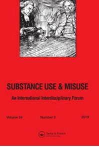

# **Substance Use & Misuse**

**ISSN: 1082-6084 (Print) 1532-2491 (Online) Journal homepage: [www.tandfonline.com/journals/isum20](https://www.tandfonline.com/journals/isum20?src=pdf)**

# **Trajectories of Substance Use among Child Welfare-Involved Youth: Longitudinal Associations with Child Maltreatment History and Emotional/Behavior Problems**

**Svetlana Yampolskaya, Emmeline Chuang & Connie Walker**

**To cite this article:** Svetlana Yampolskaya, Emmeline Chuang & Connie Walker (2019) Trajectories of Substance Use among Child Welfare-Involved Youth: Longitudinal Associations with Child Maltreatment History and Emotional/Behavior Problems, Substance Use & Misuse, 54:3, 437-448, DOI: [10.1080/10826084.2018.1504079](https://www.tandfonline.com/action/showCitFormats?doi=10.1080/10826084.2018.1504079)

**To link to this article:** <https://doi.org/10.1080/10826084.2018.1504079>

|  | 대 |  |
|--|---|--|
|  |   |  |
|  |   |  |
|  |   |  |

Published online: 18 Jan 2019.

[Submit your article to this journal](https://www.tandfonline.com/action/authorSubmission?journalCode=isum20&show=instructions&src=pdf) 

View related [articles](https://www.tandfonline.com/doi/mlt/10.1080/10826084.2018.1504079?src=pdf)

View [Crossmark](http://crossmark.crossref.org/dialog/?doi=10.1080/10826084.2018.1504079&domain=pdf&date_stamp=18%20Jan%202019) data

Citing [articles:](https://www.tandfonline.com/doi/citedby/10.1080/10826084.2018.1504079?src=pdf) 7 View citing articles

ORIGINAL ARTICLE

# Trajectories of Substance Use among Child Welfare-Involved Youth: Longitudinal Associations with Child Maltreatment History and Emotional/Behavior Problems

Svetlana Yampolskayaa , Emmeline Chuangb , and Connie Walkera

a Department of Child & Family Studies, University of South Florida, Tampa, FL, USA; b Department of Health Policy and Management, UCLA Fielding School of Public Health, Los Angeles, CA, USA

#### ABSTRACT

Background: Maltreated children experience a variety of adverse outcomes including substance use problems. Although previous research indicated that there may be distinct trajectories of substance use among these youth, studies have examined them as if they were a single homogeneous group. Objectives: The goals of this study were to explore substance use trajectories among child welfare-involved youth and to identify characteristics that distinguish substance use trajectories. Methods: Data from the National Survey of Child and Adolescent Well-Being (NSCAW II) were used. Multilevel latent growth mixture modeling (MLGMM) was performed using a subsample of 625 youth from ages 11–17 years investigated for maltreatment in 2008–2009. Measures included self-reported use of substance use during the previous 30 days, demographic characteristics, maltreatment history, placement in out-of-home care, and behavioral health problems. Results: MLGMM identified two distinct substance use trajectory classes including High Stable Substance Use and Rapid Progression Use. Findings suggest that the experience of physical abuse is the key factor that distinguishes the two groups. When the effects of class-specific covariates were examined, results suggest that involvement in substance use behavior and its escalation vary between groups and are affected by youth's different previous experiences. Conclusions/Importance: The results have important implications for understanding individual differences in substance use behavior over time and how these differences were shaped by youth's experiences of family adversity. Study findings may be helpful for developing and enhancing the effectiveness of interventions targeted at decreasing substance use behaviors in child welfareinvolved youth.

#### KEYWORDS

Multilevel latent growth mixture modeling (MLGMM); substance use; child maltreatment; child welfare; NSCAW II

# Background

During fiscal year 2015, an estimated 3.4 million children came to the attention of the US child welfare system, and more than 269,000 were removed from their homes and placed in foster care (U.S. Department of Health and Human Services, USDHHD, [2016\)](#page-11-0). Due in part to the trauma associated with maltreatment, caregiver loss, or separation from their natural parents, these children represent a particularly vulnerable population. Research has shown that these children experience a wide variety of adverse outcomes ranging from physical and mental health problems to risky sexual behaviors (Friedrich et al., [2005](#page-10-0); Fussell & Evans, [2009](#page-10-0); Leslie et al., [2010;](#page-11-0) Oswald, Heil, & Goldbeck, [2010](#page-11-0); Whitted, Delavega, & Lennon-Dearing [2012](#page-12-0)). In addition, child welfareinvolved youth are among those who are at highest risk for substance use (Casanueva, Stambaugh, Urato, Fraser, & Williams, [2011;](#page-10-0) Gabrielli, Jackson, & Brown, [2016](#page-10-0)). Estimates based on nationally representative samples indicate that up to 47% of child welfareinvolved youth use alcohol and illicit drugs and that 19% have substance use disorders (Traube, James, Zhang, & Landsverk, [2012\)](#page-11-0).

### Theoretical framework

Attathchment theory may provide insight into the nature of these problems and a basis for possible curative interventions (Schuengel & Van IJzendoorn, [2001](#page-11-0)). According to attachment theory, psychological disturbance may be a consequence of attachment

CONTACT Svetlana Yampolskaya yampol@usf.edu College of Behavioral and Community Sciences, University of South Florida, MHC 2435, 13301 Bruce B. Downs Blvd., Tampa, FL, 33612-3807, USA. 2019 Taylor & Francis Group, LLC

insecurity caused by perceived unavailability of attachment figures or insensitive/non-responsive caregiving (Bowlby, [1980](#page-9-0), [1988](#page-9-0)). In line with attachment theory, maltreated children are at high risk to develop behavioral health problems. Therefore, maltreatment type, internalizing symptoms, and externalizing symptoms are critical components to understanding youth substance use.

# Risk factors for substance use and abuse among child welfare-involved youth

A variety of risk factors have been associated with substance use/abuse among child welfare-involved youth including child demographic characteristics, emotional and behavioral problems, delinquency, and history of child maltreatment (Aarons et al., [2008](#page-9-0); Brown & Shillington, [2017](#page-9-0); Cheng & Lo, [2010](#page-10-0); Gabrielli et al., [2016;](#page-10-0) Guibord, Bell, Romano, & Rouillard, [2011](#page-10-0); Keller, Salazar, & Courtney, [2010](#page-10-0); Orton, Riggs, & Libby, [2009;](#page-11-0) Singh, Thornton & Tonmyr, [2011;](#page-11-0) Thompson & Auslander, [2007;](#page-11-0) Traube et al., [2012;](#page-11-0) Vaughn, Ollie, McMillen, Scott, & Munson, [2007;](#page-11-0) Wall & Kohl, [2007](#page-11-0)). These studies indicated that among demographic characteristics, older age was associated with increased risk for substance use and abuse, and Caucasian race was linked to presence of alcohol and substance use disorders (Guibord et al., [2011;](#page-10-0) Keller et al., [2010](#page-10-0); Singh et al., [2011](#page-11-0)).

Researchers have reported mixed findings in the relation between child maltreatment and substance use. Whereas a substantial body of research suggests that child maltreatment may be a key predisposing factor for substance use, and the association between various types of maltreatment and substance use has been documented in both clinical and community samples (Cheng & Lo, [2010](#page-10-0); Gabrielli et al., [2016](#page-10-0); Garland, Pettus-Davis, & Howard, [2013\)](#page-10-0), there are studies that did not find this relation (Brown & Shillington, [2017;](#page-9-0) Danielson, Amstadter et al., [2009](#page-10-0); Darke & Torok, [2014](#page-10-0); Gabrielli et al., [2016;](#page-10-0) Kilpatrick et al., [2000](#page-10-0); Lansford, Dodge, Pettit, & Bates, [2010\)](#page-10-0).

The evidence for supporting adverse effects of maltreatment suggests differential effects of specific maltreatment types on substance use (Aarons et al., [2008](#page-9-0); Cheng & Lo, [2010](#page-10-0); Gabrielli et al., [2016](#page-10-0)). For example, Aarons et al. ([2008](#page-9-0)) found that three of the four types of maltreatment (physical, sexual abuse, and neglect) were related to significantly higher levels of substance use among youth ages 13–18 years. Emotional abuse was the only form of maltreatment that was not associated with substance use. Similarly, Casanueva, Stambaugh, Urato, Fraser, and Williams ([2014](#page-10-0)) reported that physical abuse was related to both escalating marijuana use and any illicit substance during the follow-up period. Snyder and Smith [\(2015](#page-11-0)) have shown that youth who experienced physical abuse were at greater risk of abusing multiple drugs. Cheng and Lo [\(2010\)](#page-10-0) reported a significant positive association between experience of sexual maltreatment and hard drug use, but no relation was found between other types of maltreatment and drug use. Further, substance use has been related to both severity and chronicity of child maltreatment (Gabrielli et al., [2016\)](#page-10-0). In contrast, Thompson and Auslander ([2007](#page-11-0)) found no association for any type of child maltreatment with the use of alcohol, marijuana, or both alcohol and marijuana use. In a study focusing on marijuana use only, Cheng and Lo [\(2010](#page-10-0)) found no association between any of the maltreatment history variables and likelihood of current use.

# Behavioral/emotional problems and substance use among children involved with the child welfare system

Research has documented that between 50 and 80% of maltreated children involved in the child welfare system have emotional disorders, developmental delays, and other indications of behavioral problems (Burns et al., [2004;](#page-10-0) Horwitz et al., [2012](#page-10-0); Martinez, Gudino, & ~ Lau, [2013](#page-11-0)). Previous findings have shown that the presence of behavioral and emotional problems may be a critical factor related to substance use. For example, numerous studies point to externalizing behavioral problems, such as fighting with peers or engaging in delinquent behaviors, as an important risk factor for substance use in community samples of children and adolescents. These studies generally indicated that youth with behavioral problems and delinquency or aggressive behavior and delinquent behavior were at high risk for both substance use and substance dependence (Dooley & Prause, [2006](#page-10-0); Sung, Erkanli, Angold, & Costello, [2004](#page-11-0); Wade & Pevalin, [2005\)](#page-11-0).

Several studies examined the relationship between child behavioral/emotional problems and substance use among youth involved in the child welfare system. A study by Traube et al. ([2012](#page-11-0)) suggested that behavior problems in the clinical range increased the odds of social substance use. Other studies have shown the presence of conduct problems to be positively related to substance use and substance abuse disorder (Vaughn et al., [2007;](#page-11-0) Wall & Kohl, [2007](#page-11-0)). Externalizing problems have also been reported to predict regular substance use during adolescence (Casanueva et al., [2014](#page-10-0)).

In addition to externalizing behaviors, researchers have associated internalizing problems, such as anxiety, depression, and post-traumatic stress disorder (PTSD), with increased risk of substance use. For example, mood and anxiety disorders have been related to an increased risk of substance dependence (Douglas et al., [2010\)](#page-10-0). A diagnosis of PTSD was found to increase risk of marijuana and hard drug abuse/ dependence as well as risk for polysubstance use and substance abuse disorder (Kilpatrick et al., [2000;](#page-10-0) Vaughn et al., [2007](#page-11-0)). Depression was shown to predict both alcohol and marijuana use as well as frequent use of any substance including tobacco (Orton et al., [2009\)](#page-11-0). Similarly, Snyder and Smith ([2015](#page-11-0)) reported that the presence of clinical depression nearly quadrupled the likelihood of both alcohol and marijuana use but was not associated with polysubstance use. Externalizing and internalizing problems among child welfare-involved youth were also examined as predictors for more frequent substance use in a study by Kobulsky, Holmes, Yoon, and Perzynski ([2016](#page-10-0)), who found that only externalizing problems were linked to higher substance use frequency. Finally, in a study comparing foster care youth with community counterparts, a relationship between depression and substance use was found for foster youth, such that as level of depressive symptoms increased, substance use also increased; however, this finding was not significant after controlling for externalizing symptoms and age (Stevens, Brice, Ale, & Morris, [2011](#page-11-0)).

These somewhat mixed results concerning how emotional and behavioral problems, as well as history of child maltreatment influence later substance use, suggest that there may be unobserved heterogeneity (i.e., multiple classes) among the child welfareinvolved population. That is, there may be distinct trajectories of substance use that are potentially related to demographic characteristics, maltreatment histories, and emotional or behavioral problems. However, the studies mentioned above have examined all child welfare-involved youth as if they were a single homogeneous group. In addition, the majority of previous studies typically measured substance use with regard to the use or no use; therefore, the frequency of drug/alcohol use or level of use was not assessed. Finally, only a few studies examined trajectories of substance use. For example, Casanueva et al. [\(2014](#page-10-0)) used longitudinal growth models to explore changes over time in the use of marijuana and the use of any illicit drug. Yarnell, Traube, and Schrager ([2016\)](#page-12-0) utilized a latent growth modeling approach to examine the combined use of alcohol, marijuana, and hard drugs. However, to our knowledge, no study has explored whether there are multiple trajectories of substance use among child welfare-involved youth and whether there are distinguishing characteristics associated with these trajectories.

# The present study

The current investigation was intended to fill the identified gap in the literature and expand prior research in several ways. First, we explored the multiple longitudinal trajectories of substance use among child welfare-involved youth. Given prior mixed results concerning the effects of emotional/behavioral problems and child maltreatment history on substance use, and considering the empirical evidence indicating multiple substance use trajectories among non-child welfare-involved youth (Warren, Wray-Lake, Rote, & Shubert, [2016](#page-12-0); Wiesner, Weichold, & Silbereisen, [2007](#page-12-0)), we expected that there would be multiple substance use trajectories among child welfare-involved youth. Second, substance use in this study was operationalized in terms of frequency of use. Only a few longitudinal studies (e.g., Casanueva et al., [2014;](#page-10-0) Titus, Godley, & White, [2006](#page-11-0); Yarnell et al., [2016\)](#page-12-0) examined substance use, and to our knowledge only one (Yarnell et al., [2016\)](#page-12-0) operationalized substance use in terms of frequency of use. Third, the unique contributions of demographics, child maltreatment, and emotional/behavioral problems were examined at the class trajectory level and class specific levels.

This study addressed the following research questions: (a) what are the different trajectories of substance use among child welfare-involved youth over the course of the 3-year study period, and (b) do demographic characteristics, child maltreatment history, and emotional/behavioral problems predict the different trajectory classes. Addressing these issues can make a significant contribution to our understanding of unique vulnerabilities of child welfare-involved youth and help tailor programs and services to the needs of youths with different profiles.

# Methods

#### Sample and data source

Data for the current research were obtained from the National Survey of Child and Adolescent Well-Being (NSCAW II), the national longitudinal probability study of families involved in child welfare services. The NSCAW II used a representative sample of youth, aged from birth to 17.5 years old, who were referred to the child welfare system for maltreatment investigation between February 2008 and April 2009 in 83 counties nationwide (Dowd et al., [2002](#page-10-0)). Baseline data collection began in March 2008 and ended in September 2009. Wave 1 through Wave 3 were available and were used for the current study. Children were selected into the study using a two-stage stratified sampling design. There were 81 primary sampling units (PSUs; predominantly county child welfare agencies) in 30 states. The overall focus of the NSCAW studies was to examine the well-being of children involved with child welfare agencies. Information collected that is of particular interest to this study includes children's health, mental health, and developmental risks, especially for those children who experienced severe abuse and exposure to violence. The sample for the current study was restricted to youth who were at least 11 years of age because questions regarding substance use were restricted to this age range (Dowd et al., [2011](#page-10-0)).

Participants consisted of 625 youth whose average age was about 14 years (M ¼ 14.32; SD ¼ 1.74). Among the 625 youth, 59% were female. Race/ethnicity of the youth was 39% Caucasian, 24% African American, 25% Hispanic, and 12% from other racial or ethnic groups. Almost 35% of these youth were placed in out-of-home care at baseline.

#### Measure of substance use

At each wave, youth were asked about substance use. Substance use included self-reported use of alcohol, marijuana, and cocaine during the previous 30 days. The "last 30 days" period was chosen as opposed to "lifetime" substance use to reflect both new initiation of use as well as decline and cessation over time. The frequency of drug and alcohol use was based on a frequency scale drawn from the Youth Risk Behavior Survey (Centers for Disease Control and Prevention, [2015](#page-10-0)) in which the frequency of drug use ranged from 0 (0 times) to 6 (40 or more times) and the frequency of alcohol use (at least one drink/day) ranged from 0 (0 days) to 6 (all 30 days). In cases when a range was selected as the answer (e.g., 3–5 days), the maximum score was chosen for the analyses (Gruenewald, Johnson, Light, & Saltz, [2003\)](#page-10-0). These scores were then summed up to provide an index of overall substance use.

#### Predictor variables

The following predictor variables were included in the analysis: child demographics, history of child maltreatment, externalizing and internalizing subscale scores, and placement in out-of-home care. All predictor variables except for out-of-home placement were assessed at baseline. The placement in out-of-home care variable captured information about out-of-home placement during the course of the study.

Child demographic characteristics. The following demographic characteristics were included: (a) gender, coded as "0" for female and "1"for male, (b) age at Wave 1, and (c) race/ethnicity. Information from several variables was used to create the race/ethnicity variable. Race/ethnicity consisted of four categories: non-Hispanic Black; non-Hispanic White; Hispanic; and non-Hispanic Other, which included American Indian/Alaskan Native, Asian/Native Hawaiian/other and Pacific Islander (Dowd et al., [2011\)](#page-10-0). A dichotomized variable was created for each racial/ethnic category to indicate whether the child was identified as having a certain race/ethnicity (1 ¼ yes), or not (0 ¼ no). Non-Hispanic Other was used as a reference category.

Child Maltreatment. Primary maltreatment reports identified by a caseworker in Wave 1 were used. This information was collected using the Modified Maltreatment Classification Scale; (Manly, Cicchetti, & Barnett, [1994](#page-11-0)). Inter-rater reliability for different maltreatment subtypes ranges from 0.89 to 0.98 (Price & Glad, [2003\)](#page-11-0). Five dichotomous dummy variables representing the types of maltreatment were created. They included: (1) sexual abuse, defined as any sexual contact or attempt at sexual contact that occurs between a caregiver and a child, for purposes of the caregiver's sexual gratification or financial benefit; (2) physical abuse, defined as infliction of physical injury upon a child by a caregiver via other than accidental means; (3) neglect, defined as a failure to exercise a minimum degree of care in meeting the child's physical needs; (4) threatened harm, defined as presence of domestic violence in the family, presence of substance-abusing parent, or substance exposed infant; and (5) abandonment, defined as abandonment of the child by a caregiver for 24 h or longer without any indication of when or if the caregiver will return and where he or she can be located (Barnett, Manly, & Cicchetti, [1993](#page-9-0)). Both substantiated and unsubstantiated cases were included, given little difference between the two shown in several studies (Hussey et al., [2005](#page-10-0); Kohl, Jonson-Reid, & Drake, [2009](#page-10-0)).

Placement in out-of-home care. A dichotomous variable captured whether youth ever experienced outof-home placement during the course of the study. An out-of-home placement could include foster care, kinship care, or group home/other residential treatment facility.

Externalizing behaviors. Externalizing behaviors and Internalizing behaviors were assessed using the Youth Self-Report (YSR; Achenbach & Rescorla, [2001\)](#page-9-0). The YSR is a widely used instrument and it was designed for use with adolescents between the ages of 11 and 18 years to obtain self-report of feelings and behavior in a standardized fashion. Overall, the YSR yields scores on eight empirically derived syndrome scales including (a) anxious/depressed, (b) withdrawn/depressed, (c) somatic complaints, (d) social problems, (e) thought problems, (f) attention problems, (g) rule-breaking behavior, and (h) aggressive behavior. Five of the subscales are grouped into two higher order factors: internalizing and externalizing. Behaviors are rated on a 3-point scale: 0 - Not true,1- Somewhat or sometimes true, and 2 - Very true or often true, based on the preceding 6 months. The YSR has strong criterion-related validity, good test–retest reliability and internal consistency (Achenbach & Rescorla, [2001](#page-9-0)). Mean test–retest reliability for empirically based syndromes was 0.82. Internal consistencies of problem scales as measured by Cronbach's alphas ranged from 0.67 to 0.95. In the current study, externalizing raw scores were utilized. The Externalizing behaviors were assessed with the Delinquent and Aggressive Behavior subscales. Sample questions include, "I physically attack people", "I threaten to hurt people", and "I get in many fights".

Internalizing behaviors. The Internalizing behaviors were assessed using the Withdrawn/Depressed, Somatic Complaints, and Anxious/Depressed subscales of the YSR (Achenbach & Rescorla, [2001\)](#page-9-0). The reliability coefficient for the internalizing scale was 0.89. Internalizing raw scores were utilized in the current study. Sample questions include, "My moods and feelings change suddenly", "I am unhappy, sad, depressed", and "I have trouble sleeping".

# Analytic approach

Multilevel latent growth mixture modeling (MLGMM) was used to examine the effect of child demographic characteristics, child maltreatment history, and behavioral problems on the changes in substance use over time, as well as to determine latent trajectory classes that best represented individuals' longitudinal change. MLGMM allows for modeling the process of change and testing for the presence of multiple latent groups or classes while allowing individual variation around the intercept and slope within each class (Nagin, [2005](#page-11-0)). Multilevel growth modeling extends latent growth modeling by incorporating a random intercept and random slope that allow for variation among clusters, such as primary sampling units (Muthen & Asparouhov, [2009](#page-11-0)). Inclusion of a between-level random intercept in the model allows for estimation of between cluster variation; thus, accounting for the non-independence of observations. Time was treated as a fixed parameter in the models. Specifically, the time points were fixed incrementally based on the spacing between data collection periods, i.e., the intervals between measurement points (0, which is immediately after the close of investigation or assessment, 18 and 36 months).

To ascertain the best-fitting number of trajectory groups, models were estimated with one, two, and three classes. The number of trajectories was selected based on available fit indices and qualitative assessment, including having a substantial number of participants in each class and class interpretability. The examined model indices consisted of Aikaike information criterion (AIC; Akaike, [1974](#page-9-0)), Bayesian information criterion (BIC; Schwarz, [1978\)](#page-11-0), the likelihood ratio chi-squared test, and entropy, a measure of classification accuracy (Ramaswamy, DeSarbo, Reibstein, & Robinson, [1993](#page-11-0)). Lower BIC and AIC values and higher entropy are indicative of a better fitting model. The log likelihood (i.e., the log of the likelihood) with higher values (closer to zero) indicates better fit. The data analyses were conducted in two steps. First, unconditional models were performed. During the second step, a multivariate latent growth mixture model with all covariates included was used to test the associations between the growth curve of substance use and various predictors. Mplus statistical software, version 7.4 (3463 Stoner Avenue, Los Angeles, CA) (Muthen & Muthen, [1998](#page-11-0)–2017) was used.

Missing data. The Mplus (version 7.4) MISSING feature was used to impute missing data for dependent variables. Missing data were handled by the full information maximum likelihood procedure (FIML) under the assumption that the missing data are unrelated to the outcome variable, that is, missing is random (MAR; Arbuckle, [1996;](#page-9-0) Little, [1995](#page-11-0)). This imputation process utilizes all available data in a model to compute unbiased parameter estimates and standard errors in a single step (Graham, [2009](#page-10-0)).

# Results

#### Model selection and model fit

Model construction consisted of two steps. The first step included testing a series of unconditional models consisting of one through three latent trajectory classes of substance use. Two latent variables that describe trajectories of substance use were modeled: (a) the intercept, which is substance use at Wave 1 and (b) the linear slope or linear rate of change in substance use, which reflects linear change in substance use over time. A summary of the fit statistics for the different class solutions that were tested and considered is shown in Table 1. As presented in Table 1, AIC for the three-class model was 8,725.55 compared to 8,961.45 for the two-class model. Similarly, BIC for the three-class model was 8,800.44 compared to 9,023.12 for the two-class model, showing a better fit. Log likelihood-ratio chi-squared test also showed improved fit of the three-class model over the twoclass model.

On the basis of the fit statistics only, the three-class linear model was preferred, as it had the lowest BIC, the lowest AIC, the log likelihood with a higher value, and high entropy value (0.94). However, it is also important to consider the qualitative distinction of profile solutions. Therefore, substantive implications were also taken into account when determining the optimal number of trajectories. The three-class solution revealed that two of the three classes have very similar functional forms. Specifically, they are both characterized by relatively high initial substance use and increasing trajectories over time. However, the three-class solution included trajectories that were not practically meaningful and relatively uninformative. Therefore, because of its parsimony and better interpretability, the two-class solution was considered optimal and selected as the final model. The first trajectory class, High Stable Substance Use, included 91% (n ¼ 466) of the sample and was characterized by high initial substance use followed by leveling throughout the study period: intercept ¼ 5.48, p<.01; linear trend ¼ −0.04, p ¼ .16. The second trajectory class, Rapid Progression Use, included 9% (n ¼ 47) of the sample and was marked by high initial use

Table 1. Model fit for unconditional growth mixture models.

|                      | Number of free |     |                 | Log                |      |
|----------------------|----------------|-----|-----------------|--------------------|------|
| Model                | parameters     | AIC | BIC             | likelihood Entropy |      |
| One-class solution   | 11             |     | 9319.36 9367.82 | −4648.68           | n/a  |
| Two-class solution   | 14             |     | 8961.45 9023.12 | −4466.73           | 0.94 |
| Three-class solution | 17             |     | 8725.55 8800.44 | −4345.77           | 0.94 |

followed by increasing growth over time: intercept ¼ 13.50, p<.05; linear trend ¼ 0.87, p<.01.

During the second step, the conditional model was examined. In the conditional latent growth mixture model, substance use trajectory classes were regressed on covariates and the relations between these covariates and trajectory class were estimated in logistic regression analysis. The fit of the two-class model with covariates was compared to the unconditional latent growth curve mixture model. Based on AIC and BIC values, the overall model fit substantially improved compared to the unconditional model (Table 2). The conditional growth mixture model with a two-class solution had substantially lower BIC (7536.36) and lower AIC (7273.46) compared to the unconditional model with two classes (BIC ¼ 9023.12 and AIC ¼ 8961.45), and the entropy measure (Ek ¼ 0.90) indicated reasonable classification.

The specification of the conditional model included all predictors regressed on substance use trajectory class membership and within-class effects of the predictors on latent growth factors. First, the links between the predictors and trajectories of substance use were assessed. Second, within-class effects of predictors for substance use trajectories were examined.

When the effect of specific variables on membership trajectory class was examined, only White race and history of physical abuse were found to be associated with the substance use trajectory classes. Relative to the Rapid Progression Use trajectory class, children who follow the High Stable Substance Use trajectory were more likely to be White (OR ¼ 3.34, p<.05). However, children who comprise the Rapid Progression Use trajectory class were almost 4 times more likely to have a history of physical abuse (OR ¼ 3.91, p<.05).

Next, within-class effects of predictors for substance use trajectories were examined. [Table 3](#page-7-0) presents estimates, standard errors, and statistical significance for the predictors. As shown in [Table 3](#page-7-0), covariates of demographics, child maltreatment history, and emotional and behavioral problems were significantly associated with substance use trajectories.

For the Rapid Progression Use trajectory class (Class 1), with the exception of child age, all predictor variables had a significant effect on intercept indicating that males, youth with history of neglect, youth

Table 2. Model fit for conditional two-class growth mixture model.

|                    | Number of free |     |                 | Log                |      |  |  |  |  |  |
|--------------------|----------------|-----|-----------------|--------------------|------|--|--|--|--|--|
| Model              | parameters     | AIC | BIC             | likelihood Entropy |      |  |  |  |  |  |
| Two-class solution | 62             |     | 7273.46 7536.36 | −3574.73           | 0.90 |  |  |  |  |  |

|                         | Class 1 (9%; n ¼ 47) |                       |          |      | Class 2 (91%; n ¼ 466) |                           |          |      |  |  |
|-------------------------|----------------------|-----------------------|----------|------|------------------------|---------------------------|----------|------|--|--|
|                         |                      | Rapid progression use |          |      |                        | High stable substance use |          |      |  |  |
|                         | Intercept            |                       | Slope    |      | Intercept              |                           | Slope    |      |  |  |
| Predictor               | Estimate             | SE                    | Estimate | SE   | Estimate               | SE                        | Estimate | SE   |  |  |
| Child age               | 0.15                 | 0.88                  | 0.18     | 0.04 | 0.19                   | 0.13                      | −0.01    | 0.01 |  |  |
| Child gender            | 18.09                | 3.97                  | −0.75    | 0.18 | −1.27                  | 0.47                      | 0.03     | 0.06 |  |  |
| Child race/ethnicitya   |                      |                       |          |      |                        |                           |          |      |  |  |
| Black                   | −20.11               | 3.08                  | 0.64     | 0.12 | −0.56                  | 0.64                      | 0.02     | 0.05 |  |  |
| White                   | −15.34               | 2.40                  | 0.20     | 0.15 | −0.95                  | 0.49                      | 0.02     | 0.06 |  |  |
| Hispanic                | 5.33                 | 7.78                  | −0.44    | 0.28 | 1.88                   | 0.76                      | −0.03    | 0.11 |  |  |
| Type of maltreatmentb   |                      |                       |          |      |                        |                           |          |      |  |  |
| Threatened harm         | −23.51               | 3.93                  | 0.97     | 0.27 | −2.31                  | 1.11                      | 0.07     | 0.05 |  |  |
| Neglect                 | 10.20                | 1.53                  | −0.72    | 0.09 | −3.52                  | 0.67                      | 0.11     | 0.05 |  |  |
| Physical abuse          | −4.92                | 1.49                  | −0.31    | 0.19 | −1.84                  | 0.82                      | −0.01    | 0.05 |  |  |
| Abandonment             | −3.50                | 10.06                 | −0.28    | 0.31 | −7.43                  | 2.61                      | 0.07     | 0.10 |  |  |
| Internalizing behaviors | −1.11                | 0.26                  | 0.07     | 0.01 | −0.09                  | 0.02                      | 0.01     | 0.01 |  |  |
| Externalizing behaviors | 1.41                 | 0.23                  | −0.05    | 0.01 | 0.12                   | 0.02                      | 0.01     | 0.01 |  |  |
| Out-of-home placement   | 18.48                | 2.91                  | −0.70    | 0.08 | −0.62                  | 0.59                      | 0.09     | 0.05 |  |  |

|                   |  |  | Table 3. The effects of child characteristics on trajectories of substance use within |  |  |  |
|-------------------|--|--|---------------------------------------------------------------------------------------|--|--|--|
| the last 30 days. |  |  |                                                                                       |  |  |  |

Parameter estimates and standard errors for growth curve mixture model (N ¼ 513). a

Other race/ethnicity was used as a reference category. b

Other type of maltreatment including sexual abuse, emotional abuse, and exploitation was used as a reference category.

p < .05.

with externalizing behavior problems, and those who were placed in out-of-home care had significantly higher baseline levels of substance use. In contrast, youth who were Black and those who were White had lower baseline levels of substance use. In addition, lower baseline levels of substance use were reported by youth with a history of threatened harm, history of physical abuse, internalizing behavior problems, and by those who lost their caregivers (i.e., abandonment).

With respect to the slope, an effect was observed for the regression of the slope on child demographics including gender, age, Black race, history of threatened harm, internalizing behaviors, externalizing behaviors, and out-of-home care placement. However, the direction of the effects varied. Whereas a significant increase in substance use over time was observed for older youth, youth who were Black, youth with a history of threatened harm, and those with internalizing behavioral problems, a significant decline in use over time was observed for females, youth with externalizing behavioral problems, and youth placed in out-of-home care (Table 3).

For the High Stable Substance Use trajectory class (Class 2), results indicated that initial level of substance use was lower for females; for youth who had a history of maltreatment in the form of threatened harm, physical abuse, and neglect; and for youth with internalizing behavior problems. Being Hispanic and having externalizing problems had a positive significant effect on intercept—that is, youth who were Hispanic and those with externalizing problems had a significantly higher initial level of substance use. In addition, lower baseline levels of substance use were reported by those who were abandoned by their caregivers. When the effect of covariates on the slope was examined, results indicated that only neglect had a significant effect; that is, youth who experienced neglect significantly increased their substance use over time.

# Discussion

This study explored the nature and correlates of substance use trajectories among child welfare-involved youth in an attempt to identify groups of youths with distinct profiles who might be responsive to different interventions. Findings from this study also advanced our understanding of individual differences in substance use behavior over time and how these differences were shaped by youth's experiences of family adversity. Using MLGMM analysis, two latent trajectory groups were identified that best explained variations in substance use in this nationally representative cohort of child welfare-involved youth. The majority (91%) of youth who reported using various substances demonstrated a relatively stable trajectory after high initial level of use. Nine percent of youth exhibited the greatest risk, with high initial use followed by increasing use over time.

A comparison of these two groups indicated that being White significantly decreases the odds of classification in the Rapid Progression Use trajectory class, whereas history of physical abuse increased the odds of being classified in the Rapid Progression Use trajectory class. In line with attachment theory, children who receive unresponsive and insensitive parenting may be more likely to develop emotional insecurity, which in turn may predispose them to maladaptive development and behaviors, such as using substances. Our finding regarding the impact of physical abuse on escalation in substance use is consistent with previous research that examined predictors for substance use among child welfare-involved youth. Specifically, these studies have shown that physical abuse was associated with being in the polysubstance use class, associated with substance, alcohol and drug/solvent abuse, and escalating substance use over time (Casanueva et al., [2014](#page-10-0); Kobulsky et al., [2016;](#page-10-0) Singh et al., [2011;](#page-11-0) Snyder & Smith, [2015](#page-11-0)). In contrast, other researchers have reported no association between physical abuse and higher degree of substance involvement or increased odds of engaging in substance use over time (Aarons et al., [2008;](#page-9-0) Traube et al., [2012\)](#page-11-0). The differences in the findings regarding the association between physical abuse and substance use may be partly due to the variations in the substance use outcomes examined and the algorithms of constructing these variables. For example, Casanueva et al. [\(2014\)](#page-10-0) examined only illicit drug use within the last 30 days and data on illegal alcohol use were not included; Kobulsky et al. ([2016\)](#page-10-0) examined the number of days youth used all drugs including alcohol; Singh et al. ([2011](#page-11-0)), assessed substance abuse within the last six months; and Snyder and Smith ([2015](#page-11-0)) examined substance use as a dichotomized variable indicating lifetime use of any substances including alcohol and tobacco. Aarons et al. ([2008](#page-9-0)) included DSM-IV diagnoses in assessing the degree of substance use involvement, and Traube et al. ([2012\)](#page-11-0) created a dichotomized variable representing substance use within the "last 30 days" at any point in Waves 1, 3, or 4 of data collection.

To elucidate factors associated with each substance use trajectory class, contributions of each within-class covariates were examined. These results are particularly helpful in depicting a profile of youth with both leveled and escalating substance use behaviors. Specifically, the initial level of substance use for youth who represent the Rapid Progression Use trajectory class was associated with male gender, experience of neglect, presence of externalizing problems and placement in out-of-home care. However, factors that predict escalating substance use over time for this class include female gender, Black race, experience of threatened harm, such as parental substance abuse or domestic violence, and having internalizing problems. Consistent with previous research, internalizing problems including depression, anxiety, and withdrawn behaviors were associated with substance use escalation (Blake, Tung, Langley, & Waterman, [2018](#page-9-0)) whereas placement in out-of-home care was protective against later substance use (Traube, Yarnell, & Schrager, [2016\)](#page-11-0). Also, in accordance with the prior studies, it was shown in this study that parental substance use and exposure to domestic violence were related to substance use and its escalation over time among child welfare-involved youth (Kilpatrick et al., [2000;](#page-10-0) Pomery et al., [2005](#page-11-0); Walden, Iacono, & McGue, [2007;](#page-11-0) Wu, Liu, & Fan, [2010](#page-12-0)).

The initial level of substance use for the High Stable Substance Use trajectory class was predicted by female gender, Hispanic ethnicity, and presence of externalizing behavior problems. However, only youth who experienced neglect were more likely to increase their substance use over time in this class. Thus, threatened harm and internalizing problems seem to be linked with increase in substance use for the Rapid Progression Use trajectory class and neglect appears to be related to increase in substance use for the High Stable Substance Use trajectory class.

These findings suggest that different processes led to substance use behaviors among child welfareinvolved youth. It appears that threatened harm, as a type of maltreatment often associated with exposure to parental violence and therefore potential experience of fear about parents' well-being, leads to substance use as a coping mechanism among youth who represent the Rapid Progression Use trajectory class. Consistent with attachment theory, exposure to family violence and inter-parental conflict may undermine the attachment security and lead to intensified anxiety. Thus, these youth may engage in substance use behaviors as a means of coping with anxiety and anxietyrelated symptoms (Garland et al., [2013](#page-10-0)). This interpretation is supported by the study results linking internalizing problems and substance use increase for the Rapid Progression Use trajectory class.

Neglect, however, which is typically associated with the lack of attention and communication from parents, may lead to substance-seeking behaviors as a way to being accepted, becoming popular, enhancing social activities, and facilitating social contact (Titus et al., [2006](#page-11-0)). This is also consistent with the basic assumptions of attachment theory, according to which the development of insecure attachment, through lack of psychologic availability of the attachment figure, leads to dysfunctional adjustment (Tambelli, Laghi, Odorisio, & Notari, [2012\)](#page-11-0).

It is important to disentangle differential processes that influence substance use to inform intervention approaches for child welfare-involved youth. For example, for the youth in the Rapid Progression Use trajectory class, successful treatments should address social anxiety symptoms, whereas for the youth in the High Stable Substance Use trajectory class, prevention efforts should aim at increasing adolescents' network of supportive and caring others, and positive friendships.

# Limitations

Although the longitudinal study design was employed and a change over time in substance use trajectories was examined, the analyses remain correlational and this cannot definitively indicate causation. Second, because only three waves of data collection for NSCAW II are currently available, only models with a linear slope were examined. Thus, a quadratic growth where the change in substance use behavior may not be linear could not be assessed. Third, we only included predictors available at baseline and did not investigate the potential influence of time-varying covariates such as services received or changes in placements. Finally, another limitation is the small sample size of one of the two trajectory classes, that is, Rapid Progression Use. Although this trajectory class consists of only 47 youth (9%) of the sample, this reflects the structure of the entire population in USA and the proportion of youth in this trajectory class matches the national proportion due to the use of a nationally representative sample in NSCAW study (Dowd et al., [2002\)](#page-10-0).

# Conclusions

Despite these limitations, the findings from this study revealed important information about the substance use patterns characterizing a nationally representative sample of child welfare-involved youth. To our knowledge, this is the first study to document substantive differences in substance use behaviors as well as predictors of class membership on the basis of demographic and history of child maltreatment factors. Results from the present study suggest that the majority of the youth experience a consistent pattern of substance use after initial high consumption. However, a smaller, higher risk group of youth was identified that exhibited a significantly escalating substance use behavior. The findings add information on differences between two trajectory classes and suggest that the experience of physical abuse is the key factor that distinguishes the two groups. Results of differential effects of class-specific covariates suggest that involvement in substance use behavior and its escalation vary between groups and may be associated with different experiences of these youth. Overall, the findings of this study may be helpful in providing direction for developing and enhancing the effectiveness of interventions targeted at decreasing substance use behaviors in child welfare-involved youth.

# Declaration of interest

The authors declare that they have no conflict of interest. The authors alone are responsible for the content and writing of this article.

# References

- Aarons, G. A., Hazen, A. L., Leslie, L. K., Hough, R. L., Monn, A. R., Connelly, C. D., … Brown, A. A. ([2008\)](#page-2-0). Substance involvement among youths in child welfare: The role of common and unique risk factors. American Journal of Orthopsychiatry, 78(3), 340–349. doi:[10.1037/](https://doi.org/10.1037/a0014215) [a0014215](https://doi.org/10.1037/a0014215)
- Achenbach, T. M., & Rescorla, L. A. ([2001](#page-5-0)). Manual for the ASEBA school-age forms & profiles. Burlington, VT: University of Vermont, Research Centre for Children, Youth and Families.
- Akaike, H. [\(1974\)](#page-5-0). A new look at the statistical model identification. IEEE Transactions on Automatic Control, 19(6), 716–723. doi[:10.1109/TAC.1974.1100705](https://doi.org/10.1109/TAC.1974.1100705)
- Arbuckle, J. ([1996\)](#page-5-0). Full information estimation in the presence of incomplete data. In: G. Marcoulides & R. Schumacker (Eds.), Advanced structural equation modeling: Issues and techniques (pp. 243–277). Mahwah, NJ: Erlbaum.
- Barnett, D., Manly, J. T., & Cicchetti, D. [\(1993\)](#page-4-0). Defining Child Maltreatment: The interface between policy and research. In: D. Cicchetti and S.L. Toth (Eds.), Advances in applied developmental psychology: Child abuse, child development and social policy (pp. 7–73). Norwood, NJ: Ablex Publishing Corp.
- Blake, A. J., Tung, I., Langley, A. K., & Waterman, J. M. [\(2018\)](#page-8-0). Substance use in youth adopted from foster care: Developmental mechanisms of risk. Children and Youth Services Review, 85, 264–272. doi:[10.1016/](https://doi.org/10.1016/j.childyouth.2018.01.005) [j.childyouth.2018.01.005](https://doi.org/10.1016/j.childyouth.2018.01.005)
- Bowlby, J. ([1980\)](#page-2-0). Attachment and loss, vol. III: Loss, sadness and depression. New York, NY, USA: Basic Books.
- Bowlby, J. ([1988](#page-2-0)). A secure base: Parent-child attachment and healthy human development. New York, NY, USA: Basic Books.
- Brown, S. M., & Shillington, A. M. ([2017](#page-2-0)). Childhood adversity and the risk of substance use and delinquency:

The role of protective adult relationships. Child Abuse & Neglect, 63, 211–221. doi[:10.1016/j.chiabu.2016.11.006](https://doi.org/10.1016/j.chiabu.2016.11.006)

- Burns, B. J., Phillips, S. D., Wagner, H. R., Barth, R. P., Kolko, D. J., Campbell, Y., & Landsverk, J. ([2004](#page-2-0)). Mental health need and access to mental health services by youths involved with child welfare: A national survey. Journal of the American Academy of Child and Adolescent Psychiatry, 43(8), 960–918. doi:[10.1097/](https://doi.org/10.1097/01.chi.0000127590.95585.65) [01.chi.0000127590.95585.65](https://doi.org/10.1097/01.chi.0000127590.95585.65)
- Casanueva, C., Stambaugh, L., Urato, M., Fraser, J. G., & Williams, J. [\(2011](#page-1-0)). Lost in transition: Illicit substance use and services receipt among at-risk youth in the child welfare system. Children and Youth Services Review, 33, 1939–1949. doi:[10.1016/j.childyouth.2011.05.025](https://doi.org/10.1016/j.childyouth.2011.05.025)
- Casanueva, C., Stambaugh, L., Urato, M., Fraser, J. G., & Williams, J. [\(2014\)](#page-2-0). Illicit drug use from adolescence to young adulthood among child welfare-involved youths. Journal of Child & Adolescent Substance Abuse, 23(1), 29–48. doi[:10.1080/1067828X.2012.735514](https://doi.org/10.1080/1067828X.2012.735514)
- Centers for Disease Control and Prevention. ([2015\)](#page-4-0). Youth risk behavior survey. Retrieved from [http://www.cdc.gov/](http://www.cdc.gov/yrbs) [yrbs](http://www.cdc.gov/yrbs)
- Cheng, T. C., & Lo, C. C. [\(2010](#page-2-0)). Drug use among maltreated adolescents receiving child welfare services. Children and Youth Services Review, 32(12), 1735–1739. doi:[10.1016/j.childyouth.2010.07.017](https://doi.org/10.1016/j.childyouth.2010.07.017)
- Danielson, C. K., Amstadter, A. B., Dangelmaier, R. E., Resnick, H. S., Saunders, B., & Kilpatrick, D. G. ([2009](#page-2-0)). Does typography of substance abuse and dependence differ as a function of exposure to child maltreatment? Journal of Child & Adolescent Substance Abuse, 18(4), 323–342. doi: [10.1080/10678280902973310](https://doi.org/ 10.1080/10678280902973310)
- Darke, S., & Torok, M. [\(2014\)](#page-2-0). The association of childhood physical abuse with the onset and extent of drug use among regular injecting drug users. Addiction, 109(4), 610–616. doi[:10.1111/add.12428](https://doi.org/10.1111/add.12428)
- Dooley, D., & Prause, J. [\(2006\)](#page-2-0). Predictors of early alcohol drinking onset. Journal of Child & Adolescent Substance Abuse, 16(2), 1–29. doi:[10.1300/J029v16n02\\_01](https://doi.org/10.1300/J029v16n02_01)
- Douglas, K. R., Chan, G., Gelernter, J., Arias, A. J., Anton, R. F., Weiss, R. D., … Kranzler, H. R. [\(2010](#page-3-0)). Adverse childhood events as risk factors for substance dependence: Partial mediation by mood and anxiety disorders. Addictive Behaviors, 35(1), 7–13. doi:[10.1016/](https://doi.org/10.1016/j.addbeh.2009.07.004) [j.addbeh.2009.07.004](https://doi.org/10.1016/j.addbeh.2009.07.004)
- Dowd, K., Dolan, M., Wallin, J., Miller, K., Biemer, P., & Aragon-Logan, E. ([2011](#page-4-0)). National Survey of Child and Adolescent Well-being II (NSCAW II) Combined Waves 1–2, Data File User's Manual Restricted Release Version. NY: Cornell University, National Data Archive on Chld Abuse and Neglect.
- Dowd, K., Kinsey, S., Wheeless, S., Thissen, R., Richardson, J., Mierzwa, F., & Biemer, P. [\(2002\)](#page-4-0). National Survey of Child and Adolescent Well-Being (NSCAW): Introduction to the wave 1 general and restricted use releases. Ithaca, NY: National Data Archive in Child Abuse and Neglect.
- Friedrich, W. N., Baker, A. J., Parker, R., Schneiderman, M., Gries, L., & Archer, M. ([2005\)](#page-1-0). Youth with problematic sexualized behaviors in the child welfare system: A oneyear longitudinal study. Sexual Abuse: A Journal of Research and Treatment, 17(4), 391–406. doi:[10.1007/](https://doi.org/10.1007/s11194-005-8051-7) [s11194-005-8051-7](https://doi.org/10.1007/s11194-005-8051-7)
- Fussell, J. J., & Evans, L. D. [\(2009\)](#page-1-0). Medical status of school-age children reentering foster care. Child Maltreatment, 14(4), 382–386. doi[:10.1177/](https://doi.org/10.1177/1077559508326222) [1077559508326222](https://doi.org/10.1177/1077559508326222)
- Gabrielli, J., Jackson, Y., & Brown, S. [\(2016\)](#page-1-0). Associations between maltreatment history and severity of substance use behavior in youth in foster care. Child Maltreatment, 21(4), 298–307. doi[:10.1177/1077559516669443](https://doi.org/10.1177/1077559516669443)
- Garland, E. L., Pettus-Davis, C., & Howard, M. O. ([2013](#page-2-0)). Self-medication among traumatized youth: structural equation modeling of pathways between trauma history, substance misuse, and psychological distress. Journal of Behavioral Medicine, 36(2), 175–185. doi[:10.1007/s10865-](https://doi.org/10.1007/s10865-012-9413-5) [012-9413-5](https://doi.org/10.1007/s10865-012-9413-5)
- Graham, J. W. ([2009\)](#page-5-0). Missing data analysis: Making it work in the real world. Annual Review of Psychology, 60, 549–576. doi:[10.1146/annurev.psych.58.110405.085530](https://doi.org/10.1146/annurev.psych.58.110405.085530)
- Gruenewald, P. J., Johnson, F. W., Light, J. M., & Saltz, R. F. [\(2003](#page-4-0)). Drinking to extremes: Theoretical and empirical analyses of peak drinking levels among college students. Journal of Studies on Alcohol, 64(6), 817–824. doi: [10.15288/jsa.2003.64.817](https://doi.org/10.15288/jsa.2003.64.817)
- Guibord, M., Bell, T., Romano, E., & Rouillard, L. ([2011](#page-2-0)). Risk and protective factors for depression and substance use in an adolescent child welfare sample. Children and Youth Services Review, 33(11), 2127–2137. doi[:10.1016/](https://doi.org/10.1016/j.childyouth.2011.06.019) [j.childyouth.2011.06.019](https://doi.org/10.1016/j.childyouth.2011.06.019)
- Horwitz, S. M., Hurlburt, M. S., Goldhaber-Fiebert, J. D., Heneghan, A. M., Zhang, J., Rolls-Reutz, J., … Stein, R. E. [\(2012](#page-2-0)). Mental health services use by children investigated by child welfare agencies. Pediatrics, 130(5), 861–869. doi:[10.1542/peds.2012-1330](https://doi.org/10.1542/peds.2012-1330)
- Hussey, J. M., Marshall, J. M., English, D. J., Knight, E. D., Lau, A. S., Dubowitz, H., & Kotch, J. B. ([2005\)](#page-4-0). Defining maltreatment according to substantiation: Distinction without a difference? Child Abuse & Neglect, 29(5), 479–492. doi:[10.1016/j.chiabu.2003.12.005](https://doi.org/10.1016/j.chiabu.2003.12.005)
- Keller, T. E., Salazar, A. M., & Courtney, M. E. ([2010](#page-2-0)). Prevalence and timing of diagnosable mental health, alcohol, and substance use problems among older adolescents in the child welfare system. Children and Youth Services Review, 32(4), 626–634. doi[:10.1016/](https://doi.org/10.1016/j.childyouth.2009.12.010) [j.childyouth.2009.12.010](https://doi.org/10.1016/j.childyouth.2009.12.010)
- Kilpatrick, D. G., Acierno, R., Saunders, B., Resnick, H. S., Best, C. L., & Schnurr, P. P. [\(2000](#page-2-0)). Risk factors for adolescent substance abuse and dependence: Data from a national sample. Journal of Consulting and Clinical Psychology, 68(1), 19–30. doi[:10.1037//0022-006X.68.1.19](https://doi.org/10.1037//0022-006X.68.1.19)
- Kobulsky, J. M., Holmes, M. R., Yoon, S., & Perzynski, A. T. ([2016](#page-3-0)). Physical abuse after child protective services investigation and adolescent substance use. Child and Youth Services Review, 71, 36–44. doi[:10.1016/](https://doi.org/10.1016/j.childyouth.2016.10.033) [j.childyouth.2016.10.033](https://doi.org/10.1016/j.childyouth.2016.10.033)
- Kohl, P. L., Jonson-Reid, M., & Drake, B. ([2009\)](#page-4-0). Time to leave substantiation behind findings from a national probability study. Child Maltreatment, 14(1), 17–26. doi: [10.1177/1077559508326030](https://doi.org/10.1177/1077559508326030)
- Lansford, J. E., Dodge, K. A., Pettit, G. S., & Bates, J. E. ([2010\)](#page-2-0). Does physical abuse in early childhood predict substance use in adolescence and early adulthood? Child Maltreatment, 15(2), 190–194. doi[:10.1177/](https://doi.org/10.1177/1077559509352359) [1077559509352359](https://doi.org/10.1177/1077559509352359)
- Leslie, L. K., James, S., Monn, A., Kauten, M. C., Zhang, J., & Aarons, G. [\(2010](#page-1-0)). Health-risk behaviors in young adolescents in the child welfare system. Journal of Adolescent Health, 47, 26–34. doi[:10.1016/j.jadohealth.2009.12.032](https://doi.org/10.1016/j.jadohealth.2009.12.032)
- Little, R. J. ([1995\)](#page-5-0). Modeling the dropout mechanism in repeated-measures studies. Journal of the American Statistical Association, 90(431), 1112–1121. doi[:10.2307/](https://doi.org/10.2307/2291350) [2291350](https://doi.org/10.2307/2291350)
- Manly, J. T., Cicchetti, D., & Barnett, D. ([1994\)](#page-4-0). The impact of subtype, frequency, chronicity, and severity of child maltreatment on social competence and behavior problems. Development and Psychopathology, 6(01), 121–143. doi[:10.1017/S0954579400005915](https://doi.org/10.1017/S0954579400005915)
- Martinez, J. I., Gudino, O. G., & Lau, A. S. [\(2013\)](#page-2-0). ~ Problem-specific racial/ethnic disparities in pathways from maltreatment exposure to specialty mental health Service use for youth in child welfare. Child Maltreatment, 18(2), 98–107. doi[:10.1177/](https://doi.org/10.1177/1077559513483549) [1077559513483549](https://doi.org/10.1177/1077559513483549)
- Muthen, B. O., & Asparouhov, T. ([2009](#page-5-0)). Multilevel regression mixture analysis. Journal of the Royal Statistical Society: Series A (Statistics in Society), 172(3), 639–657. doi[:10.1111/j.1467-985X.2009.00589.x](https://doi.org/10.1111/j.1467-985X.2009.00589.x)
- Muthen, L. K., & Muthen, B. O. ([1998](#page-5-0)–2017). Mplus User's Guide (8th ed.). Los Angeles, CA: Muthen & Muthen.
- Nagin, D. ([2005](#page-5-0)). Group-based modeling of development. Cambridge, MA: Harvard University Press.
- Orton, H. D., Riggs, P. D., & Libby, A. M. [\(2009\)](#page-2-0). Prevalence and characteristics of depression and substance use in a U.S. child welfare sample. Child and Youth Services Review, 31(6), 649–653. doi[:10.1016/](https://doi.org/10.1016/j.childyouth.2008.12.005) [j.childyouth.2008.12.005](https://doi.org/10.1016/j.childyouth.2008.12.005)
- Oswald, S. H., Heil, K., & Goldbeck, L. [\(2010\)](#page-1-0). History of maltreatment and mental health problems in foster children: A review of the literature. Journal of Pediatric Psychology, 35(5), 462–472. doi[:10.1093/jpepsy/jsp114](https://doi.org/10.1093/jpepsy/jsp114)
- Pomery, E. A., Gibbons, F. X., Gerrard, M., Cleveland, M. J., Brody, G. H., & Wills, T. A. [\(2005](#page-8-0)). Families and risk: Prospective analyses of familial and social influences of adolescent substance use. Journal of Family Psychology, 19(4), 560–570. doi:[10.1037/0893-3200.19.4.560](https://doi.org/10.1037/0893-3200.19.4.560)
- Price, J. M., & Glad, K. [\(2003\)](#page-4-0). Hostile attributional tendencies in maltreated children. Journal of Abnormal Child Psychology, 31(3), 329–343. doi[:10.1023/A:1023237731683](https://doi.org/10.1023/A:1023237731683)
- Ramaswamy, V., DeSarbo, W., Reibstein, D., & Robinson, W. [\(1993](#page-5-0)). An empirical pooling approach for estimating marketing mix elasticities with PIMS data. Marketing Science, 12(1), 103–124. doi:[10.1287/mksc.12.1.103](https://doi.org/10.1287/mksc.12.1.103)
- Schuengel, C., & Van IJzendoorn, M. H. [\(2001\)](#page-1-0). Attachment in mental health institutions. A critical review of assumptions, clinical implications, and research strategies. Attachment and Human Development, 3, 304–323. doi[:10.1080/14616730110096906](https://doi.org/10.1080/14616730110096906)
- Schwarz, G. [\(1978\)](#page-5-0). Estimating the dimension of a mode. The Annals of Statistics, 6(2), 461–464. doi:[10.1214/aos/](https://doi.org/10.1214/aos/1176344136) [1176344136](https://doi.org/10.1214/aos/1176344136)
- Singh, V. S., Thornton, T., & Tonmyr, L. [\(2011\)](#page-2-0). Determinants of substance abuse in a population of children and adolescents involved with the child welfare system. International Journal of Mental Health and Addiction, 9(4), 382–397. doi:[10.1007/s11469-011-9320-y](https://doi.org/10.1007/s11469-011-9320-y )
- Snyder, S. M., & Smith, R. E. ([2015\)](#page-2-0). Do physical abuse, depression, and parental substance use influence patterns of substance use among child welfare involved youth? Substance use misuse. Substance Use & Misuse, 50(2), 226–235. doi[:10.3109/10826084.2014.966845](https://doi.org/10.3109/10826084.2014.966845)
- Stevens, S. B., Brice, C. S., Ale, C. M., & Morris, T. L. [\(2011\)](#page-3-0). Examining depression, anxiety, and foster care placement as predictors of substance use and sexual activity in adolescents. Journal of Social Service Research, 7, 539–554. doi[:10.1080/01488376.2011.608338](https://doi.org/10.1080/01488376.2011.608338)
- Sung, M., Erkanli, A., Angold, A., & Costello, E. J. ([2004\)](#page-2-0). Effects of age at first substance use and psychiatric comorbidity on the development of substance use disorders. Drug and Alcohol Dependence, 75(3), 287–299. doi: [10.1016/j.drugalcdep.2004.03.013](https://doi.org/10.1016/j.drugalcdep.2004.03.013)
- Tambelli, R., Laghi, F., Odorisio, F., & Notari, V. ([2012\)](#page-9-0). Attachment relationships and Internalizing and Externalizing problems among Italian adolescents. Children and Youth Services Review, 34(8), 1465–1471. doi:[10.1016/j.childyouth.2012.04.004](https://doi.org/10.1016/j.childyouth.2012.04.004)
- Thompson, R. G., Jr., & Auslander, W. F. ([2007](#page-2-0)). Risk factors for alcohol and marijuana use among adolescents in foster care. Journal of Substance Abuse Treatment, 32(1), 61–69. doi[:10.1016/j.jsat.2006.06.010](https://doi.org/10.1016/j.jsat.2006.06.010)
- Titus, J. C., Godley, S. H., & White, M. K. ([2006\)](#page-3-0). A posttreatment examination of adolescents' reasons for starting, quitting, and continuing the use of drugs and alcohol. Journal of Child & Adolescent Substance Abuse, 16, 31–49. doi[:10.1300/J029v16n02\\_02](https://doi.org/10.1300/J029v16n02_02)
- Traube, D. E., James, S., Zhang, J., & Landsverk, J. ([2012\)](#page-1-0). A national study of risk and protective factors for substance use among youth in the child welfare system. Addictive Behaviors, 37(5), 641–650. doi:[10.1016/](https://doi.org/10.1016/j.addbeh.2012.01.015) [j.addbeh.2012.01.015](https://doi.org/10.1016/j.addbeh.2012.01.015)
- Traube, D. E., Yarnell, L. M., & Schrager, S. M. ([2016\)](#page-8-0). Differences in polysubstance use among youth in the child welfare system: Toward a better understanding of the highest-risk teens. Child Abuse & Neglect, 52, 146–157. doi[:10.1016/j.chiabu.2015.11.020](https://doi.org/10.1016/j.chiabu.2015.11.020)
- U.S. Department of Health and Human Services, Administration for Children and Families, Administration on Children, Youth and Families, Children's Bureau, ([2016,](#page-1-0) June). The AFCARS Report: Preliminary FY 2015 Estimates as of June 2016 No. 23. Retrieved from: [https://www.acf.hhs.gov/sites/default/files/](https://www.acf.hhs.gov/sites/default/files/cb/afcarsreport23.pdf) [cb/afcarsreport23.pdf](https://www.acf.hhs.gov/sites/default/files/cb/afcarsreport23.pdf)
- Vaughn, M. G., Ollie, M. T., McMillen, J. C., Scott, L., Jr., & Munson, M. [\(2007\)](#page-2-0). Substance use and abuse among older youth in foster care. Addictive Behaviors, 32(9), 1929–1935. doi[:10.1016/j.addbeh.2006.12.012](https://doi.org/10.1016/j.addbeh.2006.12.012)
- Wade, T. J., & Pevalin, D. J. ([2005](#page-2-0)). Adolescent delinquency and health. Canadian Journal of Criminology and Criminal Justice, 47(4), 619–654. doi:[10.3138/](https://doi.org/10.3138/cjccj.47.4.619) [cjccj.47.4.619](https://doi.org/10.3138/cjccj.47.4.619)
- Walden, B., Iacono, W. G., & McGue, M. ([2007\)](#page-8-0). Trajectories of change in adolescent substance use and symptomatology: Impact of paternal and maternal substance use disorders. Psychology of Addictive Behaviors, 21, 35–43. doi:[10.1037/0893-164X.21.1.35.](https://doi.org/10.1037/0893-164X.21.1.35.)
- Wall, A. E., & Kohl, P. L. [\(2007](#page-2-0)). Substance use in maltreated youth: Findings from the National Survey of

Child and Adolescent Well-Being. Child Maltreatment, 12(1), 20–30. doi: [10.1177/1077559506296316](https://doi.org/ 10.1177/1077559506296316)

- Warren, M. T., Wray-Lake, L., Rote, W. M., & Shubert, J. ([2016\)](#page-3-0). Thriving while engaging in risk? Examining trajectories of adaptive functioning, delinquency, and substance use in a nationally representative sample of U.S. adolescents. Developmental Psychology, 52(2), 296–310. doi:[10.1037/a0039922](https://doi.org/10.1037/a0039922)
- Whitted, K. S., Delavega, E., & Lennon-Dearing, R. ([2012](#page-1-0)). The youngest victims of violence: Examining the mental health needs of young children who are involved in the child welfare and juvenile justice systems. Child and Adolescent Social Work Journal, 30(3), 181–195. doi: [10.1007/s10560-012-0286-9](https://doi.org/10.1007/s10560-012-0286-9)
- Wiesner, M., Weichold, K., & Silbereisen, R. K. ([2007](#page-3-0)). Trajectories of alcohol use among adolescent boys and girls: Identification, validation, and sociodemographic characteristics. Psychology of Addictive Behaviors, 21(1), 62–75. doi:[10.1037/0893-164X.21.1.62](https://doi.org/10.1037/0893-164X.21.1.62)
- Wu, P., Liu, X., & Fan, B. ([2010](#page-8-0)). Factors associated with initiation of ecstasy use among US adolescents: Findings from a national survey. Drug Alcohol Dependence, 106(2–3), 193–198. doi:[10.1016/](https://doi.org/10.1016/j.drugalcdep.2009.08.020) [j.drugalcdep.2009.08.020](https://doi.org/10.1016/j.drugalcdep.2009.08.020)
- Yarnell, L. M., Traube, D. E., & Schrager, M. S. ([2016](#page-3-0)). Brief report: Growth in polysubstance use among youth in the child welfare system. Journal of Adolescence, 48, 82–86. doi: [10.1016/j.adolescence.2016.02.001](https://doi.org/ 10.1016/j.adolescence.2016.02.001)