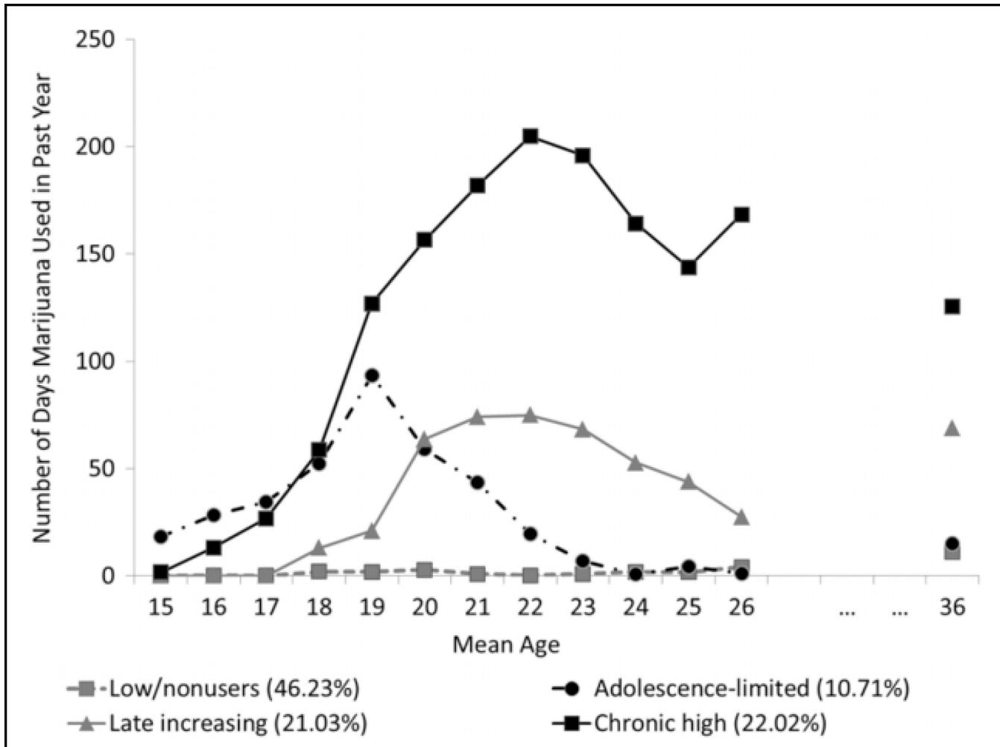

# **HHS Public Access**

Author manuscript *J Res Crime Delinq*. Author manuscript; available in PMC 2016 November 01.

Published in final edited form as: *J Res Crime Delinq*. 2015 November 1; 52(6): 797–828. doi:10.1177/0022427815589816.

# **Developmental Trajectories of Marijuana Use among Men: Examining Linkages with Criminal Behavior and Psychopathic Features into the Mid-30s**

**Dustin Pardini**1, **Jordan Bechtold**1, **Rolf Loeber**1,2, and **Helene White**3

1Department of Psychiatry, University of Pittsburgh Medical Center, Pittsburgh, PA, USA

2Department of Psychology, University of Pittsburgh, Pittsburgh, PA, USA

3Center of Alcohol Studies/Department of Sociology, Rutgers University, Piscataway, NJ, USA

## **Abstract**

**Objectives—**Examine whether young men who chronically use marijuana are at risk for engaging in drug-related and non-drug-related criminal offending and exhibiting psychopathic personality features in their mid-30s.

**Methods—**Patterns of marijuana use were delineated in a sample of predominately Black and White young men from adolescence to the mid-20s using latent class growth curve analysis. Selfreport and official records of criminal offending and psychopathic personality features were assessed in the mid-30s. Analyses controlled for multiple factors indicative of a preexisting antisocial lifestyle and co-occurring use of other substances and tested for moderation by race.

**Results—**Four latent marijuana trajectory groups were identified: chronic high, adolescencelimited, late increasing, and low/nonusers. Relative to low/nonusers, chronic high and late increasing marijuana users exhibited more adult psychopathic features and were more likely to engage in drug-related offending during their mid-30s. Adolescence-limited users were similar to low/nonusers in terms of psychopathic features but were more likely to be arrested for drugrelated crimes. No trajectory group differences were found for violence or theft, and the group differences were not moderated by race.

**Conclusions—**Young men who engage in chronic marijuana use from adolescence into their 20s are at increased risk for exhibiting psychopathic features, dealing drugs, and enduring drugrelated legal problems in their mid-30s relative to men who remain abstinent or use infrequently.

## **Keywords**

antisocial behavior; drug abuse; drugs; causes/correlates; crime

**Declaration of Conflicting Interests**

Reprints and permission: sagepub.com/journalsPermissions.nav

**Corresponding Author:** Dustin Pardini, Department of Psychiatry, University of Pittsburgh Medical Center, Sterling Plaza, Suite 408, 201 North Craig Street, Pittsburgh, PA 15213, USA. dap38@pitt.edu.

The author(s) declared no potential conflicts of interest with respect to the research, authorship, and/or publication of this article.

Ongoing discussions about the potential legalization and decriminalization of medical and recreational marijuana have called for rigorous scientific research regarding the potential long-term consequences of chronic marijuana use. One area of increasing attention is the relation between marijuana use and criminal behavior, given that these two behaviors tend to co-occur during adolescence and adulthood (Bennett, Holloway, and Farrington 2008; Green et al. 2010; White in press). In addition, longitudinal studies have found that adolescents who chronically use marijuana are more likely than nonusers to exhibit criminal behavior and antisocial personality features in adulthood (Brook, Zhang, and Brook 2011; Brook et al. 2011; Flory et al. 2004; Tucker et al. 2005). However, it is unclear whether this association is due to factors associated with a preexisting antisocial lifestyle and/ or cooccurring alcohol and hard drug use. In addition, few studies have examined whether chronic marijuana use during adolescence is predominately associated with the commission of drug-related crimes in adulthood. Finally, studies have not sufficiently examined whether there are racial differences in the association between adolescent marijuana use and adult criminal behavior assessed via both self-report and official criminal records. This study addresses these issues by examining the association between marijuana use during adolescence through the mid-20s and antisocial outcomes in the mid-30s among a sample of Black and White males, after controlling for multiple confounding factors (e.g., preexisting antisocial lifestyle, co-occurring use of other substances).

## **Developmental Patterns of Marijuana Use and Adult Criminal Behavior**

When examining linkages between adolescent marijuana use and later criminal behavior, it is important to recognize that there is considerable heterogeneity in developmental patterns of use over time. Several longitudinal studies have found that youth can be conceptually classified into distinct subgroups based on their pattern of marijuana use from adolescence into early adulthood (Brook, Lee, et al. 2011; Brook, Zhang, et al. 2011; Ellickson, Martino, and Collins 2004; Finlay et al. 2012; Guo et al. 2002; Kandel and Chen 2000; Tucker et al. 2005). The subgroups commonly found across studies include (1) a large group of individuals who use marijuana infrequently or abstain from use completely during this developmental period; (2) a small group of early chronic users who initiate regular use in early to mid-adolescence and continue to engage in frequent marijuana use into early adulthood; (3) a group of adolescence-limited users who begin using marijuana in early to mid-adolescence, but experience a precipitous decrease in their use beginning in their early to mid-20s; and (4) a group of late increasing users who begin using marijuana during late adolescence and continue using heavily during their 20s and 30s, sometimes at higher rates than youth who exhibit early chronic use.

Several longitudinal studies have found that adolescents who exhibit varying developmental trajectories of marijuana use differ in terms of their risk for engaging in criminal behavior during adulthood. The studies generally indicate that both chronic users and late escalating users exhibit more antisocial personality features (Brook, Zhang, et al. 2011; Flory et al. 2004) and criminal behavior (Brook, Lee, et al. 2011; Flory et al. 2004; Tucker et al. 2005) in adulthood than low/nonusers. Although some studies report that chronic users are more likely to engage in adult criminal behavior than increasing users (Brook, Lee, et al. 2011; Flory et al. 2004), nonsignificant differences have also been reported (Brook, Zhang, et al.

2011; Tucker et al. 2005). In contrast, adolescence-limited users do not tend to exhibit higher levels of antisocial behavior than low or nonusers in adulthood (Brook, Zhang, et al. 2011).

One issue that remains unclear is the extent to which the observed association between adolescent marijuana use trajectories and adult antisocial behavior is due to confounding factors. Some research suggests that preexisting characteristics indicative of an antisocial lifestyle (e.g., early conduct problems, psychopathic features, antisocial beliefs, deviant peers) may account for the association between heavy adolescent marijuana use and adult antisocial behavior (Krueger et al. 2002; McGue, Irons, and Iacono 2014). Nonetheless, most trajectory-based studies have not comprehensively controlled for these potential confounds. The linkage between adolescent marijuana use and adult antisocial behavior may also be due to co-occurring use of alcohol and/or hard drugs (e.g., cocaine, heroin). Studies have found that heavy alcohol use is associated with an increased risk for engaging in aggressive and violent behaviors (Felson et al. 2008; White et al. 2013) and that individuals who begin using highly addictive substances (e.g., cocaine, heroin) may begin engaging in criminal acts as a way to obtain the money needed to support their habit (Bennett et al. 2008). To date, only one published study has examined the association between trajectories of adolescent marijuana use and adult antisocial behavior after controlling for comorbid use of other substances (Tucker et al. 2005). Findings indicated that early-onset chronic and late increasing marijuana users were at higher risk for drug dealing at age 23 than abstainers, but there were no significant group differences for violence after controlling for co-occurring alcohol and tobacco use (Tucker et al. 2005).

## **Considering Specific Types of Crime and Psychopathic Personality Features**

Another issue that has not been sufficiently examined is the extent to which early adolescent marijuana use is predominately related to drug-related offending in adulthood, rather than non-drug-related offending. Longitudinal studies that have differentiated between different types of crime have found that persistent adolescent marijuana users are more likely to use and deal drugs during adulthood and be arrested for drug-related crimes, such as hard drug possession (Green et al. 2010; Tucker et al. 2005). In contrast, the association between adolescent marijuana use and alcohol violations (e.g., public drunkenness, DUI) and nondrug-related crimes is less consistent. Some trajectory studies have found no relationship between adolescent marijuana use and adult violence (Lynne-Landsman, Bradshaw, and Ialongo 2010; Tucker et al. 2005). On the other hand, Brook et al. (2014) found that youth who exhibited a chronic, moderate, or adolescence-limited pattern of marijuana use were more likely to engage in violent behavior than low or nonusers in their late 20s. However, only the chronic group was more likely to engage in theft, compared to low or nonusers, emphasizing the importance of examining linkages between developmental patterns of marijuana use and different types of criminal behavior.

Beyond criminal behavior, some evidence suggests that chronic marijuana use may increase the likelihood that adolescents develop features of an antisocial personality by young adulthood (Brook, Zhang, et al. 2011). Relatedly, cross-sectional studies have found that

adolescents and adults with psychopathic personality features are more likely to abuse marijuana and other substances (Hillege, Das, and de Ruiter 2010; Kimonis, Tatar, and Cauffman 2012; Smith and Newman 1990; Walsh, Allen, and Kosson 2007). However, it remains unclear whether psychopathic features represent a developmental precursor to or outcome of chronic marijuana use. In addition, heavy marijuana use is most consistently associated with the impulsive/irresponsible dimension of psychopathy, as opposed to features associated with callousness and interpersonal manipulation (Hillege et al. 2010; Kimonis et al. 2012; Smith and Newman 1990; Walsh et al. 2007). Along these lines, individuals who develop marijuana use disorders often exhibit a persistent pattern of reckless and irresponsible (e.g., poor work performance, financial irresponsibility) behavior (American Psychiatric Association 2013), which may account for the linkage between chronic use and the erratic lifestyle features of adult psychopathy (Hare and Neumann 2008).

## **Racial Differences in Marijuana Use and Antisocial Behavior**

One issue relevant to the current study is whether the association between developmental patterns of adolescent marijuana use and adult antisocial behavior differs between Black and White males. A limited number of longitudinal studies have investigated racial differences in developmental patterns of marijuana use across adolescence and into adulthood. Some have reported no differences in trajectory group membership between Black and White adolescents (Chassin et al. 2010; Ellickson et al. 2004), but others have found that Black youth are more likely to follow a late adolescent escalating pattern of use (Finlay et al. 2012) and are less likely to exhibit an early chronic pattern of use relative to White teens (Brown et al. 2004). One of these studies found that Black teens who exhibited a late adolescent escalating pattern of marijuana use were more likely to be arrested in adulthood relative to Whites exhibiting a similar marijuana use pattern (Brown et al. 2004). This finding is consistent with evidence indicating that Black marijuana users may be charged with more drug-related crimes than White users (Beckett et al. 2005; Ramchand, Pacula, and Iguchi 2006; Ream et al. 2010). Because these differences may be influenced by biases in policing practices and criminal justice processing (Dunford and Elliot 1984; Hindelang, Hirschi, and Weis 1981; Kazemian and Farrington 2005), it is important to further examine racial differences in the association between marijuana use and adult criminal offending using a combination of self-reported and official records.

## **Current Study**

The current study was designed to address several limitations in prior studies described earlier. First, marijuana use trajectories will be identified using annual data collected on a racially diverse sample of young men from mid-adolescence through the mid-20s (i.e., the Pittsburgh Youth Study [PYS]). The few studies that have assessed marijuana use across this developmental span have included relatively few assessment points separated by several years (Brook, Lee, et al. 2011; Brook, Zhang, et al. 2011; Ellickson et al. 2004), limiting their ability to clearly delineate subgroups of youth who differ in terms of the onset, escalation, and desistance of use during this developmental period (Arnett 2005). Second, analyses will examine whether men in different trajectories vary in terms of drug-related and

non-drug-related criminal offending assessed via both self-report and official records, and self-reported psychopathic personality features in their mid-30s. Few existing trajectorybased studies have assessed different facets of criminal behavior using data from multiple sources, and only one existing study (to our knowledge) has examined criminal outcomes into the mid-30s (Brook, Zhang, et al. 2011). Third, the current study will examine trajectory group differences after controlling for a comprehensive array of factors indicative of an antisocial lifestyle (e.g., conduct problems, delinquency, callousness, antisocial beliefs, deviant peers) that predate the onset of regular marijuana use and co-occurring use of tobacco, alcohol, and hard drugs. Finally, this will be the first study to examine whether there are race differences in the associations between marijuana trajectory groups and antisocial outcomes assessed in the mid-30s via both self-report and official records. Although one published study using the PYS data examined racial differences in marijuana trajectory groups (Finlay et al. 2012), the current study used an index of marijuana use that more accurately distinguishes high frequency users (for details, see Measures subsection). Moreover, the study by Finlay and colleagues (2012) did not examine any criminal offending and psychopathy outcomes in adulthood because the follow-up conducted in the mid-30s had not been completed.

Based on prior research using data from the PYS and other longitudinal studies, it is anticipated that four marijuana trajectory groups will be identified: chronic high users, adolescence-limited users, late increasing users, and low/nonusers. Given these groups, it is hypothesized that after controlling for potential confounds, (1) chronic high users and late increasing users will exhibit higher rates of drug-related offending (e.g., drug dealing, illicit drug use/possession) and more psychopathic features related to an erratic lifestyle in their mid-30s relative to low/nonusers; (2) chronic high users and late increasing users will not exhibit higher rates of alcohol violations (e.g., public drunkenness, DUI) and non-drugrelated offending (e.g., theft, violence) than low/nonusers; (3) adolescence-limited users will exhibit similar levels of drug- and non-drug-related criminal offending and psychopathic features compared to low/nonusers; and (4) relative to the low/ nonuser group, Black men in chronic high and late increasing groups will be more likely than White men within the same trajectory groups to be charged with drug-related crimes.

## **Methods**

#### **Participants**

The current investigation used data collected on the oldest cohort of the PYS. The participants were initially recruited from a roster of seventh grade students enrolled in the Pittsburgh public schools (1987–1988). Boys were selected for the study following an initial screening, which was conducted with 856 boys randomly selected from a list of all enrolled students. The screening measured each boy's conduct problems (e.g., fighting, stealing) using a combination of parent, teacher, and self-report instruments. All boys scoring within the upper 30 percent on the multi-informant assessment of conduct problems (*n* = 257) and a roughly equal number of boys randomly selected from the remainder (*n* = 249) were selected for follow-up. The racial/ethnic composition of the 506 boys in the follow-up sample was predominately White (41.7 percent) and Black (54.5 percent), with the

remainder being biracial (3.2 percent), Asian (0.4 percent), and Hispanic (0.2 percent). At screening, nearly all were living with their biological mother (94.0 percent), and approximately half of the boys lived in a household with no biological or acting father (45.3 percent). Approximately half (50.6 percent) of the families reported receiving some form of financial public assistance (e.g., food stamps, disability). The follow-up sample was not significantly different from the screening sample in terms of race and family composition.

Following screening, boys were initially interviewed every six months for 2.5 years (five biannual assessments). After these five biannual assessments, participants were interviewed annually for the next 10 years (10 annual assessments). Parent and youth interviews were typically conducted within the participants' homes or over the phone when participants lived outside of a drivable distance. In addition, teachers completed self-administered rating scales, which assessed aspects of the boys' behavior.

Self-reported antisocial outcomes in adulthood were collected 10 years after the marijuana trajectories ended; participants were, on average, 35.8 years of age at this assessment (*SD* = . 80, range 33–39; hereafter referred to as age 36 follow-up). Official records of offending in adulthood were updated through January 1, 2012, for all participants (mean age = 37.4 years; *SD* = .95; range: 35–40; hereafter referred to as age 37). All participants provided informed consent prior to the administration of the study procedures, which were approved by the university's Institutional Review Board. Greater detail on participant selection, sample characteristics, and study methodology is available elsewhere (Loeber et al. 2008).

#### **Measures**

**Demographic variables—**Participant race was assessed using parent-report information collected using a demographic questionnaire at the screening assessment. For analytic purposes, boys were classified as Black, White, or Other (multiracial, Asian, and Hispanic) using two dummy coded variables. White youth served as the reference group for all analyses (i.e., coded "0" on both variables). Information on parental educational attainment and current occupation at time 1 was used to calculate the Hollingshead Index of socioeconomic status (SES; Hollingshead 2011). This measure was used to control for family SES as a potential confound when examining race and trajectory group differences.

**Marijuana use—**During the screening and initial five biannual assessments, participants indicated the number of days in the past six months that they used marijuana based on the Substance Use Questionnaire (SUQ; Loeber et al. 1998). To be consistent with the 10 subsequent annual assessments, these biannual assessments were combined to create three variables that represented past-year marijuana use (screening + time 1; time 2 + time 3; time 4 + time 5). During the subsequent 10 annual assessments, participants reported on the number of days in the past year they used marijuana. Because marijuana use frequency was highly skewed in the early teens and became bimodal beginning in the early 20s, it was recoded into an ordinal variable: 0 = no use (0 days), 1 = less than once per month (1–11 days), 2 = at least monthly but not weekly (12–51 days), 3 = one to three times per week (52–156 days), and 4 = more than three times per week (157–365 days). This coding scheme is more detailed than the one employed in a prior PYS study (Finlay et al. 2012).

*J Res Crime Delinq*. Author manuscript; available in PMC 2016 November 01.

Specifically, this prior study created a binary indicator of past-year marijuana use that did not differentiate moderate users from high frequency users (i.e., 0 = 0–11 days; 1 = 12–365 days).

The screening and time 1 marijuana use data were not included in the trajectory analysis because the low prevalence of any use at either phase (9.5 percent, *n* = 48) caused model convergence problems. Therefore, the initial measure of past year marijuana use used in the trajectory models was the time 2+3 assessment. Boys averaged 14.9 years of age (*SD* = .80) at the time 3 assessment, so the initial time 2+3 assessment in the current study represented use occurring over the period spanning ages 14 to 15 on average. Men were on average 26.0 years of age (*SD* = .81) at the last consecutive annual assessment. For the remainder of this article, the first and last assessments will be referred to as the age 15 and age 26 assessments, respectively.

**Alcohol, marijuana, and hard drug use (Age 36)—**Past-year use of alcohol, marijuana, and nine different hard drugs (e.g., cocaine, stimulants, opiates, hallucinogens, PCP) were assessed using the SUQ at the age 36 follow-up. To examine the continuity of any marijuana use across the follow-up among the trajectory groups, we created a variable indexing any use (at least one time) and near daily use (at least 312 days; i.e., 6 or more days per week) in the past year. Two additional variables were created to examine whether marijuana trajectories groups differed in their use of alcohol and other drugs. This was done to determine whether trajectory group differences were similar for self-reported substance use and official criminal charges associated with alcohol-related offending and illicit drug possession. Alcohol use was calculated by multiplying the number of days participants reported using alcohol by the average number of drinks participants consumed on drinking days, which was rated on a five-point ordinal scale (0 = less than one drink to 4 = six or more drinks). This variable was log transformed prior to analyses due to significant skewness. A binary variable was created indexing any past-year hard drug use because few participants reported using illicit substances besides marijuana (9.7 percent, *n* = 37).

**Self-report of offending (Age 36)—**Self-report of offending at age 36 was obtained from the Self-Reported Delinquency (SRD) scale (Elliott, Huizinga, and Ageton 1985). Respondents reported whether or not they had engaged in 27 different criminal behaviors (e.g., burglary, gun carrying, fraud, robbery) since their last interview (approximately age 26). Participants were told the date of their last interview, as well as their age and address at the time of the interview, as reference points. If any behaviors were endorsed, participants were asked to state the age at which they last engaged in the behavior and whether they engaged in the behavior in the past year. Because the prevalence of past-year offending was low, binary variables were created to represent whether or not participants reported engaging in specific types of offending over the past five years. Separate variables were created for offenses related to violence (rape, robbery, attacks intended to seriously hurt or kill, and gang fighting), theft (theft > US\$50, pickpocketing, theft from a car, dealing in stolen goods, burglary, and vehicle theft), and drug dealing (sold marijuana or hard drugs). In addition, a variable indexing any non-drug-related offending in the past five years was also created (i.e., any of the 27 offenses besides drug dealing).

**Adult sychopathic personality features (Age 36)—**Psychopathy is a multifaceted construct that encompasses characteristics of antisocial personality disorder, as well as related features that have been associated with chronic adult offending (e.g., shallow affect, grandiose sense of self-worth). Psychopathic features were assessed using three subscales from the Self-report of Psychopathy-III (SPP-III; Paulhus, Neumann, and Hare in press). Items consisted of statements describing various behaviors and asked participants to rate the extent to which they agreed with each statement (1 = disagree strongly to 5 = agree strongly). The subscales assessed features of callous affect (e.g., "people sometimes say I am cold-hearted"), interpersonal manipulation (e.g., "I can talk people into anything"), and an erratic lifestyle (e.g., "I am an impulsive person"). Each subscale consists of 16 items, and higher sum scores represent higher levels of psychopathic features. The antisocial behavior subscale of the SRP-III was not included in the current study because items asked whether men had " ever" engaged in various criminal behaviors. Prior studies have supported the reliability and construct validity of the SRP-III in community and incarcerated samples (Neumann and Pardini 2014; Neumann, Hare, and Pardini in press; Vitacco, Neumann, and Pardini 2014). The internal consistency was acceptable for the callous affect (α = .70), interpersonal manipulation (α = .78), and erratic lifestyle (α = .76) subscales in the current sample.

**Criminal charge outcomes (ages 26–37)—**Adult criminal charges were collected from the Pennsylvania (PA) State Police, PA Clerk of Courts, and the Federal Bureau of Investigation (FBI). As mentioned previously, these records were last updated in January 2012 when the men were approximately 37 years old. Data from each source were double entered into separate databases and discrepancies in data entry were checked and corrected. The PA State Police and PA Clerk of Courts data were merged by matching each offense record using the unique offense tracking number (OTN) assigned to the case. These two data sets were then compared to identify discrepancies in the number and type of charges associated with each OTN. Any discrepancies were manually checked to ensure that all charges associated with an OTN were accurately represented. Because preliminary checks indicated that the FBI records contained less detailed information than either PA sources, only those charges that occurred outside of PA were merged into the final criminal record database.

Several binary variables were created to represent whether or not participants had received a criminal charge for different types of offenses between the day after their age 26 assessment and the date of official record data collection (hereafter referred to as age 26–37). First, we created a variable to represent whether participants had any non-drug-related arrests (i.e., arrests that did not include a drug offense as one of the charges, e.g., person/ violent offenses, property offenses, weapon offenses). We also created two variables to represent whether participants had been charged with physical violence (i.e., simple/aggravated assault, robbery, homicide, sexual assault) or for theft (larceny, burglary, motor vehicle theft, and receiving stolen property). Furthermore, we created several variables to represent whether participants had been charged with various drug-related crimes, including marijuana possession, other illicit drug possession, drug dealing, and alcohol violations (i.e., public intoxication, DUI). We also created an omnibus variable indicating whether participants had

been arrested for any drug-related crime between approximately age 26 and age 37. To assess more recent offending, two variables were created to identify whether participants had any drug-related or any non-drug-related arrests within the five years immediately preceding the criminal record search.

**Preexisting antisocial lifestyle (Age 14)—**A comprehensive set of variables measured at the time 1 assessment were used to control for behavior, beliefs, and peer factors indicative of an antisocial lifestyle prior to the onset of regular marijuana use. Items administered as part of the parent-reported Child Behavior Checklist (CBCL; Achenbach 1991) and the Teacher's Report Form (TRF; Achenbach and Edelbrock 1980) were used to create scales indexing (1) conduct problems, such as fighting, stealing, and destruction of property (eight items); (2) oppositional defiant behaviors, such as being argumentative, talking back, and having temper tantrums (five items); (3) and interpersonal callousness, such as lacking guilt, being manipulative, and denying wrongdoing (eight items). Scales were constructed using identical items administered to both informants, with the higher of the two informants' ratings on each item being taken before summing all items. These scales exhibited high levels of internal consistency (αs from .84 to .93) and have been previously associated with chronic delinquent behavior in youth (Byrd, Loeber, and Pardini 2012; Pardini, Obradovic, and Loeber 2006). Peer deviance was assessed using the peer delinquency scale (Loeber et al. 1998), which asked youth to rate how many of their friends engaged in 15 different deviant acts (e.g., fighting, stealing, smoking marijuana) over the past year using a five-point scale (0 = none of them to 4 = all of them). Antisocial attitudes were assessed using the attitudes toward delinquent behavior scale (Loeber et al. 1998), which asks youth to rate how "wrong" it would be for someone their age to engage in 15 different antisocial acts (e.g., fighting, stealing, smoking marijuana) using a four-point scale (0 = not wrong at all to 3 = very wrong). Previous analyses with the PYS have demonstrated that the peer deviance and antisocial attitude scales have high internal consistency and predict future delinquent behavior (Loeber et al. 2008). Official juvenile court records data were used to create a variable indexing whether participants had been arrested before the first assessment wave included in the marijuana use trajectories. Finally, a binary variable indicating whether participants were classified in the "high risk" group at the screening assessment was included as an additional indicator of an early antisocial lifestyle.

**Co-occurring Tobacco, Alcohol, and Hard Drug Use (ages 15–26)—**Information collected from the SUQ was used to control for co-occurring tobacco, alcohol, and hard drug use across the same assessments used to delineate the marijuana use trajectory groups. For tobacco use, the number of annual assessments participants reported smoking tobacco on a daily basis was first calculated. Because this index was bimodal, participants were categorized into three groups: never used daily (56 percent), smoked daily across less than half of the assessments (10 percent), and smoked daily across more than half of the assessments (34 percent). A variable to index co-occurring alcohol use was created in two steps. First, past-year frequency of alcohol use was recoded at each phase using the same ordinal coding scheme previously described for marijuana use. Second, we averaged these ordinal alcohol variables across all phases to generate an overall index of alcohol use between approximately age 15 and age 26. Finally, we created a binary variable to indicate

whether participants reported using any hard drugs (e.g., cocaine, stimulants, opiates, hallucinogens, PCP) between approximately age 15 and age 26 (28 percent).

#### **Missing Data**

As outlined subsequently, models were estimated using maximum likelihood estimation, which accounts for missing data by estimating model parameters using all available information and provides unbiased estimates under the assumption that data are missing at random. Participant retention has been high across the duration of the PYS, never dropping below 82 percent. Fifty-four percent of individuals provided data for all phases used to estimate the marijuana use trajectories and 80 percent had three or fewer missing phases. Nine individuals were excluded from the analysis because their families dropped out of the study after the first assessment or they did not have data on all covariates.

At the age 36 follow-up assessment, 84.8 percent (*n* = 408) of the living participants were interviewed (25 participants were deceased). Completers and non-completers were similar when compared on the screening variables of high-risk status, family SES, number of biological parents in the home, parent- and teacher-reported internalizing and externalizing problems on the CBCL and TRF; the number of assessments where marijuana use was reported, and onset of marijuana use prior to the age assessment 15. Adult criminal record information was collected on all participants, regardless of whether they participated in the follow-up assessment.

#### **Data Analysis Plan**

Latent class growth analysis (LCGA) was used to identify and model trajectories of marijuana use. LCGA assumes there are latent subpopulations of individuals who follow similar developmental changes in behavior over time (Muthen 2004). All LCGA models were estimated using maximum likelihood estimation with robust standard errors (MLR) and were run using Mplus 7.2 (Muthén and Muthén 1998–2012). Marijuana use was specified as an ordinal variable within the trajectory models. Preliminary growth curves were modeled to determine the highest polynomial (i.e., quadratic, cubic) necessary to accurately describe change in marijuana use in this developmental period. Results of the preliminary analyses indicated that a quadratic term was significant but the cubic term was not, thus a quadratic slope factor was included in the final LCGA models. A successive number of latent classes was then specified with the optimal number of classes being determined by a number of recommended criteria, including the sample adjusted Bayesian Information Criterion (BIC), Vuong-Lo–Mendell–Rubin likelihood ratio test (LRT), the bootstrapped likelihood ratio test (BLRT), classification accuracy, parsimony, and interpretability (Muthen 2004; Nylund, Asparouhov, and Muthen 2008).

After the trajectory groups were established, we used a three-step procedure in Mplus that statistically adjusts for the uncertainty in group membership when modeling trajectory group differences on adult criminal outcomes (Asparouhov and Muthén 2013). Follow-up analyses examining race differences in the associations between trajectory group membership and the adult outcomes were tested after hard classifying participants into their most likely class and adjusting for the posterior probability of the most likely class as a sampling weight. All

*J Res Crime Delinq*. Author manuscript; available in PMC 2016 November 01.

models controlled for covariates indexing early family SES, the set of measures indicating a preexisting antisocial lifestyle, and co-occurring substance use. Model estimates without covariates are available from the first author upon request.

## **Results**

#### **Descriptive Statistics for Study Outcomes**

Table 1 provides descriptive statistics for the study outcomes for the full sample and separately for White and Black participants. At the age 36 assessment, just over one-quarter of the sample reported using marijuana in the past year and just under one-tenth used hard drugs. The prevalence of self-reported violence, theft, and drug dealing over the past five years was relatively low (i.e., 8–14 percent), although almost half of the sample reported engaging in at least one non-drug-related delinquent act. Black men were nearly two times as likely to report dealing drugs in the past five years relative to White men. In terms of official criminal charges between the ages 26 to 37, prevalence estimates ranged from 15 percent for theft to 24 percent for violence. For criminal charges in the past five years, 14 percent of men had a non-drug-related arrest and 16 percent had a drug-related arrest. A greater percentage of Black men were charged with each crime type relative to White men, particularly drug-related and violent offenses.

#### **Trajectory Groups**

Table 2 displays the entropy, adjusted BIC, LRT, and the BLRT for models with two to five latent trajectory groups. Although the BIC was lower for the five-group solution than the four-group solution, we selected the four-group model based on the substantive interpretation, face validity of classes, parsimony, and to be consistent with prior research. The specific classes were (1) low/nonusers (46.2 percent; average posterior probability [*pp*] = .93), (2) adolescence-limited users (10.7 percent; *pp* = .83), (3) late increasing users (21.0 percent; *pp* = .85), and (4) chronic high users (22.0 percent; *pp* = .92).

To illustrate marijuana use patterns of individuals in the trajectory groups, participants were classified into their most likely group based on their posterior probabilities and the mean annual frequency of marijuana use was plotted (see Figure 1). Past-year frequency of marijuana use at the age 36 assessment was also plotted on the figure to demonstrate the continuity of differences in use patterns across the 10-year follow-up. Focusing on the assessments used to define the trajectory groups (i.e., ages 15–26), results indicated the chronic high group displayed a gradual increase in their average frequency of use during adolescence, reaching 79 days a year by age 17, rapidly increasing to 191 days a year by age 20, and maintaining this approximate frequency of use through the mid-20s. The adolescence-limited group gradually increased their average use during adolescence to a peak of 80 days a year at age 19 and then gradually decreased to use less than two days per year by the last assessment. Individuals in these two groups were indistinguishable in terms of their average frequency of marijuana use between ages 15 and 18. The late increasing group showed a gradual increase in their average frequency of marijuana use beginning at age 18, reaching a peak use of 86 days in the past year at age 21, and then decreasing to

maintain moderate use through age 26. On average, the low/nonuser group never used more than two times in any year.

As seen in Figure 1, each trajectory group exhibited considerable continuity in the average frequency of marijuana use from the age 26 assessment to the age 36 assessment. Although there was some evidence that men in the chronic high group decreased the frequency of their use and men in the late increasing group increased their use frequency, the chronic high group continued to display the highest frequency of use. Formal tests of group differences indicated that men in the chronic high and late increasing groups were significantly more likely to have used marijuana in the past year at the age 36 assessment than men in the adolescence-limited and low/nonuser groups (see Table 3). The chronic high group was significantly more likely to engage in daily use relative to all other groups, and the late increasing group was more likely to engage in daily use relative to the low/nonuser group. Although the estimated probability of being a daily user was higher in the late increasing than the adolescence-limited group, this difference was not statistically significant (see Table 3). No differences were found between the adolescence limited and low/nonuser groups in terms of any use and daily use of marijuana in the past year. There were no significant race differences in marijuana use after accounting for trajectory group differences and other model covariates.

#### **Race Differences in Trajectory Group Membership**

A multinomial logistic regression within Mplus was used to examine race differences in the latent trajectory group membership. Without controlling for model covariates, results indicated that Black men were significantly more likely than White men to be in the late increasing group compared to the low/nonuser group (odds ratio [OR] = 1.39, *p* = .007), with no other significant race differences between groups. When all covariates were included in the model, results indicated that Black men were significantly more likely than White men to be in the late increasing (OR = 2.48, *p* <.001), adolescence-limited (OR = 2.41, *p* <.001), and chronic high (OR = 3.52,*p* < .001) groups, compared to the low/nonuser group. Closer examination of these findings indicated that race differences in adolescencelimited and chronic high group membership (relative to the low/nonuser group) only emerged after controlling for covariates indexing concurrent tobacco, alcohol, and hard drug use.

#### **Antisocial Outcomes at Age 36**

**Alcohol and Hard Drug Use at Age 36—**Trajectory group differences in past-year alcohol use and hard drug use at the age 36 assessment after controlling for all covariates are presented in Table 3. There were no significant trajectory group differences in terms of alcohol use. Men in the late increasing and chronic high groups were more likely to report using hard drugs in the past year relative to men in the low/nonuser group. The adolescencelimited group was not significantly different from the other three groups in terms of hard drug use. Black men were less likely to endorse hard drug use at age 36 relative to White men.

**Self-reported criminal offending at age 36—**As indicated in Table 3, the only significant trajectory group difference in self-reported offending in the past five years was for drug dealing. Specifically, chronic high men were more likely to self-report engaging in drug dealing than the low/nonuser group, but chronic high men were not more likely to report drug dealing than adolescence-limited or late increasing group members. The late increasing, adolescence-limited, and low/nonuser groups did not differ from one another with regard to drug dealing. There were no group differences in self-report of violence, theft, or any non-drug-related crime in the past five years. There were race differences for selfreported drug dealing, violence, and theft with Black men being more likely to endorse these offenses than White men.

**Psychopathic features at age 36—**Trajectory group differences emerged on all three psychopathy subscales (see Table 3). The chronic high group rated themselves significantly higher than the adolescence-limited and low/nonuser groups on the interpersonal manipulation, callous affect, and erratic lifestyle subscales. Furthermore, the chronic high group also rated themselves higher than the late increasing group on the interpersonal manipulation subscale. The late increasing group rated themselves significantly higher on scales indexing interpersonal manipulation and erratic lifestyle than the low/nonuser group, and the late increasing group was higher on the erratic lifestyle scale than the adolescencelimited group. The adolescence-limited and low/nonuser group were not significantly different from one another on any dimension of psychopathic features.

#### **Drug- and non-drug-related criminal charges from ages 26 to 37—**Group

differences on criminal charges acquired after the age 26 assessment are presented in Table 4. In terms of non-drug-related arrests, results indicated that men in the late increasing and chronic high groups were both more likely to have a non-drug-related arrest relative to the low/nonuser and adolescence-limited groups, with no other significant between-group differences. There were no significant differences between trajectory groups in terms of being charged with a violence or theft offense. Significant race differences were found for any non-drug-related arrest and being charged with violence, with Black men being more likely to experience these outcomes relative to White men.

Several significant trajectory group differences were found for drug-related charges acquired after the age 26 assessment. Men in the chronic high and late increasing groups were more likely to be charged with all drug-related crimes assessed except for alcohol-related offenses relative to men in the low/nonuser group. The chronic high group men were also more likely to be charged with drug dealing and marijuana possession than the adolescence-limited group, and more likely to be charged with marijuana possession than the late increasing group. The adolescence-limited group did not differ from low/nonuser or late increasing groups on any of the drug-related charge outcomes. No group differences were found for alcohol-related charges. In terms of race, Black men were more likely to be charged with all drug-related crimes except for those involving alcohol than White men.

We next examined group differences on variables indexing any nondrug-related arrest and any drug-related charge in the past five years. Analyses indicated that there were significant group differences for any drug-related charge, but not for any non-drug-related arrest.

Specifically, the adolescence-limited, late increasing, and chronic high groups were all more likely to have been charged with a drug-related crime relative to the low/nonuser group, but these groups were not significantly different from one another.

#### **Moderating Effect of Race**

In the last stage of the analysis, we examined whether the antisocial outcomes associated with trajectory group membership varied by race. For this analysis, participants were hard classified into their most likely marijuana trajectory group based on their posterior probability of group membership. A series of logistic and linear regressions were run using race, trajectory group membership, and the interaction between race and trajectory group, as well as all other study covariates to predict the study outcomes. To account for uncertainty in group membership, each participant's posterior probability of group membership for the assigned class was used as a sampling weight. Only Black and White men were included in this analysis, given the low number of other racial/ethnic groups. No significant race by trajectory group membership interactions were found in any of these models (results available from the first author upon request).

## **Discussion**

Although there is no definitive evidence supporting a causal link between heavy marijuana use and subsequent crime, an association has been observed in cross-sectional and longitudinal studies (Green et al. 2010). The present study extended previous work by examining whether trajectories of marijuana use from adolescence into the mid-20s were associated with both drug-related and non-drug-related crimes, other substance use, and selfreported psychopathic personality features in the mid-30s. Unlike previous studies, the analyses presented here controlled for several indicators of an early antisocial lifestyle that predated regular marijuana use (assessed using multiple methods and informants) as well as co-occurring use of other substances. The most robust findings indicate that men exhibiting a chronic high pattern of marijuana use were at highest risk for exhibiting psychopathic personality features and engaging in drug-related crimes (including drug dealing and hard drug use) into their mid-30s relative to all other groups. There was also some evidence that both adolescence-limited and late increasing groups were at increased risk for being arrested for drug-related crimes, relative to low/nonusers. However, there was no consistent evidence indicating that men who used marijuana regularly during adolescence were at increased risk for engaging in non-drug-related crimes once they entered their mid-30s, relative to men who abstained from use or used infrequently. In addition, there was no evidence that the link between marijuana use patterns and later antisocial outcomes differed between Black and White men.

#### **Divergent Developmental Trajectories of Marijuana Use**

Consistent with prior research, we identified four subgroups of individuals who differed in their patterns of marijuana use between adolescence and young adulthood: chronic high users, adolescence-limited users, late increasing users, and low/nonusers. These results emphasize the heterogeneity in regular marijuana users in early adolescence, as analyses indicated that approximately one-third of heavy adolescent users experienced a dramatic

decrease in use in their early 20s. However, the stability of use across the 10-year period spanning age 26 to age 36 was higher than the stability of use in adolescence, with approximately half of the individuals in the chronic high and late increasing groups reporting marijuana use in the past year at the last assessment. This finding suggests that the optimal window of opportunity for implementing interventions designed to prevent chronic marijuana use is prior to the mid-20s.

#### **Trajectory Group Differences in Criminal Offending and Psychopathic Features**

Findings from the current study indicated that men exhibiting late increasing and chronic high marijuana use were at increased risk of engaging in criminal offending and exhibiting psychopathic features into their mid-30s. As hypothesized, analyses indicated that men in both groups were predominately at higher risk for engaging in illicit drug-related offending relative to men in the low/nonuser group based on both official records and self-report, particularly dealing, possessing, and using illicit drugs. In contrast, no trajectory group differences were found for alcohol-related criminal charges or self-reported frequency of alcohol use. There was also no evidence indicating that men in the late increasing and chronic high groups were more likely to self-report or be charged with non-drug-related crimes in the past five years relative to low/nonuser during their mid-30s (e.g., violence, theft), after controlling for indicators of a preexisting antisocial propensity and co-occurring use of other substances. Together, this suggests that the relation between chronic adolescent marijuana use and later criminal offending is largely circumscribed to acts related to possessing, using, and dealing illicit drugs.

As anticipated, the findings also suggested that men exhibiting late increasing and chronic high marijuana use exhibited higher levels of psychopathic personality features associated with an erratic lifestyle in adulthood relative to low/nonusers and adolescence-limited users. Although the reason for this association remains unclear, it is possible that heavy marijuana users developed psychopathic features indicative of an erratic lifestyle (e.g., financial irresponsibility, unemployment) as part of an underlying substance use disorder (American Psychiatric Association 2013). Findings also indicated that high chronic marijuana users were more likely to exhibit manipulative and callous personality features than the adolescence-limited and low/nonuser. It will be important for future studies to examine the factors that may contribute to this association, such as chronic exposure to illegal drug markets where violence, the callous use of others for personal gain, and deceitfulness are often commonplace.

As hypothesized, although men in the adolescence-limited group used similar amounts of marijuana as the chronic high group during adolescence, they were nearly identical to the low/nonuser group in terms of criminal behavior and psychopathic features by their mid-30s. The only group difference observed indicated that men in the adolescence-limited group were more likely to have been charged with a drug-related crime in the past five years. However, there was no evidence indicating that adolescence-limited men were at higher risk for being charged with a specific type of drug-related offense relative to the low/nonuser group from age 26 to 37. Therefore, the results suggest that early marijuana use does not necessarily embed youth in a life of crime and that it is possible to reduce use in young

adulthood and follow a noncriminal lifestyle. It will be important for future studies to investigate why and how adolescence-limited users are able to discontinue heavy marijuana use during the transition to young adulthood.

#### **Race Differences in Marijuana Use and Antisocial Outcomes**

Black men were more likely than White men to be in the late increasing group relative to the low/nonuser group prior to controlling for model covariates. Interestingly, results indicated that Black men were also more likely than White men to be in chronic high and adolescence-limited groups (relative to the low/nonuser group) after statistically controlling for co-occurring use of other substances and antisocial lifestyle variables. These findings suggest that Black men in the current study were more likely than White men to preferentially use marijuana relative to other substances during adolescence and young adulthood. Prior research has also indicated that White youth are more likely than Black youth to use cigarettes, alcohol, and hard drugs (Centers for Disease Control and Prevention 2008; White et al. 2004), but that race differences for marijuana use are often nonsignificant or mixed (Centers for Disease Control and Prevention 2008; Elder et al. 2000; Ellickson et al. 2004; White et al. 2007).

Contrary to predictions, the association between developmental patterns of marijuana use and later criminal behavior did not vary by race. However, Black men were more likely to self-report being involved in drug dealing and be arrested for drug-related crimes than White men, after controlling for marijuana trajectory group membership co-occurring use of other substances, and indicators of an early antisocial lifestyle. Black men were also more likely to self-report, and be charged with, violence. This finding is consistent with prior studies indicating that drug dealing is often accompanied by the use of serious violence to protect drug-selling territory and retaliate against robbery attempts (Gordon et al. 2014). In contrast, Black men were less likely to report using hard drugs in young adulthood, which suggests that they are not dealing drugs as a way to support a hard drug habit.

#### **Limitations and Future Directions**

There are several limitations that should be considered when evaluating the results of this study. First, this study focused on an urban sample of men and future research should investigate these relations with women and among adolescents living in other areas of the country. Additionally, the current findings are based on a school-based sample of predominately Black and White young men who were oversampled based on early conduct problems. As such, future research should examine whether the findings generalize to other racial/ethnic groups and lower-risk adolescents. There was a relatively low base rate of selfreported theft and violence in the current sample, consistent with studies showing that the prevalence of criminal behavior rapidly declines beginning in the mid-20s (Piquero, Hawkins, and Kazemian 2012). As a result, it is possible that linkages between heavy marijuana use and these types of criminal behaviors are more pronounced earlier in development when criminal behavior is more common. Due to the gap between the age 26 and age 36 assessments, we did not obtain information about socio-contextual factors (e.g., neighborhood crime) that may have been associated with criminal activity and drug dealing in adulthood. Future research would benefit by examining how neighborhood factors might

help to explain racial differences in criminal behavior, especially drug-related offending (Krivo, Peterson, and Kuhl 2009).

A final limitation is that the current study focused on criminal charges rather than convictions due to the fact that official records often contained unreported dispositions and convictions can be influenced by several extraneous factors (e.g., legal representation, prosecutorial discretion, burden of proof, plea bargaining). However, both criminal charges and convictions are subject to potential racial biases that can take place at various discretion points during the processing of criminal cases (Kutateladze et al. 2014; Theobald et al. 2014). Therefore, the extent to which the race differences in arrest represent actual differences in offending is unclear. Nevertheless, Black men were more likely to self-report drug dealing, theft, and violent offenses than White men, suggesting that these findings are not solely due to racial biases. Moreover, the association between marijuana trajectory group membership and arrest was equivalent for Black and White men, indicating that any racial biases in arrest did not vary across different trajectory groups.

## **Conclusions**

Overall, the results indicate that male adolescents who use marijuana frequently from their mid-teens through their mid-20s are more likely to engage in drug-related offending in young adulthood, and this relationship is similar for Black and White men. Although high chronic marijuana users tend to be at highest risk for engaging in drug-related adult crime and developing psychopathic personality features, late increasing users are also at increased risk for being arrested for drug-related crimes into their mid-30s. Although the data suggest that the relation between marijuana and these outcomes is not likely due to an underlying antisocial lifestyle that predates regular marijuana use, it remains unclear whether the elevated risk of criminal behavior is a direct or indirect result of marijuana use. Limitations notwithstanding, the results from the current study indicate that programs designed to screen and intervene with adolescents and young adults exhibiting a chronic pattern of heavy marijuana use (Diamond et al. 2002; Madras et al. 2009) might predominately reduce drugrelated crimes, but have little impact on crimes involving violence and theft in adulthood.

## **Acknowledgments**

#### **Funding**

The author(s) received no financial support for the research, authorship, and/or publication of this article.

## **References**

- Achenbach, TM. Manual for the Child Behavior Checklist/4–18 and 1991 Profiles. Burlington, VT: University of Vermont, Department of Psychiatry; 1991.
- Achenbach, TM.; Edelbrock, C. Child Behavior Checklist: Teacher's Report Form. Burlington: University of Vermont Department of Psychiatry; 1980.
- American Psychiatric Association. Diagnostic and Statistical Manual of Mental Disorders. 5th ed.. Arlington, VA: American Psychiatric Association; 2013.
- Arnett JJ. The Developmental Context of Substance Use in Emerging Adulthood. Journal of Drug Issues. 2005; 35:235–53.

- Asparouhov T, Muthén B. Auxiliary Variables in Mixture Modeling: 3-step Approaches Using Mplus. Mplus Web Notes. 2013; 15:1–24.
- Beckett K, Nyrop K, Pfingst L, Bowen M. Drug Use, Drug Possession Arrests, and the Question of Race: Lessons from Seattle. Social Problems. 2005; 52:419–441.
- Bennett T, Holloway K, Farrington D. The Statistical Association between Drug Misuse and Crime: A Meta-analysis. Aggression and Violent Behavior. 2008; 13:107–118.
- Brook JS, Lee JY, Brown EN, Finch SJ, Brook DW. Developmental Trajectories of Marijuana Use from Adolescence to Adulthood: Personality and Social Role Outcomes. Psychological Reports. 2011; 108:339–357. [PubMed: 21675549]
- Brook JS, Lee JY, Finch SJ, Brook DW. Developmental Trajectories of Marijuana Use from Adolescence to Adulthood: Relationship with Using Weapons Including Guns. Aggressive Behavior. 2014; 40:229–237. [PubMed: 24338741]
- Brook JS, Zhang CS, Brook DW. Antisocial Behavior at Age 37: Developmental Trajectories of Marijuana Use Extending from Adolescence to Adulthood. American Journal on Addictions. 2011; 20:509–515. [PubMed: 21999495]
- Brown TL, Flory K, Lynam DR, Leukefeld C, Clayton RR. Comparing the Developmental Trajectories of Marijuana Use of African American and Caucasian Adolescents: Patterns, Antecedents, and Consequences. Experimental and Clinical Psychopharmacology. 2004; 12:47– 56. [PubMed: 14769099]
- Byrd AL, Loeber R, Pardini DA. Understanding Desisting and Persisting Forms of Delinquency: The Unique Contributions of Disruptive Behavior Disorders and Interpersonal Callousness. Journal of Child Psychology and Psychiatry. 2012; 53:371–380. [PubMed: 22176342]
- Centers for Disease Control and Prevention. Youth Risk Behavior Surveillance: United States, 2007. Morbidity & Mortality Weekly Report. 2008; 57:1–131. [PubMed: 18185492]
- Chassin L, Dmitrieva J, Modecki K, Steinberg L, Cauffman E, Piquero AR, Knight GP, Losoya SH. Does Adolescent Alcohol and Marijuana Use Predict Suppressed Growth in Psychosocial Maturity among Male Juvenile Offenders? Psychology of Addictive Behaviors. 2010; 24:48–60. [PubMed: 20307112]
- Diamond G, Godley SH, Liddle HA, Sampl S, Webb C, Tims FM, Meyers R. Five Outpatient Treatment Models for Adolescent Marijuana Use: A Description of the Cannabis Youth Treatment Interventions. Addiction. 2002; 97:70–83. [PubMed: 12460130]
- Dunford FW, Elliot DS. Identifying Career Offenders Using Self-reported Data. Journal of Research in Crime and Delinquency. 1984; 21:57–86.
- Elder C, Leaver-Dunn D, Wang MQ, Nagy S, Green L. Organized Group Activity as a Protective Factor against Adolescent Substance Use. American Journal of Health Behavior. 2000; 24:108– 113.
- Ellickson PL, Martino SC, Collins RL. Marijuana Use from Adolescence to Young Adulthood: Multiple Developmental Trajectories and their Associated Outcomes. Health Psychology. 2004; 23:299–307. [PubMed: 15099171]
- Elliott, DZ.; Huizinga, D.; Ageton, SS. Explaining Delinquency and Drug Use. Beverly Hills, CA: Sage; 1985.
- Felson R, Savolainen J, Aaltonen M, Moustgaard H. Is the Association between Alcohol Use and Delinquency Causal or Spurious? Criminology. 2008; 46:785–808.
- Finlay AK, White HR, Mun EY, Cronley CC, Lee C. Racial Differences in Trajectories of Heavy Drinking and Regular Marijuana Use from Ages 13 to 24 among African-American and White Males. Drug and Alcohol Dependence. 2012; 121:118–123. [PubMed: 21908109]
- Flory K, Lynam D, Milich R, Leukefeld C, Clayton R. Early Adolescent through Young Adult Alcohol and Marijuana Use Trajectories: Early Predictors, Young Adult Outcomes, and Predictive Utility. Development and Psychopathology. 2004; 16:193–213. [PubMed: 15115071]
- Gordon RA, Rowe HL, Pardini D, Loeber R, White HR, Farrington DP. Serious Delinquency and Gang Participation: Combining and Specializing in Drug Selling, Theft, and Violence. Journal of Research on Adolescence. 2014; 24:235–251. [PubMed: 24954999]

*J Res Crime Delinq*. Author manuscript; available in PMC 2016 November 01.

- Green KM, Doherty EE, Stuart EA, Ensminger ME. Does Heavy Adolescent Marijuana Use Lead to Criminal Involvement in Adulthood? Evidence from a Multiwave Longitudinal Study of Urban African Americans. Drug and Alcohol Dependence. 2010; 112:117–125. [PubMed: 20598815]
- Guo J, Chung I-J, Hill KG, Hawkins JD, Catalano RF, Abbott RD. Developmental Relationships between Adolescent Substance Use and Risky Sexual Behavior in Young Adulthood. Journal of Adolescent Health. 2002; 31:354–362. [PubMed: 12359381]
- Hare RD, Neumann CS. Psychopathy as a Clinical and Empirical Construct. Annual Review of Clinical Psychology. 2008; 4:217–246.
- Hillege S, Das J, de Ruiter C. The Youth Psychopathic Traits Inventory: Psychometric Properties and its Relation to Substance Use and Interpersonal Style in a Dutch Sample of Non-referred Adolescents. Journal of Adolescence. 2010; 33:83–91. [PubMed: 19559475]
- Hindelang, M.; Hirschi, T.; Weis, J. Measuring Delinquency. Beverly Hills, CA: Sage; 1981.
- Hollingshead AB. Four Factor Index of Social Status. Yale Journal of Sociology. 2011; 9:21–52.
- Kandel DB, Chen K. Types of Marijuana Users by Longitudinal Course. Journal of Studies on Alcohol. 2000; 61:367–378. [PubMed: 10807207]
- Kazemian L, Farrington DP. Comparing the Validity of Prospective, Retrospective, and Official Onset for Different Offending Categories. Journal of Quantitative Criminology. 2005; 21:127–147.
- Kimonis ER, Tatar JR, Cauffman E. Substance-related Disorders among Juvenile Offenders: What Role Do Psychopathic Traits Play? Psychology of Addictive Behaviors. 2012; 26:212. [PubMed: 22564205]
- Krivo LJ, Peterson RD, Kuril DC. Segregation, Racial Structure, and Neighborhood Crime. American Journal of Sociology. 2009; 114:1765–1802.
- Krueger RF, Hicks BM, Patrick CJ, Carlson SR, Iacono WG, McGue M. Etiologic Connections among Substance Dependence, Antisocial Behavior, and Personality: Modeling the Externalizing Spectrum. Journal of Abnormal Psychology. 2002; 111:411–424. [PubMed: 12150417]
- Kutateladze BL, Andiloro NR, Johnson BD, C Spohn C. Cumulative Disadvantage: Examining Racial and Ethnic Disparity in Prosecution and Sentencing. Criminology. 2014; 52:514–551.
- Loeber, R.; Farrington, DP.; Stouthamer-Loeber, M.; Van Kammen, WB. Antisocial Behavior and Mental Health Problems: Explanatory Factors in Childhood and Adolescence. New York, NY: Routledge; 1998.
- Loeber, R.; Farrington, DP.; Stouthamer-Loeber, M.; White, HR. Violence and Serious Theft: Development and Prediction from Childhood to Adulthood. New York: Routledge; 2008.
- Lynne-Landsman SD, Bradshaw CP, Ialongo NS. Testing a Developmental Cascade Model of Adolescent Substance Use Trajectories and Young Adult Adjustment. Development and Psychopathology. 2010; 22:933–948. [PubMed: 20883591]
- Madras BK, Compton WM, Avula D, Stegbauer T, Stein JB, Clark HW. Screening, Brief Interventions, Referral to Treatment (SBIRT) for Illicit Drug and Alcohol Use at Multiple Healthcare Sites: Comparison at Intake and 6 Months Later. Drug and Alcohol Dependence. 2009; 99:280–295. [PubMed: 18929451]
- McGue, M.; Irons, D.; Iacono, WG. The Adolescent Origins of Substance Use Disorders: A Behavioral Genetic Perspective. In: Scott, F., editor. Genes and the Motivation to Use Substances. Stoltenberg. New York: Springer; 2014. p. 31-50.
- Muthen, B. Latent Variable Analysis. Growth Mixture Modeling and Related Techniques for Longitudinal Data. In: Kalpan, D., editor. Handbook of Quantitative Methodology for the Social Sciences. Newbury Park, CA: Sage; 2004. p. 345-368.
- Muthén, LK.; Muthén, BO. Mplus User's Guide. 7th ed.. Los Angeles, CA: Muthén & Muthé n; 1998– 2012.
- Neumann CS, Hare RD, Pardini DA. Antisociality and the Construct of Psychopathy: Data from across the Globe. Journal of Personality. 2014 Advance online publication.
- Neumann CS, Pardini D. Factor Structure and Construct Validity of the Self-report Psychopathy (SRP) Scale and the Youth Psychopathic Traits Inventory (YPI) in Young Men. Journal of Personality Disorders. 2014; 28:419–433. [PubMed: 22984856]

- Nylund KL, Asparouhov T, Muthen BO. Deciding on the Number of Classes in Latent Class Analysis and Growth Mixture Modeling: A Monte Carlo Simulation Study. Structural Equation Modeling. 2008; 15:182–182.
- Pardini D, Obradovic J, Loeber R. Interpersonal Callousness, Hyper-activity/Impulsivity, Inattention, and Conduct Problems as Precursors to Delinquency Persistence in Boys: A Comparison of Three Grade-based Cohorts. Journal of Clinical Child and Adolescent Psychology. 2006; 35:46–59. [PubMed: 16390302]
- Paulhus, D.; Neumann, CS.; Hare, RD. Manual for the Self-report of Psychopathy (SRP-III) Scale. Toronto, Canada: Multi-Health Systems; In press.
- Piquero, A.; Hawkins, D.; Kazemian, L. Criminal Career Patterns. In: Loeber, R.; Farrington, D., editors. From Juvenile Delinquency to Adult Crime: Criminal Careers, Justice Policy, and Prevention. Oxford, UK: Oxford University Press; 2012. p. 14-46.
- Ramchand R, Pacula RL, Iguchi MY. Racial Differences in Marijuana-users' Risk of Arrest in the United States. Drug and Alcohol Dependence. 2006; 84:264–272. [PubMed: 16600529]
- Ream GL, Johnson BD, Dunlap E, Benoit E. The Role of Marijuana Use Etiquette in Avoiding Targeted Police Enforcement. Drugs-Education Prevention and Policy. 2010; 17:689–706.
- Smith SS, Newman JP. Alcohol and Drug Abuse-dependency Disorders in Psychopathic and Nonpsychopathic Criminal Offenders. Journal of Abnormal Psychology. 1990; 99:1–10.
- Theobald D, Farrington DP, Loeber R, Pardini DA, Piquero AR. Scaling Up from Convictions to Selfreported Offending. Criminal Behaviour and Mental Health. 2014; 24:265–276. [PubMed: 25294160]
- Tucker JS, Ellickson PL, Orlando M, C Martino S, Klein DJ. Substance Use Trajectories from Early Adolescence to Emerging Adulthood: A Comparison of Smoking, Binge Drinking, and Marijuana Use. Journal of Drug Issues. 2005; 35:307–331.
- Vitacco MJ, Neumann CS, Pardini DA. Predicting Future Criminal Offending in a Community-based Sample of Males Using Self-reported Psychopathy. Criminal Justice and Behavior. 2014; 41:345– 363.
- Walsh Z, Allen LC, Kosson DS. Beyond Social Deviance: Substance Use Disorders and the Dimensions of Psychopathy. Journal of Personality Disorders. 2007; 21:273–288. [PubMed: 17536940]
- White, HR. Substance Use and Crime. In: Sher, KJ., editor. Psychology and Substance Abuse. Oxford, UK: Oxford University Press; In press.
- White HR, Fite P, Pardini D, Mun EY, Loeber R. Moderators of the Dynamic Link between Alcohol Use and Aggressive Behavior among Adolescent Males. Journal of Abnormal Child Psychology. 2013; 41:211–222. [PubMed: 22911129]
- White HR, Jarrett N, Valencia EY, Loeber R, Wei E. Stages and Sequences of Initiation and Regular Substance Use in a Longitudinal Cohort of Black and White Male Adolescents. Journal of Studies on Alcohol and Drugs. 2007; 68:173–181. [PubMed: 17286335]
- White HR, Nagin D, Replogle E, Stouthamer-Loeber M. Racial Differences in Trajectories of Cigarette Use. Drug Alcohol Dependence. 2004; 76:219–227. [PubMed: 15561473]

## **Biographies**

**Dustin Pardini**, PhD, is an Associate Professor in the Department of Psychiatry at the University of Pittsburgh Medical Center. His research interests involve examining the biopsychosocial precursors and outcomes associated with antisocial behavior and substance use problems from childhood to adulthood.

**Jordan Bechtold**, PhD, is a Postdoctoral Scholar in the Department of Psychiatry at the University of Pittsburgh Medical Center. Her research interests include adolescent risk taking (delinquency, violence, and substance use), the context of the justice system, and the policy implications of developmental science research findings.

*J Res Crime Delinq*. Author manuscript; available in PMC 2016 November 01.

**Rolf Loeber**, PhD, is a Distinguished Professor of Psychiatry in the Department of Psychiatry at the University of Pittsburgh Medical Center. His primary research interests involve examining factors that influence the development of criminal behavior over the life course. To facilitate this research, he initiated three large longitudinal studies: the Pittsburgh Youth Study, the Developmental Trends Study and the Pittsburgh Girls Study.

**Helene White**, PhD, is a Professor of Sociology in the Center of Alcohol Studies at Rutgers University. Her research focuses on the on the causes, consequences, developmental comorbidity, and prevention of substance use and other problem behaviors (e.g., violence, delinquency, crime and mental health problems).

Pardini et al. Page 22

#### **Figure 1.**

Mean frequency of past-year marijuana use for each trajectory group over time. Trajectory groups estimated using assessments spanning ages 15–26. Past-year marijuana use at age 36 is included in the figure to illustrate continuity of marijuana use frequency for each trajectory group.

*J Res Crime Delinq*. Author manuscript; available in PMC 2016 November 01.

**Table 1**

Descriptive Statistics for Study Outcomes.

|                                           | Total Sample |        | Black        |        | White        |        |
|-------------------------------------------|--------------|--------|--------------|--------|--------------|--------|
|                                           | M/Percentage | (SD)/N | M/Percentage | (SD)/N | M/Percentage | (SD)/N |
| Substance use (past year)                 |              |        |              |        |              |        |
| Any marijuana use                         | 27.8%        | 113    | 32.4%        | 69     | 21.1%        | 37     |
| Marijuana use 6+ days/week                | 8.6%         | 35     | 11.3%        | 24     | 5.7%         | 10     |
| Any hard drug use                         | 9.1%         | 37     | 5.6%         | 12     | 13.7%        | 24     |
| Alcohol use (quantity × frequency)        | 3.57         | (2.30) | 3.46         | (2.47) | 3.73         | (2.08) |
| Self-reported offending (past five years) |              |        |              |        |              |        |
| Any non-drug offending                    | 43.9%        | 179    | 45.3%        | 97     | 41.7%        | 73     |
| Violence                                  | 13.0%        | 53     | 15.4%        | 33     | 9.7%         | 17     |
| Theft                                     | 7.8%         | 32     | 9.4%         | 20     | 5.1%         | 9      |
| Drug dealing                              | 14.5%        | 59     | 17.8%        | 38     | 9.1%         | 16     |
| Psychopathic personality traits           |              |        |              |        |              |        |
| Interpersonal manipulation                | 38.18        | (7.94) | 38.70        | (7.36) | 37.61        | (8.64) |
| Callous affect                            | 41.63        | (7.34) | 42.54        | (7.45) | 40.69        | (7.16) |
| Erratic lifestyle                         | 42.69        | (8.21) | 42.92        | (8.15) | 42.39        | (8.33) |
| Non-drug-related charges (ages 26–37)     |              |        |              |        |              |        |
| Any non-drug-related arrest               | 37.6%        | 181    | 47.8%        | 122    | 25.0%        | 52     |
| Violent charge                            | 24.3%        | 1 17   | 32.7%        | 83     | 14.9%        | 31     |
| Theft charge                              | 15.2%        | 73     | 18.7%        | 47     | 11.5%        | 24     |
| Drug-related charges (ages 26–37)         |              |        |              |        |              |        |
| Any drug-related charge                   | 32.6%        | 157    | 43.3%        | 110    | 19.2%        | 40     |
| Marijuana possession charge               | 14.6%        | 70     | 24.2%        | 61     | 4.3%         | 9      |
| Hard drug possession charge               | 19.1%        | 92     | 29.9%        | 76     | 7.2%         | 15     |
| Drug dealing charge                       | 16.6%        | 80     | 26.8%        | 68     | 4.8%         | 10     |
| Alcohol-related charge                    | 15.5%        | 74     | 17.1%        | 43     | 12.5%        | 26     |
| Recent criminal charges (past five years) |              |        |              |        |              |        |
| Non-drug-related arrest                   | 14.0%        | 67     | 17.4%        | 44     | 10.6%        | 22     |
| Drug-related charge                       | 16.5%        | 79     | 22.6%        | 57     | 8.2%         | 17     |

*J Res Crime Delinq*. Author manuscript; available in PMC 2016 November 01.

Author Manuscript

Author Manuscript

*Note:* Other racial groups besides Black and White are not shown separately due to small Ns.

*J Res Crime Delinq*. Author manuscript; available in PMC 2016 November 01.

Pardini et al. Page 24

#### **Table 2**

Model Comparisons for Successive Latent Classes of Marijuana Use Trajectories.

| Model       | BIC-adjusted | Entropy | LRT(p) | BLRT (p) |
|-------------|--------------|---------|--------|----------|
| Two class   | 9,114.40     | .87     | <.00l  | <.00l    |
| Three class | 8,922.80     | .80     | =.188  | <.00l    |
| Four class  | 8,793.92     | .82     | =.001  | <.00l    |
| Five class  | 8,728.84     | .80     | =.533  | <.00l    |

*Note:* The Vuong-Lo-Mendell-Rubin likelihood ratio test (LRT) and the bootstrapped likelihood ratio test (BLRT) examine whether an *N*-group solution is better than *N* — I group solution. BIC = Bayesian Information Criterion.

Author Manuscript

Marijuana Trajectory Group Differences on Self-report Measures of Substance Use, Offending, and Psychopathic Traits at Age 36.

|                                           | Low/Nonusers (n = 231) |      | Adolescence-limited (n = 54) |      | Late Increasing (n = 103) |      | Chronic High (n = 109) |      | Trajectory Group | Black vs. White |
|-------------------------------------------|---------------------------|------|---------------------------------|------|------------------------------|------|---------------------------|------|---------------------|--------------------|
|                                           | Pr/M                      | SE   | Pr/M                            | SE   | Pr/M                         | SE   | Pr/M                      | SE   | 2 χ              | z                  |
| Substance use (past year)                 |                           |      |                                 |      |                              |      |                           |      |                     |                    |
| Any marijuana use                         | 0.12a                     |      | 0.07a                           |      | 0.40b                        |      | 0.52b                     |      | 41.42***            | 1.59               |
| Marijuana use 6+ days/week                | 0.01a                     |      | 0.02ab                          |      | 0.09b                        |      | 0.21c                     |      | 1 1.52**            | 0.84               |
| Any hard drug use                         | 0.01a                     |      | 0.05ab                          |      | 0.09b                        |      | 0.13b                     |      | 13.91**             | * −2.51         |
| Alcohol use (quantity × frequency)        | 3.72                      | 0.16 | 3.06                            | 0.35 | 3.84                         | 0.22 | 3.19                      | 0.28 | 5.87                | 0.84               |
| Self-reported offending (past five years) |                           |      |                                 |      |                              |      |                           |      |                     |                    |
| Any non-drug offending                    | 0.42                      |      | 0.36                            |      | 0.41                         |      | 0.55                      |      | 4.32                | 1.88               |
| Violence                                  | 0.07                      |      | 0.15                            |      | 0.09                         |      | 0.14                      |      | 2.41                | * 2.24          |
| Theft                                     | 0.04                      |      | 0.03                            |      | 0.03                         |      | 0.09                      |      | 6.73                | * 2.31          |
| Drug dealing                              | 0.06a                     |      | 0.08ab                          |      | 0.09ab                       |      | 0.19b                     |      | * 8.80           | * 2.91          |
| Psychopathic personality traits           |                           |      |                                 |      |                              |      |                           |      |                     |                    |
| Interpersonal manipulation                | 36.56a                    | 0.63 | 36.58ab                         | 1.17 | 39.14b                       | 0.81 | 41.69c                    | 0.88 | 24.12***            | 0.41               |
| Callous affect                            | 40.47a                    | 0.62 | 41.26a                          | 1.23 | 42.18ab                      | 0.74 | 44.15b                    | 0.84 | * 10.50          | 1.87               |
| Erratic lifestyle                         | 40.40a                    | 0.59 | 41.13a                          | 1.12 | 44.42b                       | 0.86 | 46.75b                    | 0.93 | 35.62***            | 0.53               |

*Note:* Race effects represent the contrast of Black versus White men on study outcomes. Contrast comparing the "other" racial group to Whites is not depicted due to small *N*. All effects are after controlling for covariates indexing family socioeconomic status, indicators of an early antisocial lifestyle, and co-occurring use of tobacco, alcohol, and hard drugs. Groups that do not have a common subscripted letter are significantly different at *p* < .05. *Pr* = predicted probability of event occurrence calculated for binary outcomes.

*\* p* < .05. *\*\* p* < .01. *\*\*\* p* < .001. Author Manuscript

|  | minal Charges.                                          |
|--|---------------------------------------------------------|
|  |                                                         |
|  |                                                         |
|  |                                                         |
|  | Marijuana Trajectory Group Differences for Official Cri |
|  |                                                         |
|  |                                                         |
|  |                                                         |
|  |                                                         |

|                                           | Low/Nonusers (n = 233) Pr | Adolescence-limited (n = 54) Pr | Late Increasing (n= 106) Pr | Chronic High (n= 111) Pr | Trajectory Group 2 χ | Black vs. White z |
|-------------------------------------------|---------------------------------|---------------------------------------|-----------------------------------|--------------------------------|-------------------------------|-------------------------|
| Non-drug-related charges (ages 26--37)    |                                 |                                       |                                   |                                |                               |                         |
| Any non-drug-related arrest               | 0.29a                           | 0.19a                                 | 0.45b                             | 0.47b                          | 13.55**                       | 3.04**                  |
| Violent charge                            | 0.20                            | 0.15                                  | 0.21                              | 0.26                           | 2.37                          | 3.21**                  |
| Theft charge                              | 0.11                            | 0.06                                  | 0.19                              | 0.17                           | 5.84                          | 1.57                    |
| Drug-related charges (ages 26–37)         |                                 |                                       |                                   |                                |                               |                         |
| Any drug-related charge                   | 0.19a                           | 0.33ab                                | 0.37b                             | 0.45b                          | 12.31**                       | 4.52***                 |
| 1 Marijuana possession charge          | 0.05a                           | 0.10a                                 | 0.11a                             | 0.28b                          | 18.23***                      | 3.97***                 |
| Hard drug possession charge               | 0.06a                           | 0.13ab                                | 0.23bc                            | 0.30c                          | 20.39***                      | 4.00***                 |
| Drug dealing charge                       | 0.05a                           | 0.10ab                                | 0.19bc                            | 0.27c                          | 20.16***                      | 4.11***                 |
| Alcohol-related charge                    | 0.10                            | 0.14                                  | 0.16                              | 0.12                           | 2.13                          | 0.84                    |
| Recent criminal charges (past five years) |                                 |                                       |                                   |                                |                               |                         |
| Non-drug-related arrest                   | 0.11                            | 0.05                                  | 0.14                              | 0.13                           | 4.20                          | 1.17                    |
| Drug-related charge                       | 0.07a                           | 018b                                  | 0.17b                             | 0.22b                          | * 10.01                    | 2.89**                  |

*J Res Crime Delinq*. Author manuscript; available in PMC 2016 November 01.

*Note:* Race effects represent the contrast of Black versus White men on study outcomes. Contrast comparing the "other" racial group to Whites is not depicted due to small *N*. All effects are after controlling for covariates indexing family socioeconomic status, indicators of an early antisocial lifestyle, and co-occurring use of tobacco, alcohol, and hard drugs. Groups that do not have a common subscripted letter are significantly different at *p* < .05. *Pr* = predicted probability of event occurrence.

*1*Only Black and White men included in this analysis because including the "other" racial group contrast led to model non-convergence.

*\* p* < .05. *\*\* p* < .01.

*\*\*\*p* < .001.