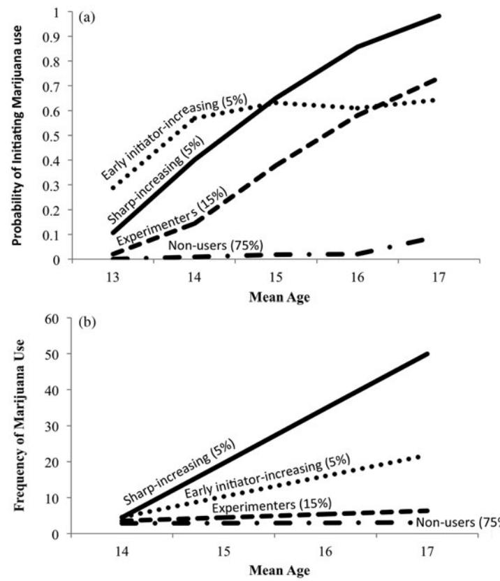
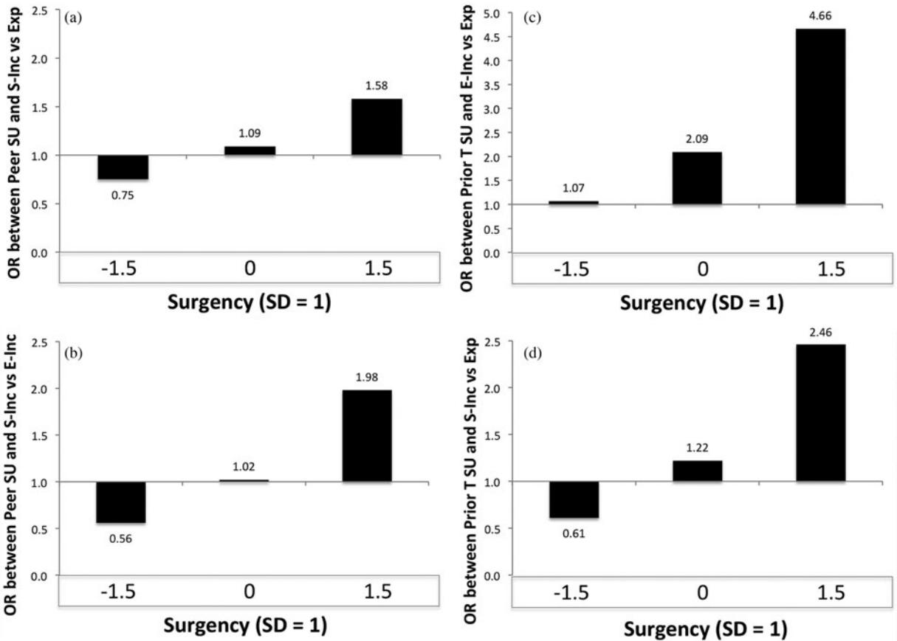

# Trajectories of marijuana use from late childhood to late adolescence: Can Temperament-Experience interactions discriminate different trajectories of marijuana use?

MATTHEW D. SCALCO AND CRAIG R. COLDER State University of New York at Buffalo

#### Abstract

Informed by developmental ecological and epigenetic theory, the current study examined three aims concerning adolescent marijuana use with a large community sample (N ¼ 755; gender ¼ 53% female) and six annual assessments that spanned 11–18 years of age. First, the natural history of adolescent marijuana use was modeled using a two-part latent growth curve analysis. Second, the validity of the mixtures was examined with a broad array of known correlates of adolescent marijuana use. Third, temperament (e.g., surgency, effortful control, and negative affect) was tested as individual differences that would enter into statistical interactions with peer substance use and prior alcohol and cigarette use to distinguish trajectories of marijuana use. The results suggested that escalations in marijuana use were observed for some youth who initiated marijuana use early in adolescence. Youth whose marijuana use did escalate substantially (10%) were distinguished on temperament, conduct disorder, peer delinquency, and pubertal development at baseline. Furthermore, hypothesized interactions between surgency and both peer substance use and prior substance use discriminated different patterns of marijuana use. The findings are discussed with respect to strategies for timing and content of preventive interventions.

Early initiation and heavy marijuana use in adolescence has been associated with a number of long-term negative psychosocial outcomes. For instance, early initiation has been linked to other illicit substance use (SU) and a range of delinquent behaviors, while heavy use has been associated with increased negative consequences of marijuana use in young adulthood, lower academic achievement, and in some studies, psychopathology in young adulthood (Ellickson, D'Amico, Collins, & Klein, [2005](#page-14-0); Ellickson, Tucker, Klein, & Saner, [2004](#page-14-0); Green & Ritter, [2000;](#page-14-0) Kandel & Chen, [2000\)](#page-15-0). However, heavy marijuana use during adolescence occurs in only a small proportion of youth, with most users falling into occasional and experimental use patterns (Ellickson, Martino, & Collins, [2004;](#page-14-0) Flory, Lynham, Milich, Leukefeld, & Clayton, [2004;](#page-14-0) Hix-Small, Duncan, Duncan, & Okut, [2004](#page-14-0)). Understanding the etiological factors involved in the development of long-term heavy marijuana use requires longitudinal designs that can discriminate youth who initiate, experiment, and remain stable low users or phase out of marijuana use versus those youth who escalate to regular use. Such research is important because it can aid in the development of targeted preventative interventions and treatments for substance use disorders (SUDs).

tween 30% and 40% of youth initiate marijuana use by the end of high school (Johnston, O'Malley, Miech, Bachman, & Schulenberg, [2015\)](#page-15-0). A small number of studies have distinguished patterns of change in marijuana use during adolescence and found that between 14% and 22% of those who initiate marijuana use escalate to monthly or more frequent use (Ellickson, Martino, et al., [2004](#page-14-0); Flory et al., [2004;](#page-14-0) Hix-Small et al., [2004](#page-14-0)). These studies have linked peer marijuana use, conduct disorder, personality traits such as sensation seeking, among other variables, to escalations in marijuana use in adolescence. However, current developmental theories of SU conceptualize deviations in phenotypic traits, such as temperament, as risk factors that interact with the environment to exacerbate the probability of early initiation and escalation of SU within a probabilistic epigenetic framework (Dawes et al., [2000;](#page-14-0) Gottlieb & Willoughby, [2006](#page-14-0); Vanyukov et al., [2012\)](#page-15-0). In these theories, differences in temperament serve as predispositions that interact with the social context (peer SU) and early SU experiences to impact the subsequent development of SUDs. No research to our knowledge has considered whether peer SU and early SU experience interact with temperament, as developmental theory suggests, to discriminate long-term longitudinal patterns of marijuana use (e.g., rapid escalators from stable low-level users). Using a two-part latent class growth analysis to systematically separate trajectories of initiation of marijuana use from escalation in levels of use, we test whether individual differences in temperament shown to increase risk for marijuana use interact

The Monitoring the Future Study (MTF) suggests that be-

This research was funded by National Institute on Drug Abuse Grants R01 DA020171 and R01 DA019631 (to C.R.C.).

Address correspondence and reprint requests to: Matthew D. Scalco, Department of Psychology, 204 Park Hall, State University of New York at Buffalo, Buffalo, NY 14260-4110; E-mail: [mscalco@buffalo.edu](mailto:mscalco@buffalo.edu).

with peer SU and early SU experience to discriminate different trajectories of marijuana use. We utilize a large longitudinal community sample with assessments that span 11–18 years of age. A strength of our sample is that the first assessment occurred prior to any marijuana use, allowing us to model growth from the time of initiation and to distinguish initiation from levels of use.

#### Temperament 3 SU Experience Interactions

Models of motivated behavior postulate that behavior is a product of constitutionally based individual differences in approach and avoidance tendencies and in self-regulatory capacity (Corr, [2008](#page-14-0); Ernst & Fudge, [2009](#page-14-0); Rothbart & Bates, [2006](#page-15-0)). Addictive behaviors are thought to be maintained by a desire for and sensitivity to both hedonic (euphoric) states and avoidance of aversive states as well as poor regulatory abilities (Koob & LeMoal, [2008](#page-15-0); Robinson & Berridge, [2003](#page-15-0)). Prior studies prospectively link temperament dimensions of surgency (a broad temperament dimension reflecting sensitivity to reward, sensation seeking, and social approach) and effortful control (a broad temperament dimension reflecting executive functioning and self-regulatory capacity) to the initiation and escalation of adolescent SU (e.g., Creemers et al., [2009\)](#page-14-0). The literature on negative affect (predisposition to experience emotional distress), however, is mixed, with some studies showing risk for those high in negative affect, others showing protection from SU at high levels of negative affect, and others showing risk for SU at low levels of negative affect suggesting that there may be moderators of the relationship between negative affect and SU in early adolescence (Colder, Chassin, Lee, & Villalta, [2010;](#page-14-0) Hussong, Jones, Stein, Baucom, & Boeding, [2011](#page-14-0); Scalco et al., [2014](#page-15-0)). In the current study, consistent with developmental theory (Dawes et al., [2000](#page-14-0); Vanyukov et al., [2012\)](#page-15-0), temperament is viewed (surgency, effortful control, and negative affect) as a domain of factors that interact with the context to increase or decrease liability for different patterns of SU. Of interest were deviations in temperament that might increase vulnerability to peer contexts that support SU and to early experiences with SU.

#### Peer SU

Peers are considered proximal influences on adolescent SU behavior (Cruz, Emery, & Turkheimer, [2012;](#page-14-0) Dishion & Medici Skaggs, [2000](#page-14-0); Scalco, Trucco, Coffman, & Colder, [2015](#page-15-0)), and peer relationships become increasingly important to adolescents around the onset of puberty (Spear, [2011](#page-15-0)). Peers model SU, provide positive reinforcement for SU behaviors, and provide access to drugs and alcohol (Dishion & Medici Skaggs, [2000](#page-14-0); Dishion, Spracklen, Andrews, & Patterson, [1996\)](#page-14-0). In addition, experimental evidence suggests that adolescents are more reactive to rewards in a peer context (Steinberg, [2008\)](#page-15-0). Given that much SU in adolescence occurs in the peer context, individuals sensitive to the positively reinforcing effects of SU and oriented toward social approach (e.g., high surgency) may be at increased risk for developing regular SU. That is, being high in surgency (high in sensation seeking and social approach) may put youth at increased risk for peer socialization of marijuana use compared to youth low in surgency. Effortful control may also moderate the impact of the peer context. When peers promote, support, and reinforce SU, resisting or overriding SU behavior may be much more difficult for youth low in effortful control (Creemers et al., [2010\)](#page-14-0).

#### Early SU experience

According to behavioral neuroscience models, mesolimbic dopamine structures are involved in positive reinforcement and approach behavior, including SU (Fields, Hjelmstad, Margolis, & Nicola, [2007](#page-14-0)). Individuals high in surgency are thought to be more sensitive to rewards due to sensitivity in mesolimbic dopamine pathways, which results in sensation seeking and risky behavior (Murphy, Taylor, & Eliott, [2012](#page-15-0); Rothbart & Bates, [2006\)](#page-15-0). Variation in reward sensitivity may make early experiences with alcohol and cigarette use that typically precedes marijuana use (Kandel, [1975;](#page-15-0) Maldonado-Molina & Lanza, [2010\)](#page-15-0) different for each adolescent. That is, early experiences with SU in conjunction with high surgency is expected to increase motivation to engage in further SU behavior and to increase the probability of escalations in marijuana use.

Effortful control may operate in a similar fashion with prior SU. Studies have suggested that low effortful control precedes alcohol and cigarette initiation in early adolescence (Creemeers et al., [2010\)](#page-14-0). Individuals low in effortful control who engage in early alcohol and cigarette use may have limited motivation and capacity to inhibit further experimentation with SU (Wiers et al., [2007](#page-15-0)). Once initiation occurs, individuals with low effortful control have a harder time regulating their SU, suggesting that the effects of prior SU and low effortful control may operate in a synergistic fashion to predict escalations in marijuana use.

Negative affect may also operate synergistically with early SU. Self-medication models posit that the anti-anxiolytic and euphoric effects of alcohol and marijuana are negatively reinforcing to individuals high in negative affect and increase the probability of later SU (Khantzian, [1997;](#page-15-0) Murphy et al., [2012](#page-15-0)). However, the human adolescent literature is mixed on whether higher levels of negative affect and emotional distress precede adolescent alcohol and drug use, suggesting that there may be moderators of the effect of negative affect on later SU in early adolescence (Hussong et al., [2011;](#page-14-0) Scalco et al., [2014](#page-15-0)). We suggest that a possible moderator of the negative affect to marijuana use pathway is prior adolescent alcohol and cigarette use. That is, given that adolescents generally do not initiate marijuana use until after alcohol and cigarette use (Maldonado-Molina et al., [2005](#page-15-0)), high levels of negative affect in conjunction with alcohol and cigarette use may lead to acute relief of emotional distress, and the experienced stress relieving and rewarding properties of SU may motivate adolescents to initiate and escalate marijuana use.

#### Summary and the Present Study

#### Aim 1

The first aim of the paper was to characterize change in marijuana use during adolescence while distinguishing initiation and escalation. For example, youth with experimental or occasional marijuana use would be expected to have increases in probability of initiation but stable low levels of marijuana use. Heavier marijuana users would be expected to have steep increases in both probability of initiation and levels of use. Although mixture modeling is exploratory, we made specific hypotheses about the number of classes given previous literature. We expected at least four classes, including (a) a class in which there were steep increases in both probability of initiation and levels of use; (b) a class of intermediate users in which probability of initiation and levels of use increase but at a slow rate; (c) a class of "experimenters" or "light users" in which levels of use are stable and low, but probability of initiation increases; and (d) a class of nonusers in which probability of use and levels of use remained at 0 across the waves (Ellickson, Martino, et al., [2004](#page-14-0); Flory et al., [2004;](#page-14-0) Hix-Small et al., [2004](#page-14-0)). We did not predict a stable high or decreasing class as has been previously found because of the age of our sample. There was no marijuana use in our sample at Wave 1 as would be expected given the range in age, precluding the possibility of a stable high or decreasing class.

#### Aim 2

Some researchers have questioned the utility of mixture models for SU given the positive skew in quantity and frequency of SU indices (Bauer & Curran, [2003](#page-14-0); Sher, Jackson, & Steinley, [2011](#page-15-0)). As such, in addition to testing our hypothesized temperament interactions with prior SU and peer SU, we test the validity of our mixture model by relating a variety of known antecedents of adolescent marijuana use to our mixtures (Bauer & Curran, [2003](#page-14-0); Cronbach & Meehl, [1955](#page-14-0)). Ecological models of SU suggest that risk and protective factors from multiple levels of influence (individual, family, and peers) are involved in the etiology of adolescent SU (Bronfenbrenner, [1979](#page-14-0); Haegerich & Tolan, [2008\)](#page-14-0). In the current study, we considered peer delinquency (e.g., Scalco et al., [2014](#page-15-0)), parental SU (e.g., Miller, Siegel, Hohman, & Crano, [2013](#page-15-0)), psychopathology (Colder, Scalco, et al., [2013](#page-14-0); King, Iacono, & McGue, [2004](#page-15-0)), and pubertal development (Susman & Dorn, [2009\)](#page-15-0). We predicted that individuals in classes with higher levels of marijuana use would be older; higher on surgency, conduct disorder, peer SU, peer delinquency, prior target adolescent SU, and pubertal development; and lower on effortful control (Chassin, Colder, Hussong, & Sher, [2015](#page-14-0)). In addition, we predicted that the effect of pubertal development would be stronger at earlier

ages following a large literature that has linked early pubertal timing to the initiation and escalation of SU (Susman & Dorn, [2009\)](#page-15-0).

#### Aim 3

As discussed above, our final aim was to test hypotheses inferred from an integration of prior evidence, developmental, and epigenetic models of SUD. That is, we assessed whether interactions between surgency or effortful control and peer SU and between surgency, effortful control, or negative affect and prior SU could discriminate the trajectory classes while controlling for predictors from the validity analyses. High levels of surgency in conjunction with prior SU is hypothesized to have the strongest effect, discriminating high use classes from experimenters and nonusers. For peer SU and surgency, there is theory and empirical work to suggest competing hypotheses such that high and low levels of surgency may put youth at increased risk for later marijuana use when peer SU is also high. Furthermore, we hypothesized that at low but not at high levels of effortful control, peer SU and prior SU would discriminate high use classes from experimenters and nonusers. High levels of negative affect in conjunction with prior SU may discriminate high use classes from experimenters and nonusers. It is also possible that in early adolescence, individuals low in negative affect may not be very fearful or anxious about engaging in an illegal behavior such as marijuana use, and may be inclined to engage in marijuana use. Some findings suggest that when externalizing symptoms are taken into account in early adolescence, the relationship between negative affect and SU is negative (Colder, Scalco, et al., [2013;](#page-14-0) Mason, Hitchings, & Spoth, [2008;](#page-15-0) Scalco et al., [2014\)](#page-15-0).

#### Method

#### Participants

Recruitment. Participants (target adolescents) were recruited from the community for two longitudinal studies examining risk and protective factors for adolescent SU. Children were required to be between the ages of 10–12 and 11–12 years old at recruitment for Sample 1 and 2, respectively. At each assessment for both samples, target adolescents provided the names of four close friends, and one was recruited into the study (peers) to provide collateral reports of the target adolescent's peer environment. Peers were required to be within 2 years of age of the target adolescent and could not be a sibling. Moreover, targets were allowed to nominate different peers at each wave to capture the fluid nature of adolescent peer relationships. A more detailed description of recruitment, descriptive statistics, length of interviews, compensation to participants, and other procedural details for targets can be found in Colder et al. ([2011\)](#page-14-0) and Colder, Hawk, et al. [\(2013](#page-14-0)), and in Scalco, Trucco, et al. ([2015\)](#page-15-0) for peers.

Description. Sample 1 included 378 families and Sample 2 included 387 families for a total of 765 families. Averaging across samples, adolescents were 10–13 years old (M age ¼ 11.3, SD ¼ 0.76, 53% female) while peers were 8–15 (M age ¼ 11.5, SD ¼ 1.15, 55% female) at the first assessment. Mean ages of targets at Waves 1–6 (W1–W6) were 11.8 (SD ¼ 0.79), 12.9 (SD ¼ 0.79), 13.9 (SD ¼ 0.79), 15.0 (SD ¼ 0.77), 16.0 (SD ¼ 0.79), and 17.0, respectively. Combined across samples participant race/ethnicity included White/ non-Hispanic (79%), Black/African American (12%), Hispanic (2.5%), Asian/Pacific Islander (1.5%), and other race/ethnicity that typically included a youth of mixed backgrounds (5%). With respect to socioeconomic status, the median family income was \$65,000 and 6.1% of the families reported public assistance. Most of the targets were from two-parent families (73.5%).

The mean ages of peers (53%–56% female) at W1–W3 were 11.5 (SD ¼ 1.15), 12.4 (SD ¼ 1.27), and 13.4 (SD ¼ 1.18), respectively. Combined across samples, 80%–84% of the peer participants were White/non-Hispanic, 10%–14% were Black/African American, 1.3%–3% were Hispanic, and 0.4%–0.9% were Asian/Pacific Islander. A small proportion (2.2%–5.1%) were of another race/ethnicity for W1 through W3 (usually of mixed race/ethnicity). Most of the peer participants (73%–78%) reported being from two-parent homes across all three assessments, and the median income of peer families ranged from \$69,750 to \$73,500, with 7% and 11% of the peer families receiving public assistance.

#### Procedure

Procedures were similar for both samples. The first three annual assessments at Waves 1–3 (W1–W3) were completed in a laboratory setting. For target and peer families, consent (caregiver) and assent (adolescent) procedures were completed and then the adolescent and caregiver were taken to separate rooms to enhance confidentiality and privacy. At Waves 4–6 (W4–W6) target adolescent SU was assessed using Audio Computer Assisted Self-Interview phone surveys.

#### Measures

Target and peer SU. Items from the National Youth Survey (NYS) assessed past-year SU from W2 to W6 (Elliott & Huizinga, [1983\)](#page-14-0). Self-reports of adolescent SU, such as the NYS, have been shown to be valid when the adolescent perceives them to be anonymous and confidential (Winters, Stinchfield, Henly, & Schwartz, [1991](#page-15-0)). SU was assessed with open-ended frequency and quantity items with the exception of marijuana use, for which only frequency was measured.

As expected given the age of our sample, rates of marijuana use were low. There was no marijuana use at W1 and annual rates of use from W2 to W6 were 2.3%, 8.2%, 12.5%, 17.1%, and 25.7%, respectively. Of those who used at each wave, the mean of marijuana past-year frequency was 1.82, 4.12, 9.74, 12.62, and 16.13 for W2–W6, respectively. Frequency indices were skewed and kurtotic from W2–W6 (skew range ¼ 3.40–6.70, kurtosis range ¼ 10.57–43.67) with skew and kurtosis declining in size and variance increasing across the waves. Extreme outliers (n range ¼ 12–23) were recoded to three standard deviations above the mean at each wave to reduce their influence (Tabachnick & Fidell, [2013](#page-15-0)).1 To compare our sample to large epidemiological samples (e.g., MTF: Johnston et al., [2015](#page-15-0); New York State Youth Development Survey: New York State Office Alcoholism and Substance Abuse Services, [2009\)](#page-15-0), we examined rates of lifetime marijuana use among our 8th and 10th graders. Lifetime rates of marijuana use in MTF were 17.3% and 33% for 8th and 10th graders, respectively, compared to 6.2% and 26.6% in our 8th and 10th graders, respectively. These data suggest that compared to the MTF sample, our lifetime rates were lower in 8th grade, but comparable in 10th. Our lifetime rates of marijuana use were similar to the New York State Youth Development Survey (8th ¼ 6.8% and 10th ¼ 22.9%), which was collected in the same state as our sample.

Prior alcohol and cigarette use was taken from our W2 assessment so that we could examine the impact of prior use on subsequent trajectories of marijuana use (W2–W6). For the remainder of the manuscript, "prior SU" will be used to refer to prior target alcohol and cigarette use. The mean of pastyear frequency of alcohol and cigarette use at W2 was computed to model prior SU (M ¼ 0.21, SD ¼ 0.72, max ¼ 4.13). Annual rates for target alcohol and cigarette use were 3.7% and 1.2% at W1 and 11.7% and 3.7% at W2, respectively. Those who used alcohol or cigarettes had mean frequencies of 1.68 and 1.00 at W1, and 3.75 and 3.51 at W2, respectively. As with marijuana use, the mean of pastyear frequency of alcohol and cigarette use at W2 was skewed (4.04) and kurtotic (16.22). Extreme outliers (n ¼ 10) were recoded to 3 SD above the mean. Our annual rates of alcohol and cigarette use reported above were similar to those in other large community samples that included fifth to seventh graders. For instance, Sung, Erkanli, Angold, and Costello ([2004\)](#page-15-0) reported 1.3%–8.7% and 1%–5.5% for alcohol and cigarette use, respectively (also see King et al., [2004](#page-15-0)).

Peer SU was also taken from the W2 assessment and assessed using peer self-report with the same items from the NYS that were used for target SU at W2. The mean of pastyear peer alcohol, cigarette, and marijuana frequency was computed to serve as an index of frequency of peer SU (M ¼ 0.39, SD ¼ 1.55, max ¼ 10.26). As with targets, annual rates of W2 peer alcohol, cigarette, and marijuana were low (17.1%, 7.8%, and 5.2%, respectively) as were mean frequency of those peers who used (3.71, 4.80, and 3.19, respectively). The peer SU index was skewed (5.28) and kurtotic

1. Models were rerun without recoding outliers, and the structure of the latent classes as well as prediction results were similar to what is presented below.

(28.81). Extreme outliers (n ¼ 11) were recoded to 3 SD above the mean.

Temperament. The Early Adolescent Temperament Questionnaire—Revised (EATQ-R; Ellis & Rothbart, [2001](#page-14-0)), a parent-report measure, was used to assess target adolescent temperament at W2. The EATQ-R includes eight subscales, which combine to form three broad dimensions, including surgency, negative affect, and effortful control. An exploratory factor analysis with an oblique rotation of the EATQ-R subscales supported affiliation, surgency (high-intensity pleasure), and shyness (reversed coded) subscales as indicators of the surgency second-order factor (factor loadings range ¼ 0.50–0.63), fearand frustration subscales asindicators of negative affect second-order factor (factor loadings range¼0.41–0.53), and attention, inhibitory control, and activational control subscales as indicators of the effortful control second-order factor (factor loadings range ¼ .67–.82). All cross-loadings were below 0.32, and correlations between the factors were small (rrange¼ –.19 to .22).2 Scale scores for the three second-order factors were created (sugency, negative affect, and effortful control) by computing the mean of the indicators for each factor (Cronbach as ¼ 0.83, 0.73, and 0.89, respectively).

Assessing validity of trajectory classes. We considered predictors of latent class from multiple levels of ecological influence (individual, parent, and peer) to provide evidence of convergent and divergent validity of the trajectory classes as has been recommended in the mixture modeling literature (Bauer & Curran, [2003\)](#page-14-0).

Control variables. Target age was computed by subtracting the date of birth reported by the caregiver and the interview date entered by the experimenter at W1. Gender was also reported by the caregiver and coded 0 for male and 1 for female. Highest level of parental education completed (1 ¼ grade

school, 2 ¼ some high school, 3 ¼ high school graduate, 4 ¼ technical school, 5 ¼ some college, 6 ¼ college graduate, and 7 ¼ graduate/professional school; M ¼ 5.38, SD ¼ 1.35) and current annual family income (M ¼ \$74,734, SD ¼ \$50,651) were standardized, and the mean was taken to provide an estimate of socioeconomic status.

Parent SU. The participating caregiver foreachtarget adolescent reported on his/her own alcohol and cigarette use using the Timeline Followback Interviews (Sobel & Sobel, [2012\)](#page-15-0) and the use of his/her spouse or significant other using the Collateral Interview Form (Miller, Tonigan, & Longabaugh, [1995](#page-15-0)). An index of parental SU was created by computing the average daily use within substance for each caregiver, choosing the maximum level of use acrosscaregivers, standardizingwithin substance,andthentaking the mean of alcohol and cigarette use. This index provided a measure of maximum levels of SU among caregivers in the home. Parents consumed 0.48 drinks per day (SD ¼ 0.77, max ¼ 7.21) on a typical week and smoked 2.21 cigarettes per day (SD ¼ 4.93, max ¼ 29.43) on a typical week.

Adolescent problem behavior. Parent report of conduct disorder symptoms was obtained using the 15-item conduct disorder scale on the Disruptive Behavior Disorders Scale (a ¼ 0.72; Pillow, Pelham, Hoza, Molina, & Shultz, [1998\)](#page-15-0). Parents rated adolescents on a 4-point Likert scale (1 ¼ not at all, 4 ¼ very much). Depressed mood was assessed using parent report of the depressed mood scale from the EATQ-R (a ¼ 0.70; Ellis & Rothbart, [2001](#page-14-0)).

Pubertal development. There is a large literature linking early pubertal timing to early initiation of SU for boys and girls (for a review, see Susman & Dorn, [2009\)](#page-15-0). Pubertal development was assessed using the Pubertal Development Scale (a ¼ 0.70; Petersen, Crockett, Richards, & Boxer, [1988\)](#page-15-0) at W1 to capture early pubertal development. The total score was created by averaging the five Pubertal Development Scale items within gender and then creating z scores by standardizing within gender and grade.

Perceived peer delinquency. Peer delinquency was assessed using 11 items representing delinquent and rule-breaking behavior taken from Fergusson, Woodward, and Howard, [\(1999\)](#page-14-0). The instructions asked the adolescent to "Tell whether or not any of your three close friends have ever done these things," and were keyed as yes (1) or no (0). Sample items are "Sold marijuana or hashish," "Purposefully set fire to a building, a car, or other property, or tried to do so," and "Been in troublewiththe police." Items assessing perceived peer SU were excluded to prevent overlap between our measure of perceived peer delinquency and peer self-report of SU (a ¼ 0.83).

# Data analysis

Of those youth who initiate marijuana use, there is considerable variability in levels of use and patterns of growth in use

2. In a recent study using confirmatory factor analysis, support for this structure was found across three waves of data and across samples (Scalco, Colder, & Lengua, [2015](#page-15-0)). Latent test–retest correlations of the same construct across waves were all high (0.81–0.94; M ¼ 0.88), while latent correlations across construct within wave were small to moderate (–0.52– 0.16; M ¼ –0.23). Validity analyses suggested that surgency was positively associated with parent-reported sensitivity to reward and negatively associated with parent-reported fear. Effortful control was negatively associated with parent-reported impulsivity/fun seeking (rash impulsiveness; strong correlation), attention-deficit/hyperactivity disorder symptoms, and with performance on tasks indicating poor executive control (the stop signal task assessing inhibitory control, the Wisconsin card-sorting task assessing set shifting, and the Tower of London assessing cognitive preplanning). Negative affect was positively associated with parent-reported fear and depressive symptoms, and positively associated with parent-reported sensitivity to punishment. Neither surgency nor negative affect correlated with the behavioral tasks assessing executive functioning, and surgency did not correlate with impulsivity/fun seeking or psychopathology. Effortful control did not correlate with sensitivity to reward. These patterns of association suggest convergent and divergent validity for the temperament constructs and link our measures to the broader temperament literature (Cronbach & Meehl, [1955](#page-14-0)).

(e.g., Ellickson, Martino, et al., [2004\)](#page-14-0). Two-part latent growth curve analysis is an approach that splits a continuous growth model into two parts, consisting of a (a) binary part in which growth in the probability of initiation (i.e., probability of observing 1 vs. 0) is modeled and (b) a semicontinuous part in which growth in levels of use is modeled given that substance use is observed in the binary portion (i.e., initiation occurred; Olsen & Shafer, [2001\)](#page-15-0). This can be extended to latent class growth analysis (LCGA; Nagin, [1999](#page-15-0)) by allowing the means of the growth factors to be free across classes (Muthe´n, [2001](#page-15-0)). Data analysis for the LCGA proceeded in six stages, and all analyses were done in Mplus 7.1 (Muthe´n & Muthe´n, [1998–](#page-15-0) [2012\)](#page-15-0).

Stages 1–3. Separate latent growth curve models with fixed time intervals were estimated for the probability of initiating marijuana use (binary part) from W2 to W6 and for frequency of marijuana use from W3 to W6 to establish the form of growth and to determine if there was significant individual variability in growth. We did not model levels of marijuana use at W2 because of the limited variability of use (i.e., rates of use were only 2.3% and mean frequency was quite low at 1.82). Fixed time intervals were centered at W2 for the binary portion and W3 for the semicontinuous portion. Nested models were compared using the Satorra–Bentler scaled chisquare difference test. Final models from Stage 1 were then used to run LCGAs in which the growth factor variances and covariances were set to 0. As recommended by Muthe´n [\(2001](#page-15-0)), LCGAs were run for each part (binary and semicontinuous) separately to get an idea of how many classes to extract and to obtain start values for the full two-part LCGA. The Akaike information criterion (AIC), Bayesian IC (BIC), and sample size adjusted BIC (ABIC) as well as entropy, total number of classes, Lo–Mendell–Rubin test, and bootstrapped likelihood ratio test were all used to determine the number of classes to extract for all LCGAs (Lo, Mendell, & Rubin, [2001;](#page-15-0) McLachlan & Peel, [2000;](#page-15-0) Muthe´n, [2004](#page-15-0)).

Stages 4–6. After the number of classes to extract was determined in Stage 3, final models with predictors were run using the three-step approach (Asparouhov & Muthe´n, [2014](#page-14-0); Lanza, Tan, & Bray, [2013;](#page-15-0) Vermunt, [2010](#page-15-0)). Most likely class membership from the final LCGA was output (C), logits were calculated from the final model using the matrix of latent class probabilities, and the thresholds of C were fixed in a subsequent latent class analysis (LCA) to account for measurement error. This strategy produced latent classes that were constrained to be the same as those in the final LCGA to ensure the measurement model (final LCGA) remained stable before and after adding predictors (Vermunt, [2010](#page-15-0)). Predictors of the latent classes were then introduced into the LCA model to test convergent and divergent validity of the LCGA before testing whether our hypothesized interactions predicted latent class membership as hypothesized (Surgency - Peer SU, Surgency - Prior SU, Effortful Control - Peer SU, Effortful Control-Prior SU, Negative Affect-Prior

SU). For these models, all independent variables were mean centered, and the referent class was changed to provide coefficients for all possible comparisons of the classes. Predictors were tested separately in blocks that were organized into the following construct domains: demographics, temperament, psychopathology, social factors (peer delinquency, peer SU, and parental SU), pubertal development, and prior target use. Age, gender, and socioeconomic status were controlled in all of these smaller models and in the pubertal development model, Puberty-Age and Puberty-Gender interactions were included to model the effects of early pubertal development on marijuana use (Susman & Dorn, [2009\)](#page-15-0). Odds ratios were computed for effect size. Given the large sample, the large number of analyses that increases risk of alpha inflation, and the different sample size in each class, cutoffs for effect size, labeled small (odds ratio [OR] . 1.5 but , 2.5 or OR , 0.67 but . 0.4), medium (OR . 2.5 but , 4.3 or OR , 0.4 but . 0.23), or large (OR . 4.3 or OR , 0.23), were used to assess predictors rather than p values. The limitations of p values are well known, and these limitations become more severe when sample size is large or small and there are many tests (Cohen, [1988](#page-14-0); Cummings, [2008](#page-14-0); Meehl, [1997](#page-15-0)). Confidence intervals (95%) and standard errors were used in text to assess the precision of estimates.

Depressed mood was trimmed from the multivariate model to avoid overlap with negative affect. To the final multivariate model, we then added hypothesized interactions of interest simultaneously in Stage 5. In the event of interactions that met our cutoff for a small effect size, we graphed the odds ratios between the independent variables (peer SU or prior SU) and outcome (class comparisons) as a function of the moderator (temperament).

Missing data. Retention for target families was strong in the combined sample with an attrition rate of 3.9%, 6.5%, 6.7%, 8.1%, and 14.6% at W2–W6, respectively. We tested for differences between participants with missing marijuana data at any wave to participants without missing data on demographic variables (socioeconomic status, age, parental marital status, minority status, and gender), and all the variables used in the present analysis at W1 using chi-square and analysis of variance (note that there was no marijuana use at W1). Targets with missing marijuana data were more likely to have lower socioeconomic status, have initiated alcohol and cigarette use at W1, have parents who were not married, have minority status, have lower effortful control, and have higher surgency and peer delinquency, but effects that were significant were very small (R2 range ¼ 0.5%–1.3%, f range ¼ 0.08–0.13), suggesting that our large sample (N ¼ 765) resulted in small effects being statistically significant. The groups were not different on gender, age, peer SU, conduct disorder, or puberty. The small effects combined with the low attrition rate suggests that missing target adolescent data did not have a substantial impact on study findings. Nonetheless, full information maximum likelihood with robust standard errors was used to handle missing data on our

repeated measures of marijuana use from W2 to W6 (Schafer & Graham, [2002\)](#page-15-0). Only 1% of cases had missing marijuana use data at all follow-ups (n ¼ 10), and these cases were excluded from analysis leaving an effective N of 755. Excluded participants did not differ significantly from other participants on any variables used in the present analysis or on demographics (all ps . .10).

Missing data also occurred for peer data because we were not successful at recruiting one of the four nominated peers for some target participants. Proportion of missing peer data were 8.3% and 13.9% for W1 and W2, respectively. In the combined sample, we tested for differences between participants with and without missing peer data on the same set of variables listed above for target adolescents. Targets with missing peer data tended to have lower socioeconomic status, have initiated cigarette use at W1, have parents who were not married, have minority status, and be higher on peer delinquency and puberty, but again the effects that were significant were very small (R2 range ¼ 0.4%–1.1%, f range ¼ 0.12– 0.13). The groups were not different on other variables. The small effects combined with the large sample size suggests that missing peer data likely did not have a strong influence on findings. Nonetheless, multiple imputations with 25 imputed data sets was used to address missing data for peer SU at W2 and parent- and target-reported independent variables at W2 (Schafer, [1997](#page-15-0); Schafer & Graham, [2002\)](#page-15-0).

#### Results

## Growth models for each binary and continuous portion

For the binary part, the linear contrast for time was coded 0, 1, 2, 3, and 4 for W2–W6, respectively. Satorra–Bentler nested chi-square tests indicated that there was significant variability in the binary intercept, x2 (1, N ¼ 755) ¼ 3,330.19, p , .01, and binary linear slope, x2 (2, N ¼ 755) ¼ 16.39, p , .01. Although adding a quadratic effect improved model fit, x2 (4, N ¼ 755) ¼ 18.83, p , .01, none of the individual parameters added were significant, and standard errors increased in this model suggesting overparameterization. As such, we examined a fixed quadratic effect. Adding fixed quadratic, x2 (1, N ¼ 755) ¼ 16.49, p , .01, and cubic, x2 (1, N ¼ 755) ¼ 12.89, p , .01, effects improved model fit. In the final model with random intercept and linear slope and fixed quadratic and cubic slopes (AIC ¼ 2,049.49, BIC ¼ 2,081.88, ABIC ¼ 2,059.65), the linear slope and intercept were significantly negatively related, r ¼ –.62; 95% confidence interval (CI) ¼ (–0.84, –0.41), suggesting that those who started with a smaller probability of initiation had larger increases in the probability of initiation over time. Means of the growth factors indicated a significant positive linear slope, M ¼ 4.91, CI ¼ (3.36, 6.56), a significant negative quadratic slope, M ¼ –1.58, CI ¼ (–2.26, –0.91), and a significant positive cubic slope, M ¼ 0.19, CI ¼ (0.10, 0.29). This nonlinear growth curve for the probability of initiation of marijuana use suggests a steep increase between W2 and W3 that slows down

from W3 to W5 and then speeds up again between W5 and W6. It is important to note that most participants in our sample began high school between W2 and W3 and became juniors or seniors between W5 and W6.

For the semicontinuous portion, linear time was coded 0, 1, 2, and 3 for W3–W6, respectively. This model included only those youth who used at least one wave (n ¼ 243). Comparison of nested models suggested adding a variance term to the intercept and slope factors, x2 (1, N ¼ 243) ¼ 21.63, p , .01 and x2 (2, N ¼ 243) ¼ 22.79, p , .01, respectively. Adding a quadratic effect did not improve fit, x2 (4, N ¼ 243) ¼ 7.87, p ¼ .10. As such, the final model (AIC ¼ 1,307.12, BIC ¼ 1,338.55, ABIC ¼ 1,310.02) contained random intercept and linear slope factors. The intercept and slope factors covaried significantly, r ¼ –.40; CI ¼ (–0.75, –0.05), and suggested that those who started with lower levels of marijuana use had steeper increases over time. The intercept had a significant mean frequency of 1.56, CI ¼ (0.92, 2.00), at W3 and the linear slope factor mean suggested a significant increase in levels of marijuana use, M ¼ 0.16, CI ¼ (0.44, 1.14). The two growth models were then combined into a two-part latent growth curve model (AIC ¼ 5,215.83, BIC ¼ 5,303.74, ABIC ¼ 5,243.41). Although all variances for growth factors were significant, the latent means for the continuous portion dropped to nonsignificant and the model contained large residuals (differences between the model implied and observed means for the continuous portion). This suggests that a single sample two-part growth model may not be appropriate for the data, perhaps because only 10% of the sample had increasing trajectories in the continuous portion (see LCGA results below).

# LCGA

Before running an LCGA on both parts, we first ran LCGAs on each part separately. Model fit and percentage of participants in each class can be found in [Table 1.](#page-7-0) All fit indices except the bootstrapped likelihood ratio test suggested a threeclass solution for the binary portion. For the semicontinuous part, all fit indices except entropy suggested a four-class solution. Given the results for each part separately, we considered three-, four-, and five-class solutions for the full two-part LCGA and used start values from the binary models when testing the full two-part models. Model fit and percentage of participants in each class can be found at the bottom of [Ta](#page-7-0)[ble 1.](#page-7-0) All fit indices with the exception of entropy suggested that a four-class solution fit better than a three-class solution. Entropy showed a modest decline from the three- to the fourclass solution. Although most of the fit indices (with the exception of BIC and percentage of participants in the classes) suggested that a five-class solution fit better than the fourclass model, the n in the fifth class was 12, or 1.5% of the sample, and the class had a very similar trajectory to the sharp increasing class (see [Figure 1](#page-8-0)) with a slightly lower intercept in the continuous portion suggesting limited utility of this fifth class. Moreover, the four-class LCGA fit better than

|  |  |  |  |  |  |  | Table 1. Model fit for all growth mixture models |  |
|--|--|--|--|--|--|--|--------------------------------------------------|--|
|--|--|--|--|--|--|--|--------------------------------------------------|--|

| Model         | AIC     | BIC     | ABIC    | Entropy | LMR    | BLRT   | In Class (%)    |
|---------------|---------|---------|---------|---------|--------|--------|-----------------|
| Binary only   |         |         |         |         |        |        |                 |
| 2C            | 2088.96 | 2130.60 | 2102.02 | 0.80    | 375.27 | 375.27 | 21, 79          |
| 3C            | 2053.41 | 2118.18 | 2073.72 | 0.83    | 45.56  | 45.56  | 7, 16, 77       |
| 4C            | 2056.22 | 2144.13 | 2083.79 | 0.82    | 7.12*  | 7.19   | 3, 4, 14, 78    |
| Contin. only  |         |         |         |         |        |        |                 |
| 2C            | 3077.04 | 3108.48 | 3079.95 | 0.87    | 211.39 | 211.39 | 20, 80          |
| 3C            | 3003.48 | 3045.39 | 3007.35 | 0.82    | 79.56  | 79.56  | 7, 17, 76       |
| 4C            | 2987.53 | 3039.92 | 2992.38 | 0.80    | 21.94  | 21.95  | 3, 7, 17, 73    |
| Full two part |         |         |         |         |        |        |                 |
| 3C            | 4905.70 | 5016.74 | 4940.53 | 0.85    | 192.65 | 192.65 | 6, 15, 79       |
| 4C            | 4831.27 | 4974.69 | 4876.26 | 0.83    | 88.43  | 88.43  | 5, 5, 14, 75    |
| 5C            | 4801.06 | 4976.88 | 4856.21 | 0.87    | 44.20  | 44.20  | 2, 4, 4, 12, 79 |

Note: AIC, Akaike information criterion; BIC, Bayesian information criterion; ABIC, adjusted BIC; LMR, Lo–Mendel–Rubin; BLRT, bootstrapped likelihood ratio test; Binary only, binary portion; C, latent classes; Contin. only, semicontinuous portion. All LMR and BLRT values are significant except for value. Lower AIC, BIC, and ABIC reflect better fit.

\*p . .05.

the one-class two-part growth model in which variances and covariances were estimated among the growth factors. Accordingly, we retained the four-class solution as the final LCGA.3 Plots of the mean trajectories for the four classes can be found in [Figure 1](#page-8-0) for the binary and semicontinuous parts.

In the final two-part LCGA, we labeled the four classes to aid in discussion. Class 1 (n ¼ 37), the sharp increasing class, had significant increases in the probability of initiation, M ¼ 2.38, CI ¼ (0.001, 4.75), nonzero frequency of use at W3, M ¼ 4.46, CI ¼ (2.73, 6.18), and large increases in levels of marijuana use over time, M ¼ 15.16, CI ¼ (14.54, 15.78). Class 2 (n ¼ 34), the early initiator-increasing class, had a higher baseline probability of initiation, increases in the probability of initiation, M ¼ 1.84, CI ¼ (0.25, 3.44), the highest frequency of use at W3, M ¼ 4.55; CI ¼ (2.79, 6.31), and increases in levels of marijuana use over time, M ¼ 5.73, CI ¼ (4.21, 7.25), that were less steep than the sharp increasing class. Class 3 (n ¼ 92), the experimenter class, had increases in the probability of initiation, M ¼ 2.64, CI ¼ (0.38, 4.91), similar to the sharp increasing class, but had lower frequency of use at W3, M ¼ 3.53, CI ¼ (1.87, 5.19), and nonsignificant increases in the level of marijuana use over time, M ¼ 0.92, CI ¼ (–0.25, 2.09). Finally, the nonuser class did not have significant increases in either part of the model, CI initiation ¼ (–0.44, 11.62), CI levels ¼ (–0.67, 0.84), nor nonzero levels of marijuana use at W3, CI ¼ (–0.28, 1.01). The average latent class probabilities for most likely class membership were 0.95, 0.82, 0.80, and 0.94 for the sharp increasing, early

initiator-increasing, experimenter, and nonuser classes, respectively. Most error in classification came from a small degree of overlap in the probabilities of being in the early initiator-increasing and experimenter classes.

# Assessing the validity of the mixtures

Youth were assigned to their most likely class membership (C), data imputation was performed on the independent variables (see [Table 2](#page-8-0) for a correlation matrix of the independent variables), logits were calculated for C, and LCA was used to constrain the thresholds of C using the calculated logits to account for measurement error (see Asparouhov & Muthe´n, [2014](#page-14-0)). LCAs were run with demographics as predictors and then models were run within domain of construct blocks (temperament, psychopathology, social factors, pubertal development, and prior target use) controlling for the demographics. [Table 3](#page-9-0) contains odds ratios from these models. In general, predictors from the literature discriminated escalator classes (sharp increasing and early initiators-increasing) from experimenters and nonusers above and beyond the control variables as predicted. That is, age, gender, temperament, conduct disorder, depressed mood, peer delinquency, prior SU, and pubertal development discriminated escalating classes from nonusers, while age, temperament, depressed mood, peer delinquency, prior SU, and pubertal development discriminated escalator classes from experimenters. Finally, only age, temperament, and prior SU discriminated the escalating classes from each other in the validity analyses.

## Multivariate model and hypothesized interactions

To the final multivariate model, we added the five hypothesized interactions. All interactions between effortful control, negative affect, peer SU, and prior SU did not meet our effect size cutoffs (all ORs near 1; OR range ¼ 0.72–1.21, b range ¼ –0.33–0.19, SE range ¼ 1.39–1.77). However, interactions

3. Before considering the four-class LGCA solution the final model, alternative models were considered (Kline, [2011](#page-15-0)). We attempted to estimate variances within class for a growth mixture model in our three- and four-class LCGA solutions as suggested by Muthe´n ([2001\)](#page-15-0). However, models would not converge, and this is likely due to the complexity of having two parts to the growth model (12–16 total factors with variance) combined with relatively low levels of use in a community sample.

Figure 1. Model implied trajectories within class for the full two-part latent class growth analysis mixture model plotted on mean age at each wave. (a) A plot of the model implied trajectories within class for initiation of marijuana use, (b) a plot of the model implied trajectories within class for levels of marijuana use (N ¼ 755). The standard deviation of age at each wave was 0.79.

involving surgency and both peer SU and prior SU had effect sizes in the small range. As such, in the final model we trimmed interactions with ORs ¼ ,1.50 or .0.67, and the final results for the multivariate model including the interactions can be found at the bottom of [Table 3](#page-9-0). The three temperament dimensions discriminated all of the classes from each other with the exception of the experimenter and nonuser comparison. Youth in the sharp increasing class tended to be higher

|         | 1     | 2    | 3      | 4    | 5    | 6    | 7    | 8    | 9    | 10   | 11   | 12   | 13   |
|---------|-------|------|--------|------|------|------|------|------|------|------|------|------|------|
| 1. Age  | —     |      |        |      |      |      |      |      |      |      |      |      |      |
| 2. Gen  | .01   | —    |        |      |      |      |      |      |      |      |      |      |      |
| 3. SES  | .04   | 2.00 | —      |      |      |      |      |      |      |      |      |      |      |
| 4. EC   | .03   | .23  | .21    | —    |      |      |      |      |      |      |      |      |      |
| 5. NA   | 2.08  | .11  | 2.17   | 2.36 | —    |      |      |      |      |      |      |      |      |
| 6. SUR  | 2.09  | .05  | .13    | .15  | 2.15 | —    |      |      |      |      |      |      |      |
| 7. CD   | 2.16  | 2.11 | 2.16   | 2.53 | .40  | .10  | —    |      |      |      |      |      |      |
| 8. PSU  | .12   | .00  | 2.16   | 2.06 | .05  | 2.05 | .08  | —    |      |      |      |      |      |
| 9. FSU  | .08   | .01  | 2.26   | 2.14 | .10  | .03  | .13  | .06  | —    |      |      |      |      |
| 10. PPD | .10   | 2.09 | 2.12   | 2.17 | .02  | .07  | .15  | .23  | .14  | —    |      |      |      |
| 11. TSU | .17   | .03  | 2.04   | 2.12 | .04  | .05  | .08  | .19  | .14  | .43  | —    |      |      |
| 12. Pub | .11   | .00  | 2.11   | 2.10 | 2.01 | .00  | .02  | .09  | .04  | .17  | .11  | —    |      |
| 13. Dep | .06   | .06  | 2.16   | 2.33 | .47  | 2.32 | .32  | .06  | .08  | .04  | .07  | .07  | —    |
| M       | 11.35 | 0.54 | 74,734 | 3.32 | 2.94 | 3.61 | 1.06 | 0.39 | 3.87 | 1.35 | 0.21 | 2.28 | 2.41 |
| SD      | 0.76  | NA   | 50,651 | 0.63 | 0.53 | 0.53 | 0.12 | 1.56 | 6.12 | 1.89 | 0.57 | 0.57 | 0.67 |
|         |       |      |        |      |      |      |      |      |      |      |      |      |      |

Table 2. Correlation matrix of independent variables augmented with means and standard deviations

Note: Values in the table are collapsed across the 25 imputed data sets. Gen, Gender; SES, socioeconomic status; EC, effortful control; NA, negative affect; Sur, surgency; CD, conduct disorder; P, peer; F, family; T, prior target; SU, substance use; Pub, pubertal development; Dep, depressed mood.

|                    | Sharp-Inc Vs. Nonuser | E-Inc Vs. Nonuser | Exper Vs. Nonuser | Sharp-Inc Vs. Exper | E-Inc Vs. Exper | Sharp-Inc Vs. E-Inc |
|--------------------|--------------------------|----------------------|----------------------|------------------------|--------------------|------------------------|
| Demographics       |                          |                      |                      |                        |                    |                        |
| Age                | 2.28                     | 3.46                 | 1.52                 | 1.51                   | 2.31               | 0.65                   |
| Gen                | 0.52                     | 0.62                 | 0.83                 | 0.62                   | 0.73               | 0.84                   |
| SES                | 0.96                     | 0.70                 | 0.91                 | 1.06                   | 0.77               | 1.38                   |
| Temperament        |                          |                      |                      |                        |                    |                        |
| EC                 | 0.49                     | 0.22                 | 1.00                 | 0.49                   | 0.22               | 2.22                   |
| NA                 | 0.83                     | 0.47                 | 1.04                 | 0.80                   | 0.45               | 1.79                   |
| Sur                | 2.47                     | 1.30                 | 1.30                 | 1.91                   | 1.02               | 1.88                   |
| Problem behavior   |                          |                      |                      |                        |                    |                        |
| CD                 | 1.51                     | 2.16                 | 1.52                 | 1.00                   | 1.44               | 0.69                   |
| Dep M              | 0.80                     | 0.63                 | 1.03                 | 0.78                   | 0.61               | 1.28                   |
| Social factors     |                          |                      |                      |                        |                    |                        |
| PSU                | 1.18                     | 1.21                 | 1.04                 | 1.13                   | 1.16               | 0.97                   |
| FSU                | 1.26                     | 1.47                 | 1.41                 | 0.90                   | 1.06               | 0.85                   |
| PPD                | 1.64                     | 2.00                 | 1.32                 | 1.25                   | 1.54               | 0.81                   |
| Prior SU           |                          |                      |                      |                        |                    |                        |
| TSU                | 20.51                    | 30.39                | 13.82                | 1.51                   | 2.25               | 0.67                   |
| Puberty            |                          |                      |                      |                        |                    |                        |
| Pub                | 1.47                     | 2.03                 | 1.21                 | 1.22                   | 1.70               | 0.71                   |
| Pub×Gen            | 1.55                     | 1.71                 | 1.05                 | 1.50                   | 1.65               | 0.90                   |
| Pub×Age            | 0.69                     | 0.94                 | 1.02                 | 0.67                   | 0.92               | 0.74                   |
| Multivariate model |                          |                      |                      |                        |                    |                        |
| Age                | 1.95                     | 1.91                 | 1.35                 | 1.46                   | 1.43               | 1.02                   |
| Gen                | 0.49                     | 1.73                 | 0.72                 | 0.68                   | 2.39               | 0.28                   |
| SES                | 1.28                     | 0.75                 | 1.09                 | 1.18                   | 0.68               | 1.73                   |
| EC                 | 0.67                     | 0.27                 | 1.24                 | 0.55                   | 0.21               | 2.58                   |
| NA                 | 0.82                     | 0.07                 | 1.14                 | 0.72                   | 0.06               | 12.22                  |
| Sur                | 1.71                     | 0.77                 | 1.01                 | 1.70                   | 0.77               | 2.21                   |
| CD                 | 0.99                     | 1.68                 | 1.16                 | 0.85                   | 1.44               | 0.59                   |
| PSU                | 0.99                     | 0.97                 | 0.89                 | 1.10                   | 1.07               | 1.02                   |
| FSU                | 1.18                     | 1.42                 | 1.29                 | 0.92                   | 1.11               | 0.83                   |
| PPD                | 1.49                     | 1.60                 | 1.23                 | 1.22                   | 1.31               | 0.93                   |
| TSU                | 10.57                    | 18.07                | 8.78                 | 1.22                   | 2.09               | 0.58                   |
| Pub                | 1.26                     | 1.26                 | 1.36                 | 0.93                   | 0.94               | 0.99                   |
| Pub×Gen            | 1.27                     | 1.09                 | 1.10                 | 1.16                   | 1.00               | 1.16                   |
| Pub×Age            | 0.71                     | 1.25                 | 1.08                 | 0.66                   | 1.17               | 0.56                   |
| PSU×Sur            | 0.97                     | 0.67                 | 0.88                 | 1.59                   | 0.75               | 2.11                   |
| TSU×Sur            | 1.16                     | 1.11                 | 0.40                 | 2.39                   | 2.74               | 0.87                   |

Note: Bold values are considered small effects, and bold italic values are considered medium effects. Row boarders in the domain specific model section indicate which variables were run together in domain specific blocks controlling for the demographics. Sharp-Inc, Sharp increasing; E-Inc, early initiators increasing; Exper, experimenter; Gen, gender; SES, socioeconomic status; EC, effortful control; NA, negative affect; Sur, surgency; CD, conduct disorder; P, peer; F, family; T, prior target; SU, substance use; pub, pubertal development.

in surgency than any other class and lower in effortful control than all other classes except for the early initiator-increasing class. The early initiator-increasing class was associated with being the lowest on negative affect and effortful control compared to all other classes, while being lower on surgency than sharp increasers. The very large negative effects for negative affect are likely due to suppression given that negative affect and effortful control had a strong negative correlation (r ¼ –.71) within the early initiator-increasing class. Although this latter class was the only class higher on conduct disorder, near 0 effects for conduct disorder predicting sharp increasers may be due to the large positive correlation between conduct disorder and negative affect within the sharp increasing class (r ¼ .59). Prior SU discriminated all of the classes except

when sharp-increasers were compared to the experimenters. Prior SU was highest in the early initiator-increasing class, followed by similar but elevated levels in both the sharp-increaser and experimenter classes when compared to nonusers. Finally, the Puberty-Age interaction discriminated the sharp increasing class from experimenters and the early initiator-increasing class. These interactions suggested that youth with higher levels of pubertal development at earlier ages (early developers) were more likely to be in the sharp increasing class.

The sharp increasing class was discriminated from the experimenters (b ¼ 0.47, SE ¼ 0.23) and early initiator-increasers (b ¼ 0.75, SE ¼ 0.37) by the Peer SU-Surgency interaction (see [Figure 2a,b](#page-10-0) for plots of the interactions). Plots of

Figure 2. Plots of Peer Substance Use (SU)-Surgency and Prior SU-Surgency Interactions. OR, odds ratio; T, target; S-Inc, sharp increasing; E-Inc, early initiator-increasing; and Exp, experimenter. In all panels units on the y-axis reflect the odds of being in the first class listed in the y-axis title. The exact odds ratio is labeled below each column. Bold and italic units below each data label on the x-axis reflect standard deviations of surgency (SD ¼ 1), the moderator.

the simple slopes suggested that the effect of peer SU on the sharp increasing class when compared to experimenters reversed sign from low levels of surgency (–1.5 SD: b ¼ –0.28, SE ¼ 0.23, OR ¼ 0.75) to high levels of surgency (þ1.5 SD: b ¼ 0.49, SE ¼ 0.25, OR ¼ 1.58) but only at high levels of surgency was peer SU associated with increased risk of being in the sharp increasing class. When comparing the sharp increasing class to the early initiator-increasing class, peer SU was associated with decreased likelihood of being in the sharp increasing class at low levels of surgency (–1.5 SD: b ¼ –0.57, SE ¼ 0.27, OR ¼ 0.56), indicating that at low levels of surgency, peer SU was higher in the early initiator-increasing class. However, at high levels of surgency, peer SU was associated with being at increased risk of being in the sharp increasing class (þ1.5 SD: b ¼ 0.62, SE ¼ 0.31, OR ¼ 1.98).

In addition, the Prior SU-Surgency interaction discriminated youth in the early initiator-increasing class (b ¼ 1.01, SE ¼ 0.48) and sharp increasing class (b ¼ 0.87, SE ¼ 0.44) from experimenters (see Figure 2c and d for a plot). When comparing the early initiator-increasing class to experimenters, plots of the simple slopes suggested large effects of prior SU on being in the early initiator-increasing class at high

levels of surgency (þ1.5 SD: b ¼ 1.54, SE ¼ 0.55, OR ¼ 4.66), but not at low levels of surgency (–1.5 SD: b ¼ –0.07, SE ¼ 0.47, OR ¼ 1.07). When comparing the sharp increasing class to the experimenters, prior SU was associated with higher likelihood of being in the sharp increasing class at high (þ1.5 SD: b ¼ 0.90, SE ¼ 0.53, OR ¼ 2.46) but not at low (–1.5 SD: b ¼ –0.50, SE ¼ 0.51, OR ¼ 0.61) levels of surgency (see Figure 2d for a plot). Scatterplots within class were inspected and they suggested adequate representation within the range of surgency plotted (–1.5 to þ1.5 SD).

#### Discussion

The study had several aims. First, longitudinal patterns of marijuana use were identified based on both probability of initiation and levels of use. Second, we tested whether a variety of correlates of SU supported the validity of the identified longitudinal patterns. Third, we tested whether individual differences in the expression of risk for SU in the form of temperament entered into statistical interactions with the peer context and prior SU to distinguish experimentation/light use from escalation/regular use. Each aim will be considered in turn.

#### Aim 1: Change in marijuana use

Probability of initiation and levels of use curves varied both within and across classes in our two-part LCGA and provided a detailed description of marijuana use patterns over time. The earliest initiators were not those associated with the largest increases in marijuana use over time although they did have increases in use that culminated in using marijuana two or more times per month by the end of high school. This class had dramatic increases in the probability of initiating upon entering high school, but then leveled off for the remainder of high school. In contrast, the sharp increasing class, who also initiated marijuana use early, albeit a year later than early initiator increasers, had steady increases in the probability of initiating and in levels of use across adolescence such that by the end of adolescence initiation rates were near 100% and levels of use spanned weekly and heavier marijuana use. Experimenters had steady increases in the probability of initiating across adolescence and initiated at a similar time as sharp increasers; however, levels of use did not increase for experimenters, and it was the largest class that used marijuana (15% of sample). These patterns suggest two general conclusions. First, the transition to high school is a period of high risk for the initiation of marijuana use perhaps due to exposure to older adolescents who can provide access to marijuana. Second, early initiation was followed by divergent trajectories of marijuana use over time, suggesting that the relationship between early initiation and escalation is complex and multifaceted.

Some methodological work has questioned the utility of mixture modeling on several grounds (Sher et al., [2011](#page-15-0)). One critique is based on the observation that a four-class "cats cradle" pattern (increasing, decreasing, stable high, and stable low classes) emerges in many studies despite their being variability in the developmental time frame assessed and the number of measurement waves, which may suggest an artifact of the method. Our findings, like that of Hix-Small et al. [\(2004](#page-14-0)), did not include a decreasing or stable high class, suggesting that the cats cradle pattern is not a ubiquitous artifact of mixture modeling. In contrast, Ellickson, Martino, et al. ([2004\)](#page-14-0) found small decreases in marijuana use between age 13 and 23 for one class, but the general pattern of findings did not support a cats cradle pattern. That Ellickson, Martino, et al. ([2004\)](#page-14-0) found a decreasing may be attributable to older follow-up ages in their sample (age 24 compared to age 19 in our sample). Differences in the number of classes across prior work and the present study are likely due to a range of factors, including (a) different degrees of age heterogeneity within wave, (b) different age ranges across the span of the study, (c) regional differences in marijuana use (Johnston, O'Malley, Bachman, & Schulenberg, [2011\)](#page-14-0), and (d) variability in modeling assumptions (whether growth factor variances are estimated within class, constrained to be the same within class, or constrained to be 0).

In considering our findings in the context of other studies, it is important to note that we used LCGA as a tool to describe a complex nonlinear pattern of changes within a small portion of our sample while maintaining the ability to make an important empirical comparison: comparing youth with escalations in marijuana use to youth with more normative trajectories (nonusers and experimental users). We used a variety of safeguards to minimize the problem of overextraction (e.g., using several indices to compare multiple models, including a single-class model with fully estimated variance–covariance structure for the latent growth curves, using two-part models to address nonnormality, and conducting extensive validity analysis), and we are confident that the classes identified in our analysis provide an informative description of marijuana use trajectories in our normative community sample. Whether other studies find similar classes awaits future replication, and replication may depend on data analytic approaches used and the nature of the sample (e.g., community or clinical).

#### Aim 2 and 3: How the classes differed at baseline

In our validity analyses, the sharp increasing class and the early initiator-increasing class differed on temperament and puberty but were similarly high on other variables when compared to nonescalating classes. For instance, youth in both escalator classes were older, more likely to be male, higher on peer delinquency and CD, and higher on pubertal development. However, youth in the two escalator classes differed on prior SU and age, with youth in the early initiator-increasing class being higher in prior SU and older, while the sharp increasers had the highest levels of pubertal development at the earliest ages. This suggests that CD, peer delinquency, gender, and pubertal development are common to escalations in marijuana use, while temperament, early timing of puberty, and prior SU discriminate escalator trajectories from each other.

Surgency. Surgency as a general higher order factor overlaps with sensitivity to reward (drive and reward responsiveness) with a strong social approach/affiliation (extraversion) component (Rothbart & Bates, [2006](#page-15-0)). In factor analytic work, these factors have been discriminated from rash impulsiveness (Franken & Muris, [2006;](#page-14-0) Whiteside & Lynam, [2001](#page-15-0)). Surgency systematically discriminated all of the classes with the exception of experimenters and nonusers. Moreover, surgency entered into interactions with peer SU and prior SU to discriminate marijuana use classes from each other. When compared to experimenters, membership in both escalator classes was higher when both prior SU and surgency were high. High levels of surgency may impact early experiences with SU through sensitivity in the mesolimbic dopamine neurocircuitry (Murphy et al., [2012;](#page-15-0) Robinson & Berridge, [2003](#page-15-0)). This sensitivity is believed to bias attention and motivation toward cues in the environment that signal reward. As experience with SU accumulates, motivation for SU may become stronger, pushing behavior toward increases in marijuana use over time.

When peer SU and surgency were high, membership in the class with the largest increases in marijuana use over time was likely when compared to both experimenters and early initiator-increasers. The combination of individual factors that characterize surgency such as high sensitivity to reward and social approach may render youth particularly vulnerable to friends who are engaged in marijuana use, especially when youth have already experimented with alcohol or cigarettes. In such a context where friends are both interested in experimenting with SU, youth likely provide mutual positive reinforcement for SU behavior (Cruz et al., [2012](#page-14-0); Dishion et al., [1996](#page-14-0)). Over time the pairing of reinforcement from the pharmacological effects of drugs and from peers in conjunction with high surgency may create a strong motivation to increase SU involvement.

Different theoretical models of substance abuse in the behavioral neuroscience tradition have argued that reward sensitivity (Murphy et al., [2012](#page-15-0) Robinson & Berridge, [2003\)](#page-15-0) and insensitivity or reward deficiency (Murphy et al., [2012\)](#page-15-0) are risk factors for early initiation and escalation of SU (Murphy et al., [2012](#page-15-0)). Our data suggests that high surgency most typically preceded the early development of marijuana use, particularly when there was prior SU and a risky peer context. We also found evidence that low surgency in the context of peer SU increased risk for being an early initiator and moderate escalator of marijuana. Such a pathway may be consistent with a reward deficiency mechanism whereby youth low in surgency are motivated to compensate for reward deficiency (Murphy et al., [2012\)](#page-15-0), particularly in a social context that supports SU. However, it is important to note this effect of low surgency was not hypothesized and will require replication before firm conclusions can be drawn about this pathway to adolescent marijuana use.

Effortful control. Effortful control as a higher order factor represents self-regulatory capacity and executive control of behavior (Rothbart & Bates, [2006\)](#page-15-0). Effortful control is positively associated with good executive control (inhibitory control, cognitive flexibility, and planning) and strongly negatively associated with impulsivity/fun seeking, which suggests some degree of overlap between low effortful control and rash impulsiveness (see Franken & Muris, [2006](#page-14-0)). As with surgency, effortful control discriminated all of the classes from each other with the exception of experimenters and nonusers. The early initiator-increasing class scored the lowest, followed by sharp increasers and then experimenters, who were not different than nonusers. This pattern suggests that low effortful control was associated with general escalations in marijuana use.

However, effortful control did not enter into interactions with either peer SU or prior SU to discriminate escalator classes from experimenters as hypothesized. Perhaps poor regulatory capacity alone is sufficient to increase the probability of escalations in marijuana use when there is a strong motivation to engage in SU. Classes in which youth scored lower on effortful control (sharp increasing and early initiator-increasing) tended to be higher on surgency, peer SU, and prior SU. The combination of these factors likely results

in a strong motivation to engage in future SU, regardless of effortful control; however, youth with poor self-regulatory capacity would have decreased ability to "control" or modulate SU behavior and would therefore lead to increases in SU as a main effect. It is also possible that effortful control, surgency, and peer SU or prior SU would enter into three-way interactions to discriminate different marijuana use trajectories as some theorists suggest the importance of considering surgency in the context of effortful control (Ernst & Fudge, [2009;](#page-14-0) Rothbart & Bates, [2006](#page-15-0)). However, given the complexity of our study, testing three-way interactions was not feasible. Future research may benefit from considering these threeway interactions.

There is an alternative interpretation of the temperament interaction results. Different components of "impulsivity" may interact differently with peer SU and prior SU. Surgency tends to align with sensitivity to reward while effortful control with rash impulsiveness. Rash impulsiveness is thought to occur in the context of negative affect, which has been referred to as negative urgency (Cyders & Smith, [2007](#page-14-0)). Perhaps high sensitivity to reward needs the context of a risky social environment or prior SU to promote escalations in marijuana use, while rash impulsiveness does not because impulsivity occurs in the context of negative affect, which results in negative reinforcement of SU regardless of the social context or prior SU.

Negative affect. Negative affect as a higher order factor overlaps with fear, frustration, and irritability (Rothbart & Bates, [2006\)](#page-15-0) as well as anxiety and general emotional distress. When effortful control and conduct disorder were controlled, the relationship between negative affect and increases in marijuana use was either negative (early initiator-increasing) or null (sharp increasing class). This is consistent with a number of recent studies that have shown that the relationship between negative affect and SU is negligible or negative when considered in the context of externalizing symptoms (Colder, Scalco, et al., [2013;](#page-14-0) Mason et al., [2008](#page-15-0); Scalco et al., [2014](#page-15-0)). The overall pattern suggests that negative affect is related to SU, but for youth either with conduct disorder or poor selfregulatory capacity. Although negative affect and prior SU were hypothesized to interact to predict escalation in marijuana use, no support was found for this hypothesis. Here again, it is possible that null results were in part due to the large amount of overlap between negative affect and conduct disorder and poor self-regulatory ability in the model.

# Summary and implications for developmental theory of compulsive SU

Dawes et al. ([2000\)](#page-14-0) argued, "stress, drugs of abuse, and drugassociated stimuli are hypothesized to increase drug-seeking behavior in high-risk youth with prefrontal cortex dysfunction who are more affectively, cognitively, and behaviorally reactive during puberty to environmental stressors than are low-risk, less dysregulated youth" (p. 9). Our results provide some support for this hypothesis in that, youth were most at risk of developing the highest levels of marijuana use when they were dysregulated (low effortful control), more reactive to rewards and social stimuli (high surgency) in the context of early pubertal development, and were embedded in a context of peer SU. In contrast, experimenters were less reactive to rewards and social factors and tended to have average levels of negative affect, respectively. These findings suggest that reactivity to reward in conjunction with a peer context that supports use can discriminate all of the different trajectories of marijuana use we observed, whereas rather than distinguishing specific longitudinal patterns, poor regulatory abilities are broadly associated with escalations in marijuana use.

All marijuana use classes were higher on peer SU and prior SU than nonusers; however, being at different ends of the surgency spectrum discriminated later marijuana use trajectories from one another. This supports developmental models of SUD, which emphasize epigenesis and preexisting temperament differences as vectors that interact with the social context to bias development toward a liability phenotype (Dawes et al., [2000](#page-14-0); Vanyukov et al., [2012\)](#page-15-0). Results may also suggest that peer SU and prior SU are broadly associated with initiation of marijuana use, whereas individual differences in reward sensitivity and extraversion interact to discriminate levels of later marijuana use specifically. Understanding the complex interplay between contextual factors, individual level factors, initiation, and escalation of SU may improve both preventative interventions and treatments for SUDs.

#### Limitations and modeling considerations

Developmental theories of SU and substance abuse suggest that interactions between phenotype and the social context occur iteratively, biasing behavior toward compulsive use. Presumably this process happens on a time scale of weeks or months and is dynamic during the early stages of SU. Our design included annual assessments in a community sample, providing a potentially crude approximation of these processes. Perhaps using ecological momentary assessment and a high-risk sample design to more closely model the iterative process would provide a more refined test of interactive effects drawn from developmental theories of SUDs (e.g., Dawes et al., [2000](#page-14-0); Vanyukov et al., [2012](#page-15-0)).

By sampling only one close friend peer, we may have missed some SU in the close friend peer network. To the extent that this occurred, effects from peer SU to target SU were likely underestimated in our study. Recent methodological work suggests that when social network models are used to model what are generally interpreted as socialization of SU effects (peer SU predicting later target SU) compared to fixed effect models (as was used in the present analysis), effects of socialization tend to be larger (Ragan, Osgood, Moody, & Gest, [2014\)](#page-15-0). As such, it is possible that effects related to peer SU in our analyses are underestimates. Future social network research may benefit from considering surgency as a moderator of socialization effects.

Developmental theory suggests that phenotype interacts with the social context of development iteratively to cause changes in phenotype, which bias behavior toward compulsive use (Dawes et al., [2000](#page-14-0); Vanyukav et al., [2012](#page-15-0)). Although we were able to control for a wide range of potential confounds from our validity analyses, to the extent that other confounds or other cross-level ecological interactions were not included, estimated effects may not reflect causal relationships. Propensity score analysis can be used to address these issues by simulating random assignment to different social contexts (peer SU, approval of peer SU, or density of peer SU in social network) on a large number of confounds (Rubin, [2005](#page-15-0)).

Although combining LCGA with a two-part growth model was a good analytic tool for our research question, there are other approaches to modeling marijuana trajectories. For example, one could model age instead of time or estimate growth variances within classes. We examined the early stages of marijuana use, and hence, we had to contend with low rates of use, particularly in our earlier waves. This led us to focus on two-part models, but these models are quite complex, and this choice necessitated simplifying other aspects of our growth model (e.g., fixing growth factor variances to 0 and modeling time rather than age). The strength of our analytic approach should be viewed in the context of the specific research questions we set out to answer and the nature of our sample (normative community sample), and we do not view our approach to be well suited for all research questions involving trajectories of marijuana use. A particularly useful direction for future research may be to use a multiple age-cohort design with overlapping age cohorts that span early adolescence into young adulthood. Such a design would provide enough age heterogeneity to model growth based on continuous age and perhaps enough variability in marijuana use to estimate within class growth factor variances. With such a design, comparing different modeling assumptions (one-class typical two-part latent growth curve model; multiple class LCGA; multiple class growth mixture model with and without variances constrained) and considering validity analyses across modeling assumptions would improve understanding of how different parameterizations effect the number of classes observed and the validity of each class. Regardless of how the mixtures are specified, however, we agree with the methodological literature (Bauer & Curran, [2003](#page-14-0); Cronbach & Meehl, [1955;](#page-14-0) Sher et al., [2011](#page-15-0)) that researchers should provide convincing evidence of the validity of mixtures.

#### Clinical implications

Multidimensional family therapy, one treatment modality among many for adolescent SUDs (Waldron & Turner, [2008\)](#page-15-0), emphasizes Bronfenbrenner's ecological model and the importance of intervening on multiple levels of ecological influence (Liddle, [2010](#page-15-0)). Multidimensional family therapy has been shown to effect a wider range of developmental outcomes compared to other treatments such as cognitive behavioral therapy and has also been shown to decrease affiliation with delinquent and substance using peers as well as reduce marijuana use as long as 1 year posttreatment (Hendriks, van der Schee, & Blanken, 2012; Liddle, [2010](#page-15-0)). Our results suggest that specific interventions aimed at altering the peer group may benefit from considering the complexity of the relationship between peer and adolescent SU. That is, youth with different temperament profiles and different pubertal timing may benefit from interventions aimed to address the specific vulnerabilities that make certain social contexts more risky for adolescents.

#### References

- Asparouhov, T., & Muthe´n, B. (2014). Auxiliary variables in mixture modeling: 3-step approaches using Mplus. Structural Equation Modeling, 21, 329–341.
- Bauer, D. J., & Curran, P. J. (2003). Distributional assumptions of growth mixture models: Implications for overextraction of latent trajectory classes. Psychological Methods, 8, 338–363.
- Bronfenbrenner, U. (1979). The ecology of human development: Experiments by nature and design. Cambridge, MA: Harvard University Press.
- Chassin, L., Colder, C. R., Hussong, A., & Sher, K. (2015). Substance use and substance use disorders. In A. J. Sameroff (Ed.), Developmental psychopathology (3rd ed.). Hoboken, NJ: Wiley.
- Cohen, J. (1988). Statistical power analysis for the behavioral sciences (2nd ed.). Hillsdale, NJ: Erlbaum.
- Colder, C. R., Chassin, L., Lee, M. R., & Villalta, I. K. (2010). Developmental perspectives: Affect and adolescent substance use. In J. D. Kassel (Eds.), Substance abuse and emotion (pp. 109–135). Washington, DC: American Psychological Association.
- Colder, C. R., Hawk, L. W., Lengua, L. J., Wiezcorek, W., Eiden, R. D., & Read, J. P. (2013). Trajectories of reinforcement sensitivity during adolescence and risk for substance use. Journal of Research on Adolescence, 23, 345–356.
- Colder, C. R., Scalco, M. D., Trucco, E. M., Read, J. P., Lengua, L. J., & Wieczorek, W. F. (2013). Prospective associations of internalizing and externalizing problems and their co-occurrence with early adolescent substance use. Journal of Abnormal Child Psychology, 41, 667–677.
- Colder, C. R., Trucco, E. M., Lopez, H. I., Hawk, L. W., Read, J. P., Lengua, L. J., et al. (2011). Revised reinforcement sensitivity theory and laboratory assessment of BIS and BAS in children. Journal of Research in Personality, 45, 198–207.
- Corr, P. J. (2008). Reinforcement Sensitivity Theory (RST): Introduction. In P. Corr (Eds.), The reinforcement sensitivity theory of personality (pp. 1– 43). New York: Cambridge University Press.
- Creemers, H. E., Dijkstra, J. K., Vollebergh, W. M., Ormel, J., Verhulst, F. C., & Huizink, A. C. (2010). Predicting life-time and regular cannabis use during adolescence; the roles of temperament and peer substance use: The TRAILS study. Addiction, 105, 699–708.
- Creemers, H. E., Korhonen, T., Kaprio, J., Vollebergh, W. M., Ormel, J., Verhulst, F. C., et al. (2009). The role of temperament in the relationship between early onset of cigarette and cannabis use: The TRAILS study. Drug and Alcohol Dependence, 104, 113–118.
- Cronbach, L. J., & Meehl, P. E. (1955). Construct validity in psychological tests. Psychological Bulletin, 52, 281–302.
- Cruz, J. E., Emery, R. E., & Turkheimer, E. (2012). Peer network drinking predicts increased alcohol use from adolescence to early adulthood after controlling for genetic and shared environmental selection. Developmental Psychology, 48, 1390–1402.
- Cumming, G. (2008). Replication and p intervals: p values predict the future only vaguely, but confidence intervals do much better. Perspectives on Psychological Science, 3, 286–300.
- Cyders, M. A., & Smith, G. T. (2007). Mood-based rash action and its components: Positive and negative urgency. Personality and Individual Differences, 43, 839–850.
- Dawes, M. A., Antelman, S. M., Vanyukov, M. M., Giancola, P., Tarter, R. E., Susman, E. J., et al. (2000). Developmental sources of variation in liability to adolescent substance use disorders. Drug and Alcohol Dependence, 61, 3–14.
- Dishion, T. J., & Medici Skaggs, N. (2000). An ecological analysis of monthly "bursts" in early adolescent substance use. Applied Developmental Science, 4, 89–97.

With respect to prevention, our results suggest that entering high school is a particularly vulnerable developmental period for the early initiation of marijuana use, a vulnerability which is exacerbated by temperament differences, the social context, as well as pubertal development and psychopathology. Identifying youth high on these factors prior to entering high school and designing preventions, which target the particular vulnerabilities that these youth experience, may improve the effectiveness of prevention efforts.

- Dishion, T. J., Spracklen, K. M., Andrews, D. W., & Patterson, G. R. (1996). Deviancy training in male adolescents friendships. Behavior Therapy, 27, 373–390.
- Ellickson, P. L., D'Amico, E. J., Collins, R. L., & Klein, D. J. (2005). Marijuana use and later problems: When frequency of recent use explains age of initiation effects (and when it does not). Substance Use & Misuse, 40, 343–359.
- Ellickson, P. L., Martino S. C., & Collins R. L. (2004). Marijuana use from adolescence to young adulthood: Multiple developmental trajectories and their associated outcomes. Health Psychology, 23, 299–307.
- Ellickson, P. L., Tucker, J. S., Klein, D. J., & Saner, H. (2004). Antecedents and outcomes of marijuana use initiation during adolescence. Preventive Medicine, 39, 976–984.
- Elliott, D. S., & Huizinga, D. (1983). Social group and delinquent behavior in a national youth panel. Criminology, 21, 149–177.
- Ellis, L. K., & Rothbart, M. K. (2001). Revision of the Early Adolescent Temperament Questionnaire. Poster presented at the Society for Research in Child Development Biennial Meeting, Minneapolis, MN, April 19–22.
- Ernst, M., & Fudge, J. L. (2009). Developmental neurobiological model of motivated behavior: Anatomy, connectivity and ontogeny of the triadic nodes. Neuroscience & Biobehavioral Reviews, 33, 367–382.
- Ferguson, D. M., Woodward, L. J., & Horwood, L. J. (1999). Childhood peer relationship problems and young people's involvement with deviant peers in adolescence. Journal of Abnormal Child Psychology, 27, 357–370.
- Fields, H. L., Hjelmstad, G. O., Margolis, E. B., & Nicola, S. M. (2007). Ventral tegmental area neurons in learned appetitive behavior and positive reinforcement. Annual Review of Neuroscience, 30, 289–316.
- Flory, K., Lynam, D., Milich, R., Leukefeld, C., & Clayton, R. (2004). Early adolescent through young adult alcohol and marijuana use trajectories: Early predictors, young adult outcomes, and predictive utility. Developmental Psychopathology, 16, 193–213.
- Franken, I. A., & Muris, P. (2006). Gray's impulsivity dimension: A distinction between reward sensitivity versus rash impulsiveness. Personality and Individual Differences, 40, 1337–1347.
- Gottlieb, G., & Willoughby, M. T. (2006). Probabilistic epigenesis of psychopathology. In D. Cicchetti & D. J. Cohen (Eds.), Developmental psychopathology: Vol. 1. Theory and method (2nd ed., pp. 673–700). Hoboken, NJ: Wiley.
- Green, B. E., & Ritter, C. (2000). Marijuana use and depression. Journal of Health and Social Behavior, 41, 40–49.
- Haegerich, T. M., & Tolan, P. H. (2008). Core competencies and the prevention of adolescent substance use. New Directions for Child and Adolescent Development, 2008, 47–60.
- Hendriks, V., van der Schee, E., & Blanken, P. (2012). Matching adolescents with a cannabis disorder to multidimensional family therapy or cognitive behavioral therapy: Treatment effect moderators in a randomized controlled trail. Drug and Alcohol Dependence, 125, 119–126.
- Hix-Small, H., Duncan, T. E., Duncan, S. C., & Okut, H. (2004). A multivariate associative finite growth mixture modeling approach examining adolescent alcohol and marijuana use. Journal of Psychopathology and Behavioral Assessment, 26, 255–270.
- Hussong, A. M., Jones, D. J., Stein, G. L., Baucom, D. H., & Boeding, S. (2011). An internalizing pathway to alcohol use and disorder. Psychology of Addictive Behaviors, 25, 390–404.
- Johnston, L. D., O'Malley, P. M., Bachman, J. G., & Schulenberg, J. E. (2011). Monitoring the Future national survey results on drug use, 1975–2010: Vol. 1. Secondary school students. Ann Arbor, MI: University of Michigan, Institute for Social Research.
- Johnston, L. D., O'Malley, P. M., Miech, R. A., Bachman, J. G., & Schulenberg, J. E. (2015). Monitoring the Future national survey results on drug use: 1975–2014: Overview, key findings on adolescent drug use. Ann Arbor, MI: University of Michigan, Institute for Social Research.
- Kandel, D. (1975). Stages in adolescent involvement in drug use. Science, 190, 912–914.
- Kandel, D. B., & Chen, K. (2000). Types of marijuana users by longitudinal course. Journal of Studies on Alcohol, 61, 367–378.
- Khantzian, E. J. (1997). The self-medication hypothesis of substance use disorders: A reconsideration and recent applications. Harvard Review of Psychiatry, 4, 231–244.
- King, K. M., Iacono, W. G., & McGue, M. (2004). Childhood externalizing and internalizing psychopathology in the prediction of early substance use. Addiction, 99, 1548–1559.
- Kline, R. (2011). Principles and practice of structural equation modeling (3rd ed.). New York: Guilford Press.
- Koob, G. F., & Le Moal, M. (2008). Addiction and the brain antireward system. Annual Review of Psychology, 59, 29–53.
- Lanza, S. T., Tan, X., & Bray, B. C. (2013). Latent class analysis with distal outcomes: A flexible model-based approach. Structural Equation Modeling, 20, 1–26.
- Liddle, H. A. (2010). Multidimensional family therapy: A science-based treatment system. Australian and New Zealand Journal of Family Therapy, 31, 138–148.
- Lo, Y., Mendell, N. R., & Rubin, D. B. (2001). Testing the number of components in a normal mixture. Biometrika, 88, 767–778.
- Maldonado-Molina, M. M., Collins, L. M., & Lanza, S. T. (2005). Using latent transition analysis to test the gateway hypothesis of drug use onset in th Add Health data (Tech. Report 02-54). State College, PA: Pennsylvania State University, Methodology Center. Retrieved from [http://](http://methodology.psu.edu/media/techreports/02-54.pdf) [methodology.psu.edu/media/techreports/02-54.pdf](http://methodology.psu.edu/media/techreports/02-54.pdf)
- Maldonado-Molina, M. M., & Lanza, S. T. (2010). A framework to examine gateway relations in drug use: An application of latent transition analysis. Journal of Drug Issues, 40, 901–924.
- Mason, W. A., Hitchings, J. E., & Spoth, R. L. (2008). The interaction of conduct problems and depressed mood in relation to adolescent substance involvement and peer substance use. Drug and Alcohol Dependence, 96, 233–248.
- McLachlan, G. J., & Peel, D. (2000). Finite mixture models. New York: Wiley.
- Meehl, P. E. (1997). The problem is epistemology, not statistics: Replace significance tests by confidence intervals and quantify accuracy of risky numerical predictions. In L. L. Harlow, S. A. Mulaik, & J. H. Steiger (Eds.), What if there were no significance tests? (pp. 393–425). Mahwah, NJ: Erlbaum.
- Miller, S., Siegel, J. T., Hohman, Z. P., & Crano, W. D. (2013). Factors mediating the association of the recency of parent's marijuana use and their adolescent children's subsequent initiation. Psychology of Addictive Behaviors, 27, 848–853.
- Miller, W. R., Tonigan, J. S., & Longabaugh, R. (1995). The Drinker Inventory of Consequences (DrInc): An instrument for assessing adverse consequences of alcohol abuse. Test Manual (Vol. 4, Project Match Monograph Series). Rockville, MD: National Institute on Alcohol Abuse and Alcoholism.
- Murphy, A., Taylor, E., & Elliott, R. (2012). The detrimental effects of emotional process dysregulation on decision-making in substance dependence. Frontiers in Integrative Neuroscience, 6, 1–24.
- Muthe´n, B. (2001). Two-part growth mixture modeling. Unpublished manuscript. Retrieved from [http://www.statmodel.com/bmuthen/articles/](http://www.statmodel.com/bmuthen/articles/Article_094.pdf) [Article\\_094.pdf](http://www.statmodel.com/bmuthen/articles/Article_094.pdf)
- Muthen, B. (2004). Latent variable analysis: Growth mixture modeling and related techniques for longitudinal data. In D. Kaplan (Ed.), Handbook of quantitative methodology for the social sciences. Newbury Park, CA: Sage.
- Muthe´n, L. K., & Muthe´n, B. O. (1998–2012). Mplus user's guide (7th ed.). Los Angeles: Author.
- Nagin, D. S. (1999). Analyzing developmental trajectories: A semiparametric, group-based approach. Psychological Methods, 4, 139–157.
- New York State Office Alcoholism and Substance Abuse Services. (2009). The New York State Youth Development Survey 2008 Report. Albany, NY: Author.
- Olsen, M. K., & Schafer, J. L. (2001). A two-part random-effects model for semicontinuous longitudinal data. Journal of the American Statistical Association, 96, 730–745.
- Peterson, A. C., Crockett, L., Richards, M., & Boxer, A. (1988). A self-report measure of pubertal status: Reliability, validity, and initial norms. Journal of Youth and Adolescence, 17, 117–133.
- Pillow, D. R., Pelham, W. E., Jr., Hoza, B., Molina, B. S., & Shultz, C. H. (1998). Confirmatory factor analyses examining attention deficit hyperactivity disorder symptoms and other childhood disruptive behaviors. Journal of Abnormal Child Psychology, 26, 293–309.
- Ragan, D., Osgood, W., Moody, J., & Gest, S. (2014). Clarifying peer selection and influence processes for adolescent delinquency and alcohol use: A comparison of three analytic approaches. Paper presented at the Society for Research on Adolescence Biennial Meeting, Austin, TX.
- Robinson, T. E., & Berridge, K. C. (2003). Addiction. Annual Review of Psychology, 54, 25–53.
- Rothbart, M. K., & Bates, J. E. (2006). Temperament. In N. Eisenberg (Eds.), Handbook of child psychology (6th ed., pp. 99–166). Hoboken, NJ: Wiley.
- Rubin, D. B. (2005). Causal inference using potential outcomes: Design, modeling, decisions. Journal of the American Statistical Association, 100, 322–331.
- Scalco, M. D., Colder, C. R., Hawk, L. W., Jr., Read, J. P., Wieczorek, W. F., & Lengua, L. J. (2014). Internalizing and externalizing problem behavior and early adolescent substance use: A test of a latent variable interaction and conditional indirect effects. Psychology of Addictive Behaviors, 28, 828.
- Scalco, M. D., Colder, C. R., & Lengua, L. J. (2015, May). Validity and higher order factor structure of the early adolescent temperament questionnaire—Revised. Poster presented at the Association for Psychological Science, New York.
- Scalco, M. D., Trucco, E. M., Coffman, D. L., & Colder, C. R. (2015). Selection and socialization effects in early adolescent alcohol use: A propensity score analysis. Journal of Abnormal Child Psychology. Advance online publication.
- Schafer, J. L. (1997). Analysis of incomplete multivariate data. Boca Raton, FL: Chapman & Hall/CRC Press.
- Schafer, J. L., & Graham, J. W. (2002). Missing data: Our view of the state of the art. Psychological Methods, 7, 147–177.
- Sher, K. J., Jackson, K. M., & Steinley, D. (2011). Alcohol use trajectories and the ubiquitous cat's cradle: Cause for concern? Journal of Abnormal Psychology, 120, 322–335.
- Sobell, L. C., & Sobell, M. B. (2012). Timeline follow-back. In R. Z. Litten & J. P. Allen (Eds.), Measuring alcohol consumption: Psychosocial and biochemical methods (pp. 41–72). New York: Springer.
- Spear, L. P. (2011). Rewards, aversions and affect in adolescence: Emerging convergences across laboratory animal and human data. Developmental Cognitive Neuroscience, 1, 390–403.
- Steinberg, L. (2008). A social neuroscience perspective on adolescent risk taking. Developmental Review, 28, 78–106.
- Sung, M., Erkanli, A., Angold, A., & Costello, E. J. (2004). Effects of age at first substance use and psychiatric comorbidity on the development of substance use disorders. Drug and Alcohol Dependence, 75, 287–299.
- Susman, E. J., & Dorn, L. D. (2009). Puberty: Its role in development. In R. M. Lerner & L. Steinberg (Eds.), Handbook of adolescent psychology (3rd ed., Vol. 1, pp. 116–151). Hoboken, NJ: Wiley.
- Tabachnick, B. G., & Fidell, L. S. (2013). Using multivariate statistics (6th ed.). Boston: Pearson Education.
- Vanyukov, M. M., Tarter, R. E., Kirillova, G. P., Kirisci, L., Reynolds, M. D., Kreek, M. J., et al. (2012). Common liability to addiction and "gateway hypothesis": Theoretical, empirical and evolutionary perspective. Drug and Alcohol Dependence, 123S, S3–S17.
- Vermunt, J. K. (2010). Latent class modeling with covariates: Two improved three-step approaches. Political Analysis, 18, 450–469.
- Waldron, H. B., & Turner, C. W. (2008). Evidence-based psychosocial treatments for adolescent substance use. Journal of Clinical Child and Adolescent Psychology, 37, 238–261.
- Wiers, R. W., Bartholow, B. D., van den Wildenberg, E., Thush, C., Engels, R. C., Sher, K. J., et al. (2007). Automatic and controlled processes and the development of addictive behaviors in adolescents: A review and a model. Pharmacology Biochemistry and Behavior, 86, 263–283.
- Whiteside, S. P., & Lynam, D. R. (2001). The five-factor model and impulsivity: Using a structural model to understand impulsivity. Personality and Individual Differences, 30, 669–689.
- Winters, K. C., Stinchfield, R. D., Henly, G. A., & Schwartz, R. H. (1991). Validity of adolescent self-report of alcohol and other drug involvement. International Journal of the Addictions, 25, 1379–1395.