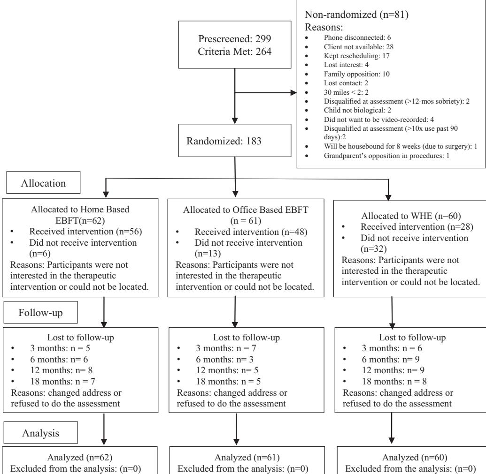
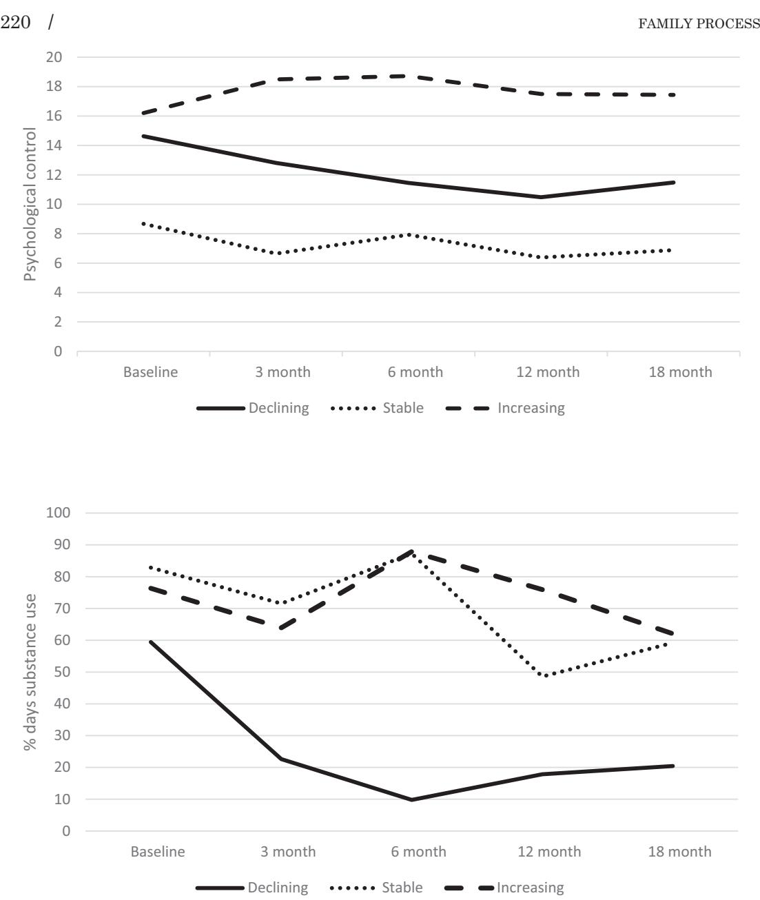

Co-Occurring Trajectory of Mothers' Substance Use and Psychological Control and Children's Behavior Problems: The Effects of a Family Systems Intervention

> JING ZHANG\* NATASHA SLESNICK\* XIN FENG\*

This study examined the effects of a family systems therapy (Ecologically-Based Family Therapy [EBFT]) on the co-occurring trajectory of mothers' substance use and psychological control, and its association with children's problem behaviors. Participants included 183 mothers with a substance use disorder who had at least one biological child in their care. Mothers were randomly assigned to one of the three intervention conditions: EBFT home, n = 62; EBFT—office, n = 61; or Women's Health Education, n = 60. Participants were assessed at baseline, 3, 6, 12, and 18 months post-baseline. A dual-trajectory class growth analysis identified three groups of mothers in regard to their change trajectories. The majority of the mothers exhibited a synchronous decrease in substance use and psychological control (n = 107). In all, 46 mothers exhibited a synchronous increase in substance use and psychological control. For the remaining 30 mothers, substance use and psychological control remained stable. Mothers in the family therapy condition were more likely to show reduced substance use and psychological control compared to mothers in the control condition. Moreover, children with mothers who showed decreased substance use and psychological control exhibited lower levels of problem behaviors compared to children with mothers showing increased substance use and psychological control. The findings provide evidence for the effectiveness of family systems therapy, EBFT, in treating mothers' substance use, improving parenting behaviors, and subsequently improving child behavioral outcomes.

Keywords: Randomized Clinical Trial; Family Systems Intervention; Substance Using Mothers; Psychological Control; Children's Behavior Problems

Fam Proc 57:211–225, 2018

Approximately, 20% of adults receiving substance use treatment live with their minor children (Stanger et al., 1999). Research consistently notes that parents' substance use interferes with parenting, which has detrimental effects on child developmental and behavioral outcomes (Miller, Smyth, & Mudar, 1999; Stanger, Dumenci, Kamon, & Burstein, 2004). Parental substance use is associated with high rates of child maltreatment (Staton-Tindall, Sprang, Clark, Walker, & Craig, 2013), overly punitive parenting, and diminished parental monitoring (Lang, Pelham, Atkeson, & Murphy, 1999; Miller

\*The Ohio State University, Columbus, OH.

This research was supported by NIDA grant R01 DA023062 awarded to Natasha Slesnick.

Correspondence concerning this article should be addressed to Jing Zhang, The Ohio State University, 139 Campbell Hall 1787 Neil Avenue, Columbus, OH 43210. E-mail: zhang.5636@osu.edu

et al., 1999). Although the effects of parents' substance use on parenting, parent–child relations, and subsequently child outcomes are well established, very few empirical studies have examined the reciprocal relationship among these variables. Indeed, research shows that positive parent–child relations are associated with reduced parental substance use (Kearney, Murphy, & Rosenbaum, 1994; Pelham et al., 1997). Moreover, substance using mothers who identify parenting responsibilities as their central social role are motivated to stop using drugs and alcohol (Kearney et al., 1994). Clearly, parental substance use and parenting are interrelated.

Psychological control is one parenting behavior that is particularly relevant to parent– child relationships. Psychological control involves manipulating and inhibiting children's autonomy through intrusive parenting tactics such as love withdrawal, guilt induction, and invalidating the child's feelings (Barber, 1996; Barber & Harmon, 2002). Psychological control impedes children's development of a sense of personal efficacy and a stable identity by pressuring children to comply with parents' needs and motivations rather than thinking and making decisions according to their own motivations (Barber, 1996; Oudekerk, Allen, Hessel, & Molloy, 2015). Many studies document the positive association between parents' psychological control, parent–child conflicts, and children's internalizing and externalizing behaviors (Barber, Olsen, & Shagle, 1994; Bean, Barber, & Crane, 2006; Steeger & Gondoli, 2013). Given the influence of psychological control on parent–child relations, and also the potential effects of parent–child relations on parental substance use, parent–child relations may serve as a transactional mechanism connecting parents' psychological control and substance use across time. Specifically, parents' drug use may compromise their parenting, likely leading to more parent–child conflicts, which in turn, may be associated with more use of psychological control among parents (Steeger & Gondoli, 2013). Alternatively, poor parent–child relationship attributed to parental psychological control may result in parents' feelings of role inadequacy and increased distress, likely leading to elevated substance use (Pelham et al., 1997). In other words, poor parent–child relations may function as a common risk factor linking parental drug use and psychological control. As a result, mothers' substance use and psychological control are likely interrelated and exhibit co-occurrence across time. Family-based interventions that improve parenting behaviors might also improve parental substance use and vice versa, subsequently benefiting children.

Ecologically-Based Family Therapy (EBFT) is a family systems therapy that has been found to be effective in improving family interaction patterns and reducing substance use among adolescents (Guo & Slesnick, 2013; Slesnick & Prestopnik, 2005, 2009). Grounded in the ecological perspective (Bronfenbrenner, 1979), EBFT recognizes that substance use and related individual and family problems are nested in multiple interrelated systems, and therefore, targets dysfunctional family interactions associated with the development and continuation of problem behaviors (e.g., mothers' substance use). Furthermore, improved family interactions and reduced problem behaviors are expected to maintain through negative feedback loops. Two randomized trials of EBFT with runaway youth found that youth assigned to EBFT reported greater reduction in substance use compared to those assigned to treatment as usual condition (Slesnick & Prestopnik, 2005, 2009). A third trial showed that family systems therapy resulted in similar outcomes to other manualized, evidence-based approaches for substance use treatment including Motivational Interviewing and the Community Reinforcement Approach (Slesnick, Erdem, Bartle-Haring, & Brigham, 2013). EBFT was originally developed for substance using runaway youth and their families. A randomized clinical trial evaluating the effectiveness of EBFT on substance using mothers with children in their care showed that mothers participating in the EBFT condition exhibited a quicker decline in substance use compared to those assigned to the control condition (Slesnick & Zhang, 2016), and EBFT also resulted in improved parent–child interactions (Zhang & Slesnick, 2016).

## The Present Study

The present study tested whether participation in EBFT was associated with mothers' co-occurring trajectory of substance use and psychological control, and subsequently, whether this trajectory was associated with children's internalizing and externalizing behaviors. The current data were part of the randomized clinical trial mentioned above that evaluated the effectiveness of EBFT on substance using mothers with children in their care.

A group-based analysis (i.e., a person-centered approach; Nagin, 2005) was utilized to identify subgroups underlying the co-occurring trajectory of mothers' substance use and psychological control. According to Nagin (2005), the use of a group-based analysis in the examination of the co-occurrence of two or more behavioral outcomes is based on the recognition that a conventional approach, that is, correlation between variables, is limited in its effectiveness for investigating behavior co-occurrence. For instance, in analyses focusing on the correlation between two variables, the magnitude of a correlation coefficient is applied equally to all members within the population. However, in reality, subgroups may exist and the strength of correlations may vary across subgroups. This is especially true for prevention and intervention research where individuals respond to the same treatment differently, and as a result, their treatment outcomes vary (Lutz, Martinovich, & Howard, 1999). In this light, mothers who were assigned to the same treatment (i.e., EBFT) may exhibit variability in their treatment outcomes (i.e., substance use and psychological control). With a group analysis, mothers are classified into different groups based on their treatment response in regard to substance use and psychological control. Mothers within a group show similar responses, and mothers between groups show distinct responses. Moreover, identifying subgroups and detecting factors characterizing subgroups may help elucidate for whom the intervention helps versus for whom it does not help. This information can be used to tailor future interventions to meet clients' needs more effectively.

In sum, the present study sought to identify subgroups of the co-occurring trajectory of mothers' substance use and psychological control. It was expected that three subgroups would be identified in which substance use and psychological control would (1) exhibit a synchronous decrease, (2) remain stable, or (3) show a synchronous increase over time. This study also examined whether treatment condition was associated with group membership. It was expected that participation in EBFT would be associated with a higher likelihood of showing reduced substance use and psychological control compared to participation in the control condition. In the analysis of this step, baseline variables, including mothers' age, childhood abuse history (sexual and physical abuse), drug use (whether using hard drugs or polysubstance), mothers' homeless experiences (whether they ran away from home before the age of 18 years), treatment sessions attended, and participation of multiple children versus only target child in the treatment, were controlled. Research shows that mothers' childhood abuse history, homeless experiences, and drug use are associated with their parenting behaviors and interaction with children (Crawford, Trotter, Hartshorn, & Whitbeck, 2011; Lang et al., 1999; Seltmann & Wright, 2013; Slesnick, Feng, Brakenhoff, & Brigham, 2014). Moreover, younger mothers experience greater parenting stress compared to older mothers (Brooks-Gunn & Chase-Lansdale, 1995), and parenting stress is associated with increased psychological control perceived by children (Putnick et al., 2008). Finally, this study also sought to examine the association between group membership and children's problem behaviors. It was expected that reduced drug use and psychological control of mothers would be associated with lower levels of problem behaviors among children.

## METHODS

# Participants

Participants included 183 mothers with a substance use disorder and who had at least one biological child in their care. Mothers were recruited from a community treatment center for substance use in a large Midwestern city. To be eligible for the study, mothers had to (1) be seeking outpatient treatment for their substance use disorder, (2) meet diagnostic criteria for an alcohol or drug use disorder as defined by DSM IV, and (3) have a child between the age of 8 and 16 years who either resided with the participating mothers at least 50% of the time in the past 2 years, or 100% of the time in the past 6 months. Participating mothers' ages ranged from 22 to 54 years (M = 33.9). Most women reported being White, non-Hispanic (53.6%), or African-American (42.6%). In terms of marital status, 34.9% of the participating mothers were unmarried but in a romantic relationship, 45.9% were single, divorced, or widowed, and only 19.1% were married. In addition, 60% of families had an annual income of \$15,000 or below and only about 18% of families had an annual income greater than \$30,000. The mean age of the target child was 11.5 years with a range of 8–16 years old, with 51.9% male.

# Procedure

Mothers were screened for eligibility at the community treatment center. Parental permission was obtained from eligible mothers, and then their children were contacted and informed of the study. If more than one eligible child was identified, only the child with more severe substance use as reported in the Form 90 (Miller, 1996) or a higher problem behavior score in the Youth Self Report (Achenbach & Edelbrock, 1982) was selected as the target child. All children in the household were invited to participate in the family systems therapy sessions.

At baseline, both the mother and target child completed an assessment battery. After the baseline assessment, families were randomly assigned to receive one of the three intervention conditions: EBFT—home, n = 62; EBFT—office, n = 61; or Women's Health Education (WHE, mothers only), n = 60. Prior research suggests that home-based family therapy better facilitates engagement and retention compared to office-based family therapy (Slesnick & Prestopnik, 2009). However, it remains unknown whether this applies to substance using mothers with a child. An URN randomization program was used to assign participants to each condition. URN randomization has been successfully used to ensure baseline group equivalence in clinical trials. The URN procedure retains random allocation and balances groups on a priori continuous or categorical variables. The variable used in the URN for this study was mothers' drugs of choice.

All women received treatment as usual through the community treatment center, which included outpatient individual and group therapy. A follow-up assessment was conducted at 3, 6, 12, and 18 months post-baseline. The 3- and 6-month post-baseline follow-ups were designed as post-treatment assessments. Some participants completed treatment by 3 months, while others took longer. All treatment had to be completed by 6 months. Study design and flow of participants are presented in Figure 1. Participating mothers were offered a \$75 gift card, whereas children were offered a \$40 gift card at completion of the baseline assessment and each follow-up assessment.

FIGURE 1. CONSORT Flowchart.

Note. EBFT, Ecologically-Based Family Therapy; WHE, Women's Health Education.

# Treatment Intervention

Ecologically-Based Family Therapy is a 12-session family systems therapy that targets dysfunctional family interactions linked to the development of problem behaviors. The first 1–2 sessions aim to engage family members into the treatment, assess individual and family needs, strengths, and weakness, and guide families toward considering current problems and potential solutions as residing in the family relationship. Sessions 3–12 focus on helping families identify and address aspects of the family relationship that contribute to the development and maintenance of mothers' substance use, as well as aspects of the family relationship that serve a protective function. EBFT therapists were licensed counselors or clinical graduate students who received multi-step training including video and manual review, role play exercises, and discussion of the theoretical rationale and practical application of EBFT techniques. Ongoing supervision and independent

treatment fidelity coding were employed to ensure implementation quality and adherence to the intervention protocol.

Women's Health Education is a 12-session manualized educational intervention (Miller, Pagan, & Tross, 1998) and was used as an attention control. WHE helps mothers understand the woman's body, human sexual behavior, pregnancy and childbirth, STDs, HIV, and AIDS. WHE was chosen as the comparison condition because it has shown positive effects on women's substance use outcomes (Hien et al., 2010), provides equivalent attention, and does not use a family system approach. The use of WHE provides a control for common factors that may contribute to change.

## Measures

Mothers' Substance Use was measured by the Form-90 (Miller, 1996), a structured interview that uses the timeline follow-back method to assess daily substance use in the past 90 days. This measure has high test–retest reliability with kappas for different drug classes ranging from .74 to .95 (Tonigan, Miller, & Brown, 1997; Westerberg, Tonigan, & Miller, 1998). In the current study, the percentage of mothers' total days of alcohol and drug use (except for the use of tobacco) in the prior 90 days was calculated at baseline, 3, 6, 12, and 18 months post-baseline.

## Mothers' psychological control

The psychosocial control subscale of the Child's Report of Parenting Behavior Inventory (Margolies & Weintraub, 1977) includes 16 items assessing the degree of parents' psychological control behaviors such as love withdrawal and guilt induction. A sample item is "My mother/father feel hurt when I don't follow his/her advice." The score for mothers' behaviors was used. Items were rated on a scale of 0–3. Scores for each item were summed, and higher scores indicate higher levels of psychological control. The psychological control score across five times points was used in the analyses and reliability ranged from .83 to .89.

## Children's behavior problems

The Child Behavior Checklist (CBCL; Achenbach, 1991) includes 112 items assessing mothers' perception of children's behaviors associated with delinquency, aggression, attention problems, somatic complaints, thought problem, and social problems. The CBCL includes internalizing (withdrawn, somatic complaints, anxious/depressed) and externalizing (delinquency and aggression) subscales. The raw scores of internalizing and externalizing behaviors were utilized in this study with higher scores indicating greater internalizing or externalizing problems. At baseline, the coefficient alpha was .88 for internalizing behaviors and .93 for externalizing behaviors. At 18 months post-baseline, the coefficient alpha was .92 for internalizing behaviors and .94 for externalizing behaviors.

## Baseline variables

Baseline variables included mother's age, childhood sexual and physical abuse (0 as no, 1 as yes), homeless experiences, that is, whether homeless before 18 years of age (0 as no, 1 as yes), hard drug use, that is, substance other than alcohol, tobacco, and marijuana such as cocaine, opiates, tranquilizer, sedatives/downers, stimulants/uppers, and hallucinogens (0 as no, 1 as yes), polysubstance use, that is, using one single drug or more than one type of drug in the past 90 days (0 as no, 1 as yes), participation of multiple children or only the target child (0 = only target child, 1 = multiple children), and treatment sessions attended.

### Overview of Analyses

This study used an intent-to-treat design which consisted of the entire sample of 183 mothers. The intent-to-treat design provides a stringent test of treatment effects by preventing deviation from randomization and reducing bias due to the selective effects incurred to the differential attrition from different treatment conditions (Ch^ene et al., 1998). Data were analyzed in four steps using Mplus version 7 (Muthen & Muthen, 1998- 2012). First, the individual change trajectory for mothers' substance use and psychological control were examined. Second, a dual-trajectory latent class growth analysis (LCGA) was performed to identify subgroups underlying the co-occurrence of mothers' substance use and psychological control that were evaluated at baseline and 3, 6, 12, and 18 months post-baseline. Several criteria were considered to determine the optimal number of group memberships that were best represented by the data: (1) theoretical consideration; (2) Bayesian information criterion (BIC), of which a smaller value indicates a better model fit (Nylund, Asparouohov, & Muthen, 2007); and (3) Lo-Mendell-Rubin Likelihood Ratio Test (LMR) and Bootstrap Likelihood Ratio Test that compare the fit between two nested models (Nylund et al., 2007). A significant p value indicates that a model with k classes fits better compared to a model with k 1 classes. The basic model for this analysis included both linear and quadratic relationships between outcome variables and time points.

Second, after the optimal model of LCGA was determined, following the three-step approach recommended by Asparouhov and Muthen (2014), the association between treatment condition and group membership was examined with individual-level variables at baseline controlled. In this step, the analysis is equivalent to a multinomial logistic regression using treatment condition (i.e., EBFT vs. WHE) to predict trajectory group membership. Group membership was a latent categorical variable created using the latent class posterior distribution generated in the first step. The model takes into account classification errors when regressing the group membership on predictors. Third, utilizing the three-step approach in regard to adding a distal outcome (Asparouhov & Muthen, 2014), the trajectory group membership was evaluated in association with children's problem behaviors at 18 months post-baseline. Specifically, child problem behaviors at 18 months were regressed on the group membership while controlling for children's problem behaviors at baseline.

#### RESULTS

Independent-sample t-tests were performed to compare the group difference on mothers' drug use and psychological control between office- and home-based EBFT groups across all five time points. No significant differences were found. Thus, the two groups were combined into one EBFT group. Additionally, t-tests showed that mothers' substance use, psychological control, and children's behavior problems were not significantly different between the EBFT and WHE conditions at baseline. The follow-up completion rate across the four time points (3, 6, 12, and 18 months) ranged from 88% to 90%. Follow-up attrition was analyzed by comparing mothers who completed all assessments (n = 142, 77.6%) to those who missed at least one assessment (n = 41, 22.4%) in terms of treatment condition and mothers' drug use and psychological control. Although in the WHE condition, the follow-up rates were somewhat lower, Chi-square test showed that attrition did not significantly differ across treatment conditions (p > .05). Independent-sample t-tests showed no significant difference between follow-up completers and non-completers in mothers' substance use and psychological control. Additionally, missing completely at random test (MCAR) was performed to determine whether data were missing at random. The test showed that data were MCAR with v2 (470) = 504.23, p > .05. No cases had missing data across all time points; therefore, all cases (n = 183) were included in the analyses. Full information maximum likelihood in the Mplus software (Muthen & Muthen, 2012) was used to estimate missing data when performing the analyses.

Descriptive statistics of baseline covariates showed that the majority of the mothers reported childhood physical abuse (63%), and 49% of the mothers reported sexual abuse. About half of the mothers (51%) reported running away from home before the age of 18 years. As for drug use, 69% of the mothers reported hard drug use, and 78% reported polysubstance use. Among family receiving EBFT, 36% of the families included more than one child in the therapy sessions.

## Preliminary Analyses

Before performing the group analysis, the univariate change trajectory of mothers' substance use and psychological control was examined. The results showed that both mothers' substance use (B = 6.83, SE = 0.82, p < .001) and psychological control (B = 0.51, SE = 0.15, p < .001) declined over time in the whole sample. Additionally, the intercorrelation between mothers' substance use and psychological control was investigated. Findings showed that the association between the slope growth factors of mothers' substance use and psychological control was marginally significant (B = 1.41, SE = 0.81, p = .08). Moreover, mothers' substance use and psychological control were significantly correlated with each other at 6 (r = .21, p < .01) and 12 months (r = .17, p < .05) post-baseline. These findings suggest a trend of co-occurrence of mothers' substance use and psychological control. The subgroup heterogeneity in the co-occurrence pattern was further investigated with LCGA.

## Subgroups of the Co-Occurring Trajectory of Mothers' Substance Use and Psychological Control

According to the criteria used to determine the optimal number of group membership, the three-class model was considered optimal. The LMR became non-significant at four classes, indicating that the four-class model did not improve in model fit compared to the three-class model. Compared to the two-class model, the three-class model showed a significant improvement in model fit with the p value of LMR smaller than .05. The threeclass model also had a smaller value of BIC (13,868.45) compared to the two-class model (13,927.45). Moreover, the three-class solution was consistent with the theoretical hypothesis of this study. Thus, three trajectory groups were identified based on the significance level and direction of the linear growth factor for both substance use and psychological control: (a) both substance use and psychological control decreased, labeled as the declining group (n = 107, 58.5%); (b) both substance use and psychological control remained stable, labeled as the stable group (n = 30, 16.4%); and (c) both substance use and psychological control increased moderately, labeled as the increasing group (n = 46, 25.1%). The posterior probabilities of group memberships were .98, .89, .93 for the three groups, suggesting low classification errors.

Table 1 presents the means and standard deviations for mothers' substance use and psychological control across all times points for the three trajectory groups. Figure 2 depicts the predicted trajectories for the three groups. In the declining group, mothers exhibited a lower initial level of substance use and a medium initial level of psychological control compared to the other two groups. Across time, mothers showed a sharp decrease in their drug use from baseline to 6 months and this trend decelerated at 12 and 18 months (intercept = 57.47, p < .001; linear slope = 38.94, p < .001; quadratic slope = 7.70, p < .001). Mother's psychological control also declined but the changes were relatively slight (intercept = 14.71, p < .001; linear slope = 2.44, p < .001; quadratic

|                       | Declining |               |    | Stable        | Increasing |               |
|-----------------------|-----------|---------------|----|---------------|------------|---------------|
| Variable              | N         | M (SD)        | N  | M (SD)        | N          | M (SD)        |
| Drug use              |           |               |    |               |            |               |
| Baseline              | 107       | 59.43 (33.47) | 30 | 82.83 (25.72) | 46         | 76.34 (27.81) |
| 3 months              | 98        | 22.61 (27.67) | 26 | 71.56 (33.45) | 41         | 63.92 (38.71) |
| 6 months              | 96        | 9.79 (12.57)  | 28 | 87.27 (17.87) | 41         | 87.87 (18.95) |
| 12 months             | 95        | 17.85 (25.73) | 27 | 48.56 (35.12) | 39         | 75.95 (34.35) |
| 18 months             | 92        | 20.45 (31.72) | 27 | 59.21 (41.38) | 44         | 62.06 (40.21) |
| Psychological control |           |               |    |               |            |               |
| Baseline              | 106       | 14.63 (7.22)  | 29 | 8.67 (3.61)   | 46         | 16.20 (6.01)  |
| 3 months              | 98        | 12.81 (6.84)  | 26 | 6.65 (5.10)   | 40         | 18.49 (5.41)  |
| 6 months              | 94        | 11.45 (6.53)  | 28 | 7.93 (5.67)   | 43         | 18.72 (6.61)  |
| 12 months             | 93        | 10.48 (7.05)  | 24 | 6.38 (4.29)   | 42         | 17.50 (6.89)  |
| 18 months             | 92        | 11.48 (6.84)  | 24 | 6.88 (4.97)   | 43         | 17.44 (5.68)  |

TABLE 1 Means and Standard Deviations for Percent Days of Mothers' Drug and Alcohol Use (Except Tobacco) in the Past 90 Days and Psychological Control

slope = .41, p < .01). In the stable group, mothers exhibited a higher initial level of substance use and a lower initial level of psychological control compared to the other groups. Mothers' psychological control remained stable (intercept = 8.70, p < .001; linear slope = 1.30, p > .05; quadratic slope = .21, p > .05), while substance use fluctuated with a mix of decreases and increases but was generally stable over time (intercept = 81.45, p < .001; linear slope = 6.30, p > .05; quadratic slope = 3.41, p = .05). In the increasing group, mothers exhibited a medium initial level of substance use and a higher initial level of psychological control compared to the other groups. Mothers' drug use also fluctuated with a mix of decreases and increases but showed an overall increase (intercept = 71.50, p < .001; linear slope = 14.68, p < .01; quadratic slope = 4.21, p < .01), and psychological control also showed a slight increase over time (intercept = 16.39, p < .001; linear slope = 1.85, p = .05; quadratic slope = .42, p = .06).

## Treatment Effects

Treatment condition and baseline covariates were added to the model to predict the group membership. The increasing group was used as the reference group. The analysis was equivalent to a multinomial logistic regression using treatment condition (i.e., EBFT vs. WHE) to predict trajectory group membership. Because trajectory group memberships were unordered categories, the increasing group was treated as the reference group. The findings showed that the odds of being in the declining group versus the reference group were 2.62 times greater (OR = 2.62, p < .05, 95% CI: 1.086–6.296) for mothers in the EBFT condition than those in the WHE condition. This finding supports the second hypothesis that participation in the EBFT condition would be associated with a higher likelihood of showing reduced substance use and psychological control compared to participation in the WHE condition.

Moreover, mother's polysubstance use was significantly associated with a lower likelihood to be in the declining group versus the reference group (OR = 0.05, p < .05, 95% CI: 0.004–0.638). Sexual abuse showed a marginally significant effect on the likelihood to be in the declining group versus reference group (OR = 0.48, p = .09, 95% CI: 0.199–1.136). That is, mothers reporting sexual abuse were less likely to show reduced substance use

FIGURE 2. Sub-Group Trajectories of Mothers' Drug Use and Psychological Control.

and psychological control. Other covariates did not show significant effects and were not retained in the final model.

## The Association Between Trajectory Group Memberships and Child Behavior Problems

Analyses were performed to examine whether trajectory group membership predicted children's problem behaviors at 18 months while controlling for problem behaviors at baseline. Means and standard errors of children's internalizing and externalizing

|                                                    | Declining      |              | Stable         |              | Increasing       |              |
|----------------------------------------------------|----------------|--------------|----------------|--------------|------------------|--------------|
| Variable                                           | M              | SE           | M              | SE           | M                | SE           |
| Internalizing behaviors Externalizing behaviors | 6.67a 8.54a | 1.22 1.22 | 2.99b 5.99a | 0.75 2.35 | 12.75c 16.15b | 1.94 2.25 |

TABLE 2 Association Between Trajectory Group Membership and Children's Internalizing and Externalizing Behaviors at 18 Months Post-Baseline

Note. Different superscripts within the same row indicate significantly different means at p < .05.

behaviors at 18 months across different trajectory groups are shown in Table 2. The findings showed that mothers' group membership was a significant predictor of children's externalizing behaviors at 18 months. As expected, compared to children with mothers in the reference group (i.e., the increasing group), children with mothers in both the declining (B = 7.61, SE = 2.7,0 p < .01) and the stable groups (B = 10.17, SE = 3.39, p < .01) exhibited lower levels of externalizing behaviors. Likewise, children with mothers in both the declining (B = 6.08, SE = 2.69, p < .05) and the stable groups (B = 9.76, SE = 2.11, p < .001) exhibited lower levels of internalizing behaviors at 18 months compared to the reference group.

Additionally, children's problem behaviors for the declining and stable groups were also compared. Contrary to our hypothesis that reduced drug use and psychological control of mothers would be associated with lower levels of problem behaviors of children, children with mothers in the stable group exhibited lower levels of internalizing behaviors compared to those with mothers in the declining group. As for externalizing behaviors, no statistically significant difference was found between the two groups.

### DISCUSSION

The primary goal of this study was to examine the effects of a family systems intervention on the co-occurring trajectory of mothers' substance use and psychological control over time, and subsequently, how this trajectory influenced children's problem behaviors. The effectiveness of EBFT on mothers' substance use (primary outcome) and parent–child interaction from the same clinical trial has been reported elsewhere (Slesnick & Zhang, 2016; Zhang & Slesnick, 2016). This study uniquely contributes to the literature by identifying subgroups wherein mothers' substance use co-occurred with psychological control over time. That is, to our knowledge, this is the first study to identify a synchronous relationship between substance use and parenting behavior.

Building on previous literature evidencing the uni-directional effects of family interactions on substance use (Brook et al., 2002; Pelham et., 1997) as well as the effects of substance use on family interactions (Lang et al., 1999; Miller et al., 1999), this study identified different co-occurring patterns of mothers' substance use and psychological control. Specifically, mothers' substance use and psychological control either increased or declined together, or remained stable over time. In addition, while mothers in this study received substance use treatment as usual through the community treatment center, those who also received the family systems therapy were more likely to exhibit a decline in both substance use and psychological control compared to those receiving the non-family-based attention control, WHE. This finding is consistent with previous literature on the effectiveness of this family systems intervention (Guo & Slesnick, 2013; Slesnick & Prestopnik, 2005, 2009) and family therapy for substance users (Liddle et al., 2001; Stanton & Shadish, 1997). In general, family systems therapies have the power to interrupt substance use and

15455300, 2018, 1, Downloaded from https://onlinelibrary.wiley.com/doi/10.1111/famp.12279 by Utrecht University, Wiley Online Library on [05/04/2025]. See the Terms and Conditions (https://onlinelibrary.wiley.com/terms-and-conditions) on Wiley Online Library for rules of use; OA articles are governed by the applicable Creative Commons License

improve family interaction, but to date have not been tested with substance using mothers and their children. Targeting both domains (substance use and parenting) may be essential for longitudinal success in either domain. That is, a family systems orientation suggests a co-occurrence between substance use and family interaction.

It was also expected that reductions in substance use and improvement in parenting would result in better child outcomes. Consistent with previous literature on the association between parental substance use, parenting behaviors, and child outcomes (Miller et al., 1999; Stanger et al., 2004), this study's findings revealed that children of mothers who showed decreased substance use and psychological control exhibited fewer problem behaviors compared to children with mothers who showed increased substance use and psychological control. This finding implies that therapists should address child problem behaviors within the context of parental substance use and parenting using a family systems intervention. Research suggests that child problem behaviors do not develop in isolation of parental struggles such as substance use or parenting behaviors, but most intervention approaches are individually focused on child problem behaviors or on parental substance use, rather than on family interaction (Ashley, Marsden, & Brady, 2003; Uziel-Miller & Lyons, 2000). Future research can confirm that focusing on child problems in isolation (or on parental substance use without a focus on parent–child relations) could result in more limited clinical outcomes for women seeking substance use treatment and their children. In sum, this study suggests a complex and dynamic relationship between mother and child which is changeable through family systems therapy.

Contrary to our expectation that children with mothers in the declining groups would exhibit the lowest levels of problem behaviors, surprisingly, children with mothers in the stable group exhibited lower levels of internalizing behaviors compared to the other two groups. An examination of mean levels for different drugs of choice of mothers in each group sheds light on this pattern. Mothers in the stable group used less alcohol (M = 13.08) compared to mothers in both the declining (M = 20.47) and increasing groups (M = 28.36). Slesnick et al. (2014) found that mothers with a primary alcohol use disorder engage in more deleterious parenting behaviors, including less autonomy, support, and acceptance of their child compared to primarily opioid addicted using mothers. This finding helps explain why in the current study, although mothers in the stable group showed a higher level of drug use, they exhibited a lower level of psychological control, and subsequently, showed a less negative influence on children's internalizing behaviors, likely because they used less alcohol. Another possibility is that we only focused on the influence of mothers' behaviors on children's behavior problems, and other family relationships that may influence children's behavior problems were not considered in this study. For children with mothers who did not show much improvement in their behaviors, positive interactions with fathers or other family members may play a protective role in mitigating the negative influence of mothers' behaviors.

Additionally, mothers reporting polysubstance use were less likely to show decreased substance use and psychological control. This finding is consistent with prior research that shows treatments are less effective for polysubstance users (Dutra et al., 2008). Furthermore, mothers with a history of childhood sexual abuse also were less likely to be in the decreasing substance use and psychological control group. This has been similarly documented in other treatment outcome studies (Najavits, Weiss, Shaw, & Muenz, 1998), with researchers suggesting that this disparity can be mitigated through also addressing women's underlying trauma when women seek substance use treatment (Najavits et al., 1998). In general, these findings have important implications for understanding the effectiveness of family systems therapy in treating adult substance use, and also the factors that might intervene in the treatment process such as mothers' drugs of choice and childhood abuse history.

## Limitations

Some limitations should be noted. First, the study sample included low-income, primarily single mothers who sought treatment for their substance use disorder. Whether these findings would be replicated among married mothers, substance using fathers, women seeking treatment for other problems, or women with children of younger age warrants further investigation. Second, the current study found that children with mothers who showed decreases or remained stable in substance use and psychological control exhibited lower levels of problem behaviors compared to children with mothers showing increased substance use and psychological control. This finding relied on mothers' self-report measures of children's behavior problems and may involve some response bias. The mother's report of improved child behaviors may be due to the change in her perception as a result of her own better functioning rather than the actual improvement in children's problem behaviors. Future research that collects and compares child and teacher collateral reports could strengthen the confidence of the conclusions. Even with these limitations, this study provides a relatively long assessment of the generalization of intervention effects, included data on both mother and child, and is one of the first randomized clinical trials testing a family systems intervention against an attention control for mothers seeking substance use treatment with children in their care.

# CONCLUSION, IMPLICATIONS, AND FUTURE DIRECTIONS

The current findings offer several important implications for future research with women seeking substance use treatment who also have children in their care. First, this study showed that women displayed different patterns of change over time, and that substance use and parental psychological control changed synchronously. Second, while all women in this study received treatment as usual through the community treatment center consisting primarily of individual and group therapy for substance use, those who also received family systems therapy, reported greater reductions in substance use and psychological control than those who received the non-family based, attention control, WHE. Furthermore, reductions in substance use and psychological control predicted reductions in child problem behaviors. The findings emphasize the importance of addressing substance use, parenting, and child behavior problems from a family systems orientation. In particular, women, primarily single mothers, and who seek substance use treatment are not typically engaged in family therapy with their children through the community treatment programs. By addressing negative parent–child interaction processes, family systems therapy with this population has the potential to prevent future problem behaviors among children, and to improve substance use outcomes and parenting among mothers even 1 year after treatment ends. Substance use treatment centers should consider offering this intervention to this subpopulation of women. While training of family therapists and family therapy implementation has been cited as a barrier to adoption in community treatment programs (Fals-Stewart, Fincham, & Kelley, 2004), the pay-off to mother–child may be significant. Furthermore, family therapy can serve as an adjunct to substance use treatment, supporting the change in family processes that occur as a result of changes in substance use behaviors. However, we are aware that many people with substance use problems do not follow through with formal substance use treatment (King & Canada, 2004), and given its higher treatment retention (Stanton & Shadish, 1997), family therapy may be their only therapeutic intervention. As such, some research supports family therapy as an effective stand-alone intervention for reducing substance use behaviors among couples (Schumm, O'Farrell, Kahler, Murphy, & Muchowski, 2014) and adolescents (Liddle et al., 2001; Slesnick & Prestopnik, 2005; Waldron, Slesnick, Brody, Turner, & Peterson, 2001).

15455300, 2018, 1, Downloaded from https://onlinelibrary.wiley.com/doi/10.1111/famp.12279 by Utrecht University, Wiley Online Library on [05/04/2025]. See the Terms and Conditions (https://onlinelibrary.wiley.com/terms-and-conditions) on Wiley Online Library for rules of use; OA articles are governed by the applicable Creative Commons License

#### REFERENCES

- Achenbach, T. M. (1991). Integrative guide for the 1991 CBCL/4-18, YSR, and TRF profiles. Burlington, VT: University of Vermont Department of Psychiatry.
- Achenbach, T. M., & Edelbrock, C. S. (1982). Manual for the Child Behavior Checklist and Child Behavior Profile. Burlington, VT: Child Psychiatry, University of Vermont.
- Ashley, O. S., Marsden, M. E., & Brady, T. M. (2003). Effectiveness of substance abuse treatment programming for women: A review. The American Journal of Drug and Alcohol Abuse, 29, 19–53.
- Asparouhov, T., & Muthen, B. (2014). Auxiliary variables in mixture modeling: Three-Step approaches using Mplus. Structural Equation Modeling, 21, 329–341.
- Barber, B. K. (1996). Parental psychological control: Revisiting a neglected construct. Child Development, 67, 3296–3319.
- Barber, B. K., & Harmon, E. L. (2002). Violating the self: Parental psychological control of children and adolescents. In B. K. Barber (Ed.), Intrusive parenting: How psychological control affects children and adolescents (pp. 15–52). Washington, DC: American Psychological Association.
- Barber, B. K., Olsen, J. E., & Shagle, S. C. (1994). Associations between parental psychological and behavioral control and youth internalized and externalized behaviors. Child Development, 65, 1120–1136.
- Bean, R. A., Barber, B. K., & Crane, D. R. (2006). Parental support, behavioral control, and psychological control among African American youth: The relationships to academic grades, delinquency, and depression. Journal of Family Issues, 27, 1335–1355.
- Bronfenbrenner, U. (1979). The ecology of human development: Experiments by nature and design. Cambridge, MA: Harvard University Press.
- Brook, D. W., Brook, J. S., Richter, L., Whiteman, M., Arencibia-Mireles, O., & Masci, J. R. (2002). Marijuana use among the adolescent children of high-risk drug-abusing fathers. The American Journal on Addictions, 11, 95–110.
- Brooks-Gunn, J., & Chase-Lansdale, P. L. (1995). Adolescent parenthood. In M. H. Bornstein (Ed.), Handbook of parenting: Status and social conditions of parenting, Vol. 3 (pp. 113–149). Mahwah, NJ: Erlbaum.
- Ch^ene, G., Morlat, P., Leport, C., Hafner, R., Dequae, L., Charreau, I. et al. (1998). Intention-to-treat vs. ontreatment analyses of clinical trial data: Experience from a study of pyrimethamine in the primary prophylaxis of toxoplasmosis in HIV-infected patients. Controlled Clinical Trials, 19, 233–248.
- Crawford, D. M., Trotter, E. C., Hartshorn, K. S., & Whitbeck, L. B. (2011). Pregnancy and mental health of young homeless women. American Journal of Orthopsychiatry, 81, 173–183.
- Dutra, L., Stathopoulou, G., Basden, S. L., Leyro, T. M., Powers, M. B., & Otto, M. W. (2008). A meta-analytic review of psychosocial interventions for substance use disorders. American Journal of Psychiatry, 165, 179–187.
- Fals-Stewart, W., Fincham, F., & Kelley, M. (2004). Substance abusing parents' attitudes toward allowing their custodial children to participate in treatment: A comparison of mothers versus fathers. Journal of Family Psychology, 18, 666–671.
- Guo, X., & Slesnick, N. (2013). Family versus individual therapy: Impact on discrepancies between parents' and adolescents' perceptions over time. Journal of Marital & Family Therapy, 39, 182–194.
- Hien, D. A., Jiang, H., Campbell, A. N., Hu, M. C., Miele, G. M., Cohen, L. R. et al. (2010). Do treatment improvements in PTSD severity affect substance use outcomes? A secondary analysis from a randomized clinical trial in NIDA's Clinical Trials Network. American Journal of Psychiatry, 167, 95–101.
- Kearney, M. H., Murphy, S., & Rosenbaum, M. (1994). Mothering on crack: A grounded theory analysis. Social Science and Medicine, 38, 351–361.
- King, A. C., & Canada, S. A. (2004). Client-related predictors of early treatment drop-out in a substance abuse clinic exclusively employing individual therapy. Journal of Substance Abuse Treatment, 26, 189–195.
- Lang, A. R., Pelham, W. E., Atkeson, B. M., & Murphy, D. A. (1999). Effects of alcohol intoxication on parenting behavior and interactions with child confederates exhibiting normal or deviant behaviors. Journal of Abnormal Child Psychology, 27, 177–189.
- Liddle, H. A., Dakof, G. A., Parker, K., Diamond, G. S., Barrett, K., & Tejeda, M. (2001). Multidimensional family therapy for adolescent drug abuse: Results of a randomized clinical trial. American Journal of Drug and Alcohol Abuse, 27, 651–688.
- Lutz, W., Martinovich, Z., & Howard, K. I. (1999). Patient profiling: An application of random coefficient regression models to depicting the response of a patient to outpatient psychotherapy. Journal of Consulting and Clinical Psychology, 67, 571–577.
- Margolies, P. J., & Weintraub, S. (1977). The revised 56-item CRPBI as a research instrument: Reliability and factor structure. Journal of Clinical Psychology, 33, 472–476.
- Miller, B. A., Smyth, N. J., & Mudar, P. J. (1999). Mothers' alcohol and other drug problems and their punitiveness toward their children. Journal of Studies on Alcohol and Drugs, 60, 632–642.
- Miller, S., Pagan, D., & Tross, S. (1998). Women's Health Education: Peer activism for female partners of injection drug users. Unpublished treatment manual. Columbia University.
- Miller, W. R. (1996). Form 90: A structured assessment interview for drinking and related problem behaviors. Project MATCH Monograph Series, 5. U.S. Dept. of Health, Bethesda, MD.
- Muthen, B. O., & Muthen, L. K. (1998-2012). Mplus user's guide (7th ed.). Los Angeles, CA: Muthen & Muthen.

Nagin, D. S. (2005). Group-based modelling of development. Cambridge, MA: Harvard University Press.

- Najavits, L. M., Weiss, R. D., Shaw, S. R., & Muenz, L. (1998). "Seeking Safety": Outcome of a new cognitive– behavioral psychotherapy for women with posttraumatic stress disorder and substance dependence. Journal of Traumatic Stress, 11, 437–456.
- Nylund, K. L., Asparouohov, T., & Muthen, B. O. (2007). Deciding on the number of classes in latent class analysis and growth mixture modeling: A Monte Carlo simulation study. Structural Equation Modeling, 14, 535–569.
- Oudekerk, B. A., Allen, J. P., Hessel, E. T., & Molloy, L. E. (2015). The cascading development of autonomy and relatedness from adolescence to adulthood. Child Development, 86, 472–485.
- Pelham, W. E., Lang, A. R., Atkeson, B., Murphy, D. A., Gnagy, E. M., Greiner, A. R. et al. (1997). Effects of deviant child behavior on parental distress and alcohol consumption in laboratory interactions. Journal of Abnormal Child Psychology, 25, 413–424.
- Putnick, D. L., Bornstein, M. H., Hendricks, C., Painter, K. M., Suwalsky, J. T., & Collins, W. A. (2008). Parenting stress, perceived parenting behaviors, and adolescent self-concept in European American families. Journal of Family Psychology, 22, 752–762.
- Schumm, J. A., O'Farrell, T. J., Kahler, C. W., Murphy, M. M., & Muchowski, P. (2014). A randomized clinical trial of behavioral couples therapy versus individually based treatment for women with alcohol dependence. Journal of Consulting and Clinical Psychology, 82, 993–1004.
- Seltmann, L., & Wright, M. (2013). Perceived parenting competencies following childhood sexual abuse: A moderated mediation analysis. Journal of Family Violence, 28, 611–621.
- Slesnick, N., Erdem, G., Bartle-Haring, S., & Brigham, G. (2013). Intervention with substance abusing runaway adolescents and their families: Results of a randomized clinical trial. Journal of Consulting and Clinical Psychology, 81, 600–614.
- Slesnick, N., Feng, X., Brakenhoff, B., & Brigham, G. S. (2014). Parenting under the influence: The effects of opioids, alcohol and cocaine on mother–child interaction. Addictive Behaviors, 39, 897–900.
- Slesnick, N., & Prestopnik, J. (2005). Ecologically-based family therapy outcome with substance abusing runaway adolescents. The Journal of Adolescence, 28, 277–298.
- Slesnick, N., & Prestopnik, J. (2009). Comparison of family therapy outcome with alcohol abusing, runaway adolescents. Journal of Marital and Family Therapy, 35, 255–277.
- Slesnick, N., & Zhang, J. (2016). Family systems therapy for substance-using mothers and their 8 to 16-year-old children. Psychology of Addictive Behaviors, 30, 619–629.
- Stanger, C., Dumenci, L., Kamon, J., & Burstein, M. (2004). Parenting and children's externalizing problems in substance-abusing families. Journal of Clinical Child and Adolescent Psychology, 33, 590–600.
- Stanger, C., Higgins, S. T., Bickel, W. K., Elk, R., Grabowski, J., Schmitz, J. et al. (1999). Behavioral and emotional problems among children of cocaine- and opiate-dependent parents. Journal of the American Academy of Child and Adolescent Psychiatry, 38, 421–438.
- Stanton, M. D., & Shadish, W. R. (1997). Outcome, attrition, and family-couples treatment for drug abuse: A meta-analysis and review of the controlled, comparative studies. Psychological Bulletin, 122, 170–191.
- Staton-Tindall, M., Sprang, G., Clark, J., Walker, R., & Craig, C. D. (2013). Caregiver substance use and child outcomes: A systematic review. Journal of Social Work Practice in the Addictions, 13, 6–31.
- Steeger, C. M., & Gondoli, D. M. (2013). Mother-adolescent conflict as a mediator between adolescent problem behaviors and maternal psychological control. Developmental Psychology, 49, 804–814.
- Tonigan, J. S., Miller, W. R., & Brown, J. M. (1997). The Reliability of Form 90: An instrument for assessing alcohol treatment outcome. Journal of Studies on Alcohol and Drugs, 58, 358–364.
- Uziel-Miller, N. D., & Lyons, J. S. (2000). Specialized substance abuse treatment for women and their children: An analysis of program design. Journal of Substance Abuse Treatment, 19, 355–367.
- Waldron, H. B., Slesnick, N., Brody, J. L., Turner, C. W., & Peterson, T. R. (2001). Four- and seven-month treatment outcomes for substance-abusing youth. Journal of Consulting and Clinical Psychology, 69, 802–814.
- Westerberg, V. S., Tonigan, J. S., & Miller, W. R. (1998). Reliability of Form 90D: An instrument for quantifying drug use. Substance Abuse, 19, 179–189.
- Zhang, J., & Slesnick, N. (2016). Discrepancies in autonomy and relatedness promoting behaviors of substance using mothers and their children: The effects of a family systems intervention. Journal of Youth and Adolescence, 46, 668–681.