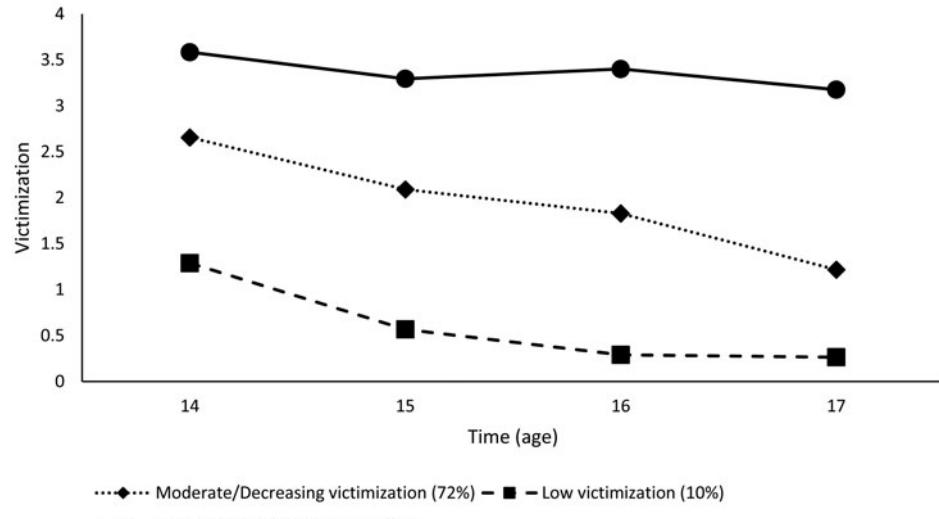
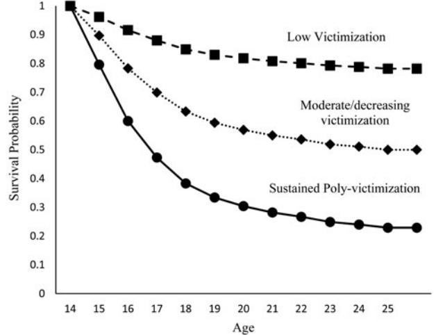
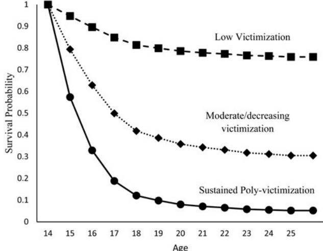

# Regular Article

# Influences of victimization and comorbid conditions on substance use disorder outcomes in justice-involved youth: A discrete time survival mixture analysis

Jordan P. Davis1 , Tim Janssen2, Emily R. Dworkin3, Tara M. Dumas4, Jeremy Goldbach1 and John Monterosso5

1 Department of Children, Youth, and Families, Suzanne Dworak-Peck School of Social Work, University of Southern California, Los Angeles, CA, USA; 2 Center for Alcohol and Addiction Studies, Brown University, Providence, RI, USA; 3 Center for the Study of Health and Risk Behaviors, University of Washington, Seattle, WA, USA; 4 Department of Psychology, Huron University College at Western University, London, ON, Canada and 5 Department of Psychology, University of Southern California, Los Angeles, CA, USA

# Abstract

To understand how exposure to victimization during adolescence and the presence of comorbid psychological conditions influence substance use treatment entry and substance use disorder diagnosis from 14 to 25 years old among serious juvenile offenders, this study included 1,354 serious juvenile offenders who were prospectively followed over 7 years. Growth mixture modeling was used to assess profiles of early victimization during adolescence (14–17 years). Discrete time survival mixture analysis was used to assess time to treatment entry and substance use disorder diagnosis. Posttraumatic stress disorder (PTSD) and major depressive disorder (MDD) were used as predictors of survival time. Mixture models revealed three profiles of victimization: sustained poly-victimization, moderate/decreasing victimization, and low victimization. Youth in the sustained poly-victimization class were more likely to enter treatment earlier and have a substance use diagnosis earlier than other classes. PTSD was a significant predictor of treatment entry for youth in the sustained poly-victimization class, and MDD was a significant predictor of substance use disorder diagnosis for youth in the moderate/decreasing victimization class. Therefore, substance use prevention programming targeted at youth experiencing poly-victimization in early adolescence—especially those who have PTSD or MDD—is needed.

Keywords: addiction treatment, adolescent, depression, juvenile justice, trauma

(Received 12 August 2018; revised 15 March 2019; accepted 31 March 2019)

Among the more than 2 million youth who are arrested every year (Puzzanchera, [2009](#page-13-0)), nearly half have a substance use disorder (SUD). Approximately 62%–81% of youth involved in the juvenile justice system have SUDs, compared to 6%–10% in school and community samples (Doran, Luczak, Bekman, Koutsenok, & Brown, [2012\)](#page-11-0). Many of these youth also report comorbid conditions such as posttraumatic stress disorder (PTSD) and major depressive disorder (MDD; Abram et al., [2013;](#page-11-0) Underwood & Washington, [2016](#page-13-0)). Youth who are repeat offenders, have been detained, or have been in a correctional facility have significantly higher odds of having a comorbid diagnosis (i.e., mental health disorder and SUD; Tripodi & Bender, [2011](#page-13-0)). Further, youth involved in the juvenile justice system have unusually high unmet mental health treatment needs (Maschi, Hatcher, Schwalbe, & Rosato, [2008](#page-12-0)) and the juvenile justice system is not equipped to serve youth with comorbid disorders, resulting in

Cite this article: Davis JP, Janssen T, Dworkin ER, Dumas TM, Goldbach J, Monterosso J (2020). Influences of victimization and comorbid conditions on substance use disorder outcomes in justice-involved youth: A discrete time survival mixture analysis. Development and Psychopathology 32, 1045–1058. [https://doi.org/10.1017/](https://doi.org/10.1017/S0954579419000750) [S0954579419000750](https://doi.org/10.1017/S0954579419000750)

© Cambridge University Press 2019

little to no mental health care compared to other sectors of service (Farmer, Burns, Phillips, Angold, & Costello, [2003\)](#page-12-0). Many youths who experience early childhood or adolescent violence (e.g., physical abuse, sexual abuse, or witnessing interparental violence) are found to later reside under the care of the juvenile justice system (US Department of Health and Human Services, [2010\)](#page-13-0) with unmet treatment needs, and thus, understanding pathways to treatment entry for juvenile justice involved youth may aid in more rapid response to early intervention.

It is critically important to consider the chronic strain faced by youth involved in the juvenile justice system when understanding their risk for SUD outcomes and likelihood of treatment entry. In particular, many youth in the juvenile justice system are exposed to multiple victimization types and/or chronic victimizations of the same type over time (i.e., poly-victimization; Butcher, Holmes, Kretschmar, & Flannery, [2016](#page-11-0); Finkelhor, Turner, Hamby, & Ormrod, [2011;](#page-12-0) Finkelhor, Turner, Shattuck, & Hamby, [2015](#page-12-0); Ford, Grasso, Hawke, & Chapman, [2013](#page-12-0); Kretschmar, Tossone, Butcher, & Flannery, [2017](#page-12-0); Wildeman et al., [2014](#page-13-0)), which may increase their risk for SUD, need for or likelihood of accessing treatment, and risk for comorbid conditions like PTSD and MDD (Dierkhising, Ford, Branson, Grasso, & Lee, [2018](#page-11-0)).

Although research has increasingly examined poly-victimization as part of profiles of risk for deleterious outcomes (Ford et al.,

Author for Correspondence: Jordan P. Davis, 669 W 34th Street, Los Angeles, CA 90089; E-mail: [jordanpd@usc.edu.](mailto:jordanpd@usc.edu)

[2013](#page-12-0)), including studies of youth involved in the juvenile justice system (Davis et al., [2018\)](#page-11-0), this work generally does not consider how changes in poly-victimization over time might affect SUD outcomes. As a result, there is limited understanding of the dynamic nature of victimization experiences in relation to SUD outcomes among youth in the juvenile justice system. Understanding this has important implications for intervention. For example, are youth who are poly-victimized at any point in need of targeted services, or are these services only needed for youth who experience early poly-victimization? To address these gaps, the current study sought to (a) identify trajectories (heterogeneity) of victimization over time, (b) understand how SUD outcomes differ as a function of these trajectories, and (c) examine whether comorbid conditions affect the degree to which these victimization trajectories are associated with different SUD outcomes.

#### Theoretical Models of Chronic Strain and Risk of SUD

Developmental theories of adolescent psychopathology (e.g., general strain theory) suggest that experiencing "strain"—defined as life experiences of hardship, including victimization—in the formative adolescent stage of development increases risk for deleterious psychological outcomes such as negative emotionality and high-risk behavior such as substance use (Agnew, [2001,](#page-11-0) [2009](#page-11-0)). The allostatic load model further suggests that the amount and chronicity of strain that individuals experience over time is an especially critical determinant of outcomes. According to this model, chronic strain results in psychological and physiological "wear and tear" (Juster et al., [2011](#page-12-0); McEwen, [1998](#page-12-0); McEwen & Stellar, [1993](#page-12-0)), including chronic overactivation of the stress response system (Korte, Koolhaas, Wingfield, & McEwen, [2005;](#page-12-0) Sapolsky, Alberts, & Altmann, [1997\)](#page-13-0). In addition to increasing risk for substance use (Romeo, [2010;](#page-13-0) Schepis, Rao, Yadav, & Adinoff, [2011](#page-13-0)) and SUD, this can result in other deleterious outcomes (Juster et al., [2011;](#page-12-0) McEwen, [1998;](#page-12-0) Shonkoff & Garner, [2012](#page-13-0)), including impaired cognitive functioning, cardiovascular disease, heightened mortality risk, and impulse control problems (Davis et al., [2017,](#page-11-0) [2018\)](#page-11-0), MDD (McEwen, [2003](#page-12-0)), and PTSD (Danese & McEwen, [2012\)](#page-11-0).

Other theoretical orientations offer additional, though not competing, context to the mechanisms of risk afforded by chronic strain and allostatic load. Specifically, theories such as the adolescent vulnerability hypothesis suggest the timing of stress or violence exposure can be important determinants of long-term problems (Casey et al., [2010;](#page-11-0) Romeo, [2010\)](#page-13-0). This hypothesis suggests that adolescence is a period of increased vulnerability to stress and/or violence exposure given this period of life is associated with developmental vulnerabilities such as increases in various psychological disorders, experimentation with drug and alcohol use, and dynamic changes occurring in the endocrine system that regulates stress response (see Romeo & McEwen, [2006,](#page-13-0) for review). Early research has noted that exposure to stress during the peripubertal period may be a major factor that determines an individual's vulnerability to various psychopathologies (Grant et al., [2003](#page-12-0); Grant, Compas, Thurm, McMahon, & Gipson, [2004\)](#page-12-0). This is important, as prior studies have found that when youth undergo stress-induced alterations to areas in the brain that are sensitive to stress hormones (e.g., the hypothalamic–pituitary– adrenal axis produces corticotropin-releasing hormone and eventually cortisol), the ability to regulate emotionality and stress responsiveness may be altered (Korte et al., [2005;](#page-12-0) Shonkoff & Garner, [2012\)](#page-13-0). Consistent with this perspective, prior work has shown that middle adolescents evidence a greater reaction (e.g., releasing more cortisol) when provoked with a stress task than do preadolescents and young adults (Gunnar et al., [2009](#page-12-0)). Further, a large amount of work has noted that, when adolescents experience greater incidents of stress or exposure to violence, they are more likely to develop psychological disorders such as depression (e.g., MDD) or stressor-related disorders (e.g., PTSD; Harkness & Hayden, [2018](#page-12-0)), suggesting a link between chronic stress exposure and psychological dysfunction. When chronic strain produces internalizing psychopathology, this may operate as an additional form of strain that compounds problematic outcomes. Moreover, prior research on high-stress samples (e.g., mothers of children with cancer or veterans) have found that a diagnosis of PTSD contributes to higher levels of allostatic load (McFarlane, [2010](#page-12-0)), and this may be true of other internalizing conditions as well. Taken together, numerous studies have noted exposure to stressful life events such as violence and maltreatment are more detrimental when experienced during adolescence. However, no study has investigated how exposure to multiple forms of violence (e.g., poly-victimization) over the course of adolescence compounds risk for psychopathology later in life. For example, the combined effects of experiencing multiple forms of violence and the stress of coping with internalizing psychopathology could lead to cascading disruptions in functioning that ultimately increases risk of SUD.

Theoretical models and empirical evidence explaining high rates of SUD–internalizing disorder comorbidity suggest a functional relationship between these conditions, wherein substances are used more or in more problematic ways in response to symptoms of internalizing problems (Begle et al., [2011](#page-11-0); Khantzian, [2003](#page-12-0); Marshall et al., [2012;](#page-12-0) Ouimette, Read, Wade, & Tirone, [2010](#page-12-0)). In particular, MDD and PTSD involve symptoms that are highly disruptive to functioning, such as anhedonia, hyperarousal, and sleep disturbance. In an effort to manage these symptoms, individuals may increase their use of substances. That is, when substance use is associated with symptom relief, it reinforces continued (or escalated) substance use, which increases risk for developing or maintaining a SUD. Thus, some youth may experience a compounding effect of exposure to violence and psychopathology during adolescence, eventually leading to negative outcomes.

Prior work has found support for such hypotheses, as well as differential effects of PTSD and experiences of childhood trauma on long-term psychopathology. For example, those with comorbid PTSD-SUD tend to have more severe SUD than those with SUD only (Ruglass, Hien, Hu, & Campbell, [2014\)](#page-13-0), and youth who have histories of childhood trauma and a diagnosis of PTSD have worse substance use outcomes over and above youth who have only experienced childhood trauma (Mergler et al., [2018\)](#page-12-0). In addition, Mergler et al. [\(2018](#page-12-0)) found that, compared to patients with just childhood trauma, patients with both childhood trauma and PTSD had higher levels of depression, anxiety, suicidal ideations or attempts, as well as the highest levels of substance use and substance-related overdoses. Thus, youth who experience higher levels of chronic strain and develop internalizing psychopathology (e.g., MDD and PTSD) may be more likely to develop secondary conditions, such as SUD. However, different patterns of SUD outcomes have been observed as a function of internalizing symptoms and victimization history (Dworkin, Wanklyn, Stasiewicz, & Coffey, [2018\)](#page-11-0). For example, in a study of victimized adolescents, PTSD appeared to be more likely than MDD to be comorbid with SUD (Kilpatrick et al., [2003](#page-12-0)) and PTSD and SUD-MDD diagnosis varied as a function of victimization type. Further, results of a recent study indicated that youth involved in the justice system who had a diagnosis of PTSD or MDD had a 67% and 7% higher likelihood of entering SUD treatment, respectively, than those without such a diagnosis (Davis, Dumas, Wagner, & Merrin, [2016\)](#page-11-0). In light of these findings, it is important to examine differences in comorbidities as part of understanding the complex treatment needs of justice-involved youth.

#### Poly-Victimization as a Form of Chronic Strain

Of the many forms of strain that youth in the juvenile justice system experience that could increase their risk for SUD, victimization history may be especially important to consider. Victimization is highly prevalent in juvenile justice populations, with nearly 66% reporting lifetime victimization (see Pratt & Cullen, [2000;](#page-13-0) Pratt, Turnavoic, Fox, & Wright, [2014](#page-13-0), for reviews). Exposure to violent victimization has been identified as a particularly potent form of strain and a strong predictor of SUD outcomes (Ford, Elhai, Connor, & Frueh, [2010](#page-12-0)).

Despite the potential importance of the chronicity of strain to adolescents' SUD outcomes, much of the research on the effect of violence exposure on SUD has focused on whether or not youth have been exposed to one type or event of victimization, such as peer violence or child maltreatment (e.g., physical, sexual, and emotional abuse). Although some youth may experience only a single victimization event, many (approximately 60%) are poly-victimized (Ford et al., [2013](#page-12-0); Ford, Hartman, Hawke, & Chapman, [2008\)](#page-12-0). Rates of poly-victimization of up to 77% have been found in youth involved in the juvenile justice system (Butcher et al., [2016](#page-11-0); Ford et al., [2013;](#page-12-0) Kretschmar et al., [2017\)](#page-12-0). These experiences of poly-victimization may increase risk for SUD and comorbid conditions (Dierkhising et al., [2018](#page-11-0)). In samples unselected for justice involvement, poly-victimized youth had five times higher risk of having a SUD and nearly eight times higher risk of having a comorbid disorder (Ford et al., [2010\)](#page-12-0) than those that had not been victimized. Prior research has shown that only measuring one form of violence exposure can lead to a vast underestimation of the relationship between victimization and outcomes later in life and, maybe more important, an overestimation of the effect of a single form of victimization (Butcher et al., [2016;](#page-11-0) Turner, Finkelhor, & Ormrod, [2010](#page-13-0)).

Several studies have investigated concurrent associations between profiles of victimization type (i.e., single victimization vs. poly-victimization), mental health diagnoses (e.g., PTSD and MDD), and SUDs (Ford et al., [2010](#page-12-0)) using latent class or latent profile analysis (Aebi et al., [2015;](#page-11-0) Bender, Thompson, & Ferguson, [2014](#page-11-0); Grasso et al., [2013](#page-12-0); Tossone et al., [2015](#page-13-0)). For example, among a nationally representative cross-sectional sample of adolescents unselected for justice involvement, Ford et al. ([2010](#page-12-0)) found that youth in classes characterized by high prevalence of poly-victimization were more likely to report SUD and have co-occurring disorders compared to youth reporting either no or one type of victimization. Similar results were found in a cross-sectional sample of youth involved in the juvenile justice system, in which those classified as poly-victims evidenced more severe emotional and behavioral problems (Ford et al., [2013\)](#page-12-0). In a recent study of adolescents entering SUD treatment (majority were criminal justice referrals), those classified as polyvictims had higher odds of entering treatment with an alcohol use disorder, marijuana use disorder, opioid use disorder, and having a dual diagnosis (Davis et al., [2019\)](#page-11-0). In the only study to our knowledge that prospectively examined patterns of victimization in relation to SUD outcomes among youth involved in the juvenile justice system, those classified as poly-victims had increased rates of heavy binge drinking over the course of adolescence and young adulthood compared to youth in the low or indirect (e.g., witnessing a violent act) victimization class (Davis et al., [2018](#page-11-0)). Yet, despite the important work on concurrent and longterm effects of poly-victimization, there is a need to understand the added risk of chronic (e.g., sustained) poly-victimization on prospective SUD and treatment entry among at risk populations (e.g., adolescents involved in the juvenile justice system).

There is also a dearth of research investigating the effect of early adolescent victimization (or poly-victimization) on substance use treatment entry. There is evidence from adult samples that victimization increases likelihood of SUD treatment access and engagement (Lipsky & Caetano, [2008](#page-12-0); Schneider, Burnette, & Timko, [2008;](#page-13-0) Schneider, Timko, Moos, & Moos, [2011\)](#page-13-0), and early work with adolescents has found evidence that early life experiences (e.g., victimization or maltreatment) are a robust predictor of SUD treatment entry (Davis et al., [2016;](#page-11-0) Garner, Hunter, Smith, Smith, & Godley, [2014\)](#page-12-0). It is possible that violent victimization increases contact with community systems (e.g., healthcare or social services) that may refer youth to SUD treatment, or increases the perceived consequences of SUD and thereby increases motivation to access treatment. However, it is unclear whether this is the case for justice-involved youth, who may be already connected to systems that refer or mandate treatment. Although these studies improve our understanding of SUD treatment entry, they do not take into account longitudinal profiles of early life victimization and how mental health diagnoses early in life (e.g., PTSD or MDD) may differently influence substance use treatment entry as a function of treatment experiences. Tsogia, Copello, and Orford [\(2001\)](#page-13-0) have called for more rigorous research using longitudinal data to address gaps in the literature regarding SUD diagnosis and treatment entry.

Taken together, there is overwhelming support, both theoretically and empirically, regarding the effects of exposure to early life stress on youth development. Specifically, prior theory and research has noted that the cumulative effects of stress (e.g., allostatic load) result in a vast array of negative outcomes, both physiological and psychological, including substance use. Further, it is not only the direct exposure to violence that should be considered but also the timing of the stressor (e.g., during adolescence) and the extent of the stressor (e.g., poly-victims). Because the degree to which youth are exposed to poly-victimization may vary over time, and these variations may prospectively affect developmental processes, more longitudinal research that examines time-varying patterns of victimization is needed to understand its prospective association with SUD outcomes.

#### The Current Study

The processes by which stressful experiences affect SUD outcomes may be especially important to understand in youth involved in the juvenile justice system (Wright, Fagan, & Pinchevsky, [2013](#page-13-0)), given their high rates of SUD, their increased risk for exposure to multiple forms of violence, and their added exposure to strain via involvement in the juvenile justice system. There have been several studies utilizing the current data set (Pathways to Desistance) to understand trajectories of substance use and or victimization. For example, Chassin et al. [\(2010\)](#page-11-0) assessed how psychosocial maturity was associated with trajectories of alcohol and marijuana among male juvenile offenders. Results indicated the only group to increase in maturity were those who had decreasing trajectories of both alcohol and marijuana use. Further, Mauricio et al. [\(2009](#page-12-0)) noted the amount of supervised time, impulse control, and psychosocial maturity accounted for variation in trajectories (e.g., change) of substance use (no specificity). Others have found that structural constraints (e.g., concentrated disadvantage) are associated with difficulty in changing risky behavior (e.g., offending or drug use), which, in turn, make it difficult to avoid repeat victimization (Turanovic, Pratt, & Piquero, [2018\)](#page-13-0). Finally, in a longitudinal examination of exposure to violence, binge drinking, and impulse control, Davis et al. ([2017\)](#page-11-0) found differential effects of violence exposure on both binge drinking and impulse control during adolescence and young adulthood. While these studies (and several others using the current data set) have expanded our understanding of how strain (e.g., exposure to various types of violence or concentrated disadvantage), heterogeneity in victimization types (e.g., youth who have experienced multiple vs. single victimization types), and substance use (e.g., alcohol use, drug use, or binge drinking) are associated with long-term problems among justice involved youth, the current study takes a different angle by assessing how exposure to chronic poly-victimization may influence longterm problems such as SUD outcomes. Understanding these processes among youth involved in the juvenile justice system could inform efforts to reduce psychopathology in this population, which could potentially reduce recidivism. However, there is scant research on associations between poly-victimization patterns over time and SUD outcomes among youth involved in the juvenile justice system, or how comorbid disorders may compound the deleterious effects of victimization.

In the present study, we aimed to address this gap using a sample of youth involved in the juvenile justice system who were followed from adolescence through young adulthood to examine the association of early victimization patterns on concurrent (during adolescence) and subsequent (during young adulthood) SUD treatment entry and SUD diagnoses. Because we were most interested in understanding the long-term effects of early violence exposure, our first hypothesis sought to uncover emergent profiles of adolescent exposure to violence. We used growth mixture modeling to define meaningful class trajectories of victimization during adolescence. Similar to prior studies (Ford et al., [2010](#page-12-0)), we hypothesized that two or more profiles of victimization would emerge that would reflect differences in the severity of early life victimization (Hypothesis 1). Second, to extend this prior work, and in line with the allostatic load model and adolescent vulnerability hypothesis, we sought to understand whether classes characterized by higher levels of adolescent violence exposure were associated with subsequent increases in the likelihood of treatment entry and SUD diagnosis (Hypothesis 2) using discrete time survival mixture modeling. Because treatment entry is generally low, we also looked at SUD diagnosis as a separate outcome. Third, in line with theoretical models of chronic strain and SUD–internalizing disorder comorbidity, our study examined how PTSD and MDD diagnosis compound experiences of early life victimization to influence SUD outcomes. We hypothesized (Hypothesis 3) that youth with high rates of victimization during adolescence and internalizing psychopathology would have quicker time to SUD diagnosis and treatment entry.

#### Method

#### Participants and procedures

Prior to all analyses, institutional review board approval (exempt) was granted at the lead author's institution. Our sample included 1,354 juvenile offenders from the Pathways to Desistance Study. To be considered for enrollment in this study, youth were recruited after they had been adjudicated or found guilty of a serious offense (predominately felonies). Data were collected from two cities (Phoenix, AZ, and Philadelphia, PA), and youth were followed for 7 years with biannual assessments during the first 3 years and annual assessments during the last 4 years Participants were between the ages of 14 and 18 at baseline and 21 to 25 at study completion. Each participant who agreed to take part in the study assented and returned informed consents from his or her parent or legal guardian. Data were collected using computer-assisted personal interview techniques that took place in the participants' home, local libraries, or in facilities. All interviews were conducted by trained staff, and to ensure privacy, participants could choose to enter their responses on a keypad. Overall, the study was able to achieve an average of 89.5% retention across all follow-up assessments. Additional details on the study design and methods can be found in Mulvey et al. [\(2004\)](#page-12-0) and Schubert et al. [\(2004](#page-13-0)).

Baseline participant characteristics can be found in [Table 1](#page-4-0). The sample was predominately male (n = 1,170, 86.4%). The majority of youth had parents with a high school diploma or less (81.8%). On average, participants were 16 years old (SD = 1.14). The sample was primarily African American (n = 561, 41%) with 34% (n = 454) identifying as Hispanic, 20% (n = 274) as White, and 5% (n = 65) as other. The average age of onset for drug or alcohol use was 13 years (SD = 2.0). In terms of victimization, nearly half of participants experienced maternal (54.4%) or paternal (44.9%) hostility, 67% reported being victims of violence, and 72% reported witnessing violence.

#### Measures

#### Demographic control variables

In all models, we controlled for biological sex (female reference), race/ethnicity (non-White reference group), socioeconomic status, and any psychological treatment received.

#### Victimization

In line with more recent definitions of poly-victimization, which include recurring experiences from multiple perpetrators (Finkelhor, Ormrod, & Turner, [2007\)](#page-12-0) or contexts (Butcher et al., [2016\)](#page-11-0), we used four measures to assess various forms of past-year victimization during adolescence. Parental hostility was assessed using two subscales of the Quality of Parental Relationships Inventory (Conger, Ge, Elder, Lorenz, & Simons, [1994\)](#page-11-0): maternal hostility (21 items) and paternal hostility (21 items). Example items for maternal or paternal hostility include "How often does your mother get angry and yell at you?" and "How often does your father throw things at you?" Participants responded on a 4-point Likert scale ranging from 1 = never to 4 = always. The parental hostility measure had good internal consistency ranging from α = .85 to .95. We also used the 13-item Exposure to Violence Inventory (Selner-O'Hagan, Kindlon, Buka, Raudenbush, & Earls, [1998](#page-13-0)) to assess if the adolescent had experienced (victim) or observed (witness) violence. Example items for the victim subscale include "Have you been chased or attacked where you thought you might be seriously hurt?" and from the witness subscale include "Have you seen someone else being raped, an attempt made to rape someone or any other type of sexual attack?" Each subscale had adequate internal consistency ranging from α = .53 to .85. While one subscale had low internal consistency, typically trauma

|                              | Total samplea (N = 1,354) M (SD) or n (%) | Sustained Poly-Vict (18%) | Moderate/ Dec. Vict (72%) | Low-Vict (10%) | Significant differences |
|------------------------------|----------------------------------------------------|------------------------------|------------------------------|-------------------|----------------------------|
| Demographics                 |                                                    |                              |                              |                   |                            |
| Age, in years                | 16.0 (1.14)                                        | 16.3 (0.08)                  | 16.1 (0.07)                  | 15.9 (0.04)       | 1>3, 2>3                   |
| Male, n (%)                  | 1170 (86.4)                                        | 0.89 (0.03)                  | 0.89 (0.02)                  | 0.86 (0.01)       | ns                         |
| White, n (%)                 | 274 (20.0)                                         |                              |                              |                   |                            |
| Black, n (%)                 | 561 (41.0)                                         |                              |                              |                   |                            |
| Hispanic, n (%)              | 454 (34.0)                                         |                              |                              |                   |                            |
| Other, n (%)                 | 65 (4.80)                                          |                              |                              |                   |                            |
| Family/peers                 |                                                    |                              |                              |                   |                            |
| Mothers education            | 4.30 (1.06)                                        | 4.10 (0.07)                  | 4.41 (0.08)                  | 1.32 (0.03)       | 1>2, 1>3                   |
| Psychiatric disorders, n (%) |                                                    |                              |                              |                   |                            |
| MDDb                         | 97 (7.69)                                          | 0.14 (0.03)                  | 0.07 (0.02)                  | 0.03 (0.01)       | 1 > 3                      |
| PTSDc                        | 87 (6.55)                                          | 0.14 (0.03)                  | 0.06 (0.02)                  | 0.05 (0.01)       | 1>2, 1>3                   |
| Substance use                |                                                    |                              |                              |                   |                            |
| Binge drinking               | 2.34 (2.24)                                        | 4.13 (0.23)                  | 2.83 (0.09)                  | 1.30 (0.15)       | 1>2, 1>3, 2>3              |
| Cannabis use                 | 4.18 (3.42)                                        | 5.72 (0.31)                  | 4.05 (0.13)                  | 2.36 (0.33)       | 1>2, 1>3, 2>3              |
| Age first used               | 12.9 (2.0)                                         | 11.8 (0.18)                  | 12.8 (0.19)                  | 13.5 (0.10)       | 1>2, 1>3, 2>3              |
| Alcohol dependence, n (%)    | 132 (10.1)                                         |                              |                              |                   |                            |
| Drug dependence              | 204 (15.1)                                         |                              |                              |                   |                            |
| Victimization                |                                                    |                              |                              |                   |                            |
| ETV—Witness, n (%)           | 970 (71.6)                                         |                              |                              |                   |                            |
| ETV—Victim, n (%)            | 909 (67.1)                                         |                              |                              |                   |                            |
| Maternal hostility           | 711 (54.4)                                         |                              |                              |                   |                            |
| Paternal hostility           | 344 (44.9)                                         |                              |                              |                   |                            |

Note: The "significant differences" column represents results from Wald chi-square tests across each group. Depicted are the results of these tests such that one group is significantly higher (>) on the specific construct. In this column, 1 corresponds to the sustained poly-victimization group; 2 corresponds to the moderate/decreasing victimization group; and 3 corresponds to the low victimization group. PTSD, posttraumatic stress disorder. ETV, exposure to violence. a Means are for female as reference group. b Major depressive disorder (MDD) diagnosis is derived from the CIDI. c PTSD diagnosis is derived from the CIDI.

or victimization variables include several conceptually related components that do not necessarily co-occur. Construct validity has been documented across gender, age, race, and self-reported offending across numerous studies (Richters & Martinez, [1993;](#page-13-0) Selner-O'Hagan et al., [1998](#page-13-0); Song, Singer, & Anglin, [1998\)](#page-13-0).

At each time point, measures were dichotomized to indicate if youth had experienced or not experienced the victimization items. Scores were summed at each wave ranging from zero to four. Similar procedures have been used in prior studies using this data set (Davis et al., [2018](#page-11-0)). A confirmatory factor analysis and internal consistency were run on the newly created polyvictimization measure. Briefly, we used robust unweighted least squares extraction with Geomin rotation. Results indicated excellent model fit, comparative fit index = 1.00, root mean square error of approximation = .000, χ2 (1) = 0.557, p = .455. Internal consistency was adequate with alpha ranging from .71 to .82.

#### SUD treatment

To assess time to first entry into SUD treatment, each participant was asked if he or she had received drug or alcohol treatment

# during the recall period. In the current study, treatment entry was a dependent variable.

## SUD diagnosis

To assess SUD diagnosis, each participant was asked about 11 symptoms during the recall period. All but one item (i.e., wanted a drink or drugs so badly that you could not think of anything else) corresponded to DSM-5 SUD criteria (American Psychiatric Association, [2013\)](#page-11-0). Example items include "felt such a strong urge or desire to drink or use drugs that you could not stop yourself from doing it" and "found you needed more alcohol or drugs to get the same high." We used the total count of symptoms endorsed for both alcohol and drug use disorder. At each wave, we dichotomized the variable according to whether participants met at least mild severity criteria (i.e., 2 to 3 symptoms)1 in

1.We also modeled dependence using DSM-5 moderate to severe cutoff scores (four or more symptoms). Results were largely similar to the cutoff score used for at least mild dependence (two or more symptoms). Results for models using the moderate to severe dependence can be found in online-only Supplemental Materials.

the DSM-5 for a SUD. In support of its construct validity, our SUD indicator correlated positively and significantly with baseline Composite International Diagnostic Interview (CIDI; World Health Organization, [1994](#page-13-0)) dependence diagnoses (r = .68). The CIDI has been validated across multiple community and clinical samples (see the following reviews: Kessler, Andrews, Mroczek, Ustun, & Wittchen, [1998;](#page-12-0) Wittchen, [1994\)](#page-13-0).

#### Mental health diagnoses

Two dichotomous indicators for the presence of PTSD and MDD were assessed using the CIDI (World Health Organization, [1994\)](#page-13-0). The CIDI is a comprehensive, fully structured interview used to assess the presence of mental disorders. During the interview, participants are asked screening questions about select symptoms of psychiatric disorders. The algorithm includes predetermined skip patterns, and when youth endorse a symptom, additional questions determine if the endorsed symptom is due to medication, drug or alcohol use, or physical illness or injury. Further, when a pattern suggests a diagnosis might be present, additional questions are asked to establish onset and recency of symptoms.

#### Analytic plan

We followed procedures described in Muthén and Masyn [\(2005\)](#page-12-0) on discrete time survival mixture analyses and Asparouhov and Muthén [\(2014\)](#page-11-0) on three-step approaches in mixture modeling. To ensure time was spaced evenly, we averaged data from the first six assessments into yearly assessments. For example, data from Time 1 and Time 2 were averaged to create Year 1 data. Thus, our analysis included seven time points spaced 1 year apart. All data used in growth mixture and survival models were set up as accelerated longitudinal to assess time to treatment entry and SUD diagnosis. When data are set up in accelerated longitudinal format, age (not wave) becomes the time variable. Thus, data are analyzed across 10 years of time (ages 14–24 years). Accelerated longitudinal analysis assumes that no cohort differences exist. To test this assumption, we ran a series of hierarchical linear models predicting treatment entry and substance dependence from cohort by time interactions. In general, no cohort differences existed, which indicated that we could treat our data as accelerated longitudinal (see online-only Supplemental Materials).

#### Class enumeration

To assess profiles of victimization during adolescence, we conducted growth mixture models (GMMs) using data from ages 14 to 17. GMM identifies unobserved subpopulations that describe longitudinal change within (and between) emergent subpopulations (Ram & Grimm, [2009\)](#page-13-0). GMMs allow for the extraction of heterogeneity within a variable that is measured over time. This is in contrast to simple latent growth models, which give a single average growth estimate, a single estimate of variance within the growth parameter, and assumes a uniform influence of covariates. Thus, latent growth modeling assumes that all individuals are drawn from a single population with common growth parameters. GMMs relax this assumption and allow for variation in growth parameters across unobserved populations. Thus, GMMs allow for variation in growth trajectories, resulting in separate growth models for each emergent latent class, which have unique parameter estimates (e.g., means, variance, and covariate influences). We used log likelihood ratio tests to assess the need for random linear and quadratic slopes. To assess which model best fit the data, we considered several model fit indicators, including reductions in –2 log likelihood, Akaike information criteria, Bayesian information criteria, the sample size adjusted Bayesian information criteria and the nonsignificant Lo– Mendell–Rubin adjusted likelihood ratio test, and bootstrapped likelihood ratio test values.

#### Treatment entry and SUD diagnosis

To determine time to first treatment entry or SUD diagnosis, we used discrete time survival analyses (DTSA). DTSA is a type of survival model that analyzes discrete "bins" of time during which an event could occur (Muthen & Masyn, [2005](#page-12-0)). Variables for DTSA models require a binary discrete-time survival variable that represents whether or not a single nonrepeatable event has occurred in a specific time period (Muthen & Masyn, [2005](#page-12-0)), given that it had not occurred at a previous time point. The outcome period, defined as age ranging from 14 to 24 years old, was used as the survival time. The event was defined as the time to first admittance to substance use treatment and the time to first SUD diagnosis. The amount of time to death, loss to follow-up, or end of the study period was treated as censored time observation.

#### Discrete time survival mixture analysis

To understand how our emergent classes related to subsequent treatment entry and SUD diagnosis, we used discrete time survival mixture modeling (Muthen & Masyn, [2005\)](#page-12-0). Here, for the prediction of subsequent treatment entry and SUD diagnosis, a DTSA model was used as the outcome, and differences in this outcome intercept were estimated independently between classes. Four models for both SUD treatment and diagnosis were estimated. Model 1 assessed general survival functions by class membership for substance use treatment entry and SUD diagnosis during adolescence and young adulthood (i.e., from 14 to 24 years old).2 Models 2 and 3 estimated the same models but added each mental health diagnosis (i.e., PTSD or MDD) independently as a predictor of both the survival function and class membership. Model 4 entered PTSD and MDD simultaneously.

Variances of the latent survival indicator were fixed to zero (Muthen & Masyn, [2005](#page-12-0)), and the baseline hazard functions were held constant across classes (Larson et al., [2004](#page-12-0)). The intercept (αu) parameters varied across classes, giving different survival functions across emergent classes.

When adding time-invariant covariates (i.e., PTSD or MDD), we assessed within-class variation on PTSD and MDD's role in predicting treatment entry and SUD diagnosis. That is, we sought to understand whether each of the mental health diagnoses influenced the level and rate of change within a given class as well as subsequent treatment entry and SUD diagnosis within a given class, after controlling for class differences on the intercepts or thresholds of these outcomes.

#### Missing data

Data were missing, on average, for 9.5% of participants across all waves of data. We used the robust maximum likelihood estimator (full information maximum likelihood with robust standard errors) in Mplus. This estimator treats all observed indicators as latent factors and allows each person to contribute data that is

2.The outcomes cover a time frame that includes the time period used to assess polyvictimization status. In the supplementary results, we report on prospective models where only the time period after the assessment of poly-victimization status is considered.

available without removal from analysis when data is missing. This is a superior strategy to listwise deletion and equivalent to using multiple imputation techniques when data are assumed to be missing at random (Enders, [2011](#page-12-0)).

#### Results

# Hypothesis 1: Growth mixture model of victimization trajectories

Results from fitting our GMM are presented in [Table 2.](#page-7-0) When comparing models, we observed the first nonsignificant Lo– Mendell–Rubin and bootstrapped likelihood ratio test values in the four-class solution, suggesting a three-class model was preferable. Although the Bayesian information criteria and adjusted Bayesian information criteria values were slightly lower in the four-class solution, when comparing the substantive quality, we found that no additional meaningful information was added using a four-class solution. Substantive quality was determined based on two criteria: (a) the additional class represented less than 5% of the sample, and (b) this additional class did not differ in means/thresholds as well as subjective interpretation from already existing classes. Results from the final three-class model indicated that each class had a random intercept and random linear slope; however, all quadratic effects (latent mean and variance factors) were fixed across emergent classes. [Figure 1](#page-7-0) presents results from the three-class victimization GMM. Poly-victimization was determined at time points when scores were greater than 2, indicating youth in these classes reported experiencing two or more types of victimization. The first class (solid line and circle markers), labeled "sustained poly-victimization," represented 18% of the sample, who reported experiencing the highest amount of victimization throughout adolescence and sustained poly-victimization. The second class was labeled "moderate/ decreasing victimization" (demarked with a dotted line and diamond markers). This class represented 72% of the sample. Youth in this class experienced poly-victimization in early adolescence, but showed decreases in victimization during late adolescence. The third class, labeled "low victimization" (demarked by the dashed line and square markers), represented 10% of the sample, who reported the lowest victimization during adolescence and did not experience multiple types of victimization.

#### Hypothesis 2: Treatment entry and SUD diagnosis

#### Substance use treatment entry

[Table 3](#page-8-0) displays all models (Model 1–Model 4) for substance use treatment entry. Estimated coefficients for the latent class growth factors indicated that the moderate/decreasing victimization and sustained poly-victimization classes had 2.13 and 3.69 higher hazard of entering treatment compared to the low victimization class, respectively (see [Table 3](#page-8-0), Model 1 and [Figure 2](#page-9-0)). Further, the sustained poly-victimization class had a 1.68 higher hazard of treatment entry compared to the moderate/decreasing victimization class. Using the log rank Chi-square test to compare survival curves across classes, the sustained poly-victimization class had a significantly higher hazard ratio than the moderate/decreasing victimization class (χ2 =7.08, df=1, p=.001) and the low victimization class (χ2 =30.0, df=1, p=.001).

To understand time to treatment entry from a more practical perspective, we estimated probability of survival (e.g., not entering treatment) by the age of 18 for each class. Among youth in the sustained poly-victimization class, only 38% survived (e.g., did not enter treatment) by the age of 18, compared to 58% and 85% survival for the moderate/decreasing victimization and low victimization classes, respectively.

#### SUD diagnosis

Estimated coefficients for the latent class growth factor indicated that the moderate/decreasing victimization and the sustained poly-victimization classes had 3.03 and 6.41 higher hazard of being diagnosed with a SUD compared to the low victimization class (see [Table 4,](#page-10-0) Model 1 and [Figure 3](#page-11-0)). We also found the sustained poly-victimization class had a 1.22 higher hazard of being diagnosed with a SUD earlier, compared to the low victimization class

Log rank tests indicated no difference between the sustained poly-victimization class and the moderate/decreasing victimization class (χ2 =1.01, df=1, p=.314). However, both the sustained poly-victimization (χ2 =9.09, df=1, p=.002) and the moderate/ decreasing victimization (χ2 =28.8, df=1, p=.001) classes differed in their survival function compared to the low victimization class. Thus, when assessing SUD diagnosis as a function of adolescent victimization, youth had similar time to first diagnosis in the sustained poly-victimization and moderate/decreasing victimization classes, emphasizing the importance of polyvictimization, regardless of when it occurs, on long-term SUD diagnoses.

Of more practical significance, nearly 80% of youth in the sustained poly-victimization class were diagnosed with a SUD by age 18 compared to 58% and 15% of youth in the moderate/decreasing victimization and low victimization classes, respectively.

# Hypothesis 3: PTSD and MMD effect modification by class membership

To address our third hypothesis, we entered each mental health diagnosis (i.e., PTSD and MDD) as a predictor of both class membership and survival probability. Focusing on the survival part of the model for PTSD ([Table 3](#page-8-0), Model 2), we found that PTSD was associated with a 122% (hazard ratio = 2.22) increase in the hazard of treatment entry for those in the sustained polyvictimization class only. PTSD was not a significant contributor to SUD diagnosis across the three classes ([Table 4](#page-10-0), Model 2). When assessing the effect of MDD on survival probability, we found no association between MDD and survival hazard for SUD treatment entry [\(Table 3,](#page-8-0) Model 3). However, when modeling time to SUD diagnosis, we found MDD was associated with a 67% (hazard ratio = 1.67) increase in the hazard for time to SUD diagnosis for the moderate/decreasing victimization class only. As a robustness check, both PTSD and MDD were entered simultaneously [\(Tables 3](#page-8-0) and [4](#page-10-0), Model 4). Results remained robust, with PTSD associated with higher hazard of SUD treatment entry for the poly-victimization class (hazard ratio = 2.14) and MDD associated with a higher hazard of SUD diagnosis for the moderate/decreasing victimization class (hazard ratio = 1.73).

#### Discussion

Prior work has shown that both the timing and the extent to which youth are exposed to violence result in long-term, deleterious effects on developmental outcomes. The present study moves the field forward by examining developmental patterns of polyvictimization across adolescence and their relation to subsequent

| No. of classes | –2LL    | AIC     | BIC     | aBIC    | Entropy | LMR p value | BLRT p value |
|----------------|---------|---------|---------|---------|---------|----------------|-----------------|
| 1              | 8200.82 | 8210.82 | 8236.44 | 8220.56 |         |                |                 |
| 2              | 8073.27 | 8095.28 | 8151.64 | 8116.70 | .853    | .001           | .001            |
| 3              | 7981.71 | 8015.71 | 8102.81 | 8048.81 | .846    | .001           | .001            |
| 4              | 7881.61 | 7933.61 | 8066.83 | 7984.24 | .672    | .074           | .068            |

Table 2. Model fit indices for growth mixture modeling (n = 1,241)

Note: –2LL, negative 2 log likelihood. AIC, Akaike information criteria. BIC, Bayesian information criteria. aBIC, sample size adjusted Bayesian information criteria. LMR, Lo–Mendell–Rubin test. BLRT, Bootstrapped log-likelihood ratio test.

Figure 1. Growth mixture plot for emergent victimization classes.

SUD treatment entry and diagnosis in youth involved in the juvenile justice system. We found evidence of heterogeneity in number of experiences of victimization over the course of adolescence. This heterogeneity predicted time to SUD treatment entry and diagnosis, with youth who experienced sustained polyvictimization being at the highest risk. Finally, we found that early life diagnoses of PTSD or MDD differentially predicted accelerated survival time for treatment entry and SUD diagnosis for youth who experienced sustained poly-victimization or moderate/decreasing victimization during adolescence, respectively. The current study provides the first longitudinal evidence in this population for the importance of chronic poly-victimization as a risk factor for treatment entry and SUD diagnosis, especially when poly-victimization is sustained through adolescence. In addition, results highlight the importance of understanding comorbid conditions as risk factors for SUD diagnosis and treatment entry. Our results suggest directions for prevention and intervention programs in targeting specific profiles of youth who experience victimization early in adolescence.

Consistent with Hypothesis 1 (that two or more profiles of victimization use would emerge that would reflect differences in the severity of early life victimization), our analyses revealed three profiles of poly-victimization during adolescence: a low victimization class, and moderate/decreasing victimization class, and a sustained poly-victimization class. It is noteworthy that 90% of participants in the current study were classified into one of the two classes involving poly-victimization (i.e., the sustained or moderate/decreasing victimization class). Although this is consistent with past studies of youth involved in the juvenile justice system, which found rates of poly-victimization as high as 77% (Butcher et al., [2016](#page-11-0); Ford et al., [2013](#page-12-0); Kretschmar et al., [2017](#page-12-0)), many of these studies only assessed victimization concurrently (i.e., one time point). The findings from the current study extend both theory and empirical literature, highlighting the need to consider poly-victimization experiences in the lives of youth involved in the juvenile justice system over the course of adolescence and, potentially, into young adulthood, given the rarity of exposure to single victimizations or no victimization. While several studies have used mixture modeling to extract variation in experiences of a variety of violence typologies concurrently (e.g., one time point; Butcher et al., [2016;](#page-11-0) Ford et al., [2010\)](#page-12-0), the current study is the first to extract heterogeneity in victimization experiences over the course of adolescence. Thus, we extend our understanding of victimization for youth involved in the juvenile justice system to include changes and sustained experiences of victimization during adolescence. Recent work has found that youth who experience multiple episodes of poly-victimization throughout childhood and adolescence had higher severity of PTSD, externalizing, and internalizing problems (Dierkhising et al., [2018](#page-11-0)). This is important as our results indicate early adolescence may be a period of uniquely high risk for polyvictimization in youth involved in the juvenile justice system, which has yet to be captured in prior studies assessing concurrent victimization.

Table 3. Discrete time survival mixture model for SUD treatment entry

| Hazard ratio [95% CI] or odds ratio [95% CI] |                                                                                             |                       |                                |
|----------------------------------------------|---------------------------------------------------------------------------------------------|-----------------------|--------------------------------|
| Parameter                                    | Sustained poly-victimization Moderate/decreasing victimization (n = 267) (n = 867) |                       | Low victimization (n = 107) |
| Model 1                                      |                                                                                             |                       |                                |
| Latent class growth factor                   |                                                                                             |                       |                                |
| Intercept αu (HR)                            | 3.69 [3.18, 4.21]                                                                           | 2.13 [1.66, 2.61]     | 0 (fixed)                      |
| Model 2                                      |                                                                                             |                       |                                |
| Latent class growth factor (PTSD)a           |                                                                                             |                       |                                |
| Intercept αu (HR)                            | 3.39 [2.87, 3.92]                                                                           | 2.05 [1.57, 2.52]     | 0 (fixed)                      |
| PTSD (HR)                                    | 2.22 [1.60, 2.84]                                                                           | 1.32 [0.85, 1.79]     | 0.02 [–0.18, 0.85]             |
| Latent class regression (PTSD)               |                                                                                             |                       |                                |
| Intercept (Param)                            | 1.81 [1.11, 2.53]                                                                           | –0.02 [–1.20, 1.80]   | Reference class                |
| PTSD (OR)                                    | 3.50 [2.15, 5.00]                                                                           | 0.28 [0.07, 1.20]     | Reference class                |
| Model 3                                      |                                                                                             |                       |                                |
| Latent class growth factor (MDD)a            |                                                                                             |                       |                                |
| Intercept αu (HR)                            | 3.55 [3.03, 4.07]                                                                           | 1.99 [1.52, 2.47]     | 0 (fixed)                      |
| MDD (HR)                                     | 1.35 [0.73, 1.97]                                                                           | 1.26 [0.79, 1.73]     | 0.99 [0.34. 12.2]              |
| Latent class regression (MDD)                |                                                                                             |                       |                                |
| Intercept (Param)                            | 1.02 [0.05, 1.56]                                                                           | –0.91 [–1.55, –0.027] | Reference class                |
| MDD (OR)                                     | 1.96 [0.88, 3.04]                                                                           | 1.35 [0.33, 2.36]     | Reference class                |
| Model 4                                      |                                                                                             |                       |                                |
| Latent class growth factor (MDD)a            |                                                                                             |                       |                                |
| Intercept αu (HR)                            | 3.32 [2.79, 3.86]                                                                           | 2.05 [1.56, 2.54]     | 0 (fixed)                      |
| PTSD (HR)                                    | 2.14 [1.55, 2.79]                                                                           | 1.28 [0.79. 1.76]     | 0.15 [–2.02, 1.36]             |
| MDD (HR)                                     | 1.36 [0.76, 2.01]                                                                           | 1.18 [0.70, 1.67]     | 1.18 [.040, 3.29]              |
| Latent class regression (All)                |                                                                                             |                       |                                |
| Intercept (Param.)                           | –0.02 (0.62)                                                                                | 1.83 (0.54)           |                                |
| PTSD (OR)                                    | 3.27 [0.77, 7.89]                                                                           | 2.48 [0.62, 9.88]     | Reference class                |
| MDD (OR)                                     | 1.57 [0.52, 4.74]                                                                           | 1.19 [0.42, 3.35]     | Reference class                |

Note: Thresholds and control variables are not shown for these models for ease of reading; however, they were estimated in each model. PTSD, posttraumatic stress disorder. MDD, major depressive disorder, REF, reference class. OR, odds ratio. HR, hazard ratio. 95% CI, 95% confidence interval. a Highlights in bold indicates confidence interval does not include 1.

In line with Hypothesis 2 (that poly-victimization classes would be associated with subsequent increases in the likelihood of treatment entry and SUD diagnosis), two separate and distinct profiles of exposure to violence during adolescence emerged, sustained poly-victimization and moderate/decreasing victimization, which had higher hazard of SUD treatment entry and SUD diagnosis relative to the low victimization class. This is consistent with the findings of Green et al. [\(2010\)](#page-12-0), who found that experience of multiple childhood adversities accounted for approximately 21% of all SUD diagnoses, and youth experiencing family violence, physical abuse, sexual abuse, or neglect all had higher odds of first onset of a SUD diagnosis compared to youth who have not experienced early adolescent adversity. Risk of treatment entry was especially high among those who experienced sustained polyvictimization throughout adolescence. This is consistent with developmental theories of adolescent psychopathology, such as general strain theory (Agnew, [2009](#page-11-0)) and the allostatic load

model (McEwen, [1998\)](#page-12-0), and indicates that experiencing higher levels of chronic allostatic load in the form of poly-victimization may be especially harmful in terms of need for SUD treatment. However, both the sustained poly-victimization class and the moderate/decreasing class had equivalent odds of SUD diagnosis. This finding, while in contrast to our hypotheses, may indicate differential effects of early life stress on long-term psychopathology. It appears that early adolescence is an especially vulnerable time for poly-victimization experiences and has an effect on later substance use. That is, youth who have sustained polyvictimization may have similar outcomes as youth who have high early adolescent victimization that eventually decreases over time. One explanation may be related to type of violence exposure and the emotional or behavioral reaction to stressors. For example, recent studies have found that youth who are primarily indirect victims (e.g., witness violence or hear about a violent event) have higher self-regulation abilities (e.g., impulse

Figure 2. Discrete time survival mixture analysis for substance use disorder treatment entry by victimization classes.

control and emotion regulation) than youth classified as polyvictims or low/no violence exposure (Davis et al., [2018](#page-11-0)). It may also indicate that some profiles of early adolescent violence exposure represent variation in emotional responses to an event. Agnew [\(2009](#page-11-0)) posited that, while subjective strain refers to an individual's evaluation of an event, the emotional response to an event requires an affective or behavioral response. That is, while two individuals may evaluate an event in a similar way, some youth may become very angry or anxious following an event, whereas others may become depressed or withdrawn. Thus, long-term SUD outcomes may not be solely accounted for by victimization in early life, but may include emotional responses as well as comorbid psychopathology. Further investigation into more nuanced aspects of responses to traumatic events as well as evaluation of internalizing psychopathology may lead to a better understanding of who is at higher risk of developing SUDs into young or older adulthood.

Finally, given that internalizing psychopathology increases risk for the development of SUD (Hussong, Jones, Stein, Baucom, & Boeding, [2011](#page-12-0); Swendsen et al., [2010\)](#page-13-0), and internalizing psychopathology can be theoretically conceptualized as additional forms of strain that compound the strain of victimization, we tested MDD and PTSD as group-specific risk factors for SUD outcomes. Two significant relationships emerged, which support Hypothesis 3 (that youth with high rates of victimization during adolescence and internalizing psychopathology will have quicker time to SUD diagnosis and treatment entry).

First, an MDD diagnosis was associated with increased hazard for SUD diagnosis among youth who experienced moderate/ decreasing victimization. Although this class of youth were less likely to experience chronic or sustained victimization over time, it is possible that the hopelessness that is characteristic of MDD functioned to prolong the harmful effects of victimization on risk for SUD (Liu, Kleiman, Nestor, & Cheek, [2015](#page-12-0)). Given that the early poly-victimization class represented nearly threequarters of the sample, broad screenings for MDD among youth involved in the juvenile justice system may help to detect those at highest risk for developing SUD and implement prevention efforts accordingly. It is interesting that this was only found for the moderate/decreasing victimization class, indicating that these youths may not have the necessary skills to mitigate the development of negative inferential styles (e.g., negative beliefs about oneself ) despite experiencing decreasing victimization throughout adolescence. It may be that youth with MDD and a history of early experiences of victimization are in need of more primary prevention care efforts that could be implemented within most juvenile justice settings. For example, Feinstein, Richter, and Foster ([2012](#page-12-0)) note that adolescent substance use is the largest preventable problem in the United States, which can be addressed through substance use screenings in primary care, trauma care, mental health, school, and juvenile justice settings. Training individuals who work within the justice system on screening procedures for adolescent SUD diagnoses in conjunction with mood disorders (e.g., MDD) could provide necessary identification of problems and an opportunity for brief interventions or referral to specialty care facilities.

Second, we found that a diagnosis of PTSD was associated with a higher likelihood of entering SUD treatment for youth in the sustained poly-victimization class. This is consistent with the findings of Davis et al. ([2016](#page-11-0)), which indicated that youth with a diagnosis of PTSD had a 67% increase in the risk of substance use treatment entry, but extends this finding to indicate that chronically multiply victimized youth experience uniquely high risk. The increased likelihood of treatment entry may represent higher severity of SUD in chronically polyvictimized youth with comorbid PTSD, even though youth with PTSD may have similar rates of diagnosis of SUD. Research in adult samples indicates that those with comorbid PTSD-SUD tend to have more severe SUD than those with SUD only, leading to an increased need for PTSD-SUD screening and treatment (Ruglass et al., [2014\)](#page-13-0). Similarly, research on youth has found that youth who have histories of childhood trauma and a diagnosis of PTSD have worse substance use outcomes over and above youth who have only experienced childhood trauma (Mergler et al., [2018](#page-12-0)).

#### Limitations

There are several limitations to this study. First, our evaluations of PTSD and MDD diagnostic criteria were based on baseline assessments only. This may have limited the variability in these predictors as some youth, given the trauma that precedes baseline evaluation, may have had high levels of PTSD or MDD, and thus, changes in our SUD outcomes may be due to other reasons not explored here. Future research would benefit from examining how early exposure to violence influences both substance use and mental health symptoms over time. Second, we did not assess all types of trauma and adversity, and we did not account for type of trauma in our analyses. Specific types of adversity, such as sexual victimization, may have nuanced effects on SUD outcomes and should be assessed in future research. Third, given limited access to item-level data, we were unable to explore summative violence exposure using itemlevel indicators, something prior research has been able to do. Fourth, only a small proportion of our sample had a SUD or entered treatment, which, although common in studies on this topic, may restrict variability in our outcomes of interest. Reliance on self-reported data for SUD and treatment is also a limitation in the current study; however, studies have shown that self-reported data assessing substance use is generally appropriate (Chan, [2009](#page-11-0)). Fifth and finally, the PTSD, SUD, and MDD assessments did not verify functional impairment, Table 4. Discrete time survival mixture model for SUD diagnosis

| Hazard ratio (HR) [95% CI] or odds ratio (OR) [95% CI] |                                                                   |                   |                    |  |  |
|--------------------------------------------------------|-------------------------------------------------------------------|-------------------|--------------------|--|--|
| Parameter                                              | Sustained poly-victimization Moderate/decreasing victimization |                   | Low victimization  |  |  |
| Model 1                                                |                                                                   |                   |                    |  |  |
| Latent class growth factor                             |                                                                   |                   |                    |  |  |
| Intercept αu (HR)                                      | 6.41 [5.95, 6.87]                                                 | 3.03 [2.60, 3.45] | 0 (fixed)          |  |  |
| Model 2                                                |                                                                   |                   |                    |  |  |
| Latent class growth factor (PTSD)a                     |                                                                   |                   |                    |  |  |
| Intercept αu (HR)                                      | 6.17 [5.71, 6.63]                                                 | 2.89 [2.41, 3.24] | 0 (fixed)          |  |  |
| PTSD (HR)                                              | 0.89 [0.25, 1.52]                                                 | 0.92 [0.46, 1.38] | 0.14 [0.02, 1.10]  |  |  |
| Latent class regression (PTSD)                         |                                                                   |                   |                    |  |  |
| Intercept (Param)                                      | 1.81 [1.11, 2.53]                                                 | 1.02 [0.47, 2.67] | Reference class    |  |  |
| PTSD (OR)                                              | 3.50 [2.15, 5.00]                                                 | 2.32 [0.98, 3.67] | Reference class    |  |  |
| Model 3                                                |                                                                   |                   |                    |  |  |
| Latent class growth factor (MDD)a                      |                                                                   |                   |                    |  |  |
| Intercept αu (HR)                                      | 6.04 [5.58, 6.52]                                                 | 2.71 [2.21, 3.14] | 0 (fixed)          |  |  |
| MDD (HR)                                               | 0.99 [0.73, 1.97]                                                 | 1.67 [1.24, 2.11] | 0.99 [0.34. 12.20] |  |  |
| Latent class regression (MDD)                          |                                                                   |                   |                    |  |  |
| Intercept (Param)                                      | –0.91 [–1.45, –0.36]                                              | 1.02 [0.47, 1.56] | Reference class    |  |  |
| MDD (OR)                                               | 1.93 [0.86, 3.00]                                                 | 1.33 [0.33, 2.36] | Reference class    |  |  |
| Model 4                                                |                                                                   |                   |                    |  |  |
| Latent class growth factor (MDD)a                      |                                                                   |                   |                    |  |  |
| Intercept αu (HR)                                      | 6.06 [5.59, 6.53]                                                 | 2.71 [2.29, 3.15] | 0 (fixed)          |  |  |
| PTSD (HR)                                              | 0.89 [0.26, 1.54]                                                 | 0.83 [0.37, 1.30] | 0.18 [–2.81, 3.18] |  |  |
| MDD (HR)                                               | 1.00 [0.37, 1.63]                                                 | 1.73 [1.29, 2.17] | 0.79 [–1.31, 2.90] |  |  |
| Latent class regression (All)                          |                                                                   |                   |                    |  |  |
| Intercept (Param)                                      | –0.92 [–1.43, –0.37]                                              | 1.01 [0.45, 1.56] |                    |  |  |
| PTSD (OR)                                              | 3.15 [0.77, 12.9]                                                 | 2.30 [0.60, 8.89] | Reference class    |  |  |
| MDD (OR)                                               | 1.64 [0.55, 4.85]                                                 | 1.19 [0.43, 3.28] | Reference class    |  |  |

Note: Thresholds and control variables are not shown for these models for ease of reading; however, they were estimated in each model. PTSD, posttraumatic stress disorder. MDD, major depressive disorder. REF, reference class. OR, odds ratio. 95% CI, 95% confidence interval. a Highlights in bold indicate confidence interval does not include 1.

which is needed to make a diagnosis. Future research should use in-depth diagnostic assessments to confirm these findings.

## Clinical implications

Results from the current study and prior work indicate a need for juvenile justice settings to screen for both exposure to violence early in life and internalizing psychopathology upon entry. In particular, all youth who evidence high levels of polyvictimization, regardless of whether this victimization has decreased over time, should receive screenings for MDD, PTSD, and SUD. A stepped-care approach could be taken depending on level of risk. Targeted prevention or early intervention for SUD could be offered to youth experiencing high rates of polyvictimization, especially when MDD or SUD are also present. In addition, brief interventions and referrals could be offered to those already exhibiting SUD symptomology. For example, recent updates to screening, brief intervention, and referral to treatment (SBIRT) focused on developmentally appropriate criteria for adolescents (e.g., SBIRT-A) appear promising (Ozechowski, Becker, & Hogue, [2016\)](#page-13-0). Offering these services within the context of juvenile justice settings could reduce the degree to which adolescents need to engage in additional help seeking to receive treatment. However, much more research is needed on the implementation of such efforts in juvenile justice settings, as nearly 75% of juvenile justice probation agencies refer to outside community behavioral health agencies for assessment rather than conducting assessments themselves (Belenko et al., [2017\)](#page-11-0). Conducting assessments and offering any needed services within juvenile justice systems, rather than in outside agencies, could be a crucial tool to improve outcomes, as prior work has shown that treating both PTSD and SUDs is crucial to mitigation of long-term problems. In a recent meta-analysis on the treatment of comorbid PTSD-SUD, Roberts, Roberts, Jones, and Bisson ([2015](#page-13-0)) found that individual trauma-focused interventions (e.g., trauma focused cognitive behavioral therapy or prolonged exposure) delivered in conjunction with a substance use intervention (e.g., cognitive behavioral therapy) reduce both PTSD symptomology and

Figure 3. Discrete time survival mixture model for substance use disorder diagnosis across emergent victimization classes.

substance use. Future research should investigate the feasibility of using this approach in juvenile justice settings.

#### Conclusion

The present study is the first, to our knowledge, to longitudinally assess sustained victimization as well as risk of substance use treatment entry. This allowed us to use nuanced methodology to understand the effect of early experiences of victimization on subsequent treatment and diagnosis status during adolescence and young adulthood. Our results offer support for early intervention and prevention programming for youth experiencing polyvictimization in early adolescence. Further, our results provide support for a better understanding of both exposure to violence and comorbid psychopathology as these factors compound into differential effects on substance use outcomes. Future research should investigate variation in victimization type and mental health symptomology over time as it relates to subsequent substance use and psychological treatment engagement.

Supplementary material. The supplementary material for this article can be found at [https://doi.org/10.1017/S0954579419000750.](https://doi.org/10.1017/S0954579419000750)

Author ORCIDs. Jordan P. Davis, <https://orcid.org/0000-0002-6108-4936>.

Financial Support. This research was supported by Grants T32 AA007459 (PI: Monti), K99AA026317 (PI: Dworkin), and T32 AA007455 (PI: Larimer) from the National Institute on Alcohol Abuse and Alcoholism.

#### References

- Abram, K. M., Teplin, L. A., King, D., Longworth, S. L., Emanuel, K., Romero, E. G., … Olson, N. D. (2013). PTSD, trauma, and comorbid psyciatric disorders in detained youth. Washington DC: US Department of Justice.
- Aebi, M., Linhart, S., Thun-Hohenstein, L., Bessler, C., Steinhausen, H.-C., & Plattner, B. (2015). Detained male adolescent offender's emotional, physical and sexual maltreatment profiles and their associations to psychiatric disorders and criminal behaviors. Journal of Abnormal Child Psychology, 43, 999–1009. doi:10.1007/s10802-014-9961-y
- Agnew, R. (2001). Building on the foundation of general strain theory: Specifying the types of strain most likely to lead to crime and delinquency. Journal of Research in Crime and Delinquency, 38, 319–361. doi:10.1177/ 0022427801038004001
- Agnew, R. (2009). General strain theory. In Handbook on crime and deviance (pp. 169–185). New York: Springer.
- American Psychiatric Association. (2013). Diagnostic and statistical manual of mental disorders (5th ed.).Washington, DC: Author.
- Asparouhov, T., & Muthén, B. (2014). Auxiliary variables in mixture modeling: Three-step approaches Using M plus. Structural Equation Modeling, 21, 329–341. doi:10.1080/10705511.2014.915181
- Begle, A. M., Hanson, R. F., Danielson, C. K., McCart, M. R., Ruggiero, K. J., Amstadter, A. B., … Kilpatrick, D. G. (2011). Longitudinal pathways of victimization, substance use, and delinquency: Findings from the National Survey of Adolescents. Addictive Behaviors, 36, 682–689. doi:10.1016/ j.addbeh.2010.12.026
- Belenko, S., Knight, D., Wasserman, G. A., Dennis, M. L., Wiley, T., Taxman, F. S., … Sales, J. (2017). The Juvenile Justice Behavioral Health Services Cascade: A new framework for measuring unmet substance use treatment services needs among adolescent offenders. Journal of Substance Abuse Treatment, 74, 80–91. doi:10.1016/j.jsat.2016.12.012
- Bender, K., Thompson, S., & Ferguson, K. (2014). Substance use predictors of victimization profiles among homeless youth: A latent class analysis. Journal of Adolescence, 37, 155–164.
- Butcher, F., Holmes, M. R., Kretschmar, J. M., & Flannery, D. J. (2016). Polyvictimization across social contexts: Home, school, and neighborhood violence exposure. Criminal Justice and Behavior, 43, 1726–1740. doi:10.1177/0093854816662679
- Casey, B. J., Jones, R. M., Levita, L., Libby, V., Pattwell, S. S., Ruberry, E. J., … Somerville, L. H. (2010). The storm and stress of adolescence: Insights from human imaging and mouse genetics. Developmental Psychobiology, 52, 225– 235. doi:10.1002/dev.20447
- Chan, D. (2009). So why ask me? Are self-report data really that bad. In C. Lance & R. Vandenberg (Eds.), Statistical and methodological myths and urban legends: Doctrine, verity and fable in the organizational and social sciences (pp. 309–336). New York: Routledge.
- Chassin, L., Dmitrieva, J., Modecki, K., Steinberg, L., Cauffman, E., Piquero, A. R., … Losoya, S. H. (2010). Does adolescent alcohol and marijuana use predict suppressed growth in psychosocial maturity among male juvenile offenders? Psychology of Addictive Behaviors, 24, 48–60. doi:10.1037/a0017692
- Conger, R. D., Ge, X., Elder, G. H., Lorenz, F. O., & Simons, R. L. (1994). Economic stress, coercive family process, and developmental problems of adolescents. Child Development, 65, 541–561.
- Danese, A., & McEwen, B. S. (2012). Adverse childhood experiences, allostasis, allostatic load, and age-related disease. Physiology & Behavior, 106, 29–39. doi:10.1016/j.physbeh.2011.08.019
- Davis, J. P., Dumas, T. M., Berey, B. L., Merrin, G. J., Cimpian, J. R., & Roberts, B. W. (2017). Effect of victimization on impulse control and binge drinking among serious juvenile offenders from adolescence to young adulthood. Journal of Youth and Adolescence, 46, 1515–1532. doi:10.1007/s10964-017-0676-6
- Davis, J. P., Dumas, T. M., Berey, B. L., Merrin, G. J., Tan, K., & Madden, D. R. (2018). Poly-victimization and trajectories of binge drinking from adolescence to young adulthood among serious juvenile offenders. Drug and Alcohol Dependence, 186, 29–35.
- Davis, J. P., Dumas, T. M., Wagner, E. F., & Merrin, G. J. (2016). Social ecological determinants of substance use treatment entry among serious juvenile offenders from adolescence through emerging adulthood. Journal of Substance Abuse, 71, 8–15. doi:10.1016/j.jsat.2016.08.004
- Davis, J. P., Dworkin, E. R., Helton, J., Prindle, J., Patel, S., Dumas, T. M., & Miller, S. (2019). Extending poly-victimization theory: Differential effects of adolescents' experiences of victimization on substance use disorder diagnoses upon treatment entry. Child Abuse & Neglect, 89, 165–177.
- Dierkhising, C. B., Ford, J. D., Branson, C., Grasso, D. J., & Lee, R. (2018). Developmental timing of polyvictimization: Continuity, change, and association with adverse outcomes in adolescence. Child Abuse & Neglect. Advance online publication. doi:10.1016/J.CHIABU.2018.07.022
- Doran, N., Luczak, S. E., Bekman, N., Koutsenok, I., & Brown, S. A. (2012). Adolescent substance use and aggression. Criminal Justice and Behavior, 39, 748–769. doi:10.1177/0093854812437022
- Dworkin, E. R., Wanklyn, S., Stasiewicz, P. R., & Coffey, S. F. (2018). PTSD symptom presentation among people with alcohol and drug use disorders:

Comparisons by substance of abuse. Addictive Behaviors, 76, 188–194. doi:10.1016/J.ADDBEH.2017.08.019

- Enders, C. K. (2011). Analyzing longitudinal data with missing values. Rehabilitation Psychology, 56, 267–288.
- Farmer, E. M. Z., Burns, B. J., Phillips, S. D., Angold, A., & Costello, E. J. (2003). Pathways into and through mental health services for children and adolescents. Psychiatric Services, 54, 60–66. doi:10.1176/appi.ps.54.1.60
- Feinstein, E. C., Richter, L., & Foster, S. E. W. (2012). Addressing the critical health problem of adolescent substance use through health care, research, and public policy. Journal of Adolescent Health, 50, 431–436. doi:10.1016/ j.jadohealth.2011.12.033
- Finkelhor, D., Ormrod, R. K., & Turner, H. A. (2007). Polyvictimization and trauma in a national longitudinal cohort. Development and Psychopathology, 19, 149–166. doi:10.1017/S0954579407070083
- Finkelhor, D., Turner, H., Hamby, S., & Ormrod, R. (2011). Polyvictimization: Children's exposure to multiple types of violence, crime, and abuse. National Survey of Children's Exposure to Violence. Retrieved from [http://](http://scholars.unh.edu/ccrc/25) [scholars.unh.edu/ccrc/25](http://scholars.unh.edu/ccrc/25)
- Finkelhor, D., Turner, H. A., Shattuck, A., & Hamby, S. L. (2015). Prevalence of childhood exposure to violence, crime, and abuse. JAMA Pediatrics, 169, 746. doi:10.1001/jamapediatrics.2015.0676
- Ford, J. D., Elhai, J. D., Connor, D. F., & Frueh, B. C. (2010). Poly-victimization and risk of posttraumatic, depressive, and substance use disorders and involvement in delinquency in a national sample of adolescents. Journal of Adolescent Health, 46, 545–552.
- Ford, J. D., Grasso, D. J., Hawke, J., & Chapman, J. F. (2013). Poly-victimization among juvenile justice-involved youths. Child Abuse & Neglect, 37, 788–800. doi:10.1016/j.chiabu.2013.01.005
- Ford, J. D., Hartman, J. K., Hawke, J., & Chapman, J. F. (2008). Traumatic victimization, posttraumatic stress disorder, suicidal ideation, and substance abuse risk among juvenile justice-involved youth. Journal of Child & Adolescent Trauma, 1, 75–92. doi:10.1080/19361520801934456
- Garner, B. R., Hunter, B. D., Smith, D. C., Smith, J. E., & Godley, M. D. (2014). The relationship between child maltreatment and substance abuse treatment outcomes among emerging adults and adolescents. Child Maltreatment, 19, 261–269. doi:10.1177/1077559514547264
- Grant, K. E., Compas, B. E., Stuhlmacher, A. F., Thurm, A. E., McMahon, S. D., & Halpert, J. A. (2003). Stressors and child and adolescent psychopathology: Moving from markers to mechanisms of risk. Psychological Bulletin, 129, 447–466.
- Grant, K. E., Compas, B. E., Thurm, A. E., McMahon, S. D., & Gipson, P. Y. (2004). Stressors and child and adolescent psychopathology: Measurement issues and prospective effects. Journal of Clinical Child and Adolescent Psychology, 33, 412–425. doi:10.1207/s15374424jccp3302\_23
- Grasso, D. J., Saunders, B. E., Williams, L. M., Hanson, R., Smith, D. W., & Fitzgerald, M. M. (2013). Patterns of multiple victimization among maltreated children in navy families. Journal of Traumatic Stress, 26, 597–604. doi:10.1002/jts.21853
- Green, J. G., McLaughlin, K. A., Berglund, P. A., Gruber, M. J., Sampson, N. A., Zaslavsky, A. M., & Kessler, R. C. (2010). Childhood adversities and adult psychiatric disorders in the national comorbidity survey replication I: associations with first onset of DSM-IV disorders. Archives of General Psychiatry, 67, 113–123.
- Gunnar, M. R., Wewerka, S., Frenn, K., Long, J. D., Griggs, C., Adam, E., … Reynolds, F. (2009). Developmental changes in hypothalamus–pituitary– adrenal activity over the transition to adolescence: Normative changes and associations with puberty. Development and Psychopathology, 21, 69. doi:10.1017/S0954579409000054
- Harkness, K., & Hayden, E. P. (Eds.) (2018). Early life stress and psychopathology (Vol. 1). Oxford: Oxford University Press.
- Hussong, A. M., Jones, D. J., Stein, G. L., Baucom, D. H., & Boeding, S. (2011). An internalizing pathway to alcohol use and disorder. Psychology of Addictive Behaviors, 25, 390–404. doi:10.1037/a0024519
- Juster, R.-P., Bizik, G., Picard, M., Arsenault-Lapierre, G., Sindi, S., Trepanier, L., … Lord, C. (2011). A transdisciplinary perspective of chronic stress in relation to psychopathology throughout life span development. Development and Psychopathology, 23, 725–776.
- Kessler, R. C., Andrews, G., Mroczek, D., Ustun, B., & Wittchen, H.-U. (1998). The World Health Organization Composite International Diagnostic Interview—Short form (CIDI-SF). International Journal of Methods in Psychiatric Research, 7, 171–185. doi:10.1002/mpr.47
- Khantzian, E. (2003). The self-medication hypothesis revisited: The dually diagnosed patient. Primary Psychiatry, 10, 47–54.
- Kilpatrick, D. G., Ruggiero, K. J., Acierno, R., Saunders, B. E., Resnick, H. S., & Best, C. L. (2003). Violence and risk of PTSD, major depression, substance abuse/dependence, and comorbidity: Results from the National Survey of Adolescents. Journal of Consulting and Clinical Psychology, 71, 692–700. doi:10.1037/0022-006X.71.4.692
- Korte, S. M., Koolhaas, J. M., Wingfield, J. C., & McEwen, B. S. (2005). The Darwinian concept of stress: Benefits of allostasis and costs of allostatic load and the trade-offs in health and disease. Neuroscience & Biobehavioral Reviews, 29, 3–38. doi:10.1016/j.neubiorev.2004.08.009
- Kretschmar, J. M., Tossone, K., Butcher, F., & Flannery, D. J. (2017). Patterns of poly-victimization in a sample of at-risk youth. Journal of Child and Adolescent Trauma, 10, 363–375. doi:10.1007/s40653-016-0109-9
- Larson, E. B., Shadlen, M.-F., Wang, L., McCormick, W. C., Bowen, J. D., Teri, L., & Kukull, W. A. (2004). Survival after initial diagnosis of Alzheimer disease. Annals of Internal Medicine, 140, 501. doi:10.7326/ 0003-4819-140-7-200404060-00008
- Lipsky, S., & Caetano, R. (2008). Is intimate partner violence associated with the use of alcohol treatment services? Results From the National Survey on Drug Use and Health. Journal of Studies on Alcohol and Drugs, 69, 30–38. doi:10.15288/jsad.2008.69.30
- Liu, R. T., Kleiman, E. M., Nestor, B. A., & Cheek, S. M. (2015). The hopelessness theory of depression: A quarter-century in review. Clinical Psychology: Science and Practice, 22, 345–365. doi:10.1111/cpsp.12125
- Marshall, B. D. L., Prescott, M. R., Liberzon, I., Tamburrino, M. B., Calabrese, J. R., & Galea, S. (2012). Coincident posttraumatic stress disorder and depression predict alcohol abuse during and after deployment among Army National Guard soldiers. Drug and Alcohol Dependence, 124, 193– 199. doi:10.1016/J.DRUGALCDEP.2011.12.027
- Maschi, T., Hatcher, S. S., Schwalbe, C. S., & Rosato, N. S. (2008). Mapping the social service pathways of youth to and through the juvenile justice system: A comprehensive review. Children and Youth Services Review, 30, 1376– 1385. doi:10.1016/J.CHILDYOUTH.2008.04.006
- Mauricio, A. M., Little, M., Chassin, L., Knight, G. P., Piquero, A. R., Losoya, S. H., & Vargas-Chanes, D. (2009). Juvenile offenders' alcohol and marijuana trajectories: Risk and protective factor effects in the context of time in a supervised facility. Journal of Youth and Adolescence, 38, 440–453. doi:10.1007/s10964-008-9324-5
- McEwen, B. S. (1998). Stress, adaptation, and disease: Allostasis and allostatic load. Annals of the New York Academy of Sciences, 840, 33–44. doi:10.1111/ j.1749-6632.1998.tb09546.x
- McEwen, B. S. (2003). Mood disorders and allostatic load. Biological Psychiatry, 54, 200–207. doi:10.1016/S0006-3223(03)00177-X
- McEwen, B., & Stellar, E. (1993). Stress and the individual: Mechanisms leading to disease. Archives of Internal Medicine, 18, 2093–2101.
- McFarlane, A. C. (2010). The long-term costs of traumatic stress: Intertwined physical and psychological consequences. World Psychiatry, 9, 3–10.
- Mergler, M., Driessen, M., Havemann-Reinecke, U., Wedekind, D., Lüdecke, C., Ohlmeier, M., … Pletke, C. (2018). Differential relationships of PTSD and childhood trauma with the course of substance use disorders. Journal of Substance Abuse Treatment. Advance online publication. doi:10.1016/J.JSAT.2018.07.010
- Mulvey, E. P., Steinberg, L., Fagan, J., Cauffman, E., Piquero, A. R., Chassin, L., … Hecker, T. (2004). Theory and research on desistance from antisocial activity among serious adolescent offenders. Youth Violence and Juvenile Justice, 2, 213–236.
- Muthen, B., & Masyn, K. (2005). Discrete-time survival mixture analysis. Journal of Educational and Behavioral Statistics, 30, 27–58. doi:10.3102/ 10769986030001027
- Ouimette, P., Read, J. P., Wade, M., & Tirone, V. (2010). Modeling associations between posttraumatic stress symptoms and substance use. Addictive Behaviors, 35, 64–67. doi:10.1016/J.ADDBEH.2009.08.009
- Ozechowski, T. J., Becker, S. J., & Hogue, A. (2016). SBIRT-A: Adapting SBIRT to maximize developmental fit for adolescents in primary care. Journal of Substance Abuse Treatment, 62, 28–37. doi:10.1016/j.jsat.2015.10.006
- Pratt, T. C., & Cullen, F. T. (2000). The empirical status of Gottfredson and Hirschi's theory of crime: A meta-analysis. Criminology, 38, 931–964. doi:10.1111/j.1745-9125.2000.tb00911.x
- Pratt, T. C., Turnavoic, J. J., Fox, K. A., & Wright, K. A. (2014). Self-control and victimization: A meta-analysis. Criminology, 52, 87–116. doi:10.1111/ 1745-9125.12030
- Puzzanchera, C. (2009). Juvenile Arrests, 2007. Juvenile Justice Bulletin. Washington, DC: Office of Juvenile Justice and Delinquency.
- Ram, N., & Grimm, K. J. (2009). Growth mixture modeling: A method for identifying differences in longitudinal change among unobserved groups. International Journal of Behavioral Development, 33, 565–576. doi:10.1177/0165025409343765
- Richters, J. E., & Martinez, P. (1993). The Nimh Community Violence Project: I. Children as Victims of and Witnesses to Violence. Psychiatry, 56, 7–21. doi:10.1080/00332747.1993.11024617
- Roberts, N. P., Roberts, P. A., Jones, N., & Bisson, J. I. (2015). Psychological interventions for post-traumatic stress disorder and comorbid substance use disorder: A systematic review and meta-analysis. Clinical Psychology Review, 38, 25–38. doi:10.1016/J.CPR.2015.02.007
- Romeo, R. D. (2010). Adolescence: A central event in shaping stress reactivity. Developmental Psychobiology, 52. doi:10.1002/dev.20437
- Romeo, R. D., & McEwen, B. S. (2006). Stress and the adolescent brain. Annals of the New York Academy of Sciences, 1094, 202–214. doi:10.1196/ annals.1376.022
- Ruglass, L. M., Hien, D. A., Hu, M.-C., & Campbell, A. N. C. (2014). Associations between post-traumatic stress symptoms, stimulant use, and treatment outcomes: A secondary analysis of NIDA's Women and Trauma Study. American Journal on Addictions, 23, 90–95. doi:10.1111/ j.1521-0391.2013.12068.x
- Sapolsky, R. M., Alberts, S. C., & Altmann, J. (1997). Hypercortisolism associated with social subordinance or social isolation among wild baboons. Archives of General Psychiatry, 54, 1137–1143.
- Schepis, T. S., Rao, U., Yadav, H., & Adinoff, B. (2011). The limbichypothalamic-pituitary-adrenal axis and the development of alcohol use disorders in youth. Alcoholism: Clinical and Experimental Research, 35, 595–605. doi:10.1111/j.1530-0277.2010.01380.x
- Schneider, R., Burnette, M., & Timko, C. (2008). History of physical or sexual abuse and participation in 12-step self-help groups. American Journal of Drug and Alcohol Abuse, 34, 617–625. doi:10.1080/00952990802308148
- Schneider, R., Timko, C., Moos, B., & Moos, R. (2011). Violence victimization, help-seeking, and one- and eight-year outcomes of individuals with alcohol use disorders. Addiction Research & Theory, 19, 22–31. doi:10.3109/ 16066359.2010.507891
- Schubert, C. A., Mulvey, E. P., Steinberg, L., Cauffman, E., Losoya, S. H., Hecker, T., … Knight, G. P. (2004). Operational lessons from the pathways to desistance project. Youth Violence and Juvenile Justice, 2, 237–255.
- Selner-O'Hagan, M. B., Kindlon, D. J., Buka, S. L., Raudenbush, S. W., & Earls, F. J. (1998). Assessing exposure to violence in urban youth. Journal of Child Psychology and Psychiatry, 39, 215–224.
- Shonkoff, J. P., & Garner, A. S. (2012). The lifelong effects of early childhood adversity and toxic stress. Pediatrics, 129, e232–e246. doi:10.1542/ peds.2011-2663
- Song, L., Singer, M. I., & Anglin, T. M. (1998). Violence exposure and emotional trauma as contributors to adolescents' violent behaviors. Archives of Pediatrics & Adolescent Medicine, 152, 531–536. doi:10.1001/ archpedi.152.6.531
- Swendsen, J., Conway, K. P., Degenhardt, L., Glantz, M., Jin, R., Merikangas, K. R., … Kessler, R. C. (2010). Mental disorders as risk factors for substance use, abuse and dependence: Results from the 10-year follow-up of the National Comorbidity Survey. Addiction, 105, 1117–1128. doi:10.1111/ j.1360-0443.2010.02902.x
- Tossone, K., Jefferis, E. S., Grey, S. F., Bilge-Johnson, S., Bhatta, M. P., & Seifert, P. (2015). Poly-traumatization and harmful behaviors in a sample of emergency department Psychiatric Intake Response Center youth. Child Abuse & Neglect, 40, 142–151. doi:10.1016/j.chiabu.2014.11.015
- Tripodi, S. J., & Bender, K. (2011). Substance abuse treatment for juvenile offenders: A review of quasi-experimental and experimental research. Journal of Criminal Justice, 39, 246–252. doi:10.1016/J.JCRIMJUS.2011.02.007
- Tsogia, D., Copello, A., & Orford, J. (2001). Entering treatment for substance misuse: A review of the literature. Journal of Mental Health, 10, 481–499.
- Turanovic, J. J., Pratt, T. C., & Piquero, A. R. (2018). Structural constraints, risky lifestyles, and repeat victimization. Journal of Quantitative Criminology, 34, 251–274. doi:10.1007/s10940-016-9334-5
- Turner, H. A., Finkelhor, D., & Ormrod, R. (2010). Poly-victimization in a national sample of children and youth. American Journal of Preventive Medicine, 38, 323–330. doi:10.1016/j.amepre.2009.11.012
- Underwood, L. A., & Washington, A. (2016). Mental illness and juvenile offenders. International Journal of Environmental Research and Public Health, 13, 228. doi:10.3390/ijerph13020228
- US Department of Health and Human Services. (2010). Child Maltreatment, 2008. Washinton, DC: Author.
- Wildeman, C., Emanuel, N., Leventhal, J. M., Putnam-Hornstein, E., Waldfogel, J., & Lee, H. (2014). The prevalence of confirmed maltreatment among US children, 2004 to 2011. JAMA Pediatrics, 168, 706. doi:10.1001/ jamapediatrics.2014.410
- Wittchen, H.-U. (1994). Reliability and validity studies of the WHO-Composite International Diagnostic Interview (CIDI): A critical review. Journal of Psychiatric Research, 28, 57–84. doi:10.1016/0022-3956 (94)90036-1
- World Health Organization. (1994). Composite International Diagnostic Interview (CIDI): Researcher's Manual. Geneva, Switzerland: Author.
- Wright, E. M., Fagan, A. A., & Pinchevsky, G. M. (2013). The effects of exposure to violence and victimization across life domains on adolescent substance use. Child Abuse & Neglect, 37, 899–909. doi:10.1016/ j.chiabu.2013.04.010

# **Supplementary Materials**

# **Author et al. (2018)**

Supplementary Table 1. Testing cohort differences using unweighted and weighed hierarchical linear models. Results for SUD diagnosis*.*

|                              | Unweighted       |                  | Weighted         |                  |
|------------------------------|------------------|------------------|------------------|------------------|
|                              | Model 1       | Model 2       | Model 1       | Model 2       |
| Fixed Effects             |                  |                  |                  |                  |
| Intercept                    | 1.43 (.107)*  | 1.38 (.131)*     | 1.41 (.091)*  | 1.39 (.096)*  |
| Linear Slope                 | .129 (.033)*  | .153 (.041)*  | .127 (.030)*  | .138 (.038)*  |
| Quadratic Slope              | .0001 (.005)     | .0001 (.005)     | .003 (.005)      | .002 (.005)   |
| Cohort 2                  | .431 (.132)*  | .418 (.166)*  | .420 (.116)*  | .399 (.127)*  |
| Cohort 3                  | .541 (.124)*  | .601 (.156)*  | .419 (.1164)* | .436 (.135)*  |
| Cohort 4                  | .581 (.124)*  | .674 (.156)*  | .532 (.118)*  | .619 (.134)*  |
| Time*Cohort 2             |                  | .007 (.032)   |                  | .012 (.036)   |
| Time*Cohort 3             |                  | -.037 (.030)  |                  | -.012 (.037)  |
| Time*Cohort 4             |                  | -.052 (.003)* |                  | -.049 (.038)  |
| Random Effects            |                  |                  |                  |                  |
| Intercept Within (L1)     | 1.15 (.096)*  | 1.15 (.096)*  | 1.04 (.086)*  | 1.04 (.086)*  |
| Intercept Between (L2) | -.041 (.021)* | -.040 (.020)* | -.058 (.018)* | -.058 (.018)* |
| Linear Slope                 | .074 (.007)*  | .074 (.007)*  | .079 (.007)*  | .079 (.006)*  |
| Fit Indices                  |                  |                  |                  |                  |
| -2LL                         | 27628.6          | 27624.5          | 29897.2          | 29894.4          |
| AIC                          | 27648.6          | 27650.5          | 29917.2          | 29920.4          |
| BIC                          | 27698.6          | 27650.5          | 29967.3          | 29985.4          |

*Note:* The models shown above are for unweighted (e.g., raw data) and weighted (e.g., with propensity weights applied). This preliminary step is used to assess cohort differences and determine if utilization of an accelerated longitudinal design is appropriate. Cohort 1 (age 14) was the reference group. Cohort 2 = 15 years old, Cohort 3 = 16 years old, Cohort 4 = 17 years old. -2LL = -2 log likelihood, AIC = Akaike Information Criteria, BIC = Bayesian Information Criteria.

Supplementary Table 2. Class-specific intercepts for concurrent and subsequent treatment entry and dependence diagnosis.

|                 | Class 1 Estimate |               | Class 2 Estimate |                | Class 3 Estimate |               | Wald tests |       |
|-----------------|------------------|---------------|------------------|----------------|------------------|---------------|------------|-------|
|                 | OR/b             | 95% CI        | OR/b             | 95% CI         | OR/b             | 95% CI        | X2         | p     |
| Concurrent TX   | 0.24             | [0.20, 0.29]  | 0.12             | [0.06, 0.23]   | 0.18             | [0.13, 0.26]  | 5.5        | .064  |
| Concurrent DEP  | 0.46             | [0.39, 0.55]  | 0.25             | [0.14, 0.45]   | 0.65             | [0.49, 0.87]  | 9.1        | .010  |
| Prospective TX  | -0.40            | [-1.19, 0.39] | -0.60            | [-1.59, 0.39]  | 0.19             | [-0.58, 0.96] | 13.8       | <.001 |
| Prospective DEP | -0.17            | [-0.95, 0.60] | -1.16            | [-2.16, -0.15] | 0.19             | [-0.59, 0.97] | 14.5       | <.001 |

Note. Concurrent TX/DEP match the timeframe of assessment of poly-victimization classes (Age 14-17 years). Prospective TX/DEP exclusively examine the timeframe following assessment of poly-victimization classes (Age 18-24 years), and exclude those who had experienced treatment entry or substance use dependence prior to this timeframe. The Wald test examines whether estimates are significantly different from each other based on change in model fit; a significant test indicates that model fit is improved by estimating the intercepts independently for each class, and thus, that these intercepts are significantly different from each other.

Supplementary Table 3. Overall effects of PTSD and MDD on concurrent and subsequent treatment entry and dependence diagnosis (Matching Models 2 and 3).

Wald tests for class

|      |                 |       | Overall estimate | dependence |      |  |
|------|-----------------|-------|------------------|------------|------|--|
|      |                 | OR/HR | 95% CI           | X2         | p    |  |
| PTSD | Concurrent TX   | 1.81  | [1.04, 3.14]     | 0.75       | .686 |  |
|      | Concurrent DEP  | 1.27  | [0.71, 2.27]     | 0.90       | .638 |  |
|      | Prospective TX  | 1.32  | [0.75, 2.34]     | 0.04       | .981 |  |
|      | Prospective DEP | 0.60  | [0.29, 1.21]     | 0.03       | .986 |  |
| MDD  | Concurrent TX   | 1.63  | [0.96, 2.78]     | 0.09       | .959 |  |
|      | Concurrent DEP  | 1.04  | [0.56, 1.93]     | 1.82       | .403 |  |
|      | Prospective TX  | 2.02  | [1.17, 3.49]     | 0.55       | .760 |  |
|      | Prospective DEP | 0.61  | [0.28, 1.33]     | 0.06       | .973 |  |

Note. Concurrent TX/DEP match the timeframe of assessment of poly-victimization classes (Age 14-17 years). Prospective TX/DEP exclusively examine the timeframe following assessment of poly-victimization classes (Age 18-24 years), and exclude those who had experienced treatment entry or substance use dependence prior to this timeframe. The Wald test examines whether estimating the parameter reflecting the effect of PTSD/MDD on outcomes independently in each class, improved model fit; in effect, whether the effect of PTSD/MDD was significantly modified by class membership.