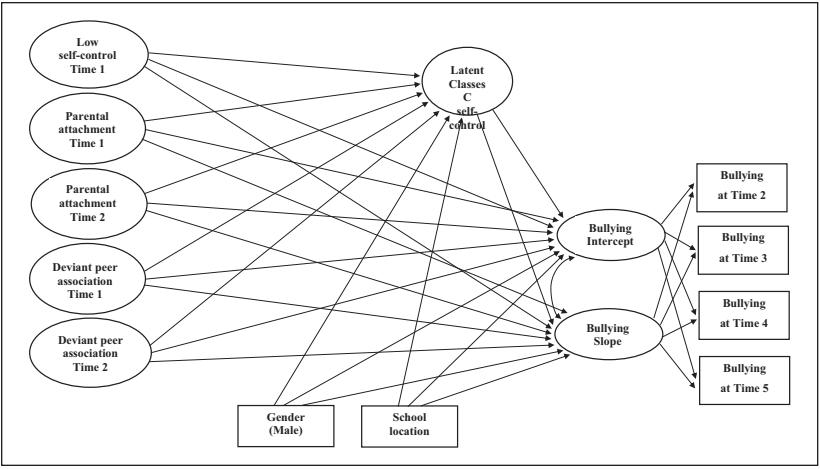
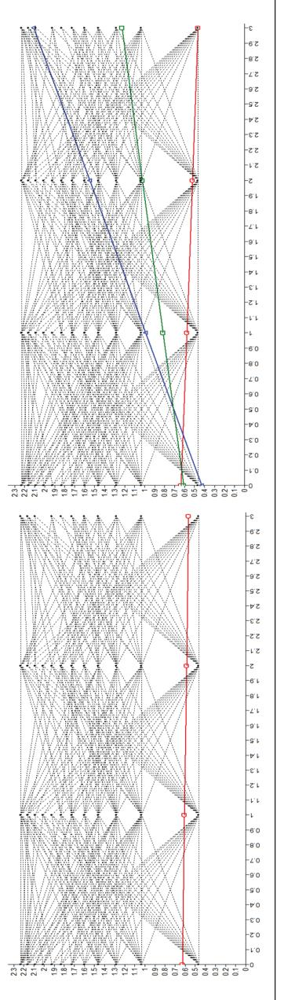
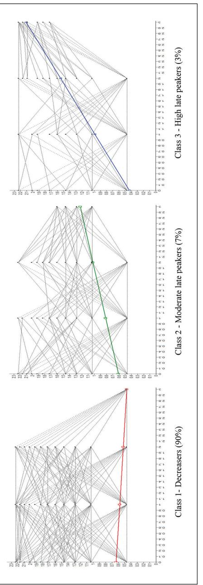

*research-article*2018

### *Original Research*

**Impacts of Low Self-Control and Delinquent Peer Associations on Bullying Growth Trajectories Among Korean Youth: A Latent Growth Mixture Modeling Approach**

https://doi.org/10.1177/0886260518786495 Journal of Interpersonal Violence 2021, Vol. 36(7-8) NP4139–NP4169 © The Author(s) 2018 Reprints and permissions: sagepub.com/journalsPermissions.nav DOI: 10.1177/0886260518786495 journals.sagepub.com/home/jiv

**Sujung Cho1 and Jin Ree Lee2**

#### **Abstract**

The emergence of studies applying Gottfredson and Hirschi's (1990) selfcontrol theory to offending behaviors has produced empirical support confirming the position that individuals with low self-control are more likely to engage in deviant behaviors. However, few have examined its effects with opportunity factors. The present study examines the time-invariant effect of low self-control, as well as the time-concurrent and lagged effects of opportunity factors (parental attachment and delinquent peer associations), on bullying growth trajectories. The findings in the latent growth curve analysis demonstrate that low self-control is significantly related to both the initial levels and change in bullying over time, even after controlling for delinquent peer associations in homogeneous populations. The new approach described within the latent class growth modeling framework (i.e., growth mixture) incorporates a categorical latent trajectory variable representing latent classes (i.e., distinct subgroups), having similar patterns

1Southern Illinois University, Carbondale, USA 2Michigan State University, East Lansing, USA

**Corresponding Author:**

Sujung Cho, Department of Criminology and Criminal Justice, Southern Illinois University, 1000 Faner Drive Faner Hall, Mail Code 4504, Carbondale, IL 62901, USA. Email: sujung.cho@siu.edu

of bullying growth trajectories. Three groups of students emerged from the student-reported data at five time points from ages 11 to 15, *decreasers* (90%), *moderate late peakers* (7%), and *high late peakers*(3%), defined by different predictors and sequelae. Low self-control was rendered insignificant for both *moderate late peakers* and *high late peakers* relative to *decreasers*; delinquent peer associations had a time-concurrent effect for *moderate late peakers* than *decreasers;* and *high late peakers* had a time-lagged effect relative to *moderate late peakers.*

### **Keywords**

bullying growth trajectories, deviant peer association, delinquency, low selfcontrol, latent growth mixture modeling

## **Introduction**

Gottfredson and Hirschi's (1990) self-control theory contends that individuals with less self-control are more likely to engage in deviant behavior when opportunity is presented. Numerous theoretical and empirical research have taken liberties to test self-control theory on various deviant behaviors (Choi, Lee, & Lee, 2017; Holtfreter, Reisig, Piquero, & Piquero, 2010; Turner, Piquero, & Pratt, 2005; Yun, Kim, & Kwon, 2016). Despite opportunity being a key mechanism that must exist for deviant behavior to occur, many studies have insufficiently addressed the concept of opportunity and the relationship between low self-control and opportunity in explaining the etiology of deviant behaviors (see Seipel & Eifler, 2010). That is, many studies using low self-control theory to examine deviant behaviors have neglected to detail the importance of opportunity (i.e., where and how opportunities are formed) in producing deviant behavior. Failing to consider the opportunity factor would suggest an incomplete analysis, and one that is inconsistent from the theorists' original proposition.

Accompanying this growing popularity of applying self-control theory to deviant behavior, several empirical studies have also supported the notion that individuals with less self-control are more likely to engage in bullying behaviors (Chui & Chan, 2013, 2015; Haynie et al., 2001; Moon, Hwang, & McCluskey, 2011). However, a limited number of studies have examined the potential effects of opportunity factors on bullying within the context of selfcontrol theory.

The present study is designed to address the aforementioned theoretical limitation within the bullying and low self-control literature. It extends previous research by integrating self-control theory with the opportunity perspective within a unique South Korean context. Most studies have been conducted using a cross-sectional design that make comparisons at a single point in time. Furthermore, research involving longitudinal designs on this topic seldom exist. This is coupled by the fact that relatively few studies employ latent growth curve models (i.e., latent variable random coefficient growth models) that are better suited to investigate random-effect models such as the intra-individual differences in growth curves, inter-individual differences in change, and correlates of change, compared with the fixedeffect models. Using a 5-year longitudinal panel data of Korean adolescents between the ages of 11 and 15, this study attempts to remove some of the spuriousness generated from the estimated time-concurrent and time-lagged effects of opportunity factors on bullying, while also controlling for low self-control. By providing insight into a mixture of distinct subgroups each having unique patterns of bullying growth trajectories *within* the subgroup, as well as different predictors and sequelae *across* subgroups—the current study underscores the need to consider its heterogeneity. Finally, the current study employs a new approach described within latent growth mixture modeling (LGMM) that extends latent growth curve models to incorporate a categorical latent trajectory variable representing latent classes (distinct subgroups) of bullying growth trajectories in populations that consist of a mixture of unobserved, homogeneous subgroups.

# **Literature Review**

# *Self-Control Theory*

Gottfredson and Hirschi's (1990) low self-control theory examines individual motivations for deviant behavior. The theory posits that individuals with low self-control generally do not need specific motivations to engage in deviant behavior. Taking Gottfredson and Hirschi's (1990) ideas at face value, as an individual's behavior is primarily motivated by an action's inherent costs and benefits, all people require is a personal evaluation that the deviant behavior will provide more pleasure than pain (Schreck, 1999). Gottfredson and Hirschi (1990) outline six core indicators of low self-control: (a) degree of future orientation, (b) empathy, (c) tolerance for frustration, (d) diligence, (e) preference for mental rather than physical activity, and (f) risk avoidance (see also Schreck, 1999). Although other scholars have identified these six characteristics using different labels and titles, all renditions of the essential six elements are consistent in bearing the same meaning and measures of assessment—namely, that a lack in any six of these elements result in higher levels of victimization.

An often-understated article embedded within this theory is its emphasis on the role of parents and their ability to influence individuals' evaluations of deviant behavior. A failure to positively impact a child's perception at a young age can lead to the child making deviant peer groups in the future. In essence, low self-control theory can be thought of as poor and/or ineffective parental management styles that lead to decreasing levels of self-control that impact an individual's inclination toward deviant behavior.

Gottfredson and Hirschi (1990) were also concerned with opportunity as a key mechanism that must exist for deviant behavior to occur. They claim that individuals with low self-control are more likely to engage in deviant behavior when opportunity is present. However, Gottfredson and Hirschi (1990) do not explain these opportunities in depth (see Seipel & Eifler, 2010). In fact, the theorists only indicate that individuals with low self-control are more likely to engage in deviant behavior when opportunity is present without clarifying the concept of opportunity, how opportunity is operationalized, and the relationship between low self-control and opportunity (see Seipel & Eifler, 2010).

### *Opportunity Perspectives*

The opportunity perspective comes from the theoretical ideology that explains victimization through the lifestyles and routine activities of individuals (Miethe & Meier, 1990). Opportunity perspectives propose that certain risky lifestyles and routine activities increase victimization by enhancing the contact individuals have with motivated offenders. These lifestyles and behavioral patterns determine the amount of contact people have with offenders, thus substantially impacting their chances of victimization (Miethe & Meier, 1990). Stated differently, certain changes in lifestyles are assumed to engender opportunities of victimization by increasing the level of exposure and proximity they have with motivated offenders (Felson & Cohen, 1980; Messner & Blau, 1987). In short, the opportunity perspective presumes that victimization requires more than the presence of a motivated offender—that is, motivated offenders cannot conduct deviant behavior unless opportunities present themselves (Madero-Hernandez & Fisher, 2012).

Current opportunity perspectives accentuate the importance of physical proximity to offenders, exposure to high-risk environments, target suitability, and the absence of capable guardianship as necessary elements for victimization. The value of a target and its level of guardianship determines the choice of a particular victim (Garofalo, 1987; Hough, 1987). That is, while routine behavioral patterns predispose various individuals and their property to greater risk, the selection of a particular victim is determined by the subjective utility of one target over another (Miethe & Meier, 1990). The opportunity perspective highlights both the macro-dynamic forces that provide opportunity structures and the micro-level aspects that engender the selection of particular targets (Miethe & Meier, 1990).

Despite the significance of the opportunity factor, only a small number of studies have examined the effects of opportunity on victimization and its interaction with low self-control (Longshore, 1998; Longshore & Turner, 1998; Seipel & Eifler, 2010; Smith, 2004). Among the few that were conducted, inconsistent conclusions were drawn regarding the relationship between self-control and opportunity (i.e., Longshore, 1998; Longshore & Turner, 1998; Seipel & Eifler, 2010; Smith, 2004). For instance, Smith (2004) found that college students with low self-control were more likely to cheat when opportunities were presented to them. Longshore and Turner (1998), on the contrary, found that while the interaction effect between low self-control and opportunity on fraud was significant, there was no significant interaction effect between low self-control and opportunity on actions involving force.

### *Impact of Low Self-Control and Opportunity on Bullying*

Empirical studies examining the relationship between low self-control and bullying behaviors have witnessed strong support (Chui & Chan, 2013; Endresen & Olweus, 2001; Haynie et al., 2001; Jolliffe & Farrington, 2011; Moon et al., 2011; Slee & Rigby, 1993b). For one, Chui and Chan (2013) found bullying perpetration to be negatively associated with participants' level of self-control. That is, the lower the self-control, the more likely they were to engage in bullying perpetration. This association is further supported by Moon and Alarid (2015) in their finding that youth with lower levels of self-control were more likely to engage in both physical and psychological bullying.

In terms of bullying victimization, Cho (2017) reported that youth with less self-control were generally at higher risk of being victimized by collective and verbal bullying, even after controlling for opportunity factors. Chui and Chan's (2015) study mirrored this finding, as their study found that lower self-control was related to higher bullying victimization. In general, a large number of studies found support for the notion that individuals with high impulsivity and/or lacking empathy are more likely to become both offenders and victims of bullying (Jolliffe & Farrington, 2011; Slee & Rigby, 1993a).

Among the few studies that examined self-control and opportunity factors on bullying, Moon and Alarid (2015) found that while youths with low selfcontrol were more likely to physically and psychologically bully others, stronger explanations of bullying were found when opportunity measures were introduced (i.e., parental supervision, association with other bullies, negative school environment, and disciplinary measures used by teachers). In terms of bullying victimization, Cho (2017) reported that youths with low self-control were generally at higher risk of being collectively and verbally bullied even after controlling for opportunity factors. Furthermore, she found that youth with more frequent associations with bullies during the previous year were generally at higher risk of later collective and verbal bullying victimization, while low self-control had a significant effect, unmediated by the opportunity factors.

With regard to self-control, opportunity, and bullying, Chui and Chan (2015) found that participant living arrangements were significantly related to their involvement in bullying perpetration. This is important because one's living arrangement impacts the opportunity factors that one has available to engage and/or desist from bullying behaviors. Similarly, Holt, Turner, and Exum (2014) found that while low self-control was associated with bullying victimization, its impact was partially mediated by neighborhood disorganization factors when they were included in the same model. These studies underscore the importance of considering economic and social decay within neighborhoods as these elements contribute to the opportunity factors involved in bullying perpetration and victimization.

It is worth noting that current theory on bullying has emphasized the concept of proactive aggression in youth who bully (Jara, Casas, & Ortega-Ruiz, 2017; Salmivalli & Nieminen, 2002). That is, recent studies on bullying have distinguished between proactive levels of aggression with reactive levels of aggression in youth who bully. A simplified way of understanding proactive aggression is to compare it directly with reactive aggression—the former implying the presence of aggression prior to an act taking place, whereas the latter suggests aggression stemming from a response to another behavior. In this respect, Gottfredson and Hirschi's (1990) conceptualization of low selfcontrol supports this notion of proactive aggression in youth who bully as low self-control is a latent trait that develops early on in childhood (by the age of 8-10) and remains relatively stable throughout adulthood. In other words, low self-control does not emerge in the form of aggression only in response to certain behaviors when prompted, but instead, it is inherent in the individual regardless of provocation and/or triggering behavior. Consistent with the low self-control literature, recent bullying literature has supported the notion that bullies are more likely to have proactive aggression—rather than reactive aggression—given that it is usually the bully who initiates the aggressive behavior (Jara et al., 2017; Salmivalli & Nieminen, 2002).

Recent bullying theory has also emphasized the concept of superior social skills of youth who bully. That is, bullying behavior requires strategy based on social power and skill. In this respect, research examining bullying among Korean youth have primarily focused on the peer group rejection form of bullying that occurs within social groups when peers are present (i.e., known as "pack bullying" and "collective bullying"). Thus, the importance of peer association and peer groups in bullying is an imperative concept in recent literature examining the bullying phenomenon. Superior social skill, however, seems contrary to the theory of low self-control, in that youths with low self-control are predicted to lack the sufficient social skills needed to form strong peer bonds with nondelinquent youths. Therefore, rather than explaining bullying as the direct result of one's level of self-control, this study focuses on the mediating effect of differential peer groups on low self-control and bullying.

## *Growth Trajectories of Bullying*

Studies involving growth trajectory research have identified individual differences in behavioral change and the importance of understanding the dynamic process involved in the development of human behavior. Despite numerous reports indicating the frequency of bullying among youth and adolescent populations, longitudinal growth trajectory studies have suggested that only a few individuals are chronically involved in bullying, the majority falling within groups that report no or low levels of bullying perpetration (i.e., Sourander, Helstelä, Helenius, & Piha, 2000). A deeper analysis into growth trajectories of bullying shows a peak in bullying during the transition from elementary to middle school (Pellegrini, 2004). The peak in bullying during this stage is partly explained by the destabilization of dominance structures within the student group (Pellegrini, 2004). Nansel and colleagues (2001) suggested that, with the development of social understanding and shifting norms within the peer group, bullying tends to decrease to lower levels toward the end of high school. Other studies, such as the one conducted by Feldman and colleagues (2014), found that engagement in bullying behaviors during middle school may be associated with adjustment difficulties during high school via lower achievement and behavioral difficulties in middle school (see Hilliard et al., 2014, and Lee, Liu, & Watson, 2016, for other examples of studies using development trajectory models to examine bullying among youth in primary and junior high school).

Longitudinal studies that had applied the growth curve model to bullying perpetration and victimization had specifically considered both the intra-individual and inter-individual differences of changes in bullying. For instance, a study conducted by Cho and Wooldredge (2016) found that inter-individual changes in bullying victimization were explained by low self-control as well as the initial status and changes in risky lifestyles—showing a link between individual differences across people and their initial proneness for bullying. In another study, Cho (2018) found that the starting point of associating with deviant peers among fourth graders coincided with decreased rates of bullying perpetration and victimization.

In addition, some studies adopted a growth mixture modeling or related semiparametric group-based modeling approach to better understand heterogeneity in bullying perpetration and victimization. These populations consisted of a mixture of distinct subgroups defined by their developmental processes that cannot be determined by latent grow curve modeling. These group-based trajectory studies have generally found evidence for three to five distinct developmental trajectories of involvement in bullying and victimization across time, which typically includes a low/stable trajectory group and a high/chronic trajectory group, along with other groups that are defined by increased or decreased involvement over time (Barker et al., 2008; Goldbaum, Craig, Pepler, & Connolly, 2003; Lee et al., 2016; Reijntjes et al., 2013). Children who frequently engage in bullying over extended lengths of time are said to have learned how to use power and aggression to control and distress others (Pepler, Jiang, Craig, & Connolly, 2008). This is concerning because such interaction styles may persist into adolescence and adulthood. As a result, many growth trajectory studies have suggested for interventions that focus on both developmental (i.e., child's behavior, social cognitions, and social problem-solving skills) and contextual factors (i.e., relationships with parents and peer groups) (Pepler et al., 2008; Pepler, 2006).

# **Present Study**

The present study attempted to test self-control theory on the changes in bullying, using 5-year panel data of Korean youth between the ages of 11 and 15. This study examined the relations between both time-invariant low self-control and the time-varying opportunity factors on bullying growth over time. With LGMM, the present study sought to identify growth trajectories of bullying in both a homogeneous youth population and a heterogeneous youth population whose membership must be inferred from the data. This study then sought to assess whether low self-control significantly predicted bullying growth trajectories. Finally, given the significant relations between low self-control and bullying growth trajectories, both of the time-varying opportunity factors were included in a full model. This study provides a didactic example of the growth mixture modeling approach, which is shown to consist of a mixture of latent classes (distinct subgroups), defined by unique bullying growth trajectories and different predictors and sequelae. The research hypotheses are as follows:

**Hypothesis 1 (H1):** Multiple growth trajectories of bullying that can be attributed to the existence of unobserved *heterogeneous* subgroups will be identified.

**Hypothesis 2 (H2):** Low self-control will be significantly related to the membership of different bullying growth trajectory subgroups identified in the LGMM approach.

**Hypothesis 3 (H3):** The time-varying (time-concurrent and time-lagged) opportunity factors such as parental attachment and delinquent peer associations will significantly predict the latent class membership of bullying growth trajectories within the *heterogeneous* subpopulations.

# **Method**

## *Data and Sample*

Data from the Korean Youth Panel Study (KYPS) were used in this inquiry. The KPYS is a longitudinal study, compiled by the National Youth Policy Institute in South Korea. Participants were students between the fourth and eighth grade from 2004 to 2008, producing five waves of data. Data were obtained through personal surveys with the sampled students and through phone interviews with their caregivers. Data were collected using a stratified, multistage cluster design to obtain a nationally representative sample of Korean adolescents. Elementary schools were stratified by the sampled regions in Seoul and 14 other metropolitan areas, and were sampled proportionate to size based on the average number of students in each fourth-grade class. Surveys during Time 1 were administered from November through December of 2004 and consisted of a sample of 2,844 adolescents at age 11. Time 2 surveys in 2005 were administered to the same subjects of Time 1 and each year concluding in 2008. A total of 4.82% were missing data at Time 2, 6.10% at Time 3, and 11.7% at Time 4. The attrition rate from Time 1 to Time 5 was approximately 14%. Study participants were 54% males and 46% females. Ninety-five percent of participants had both a biological father and mother present in their lives and 18% of participants lived in Seoul.

## **Measures**

## *Dependent Variable*

*Bullying perpetration* was assessed between Times 2 and 5, using a four-item measure on a continuous scale: (a) "bullied others with a group of individuals during the last year," (b) "severely teased individuals during the last year," (c) "threatened individuals during the last year," and (d) "stole/took someone's things during the last year." The first item of this measure is consistent with literature suggesting that bullying occurs with other individuals and/or within a group (Espelage, Holt, & Henkel, 2003), while the other three items are typical descriptors reflecting victimization by verbal and physical aggression, as identified by Olweus (1994). A total score was formed by summing up the amount across those four items at each time point. The distribution of the summed scales was skewed to the right and was transformed by taking the cube root of the original values to normalize the distribution of the composite scores. All variables for the analysis are described in Table 1.

### *Independent Variables*

*Low self-control* was measured with 21 items from Time 1. Items included "I abandon a task once it becomes hard and laborious to do," "I enjoy risky activities," and "I lose my temper whenever I get angry" (see Table 1). Those items were derived from Gottfredson and Hirschi's (1990) three domains of self-control: "temper," "risk seeking," and "impulsivity." The responses were designed on a 5-point Likert-type scale. Values ranged from *strongly disagree* (1) to *strongly agree* (5). The internal consistency estimate for this measure was .85. A principal components analysis was conducted to create a single construct, with a higher value on this latent variable reflecting less self-control.

*Parental attachment* for the first two assessment years was generated using 10-items, involving several questions to assess affective and cognitive dimensions of parent–youth relationships. Six examples included the following: (a) "My parents and I try to spend much time together," (b) "My parents always treat me with love and affection," (c) "My parents and I understand each other well," (d) "My parents and I candidly talk about everything," (e) "I frequently talk about my thoughts and what I experience away from home with my parents," and (f) "My parents and I have frequent conversation." The variable also involved four items assessing parental knowledge of adolescent activities: "When I go out, my parents usually know where I am, whom I am with, what I am doing, and when I return" (Stattin & Kerr, 2000, p.1074). Those items were measured using a 5-point Likert-type scale, ranging from *very untrue* (1) to *very true* (5). The internal consistency estimate for this measure was .83 at Time 1 and .86 at Time 2. A principal components analysis was conducted to create a single construct, with a higher value reflecting closer parental attachment.

*Delinquent peer associations* for the first two assessment years were evaluated using 10 items measured on a continuous scale that asked participants about the frequency of their close friends' engagement in the following

|                                                               |                       | Wave 1     | Wave 2     | Wave 3    | Wave 4     | Wave 5      |
|---------------------------------------------------------------|-----------------------|------------|------------|-----------|------------|-------------|
| Variable                                                      | Scale                 | M (SD)     | M (SD)     | M (SD)    | M (SD)     | M (SD)      |
| Bullying Perpetration                                         | Continuous            | 0.7 (0.5)  | 0.6 (0.4)  | 0.6 (0.4) | 0.6 (0.4)  | 0.6 (0.3)   |
| Collectively bullying others                                  |                       | 0.4 (2.1)  | 0.4 (4.3)  | 0.4 (3.3) | 0.3 (6.0)  | 0.2 (2.5)   |
| Severely teasing or bantering others                          |                       | 0.7 (3.7)  | 0.8 (10.7) | 0.5 (6.9) | 1.0 (14.1) | 1.1 (21.5)  |
| Threatening others                                            |                       | 0.1 (1.2)  | 0.04 (0.4) | 0.1 (0.9) | 0.1 (4.9)  | 0.1 (2.0)   |
| Severely beating others                                       |                       | 0.1 (0.8)  | 0.2 (3.8)  | 0.1 (0.7) | 0.1 (0.7)  | 0.1 (0.7)   |
| Stealing something                                            |                       | 0.02 (0.2) | 0.03 (0.5) | 0.1 (0.7) | 0.1 (1.0)  | 0.1 (1.1)   |
| Low self-control (latent variable of.)                        |                       |            |            |           |            |             |
| I jump into exciting things even if I have to take an         | 1 =-strongly disagree | 2.6 (1.3)  | 2.8 (1.3)  | 2.9 (1.2) | 2.7 (1.2)  | 2.9 (1.2)   |
| examination tomorrow                                          | 2 = disagree          |            |            |           |            |             |
| I abandon a task once it becomes hard and laborious to do     | 3 = neither           | 2.2 (1.1)  | 2.4 (1.0)  | 2.4 (1.0) | 2.5 (1.0)  | 2.6 (1.0)   |
| I am apt to enjoy risky activities                            | 4 = agree             | 2.0 (1.2)  | 2.2 (1.2)  | 2.3 (1.1) | 2.3 (1.1)  | 2.4 (1.1)   |
| I enjoy teasing and harassing other                           | 5 = strongly agree    | 1.8 (0.9)  | 2.0 (1.0)  | 2.1 (1.0) | 2.1 (1.0)  | 2.2 (1.0)   |
| I lose my temper whenever I get angry                         |                       | 2.4 (1.3)  | 2.5 (1.2)  | 2.6 (1.2) | 2.6 (1.2)  | 2.6 (1.2)   |
| I don't do my homework habitually                             |                       | 2.3 (1.2)  | 2.3 (1.2)  | 2.3 (1.1) | 2.5 (1.5)  | 2.5 (1.1)   |
| I am under great anxiety due to study                         |                       | 2.7 (1.2)  | 2.7 (1.2)  | 3.0 (1.1) | 3.4 (1.1)  | 3.4 (1.0)   |
| I am not interested in school work, and find it difficult to  |                       | 1.9 (1.0)  | 2.0 (1.0)  | 2.2 (0.9) | 2.5 (1.0)  | 2.6 (1.0)   |
| catch up                                                      |                       |            |            |           |            |             |
| I often feel lonely even if there are many students at school |                       | 2.0 (1.1)  | 1.9 (1.1)  | 2.0 (1.0) | 2.0 (1.0)  | 2.1 (1.0)   |
| I may hit other people when I feel annoyed                    |                       | 2.9 (1.2)  | 3.0 (1.2)  | 3.1 (1.1) | 3.2 (1.1)  | 3.2 (1.1)   |
| I will hit back at a person who hits me                       |                       | 3.4 (1.1)  | 3.4 (1.1)  | 3.4 (1.1) | 3.6 (1.0)  | 3.5 (1.0)   |
| I fight more frequently than others do                        |                       | 1.8 (0.9)  | 1.8 (0.9)  | 1.9 (.9)  | 1.9 (.9)   | 1.9 (1.0)   |
| I am often seized by an impulse to throw an object            |                       | 2.1 (1.3)  | 2.2 (1.3)  | 2.5 (1.3) | 2.7 (1.3)  | 2.7 (1.3)   |
| whenever I get angry                                          |                       |            |            |           |            |             |
| Sometimes I can't suppress an impulse to hit other people     |                       | 2.1 (1.2)  | 2.1 (1.1)  | 2.2 (1.1) | 2.2 (1.1)  | 2.1 (1.1)   |
| I consider myself as an explosive soon to be blown off        |                       | 1.9 (1.1)  | 2.0 (1.1)  | 2.0 (1.1) | 2.0 (1.0)  | 2.0 (1.1)   |
| I am not interested in anything                               |                       | 2.0 (1.0)  | 2.0 (1.0)  | 2.1 (1.0) | 2.1 (1.0)  | 2.1 (0.9)   |
|                                                               |                       |            |            |           |            | (continued) |

**Table 1.** Description of the South Korean Youth Sample (*N* = 2,844).

|                                                                                                                                                                                                                                                                                                                                                                                                                                                                                                                                                                                                                                                                                                                                                                                                                                                 |                                                                                                                | Wave 1                                                                                                                                                                              | Wave 2                                                                                                                                                                              | Wave 3                                                                                                                                                                              | Wave 4                                                                                                                                                                            | Wave 5                                                                                                                                                                             |
|-------------------------------------------------------------------------------------------------------------------------------------------------------------------------------------------------------------------------------------------------------------------------------------------------------------------------------------------------------------------------------------------------------------------------------------------------------------------------------------------------------------------------------------------------------------------------------------------------------------------------------------------------------------------------------------------------------------------------------------------------------------------------------------------------------------------------------------------------|----------------------------------------------------------------------------------------------------------------|-------------------------------------------------------------------------------------------------------------------------------------------------------------------------------------|-------------------------------------------------------------------------------------------------------------------------------------------------------------------------------------|-------------------------------------------------------------------------------------------------------------------------------------------------------------------------------------|-----------------------------------------------------------------------------------------------------------------------------------------------------------------------------------|------------------------------------------------------------------------------------------------------------------------------------------------------------------------------------|
| Variable                                                                                                                                                                                                                                                                                                                                                                                                                                                                                                                                                                                                                                                                                                                                                                                                                                        | Scale                                                                                                          | M (SD)                                                                                                                                                                              | M (SD)                                                                                                                                                                              | M (SD)                                                                                                                                                                              | M (SD)                                                                                                                                                                            | M (SD)                                                                                                                                                                             |
| Sometimes I feel extremely anxious with no apparent reason Sometimes I feel extremely lonely with no apparent reason I frequently talk about my thoughts and what I experience When I go out, parents usually know whom I am with When I go out, parents usually know what I am doing When I go out, parents usually know when I return My parents always treat me with love and affection My parents and I try to spend much time together When I go out, parents usually know where I am My parents and I candidly talk about everything My parents and I have frequent conversations My parents and I understand each other well Parental attachment (latent variable of.) away from home with my parents Cronbach's alpha reliability Cronbach's alpha reliability I worry about everything | 2 = somewhat untrue 3 = neither true nor 4 = somewhat true 1 = very untrue 5 = very true untrue | 2.5 (1.2) 2.3 (1.3) 2.1 (1.2) 3.7 (1.1) 4.2 (0.9) 3.9 (1.0) 3.2 (1.2) 3.6 (1.2) 3.8 (1.1) 3.7 (1.2) 3.4 (1.2) 3.3 (1.2) 3.4 (1.2) .85 .83 | 2.5 (1.2) 2.3 (1.2) 2.1 (1.2) 3.7 (1.0) 4.0 (0.9) 3.8 (1.0) 3.3 (1.2) 3.6 (1.2) 3.8 (1.1) 3.7 (1.1) 3.5 (1.2) 3.4 (1.2) 3.5 (1.2) .86 .86 | 2.6 (1.1) 2.4 (1.2) 2.2 (1.2) 3.6 (1.0) 4.0 (0.9) 3.7 (1.0) 3.4 (1.1) 3.6 (1.1) 3.8 (1.0) 3.7 (1.0) 3.7 (1.0) 3.5 (1.1) 3.5 (1.1) .86 .88 | 2.7 (1.1) 2.4 (1.2) 2.3 (1.1) 3.5 (1.0) 3.8 (0.9) 3.6(1.0) 3.3 (1.1) 3.5 (1.1) 3.7 (1.0) 3.7 (1.0) 3.6 (1.0) 3.4 (1.1) 3.4(1.1) .86 .90 | 2.7 (1.1) 2.4 (1.2) 2.4 (1.2) 3.5 (0.9) 3.8 (0.9) 3.5 (1.0) 3.3 (1.1) 3.4 (1.1) 3.6 (1.0) 3.6 (1.0) 3.6(1.0) 3.5 (1.0) 3.4 (1.0) .87 .91 |
|                                                                                                                                                                                                                                                                                                                                                                                                                                                                                                                                                                                                                                                                                                                                                                                                                                                 |                                                                                                                |                                                                                                                                                                                     |                                                                                                                                                                                     |                                                                                                                                                                                     |                                                                                                                                                                                   | (continued)                                                                                                                                                                        |

# **Table 1. (continued)**

|                                                              |            | Wave 1     | Wave 2    | Wave 3      | Wave 4    | Wave 5    |
|--------------------------------------------------------------|------------|------------|-----------|-------------|-----------|-----------|
| Variable                                                     | Scale      | M (SD)     | M (SD)    | M (SD)      | M (SD)    | M (SD)    |
| Delinquent peer associations (latent variable of.)           |            |            |           |             |           |           |
| Illegal or reckless walking across of a roadway (jaywalking) |            | 1.7 (3.1)  | 2.7 (4.3) | 3.0 (4.2)   | 3.5 (4.8) | 3.9 (4.9) |
| Intentional free riding on a bus or on a subway              |            | 0.02 (0.3) | 0.2 (1.4) | 0.2 (1.2)   | 0.5 (1.9) | 0.5 (1.8) |
| Defying a teacher with shouting                              |            | 0.3 (1.0)  | 0.6 (2.2) | 0.5 (1.6)   | 0.6 (1.7) | 0.7 (2.3) |
| Cheating on an examination                                   |            | 0.4 (1.1)  | 0.4 (1.4) | 0.5 (1.4)   | 0.3 (1.1) | 0.3 (1.2) |
| Having unexcused absence                                     |            | 0.5 (1.2)  | 0.5 (1.4) | 0.3 (1.2)   | 0.3 (1.0) | 0.3 (1.3) |
| Misappropriating the expenses for stationery and school      |            | 0.5 (1.5)  | 0.6 (1.7) | 0.5 (1.7)   | 0.5 (1.7) | 0.6 (2.2) |
| necessity                                                    |            |            |           |             |           |           |
| Collectively bullying                                        |            | 0.7 (2.1)  | 1.0 (3.9) | 0.8 (2.3)   | 0.7 (2.5) | 0.5 (1.9) |
| Severely teasing or bantering others                         |            | 0.7 (2.1)  | 1.0 (3.4) | 0.7 (2.1)   | 0.6 (2.2) | 0.5 (1.8) |
| Threatening others                                           |            | 0.3 (1.4)  | 0.4 (1.6) | 0.2 (1.1)   | 0.3 (1.4) | 0.2(1.6)  |
| Watching obscene materials (adult cartoon, picture,          |            | 0.1 (0.8)  | 0.3 (1.9) | 0.4 (1.8)   | 1.1 (2.8) | 1.2 (3.3) |
| video clip, film)                                            |            |            |           |             |           |           |
| Drinking                                                     |            | 0.1 (0.6)  | 0.1 (1.2) | 0.1 (0.9)   | 0.3 (1.4) | 0.6 (2.3) |
| Smoking                                                      |            | 0.1 (.5)   | 0.1 (1.1) | 0.2 (.8)    | 0.4 (1.5) | 0.6 (2.1) |
| Severely beating others                                      |            | 0.2 (1.0)  | 0.2 (1.3) | 0.1 (0.6)   | 0.1 (0.8) | 0.1 (1.0) |
| Robbing                                                      |            | 0.1 (0.7)  | 0.2 (1.6) | 0.2 (0.8)   | 0.3 (1.3) | 0.3 (1.6) |
| Stealing                                                     |            | 0.1 (0.6)  | 0.2 (1.2) | 0.2 (.8)    | 0.2 (1.3) | 0.2 (1.1) |
| Running away                                                 |            | 0.1 (0.4)  | 0.1 (1.1) | 0.1 (0.5)   | 0.2 (1.0) | 0.2 (1.1) |
| Cronbach's alpha reliability                                 |            | 0.73       | 0.87      | 0.77        | 0.83      | 0.88      |
| Control variables                                            |            |            |           |             |           |           |
| Sex (Male)                                                   | 0 = no     |            |           | 0.54 (0.49) |           |           |
|                                                              | 1 = yes    |            |           |             |           |           |
| School location (Seoul)                                      | 0 = others |            |           | 0.2 (0.4)   |           |           |
|                                                              | 1 = Seoul  |            |           |             |           |           |

**Table 1. (continued)**

delinquent behaviors during the last year: (a) "illegally or recklessly walking crossing the street (jaywalking)," (b) "riding the bus or subway without paying," (c) "defying a teacher by shouting," (d) "cheating on an exam," (e) "having unexcused absences," (f) "drinking," (g) "smoking," and (h) "running away." The satisfactory internal reliability of the delinquent peer associations measure demonstrated .73 at Time 1 and .87 at Time 2. A principal components factor analysis was conducted to create a single construct, with a higher value reflecting more frequent delinquent peer associations.

Biological sex and school location were included in the analyses. Biological sex was coded as 0 for girls and 1 for boys, while school location was assessed using a dichotomous response (1 = Seoul and 0 = others).

## **Analysis**

Latent growth modeling (LGM) and LGMM were conducted utilizing M*plus* 7.4 (Muthén & Muthén, 2015). LGM assumes that repeated time-structured data are sampled from a homogeneous population, and a single developmental trajectory from the initial level over time best describe the growth parameters (the average starting point [intercept] and rate of change [slope]). The first stage of this study estimated a longitudinal analysis of whether low selfcontrol and time-specific effects of opportunity factors corresponded with the bullying growth trajectory in the homogeneous population.

LGMM assumes that the data were sampled from a heterogeneous population that consists of a *mixture* of heterogeneous subpopulations (i.e., different individuals belonging to different subpopulations), each having a unique growth trajectory (Peugh & Fan, 2012). The second stage involved estimating time-specific influences of covariates on the bullying growth trajectories to differ across latent classes. The right portion of the model containing the latent continuous growth factors (bullying intercept and slope) represent conventional growth curve modeling with four indicators of bullying, measured at four time points. The arrows from the latent categorical class factors (C) to two growth factors indicate an unconditional growth mixture model (i.e., a model with no predictors) designed to capture latent growth trajectory classes. Predictors can be incorporated to show how latent continuous growth curves and latent class variables can be explained by the predictors. In the model, the directional arrows from the latent classes (C) can be seen as representing latent class membership influences on the arrows from low self-control and the opportunity factors to the latent continuous variables (see Figure 1).

When unobserved population heterogeneity is assumed, the number of latent (unobserved) subpopulation groups (classes) need to be identified.1 Multiple statistical indices are available to determine the appropriate number

**Figure 1.** Graphical representation of the latent growth mixture model.

of latent growth trajectories in the heterogeneous population, following three general categories: (a) information criteria (IC) statistics, (b) likelihood ratio tests (LRT) statistics, and (c) entropy. After identifying a finite number of unobserved subgroups in bullying growth trajectories, the primary analysis was conducted to examine impacts of covariates (low self-control and opportunity factors) on latent class membership, controlling for adolescent sex and school location. The relationships between covariates and bullying growth trajectories with unordered categories were described, each contrasting a category of the trajectories with a chosen reference category.

# **Results**

# *Homogeneous Bullying Growth Trajectory*

In the first stage, the LGM analysis was conducted to assess bullying growth trajectories in the homogeneous population that consists of a "mixture" of heterogeneous subpopulations, each having a unique growth trajectory. Table 2 presents the findings of the unconditional LGM. The estimated growth factors' means were as follows: The means of the intercept and slope were 0.657 and −0.023 (a gradually decreasing rate of bulling over time; *p* < .001). It also was found that adolescents who started with higher levels of bullying showed less dramatic declines in bullying over time (*r* = −0.012; *p* < .001).

|  |                           | SRMR RMSEA              | 0.033 0.035           |
|--|---------------------------|----------------------------|--------------------------|
|  | Model Fit                 | TLI                        | 0.907                    |
|  |                           | CFI                        | 0.907                    |
|  |                           | r (Intercept and Slope) | −0.012*** (0.002)        |
|  | Linear Slope              | Variance                   | 0.005*** (0.001)         |
|  |                           | M                          | −0.023*** (0.002)        |
|  |                           | Variance                   | 0.057*** (0.006)         |
|  | Intercept (Initial Level) | M                          | 0.657*** (0.007)         |
|  |                           |                            | perpetration Bullying |

**Table 2.**Univariate Latent Growth Curve Model of Bullying Perpetration. *Note.* Maximum likelihood (ML) coefficients reported with standard errors in parentheses. CFI = comparative fit index; TLI = Tucker–Lewis index; RMSEA = root mean square error of approximation; SRMR = standardized root mean square residual.

\**p* < .05. \*\**p* < .01. \*\*\**p* < .001.

The second step of the first stage involved estimating a longitudinal analysis of whether low self-control and time-specific effects of opportunity factors (e.g., parental attachment and delinquent peer associations) corresponded with the bullying growth trajectory in the homogeneous population. Model 1 in Table 3 presents the findings of the conditional LGM with sex and low selfcontrol. The findings indicate that boys were more likely than girls to engage in bullying (β = .069, *p* < .001) during the fourth grade. Low self-control was significantly related to *both* the initial level and rate of change in bullying over time (β = .006 and β = –.001, *p* < .001). Adolescents with less self-control experienced higher level of bullying during the fourth grade and showed less dramatic declines in bullying over time. Model 2 in Table 3 is a full conditional LGM including the time concurrent (*t*) and lagged (*t* – 1) effects of parental attachment and delinquent peer associations. The findings of Model 2-1 show that sex and low self-control are still significant on the initial level of bullying when opportunity factors are presented (β = .089, *p* < .01; β = .199, *p* < .001). There was *only* the time-lagged effect of delinquent peer associations (β = .158, *p* < .01). Adolescents who had been associated with delinquent peers during the fourth grade were more likely to engage in bullying during the fifth grade. Also, low self-control had a significant effect on the rate of change in bullying over time even after controlling for opportunity factors (β = –.111, *p* < .01, see Model 2-2). In sum, low self-control (LSC) had a significant cross-sectional and longitudinal effect while delinquent peer associations had only a time-lagged effect in the cross-sectional analysis.

## *Heterogeneous Bullying Growth Trajectory*

In the second stage, the LGMM approach was used to identify the heterogeneity of growth trajectories in the heterogeneous subpopulations, each having a unique growth trajectory. In the first step of this stage, we used multiple model fitting indices to determine the optimal model of unobserved bullying growth trajectories (see Table 4). The *relative* model fit2 indicated that the three-class model was the best-fitting model with lower values reflecting better fit. Based on the LRT statistics, the three-class model was selected. The Lo–Mendell–Rubin likelihood ratio test (LRT) and parametric bootstrapped LRT provided statistically significant *p* values indicating that predicted three-class model (H1) provided a better fit than the given two-class model (H0) in two adjacent/nested class models.

The left panel of Figure 2 describes the individual differences in bullying growth trajectories over time within the homogeneous population, showing the model-implied means across the four time points for the single-class model. The right panes describe the average growth for the unobserved threeclass subgroups of bullying growth trajectories.

|                            |               |                    | Model 1 |               |                |       |               |                    | Model 2   |               |                |       |
|----------------------------|---------------|--------------------|---------|---------------|----------------|-------|---------------|--------------------|-----------|---------------|----------------|-------|
|                            |               | Model 1-1          |         |               | Model 1-2      |       |               | Model 2-1          |           |               | Model 2-2      |       |
|                            |               | Bullying Intercept |         |               | Bullying Slope |       |               | Bullying Intercept |           |               | Bullying Slope |       |
|                            | mated Esti | SE                 | OR      | mated Esti | SE             | OR    | mated Esti | SE                 | OR        | mated Esti | SE             | OR    |
| Male) Sex (             | 0.069***      | 0.013              | 1.071   | −0.013        | 0.006          | 0.987 | 0.089**       | 0.03               | 1.093     | −0.041        | 0.035          | 0.960 |
| School location            | 0.001         | 0.001              | 1.001   | 0.001         | 0.001          | 1.001 | 0.013         | 0.028              | 1.013     | −0.054        | 0.035          | 0.947 |
| w self-control Lo       | 0.006***      | 0.001              | 1.006   | −0.001***     | 0.001          | 0.999 | 0.199***      | 0.034              | 1.220     | −0.111**      | 0.039          | 0.895 |
| ment T1 Parental attach |               |                    |         |               |                |       | 0.01          | 0.034              | 1.010     | 0.019         | 0.04           | 1.019 |
| ment T2 Parental attach |               |                    |         |               |                |       | −0.071        | 0.037              | 0.931     | 0.027         | 0.042          | 1.027 |
| Delinquent peer            |               |                    |         |               |                |       | 0.158**       | 0.058              | 71 0.1 | −0.062        | 0.06           | 0.940 |
| associations T1            |               |                    |         |               |                |       |               |                    |           |               |                |       |
| Delinquent peer            |               |                    |         |               |                |       | 0.247         | 0.153              | 1.280     | −0.109        | 72 0.1      | 0.897 |
| associations T2            |               |                    |         |               |                |       |               |                    |           |               |                |       |
| mation Model fit infor  |               |                    |         |               |                |       |               |                    |           |               |                |       |
| C AI                    |               |                    |         | 4,181.253     |                |       |               |                    | 3,981.253 |               |                |       |
| C BI                    |               |                    |         | 4,341.125     |                |       |               |                    | 4,132.125 |               |                |       |
| mple-size adjusted Sa   |               |                    |         | 4,255.337     |                |       |               |                    | 4,023.337 |               |                |       |
| C BI                    |               |                    |         |               |                |       |               |                    |           |               |                |       |

*Note.* Model 1 involves estimating of low self-control, and Model 2 adds opportunity factors into Model 1. OR = odds ratio; AIC = Akaike information criterion; BIC = Bayesian information criterion. \**p* < .05. \*\**p* < .01. \*\*\**p* < .001.

NP4156

|                                  | Entropy                  | 0.999 0.999 1                 |                                                                                                                                                                                                                                                                                                                                                                                                                                                                                                                                                                                                                                                                                                                                                                                                                                                                                                                                                                                                                                                                                                                                                                                                                                                                                                                                                                                                                                                                                                                                                                                                                                                                                                |
|----------------------------------|--------------------------|-------------------------------------|------------------------------------------------------------------------------------------------------------------------------------------------------------------------------------------------------------------------------------------------------------------------------------------------------------------------------------------------------------------------------------------------------------------------------------------------------------------------------------------------------------------------------------------------------------------------------------------------------------------------------------------------------------------------------------------------------------------------------------------------------------------------------------------------------------------------------------------------------------------------------------------------------------------------------------------------------------------------------------------------------------------------------------------------------------------------------------------------------------------------------------------------------------------------------------------------------------------------------------------------------------------------------------------------------------------------------------------------------------------------------------------------------------------------------------------------------------------------------------------------------------------------------------------------------------------------------------------------------------------------------------------------------------------------------------------------|
|                                  | cmP(K)                   | 0.000 0.000 1.000             | WE = approximate                                                                                                                                                                                                                                                                                                                                                                                                                                                                                                                                                                                                                                                                                                                                                                                                                                                                                                                                                                                                                                                                                                                                                                                                                                                                                                                                                                                                                                                                                                                                                                                                                                                                               |
|                                  | (K, K + 1) BF         | 0.000 0.000 0.000             |                                                                                                                                                                                                                                                                                                                                                                                                                                                                                                                                                                                                                                                                                                                                                                                                                                                                                                                                                                                                                                                                                                                                                                                                                                                                                                                                                                                                                                                                                                                                                                                                                                                                                                |
| H0: K classes; H1: K + 1 classes | Boot-strapped p value | <.001 <.001 1                 |                                                                                                                                                                                                                                                                                                                                                                                                                                                                                                                                                                                                                                                                                                                                                                                                                                                                                                                                                                                                                                                                                                                                                                                                                                                                                                                                                                                                                                                                                                                                                                                                                                                                                                |
|                                  | Adjusted LMR p value  | <.001 <.001 1                 | represents the nonsignificant p value, indicating the current model with the smaller number of classes is not rejected); bootstrapped p value = parametric bootstrapped BIC = the Bayesian information criterion (the value shown in bold indicates the model with the smallest value); SABIC = the sample-size adjusted BIC (the value shown class) to a model with one more latent class (k + 1 class); adjusted LMR p value = the adjusted Lo–Mendell–Rubin likelihood ratio test p value (the value shown in bold weight of evidence criterion (the value shown in bold indicates the model with the smallest value); LRTS = likelihood ratio test statistics comparing a current model (k Note. N = 512. LL = model maximum log likelihood value (the value shown in bold indicates that a model with the smallest LL value that perfectly fits the data); npar = a model with the smallest number of classes that is favored over a model with one more latent class); cmP(K) = the approximate correct model probability compared p value for the LRTS; BF = Bayes's factor comparing the current model (k class) to a model with one more latent class (k + 1 class; the value shown in bold indicates number of free parameters estimated in the model; AIC = the Akaike information criterion (the value shown in bold indicates the model with the smallest value); in bold indicates the model with the smallest value); CAIC = consistent AIC (the value shown in bold indicates the model with the smallest value); A with all models (the value shown in bold indicates any models with cmP(K) > .10, showing strong evidence for the correct model. |
|                                  | LRTS                     | 2,766.77 3,124.24 3,789.14    |                                                                                                                                                                                                                                                                                                                                                                                                                                                                                                                                                                                                                                                                                                                                                                                                                                                                                                                                                                                                                                                                                                                                                                                                                                                                                                                                                                                                                                                                                                                                                                                                                                                                                                |
|                                  | WE A                  | 2,571.14 6,462.38 9,660.85    |                                                                                                                                                                                                                                                                                                                                                                                                                                                                                                                                                                                                                                                                                                                                                                                                                                                                                                                                                                                                                                                                                                                                                                                                                                                                                                                                                                                                                                                                                                                                                                                                                                                                                                |
|                                  | CAIC                     | 2,421.85 9,571.27 6,342.94    |                                                                                                                                                                                                                                                                                                                                                                                                                                                                                                                                                                                                                                                                                                                                                                                                                                                                                                                                                                                                                                                                                                                                                                                                                                                                                                                                                                                                                                                                                                                                                                                                                                                                                                |
|                                  | SABIC                    | 2,359.19 9,533.68 6,292.82    |                                                                                                                                                                                                                                                                                                                                                                                                                                                                                                                                                                                                                                                                                                                                                                                                                                                                                                                                                                                                                                                                                                                                                                                                                                                                                                                                                                                                                                                                                                                                                                                                                                                                                                |
|                                  | BIC                      | 2,406.85 9,562.27 6,330.94    |                                                                                                                                                                                                                                                                                                                                                                                                                                                                                                                                                                                                                                                                                                                                                                                                                                                                                                                                                                                                                                                                                                                                                                                                                                                                                                                                                                                                                                                                                                                                                                                                                                                                                                |
|                                  | AIC                      | 2,317.55 9,508.69 6,259.51    |                                                                                                                                                                                                                                                                                                                                                                                                                                                                                                                                                                                                                                                                                                                                                                                                                                                                                                                                                                                                                                                                                                                                                                                                                                                                                                                                                                                                                                                                                                                                                                                                                                                                                                |
|                                  | npar                     | 12 15 9                       |                                                                                                                                                                                                                                                                                                                                                                                                                                                                                                                                                                                                                                                                                                                                                                                                                                                                                                                                                                                                                                                                                                                                                                                                                                                                                                                                                                                                                                                                                                                                                                                                                                                                                                |
|                                  | LL                       | −4,745.35 −3,117.75 −1,143.78 |                                                                                                                                                                                                                                                                                                                                                                                                                                                                                                                                                                                                                                                                                                                                                                                                                                                                                                                                                                                                                                                                                                                                                                                                                                                                                                                                                                                                                                                                                                                                                                                                                                                                                                |
|                                  | classes (k) No. of    | 2 3 1                         |                                                                                                                                                                                                                                                                                                                                                                                                                                                                                                                                                                                                                                                                                                                                                                                                                                                                                                                                                                                                                                                                                                                                                                                                                                                                                                                                                                                                                                                                                                                                                                                                                                                                                                |

**Table 4.**Model Fit Indices of Latent Growth Mixture Models.

After the identification of the final optimal model, the relative proportions of adolescents' average growth for the three-trajectory classes were provided, separately. Figure 3 summarizes the following three latent class memberships: (a) the *decreaser class* (90%) who showed less dramatic declines of bullying over time, (b) the *moderate late peaker class* (7%) who showed gradual increases to a late peak at 15 years of age, and (c) the *high late peaker class* (3%) who showed dramatic increases to much higher level of bullying than the *moderate late peaker class.*

In the second step of this stage, primary data analyses proceeded with the LGMM approach, examining the time-invariant effect of low self-control as well as the time-concurrent and time-lagged effects of opportunity factors (parental attachment and delinquent peer associations) on trajectory-specific levels of bullying. It should be noted that the outcome trajectory variable consisted of unordered categories, and the log-odds of each category's membership were calculated relative to a reference category. This study selected the *decreaser* class as a reference group, meaning that adolescents from the other two classes (*moderate late peakers* and *high late peakers*) were each contrasted with the *decreaser* class. The findings are provided in Table 5. The findings of Model 1 indicate that adolescent males with less self-control at Time 1 are more likely to be *moderate late peakers* than *decreaser* (β = .751 and β = .047, *p* < .001). The same pattern of low self-control was found for *high late peakers* compared with the *decreasers* (β = .427, *p* < .01; β = .036, *p* < .001). However, no discriminative influences of sex and low self-control were found between *moderate late peakers* and *high late peakers*. In Model 2, opportunity factors were added into Model 1. The findings indicated that sex and low self-control were rendered insignificant when the opportunity factors were presented for both *moderate late peakers* and *high late peakers* relative to the *decreasers.* Specifically, adolescents who were associated with delinquent peers at Time 2, engaging in bullying at the same year, were more likely to be *moderate late peakers* than *decreasers* (β = .538, *p* < .05). Adolescents who had low levels of parental attachment and who were associated with delinquent peers at Time 2, engaging in bullying at the same year, were more likely to be *high late peakers* than *decreasers* (β = –.046, *p* < .05; β = .539, *p* < .05). However, low selfcontrol and prior delinquency peer associations at Time 1 were significant for *high late peakers* than *moderate late peakers* (β = .045, *p* < .01; β = .038, *p* < .01). The model fit indices are presented in the lower portion of Table 4, revealing that Model 2 was better fitted to the data, compared with Model 1.

## **Discussion**

Despite many empirical studies linking low self-control to other deviant behaviors (Cochran, Wood, Sellers, Wilkerson, & Chamlin, 1998; Higgins,

**Figure 3.** The fitted growth curves for the three bullying perpetration classes.

|                                    |                      |               |       |                      | Model 1   |       |                                              |                     |       |                      |                     |       |           | Model 2                           |       |                                              |       |       |
|------------------------------------|----------------------|---------------|-------|----------------------|-----------|-------|----------------------------------------------|---------------------|-------|----------------------|---------------------|-------|-----------|-----------------------------------|-------|----------------------------------------------|-------|-------|
|                                    | Class 2 vs. Class 1  |               |       | Class 3 vs. Class 1  |           |       |                                              | Class 3 vs. Class 2 |       |                      | Class 2 vs. Class 1 |       |           | Class 3 vs. Class 1               |       | Class 3 vs. Class 2                          |       |       |
|                                    | Moderate Late Peaker | vs. Decreaser |       | High Late Peaker vs. | Decreaser |       | Moderate Late Peaker High Late Peaker vs. |                     |       | Moderate Late Peaker | vs. Decreaser       |       |           | High Late Peaker vs. Decreaser |       | Moderate Late Peaker High Late Peaker vs. |       |       |
|                                    | Estimated            | SE            | OR    | Estimated            | SE        | OR    | Estimated                                    | SE                  | OR    | Estimated            | SE                  | OR    | Estimated | SE                                | OR    | Estimated                                    | SE    | OR    |
| Sex (Male)                         | 0.751***             | 0.19          | 2.119 | 0.427**              | 0.164     | 1.533 | −0.323                                       | 0.24                | 0.724 | 0.931                | 0.724               | 2.537 | 0.685     | 0.4                               | 1.984 | −0.246                                       | 0.414 | 0.782 |
| School location                    | 0.002                | 0.003         | 1.002 | −0.003               | 0.004     | 0.997 | −0.005                                       | 0.004               | 0.995 | −0.012               | 0.011               | 0.988 | −0.004    | 0.007                             | 0.996 | 0.008                                        | 0.006 | 1.008 |
| Low self-control                   | 0.047***             | 0.006         | 1.048 | 0.036***             | 0.008     | 1.037 | −0.011                                       | 0.01                | 0.989 | −0.014               | 0.032               | 0.986 | 0.031     | 0.019                             | 1.032 | 0.045**                                      | 0.016 | 1.046 |
| Parental attachment T1             |                      |               |       |                      |           |       |                                              |                     |       | 0.143                | 0.065               | 1.154 | 0.074     | 0.037                             | 1.077 | −0.068                                       | 0.04  | 0.934 |
| Parental attachment T2             |                      |               |       |                      |           |       |                                              |                     |       | −0.057               | 0.039               | 0.945 | −0.046*   | 0.023                             | 0.955 | 0.01                                         | 0.024 | 1.010 |
| Associations T1 Delinquent peer |                      |               |       |                      |           |       |                                              |                     |       | −0.078               | 0.03                | 0.925 | −0.04     | 0.021                             | 0.961 | 0.038**                                      | 0.016 | 1.039 |
| Associations T2 Delinquent peer |                      |               |       |                      |           |       |                                              |                     |       | 0.538*               | 0.175               | 1.713 | 0.539*    | 0.178                             | 1.714 | 0.001                                        | 0.007 | 1.001 |
| Model fit information              |                      |               |       |                      |           |       |                                              |                     |       |                      |                     |       |           |                                   |       |                                              |       |       |
| AIC                                |                      |               |       |                      | 4,181.253 |       |                                              |                     |       |                      |                     |       |           | 3,981.253                         |       |                                              |       |       |
| BIC                                |                      |               |       |                      | 4,341.125 |       |                                              |                     |       |                      |                     |       |           | 4,132.125                         |       |                                              |       |       |
| Sample-size adjusted BIC           |                      |               |       |                      | 4,255.337 |       |                                              |                     |       |                      |                     |       |           | 4,023.337                         |       |                                              |       |       |

**Table 5.**Multinomial Logistic Regression Predicting Bullying Growth Trajectory Class Membership.

NP4161

information criterion.

\**p* < .05. \*\**p* < .01. \*\*\**p* < .001.

2004; Holt, Bossler, & May, 2012; Tibbetts & Myers, 1999), only a few studies have examined the effects of low self-control on bullying behaviors (Chui & Chan, 2013; Haynie et al., 2001; Jolliffe & Farrington, 2011). Also, only a limited number of studies have examined its effects when opportunity factors were presented (Cho, 2017; Moon & Alarid, 2015). Furthermore, few longitudinal research exists to identify the latent heterogeneity of the bullying growth trajectories (Nocentini, Menesini, & Salmivalli, 2013; Pepler et al., 2008; Reijntjes et al., 2013). The purpose of the present study was to examine the time-invariant effect of low self-control, as well as the time-concurrent and time-lagged effects of opportunity factors on bullying growth trajectories in two different situations—a homogeneous population that consists of a "mixture" of heterogeneous subpopulations and a heterogeneous population, each having a unique growth trajectory.

Consistent with other studies using the LGMM approach for the identification of latent classes, the present study found distinct latent class membership of bullying: *decreasers, moderate late peakers*, and *high late peakers*. This finding heightens the need to examine the heterogeneity of the developmental trajectories that vary in level and shape. Generally, adolescents with highbullying trajectory report differences in individual traits (i.e., moral disengagement, physical and relational aggression), parent relationship variables (i.e., monitoring, trust, communication, and conflict), and peer relationship variables (i.e., peers who bully, conflict, and susceptibility to peer pressure) to their low-bullying trajectory counterparts (Pepler et al., 2008).

Regarding low self-control, the findings of the LGM analysis in the homogeneous situations (the single-class model) revealed that low self-control was significant even after controlling for the opportunity factors. However, the findings of the LGMM analysis in the heterogeneous situations (the threetrajectory class model) identified that low self-control was significant for *moderate late peakers*, and *high late peakers* compared with the *decreasers*, but insignificant after controlling for the opportunity factors. Based on this result, it is evident that low self-control appears to be the most robust predictor of a spectrum of bullying for the youth subgroup who demonstrates a greater portion of late peakers compared with the decreaser groups. The overall findings suggest that anti-bullying intervention practitioners need to address both social and emotional skills pertinent to increasing self-control in situational contexts for adolescents with more serious bullying growth trajectories.

With regard to the opportunity factors, the findings of the LGM analysis in the homogeneous situations (the single-class model) reported that delinquent peer associations had a time-lagged effect on *only* the initial level of bullying perpetration with the presence of low self-control. However, the overall findings of the LGMM analysis in the heterogeneous situations (the three-trajectory class model) revealed that delinquent peer associations appear to be the most robust predictor of a spectrum of bullying for the late peakers subgroups compared with the decreaser groups. This finding highlights the importance of anti-bullying efforts focusing on peer mentorship programs that teach techniques and behavioral reactions to neutral social exchanges and increase positive relationships with peers as well as prosocial behaviors for adolescents with more serious bullying growth trajectories (see Espelage, Low, Polanin, & Brown, 2013).

Adolescents who had lower levels of parental attachment at the same year and were engaging in bullying were more likely to be *high late peakers* than *decreasers.* This supports the presence of a developmental pathway from poor parental attachment to higher rates of adolescent bullying. Strategies to enhance supervision over bullying perpetration in South Korea might be effective for reducing the risk of bullying. Thus, anti-bullying approaches that identify adolescents with parent–adolescent relationship difficulties are required for adolescents with more serious bullying growth trajectories to strengthen parental bonding experiences.

### **Limitations**

Despite support for the operationalized theoretical framework and advancements in statistical methods, it is important to identify several limitations of the current analysis for future research. First, empirical studies of the opportunity perspective have been criticized for including insufficient statistical controls in multivariate models (Garofalo, 1987; Sampson & Laub, 1990). While these studies emphasized individual-level factors, they failed to consider the possible neighborhood level effects on outcomes. The macro-level contextual perspective has argued that individual-level opportunities are rendered insignificant or weaker once community contextual factors are added to the models (Lynch & Cantor, 1992; Tseloni & Farrell, 2002). This means that potential offenders may be influenced by the community structure of entire areas, and not merely by individual differences in routine activities that may facilitate criminal opportunities. Therefore, studies adopting only one of either perspective have been criticized for failing to include the assumption of the other perspective because neither one considers the other's assumptions.

Next, this study examined the impacts of individual traits and opportunity factors across a relatively short developmental period spanning only elementary and junior high school. As shown in other cross-sectional studies, there were inconsistencies in the significant factors of outcomes across the developmental stages such as childhood, adolescence, and adulthood. It is unclear if the effects of individual trait and opportunity factors on outcomes for elementary and junior high school students are the same for high school students in South Korea. Thus, future research on developmental bullying trajectories should use data covering a wider timeframe, which might take shape differently across other developmental stages.

The last limitation of this study is the outcome variable—bullying perpetration—that was aggregated from four items. Bullying is conceptualized as both a direct mode that is related to a bullying occurrence in the presence of a targeted victim, involving physical and verbal bullying, as well as an indirect mode that involves bullying incidents that do not occur in the presence of a targeted victim, involving relational or social bullying and cyberbullying (Cho, 2017; Jenkins, Demaray, & Tennant, 2017; Kokkinos & Kipritsi, 2012). Future research should consider other bullying items for indirect social and relational acts.

## **Conclusion**

This study examined whether low self-control and opportunity factors had independent effects on developmental patterns in bullying perpetration over the early adolescence and adolescence among South Korean youths in homogeneous and heterogeneous populations. It is worthwhile to identify specific predictors of bullying perpetration to develop early prevention and intervention strategies. Using a variable-oriented approach in LGM, the findings revealed that low self-control was a significant predictor of bullying growth trajectories. Thus, it might be worthwhile to identify antecedents to low selfcontrol to prevent subsequent negative outcomes, because low self-control can result in negative social and psychological outcomes across developmental stages (Moffitt et al., 2011). This study also demonstrated the relevance of opportunity-related concepts for predicting bullying growth trajectories. Risky lifestyles, such as delinquent peer associations, exhibited significant positive relationships with bullying risk among South Korean youths. Thus, delinquency prevention strategies might be useful to reduce bullying perpetration not only among delinquent groups but also among groups in proximity to delinquent groups. Given the importance of parental attachment in predicting bullying risk, the role of parents should also be considered.

Using a person-oriented approach in LGMM, this study highlighted the heterogeneity in students' involvement in bullying perpetration and in the individual trait and opportunity factors associated with distinct patterns of bullying growth trajectories. The effects of individual, parent, and delinquent peer relationship risks and membership in the bullying growth trajectories were clear, indicating how these developmental trajectories were similar and different across subgroups, each having homogeneity. Students with less self-control, more frequent associations with delinquent peers, more frequent involvement in bullying, and lower levels of parental attachment were more likely to be members of the *moderate late peakers* and *high late peakers* compared with the *decreasers*. Overall, these findings accentuate the importance of examining the effects of individual traits and opportunity factors on bullying growth trajectories. Based on these findings, we recommend integrating situational crime prevention and intervention efforts that target individual trait characteristics and lifestyles. Effective early prevention and intervention has the potential to avoid the long-term psychological and healthy development for adolescents who bully.

### **Declaration of Conflicting Interests**

The author(s) declared no potential conflicts of interest with respect to the research, authorship, and/or publication of this article.

### **Funding**

The author(s) received no financial support for the research, authorship, and/or publication of this article.

### **Notes**

- 1. All off-diagonal model-reproduced covariance matrix elements within each K (the number of classes) subgroups are freely estimated (i.e., are not constrained to zero) (Peugh & Fan, 2012).
- 2. Akaike information criterion (AIC), the Bayesian information criterion (BIC), the sample-size adjusted BIC (SABIC), consistent AIC (CAIC), and approximate weight of evidence criterion (AWE).

### **References**

- Barker, E. D., Boivin, M., Brendgen, M., Fontaine, N., Arseneault, L., Vitaro, F., . . . Tremblay, R. E. (2008). Predictive validity and early predictors of peer-victimization trajectories in preschool. *Archives of General Psychiatry*, *65*, 1185-1192.
- Cho, S. (2017). Explaining the overlap between bullying perpetration and bullying victimization: Assessing the time-ordered and correlative relationships. *Children and Youth Services Review*, *79*, 280-290.
- Cho, S. (2018). The impact of low self-control and delinquent peer associations on bullying perpetration and victimization among South Korean adolescents: Timeconcurrent, time-lagged, and latent growth curve modeling. *Journal of School Violence*, *17*(4), 500-520.
- Cho, S., & Wooldredge, J. (2016). The link between juvenile offending and victimization: Sources of change over time in bullying victimization risk among South Korean adolescents. *Children and Youth Services Review*, *71*, 119-129.
- Choi, K. S., Lee, S. S., & Lee, J. R. (2017). Mobile phone technology and online sexual harassment among juveniles in South Korea: Effects of self-control and social learning. *International Journal of Cyber Criminology*, *11*, 110-127.
- Chui, W. H., & Chan, H. C. O. (2013). Association between self-control and school bullying behaviors among Macanese adolescents. *Child Abuse & Neglect*, *37*, 237-242.
- Chui, W. H., & Chan, H. C. O. (2015). Self-control, school bullying perpetration, and victimization among Macanese adolescents. *Journal of Child and Family Studies*, *24*, 1751-1761. doi:10.1007/s10826-014-9979-3
- Cochran, J. K., Wood, P. B., Sellers, C. S., Wilkerson, W., & Chamlin, M. B. (1998). Academic dishonesty and low self-control: An empirical test of a general theory of crime. *Deviant Behavior*, *19*, 227-255.
- Endresen, I. M., & Olweus, D. (2001). Self-reported empathy in Norwegian adolescents: Sex differences, age trends, and relationship to bullying. In A. C. Bohart & D. J. Stipek (Eds.), *Constructive & destructive behavior: Implications for family, school, & society* (pp. 147-165). Washington, DC: American Psychological Association.
- Espelage, D. L., Holt, M. K., & Henkel, R. R. (2003). Examination of per–group contextual effects on aggression during early adolescence. *Child Development*, *74*, 205-220.
- Espelage, D. L., Low, S., Polanin, J. R., & Brown, E. C. (2013). The impact of a middle school program to reduce aggression, victimization, and sexual violence. *Journal of Adolescent Health*, *53*, 180-186. doi:10.1016/j.jadohealth. 2013.02.021
- Feldman, M. A., Ojanen, T., Gesten, E. L., Smith-Schrandt, H., Brannick, M., . . . Brown, K. (2014). The effects of middle school bullying and victimization on adjustment through high school: Growth modeling of achievement, school attendance, and disciplinary trajectories. *Psychology in the Schools*, *51*, 1046-1062.
- Felson, M., & Cohen, L. E. (1980). Human ecology and crime: A routine activity approach. *Human Ecology*, *8*, 389-406.
- Garofalo, J. (1987). Reassessing the lifestyle model of criminal victimization. In M. Gottfredson & T. Hirschi (Eds.), *Positive criminology* (pp. 23-42). Newbury Park, CA: Sage.
- Goldbaum, S., Craig, W. M., Pepler, D., & Connolly, J. (2003). Developmental trajectories of victimization: Identifying risk and protective factors. *Journal of Applied School Psychology*, *19*, 139-156.
- Gottfredson, M. R., & Hirschi, T. (1990). *A general theory of crime*. Palo Alto, CA: Stanford University Press.
- Haynie, D. L., Nansel, T., Eitel, P., Crump, A. D., Saylor, K., Yu, K., . . . Simons-Morton, B. (2001). Bullies, victims, and bully/victims: Distinct groups of at-risk youth. *The Journal of Early Adolescence*, *21*, 29-49.
- Higgins, G. E. (2004). Can low self-control help with the understanding of the software piracy problem? *Deviant Behavior*, *26*, 1-24.
- Hilliard, L. J., Bowers, E. P., Greenman, K. N., Hershberg, R. M., Geldhof, G. J., Glickman, S. A., . . . Lerner, R. M. (2014). Beyond the deficit model: Bullying

and trajectories of character virtues in adolescence. *Journal of Youth and Adolescence*, *43*, 991-1003.

- Holt, T. J., Bossler, A. M., & May, D. C. (2012). Low self-control, deviant peer associations, and juvenile cyberdeviance. *American Journal of Criminal Justice*, *37*, 378-395.
- Holt, T. J., Turner, M. G., & Exum, M. L. (2014). The impact of self control and neighborhood disorder on bullying victimization. *Journal of Criminal Justice*, *42*, 347-355.
- Holtfreter, K., Reisig, M. D., Piquero, N., & Piquero, A. R. (2010). Low self-control and fraud: Offending, victimization, and their overlap. *Criminal Justice and Behavior*, *37*, 188-203.
- Hough, M. (1987). Offenders' choice of target: Findings from victim surveys. *Journal of Quantitative Criminology*, *3*, 355-369.
- Jara, N., Casas, J. A., & Ortega-Ruiz, R. (2017). Proactive and reactive aggressive behavior in bullying: The role of values. *International Journal of Educational Psychology*, *6*, 1-24.
- Jenkins, L. N., Demaray, M. K., & Tennant, J. (2017). Social, emotional, and cognitive factors associated with bullying. *School Psychology Review*, *46*, 42-64.
- Jolliffe, D., & Farrington, D. P. (2011). Is low empathy related to bullying after controlling for individual and social background variables? *Journal of Adolescence*, *34*, 59-71.
- Kokkinos, C. M., & Kipritsi, E. (2012). The relationship between bullying, victimization, trait emotional intelligence, self-efficacy and empathy among preadolescents. *Social Psychology of Education*, *15*, 41-58.
- Lee, Y., Liu, X., & Watson, M. W. (2016). The timing effect of bullying in childhood and adolescence on developmental trajectories of externalizing behaviors. *Journal of Interpersonal Violence*, *31*, 2775-2800.
- Longshore, D. (1998). Self-control and criminal opportunity: A prospective test of the general theory of crime. *Social Problems*, *45*, 102-113.
- Longshore, D., & Turner, S. (1998). Self-control and criminal opportunity: Crosssectional test of the general theory of crime. *Criminal Justice and Behavior*, *25*, 81-98.
- Lynch, J. P., & Cantor, D. (1992). Ecological and behavioral influences on property victimization at home: Implications for opportunity theory. *Journal of Research in Crime and Delinquency*, *29*, 335-362.
- Madero-Hernandez, A., & Fisher, B. S. (2012). Routine activity theory. In F. T. Cullen & P. Wilcox (Eds.), *The Oxford handbook of criminological theory* (pp. 513–534). Oxford, UK: Oxford University Press.
- Messner, S. F., & Blau, J. R. (1987). Routine leisure activities and rates of crime: A macro level analysis. *Social Forces*, *65*, 1035-1052.
- Miethe, T. D., & Meier, R. F. (1990). Opportunity, choice, and criminal victimization: A test of a theoretical model. *Journal of Research in Crime and Delinquency*, *27*, 243-266.
- Moffitt, T. E., Arseneault, L., Belsky, D., Dickson, N., Hancox, R. J., Harrington, H., . . . Sears, M. R. (2011). A gradient of childhood self-control predicts health,

wealth, and public safety. *Proceedings of the National Academy of Sciences*, *108*, 2693-2698.

- Moon, B., & Alarid, L. F. (2015). School bullying, low self-control, and opportunity. *Journal of Interpersonal Violence*, *30*, 839-856.
- Moon, B., Hwang, H. W., & McCluskey, J. D. (2011). Causes of school bullying: Empirical test of a general theory of crime, differential association theory, and general strain theory. *Crime & Delinquency*, *57*, 849-877. doi:10.1177/ 0011128708315740
- Muthén, L. K., & Muthén, B. O. (2015). Mplus statistical software version 7.31. Los Angeles, CA: Author.
- Nansel, T. R., Overpeck, M., Pilla, R. S., Ruan, W. J., Simons-Morton, B., & Scheidt, P. (2001). Bullying behaviors among US youth: Prevalence and association with psychosocial adjustment. *The Journal of the American Medical Association*, *285*, 2094-2100.
- Nocentini, A., Menesini, E., & Salmivalli, C. (2013). Level and change of bullying behavior during high school: A multilevel growth curve analysis. *Journal of Adolescence*, *36*, 495-505.
- Olweus, D. (1994). Bullying at school. In L. R. Huesmann (Eds.), *Aggressive behavior* (pp. 97-130). Boston, MA: Springer.
- Pellegrini, A. D. (2004). Bullying during the middle school years. In C. S. Sanders & G. D. Phye (Eds.), *Bullying: Implications for the classroom* (pp. 177-202). New York, NY: Elsevier
- Pepler, D. J. (2006). Bullying interventions: A binocular perspective. *Journal of the Canadian Academy of Child and Adolescent Psychiatry*, *15*(1), 16-20.
- Pepler, D. J., Jiang, D., Craig, W., & Connolly, J. (2008). Developmental trajectories of bullying and associated factors. *Child Development*, *79*, 325-338.
- Peugh, J., & Fan, X. (2012). How well does growth mixture modeling identify heterogeneous growth trajectories? A simulation study examining GMM's performance characteristics. *Structural Equation Modeling*: *A Multidisciplinary Journal*, *19*, 204-226.
- Reijntjes, A., Vermande, M., Goossens, F. A., Olthof, T., van de Schoot, R., Aleva, L., & van der Meulen, M. (2013). Developmental trajectories of bullying and social dominance in youth. *Child Abuse & Neglect*, *37*, 224-234.
- Salmivalli, C., & Nieminen, E. (2002). Proactive and reactive aggression among school bullies, victims, and bully-victims. *Aggressive Behavior*, *28*, 30-44.
- Sampson, R. J., & Laub, J. H. (1990). Crime and deviance over the life course: The salience of adult social bonds. *American Sociological Review*, *55*, 609-627.
- Schreck, C. J. (1999). Criminal victimization and low self-control: An extension and test of a general theory of crime. *Justice Quarterly*, *16*, 633-654.
- Seipel, C., & Eifler, S. (2010). Opportunities, rational choice, and self-control: On the interaction of person and situation in a general theory of crime. *Crime & Delinquency*, *56*, 167-197.
- Slee, P. T., & Rigby, K. (1993a). Australian school children's self appraisal of interpersonal relations: The bullying experience. *Child Psychiatry & Human Development*, *23*, 273-282.
- Slee, P. T., & Rigby, K. (1993b). The relationship of Eysenck's personality factors and self esteem to bully-victim behaviour in Australian schoolboys. *Personality and Individual Differences*, *14*, 371-373.
- Smith, T. R. (2004). Low self-control, staged opportunity, and subsequent fraudulent behavior. *Criminal Justice and Behavior*, *31*, 542-563.
- Sourander, A., Helstelä, L., Helenius, H., & Piha, J. (2000). Persistence of bullying from childhood to adolescence—A longitudinal 8-year follow-up study. *Child Abuse & Neglect*, *24*, 873-881.
- Stattin, H., & Kerr, M. (2000). Parental monitoring: A reinterpretation. *Child Development*, *71*, 1072-1085.
- Tibbetts, S. G., & Myers, D. L. (1999). Low self-control, rational choice, and student test cheating. *American Journal of Criminal Justice*, *23*, 179-200.
- Tseloni, A., & Farrell, G. (2002). Burglary victimization across Europe: the roles of prior victimization, micro and macro-level routine activities. In P. Nieuwbeerta (Ed.), *Crime victimization in comparative perspective: Results from the International Crime Victims Survey, 1989-2000* (pp. 141-161). The Hague, The Netherlands: Boom Juridische uitgevers.
- Turner, M. G., Piquero, A. R., & Pratt, T. C. (2005). The school context as a source of self control. *Journal of Criminal Justice*, *33*, 327-339.
- Yun, I., Kim, S. G., & Kwon, S. (2016). Low self-control among South Korean adolescents: A test of Gottfredson and Hirschi's generality hypothesis. *International Journal of Offender Therapy and Comparative Criminology*, *60*, 1185-1208.

### **Author Biographies**

**Sujung Cho** is an assistant professor at the department of Criminology and Criminal Justice at Southern Illinois University. Her primary research interest includes juvenile delinquency, youth victimization, environmental criminology in cross cultural settings, and quantitative research.

**Jin Ree Lee** is a PhD student at the School of Criminal Justice at Michigan State University. His research interests are in cybercrime, online interpersonal violence, cybersecurity, crime and media, and race and gender inequality within the criminal justice system.