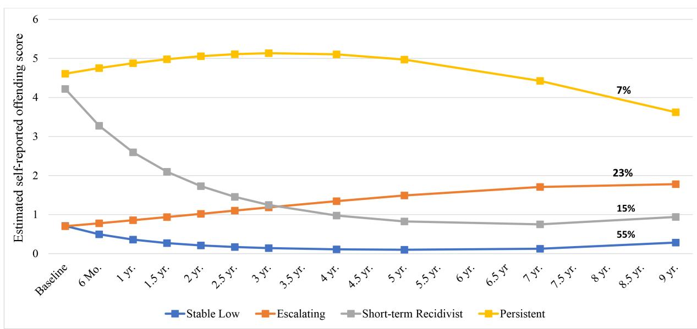

# **Trajectories of offending over 9 years after youths' first arrest: What predicts who desists and who continues to offend?**

| Elizabeth Cauffman1 | Jordan Beardslee1 | Colleen Sbeglia1 | Paul J. Frick2  |
|---------------------|-------------------|------------------|--------------------|
| Laurence Steinberg3 |                   |                  |                    |

1 University of California, Irvine, Irvine, California, USA

2 Louisiana State University, Baton Rouge, Louisiana, USA 3

Temple University, Philadelphia, Pennsylvania, USA

#### **Correspondence**

Elizabeth Cauffman, University of California, Irvine, Irvine, CA, USA. Email: [cauffman@uci.edu](mailto:cauffman@uci.edu)

#### **Funding information**

John D. and Catherine T. MacArthur Foundation; Office of Juvenile Justice and Delinquency Prevention; William T. Grant Foundation; County of Orange; Fudge Family Foundation; National Institute of Justice

#### **Abstract**

Antisocial and illegal behavior generally declines as youth approach adulthood, but there is significant individual variation in the timing of the peak and decline of offending from adolescence to young adulthood. There are two primary research questions in the present study. First, are there subgroups of youth who follow similar patterns of offending over the nine years after their first arrest? Second, what baseline factors predict which youth will follow each pattern of offending? Data were drawn from the Crossroads study, which includes a sample of racially and ethnically diverse boys who were interviewed regularly for 9 years following their first arrest. Boys were between 13 and 17 years old at the start of the study and were approximately 24-25 years old at the final interview. Trajectories were measured with youths' self-reported offending using latent class growth analysis (LCGA). Results indicated that there were four subgroups of youth: a stable low group (55%), an escalating group (23%), a short-term recidivist group (15%), and a persistently high group (7%). Several baseline factors distinguished the groups. In particular, the results indicated that youth who were informally processed after their first arrest were more likely to be in the low offending group than any of the other LCGA groups. Age at first arrest, peer delinquency, exposure to violence, substance use, callous-unemotional traits, physical aggression, and perceptions of police legitimacy were also significantly related to group membership. Results suggest that certain risk factors identified after youths' first arrest may predict which youth continue to offend and which desist.

#### **KEYWORDS**

juvenile delinquency, juvenile justice system, trajectories of offending

# **INTRODUCTION**

Decades of research have confirmed that antisocial behavior is common during adolescence, although most youth desist from crime as they enter adulthood. Still, there is individual variation in how much antisocial activity youth engage in over time, with researchers frequently observing distinct trajectories of offending among developing youth. Moffitt's [\(1993](#page-12-0)) developmental taxonomy of antisocial behavior describes two unique and commonly identified patterns: individuals whose offending behavior is adolescence-limited (i.e., onset and duration of offending is limited to adolescence; the majority of the population), and those whose offending is life-course-persistent (i.e., onset of offending is prior to adolescence and continues throughout the life course). Despite evidence to support these patterns of offending among both community adolescents (Barnes et al., [2011](#page-11-0)) and youth who have committed very serious crimes (Mulvey, Steinberg, et al., [2010\)](#page-12-1), there is still much to learn about the developmental contexts that promote one trajectory over the other.

In particular, there is little research on how youth's involvement in the justice system may influence these trajectories. Moffitt's taxonomy posits that youths' offending

This is an open access article under the terms of the [Creative Commons Attribution-NonCommercial-NoDerivs](http://creativecommons.org/licenses/by-nc-nd/4.0/) License, which permits use and distribution in any medium, provided the original work is properly cited, the use is non-commercial and no modifications or adaptations are made. © 2024 The Authors. *Journal of Research on Adolescence* published by Wiley Periodicals LLC on behalf of Society for Research on Adolescence.

behavior may become life-course-persistent if they become entangled in "snares" that prevent normative desistance. Snares are situational "traps" that can prevent normative desistance, such as dropping out of school or substance use. For example, while most youth gradually stop offending as they approach adulthood, youth who drop out of high school might have limited economic opportunities and subsequently rely on antisocial techniques to earn money. Similarly, substance abuse may cause a physiological dependence that leads to increased antisocial behavior to obtain drugs, which may then limit educational opportunities, and eventually end in incarceration. Perhaps paradoxically, one potential snare is justice system involvement itself.

Involvement with the juvenile justice system during adolescence may have criminogenic effects on youth (Gatti et al., [2009\)](#page-11-1). This can start as early as the processing decisions surrounding an adolescent's first arrest. When a youth is arrested, probation officers and other legal practitioners must decide whether to "process" youth formally or informally. Formal processing typically involves formal sanctioning before a judge, which can include intensive community supervision or even placement in juvenile detention, while informal processing usually results in youth being assigned to something less stringent, such as community service with supervision. Though this processing decision may seem like a small event that is inconsequential for long-term behavior, recent evidence suggests that it impacts youths' likelihood of becoming further entrenched in the system even years later. Generally speaking, harsher, formal processing incurs risk for increased violent offending, rearrests, and incarceration into adulthood (Cauffman et al., [2021;](#page-11-2) Petitclerc et al., [2013](#page-12-2); Petrosino et al., [2010](#page-12-3)). Given the potential harmful effects of justice involvement, it is critical to pinpoint which youth are at the highest risk of continued offending, so that this involvement can be limited to only that which is necessary to ensure public safety.

Certain factors at the time of youths' first arrest have already been linked to future instances of offending. For example, self-reported aggression (Matlasz et al., [2020\)](#page-12-4), high levels of callous-unemotional traits (Robertson et al., [2021\)](#page-12-5), and low levels of self-control (Fine et al., [2016](#page-11-3)) at the time of first arrest have been linked to the increased odds of offending at a future timepoint. Identifying risk factors for a prospective instance of crime is unquestionably useful for policymakers, but engaging in some amount of risky behavior is also developmentally normative during adolescence (Steinberg, [2008\)](#page-12-6). Given that most juveniles, even those convicted of serious offenses, will "age out" of crime (Mulvey, Steinberg, et al., [2010;](#page-12-1) Sampson & Laub, [2017\)](#page-12-7), examining specific occurrences of crime may not offer a reliable indication of risk for long-term, continued offending behavior. In contrast, using longitudinal data to examine specific *patterns* of offending over time may provide better insight into which individual or contextual factors confer more serious risk for persistent offending.

Although average levels of criminal behavior appear to decline in the years that follow a youth's first arrest (Baker et al., [2022](#page-11-4)), some individuals desist faster than others and a small number of youth may not desist at all. To identify unique trajectories of offending, contemporary longitudinal methods are available to identify whether there are distinct groups of youth within a sample who share similar offending patterns as they develop (i.e., latent class trajectory modeling). By using a youth's first contact with the justice system as a starting point to examine the development of criminal behavior, it becomes possible to examine which factors are related to subsequent delinquency at a critical moment in youths' lives. Specifically, it can help the justice system evaluate the minimal level of involvement needed to ensure public safety and establish which individual and contextual factors should be targeted to support rehabilitation and desistance from crime. Moreover, it can also help determine the extent to which certain forms of justice system contact might serve as a snare that leads to greater recidivism.

# **Adolescence to young adulthood: Patterns of offending following the first arrest**

A prior study identified offending trajectories of juveniles convicted of serious crimes, using data from a three-year follow-up period after youth have been adjudicated (Mulvey, Steinberg, et al., [2010\)](#page-12-1). The present study aims to build upon this research by examining patterns of offending in a nineyear period following adolescents' first-ever contact with the justice system. Using data from the Crossroads study, a large-scale study of youth who have been charged with a relatively moderate offense, we explore the individual, social, and contextual factors that are associated with trajectories of offending and desistance following youths' first arrest. Critically, the 9-year follow-up period allows us to examine the criminal behavior across adolescence and into young adulthood, when most, but not all, youth are typically desisting from crime.

This approach is inspired by the legacy of our dear colleague, the late Dr. John Schulenberg, who stressed the importance of adolescent experiences from a life course perspective. He examined patterns of substance use from adolescence through young adulthood, with particular focus on how developmental transitions contribute to the onset and maintenance of, or desistance from, substance abuse. For example, in their developmentallyoriented review of binge drinking among college students, Schulenberg and Maggs [\(2002\)](#page-12-8) describe the myriad individual and contextual changes that might contribute to substance use during a person' teens and early twenties: biological and cognitive changes, identity development outside of the family and within new social contexts, and a shift in orientation toward school and career achievements. But despite the undeniable impact of ever-changing proximal factors, they also highlight the need to distinguish which factors might have long-term effects, which can best be done through longitudinal analysis.

Schulenberg et al.'s [\(1996](#page-12-9)) study on the trajectories of young adult alcohol use paved the way for such an examination. Among youth aged 18–24, they identified unique alcohol use trajectory groups (e.g., chronic binge drinkers, those who increased or decreased alcohol use over time), and most critically, they sought to uncover factors which distinguished the groups whose alcohol use initially looked the same, but diverged over time. Interestingly, when comparing the "chronic" drinkers (high levels of alcohol use, sustained over time) and the "decreased" drinkers (initially high levels of alcohol use that decreased over time), they found that demographic and lifestyle factors did not distinguish the groups, and hypothesized that developmental "transitional experiences" might have instead led to one group's desistance from binge drinking, while the other maintained high levels. In our study, we focus on trajectories of offending and examine a wider time frame, spanning adolescence to young adulthood. We included a variety of factors that encompass the experiences youth may have had at the time of their first arrest, including the initial severity of their justice involvement.

# **Factors distinguishing offending groups**

Although many risk and protective factors for delinquency have been identified in prior work, the impact of these factors across adolescence and young adulthood has often been overlooked. Drawing on findings from criminological, sociological, and psychological literatures, we have selected a wide range of variables to serve as predictors of offending trajectory group membership (i.e., factors that predict offending patterns spanning adolescence to adulthood). Although it is impossible to create an exhaustive list of potential predictors, the variables selected for the present analysis comprise a wide-ranging set of empirically and theoretically relevant risk and protective factors across several domains. Three primary categories are discussed in turn below. The first set of predictors are primarily composed of demographic information and characteristics of youths' first arrest (e.g., processing type). We then examine social and contextual factors, such as peer, parent and neighborhood-level influences. Finally, we look at youths' individual factors, such as attitudes (e.g., perceptions about the likelihood of future success; perceptions of the justice system) and behaviors (e.g., aggression; substance use). Many of these factors were selected because they emerged as important factors in a similar study with adolescent boys who were arrested for a serious crime (Mulvey, Steinberg, et al., [2010](#page-12-1)).

# Demographic and case factors

Certain demographic characteristics are consistently associated with various metrics of offending. As noted previously, early age of offending is associated with more chronic levels of delinquency and there have been decades of research documenting the "age–crime curve," or the tendency for criminal behavior to peak during adolescence and decline thereafter (Farrington, [1986](#page-11-5); Natsuaki et al., [2008;](#page-12-10) Tolan & Thomas, [1995;](#page-12-11) Tremblay, [2014](#page-12-12)). It is also well-established that factors such as race/ethnicity and socioeconomic status (SES) have associations with crime in the United States (Bersani & DiPietro, [2016](#page-11-6); Rutter & Giller, [1983\)](#page-12-13), but the precise mechanisms explaining these linkages are not well understood. Given the complicated relationship between race/ethnicity and socioeconomic opportunities in the United States, youth from different racial/ethnic backgrounds are differentially exposed to a variety of risk (e.g., community violence, justice system involvement) and protective factors (e.g., education, employment). Because of these disparities, it is understandable that patterns of offending and justice system contact may vary by race/ethnicity or socioeconomic status. Indeed, when using household education as a proxy for youth SES, lower levels of SES are linked to greater adolescent offending (Rekker et al., [2017\)](#page-12-14). Family structure may also meaningfully impact offending behavior, with higher levels of delinquency observed among youth from single- or stepparent homes (Svensson & Johnson, [2022\)](#page-12-15), though these associations often become attenuated or even nonsignificant once factors such as parental involvement are included (Demuth & Brown, [2004](#page-11-7)). Similarly, though reports sometimes show higher rates of offending among youth of color, this may in part be explained by the fact that youth of color experience higher levels of police surveillance, even when they have no history of delinquent behavior (Campos-Manzo et al., [2020](#page-11-8)). We also include criminal behavior of biological fathers as an important factor that might influence offending patterns, as it has been identified as one of the few factors that distinguishes offending patterns in a sample of adolescent boys convicted of a serious offense (Mulvey, Steinberg, et al., [2010\)](#page-12-1).

The unique design of the Crossroads study also allows for initial justice system processing style to be examined as a predictor of offending trajectories. When an individual is arrested for the first time, they may be processed formally (i.e., the case is brought before a judge for sentencing) or informally (i.e., the case is handled by probation, resulting in a form of diversion from the system). Research suggests that exposure to more severe juvenile justice processing has iatrogenic effects, inadvertently promoting further offending and continued justice system involvement (Cauffman et al., [2021](#page-11-2); Petitclerc et al., [2013](#page-12-2); Petrosino et al., [2010](#page-12-3)). These effects persist into adulthood. For instance, a study of Montreal youth suggests that even when self-reported delinquent behavior is held constant, juvenile justice intervention increases the likelihood of adult crime seven-fold over nonintervention (Gatti et al., [2009\)](#page-11-1). Importantly, because the present sample comprises youth who have been arrested for the first time, we are able to eliminate effects that may be due to previous justice involvement and focus instead on the potential "snare" effect of justice system processing on the development of offending from the time it could first influence the youth.

Some youth may also exhibit mores serious antisocial behavior. For example, though all youth in the sample had only been arrested one time at the baseline, there were a variety of offenses that were eligible for inclusion in the study. All youth were charged with relatively moderate offenses, but eligible charges included property offenses (e.g., theft), drug offenses (e.g., drug possession), and person-related offenses (e.g., assault). Initial offense type is thus included as a predictor of trajectory group membership.

# Social and contextual factors

Many contextual factors are associated with youths' likelihood of offending over time, including characteristics of youths' social connections and their physical environment. Peer groups are vital for developing youth, and prior studies have found that justice-involved youth are more likely to join gangs and to associate with delinquent peers than nonjustice system youth (Bernburg et al., [2006\)](#page-11-9). Deviant peers then model and reinforce antisocial and illegal behaviors, and in turn, youth increase their own offending (Dishion et al., [2010;](#page-11-10) Dishion, Andrews, et al., [1996](#page-11-11); Dishion, Spracklen, et al., [1996\)](#page-11-12). Parents also remain a central influence in youths' lives. Parental monitoring and knowledge of youth behavior is linked to lower levels of delinquency (Barnes et al., [2006](#page-11-13)), and this may be in part because monitoring reduces deviant peer affiliation (Ray et al., [2017](#page-12-16)). Warm parental relationships also promote desistance, and the effects of relationship quality appear to be sustained over time (Cavanagh & Cauffman, [2017\)](#page-11-14). Taken together, peers and parents may be important distinguishing factors between trajectories of delinquent behavior.

Beyond their social circles, the neighborhoods that youth reside in may also promote or reduce criminal behavior. Although findings on the effects of neighborhood conditions are mixed, there is some evidence to suggest that the quality of a youth's current neighborhood and its surrounding areas is inversely related to delinquency (Sciandra et al., [2013](#page-12-17); Vogel & South, [2016\)](#page-13-0). According to the broken windows theory, poorer neighborhoods may have more visible signs of antisocial activity (e.g., broken windows, graffiti), which itself invites more antisocial behavior (Kelling & Wilson, [1982](#page-12-18)). Unsafe neighborhoods may also increase the odds that youth are exposed to violence. Exposure to violence is one of the most well-documented risk factors for offending (Jennings et al., [2012;](#page-11-15) Widom, [1989;](#page-13-1) Widom & Wilson, [2015](#page-13-2)), and it is linked to patterns of persistent violence in juveniles convicted of serious offenses (Baskin & Sommers, [2014\)](#page-11-16). Because there are highly elevated rates of exposure to violence among justice-involved youth (Abram et al., [2004](#page-11-17); Ford et al., [2013](#page-11-18)), varying levels of exposure may be critical in determining trajectories of youth offending.

# Individual factors

It may be the case that some youth have attitudinal dispositions that are associated with greater engagement in antisocial behavior. Individual factors such as callousunemotional (CU) traits have emerged as a significant predictor of more severe and more persistent offending (Frick et al., [2005;](#page-11-19) Frick & Dantagnan, [2005](#page-11-20)). CU traits are frequently linked to aggressive and violent offenses (Frick & White, [2008\)](#page-11-21) and aggression itself is linked to longerterm criminal behavior (Piquero et al., [2012](#page-12-19)). As such, both CU traits and physical aggression were selected as potential distinguishing factors. Another critical factor is youths' substance use, given its robust association with antisocial behavior (Amico et al., [2008](#page-11-22); Mulvey, Schubert, & Chassin, [2010\)](#page-12-20). Drug use during adolescence especially is linked to offending in adulthood (Walters & Urban, [2014\)](#page-13-3). Finally, impulse control is an individual predisposition that has also been linked to aggressive behavior (Vaughan et al., [2023\)](#page-13-4) and has proven to be a consistent predictor of criminal behavior. Among a sample of youth aged 15–25 who had committed serious felony offenses, a modest increase in impulse control over time led to an 18% reduction in offending (Sweeten et al., [2013\)](#page-12-21). Likewise, Loeber et al. [\(2012](#page-12-22)) found that adolescents' levels of impulse control predicted trajectories of offending, with lower impulse control predicting more frequent offending patterns.

It is also important to consider youths' perceptions, both of themselves and of the systems with which they interact. For instance, among adolescents charged with a serious crime, youth who are internally motivated to succeed are more likely to engage in school (McGuire et al., [2021\)](#page-12-23), which is a known buffer against offending behavior (Christle et al., [2005](#page-11-23)). These self-perceptions, however, are only one piece of the puzzle. Procedural justice, broadly conceptualized as whether youth perceive the justice system to be fair, has emerged as an important indicator of criminal behavior. The interactions that youth have with legal authorities impact their perceptions of the system as a whole, and when their interactions are negative, adolescents may view the system as unjust (Fagan & Tyler, [2005](#page-11-24)). In turn, they become more likely to engage in delinquency, and surprisingly, this appears to be especially true among youth displaying high levels of maturity (Fine et al., [2018](#page-11-25))—in other words, defying legal authorities that are perceived as unfair is not just an artifact of youthful rebellion. The reverse may also be true. Youth who are exposed to violence in carceral settings are less likely to engage in violence themselves if they trust the legal authorities within the institution (Brown et al., [2019](#page-11-26)).

# **The present study**

Considering the factors in each domain presented in the previous section, there are two primary research questions in the present study. First, are there subgroups of youth in

the Crossroads study who follow similar patterns of offending during the 9 years after youths' first arrest? Second, what baseline factors predict which youth will follow each pattern of offending?

# **METHODS**

Data for the present study come from a diverse sample (45.8% Hispanic; 36.9% Black; 14.8% White; 2.5% Biracial or another race/ethnicity) of 1216 boys enrolled in the Crossroads study (Cauffman et al., [2021\)](#page-11-2). Crossroads is a multi-site study, with participants recruited from Orange County, California, Jefferson Parish, Louisiana, and Philadelphia, Pennsylvania. Only youth who were charged with certain offenses (i.e., such as vandalism or theft, mostly misdemeanors) and who had never been arrested before were eligible for the Crossroads study. After parental consent and assent were obtained, interested adolescent boys were interviewed within 6weeks of their first arrest ("baseline"), every 6months for 3 years, 4 years after the baseline, 5 years after the baseline, 7 years after the baseline, and 9 years after the baseline. In total, the participants were interviewed by research staff on 11 measurement occasions. Boys were between 13 and 17 years old at baseline and were approximately 24-25 years old at the final interview. Each interview asked participants to answer a variety of questions about all aspects of their lives, including information on their behavior, attitudes, social networks, family environment, mental health, psychosocial maturity, and school/work. In the present study, all predictor variables are taken from the baseline interview. Trajectories were measured with youths' self-reported offending, which was measured at all 11 interviews. Sample retention during the Crossroads study was high during the follow-up interviews, averaging 86.8%.

# **Predictor variables**

# Demographic factors

*Age* at the baseline was calculated using the youths' date of birth and the date of the baseline interview.

*Race* was obtained by youth self-report at the baseline interview and coded into four categories: Hispanic (45.8%), Black/African American (36.9%), White (14.8%), and Other/ Biracial (2.5%).

*Parent education* was obtained by youth self-report at the baseline interview. Used as a proxy for socioeconomic status, parent education was rated on a 10-point scale and ranged from "some grade school" (3.52%) to "professional or graduate degree" (3.26%). The most frequent response was high school diploma (32.50%).

*Biological parents married* was obtained by youth selfreport and indicated whether the youths' biological parents were currently married at the baseline interview (22.06% currently married).

*Biological father crime* was obtained by youth self-report and indicated whether the youths' biological father had ever committed a crime (12.58% reported having a father who had committed a crime prior to the baseline).

*Formal processing* was measured with official records and coded to indicate whether youths' first arrest was processed formally (i.e., filed in court; 44.98%) or informally (i.e., diverted from court and handled with the juvenile probation department; 55.02%). As described by Cauffman et al. [\(2021](#page-11-2)), informally processed youth were diverted from official court processing and given sanctions, such as courses (e.g., legal awareness; anger management), community service hours, and writing apology letters. Formally processed youth were processed and sanctioned through an official court hearing and were typically given more intensive sanctions.

*Offense type* was obtained by official records and coded by the research team to indicate the type of offense that youth was arrested for prior to the baseline. Offense type was coded into four categories: property (48.19%), drug (22.45%), person (20.23%), and other (mostly weapon related; 9.13%).

# Social and contextual factors

*Parental knowledge* was measured by youth self-report using the Parental Monitoring Inventory (Steinberg et al., [1992](#page-12-24)). The parental knowledge scale includes 5 items and represents the youths' perception of how well his primary caregiver knows how the youth spends his time. Youth respond to each item using a 4-point scale that ranged from "doesn't know at all" to "knows everything." Higher scores indicate higher levels of parental knowledge (*α*=.80).

*Maternal relationship quality* was measured with the Quality of Parental Relationships Inventory (Conger et al., [1994\)](#page-11-27). Two scales were created based on items from this inventory: a 9-item maternal warmth scale (e.g., a frequency that mother told youth that she cared about him or loved him) and a 12-item maternal hostility scale (e.g., a frequency that mother threw things at youth). Youth responded to each item using a 4-point scale that ranged from "always" to "never." When necessary, items were reverse-scored such that higher scores would be indicative of greater warmth (*α*=.90) and greater hostility (*α*=.84).

*Peer delinquency* was obtained by youth self-report and measured with the Association with Deviant Peers Scale (Thornberry et al., [1994\)](#page-12-25). Peer delinquency was captured with 13 items measuring the proportion of friends who engaged in various antisocial behaviors (e.g., theft; fighting). Youth responded to each item using a 5-point scale that ranged from "none of them" to "all of them." Higher scores are representative of having a greater proportion of friends who have engaged in delinquent behaviors (*α*=.90).

*Neighborhood conditions* were measured with the 21 items from the total score of the Neighborhood Conditions scale (Elliot et al., [1996](#page-11-28); Sampson, [1997](#page-12-26); Sampson et al., [1997](#page-12-27); Sampson & Raudenbush, [1999](#page-12-28)). Neighborhood conditions measured the frequency with which youth witnessed various types of disorder in their neighborhood (e.g., adults fighting; graffiti; cigarettes on the street). Youth responded to each item using a 4-point scale that ranged from "never" to "often." Higher scores are related to greater neighborhood disorder (*α*=.94).

*Exposure to violence* was measured via youth self-report with 13 items from the Exposure to Violence Inventory (Selner-O'Hagan et al., [1998](#page-12-29)). Items on the Exposure to Violence inventory measured whether the youth experienced or witnessed a serious violent event (e.g., been chased/ seen someone chased; been attacked with a weapon/seen someone attacked with a weapon) during the 6months prior to the baseline interview. The total score used in the present study represented the sum of the number of events that the youth experienced.

# Individual factors

*Callous-unemotional traits* was assessed with the 24-item total score from the Inventory of Callous-Unemotional Traits (Frick, [2004;](#page-11-29) Kimonis et al., [2008\)](#page-12-30). Callous-unemotional traits are indicative of lower empathy and a tendency to not care about others. Youth read a series of statements and rated how true the statements were for them using a 4-point scale that ranged from "not at all true" to "definitely true." Higher scores are indicative of higher callous-unemotional traits (*α*=.76).

*Physical aggression* was measured with the 20-item Total Overt Aggression Scale from the Peer Conflict Scale (Marsee et al., [2011\)](#page-12-31). The scale measures proactive and reactive physical aggression, such as "starting fights to get what you want" and "starting fights to get back at someone." Youth respond to each question using a 4-point scale that ranged from "not at all true" to "definitely true." Higher scores on the physical aggression scale are representative of a greater tendency to engage in aggressive behaviors (*α* = .88).

*Impulse control* was measured by youth self-report with one scale from the Weinberger Adjustment Inventory (Weinberger & Schwartz, [1990](#page-13-5)). In particular, the 8-item Impulse Control Scale was used as a measure of youths' ability to inhibit their impulses in various situations. Youth read a series of statements and stated how much the statement represented what they are typically like. Youth responded to each statement using a 5-point response scale that ranged from "false" to "true." Higher scores represent greater levels of impulse control (*α*=.74).

*Substance use* was measured with the Substance Use and Abuse Inventory (Chassin et al., [1991\)](#page-11-30). In particular, youth reported how often they used alcohol, marijuana, and other nonmarijuana drugs (e.g., cocaine; ecstasy) during the 6months prior to the baseline interview. For each type of substance, youth reported their frequency of use using a 9 point scale that ranged from "none" to "everyday." Because of the relatively lower base rates for nonmarijuana drug use, this variable was dichotomized to represent whether the

15327795, 2024, 4, Downloaded from https://onlinelibrary.wiley.com/doi/10.1111/jora.12926 by Utrecht University, Wiley Online Library on [02/04/2025]. See the Terms and Conditions (https://onlinelibrary.wiley.com/terms-and-conditions) on Wiley Online Library for rules of use; OA articles are governed by the applicable Creative Commons License

youth used any nonmarijuana drugs during the 6months prior to the baseline interview.

*Motivation to succeed* was a measure of youths' perception of future life opportunities (i.e., in terms of school, work) for youth in their neighborhood and was measured with the 6-item self-reported Motivation to Succeed scale (Eccles et al., [1998\)](#page-11-31). Youth responded to each item using a 5 point scale that ranged from "strongly disagree" to "strongly agree." Higher scores are indicative of having a greater motivation to succeed in the future (*α*=.61).

*Importance of desistance* was a single item from the Perceptions of Opportunities scale (Elliott, [1990](#page-11-32); Menard & Elliott, [1996\)](#page-12-32). The item measured youths' perception of the importance of staying out of "trouble with the law." Youth responded to the importance of desistance question by using a 5-point response scale that ranged from "not at all important" to "very important."

*Police legitimacy* was measured with 4 items from the Procedural Justice Inventory and based on a prior psychometric analysis with the Crossroads data (Fine et al., [2022](#page-11-33); Tyler, [2006](#page-13-6)). Police legitimacy captures youths' support and respect for the police. Youth respond to each item using a 4 point scale that ranges from "strongly disagree" to "strongly agree." Higher scores indicate a greater perceived police legitimacy (*α*=.86).

# **Outcome variable**

*Self-reported offending* was the key outcome variable in the present study and was measured at the baseline and all 10 follow-up interviews. Offending was assessed via youth self-report with an adapted version of the Self-Report of Offending Scale (Huizinga et al., [1991\)](#page-11-34). Items on the scale asked youth to state whether they had engaged in 24 different illegal behaviors during the recall period (i.e., since the previous interview). The total score used in the present study represented the sum of the number of illegal behaviors that the participant engaged in during the recall period (i.e., a variety score ranging from 0 to 24).

# **Missing data**

As mentioned previously, sample retention in the present study was high (average retention was 86.6%). Almost half of the sample was missing no data on the self-reported offending variable (47.86%), and the average number of missing self-reported offending data points was 1.33. Because the predictors were measured at the very first interview ("baseline"), there was very little missing data on the 22 predictor variables (the mean number of missing predictor variables=0.11). Approximately 91% of participants were not missing any data on the predictor variables, 6.74% were missing data on one variable, 1.48% were missing data on two predictor variables, one person was missing data on three predictor variables, and three people were missing data on four predictor variables. Indeed less than 2% of the sample was missing data on two or more predictors. The predictor variable with the most missing data was parental education level, with approximately 4% of the sample having missing data on this variable.

Only two of the 22 predictor variables were significantly related to having missing data on the self-reported offending outcome. Youth whose biological parents were married at the baseline interview had fewer missing selfreported offending data points (*p* = .005) than those with separated or single parents, and youth who were charged with a property offense after their first arrest had fewer missing self-reported offending data points than youth who were charged with a person offense (*p* < .001) or a drug offense (*p* = .004).

The offending latent class groups were estimated with maximum likelihood estimation with robust standard errors (MLR), and participants with any self-reported offending data were included in the analysis. Indeed trajectory groups were estimated using all available data. Because all participants had at least one data point with self-reported offending data, we were able to assign all participants into a trajectory group (which means there was no missing data on our outcome variable in the primary analysis predicting group membership). Furthermore, it is worth reiterating that the average number of missing self-reported offending data points was approximately 1 (out of 11 possible time-points).

The analytic sample size for the primary model, the multinomial logistic regression predicting class membership, was 1112, which was approximately 91% of the original sample. The analytic sample included individuals who had complete data on the predictor variables (model default). Based on the small proportion of missing data and the relatively few variables that were related to missingness, it is unlikely that missing data had a substantive impact on the results of the present study.

# **Plan of analysis**

First, latent class growth analysis, LCGA (Muthen, [2004\)](#page-12-33), was used to identify subgroups of youth who followed similar patterns of offending during the first 9 years after their first contact with the justice system. For this analysis, youths' self-report of offending at all time-points (11 measurement occasions) was used. Preliminary growth curve models examined whether linear or quadratic growth best represented change over time in offending. LCGA models were built based on the best polynomial growth curve for offending. For all LCGA models, self-reported offending was specified as a count variable and models were estimated using MLR. The optimal number of latent classes was selected based on recommended criteria (BIC-adjusted value, entropy, Vuong-Lo–Mendell–Rubin likelihood ratio test, bootstrapped likelihood ratio test, sample size in each class, classification probabilities, parsimony, and face validity/interpretability; Muthen, [2004;](#page-12-33) Nylund et al., [2008](#page-12-34)).

After the trajectory groups were determined, youth were hard classified into the group for which they had the highest probability of belonging. A multinomial logistic regression was then conducted, which regressed the best class solution on the 22 predictors (see the measures section for a list of the predictor variables). All predictor variables were entered simultaneously, which means that all analyses controlled for the effects of the other predictor variables. Analyses statistically adjusted for youths' posterior probability of belonging to their selected class. If any of the main effects of the predictor variables were significant, all possible group comparisons were examined by rotating the reference group of the offending group variable. Analyses were conducted in Mplus Version 8 and Stata version 16.

# **RESULTS**

# **Distinguishing unique trajectories of offending**

First, preliminary growth curve models identified that a quadratic slope was the best fitting polynomial to explain average change over time in offending during the study period. After the preliminary growth curve was specified, a successive number of classes were estimated, ranging from a 2-class solution to a 5-class solution (see Table [1\)](#page-6-0). The final solution was selected based on the BIC-adjusted value, entropy, Vuong-Lo–Mendell–Rubin likelihood ratio test, bootstrapped likelihood ratio test, sample size in each class, classification probabilities, parsimony, and face validity/interpretability (Muthen, [2004](#page-12-33); Nylund et al., [2008](#page-12-34)). All factors considered, the 4-class solution was

**TABLE 1** Model comparisons for successive latent classes of self-reported offending trajectories.

|             | BIC-adjusted | Entropy | LRT (p) | BLRT (p) | Sample size in each class | Classification probabilities for the most likely class |
|-------------|--------------|---------|---------|----------|---------------------------|--------------------------------------------------------|
| Two class   | 33441.267    | 0.942   | <.001   | <.001    | 919; 297                  | 0.992; 0.961                                           |
| Three class | 31565.398    | 0.893   | .0007   | <.001    | 679; 118; 419             | 0.969; 0.969; 0.919                                    |
| Four class  | 30803.701    | 0.873   | .3216   | <.001    | 668; 284; 183; 81         | 0.969; 0.861; 0.882; 0.925                             |
| Five class  | 30362.26     | 0.876   | .0010   | <.001    | 18; 607; 173; 96; 322     | 0.938; 0.962; 0.887; 0.927; 0.854                      |

*Note*: The Vuong-Lo–Mendell–Rubin likelihood ratio test (LRT) and the bootstrapped likelihood ratio test (BLRT) examine whether the *N*-group is better than the *N*−1 group. Shaded row represents the class solution that was selected (four class solution).

Abbreviation: BIC, Bayesian information criterion.

selected to best represent the data (see Table [1](#page-6-0)). The four groups included a stable low group (55%), an escalating group (23%), a short-term recidivist group (15%), and a persistently high group (7%). The largest group, the stable low group, had a very low probability of offending after their initial arrest and during the entire study period, while the smallest group, the persistent group, had a consistently high probability of offending for the 9 years after their arrest. The escalating group gradually increased their offending during the study period, while the shortterm recidivist group had a high probability of offending during the first 2 years after their first arrest but then remained fairly low in offending beginning approximately 2.5 years post first arrest and continuing through the entire study period (but never was as low as the stable low group). Interestingly, the persistent and short-term recidivist groups engaged in indistinguishably high levels of offending at the start of the study (e.g., the baseline), but split into distinct groups shortly after youths' first arrest. Indeed the short-term recidivist group began their path to desistance after about 2–2.5 years, whereas the persistent group maintained their high level of offending for the entire nine-year study period. For an illustration of the four group trajectory solution, see Figure [1.](#page-7-0)

# **Predictors of offending trajectory groups**

In the next stage of the analysis, we sought to determine whether any of the theoretically relevant predictor variables were related to membership in the different trajectory groups. For this analysis, youth were placed into the trajectory group for which they had the highest posterior probability. A multinomial logistic regression was then conducted which simultaneously regressed the 4-class offending group variable on all 22 predictors. See Table [S1](#page-13-7) for all of the bivariate correlations among the predictor variables. Analyses statistically adjusted for youths' posterior probability of belonging to their selected class. Results indicated that the following variables were significantly related to class membership (discussed in detail below): age, formal processing, peer delinquency, exposure to violence, substance use, callous-unemotional traits, physical aggression, and police legitimacy (see Table [2](#page-9-0) for more information about the specific risk factors that distinguished the groups). The group comparisons that had the most significant differences were those between the stable-low and persistent groups, as well as between the stable low and short-term recidivist groups. Note that none of the risk factors distinguished between the persistent group and the short-term recidivist group, who both engaged in high levels of offending at the start of the study. All results from group comparisons can be seen in Table [2](#page-9-0).

*Age*. The only demographic factor which distinguished trajectory groups was age. Stable low youth were older at the baseline than youth in all other groups (short-term recidivist, escalating, and persistent).

*Formal processing*. Formally processed youth were more likely to be in the escalating, persistent, or short-term recidivist groups than the stable low group. Formally processed youth were also more likely to be in the short-term recidivist group than the escalating group.

*Peer delinquency*. Youth in the short-term recidivist and persistent groups had higher peer delinquency than youth in the stable low and escalating groups.

*Exposure to violence*. The escalating, short-term recidivist, and persistent groups had more exposure to violence than the stable low group. Youth in the short-term recidivist and persistent groups had more exposure to violence than youth in the escalating group.

**FIGURE 1** Trajectories of self-reported offending after youths' first arrest. Estimated means by offending group generated from LCGA.

*Callous-unemotional traits*. The short-term recidivist and persistent groups had higher callous-unemotional traits than youth in the escalating group. The persistent group had higher callous-unemotional traits than the stable low group.

*Physical aggression*. Youth in the persistent, escalating, and short-term recidivist groups reported higher physical aggression than youth in the stable low group.

*Substance use*. Youth in the short-term recidivist, escalating, and persistent groups had higher marijuana use than youth in the stable low groups. The short-term recidivist group had higher nonmarijuana drug use than the stable low and escalating groups. There were no group differences on alcohol use.

*Police legitimacy*. The stable low group reported more positive perceptions of police legitimacy than youth in the persistent or short-term recidivist groups. Youth in the escalating group had more positive perceptions of police legitimacy than youth in the short-term recidivist group.

The following predictor variables were not related to trajectory group membership in the fully adjusted model: race/ ethnicity, parent education, biological parents married, biological father criminal behavior, offense type, parental knowledge, maternal hostility, maternal warmth, neighborhood conditions, alcohol use, motivation to succeed, importance of desistance, and impulse control.

# **DISCUSSION**

Criminal behavior generally declines as youth approach adulthood, but there is significant individual variation in the timing of the peak and decline of offending from adolescence to young adulthood. The present study used latent class growth analysis to identify whether there are distinct subgroups of youth within a sample of first-time justice system involved boys who share similar offending patterns after their first contact with the justice system. By using youths' first contact with the justice system as the starting point, the present study was able to identify which factors predict subsequent patterns of delinquency at a critical moment, which could be a potential turning point in youths' lives. The results of the present study can help the justice system establish which risk factors should be considered from the first moment of contact to determine the level and type of intervention needed. These findings can also be used to determine the extent to which certain forms of justice system contact may interfere with the desistance process and lead to more, instead of less, illegal behavior in the future.

Most youth desist from crime after their first arrest. In fact, over half of the Crossroads youth engaged in little-to-no offending immediately after their first arrest, and youth in the stable low group (our largest group) maintained this low probability of offending for at least 9 years. It is important to highlight that race did not distinguish any of the trajectories, despite the overrepresentation of ethnic minorities in this sample and in the juvenile justice system at large. This likely reflects the well-documented racial and ethnic biases observed across all levels of justice involvement (Delone & Delone, [2017\)](#page-11-35), and arrests specifically within the sample used in the present analysis. For example, a previously published study that used the first 5 years of data in the Crossroads study found that race was not related to self-reported offending, although it was related to system contact, measured as rearrests (Cauffman et al., [2021](#page-11-2)).

Interestingly, youth who were diverted from the justice system and processed informally after their first arrest were significantly more likely to be in the stable low group than any of the other groups. Furthermore, it is critical to note that processing style was a significant predictor even after controlling for other demographic, contextual, and individual risk factors. This finding suggests that the way in which youth are treated after their first arrest may be a critical desistance point in youths' lives. First-time arrested youth who are diverted from formal processing may be more likely to desist in the short and long term. This is consistent with prior work, as many studies have found that exposure to more severe juvenile justice system contact is generally related to further offending and continued justice system involvement (Gatti et al., [2009;](#page-11-1) Petitclerc et al., [2013](#page-12-2); Petrosino et al., [2010\)](#page-12-3). However, it is important to keep in mind that the present study was observational in nature and youth were not randomly assigned to formal or informal processing. As such, we cannot rule out the possibility that there were pre-existing differences between these groups, and the justice system correctly selected the youth who were less likely to recidivate to be diverted into informal processing. Nonetheless, the present findings extend prior work by demonstrating that the way in which the justice system processes (i.e., either formally or informally/diversion) youth after their first arrest is related to their likelihood of offending for at least 9 years.

It is interesting that youth in the escalating group started at the same low probability of offending as youth in the stable low group. However, shortly after their first arrest, youth in the escalating group began increasing their offending. Although the precise reason that the escalating group split from the stable low group is unknown, it was noteworthy that the escalating group was younger at the time of their first arrest than the stable low group. This is not surprising given that age of first arrest is a robust predictor of future illegal activity (Natsuaki et al., [2008;](#page-12-10) Tolan & Thomas, [1995](#page-12-11)). Furthermore, the escalating group used more marijuana and engaged in more physical aggression than the stable low group, demonstrating early behavioral risk factors. The escalating group also had more environmental risk factors than the stable low group, such as being exposed to more violence and being more likely to be formally processed.

Furthermore, consistent with studies with youth who commit serious offenses (Monahan et al., [2009](#page-12-35), [2013;](#page-12-36) Mulvey, Steinberg, et al., [2010](#page-12-1)), only a small percentage of youth in the present study continued to engage in a high rate of offending after their first arrest. This persistently high group

| eff of ed Ma in ict ect pr or ble cla ria va on ss | Sta ble lo w v s. ala tin esc g |           | Sh cid ivi ort -te st v rm re s. ala tin esc g |           | Pe rsi ste nt vs. ala tin esc g |           | Sh cid ivi ort -te st rm re rsi ste nt vs. pe |          | Sta ble lo w v s. rsi ste nt pe |           | Sta ble lo ho rt- w v s. s idi vis ter t m rec |           |
|----------------------------------------------------------------------------------------------|---------------------------------------------------------|-----------|------------------------------------------------------------------------------------|-----------|---------------------------------------------------------|-----------|-----------------------------------------------------------------------------------|----------|---------------------------------------------------------|-----------|------------------------------------------------------------------------------------|-----------|
| 2 (p ) χ                                                                               | B                                                       | p         | B                                                                                  | p         | B                                                       | p         | B                                                                                 | p        | B                                                       | p         | B                                                                                  | p         |
| (< 1) 29 .23 .00                                                                 | 0.3 6                                                | <.0 01 | 0.1 3                                                                           | .22 1  | 0.0 6                                                | .67 7  | 0.0 8                                                                          | .58 8 | 0.3 0                                                | .02 8  | 0.2 2                                                                           | .03 4  |
| (. ) 15. 76 072                                                                  |                                                         |           |                                                                                    |           |                                                         |           |                                                                                   |          |                                                         |           |                                                                                    |           |
|                                                                                              | 0.6 8                                                | .01 0  | −0 .05                                                                          | .88 7  | 0.1 3                                                | .79 7  | −0 .19                                                                         | .72 2 | 0.5 5                                                | .27 9  | 0.7 3                                                                           | .03 4  |
|                                                                                              | 0.2 3                                                | .37 4  | −0 .36                                                                          | .29 6  | 0.1 4                                                | .75 7  | −0 .50                                                                         | .25 5 | 0.0 9                                                | .84 3  | 0.5 8                                                                           | .06 4  |
|                                                                                              | −0 .61                                               | .24 2  | −0 .84                                                                          | .23 2  | −0 .29                                               | .74 2  | −0 .55                                                                         | .54 4 | −0 .32                                               | .72 1  | 0.2 3                                                                           | .73 5  |
| 7 ( 5) 3.4 .32                                                                      | −0 .07                                               | .09 1  | −0 .01                                                                          | .92 0  | 0.0 0                                                | .95 7  | -0. 00                                                                         | .98 3 | −0 .07                                               | .39 1  | −0 .06                                                                          | .23 5  |
| 3 ( 6) 2.3 .50                                                                      | 0.2 1                                                | .31 2  | −0 .10                                                                          | .73 8  | −0 .23                                               | .56 5  | 0.1 3                                                                          | .74 5 | 0.4 3                                                | .25 1  | 0.3 1                                                                           | .27 3  |
| 4 ( 5) .56 2.0                                                                      | 0.1 8                                                | .44 7  | −0 .32                                                                          | .37 3  | .06 −0                                               | .88 2  | .26 −0                                                                         | .53 8 | 0.2 5                                                | .56 5  | 0.5 1                                                                           | .16 4  |
| (< 1) 17. 40 .00                                                                 | −0 .41                                               | .01 4  | 0.4 9                                                                           | .04 1  | 0.2 2                                                | .46 4  | 0.2 6                                                                          | .38 9 | −0 .63                                               | .03 6  | −0 .89                                                                          | <.0 01 |
| 0 ( 0) 5.7 .77                                                                      |                                                         |           |                                                                                    |           |                                                         |           |                                                                                   |          |                                                         |           |                                                                                    |           |
|                                                                                              | −0 .07                                               | .74 1  | −0 .40                                                                          | .19 7  | 0.1 5                                                | .71 6  | −0 .55                                                                         | .18 3 | −0 .22                                               | .58 3  | 0.3 3                                                                           | .25 3  |
|                                                                                              | −0 .02                                               | .92 4  | −0 .23                                                                          | .48 7  | −0 .13                                               | 6 .75  | −0 .10                                                                         | .80 5 | 0.1 1                                                | .79 8  | 0.2 1                                                                           | .51 8  |
|                                                                                              | −0 .39                                               | .16 1  | −0 .66                                                                          | .18 3  | −0 .57                                               | .26 6  | −0 .09                                                                         | .88 0 | 0.1 8                                                | .72 0  | 0.2 8                                                                           | .58 4  |
| 0 ( 2) 4.5 .21                                                                      | 0.2 8                                                | .04 5  | 0.2 9                                                                           | .13 9  | 0.2 4                                                | .39 2  | 0.0 5                                                                          | .86 9 | 0.0 3                                                | .91 3  | −0 .01                                                                          | .93 7  |
| 0 ( 2) 5.8 .12                                                                      | 0.3 7                                                | .10 8  | 0.3 5                                                                           | .25 4  | −0 .41                                               | .35 3  | 0.7 6                                                                          | .07 0 | 0.7 8                                                | .06 9  | 0.0 2                                                                           | .94 5  |
| 4 ( 0) 6.0 .11                                                                      | 0.2 7                                                | .07 0  | 0.0 9                                                                           | .66 2  | −0 .26                                               | .31 8  | 0.3 5                                                                          | .18 6 | 0.5 3                                                | .04 0  | 0.1 8                                                                           | .35 4  |
| (<. 1) 18. 15 00                                                                 | −0 .05                                               | .80 5  | 0.8 9                                                                           | <.0 01 | 0.7 8                                                | 6 .00  | 0.1 1                                                                          | .66 0 | −0 .82                                               | .00 3  | −0 .93                                                                          | <.0 01 |
| 8 ( 8) 1.4 .68                                                                      | 0.0 9                                                | .54 5  | −0 .04                                                                          | .87 1  | −0 .27                                               | .39 8  | 0.2 3                                                                          | .45 4 | 0.3 6                                                | .25 1  | 0.1 3                                                                           | .57 1  |
| (< 1) 23 .72 .00                                                                 | −0 .13                                               | .04 9  | 0.1 5                                                                           | .04 7  | 0.2 6                                                | .00 6  | −0 .11                                                                         | .14 0 | −0 .38                                               | <.0 01 | −0 .28                                                                          | <.0 01 |
| (. 1) 15. 78 00                                                                  | 0.0 2                                                | .18 9  | 0.0 5                                                                           | .00 4  | 0.0 7                                                | <.0 01 | −0 .02                                                                         | .29 0 | −0 .05                                               | .00 7  | −0 .03                                                                          | .07 1  |
| (. ) 10. 34 016                                                                  | −0 .03                                               | .04 1  | 0.0 1                                                                           | .54 0  | 0.0 4                                                | .06 5  | −0 .03                                                                         | .14 5 | −0 .07                                               | .00 2  | −0 .04                                                                          | .02 7  |
| 5 ( 9) 2.6 .44                                                                      | 0.0 5                                                | .35 1  | 0.1 2                                                                           | .12 2  | 0.0 5                                                | .56 9  | 0.0 7                                                                          | .35 0 | 0.0 1                                                | .93 1  | −0 .06                                                                          | .38 5  |
| (. 8) 11. 89 00                                                                  | −0 .07                                               | .03 7  | 0.0 3                                                                           | .61 6  | 0.1 2                                                | .06 4  | −0 .09                                                                         | .14 1 | −0 .19                                               | .00 2  | −0 .10                                                                          | .03 8  |
| 1 ( 6) 8.0 .04                                                                      | −0 .23                                               | .51 9  | 0.7 1                                                                           | .04 9  | 0.5 5                                                | .19 1  | 0.1 6                                                                          | .68 1 | −0 .78                                               | .06 4  | −0 .94                                                                          | .00 8  |
| 7 ( 8) 2.2 .51                                                                      | 0.2 4                                                | .15 5  | 0.2 4                                                                           | .28 2  | 0.2 0                                                | .53 3  | 0.0 3                                                                          | .91 0 | 0.0 3                                                | .92 0  | 0.0 0                                                                           | .99 0  |
| 0 ( 5) 3.4 .33                                                                      | 6 0.0                                                | .64 4  | 0.1 7                                                                           | .32 2  | −0 .15                                               | .41 3  | 0.3 2                                                                          | 6 .07 | 0.2 1                                                | .26 4  | −0 .11                                                                          | .54 0  |
| 1 ( 9) 9.0 .02                                                                      | 0.0 7                                                | .54 3  | −0 .39                                                                          | .03 0  | −0 .33                                               | .11 3  | −0 .06                                                                         | .79 3 | 0.4 0                                                | .04 4  | 0.4 6                                                                           | .00 6  |
| 2 ( 7) 1.0 .79                                                                      | 0.1 0                                                | .35 3  | 0.0 6                                                                           | .71 7  | 0.1 3                                                | .51 9  | −0 .07                                                                         | .71 0 | −0 .03                                               | .88 2  | 0.0 4                                                                           | .76 8  |

Age

Race (vs. white)

Hispanic

Parent education

Black

Other Neighborhood conditions

Callous-unemotional traits

Motivation to succeed

Police legitimacy

Impulse control

Importance of desistance

Nonmarijuana illicit drug use

Exposure to violence

Physical aggression

Alcohol use

Marijuana use

Biological parents married

Offense type (vs. property)

Biological father crime

Formal processing

Weapon/other

Parental knowledge

Maternal hostility

Maternal warmth

Peer delinquency

Person

Drug *χ***2 (***p***)**

*Note*: Estimates derived from multinomial logistic regressions. All predictor variables entered simultaneously. Significant main effects (first column) were probed by rotating the reference/base group. Bold typeface denotes the statistical significance based on *p*<.05.

had notably higher levels of a wide variety of proven risk factors than other groups with respect to their environment (exposure to violence, peer delinquency, formal processing), their behavior (callous-unemotional traits, substance use, physical aggression), and their attitudes and cognitions (perceptions of police legitimacy). However, just as Schulenberg et al. [\(1996](#page-12-9)) were unable to identify factors which distinguished chronic substance users from those who started high but decreased over time, none of the risk factors examined in this study distinguished the persistent and shortterm recidivist group. This suggests that more proximal factors after youths' first arrest may be more important for understanding why and how the short-term recidivist group bifurcates itself from the persistent group. It is also possible that the baseline factors measured in the present study lack enough sensitivity to significantly discriminate between these groups. One further possibility is that the short-term recidivists represent a "childhood-limited" trajectory of offending. Consistent with the notion that there are patterns of offending that are not addressed in Moffitt's [\(1993](#page-12-0)) original taxonomy, some individuals may engage in offending during childhood, but then desist during adolescence (see the review by Fairchild et al., [2013\)](#page-11-36). However, given that all youth in the sample were adolescents arrested for the first time, our data cannot definitively ascertain whether or not the onset of their antisocial behavior was during childhood. Future work should investigate the modifiable time-varying factors that distinguish the youth who recidivate after their first arrest from the youth who desist.

Nonetheless, the patterns of offending observed in this study are largely similar to patterns observed in other studies of justice-involved adolescents. Perhaps the most comparable study is Pathways to Desistance, a study of adolescents who were charged with more serious crimes. In their examination of offending trajectories in boys over a three-year period, Mulvey, Steinberg, et al. [\(2010](#page-12-1)) similarly identified a low-to-no-offending group (i.e., stable low), a high-offending group (i.e., persisters), and an initially high-offending group that desisted steadily over time (i.e., short-term recidivists). By contrast, they observed two groups of more moderatelyoffending youth (one which was stable, and one which desisted over time), while our study observed an escalating group, which steadily increased their offending over time (although they still maintained relatively low levels of offending overall). Our findings regarding the predictors of trajectory group membership are also slightly different from what was observed in the Pathways study. In a similar analysis, the Pathways study authors found that youth in the persistent group and youth in their short-term recidivist group (i.e., "desisters") differed on race/ethnicity, whether the biological father was arrested or jailed, and attitudinal perspective (i.e., future outlook, consideration of others). However, there are many important differences between Pathways and Crossroads, including the types of offenses that made the youth eligible for the studies (mostly felonies in Pathways versus mostly misdemeanors in Crossroads) and the length of time that the trajectories were measured (3 years in the Pathways analysis and 9 years in this Crossroads analysis). Youth in the Pathways study also spent much longer periods of time incarcerated, which further complicates their comparison with the Crossroads participants.

The present findings should be considered in the context of the study's limitations. First, the study only recruited male youth who were recently arrested for the first time, and for a relatively moderate offense. As such, findings may not generalize to other populations of justice system-involved youth. Second, this study focused on early predictors (i.e., factors present at the time of arrest) and did not measure risk and protective factors that may have appeared (or changed) during the study period. Third, we selected our predictors based on prior similar studies and a contemporary literature review, but it is possible that other variables that should be considered in future work. Finally, our trajectories were measured beginning after youths' first arrest. As such, their patterns of offending prior to their first law enforcement detection are unknown.

All things considered, the findings from the Crossroads study clearly show that the majority of youth desist after their first arrest—especially youth who are diverted from formal processing. This is consistent with both life-course theories of crime (i.e., the age–crime curve) and other empirically observed patterns of adolescent offending across the globe. Furthermore, the significant predictors of the offending trajectories suggest that many modifiable risk factors may predict which youth continue to offend, which in turn suggests that the first point of justice system contact is a promising window of opportunity for intervention. Critically, our results suggest that interventions should consider limiting the level of justice system involvement for certain youth, since youth in the Crossroads study who were formally processed had a greater likelihood of being in a recidivating trajectory group (even when controlling for other risk factors).

We believe the present study celebrates the legacy of esteemed Professor John Schulenberg, given the expanded period of adolescence under investigation, the examination of continuity and discontinuity of offending in a relatively higher risk sample, and the emphasis on potential turning points and windows of opportunity. Indeed, these findings suggest both the utmost importance of experiences during adolescence, as well as their potential transience. Both of these facets of developmental experience may be harnessed to improve outcomes for youth, perhaps especially for those who are deemed most at-risk (or alternatively, at-promise). Professor Schulenberg leaves behind an incredible legacy, and he will be missed for generations to come.

#### **ACKNOWLEDGMENTS**

The Crossroads study is supported by funding from the John D. and Catherine T. MacArthur Foundation, the Office of Juvenile Justice and Delinquency Prevention, the Fudge Family Foundation, the National Institute of Justice, the William T. Grant Foundation, and the County of Orange. We are grateful to the study participant and their families, the research assistants who worked on this project, the project coordinators in the three sites, and the many other individuals who made this study possible.

#### **CONFLICT OF INTEREST STATEMENT**

The authors have no conflicts of interest to report.

#### **ORCID**

*Colleen Sbegli[a](https://orcid.org/0000-0001-8389-5679)*  <https://orcid.org/0000-0001-8389-5679>

#### **REFERENCES**

- Abram, K. M., Teplin, L. A., Charles, D. R., Longworth, S. L., McClelland, G. M., & Dulcan, M. K. (2004). Posttraumatic stress disorder and trauma in youth in juvenile detention. *Archives of General Psychiatry*, *61*(4), 403–410.
- Amico, E. J. D., Edelen, M. O., Miles, J. N. V., & Morral, A. R. (2008). The longitudinal association between substance use and delinquency among high-risk youth. *Drug and Alcohol Dependence*, *93*(1–2), 85–92.
- Baker, D., Fisher, K., Hamilton, M., Rice, S., & Purcell, R. (2022). Providing a pathway to community-based psychosocial or mental health support services for young people following initial encounters with police: A scoping review. *Current Issues in Criminal Justice*, *34*(4), 360–382.
- Barnes, G. M., Hoffman, J. H., Welte, J. W., Farrell, M. P., & Dintcheff, B. A. (2006). Effects of parental monitoring and peer deviance on substance use and delinquency. *Journal of Marriage and Family*, *68*(4), 1084–1104.
- Barnes, J., Beaver, K. M., & Boutwell, B. B. (2011). Examining the genetic underpinnings to Moffitt's developmental taxonomy: A behavioral genetic analysis. *Criminology*, *49*(4), 923–954.
- Baskin, D., & Sommers, I. (2014). Exposure to community violence and trajectories of violent offending. *Youth Violence and Juvenile Justice*, *12*(4), 367–385.
- Bernburg, J. G., Krohn, M. D., & Rivera, C. J. (2006). Official labeling, criminal embeddedness, and subsequent delinquency: A longitudinal test of labeling theory. *Journal of Research in Crime and Delinquency*, *43*(1), 67–88.
- Bersani, B. E., & DiPietro, S. M. (2016). Examining the salience of marriage to offending for black and Hispanic men. *Justice Quarterly*, *33*(3), 510–537.
- Brown, C., Fine, A., & Cauffman, E. (2019). Do positive perceptions of correctional staff mitigate institutional violence among youthful offenders? *Psychology, Public Policy, and Law*, *25*(1), 38–45.
- Campos-Manzo, A. L., Flores, M., Pérez, D., Halpert, Z., & Zevallos, K. (2020). Unjustified: Youth of color navigating police presence across sociospatial environments. *Race and Justice*, *10*(3), 297–319.
- Cauffman, E., Beardslee, J., Fine, A., Frick, P. J., & Steinberg, L. (2021). Crossroads in juvenile justice: The impact of initial processing decision on youth 5 years after first arrest. *Development and Psychopathology*, *33*(2), 700–713.
- Cavanagh, C., & Cauffman, E. (2017). The longitudinal association of relationship quality and reoffending among first-time juvenile offenders and their mothers. *Journal of Youth and Adolescence*, *46*, 1533–1546.
- Chassin, L., Rogosch, F., & Barrera, M. (1991). Substance use and symptomatology among adolescent children of alcoholics. *Journal of Abnormal Psychology*, *100*(4), 449–463.
- Christle, C. A., Jolivette, K., & Nelson, C. M. (2005). Breaking the school to prison pipeline: Identifying school risk and protective factors for youth delinquency. *Exceptionality*, *13*(2), 69–88.
- Conger, R. D., Ge, X., Elder, G. H., Lorenz, F. O., & Simons, R. L. (1994). Economic stress, coercive family process and developmental problems of adolescents. *Child Development*, *65*, 541–561.
- Delone, M. A., & Delone, G. J. (2017). Racial disparities in juvenile justice processing. In C. J. Schreck, M. J. Leiber, H. V. Miller, & K. Welch

(Eds.), *The encyclopedia of juvenile delinquency and justice*. John Wiley & Sons, Inc.

- Demuth, S., & Brown, S. L. (2004). Family structure, family processes, and adolescent delinquency: The significance of parental absence versus parental gender. *Journal of Research in Crime and Delinquency*, *41*(1), 58–81.
- Dishion, T. J., Andrews, D. W., Kavanagh, K., & Soberman, L. H. (1996). Preventive interventions for high-risk youth. In R. D. Peters & R. J. McMahon (Eds.), *Preventing childhood disorders, substance abuse, and delinquency* (pp. 184–214). Sage Publications.
- Dishion, T. J., Spracklen, K. M., Andrews, D. W., & Patterson, G. R. (1996). Deviancy training in male adolescent friendships. *Behavior Therapy*, *27*, 373–390.
- Dishion, T. J., Véronneau, M.-H., & Myers, M. W. (2010). Cascading peer dynamics underlying the progression from problem behavior to violence in early to late adolescence. *Development and Psychopathology*, *22*(3), 603–619.
- Eccles, J., Wigfield, A., & Schiefele, U. (1998). Motivation to succeed. *Handbook of Child Psychology*, *3*, 1017–1095.
- Elliot, D. S., Wilson, W. J., Huizinga, D., Sampson, R. J., Elliott, A., & Rankin, B. (1996). The effects of neighborhood disadvantage on adolescent development. *Journal of Research in Crime and Delinquency*, *33*, 389–426.
- Elliott, D. S. (1990). *National youth survey*. Institute of Behavioral Science. University of Colorado.
- Fagan, J., & Tyler, T. R. (2005). Legal socialization of children and adolescents. *Social Justice Research*, *18*(3), 217–241.
- Fairchild, G., Van Goozen, S. H., Calder, A. J., & Goodyer, I. M. (2013). Research review: Evaluating and reformulating the developmental taxonomic theory of antisocial behaviour. *Journal of Child Psychology and Psychiatry*, *54*(9), 924–940.
- Farrington, D. P. (1986). Age and crime. In M. Tonry & N. Morris (Eds.), *Crime and justice: An annual review of research* (Vol. 7, pp. 189–250). University of Chicago Press.
- Fine, A., Steinberg, L., Frick, P. J., & Cauffman, E. (2016). Self-control assessments and implications for predicting adolescent offending. *Journal of Youth and Adolescence*, *45*(4), 701–712.
- Fine, A., Wolff, K. T., Baglivio, M. T., Piquero, A. R., Frick, P. J., Steinberg, L., & Cauffman, E. (2018). Does the effect of justice system attitudes on adolescent crime vary based on psychosocial maturity? *Child Development*, *89*(6), e468–e479.
- Fine, A. D., Beardslee, J., Mays, R., Frick, P. J., Steinberg, L., & Cauffman, E. (2022). Measuring youths' perceptions of police: Evidence from the Crossroads study. *Psychology, Public Policy, and Law*, *28*(1), 92–107.
- Ford, J. D., Grasso, D. J., Hawke, J., & Chapman, J. F. (2013). Polyvictimization among juvenile justice-involved youths. *Child Abuse and Neglect*, *37*(10), 788–800.
- Frick, P. J. (2004). *The inventory of callous-unemotional traits*. Unpublished rating scale.
- Frick, P. J., & Dantagnan, A. L. (2005). Predicting the stability of conduct problems in children with and without callous-unemotional traits. *Journal of Child and Family Studies*, *14*(4), 469–485.
- Frick, P. J., Stickle, T. R., Dandreaux, D. M., Farrell, J. M., & Kimonis, E. R. (2005). Callous-unemotional traits in predicting the severity and stability of conduct problems and delinquency. *Journal of Abnormal Child Psychology*, *33*(4), 471–487.
- Frick, P. J., & White, S. F. (2008). Research review: The importance of callous-unemotional traits for developmental models of aggressive and antisocial behavior. *Journal of Child Psychology and Psychiatry*, *49*(4), 359–375.
- Gatti, U., Tremblay, R. E., & Vitaro, F. (2009). Iatrogenic effect of juvenile justice. *Journal of Child Psychology and Psychiatry*, *50*(8), 991–998.
- Huizinga, D., Esbensen, F. A., & Weiher, A. W. (1991). Are there multiple paths to delinquency? *Journal of Criminal Law, Criminology, and Police Science*, *82*, 83–118.
- Jennings, W. G., Piquero, A. R., & Reingle, J. M. (2012). On the overlap between victimization and offending: A review of the literature.

*Aggression and Violent Behavior*, *17*(1), 16–26. [https://doi.org/10.](https://doi.org/10.1016/j.avb.2011.09.003) [1016/j.avb.2011.09.003](https://doi.org/10.1016/j.avb.2011.09.003)

- Kelling, G. L., & Wilson, J. Q. (1982). Broken windows. *Atlantic Monthly*, *249*(3), 29–38.
- Kimonis, E. R., Frick, P. J., Skeem, J. L., Marsee, M. A., Cruise, K., Munoz, L. C., Aucoin, K. J., & Morris, A. S. (2008). Assessing callousunemotional traits in adolescent offenders: Validation of the inventory of callous-unemotional traits. *International Journal of Law and Psychiatry*, *31*(3), 241–252.
- Loeber, R., Menting, B., Lynam, D. R., Moffitt, T. E., Stouthamer-Loeber, M., Stallings, R., Farrington, D. P., & Pardini, D. (2012). Findings from the Pittsburgh Youth Study: Cognitive impulsivity and intelligence as predictors of the age–crime curve. *Journal of the American Academy of Child and Adolescent Psychiatry*, *51*(11), 1136–1149.
- Marsee, M. A., Barry, C. T., Childs, K. K., Frick, P. J., Kimonis, E. R., Munoz, L. C., Aucoin, K. J., Fassnacht, G. M., Kunimatsu, M. M., & Lau, K. S. (2011). Assessing the forms and functions of aggression using self-report: Factor structure and invariance of the peer conflict scale in youths. *Psychological Assessment*, *23*(3), 792–804.
- Matlasz, T. M., Frick, P. J., Robertson, E. L., Ray, J. V., Thornton, L. C., Wall Myers, T. D., Steinberg, L., & Cauffman, E. (2020). Does self-report of aggression after first arrest predict future offending and do the forms and functions of aggression matter? *Psychological Assessment*, *32*(3), 265–276.
- McGuire, K., Kliewer, W., Lowery, P. G., Lotze, G. M., & Jäggi, L. (2021). Risk factors, promotive factors, and gainful activity in a sample of youth engaged in delinquent behaviors. *Journal of Child and Family Studies*, *30*(12), 2992–3004.
- Menard, S., & Elliott, D. S. (1996). *Prediction of adult success using stepwise logistic regression analysis*. A report prepared for the MacArthur Foundation by the MacArthur Chicago-Denver Neighborhood Project, Issue.
- Moffitt, T. E. (1993). Adolescence-limited and life-course persistent antisocial behavior: A developmental taxonomy. *Psychological Review*, *100*(4), 674–701.
- Monahan, K., Steinberg, L., Cauffman, E., & Mulvey, E. (2013). Psychosocial (im) maturity from adolescence to early adulthood: Distinguishing between adolescence-limited and persisting antisocial behavior. *Development and Psychopathology*, *25*(4pt1), 1093–1105.
- Monahan, K. C., Steinberg, L., Cauffman, E., & Mulvey, E. P. (2009). Trajectories of antisocial behavior and psychosocial maturity from adolescence to young adulthood. *Developmental Psychology*, *45*(6), 1654–1668.
- Mulvey, E. P., Schubert, C. A., & Chassin, L. (2010). *Substance use and delinquent behavior among serious adolescent offenders*. U.S. Department of Justice, Office of Justice Programs, Office for Juvenile Justice and Delinquency Prevention.
- Mulvey, E. P., Steinberg, L., Piquero, A. R., Besana, M., Fagan, J., Schubert, C., & Cauffman, E. (2010). Trajectories of desistance and continuity in antisocial behavior following court adjudication among serious adolescent offenders. *Development and Psychopathology*, *22*(4), 971.
- Muthen, B. (2004). Latent variable analysis. Growth mixture modeling and related techniques for longitudinal data. In D. Kaplan (Ed.), *Handbook of quantitative methodology for the social sciences* (pp. 345–368). Sage Publications.
- Natsuaki, M. N., Ge, X., & Wenk, E. (2008). Continuity and changes in the developmental trajectories of criminal career: Examining the roles of timing of first arrest and high school graduation. *Journal of Youth and Adolescence*, *37*, 431–444.
- Nylund, K. L., Asparouhov, T., & Muthen, B. O. (2008). Deciding on the number of classes in latent class analysis and growth mixture modeling: A Monte Carlo simulation study. *Structural Equation Modeling*, *15*(1), 182.
- Petitclerc, A., Gatti, U., Vitaro, F., & Tremblay, R. E. (2013). Effects of juvenile court exposure on crime in young adulthood. *Journal of Child Psychology and Psychiatry*, *54*(3), 291–297.
- Petrosino, A., Turpin-Petrosino, C., & Guckenburg, S. (2010). Formal system processing of juveniles: Effects on delinquency. *Campbell Systematic Reviews*, *6*(1), 1–88.
- Piquero, A. R., Jennings, W. G., & Barnes, J. (2012). Violence in criminal careers: A review of the literature from a developmental life-course perspective. *Aggression and Violent Behavior*, *17*(3), 171–179.
- Ray, J. V., Frick, P. J., Thornton, L. C., Wall Myers, T. D., Steinberg, L., & Cauffman, E. (2017). Callous–unemotional traits predict selfreported offending in adolescent boys: The mediating role of delinquent peers and the moderating role of parenting practices. *Developmental Psychology*, *53*(2), 319–328.
- Rekker, R., Keijsers, L., Branje, S., Koot, H., & Meeus, W. (2017). The interplay of parental monitoring and socioeconomic status in predicting minor delinquency between and within adolescents. *Journal of Adolescence*, *59*, 155–165.
- Robertson, E. L., Frick, P. J., Ray, J. V., Thornton, L. C., Wall Myers, T. D., Steinberg, L., & Cauffman, E. (2021). Do callous–unemotional traits moderate the effects of the juvenile justice system on later offending behavior? *Journal of Child Psychology and Psychiatry*, *62*(2), 212–222.
- Rutter, M., & Giller, H. (1983). *Juvenile delinquency: Trends and perspectives*. Penguin Books.
- Sampson, R. (1997). Collective regulation of adolescent misbehavior – Validation results from eighty Chicago neighborhoods. *Journal of Adolescent Research*, *12*(2), 227–244.
- Sampson, R., & Raudenbush, S. (1999). Systematic social observation of public spaces: A new look at disorder in urban neighborhoods. *American Journal of Sociology*, *105*, 603–651.
- Sampson, R., Raudenbush, S., & Earls, F. (1997). Neighborhoods and violent crime: A multilevel study of collective efficacy. *Science*, *277*(5328), 918–924.
- Sampson, R. J., & Laub, J. H. (2017). A general age-graded theory of crime: Lessons learned and the future of life-course criminology. In *Integrated developmental and life-course theories of offending* (pp. 165–182). Routledge.
- Schulenberg, J., O'Malley, P. M., Bachman, J. G., Wadsworth, K. N., & Johnston, L. D. (1996). Getting drunk and growing up: Trajectories of frequent binge drinking during the transition to young adulthood. *Journal of Studies on Alcohol*, *57*(3), 289–304.
- Schulenberg, J. E., & Maggs, J. L. (2002). A developmental perspective on alcohol use and heavy drinking during adolescence and the transition to young adulthood. *Journal of Studies on Alcohol, Supplement*, (s14), 54–70.
- Sciandra, M., Sanbonmatsu, L., Duncan, G. J., Gennetian, L. A., Katz, L. F., Kessler, R. C., Kling, J. R., & Ludwig, J. (2013). Long-term effects of the moving to opportunity residential mobility experiment on crime and delinquency. *Journal of Experimental Criminology*, *9*, 451–489.
- Selner-O'Hagan, M. B., Kindlon, D. J., Buka, S. L., Raudenbush, S. W., & Earls, F. J. (1998). Assessing exposure to violence in urban youth. *The Journal of Child Psychology and Psychiatry and Allied Disciplines*, *39*(2), 215–224.
- Steinberg, L. (2008). A social neuroscience perspective on adolescent risktaking. *Developmental Review*, *28*(1), 78–106.
- Steinberg, L., Lamborn, S., Dornbusch, S., & Darling, N. (1992). Impact of parenting practices on adolescent achievement: Authoritative parenting, school involvement, and encouragement to succeed. *Child Development*, *63*(5), 1266–1281.
- Svensson, R., & Johnson, B. (2022). Does it matter in what family constellations adolescents live? Reconsidering the relationship between family structure and delinquent behaviour. *PLoS One*, *17*(4), e0265964.
- Sweeten, G., Piquero, A. R., & Steinberg, L. (2013). Age and the explanation of crime, revisited. *Journal of Youth and Adolescence*, *42*(6), 921–938.
- Thornberry, T. P., Lizotte, A. J., Krohn, M. D., Farnworth, M., & Jang, S. J. (1994). Delinquent peers, beliefs, and delinquent behavior: A longitudinal test of interactional theory. *Criminology*, *32*(1), 47–83.
- Tolan, P. H., & Thomas, P. (1995). The implications of age of onset for delinquency risk. II: Longitudinal data. *Journal of Abnormal Child Psychology*, *23*(2), 157–181.
- Tremblay, R. E. (2014). 3 Antisocial behavior before the age–crime curve: Can developmental criminology continue to ignore developmental origins? In *The development of criminal and antisocial behavior: Theory, research and practical applications* (pp. 39–49). Springer.
- Tyler, T. R. (2006). *Why people obey the law*. Princeton University Press.
- Vaughan, E. P., Speck, J. S., Frick, P. J., Walker, T. M., Robertson, E. L., Ray, J. V., Wall Myers, T. D., Thornton, L. C., Steinberg, L., & Cauffman, E. (2023). Proactive and reactive aggression: Developmental trajectories and longitudinal associations with callous-unemotional traits, impulsivity, and internalizing emotions. *Development and Psychopathology*, 1–9.
- Vogel, M., & South, S. J. (2016). Spatial dimensions of the effect of neighborhood disadvantage on delinquency. *Criminology*, *54*(3), 434–458.
- Walters, G. D., & Urban, H. (2014). Age of substance use onset as a predictor of early adult substance dependence and offending in male and female delinquents: Simple and mediated moderation. *Journal of Drug Issues*, *44*(4), 442–456.
- Weinberger, D. A., & Schwartz, G. E. (1990). Distress and restraint as superordinate dimensions of self-reported adjustment: A typological perspective. *Journal of Personality*, *58*(2), 381–417.
- Widom, C. S. (1989). The intergenerational transmission of violence. In N. A. Weiner & M. E. Wolfgang (Eds.), *Pathways to criminal violence* (pp. 137–201). Sage Publications.

Widom, C. S., & Wilson, H. W. (2015). Intergenerational transmission of violence. In J. Lindert & I. Levav (Eds.), *Violence and Mental Health*. Springer.

#### **SUPPORTING INFORMATION**

Additional supporting information can be found online in the Supporting Information section at the end of this article.

**How to cite this article:** Cauffman, E., Beardslee, J., Sbeglia, C., Frick, P. J., & Steinberg, L. (2024). Trajectories of offending over 9 years after youths' first arrest: What predicts who desists and who continues to offend? *Journal of Research on Adolescence*, *34*, 1312–1325.<https://doi.org/10.1111/jora.12926>