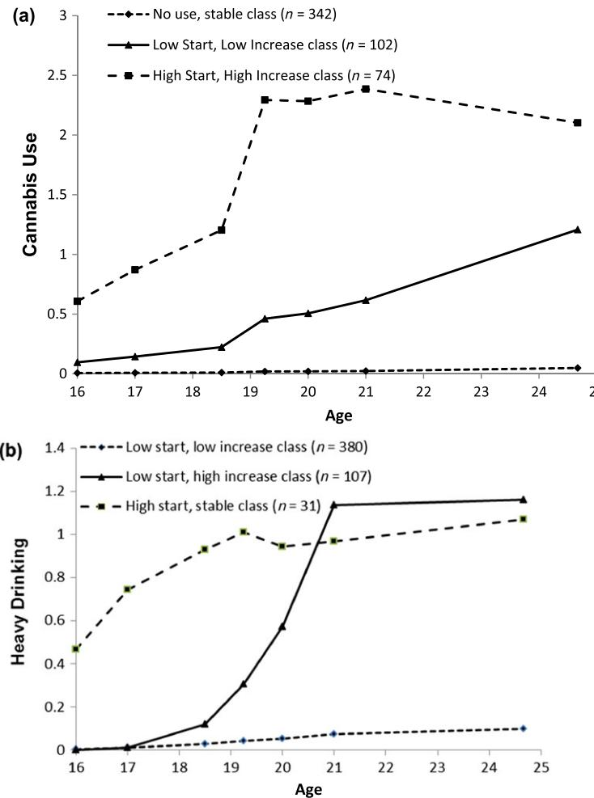
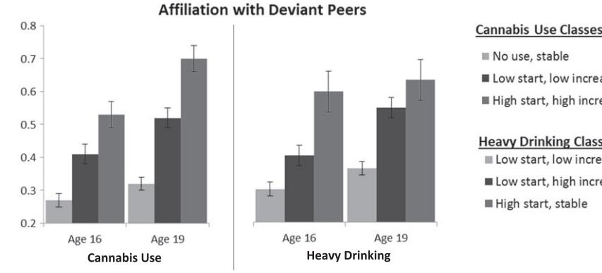
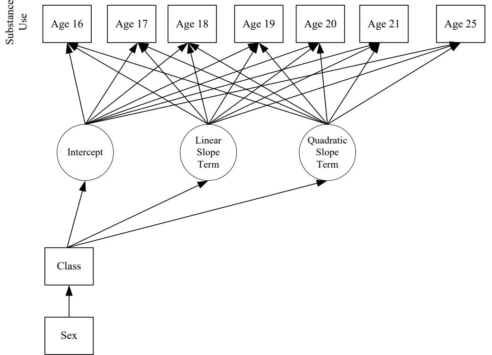

# **Trajectory classes of cannabis use and heavy drinking among rural African American adolescents: multi-level predictors of class membership**

**Allen W. Barton1 [,](http://orcid.org/0000-0002-8888-2612) Gene H. Brody1 , Tamika C. B. Zapolski2 , Trenette C. Goings3 , Steven M. Kogan4 , Michael Windle5 & Tianyi Yu1**

Center for Family Research, University of Georgia, Athens, GA, USA,1 Department of Psychology, Indiana University, Purdue University Indianapolis, Indianapolis, IN, USA,2 School of SocialWork, University of North Carolina at Chapel Hill, Chapel Hill, NC, USA,3 Department of Human Development and Family Science, University of Georgia, Athens, GA, USA4 and Department of Behavioral Sciences and Health Education, Rollins School of Public Health, Emory University, Atlanta, GA, USA5

#### **ABSTRACT**

**Aims** To inform research on the etiology and prevention of substance use among rural African American youth by (a) identifying developmental trajectory classes of cannabis use and heavy drinking across adolescence and young adulthood and (b) examining associations between trajectory class membership and multi-level assessments of risk factors. **Design** A prospective study spanning 9 years with assessments of cannabis use and heavy drinking, the catecholamines epinephrine and norepinephrine, perceived stress and psychosocial risk factors. **Setting** Rural communities in the southeastern United States. **Participants** African American youth (*n* = 518). **Measurements** Participants were assessed for cannabis use and heavy drinking at seven assessments beginning at 16 years of age and continuing to 25 years of age. At age 19, participants provided overnight urine voids that were assayed for catecholamines, a biological marker of life stress resulting from sympathetic nervous system activation. At ages 16 and 19, participants provided information on malleable psychosocial risk factors. **Findings** Latent class growth models revealed three distinct trajectory classes for cannabis use and for heavy drinking. Higher levels of circulating stress hormones and perceived stress were associated with classes reporting greater substance use over time (all *P*s *<* 0.05). A composite of selected risk factors discriminated class membership (all *P*s *<* 0.05). Trajectory classes characterized by rapid usage increases in early adulthood exhibited the greatest increase in deviant peer affiliations between ages 16 and 19 years. **Conclusions** Rural African American youth's cannabis use and heavy drinking across adolescence and young adulthood demonstrate distinct developmental courses; a small number of risk factors and measures of biological and perceived stress differentiate class membership prognostically. Variability over time in these measures, specifically an increase in deviant peer affiliation, may help to account for steep increases in young adulthood.

**Keywords** African American, cannabis, heavy drinking, latent class growth modeling, risk factors, stress.

*Correspondence to:* Allen W. Barton, Center for Family Research, University of Georgia, 1095 College Station Road, Athens, GA 30602-4527, USA. E-mail: awbarton@uga.edu

Submitted 1 May 2017; initial review completed 26 July 2017; final version accepted 12 February 2018

#### **INTRODUCTION**

Alcohol and cannabis are the drugs most commonly used among adolescents and young adults in the United States [1]. The widespread use of these drugs is a significant public health issue because of the negative social and health outcomes associated with their use, such as impairments in critical thinking and memory, drug-related injuries and illnesses and an elevated risk for violence and delinquent behavior [2]. Understanding and preventing drug use is particularly important for African American youth and adults, who experience more negative consequences per ounce of alcohol or other drugs consumed than do members of other racial groups [3]. In addition, epidemiological research has identified a variety of intriguing findings concerning the uniqueness of African American youth's and adults'substance use patterns [4–9]. The most notable of these findings concerns African American individuals' relatively high use during adulthood, despite a late onset and low rates of use during adolescence [10]; this phenomenon has been termed the 'racial crossover effect' [11]. Epidemiological research describing the racial crossover effect, however, has been based primarily on crosssectional analyses (see Keyes *et al*. [12] for an exception). Furthermore, most research on substance use among minority populations has focused upon between-race comparisons (e.g. Chen *et al*. [6]); consequently, important within-race differences in substance use trajectories have not been detected, particularly among non-urban minorities. The first aim of this report, therefore, was to characterize cannabis and heavy alcohol use among a representative sample of rural African American adolescents during a 9-year period, beginning when the participants were 16 years of age. Using a person-centered data analytical approach, latent class growth modeling, we expected to find two or more distinct trajectory classes for cannabis use and for heavy drinking; possible trajectories included: stable low use, stable high use, late-onset rapid increase and concave parabolic (e.g. increasing use in adolescence, decreasing use in young adulthood).

A second aim of the study was to test the conjecture that biological markers and perceptions of stress, along with a selected set of psychosocial risk factors, would differentiate substance use classes. A growing body of literature has emphasized the importance of exposure to stress in the epidemiology of African American adults' substance use (e.g. Green *et al*. [13]). Most extant studies on this topic have focused upon the contemporaneous association between self-reported stress levels and elevated substance use (e.g. Mulia *et al*. [14]). However, as outlined in models of allostatic load [15] and the biological embedding of poverty [16], exposure to stress during childhood and adolescence can incubate over time and weather multiple physiological systems in a manner that renders individuals susceptible to drug use [17]. As a result, patterns of substance use among young African American adults may have developmental, biological origins as a result of undetected elevations in stress markers 'under the skin' [18]. Prospective research investigating the stress incubation hypothesis for substance use, however, is sparse. The current study provides a preliminary examination of this hypothesis by investigating the ways in which levels of catecholamines (biological markers of stress resulting from sympathetic nervous system activation) forecast differences in substance use trajectory classes; group differences in perceived stress are also explored.

Psychosocial risk factors may also differentiate substance use trajectory patterns. In particular, change in these factors following high school may account for the steep increases in substance use that some individuals exhibit at this time. We propose that African American youth who evince low levels of drug use across adolescence followed by a precipitous increase during young adulthood will report an increase in risk factors that presage increases in drug use. Informed by the literature on the etiology of drug use among African American samples, we investigated group differences in psychosocial risk factors related to negative academic orientation, racial discrimination, affiliations with deviant peers and parent–youth relationships [19–22]. Given research noting the importance of considering multiple risk factors in developmental research [23], as well as other research emphasizing the importance of examining individual measures as a means to facilitate specificity and interpretation [24], group differences in risk factors were investigated using composite and individual measures. These risk factors were assessed at ages 16 and 19, allowing us to determine whether change in some or all of them during the transition to adulthood was associated with a pattern of young adult onset/precipitous increase in drug use among a subgroup of African American young adults.

To summarize, in the present study we examined 9-year developmental trajectories of cannabis use and heavy drinking among a sample of rural African American young people during adolescence and into adulthood. This demographic continues to represent an understudied population, even among studies with African American samples, which have focused predominantly upon youth living in urban settings (e.g. Pardini *et al*. [9]). We also investigated biological and psychosocial factors predicting class membership. Particular attention was given to the ways in which variability in stress and risk factors may account for rapid increases in use. Accordingly, the current study provides one of the first prospective analyses of the nature and correlates of African American individuals' substance use trajectories across adolescence and young adulthood. The results can clarify the etiology of substance use among this understudied demographic group and inform prevention and treatment approaches.

#### **METHOD**

#### **Participants**

The present sample was drawn from a larger longitudinal study of African American families that began when youth were 11 years of age. The families in that study resided in small towns and communities in rural Georgia, in which poverty rates are among the highest in the nation and unemployment rates are above the national average [25]. From lists of 5th-grade students that schools provided, 667 families were selected randomly for an initial assessment (see Brody *et al*. [26]). Participating families then completed additional periodic assessments during the next 14 years. Because rates and variability in cannabis use and heavy drinking during the first four waves of data collection (spanning ages 11–15 years) were minimal (*<* 2% at each wave), the first data point used in the present analyses corresponded to wave 5 in the original study, when the youth's mean age was 16 years. For the current study, we selected individuals who provided information for at least one assessment during adolescence (ages 16–18) and at least one assessment during young adulthood (ages 19–25); the final study sample included 518 participants. Comparisons using independent *t*-tests and χ2 tests of these 518 youth with the 149 not included revealed no differences based on youth sex, youth age, parent age, parental education or other demographic variables (i.e. poverty status, family structure, parental employment) at the initial assessment (see Supporting information, Table S1). Of the youth in the final sample, 54% were female. At baseline, 42% of families lived below federal poverty standards, with a median family income per month of \$2080 [standard deviation (SD) = \$1432].

#### **Procedures**

Youth provided data at seven assessments at mean ages 16, 17, 18, 19, 20, 21 and 25. Sample sizes at each wave were, respectively, 460, 455, 515, 495, 481, 461 and 408. At each wave, primary caregivers consented to minor youth's participation in the study, and minor youth assented to their own participation. Youth aged 18 and older consented to their own participation. All data were collected in participants' homes using a standardized protocol. African American field researchers visited families' homes to administer computer-based interviews at each wave of data collection, allowing responses to sensitive questions to be input privately by respondents. All assessments were conducted with no other family members present. At the age 16 and 19 assessments, youth and their primary care-givers provided information on psychosocial risk processes. Overnight urine voids were collected from youth at age 19, from which the catecholamines epinephrine and norepinephrine were assayed. Participants were compensated \$100 at each data collection wave. The Institutional Review Board of the sponsoring research institution approved the study protocol.

#### **Measures**

#### *Cannabis use*

To assess levels of past-month cannabis use, youth were asked at each of the seven waves in the study: 'During the past month, on how many days did you use marijuana?'. Response options were 0 = none, 1 = one to three, 2 = four to seven, 3 = eight to 12, 4 = 13 to 19 and 5 = 20 or more. This question was based on a widely used instrument from the Monitoring the Future Study [27].

#### *Heavy drinking*

To assess levels of past-month heavy drinking, youth were asked at each wave: 'During the past month, on how many days have you drunk three or more drinks at one time?' from ages 16 to 18 and '…on how many days have you drunk four or more drinks at one time?' from ages 19 to 25. As with cannabis use, response options ranged from 0 = none to 5 = 20 or more. This question was based on a widely used instrument from the Monitoring the Future Study [27].

#### *Catecholamines*

The catecholamine measurement protocol was based on procedures that Evans*et al*. [28] and Brody *et al*. [29] developed for field studies involving children and adolescents. Participants received training and supplies on the day of their data collection visit for collecting all urine voided from 8 p.m. that evening to 8 a.m. the next morning. On that morning, a research assistant visited the home and stored the urine on ice in a container with metabisulfite as a preservative prior to transporting it to a laboratory at the University of Georgia. The total volume was then recorded and four 10-ml samples were extracted randomly and deep-frozen at 80° C until subsequent assays were completed. The pH of two of these samples was adjusted to 3 to inhibit catecholamine oxidation. The frozen urine was delivered to the Emory University Hospital medical laboratory in Atlanta, Georgia, for assaying. Epinephrine and norepinephrine were assayed with high-pressure liquid chromatography with electrochemical detection [30]. For epinephrine, mean intra-assay coefficients of variation (CV) for non-sequential duplicates are 27.1% (*<* 40 pg/ ml), 13.5% (40–80 pg/ml) and 9.6% (*>* 80 pg/ml); pooled samples mean interassay CV for 60 to 140 pg/ml is 16.3%; and blanks read 7.0 ± 14.5 (SD) pg/ml. For norepinephrine, mean intra-assay CVs for non-sequential duplicates are 6.6% (*<* 400 pg/ml), 6.5% (400–800 pg/ml) and 7.1% (*>* 800 pg/ml); pooled mean interassay CV for 300–500 pg/ml is 10.3%; and blanks read 6.0 ± 10.3 (SD) pg/ml. Creatinine assay via Jaffe rate methods controlled for body size differences and incomplete urine voiding [31]. Sympathetic nervous system (SNS) catecholamine scores were calculated by summing standardized scores for overnight epinephrine and norepinephrine (*r* = 0.545, *P <* 0.001); higher scores indicated greater amounts of stress hormones circulating in the body.

#### *Perceived stress*

Youth perceptions of stress were assessed using 10 items from the Perceived Stress Scale [32], an instrument that has been used in multiple previous studies with African American samples that support its reliability (α = 0.82) and predictive validity [33,34]. Response options ranged from 1 = never to 5 = very often. Sample items included how often in the past month participants: 'felt that you were unable to control the important things in your life' and 'found that you could not cope with all the things that you had to do' (α = 0.81). Higher scores indicated greater perceived stress.

#### *Risk factors*

Negative academic orientation was assessed using 20 items that Conger [35] developed. Sample items, rated from 1 = strongly disagree to 5 = strongly agree, involved youth's attitudes (e.g. 'School bores me'), motivation [e.g. 'I try hard at school' (reverse-coded)], efficacy [e.g. 'I do most of my school work without help from others' (reverse-coded)] and relationships with teachers ['I get along well with my teachers' (reverse-coded)]. Items were summed, with higher scores indicating more negative academic orientations. Coefficients alpha at ages 16 and 19 exceeded 0.87, as in previous research [36]. Youth who, at age 19, reported that they were not currently in school (*n* = 155; 31% of age 19 sample) were asked to 'think about the last time you went to school or an educational program' when completing the measure.

Perceived racial discrimination was assessed with the Schedule of Racist Events [37]. This measure has demonstrated concurrent and predictive validity and good reliability in previous studies involving rural African American youth [38]. Items assessed the frequency with which respondents had perceived specific discriminatory events during the previous year, on a scale from 0 = never happened to 2 = happened a lot. These events included racially based slurs and insults, disrespectful treatment from community members, physical threats and false accusations from business employees or law enforcement officials. Items were summed, with higher scores indicating more experiences with racial discrimination. Coefficients alpha for the scale were 0.88 at age 16 and 0.91 at age 19.

Deviant peer affiliation was assessed through youth's reports of the proportions of their close friends who engaged in deviant or risk-taking behaviors, drawn from Elliot's work with delinquent youth [39]. Behaviors included selling drugs, getting into trouble with the police, skipping school and damaging property. Response options ranged from 0 = none of them to 2 = all of them. Cronbach's alpha was 0.90 at ages 16 and 19. Previous studies with this measure support its reliability and predictive validity [40,41]. At age 16 years, 13 behaviors were assessed; and at age 19 years, 14 behaviors were assessed. Responses to items were averaged, with higher scores indicating more peer deviance or risk-taking behaviors.

Parent–child arguments were assessed using a sevenitem adaptation of the Ineffective Arguing Inventory (IAI) [42]. Designed originally for adult spouses and domestic partners, we adapted the IAI for use with parents and children. The adapted version has been used in prior research with rural African American families that support its reliability (α = 0.57–0.71) and predictive validity [43,44]. In this seven-item measure, youth reported their perceptions of the frequency, from 1 = strongly disagree to 5 = strongly agree, of unsettled arguments, lingering anger and conflicted communications with their parents. Sample items include: 'You and this person go for days being mad at each other' and 'You and this person's arguments are left hanging and unsettled'. Cronbach's alphas were 0.70 at age 16 and 0.84 at age 19.

All risk factors were assessed using these measures at ages 16 and 19. Measures were standardized prior to averaging for the composite measure for each age. Measures comprising the composite were all correlated significantly (0.10 *< r <* 0.44; *P* ≤ 0.017; see Supporting information, Table S2) with other measures in the composite at that time-point.

#### **Plan of analysis**

The data analyses were executed in three stages. First, latent class growth models (LCGMs) with linear and quadratic slopes were used to identify trajectories of (a) cannabis use and (b) heavy drinking from 16 to 25 years of age (see Supporting information, Fig. S1 for growth curve model diagram). We compared model fits of one-, two-, three- and four-class LCGMs, assessing their relative fit with conventional indices, including the Bayesian information criterion (BIC), entropy value and the Lo–Mendell–Rubin adjusted likelihood ratio (adjusted LRT [45]). Lower BIC scores indicated better fit, whereas higher entropy scores reflected greater accuracy in classification. Optimal models were chosen on the basis of goodness of fit and parsimony; BIC scores received primary focus. Secondly, we conducted orthogonal linear contrasts to determine whether the means of the biological and psychosocial indicators increased or decreased across substance use classes in a linear manner. Thirdly, univariate between-group analyses of covariance (ANCOVAs) and repeated-measures ANCOVAs were used to test specific comparisons in the composite and individual risk factors across substance use trajectory classes.

All growth curve analyses were conducted using Mplus version 7.4 software [46]. Given the overdispersion of zeros, substance use was modeled as zero-inflated Poisson count variables in LCGMs. Factor loadings for the rate of change parameters were set equal to mean age at the particular wave of data collection and the intercept representing participants' substance use at age 16. ANCOVAs were conducted in IBM SPSS version 24 [47], with *post-hoc* analyses using least significant difference tests. Missing data for cannabis use and heavy drinking were fewer than 12% throughout all seven waves in the study and were handled via full information maximum likelihood in Mplus. Missing data were fewer than 7% for the risk factor measures and stress markers. Sex was included as a predictor of class membership in the LCGMs, given previous research indicating significant differences in rates of substance use between sexes [6]. Sex and a family socio-economic status risk index (see Brody *et al*. [26]) were included as control variables in group-based comparisons; baseline risk factor levels were also included as covariates in between-group ANCOVAs examining group differences in age 19 risk factors.

#### **RESULTS**

#### **Modeling of cannabis use and heavy drinking trajectories**

The results for the LCGM analyses are summarized in Table 1. For cannabis use, BIC values declined with greater numbers of classes. Entropy values and the LRT ratios, however, indicated that a three-class solution fitted better than the four-class solution. For heavy drinking, the three-class solution had the lowest BIC value and highest entropy value. Thus, three-class models were chosen for both substances. The resulting plots of the three-class solutions for cannabis use and heavy drinking are shown in Fig. 1, and the corresponding parameter estimates for each class are shown in Table 2.

For cannabis use, the majority of participants (66%, *n* = 342) were assigned to the no use, stable class, which had a low intercept at age 16 with continued low use throughout adolescence and young adulthood. The second class, which comprised 20% of the sample (*n* = 102), was the low start, low increase class. Youth in this class had a low intercept at age 16, with use increasing gradually during adolescence and young adulthood. The third class, which comprised 14% of the sample (*n* = 74), was the high start, high increase class. Youth in this class reported the highest intercept and steep rates of increase during the

**Table 1** Results for latent class growth modeling (*n* = 518).

earlier waves of the study, with the most rapid increase occurring between the ages of 18 and 19.

For heavy drinking, the majority of participants (73%, *n* = 380) were assigned to the low start, low increase class, which had a low intercept at age 16 with use increasing slightly throughout adolescence and young adulthood. The second class, which comprised 21% of the sample (*n* = 107), was the low start, high increase class. Youth in this class had a low intercept at age 16, but increased use precipitously between the ages of 19 and 21. The third class, which comprised 6% of the sample, was the high start, stable class. This group reported the highest intercept and continued high use throughout adolescence and young adulthood (results presented in Table 2 indicate no significant change over time for this group).

A review of the trajectory parameters (Table 2) indicated that all classes with significant changes over time had a positive linear term and negative quadratic term. Thus, rates of substance use for these classes demonstrated significant increases over time, but the rate of positive increase diminished over time. That is, in describing the shape of change throughout time, rates of increase were greater at earlier time-points (i.e. in adolescence) than at later time-points (i.e. in young adulthood).

# **Differences among cannabis use and heavy drinking classes**

The next set of analyses was executed to determine class differences across (a) biological and subjective measures of stress at age 19 and (b) psychosocial risk factors at ages 16 and 19. Using linear contrasts (see Table 3), significant effects emerged for nearly all constructs; these exceptions were age 19 parent–child arguments (for cannabis use and heavy drinking classes), as well as age 19 negative academic orientation and catecholamine levels (for heavy

|                        | Model-fit indices |      | Percentage of sample in class |         |      |     |    |    |    |
|------------------------|-------------------|------|-------------------------------|---------|------|-----|----|----|----|
| Substance and model | Log likelihood    | BIC  | Entropy                       | LMR LRT | P    | 1   | 2  | 3  | 4  |
| Cannabis use           |                   |      |                               |         |      |     |    |    |    |
| One class              | 2642              | 5359 | –                             | –       | –    | 100 |    |    |    |
| Two class              | 1969              | 4033 | 0.86                          | 578     | 0.00 | 74  | 26 |    |    |
| Three class            | 1917              | 3959 | 0.76                          | 101     | 0.03 | 66  | 20 | 14 |    |
| Four class             | 1896              | 3947 | 0.76                          | 41      | 0.25 | 68  | 12 | 11 | 10 |
| Heavy drinking         |                   |      |                               |         |      |     |    |    |    |
| One class              | 2005              | 4085 | –                             | –       | –    | 100 |    |    |    |
| Two class              | 1482              | 3059 | 0.73                          | 288     | 0.00 | 78  | 22 |    |    |
| Three class            | 1454              | 3034 | 0.73                          | 62      | 0.06 | 73  | 21 | 6  |    |
| Four class             | 1443              | 3042 | 0.64                          | 41      | 0.03 | 61  | 27 | 6  | 5  |

BIC = Bayesian information criterion; LMR LRT = Lo–Mendell–Rubin likelihood ratio test.

**Figure 1** Latent class growth curve trajectories of (a) cannabis use and (b) heavy drinking. [Colour figure can be viewed at [wileyonlinelibrary.com\]](http://wileyonlinelibrary.com)

|                           | Trajectory parameter |             |                |  |  |  |  |
|---------------------------|----------------------|-------------|----------------|--|--|--|--|
| Substance and class       | Intercept            | Linear term | Quadratic term |  |  |  |  |
| Cannabis use              |                      |             |                |  |  |  |  |
| No use, stable            | 4.595**              | 0.234       | 0.002          |  |  |  |  |
| Low start, low increase   | 1.902                | 0.425       | 0.013          |  |  |  |  |
| High start, high increase | 0.057                | 0.395**     | 0.027**        |  |  |  |  |
| Heavy drinking            |                      |             |                |  |  |  |  |
| Low start, low increase   | 5.465**              | 0.752**     | 7.268*         |  |  |  |  |
| Low start, high increase  | 6.556**              | 2.181**     | 0.162**        |  |  |  |  |
| High start, stable        | 0.484                | 0.203       | 0.016          |  |  |  |  |

|  | Table 2 Class parameter estimates (n = 518). |  |  |  |  |
|--|----------------------------------------------|--|--|--|--|
|--|----------------------------------------------|--|--|--|--|

\**P <* 0.05; \*\**P <* 0.01.

drinking classes only). Thus, overall results indicated that individuals in cannabis use and heavy drinking classes characterized by higher levels of use also reported higher levels of perceived stress and catecholamines (for cannabis use only) at age 19 as well as elevated psychosocial risk factors at ages 16 and 19 (with exceptions of age 19 parent–child arguing and negative orientation).

Mirroring findings from linear contrasts, betweengroup ANCOVAs revealed significant omnibus differences among cannabis use classes and heavy drinking classes for all composite and individual measures, except for differences among heavy-drinking groups in catecholamine levels as well as heavy-drinking groups and cannabis use groups in age 19 parent–child arguing. In addition,

|                               | Cannabis use |      |       | Heavy drinking |      |       |  |
|-------------------------------|--------------|------|-------|----------------|------|-------|--|
|                               | Estimate     | SE   | P     | Estimate       | SE   | P     |  |
| Stress markers (age 19)       |              |      |       |                |      |       |  |
| Catecholamines                | .423         | 0.18 | 0.017 | .350           | 0.26 | 0.174 |  |
| Perceived stress              | .236         | 0.10 | 0.017 | .480           | 0.14 | 0.001 |  |
| Risk factors (age 16)         |              |      |       |                |      |       |  |
| Composite                     | 0.49         | 0.07 | 0.000 | 0.62           | 0.09 | 0.000 |  |
| Negative academic orientation | 5.28         | 0.97 | 0.000 | 4.87           | 1.39 | 0.001 |  |
| Racial discrimination         | 1.18         | 0.34 | 0.001 | 2.16           | 0.47 | 0.000 |  |
| Deviant peer affiliation      | 0.19         | 0.03 | 0.000 | 0.21           | 0.04 | 0.000 |  |
| Parent–child arguing          | 2.23         | 0.46 | 0.000 | 3.11           | 0.65 | 0.000 |  |
| Risk factors (age 19)         |              |      |       |                |      |       |  |
| Composite                     | 0.27         | 0.05 | 0.000 | 0.15           | 0.08 | 0.048 |  |
| Negative academic orientation | 3.95         | 0.94 | 0.000 | 1.78           | 1.36 | 0.192 |  |
| Racial discrimination         | 0.81         | 0.30 | 0.000 | 0.91           | 0.43 | 0.034 |  |
| Deviant peer affiliation      | 0.21         | 0.03 | 0.000 | 0.10           | 0.04 | 0.000 |  |
| Parent–child arguing          | 0.02         | 0.51 | 0.974 | 0.45           | 0.74 | 0.541 |  |

#### **Table 3** Polynomial contrasts.

Class means and group difference comparisons are shown in Table 4. SE = standard error.

repeated-measures ANCOVAs to identify potential group differences in change over time on individual risk factors indicated, for cannabis use class, a significant class × time interaction for reported deviant peer affiliation (*F*(2435) = 4.339, *P* = 0.01; see Supporting information, Table S3 for summary statistics for all risk factors). Thus, in the remainder of the Results section, results are presented with respect to between-group ANCOVAs for all outcomes except for deviant peer affiliation, which are presented with repeated-measures ANCOVAs.

Mean levels and *post-hoc* comparisons of ANCOVA analyses are summarized in Table 4. Group differences among cannabis use classes were as follows. Individuals assigned to the high start, high increase class manifested significantly greater catecholamine levels at age 19 than did the no use, stable class. High start, high increase and low start, low increase classes both perceived higher levels of stress at age 19 than did the no use, stable class. With respect to the composite risk factor, significant differences in risk were evident across all three classes at age 16, with the highest levels of risk factors reported by the high start, high increase class and the lowest levels reported by the no use, stable class. At age 19, the high start, high increase class continued to exhibit

#### **Table 4** Class means and between class comparisons.

|                         | Cannabis use class |                               |                              |       |       |        | Heavy drinking class          |                                |                          |       |       |        |
|-------------------------|--------------------|-------------------------------|------------------------------|-------|-------|--------|-------------------------------|--------------------------------|--------------------------|-------|-------|--------|
| Variables               | No use, stable  | Low start, low increase | High start, high increase | F     | P     | 2 η | Low start, low increase | Low start, high increase | High start, stable | F     | P     | 2 η |
| Stress markers (age 19) |                    |                               |                              |       |       |        |                               |                                |                          |       |       |        |
| Catecholamines          | 0.14               | 0.10                          | 0.45 (0.23)b                 | 30.09 | 0.046 | 0.01   | 0.11                          | 0.22                           | 0.39                     | 1.93  | 0.146 | 0.01   |
|                         | (0.10)a            | (0.19)                        |                              |       |       |        | (0.10)                        | (0.18)                         | (0.35)                   |       |       |        |
| Perceived stress        | 0.09               | 0.17                          | 0.24 (0.13)c                 | 40.39 | 0.013 | 0.02   | 0.09                          | 0.19                           | 0.59                     | 7.79  | 0.000 | 0.03   |
|                         | (0.06)a            | (0.11)b                       |                              |       |       |        | (0.05)a                       | (0.10)b                        | (0.19)b                  |       |       |        |
| Risk factor composite   |                    |                               |                              |       |       |        |                               |                                |                          |       |       |        |
| Age 16                  | 0.17               | 0.25                          | 0.52 (0.08)c                 | 35.63 | 0.000 | 0.14   | 0.13                          | 0.24                           | 0.76                     | 29.55 | 0.000 | 0.12   |
|                         | (0.04)a            | (0.07)b                       |                              |       |       |        | (0.04)a                       | (0.07)b                        | (0.13)c                  |       |       |        |
| Age 19                  | 0.09               | 0.04                          | 0.30 (0.07)b                 | 12.81 | 0.000 | 0.06   | 0.07                          | 0.15                           | 0.15                     | 7.02  | 0.001 | 0.03   |
|                         | (0.03)a            | (0.06)a                       |                              |       |       |        | (0.03)a                       | (0.05)b                        | (0.11)b                  |       |       |        |

Covariates: Target gender and SES risk index (all models); age 16 risk factor composite (for models comparing age 19 risk factor composite). Variable (sample size): catecholamines (*n* = 455), perceived stress (*n* = 466), risk factor composite, age 16 (*n* = 464) and risk factor composite, age 19 (*n* = 495). Significant group differences indicated by superscript letters (*p <* 0.05).

greater levels of risk factor compared to the other two cannabis use classes.

Differences were also evident across heavy drinking class trajectories. Individuals assigned to the high start, stable and low start, high increase classes both perceived higher levels of stress at age 19 than did those in the low start, low increase class. At age 16, significant differences in risk factors were evident throughout all three classes. However, at age 19, the low start, high increase class (who previously reported lower levels of risk factors than did the high start, stable group) now reported similar levels of risk to the high start, stable group, both of which were significantly higher than the low start, low increase class.

For both cannabis use and heavy drinking, group comparisons on individual-level risk factors revealed similar findings (see Supporting information, Table S4 for tabulated summary). For cannabis use, the no use, stable class consistently reported the lowest levels of risk factors at ages 16 and 19 of any class. Risk factors for the low start, low increase class were less than or equivalent to the high start, high increase class, depending on the particular risk factor. For heavy drinking, the low start, low increase class reported lower levels of risk factors consistently at ages 16 and 19 than either of the other two heavy drinking class. The low start, high increase class, in the majority of comparisons, was similar to the high start, stable class.

Given the significant cannabis use class × time interaction for reported deviant peer affiliation identified in repeated-measures ANCOVAs (Supporting information, Table S3), we plotted mean levels of deviant peer affiliation for each cannabis use class at ages 16 and 19 to clarify the nature of this interaction. The results, shown in Fig. 2, indicated that the greatest increase in deviant peer affiliation over time was associated with the high start, high increase class. For heuristic purposes, Fig. 2 also presents differences in deviant peer affiliation over time for heavy drinking classes, for which the interaction approached statistical significance (*F*(2435) = 2.526, *P* = 0.08). As with cannabis use, the greatest increase in deviant peer affiliation was evident in the class characterized by the steepest increase in use during the transition to adulthood, which for heavy drinking was the low start, high increase class. Thus, individuals in classes with steep mean increases in levels of cannabis use and heavy drinking around the transition to young adulthood were also characterized by greater increases in deviant peer affiliation. Differences between classes in change over time were not evident for any other risk factor.

## **DISCUSSION**

In this study, we sought to identify the developmental course of rural African American adolescents' substance use and its predictors by identifying trajectory classes of cannabis use and heavy drinking and multi-level correlates of class membership. LCGMs demonstrated that cannabis use and heavy drinking were each characterized by three general classes, with rapid growth in young adulthood documented in one class for cannabis use and one class for heavy drinking. For heavy drinking, the steeply increasing class was observed among individuals with little to no use during adolescence, whereas for cannabis use the steeply increasing class characterized individuals reporting early onset of use. Differences between classes in biological and perceived measures of stress also emerged; results were consistent with the proposition that elevated levels of biological and perceived stress are associated with elevations in substance use over time. The selected risk factors reliably differentiated class membership; comparisons of levels over time indicated that classes manifesting greater accelerations in use between ages 16 and 19 were characterized by a concomitant greater increase in deviant peer affiliation. Results from this study provide new information regarding substance use patterns among African Americans living in rural areas as well as factors that discriminate class membership.

**Figure 2** Group differences at age 16 and 19 in deviant peer affiliation for cannabis use classes and heavy drinking classes. Error bars = ± 1 standard error. Effect size [from between-group analyses of covariance (ANCOVAs)]: age 16; η2 = 0.10 (cannabis use) and = 0.06 (heavy drinking); age 19: η2 = 0.20 (cannabis use) and = 0.09 (heavy drinking)

Consistent with prior research with mixed-race samples (see Nelson *et al*. [48]), the trajectory classes identified for both cannabis use and heavy drinking were characterized by (1) no/low incidence, (2) early onset and high use or (3) low onset with increasing use. No evidence emerged, however, for a mean decline in any class throughout young adulthood, despite its documentation in other samples of various racial groups [48]. These findings suggest that, for rural African American young adults, substance use may demonstrate a young adult perpetuation pattern whereby usage rates do not decline as individuals mature out of young adulthood. This pattern contrasts with the young adult limited pattern found in the general population, in which usage rates decline in the middle and late 20s [49]. Additional longitudinal studies on these patterns are clearly needed, as are efforts to elucidate factors that account for African American adults' sustained use, including the potential lack of stable life reinforcers (see Zapolski *et al*. [3]). As another contribution of the current study, linear and quadratic parameter estimates also revealed greater fluctuation in substance use rates in adolescence (ages 16–19) than in early adulthood (ages 19–25), suggesting the importance of prevention efforts that alter developmental trajectories of substance use prior to young adulthood, when patterns of use begin to stabilize.

Both biological markers and perceptions of stress demonstrated prognostic significance for substance use trajectory class membership, associations to which scientists have alluded in prior research (e.g. Sinha [17]) but less frequently examined empirically. Consistent with the stress incubation hypothesis [17], individuals in the highest cannabis use class throughout adolescence and young adulthood had the highest catecholamine levels at age 19. Catecholamine levels did not vary according to heavy drinking class membership. Previous research has suggested that the effects of biological stress on substance use may occur through depressive symptomatology [50] or through immediate coping behaviors [51]. Catecholamine levels may have differentiated cannabis use, but not heavy drinking, classifications to the extent that elevated biological stress levels engendered coping behaviors with anxiolytic properties [52]. Significant group differences in perceived stress also emerged; higher stress characterized trajectories in which substance use increased over time. Taken together, the results underscore the relevance of both elevated biological stress markers and contemporaneous perceptions of stress for African American young adults' substance use patterns.

The risk factors examined in the current study appear to be sensitive markers of membership in both cannabis use and heavy drinking classes. These results underscore the risk-inducing properties of low orientation to schooling, racial discrimination, deviant peer affiliation and conflicted parent–child relationships in forecasting classes of cannabis use and heavy drinking throughout adolescence and young adulthood. Furthermore, the current results suggest that an increase in deviant peer affiliation, along with moderate to high levels of risk in other areas, may help to account for significant increases in cannabis use and heavy drinking around the transition to adulthood. Extending prior research on the influence of peers on concurrent and future substance use [53], results from this study highlight the unique effects of peer affiliation on classes with rapidly increasing substance use during the transition to adulthood. Because risk processes are dynamic, future research can continue to explore the ways in which levels of risk factors fluctuate over time and interact with protective factors to forecast substance use patterns across adolescence and young adulthood among youth residing in rural, urban and other geographic locations.

Several limitations of the present study should be noted. First, consistent with other studies, self-reports of substance use are susceptible to inaccurate recall. Secondly, we assessed only the frequency of use and not the amounts used; therefore, problematic or clinically disordered substance use cannot be documented. Thirdly, causality cannot be determined for the associations of substance use trajectory class membership with risk factors. Fourthly, model entropy for selected classes was low, suggesting the potential for more classes to explain substance use more clearly. Fifthly, because only 4% of primary care-givers were fathers, we lacked a sufficient sample size to test for any differential impacts that care-giver relationship status to child (e.g. mothers, fathers, grandparent) may have on substance use; future research can address this limitation and the others noted herein. These limitations notwithstanding, the current study is one of the first investigations to document African American individuals' cannabis use and heavy drinking prospectively across adolescence and young adulthood and to identify sensitive, multi-level risk factors that distinguish trajectory class memberships. These findings can be used to inform future research on the etiology and prevention of substance use among African American adolescents.

#### **Declaration of interests**

None.

#### **Acknowledgements**

This research was supported by Award Number R01 HD030588 to G.H.B. from the National Institute of Child Health and Human Development and Award Number P30 DA027827 to G.H.B. from the National Institute on Drug Abuse. The content is solely the responsibility of the authors and does not necessarily represent the official views of National Institutes of Health. The authors thank Eileen Neubaum-Carlan for her editorial assistance in the preparation of this paper.

#### **References**

- 1. Johnston L. D., O'Malley P. M., Miech R. A., Bachman J. G., Schulenberg J. E. Monitoring the Future National Survey Results on Drug Use, 1975–2016. Overview: Key Findings on Adolescent Drug Use. Ann Arbor, MI: Institute for Social Research, University of Michigan; 2017.
- 2. US Department of Health and Human Services, National Institutes of Health (NIH), National Institute on Drug Abuse. *Drugs, Brain, and Behavior: the Science of Addiction*. NIH Publication no. 14–5605. Bethesda, MD: NIH; 2014.
- 3. Zapolski T. C. B., Pedersen S. L., McCarthy D. M., Smith G. T. Less drinking, yet more problems: understanding African American drinking and related problems. *Psychol Bull* 2014; **140**: 188–23.
- 4. Finlay A. K., White H. R., Mun E.-Y., Cronley C. C., Lee C. Racial differences in trajectories of heavy drinking and regular marijuana use from ages 13 to 24 among African-American and White males. *Drug Alcohol Depend* 2012; **121**: 118–23.
- 5. Lanza S. T., Vasilenko S. A., Dziak J. J., Butera N. M. Trends among U.S. high school seniors in recent marijuana use and associations with other substances: 1976–2013. *J Adolesc Health* 2015; **57**: 198–204.
- 6. Chen P., Jacobson K. C. Developmental trajectories of substance use from early adolescence to young adulthood: gender and racial/ethnic differences. *J Adolesc Health* 2012; **50**: 154–63.
- 7. Windle M., Kogan S. M., Lee S., Chen Y.-F., Lei K. M., Brody G. H. *et al*. Neighborhood × serotonin transporter linked polymorphic region (5-HTTLPR) interactions for substance use from ages 10 to 24 years using a harmonized data set of African American children. *Dev Psychopathol* 2016; **28**: 415–31.
- 8. Thomas Y. F., Price L. N., editors. *Drug Use Trajectories Among Minority Youth*. New York, NY: Springer Science+Business Media; 2016.
- 9. Pardini D. A., Bechtold J., Loeber R., White H. R. Developmental trajectories of marijuana use among men: examining linkages with criminal behavior and psychopathic features into the mid-30s. *J Res Crime Delinq* 2015; **52**: 797–828.
- 10. National Institute on Drug Abuse. *Drug Abuse Among Racial/Ethnic Minorities, Revised.*, NIH Publication no. 03– 3888. Bethesda, MD: US Department of Health and Human Services, National Institutes of Health; 2003.
- 11. Watt T. T. The race/ethnic age crossover effect in drug use and heavy drinking. *J Ethn Subst Abuse* 2008; **7**: 93–114.
- 12. Keyes K. M., Vo T., Wall M. M., Caetano R., Suglia S. F., Martins S. S. *et al*. Racial/ethnic differences in use of alcohol, tobacco, and marijuana: is there a cross-over from adolescence to adulthood? *Soc Sci Med* 2015; **124**: 132–41.
- 13. Green K. M., Zebrak K. A., Robertson J. A., Fothergill K. E., Ensminger M. E. Interrelationship of substance use and psychological distress over the life course among a cohort of urban African Americans. *Drug Alcohol Depend* 2012; **123**: 239–48.
- 14. Mulia N., Ye Y., Zemore S. E., Greenfield T. K. Social disadvantage, stress, and alcohol use among Black, Hispanic, and White Americans: findings from the 2005 U.S. National Alcohol Survey. *J Stud Alcohol Drugs* 2008; **69**: 824–33.
- 15. McEwen B. S. Stress, adaptation, and disease: allostasis and allostatic load. *Ann NY Acad Sci* 1998; **840**: 33–44.
- 16. Miller G. E., Chen E., Parker K. J. Psychological stress in childhood and susceptibility to the chronic diseases of aging: moving toward a model of behavioral and biological mechanisms. *Psychol Bull* 2011; **137**: 959–97.
- 17. Sinha R. Chronic stress, drug use, and vulnerability to addiction. *Ann NY Acad Sci* 2008; **1141**: 105–30.
- 18. Evans G. W., Chen E., Miller G. E., Seeman T. How poverty gets under the skin: a life course perspective. In: Maholmes V., King R. B., editors. *Oxford Handbook of Poverty and Child Development*. New York, NY: Oxford University Press; 2012, pp. 13–36.
- 19. Wang M.-T., Fredricks J. A. The reciprocal links between school engagement, youth problem behaviors, and school dropout during adolescence. *Child Dev* 2014; **85**: 722–37.
- 20. Murry V. M., McNair L. D., Myers S. S., Y-f C., Brody G. H. Intervention induced changes in perceptions of parenting and risk opportunities among rural African American [*sic*]. *J Child Fam Stud* 2014; **23**: 422–36.
- 21. Clark T. T., Belgrave F. Z., Abell M. The mediating and moderating effects of parent and peer influences upon drug use among African American adolescents. *J Black Psychol* 2012; **38**: 52–80.
- 22. Brody G. H., Y-F C., Kogan S. M. A cascade model connecting life stress to risk behavior among rural African American emerging adults. *Dev Psychopathol* 2010; **22**: 667–78.
- 23. Evans G. W., Li D., Whipple S. S. Cumulative risk and child development. *Psychol Bull* 2013; **139**: 1342–6.
- 24. Freemantle N., Calvert M., Wood J., Eastaugh J., Griffin C. Composite outcomes in randomized trials: Greater precision but with greater uncertainty? *JAMA* 2003; **289**: 2554–9.
- 25. DeNavas-Walt C., Proctor B. D. *Income and Poverty in the United States: 2013.* Current Population Reports P60–249. Washington, DC: US Census Bureau; 2014.
- 26. Brody G. H., Yu T., Y-f C., Kogan S. M., Evans G. W., Beach S. R. H. *et al*. Cumulative socioeconomic status risk, allostatic load, and adjustment: a prospective latent profile analysis with contextual and genetic protective factors. *Dev Psychol* 2013; **49**: 913–27.
- 27. Johnston L. D., O'Malley P. M., Bachman J. G., Schulenberg J. E. *Monitoring the Future National Survey Results on Drug Use, 1975–2006. Volume I: Secondary School Students*. NIH Publication no. 07–6205. Bethesda, MD: National Institute on Drug Abuse; 2007.
- 28. Evans G. W. A multimethodological analysis of cumulative risk and allostatic load among rural children. *Dev Psychol* 2003; **39**: 924–33.
- 29. Brody G. H., Yu T., Y-f C., Kogan S. M., Evans G. W., Windle M. *et al*. Supportive family environments, genes that confer sensitivity, and allostatic load among rural African American emerging adults: a prospective analysis. *J Fam Psychol* 2013; **27**: 22–9.
- 30. Riggin R. M., Kissinger P. T. Determination of catecholamines in urine by reverse-phase liquid chromatography with electrochemical detection. *Anal Chem* 1977; **49**: 2109–11.
- 31. Tietz N. W., editor. *Fundamentals of Clinical Chemistry, 2nd edn.* Philadelphia, PA: Saunders; 1976.
- 32. Cohen S., Kamarck T., Mermelstein R. A global measure of perceived stress. *J Health Soc Behav* 1983; **24**: 385–96.
- 33. Sellers R. M., Caldwell C. H., Schmeelk-Cone K. H., Zimmerman M. C. Racial identity, racial discriminiation, perceived stress, and psychological distress among African American young adults.*J Health Soc Behav* 2003; **44**: 302–17.
- 34. Sims R., Gordon S., Garcia W., Clark E., Monye D., Callender C. *et al*. Perceived stress and eating behaviors in a

community-based sample of African Americans. *Eat Behav* 2008; **9**: 137–42.

- 35. Conger R. D., Elder G. H. Jr. *Families in Troubled Times: Adaptation to Change in Rural America*. New York, NY: Aldine de Gruyter; 1994.
- 36. Kogan S. M., Brody G. H., Gibbons F. X., Y-f C., Grange C. M., Simons R. L. *et al*. Mechanisms of family impact on African American adolescents' HIV-related behavior. *J Res Adolesc* 2011; **21**: 361–75.
- 37. Landrine H., Klonoff E. A. The schedule of racist events: a measure of racial discrimination and a study of its negative physical and mental health consequences. *J Black Psychol* 1996; **22**: 144–68.
- 38. Brody G. H., Miller G. E., Yu T., Beach S. R. H., Chen E. Supportive family environments ameliorate the link between racial discrimination and epigenetic aging: a replication across two longitudinal cohorts. *Psychol Sci* 2016; **27**: 530–41.
- 39. Elliott D. S., Ageton S. S., Huizinga D. *Explaining Delinquency and Drug Use*. Beverly Hills, CA: Siegel; 1985.
- 40. Simons R. L., Simons L. G., Burt C. H., Brody G. H., Cutrona C. E. Collective efficacy, authoritative parenting and delinquency: a longitudinal test of a model integrating community- and family-level processes. *Criminology* 2005; **43**: 989–1029.
- 41. Simons R. L., Wu C.-I., Conger R. D., Lorenz F. O. Two routes to delinquency: differences between early and late starters in the impact of parenting and deviant peers. *Criminology* 1994; **32**: 247–76.
- 42. Kurdek L. A. Conflict resolution styles in gay, lesbian, heterosexual nonparent, and heterosexual parent couples. *J Marriage Fam* 1994; **56**: 705–22.
- 43. Brody G. H., Kim S., Murry V. M., Brown A. C. Longitudinal direct and indirect pathways linking older sibling competence to the development of younger sibling competence. *Dev Psychol* 2003; **39**: 618–28.
- 44. Brody G. H., Y-F C., Kogan S. M., Murry V. M., Logan P., Luo Z. Linking perceived discrimination to longitudinal changes in African American mothers' parenting practices. *J Marriage Fam* 2008; **70**: 319–31.
- 45. Lo Y., Mendell N. R., Rubin D. B. Testing the number of components in a normal mixture. *Biometrika* 2001; **88**: 767–78.
- 46. Muthén L. K., Muthén B. O. *Mplus User's Guide, 7th edn.* Los Angeles, CA: Muthén & Muthén; 1998–2015.
- 47. IBM Corporation. *IBM SPSS Statistics for Windows, version 24*. Armonk, NY: IBM Corporation; 2016.
- 48. Nelson S. E., Van Ryzin M. J., Dishion T. J. Alcohol, marijuana, and tobacco use trajectories from age 12 to 24 years: demographic correlates and young adult substance use problems. *Dev Psychopathol* 2015; **27**: 253–77.
- 49. Wilson H. W., Widom C. S. Predictors of drug-use patterns in maltreated children and matched controls followed up into middle adulthood. *J Stud Alcohol Drugs* 2010; **71**: 801–9.
- 50. De Bellis M. D. Developmental traumatology: a contributory mechanism for alcohol and substance use disorders. *Psychoneuroendocrinology* 2002; **27**: 155–70.
- 51. Brody G. H., Yu T., MacKillop J., Miller G. E., Chen E., Obasi E. M. *et al*. Catecholamine levels and delay discounting forecast drug use among African American youths. *Addiction* 2014; **109**: 1112–8.
- 52. Buckner J. D., Bonn-Miller M. O., Zvolensky M. J., Schmidt N. B. Marijuana use motives and social anxiety among marijuana using young adults. *Addict Behav* 2007; **32**: 2238–52.
- 53. Li F., Barrera M. J., Hops H., Fisher K. J. The longitudinal influence of peers on the development of alcohol use in late adolescence: a growth mixture analysis. *J Behav Med* 2002; **25**: 293–315.

#### **Supporting Information**

Additional Supporting Information may be found online in the supporting information tab for this article.

**Table S1** Descriptive statistics and attrition comparison.

**Table S2** Correlations among psychosocial risk factors.

**Table S3** Class × time interaction in repeated-measures analyses of covariance (ANCOVAs).

**Table S4** Class means and between class comparisons.

**Figure S1** Latent class growth curve model diagram. Individual error terms not shown for purposes of clarity. Factors loadings for intercept: 1, 1, 1, 1, 1, 1, 1. Factors loadings for linear slope term: 0, 1, 2.5, 3.25, 4, 5, 8.67. Factors loadings for quadratic slope term: 0, 1, 6.25, 10.562, 16, 25, 75.169. Variance on trajectory parameters fixed to zero within-class. Sex included as predictor of class membership.

# **Supplemental Tables and Figures**

|                                   | Final Sample (N=518) |      | sample (N=149) |      |                     |  |
|-----------------------------------|----------------------|------|----------------|------|---------------------|--|
|                                   | Mean                 | SD   | Mean           | SD   | c Test Statistic |  |
| Parent age                        | 37.58                | 7.45 | 38.26          | 8.21 | 0.96                |  |
| Target age                        | 11.21                | 0.42 | 11.19          | 0.40 | 0.41                |  |
| Target sex a                      | 0.46                 | NA   | 0.52           | NA   | 2.02                |  |
| Family income below poverty       | 0.38                 | NA   | 0.38           | NA   | 0.10                |  |
| b level                        |                      |      |                |      |                     |  |
| b Single-parent family         | 0.57                 | NA   | 0.51           | NA   | 1.88                |  |
| b Primary caregiver unemployed | 0.22                 | NA   | 0.21           | NA   | 0.01                |  |
| Primary caregiver less than high  | 0.52                 | NA   | 0.52           | NA   | 0.00                |  |
| b school education             |                      |      |                |      |                     |  |

# Table S1. Descriptive Statistics and Attrition Comparison

*Note.* a 1 = Male, 0 = Female. b 1 = Yes. c *T*-test for continuous and ordinal variables; chi-

square cross-tab statistic for binary variables. NA = Not applicable for binary variables.

\**p* ≤ .05, two-tailed.

## AFRICAN AMERICAN SUBSTANCE USE TRAJECTORIES Page S2

Table S2. Correlations Among Psychosocial Risk Factors

|                                  | Age 16 |        |        |     |  | Age 19 |        |       |     |
|----------------------------------|--------|--------|--------|-----|--|--------|--------|-------|-----|
|                                  | 1      | 2      | 3      | 4   |  | 1      | 2      | 3     | 4   |
| 1. Negative academic orientation | ---    |        |        |     |  | ---    |        |       |     |
| 2. Racial hassles questionnaire  | .206** | ---    |        |     |  | .134** | ---    |       |     |
| 3. Deviant peer affiliation      | .359** | .290** | ---    |     |  | .351** | .306** | ---   |     |
| 4. Parent-child arguing          | .438** | .252** | .324** | --- |  | .329** | .168** | .108* | --- |
|                                  |        |        |        |     |  |        |        |       |     |

\* *p* < .05. \*\* *p* < .01

|                               | Cannabis | Use Class |      | Heavy Drinking Class |      |      |
|-------------------------------|----------|-----------|------|-------------------------|------|------|
|                               | df       | F         | p    | df                      | F    | p    |
| Negative academic orientation | 2 , 436  | 1.06      | .346 | 2 , 436                 | 0.13 | .878 |
| Racial discrimination         | 2 , 436  | 1.21      | .300 | 2 , 436                 | 0.18 | .833 |
| Deviant peer affiliation      | 2 , 435  | 4.34      | .014 | 2 , 435                 | 2.53 | .081 |
| Parent-child arguing          | 2 , 435  | 1.77      | .172 | 2 , 435                 | 0.89 | .410 |

Table S3. Class × Time Interaction in Repeated Measures ANCOVAs

Note: df = degrees of freedom (numerator, error).

\* *p* < .05. \*\* *p* < .01.

|                               | Cannabis Use Class  |                     |                      |       | Heavy Drinking Class |                     |                     |                     |       |      |
|-------------------------------|---------------------|---------------------|----------------------|-------|-------------------------|---------------------|---------------------|---------------------|-------|------|
| Variables                     | No use,             | Low Start,          | High Start,          |       |                         | Low Start,          | Low Start,          | High Start,         |       |      |
|                               | stable              | Low Increase        | High Increase        | F     | p                       | Low Increase        | High Increase       | Stable              | F     | p    |
| Stress markers (age 19)       |                     |                     |                      |       |                         |                     |                     |                     |       |      |
| Catecholamines                | -0.14 (.10)a        | 0.10 (.19)          | 0.45 (.23)b          | 3.09  | .046                    | -0.11 (.10)         | 0.22 (.18)          | 0.39 (.35)          | 1.93  | .146 |
| Perceived stress              | -0.09 (.06)a        | 0.17 (.11)b         | 0.24 (.13)c          | 4.39  | .013                    | -0.09 (.05)a        | 0.19 (.10)b         | 0.59 (.19)b         | 7.79  | .000 |
| Risk factor composite         |                     |                     |                      |       |                         |                     |                     |                     |       |      |
| Age 16                        | (.04)a -0.17     | b 0.25 (.07)  | c 0.52 (.08)   | 35.63 | .000                    | a -0.13 (.04) | b 0.24 (.07)  | c 0.76 (.13)  | 29.55 | .000 |
| Age 19                        | (.03)a -0.09     | (.06)a 0.04      | (.07)b 0.30       | 12.81 | .000                    | -0.07 (.03)a        | b 0.15 (.05)     | (.11)b 0.15      | 7.02  | .001 |
| Negative academic orientation |                     |                     |                      |       |                         |                     |                     |                     |       |      |
| Age 16                        | a 35.09 (.56)    | b 39.51 (1.04)   | c 42.56 (1.23)    | 18.35 | .000                    | a 35.94 (.54)    | b 38.76 (1.02)   | b 42.83 (1.89)   | 8.37  | .000 |
| Age 19                        | a 37.55 (.54)    | a 39.17 (.99) | b 43.13 (1.19) | 8.82  | .000                    | 38.29 (.52)      | 39.41 (.97)      | 40.81 (1.84)     | 1.18  | .308 |
| Racial discrimination         |                     |                     |                      |       |                         |                     |                     |                     |       |      |
| Age 16                        | a 2.99 (.20)     | b 4.76 (.36)     | b 4.65 (.43)      | 12.65 | .000                    | a 2.95 (.18)     | b 5.03 (.34)     | b 6.00(.63)      | 21.77 | .000 |
| Age 19                        | a 2.86 (.17)  | 3.20 (.32)       | b 4.01 (.37)      | 3.81  | .023                    | a 2.79 (.16)  | b 3.91 (.31)  | b 4.07 (.58)  | 6.28  | .002 |
| Parent-child arguing          |                     |                     |                      |       |                         |                     |                     |                     |       |      |
| Age 16                        | a 15.04 (.27) | 16.24 (.50)         | b 18.20 (.59)  | 12.27 | .000                    | a 15.27 (.25) | a 16.16 (.48) | b 19.66 (.88) | 11.80 | .000 |
| Age 19                        | 16.96 (.29)         | 16.46 (.54)         | 16.99 (.65)          | 0.37  | .694                    | 16.67 (.28)      | 17.46 (.52)         | 17.31 (1.00)        | 0.97  | .378 |
| peer affiliation1 Deviant  |                     |                     |                      |       |                         |                     |                     |                     |       |      |
| Age 16                        | a 0.27 (.02)     | b 0.41 (.03)     | c 0.53 (.04)      |       |                         | a 0.30 (.02)     | b 0.40 (.03)     | c 0.59 (.06)     |       |      |
| Age 19                        | a 0.32 (.02)     | b 0.52 (.03)     | c 0.69 (.04)      | 55.96 | .000                    | a 0.36 (.02)     | b 0.54 (.03)     | b 0.62 (.06)     | 24.07 | .000 |

|  | Table S4. Class |  | Means |  |  |  | and Between Class comparisons |
|--|-----------------|--|-------|--|--|--|-------------------------------|
|--|-----------------|--|-------|--|--|--|-------------------------------|

*Note*. Covariates: Target gender and SES risk index [all models]; age 16 risk factor composite (for models comparing age 19 risk factor

composite). 1Group difference comparisons based on average group differences from repeated measures ANCOVAs (due to Class × Time interaction results [see Table 4]); all other group differences based on between-group ANCOVAs). Variable (sample size): Catecholamines (*n* = 455), Perceived Stress (*n* = 466), All Age 16 Psychosocial Risk Factors (*n* = 462-464); All Age 19 Psychosocial Risk Factors (*n* = 440-41).

### AFRICAN AMERICAN SUBSTANCE USE TRAJECTORIES Page S5

Significant differences indicated by different letters (*p* < .05). Effect size for between group differences on individual risk factors of negative academic orientation, racial discrimination, and parent-child arguing: .036 < η2 < .088 at age 16 and .002 < η2 < .028 at age 19; effect size for differences on other measures (catecholamines, perceived stress, composite risk factor, and deviant peer affiliation) reported in manuscript Table 4 and Figure 2.

Figure S1. Latent class growth curve model diagram. Individual error terms not shown for purposes of clarity. Factors loadings for Intercept: 1, 1, 1, 1, 1, 1, 1. Factors loadings for Linear slope term: 0, 1, 2.5, 3.25, 4, 5, 8.67. Factors loadings for Quadratic slope term: 0, 1, 6.25, 10.562, 16, 25, 75.169. Variance on trajectory parameters fixed to zero within-class. Sex included as predictor of class membership.