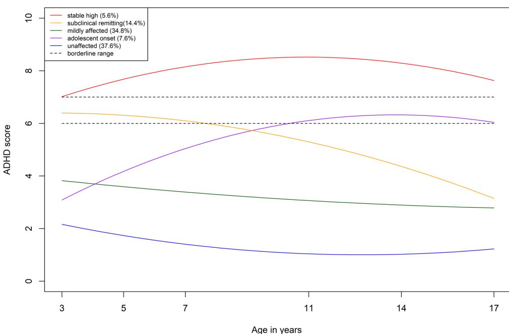

#### **ORIGINAL CONTRIBUTION**

# **Late adolescent outcomes of diferent developmental trajectories of ADHD symptoms in a large longitudinal study**

**Lara Carter1 · Lydia Speyer1,2 · Arthur Caye3 · Luis Rohde3,4,5 · Aja Louise Murray1**

Received: 23 October 2023 / Accepted: 27 June 2024 / Published online: 6 July 2024 © The Author(s) 2024

#### **Abstract**

There exists substantial heterogeneity in the developmental trajectories of ADHD symptoms, with distinctions often made between persistent versus remittent, and early- versus late-onset. However, how these trajectories relate to late adolescent functioning and whether, in particular, later onset trajectories mark a milder subtype remains unclear. Building on earlier work that has examined early life predictors of ADHD symptom trajectories up to age 14, we applied latent class growth analysis to data from the UK Millennium Cohort Study (*N*=10,262) to evaluate whether developmental trajectories of ADHD symptoms up to age 17 (from age 3) were similar to those identifed up to age 14 and associated with difering levels of impairment in peer victimisation, mental health, substance use, and delinquency outcomes at age 17. Our optimal model included fve trajectory groups, labelled *unafected (37.6%), mildly afected (34.8%), subclinical remitting (14.4%), adolescent onset (7.6%),* and *stable high (5.6%)*. Adolescent onset and stable high trajectories were similarly impaired across all outcomes, other than substance use. Subclinical remitting individuals were impaired on self-esteem and wellbeing compared to unafected individuals. By the end of mid-adolescence, those with a later onset have similar impairments to those following an early onset/persistent trajectory. Residual impairment may remain for those on a remitting trajectory.

**Keywords** Attention-defcit/hyperactivity disorder · Trajectories · Onset · Remission · Persistence · Adolescent outcomes

# **Introduction**

Attention-defcit/hyperactivity disorder (ADHD) is characterised by inattention and/or hyperactivity-impulsivity levels that interfere with functioning. Symptoms have been associated with a range of impairments including higher levels of substance use, criminality, co-occurring mental health issues, and social difculties (e.g., [[9](#page-9-0)]. Research

\* Aja Louise Murray aja.murray@ed.ac.uk

- 1 Department of Psychology, University of Edinburgh, 7 George Square, Edinburgh EH8 9JZ, UK
- 2 Department of Psychology, University of Cambridge, Cambridge, UK
- 3 ADHD Outpatient Program and Developmental Psychiatry Program, Hospital de Clinicas de Porto Alegre, Federal University of Rio Grande do Sul, Porto Alegre, Brazil
- 4 Medical Council UNIFAJ and UNIMAX, São Paulo, Brazil
- 5 National Institute of Developmental Psychiatry and National Center for Innovation and Research in Mental Health, São Paulo, Brazil

has highlighted considerable heterogeneity in the lifespan course of ADHD symptoms [[6](#page-9-1)]. Accordingly, researchers have begun to organise this variation into developmental 'subtypes' of ADHD, such as 'early-onset persisting', 'earlyonset remitting' and 'late-onset', refecting the primary ways in which symptoms are assumed to present over time [\[6](#page-9-1)]. However, less is known about whether such groups can be diferentiated on the basis of clinically meaningful outcomes, which may suggest a beneft of diagnostic specifers for 'developmental subtype'. For example, demonstrating that some ADHD symptom trajectories are associated with greater or diferent patterns of impairment compared to others (e.g., higher rates of criminality, co-occurring conditions etc.), would suggest the need for tailored intervention strategies that target the particular needs of each trajectory group.

Analysing outcomes of different trajectories is also important for establishing whether there are impairments (relative to those who never show elevated ADHD symptoms) that outlast clinically signifcant symptoms for those who remit, implying that this group may require continued support beyond symptom remission. Likewise, given the application of age of onset cut-ofs for ADHD, it is important to establish whether those who do not meet age cut-ofs may nevertheless show impairments and beneft from intervention, despite not showing a 'classical' ADHD symptom trajectory. The extent to which this trajectory predicts outcomes associated with ADHD can inform current debates about the clinical validity of a 'late onset' category [\[12\]](#page-9-2).

ADHD symptom trajectories and their outcomes have been studied predominantly through the a-priori classifications. For example, studies have classified symptoms as persisting or remitting depending on whether symptoms are clinically signifcant at both an early and later age (persisting) or at just an earlier age (remitting) and have tended to find poorer outcomes for symptom-persisting compared to symptom-remitting individuals (e.g., [[2\]](#page-9-3). Studies have also compared early- versus late-onset ADHD based on whether symptoms frst appear after versus before the age of onset in diagnostic criteria for ADHD (i.e., after age 12, previously 7). These studies have yielded somewhat mixed findings, however, most have found comparable levels of co-occurring mental health issues, delinquency, social difculties, and tobacco, alcohol, and illicit drug use/ misuse among early and late-onset subtypes (e.g., [[1,](#page-9-4) [7,](#page-9-5) [10,](#page-9-6) [15](#page-9-7)]. However, these previous studies have not modelled the full variation that exists in ADHD symptom trajectories. For example, defning late-onset as age 12 or above (as is encoded in clinical diagnostic criteria) may be considered arbitrary because the emergence of clinically relevant symptoms can occur across a wide range of ages, possibly up to and including adulthood (e.g., [\[3\]](#page-9-8). Similarly, rather than there being a single point in time at which symptoms remit/appear, evidence points to continual fuctuations in symptoms over time for many [\[39](#page-10-0)].

To better refect individual and developmental variation and thus better detect diferences in outcomes, longitudinal studies drawing on data-driven techniques such as latent class growth analysis or growth mixture modelling can be employed. Such methods model linear and non-linear changes in symptoms over a developmental period to identify trajectory groups that optimally refect patterns of symptom variation in a particular sample (e.g., [[16](#page-9-9), [18,](#page-9-10) [19](#page-9-11), [21](#page-9-12)[–27](#page-9-13), [31,](#page-9-14) [32,](#page-9-15) [36](#page-9-16), [41](#page-10-1)]. Whilst varying in terms of their samples, measurement methods, and developmental periods covered, certain commonalities have surfaced across the fndings of such studies. Using these approaches, trajectories that could be mapped approximately to the early-onset persisting, early-onset remitting, and late-onset groups that are typically specifed in studies using a-priori classifcation often emerge, however, with a more detailed picture of how symptoms develop over time.

ADHD symptom trajectories emerging from trajectory analyses can also be compared with respect to various outcome variables. Sasser et al. [[36\]](#page-9-16) used trajectory analysis with parent-reported ADHD symptom data across ages 8–18 and found that three trajectory groups emerged, labelled 'low' (consistently low symptom levels across time), 'declining' (symptoms that remitted over time) and 'high' (symptoms that persisted over time). Those in the high trajectory group had elevated rates of parent-reported antisocial behaviour and school dropout, but similar levels of unemployment and juvenile arrests compared to the declining group. Tandon et al. [[41](#page-10-1)] also identifed 'low', 'remitting' and 'high' trajectory groups when analysing ADHD symptoms across ages 9–21. On a range of psychiatric disorders (including major depressive and oppositional defiant disorder), the high group was found to have the most co-occurring issues, followed by the declining, and then the low group. However, rates of other disorders such as generalised anxiety disorder, alcohol and cannabis use disorder did not difer between any of the three groups. Murray et al. [[18](#page-9-10)] found that their 'lateonset' group (characterised by rising symptoms across ages 7–15) and 'persistent' group (persistently high symptoms across ages 7–15) were similar to each other across most outcomes including comparably high rates of delinquency, internalising problems, violent ideations, and cigarette smoking in comparison to 'unafected' individuals. However, consistent with some of the aforementioned a-priori studies, they also noted some poorer outcomes for early-onset individuals such as higher levels of reactive aggression compared to late-onset individuals, thus leading authors to conclude that late-onset may represent a milder, though still impaired, subtype of ADHD. This study provided some initial evidence on how ADHD symptom trajectories link to outcomes but the sample was considerably smaller than some other datasets that have relevant symptom trajectory data and though community-ascertained, was not nationally representative.

Trajectory analysis studies to date have thus started to suggest the possibility of diferential impairments between groups with diferent developmental trajectories of ADHD symptoms. However, with such studies remaining relatively scarce and with the importance of such work for informing diagnostic and treatment procedures, further work is necessary to ensure the replicability of these preliminary fndings. As such, in a large UK-representative sample, we sought to investigate diferent developmental trajectories of ADHD. In this, we build on a previous trajectory analysis study examining trajectories in the same sample [\[21](#page-9-12)]. However, in that study trajectories were only estimated up to the age of 14 based on data availability. As adolescence is a time of rapid and marked change, with specifc implications for ADHD-related traits such as sensation-seeking and selfregulation [[22](#page-9-17)[–27,](#page-9-13) [37](#page-9-18)], it is important to build on these earlier analyses to examine how trajectories extend up to the end of middle adolescence. For example, it is unclear if 'adolescent-onset' trajectories might represent temporary versus sustained increases in symptoms, whether remitting trajectories tend to show an accelerating, decelerating, or stabilising trajectory towards the end of middle adolescence,or whether there may be entirely new trajectory classes emerging (e.g., with an onset later in adolescence) when a more extended developmental period is considered. Further, whilst these earlier analyses sought to validate and provide a broader characterisation of trajectory-based distinctions by examining early-life predictors and possible etiological of correlates of trajectory analysis membership, they did not examine *outcomes* of following particular trajectories. This is arguably of greater immediate clinical relevance than identifying early-life predictors of class membership as they can inform the provision of tailored preventive interventions and support to mitigate anticipated challenges.

In this study we, therefore, extend earlier analyses to examine developmental trajectories, now using data from ages 3–17 and also examine the links between these trajectories and outcomes at age 17. We examine whether age 3–17 trajectories are associated with difering levels of impairment on multiple outcome variables that have previously been associated with ADHD symptoms, assessed when participants were aged 17. Outcomes included substance use, dimensions of mental health (self-esteem, psychological distress, and well-being), peer victimisation, and delinquency. Though specifc hypotheses are difcult to defne prior to selecting a trajectory model, based on trends from previous research, we hypothesised that the pattern across outcome variables would be: (1) those with persistently high ADHD symptom levels will have the most impairment compared to relevant other groups whilst unaffected individuals will have the least impairment, (2) those with a late-onset of symptoms will have fewer impairments than those with an early-onset persistent but more impairments than unafected individuals, and (3) those whose symptoms remit will have fewer impairments than those whose symptoms persist but more impairments than unafected individuals.

#### **Methods**

#### **Participants**

Participants (*N* = 10,262) were from the Millennium Cohort Study (MCS; [\[8](#page-9-19)] who provided data across sweeps 2–7 of the study (average age at each sweep was 3, 5, 7, 11, 14 and 17 years, with information about the age distributions at each sweep provided in Supplementary Materials Table S1). MCS has been tracking the development, family, and wider social lives of individuals born in the United Kingdom (UK) between 2000 and 2002. Participants were sampled using a stratifed, clustered random sampling design in which individuals were clustered geographically and disproportionately stratifed so as to over-sample residents of the three smaller countries of the UK (Scotland, Wales and Northern Ireland), disadvantaged areas and ethnic minorities. As such, sampling weights were used in all analyses to adjust for the efects of attrition and non-random sampling, thus ensuring results were UK-representative. For further details, the MCS is fully documented and freely accessible at: <https://ukdataservice.ac.uk/>. Written/verbal informed consent was obtained from all parents/participants where required. Ethical approval for the current secondary data analysis was granted by the University of Edinburgh School of Philosophy, Psychology and Language Sciences Ethics Committee.

#### **Measures**

#### **ADHD symptoms**

ADHD symptoms were measured using the Strengths and Difculties Questionnaire (SDQ; [[11](#page-9-20)]. The SDQ is one of the most widely used and well-validated behavioural screening instruments for children and adolescents (Kersten et al., 2016). It has shown good psychometric properties in the current sample, including a high degree of gender and developmental invariance [[25](#page-9-21)]. The hyperactivity/inattention subscale has shown high correlations with ADHD diagnosis [[32\]](#page-9-15). It includes fve items asking parents about their child's behaviour during the last six months with reference to the following behaviours: 'restless, overactive, cannot stay still for long','constantly fdgeting or squirming','easily distracted, concentration wanders','thinks things out before acting'; and 'sees tasks through to the end, good attention span'. At age 3, the item 'thinks things out before acting' was replaced with 'can stop and think things out before acting' to improve its age-appropriateness. Responses were recorded on a 3-point scale including *not true* (0), *somewhat true* (1), and *certainly true* (2). Positively worded items were reverse-coded, and responses were summed to produce an overall hyperactive/inattentive score with higher scores indicating greater hyperactivity/ inattentiveness (possible range=0–10). In a similar sample to the current study, Riglin et al. [[32\]](#page-9-15) found an optimal cut-of for identifying clinically signifcant symptoms (assessed via a *DSM-IV* diagnostic interview) to be a score of 7 or more on the SDQ subscale (specifcity=90%, sensitivity = 86%, area under the curve = 0.88), with 6 representing a borderline score.

#### **Adolescent outcome measures**

All outcomes were assessed when participants were aged 17 via online self-report questionnaires and face-to-face interview. Measures are described below with further details in Supplemental Materials. Outcome variables were selected based on the availability of measures of concepts that have been associated with ADHD symptoms in previous research.

#### **Peer victimisation**

Peer victimisation was assessed as the number of victimisations the participant had experienced in the last 12 months. Six items (*α* = 0.70) measured whether participants had experienced a range of verbal, physical, emotional, and online abusive behaviours (e.g., 'Has anyone called you names?', 'Has anyone been physically violent towards you?'). Participants responded 'no' (0) or 'yes' (1) to each item and responses were summed to create a total victimisation score for each participant, with higher scores refecting a greater number of victimisation behaviours experienced (range=0–6).

#### **Substance use**

To assess alcohol consumption, participants were asked 'How many times have you had an alcoholic drink in the last 12 months?' with responses recorded on a 7-point scale (*Never* = 0, *1–2 times* = 1, *3–5 times* = 2, *6–9 times* = 3, *10–19 times*=4, *20–39 times*=5, *40 or more times*=6). One item assessed participants' cannabis use: 'In the past year how many times have you taken cannabis?' with responses recorded on a 5-point scale (*Not taken in the last year*=0, *1–2 times*=1, *3–4 times*=2, *5–10 times*=3, *More than 10 times*=4).

#### **Mental health**

Anxiety and depressive symptoms over the last 30 days were assessed via the 6-item Kessler Psychological Distress Scale [\[13\]](#page-9-22), *α*=0.86). Responses were on a 5-point scale ranging from *none of the time* (1) to *all of the time* (5) and summed to create a total composite score (range =6–30). Mental wellbeing over the past two weeks was measured via the 7-item Short Warwick-Edinburgh Mental Wellbeing Scale [\[40](#page-10-2)], *α*=0.83). Responses were on a 5-point scale from *none of the time* (1) to *all of the time* (5). Positively worded items were reverse-coded, and responses summed to create a total composite score (range=7–35). Global self-esteem was measured using fve items from the Rosenberg Self-esteem Scale [\[33\]](#page-9-23), *α*=0.91). Responses were on a 4-point scale from *strongly disagree* (1) to *strongly agree* (4). Positively worded items were reverse-coded, and responses summed to create a total composite score (range=5–20). Higher scores on each of the three scales indicated greater impairment.

#### **Delinquency**

Delinquency was measured via nine items (*α* = 0.65) assessing whether participants had engaged in various delinquent behaviours during the past 12 months including theft, vandalism, breaking and entering, arson and online hacking (e.g., 'Have you taken something from a shop without paying for it?', 'Have you deliberately set fre to something that you shouldn't have?'). Participants responded 'no' (0) or 'yes' (1) to each item and responses were summed to create a total delinquent score for each participant, with higher scores indicating greater delinquency (range=0–9). This 'variety index' score method of measuring delinquency is recommended (as opposed to summing the frequency of individual behaviours) because it avoids scores being disproportionately infuenced by non-serious but frequent delinquent acts.

#### **Model selection**

Latent class growth analysis models were ft with increasing numbers of classes until a stopping point was reached, defined by a non-significant Lo-Mendell-Rubin (LMR) adjusted test. Akaike's information criterion (AIC), Bayesian information criterion (BIC), and sample size adjusted BIC (saBIC) were used to help with model selection in cases where the adjusted LMR test yielded ambiguous results. It is known that no single class enumeration will consistently select the 'correct' number of classes and as such class enumeration indices are best used to inform the numbers of classes alongside substantive and pragmatic criteria such as the interpretability of classes [[30,](#page-9-24) [43\]](#page-10-3). Moreover, when conceptualizing the latent class models as a means of providing a convenient but defensible discretization of an underlying continuous distribution, as we do in the current context, there is no 'correct' number of classes to detect, only an optimal number for summarising variation in a parsimonious manner [\[28](#page-9-25)].

Growth models with intercept, linear slope, and quadratic slope factors included were ft based on previous research suggesting that ADHD symptom trajectories tend to be curvilinear [[18](#page-9-10), [22](#page-9-17)]. Time was scaled by fxing the slope factor loadings proportional to the distance between waves with age 3 loadings fxed to 0 (baseline) and age 17 loadings fxed to 1. Factor variances and covariances were fxed to 0 within classes, implying that all trajectory variation is due to the underlying latent categorical variable. This operationalises the assumption of the latent classes as convenient summaries of an underlying continuous distribution rather than necessarily refecting true typologies (see [[29\]](#page-9-26) for a discussion). This can be contrasted to a growth mixture modelling (GMM) approach which has been interpreted conceptualising groups in terms of subpopulations (see e.g., [[29\]](#page-9-26). Given this conceptualisation, GMM thus allows variation around an average growth curve within each subpopulation. As a consequence of allowing this within-class variation, it typically models the same data using fewer sub-groups.

#### **Outcomes of ADHD symptom trajectories**

Following the selection of an optimal latent class growth analysis model, age 17 outcomes were compared across classes, using the three-step method described in Asparouhov and Muthén [[4\]](#page-9-27) to correct for classifcation uncertainty. This method can be vulnerable to changes in the nature of the classes with the inclusion of outcomes in the model,however, this is checked and fagged by the analysis programme when it arises. If this occurred for a given outcome we used the BCH method discussed in Asparouhov and Muthén [[4\]](#page-9-27). The BCH method involves ftting a multigroup model treating the class membership as known and weighting observations based on weights derived from their classifcation probabilities. Most likely class membership and classifcation probabilities are obtained from the latent class growth analysis model estimated in the frst step. All outcomes were treated as continuous as they had a minimum of fve response options. All analyses were conducted in Mplus 8.4 using (robust) pseudo-maximum likelihood estimation that adjusts for the complex sampling design of MCS [\[27](#page-9-13)]. Missing data were dealt with using attrition weights provided by MCS. These up-weight respondents with a low probability of responding and down-weight those with a high probability to correct for non-random drop-out. This provides unbiased parameter estimates under a 'missing at random' (MAR) assumption in Rubin's [[34\]](#page-9-28) terminology.

#### **Results**

Descriptive statistics can be found in Table S1 of Supplementary Materials. Model fts for the latent class growth analysis models with between 1 and 8 classes are provided in Table S2 of Supplementary Materials. Full model outputs are provided at: [https://osf.io/ghvt5/.](https://osf.io/ghvt5/) The LMR test pointed to either a 3- or 5-class model as optimal; however, the 5-class model had substantially lower information theoretic criteria values and it made substantively important class distinctions that were blurred in the 3-class model. The 5-class model is summarised in Table [1](#page-4-0) and Fig. [1](#page-5-0).

Trajectories tended to show curvilinear change and were diferentiated in both pattern and severity (and they did not merely show a 'cat's cradle' pattern that may be characteristic of LGCA solutions in developmental science [[38\]](#page-10-4). An 'unafected' class (37.6%) was characterised by consistently low levels of symptoms throughout the developmental period studied. A 'mildly afected' class (34.8%) was characterised by consistently slightly elevated levels but that remained far from the borderline threshold throughout the developmental period studied. A 'subclinical remitting' class (14.4%) was characterised by symptom levels that began in the borderline range but which declined from there. Beyond age 7, the symptom levels of this group were no longer in the borderline range and by age 17 they had reached similar levels to the 'mildly afected' class. An 'adolescent onset' class (7.6%) was characterised by initially low symptom levels that increased gradually over childhood to reach borderline levels in adolescence. Finally, a 'stable high' class (5.6%) was characterised by symptom levels that were already in the clinical range by age 3 and remained in that range thereafter. They also showed a slight peak around late childhood/adolescence.

**Table 1** Model parameters for the 5-class model

| Class | Class label           | Class size*    | Intercept factor mean | Intercept factor mean SE | Linear slope factor mean | Linear slope factor mean SE | Quadratic slope factor mean | Quadratic slope factor mean SE |
|-------|-----------------------|----------------|-----------------------------|--------------------------------|-----------------------------|-----------------------------------|-----------------------------------|-----------------------------------|
| 1     | Adolescent onset      | 7.6% (n=778)   | 3.088                       | 0.230                          | 8.398                       | 0.867                             | −5.446                            | 0.772                             |
| 2     | Mildly afected        | 34.8% (n=3579) | 3.824                       | 0.109                          | − 1.711                     | 0.280                             | 0.672                             | 0.290                             |
| 3     | Unafected             | 37.6% (n=3857) | 2.163                       | 0.051                          | − 3.337                     | 0.182                             | 2.403                             | 0.167                             |
| 4     | Stable high           | 5.6% (n=572)   | 7.018                       | 0.180                          | 5.316                       | 0.776                             | −4.704                            | 0.711                             |
| 5     | Subclinical remitting | 14.4% (n=1479) | 6.395                       | 0.142                          | − 0.154                     | 0.642                             | −3.095                            | 0.549                             |

*SE*standard error

\*Based on posterior probabilities

**Fig. 1** ADHD symptom trajectory groups. Figure shows the estimate trajectories for each group based on the intercept and slope factor means from the optimal model

#### **Outcomes of trajectory class membership**

The comparisons of outcomes across class groups are provided in Tables [2](#page-5-1) and [3](#page-6-0). We also focus on sets specifc of contrasts most relevant for the specifc hypotheses outlined above in light of the trajectory groups that were present in the selected longitudinal latent growth analysis: unafected vs adolescent onset (relevant for hypothesis 2), unafected vs stable high (relevant for hypothesis 1), adolescent onset vs stable high (relevant for hypotheses 1 and 2), unafected vs subclinical remitting (relevant for hypothesis 3), and stable high vs sub-clinical remitting (relevant for hypotheses 1 and 3).

At odds with our frst and second hypothesis, there were no signifcant diferences between the stable high and adolescent onset groups. However, consistent with our frst and second hypothesis, those in the adolescent onset class had consistently poorer outcomes than those in the unafected class. There were only two exceptions: alcohol use, where the adolescent onset (as well as the high stable) group used signifcantly less than the unafected group and cannabis use where the adolescent onset class did not difer signifcantly from the unafected group, the latter likely refecting

|  | Table 2 Relations between ADHD trajectory class membership and age 17 outcomes |  |  |  |  |  |  |  |
|--|--------------------------------------------------------------------------------|--|--|--|--|--|--|--|
|--|--------------------------------------------------------------------------------|--|--|--|--|--|--|--|

| Outcome                | Class mean (SE) |                |                       |                  |                |
|------------------------|-----------------|----------------|-----------------------|------------------|----------------|
|                        | Unafected       | Mildly afected | Subclinical remitting | Adolescent onset | Stable high    |
| Peer victimisation     | 1.074 (0.042)   | 1.321 (0.076)  | 1.285 (0.135)         | 1.645 (0.225)    | 1.507 (0.199)  |
| Psychological distress | 12.808 (0.150)  | 13.395 (0.353) | 13.152 (0.330)        | 15.223 (0.789)   | 13.971 (0.519) |
| Poorer well-being      | 16.737 (0.140)  | 17.571 (0.480) | 17.542 (0.387)        | 19.211 (0.812)   | 18.440 (0.465) |
| Lower self-esteem      | 9.689 (0.089)   | 9.947 (0.216)  | 10.295 (0.175)        | 10.612 (0.412)   | 10.339 (0.303) |
| Delinquency*           | 0.138 (0.014)   | 0.206 (0.027)  | 0.193 (0.051)         | 0.392 (0.071)    | 0.276 (0.058)  |
| Alcohol use            | 2.982 (0.065)   | 2.642 (0.114)  | 2.300 (0.120)         | 2.143 (0.183)    | 2.284 (0.148)  |
| Cannabis use           | 0.591 (0.044)   | 0.681 (0.053)  | 0.678 (0.125)         | 0.788 (0.143)    | 1.0730 (0.208) |

\*Using the BCH method due to class shifts using the three-step method

| European Child & Adolescent Psychiatry (2025) 34:709–719 | 715 |
|----------------------------------------------------------|-----|
|                                                          |     |

| 7 | 1 | 5 |
|---|---|---|
|   |   |   |

| Outcome                                                                                                                                                                                                                                                           | remitting | Unafected vs subclinical                                        |         |        | Unafected vs adolescent onset                                                                                                                    |         |        | Unafected vs stable high |         | remitting | Stable high vs subclinical |         | onset | Stable high vs adolescent |         |
|-------------------------------------------------------------------------------------------------------------------------------------------------------------------------------------------------------------------------------------------------------------------|-----------|-----------------------------------------------------------------|---------|--------|--------------------------------------------------------------------------------------------------------------------------------------------------|---------|--------|--------------------------|---------|-----------|----------------------------|---------|-------|---------------------------|---------|
|                                                                                                                                                                                                                                                                   | 𝜒2        | p                                                               | SMD     | 𝜒2     | p                                                                                                                                                | SMD     | 𝜒2     | p                        | SMD     | 𝜒2        | p                          | SMD     | 𝜒2    | p                         | SMD     |
| Peer victimisation                                                                                                                                                                                                                                                | 2.223     | 0.136                                                           | − 0.185 | 6.214  | 0.013                                                                                                                                            | 0.381   | 4.718  | 0.030                    | 0.295   | 0.710     | 0.399                      | 0.104   | 0.180 | 0.671                     | − 0.065 |
| Psychological distress                                                                                                                                                                                                                                            | 0.942     | 0.332                                                           | − 0.138 | 8.775  | 0.003                                                                                                                                            | 0.482   | 4.874  | 0.027                    | 0.039   | 1.542     | 0.214                      | 0.128   | 1.469 | 0.225                     | − 0.205 |
| Well− being                                                                                                                                                                                                                                                       | 4.099     | 0.043                                                           | − 0.253 | 9.190  | 0.002                                                                                                                                            | 0.579   | 12.258 | <0.001*                  | 0.414   | 1.801     | 0.180                      | 0.167   | 0.594 | 0.441                     | − 0.170 |
| Self− esteem                                                                                                                                                                                                                                                      | 9.003     | 0.003                                                           | − 0.247 | 4.844  | 0.028                                                                                                                                            | 0.366   | 4.146  | 0.042                    | 0.232   | 0.014     | 0.904                      | 0.001   | 0.255 | 0.613                     | − 0.127 |
| Delinquency                                                                                                                                                                                                                                                       | 1.033     | 0.309                                                           | − 0.087 | 12.644 | <0.001*                                                                                                                                          | 0.339   | 5.099  | 0.024                    | 0.205   | 1.037     | 0.308                      | 0.101   | 1.461 | 0.227                     | − 0.124 |
| Alcohol use                                                                                                                                                                                                                                                       | 27.733    | <0.001*                                                         | 0.354   | 18.214 | <0.001*                                                                                                                                          | − 0.431 | 18.507 | <0.001*                  | − 0.392 | 0.007     | 0.935                      | − 0.028 | 0.322 | 0.570                     | 0.056   |
| Cannabis use                                                                                                                                                                                                                                                      | 0.455     | 0.500                                                           | − 0.089 | 1.921  | 0.166                                                                                                                                            | 0.175   | 5.117  | 0.024                    | 0.327   | 2.063     | 0.151                      | 0.229   | 1.040 | 0.308                     | 0.149   |
| SMDstandardised mean diference, standardised with respect to the pooled standard deviation of the outcome across the two groups and calculated using model constraints within the BCH manual method, as described in [4]. Signifcant each of 7 outcomes) as |           | <0.0014. Efects that survive this correction are marked with a* |         |        | p-values (<0.05) indicated in boldface. A Bonferroni corrected threshold can also be defned for the family of tests (35 tests, 5 comparisons for |         |        |                          |         |           |                            |         |       |                           |         |
|                                                                                                                                                                                                                                                                   | p         |                                                                 |         |        |                                                                                                                                                  |         |        |                          |         |           |                            |         |       |                           |         |

**Table**

**3**

Key trajectory class contrasts

that there was low frequency of usage in the sample overall. Only partially supporting our third hypothesis, there were inconsistent diferences between the unafected and subclinical remitting group: on well-being, self-esteem, and alcohol use but in the latter case it was the unafected group that were the greater users. Finally, there were no signifcant differences between the stable high and sub-clinical remitting group, at odds with our third hypothesis. When applying a Bonferroni correction there were fve signifcant comparisons remaining that might be considered particularly robust: Alcohol use in the unafected vs remitting category; delinquency and alcohol use in the unafected vs adolescent onset category; and well-being and alcohol use in the unafected vs stable high category.

Taken together, the hypothesis that an early onset ('stable high') group would be the consistently most impaired was not supported based on the fact that there were no signifcant diferences between the high stable and adolescent ('late') onset group. This result was also inconsistent with the hypothesis that a late onset group would show intermediate impairment between an unafected and early onset group: the adolescent onset group was signifcantly diferent from the unafected group on the majority of outcomes and not signifcantly diferent from the stable high group on any. The majority of contrasts were in line with the hypothesis that the unafected class would evidence the least impairment. Finally, the hypothesis that those showing remitting symptoms would show intermediate impairments between the 'stable high' and unafected group was not supported as this group showed some signifcant diferences as compared to the 'unafected' group but none compared to the 'high stable' group.

# **Discussion**

Using a large UK-representative sample, we investigated whether developmental trajectories of ADHD symptoms could be differentiated with respect to various age-17 outcomes. Whilst we did not know a priori what trajectory groups would emerge, we hypothesised that any early-onset persistent category that emerged would show the highest level of impairment and that any later-onset category or remitting categories would both show impairment intermediate between unafected and early-onset/persistent at age 17. In fact, groups corresponding to these trajectories did emerge: in a latent class growth analysis, the model judged to best capture heterogeneity in ADHD symptom developmental trajectories had five classes, labelled: adolescent onset (7.6%), mildly afected (34.8%), unafected (37.6%), stable high (5.6%; the only group crossing a clinical threshold), and subclinical remitting (14.4%). These trajectories were mostly similar to/or looked like developmental extensions of the trajectories estimated in Murray et al. [[22\]](#page-9-17), which only estimated trajectories up to age 14. The main diference was that a six- class solution was optimal in that study, which diferentiated two 'declining symptoms' categories depending on whether they began in the borderline or subclinical range.

Results from our pairwise comparisons were, however, only partially consistent with our hypotheses. Specifcally, both the adolescent onset and stable high groups had worse scores than the unafected group on almost all outcomes studied (except substance use) but did not difer signifcantly from each other. As such, the adolescent onset was similar to the stable high group rather than showing intermediate levels of impairment. Further, the subclinical remitting group showed worse self-esteem and well-being than the unafected group but otherwise did not difer signifcantly from this group nor the stable high group. Taken together, our fndings support the recognition and potential need for intervention in later onset trajectories of ADHD symptoms due to the associated impairment. Further, there is some evidence for poorer outcomes even for those showing a declining symptoms trajectory.

The trajectory groups that emerged from the present study are largely consistent with previous studies that have tended to fnd that for those afected by ADHD symptoms, some will show early emerging and persistent symptoms, some will show remitting symptoms, and others still will not show an escalation of symptoms until later in development (e.g., [\[18](#page-9-10), [19](#page-9-11), [31](#page-9-14)]. The trajectories were also similar to a previous analysis that modelled the trajectories of ADHD symptoms in the sample up to age 14 [[22\]](#page-9-17). The current analyses, which extended the age range up to age 17, suggest that adolescentemerging symptoms do not merely show a transient increase but can continue to show high symptom levels up to the end of middle adolescence.

To provide further illumination on the nature of this later onset category, we compared the adolescent onset trajectory to the unaffected and stable high trajectory groups and found that although an adolescent onset subtype showed worse age-17 scores on almost all outcomes studied, they did not difer signifcantly from those with an early onset and persistence (the 'stable high' group). While the previous literature is not entirely consistent on this (e.g., Karam et al., 2009; [[31\]](#page-9-14), our fndings add to other emerging evidence that suggests that while those with a later onset may show fewer problems early in life (e.g., [[22](#page-9-17)]), by the time they reach adolescence, they mostly show similar impairments to those with an early onset (e.g., [\[1](#page-9-4), [2,](#page-9-3) [18](#page-9-10), [19](#page-9-11)]. Taken together, this evidence supports the recognition of and the potential need for provision of interventions for ADHD symptoms irrespective of whether they frst emerge in early childhood or later in development. Indeed, frontline professionals should remain attuned to later emerging symptoms, given persisting perceptions of ADHD symptoms as only earlyemerging. Further research is necessary to illuminate how the trajectories of the adolescent onset group develop into adulthood (i.e., whether this group reflects a transient increase over adolescence), and to establish the extent to which this group is etiologically distinct from the early onset group despite the similarity of their impairments (e.g., whether the elevation of inattention and hyperactivity/ impulsivity symptoms better refects the onset of underlying internalising problems).

A second set of comparisons addressed the impact of remitting symptom trajectories, by comparison of our 'subclinical remitting' group to the 'unafected' and 'stable high' groups. Only a small number of diferences were found between the remitting and unafected group, with the former showing reduced wellbeing and selfesteem, and no differences with the stable high group. Indeed, consistent with previous studies [1, 2, 6, 41], a qualitative comparison suggested that the remitting group was generally intermediate in scores between the groups afected by symptoms at age 17 and those never afected by symptoms. It suggests that while symptoms may decline over development, it cannot be assumed that there will be no residual efects. Indeed, early psychosocial issues associated with ADHD symptoms such as academic failures and peer rejection could impact the development of self-concept and have a lasting impact on factors such as self-esteem and wellbeing. Further, it is common for ADHD symptoms to persist at a still-elevated level even among those on a declining symptom trajectory and in the current sample, those on the remitting trajectory continued to show symptoms that were of a higher level than those in the unafected and mildly afected categories. Taken together, these fndings underline the importance of continued support for youth whose symptoms no longer exceed borderline or clinical thresholds, especially in relation to well-being and self-esteem.

Finally, one perhaps counterintuitive fnding was that groups afected by ADHD symptoms reported consuming less alcohol in the past 12 months compared to unafected individuals. Adolescence is a sensitive period for exposure to substances and indeed, there exists a well-documented link between ADHD and increased substance use (e.g., [[14\]](#page-9-29). One possible explanation is that social impairments typically seen in ADHD may shield individuals from exposure to the social settings in which adolescent alcohol consumption typically occurs, thus *decreasing* alcohol use at this developmental stage [\[17](#page-9-30)].

#### **Limitations and future directions**

Whilst our measure of ADHD symptoms is well-validated (Kersten et al., 2016), and includes items for inattentive and hyperactive-impulsive symptoms, it is only 5 items long and does not include separate validated subscales for these dimensions. This is a limitation as previous research suggests dissociable developmental trajectories for these symptoms, with distinct efects on later adolescent functioning [[18,](#page-9-10) [19,](#page-9-11) [31\]](#page-9-14). There is also no ADHD diagnostic assessment available in MCS (only a single parent-report item), meaning that it is not possible to be certain which young people meet diagnostic criteria for ADHD. Further, only parent-reported data was available to assess ADHD symptoms across the entire developmental period of age 3 to 17,however, an important criterion for an ADHD diagnosis is that symptoms must occur trans-situationally (APA, 2013). Finally, although this study was based on a strong longitudinal design, we did not analyse causal relationships between ADHD symptom trajectories and outcomes, only associations. Based on the fact that there is currently insufcient feld knowledge of the underlying causal structures relating ADHD symptom trajectories, outcomes, and their confounders it was not judged feasible to identify and adjust for a sufficient set of covariates in the study to support causal inference [[42](#page-10-5)]. Compounding this is the fact that the dataset was not designed specifcally to illuminate ADHD symptoms, or their trajectories, therefore, even if a sufcient set of covariates could be identified, they are unlikely to be available in full in the present dataset. As such, we elected to present only the basic associations between trajectory groups and outcomes, which can provide a foundation for future research addressing causal links. This was also consistent with our aim of establishing whether ADHD trajectories are *predictive* of outcomes, which could inform the provision of preventive interventions for anticipated outcomes irrespective of whether causality holds. However, future research could utilise a directed acyclic graph approach to develop hypotheses about the underlying causal structure that relates symptom trajectories to outcomes and that thus informs the identifcation, measurement of, and adjustment for a set of covariates (e.g., sex and gender, socioeconomic status, co-occurring conditions) to help support causal inference. For example, it would be expected based on past research that sex/gender could act as a confounder in the association between trajectory classes and outcomes, as there have been sex/gender diferences identifed in both in the past (e.g., [5,19,35]). There was also lack of information on intervention exposure in the present sample, therefore, we could not examine their role in trajectories. Future studies could thus also consider the role of interventions. Future studies could also examine a broader range of outcomes previously associated with ADHD symptoms and extend the analyses to later developmental stages. Further, future studies could compare and examine the joint trajectories of ADHD and commonly co-occurring difculties, such as conduct problems, internalising problems, and peer problems [20,24,26]. This could help illuminate how ADHD co-develops with other issues, the extent to which fndings of the current study are specific to ADHD trajectories, and establish how ADHD trajectories predict adolescent outcomes in the context of other symptom trajectories.

#### **Conclusions**

UK adolescents from the general population with later onset ADHD symptom trajectories evidenced the same impairments in age 17 outcomes such as self-esteem, wellbeing, psychological distress, peer victimisation, and delinquency as those with an early onset trajectory with persistence. This supports the importance of recognising the impacts of ADHD even when symptoms do not have an early onset. Some residual impairments remain among those with a remitting trajectory, supporting continued additional support for these individuals, even after symptoms decline.

**Supplementary Information** The online version contains supplementary material available at<https://doi.org/10.1007/s00787-024-02516-5>.

**Author contributions** All authors contributed to the study conception and design. Material preparation and data analyses were performed by L.C, L.S and A.M. L.C. and A.M wrote the main manuscript text. All authors read and approved the fnal manuscript.

**Data availability** Data used in the present study is available via the UK Data Service: UK Data Service.

#### **Declarations**

**Conflict of interest** Luis Augusto Rohde has received grant or research support from, served as a consultant to, and served on the speakers' bureau of Abdi Ibrahim, Abbott, Aché, Adium, Apsen, Bial, Knight Therapeutics, Medice, Novartis/Sandoz, Pfzer/Upjohn/Viatris, and Shire/Takeda in the last three years. The ADHD and Juvenile Bipolar Disorder Outpatient Programs chaired by Dr. Rohde have received unrestricted educational and research support from the following pharmaceutical companies in the last three years: Novartis/Sandoz and Shire/Takeda. Dr. Rohde has received authorship royalties from Oxford Press and ArtMed

**Open Access** This article is licensed under a Creative Commons Attribution 4.0 International License, which permits use, sharing, adaptation, distribution and reproduction in any medium or format, as long as you give appropriate credit to the original author(s) and the source, provide a link to the Creative Commons licence, and indicate if changes were made. The images or other third party material in this article are included in the article's Creative Commons licence, unless indicated otherwise in a credit line to the material. If material is not included in the article's Creative Commons licence and your intended use is not permitted by statutory regulation or exceeds the permitted use, you will need to obtain permission directly from the copyright holder. To view a copy of this licence, visit<http://creativecommons.org/licenses/by/4.0/>.

#### **References**

- 1. Agnew-Blais JC, Polanczyk G, Danese A, Wertz J, Moftt TE, Arseneault L (2016) Persistence, remission and emergence of ADHD in young adulthood: results from a longitudinal, prospective population-based cohort. JAMA Psychiat 73(7):713
- 2. Agnew-Blais JC, Polanczyk GV, Danese A, Wertz J, Moftt TE, Arseneault L (2018) Young adult mental health and functional outcomes among individuals with remitted, persistent and lateonset ADHD. Br J Psychiatry 213(3):526–534
- 3. Asherson P, Agnew-Blais J (2019) Annual research review: does late-onset attention-defcit/hyperactivity disorder exist? J Child Psychol Psychiatry 60(4):333–352
- 4. Asparouhov T, Muthén B (2021) Auxiliary variables in mixture modeling: using the BCH method in mplus to estimate a distal outcome model and an arbitrary secondary model
- 5. Booth T, Murray AL (2018) Sex diferences in personality traits. In: Zeigler-Hill V, Shackelford TK (eds) Encyclopedia of Personality and Individual Diferences (pp. 1–17). Springer International Publishing. [https://doi.org/10.1007/978-3-319-](https://doi.org/10.1007/978-3-319-28099-8_1265-1) [28099-8\\_1265-1](https://doi.org/10.1007/978-3-319-28099-8_1265-1)
- 6. Caye A, Swanson J, Thapar A, Sibley M, Arseneault L, Hechtman L, Arnold LE, Niclasen J, Moftt T, Rohde LA (2016) Life span studies of ADHD—conceptual challenges and predictors of persistence and outcome. Curr Psychiatry Rep 18(12):111
- 7. Chandra S, Biederman J, Faraone SV (2016) Assessing the validity of the age at onset criterion for diagnosing ADHD in DSM-5. J Attent Disord: 1087054716629717
- 8. Connelly R, Platt L (2014) Cohort profle: UK millennium Cohort study (MCS). Int J Epidemiol 43(6):1719–1725
- 9. Faraone SV, Asherson P, Banaschewski T, Biederman J, Buitelaar JK, Ramos-Quiroga JA, Rohde LA, Sonuga-Barke EJS, Tannock R, Franke B (2015) Attention-defcit/hyperactivity disorder. Nat Rev Dis Primers 1(1):15020. [https://doi.org/10.1038/nrdp.2015.](https://doi.org/10.1038/nrdp.2015.20) [20](https://doi.org/10.1038/nrdp.2015.20)
- 10. Faraone SV, Biederman J, Doyle A, Murray K, Petty C, Adamson JJ, Seidman L (2006) Neuropsychological studies of late onset and subthreshold diagnoses of adult attention-defcit/hyperactivity disorder. Biol Psychiat 60(10):1081–1087
- 11. Goodman R (1997) The strengths and difculties questionnaire: a research note. J Child Psychol Psychiatry 38(5):581–586
- 12. Jablensky A (2016) Psychiatric classifcations: validity and utility. World Psychiatry 15(1):26–31
- 13. Kessler RC, Andrews G, Colpe LJ, Hiripi E, Mroczek DK, Normand S-L, Walters EE, Zaslavsky AM (2002) Short screening scales to monitor population prevalences and trends in non-specifc psychological distress. Psychol Med 32(6):959–976
- 14. Lee SS, Humphreys KL, Flory K, Liu R, Glass K (2011) Prospective association of childhood attention-defcit/hyperactivity disorder (ADHD) and substance use and abuse/dependence: a meta-analytic review. Clin Psychol Rev 31(3):328–341
- 15. Liu C-Y, Asherson P, Viding E, Greven CU, Pingault J-B (2019) Early predictors of de novo and subthreshold late-onset adhd in a child and adolescent cohort. J Attent Disord: 1087054719892888
- 16. Malone PS, Van Eck K, Flory K, Lamis DA (2010) A mixturemodel approach to linking ADHD to adolescent onset of illicit drug use. Dev Psychol 46(6):1543
- 17. Molina BS, Walther CA, Cheong J, Pedersen SL, Gnagy EM, Pelham WE Jr (2014) Heavy alcohol use in early adulthood as a function of childhood ADHD: developmentally specifc mediation by social impairment and delinquency. Exp Clin Psychopharmacol 22(2):110
- 18. Murray AL, Booth T, Auyeung B, Eisner M, Ribeaud D, Obsuth I (2018) Outcomes of ADHD symptoms in late adolescence: are developmental subtypes important? J Attent Disord 24:113
- 19. Murray AL, Booth T, Eisner M, Auyeung B, Murray G, Ribeaud D (2018) Sex diferences in ADHD trajectories across childhood and adolescence. Dev Sci: e12721.
- 20. Murray AL, Eisner M, Nagin D, Ribeaud D (2020) A multi-trajectory analysis of commonly co-occurring mental health issues across childhood and adolescence. Eur Child Adolescent Psychiat, 1–15.
- 21. Murray AL, Eisner M, Obsuth I, Ribeaud D (2017) Identifying early markers of "Late Onset" attention defcit and hyperactivity/ impulsivity symptoms. J Attent Disord:1087054717705202
- 22. Murray AL, Hall HA, Speyer LG, Carter L, Mirman D, Caye A, Rohde L (2021) Developmental trajectories of ADHD symptoms in a large population-representative longitudinal study. Psychol Med:1–7
- 23. Murray AL, Mirman JH, Carter L, Eisner M (2021) Individual and developmental diferences in delinquency: can they be explained by adolescent risk-taking models? Dev Rev. (In Press)
- 24. Murray AL, Nagin D, Obsuth I, Ribeaud D, Eisner M (2021) Young adulthood outcomes of joint mental health trajectories: a group-based trajectory model analysis of a 13-year longitudinal cohort study. Child Psychiat Hum Dev:1–14
- 25. Murray AL, Speyer LG, Hall HA, Valdebenito S, Hughes C (2021) A longitudinal and gender invariance analysis of the strengths and difculties questionnaire across ages 3, 5, 7, 11, 14, and 17 in a large UK-representative sample. Assessment:10731911211009312
- 26. Murray AL, Ushakova A, Speyer L, Brown R, Auyeung B, Zhu X (2021) Sex/gender diferences in individual and joint trajectories of common mental health symptoms in early to middle adolescence. JCPP Adv: e12057
- 27. Murray AL, Ushakova A, Wright H, Booth T, Lynn P (2021) Structural equation modelling with complex sampling designs and non-random attrition: a tutorial using lavaan and Mplus. PsyArXiv
- 28. Nagin DS, Jones BL, Passos VL, Tremblay RE (2018) Groupbased multi-trajectory modeling. Stat Methods Med Res 27(7):2015–2023
- 29. Nagin DS, Odgers CL (2010) Group-based trajectory modeling in clinical research. Annu Rev Clin Psychol 6:109
- 30. Peugh J, Fan X (2012) How well does growth mixture modeling identify heterogeneous growth trajectories? A simulation study examining GMM's performance characteristics. Struct Equ Model 19(2):204–226
- 31. Pingault J-B, Tremblay RE, Vitaro F, Carbonneau R, Genolini C, Falissard B, Côté SM (2011) Childhood trajectories of inattention and hyperactivity and prediction of educational attainment in early adulthood: a 16-year longitudinal population-based study. Am J Psychiatry 168(11):1164–1170
- 32. Riglin L, Collishaw S, Thapar AK, Dalsgaard S, Langley K, Smith GD, Stergiakouli E, Maughan B, O'Donovan MC, Thapar A (2016) Association of genetic risk variants with attention-deficit/hyperactivity disorder trajectories in the general population. JAMA Psychiat 73(12):1285–1292
- 33. Rosenberg M (1965) Rosenberg self-esteem scale (SES). In: Society and the Adolescent Self-Image
- 34. Rubin DB (1976) Inference and missing data. Biometrika 63(3):581–592
- 35. Rutter M, Caspi A, Moftt TE (2003) Using sex diferences in psychopathology to study causal mechanisms: unifying issues and research strategies. J Child Psychol Psychiatry 44(8):1092–1115
- 36. Sasser TR, Kalvin CB, Bierman KL (2016) Developmental trajectories of clinically signifcant ADHD symptoms from grade 3 through 12 in a high-risk sample: predictors and outcomes. J Abnorm Psychol 125(2):207
- 37. Sawyer SM, Azzopardi PS, Wickremarathne D, Patton GC (2018) The age of adolescence. Lancet Child Adolescent Health 2(3):223–228
- 38. Sher KJ, Jackson KM, Steinley D (2011) Alcohol use trajectories and the ubiquitous cat's cradle: cause for concern? J Abnorm Psychol 120(2):322
- 39. Sibley M, Arnold LE, Swanson JM, Hechtman LT, Kennedy TM, Owens EB, Molina BS, Jensen PS, Hinshaw SP, Roy A, Chronis-Tuscano A, Newcorn JH, Rohde LA (2021) Variable patterns of remission from ADHD in the multimodal treatment study of ADHD. Am J Psychiat (In press)
- 40. Stewart-Brown S, Tennant A, Tennant R, Platt S, Parkinson J, Weich S (2009) Internal construct validity of the Warwick-Edinburgh mental well-being scale (WEMWBS): a Rasch analysis using data from the Scottish health education population survey. Health Qual Life Outcomes 7(1):1–8
- 41. Tandon M, Tillman R, Agrawal A, Luby J (2016) Trajectories of ADHD severity over 10 years from childhood into adulthood. ADHD Attent Defcit Hyperact Disord 8(3):121–130
- 42. VanderWeele TJ (2019) Principles of confounder selection. Eur J Epidemiol 34(3):211–219. [https://doi.org/10.1007/](https://doi.org/10.1007/s10654-019-00494-6) [s10654-019-00494-6](https://doi.org/10.1007/s10654-019-00494-6)
- 43. Whittaker TA, Miller JE (2021) Exploring the enumeration accuracy of cross-validation indices in latent class analysis. Struct Equ Model 28(3):376–390

### **Supplementary Materials**

Late adolescent outcomes of different developmental trajectories of ADHD symptoms in a large longitudinal study

European Child & Adolescent Psychiatry

Lara Carter1 , Lydia Speyer1, 2, Arthur Caye3 , Luis Rohde3, 4, 5, Aja Louise Murray1\*

1Department of Psychology, University of Edinburgh, UK

2Department of Psychology, University of Cambridge, UK

3ADHD Outpatient Program & Developmental Psychiatry Program, Hospital de Clinicas de Porto Alegre, Federal University of Rio Grande do Sul, Brazil 4Medical Council UNIFAJ & UNIMAX, Brazil

5National Institute of Developmental Psychiatry & National Center for Innovation and Research in Mental Health, Brazil.

\*Corresponding author at: Department of Psychology, University of Edinburgh, 7 George Square, Edinburgh, UK, EH8 9JZ; Email: aja.murray@ed.ac.uk

### **Full Questionnaires for Participants**

### **1. Peer victimisation**

In the past 12 months has anyone done any of these things to you?

Insulted you, called you names, threatened or shouted at you in a public place, at school, college or anywhere else?

Spread gossip about you, ignored you or you've experienced other emotional abuse? Been physically violent towards you, e.g., pushed, shoved, hit, slapped or punched you? Hit you with or used a weapon against you? Stolen something from you e.g., a mobile phone, money etc.?

Harassed or bothered you via mobile phone or email?

*Response options for each: I do not wish to answer, Do not know, No, Yes*

### **2. Substance use**

# *Alcohol consumption*

How many times have you had an alcoholic drink in the last 12 months? A drink is half a pint of lager, beer or cider, one alcopop, a small glass of wine, or a measure of spirits. If you have had more than one alcoholic drink at a time, count this as one time.

*Response options: I do not wish to answer, Do not know, Never, 1-2 times, 3-5 times, 6-9 times, 10-19 times, 20-39 times, 40 or more times*

# *Alcohol consumption (bingeing)*

How many times have you had five or more alcoholic drinks at a time in the last 12 months? A drink is half a pint of lager, beer or cider, one alcopop, a small glass of wine, or a measure of spirits.

*Response options: I do not wish to answer, Do not know, Never, 1-2 times, 3-5 times, 6-9 times, 10 or more times*

# *Cannabis use*

In the past year how many times have you taken cannabis? (also called Marijuana, Dope, Pot, Blow, Hash, Skunk, Puff, Grass, Draw, Ganja, Spliff, Smoke, Weed) *Response options: I do not wish to answer, Do not know, Not taken in last year, Once or twice, Three or four times, Five to ten times, More than ten times*

# **3. Mental health**

# *Kessler Psychological Distress Scale*

During the last 30 days, about how often did you feel so depressed that nothing could cheer you up?

During the last 30 days, about how often did you feel hopeless?

During the last 30 days, about how often did you feel restless or fidgety?

During the last 30 days, about how often did you feel that everything was an effort?

During the last 30 days, about how often did you feel worthless?

During the last 30 days, about how often did you feel nervous?

*Response options for each question: I do not wish to answer, Do not know, None of the time, A little of the time, Some of the time, Most of the time, All of the time*

## *Short Warwick-Edinburgh Mental Wellbeing Scale*

Please select the answer that best describes your experience of each over the last two weeks.

I've been feeling optimistic about the future I've been feeling useful I've been feeling relaxed I've been dealing with problems well I've been thinking clearly I've been feeling close to other people I've been able to make up my own mind about things *Response options for each: I do not wish to answer, Do not know, None of the time, Rarely, Some of the time, Often, All of the time*

# *Rosenberg Self-esteem Scale*

How much do you agree or disagree with the following statements about you?

On the whole, I am satisfied with myself I feel I have a number of good qualities I am able to do things as well as most other people I am a person of value I feel good about myself *Response options for each: I do not wish to answer, Do not know, Strongly disagree, Disagree, Agree, Strongly agree*

# **4. Delinquency**

In the last 12 months have you done any of the following things?

Taken something from a shop without paying for it?

Written things or spray painted on a building, fence or train or anywhere else where you shouldn't have?

Deliberately damaged something in a public place that didn't belong to you, for example by burning, smashing or breaking things like cars, bus shelters and rubbish bins? Gone into someone's home without their permission because you wanted to steal or damage something?

Stolen a vehicle that didn't belong to you?

Deliberately set fire to something that you shouldn't have?

Used someone else's credit/debit card or bank account details, to buy things, or obtain money, without the owner's permission?

Accessed, or hacked into, someone else's internet-enabled device (e.g. computer, tablet, mobile phone, games console), e-mail or social networking account without their permission?

Used the internet to send viruses, spyware or other harmful software/malware, to deliberately damage or infect other computers?

*Response options for each: I do not wish to answer, Do not know, No, Yes*

# **Table S1**

*Descriptive statistics*

|                                                  | N           | Mean                       | SD          |  |  |  |  |
|--------------------------------------------------|-------------|----------------------------|-------------|--|--|--|--|
| ADHD age 3                                       | 14156       | 3.885                      | 5.647       |  |  |  |  |
| ADHD age 5                                       | 14190       | 3.167                      | 5.486       |  |  |  |  |
| ADHD age 7                                       | 12980       | 3.274                      | 6.321       |  |  |  |  |
| ADHD age 11                                      | 10939       | 2.984                      | 6.097       |  |  |  |  |
| ADHD age 14                                      | 12237       | 3.146                      | 6.567       |  |  |  |  |
| ADHD age 17                                      | 8924        | 2.651                      | 5.530       |  |  |  |  |
| Peer victimisation                               | 10039       | 1.207                      | 1.423       |  |  |  |  |
| Alcohol use                                      | 10058       | 2.573                      | 1.996       |  |  |  |  |
| Cannabis use                                     | 10060       | 0.603                      | 1.222       |  |  |  |  |
| Psychological distress                           | 10060       | 13.286                     | 4.930       |  |  |  |  |
| Well-being                                       | 10036       | 17.433                     | 4.795       |  |  |  |  |
| Self-esteem                                      | 10052       | 9.981                      | 3.194       |  |  |  |  |
| Delinquency                                      | 9943        | 0.190                      | 0.658       |  |  |  |  |
| Age distributions of participants at each sweep* |             |                            |             |  |  |  |  |
|                                                  | Minimum     | Median                     | Maximum     |  |  |  |  |
| Sweep 2                                          | 2.67 years  | 3.08 years                 | 4.58 years  |  |  |  |  |
| Sweep 3                                          | 4.41 years  | 5.24 years                 | 6.17 years  |  |  |  |  |
| Sweep 4                                          | 6.33 years  | 7.25 years                 | 8.17 years  |  |  |  |  |
| Sweep 5                                          | 10.17 years | 11.17 years                | 12.33 years |  |  |  |  |
| Sweep 6                                          | 13.08 years | 14.25 years                | 15.25 years |  |  |  |  |
| Sweep 7                                          | 16.08 years | 17.17 years 18.33 years |             |  |  |  |  |

*Note.* \*Approximated given that birth and interview dates are available only to the nearest

month.

# **Table S2**

| Number of | LMR       | p     | AIC        | BIC        | saBIC      | Entropy |
|-----------|-----------|-------|------------|------------|------------|---------|
| classes   |           |       |            |            |            |         |
| 1         | -         | -     | 222508.021 | 222573.147 | 222544.546 | -       |
| 2         | 15283.633 | <.001 | 206818.700 | 206912.771 | 206871.459 | .803    |
| 3         | 4753.717  | <.001 | 201944.313 | 202067.328 | 202013.305 | .785    |
| 4         | 1404.711  | .168  | 200509.580 | 200661.541 | 200594.805 | .735    |
| 5         | 1247.073  | .030  | 199236.752 | 199417.657 | 199338.211 | .749    |
| 6         | 582.375   | .602  | 198646.614 | 198856.464 | 198764.306 | .716    |
| 7         | 232.778   | .299  | 197860.165 | 198106.196 | 197998.149 | .660    |
| 8         | 275.187   | .672  | 197585.530 | 197860.505 | 197739.747 | .659    |

*Model fits for latent class growth analysis models*

*Note.* Optimal model indicated in boldface. LMR= Lo-Mendell-Rubin value; AIC= Akaike Information Criterion; BIC= Bayesian Information Criterion; saBIC= sample size adjusted BIC.