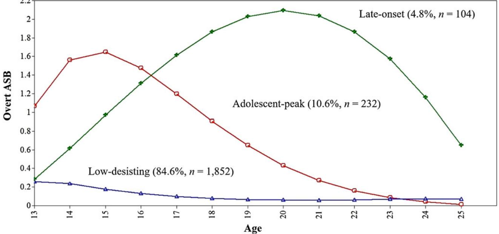
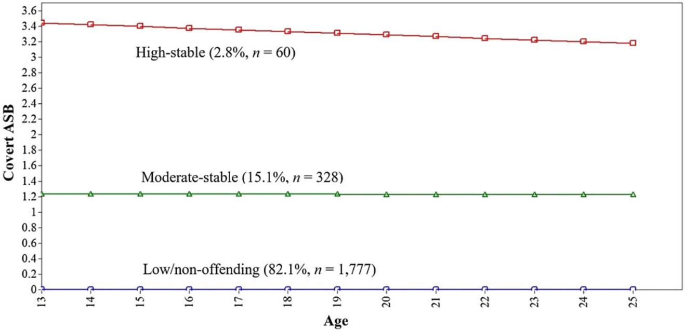
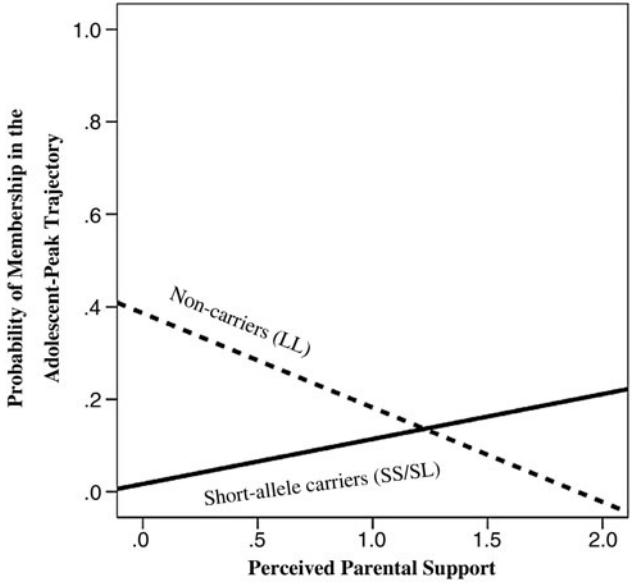
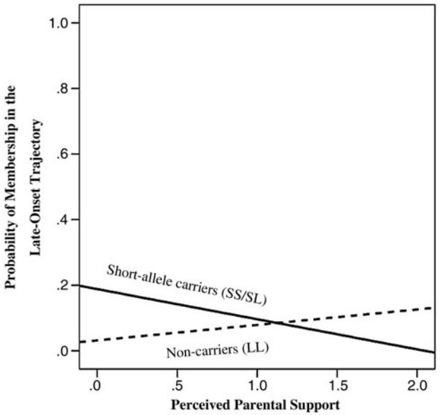

Latent trajectories of adolescent antisocial behavior: Serotonin transporter linked polymorphic region (5-HTTLPR) genotype influences sensitivity to perceived parental support

IRENE TUNG AND STEVE S. LEE University of California, Los Angeles

#### Abstract

Although prevailing theories of antisocial behavior (ASB) emphasize distinct developmental trajectories, few studies have explored gene–environment interplay underlying membership in empirically derived trajectories. To improve knowledge about the development of overt (e.g., aggression) and covert (e.g., delinquency) ASB, we tested the association of the 44-base pair promoter polymorphism in the serotonin transporter linked polymorphic region gene (5-HTTLPR), perceived parental support (e.g., closeness and warmth), and their interaction with ASB trajectories derived using latent class growth analysis in 2,558 adolescents followed prospectively into adulthood from the National Longitudinal Study of Adolescent Health. Three distinct trajectories emerged for overt (low desisting, adolescent peak, and late onset) and covert ASB (high stable, low stable, and nonoffending). Controlling for sex, parental support inversely predicted membership in the adolescent-peak overt ASB trajectory (vs. low desisting), but was unrelated to class membership for covert ASB. Furthermore, the 5-HTTLPR genotype significantly moderated the association of parental support on overt ASB trajectory membership. It is interesting that the pattern of Gene-Environment interaction differed by trajectory class: whereas short allele carriers were more sensitive to parental support in predicting the late-onset trajectory, the long/long genotype functioned as a potential "plasticity genotype" for the adolescent-peak trajectory group. We discuss these preliminary findings in the context of the differential susceptibility hypothesis and discuss the need for future studies to integrate gene–environment interplay and prospective longitudinal designs.

Antisocial behavior (ASB), including overt (e.g., violence and assault) and covert acts (e.g., stealing and property damage), are common and clinically significant problems with considerable annual costs to the United States (Foster & Jones, [2005\)](#page-14-0). Adolescent ASB is particularly important given its 10-fold increase during this developmental period (Moffitt, [1993\)](#page-15-0). Although the mean level of ASB decreases during the transition to adulthood, longitudinal studies frequently reveal a subset of youth whose ASB persists into adulthood (Evans, Simons, & Simons, [2014;](#page-14-0) Moffitt, [1993;](#page-15-0) Odgers et al., [2008;](#page-15-0) Piquero, Connell, Piquero, Farrington, & Jennings, [2013;](#page-15-0) Wiesner & Capaldi, [2003;](#page-16-0) Zheng & Cleveland, [2013\)](#page-16-0). Persistent early ASB is a potent risk factor for multiple serious adult outcomes, including chronic criminal behavior and violence (Boden, Fergusson, & Horwood, [2010](#page-13-0); Farrington, [1989;](#page-14-0) Lynam, [1996\)](#page-14-0), alcohol and substance use disorders (Fergusson, Horwood, & Ridder, [2007\)](#page-14-0), antisocial personality disorder (Maughan, Rowe, Messer, Goodman, & Meltzer, [2004](#page-15-0)), and low economic stability (Moffitt & Caspi, [2001\)](#page-15-0). In contrast, the adolescent-limited trajectory of ASB consists of elevated ASB that begins after the age of 10 and then decreases into adulthood (Moffitt, [1993\)](#page-15-0). Although adolescent-limited offenders exhibit less severe ASB, they often continue to commit low-level crimes and demonstrate sustained problems with comorbid psychopathology, substance use disorders, and other negative outcomes (e.g., low income and unplanned pregnancy) in adulthood compared to nonoffending youth (Nagin, Farrington, & Moffitt, [1995](#page-15-0); Odgers et al., [2008](#page-15-0)). Given the clinical and public health significance of life-course persistent and adolescent-limited ASB, identifying the genetic and environmental factors that differentiate youth with low-offending trajectories from those with adolescent-limited and chronic ASB trajectories is necessary to prevent adult criminality and other negative outcomes. The present study examined the association of individual differences in the experience of parental support, serotonin transporter linked polymorphic region (5-HTTLPR) genotype, and their

This research is supported by a National Science Foundation Graduate Research Fellowship (to I.T.) and uses data from Add Health, a program project directed by Kathleen Mullan Harris and designed by J. Richard Udry, Peter S. Bearman, and Kathleen Mullan Harris at the University of North Carolina at Chapel Hill. Add Health is funded by Grant P01-HD31921 from the Eunice Kennedy Shriver National Institute of Child Health and Human Development, with cooperative funding from 23 other federal agencies and foundations. Special acknowledgment is due Ronald R. Rindfuss and Barbara Entwisle for assistance in the original design. Information on how to obtain the Add Health data files is available on the Add Health website [\(http://www.](http://www.cpc.unc.edu/addhealth) [cpc.unc.edu/addhealth\)](http://www.cpc.unc.edu/addhealth). No direct support was received from Grant P01- HD31921 for this analysis.

Address correspondence and reprint requests to: Steve S. Lee, Department of Psychology, University of California, Los Angeles, 1285 Franz Hall, Box 951563, Los Angeles, CA 90095-1563; E-mail: [stevelee@](mailto:stevelee@psych.ucla.edu) [psych.ucla.edu.](mailto:stevelee@psych.ucla.edu)

interaction with respect to membership in trajectories of ASB from adolescence to adulthood.

# Overt and Covert ASB

One challenge to identifying predictors of high-offending ASB trajectories across development is that the number and nature of ASB trajectories are not consistently identified (Broidy et al., [2003](#page-13-0); Evans et al., [2014](#page-14-0); Fontaine, Carbonneau, Vitaro, Barker, & Tremblay, [2009;](#page-14-0) Odgers et al., [2008](#page-15-0); Piquero, [2008](#page-15-0); White, Bates, & Buyske, [2001](#page-16-0)), which may reflect methodological and developmental differences in ASB (Bongers, Koot, Van der Ende, & Verhulst, [2004\)](#page-13-0). Despite replicated evidence that ASB subtypes, such as overt (e.g., physical aggression and violence) and covert (e.g., lying, stealing, and truancy) behaviors, are etiologically distinct (Burt & Klump, [2012](#page-13-0); Kazdin, [1992;](#page-14-0) Loeber & Schmaling, [1985](#page-14-0)), previous growth modeling studies employed aggregate measures of ASB (Chung, Hill, Hawkins, Gilchrist, & Nagin, [2002](#page-13-0); Dodge et al., [2003;](#page-13-0) Moffitt & Caspi, [2001](#page-15-0); Odgers et al., [2008;](#page-15-0) Silverthorn, Frick, & Reynolds, [2001\)](#page-15-0). For example, there is meta-analytic evidence that the heritability of overt ASB was .65, whereas covert ASB was significantly less heritable and more sensitive to shared environmental influences (Burt, [2009\)](#page-13-0). Furthermore, when examined longitudinally, the stability of overt ASB is largely influenced by genetic factors, whereas covert ASB is influenced by genetic and environmental influences (Eley, Lichtenstein, & Moffitt, [2003](#page-14-0)). These findings suggest that developmental changes in overt and covert ASB are differentially sensitive to genetic and environmental influences. Similarly, developmental trajectories from childhood to adolescence varied substantially according to the type of ASB examined, such that the mean level of aggression, oppositional behavior, and property violations decreased over time, whereas status violations increased over time (Bongers et al., [2004\)](#page-13-0). Given their separability, especially across time, overt and covert ASB trajectories must be separately prosecuted to improve traction on characterizing potential causal influences.

# Gene–Environment (G 3 E) Interaction

Accurately characterizing and predicting ASB trajectories will improve identification of potentially modifiable factors to promote resilience. Traditional G - E studies typically reflect a diathesis–stress conceptualization where genetic factors acutely increase vulnerability to negative environments (Caspi et al., [2002](#page-13-0); Jaffee et al., [2005\)](#page-14-0). However, G-E findings often fail to replicate across important behavioral, socioemotional, and health phenotypes. One likely source of this inconsistency is that previous G - E studies often focused on extreme adversity (e.g., maltreatment), despite evidence that adolescents' socioemotional and behavioral development are sensitive to individual differences in positive and negative environmental influences. That is, G -E studies often rely on oversimplified measures of the environment, thus ignoring naturally occurring differences, including supportive and nurturing conditions. Given its centrality to adolescent socioemotional and behavioral development (Hoeve et al., [2009;](#page-14-0) Sturaro, van Lier, Cuijpers, & Koot, [2011](#page-15-0)), parental support (e.g., emotional closeness and communication) is relevant to ASB, even beyond negative parenting behavior (Chronis et al., [2007\)](#page-13-0). Having parents who are warm, emotionally responsive, and perceived to be closer is a protective factor against the development of chronic ASB (Pasalich, Dadds, Hawes, & Brennan, [2011;](#page-15-0) Patrick, Snyder, Schrepferman, & Snyder, [2005\)](#page-15-0). For example, in a longitudinal sample of 268 low-income boys, parental responsiveness and acceptance in early childhood discriminated children in the early-starting ASB trajectory from the high decreasing ASB trajectory (Shaw, Hyde, & Brennan, [2012](#page-15-0)). Similarly, hostile parenting was more common among lifecourse persistent ASB youth than nonoffending youth (Aguilar, Sroufe, Egeland, & Carlson, [2000](#page-12-0)). For adolescents in particular, perceived parental support predicts lower adolescent ASB and substance use, above and beyond parental monitoring and control (e.g., implementation of rules and discipline; Chassin et al., [2005](#page-13-0); Hill, Hawkins, Catalano, Abbott, & Guo, [2005;](#page-14-0) Tilson, McBride, Lipkus, & Catalano, [2004](#page-16-0)). Thus, although most G - E studies of ASB have focused on negative environmental factors, perceived parental warmth and closeness may be critical to identifying risk and resilience factors for chronic ASB.

Unlike the traditional diathesis–stress model, a reinterpretation of G-E proposed that the same youth more susceptible to negative (i.e., risk-promoting) environments may also be more responsive to positive (i.e., development-enhancing) environments (Belsky & Pluess, [2009;](#page-13-0) Ellis, Boyce, Belsky, Bakermans-Kranenburg, & van IJzendoorn, [2011\)](#page-14-0), such as maternal warmth and positive parent–child relationship factors. That is, genetic risk may actually reflect heightened sensitivity, or "differential susceptibility," to environmental context, for better and for worse. Although tests of differential susceptibility are still relatively rare, evidence for child and adolescent ASB suggests that such interactions are plausible. Several candidate genes regulating serotonergic and dopaminergic neurotransmission have been implicated in differential susceptibility (i.e., affect youth sensitivity to negative and positive environments), including 5-HTTLPR, dopamine receptor D4 (DRD4), dopamine receptor D2 (DRD2), dopamine active transporter 1 (DAT1), and monoamine oxidase A (MAOA; Belsky & Beaver, [2011\)](#page-13-0). Of these, perhaps the 5-HTTLPR has garnered the strongest empirical support for differential susceptibility, representing a marker of genetic sensitivity to the environment for multiple developmental outcomes (Caspi, Hariri, Holmes, Uher, & Moffitt, [2010](#page-13-0)). Although the majority of evidence has focused on 5-HTTLPR and depression (Caspi et al., [2002\)](#page-13-0), numerous studies of children and adolescents have also linked 5-HTTLPR to the development of ASB and related externalizing problems (Davies & Cicchetti, [2014;](#page-13-0) Haberstick, Smolen, & Hewitt, [2006](#page-14-0); Liao, Hong, Shih, & Tsai, [2004\)](#page-14-0). Specifically, compared to

the long allele, the short allele of 5-HTTLPR is associated with reduced expression and transcriptional efficiency of the serotonin transporter (Champoux et al., [2002](#page-13-0); Greenberg et al., [1999;](#page-14-0) Wankerl et al., [2014](#page-16-0)), which may influence multiple systems linked to ASB including stress response/reactivity, emotion regulation, and fear processing in the amygdala and hypothalamic–pituitary–adrenal (HPA) axis (Barr et al., [2004](#page-13-0); Hariri et al., [2005\)](#page-14-0).

Although the short allele of 5-HTTLPR is implicated in ASB (Haberstick et al., [2006;](#page-14-0) Liao et al., [2004\)](#page-14-0), findings have been inconsistent (Patkar et al., [2002](#page-15-0); Sakai et al., [2006\)](#page-15-0), indicating the plausibility of G-E processes. In particular, recent G- E studies of ASB and related phenotypes that include positive environmental factors (e.g., parental support) suggest that the association of 5-HTTLPR and ASB may be consonant with differential susceptibility. For example, compared to long/long (L/L) carriers, individuals carrying at least one copy of the short allele were at increased risk for infant negative emotionality and overt adult ASB in response to early environmental adversity (e.g., negative parenting and life stress; Pauli-Pott, Friedel, Friedl, Hinney, & Hebebrand, [2009;](#page-15-0) Schwandt et al., [2010;](#page-15-0) Verona, Joiner, Johnson, & Bender, [2006\)](#page-16-0). However, short allele carriers also improved the most from a family-based intervention targeted at reducing risky behaviors for adolescents (Brody, Chen, Beach, Philibert, & Kogan, [2009\)](#page-13-0). Similarly, in a study employing a cumulative genetic plasticity model, youth carrying both the short allele of 5-HTTLPR and the seven-repeat allele of DRD4 showed higher levels of overt ASB, anger, hostile view of relationships, and concern with toughness in early adulthood than did individuals with other genotypes when exposed to high adversity in early adolescence, but they also showed lower scores on these outcomes compared to noncarriers when exposed to low adversity (Simons et al., [2011\)](#page-15-0).

# Developmental Models of G 3 E

Although these initial tests of differential susceptibility are promising, most G -E studies assess ASB at a single time, thus preventing inferences about G-E effects on prospective change in ASB. This is a critical limitation given that biological susceptibility to the environment is unlikely to manifest purely at one time point in development (Ellis et al., [2011](#page-14-0)). That is, genetic markers that confer elevated sensitivity to the environment are unlikely to affect a phenotype only at one time point; rather, they are likely to affect developmental change across the life span. This is an important distinction given that trajectories of ASB may be more meaningful with respect to etiology, prognosis, and treatment response than a single assessment of ASB at any particular age (Kraemer, Yesavage, Taylor, & Kupfer, [2000;](#page-14-0) Moffitt, [1993\)](#page-15-0). Empirically distinct trajectories of ASB are evident as early as elementary school (Schaeffer et al., [2006\)](#page-15-0), and these distinct trajectories potentially reflect distinct genetic and environmental influences. Despite the importance of considering developmental patterns when characterizing ASB, it is surprising that there are relatively few prospective studies of G-E underlying ASB development, including trajectories of persistence and desistence. Growth mixture modeling revealed that consistent with cross-sectional G - E findings, parental monitoring moderated the association of GABA-A receptor alpha-2 subunit (GABRA2) genotype and linear change in parent-reported ASB trajectories (stable high vs. moderate decreasing), such that low parental monitoring increased the association of GABRA2 with trajectories of ASB (Dick et al., [2009\)](#page-13-0). In a similar study by the same group, deviant peer affiliation moderated the association between cholinergic muscarinic 2 receptor (CHRM2) genotype and membership in nonlinear adolescent trajectories of ASB (low decreasing, moderate decreasing, stable high), such that higher deviant peer affiliation exacerbated the association between cholinergic muscarinic 2 receptor and ASB trajectories, findingsthat resembled a diathesis–stress model (Latendresse et al., [2011\)](#page-14-0). These preliminary findings suggest that trajectories of ASB over time are sensitive to G-E effects. However, given that differential susceptibility requires consideration of negative and positive environmental factors, rigorous and differentiated measures of positive environmental factors such as parental support are crucial to evaluate the broader pattern of these interactions.

### Present Study

Despite emerging evidence that differential susceptibility in G-E is plausible and important, existing studies are restricted by (a) aggregate definitions of ASB that ignore crucial distinctions (e.g., overt vs. covert ASB), (b) limited measures of positive environmental conditions, and (c) infrequent tests of G-E effects on the development of ASB over time. Our goals were threefold: first, to identify distinct trajectories of overt and covert ASB from adolescence to young adulthood; second, to model the independent and interactive association of youth 5-HTTLPR genotype and parental support with respect to separate overt and covert ASB trajectories; and third, to examine evidence suggestive of differential susceptibility for overt and covert ASB trajectories across time. Based on previous theories about the development of overt and covert ASB (Moffitt, [1993\)](#page-15-0), we hypothesized that overt and covert ASB would exhibit distinct patterns of trajectory development across adolescence and adulthood, including (but not limited to) a high-offending lifetime-persistent trajectory of overt ASB, a high-offending adolescent-limited trajectory of covert ASB, as well as low/nonoffending trajectories (capturing the majority of participants) for both overt and covert ASB. Given that shared environmental factors (e.g., parenting) may be stronger for covert ASB compared to overt ASB (Burt, [2009;](#page-13-0) Eley et al., [2003](#page-14-0)), we expected higher perceived parental support to negatively predict risk for high-offending trajectories of covert ASB. In contrast, reflecting previous evidence suggesting greater genetic influences on overt ASB, we hypothesized that the association between parental support and overt ASB trajectory membership would be moderated by the 5-HTTLPR genotype, such that youth

with at least one copy of the short allele would be more likely to follow high-offending overt ASB trajectories (vs. low/nonoffending trajectories) when exposed to low parental support, but would be less likely to follow high-offending ASB trajectories when exposed to high parental support. Given limited evidence on differential susceptibility specific to trajectory patterns of ASB (e.g., adolescent limited vs. early onset vs. late onset), particularly in the context of distinct overt versus covert trajectories, we explored patterns of G - E for any additional trajectory groups that emerged.

### Methods

### Participants

The National Longitudinal Study of Adolescent Health (Add Health) is an ongoing nationally representative study of US adolescents (Harris et al., [2008\)](#page-14-0). Details of the study design can be obtained at <http://www.cpc.unc.edu/projects/addhealth>. In 1994, 80 high schools and 52 middle schools were selected using a stratified cluster design. A subsample of individuals participated in in-home interviews at Wave 1 in 1994–1995 (N ¼ 20,745, Grades 7–12, ages 11–19 years). These participants were interviewed again a year later at Wave 2 in 1996 (N ¼ 14,738), as well as 5–6 years later at Wave 3 in 2001– 2002 (N ¼ 15,197). Saliva samples were obtained at Wave 3 from twins and full siblings in Add Health, and the present study analyzed this genetic subsample in Waves 1, 2, and 3 (N ¼ 2,558). The genetic subsample was ethnically diverse (57.5% Caucasian, 14.3% Hispanic, 18.1% African American, 7.4% Asian, 1.7% Native American, and 0.9% other). About 48% of adolescents were male, and parents had a diverse range of education levels (16.2% below high school, 36.6% high school graduate, 19% some college/vocational school, 20.7% college graduate, 7.6% professional degree). At Wave 1, participants with genotype data were nominally younger than those without genotype data (15.6 years and 15.7 years, respectively); F (1, 20,345) ¼ 5.65, p , .01, but the two groups were comparable on sex and parent education, F (1, 20,345) ¼ 1.27, p ¼ .26 and F (1, 20,345) ¼ 0.12, p ¼ .74, respectively.

# Measures

Antisocial behavior. A structured interview with the youth measured overt and covert ASB at Waves 1, 2, and 3. Overt ASB items asked about the frequency or presence of physical aggression in the past 12 months (e.g., "In the past 12 months, how often did you hurt someone badly enough to need bandages or care from a doctor or nurse?" and "During the past 12 months, how often did this happen: you shot or stabbed someone?"). Two items ("pull knife or gun on someone" and "stabbed or shot someone") with low endorsement rates (,2%) were combined. Due to inconsistent scaling of overt ASB items (e.g., dichotomous vs. frequency counts), all items were dichotomized (0 ¼ absence of behavior, 1 ¼ presence of behavior) and summed to form a total overt ASB scale

(five items; a ¼ 0.67 at Wave 1). Covert ASB items asked about the frequency of delinquent behaviors in the past 12 months (e.g., "In the past 12 months, how often did you steal something worth more than \$50?" and "In the past 12 months, how often did you go into a house or building to steal something?"). Items were dichotomized and summed to form a total covert ASB scale (five items; a ¼ 0.69 at Wave 1). Previous studies of Add Health have similarly confirmed the independence of overt and covert ASB factors (Barnes, Beaver, & Miller, [2010\)](#page-13-0) and demonstrated predictive validity in their associations with expected constructs such as gang membership, substance use, and neighborhood disadvantage (Barnes et al., [2010](#page-13-0); Barnes & Jacobs, [2013](#page-13-0); Marcus & Jamison, [2013](#page-14-0)). The present study used the sum of overt ASB and the sum of covert ASB at each wave to model trajectories of overt and covert ASB, respectively.

Perceived parental support. An in-home structured interview with the youth at Wave 1 asked youth to report on various dimensions of parenting behavior. For youth living in a twoparent household, responses regarding maternal support were prioritized to facilitate comparisons with the majority of previous existing studies on differential susceptibility. Furthermore, nearly 25% of adolescents were missing data about fathers, and the interview about fathers excluded two items administered to mothers, further complicating direct comparisons between mothers and fathers. The parental support index (seven items; a ¼ 0.85) measures perceived emotional warmth, closeness, and communication between parent and child (e.g., "How close do you feel to your parent?," "How much do you think your parent cares about you?," and "Most of the time, your mother is warm and loving toward you"). Items were measured on a 5-point Likert scale (1 ¼ not at all, 5 ¼ very much) and summed to form a total perceived parental support score. To ensure adequate cell sizes in the full models, the parental support scale was simplified into a three-level ordinal scale such that "high parental support" ¼ .1 SD above the mean (n ¼ 335), "low parental support" ¼ .1 SD below the mean (n ¼ 396), and parents scoring in the middle were coded as "moderate parental support" (n ¼ 1,459). This scale demonstrated predictive validity with multiple offspring outcomes including self-regulation, selfesteem, depression, and juvenile delinquency (Belsky & Beaver, [2011;](#page-13-0) Bynum & Kotchick, [2006;](#page-13-0) Li, Berk, & Lee, [2013](#page-14-0)).

5-HTTLPR. At Wave 3, genomic DNA was isolated from buccal cells using standard methods in the genetic subsample. We examined the 43 base pair (bp) addition/deletion in the 50 regulatory region of the 5-HTTLPR gene. Primer sequences yielded products of 484 (short variant) or 528 bp (long variant; Heils et al., [1996\)](#page-14-0). Similar to previous studies of differential susceptibility (Belsky & Beaver, [2011;](#page-13-0) Simons et al., [2011](#page-15-0)), we examined a dominant model where youth carrying at least one copy of the short allele (S/S or S/L; n ¼ 1,459) were compared to youth homozygous for the long allele (L/L; n ¼ 723). Consistent with previous studies, allelic

distributions were in Hardy–Weinberg equilibrium for all ethnic groups except for African Americans (Brummett et al., [2008](#page-13-0); Lotrich, Pollock, & Ferrell, [2012;](#page-14-0) Odgerel, Talati, Hamilton, Levinson, & Weissman, [2013](#page-15-0); Smolen et al., [2013](#page-15-0); Williams et al., [2003](#page-16-0)). Although it was significantly associated with 5-HTTLPR, race–ethnicity was unrelated to all ASB measures derived from the latent class growth analysis (LCGA) models (i.e., intercept, slope, quadratic slopes, and trajectory membership for overt or covert ASB), thus violating criteria necessary for population stratification (Hutchison, Stallings, McGeary, & Bryan, [2004](#page-14-0)).

### Data analyses

Group-based trajectory modeling. Growth models were estimated using Mplus, version 6.12, with appropriate survey weights and design effects included to account for potential sample and population differences, selection probabilities, and differential rates of nonresponse and attrition. Using an unconditional model (i.e., without predictors), we used zero-inflated Poisson LCGA to identify latent classes in trajectories of overt and covert ASB from adolescence to young adulthood. LCGA is a semiparametric group-based approach that can estimate the mean parameter level at a given point in time (i.e., intercept), the rate of increase/decrease over time (i.e., linear slope), and the rate of change of the increase/decrease (i.e., quadratic trend). Add Health is organized by wave of assessment with significant variability in chronological age at each wave. However, given that age is more informative metric for ASB development than study wave (Moffitt & Caspi, [2001](#page-15-0)), we restructured the three waves of data so that time was represented by age, consistent with an accelerated longitudinal design (Bollen & Curran, [2006](#page-13-0); Duncan, Duncan, & Hops, [1996\)](#page-13-0). This approach enables approximation of growth trajectories across age while significantly reducing the costs required for a long-term longitudinal study (Muthe´n & Muthe´n, [2000](#page-15-0)). Thus, LCGA captured continuous change in overt and covert ASB from age 13 (youngest participant at Wave 1 with sufficient data) to age 25 (oldest participant at Wave 3 with sufficient data). This strategy results in a notable amount of data that are "missing by design" (Muthe´n & Muthe´n, [2007\)](#page-15-0). Because data are not missing in relation to the actual variable (e.g., missing due to more or less ASB), data missing by design are considered "missing completely at random" (Little & Rubin, [1987](#page-14-0)). This pattern of missingness can be appropriately accounted for using the expectation maximization (EM) algorithm in Mplus (Duncan, Duncan, Strycker, & Chaumeton, [2007](#page-14-0)). When there are missing values for a large number of cases that are missing by design, modern missing data approaches such as EM are significantly advantageous to older methods such as listwise deletion or imputation. Technical aspects of the EM estimation algorithms are available in Muthe´n and Shedden [\(1999](#page-15-0)) and Dempster, Laird, and Rubin [\(1977](#page-13-0)).

Several goodness of fit indices were used to identify the best fitting number of trajectory classes (from 1 to 5) for overt and covert ASB, including the Akaike information criterion, Bayesian information criterion (BIC), and the sample-adjusted BIC (lower values indicate better fit for all three indices). To further guide evaluation of fit, we used the Lo– Mendell–Rubin (LMR) likelihood ratio test, a likelihood ratio based test that compares k class models with k – 1 class models (Lo, Mendell, & Rubin, [2001\)](#page-14-0). Finally, models with higher entropy, parsimony, and conceptual meaning were preferred (Jung & Wickrama, [2008;](#page-14-0) Muthe´n & Muthe´n, [2000;](#page-15-0) Nylund, Asparouhov, & Muthe´n, [2007](#page-15-0)).

LCGA with multinomial logistic regression. After identifying the number of distinct trajectory groups separately for overt and covert ASB, we used a conditional LCGA that added a categorical latent variable that represented trajectory class and predictor variables (i.e., significant covariates, parental support, 5-HTTLPR, and Parental Support - 5-HTTLPR). This model simultaneously tested predictors of the continuous latent intercept, linear slope, and quadratic slope growth factors for the observed dependent variable (e.g., overt or covert ASB across age) using regression, as well as predictors of the categorical latent class variable (trajectory class) using multinomial logistic regression to estimate odds ratios for each trajectory class (Jung & Wickrama, [2008\)](#page-14-0). Membership in each trajectory group was compared with a reference trajectory group (i.e., the lowest ASB group). By simultaneously including continuous latent variables (intercept and growth slopes) as well as categorical latent variables (trajectory class) in the same conditional LCGA model, we reduced Type 1 error by minimizing multiple testing (Muthe´n, [2004](#page-15-0)). Furthermore, multinomial logistic regression within a conditional LCGA enabled predictions of the categorical latent variable "class" by using posterior probabilities to assign each individually fractionally to all classes, rather than forcing a 0/1 classification (Muthe´n, [2004](#page-15-0)). This is important because it is unlikely that any participant has a 100% probability of membership in any particular class, which is an infrequently acknowledged assumption when conducting separate followup multinomial logistic regressions outside of the LCGA model. That is, separate multinomial logistic regressions that predict "trajectory class" are actually predicting the most likely trajectory class, without accounting for each individual's probability of not being a member of this class. By employing multinomial logistic regression within a conditional LCGA framework, the present models directly account for this error (Muthe´n, [2004\)](#page-15-0).

Prior to fitting the final models, we evaluated youth biological sex and race–ethnicity as potential covariates given their association with ASB development (van IJzendoorn, Belsky, & Bakermans-Kranenburg, [2012](#page-16-0)); nonsignificant covariates were removed to improve parsimony. The final model estimated main effects of parental support and 5-HTTLPR as well as their interaction on trajectory class membership separately for overt and covert ASB. Significant interactions between 5-HTTLPR genotype and parental support were probed by examining the association of parental support on probability

of membership in the high-offending trajectories separately for short allele carriers versus noncarriers.

### Results

### Preliminary analyses

Correlations between demographic and study variables are presented in Table 1. As expected, overt and covert ASB across the three waves were significantly and positively correlated at low to moderate levels (rs ¼ .08–.49). These results are consistent with cross-sectional studies showing that while correlated, overt and covert ASB represent meaningful dimensions of ASB that are etiologically distinct (Burt & Klump, [2012](#page-13-0); Kazdin, [1992;](#page-14-0) Loeber & Schmaling, [1985](#page-14-0); Willoughby, Kupersmidt, & Bryant, [2001](#page-16-0)). Whereas 5-HTTLPR was unrelated to overt or covert ASB measured at single time points, perceived parental support was inversely correlated with overt and covert ASB at earlier waves. Parental support was unrelated to 5-HTTLPR genotype, reducing concerns about evocative gene–environment correlation and substantiating evidence suggestive of differential susceptibility (Belsky, Bakermans-Kranenburg, & van IJzendoorn, [2007\)](#page-13-0).

### LCGA of overt and covert ASB trajectories

Overt ASB. Goodness of fit comparisons for unconditional LCGA models (classes range ¼ 1–5) are shown in [Table 2](#page-6-0). For overt ASB, the fit indices and LMR tests suggested the three-class and four-class models were the best fitting models. Although the four-class model had slightly better fit indices, one class was very small (,1.7%, n ¼ 44), producing cell sizes that prevented the multinomial logistic regressions. To increase model stability and parsimony, we conducted subsequent analyses using the three-class solution.

The three-class model of overt ASB consisted of three distinct trajectory patterns ([Figure 1\)](#page-6-0). Similar to previous studies, we observed an adolescent-peak trajectory (10.6%,

n ¼ 232) characterized by elevated overt ASB at age 13 (intercept b ¼ 0.82, SE ¼ 0.30, p , .01) that increased in middle adolescence and desisted into adulthood (quadratic slope b ¼ –0.03, SE ¼ 0.01, p ¼ .04). Another group of youth (4.8%, n ¼ 104) followed a late-onset trajectory characterized by low initial ASB (intercept b ¼ –0.52, SE ¼ 0.84, p ¼ .53) that appeared to increase beyond adolescence and peaked in early adulthood (linear slope b ¼ 0.36, SE ¼ 0.24, p ¼ .14; quadratic slope b ¼ –0.03, SE ¼ 0.02, p ¼ .16). Finally, the remaining individuals followed a normative low-desisting trajectory (84.6%, n ¼ 1,852), characterized by low initial overt ASB (intercept b ¼ –0.60, SE ¼ 0.31, p ¼ .05) that decreased with age (linear slope b ¼ –0.58, SE ¼ 0.11, p , .01) but somewhat increased in late adolescence (quadratic slope b ¼ 0.04, SE ¼ 0.01, p , .01).

Covert ASB. Initial models of covert ASB revealed nonsignificant quadratic slopes for all models; thus, subsequent covert ASB models only estimated parameters for intercepts and linear slopes. Across the one- to five-class models [\(Table 2](#page-6-0)), all fit indices (Akaike information criterion, BIC, adjusted BIC) indicated that the three-class model best characterized covert ASB development, although the LMR test suggested that a four-class model was superior to a three-class model. Compared to the three-class model, the four-class model included an additional trajectory group with stable levels of covert ASB nearly identical to the high-stable trajectory. Given that the four-class model did not provide substantial conceptual meaning to the model beyond the threeclass model, we selected the more parsimonious three-class solution.

Three distinct trajectories of covert ASB emerged with relatively similar patterns of change ([Figure 2](#page-7-0)). The majority of individuals (82.1%, n ¼ 1,777) followed a low/nonoffending trajectory, characterized by very low initial covert ASB (intercept b ¼ –18.12, SE , 0.14, p , .01) that further decreased across development (slope b ¼ –0.06, SE ¼ 0.02, p ¼ .01). One class of adolescents (15.1%, n ¼ 328) followed a moderate-stable trajectory, characterized by elevated covert ASB

Table 1. Correlations between observed study variables

|                     | 1     | 2      | 3    | 4      | 5     | 6     | 7     | 8     | 9     | 10 |
|---------------------|-------|--------|------|--------|-------|-------|-------|-------|-------|----|
| 1. Sex              | —     |        |      |        |       |       |       |       |       |    |
| 2. Race             | ,.01  | —      |      |        |       |       |       |       |       |    |
| 3. 5-HTTLPR         | .02   | .05*   | —    |        |       |       |       |       |       |    |
| 4. Parental support | .04   | 2.02   | 2.03 | —      |       |       |       |       |       |    |
| 5. Overt Wave 1     | .18** | 2.11** | 2.03 | 2.05*  | —     |       |       |       |       |    |
| 6. Overt Wave 2     | .16** | 2.09** | 2.02 | 2.01   | .51** | —     |       |       |       |    |
| 7. Overt Wave 3     | .20** | 2.04*  | 2.02 | ,.01   | .22** | .23** | —     |       |       |    |
| 8. Covert Wave 1    | .16** | 2.03   | 2.02 | 2.15** | .49** | .29** | .15** | —     |       |    |
| 9. Covert Wave 2    | .13** | .01    | 2.02 | 2.07** | .28** | .44** | .15** | .47** | —     |    |
| 10. Covert Wave 3   | .20** | .01    | ,.01 | 2.02   | .08** | .10** | .34** | .17** | .22** | —  |

Note: 5-HTTLPR, Serotonin transporter linked polymorphic region gene.

\*p , .05. \*\*p , .01.

| Table 2. Fit indices for unconditional latent class growth analysis models with one to five classes |  |  |  |  |  |
|-----------------------------------------------------------------------------------------------------|--|--|--|--|--|
|-----------------------------------------------------------------------------------------------------|--|--|--|--|--|

|            | No. of Classes | AIC     | BIC     | Adjusted BIC | Entropy | LMR Test p |
|------------|----------------|---------|---------|--------------|---------|------------|
| Overt ASB  | 1              | 8790.92 | 8825.07 | 8806.00      | —       | —          |
|            | 2              | 8351.73 | 8408.65 | 8376.87      | 0.74    | .14        |
|            | 3              | 8305.85 | 8385.52 | 8341.04      | 0.73    | <.01       |
|            | 4              | 8275.62 | 8378.07 | 8320.88      | 0.74    | ,.01       |
|            | 5              | 8272.04 | 8397.24 | 8327.35      | 0.62    | ,.01       |
| Covert ASB | 1              | 8427.89 | 8450.61 | 8437.91      | —       | —          |
|            | 2              | 5209.71 | 5249.47 | 5227.23      | 0.98    | .12        |
|            | 3              | 5093.49 | 5150.29 | 5118.52      | 0.95    | <.01       |
|            | 4              | 5099.49 | 5173.33 | 5132.03      | 0.96    | ,.01       |
|            | 5              | 5105.49 | 5145.54 | 5196.37      | 0.65    | ,.01       |

Note: Bold indicates the best fitting model. ASB, Antisocial behavior; AIC, Akaike information criterion; BIC, Bayesian information criterion; LMR, Lo–Mendell–Rubin likelihood ratio test.

(intercept b ¼ 0.21, SE ¼ 0.05, p , .01) that remained stable from adolescence to adulthood (slope b , 0.01, SE , 0.01, p ¼ .92). Finally, a small subgroup of adolescents (2.8%, n ¼ 60) followed a high-stable trajectory, characterized by high initial ASB (intercept b ¼ 1.24, SE ¼ 0.11, p , .01) that remained stable into adulthood (slope b , 0.01, SE ¼ 0.01, p ¼ .53).

# Predicting overt and covert ASB trajectory class membership

Overt ASB trajectory class. We next used latent class multinomial logistic regression to model the probability of membership in each trajectory class from parental support, 5-HTTLPR genotype, and their interaction [\(Table 3\)](#page-7-0). Initial evaluation of youth sex and race–ethnicity as covariates revealed that sex (but not race–ethnicity) was associated with overt and covert trajectory class; thus, subsequent models excluded race–ethnicity to increase model parsimony and power. We modeled the probability of membership in the adolescent peak trajectory versus the low-desisting trajectory. Controlling for sex, parental support and 5-HTTLPR genotype each significantly predicted class membership (B ¼ –3.31, SE ¼ 1.05, p , .01 and B ¼ –1.64, SE ¼ 0.60, p ¼ .01). Furthermore, the Parental Support-5-HTTLPR interaction significantly predicted membership in the adolescent-peak group (B ¼ 2.73, SE ¼ 0.87, p , .01). Contrary to expectations, parental support was positively associated with probability of membership in the adolescent-peak trajectory for short allele carriers, whereas parental support decreased probability of membership in adolescent-peak trajectory for noncarriers ([Figure 3\)](#page-8-0).

Next, comparing the late-onset trajectory to the lowdesisting trajectory, boys were significantly more likely to

Figure 1. (Color online) Three-class model of overt antisocial behavior development from age 13 to 25.

Figure 2. (Color online) Three-class model of covert antisocial behavior development from age 13 to 25.

follow the late-onset trajectory (B ¼ 1.48, SE ¼ 0.62, p ¼ .02). 5-HTTLPR genotype and parental support were each unrelated to the probability of class membership (B ¼ 0.67, SE ¼ 0.77, p ¼ .39 and B ¼ 1.75, SE ¼ 1.06, p ¼ .10, respectively). However, a significant Parental Support-5-HTTLPR interaction emerged (B ¼ –1.96, SE ¼ 0.93, p ¼ .04). Specifically, parental support decreased probability of membership in the late-onset trajectory of overt ASB, but only for short allele carriers of 5-HTTLPR ([Figure 4\)](#page-8-0). That is, when perceiving low parental support, short allele carriers were more likely to follow this high-offending trajectory of overt ASB compared to noncarriers, but they were also significantly less likely to follow this trajectory when they experienced high levels of parental support.

Covert ASB trajectory class. [Table 4](#page-9-0) displays the results of the multinomial logistic regression predicting covert trajectory membership from parental support, 5-HTTLPR genotype, and their interaction. With nonoffenders as the reference group, boys were significantly more likely to follow a moderate-stable (B ¼ 1.06, SE ¼ 0.23, p , .01) or high-stable trajectory of covert ASB (B ¼ 3.56, SE ¼ 1.13, p , .01). Controlling for sex, 5-HTTLPR genotype was unrelated to class membership for moderate-stable covert ASB (B ¼ 0.03, SE ¼ 0.30, p ¼ .92), but short allele carriers were significantly less likely to follow a high-stable trajectory than were noncarriers (B ¼ –1.18, SE ¼ 0.54, p ¼ .03). Parental support did not influence the likelihood of class membership in the moderate or high covert ASB trajectories (B ¼ 0.53, SE ¼ 0 .48, p ¼ .27 and B ¼ –1.09, SE ¼ 0.84, p ¼ .20, respectively); the Parental Support - 5-HTTLPR interaction was unrelated to class membership in the moderate-stable or high-stable trajectory groups (B ¼ –0.54, SE ¼ 0.37, p ¼ 0.14 and B ¼ 0.49, SE ¼ 0.52, p ¼ 0.34, respectively).

# Discussion

In a large sample of adolescents followed prospectively (Add Health), we tested the independent and interactive association of youth 5-HTTLPR genotype and perceived parental support

Table 3. Latent class growth analysis multinomial logistic regression predicting membership in overt ASB trajectory class

|                                               | Adolescent Peak Versus Low Desisting |              |                                        |              | Late Onset Versus Low Desisting |              |                                       |            |
|-----------------------------------------------|--------------------------------------|--------------|----------------------------------------|--------------|---------------------------------|--------------|---------------------------------------|------------|
|                                               | B                                    | SE           | OR (95% CI)                            | p            | B                               | SE           | OR (95% CI)                           | p          |
| Sex (covariate)                               | 0.55                                 | 0.54         | 1.73 (0.61–4.95)                       | .30          | 1.48                            | 0.62         | 4.39 (1.29–14.87)                     | .02        |
| 5-HTTLPR                                      | 21.64                                | 0.60         | 0.20 (0.06–0.63)                       | .01          | 0.67                            | 0.77         | 1.95 (0.43–8.85)                      | .39        |
| Parental support Parental Support×5-HTTLPR | 23.31 2.73                        | 1.05 0.87 | 0.04 (0.01–0.29) 15.27 (2.80–83.46) | ,.01 ,.01 | 1.75 21.96                   | 1.06 0.93 | 5.73 (0.71–46.09) 0.14 (0.02–0.87) | .10 .04 |

Note: 5-HTTLPR, Serotonin transporter linked polymorphic region genotype (short–short/short–long or long–long); B, parameter estimate; OR, odds ratio.

Figure 3. Parental Support - 5-HTTLPR Genotype interaction predicting probability of membership in the adolescent-peak trajectory of overt antisocial behavior.

with respect to membership in empirically derived trajectories of overt and covert ASB from adolescence to early adulthood using LCGA. Several key findings emerged. First, consistent with our hypothesis that overt and covert ASB would exhibit different trajectory patterns, three unique trajectories were identified for overt ASB (low-desisting, adolescentpeak, and late-onset) that differed substantially from the trajectory patterns of covert ASB (high-stable, moderate-stable, and low/nonoffending). Second, controlling for adolescent

Figure 4. Parental Support - 5-HTTLPR Genotype interaction predicting probability of membership in the late-onset trajectory of overt antisocial behavior.

sex, perceived parental support inversely predicted membership in the adolescent-peak overt ASB group, but this main effect was not significant for the late-onset overt ASB group. Third, youth 5-HTTLPR genotype significantly moderated the association of parental support on overt ASB trajectory membership, but the pattern of results differed between the late-onset and adolescent-peak trajectory classes of overt ASB. Consistent with differential susceptibility, short allele carriers were more sensitive to perceived parental support when predicting membership in the late-onset trajectory group; in contrast, the LL genotype emerged as a "plasticity genotype" when predicting membership in the adolescentpeak trajectory group. Fourth, contrary to expectations, trajectory class membership for covert ASB was uniquely predicted by 5-HTTLPR genotype, whereas perceived parental support and the 5-HTTLPR - Parental Support interaction were unrelated to covert trajectory membership.

The LCGA results reinforce the value of separately examining trajectories of overt and covert ASB rather than relying on aggregate measures of ASB that may conceal critical etiological and developmental differences. These results are consistent with cross-sectional studies showing meaningful dimensions of ASB (Burt & Klump, [2012](#page-13-0); Loeber & Schmaling, [1985;](#page-14-0) Willoughby et al., [2001\)](#page-16-0), and further suggest that overt and covert ASB exhibit distinct patterns of change across time. Specifically, three trajectories of overt ASB were identified: low desisting, adolescent peak, and late onset. The adolescent-peak trajectory of overt ASB is consistent with the adolescent-limited group in the traditional dual taxonomy of ASB (Moffitt, [1993\)](#page-15-0) and consisted of a sizable subgroup of adolescents who exhibited elevated physical aggression and fighting in adolescence that desisted into adulthood. The specificity of this trajectory to overt ASB is somewhat surprising, given that adolescent-limited ASB is typically conceptualized as consisting of covert ASB (e.g., status offenses and stealing; Moffitt, [2003](#page-15-0); Stanger, Achenbach, & Verhulst, [1997](#page-15-0)). Of note, despite similarities in the pattern of ASB between the adolescent-peak group and the traditional adolescent-limited group, it is important to acknowledge that children can exhibit a range of ASB prior to age 13 (the earliest age with data in this study). Thus, it is unclear if the adolescent-peak group is equivalent to the adolescent-limited group reported previously (Odgers et al., [2008\)](#page-15-0). Nonetheless, these preliminary results highlight the value of considering separate developmental taxonomies of overt and covert ASB. Similar to previous studies, this study revealed a late-onset overt ASB trajectory group, characterized by increasing overt ASB in late adolescence that peaked in early adulthood (Brennan & Shaw, [2013](#page-13-0); Farrington Ttofi, & Coid, [2009](#page-14-0); Pepler, Jiang, Craig, & Connolly, [2010](#page-15-0)). Although the late-onset trajectory of ASB is relatively understudied, youth with late-onset ASB have exhibited similar levels of family risk factors (e.g., parental antisocial personality disorder and parental divorce) and negative adult outcomes (e.g., alcohol and substance dependence) as youth with child-onset/ lifetime-persistent ASB (Evans et al., [2014](#page-14-0); Krohn, Gibson,

|                           |       | Moderate Stable Versus Low/Nonoffending |                  |      |       | High Stable Versus Low/Nonoffending |                     |      |  |
|---------------------------|-------|-----------------------------------------|------------------|------|-------|-------------------------------------|---------------------|------|--|
|                           | B     | SE                                      | OR (95% CI)      | p    | B     | SE                                  | OR (95% CI)         | p    |  |
| Sex (covariate)           | 1.06  | 0.23                                    | 2.89 (1.84–4.53) | ,.01 | 3.56  | 1.13                                | 35.02 (3.85–321.45) | ,.01 |  |
| 5-HTTLPR                  | 0.03  | 0.30                                    | 1.03 (0.57–1.87) | .92  | 21.18 | 0.54                                | 0.31 (0.11–0.89)    | .03  |  |
| Parental support          | 0.53  | 0.48                                    | 1.69 (0.67–4.34) | .27  | 21.09 | 0.84                                | 0.34 (0.06–1.75)    | .20  |  |
| Parental Support×5-HTTLPR | 20.54 | 0.37                                    | 0.58 (0.28–1.20) | .14  | 0.49  | 0.52                                | 1.63 (0.59–4.48)    | .34  |  |

Table 4. Latent class growth analysis multinomial logistic regression predicting membership in covert antisocial behavior trajectory class

Note: 5-HTTLPR, Serotonin transporter linked polymorphic region genotype (short–short/short–long or long–long); B, parameter estimate; OR, odds ratio.

& Thornberry, [2013;](#page-14-0) Marmorstein & Iacono, [2005](#page-14-0)), underscoring the clinical significance of the late-onset ASB trajectory. Whereas the three overt ASB trajectory groups had strikingly different patterns of development, the three trajectories of covert ASB varied across severity levels (none, moderate, and high), but each demonstrated similar stability across time. These results suggest that, contrary to expectations, most individuals exhibited relatively stable levels of covert ASB across adolescence and young adulthood. It is notable that the covert behaviors measured in Add Health are relatively severe and consist primarily of illegal covert ASB (e.g., stealing and vandalism), whereas many studies have focused on mild covert or rule-breaking behaviors (e.g., lying and cheating). The paucity of studies that have included a full range of covert ASB, including severe and/or illegal offenses, may perpetuate the assumption that covert ASB is necessarily adolescent limited (Moffitt, [1993](#page-15-0)), although stable trajectories of moderate "rule-breaking" behaviors have also been reported (Eley et al., [2003;](#page-14-0) Maughan, Pickles, Rowe, Costello, & Angold, [2000](#page-15-0)). Emerging evidence suggests that legal covert ASB (lying, cheating, and breaking rules) are relatively common (10%–40%), whereas illegal covert ASB occur in less than 1%–3% of youth (Burt, Donnellan, Slawinski, & Klump, [2015](#page-13-0)), suggesting that most individuals engaging in legal covert ASB do not go on to commit serious illegal covert ASB. Given the severity of covert ASB assessed in this study, results may be specific to the etiology and development of severe covert behaviors. Future longitudinal studies employing person-centered methods must include a full range of covert ASB across childhood–adulthood to adequately examine whether there are distinct etiological and developmental factors underlying rule-breaking covert behaviors versus severe covert ASB. Note that for both overt and covert ASB, girls were more likely to be members of low ASB classes, whereas boys were more often found in the moderate and higher offending classes. Given that female expression and development of ASB remains largely understudied (cf. Crick & Grotpeter, [1995](#page-13-0); Moffitt, [2001;](#page-15-0) Odgers et al., [2008](#page-15-0); Silverthorn & Frick, [1999\)](#page-15-0), future studies that oversample girls and explicitly examine measures of ASB relevant to girls (e.g., relational aggression) are needed to understand if these findings extend to other forms of ASB.

The significant association between adolescents' perceived parental support and class membership in the adolescent-peak overt ASB trajectory, beyond adolescent sex, is consistent with the extensive literature on the importance of parental warmth and closeness to adolescents' overall socioemotional and behavioral development (Amato & Fowler, [2002](#page-13-0); Patrick et al., [2005](#page-15-0)). These findings suggest that perceived closeness with a parent is a protective factor particularly against pronounced overt ASB in adolescence. It is important that, because this study used an adolescentreported measure of parental support, the findings are specific to adolescents' perception of support, which may have unique implications for the interpretation of findings. Compared to parent-reported parenting behaviors, which are more prone to social desirability effects (Steinberg, [2001\)](#page-15-0), adolescent reports of parenting behavior demonstrate higher convergent validity with observed parenting behaviors as well as higher predictive validity with offspring ASB (Latendresse et al., [2009](#page-14-0); Sessa, Avenevoli, Steinberg, & Morris, [2001](#page-15-0)). In addition, perceived support is arguably a separable construct altogether from received (i.e., observed) support (Uchino, [2009](#page-16-0)), and it may have distinct underlying processes and unique relations with developmental outcomes, including differential influences on individuals' responses to stress through appraisal patterns (Aspinwall & Taylor, [1997](#page-13-0)). Future studies that directly compare perceived versus observed parental support and adolescent-peak ASB are needed to clarify the potentially unique mechanisms underlying these environmental factors. Perceived parental support was unrelated to membership in the late-onset overt ASB trajectory (compared to the low-desisting trajectory), which suggests that membership in this high-offending trajectory may reflect other individual and environmental factors previously implicated in late-onset ASB, including low nonverbal IQ, neuroticism, and antiestablishment attitudes in late adolescence (Farrington et al., [2009](#page-14-0)).

Although the main effect of perceived parental support on membership in the late-onset overt ASB trajectory class was not significant, 5-HTTLPR genotype moderated this association in hypothesized directions: specifically, parental support was inversely associated with late-onset trajectory membership for youth with the short allele, whereas parental support

was positively associated with class membership for noncarriers. These results are conceptually suggestive of differential susceptibility given that short allele carriers were more likely to follow the high-offending (late-onset) overt ASB trajectory relative to noncarriers when exposed to low parental support, but they also were less likely to follow this trajectory when exposed to high parental support. The short allele is associated with emotion dysregulation and heightened attention to threat (Beevers, Wells, Ellis, & McGeary, [2009](#page-13-0); Hariri & Holmes, [2006](#page-14-0); Osinsky et al., [2008](#page-15-0)), prospective risk factors for overt ASB (Davidson, Putnam, & Larson, [2000](#page-13-0); Herts, McLaughlin, & Hatzenbuehler, [2012;](#page-14-0) Taylor, Sullivan, & Kliewer, [2013](#page-16-0)); thus, short allele carriers may be more vulnerable to expressing overt ASB in general. This is especially relevant for youth lacking parental support in early adolescence, because youth are particularly sensitive to changes in emotion regulation during this developmental period and emotion regulation capacities are also more plastic in adolescence than adulthood (Crone & Dahl, [2012;](#page-13-0) Silvers et al., [2012;](#page-15-0) Somerville, Jones, & Casey, [2010](#page-15-0)). Higher perceived parental support during early adolescence, including increased parent– offspring communication and closeness, may act as a protective factor for late-onset ASB by helping to regulate emotions during early adolescence (Morris, Silk, Steinberg, Myers, & Robinson, [2007;](#page-15-0) Yap, Allen, & Ladouceur, [2008\)](#page-16-0). Of importance, although the present findings are conceptually suggestive of differential susceptibility, guidelines for differential susceptibility (e.g., evaluating "true cross-over" and regions of significance; Belsky et al., [2007](#page-13-0); Roisman et al., [2012\)](#page-15-0) have not been proposed for developmental trajectories (i.e., latent categorical outcomes). Thus, our results do not preclude other types of G-E interactions (e.g., diathesis stress and vantage sensitivity) underlying trajectories of ASB, an important consideration given that G-E patterns may be developmentally sensitive and difficult to interpret fully when examining behavior limited to one time point (Burt, [2015](#page-13-0)). The lack of statistical criteria to empirically test the differential susceptibility hypothesis in a growth modeling context reflects that developmentally informative G-E studies are still rare, which we contend is critical to understanding the nature of G-E effects on ASB development across the life span.

It is intriguing that, contrary to expectations, the pattern of G-E effects differed based on adolescent-peak versus lateonset overt ASB, such that the LL genotype (rather than the SS/SL genotypes) emerged as the "plasticity genotype" for the adolescent-peak group. These findings broadly suggest that distinct ASB trajectories may be sensitive to different genetic and environmental influences. Specifically, because adolescent-limited ASB is traditionally viewed as transient in nature and environmentally mediated by peers (Aguilar et al., [2000;](#page-12-0) Moffitt, [1993;](#page-15-0) Moffitt & Caspi, [2001](#page-15-0)), studies investigating genetic correlates of adolescent-limited ASB are rare, although some studies have indirectly investigated this issue by exploring genetic associations to covert ASB as a proxy for adolescent-limited ASB (Burt & Mikolajewski, [2008](#page-13-0)). The current study is unique in that it employed prospective longitudinal data to characterize developmental trajectories separately for overt and covert ASB, enabling specific investigation of genetic influences from 5-HTTLPR genotype and its interaction with parental support on membership in the adolescent-peak overt ASB trajectory. It is important to acknowledge that there are few studies that have directly explored how G-E effects may differ or converge based on type of outcome (e.g., overt vs. covert) or developmental period. This is a critical limitation, given that inconsistencies across G - E studies may partially reflect genuine heterogeneity in environmental influence on gene expression (Munafo` & Flint, [2009\)](#page-15-0). For example, our results are consistent with previous reports of unexpected genotypic "flipping" based on the type of ASB outcome (Glenn, [2011](#page-14-0)), type of clinical sample (Goldberg et al., [2009](#page-14-0)), demographic characteristics (Long et al., [2013](#page-14-0)), and type of environmental variable (Kretschmer, Dijkstra, Ormel, Verhulst, & Veenstra, [2013\)](#page-14-0), suggesting that genotype flipping may actually reflect meaningful differences in the nature of G-E across developmental stage and sample characteristics. Because most G-E studies have measured outcomes at single time points, it is unclear how G-E influences trajectories of prospective change in ASB; thus, there is a persistent assumption that the pattern of G-E is invariant across development (Burt, [2015\)](#page-13-0). This is a critical gap in our understanding of how G-E influences developmental phenotypes such as ASB, given that there are likely distinct etiological mechanisms underlying these trajectory groups (Kraemer et al., [2000;](#page-14-0) Moffitt, [1993](#page-15-0)). Given future replication of these findings, the present results suggest that the LL genotype versus SS/SL genotypes may represent biomarkers of different mediating processes underlying adolescent-peak versus late-onset ASB. For example, a study of 201 young predominantly Black children found that maternal unresponsiveness prospectively predicted significant increases in externalizing symptoms only for children possessing the LL genotype, and this interaction was mediated by the tendency of LL carriers to react angrily to maternal negativity (Davies & Cicchetti, [2014\)](#page-13-0). Thus, for individuals in the adolescent-peak trajectory of our study, the 5-HTTLPR-Parental Support interaction may be mediated by angry reactivity to the family environment (a potential intermediate phenotype for carriers of the LL genotype), whereas different mechanisms may contribute to ASB in the late-onset ASB group. There is a critical need for more developmentally sensitive studies that test for mechanisms to investigate explanatory processes that may differentiate G-E pathways to trajectories of ASB. Thus, future longitudinal studies that employ moderated mediation in the context of ASB trajectories are needed to investigate the mechanisms underlying the G-E patterns observed in the present study.

Finally, contrary to expectations, trajectory class membership for covert ASB was uniquely predicted by 5-HTTLPR genotype, whereas parental support and the 5-HTTLPR-Parental Support interaction were unrelated to covert ASB, suggesting that there may be other more salient environmental factors relevant to the development of covert ASB from adolescence to young adulthood. The absence of an association between parental support and covert ASB development was somewhat surprising given previous studies reporting higher shared environmental effects on covert ASB compared to overt ASB in childhood and adolescence (Burt, [2009](#page-13-0); Eley et al., [2003](#page-14-0)), suggesting these differences may be driven by the later developmental stage of ASB measured in our study (adolescence to young adulthood). Because few studies examine developmental trajectories of covert ASB separately from overt ASB, it is unclear how developmental stage may influence the genetic expression of covert ASB. Some evidence suggests that shared environmental effects decrease over time for covert ASB, whereas genetic influences increase over time (Burt & Neiderhiser, [2009\)](#page-13-0). For example, compared to younger children whose environments are largely determined by their parents, adolescents may choose to spend more time in environments consistent with their genetic predispositions (e.g., deviant peer environments) or evoke social responses (e.g., peer rejection) from their environment, partially due to active and evocative gene– environment correlations, respectively (Burt & Klump, [2009](#page-13-0); Jaffee & Price, [2007](#page-14-0)). This is consistent with the finding in the present study that short allele carriers of the 5-HTTLPR were significantly more likely to follow the high-stable covert trajectory compared to the low/nonoffending trajectory. Thus, covert ASB may be particularly linked to peer factors (e.g., peer deviance, friendships, and rejection; Tompsett & Toro, [2010](#page-16-0)), which contribute to the stability of covert ASB into young adulthood through reciprocal cycles of adolescent–peer interactions (Thornberry, Lizotte, Krohn, Farnworth, & Jang, [1994\)](#page-16-0). G - E research for ASB has largely prioritized family-level experiences (e.g., parenting), but other environmental contexts likely influence the genetic expression of ASB, including peer relationships (Brendgen, [2012](#page-13-0)). Despite the central role of friendships to adolescent development, there are surprisingly few G-E studies based on peer relationships, and existing studies have largely focused on negative peer influences (Daw et al., [2013;](#page-13-0) Latendresse et al., [2011](#page-14-0); Lee, [2011](#page-14-0)). Thus, studies that include positive peer contexts are needed to test whether differential susceptibility extends to the peer context in the development of covert ASB. Ultimately, these preliminary findings suggest that certain environmental contexts (e.g., parental support) may be particularly important to G - E effects on overt ASB, whereas different etiological factors may underlie the developmental trajectory of covert ASB, particularly in the context of adolescence and young adulthood. Thus, future G - E studies that consider multiple environmental contexts across development are critical to refining our understanding of ASB development.

These preliminary results demand that well-powered replication studies of G-E studies are clearly needed (Duncan & Keller, [2011;](#page-13-0) Hunter, [2005](#page-14-0)), particularly in a growth-modeling context. Controversy over the feasibility and implications of G-E research spans across a range of perspectives, including technical issues such as the quantitative sensibility of the candidate gene approach (Aliev, Latendresse, Bacanu, Neale, & Dick, [2014;](#page-12-0) Munafo`, Durrant, Lewis, & Flint, [2009;](#page-15-0) van den Oord, [1999\)](#page-16-0) as well as concerns about publication bias (Duncan & Keller, [2011\)](#page-13-0). These issues further highlight the importance of theory-based G-E studies that can help to reduce Type 1 error. In particular, increased attention is owed to appropriate measurement of the environment (e.g., including a range of naturally occurring environments that include positive environmental conditions; Belsky et al., [2007](#page-13-0); Moffitt et al., [2006](#page-15-0)). Furthermore, longitudinal designs for G - E are necessary to improve traction on the developmental nature of phenotypes (Ellis et al., [2011\)](#page-14-0), which will minimize falsepositive findings (Moffitt et al., [2006\)](#page-15-0) and enhance power (Wong, Day, Luan, Chan, & Wareham, [2003\)](#page-16-0). Given that this exploratory study focused on one candidate gene for differential susceptibility, the findings represent only one example of G-E in a growth-modeling context. Thus, it will be important for future studies to explore how these effects may converge or diverge for other potential plasticity genes (e.g., DRD4, DAT1, DRD2, and MAOA; Belsky et al., [2011](#page-13-0)). Partially reflecting the relative paucity of research on G-E focusing on positive environments, many recent studies have simply described the presence or absence of differential susceptibility. Thus, we contend that future studies (both replication and otherwise) test not only for the presence of differential susceptibility but also for whether the mechanisms underlying these interactions potentially differ across outcomes, developmental periods, and specific candidate genes. This is a critical step to begin uncovering the mechanisms underlying children's sensitivity to their environments.

The present findings should be interpreted in the context of several important study limitations. First, the absence of traditional trajectories (e.g., life course persistent overt ASB and adolescent-limited covert ASB) in this sample may reflect the severity of ASB items in the Add Health data set. For example, given the high intensity of overt ASB examined in this study (e.g., violence requiring hospitalization, gang-related violence, and gun use), it is possible that many individuals who continued exhibiting high overt ASB were incarcerated in adulthood and excluded from the present sample. Thus, the latent trajectories observed in this study may not adequately represent trajectories of mild or moderate overt violence or covert ASB (e.g., lying, cheating on tests, and minor delinquency) in adolescence. Longitudinal studies employing person-centered methods and including a full range of overt and covert behaviors across childhood–adulthood are needed to examine if the present findings generalize to trajectories of mild/moderate ASB. Low base-rates of overt and covert behavior in this sample resulted in relatively small cell sizes for high-offending trajectories (i.e., late-onset overt ASB and high-stable covert ASB). Future studies that oversample high-risk populations may have more statistical power to identify other high-ASB trajectories as well as to detect more robust associations with membership in high-offending trajectories. Nevertheless, the large sample in this study facilitates more generalizability of our results to the overall

population. Second, our findings are subject to influences from shared method variance, given that adolescents reported on perceived parental support as well as overt and covert ASB. Thus, additional informants and assessment procedures are needed in replication studies, although the convenience and efficiency of self-report measures is an important consideration in large-scale survey studies such as Add Health. Furthermore, by including temporal separation between constructs (e.g., parental support at Wave 1 and ASB at Waves 1, 2, and 3), some reduction of method bias was afforded in this study (Podsakoff, MacKenzie, & Podsakoff, [2012\)](#page-15-0). Third, this study primarily focused on perceived parental support from mothers to increase consistency of our models with the majority of existing studies on differential susceptibility (e.g., Bakermans-Kranenburg, van IJzendoorn, Pijlman, Mesman, & Juffer, [2008;](#page-13-0) Beaver & Belsky, [2011](#page-13-0); Knafo, Israel, & Ebstein, [2011\)](#page-14-0). However, mothers and fathers may differentially influence youth development and expression of ASB (Belsky, Hsieh, & Crnic, [1998](#page-13-0)), and the role of fathers and perceived support from fathers is an understudied and important area of research that reflects a broader limitation for many G - E studies. Thus, future follow-up studies must directly investigate how father support may differentially interact with their offspring's genetic characteristics to predict developmental trajectories of ASB. Fourth, although this study explored the influence of parental support on predicting ASB trajectories, the association between parenting and offspring ASB is likely reciprocal and transactional in nature (Burke, Pardini, & Loeber, [2008](#page-13-0)). Given that parental support can also vary across time and in response to offspring behavior, future studies employing cross-lagged analyses or trajectory modeling of parenting behavior are needed to parse out these reciprocal effects.

This exploratory study found preliminary evidence that adolescent 5-HTTLPR genotype moderates the prospective association between perceived parental support and membership in developmental trajectories of overt ASB. Whereas previous studies investigated aggregate measures of ASB and emphasized negative environments (e.g., maltreatment), this study demonstrated the differential influence of parental support on reliably distinct subtypes of ASB (overt vs. covert). Furthermore, by modeling G-E effects in the context of ASB trajectories of growth and desistence over time, we explored whether differential susceptibility for overt and covert ASB extends across adolescence and young adulthood. Although replication studies are needed, these initial findings suggest that offspring's 5-HTTLPR genotype moderated the association of parental support on overt ASB trajectory membership, but the pattern of G-E effects varied when predicting membership in adolescent-peak versus late-onset ASB. Specifically, carriers of the 5-HTTLPR short allele were

### References

more vulnerable to the negative effects of low parental support compared to noncarriers, but high perceived parental support also appeared to protect these same youth from following the late-onset trajectory of overt ASB. In contrast, when predicting membership in the adolescent-peak overt ASB trajectory, parental support acted as a protective factor for noncarriers of the short allele. These preliminary findings indicate a need to explore key questions such as: what are potential etiological differences between types of ASB (overt vs. covert) and the developmental subgroups within these phenotypes (e.g., adolescent peak vs. late onset)? More broadly, what are the empirical and quantitative methods needed to prospectively test differential susceptibility and G-E effects from a developmental perspective? Given overwhelming evidence that ASB is highly sensitive to developmental changes over time, G - E research that directly considers the developmental nature of ASB is both timely and critical to understanding the nature of G-E effects on youth ASB.

Finally, although definitive statements about the clinical utility of G - E findings must follow systematic replication and cross-validation across multiple designs, including controlled intervention studies (Dempfle et al., [2008;](#page-13-0) Haga, Khoury, & Burke, [2003](#page-14-0); Merikangas & Risch, [2003](#page-15-0)), emerging experimental evidence of G-E (and differential susceptibility specifically) is promising and supports the eventual application of this research to inform personalized interventions for developmental outcomes (Bakermans-Kranenburg et al., [2008;](#page-13-0) Brody et al., [2009](#page-13-0); Kegel, Bus, & van IJzendoorn, [2011;](#page-14-0) Uher, [2008](#page-16-0); van IJzendoorn & Bakermans-Kranenburg, [2012](#page-16-0)). Broadly, this preliminary study extends these findings by accounting for the developmental nature of ASB, an important step given that age of onset and trajectory pattern both predict the prognosis of ASB. Specifically, youth carrying the short allele of 5-HTTLPR may be particularly sensitive to parental support in the context of late-onset overt ASB compared to noncarriers, such that short allele carriers may benefit the most from parenting-based interventions that target increased adolescent perception of parental support and communication. In contrast, interventions targeting covert ASB trajectories over time may need to consider alternative environmental contexts beyond the family setting (e.g., peer and school). This research supports eventual efforts to clarify which interventions work best for whom in the context of ASB across different stages of development. We conclude by emphasizing that multiple risk factors across contexts must be considered when investigating the development of overt and covert ASB, and future research must further identify the underlying mechanisms through which genetic dispositions and environmental factors interact to influence trajectories of ASB development.

Aguilar, B., Sroufe, L. A., Egeland, B., & Carlson, E. (2000). Distinguishing the early-onset/persistent and adolescence-onset antisocial behavior types: From birth to 16 years. Development and Psychopathology, 12, 109–132.

Aliev, F., Latendresse, S. J., Bacanu, S.-A., Neale, M. C., & Dick, D. M. (2014). Testing for measured gene-environment interaction: Problems with the use of cross-product terms and a regression model reparameterization solution. Behavior Genetics, 44, 165–181.

- Amato, P. R., & Fowler, F. (2002). Parenting practices, child adjustment, and family diversity. Journal of Marriage and Family, 64, 703–716.
- Aspinwall, L. G., & Taylor, S. E. (1997). A stitch in time: Self-regulation and proactive coping. Psychological Bulletin, 121, 417–436.
- Bakermans-Kranenburg, M. J., Van IJzendoorn, M. H., Pijlman, F. T., Mesman, J., & Juffer, F. (2008). Experimental evidence for differential susceptibility: Dopamine D4 receptor polymorphism (DRD4 VNTR) moderates intervention effects on toddlers' externalizing behavior in a randomized controlled trial. Developmental Psychology, 44, 293–300.
- Barnes, J. C., Beaver, K. M., & Miller, J. M. (2010). Estimating the effect of gang membership on nonviolent and violent delinquency: A counterfactual analysis. Aggressive Behavior, 36, 437–451.
- Barnes, J. C., & Jacobs, B. A. (2013). Genetic risk for violent behavior and environmental exposure to disadvantage and violent crime: The case for gene-environment interaction. Journal of Interpersonal Violence, 28, 92–120.
- Barr, C. S., Newman, T. K., Shannon, C., Parker, C., Dvoskin, R. L., Becker, M. L., et al. (2004). Rearing condition and rh5-HTTLPR interact to influence limbic-hypothalamic-pituitary-adrenal axis response to stress in infant macaques. Biological Psychiatry, 55, 733–738.
- Beevers, C. G., Wells, T. T., Ellis, A. J., & McGeary, J. E. (2009). Association of the serotonin transporter gene promoter region (5-HTTLPR) polymorphism with biased attention for emotional stimuli. Journal of Abnormal Psychology, 118, 670–681.
- Belsky, J., Bakermans-Kranenburg, M. J., & van IJzendoorn, M. H. (2007). For better and for worse: Differential susceptibility to environmental influences. Current Directions in Psychological Science, 16, 300–304.
- Belsky, J., & Beaver, K. M. (2011). Cumulative-genetic plasticity, parenting and adolescent self-regulation. Journal of Child Psychology and Psychiatry, 52, 619–626.
- Belsky, J., Hsieh, K.-H., & Crnic, K. (1998). Mothering, fathering, and infant negativity as antecedents of boys' externalizing problems and inhibition at age 3 years: Differential susceptibility to rearing experience? Development and Psychopathology, 10, 301–319.
- Belsky, J., & Pluess, M. (2009). Beyond diathesis stress: Differential susceptibility to environmental influences. Psychological Bulletin, 135, 885–908.
- Boden, J. M., Fergusson, D. M., & Horwood, L. J. (2010). Risk factors for conduct disorder and oppositional/defiant disorder: Evidence from a New Zealand birth cohort. Journal of the American Academy of Child & Adolescent Psychiatry, 49, 1125–1133.
- Bollen, K. A., & Curran, P. J. (2006). Latent curve models: A structural equation perspective. Hoboken, NJ: Wiley.
- Bongers, I. L., Koot, H. M., Van der Ende, J., & Verhulst, F. C. (2004). Developmental trajectories of externalizing behaviors in childhood and adolescence. Child Development, 75, 1523–1537.
- Brendgen, M. (2012). Genetics and peer relations: A review. Journal of Research on Adolescence, 22, 419–437.
- Brennan, L. M., & Shaw, D. S. (2013). Revisiting data related to the age of onset and developmental course of female conduct problems. Clinical Child and Family Psychology Review, 16, 35–58.
- Brody, G. H., Chen, Y.-F., Beach, S. R. H., Philibert, R. A., & Kogan, S. M. (2009). Participation in a family-centered prevention program decreases genetic risk for adolescents' risky behaviors. Pediatrics, 124, 911–917.
- Broidy, L. M., Nagin, D. S., Tremblay, R. E., Bates, J. E., Brame, B., Dodge, K. A., et al. (2003). Developmental trajectories of childhood disruptive behaviors and adolescent delinquency: A six-site, cross-national study. Developmental Psychology, 39, 222–245.
- Brummett, B. H., Boyle, S. H., Siegler, I. C., Kuhn, C. M., Ashley-Koch, A., Jonassaint, C. R., et al. (2008). Effects of environmental stress and gender on associations among symptoms of depression and the serotonin transporter gene linked polymorphic region (5-HTTLPR). Behavior Genetics, 38, 34–43.
- Burke, J. D., Pardini, D. A., & Loeber, R. (2008). Reciprocal relationships between parenting behavior and disruptive psychopathology from childhood through adolescence. Journal of Abnormal Child Psychology, 36, 679–692.
- Burt, S. A. (2009). Are there meaningful etiological differences within antisocial behavior? Results of a meta-analysis. Clinical Psychology Review, 29, 163–178.
- Burt, S. A. (2015). Evidence that the gene–environment interactions underlying youth conduct problems vary across development. Child Development Perspectives, 9, 217–221.
- Burt, S. A., Donnellan, B. M., Slawinski, B. L., & Klump, K. L. (2015). The phenomenology of non-aggressive antisocial behavior during childhood. Journal of Abnormal Child Psychology. Advance online publication.
- Burt, S. A., & Klump, K. L. (2009). The etiological moderation of aggressive and nonaggressive antisocial behavior by age. Twin Research and Human Genetics, 12, 343–350.
- Burt, S. A., & Klump, K. L. (2012). Etiological distinctions between aggressive and non-aggressive antisocial behavior: Results from a nuclear twin family model. Journal of Abnormal Child Psychology, 40, 1059–1071.
- Burt, S. A., & Mikolajewski, A. J. (2008). Preliminary evidence that specific candidate genes are associated with adolescent-onset antisocial behavior. Aggressive Behavior, 34, 437–445.
- Burt, S. A., & Neiderhiser, J. M. (2009). Aggressive versus nonaggressive antisocial behavior: Distinctive etiological moderation by age. Developmental Psychology, 45, 1164–1176.
- Bynum, M. S., & Kotchick, B. A. (2006). Mother-adolescent relationship quality and autonomy as predictors of psychological adjustment among African American adolescents. Journal of Child and Family Studies, 15, 528–541.
- Caspi, A., Hariri, A. R., Holmes, A., Uher, R., & Moffitt, T. E. (2010). Genetic sensitivity to the environment: The case of the serotonin transporter gene and its implications for studying complex diseases and traits. American Journal of Psychiatry, 167, 509–527.
- Caspi, A., McClay, J., Moffitt, T. E., Mill, J., Martin, J., Craig, I. W., et al. (2002). Role of genotype in the cycle of violence in maltreated children. Science, 297, 851–854.
- Champoux, M., Bennett, A., Shannon, C., Higley, J. D., Lesch, K. P., & Suomi, S. J. (2002). Serotonin transporter gene polymorphism, differential early rearing, and behavior in rhesus monkey neonates. Molecular Psychiatry, 7, 1058–1063.
- Chassin, L., Presson, C. C., Rose, J., Sherman, S. J., Davis, M. J., & Gonzalez, J. L. (2005). Parenting style and smoking-specific parenting practices as predictors of adolescent smoking onset. Journal of Pediatric Psychology, 30, 333–344.
- Chronis, A. M., Lahey, B. B., Pelham, W. E., Williams, S. H., Baumann, B. L., Kipp, H., et al. (2007). Maternal depression and early positive parenting predict future conduct problems in young children with attention-deficit/hyperactivity disorder. Developmental Psychology, 43, 70–82.
- Chung, I. J., Hill, K. G., Hawkins, J. D., Gilchrist, L. D., & Nagin, D. S. (2002). Childhood predictors of offense trajectories. Journal of Research in Crime and Delinquency, 39, 60–90.
- Crick, N. R., & Grotpeter, J. K. (1995). Relational aggression, gender and social-psychological adjustment. Child Development, 66, 710–722.
- Crone, E. A., & Dahl, R. E. (2012). Understanding adolescence as a period of social–affective engagement and goal flexibility. Nature Reviews Neuroscience, 13, 636–650.
- Davidson, R. J., Putnam, K. M., & Larson, C. L. (2000). Dysfunction in the neural circuitry of emotion regulation: A possible prelude to violence. Science, 289, 591–594.
- Davies, P. T., & Cicchetti, D. (2014). How and why does the 5-HTTLPR gene moderate associations between maternal unresponsiveness and children's disruptive problems? Child Development, 85, 484–500.
- Daw, J., Shanahan, M., Harris, K. M., Smolen, A., Haberstick, B., & Boardman, J. D. (2013). Genetic sensitivity to peer behaviors: 5HTTLPR, smoking, and alcohol consumption. Journal of Health and Social Behavior, 54, 92–108.
- Dempfle, A., Scherag, A., Hein, R., Beckmann, L., Chang-Claude, J., & Scha¨fer, H. (2008). Gene-environment interactions for complex traits: Definitions, methodological requirements and challenges. European Journal of Human Genetics, 16, 1164–1172.
- Dempster, A. P., Laird, N. M., & Rubin, D. B. (1977). Maximum likelihood from incomplete data via the EM algorithm. Journal of the Royal Statistical Society: Series B (Methodological), 39, 1–38.
- Dick, D. M., Latendresse, S. J., Lansford, J. E., Budde, J. P., Goate, A., Dodge, K. A., et al. (2009). Role of GABRA2 in trajectories of externalizing behavior across development and evidence of moderation by parental monitoring. Archives of General Psychiatry, 66, 649–657.
- Dodge, K. A., Lansford, J. E., Burks, V. S., Bates, J. E., Pettit, G. S., Fontaine, R., et al. (2003). Peer rejection and social information-processing factors in the development of aggressive behavior problems in children. Child Development, 74, 374–393.
- Duncan, L. E., & Keller, M. C. (2011). A critical review of the first 10 years of candidate gene-by-environment interaction research in psychiatry. American Journal of Psychiatry, 168, 1041–1049.
- Duncan, S. C., Duncan, T. E., & Hops, H. (1996). Analysis of longitudinal data within accelerated longitudinal designs. Psychological Methods, 1, 236–248.
- Duncan, S. C., Duncan, T. E., Strycker, L. A., & Chaumeton, N. R. (2007). A cohort-sequential latent growth model of physical activity from ages 12 to 17 years. Annals of Behavioral Medicine, 33, 80–89.
- Eley, T. C., Lichtenstein, P., & Moffitt, T. E. (2003). A longitudinal behavioral genetic analysis of the etiology of aggressive and nonaggressive antisocial behavior. Development and Psychopathology, 15, 383–402.
- Ellis, B. J., Boyce, W. T., Belsky, J., Bakermans-Kranenburg, M. J., & van IJzendoorn, M. H. (2011). Differential susceptibility to the environment: An evolutionary–neurodevelopmental theory. Development and Psychopathology, 23, 7–28.
- Evans, S. Z., Simons, L. G., & Simons, R. L. (2014). Factors that influence trajectories of delinquency throughout adolescence. Journal of Youth and Adolescence. Advance online publication.
- Farrington, D. P. (1989). Early predictors of adolescent aggression and adult violence. Violence and Victims, 4, 79–100.
- Farrington, D. P., Ttofi, M. M., & Coid, J. W. (2009). Development of adolescence-limited, late-onset, and persistent offenders from age 8 to age 48. Aggressive Behavior, 35, 150–163.
- Fergusson, D. M., Horwood, L. J., & Ridder, E. M. (2007). Conduct and attentional problems in childhood and adolescence and later substance use, abuse and dependence: Results of a 25-year longitudinal study. Drug and Alcohol Dependence, 88(Suppl. 1), S14–S26.
- Fontaine, N., Carbonneau, R., Vitaro, F., Barker, E. D., & Tremblay, R. E. (2009). Research review: A critical review of studies on the developmental trajectories of antisocial behavior in females. Journal of Child Psychology and Psychiatry, 50, 363–385.
- Foster, E. M., & Jones, D. E. (2005). The high costs of aggression: Public expenditures resulting from conduct disorder. American Journal of Public Health, 95, 1767–1772.
- Glenn, A. L. (2011). The other allele: Exploring the long allele of the serotonin transporter gene as a potential risk factor for psychopathy: A review of the parallels in findings. Neuroscience & Biobehavioral Reviews, 35, 612–620.
- Goldberg, T. E., Kotov, R., Lee, A. T., Gregersen, P. K., Lencz, T., Bromet, E., et al. (2009). The serotonin transporter gene and disease modification in psychosis: Evidence for systematic differences in allelic directionality at the 5-HTTLPR locus. Schizophrenia Research, 111, 103–108.
- Greenberg, B. D., Tolliver, T. J., Huang, S. J., Li, Q., Bengel, D., & Murphy, D. L. (1999). Genetic variation in the serotonin transporter promoter region affects serotonin uptake in human blood platelets. American Journal of Medical Genetics, 88, 83–87.
- Haberstick, B. C., Smolen, A., & Hewitt, J. K. (2006). Family-based association test of the 5HTTLPR and aggressive behavior in a general population sample of children. Biological Psychiatry, 59, 836–843.
- Haga, S. B., Khoury, M. J., & Burke, W. (2003). Genomic profiling to promote a healthy lifestyle: Not ready for prime time. Nature Genetics, 34, 347–350.
- Hariri, A. R., Drabant, E. M., Munoz, K. E., Kolachana, B. S., Mattay, V. S., Egan, M. F., et al. (2005). A susceptibility gene for affective disorders and the response of the human amygdala. Archives of General Psychiatry, 62, 146–152.
- Hariri, A. R., & Holmes, A. (2006). Genetics of emotional regulation: The role of the serotonin transporter in neural function. Trends in Cognitive Sciences, 10, 182–191.
- Harris, K. M., Florey, F., Tabor, J., Bearman, P. S., Jones, J., & Udry, J. R. (2008). The National Longitudinal Study of Adolescent Health: Study design. Retrieved December 8, 2008, from [http://www.cpc.unc.edu/](http://www.cpc.unc.edu/projects/addhealth/design) [projects/addhealth/design](http://www.cpc.unc.edu/projects/addhealth/design)
- Heils, A., Teufel, A., Petri, S., Stober, G., Riederer, P., Bengel, D., et al. (1996). Allelic variation of human serotonin transporter gene expression. Journal of Neurochemistry, 66, 2621–2624.
- Herts, K. L., McLaughlin, K. A., & Hatzenbuehler, M. L. (2012). Emotion dysregulation as a mechanism linking stress exposure to adolescent aggressive behavior. Journal of Abnormal Child Psychology, 40, 1111–1122.
- Hill, K. G., Hawkins, J. D., Catalano, R. F., Abbott, R. D., & Guo, J. (2005). Family influences on the risk of daily smoking initiation. Journal of Adolescent Health, 37, 202–210.
- Hoeve, M., Dubas, J., Eichelsheim, V., van der Laan, P., Smeenk, W., & Gerris, J. (2009). The relationships between parenting and delinquency: A meta-analysis. Journal of Abnormal Child Psychology, 37, 749–775.
- Hunter, D. J. (2005). Gene–environment interactions in human diseases. Nature Reviews Genetics, 6, 287–298.
- Hutchison, K. E., Stallings, M., McGeary, J., & Bryan, A. (2004). Population stratification in the candidate gene study: Fatal threat or red herring? Psychological Bulletin, 130, 66–79.
- Jaffee, S. R., Caspi, A., Moffitt, T. E., Dodge, K. A., Rutter, M., Taylor, A., et al. (2005). Nature-Nurture: Genetic vulnerabilities interact with physical maltreatment to promote conduct problems. Development and Psychopathology, 17, 67–84.
- Jaffee, S. R., & Price, T. S. (2007). Gene–environment correlations: A review of the evidence and implications for prevention of mental illness. Molecular Psychiatry, 12, 432–442.
- Jung, T., & Wickrama, K. A. S. (2008). An introduction to latent class growth analysis and growth mixture modeling. Social and Personality Psychology Compass, 2, 302–317.
- Kazdin, A. E. (1992). Overt and covert antisocial behavior: Child and family characteristics among psychiatric inpatient children. Journal of Child and Family Studies, 1, 3–20.
- Kegel, C. A. T., Bus, A. G., & van IJzendoorn, M. H. (2011). Differential susceptibility in early literacy instruction through computer games: The role of the dopamine D4 receptor gene (DRD4). Mind, Brain, and Education, 5, 71–78.
- Knafo, A., Israel, S., & Ebstein, R. P. (2011). Heritability of children's prosocial behavior and differential susceptibility to parenting by variation in the dopamine receptor D4 gene. Development and Psychopathology, 23, 53–67.
- Kraemer, H. C., Yesavage, J. A., Taylor, J. L., & Kupfer, D. (2000). How can we learn about developmental processes from cross-sectional studies, or can we? American Journal of Psychiatry, 157, 163–171.
- Kretschmer, T., Dijkstra, J. K., Ormel, J., Verhulst, F. C., & Veenstra, R. (2013). Dopamine receptor D4 gene moderates the effect of positive and negative peer experiences on later delinquency: The Tracking Adolescents' Individual Lives Survey study. Development and Psychopathology, 25(4, Part 1), 1107–1117.
- Krohn, M. D., Gibson, C. L., & Thornberry, T. P. (2013). Under the protective bud the bloom awaits: A review of theory and research on adult-onset and late-blooming offenders. In C. L. Gibson & M. D. Krohn (Eds.), Handbook of life-course criminology (pp. 183–200). New York: Springer.
- Latendresse, S. J., Bates, J. E., Goodnight, J. A., Lansford, J. E., Budde, J. P., Goate, A., et al. (2011). Differential susceptibility to adolescent externalizing trajectories: Examining the interplay between CHRM2 and peer group antisocial behavior. Child Development, 82, 1797–1814.
- Latendresse, S. J., Rose, R. J., Viken, R. J., Pulkkinen, L., Kaprio, J., & Dick, D. M. (2009). Parental socialization and adolescents' alcohol use behaviors: Predictive disparities in parents' versus adolescents' perceptions of the parenting environment. Journal of Clinical Child and Adolescent Psychology, 38, 232–244.
- Lee, S. S. (2011). Deviant peer affiliation and antisocial behavior: Interaction with monoamine oxidase A (MAOA) genotype. Journal of Abnormal Child Psychology, 39, 321–332.
- Li, J. J., Berk, M. S., & Lee, S. S. (2013). Differential susceptibility in longitudinal models of gene–environment interaction for adolescent depression. Development and Psychopathology, 25(4, Pt 1), 991–1003.
- Liao, D.-L., Hong, C.-J., Shih, H.-L., & Tsai, S.-J. (2004). Possible association between serotonin transporter promoter region polymorphism and extremely violent crime in Chinese males. Neuropsychobiology, 50, 284–287.
- Little, R. J., & Rubin, D. B. (1987). Statistical analysis with missing data. New York: Wiley.
- Lo, Y., Mendell, N. R., & Rubin, D. B. (2001). Testing the number of components in a normal mixture. Biometrika, 88, 767–778.
- Loeber, R., & Schmaling, K. B. (1985). Empirical evidence for overt and covert patterns of antisocial conduct problems: A meta-analysis. Journal of Abnormal Child Psychology, 13, 337–353.
- Long, H., Liu, B., Hou, B., Wang, C., Li, J., Qin, W., et al. (2013). The long rather than the short allele of 5-HTTLPR predisposes Han Chinese to anxiety and reduced connectivity between prefrontal cortex and amygdala. Neuroscience Bulletin, 29, 4–15.
- Lotrich, D. F. E., Pollock, B. G., & Ferrell, R. E. (2012). Serotonin transporter promoter polymorphism in African Americans. American Journal of Pharmacogenomics, 3, 145–147.
- Lynam, D. R. (1996). Early identification of chronic offenders: Who is the fledgling psychopath? Psychological Bulletin, 120, 209–234.
- Marcus, R. F., & Jamison, E. G. (2013). Substance use in adolescence and early adulthood: Which best predicts violence in early adulthood? Journal of Child & Adolescent Substance Abuse, 22, 38–57.
- Marmorstein, N. R., & Iacono, W. G. (2005). Longitudinal follow-up of adolescents with late-onset antisocial behavior: A pathological yet over-

looked group. Journal of the American Academy of Child & Adolescent Psychiatry, 44, 1284–1291.

- Maughan, B., Pickles, A., Rowe, R., Costello, E. J., & Angold, A. (2000). Developmental trajectories of aggressive and non-aggressive conduct problems. Journal of Quantitative Criminology, 16, 199–221.
- Maughan, B., Rowe, R., Messer, J., Goodman, R., & Meltzer, H. (2004). Conduct disorder and oppositional defiant disorder in a national sample: Developmental epidemiology. Journal of Child Psychology and Psychiatry, 45, 609–621.
- Merikangas, K. R., & Risch, N. (2003). Will the genomics revolution revolutionize psychiatry? American Journal of Psychiatry, 160, 625–635.
- Moffitt, T. E. (1993). Adolescence-limited and life-course-persistent antisocial behavior: A developmental taxonomy. Psychological Review, 100, 674–701.
- Moffitt, T. E. (2001). Sex differences in antisocial behaviour: Conduct disorder, delinquency, and violence in the Dunedin longitudinal study. New York: Cambridge University Press.
- Moffitt, T. E. (2003). Life-course-persistent and adolescence-limited antisocial behavior: A 10-year research review and a research agenda. In B. B. Lahey, T. E. Moffitt, & A. Caspi (Eds.), Causes of conduct disorder and juvenile delinquency (pp. 49–75). New York: Guilford Press.
- Moffitt, T. E., & Caspi, A. (2001). Childhood predictors differentiate lifecourse persistent and adolescence-limited antisocial pathways among males and females. Development and Psychopathology, 13, 355–375.
- Moffitt, T. E., Caspi, A., & Rutter, M. (2006). Measured gene-environment interactions in psychopathology concepts, research strategies, and implications for research, intervention, and public understanding of genetics. Perspectives on Psychological Science, 1, 5–27.
- Morris, A. S., Silk, J. S., Steinberg, L., Myers, S. S., & Robinson, L. R. (2007). The role of the family context in the development of emotion regulation. Social Development, 16, 361–388.
- Munafo`, M. R., Durrant, C., Lewis, G., & Flint, J. (2009). Gene x environment interactions at the serotonin transporter locus. Biological Psychiatry, 65, 211–219.
- Munafo`, M. R., & Flint, J. (2009). Replication and heterogeneity in Gene x environment interaction studies. International Journal of Neuropsychopharmacology, 12, 727–729.
- Muthe´n, B., & Muthe´n, L. K. (2000). Integrating person-centered and variable-centered analyses: Growth mixture modeling with latent trajectory classes. Alcoholism: Clinical and Experimental Research, 24, 882–891.
- Muthe´n, B., & Shedden, K. (1999). Finite mixture modeling with mixture outcomes using the EM algorithm. Biometrics, 55, 463–469.
- Muthe´n, B. O. (2004). Latent variable analysis: Growth mixture modeling and related techniques for longitudinal data. In D. Kaplan (Ed.), The Sage handbook of quantitative methodology for the social sciences (pp. 345–368). Thousand Oaks, CA: Sage.
- Muthe´n, L. K., & Muthe´n, B. O. (2007). Mplus user's guide (5th ed.) Los Angeles: Author.
- Nagin, D. S., Farrington, D. P., & Moffitt, T. E. (1995). Life-course trajectories of different types of offenders. Criminology, 33, 111–139.
- Nylund, K. L., Asparouhov, T., & Muthe´n, B. O. (2007). Deciding on the number of classesin latent class analysis and growth mixture modeling: AMonte Carlo simulation study. Structural Equation Modeling, 14, 535–569.
- Odgerel, Z., Talati, A., Hamilton, S. P., Levinson, D. F., & Weissman, M. M. (2013). Genotyping serotonin transporter polymorphisms 5-HTTLPR and rs25531 in European- and African-American subjects from the National Institute of Mental Health's Collaborative Center for Genomic Studies. Translational Psychiatry, 3, e307.
- Odgers, C. L., Moffitt, T. E., Broadbent, J. M., Dickson, N., Hancox, R. J., Harrington, H., et al. (2008). Female and male antisocial trajectories: From childhood origins to adult outcomes. Development and Psychopathology, 20, 673–716.
- Osinsky, R., Reuter, M., Ku¨pper, Y., Schmitz, A., Kozyra, E., Alexander, N., et al. (2008). Variation in the serotonin transporter gene modulates selective attention to threat. Emotion, 8, 584–588.
- Pasalich, D. S., Dadds, M. R., Hawes, D. J., & Brennan, J. (2011). Do callous-unemotional traits moderate the relative importance of parental coercion versus warmth in child conduct problems? An observational study. Journal of Child Psychology and Psychiatry, and Allied Disciplines, 52, 1308–1315.
- Patkar, A. A., Berrettini, W. H., Hoehe, M., Thornton, C. C., Gottheil, E., Hill, K., et al. (2002). Serotonin transporter polymorphisms and measures of impulsivity, aggression, and sensation seeking among African-American cocaine-dependent individuals. Psychiatry Research, 110, 103–115.
- Patrick, M. R., Snyder, J., Schrepferman, L. M., & Snyder, J. (2005). The joint contribution of early parental warmth, communication and tracking, and early child conduct problems on monitoring in late childhood. Child Development, 76, 999–1014.
- Pauli-Pott, U., Friedel, S., Friedl, S., Hinney, A., & Hebebrand, J. (2009). Serotonin transporter gene polymorphism (5-HTTLPR), environmental conditions, and developing negative emotionality and fear in early childhood. Journal of Neural Transmission (Vienna), 116, 503–512.
- Pepler, D. J., Jiang, D., Craig, W. M., & Connolly, J. (2010). Developmental trajectories of girls' and boys' delinquency and associated problems. Journal of Abnormal Child Psychology, 38, 1033–1044.
- Piquero, A. R. (2008). Taking stock of developmental trajectories of criminal activity over the life course. In A. M. Liberman (Ed.), The long view of crime: A synthesis of longitudinal research (pp. 23–78). New York: Springer.
- Piquero, A. R., Connell, N. M., Piquero, N. L., Farrington, D. P., & Jennings, W. G. (2013). Does adolescent bullying distinguish between male offending trajectories in late middle age? Journal of Youth and Adolescence, 42, 444–453.
- Podsakoff, P. M., MacKenzie, S. B., & Podsakoff, N. P. (2012). Sources of method bias in social science research and recommendations on how to control it. Annual Review of Psychology, 63, 539–569.
- Roisman, G. I., Newman, D. A., Fraley, R. C., Haltigan, J. D., Groh, A. M., & Haydon, K. C. (2012). Distinguishing differential susceptibility from diathesis–stress: Recommendations for evaluating interaction effects. Development and Psychopathology, 24, 389–409.
- Sakai, J. T., Young, S. E., Stallings, M. C., Timberlake, D., Smolen, A., Stetler, G. L., et al. (2006). Case-control and within-family tests for an association between conduct disorder and 5HTTLPR. American Journal of Medical Genetics, 141B, 825–832.
- Schaeffer, C. M., Petras, H., Ialongo, N., Masyn, K. E., Hubbard, S., Poduska, J., et al. (2006). A comparison of girls' and boys' aggressive-disruptive behavior trajectories across elementary school: Prediction to young adult antisocial outcomes. Journal of Consulting and Clinical Psychology, 74, 500–510.
- Schwandt, M. L., Lindell, S. G., Sjo¨berg, R. L., Chisholm, K. L., Higley, J. D., Suomi, S. J., et al. (2010). Gene-environment interactions and response to social intrusion in male and female rhesus macaques. Biological Psychiatry, 67, 323–330.
- Sessa, F. M., Avenevoli, S., Steinberg, L., & Morris, A. S. (2001). Correspondence among informants on parenting: Preschool children, mothers, and observers. Journal of Family Psychology, 15, 53–68.
- Shaw, D. S., Hyde, L. W., & Brennan, L. M. (2012). Early predictors of boys' antisocial trajectories. Development and Psychopathology, 24, 871–888.
- Silvers, J. A., McRae, K., Gabrieli, J. D., Gross, J. J., Remy, K. A., & Ochsner, K. N. (2012). Age-related differences in emotional reactivity, regulation, and rejection sensitivity in adolescence. Emotion, 12, 1235–1247.
- Silverthorn, P., & Frick, P. J. (1999). Developmental pathways to antisocial behavior: The delayed-onset pathway in girls. Development and Psychopathology, 11, 101–126.
- Silverthorn, P., Frick, P. J., & Reynolds, R. (2001). Timing of onset and correlates of severe conduct problems in adjudicated girls and boys. Journal of Psychopathology and Behavioral Assessment, 23, 171–181.
- Simons, R. L., Lei, M. K., Beach, S. R. H., Brody, G. H., Philibert, R. A., & Gibbons, F. X. (2011). Social environment, genes, and aggression evidence supporting the differential susceptibility perspective. American Sociological Review, 76, 883–912.
- Smolen, A., Whitsel, E. A., Tabor, J., Killeya-Jones, L. A., Cuthbertson, C. C., Hussey, J. M., et al. (2013). Add Health wave IV documentation: Candidate genes. Chapel Hill, NC: University of North Carolina at Chapel Hill, Carolina Population Center.
- Somerville, L. H., Jones, R. M., & Casey, B. J. (2010). A time of change: Behavioral and neural correlates of adolescent sensitivity to appetitive and aversive environmental cues. Brain and Cognition, 72, 124–133.
- Stanger, C., Achenbach, T. M., & Verhulst, F. C. (1997). Accelerated longitudinal comparisons of aggressive versus delinquent syndromes. Development and Psychopathology, 9, 43–58.
- Steinberg, L. (2001). We know some things: Parent–adolescent relationships in retrospect and prospect. Journal of Research on Adolescence, 11, 1–19.
- Sturaro, C., van Lier, P. A. C., Cuijpers, P., & Koot, H. M. (2011). The role of peer relationships in the development of early school-age externalizing problems. Child Development, 82, 758–765.
- Taylor, K. A., Sullivan, T. N., & Kliewer, W. (2013). A longitudinal path analysis of peer victimization, threat appraisals to the self, and aggression, anxiety, and depression among urban African American adolescents. Journal of Youth and Adolescence, 42, 178–189.
- Thornberry, T. P., Lizotte, A. J., Krohn, M. D., Farnworth, M., & Jang, S. J. (1994). Delinquent peers, beliefs, and delinquent behavior: A longitudinal test of interactional theory. Criminology, 32, 47–83.
- Tilson, E. C., McBride, C. M., Lipkus, I. M., & Catalano, R. F. (2004). Testing the interaction between parent-child relationship factors and parent smoking to predict youth smoking. Journal of Adolescent Health, 35, 182–189.
- Tompsett, C. J., & Toro, P. A. (2010). Predicting overt and covert antisocial behaviors: Parents, peers, and homelessness. Journal of Community Psychology, 38, 469–485.
- Uchino, B. N. (2009). Understanding the links between social support and physical health: A life-span perspective with emphasis on the separability of perceived and received support. Perspectives on Psychological Science, 4, 236–255.
- Uher, R. (2008). The implications of gene-environment interactions in depression: Will cause inform cure? Molecular Psychiatry, 13, 1070– 1078.
- van den Oord, E. J. (1999). Method to detect genotype-environment interactions for quantitative trait loci in association studies. American Journal of Epidemiology, 150, 1179–1187.
- van IJzendoorn, M. H., & Bakermans-Kranenburg, M. J. (2012). Differential susceptibility experiments: Going beyond correlational evidence: Comment on beyond mental health, differential susceptibility articles. Developmental Psychology, 48, 769–774.
- van IJzendoorn, M. H., Belsky, J., & Bakermans-Kranenburg, M. J. (2012). Serotonin transporter genotype 5HTTLPR as a marker of differential susceptibility? A meta-analysis of child and adolescent gene-by-environment studies. Translational Psychiatry, 2, e147.
- Verona, E., Joiner, T. E., Johnson, F., & Bender, T. W. (2006). Gender-specific gene-environment interactions on laboratory-assessed aggression. Biological Psychology, 71, 33–41.
- Wankerl, M., Miller, R., Kirschbaum, C., Hennig, J., Stalder, T., & Alexander, N. (2014). Effects of genetic and early environmental risk factors for depression on serotonin transporter expression and methylation profiles. Translational Psychiatry, 4, e402.
- White, H. R., Bates, M. E., & Buyske, S. (2001). Adolescence-limited versus persistent delinquency: Extending Moffitt's hypothesis into adulthood. Journal of Abnormal Psychology, 110, 600–609.
- Wiesner, M., & Capaldi, D. M. (2003). Relations of childhood and adolescent factors to offending trajectories of young men. Journal of Research in Crime and Delinquency, 40, 231–262.
- Williams, R. B., Marchuk, D. A., Gadde, K. M., Barefoot, J. C., Grichnik, K., Helms, M. J., et al. (2003). Serotonin-related gene polymorphisms and central nervous system serotonin function. Neuropsychopharmacology, 28, 533–541.
- Willoughby, M., Kupersmidt, J., & Bryant, D. (2001). Overt and covert dimensions of antisocial behavior in early childhood. Journal of Abnormal Child Psychology, 29, 177–187.
- Wong, M. Y., Day, N. E., Luan, J. A., Chan, K. P., & Wareham, N. J. (2003). The detection of gene–environment interaction for continuous traits: Would we deal with measurement error by bigger studies or better measurement? International Journal of Epidemiology, 32, 51–57.
- Yap, M. B. H., Allen, N. B., & Ladouceur, C. D. (2008). Maternal socialization of positive affect: The impact of invalidation on adolescent emotion regulation and depressive symptomatology. Child Development, 79, 1415–1431.
- Zheng, Y., & Cleveland, H. H. (2013). Identifying gender-specific developmental trajectories of nonviolent and violent delinquency from adolescence to young adulthood. Journal of Adolescence, 36, 371–381.