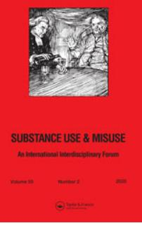
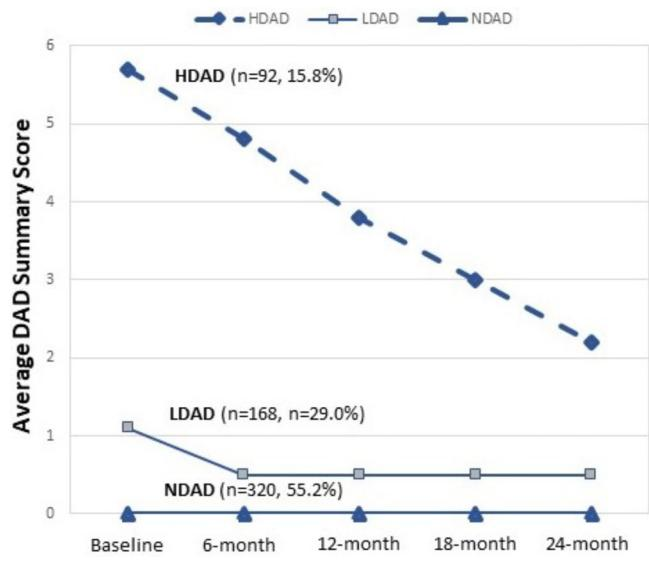

## **Substance Use & Misuse**

**ISSN: 1082-6084 (Print) 1532-2491 (Online) Journal homepage: [www.tandfonline.com/journals/isum20](https://www.tandfonline.com/journals/isum20?src=pdf)**

# **Trajectories of Driving after Drinking among Marijuana-Using Youth in the Emergency Department: Substance Use, Mental Health, and Peer and Parental Influences**

**Aaron D. Dora-Laskey, Jason E. Goldstick, Lisa Buckley, Erin E. Bonar, Marc A. Zimmerman, Maureen A. Walton, Rebecca M. Cunningham & Patrick M. Carter**

**To cite this article:** Aaron D. Dora-Laskey, Jason E. Goldstick, Lisa Buckley, Erin E. Bonar, Marc A. Zimmerman, Maureen A. Walton, Rebecca M. Cunningham & Patrick M. Carter (2020) Trajectories of Driving after Drinking among Marijuana-Using Youth in the Emergency Department: Substance Use, Mental Health, and Peer and Parental Influences, Substance Use & Misuse, 55:2, 175-187, DOI: [10.1080/10826084.2019.1660675](https://www.tandfonline.com/action/showCitFormats?doi=10.1080/10826084.2019.1660675)

**To link to this article:** <https://doi.org/10.1080/10826084.2019.1660675>

Published online: 10 Sep 2019.

[Submit your article to this journal](https://www.tandfonline.com/action/authorSubmission?journalCode=isum20&show=instructions&src=pdf) 

Article views: 419

View related [articles](https://www.tandfonline.com/doi/mlt/10.1080/10826084.2019.1660675?src=pdf)

View [Crossmark](http://crossmark.crossref.org/dialog/?doi=10.1080/10826084.2019.1660675&domain=pdf&date_stamp=10%20Sep%202019) data

ORIGINAL ARTICLE

## Trajectories of Driving after Drinking among Marijuana-Using Youth in the Emergency Department: Substance Use, Mental Health, and Peer and Parental Influences

Aaron D. Dora-Laskeya,b,c,d,e , Jason E. Goldsticka,b , Lisa Buckleyb,f , Erin E. Bonarb,c,d , Marc A. Zimmermanb,g,h , Maureen A. Waltonb,c,d , Rebecca M. Cunninghama,b,e,g,h , and Patrick M. Cartera,b,g

a Department of Emergency Medicine, University of Michigan, Ann Arbor, Michigan, USA; b University of Michigan Injury Prevention Center, Ann Arbor, Michigan, USA; c University of Michigan Addiction Center, Ann Arbor, Michigan, USA; d Department of Psychiatry, University of Michigan, Ann Arbor, Michigan, USA; e Hurley Medical Center, Flint, Michigan, USA; f The University of Queensland, St. Lucia, Queensland, Australia; g University of Michigan Youth Violence Prevention Center, Ann Arbor, Michigan, USA; h Department of Health Behavior and Health Education, University of Michigan, Ann Arbor, Michigan, USA

#### ABSTRACT

Background: The psychosocial correlates and longitudinal trajectories of driving after drinking (DAD) among youth remain understudied in at-risk populations. Objectives: We investigated the relationships of DAD trajectories and negative peer and parental influences, substance use, and mental health among predominantly marijuana-using youth seeking emergency department (ED) treatment. Methods: Data were from a 2-year prospective cohort study of drug-using patients (97.4% used marijuana) ages 14–24 seeking ED care for assault injury, or as part of a non-assaulted comparison group. Validated surveys measured DAD behaviors and correlates at baseline, 6, 12, 18, and 24 months. Latent class growth analysis identified characteristic DAD trajectory groups; baseline predictors were analyzed descriptively and using multinomial logistic regression. Results: Three DAD trajectory groups were identified among driving-age youth (n¼ 580): no DAD (NDAD; 55.2%), low-steady (LDAD; 29.0%), and high-declining (HDAD; 15.9%). In unadjusted analyses, HDAD youth were older, but otherwise similar to other groups demographically. Compared to NDAD, LDAD and HDAD group members had higher rates of drug and alcohol use disorders (p < .001). Further, HDAD group members had higher rates of anxiety symptoms and were more likely to be diagnosed with PTSD or depression than NDAD or LDAD youth (p < .05). Negative peer and parent influences were significantly higher in progressively more severe trajectory groups (p < .01). Adjusted effects from the multinomial model were analogous for peer and parental influences and substance use disorders, but not mental health. Conclusion: DAD is strongly associated with negative social influences and substance use disorders among marijuana-using youth, reinforcing their importance when developing interventions.

#### KEYWORDS

Drinking after driving; substance use disorder; mental health; emergency department; social influences; peer influences

#### Introduction

Motor vehicle crashes (MVCs) remain the leading cause of unintentional injury death among youth ages 16–24 in the US (CDC, [2015\)](#page-9-0), a significant proportion of which involve alcohol. In 2017, 21% of fatal crashes in this age group involved drivers with blood alcohol concentrations (BACs) -0.08 g/dL (NHTSA, [2018](#page-11-0)). Despite reductions in teenage driving after drinking (DAD) rates resulting from policy-oriented interventions like minimum legal drinking age (Wagenaar & Toomey, [2002](#page-11-0)) and zero tolerance laws (Zwerling & Jones, [1999](#page-11-0)), the percentage of fatally injured underage drivers with BACs -0.08 g/dL has remained above 20% for the past two decades (IHHS, [2015\)](#page-10-0). Further, despite increasing prevalence of marijuana use among emerging adults (Hasin et al., [2015](#page-10-0)), DAD among marijuana-using youth remains understudied. Given that marijuana-using underage drinkers report elevated rates of DAD (Buckley et al., [2017](#page-9-0)), identifying correlated risk behaviors in this subpopulation is important for developing interventions addressing the persistently high rates of alcohol-involved MVCs among youth.

Previously published studies of youth DAD have been limited in their study populations, scope, and timing. Prior research has focused on suburban/rural

CONTACT Aaron D. Dora-Laskey doralask@umich.edu Department of Emergency Medicine, University of Michigan, 2800 Plymouth Road, NCRC 10-G080, Ann Arbor, MI 48109, USA. 2019 Taylor & Francis Group, LLC

(Leadbeater, Foran, & Grove-White, [2008](#page-10-0)) or predominantly white samples (Beck, Caldeira, Vincent, & Arria, [2013;](#page-9-0) Kenney, Lac, Labrie, Hummer, & Pham, [2013](#page-10-0)). Relatedly, previous studies of youth DAD have often focused on secondary school (Li, Simons-Morton, & Hingson, [2013\)](#page-10-0) or undergraduate samples (Beck et al., [2013\)](#page-9-0), with few examining the roles of peer and family influences, substance use disorders, and mental health diagnoses on these behaviors among non-school-based populations. Further, they have not always considered the entire spectrum of alcohol-related impairment, especially the higher severity end (e.g., driving while intoxicated or when coordination is affected). Last, while several cross-sectional studies have shown associations between youth characteristics and DAD behaviors (Chen, Grube, Nygaard, & Miller, [2008](#page-9-0); Leadbeater et al., [2008](#page-10-0)), descriptions of DAD trajectories (i.e., longitudinal patterns derived from repeated measures studies) in this population are lacking. Improved characterization of youth DAD trajectories would better inform the timing and duration of behavioral and other interventions, especially in high-risk subgroups. Better understanding the longitudinal trajectories of DAD and their baseline predictors may reveal potential targets for behavioral change that can account for their severity and regularity (Caldeira et al., [2017](#page-9-0)).

Previously published repeated measures surveys of youth DAD have provided insights into the contour of these behavioral trajectories, suggesting that youth who drive after drinking are highly likely to continue doing so. In an 8-year longitudinal study of a sample recruited as undergraduates, DAD increased significantly during the college years, with a plateau around modal age 22; further, more than 80% of those reporting DAD persisted with this behavior from preceding years (Caldeira et al., [2017\)](#page-9-0). In another longitudinal undergraduate survey, DAD frequency peaked at ages 22–23, with a 72% relative increase in the two weeks after respondents' 21st birthdays (Fromme, Wetherill, & Neal, [2010\)](#page-10-0). Less is known about the trajectories of DAD among non-college samples, especially those with higher rates of poverty, drug use, and community stressors such as violence.

Social influences have been shown to be robust predictors of risk-taking among youth, e.g., substance use (Marschall-Levesque, Castellanos-Ryan, Vitaro, & Seguin, [2014](#page-10-0)), firearm violence (Goldstick et al., [2017\)](#page-10-0), and risky driving (Shope & Bingham, [2008\)](#page-11-0). When driving their peers, teenagers are more likely to drink, drive faster, and engage in other risky behaviors (e.g., running red lights), contributing to their being the only group whose fatal crash risk increases in the presence of passengers (Chen, Baker, Braver, & Li, [2000\)](#page-9-0). Alcohol and other drug consumption may potentiate negative peer influences on decision-making through the inhibition of cognitive control mechanisms (Albert, Chein, & Steinberg, [2013](#page-9-0)), while peer pressure predicts alcohol-related crashes (Shope, Raghunathan, & Patil, [2003](#page-11-0)). Although developmental theory posits that peer influences become more salient during adolescence as parental influences wane, the latter may still influence youth attitudes towards alcohol use through early adulthood (Martino, Ellickson, & McCaffrey, [2009](#page-10-0)). In a study of 10th and 12th graders, driving risks were highest among youth who reported riding with adults who drank alcohol and drove (Leadbeater et al., [2008\)](#page-10-0). In a survey of college students, DAD was predicted by a family history of alcohol abuse (LaBrie, Kenney, Mirza, & Lac, [2011\)](#page-10-0).

As the primary site of care for acutely injured youth, the emergency department (ED) has been identified as a venue in which to identify at-risk individuals for public health interventions aimed at reducing harmful drinking behaviors, including DAD (Cunningham et al., [2015;](#page-9-0) Maio et al., [2005](#page-10-0)). Given that many high-risk youth presenting for ED treatment may not be attending school (Cunningham et al., [2014\)](#page-9-0), frequently use the ED for primary health care (Cunningham et al., [2009](#page-9-0)), and are typically discharged home after treatment (McCaig & Burt, [2001\)](#page-11-0), the ED may have advantages over school, primary care, and other hospital settings for delivering counseling services and linking youth to resources addressing future injury risk. Characterizing heterogeneity in trajectories of DAD—and, in particular, defining and recognizing higher-risk subpopulations—may allow acute care clinicians to better identify those individuals who would most likely benefit from ED-delivered behavioral interventions aimed at reducing future injury from risky drinking.

In this study, we used latent class growth analysis (LCGA) on data from the Flint Youth Injury Study (FYI), a 2-year longitudinal cohort study enrolling exclusively drug-using youth (97.4% marijuana) presenting for ED care with or without an assault injury, to determine characteristic trajectories of DAD. We adopted a person-centered, exploratory approach in this analysis in order to achieve our primary analytic goal: to characterize heterogeneity in developmental trajectories among our study sample, and identify subpopulations with similar longitudinal risk profiles (Muthen & Muthen, [2000\)](#page-11-0). We then estimated the effects of baseline measures of social (peer and parental) influences on trajectory type, and—given the roles of mental health symptoms (Beck et al., [2013](#page-9-0)), alcohol consumption (LaBrie et al., [2011\)](#page-10-0), and other substance use (Li et al., [2013\)](#page-10-0) on youth DAD—analyzed the effects of these covariates. We hypothesized that negative peer and parental influences would be predictive of youth with higher-risk DAD trajectories over the course of the 24-month study period, even after adjustment for mental health symptoms and other substance use.

#### Methods

#### Study design and setting

The Flint Youth Injury Study (FYI) is a 24-month longitudinal study of drug-using youth (ages 14–24) seeking ED care for assault [assault-injured group (AIG)], or as part of a non-assaulted comparison group (CG; Bohnert et al., [2015\)](#page-9-0). The objective of the FYI study was to characterize the trajectories of mental health, substance use, and healthcare utilization in a high-risk sample of adolescents and emerging adults, to better understand service needs and optimal timing for behavioral interventions and other treatments (R.M. Cunningham et al., [2015\)](#page-9-0). The FYI sample was recruited at Hurley Medical Center (HMC) in Flint, Michigan, a Level 1 trauma center providing emergency care to 100,000 adult and pediatric patients annually. The study population is representative of Flint, a majority-Black city with a median household income less than \$25,000 (US Census Bureau, [2010](#page-11-0)). All study procedures were approved by The University of Michigan and HMC IRBs, and an NIH Certificate of Confidentiality was obtained.

#### Participant recruitment and protocol

The study protocol is described in detail elsewhere (Bohnert et al., [2015](#page-9-0)). Trained research assistants (RAs) recruited participants in the ED 7 days a week (excluding holidays) between December 2009 and September 2011, with 24 h of recruitment Thursday through Monday, and 21 h/day (5–2 am) on Tuesdays and Wednesdays.

Patients seeking care for an assault injury (defined as any intentional injury caused by another person) were identified using computerized tracking logs, and approached in treatment or waiting areas. After obtaining written consent (or assent with parental consent if age <18), RAs screened patients using a self-administered computerized survey. Those screening positive for past 6-month use of illicit drugs (marijuana, cocaine, inhalants, street opioids, methamphetamines, hallucinogens) or non-medical use (i.e., "to get high", "taking more than prescribed", "taking someone else's") of prescription drugs (i.e., sedative, stimulants, opioids) on items from the National Institute on Drug Abuse and the Alcohol, Smoking and Substance Use Involvement Screening Tests (NIDA-ASSIST; NIDA, [2010\)](#page-11-0) were eligible for enrollment in the longitudinal study (see Appendix A). The CG of drug-using, non-assaulted youth was systematically enrolled in parallel with the AIG to reduce seasonal/temporal variation, and proportionally sampled by gender and age (14–17, 18–20, 21–24). Patients presenting with sexual assault, suicidality, suspected child abuse, or any cognitive impairment precluding consent (e.g., alcohol intoxication, psychosis) were excluded, as were non-English speakers (<1%) and those in active police custody (3.2%). Initially unstable assault-injured patients were recruited from inpatient units within 72 h if their conditions stabilized.

Patients enrolled in the longitudinal study completed a baseline assessment, including a computerized survey and an RA-administered diagnostic interview. Surveys were administered privately. Remuneration was a gift valuing \$1 for the screening survey, \$20 for the baseline survey, and \$35, \$40, \$40, and \$50 for the follow-up assessments conducted at 6, 12, 18, and 24 months, respectively.

#### Measures

#### Primary outcome

The primary outcome variable was past 6-month DAD behaviors, measured using five questions from the Young Adult Driving Questionnaire (Donovan, [1993](#page-10-0)) that assessed the frequency of the following behaviors: Driving when feeling high or lightheaded from drinking; driving an hour after drinking 1–2 alcohol-containing beverages; driving after 3þ drinks; driving when drinking affected coordination; and drinking while driving. Responses were measured on a scale from 0 (Never) to 4 (10þ times), then summed to create a total DAD summary score (a ¼ 0.92).

#### Social influences

Peer and parental influences were assessed using 11 items from the Flint Adolescent Study (Ramirez-Valles, Zimmerman, & Newcomb, [1998\)](#page-11-0). Peer items measured peer alcohol and other drug use, as well as delinquency behaviors (e.g., fighting, weapon carrying, shoplifting). Parental items measured parent alcohol or drug use, as well as medical and legal consequences related to their substance use. Each item had a 5-point response scale ranging from Never (1) to Very often (5), and total scores were computed as the sum of these responses for both negative peer (a ¼ 0.81) and parental influences (a ¼ 0.76).

#### Demographics

Socio-demographics (age, sex, race/ethnicity, and receipt of public assistance [a proxy for socioeconomic status]) were assessed using items adapted from the National Longitudinal Study of Adolescent Health (Resnick et al., [1997](#page-11-0)), Drug Abuse Treatment Outcome Studies (Hser et al., [2001\)](#page-10-0) and the Substance Abuse Outcome Module (Smith et al., [2006](#page-11-0)). Race was dichotomized as Black vs. other for analysis.

#### Mental health

Diagnosis of mental health disorders, including current depressive episode and PTSD (in the month prior to but not including the index ED visit), was assessed by an RA using the MINI International Neuropsychiatric Interview (MINI; version 6.0, January 1, 2010) and MINI for Children and Adolescents (MINI KID; version 6.0, January 1, 2010; Sheehan et al., [1998,](#page-11-0) [2010\)](#page-11-0). Survey items reflected DSM-IV diagnostic criteria. Past-week anxiety symptoms were measured using the 6-item subscale within the Brief Symptom Inventory (BSI), where each item (ranging from 0 [Not at all] to 4 [Extremely]) was summed to create an anxiety summary score (a ¼ 0.88; Derogatis & Melisaratos, [1983\)](#page-9-0).

#### Substance use

The Alcohol Use Disorders Identification Test (AUDIT; Chung et al., [2000\)](#page-9-0) and the NIDA-ASSIST (Humeniuk et al., [2008;](#page-10-0) NIDA, [2010\)](#page-11-0) were used in the screening survey to assess past 6-month alcohol and drug use (including marijuana use), respectively (see Appendix A; a ¼ 0.70). The AUDIT was adapted to define binge drinking as 5 or more drinks on an occasion for this age range (Chung et al., [2000](#page-9-0); a ¼ 0.88). Similar to above, a diagnosis of an alcohol or drug use disorder (abuse or dependence) was assessed at baseline using the RAadministered MINI for patients -18 years old (Sheehan et al., [1998](#page-11-0)), and the MINI KID for patients <18 (both version 6.0, January 1, 2010; Sheehan et al., [2010](#page-11-0)).

#### Statistical analysis

We used LCGA to determine characteristic trajectories of DAD behaviors. This model assumes individuals exist in one of a fixed number of unobservable classes, and their class membership determines their mean trajectory. The primary analytic goal is to determine the number of trajectory types in the data, and the characteristics of those trajectory types. Following convention, we used the Bayesian Information Criteria (BIC) to select the number of classes (Nylund, Asparouhov, & Muthen, [2007\)](#page-11-0), allowing at most six classes to avoid overfitting. To further avoid overfitting, we constrained the optimization so that classes could not be created if they contained less than 10% of the sample, as in previous studies (Goldstick et al., [2018](#page-10-0); Walton et al., [2017](#page-11-0)). For each number of classes, the model was refit 200 times from random starting values to avoid convergence to local optima. We quantified class separation using the relative entropy of the posterior class membership distribution (Ram & Grimm, [2009](#page-11-0)). LCGA was performed using R 3.2.3 and the package flexmix (Grun & Leisch, [2008;](#page-10-0) Leisch, [2004](#page-10-0)).

Correlates of class membership were analyzed by first placing individuals into the trajectory groups based on the maximum posterior probability, and determining which baseline factors were associated with the resulting groups. Correlates of trajectory group membership were explored using descriptive statistics and multinomial logistic regression, where the choices of predictor variables in the adjusted analyses were theoretically based. Univariate test statistics for binary variables were calculated using Chi-square; continuous variables were analyzed using ANOVA or Kruskal–Wallis tests. Bivariate analysis and regression modeling were performed using SAS 9.4 (SAS Institute, Cary, NC).

### Results

#### Baseline sample characteristics

Overall, 599 youth (AIG ¼ 349, CG ¼ 250) were enrolled in the longitudinal study. The study flowchart has been previously published (Bohnert et al., [2015](#page-9-0); R.M. Cunningham et al., [2015](#page-9-0)); no differences between the baseline cohorts (AIG and CG) with regards to age, sex, race, or socioeconomic status were found (R.M. Cunningham et al., [2015](#page-9-0)). Among the screening sample, 61 of 250 were seeking care for an unintentional injury, 17 of whom were injured in MVCs. Follow-up rates for the overall sample were 85.3, 83.7, 84.2, and 85.3% at 6, 12, 18, and 24 months, respectively; these rates were similar between AIG and CG (R.M. Cunningham et al., [2015\)](#page-9-0). At baseline, 580 participants were of legal driving age (-16) and included in the analysis. The analytic sample had a mean age of 20.2 (SD ¼ 2.2), was 58.5% male, and 57.8% Black. Nearly all of the sample (97.4%) reported marijuana use in the past 6 months (20.2% weekly, 46.4% daily), with a mean ASSIST marijuana

|  |  | Table 1. Unadjusted bivariate comparisons of baseline characteristics and DAD trajectories. |  |  |
|--|--|---------------------------------------------------------------------------------------------|--|--|
|  |  |                                                                                             |  |  |

|                                                                    | NDAD (n ¼ 320) | LDAD (n ¼ 168) | HDAD (n ¼ 92) | Total (n ¼ 580) |
|--------------------------------------------------------------------|----------------|----------------|---------------|-----------------|
| Socio-demographics                                                 |                |                |               |                 |
| Age, mean (SD)                                                     | 20.1 (2.3)     | 20.1 (2.3)     | 20.9 (2.0)    | 20.2 (2.2)      |
| Male, n (%)                                                        | 187 (58.4)     | 100 (59.5)     | 52 (56.5)     | 339 (58.5)      |
| Black, n (%)                                                       | 197 (61.6)     | 92 (54.8)      | 46 (50.0)     | 335 (57.8)      |
| Public assistance, n (%)                                           | 239 (74.7)     | 117 (69.6)     | 67 (72.8)     | 423 (72.9)      |
| Index ED visit                                                     |                |                |               |                 |
| Assault-injury, n (%)                                              | 186 (58.1)     | 91 (54.2)      | 58 (63.0)     | 335 (57.8)      |
| Negative peer influencesa                                          |                |                |               |                 |
| Peer alcohol use, mean (SD)                                        | 2.3 (1.1)      | 2.7 (1.1)      | 3.5 (1.3)     | 2.6 (1.2)       |
| Peer marijuana use, mean (SD)                                      | 2.8 (1.2)      | 3.1 (1.2)      | 3.4 (1.2)     | 3.0 (1.2)       |
| Peer other drug use, mean (SD)                                     | 1.3 (0.7)      | 1.4 (0.8)      | 1.7 (1.0)     | 1.4 (0.8)       |
| Peer legal trouble (drugs), mean (SD)                              | 1.5 (0.7)      | 1.7 (0.9)      | 2.0 (1.1)     | 1.6 (0.9)       |
| Peer fighting, mean (SD)                                           | 2.1 (1.1)      | 2.2 (0.9)      | 2.6 (1.2)     | 2.2 (1.1)       |
| Peer weapon carrying, mean (SD)                                    | 1.7 (1.0)      | 2.2 (1.1)      | 2.6 (1.2)     | 2.0 (1.1)       |
| Peer shoplifting, mean (SD)                                        | 1.4 (0.7)      | 1.6 (0.8)      | 1.9 (1.0)     | 1.5 (0.8)       |
| Total of negative peer influences scores, mean (SD)                | 13.1 (4.3)     | 14.9 (4.4)     | 17.8 (5.4)    | 14.4 (4.8)      |
| Negative parental influencesa                                      |                |                |               |                 |
| Parent getting drunk, mean (SD)                                    | 1.9 (1.2)      | 2.2 (1.2)      | 2.4 (1.4)     | 2.1 (1.3)       |
| Parental alcohol or drug treatment, mean (SD)                      | 1.3 (0.8)      | 1.6 (1.2)      | 1.8 (1.3)     | 1.5 (1.0)       |
| Parent high on drugs or pills, mean (SD)                           | 1.5 (1.1)      | 1.7 (1.2)      | 2.1 (1.6)     | 1.7 (1.2)       |
| Parental legal trouble (drugs), mean (SD)                          | 1.1 (0.6)      | 1.3 (0.9)      | 1.5 (1.1)     | 1.2 (0.8)       |
| Total of negative parental influences scores, mean (SD)            | 5.8 (2.8)      | 6.8 (3.4)      | 7.7 (4.2)     | 6.4 (3.3)       |
| Substance use                                                      |                |                |               |                 |
| Alcohol use disorder, n (%)                                        | 26 (8.1)       | 35 (20.8)      | 55 (60.0)     | 116 (20.0)      |
| Drug use disorder, n (%)                                           | 144 (45.0)     | 118 (70.1)     | 68 (73.9)     | 330 (57.0)      |
| ASSIST marijuana score, mean (SD)                                  | 11.9 (8.5)     | 14.7 (9.2)     | 16.3 (9.6)    | 13.4 (9.0)      |
| Mental health                                                      |                |                |               |                 |
| PTSD diagnosis, n (%)                                              | 28 (8.8)       | 14 (8.3)       | 18 (19.6)     | 60 (10.3)       |
| Depression diagnosis, n (%)                                        | 38 (11.9)      | 18 (10.7)      | 22 (23.9)     | 78 (13.5)       |
| Anxiety symptoms (total of BSI anxiety subscale scores), mean (SD) | 3.6 (5.0)      | 4.3 (5.0)      | 6.6 (6.2)     | 4.3 (5.3)       |

NDAD, no DAD; LDAD, low-steady DAD; HDAD, high declining DAD.

 p &lt; .05. p &lt; .01. p &lt; .001. a

Negative peer and parental influence scores for individual items range from 1 (Never) to 5 (Very Often). Total scores range from 7 to 35 for negative peer influences, and 4 to 20 for negative parental influences.

score of 13.4 (SD ¼ 9.0), where scores of -4 indicate misuse (see Table 1). More than a quarter (28.4%) reported at least one DAD behavior during the same period; "driving while high or lightheaded from drinking" was the most commonly endorsed behavior in this group (64.8%).

#### Longitudinal trajectories of DAD

Longitudinal DAD trajectories are shown in [Figure 1.](#page-6-0) Analysis using BIC and the group size (>10% prior probability) constraint resulted in a three-class solution: a no driving after drinking group (NDAD; N ¼ 320, 55.2%), which reported no DAD behavior across all follow-up time points (i.e., none of the youth in this group had a non-zero score at any time point); a low-steady driving after drinking group (LDAD; N ¼ 168, 29.0%), which declined between baseline and 6 months, then remained steady; and a high-declining driving after drinking group (HDAD; N ¼ 92, 15.9%), which started high, then declined linearly throughout the follow-up period. Trajectory group separation was excellent (relative entropy ¼ 0.96); 95% of individuals had >90% posterior probability of being in their most likely class, further indicating very good class separation.

#### Characteristics of DAD trajectory groups

Table 1 presents the unadjusted comparisons between NDAD, LDAD, and HDAD trajectory groups based on socio-demographic categories, negative peer and parental influences, substance use disorders, and mental health. HDAD group members were older (20.9 vs. 20.1 years, p < .01), otherwise groups did not differ significantly in terms of sex, race, use of public assistance, and reason for seeking ED care (AIG vs. CG).

Compared to the NDAD group, the low-steady and high-declining groups were associated with increasingly greater likelihood of friends exhibiting negative influences and negative parental influences (parental substance use and drug-related legal consequences). Further, youth within the LDAD and HDAD groups were more likely to have a baseline diagnosis of a drug use or alcohol use disorder (AUD), higher marijuana use, a depression or PTSD diagnosis, and greater anxiety symptoms.

#### Multinomial logistic regression model

The multinomial model in [Table 2](#page-6-0) shows adjusted comparisons between DAD trajectory groups on baseline covariates; the first two columns compare HDAD and LDAD groups with the NDAD group, while the third compares HDAD to LDAD groups. As in the

Figure 1. Longitudinal driving after drinking (DAD) trajectories among assault-injured and non-assaulted youth seeking urban ED care (NDAD, no DAD; LDAD, low-steady DAD; HDAD, high declining DAD).

Table 2. Multinomial logit model comparing baseline characteristics at the index ED visit which predict DAD trajectories.

| Socio-demographics                          | LDAD vs. NDAD (RRR, 95% CI) | HDAD vs. NDAD (RRR, 95% CI) | HDAD vs. LDAD (RRR, 95% CI) |
|---------------------------------------------|-----------------------------|-----------------------------|-----------------------------|
| Age                                         | 1.03 (0.94, 1.13)           | 1.17 (1.03, 1.33)           | 1.14 (1.00, 1.30)           |
| Male sex                                    | 0.84 (0.55, 1.27)           | 0.85 (0.47, 1.54)           | 1.02 (0.56, 1.86)           |
| Black race                                  | 0.91 (0.61, 1.37)           | 1.10 (0.63, 1.95)           | 1.21 (0.68, 2.15)           |
| Public assistance                           | 0.73 (0.47, 1.14)           | 0.73 (0.39, 1.36)           | 0.99 (0.53, 1.89)           |
| Index ED visit                              |                             |                             |                             |
| Assault injury                              | 0.84 (0.56, 1.25)           | 1.00 (0.57, 1.76)           | 1.19 (0.67, 2.12)           |
| Peer and parental influences                |                             |                             |                             |
| Negative peer influences (total scores)     | 1.06 (1.01, 1.11)           | 1.13 (1.06, 1.20)           | 1.07 (1.01, 1.13)           |
| Negative parental influences (total scores) | 1.08 (1.01, 1.15)           | 1.10 (1.02, 1.19)           | 1.02 (0.95, 1.11)           |
| Substance use disorders                     |                             |                             |                             |
| Drug use disorder                           | 2.36 (1.56, 3.70)           | 1.30 (0.69, 2.45)           | 0.54 (0.28, 1.06)           |
| Alcohol use disorder                        | 1.90 (1.05, 3.44)           | 9.94 (5.17, 19.10)          | 5.24 (2.77, 9.90)           |
| Mental health                               |                             |                             |                             |
| Post-traumatic stress disorder (PTSD)       | 0.71 (0.33, 1.54)           | 1.23 (0.52, 2.90)           | 1.74 (0.71, 4.25)           |
| Depression diagnosis                        | 0.61 (0.30, 1.24)           | 0.89 (0.40, 2.00)           | 1.45 (0.63, 3.36)           |
| Anxiety symptoms (BSI)                      | 1.01 (0.96, 1.06)           | 1.01 (0.95, 1.07)           | 1.00 (0.94, 1.06)           |

 p < .05. p < .01. p < .001.

unadjusted analysis, only age (but not race, sex, public assistance, or assault injury) was significantly associated with DAD trajectory class. More negative peer influences were associated with more severe DAD trajectories. Specifically, relative to the NDAD group, a one standard deviation increase in the peer influences variable corresponded to a 32.2 and 65.0% increased relative risk of being in the LDAD and HDAD groups, respectively. Higher negative parental influence scores were associated with HDAD and LDAD group membership, relative to NDAD; however, they did not differ when compared to each other. Drug and AUDs were both more likely to be diagnosed in the LDAD group than the NDAD group; however, only AUDs were more likely in the HDAD group when compared to the LDAD and NDAD groups. When controlling for demographic variables and substance use disorders, none of the mental health factors (PTSD, depression, and anxiety symptoms) were predictive of DAD trajectory class membership.

#### Discussion

To our knowledge, this is the first longitudinal study of DAD trajectories among marijuana-using youth. These novel findings highlight the importance of understanding how social influences affect alcoholinvolved driving among marijuana co-users, especially as marijuana use is increasing and state laws liberalize marijuana access (Beming, Compton, & Wochinger, [2015\)](#page-9-0). Overall, more than a quarter of this study's participants reported past 6-month DAD at baseline. While direct comparisons to prior literature are challenging given the lack of similar published data, rates of past-year DAD among youth between the ages of 18–24 (18.0–28.9%; Evans-Whipp et al., [2013;](#page-10-0) Hingson, Zha, & Weitzman, [2009\)](#page-10-0) suggest that the 6 month period prevalence of DAD in our population are on the higher end of this range. This likely reflects the higher risk nature of our drug-using sample, 97.4% of whom endorsed marijuana use, and 57.0% of whom met criteria for a drug use disorder at baseline. While increasing legal access to cannabis has focused attention on drugged driving (Sevigny, [2018](#page-11-0)), the role of alcohol in impaired driving among marijuana-using individuals is also of concern, with combined alcohol and marijuana use posing a greater fatal crash risk than alcohol alone (Chihuri, Li, & Chen, [2017](#page-9-0)). Future studies should examine how the increasing availability of legal marijuana may affect risky driving among youth, including DAD or after co-ingestion of alcohol and marijuana.

Both trajectory groups reporting DAD at baseline (LDAD and HDAD) decreased these behaviors in the first 6 months post-ED visit, after which the lowsteady group remaining stably low throughout the study period, and the high-declining group decreased in a linear fashion while continuing to report DAD even at 24-month follow-up. The HDAD group dropped approximately one point on the DAD summary score for each 6-month measurement period, suggesting the possibility of an age-related phenomenon. While this may simply reflect regression to the mean, in a separate analysis of the FYI cohort examining dual trajectories of mental health and alcohol use we found that the highest-risk drinking group also had a linear diminution in risky drinking behavior over the 2-year study period Goldstick et al., [2018](#page-10-0)), suggesting that "aging out" of high-risk behaviors may also be a factor. Alternatively, among second-year college students, Calderia et al. identified declines in driving while specifically intoxicated/drunk or drugged—but not DAD generally—suggesting "maturing" effects of particularly high risk behavior (Caldeira et al., [2017](#page-9-0)). Regardless, these findings especially given the persistently high DAD behaviors among the HDAD group at 24 months—support the ED's potential as a site for interventions to prevent intoxicated driving, and may inform their timing, targeting, and duration.

Our exploratory analysis of young, drug-using ED patients revealed that those in the low-steady and high-declining trajectory groups were more likely to report association with delinquent peers engaged in substance use, violence, and theft. Our finding that negative peer and parental influences are associated with adverse alcohol and driving behaviors suggests that at-risk youth may benefit from behavioral interventions that address these negative social influences and provide positive role models (Hurd, Zimmerman, & Xue, [2009\)](#page-10-0). The significant relationship between peer influences and DAD in this cohort corroborates prior studies that demonstrated the importance of social influences on substance use behavior, including alcohol use and depression/anxiety (Goldstick et al., [2018](#page-10-0)). In a longitudinal community-based sample, deviant peer affiliation measured at age 16 predicted DUI arrest by age 32 (Pelham & Dishion, [2018](#page-11-0)). Perceived DAD by peers was associated positively with youth DAD among 1009 respondents to a telephone survey ages 15–20 (Chen et al., [2008\)](#page-9-0), while perceiving peer disapproval of DAD may be protective (Allen & Brown, [2008](#page-9-0); Chen et al., [2008\)](#page-9-0). Further, young people's likelihood of engaging in risky behaviors may be reduced by interventions that enhance refusal skills, and place more value within the peer group of being "crash-free"(Allen & Brown, [2008](#page-9-0)).

We found that negative parental influences – including exposure to parental substance use and/or drug-related illegal activity – was associated with increased the risk of youth DAD. These findings reinforce the results of a previously published analysis of 9,559 adolescents and young adults aged 11–26, in which parent drinking was predictive of youth DAD (Maldonado-Molina, Reingle, Delcher, & Branchini, [2011](#page-10-0)). Our findings that parents' alcohol intoxication and history of AUD treatment increases the risk of youth DAD parallels the association Chen et al. found between perceived DAD by parents and that of their adolescent and young adult children (ages 15–20; Chen et al., [2008](#page-9-0)). These findings reinforce the strong parallels between the epidemiology of DAD in this (mostly) marijuana-using sample and that of broader populations, suggesting that similar prevention strategies may be applicable, with potential tailoring to target co-ingestion of alcohol and marijuana and driving after marijuana consumption. Several communitybased studies have demonstrated the value of parental monitoring in reducing the risk of youth DAD (Haegerich, Shults, Oman, & Vesely, [2016;](#page-10-0) Pelham & Dishion, [2018\)](#page-11-0), suggesting that parenting-centered programs may potentially reduce youth DADrelated morbidity.

AUDs were prevalent among both of the trajectory groups with past 6-month DAD, with participants in the HDAD group nearly 10 times more likely to be diagnosed with an AUD as those in the NDAD group. Given that brief interventions for alcohol misuse have been shown to reduce alcohol consumption (Tanner-Smith & Lipsey, [2015](#page-11-0)) and DAD among youth populations (Steinka-Fry, Tanner-Smith, & Hennessy, [2015](#page-11-0))–and that most youth evaluated in the ED are discharged home after treatment–there may be a role for ED-based interventions in high-risk patients. Indeed, studies of screening, behavioral interventions, and referral to treatment (SBIRT) for risky drinking in ED patients have shown that such programs improve the rate of treatment engagement (D'Onofrio & Degutis, [2010\)](#page-9-0), and reduce both short-term alcohol consumption (Academic ED SBIRT Research Collaborative, [2007](#page-9-0), [2010](#page-9-0)) and alcohol consequences (including DAD; Cunningham et al., [2015](#page-9-0)). Because youth DAD is associated withincreased MVC risk (Zador, Krawchuk, & Voas, [2000\)](#page-11-0), such interventions may reduce premature death with even modest effect sizes.

In our study, PTSD, depression, and anxiety were associated with a greater likelihood of DAD behaviors in the unadjusted bivariate analysis; however, these differences were not statistically significant when controlling for other factors. While drinking to cope with negative affective states (the "self-medication hypothesis"; Khantzian, [1985](#page-10-0)) is associated with adverse alcohol consequences, a review by Kuntsche et al. (Kuntsche, Knibbe, Gmel, & Engels, [2005](#page-10-0)) suggests that youth drinking is predominantly socially motivated. As youth reporting lower levels of depression and anxiety tend to have more friends, they may have more opportunities to consume alcohol (i.e., improved mental health may paradoxically increase drinking risk; Pedersen et al., [2013](#page-11-0)). Alternatively, there is evidence that alcohol use increases during adolescence irrespective of depressive symptoms (Hooshmand, Willoughby, & Good, [2012\)](#page-10-0).

Among demographic variables, only age was significant, which may reflect the age-related increase in DAD known to occur between adolescence and early adulthood (IHHS, [2015\)](#page-10-0), or an unmeasured confounder (e.g., driver's license ownership, which increases between the ages of 16 and 24; Sivak & Schoettle, [2016\)](#page-11-0). There was no statistically significant relationship between DAD trajectories and whether a patient had presented to the ED with an assaultrelated injury or not. This may reflect the high-risk characteristics of the overall study sample, in which even the non-AIG reported a high rate of violence perpetration and victimization (Bohnert et al., [2015](#page-9-0)).

We note several limitations to this study. Because our sample was recruited from a single institution in a deindustrialized city with high rates of poverty and violent crime, results may not be generalizable to rural or suburban populations. All of the participants endorsed past six-month drug use (>97% marijuana), and more than half sought ED care for an assaultrelated injury; further, even the non-AIG reported high rates of substance use disorders and violence behaviors. These characteristics may restrict the generalizability of our findings to lower-risk youth populations, though we did control for both assault injury and drug use disorder in our regression model. While drugged driving was not specifically measured in this study, prior work from 18- to 25-year-olds screened at HMC found that nearly one-quarter reported pastyear drugged (mostly marijuana-involved) driving, with 25% reporting drugged driving having done so at least 10 times in the past 12 months (Bonar et al., [2018\)](#page-9-0). Finally, given the dearth of literature on drink driving trajectories among marijuana-using youth, this analysis is inherently exploratory in its approach. Future research specifically examining drugged driving will be needed in order to best inform interventions for risky driving behaviors among substance-using youth, particularly given the increased harms associated with combined alcohol and marijuana use (Dubois, Mullen, Weaver, & Bedard, [2015](#page-10-0); Romano, Voas, & Camp, [2017](#page-11-0)).

#### Conclusions

These findings underscore the need for interventions aimed at reducing morbidity and mortality from MVCs among marijuana-using youth. Such approaches should address both negative peer and parental influences, particularly given their associations with more severe DAD trajectories in this longitudinal cohort. Future studies are needed that measure drugged driving in addition to DAD, explore youth's motivations around risky driving behaviors, and examine barriers to alternatives to driving after drug or alcohol use (e.g., using a designated driver or ridesharing service).

#### Acknowledgements

The authors wish to acknowledge project staff, including Bethany Buschmann, M.P.H., Jessica Roche, M.P.H., Linping Duan, M.S., and Sonia Kamat, M.S. for their assistance in data and manuscript preparation. Finally, special thanks are owed to the patients and medical staff of HMC for their support of this project.

#### Disclosure statement

The findings and conclusions in this report are those of the authors and do not necessarily represent the official position of the funding agencies. Dr. Dora-Laskey authored the first draft of this manuscript. No honoraria, grants or other form of payment were received for producing this manuscript.

### Funding

This work was funded by NIDA R01 024646 and, in part, by CDCP 1R49CE002099, NIH/NIDA K23DA039341, NIH/ NIDA K23DA036008, and NIH/NIAAA T32AA007477.

#### ORCID

Lisa Buckley http://orcid.org/0000-0003-1542-938X

#### References

- Academic ED SBIRT Research Collaborative. [\(2007](#page-8-0)). The impact of screening, brief intervention, and referral for treatment on emergency department patients' alcohol use. Annals of Emergency Medicine, 50(6), 699–710.e6. doi[:10.1016/j.annemergmed.2007.06.486](https://doi.org/10.1016/j.annemergmed.2007.06.486)
- Academic ED SBIRT Research Collaborative. [\(2010](#page-8-0)). The impact of screening, brief intervention and referral for treatment in emergency department patients' alcohol use: A 3-, 6- and 12-month follow-up. Alcohol Alcohol, 45(6), 514–519. doi[:10.1093/alcalc/agq058](https://doi.org/10.1093/alcalc/agq058)
- Albert, D., Chein, J., & Steinberg, L. ([2013\)](#page-2-0). Peer influences on adolescent decision making. Current Directions in Psychological Science, 22(2), 114–120. doi[:10.1177/](https://doi.org/10.1177/0963721412471347) [0963721412471347](https://doi.org/10.1177/0963721412471347)
- Allen, J. P., & Brown, B. B. [\(2008\)](#page-7-0). Adolescents, peers, and motor vehicles: The perfect storm? American Journal of Preventive Medicine, 35(3), S289–S293. doi:[10.1016/j.](https://doi.org/10.1016/j.amepre.2008.06.017) [amepre.2008.06.017](https://doi.org/10.1016/j.amepre.2008.06.017)
- Beck, K. H., Caldeira, K. M., Vincent, K. B., & Arria, A. M. [\(2013](#page-2-0)). Social contexts of drinking and subsequent alcohol use disorder among college students. The American Journal of Drug and Alcohol Abuse, 39(1), 38–43. doi:[10.](https://doi.org/10.3109/00952990.2012.694519) [3109/00952990.2012.694519](https://doi.org/10.3109/00952990.2012.694519)
- Beming, A., Compton, R., & Wochinger, K. [\(2015\)](#page-6-0). Results of the 2013–2014 National Roadside Survey of Alcohol and Drug Use by Drivers. Retrieved from [https://www.nhtsa.gov/](https://www.nhtsa.gov/sites/nhtsa.dot.gov/files/812118-roadside_survey_2014.pdf) [sites/nhtsa.dot.gov/files/812118-roadside\\_survey\\_2014.pdf](https://www.nhtsa.gov/sites/nhtsa.dot.gov/files/812118-roadside_survey_2014.pdf)
- Bohnert, K. M., Walton, M. A., Ranney, M., Bonar, E. E., Blow, F. C., Zimmerman, M. A., Booth, B., & Cunningham, R. M. [\(2015](#page-3-0)). Understanding the service needs of assault-injured, drug-using youth presenting for care in an urban Emergency Department. Addict Behav, 41, 97-105. doi[:10.1016/j.addbeh.2014.09.019](https://doi.org/10.1016/j.addbeh.2014.09.019)
- Bonar, E. E., Arterberry, B. J., Davis, A. K., Cunningham, R. M., Blow, F. C., Collins, R. L., & Walton, M. A. [\(2018\)](#page-8-0). Prevalence and motives for drugged driving among emerging adults presenting to an emergency department. Addict Behav, 78, 80–84. doi:[10.1016/j.addbeh.2017.11.002](https://doi.org/10.1016/j.addbeh.2017.11.002)
- Buckley, L., Bonar, E. E., Walton, M. A., Carter, P. M., Voloshyna, D., Ehrlich, P. F., & Cunningham, R. M. [\(2017\)](#page-1-0). Marijuana and other substance use among male and female underage drinkers who drive after drinking and ride with those who drive after drinking. Addictive Behaviors, 71, 7–11. doi[:10.1016/j.addbeh.2017.02.016](https://doi.org/10.1016/j.addbeh.2017.02.016)
- Caldeira, K. M., Arria, A. M., Allen, H. K., Bugbee, B. A., Vincent, K. B., & O'Grady, K. E. ([2017](#page-2-0)). Continuity of drunk and drugged driving behaviors four years post-college. Drug and Alcohol Dependence, 180, 332–339. doi:[10.](https://doi.org/10.1016/j.drugalcdep.2017.08.032) [1016/j.drugalcdep.2017.08.032](https://doi.org/10.1016/j.drugalcdep.2017.08.032)
- CDC. [\(2015](#page-1-0)). WISQARS leading causes of death reports. Retrieved from [https://webappa.cdc.gov/sasweb/ncipc/lead](https://webappa.cdc.gov/sasweb/ncipc/leadcause.html)[cause.html](https://webappa.cdc.gov/sasweb/ncipc/leadcause.html)
- Chen, L. H., Baker, S. P., Braver, E. R., & Li, G. ([2000\)](#page-2-0). Carrying passengers as a risk factor for crashes fatal to 16- and 17-year-old drivers. JAMA, 283(12), 1578–1582. doi:[10.1001/jama.283.12.1578](https://doi.org/10.1001/jama.283.12.1578)
- Chen, M. J., Grube, J. W., Nygaard, P., & Miller, B. A. [\(2008\)](#page-2-0). Identifying social mechanisms for the prevention of adolescent drinking and driving. Accident Analysis & Prevention, 40(2), 576–585. doi:[10.1016/j.aap.2007.08.013](https://doi.org/10.1016/j.aap.2007.08.013)
- Chihuri, S., Li, G., & Chen, Q. ([2017\)](#page-7-0). Interaction of marijuana and alcohol on fatal motor vehicle crash risk: A case-control study. Injury Epidemiology, 4(1), 8. doi:[10.](https://doi.org/10.1186/s40621-017-0105-z) [1186/s40621-017-0105-z](https://doi.org/10.1186/s40621-017-0105-z)
- Chung, T., Colby, S. M., Barnett, N. P., Rohsenow, D. J., Spirito, A., & Monti, P. M. [\(2000](#page-4-0)). Screening adolescents for problem drinking: Performance of brief screens against DSM-IV alcohol diagnoses. Journal of Studies on Alcohol, 61(4), 579–587. doi:[10.15288/jsa.2000.61.579](https://doi.org/10.15288/jsa.2000.61.579)
- Cunningham, R., Knox, L., Fein, J., Harrison, S., Frisch, K., Walton, M., … Hargarten, S. W. ([2009\)](#page-2-0). Before and after the trauma bay: The prevention of violent injury among youth. Annals of Emergency Medicine, 53(4), 490–500. doi:[10.1016/j.annemergmed.2008.11.014](https://doi.org/10.1016/j.annemergmed.2008.11.014)
- Cunningham, R. M., Carter, P. M., Ranney, M., Zimmerman, M. A., Blow, F. C., Booth, B. M.,Goldstick, J., & Walton, M. A. [\(2015](#page-4-0)). Violent reinjury and mortality among youth seeking emergency department care for assault-related injury: a 2-year prospective cohort study. JAMA Pediatr, 169(1), 63-70. doi:[10.1001/jamapediatrics.](https://doi.org/10.1001/jamapediatrics.2014.1900) [2014.1900](https://doi.org/10.1001/jamapediatrics.2014.1900)
- Cunningham, R. M., Chermack, S. T., Ehrlich, P. F., Carter, P. M., Booth, B. M., Blow, F. C., … Walton, M. A. [\(2015\)](#page-2-0). Alcohol interventions among underage drinkers in the ED: A randomized controlled trial. Pediatrics, 136(4), e783–e793. doi[:10.1542/peds.2015-1260](https://doi.org/10.1542/peds.2015-1260)
- Cunningham, R. M., Ranney, M., Newton, M., Woodhull, W., Zimmerman, M., & Walton, M. A. ([2014\)](#page-2-0). Characteristics of youth seeking emergency care for assault injuries. Pediatrics, 133(1), e96–e105. doi:[10.1542/](https://doi.org/10.1542/peds.2013-1864) [peds.2013-1864](https://doi.org/10.1542/peds.2013-1864)
- D'Onofrio, G., & Degutis, L. C. ([2010\)](#page-8-0). Integrating Project ASSERT: A screening, intervention, and referral to treatment program for unhealthy alcohol and drug use into an urban emergency department. Academic Emergency Medicine, 17(8), 903–911. doi:[10.1111/j.1553-2712.2010.](https://doi.org/10.1111/j.1553-2712.2010.00824.x) [00824.x](https://doi.org/10.1111/j.1553-2712.2010.00824.x)
- Derogatis, L. R., & Melisaratos, N. [\(1983](#page-4-0)). The brief symptom inventory: An introductory report. Psychological Medicine, 13(3), 595–605.
- Donovan, J. E. [\(1993\)](#page-3-0). Young adult drinking-driving: Behavioral and psychosocial correlates. Journal of Studies on Alcohol, 54(5), 600–613. doi[:10.15288/jsa.1993.54.600](https://doi.org/10.15288/jsa.1993.54.600)
- Dubois, S., Mullen, N., Weaver, B., & Bedard, M. ([2015](#page-8-0)). The combined effects of alcohol and cannabis on driving: Impact on crash risk. Forensic Science International, 248, 94–100. doi:[10.1016/j.forsciint.2014.12.018](https://doi.org/10.1016/j.forsciint.2014.12.018)
- Evans-Whipp, T. J., Plenty, S. M., Toumbourou, J. W., Olsson, C., Rowland, B., & Hemphill, S. A. ([2013](#page-7-0)). Adolescent exposure to drink driving as a predictor of young adults' drink driving. Accident Analysis & Prevention, 51, 185–191. doi:[10.1016/j.aap.2012.11.016](https://doi.org/10.1016/j.aap.2012.11.016)
- Fromme, K., Wetherill, R. R., & Neal, D. J. [\(2010\)](#page-2-0). Turning 21 and the associated changes in drinking and driving after drinking among college students. Journal of American College Health, 59(1), 21–27. doi:[10.1080/](https://doi.org/10.1080/07448481.2010.483706) [07448481.2010.483706](https://doi.org/10.1080/07448481.2010.483706)
- Goldstick, J. E., Bohnert, K. M., Davis, A. K., Bonar, E. E., Carter, P. M., Walton, M. A., & Cunningham, R. M. ([2018\)](#page-4-0). Dual Trajectories of Depression/Anxiety Symptoms and Alcohol Use, and their Implications for Violence Outcomes Among Drug-Using Urban Youth. Alcohol Alcohol. doi[:10.1093/alcalc/agy036](https://doi.org/10.1093/alcalc/agy036)
- Goldstick, J. E., Carter, P. M., Walton, M. A., Dahlberg, L. L., Sumner, S. A., Zimmerman, M. A., & Cunningham, R. M. ([2017](#page-2-0)). Development of the SaFETy score: A clinical screening tool for predicting future firearm violence risk. Annals of Internal Medicine, 166(10), 707–714. doi: [10.7326/M16-1927](https://doi.org/10.7326/M16-1927)
- Grun, B., & Leisch, F. ([2008\)](#page-4-0). FlexMix version 2: Finite mixtures with concomitant variables and varying constant parameters. Journal of Statistical Software, 28(4), 1–35. doi:[10.18637/jss.v028.i04](https://doi.org/10.18637/jss.v028.i04)
- Haegerich, T. M., Shults, R. A., Oman, R. F., & Vesely, S. K. ([2016\)](#page-7-0). The predictive influence of youth assets on drinking and driving behaviors in adolescence and young adulthood. The Journal of Primary Prevention, 37(3), 231–245. doi[:10.1007/s10935-016-0418-7](https://doi.org/10.1007/s10935-016-0418-7)
- Hasin, D. S., Saha, T. D., Kerridge, B. T., Goldstein, R. B., Chou, S. P., Zhang, H., … Grant, B. F. ([2015](#page-1-0)). Prevalence of marijuana use disorders in the United States between 2001-2002 and 2012-2013. JAMA Psychiatry, 72(12), 1235–1242. doi[:10.1001/jamapsychia](https://doi.org/10.1001/jamapsychiatry.2015.1858)[try.2015.1858](https://doi.org/10.1001/jamapsychiatry.2015.1858)
- Hingson, R. W., Zha, W., & Weitzman, E. R. ([2009](#page-7-0)). Magnitude of and trends in alcohol-related mortality and morbidity among U.S. college students ages 18-24, 1998- 2005. Journal of Studies on Alcohol and Drugs, Supplement, (s16), 12–20. doi[:10.15288/jsads.2009.s16.12](https://doi.org/10.15288/jsads.2009.s16.12)
- Hooshmand, S., Willoughby, T., & Good, M. [\(2012](#page-8-0)). Does the direction of effects in the association between depressive symptoms and health-risk behaviors differ by behavior? A longitudinal study across the high school years. Journal of Adolescent Health, 50(2), 140–147. doi:[10.1016/](https://doi.org/10.1016/j.jadohealth.2011.05.016) [j.jadohealth.2011.05.016](https://doi.org/10.1016/j.jadohealth.2011.05.016)
- Hser, Y. I., Grella, C. E., Hubbard, R. L., Hsieh, S. C., Fletcher, B. W., Brown, B. S., & Anglin, M. D. ([2001](#page-4-0)). An evaluation of drug treatments for adolescents in 4 US cities. Archives of General Psychiatry, 58(7), 689–695. doi: [10.1001/archpsyc.58.7.689](https://doi.org/10.1001/archpsyc.58.7.689)
- Humeniuk, R., Ali, R., Babor, T. F., Farrell, M., Formigoni, M. L., Jittiwutikarn, J., … Simon, S. ([2008](#page-4-0)). Validation

of the alcohol, smoking and substance involvement screening test (ASSIST). Addiction, 103(6), 1039–1047. doi[:10.1111/j.1360-0443.2007.02114.x](https://doi.org/10.1111/j.1360-0443.2007.02114.x)

- Hurd, N. M., Zimmerman, M. A., & Xue, Y. ([2009](#page-7-0)). Negative adult influences and the protective effects of role models: A study with urban adolescents. Journal of Youth and Adolescence, 38(6), 777–789. doi[:10.1007/](https://doi.org/10.1007/s10964-008-9296-5) [s10964-008-9296-5](https://doi.org/10.1007/s10964-008-9296-5)
- IHHS. ([2015\)](#page-1-0). Impaired driving. Retrieved from [http://www.](http://www.iihs.org/iihs/topics/t/impaired-driving/fatalityfacts/impaired-driving) [iihs.org/iihs/topics/t/impaired-driving/fatalityfacts/](http://www.iihs.org/iihs/topics/t/impaired-driving/fatalityfacts/impaired-driving) [impaired-driving](http://www.iihs.org/iihs/topics/t/impaired-driving/fatalityfacts/impaired-driving)
- Kenney, S. R., Lac, A., Labrie, J. W., Hummer, J. F., & Pham, A. ([2013\)](#page-2-0). Mental health, sleep quality, drinking motives, and alcohol-related consequences: A path-analytic model. Journal of Studies on Alcohol and Drugs, 74(6), 841–851. doi[:10.15288/jsad.2013.74.841](https://doi.org/10.15288/jsad.2013.74.841)
- Khantzian, E. J. ([1985\)](#page-8-0). The self-medication hypothesis of addictive disorders: Focus on heroin and cocaine dependence. Am J Psychiatry, 142(11), 1259–1264. doi[:10.1176/](https://doi.org/10.1176/ajp.142.11.1259) [ajp.142.11.1259](https://doi.org/10.1176/ajp.142.11.1259)
- Kuntsche, E., Knibbe, R., Gmel, G., & Engels, R. ([2005](#page-8-0)). Why do young people drink? A review of drinking motives. Clinical Psychology Review, 25(7), 841–861. doi: [10.1016/j.cpr.2005.06.002](https://doi.org/10.1016/j.cpr.2005.06.002)
- LaBrie, J. W., Kenney, S. R., Mirza, T., & Lac, A. ([2011](#page-2-0)). Identifying factors that increase the likelihood of driving after drinking among college students. Accident Analysis & Prevention, 43(4), 1371–1377. doi:[10.1016/j.aap.2011.](https://doi.org/10.1016/j.aap.2011.02.011) [02.011](https://doi.org/10.1016/j.aap.2011.02.011)
- Leadbeater, B. J., Foran, K., & Grove-White, A. ([2008](#page-2-0)). How much can you drink before driving? The influence of riding with impaired adults and peers on the driving behaviors of urban and rural youth. Addiction, 103(4), 629–637. doi:[10.1111/j.1360-0443.2008.02139.x](https://doi.org/10.1111/j.1360-0443.2008.02139.x)
- Leisch, F. [\(2004](#page-4-0)). FlexMix: A general framework for finite mixture models and latent class regress in R. Journal of Statistical Software, 11(8), 1–18. doi:[10.18637/jss.v011.i08](https://doi.org/10.18637/jss.v011.i08)
- Li, K., Simons-Morton, B. G., & Hingson, R. ([2013](#page-2-0)). Impaired-driving prevalence among US high school students: Associations with substance use and risky driving behaviors. American Journal of Public Health, 103(11), e71–e77. doi:[10.2105/AJPH.2013.301296](https://doi.org/10.2105/AJPH.2013.301296)
- Maio, R. F., Shope, J. T., Blow, F. C., Gregor, M. A., Zakrajsek, J. S., Weber, J. E., & Nypaver, M. M. [\(2005](#page-2-0)). A randomized controlled trial of an emergency departmentbased interactive computer program to prevent alcohol misuse among injured adolescents. Annals of Emergency Medicine, 45(4), 420–429. doi:[10.1016/j.annemergmed.](https://doi.org/10.1016/j.annemergmed.2004.10.013) [2004.10.013](https://doi.org/10.1016/j.annemergmed.2004.10.013)
- Maldonado-Molina, M. M., Reingle, J. M., Delcher, C., & Branchini, J. [\(2011](#page-7-0)). The role of parental alcohol consumption on driving under the influence of alcohol: Results from a longitudinal, nationally representative sample. Accident Analysis & Prevention, 43(6), 2182–2187. doi:[10.1016/j.aap.2011.06.012](https://doi.org/10.1016/j.aap.2011.06.012)
- Marschall-Levesque, S., Castellanos-Ryan, N., Vitaro, F., & Seguin, J. R. [\(2014\)](#page-2-0). Moderators of the association between peer and target adolescent substance use. Addictive Behaviors, 39(1), 48–70. doi[:10.1016/j.addbeh.](https://doi.org/10.1016/j.addbeh.2013.09.025) [2013.09.025](https://doi.org/10.1016/j.addbeh.2013.09.025)
- Martino, S. C., Ellickson, P. L., & McCaffrey, D. F. ([2009](#page-2-0)). Multiple trajectories of peer and parental influence and

their association with the development of adolescent heavy drinking. Addictive Behaviors, 34(8), 693–700. doi: [10.1016/j.addbeh.2009.04.006](https://doi.org/10.1016/j.addbeh.2009.04.006)

- McCaig, L. F., & Burt, C. W. [\(2001\)](#page-2-0). National Hospital Ambulatory Medical Care Survey: 1999 emergency department summary. Advanced Data, (320), 1–34.
- Muthen, B., & Muthen, L. K. [\(2000\)](#page-2-0). Integrating personcentered and variable-centered analyses: Growth mixture modeling with latent trajectory classes. Alcoholism: Clinical and Experimental Research, 24(6), 882–891.
- NHTSA. ([2018](#page-1-0)). Traffic safety facts (2017 data): Alcoholimpaired driving. Retrieved from [https://crashstats.nhtsa.](https://crashstats.nhtsa.dot.gov/Api/Public/ViewPublication/812630) [dot.gov/Api/Public/ViewPublication/812630](https://crashstats.nhtsa.dot.gov/Api/Public/ViewPublication/812630)
- NIDA. [\(2010\)](#page-3-0). NIDA-modified ASSIST Prescreen V1.0. Retrieved from [http://www.drugabuse.gov/nidamed/](http://www.drugabuse.gov/nidamed/screening/nmassist.pdf) [screening/nmassist.pdf](http://www.drugabuse.gov/nidamed/screening/nmassist.pdf)
- Nylund, K. L., Asparouhov, T., & Muthen, B. O. [\(2007\)](#page-4-0). Deciding on the number of classes in latent class analysis and growth mixture modeling: A Monte Carlo simulation study. Structural Equation Modeling: A Multidisciplinary Journal, 14(4), 535–569. doi[:10.1080/10705510701575396](https://doi.org/10.1080/10705510701575396)
- Pedersen, E. R., Miles, J. N. V., Hunter, S. B., Osilla, K. C., Ewing, B. A., & D'Amico, E. J. [\(2013\)](#page-8-0). Perceived norms moderate the association between mental health symptoms and drinking outcomes among at-risk adolescents. Journal of Studies on Alcohol and Drugs, 74(5), 736–745. doi[:10.15288/jsad.2013.74.736](https://doi.org/10.15288/jsad.2013.74.736)
- Pelham, W. E., & Dishion, T. J. [\(2018](#page-7-0)). Prospective prediction of arrests for driving under the influence from relationship patterns with family and friends in adolescence. Addictive Behaviors, 78, 36–42. doi[:10.1016/j.addbeh.2017.](https://doi.org/10.1016/j.addbeh.2017.10.004) [10.004](https://doi.org/10.1016/j.addbeh.2017.10.004)
- Ram, N., & Grimm, K. J. [\(2009](#page-4-0)). Growth mixture modeling: A method for identifying differences in longitudinal change among unobserved groups. International Journal of Behavioral Development, 33(6), 565–576. doi[:10.1177/](https://doi.org/10.1177/0165025409343765) [0165025409343765](https://doi.org/10.1177/0165025409343765)
- Ramirez-Valles, J., Zimmerman, M. A., & Newcomb, M. D. [\(1998](#page-3-0)). Sexual risk behavior among youth: Modeling the influence of prosocial activities and socioeconomic factors. Journal of Health and Social Behavior, 39(3), 237–253. doi[:10.2307/2676315](https://doi.org/10.2307/2676315)
- Resnick, M. D., Bearman, P. S., Blum, R. W., Bauman, K. E., Harris, K. M., Jones, J., … Udry, J. R. [\(1997\)](#page-4-0). Protecting adolescents from harm. Findings from the National Longitudinal Study on Adolescent Health. JAMA, 278(10), 823–832.
- Romano, E., Voas, R. B., & Camp, B. ([2017](#page-8-0)). Cannabis and crash responsibility while driving below the alcohol per se legal limit. Accident Analysis & Prevention, 108, 37–43. doi[:10.1016/j.aap.2017.08.003](https://doi.org/10.1016/j.aap.2017.08.003)
- Sevigny, E. L. [\(2018](#page-7-0)). The effects of medical marijuana laws on cannabis-involved driving. Accident Analysis & Prevention, 118, 57–65. doi:[10.1016/j.aap.2018.05.023](https://doi.org/10.1016/j.aap.2018.05.023)
- Sheehan, D. V., Lecrubier, Y., Sheehan, K. H., Amorim, P., Janavs, J., Weiller, E., … Dunbar, G. C. ([1998](#page-4-0)). The mini-international neuropsychiatric interview (M.I.N.I.): The development and validation of a structured diagnostic psychiatric interview for DSM-IV and ICD-10. The

Journal of Clinical Psychiatry, 59(Suppl 20), 22–33; quiz, 34–57.

- Sheehan, D. V., Sheehan, K. H., Shytle, R. D., Janavs, J., Bannon, Y., Rogers, J. E., … Wilkinson, B. ([2010\)](#page-4-0). Reliability and validity of the Mini International Neuropsychiatric Interview for Children and Adolescents (MINI-KID). The Journal of Clinical Psychiatry, 71(03), 313–326. doi[:10.4088/JCP.09m05305whi](https://doi.org/10.4088/JCP.09m05305whi)
- Shope, J. T., & Bingham, C. R. [\(2008](#page-2-0)). Teen driving: Motorvehicle crashes and factors that contribute. American Journal of Preventive Medicine, 35(3), S261–S271. doi:[10.](https://doi.org/10.1016/j.amepre.2008.06.022) [1016/j.amepre.2008.06.022](https://doi.org/10.1016/j.amepre.2008.06.022)
- Shope, J. T., Raghunathan, T. E., & Patil, S. M. ([2003\)](#page-2-0). Examining trajectories of adolescent risk factors as predictors of subsequent high-risk driving behavior. Journal of Adolescent Health, 32(3), 214–224. doi[:10.1016/S1054-](https://doi.org/10.1016/S1054-139X(02)00424-X) [139X\(02\)00424-X](https://doi.org/10.1016/S1054-139X(02)00424-X)
- Sivak, M., & Schoettle, B. [\(2016](#page-8-0)). Recent decreases in the proportion of persons with a driver's license across all age groups. Retrieved from [http://www.umich.edu/](http://www.umich.edu/�umtriswt/PDF/UMTRI-2016-4.pdf)~umtriswt/ [PDF/UMTRI-2016-4.pdf](http://www.umich.edu/�umtriswt/PDF/UMTRI-2016-4.pdf)
- Smith, G. R., Burnam, M. A., Mosley, C. L., Hollenberg, J. A., Mancino, M., & Grimes, W. [\(2006](#page-4-0)). Reliability and validity of the substance abuse outcomes module. Psychiatric Services, 57(10), 1452–1460. doi:[10.1176/ps.](https://doi.org/10.1176/ps.2006.57.10.1452) [2006.57.10.1452](https://doi.org/10.1176/ps.2006.57.10.1452)
- Steinka-Fry, K. T., Tanner-Smith, E. E., & Hennessy, E. A. [\(2015\)](#page-8-0). Effects of brief alcohol interventions on drinking and driving among youth: A systematic review and metaanalysis. Journal of Addiction & Prevention, 3(1): 11.
- Tanner-Smith, E. E., & Lipsey, M. W. ([2015\)](#page-8-0). Brief alcohol interventions for adolescents and young adults: A systematic review and meta-analysis. Journal of Substance Abuse Treatment, 51, 1–18. doi[:10.1016/j.jsat.2014.09.001](https://doi.org/10.1016/j.jsat.2014.09.001)
- US Census Bureau. [\(2010](#page-3-0)). QuickFacts: Flint city, Michigan. Retrieved from [https://www.census.gov/quickfacts/fact/](https://www.census.gov/quickfacts/fact/table/flintcitymichigan/PST045216) [table/flintcitymichigan/PST045216](https://www.census.gov/quickfacts/fact/table/flintcitymichigan/PST045216)
- Wagenaar, A. C., & Toomey, T. L. ([2002](#page-1-0)). Effects of minimum drinking age laws: Review and analyses of the literature from 1960 to 2000. Journal of Studies on Alcohol, Supplement, (s14), 206–225. doi[:10.15288/jsas.2002.s14.](https://doi.org/10.15288/jsas.2002.s14.206) [206](https://doi.org/10.15288/jsas.2002.s14.206)
- Walton, M. A., Epstein-Ngo, Q., Carter, P. M., Zimmerman, M. A., Blow, F. C.,Buu, A., Goldstick, J., & Cunningham, R. M. ([2017](#page-4-0)). Marijuana use trajectories among drug-using youth presenting to an urban emergency department: Violence and social influences. Drug Alcohol Depend, 173, 117–125. doi[:10.1016/j.drugalcdep.](https://doi.org/10.1016/j.drugalcdep.2016.11.040) [2016.11.040](https://doi.org/10.1016/j.drugalcdep.2016.11.040)
- Zador, P. L., Krawchuk, S. A., & Voas, R. B. ([2000\)](#page-8-0). Alcohol-related relative risk of driver fatalities and driver involvement in fatal crashes in relation to driver age and gender: An update using 1996 data. Journal of Studies on Alcohol, 61(3), 387–395. doi:[10.15288/jsa.2000.61.387](https://doi.org/10.15288/jsa.2000.61.387)
- Zwerling, C., & Jones, M. P. [\(1999](#page-1-0)). Evaluation of the effectiveness of low blood alcohol concentration laws for younger drivers. American Journal of Preventive Medicine, 16(1), 76–80. doi[:10.1016/S0749-3797\(98\)00114-7](https://doi.org/10.1016/S0749-3797(98)00114-7)

### Appendix A

#### Selected substance use measures from the Flint Youth Injury survey

Table A1. Alcohol use disorders identification test (AUDIT; modified for adolescents by Chung et al.a ).

| In the past 6 months, have you had a drink of beer, wine or liquor more than two to three times? Do not count just a sip or taste of someone else's drink. | Yes/No                                |
|---------------------------------------------------------------------------------------------------------------------------------------------------------------|---------------------------------------|
| If Yes, then:                                                                                                                                                 |                                       |
| In the past 6 months, how often did you have a drink containing alcohol?                                                                                      | Never ¼ 0                             |
|                                                                                                                                                               | Monthly or less ¼ 1                   |
|                                                                                                                                                               | 2-4 times a month ¼ 2                 |
|                                                                                                                                                               | 2-3 times a week ¼ 3                  |
|                                                                                                                                                               | 4 or more times a week ¼ 4            |
| In the past 6 months, how many drinks containing alcohol did you have                                                                                         | 1 or 2 ¼ 0                            |
| on a typical day when you were drinking?                                                                                                                      | 3 or 4 ¼ 1                            |
|                                                                                                                                                               | 5 or 6 ¼ 2                            |
|                                                                                                                                                               | 7 or 9 ¼ 3                            |
|                                                                                                                                                               | 10 or more ¼ 4                        |
| In the past 6 months, how often did you have 5 or more drinks on one occasion?                                                                                | Never ¼ 0                             |
|                                                                                                                                                               | Less than Monthly ¼ 1                 |
|                                                                                                                                                               | Monthly ¼ 2                           |
|                                                                                                                                                               | Weekly ¼ 3                            |
|                                                                                                                                                               | Daily/Almost Daily ¼ 4                |
| How often during the past 6 months have you found that you were                                                                                               |                                       |
| not able to stop drinking once you had started?                                                                                                               | Never ¼ 0                             |
|                                                                                                                                                               | Less than Monthly ¼ 1                 |
|                                                                                                                                                               | Monthly ¼ 2                           |
|                                                                                                                                                               | Weekly ¼ 3                            |
|                                                                                                                                                               | Daily/Almost Daily ¼ 4                |
| How often during the past 6 months have you failed to do what was normally                                                                                    | Never ¼ 0                             |
| expected from you because of your drinking?                                                                                                                   | Less than Monthly ¼ 1                 |
|                                                                                                                                                               | Monthly ¼ 2                           |
|                                                                                                                                                               | Weekly ¼ 3                            |
|                                                                                                                                                               | Daily/Almost Daily ¼ 4                |
| How often during the past 6 months have you taken a drink first thing in the morning?                                                                         | Never ¼ 0                             |
|                                                                                                                                                               | Less than Monthly ¼ 1                 |
|                                                                                                                                                               | Monthly ¼ 2                           |
|                                                                                                                                                               | Weekly ¼ 3                            |
|                                                                                                                                                               | Daily/Almost Daily ¼ 4                |
| How often during the past 6 months have you had a feeling of guilt or remorse after drinking?                                                                 | Never ¼ 0                             |
|                                                                                                                                                               | Less than Monthly ¼ 1                 |
|                                                                                                                                                               | Monthly ¼ 2                           |
|                                                                                                                                                               | Weekly ¼ 3                            |
|                                                                                                                                                               | Daily/Almost Daily ¼ 4                |
| How often during the past 6 months have you had blackouts, that is, been unable to remember                                                                   | Never ¼ 0                             |
| what happened the night before, because you had been drinking?                                                                                                | Less than Monthly ¼ 1                 |
|                                                                                                                                                               | Monthly ¼ 2                           |
|                                                                                                                                                               | Weekly ¼ 3                            |
|                                                                                                                                                               | Daily/Almost Daily ¼ 4                |
| Have you or someone else been injured as a result of your drinking?                                                                                           | No ¼ 0                                |
|                                                                                                                                                               | Yes, but not in the past 6 months ¼ 2 |
|                                                                                                                                                               | Yes, during the past 6 months ¼ 4     |
| Has a relative or friend, or a doctor or other health worker been concerned                                                                                   | No ¼ 0                                |
| about your drinking or suggested you cut down?                                                                                                                | Yes, but not in the past 6 months ¼ 2 |
|                                                                                                                                                               | Yes, during the past 6 months ¼ 4     |

a Chung T, Colby SM, Barnett NP, Rohsenow DJ, Spirito A, Monti PM. Screening adolescents for problem drinking: performance of brief screens against DSM-IV alcohol diagnoses. J Stud Alcohol 2000;61:579-87.

Table A2. National Institute on Drug Abuse and the Alcohol, Smoking and Substance Use Involvement Screening Tests (NIDA-ASSIST)—Cannabis.a

| In the past 6 months, you said you used Cannabis (marijuana, pot, grass, hash, etc.)?               |                                       |  |  |
|-----------------------------------------------------------------------------------------------------|---------------------------------------|--|--|
| How often have you used marijuana?                                                                  | Never ¼ 0                             |  |  |
|                                                                                                     | Once or Twice ¼ 2                     |  |  |
|                                                                                                     | Monthly ¼ 3                           |  |  |
|                                                                                                     | Weekly ¼ 4                            |  |  |
|                                                                                                     | Daily or Almost Daily ¼ 6             |  |  |
| How often have you had a strong desire or urge to use marijuana?                                    | Never ¼ 0                             |  |  |
|                                                                                                     | Once or Twice ¼ 3                     |  |  |
|                                                                                                     | Monthly ¼ 4                           |  |  |
|                                                                                                     | Weekly ¼ 5                            |  |  |
|                                                                                                     | Daily or Almost Daily ¼ 6             |  |  |
| How often has your use of marijuana led to health, social, legal, or financial (money) problems?    | Never ¼ 0                             |  |  |
|                                                                                                     | Once or Twice ¼ 4                     |  |  |
|                                                                                                     | Monthly ¼ 5                           |  |  |
|                                                                                                     | Weekly ¼ 6                            |  |  |
|                                                                                                     | Daily or Almost Daily ¼ 7             |  |  |
| How often have you failed to do what was normally expected of you because of your use of marijuana? | Never ¼ 0                             |  |  |
|                                                                                                     | Once or Twice ¼ 5                     |  |  |
|                                                                                                     | Monthly ¼ 6                           |  |  |
|                                                                                                     | Weekly ¼ 7                            |  |  |
|                                                                                                     | Daily or Almost Daily ¼ 8             |  |  |
| Has a friend or relative or anyone else ever expressed concern about your use of marijuana?         | No, never ¼ 0                         |  |  |
|                                                                                                     | Yes, but not in the past 6 months ¼ 3 |  |  |
|                                                                                                     | Yes, in the past 6 months ¼6          |  |  |
| Have you ever tried and failed to control, cut down or stop using marijuana?                        | No, never ¼ 0                         |  |  |
|                                                                                                     | Yes, but not in the past 6 months ¼ 3 |  |  |
|                                                                                                     | Yes, in the past 6 months ¼6          |  |  |

a In addition to cannabis, these items were also asked for illicit drugs (cocaine, hallucinogens, inhalants, methamphetamines, and street opioids) and prescription drugs (sedatives, opiates, stimulants). Note that for prescription drugs, use was defined as to get high, taking someone else's, or taking more than was prescribed.