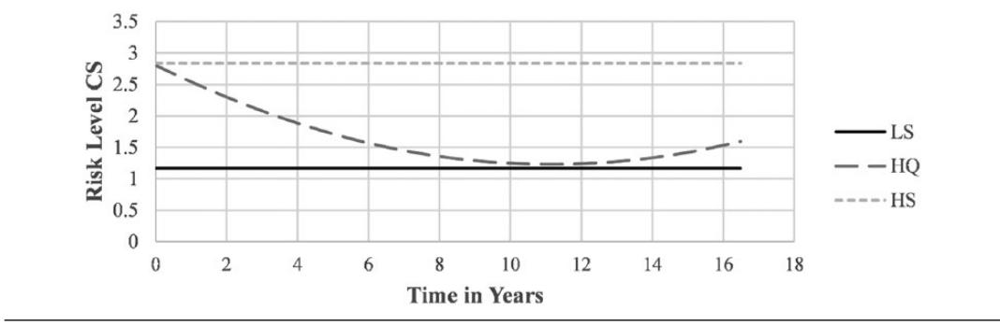

*research-article*2019

# **Trajectories of Self-Control in a Forensic Psychiatric Sample**

# **Stability and Association With Psychopathology, Criminal History, and Recidivism**

Eva Billen Carlo Garofalo Jeroen K. Vermunt Stefan Bogaerts *Tilburg University*

The current study examined trajectories of two indicators of self-control—impulsivity and coping skills—in 317 forensic psychiatric patients, as well as associations with psychopathology, crime, and recidivism. Violent recidivism was positively associated with coping skills at admission to the clinic and with impulsivity at discharge. Only a small correlation was found between self-control and criminal history, and there was no association with psychopathology. We found multiple trajectories of self-control using Latent Class Growth Models: more than 89% improving over time. In addition, patients with Cluster C personality disorders showed greater improvement in coping skills. Patients showing less improvement in impulsivity had greater rates of crime and recidivism. We conclude that self-control can be influenced by interventions or treatment, and that both starting values and trajectories of self-control provide valuable information. Interestingly, the associations between selfcontrol and psychopathology, crime and recidivism were not as strong as reported in other populations.

*Keywords:* impulsivity; coping; forensic psychology; trajectories; mental health; risk factors; self-control

## **Introduction**

Throughout our lives, many situations require us to regulate our thoughts, emotions, and behavior, which is alternatively defined as self-control, self-regulation, effortful control, willpower, or agency in literature (see Duckworth & Kern, 2011). In the present study, we

DOI: [10.1177/0093854819856051](http://doi.org/10.1177/0093854819856051)

**Authors' Note:** *This research did not receive any specific grant from funding agencies in the public, commercial, or not-for-profit sectors. There are no conflicts of interest to declare. Data from this study were previously used to validate the HKT-R risk assessment instrument in the forensic psychiatric population (Bogaerts, Spreen, Ter Horst, and Gerlsma, 2018). Correspondence concerning this article should be addressed to Eva Billen, Department of Developmental Psychology, Tilburg University, P.O. Box 90153, 5000 LE Tilburg, The Netherlands; e-mail: [e.billen@tilburguniversity.edu](mailto:e.billen@tilburguniversity.edu).*

CRIMINAL JUSTICE AND BEHAVIOR, 2019, Vol. 46, No. 9, September 2019, 1255–1275.

https://doi.org/10.1177/0093854819856051 [Article reuse guidelines: sagepub.com/journals-permissions](https://us.sagepub.com/en-us/journals-permissions) © 2019 International Association for Correctional and Forensic Psychology

use the term self-control consistently because it is most commonly used in criminological and forensic research. Specifically, a broad conceptualization was adopted that defines selfcontrol as the process of monitoring, adjusting, and correcting behavior, thoughts, and emotions in the service of long-term goals (see de Ridder, Lensvelt-Mulders, Finkenauer, Stok, & Baumeister, 2012). Previous research found substantial evidence for the association between low levels of self-control and a myriad of undesirable outcomes, including externalizing behavior and several psychiatric disorders (e.g., anxiety, depression, personality disorders; American Psychiatric Association, 2013; Denissen, Thomaes, & Bushman, 2017; Moffitt et al., 2011; Strauman, 2017). Yet, these links have not been examined thoroughly in forensic samples or using longitudinal designs.

Importantly, self-control appears impaired in criminal offenders. In most studies on the possible causes of delinquent behavior, a lack of self-control is emphasized as a major risk factor. Most notably, Gottfredson and Hirschi (1990) advanced low self-control as the main explanation for crime and antisocial behavior. Other theories emphasize self-control as a predictor of criminal behavior in association with other factors such as negative emotionality and early adversities (Agnew, Brezina, Wright, & Cullen, 2002; DeLisi & Vaughn, 2014). Several studies have established a clear association between low self-control and crime (see de Ridder et al., 2012; Pratt & Cullen, 2000; Vazsonyi, Mikuška, & Kelley, 2017). Research has shown negative associations between self-control and serious and persistent criminal career (DeLisi & Vaughn, 2008), as well as higher rates of general and violent recidivism (e.g., Coid, Kallis, Doyle, Shaw, & Ullrich, 2015; Piquero, MacDonald, Dobrin, Daigle, & Cullen, 2005). Moreover, a recent meta-analysis using both community and offender populations reported medium-to-large correlation sizes (*r* = .29-.53) between low self-control and deviance (Vazsonyi et al., 2017).

Despite the negative impact of low self-control on delinquent behavior, the general theory of crime (Gottfredson & Hirschi, 1990) has been criticized from the beginning (e.g., Akers, 1991). One of these criticisms relates to Gottfredson and Hirschi's stability thesis, which states that self-control is relatively stable, and any improvements in self-control can only be attributed to aging. Gottfredson and Hirschi (1990) also assumed that the stability of self-control cannot be influenced by interventions to prevent criminal behavior, which contrasts with theories of rehabilitation and desistance (e.g., the Good Lives Model and the Risk Need Responsivity model; see Andrews & Bonta, 2010; Ward & Maruna, 2007). Contrasting one of the main tenets of Gottfredson and Hirschi's theory, these perspectives seem to acknowledge the possibility of changes in self-control over time also in adulthood, and especially through treatment.

Investigating changes in self-control in adolescents and young adults, some studies have found moderate stability of self-control over periods of up to 2 years (Beaver, Wright, DeLisi, & Vaughn, 2008; Brody & Ge, 2001). Other studies have demonstrated that selfcontrol can be improved by practicing (Beames, Schofield, & Denson, 2017; Muraven, Baumeister, & Tice, 1999), and that changes over time can occur for both adolescents and adults (Burt, Simons, & Simons, 2006; Hay & Forrest, 2006; Mitchell & MacKenzie, 2006; Turner & Piquero, 2002).

Some of these studies have adopted a person-centered approach to study changes in selfcontrol, based on the assumption that self-control may follow different trajectories over time in different groups of individuals and found some indication for change over time (e.g., Hay & Forrest, 2006; Ray, Jones, Loughran, & Jennings, 2013). A study by Barnes et al. (2017) investigated changes in impulse control over 11 waves, spanning 7 years from adolescence into adulthood. They found different levels of (in)stability with up to 49% of respondents changing reliably over time. Barnes et al. (2017) concluded that although there is no absolute relative stability, they cannot determine whether the level of instability is large enough to reject the stability thesis.

Despite research showing uncertainty on the stability of self-control in community samples, to our knowledge, only a few studies have examined changes in self-control among offenders attending different forms of treatment. Such knowledge would be invaluable to improve risk assessment and risk prediction based on changes in levels of self-control. One study found improvement in self-control in 79% of youth (Hay, Widdowson, & Young, 2018), whereas the other found 30% of youth improved in a clinically significant way (Zhou, Gan, Hoo, Chong, & Chu, 2018). These studies also indicated that self-control was related to better adjustment (Hay et al., 2018) and less aggression, and that high change scores predicted a lower rate of reoffending (Zhou et al., 2018).

In adult offenders, one study found no differences between a boot camp intervention that included military style training and a treatment element (addictions treatment, life skills, and basic education), and a control group receiving the treatment element only (Mitchell & MacKenzie, 2006). Surprisingly enough, self-control decreased over time in both conditions. Because this study tested the effects of military training, these results do not rule out that a more evidence-based intense treatment intervention could have a positive effect on self-control. A study in a sample of adult prisoners close to release found less recidivism in a group receiving a mindfulness-based intervention (aimed at increasing emotion regulation and self-control) compared with a treatment as usual group (Malouf, Youman, Stuewig, Witt, & Tangney, 2017). However, there were no significant differences in emotion- or selfcontrol, pre- and postrelease. Given the paucity and limitations of previous studies, further investigation into the effects of intense treatment with adults is necessary. Moreover, it remains unclear whether trajectories of self-control—rather than levels of self-control at a given time-point—can help identify subgroups of offenders characterized in terms of criminal history, psychopathology, and risk for recidivism.

The present study examined the stability of self-control in a heterogeneous group of patients detained and treated in Forensic Psychiatric Centers (FPCs) with the aim to reduce the likelihood of future recidivism. This group stayed in a high-security setting with treatment facilities (e.g., cognitive behavioral therapy, schema therapy) aimed at reducing psychopathological symptoms, improving protective behavior, and learning coping and self-regulatory skills (e.g., Greeven & de Ruiter, 2004; Hornsveld, 2005; van der Veeken, Lucieer, & Bogaerts, 2016). Patients are encouraged, but not obliged, to follow treatment. When specific treatment stages occur (e.g., guided leave), patients undergo a risk assessment, which will be leveraged in this study.

A preliminary aim of this study was to confirm the association of criminal history, psychopathology, and recidivism with self-control in a relatively large sample of male forensic psychiatric patients. We hypothesized that better self-control at time of admission in the clinic would be negatively associated with criminal history and psychopathology. Furthermore, we hypothesized that better self-control at time of release would be negatively associated with recidivism. The main aim of the study was to investigate the trajectories and stability of self-control during treatment using latent class growth models. Based on previous research (Hay & Forrest, 2006; Ray et al., 2013), we expected to identify different self-control trajectories, including both stable and declining trajectories. The individuals in the different trajectories were then compared on demographics, criminal history, and psychopathology, as well as recidivism rates. Due to the absence of prior research in a forensic population, the analyses of the association with possible covariates were largely exploratory. However, we expected that a more severe criminal history, greater levels of psychopathology, and higher recidivism rates would be associated with a relatively lower likelihood to observe declines in self-control over time.

## **Method**

The current study uses data from a nationwide validation study of the Historische Klinische Toekomst–Revised (Historical Clinical Future–Revised; HKT-R; Spreen, Brand, Ter Horst, & Bogaerts, 2014) in the Netherlands. The HKT-R is the most used and compulsory risk assessment scheme in the Netherlands. Information relevant for the current study is reported below, and more details regarding the design, procedure, reliability, and validity of the HKT-R can be found in Bogaerts, Spreen, Ter Horst, and Gerlsma (2018) or on [www.forensischezorg.nl/beleid/risicotaxatie-instrumenten.](www.forensischezorg.nl/beleid/risicotaxatie-instrumenten) Assignment and approval for the investigation was given by the Dutch Ministry of Security and Justice. The study complied with the Helsinki Convention. The investigation was performed on electronic patient files and records in the context of the validation of a revised risk assessment instrument and research into the progression of treatment. Therefore, informed consent was not applicable.

#### **Participants**

Participants were patients discharged from 12 FPCs in the Netherlands between 2004 and 2008. Follow-up data on recidivism were collected 5-years postrelease.1 These patients committed a crime with a minimum sentence of 4 years, for which they were deemed not fully responsible due to mental illness. Thus, they were given a TBS order ("terbeschikkingstelling") under the Dutch Entrustment Act, leading to involuntary commitment to an FPC, in substitution of or after imprisonment. For the purpose of the current study, the subsample of male patients (*n* = 317) was selected, as only a small portion of the original sample consisted of women (*n* = 30). Patient demographic, criminal, and clinical data can be found in Table 1.

#### **Measures**

## **Risk Assessment**

The level of recidivism risk of each patient was assessed using the HKT-R (Spreen et al., 2014), a structured professional risk assessment tool that contains 33 items and consists of three domains: the Historical, the Clinical, and the Future domain. The Historical domain contains 12 items that refer to problems in the patients past (e.g., criminal history, behavioral problems before the age of 12 years, and treatment history) and was assessed at entry to the clinic. The Clinical domain contains 14 items assessing patients' clinical and psychological functioning in the past 12 months (e.g., psychotic symptoms, hostility, and treatment cooperation) and was assessed at several time points (mean time between measurements can be found in the Supplemental Material, available in the online version of this article).

|                                     |     |        | Descriptives for total sample |         |       |         |
|-------------------------------------|-----|--------|-------------------------------|---------|-------|---------|
| Demographic variable                | n   | (%)    | Minimum                       | Maximum | M     | (SD)    |
| Age at entry clinic                 | 317 |        | 17                            | 66      | 31.86 | (8.72)  |
| Dutch nationality                   | 302 | (95.3) |                               |         |       |         |
| HKT-R scores                        | 296 |        | 6.00                          | 94.55   | 38.01 | (16.66) |
| Historical (entry)                  | 317 |        | 3.00                          | 41.00   | 23.27 | (8.92)  |
| Clinical (exit)                     | 316 |        | 0.00                          | 38.18   | 8.63  | (5.14)  |
| Future (exit)                       | 315 |        | 0.00                          | 28.00   | 6.50  | (5.14)  |
| Clinical judgment (exit)            | 317 |        | 1.00                          | 5.00    | 2.21  | (1.21)  |
| Prevalence of Axis I disordera      | 196 | (61.8) |                               |         |       |         |
| Substance-related disorder          | 113 | (35.6) |                               |         |       |         |
| Psychotic disorder                  | 70  | (22.1) |                               |         |       |         |
| Anxiety/mood disorder               | 29  | (9.1)  |                               |         |       |         |
| Sexual disorder                     | 12  | (3.8)  |                               |         |       |         |
| Other Axis I disorder               | 34  | (10.7) |                               |         |       |         |
| Prevalence of personality disordera | 262 | (82.6) |                               |         |       |         |
| Cluster A                           | 11  | (3.5)  |                               |         |       |         |
| Cluster B                           | 84  | (26.5) |                               |         |       |         |
| Cluster C                           | 10  | (3.2)  |                               |         |       |         |
| Not otherwise specified             | 166 | (52.4) |                               |         |       |         |
| Axis I disorder group               | 44  | (13.9) |                               |         |       |         |
| Personality disorder group          | 110 | (34.7) |                               |         |       |         |
| Comorbid group                      | 152 | (47.9) |                               |         |       |         |
| Diagnosis of mental retardation     | 15  | (4.7)  |                               |         |       |         |
| IQb                                 | 303 |        | 52                            | 139     | 98.07 | (15.52) |
| TBS onlyc                           | 63  | (19.9) |                               |         |       |         |
| Age at first conviction             | 312 |        | 5                             | 59      | 20.44 | (7.93)  |
| Number of convictions               | 317 |        | 1                             | 268     | 15.71 | (26.36) |
| Nonviolent                          | 233 | (73.5) | 0                             | 229     | 10.15 | (23.33) |
| Violent                             | 236 | (74.4) | 0                             | 44      | 3.82  | (4.72)  |
| Sex                                 | 73  | (23.0) | 0                             | 38      | 0.82  | (3.12)  |
| Life                                | 204 | (64.4) | 0                             | 9       | 0.91  | (1.05)  |
| Nonrecidivist group                 | 193 | (60.9) |                               |         |       |         |
| General recidivist group            | 54  | (17.0) |                               |         |       |         |
| Violent recidivist group            | 58  | (18.3) |                               |         |       |         |

#### **Table 1: Demographic, Criminal, Clinical, and HKT-R Data**

*Note.* HKT-R = Historical Clinical Future–Revised; IQ = intelligence quotient.

aPrevalence of one or multiple disorders. bMeasured at the clinic with different instruments. cTBS = "terbeschikkingstelling"/ court-ordered treatment only.

The Future domain contains seven items and assesses the patients' readiness for the requested modality in terms of practical issues, agreements made and social networks (e.g., delict prevention, housing, and work) and was assessed at unconditional release. Each item is scored on a scale of 0 (*the item does not represent risk*) to 4 (*the item represents high risk*). In the data used by the current study, the HKT-R was retrospectively scored by graduate forensic psychology students who had received a 2-week training. The scores were based on criminal and clinical records. Intraclass correlation coefficients (ICCs) for the various components were calculated based on 60 randomly selected double-rated cases. ICC values were .80 for the Historical, .85 for the Clinical, and .42 for the Future domain, with the total score having an ICC of .62 (Bogaerts et al., 2018). These values can be considered as moderate (>.40) to very good (>.75; Cicchetti, 1994). The HKT-R also requires the rater to provide a clinical judgment by weighing collected information and categorizing risk as low, low/medium, medium, medium/high, or high. In the current study, these options were coded from 1 (*low risk*) to 5 (*high risk*). The domain scores, total HKT-R score, and final clinical judgment were used as covariates. For the Clinical domain, we used scores at unconditional release.

#### **Self-Control**

Within the Clinical domain,2 two items of the HKT-R—impulsivity and coping skills were used to assess self-control, in line with the definition of self-control described in the introduction. Impulsivity was defined in terms of unpredictable and careless behavior, including a need for immediate gratification. Coping skills were defined as the ability to adequately and independently solve problems that require adjustment. The items were assessed at four different milestones in treatment, entry, unguided leave, probation, and unconditional release. The items were moderately correlated at each time point (*r* = .40- .54), indicating that they share substantial variance, but are also clearly distinguishable. Thus, analyses were conducted for each item separately. In a different sample of 20 male forensic psychiatric patients, the HKT-R coping skills and impulsivity scores were weakly to moderately correlated with several self-report measures of self-control (Supplemental Material).

## **Clinical Information**

Patients' clinical information was derived from their electronic patient files. This included information on diagnoses on both Axis I and Axis II according to the *Diagnostic and Statistical Manual of Mental Disorders* (4th ed., text rev.; *DSM-IV-TR*; American Psychiatric Association, 2000), as made by clinicians (with team consensus) in the FPCs. For the purpose of this study, the diagnoses were grouped into substance-related disorders (e.g., alcohol addiction and dependency on stimulants), psychotic disorders (e.g., schizophrenia and delusional disorder), anxiety/mood disorders (e.g., major depressive disorder and general anxiety disorder), sexual disorders (e.g., sexual sadism and pedophilic disorder), and other Axis I disorders (e.g., attention deficit hyperactivity disorder [ADHD], pathological gambling, and dissociative disorder). Axis II disorders were divided in personality disorders and intellectual disability. Personality disorders were further divided into Cluster A (i.e., paranoid, schizoid, and schizotypal), Cluster B (i.e., antisocial, histrionic, narcissistic, and borderline), and Cluster C (i.e., avoidant, dependent, and obsessive compulsive) personality disorders, and personality disorder not otherwise specified (PD-NOS). Furthermore, patients were grouped based on their diagnosis, having only a diagnosis on Axis I, only a personality disorder, or both (comorbid group). A group with only a diagnosis of intellectual disability was not included in this grouping due to its small size (*n* = 11). Intelligence quotients were reported for most patients (*n* = 303). The tools used may differ among patients, as institutes tend to use different measures, and different measures may be more appropriate for certain patients (i.e., a person with reading difficulties should not take a reading-based test). The precise tools used to measure IQ for each participant are unknown to the researchers, given that only the total IQ score was provided, and it was obtained with instruments validated in the Dutch population. For information on the prevalence of disorders, group size, and mean IQ, see Table 1.

## **Criminal Information**

Information on patients' criminal history was derived from their electronic patient files, as provided by the Dutch Ministry of Security and Justice. A summary of the data can be found in Table 1. For the purpose of the current study, criminal offenses were grouped into four categories: nonviolent crimes (e.g., property crime, destruction, and drug offenses), violent crimes (e.g., assault, property crime with violence), sex crimes (e.g., rape, sexual assault), and life crimes (e.g., manslaughter, [attempted] murder). The number of crimes an offender was convicted for was used as a continuous variable. The total number of crimes was used as Gottfredson and Hirschi (1990) stated that an individual low in self-control would be more inclined to commit more crimes of any type.

#### **Recidivism**

Patients' reconviction data were retrieved from the Dutch Ministry of Security and Justice 5 years after leaving treatment. Recidivism information was known for most participants (*n* = 305), participants were divided into a group of nonrecidivists, general recidivists (i.e., any reconviction except violent reconviction), and violent recidivists (i.e., reconviction for violent, sex, and life offenses).

#### **Statistical Analyses**

#### **Missing Data**

To preserve power, missing data on HKT-R items were substituted by the participant's mean (mean imputation) to obtain the domain and total scores used for analyses. Mean imputation was allowed for individuals with up to four missing items in the Historical (33.3% of the item number for this scale) and Clinical domain (28.6%), and up to two missing items in the Future domain (28.6%). The analyses were run with and without the substituted scores to check for discrepancies and results were unchanged.3 The mean substitution was only used to calculate the total and domain scores, not on item level for self-control. Missing data per time point ranged from 9.8% to 46.7% (Supplemental Material) and were not problematic due to variation in treatment time, which was taken into account in the analyses.

#### **Analysis of Variance and Correlations**

Between-group differences at time of admission and release from the 12 FPCs were examined using one-way analyses of variance (ANOVAs) and post hoc Bonferroni tests for categorical variables to test the hypotheses on the general association between self-control and psychopathology, crime, and recidivism. The analyses were done for psychopathology (Axis I, personality disorder, comorbid group) at entry and for recidivism (nonrecidivist, general recidivist, and violent recidivist group) at entry and unconditional release. In case the assumption of normality was violated, a nonparametric independent samples Kruskal–Wallis test was used with post hoc Mann–Whitney tests with a Bonferroni correction to compare the different groups. Effect sizes for the Mann–Whitney test were estimated based on *r*2 = *z*2/*N* (Fritz, Morris, & Richler, 2012). The total number of crimes committed was measured continuously, therefore correlation analyses were conducted with both impulsivity and coping skills at time of entry (Pearson's *r* or Spearman's rho for variables normally or nonnormally distributed, respectively).

## **Latent Class Growth Models**

Trajectories of self-control over treatment time were tested using latent growth curve modeling with Latent Gold 5.1 software (Vermunt & Magidson, 2005). Rather than determining groups and then looking at their trajectories, in latent class growth models, the number of groups is statistically determined by grouping people with similar trajectories together. Different models with a different number and different types of trajectories (e.g., flat or quadratic trajectories) can then be compared based on how well each model fits the observed data. Following recommendations in the literature (Curran, Obeidat, & Losardo, 2010), the current sample size and the number of observations for the analyses for impulsivity (*n* = 960) and coping skills (*n* = 987) is more than sufficient for this type of analysis. The trajectories were made using the regression option of Latent Gold, with item scores as the dependent variable and treatment time in years and quadratic time in years as the predictor variables. Time in years differed for each participant at each measurement point, depending on when they received the requested modalities, these time differences can be easily accounted for by Latent Gold. Model selection was done based on the Bayesian information criterion (BIC) and the Akaike information criterion (AIC). Generally low BIC and AIC indicate a better model fit, with the BIC being slightly stricter on parsimony of the model and therefore preferring a lower number of classes than the AIC. There is no clear consensus on which information criterion is preferred or how to best interpret the model fit (see Vrieze, 2012). In the current study, BIC was used as the first indicator of model fit. Only when there were still big drops in AIC (i.e., more than 10 points) after the BIC had reached its lowest point, more complex models were considered. In case of doubt, the size and distinctiveness of the additional classes in the model were taken into consideration. Classification error and entropy (level of uncertainty) were checked after class selection.

Latent class growth models for both self-control indicators were estimated with the outcome variable treated as ordinal and with class-specific intercepts and time slopes. Models with linear and quadratic time dependence were run next to each other to check which described the data best. After the initial linear model, quadratic terms were added separately for each class, and the model with the best fit was selected. Subsequently, the linear slopes for classes with a seemingly flat trajectory were set to zero, and the model with the best fit was again selected. Estimated means for each class were plotted over time, visualizing the growth curves for each group.

## **Covariates of Growth Curves**

To investigate differences between individuals in different trajectories, the association between class membership and other variables (e.g., psychopathology, criminal history) was examined using a Step 3 analysis in Latent Gold 5.1 software (Vermunt & Magidson, 2005). The advantage of this approach compared with using the modal class assignments in standard analysis (e.g., ANOVA) is that it takes into account the uncertainty of a person's class membership (i.e., classification error). The "dependent" option was used together with a Bolck, Croon, Hagenaars (BCH) type of adjustment proposed by Bolck, Croon, and Hagenaars (2004), which is recommended when comparing means across classes (Vermunt & Magidson, 2013). We also explored the overlap between the latent classifications obtained for the different trajectories. For this purpose, we used the maximum likelihood adjustment implemented in Latent Gold.

## **Results**

#### **ANOVA**

## **Psychopathology**

A one-way ANOVA was conducted to examine the effect of psychopathology (i.e., Axis I disorder, personality disorder, comorbid disorders) on impulsivity and coping skills scores at time of entry in the clinic. Descriptive analyses can be found in Table 2. There were no significant group differences on impulsivity, *F*(2, 244) = 1.35, *p* = .261, *R*2 < .01, or coping skills, *F*(2, 241) = 3.01, *p* = .051, *R*2 = .02. Thus, participants with Axis I, personality or comorbid disorders did not differ in terms of self-control when they were admitted to the clinic.

## **Criminal History**

As the total number of offenses variable was skewed and kurtotic, Spearman's rho was used to assess the association between the total number of crimes and both impulsivity and coping skills. The Spearman's correlation between impulsivity and the total number of crimes was very small and nonsignificant (ρ < .01, *p* = .92). The correlation between coping skills and the total number of crimes was significant but small (ρ = .15, *p* = .02), with more past crimes being related to a higher risk score.

#### **Recidivism**

Assumptions for within-group normality and homogeneity of variance were violated for coping skills at entry and for impulsivity at release, but not for coping skills at release or impulsivity at entry (descriptive analyses can be found in Table 2). A Kruskal–Wallis test for coping skills at entry showed significant differences between groups (*p* = .020), with post hoc Mann–Whitney tests showing a significant difference between the nonrecidivist and violent recidivist group (*p* = .011, *R*2 = .03), but not between nonrecidivists and general recidivists (*p* = .119, *R*2 = .01) or between general and violent recidivists (*p* = .23, *R*2 = .02). A one-way ANOVA for coping skills scores at time of release and recidivism group showed no significant differences between the three recidivism groups (non-, general, and violent recidivists), *F*(2, 271) = 0.38, *p* = .684, *R*2 < .01. The ANOVA for impulsivity at time of entry showed no significant differences between recidivism groups, *F*(2, 239) = 0.16, *p* = .852, *R*2 < .01. There were significant differences between groups (*p* = .001) on the Kruskal–Wallis test done for impulsivity at time of release. Mann–Whitney tests showed differences between the nonrecidivist group and both the general recidivist (*p* = .004, *R*2 = .03) and violent recidivist group (*p* = .002, *R*2 = .04), with a lower mean

|                      |     | Impulsivity | Coping skills |             |  |
|----------------------|-----|-------------|---------------|-------------|--|
| Groups               | N   | M (SD)      | N             | M (SD)      |  |
| Psychopathology      |     |             |               |             |  |
| Axis I disorder      | 37  | 2.62 (1.09) | 37            | 1.61 (1.36) |  |
| Personality disorder | 86  | 2.62 (0.95) | 86            | 2.00 (1.40) |  |
| Comorbid disorder    | 124 | 2.40 (1.06) | 124           | 2.22 (1.27) |  |
| Recidivism entry     |     |             |               |             |  |
| Nonrecidivist        | 151 | 2.50 (1.05) | 153           | 1.90 (1.35) |  |
| General recidivist   | 43  | 2.44 (0.98) | 39            | 2.28 (1.00) |  |
| Violent recidivist   | 48  | 2.56 (0.97) | 48            | 2.44 (1.43) |  |
| Recidivism exit      |     |             |               |             |  |
| Nonrecidivist        | 166 | 0.79 (1.03) | 175           | 1.23 (1.03) |  |
| General recidivist   | 48  | 1.19 (0.98) | 49            | 1.37 (0.97) |  |
| Violent recidivist   | 52  | 1.35 (1.24) | 50            | 1.32 (1.10) |  |

**Table 2: Descriptives for Items by Clinical and Recidivism Group**

rank for the nonrecidivist group in each case. No significant differences were found between general and violent recidivists (*p* = .678, *R*2 < .01).

#### **Latent Class Growth Models**

Information on model fit, classification errors, explained variance, and entropy for a small selection of tested models can be found in Table 3. Information on additional models is available from the authors on request. Information on differences between classes in intercepts and predictors for all selected models can be found in Table 4. There was only one measurement taken after 17 years, and precisely at 19.67 years. This data point was omitted from the analysis as it seemed to have a disproportionate effect on the estimates.

## **Impulsivity**

A three-class model was selected for impulsivity (Figure 1). Both models with and without quadratic predictors were compared. Based on model fit, a model with a quadratic time dependence for the first class was selected. This class showed a steep decrease in the beginning of treatment and a small increase after 12 years of treatment. As there were relatively few observations after 12 years, scores of the individuals with observations after this time and with a high likelihood of belonging in the first class (i.e., >.80) were inspected to see whether they could clarify the upward trajectories. Eight observations, belonging to six individuals matched these criteria. Of these six, two individuals showed an increase in score after 12 years. Even though the increase at the end of the measurements may have been influenced by a few observations (i.e., two observations in a class containing 40.7% of cases), it is likely that the quadratic slope also fits the initial decline in scores better than the linear slope. The model with the quadratic term for the first class was retained, but interpretations on the upward movement at the end of the trajectory should be made with caution due to the low number of observations. Paired comparisons for the intercepts and slopes showed a significant difference between all intercepts and slopes, Wald statistics can be found in Table 4. The first class showed a quick drop from intermediate to no risk for

| Model            | BIC (LL) | AIC (LL) | Classification error |     | Entropy R2 |  |
|------------------|----------|----------|----------------------|-----|------------|--|
| Impulsivity      |          |          |                      |     |            |  |
| 2 class          | 2,654.80 | 2,613.49 | 0.07                 | .54 | .76        |  |
| 3 class          | 2,630.67 | 2,566.82 | 0.14                 | .62 | .69        |  |
| 4 class          | 2,649.25 | 2,562.86 | 0.17                 | .63 | .67        |  |
| Quad 3 class     | 2,616.95 | 2,549.35 | 0.13                 | .63 | .71        |  |
| Coping skills    |          |          |                      |     |            |  |
| Quad 3 class     | 2,825.39 | 2,757.84 | 0.16                 | .49 | .61        |  |
| Set quad 3 class | 2,821.65 | 2,761.61 | 0.16                 | .49 | .60        |  |
| Set quad 4 class | 2,826.92 | 2,740.61 | 0.25                 | .55 | .55        |  |

#### **Table 3: Model Comparison**

*Note.* Models in bold were selected for further analysis. Only a selection of models is reported. BIC = Bayesian information criterion; AIC = Akaike information criterion; LL = log-likelihood.

|               |         | Intercept     | Slope         | Quadratic     |  |
|---------------|---------|---------------|---------------|---------------|--|
| Item          | Classes | Wald (df = 4) | Wald (df = 1) | Wald (df = 1) |  |
| Impulsivity   | IFQ-HD  | 34.22**       | 41.11**       | 38.67**       |  |
|               | IFQ-ID  | 30.93**       | 17.37**       | 38.67**       |  |
|               | HD-ID   | 44.94**       | 7.20**        | 0.00          |  |
| Coping skills | HQ-LS   | 100.57**      | 42.04**       | 20.12**       |  |
|               | HQ-HS   | 35.56**       | 42.04**       | 20.12**       |  |
|               | LS-HS   | 62.12**       | 0.00          | 0.00          |  |

#### **Table 4: Paired Comparisons**

*Note.* IFQ = Intermediate Fast Quadratic; HD = High Decreasing; ID = Intermediate Decreasing; HQ = High Quadratic; LS = Low Stable; HS = High Stable. \*\**p* < .01 level.

impulsivity, followed by a small increase after 12 years, and was labeled Intermediate Fast Quadratic (IFQ) class. The second class defined a group that started at a higher level than the other two groups and, showed a moderate decline, was labeled High Decreasing (HD) class, and had a class size of 33.3%. The third class was called the Intermediate Decreasing (ID) class, starting at a similar level as the IFQ class, 26.1% of observations were classified in the ID class. The ID class had a statistically significantly steeper slope than the HD class.

## **Coping Skills**

A three-class model with a quadratic slope for the second class and slopes set to zero for the first and third classes was selected; the trajectories are depicted in Figure 2. Similar to what was done with the impulsivity variable, influential cases for the quadratic slope at the end of the time spectrum were examined more closely. Nine cases (in a class which constituted 48.8% of cases) were found with observations after 12 years, one of which showed a pattern of increase after 12 years, whereas all other cases had a decline or stability. Even though this single observation may have unduly influenced the increase of scores at the end, the model with the quadratic term was retained because there was a better general fit for the model as a whole. Interpretations of the rise in scores for the second class should be made with caution due to the small number of observations. Wald statistics for the differences

**Figure 1: Three Class Model for Impulsivity** *Note.* IFQ = Intermediate Fast Quadratic; HD = High Decreasing; ID = Intermediate Decreasing.

#### **Figure 2: Three Class Model for Coping Skills**

*Note.* LS = Low Stable class (slope set to zero); HQ = High Quadratic class; HS = High Stable class (slope set to zero).

between intercepts and slopes can be found in Table 4. The first class had a steeper slope than both other classes and a quadratic predictor. The first class was named the High Quadratic (HQ) class. The second class contained 40.7% of observations and had a lower intercept than the other two classes; it was called the Low Stable (LS) class. The third class was named the High Stable (HS) class and contained 10.5% of observations. The HS class started with a similar mean intercept as the HQ class.

#### **Covariate Analysis**

The Step 3 analysis was done on slightly different sample sizes in each analysis, with the amount of data available for each variable. Results and sample sizes for variables with significant differences between classes were reported in Tables 5 and 6. Results that did not have both overall differences and significant paired comparisons were not reported in the tables but can be obtained from the authors. Nonsignificant results that were relevant to answer research questions are reported in the text. Additional information is available from the authors on request.

|                         |     | IFQ           | HD                            | ID             |     |  |  |  |
|-------------------------|-----|---------------|-------------------------------|----------------|-----|--|--|--|
| Class size              |     | .41           | .33                           | .26            |     |  |  |  |
| Continuous covariates   | n   |               | M (SE)                        |                | R2  |  |  |  |
| Treatment length        | 316 | 6.66a (0.27)  | 8.36 (0.34)                   | 6.94a (0.44)   | .06 |  |  |  |
| Historical domain       | 316 | 20.50a (0.84) | 27.02 (0.88)                  | 22.79a (1.15)  | .10 |  |  |  |
| Clinical domain         | 297 | 4.67a (0.42)  | 16.46 (1.10)                  | 6.06a (0.73)   | .50 |  |  |  |
| Future domain           | 302 | 4.66a (0.36)  | 9.82 (0.69)                   | 4.60a (0.57)   | .24 |  |  |  |
| Total HKT-R score       | 287 | 29.61 (1.18)  | 53.66 (2.31)                  | 33.42 (1.77)   | .40 |  |  |  |
| Final clinical judgment | 316 | 1.68 (0.08)   | 3.20 (0.14)                   | 1.76 (0.14)    | .34 |  |  |  |
| Age at first crime      | 311 | 22.09 (0.85)  | 18.18a (0.72)                 | 20.58a (0.91)  | .05 |  |  |  |
| Number of crimes        | 316 | 11.12a (1.44) | 22.02b (4.23)                 | 14.30ab (2.69) | .03 |  |  |  |
| Categorical covariates  | n   |               | Within class proportions (SE) |                |     |  |  |  |
| Cluster A personality   | 316 | a             |                               | a              | .03 |  |  |  |
| No diagnosis            |     | 0.92 (0.03)   | 1.00                          | 0.98 (0.02)    |     |  |  |  |
| Diagnosis               |     | 0.08          | 0.00                          | 0.02           |     |  |  |  |
| Violent crime           | 316 | a             |                               | a              | .03 |  |  |  |
| No                      |     | 0.31 (0.04)   | 0.14 (0.04)                   | 0.32 (0.06)    |     |  |  |  |
| Yes                     |     | 0.69 (0.04)   | 0.86 (0.04)                   | 0.68 (0.06)    |     |  |  |  |
| Recidivism              | 304 | a             | b                             | ab             | .03 |  |  |  |
| No recidivism           |     | 0.74 (0.04)   | 0.55 (0.06)                   | 0.56 (0.07)    |     |  |  |  |
| General recidivism      |     | 0.12 (0.03)   | 0.19 (0.04)                   | 0.25 (0.06)    |     |  |  |  |
| Violent recidivism      |     | 0.14 (0.03)   | 0.26 (0.05)                   | 0.18 (0.05)    |     |  |  |  |
| Classes CS              | 315 |               |                               |                |     |  |  |  |
| LS                      |     | 0.85 (0.04)   | 0.01 (0.03)                   | 0.26 (0.06)    |     |  |  |  |
| HQ                      |     | 0.11 (0.04)   | 0.72 (0.05)                   | 0.74 (0.06)    |     |  |  |  |
| HS                      |     | 0.04 (0.02)   | 0.28 (0.04)                   | 0.00           |     |  |  |  |

**Table 5: Impulsivity Class Size and Significant Covariates**

*Note.* Classes with the same letter had no significant differences between them, classes with different letters differed significantly from each other and classes with no letter differed significantly from all other classes at the *p* < .05 level. IFQ = Intermediate Fast Quadratic; HD = High Decreasing; ID = Intermediate Decreasing; HKT-R = Historical Clinical Future–Revised; LS = Low Stable; HQ = High Quadratic; HS = High Stable.

#### **Class Membership Comparison**

To assess the amount of overlap between the classes obtained with the different outcome variables, we investigated their association using the class assignment probabilities and taking into account classification errors. The coping skills analysis (Table 6) showed that all classes differed significantly, with those in the Coping Skills-LS class being most likely to be in the Impulsivity-IFQ class and never in the Impulsivity-HD class. Those in the Coping Skills-HQ class were most likely to be either in the Impulsivity-HD class or Impulsivity-ID class. Finally, those in the Coping Skills-HS class were most likely to be in the Impulsivity-HD class, but highly unlikely to be in the Impulsivity-ID class. Conversely, results for all impulsivity analyses (Table 5) were significant, with those in the Impulsivity-IFQ class being more likely to be in the Coping Skills-LS class. The Impulsivity-HD class was the only class that also had a reasonable chance of membership to the Coping Skills-HS class, and the Impulsivity-ID class had most overlap with the Coping Skills-HQ class. These results indicate that classes of coping and impulsivity with better prognoses (i.e., low stable and fast decreasing classes) tended to go together and similarly worse trajectories (i.e., high stable or high decreasing classes) tended to overlap considerably.

|                         |     | LS .41   |                               | HQ          |             | HS     |        |     |
|-------------------------|-----|-------------|-------------------------------|-------------|-------------|--------|--------|-----|
| Class size              |     |             |                               |             | .48         |        | .11    |     |
| Continuous covariates   | n   | M (SE)      |                               |             |             |        | R2     |     |
| Treatment length        | 315 | 6.57        | (0.30)                        | 7.59a       | (0.29)      | 8.58a  | (0.79) | .04 |
| Historical domain       | 315 | 20.08       | (0.92)                        | 25.45a      | (0.79)      | 25.95a | (2.19) | .09 |
| Clinical domain         | 296 | 4.39        | (0.52)                        | 10.22       | (0.71)      | 21.51  | (2.49) | .44 |
| Future domain           | 301 | 3.86        | (0.38)                        | 7.23        | (0.50)      | 13.00  | (1.43) | .29 |
| Total HKT-R score       | 286 | 28.14       | (1.31)                        | 42.84       | (1.63)      | 61.75  | (6.36) | .37 |
| Final clinical judgment | 315 | 1.59        | (0.10)                        | 2.48        | (0.12)      | 3.47   | (0.29) | .24 |
| Categorical covariates  | n   |             | Within class proportions (SE) |             |             |        |        | R2  |
| Cluster C personality   | 315 |             | a                             | a           |             |        |        | .01 |
| No diagnosis            |     | 0.95 (0.02) |                               | 0.97 (0.02) |             | 1.00   |        |     |
| Diagnosis               |     | 0.05 (0.02) |                               | 0.03 (0.02) |             | 0.00   |        |     |
| Mental retardation      | 315 | a           |                               | a           |             |        |        | .01 |
| No diagnosis            |     | 0.96 (0.02) |                               | 0.93 (0.02) |             | 1.00   |        |     |
| Diagnosis               |     | 0.04 (0.02) |                               | 0.07 (0.02) |             | 0.00   |        |     |
| Classes IM              | 316 |             |                               |             |             |        |        |     |
| IFQ                     |     | 0.83 (0.05) |                               | 0.09 (0.04) |             | 0.16   | (0.09) |     |
| HD                      |     |             | 0.00 (0.03)                   | 0.50 (0.05) |             | 0.83   | (0.09) |     |
| ID                      |     |             | 0.16 (0.04)                   |             | 0.41 (0.04) | 0.01   |        |     |

**Table 6: Coping Skills Class Size and Significant Covariates**

*Note.* Classes with the same letter had no significant differences between them, classes with different letters differed significantly from each other and classes with no letter differed significantly from all other classes at the *p* < .05 level. LS = Low Stable; HQ = High Quadratic; HS = High Stable; HKT-R = Historical Clinical Future– Revised; IFQ = Intermediate Fast Quadratic; HD = High Decreasing; ID = Intermediate Decreasing.

#### **Impulsivity Trajectories**

The means of covariates with a significant difference between classes can be found in Table 5. There were significant differences between classes in terms of treatment length, with the HD class having significantly longer treatment than the intermediate classes. Those with higher levels of impulsivity at the start of treatment therefore required longer treatment. Patient's age at first measurement was not related to class membership (*p* = .08).

*HKT-R covariates*. With regard to the HKT-R, all domains4 as well as the total score and final structured clinical judgment differed between groups. In all cases, the HD group had significantly higher scores than both the IFQ and ID groups. Furthermore, for the total HKT-R score and the final structured clinical judgment, the ID class had significantly higher scores than the IFQ class. This indicates that those that start out with a higher level of impulsivity also have a higher general risk, and that a faster decrease of impulsivity might lead to less general risk.

*Psychopathology covariates*. In terms of psychopathology, there were no significant differences between classes in terms of the prevalence of Axis I, personality or comorbid disorders (*p* = .24). There were only significant differences for Cluster A personality disorders, with the HD class not having any cases with a Cluster A personality diagnosis, though there was generally a low prevalence and a small effect size. Even though the effect is only small, these results might indicate that those with Cluster A personality disorders generally had lower levels of impulsivity at the start of treatment than those without this type of personality disorder.

*Criminal covariates*. There were significant differences between classes with regard to the total number of convictions, with those in the IFQ class having significantly fewer convictions than those in the HD class. With regard to prevalence of a violent crime conviction, those in the HD class were significantly more likely to have committed a violent crime than those in the IFQ and ID classes. There was also a significant difference on age at first crime, with those in the HD and ID classes committing their first crime at a significantly younger age than those in the IFQ class. Furthermore, those in the IFQ class were significantly less likely to recidivate compared with those in the HD class. These results indicate that those in the IFQ class—that is, starting with intermediate levels of impulsivity and decreasing fast—are more likely to have a less extensive criminal history as well as a lower recidivism risk, especially when compared with the HD group.

## **Coping Skills Trajectories**

Results for the class size and covariates of coping skills are reported in Table 6. There was a significant difference between classes in treatment length, with those in the LS class being in treatment for a shorter time than those in the HQ and HS classes. This shows that a low initial level of coping skills can positively influence treatment time. There was no relation between age at the start of the measurement and class membership (*p* = .58).

*HKT-R covariates*. There were significant differences in all HKT-R domains (see Note 4) as well as the total score and final structured clinical judgment. With regard to the Historical domain, there was a small effect with the LS class having a significantly lower score than the HQ and HS classes. In the Clinical and Future domains, as well as the total score and final structured clinical judgment, there were significant differences between all classes, with the LS class having the lowest and the HS class having the highest score. This indicates that generally those in the LS class showed the least risk, whereas those in the HS class had the highest risk.

*Psychopathology covariates*. There was no significant difference in the proportion of individuals with only Axis I, only personality, or comorbid disorders (*p* = .13). There were significant differences for the prevalence of Cluster C personality disorder, as there were no cases with this diagnosis in the HS class. General prevalence of Cluster C personality disorders was low and the effect was small. There was also a significant difference between the HS class and both other classes in terms of the prevalence of intellectual disability. There were no patients diagnosed with intellectual disability in the HS class, the general prevalence was low and the effect was small.

*Criminal covariates*. There were no statistically significant differences between classes in terms of criminal history or recidivism. Improvement in coping skills therefore did not seem to be dependent on criminal factors and did not lead to differences in recidivism.

## **Discussion**

The present study was designed to investigate trajectories of self-control in forensic psychiatric inpatients and their associations with psychopathology, criminal history, and recidivism. Prior to the main aim of this study, the association between two items measuring self-control (i.e., impulsivity and coping skills) and psychopathology, criminal history, and recidivism as found in research in criminal and general populations was investigated. In contrast to prior studies in general and prison populations (e.g., Brody & Ge, 2001; Tangney, Baumeister, & Boone, 2004; Vazsonyi et al., 2017) and with our expectations, we found no evidence that psychopathology was related to initial levels of self-control in the current study, and criminal history was only weakly associated with coping skills. The inconsistency with previous studies may be due to the homogeneity of the sample, that is, all participants had at least one diagnosis and had committed at least one crime with a 4-year minimum sentence. On one hand, it is plausible that in a sample characterized by fairly severe levels of psychopathology and criminal histories, self-control is not related to relative degrees of severity. On the other hand, dimensional measurements of psychopathology (such as those included in the most recent version of the *Diagnostic and Statistical Manual of Mental Disorders* [5th ed.; *DSM-5*; American Psychiatric Association, 2013]) are perhaps more suitable to capture relations with self-control, compared with the categorical approach to psychopathology adopted in the present study and often used in forensic clinical practice.

With regard to recidivism, the hypothesis that lower self-control would be positively associated with recidivism was partially supported. Coping skills were better for nonrecidivists than for violent recidivists at admission time in the FPCs but not at release. This is contrary to what would be expected given that this is an item of a risk assessment instrument and an improvement in scores should lead to less recidivism. More in line with the expectations, nonrecidivists showed less impulsivity at release from the FPCs than general or violent recidivists, whereas there was no difference at time of entry. This result indicates that impulsivity during discharge is an important risk factor for future recidivism. Nonetheless, sufficient coping skills at time of entry may be necessary to facilitate treatment and the reduction of actual risk.

With regard to the main aim of the study, namely, examining the stability of selfcontrol over time in a group of forensic psychiatric patients, we identified distinct trajectories for both impulsivity and coping skills. Notably, similar trajectories across the two items were related to each other, such that patients on a specific trajectory for impulsivity were more likely to be on a similar trajectory for coping skills. For the majority of individuals, the trajectories showed decreases in risk over time, or a low stable pattern, with only a minority belonging to a high (stable) group. These findings are more consistent with previous studies of the effects of intervention in delinquent youth, which reported larger percentages of individuals showing improvements in self-control (Hay et al., 2018; Zhou et al., 2018), but not consistent with studies on changes with treatment in adult populations (Malouf et al., 2017; Mitchell & MacKenzie, 2006). The use of clinical rather than self-reported self-control may explain some differences with other studies. However, because one study in an adolescent sample did find differences using a self-report measure (Hay et al., 2018), it seems the discrepancy is more likely due to the type of treatment rather than the assessment method.

The trajectories highlighted differences in the rate of improvement for different patients. Yet, these trajectories did not cross each other, indicating that there may be limitations to the amount of change an individual can achieve. These results do not necessarily contradict Gottfredson and Hirschi's (1990) stability thesis, as they claimed that self-control can improve but the relative rank-order would remain stable (i.e., one individual cannot surpass another). Nevertheless, the present results show that there is more variation possible than the General Theory of Crime implies (i.e., trajectories did differ not only in intercept but also in slope). The current study indicates that there is individual variability in the development of self-control during a patient's stay in the clinic and therefore challenges the strength of the stability thesis, in line with other previous studies (e.g., Burt et al., 2006; Hay & Forrest, 2006; Muraven et al., 1999).

In general, the trajectories of self-control were significantly related to domain and total risk scores of the HKT-R, as well as to the final structured clinical judgment, with more positive trajectories having relatively lower risk scores at release than high and high stable classes. Furthermore, those who showed more improvement in self-control over time generally stayed in treatment for a shorter period of time than those in high and high stable classes. This indicates that those with better self-control trajectories made more progress and could be integrated more quickly into society. These results support the importance of self-control as a protective factor for a rehabilitation approach. Although a general population study found that more stable patterns were associated with better adjustment (Ray et al., 2013), it stands to reason that within a high-risk group this is not the case. Notably, improvement in self-control was not related to age, contrasting Gottfredson and Hirschi's (1990) assumption that changes merely reflect maturation due to aging.

Differences in psychopathology between patients on different trajectories varied, but generally there were relatively few significant effects, with relatively small effect sizes. The effect of intellectual disability was contrary to what we would expect for coping skills, with no cases of intellectual disability in the high stable class. This effect was small and might be explained by those with intellectual disability being more likely to comply with treatment. Another small but notable result is that Cluster C personality disorders were absent in the high stable group of coping skills. These results suggest that patients with these "high control" personality disorders have a better chance of improving their self-control, relative to other personality disorders. This may be in part due to these personality types being harm avoidant and wanting to alleviate their own symptoms making them more amenable to treatment (Stone, 2006). Similarly, there were no patients diagnosed with a Cluster A personality disorder in the impulsivity high decreasing class. This is a surprising result, as generally Cluster A personality disorders are thought to be rather difficult to treat (Stone, 2006) and may be in part due to the comorbidity with other disorders or the use of medication. Cluster A and C personality disorders may also have some "protective" effects to the extent that these patients are less likely to have a Cluster B or NOS personality disorder, which are typically more resistant to treatment. In general, the results for personality disorder were hard to interpret due to the small prevalence of these disorders.

Criminal history and recidivism were less clearly related to levels and trajectories of selfcontrol than expected. The results for impulsivity did indicate that those with a higher starting point and slow decrease tended to be younger when committing their first crime, tended to have committed more crimes and to be more likely to have committed at least one violent crime than those on the fast track. Furthermore, those that had a fast reduction in impulsivity were less likely to have committed a violent crime, and less likely to have recidivated than their slow decreasing counterparts. These results indicate that criminal history relates not only to impulsivity at a specific time point but also to the prognosis of the patient in terms of improvement. Furthermore, it seems that improvement in self-control, and impulsivity in particular, is an important indicator of recidivism.

The current study had some limitations, starting with the measurement and operationalization of self-control. Even though studies on self-control have used a wide variation of instruments and indicators to measure self-control, the use of two items coming from a risk assessment instrument as a measurement of self-control does not capture the full extent of the self-control construct. However, some correlations were found between the items and more established, self-report measurements of self-control in a similar sample, showing some evidence for the validity of this measure. A second limitation is the lack of a control group. By including a control group of offenders confined in facilities without treatment options such as most prisons, future studies could investigate the effects of treatment separately from the effects of confinement. Furthermore, clinical diagnoses in the current study where made based on team consensus but no information was available on interrater reliability. This study also contained no information of treatment adherence; therefore, the effects found may be due to either treatment or the treatment environment. A further limitation is that crime severity and the level of planning were not accounted for when looking at the total number of crimes. This was not possible in this study due to a lack of detailed information on the offenses, but might be interesting in relation to self-control. Finally, the current sample did not contain any women, and conclusions are therefore limited to men.

The present study also has important clinical implications. Overall, improvement in selfcontrol seems likely for a large portion of the patients, and treatment seems to have a positive effect on self-control skills. Even so, patients who struggle to improve their impulsivity likely need more time in treatment to sufficiently reduce their risk of recidivating. Furthermore, coping skills seem to be a more stable aspect of self-control compared with impulsivity, although at least a subgroup of patients with poor coping skills are likely to improve during treatment. Another important implication for risk assessment and clinical practice is that our findings join accumulating evidence that examining levels of self-control (here, impulsivity and coping skills) may only provide a partial view of the patient, and rather, a focus on both levels and trajectories may prove more informative for treatment planning and risk prediction.

Although no definitive conclusions can be drawn from the current study, our findings add to the diverse set of research showing the relative malleability of self-control over time. The existence of different growth curves for self-control elements in forensic psychiatric patients shows that self-control is not static and could, for the majority of patients, be improved during treatment. Furthermore, it seems that self-control is to some extent related with psychopathology, criminal history, and recidivism, and in particular that trajectories of impulsivity may be the most closely related to violent crime and recidivism. Nevertheless, these associations were not as strong as expected based on previous research in criminal and general populations. This may be in part due to the fact that the current population was more homogeneous in terms of criminal history and psychopathology. Alternatively, it may be that it is not the type of psychopathology, but rather the severity of psychopathology that is more strongly related to self-control. In conclusion, the current study challenges the idea of stability of self-control and lays the basis for future research to examine the trajectories—and not only levels—of self-control and their associations with psychopathology, especially intellectual disability and personality disorders, and with recidivism as a potential result for those with little improvement.

## **Notes**

1. These are the most recent data available from a national representative sample at the time of writing.

2. The total Clinical domain score includes the scores on each item used to measure self-control in the present study. It was considered to remove each item from the scale for the purpose of its own analysis, but this was not done, as the correlations between the domain scores with and without each item were very high (*r* ≥ .99). Making separate domain scores for each analysis therefore seemed unnecessary and would have resulted in the use of different residualized scores on the Clinical domain (i.e., after removing each self-control item) across the different analyses (i.e., when examining relations between a given self-control item and the Clinical domain score without that same self-control item).

3. The mean scores of patients in each group remained roughly the same based on nonstatistical comparison (e.g., *M* = 20.50, *SD* = 0.84 and *M* = 19.66, *SD* = 1.06), more information is available from the authors on request.

4. As mentioned in the "Method" section, the Clinical domain included the Impulsivity item, as the correlation between the score with and without the item was very high (*r* = .994).

## **Supplemental Material**

Supplemental Material is available in the online version of this article at [http://journals.sagepub.com/home/cjb.](http://journals.sagepub.com/home/cjb.
)

## **ORCID iDs**

Eva Billen <https://orcid.org/0000-0003-1992-7634>

Carlo Garofalo <https://orcid.org/0000-0003-2306-6961>

## **References**

- Agnew, R., Brezina, T., Wright, J. P., & Cullen, F. T. (2002). Strain, personality traits, and delinquency: Extending general strain theory. *Criminology*, *40*, 43-72. doi:10.1111/j.1745-9125.2002.tb00949.x
- Akers, R. L. (1991). Self-control as a general theory of crime. *Journal of Quantitative Criminology*, *7*, 201-211. doi:10.1007/ bf01268629
- American Psychiatric Association. (2000). *Diagnostic and statistical manual of mental disorders* (4th ed., text rev.). Washington, DC: Author.
- American Psychiatric Association. (2013). *Diagnostic and statistical manual of mental disorders* (5th ed.). Arlington, VA: American Psychiatric Publishing.
- Andrews, D. A., & Bonta, J. (2010). *The psychology of criminal conduct* (5th ed.). New Providence, NJ: Anderson.
- Barnes, J. C., El Sayed, S. A., TenEyck, M., Nedelec, J. L., Connolly, E. J., Schwartz, J. A., . . . Anderson, N. E. (2017). Estimating relative stability in developmental research: A critique of modern approaches and a novel method. *Journal of Quantitative Criminology*, *33*, 319-346. doi:10.1007/s10940-016-9298-5
- Beames, J. R., Schofield, T. P., & Denson, T. F. (2017). A meta-analysis of improving self-control with practice. In D. de Ridder, M. Adriaanse, & K. Fujita (Eds.), *The Routledge international handbook of self-control in health and well-being* (pp. 405-417). London, England: Routledge.
- Beaver, K. M., Wright, J. P., DeLisi, M., & Vaughn, M. G. (2008). Genetic influences on the stability of low selfcontrol: Results from a longitudinal sample of twins. *Journal of Criminal Justice*, *36*, 478-485. doi:10.1016/j.jcrimjus.2008.09.006
- Bogaerts, S., Spreen, M., Ter Horst, P., & Gerlsma, C. (2018). Predictive validity of the HKT-R risk assessment tool: Two and 5-year violent recidivism in a nationwide sample of Dutch forensic psychiatric patients. *International Journal of Offender Therapy and Comparative Criminology*, *62*, 2259-2270. doi:10.1177/0306624X17717128
- Bolck, A., Croon, M., & Hagenaars, J. (2004). Estimating latent structure models with categorical variables: One-step versus three-step estimators. *Political Analysis*, *12*, 3-27. doi:10.1093/pan/mph001
- Brody, G. H., & Ge, X. (2001). Linking parenting processes and self-regulation to psychological functioning and alcohol use during early adolescence. *Journal of Family Psychology*, *15*, 82-94. doi:10.1037//0893-3200.15.1.82
- Burt, C. H., Simons, R. L., & Simons, L. G. (2006). A longitudinal test of the effects of parenting and the stability of self-control: Negative evidence for the General Theory of Crime. *Criminology*, *44*, 353-396. doi:10.1111/j.1745- 9125.2006.00052.x
- Cicchetti, D. V. (1994). Guidelines, criteria, and rules of thumb for evaluating normed and standardized assessment instruments in psychology. *Psychological Assessment*, *6*, 284-290. doi:10.1037/1040-3590.6.4.284
- Coid, J. W., Kallis, C., Doyle, M., Shaw, J., & Ullrich, S. (2015). Identifying causal risk factors for violence among discharged patients. *PLoS ONE*, *10*(11), e0142493. doi:10.1371/journal.pone.0142493
- Curran, P. J., Obeidat, K., & Losardo, D. (2010). Twelve frequently asked questions about growth curve modeling. *Journal of Cognition and Development*, *11*, 121-136. doi:10.1080/15248371003699969
- DeLisi, M., & Vaughn, M. G. (2008). The Gottfredson-Hirschi critiques revisited: Reconciling self-control theory, criminal careers, and career criminals. *International Journal of Offender Therapy and Comparative Criminology*, *52*, 520-537. doi:10.1177/0306624X07308553
- DeLisi, M., & Vaughn, M. G. (2014). Foundation for a temperament-based theory of antisocial behavior and criminal justice system involvement. *Journal of Criminal Justice*, *42*, 10-25. doi:10.1016/j.jcrimjus.2013.11.001
- Denissen, J. J. A., Thomaes, S., & Bushman, B. J. (2017). Self-regulation and aggression: Aggression-provoking cues, individual differences, and self-control strategies. In D. de Ridder, M. Adriaanse, & K. Fujita (Eds.), *The Routledge international handbook of self-control in health and well-being* (pp. 330-339). London, England: Routledge.
- de Ridder, D. T., Lensvelt-Mulders, G., Finkenauer, C., Stok, F. M., & Baumeister, R. F. (2012). Taking stock of self-control: A meta-analysis of how trait self-control relates to a wide range of behaviors. *Personality and Social Psychology Review*, *16*, 76-99. doi:10.1177/1088868311418749
- Duckworth, A. L., & Kern, M. L. (2011). A meta-analysis of the convergent validity of self-control measures. *Journal of Research in Personality*, *45*, 259-268. doi:10.1016/j.jrp.2011.02.004
- Fritz, C. O., Morris, P. E., & Richler, J. J. (2012). Effect size estimates: Current use, calculations, and interpretation. *Journal of Experimental Psychology*, *141*, 2-18. doi:10.1037/a0024338
- Gottfredson, M. R., & Hirschi, T. (1990). *A general theory of crime*. Stanford, CA: Stanford University Press.
- Greeven, P. G. J., & de Ruiter, C. (2004). Personality disorders in a Dutch forensic psychiatric sample: Changes with treatment. *Criminal Behaviour and Mental Health*, *14*, 280-290. doi:10.1002/cbm.594
- Hay, C., & Forrest, W. (2006). The development of self-control: Examining self-control theory's stability thesis. *Criminology*, *44*, 739-774. doi:10.1111/j.1745-9125.2006.00062.x
- Hay, C., Widdowson, A., & Young, B. C. (2018). Self-control stability and change for incarcerated juvenile offenders. *Journal of Criminal Justice*, *56*, 50-59. doi:10.1016/j.jcrimjus.2017.08.008
- Hornsveld, R. H. J. (2005). Evaluation of aggression control therapy for violent forensic psychiatric patients. *Psychology, Crime & Law*, *11*, 403-410. doi:10.1080/10683160500255596
- Malouf, E. T., Youman, K., Stuewig, J., Witt, E. A., & Tangney, J. P. (2017). A pilot RCT of a values-based mindfulness group intervention with jail inmates: Evidence for reduction in post-release risk behavior. *Mindfulness*, *8*, 603-614. doi:10.1007/s12671-016-0636-3
- Mitchell, O., & MacKenzie, D. L. (2006). The stability and resiliency of self-control in a sample of incarcerated offenders. *Crime & Delinquency*, *52*, 432-449. doi:10.1177/0011128705280586
- Moffitt, T. E., Arseneault, L., Belsky, D., Dickson, N., Hancox, R. J., Harrington, H., . . . Caspi, A. (2011). A gradient of childhood self-control predicts health, wealth, and public safety. *Proceedings of the National Academy of Sciences of the United States of America*, *108*, 2693-2698. doi:10.1073/pnas.1010076108
- Muraven, M., Baumeister, R. F., & Tice, D. M. (1999). Longitudinal improvement of self-regulation through practice: Building self-control strength through repeated exercise. *Journal of Social Psychology*, *139*, 446-457. doi:10.1080/00224549909598404
- Piquero, A. R., MacDonald, J., Dobrin, A., Daigle, L. E., & Cullen, F. T. (2005). Self-control, violent offending, and homicide victimization: Assessing the general theory of crime. *Journal of Quantitative Criminology*, *21*, 55-71. doi:10.1007/ s10940-004-1787-2
- Pratt, T. C., & Cullen, F. T. (2000). The empirical status of Gottfredson and Hirschi's general theory of crime: A metaanalysis. *Criminology*, *38*, 931-964. doi:10.1111/j.1745-9125.2000.tb00911.x
- Ray, J. V., Jones, S., Loughran, T. A., & Jennings, W. G. (2013). Testing the stability of self-control: Identifying unique developmental patterns and associated risk factors. *Criminal Justice and Behavior*, *40*, 588-607. doi:10.1177/0093854812464222
- Spreen, M., Brand, E., Ter Horst, P., & Bogaerts, S. (2014). *Handleiding en methodologische verantwoording HKT-R, Historisch, Klinische en Toekomstige–Revisie* [Manual and methodological justification HKT-R, historical, clinical and future-revision]. Groningen, The Netherlands: Dr. van Mesdag kliniek.
- Stone, M. H. (2006). *Personality-disordered patients: Treatable and untreatable*. Arlington, VA: American Psychiatric Publishing.
- Strauman, T. J. (2017). Self-regulation and psychopathology: Toward an integrative translational research paradigm. *Annual Review of Clinical Psychology*, *13*, 497-523. doi:10.1146/annurev-clinpsy-032816-045012
- Tangney, J. P., Baumeister, R. F., & Boone, A. L. (2004). High self-control predicts good adjustment, less pathology, better grades, and interpersonal success. *Journal of Personality*, *72*, 271-324. doi:10.1111/j.0022-3506.2004.00263.x
- Turner, M. G., & Piquero, A. R. (2002). The stability of self-control. *Journal of Criminal Justice*, *30*, 457-471. doi:10.1016/ S0047-2352(02)00169-1
- van der Veeken, F. C. A., Lucieer, J., & Bogaerts, S. (2016). Routine outcome monitoring and clinical decision-making in forensic psychiatry based on the instrument for forensic treatment evaluation. *PLoS ONE*, *11*(8), e0160787. doi:10.1371/ journal.pone.0160787
- Vazsonyi, A. T., Mikuška, J., & Kelley, E. L. (2017). It's time: A meta-analysis on the self-control-deviance link. *Journal of Criminal Justice*, *48*, 48-63. doi:10.1016/j.jcrimjus.2016.10.001
- Vermunt, J. K., & Magidson, J. (2005). Latent gold 5.1 [Computer software]. Belmont, MA: Statistical Innovations.
- Vermunt, J. K., & Magidson, J. (2013). Latent gold 5.0 upgrade manual [Computer software]. Belmont, MA: Statistical Innovations.
- Vrieze, S. I. (2012). Model selection and psychological theory: A discussion of the differences between the Akaike information criterion (AIC) and the Bayesian information criterion (BIC). *Psychological Methods*, *17*, 228-243. doi:10.1037/ a0027127
- Ward, T., & Maruna, S. (2007). *Rehabilitation*. New York, NY: Routledge.
- Zhou, Y. Q., Gan, D. Z. Q., Hoo, E. C. C., Chong, D., & Chu, C. M. (2018). Evaluating the Violence Prevention Program: Group and individual changes in aggression, anger, self-control, and empathy. *The Journal of Forensic Psychiatry & Psychology*, *29*, 265-287. doi:10.1080/14789949.2017.1375541

**Eva Billen** is a PhD candidate at Tilburg University, with a background in clinical and forensic psychology. Her PhD project focuses primarily on self-regulation, particularly in forensic psychiatric samples, and attempts to examine how criminal, clinical, developmental, and personality characteristics relate to self-regulation longitudinally.

**Carlo Garofalo** received his PhD in dynamic and clinical psychology from Sapienza University of Rome (Italy) in 2016. He is currently assistant professor in the Department of Developmental Psychology of Tilburg University (Netherlands). His main research interests revolve around the roles of motivation and emotion in the development and manifestation of psychopathic personality. He is an associate editor for the *International Journal of Offender Therapy and Comparative Criminology*, and serves on the editorial boards of the *Journal of Criminal Justice, Trauma, Violence, & Abuse*, and the *Journal of Personality Assessment*.

**Jeroen K. Vermunt** is a full professor in the Department of Methodology and Statistics at Tilburg University, where he has been on the faculty since 1992. His research interests include latent class and finite mixture models, IRT modeling, longitudinal and event history data analysis, multilevel analysis, and generalized latent variable modeling. He is the co-developer (with Jay Magidson) of the Latent GOLD software package.

**Stefan Bogaerts**, psychologist, criminologist, and registered psychotherapist GPP, PhD, is a full professor of forensic psychology at Tilburg University, Department of Developmental Psychology, the Netherlands, and the director of Fivoor Science and Treatment Innovation, the Netherlands. His research interests include developmental psychopathology, aggression, selfregulation, risk assessment, and offender rehabilitation.

# **Online supplement. Correlations between HKT-R impulsivity and coping skills, and selfreport measures of self-control.**

In order to check the relation between our measure and more established self-report measures of self-control, correlations were checked in a separate sample of 20 male forensic psychiatric patients. HKT-R coping skills and impulsivity scores were weakly to moderately correlated in the expected direction with the Brief Self-Control Scale (Tangney, Baumeister, & Boone, 2004), the UPPS-P impulsivity scales (Lynam, Smith, Cyders, Fischer, & Whiteside, 2007) and the Difficulties in Emotion Regulation Scales – 16 (Bjureberg et al., 2016). Correlations can be found in Table 1 below. The strongest and only significant correlation was between coping skills and the DERS-16 impulsivity scale (ρ = .45, *p* = .045). Most correlations however were non-significant, including the correlation between impulsivity and the UPPS-P total score (ρ = .43, *p* = .061), despite being one of the stronger correlations. This may be in part due to a lack of power, considering the small sample size. A larger sample size would be required for a more reliable result. This shows some overlap between clinician based scoring and more widely used self-report measures. Differences between the two scores might be explained by a lack of insight on the part of the patient, or as a discrepancy between self-control risk levels, and more normative variations in self-control. Further information on the sample is available on request.

## **References**

- Bjureberg, J., Ljotsson, B., Tull, M. T., Hedman, E., Sahlin, H., Lundh, L. G., . . . Gratz, K. L. (2016). Development and validation of a brief version of the Difficulties in Emotion Regulation Scale: The DERS-16. *Journal of psychopathology and behavioral assessment, 38*, 284-296. doi:10.1007/s10862-015-9514-x
- Lynam, D., Smith, G., Cyders, M., Fischer, S., & Whiteside, S. (2007). *The UPPS-P: A multidimensional measure of risk for impulsive behavior*. Unpublished technical report.
- Tangney, J. P., Baumeister, R. F., & Boone, A. L. (2004). High self-control predicts good adjustment, less pathology, better grades, and interpersonal success. *Journal of Personality, 72*, 271-324. doi:10.1111/j.0022-3506.2004.00263.x

Table 1.

*Correlations between impulsivity and coping skills and the BSCS, UPPS and DERS-16 total and* 

*scale scores.*

|                        | IM           |         | CS           |         |
|------------------------|--------------|---------|--------------|---------|
|                        | Spearman's ρ | p-value | Spearman's ρ | p-value |
| BSCS                   | -.268        | .254    | -.364        | .115    |
| UPPS total             | .427         | .061    | .020         | .933    |
| UPPS negative urgency  | .057         | .810    | .157         | .508    |
| UPPS positive urgency  | .211         | .371    | -.107        | .655    |
| UPPS premeditation     | .258         | .271    | .152         | .522    |
| UPPS perseverance      | .279         | .233    | .028         | .907    |
| UPPS sensation seeking | .351         | .130    | -.195        | .410    |
| DERS total             | .273         | .245    | .356         | .123    |
| DERS clarity           | .125         | .598    | .105         | .658    |
| DERS goal orientation  | .296         | .206    | .234         | .320    |
| DERS impulsivity       | .335         | .149    | .453*        | .045    |
| DERS strategies        | .244         | .301    | .338         | .145    |
| DERS non-acceptance    | -.006        | .979    | .139         | .558    |

\*. Correlation is significant at the 0.05 level (2-tailed).

*Note.* BSCS = Brief Self-Control Scale, UPPS = UPPS-P impulsivity scale, DERS = Difficulties in Emotion Regulation Scale.

## **Online supplement. Table with the amount of missing data and length of treatment**

Table 1.

*Amount of missing data and treatment time, for each requested modality for coping skills and* 

*impulsivity.*

| Modality              | Missing (%) | Treatment Time in Years |       |      |        |  |
|-----------------------|-------------|-------------------------|-------|------|--------|--|
|                       |             | Min                     | Max   | Mean | (SD)   |  |
| Entry                 |             | 0                       | 0     | 0    | (0)    |  |
| Impulsivity           | 65 (20.5%)  |                         |       |      |        |  |
| Coping Skills         | 67 (21.1%)  |                         |       |      |        |  |
| Unguided Leave        |             | 0                       | 11.44 | 1.95 | (1.79) |  |
| Impulsivity           | 54 (17.0%)  |                         |       |      |        |  |
| Coping Skills         | 47 (14.8%)  |                         |       |      |        |  |
| Probation             |             | 0                       | 13.49 | 4.93 | (2.53) |  |
| Impulsivity           | 148 (46.7%) |                         |       |      |        |  |
| Coping Skills         | 135 (42.6%) |                         |       |      |        |  |
| Unconditional Release |             | 1.63                    | 19.67 | 7.28 | (3.11) |  |
| Impulsivity           | 40 (12.6%)  |                         |       |      |        |  |
| Coping Skills         | 31 (9.8%)   |                         |       |      |        |  |