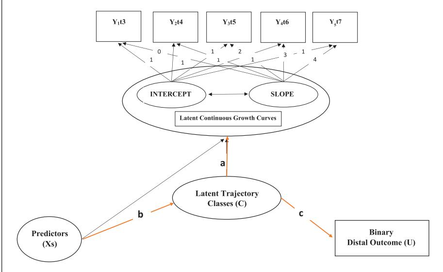
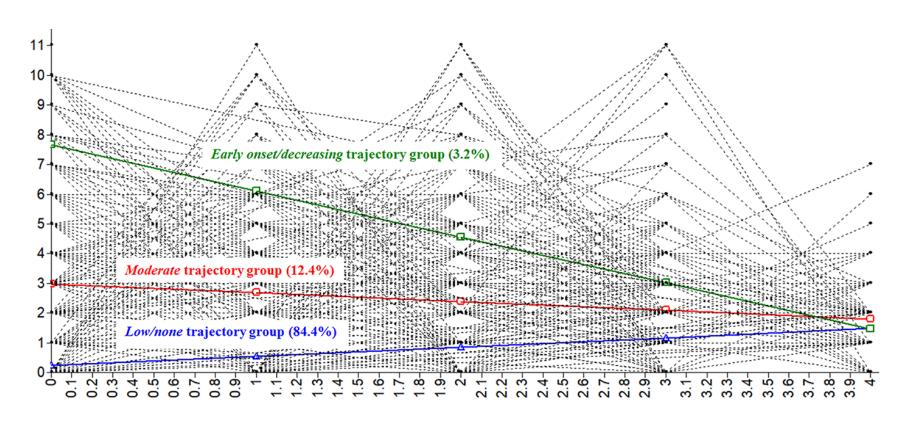

**1016326**IJOXXX10.1177/0306624X211016326International Journal of Offender Therapy and Comparative Criminology**Cho and Lacey**

*research-article*2021

### *Article*

**The Impact of Life Domains on Developmental Trajectories of Peer Delinquency among Korean Adolescents: A Partial Test of Agnew's General Theory of Crime and Delinquency with a Group-Based Trajectory Modeling Approach**

https://doi.org/10.1177/0306624X211016326 International Journal of Offender Therapy and Comparative Criminology 2022, Vol. 66(13-14) 1387–1414 © The Author(s) 2021 Article reuse guidelines: [sagepub.com/journals-permissions](https://us.sagepub.com/en-us/journals-permissions) DOI: 10.1177/0306624X211016326 [journals.sagepub.com/home/ijo](https://journals.sagepub.com/home/ijo)

**Sujung Cho1 and Brett Lacey1**

### **Abstract**

Agnew introduced a new integrated theory; the General Theory of Crime and Delinquency, in which he attempted to corral the most influential predictors of criminal behavior into more parsimonious propositions of multiple life domains—self, family, peer, school, and work—as well as constraints against crime and motivations for it. This study presents a partial test of the theory using longitudinal data of 2,351 Korean adolescents. A group-based modeling approach (latent class growth analysis) was run to examine direct effects of life domains on peer delinquency as well as mediating effects of constraints and motivation on their relationships. The study identified three subgroups: early onset/decreasing (3.2%), moderate (12.4%), and low/none (84.4%). The findings revealed that the self and peer domains exhibited a positive impact on the early onset/decreasing trajectory group compared to the low/ none group with the constraint exhibiting a negative impact. The moderate trajectory group demonstrated that the self-domain was significant but was not rendered insignificant after controlling for constraints and motivations. The study provided moderate support for life domains within Agnew's new theory for peer delinquency in nonwestern countries.

1Southern Illinois University, Carbondale, USA

**Corresponding Author:**

Sujung Cho, Criminology and Criminal Justice, School of Justice and Public Safety, Southern Illinois University, 1000 Faner Drive Faner Hall, Mail Code 4504, Carbondale, IL 62901, USA. Email: [sujung.cho@siu.edu](mailto:sujung.cho@siu.edu)

### **Keywords**

life domains, constraints, motivations, peer delinquency, group-based modeling

### **Introduction**

Growing empirical studies in developmental and life course research have suggested that peer delinquency continues to be placed as either the core causal mechanism or a correlate of delinquent behavior (Cho & Lee, 2020; Janssen et al., 2016; Manzoni & Schwarzenegger, 2019; Muftić et al., 2014; Walters, 2020). Criminological theories such as social learning, differential association, and cultural transmission theories have been applied to examine whether delinquent peer association (DPA) causes delinquency, but not how it causes delinquency. Broader findings indicated support from the theoretical assumptions of this study which employed assumptions of social learning, social bond, and social control theories, which are all included in Agnew's (2005) integration resulting in the General Theory of Crime and Delinquency (GTCD). To gain a better understanding of the potential mediating effects of constraints and motivations on the relationships between life domains and peer delinquency trajectories, it is necessary to examine Agnew's GTCD more closely. Relatively little has been explained about intervening mechanisms by which prior experiences are theorized to influence later experiences through constraints and motivations. This study will examine peer delinquency in the theoretical framework of the GTCD. Specifically, the conditioning effects of peer delinquency on Agnew's life domains (self, family, peers, school) on the commission of delinquency will be examined as a partial test of GTCD.

According to developmental perspectives, peer delinquency may be dynamic from childhood to adolescence, characterized by heterogeneity such as early-onset, late peak, and social interactional continuous patterns (Lacourse et al., 2003; Vitaro et al., 2005). Understanding the heterogeneity of longitudinal changes in peer delinquency can help researchers and practitioners develop effective prevention and intervention programs. Despite these contributions to the existing literature, present explanations of heterogeneous population remain limited. Thus, a groupbased method (including a latent class growth analysis and growth mixture model) is a suitable approach to capture the moving picture of peer delinquency. Unfortunately, nearly all previous studies have relied on a *variable-centered* approach in which relations between variables for all individuals were emphasized (Horwitz et al., 2011; Nock et al., 2008). For this reason, it would be reasonable to use another analytic method, the *group-based method.*1 The relations among individuals are of primary interest in the group-based method, thus preventing variablebased oversimplification for all individuals.

In response to these criticisms, the purpose of the present study is to identify developmentally similar classes of individuals in terms of peer delinquency, and to examine correlates and consequences, conditional on latent trajectory class membership. This study also sought to test Agnew's (2005) GTCD as a theoretical framework to examine the direct effect of four life domains on peer delinquency trajectory class membership in adolescence. It examines how the odds of engaging in delinquency in early adulthood differ on the latent trajectory class membership. Further, the study employs a latent class growth analysis approach, using 6-year longitudinal panel data drawn from a national survey of Korean adolescents between the ages of 13 and 19. In sum, this study sought to apply an alternative analytic technique to address several empirical and methodological limitations of previous studies that use a single composite variable of DPA cross sectionally.

# **Agnew's General Theory or Crime and Delinquency**

Agnew's motivation to construct a more holistic integrated theory of crime and delinquency resulted in the GTCD. The intention behind GTCD was the development of a more concise, comprehensive, and parsimonious integration of the wider body of known and accepted theoretical constructs into a single integrative framework. To achieve this, Agnew's (2005) GTCD includes an adaptation of definitions explained in Akers' (1973) Social Learning Theory, the conceptualization of a delinquency constraining stake in conformity similar to the commitment and attachment components of Hirschi's Social Bond Theory (1969), as well as previously integrated theories such as Thornberry's (1987) Interactional Theory of General Delinquency, and Colvin's (2000) Theory of Crime and Coercion. Frequently, an end-to-end integration is used to describe relationships between variables. Agnew's (2005) GTCD implements the integration of several major criminological theories to form an inductive theory using previous empirical research on variables illustrating significant direct effects on crime and the relationship between those variables (Ngo et al., 2011). The integrative framework of GTCD is based on the following theoretical propositions:

- 1. Crimes are most likely when constraints against it are lowest and motivations are highest.
- 2. Several traits and features of the immediate social environment directly influence the constraints and motivations for crime. Many are associated with one another and are grouped into "clusters" called life domains. The life domains included in GTCD are self, family, school, peers, and work.
- 3. Life domains are reciprocal on one another, although some have stronger effects on others.
- 4. Crime can affect life domains in ways that increase the likelihood of subsequent crime. Prior crime directly increases the likelihood of subsequent crime. This is most likely when the individual both possesses traits and resides in an environment that are conducive to crime.
- 5. Life domains interact to affect the likelihood of committing crime. Effects are greater when other domains are conducive to committing crime.
- 6. Domains are mostly contemporaneous in nature. Although they may have a lagged effect on themselves, current likelihood of committing crime is mostly determined by the status of current life domain areas of the individual.
- 7. Domains have nonlinear effects on crime. As negative experiences within life domains become larger, the likelihood of committing crime also increases.
- 8. The biological factors and social environment variables of age, sex, race, ethnicity, socioeconomic status, and characteristics of the community individuals live in affect the level of and operation of life domains on the individual (Agnew, 2005, pp. 11–12).

# *Life Domains*

GTCD (2005) is an age-graded theory with different domains having different effects on individuals throughout their life course. The impact of domains is broken down into three different stages throughout life: childhood, adolescence, and adulthood. Agnew (2005) argues that the influence of life domains depends on the role of the domain on the individual at the time, that domains compete for order of influence across the lifespan, and that the individual's characteristics are ultimately responsible for which domains are most influential on behaviors. For example, the family domain influences children most, the peer domain most influences adolescents, and in adulthood, the peer and work domains impact crime the most (Agnew, 2005). According to Agnew (2005), this grouping scheme increases the likelihood that variables in each group will be caused by the same factors.

*Self-domain.* The self-domain in GTCD (2005) is most associated with measures of low self-control (LSC) and irritability. Constructs of traits are assembled in GTCD by combining smaller traits to form "super traits" (Agnew, 2005; Caspi et al., 1994; Miller & Lynam, 2001; Piquero et al., 2000; Watson et al., 1994). The LSC supertrait consists of impulsivity, below average inhibitions, boredom or dissatisfaction with conventional activities, and resistance to school or legal employment. Those exhibiting irritability are most likely to attribute negative events to the maliciousness of others (Agnew, 2005). Those who are irritable may feel more justified to commit crime and behave aggressively due to intense emotion compounded by LSC. Previous studies have shown that LSC may be the result of neglect or abuse at home, leading to less attachment at school which would result in poor academic performance causing individuals to participate in bullying and other delinquent acts (Choi & Kruis, 2019). LSC has also been shown to affect school attachment and increase the likelihood of cheating (Cochran, 2017)

*Family domain.* Conceptualization of the family domain consists of parent to juvenile bonding, poor supervision or discipline, family conflict, child abuse, absence of positive parenting, and family criminality (2005). Bonding is influential due to its absence reducing one's stake in conformity and contributing to strain (Agnew, 2005). Poor parenting practices produce a lack of external control exacerbating strain. Familial conflict toward each other or children will reduce an individual's stake in conformity while reinforcing aggressive behavior. Neglect and abuse have been shown to increase both low self-control and delinquency (Bunch et al., 2018; Walters, 2018). Positive parenting skills act as a constraint against crime as they teach socialization and problem-solving in a nondelinquent manner while simultaneously supporting children in situations they are incapable of handling alone (Agnew, 2005). It is also more likely that criminal family members will participate in conflict or negative parenting skills (Anderson, 1999).

*Peer domain.* Peer delinquency is a significant contributing factor to delinquency and crime. Individuals who are bonded to delinquent peers are more likely to participate in delinquency and receive positive reinforcement from peers for committing delinquent acts. Consequences of peer victimization include a reduction in stakes of conformity, an increase in strain, and the social learning of crime (Anderson, 1999; Colvin, 2000; Eitle & Turner, 2002). When individuals are left unsupervised the likelihood of the presence of strain is higher, external controls will be lower or nonexistent, and committing criminal or delinquent acts is more likely to be encouraged or positively reinforced. Studies have shown that individuals who experience peer or bullying victimization are more likely to participate in bullying or other delinquent acts (Barker et al., 2008; Chang et al., 2013; Choi & Park, 2018; Walters & Espelage, 2019)

*School domain.* Experiences in school and education levels comprise the school domain of GTCD (2005). Students who do not perform well academically, or have negative bonding to teachers and the institution are more likely to participate in delinquency. The chances of delinquency also increase when individuals possess lower educational and occupational goals. Those who are delinquent are more likely to have less desire for education and be more accepting of lesser quality jobs that non-delinquents (Agnew, 2005). Negative treatment of pupils by teachers and the absence of positive teaching methods are likely to increase delinquency. Negative treatment reduces stakes in conformity, increases strain, and provides negative modeling (Agnew, 2005). Lack of positive teaching leaves absences in social support, expectations of students, and lack of opportunity, increasing the likelihood of commission of delinquency.

*Work domain.* The work domain of the GTCD is mainly relegated to adulthood as children and adolescents are far less likely to be employed. Unemployment, poor supervision or discipline, and negative bonding all cause a higher likelihood that individuals will participate in delinquency (Agnew, 2005).

*Constraints against and motivations toward crime.* A core proposition of Agnew's GTCD (2005) is that the life domains increase delinquency through decreasing constraints against delinquency while also increasing motivations for participation in delinquency (Zhang et al., 2012). Agnew proposes that the life domains affect delinquency both directly and indirectly through their effects on motivations for and constraints against crime. Further proposition states that each domain consists of multiple measures that would load if subjected to a factor analysis. The domains are further not exclusive to constraints or motivations of delinquency, but often comprise both. Motivations and constraints are mechanisms which determine effects on crime (Agnew, 2005). Variables are grouped by life domains as opposed to by constraining or affecting criminal motivations because some variables are capable of affecting both constraints and motivations.

The constraints and motivations involved in Agnew's (2005) GTCD are categorized into three spheres: external control, internal control, and stake in conformity. In this theoretical context, external controls refer to the likelihood that others will detect and sanction criminal behavior. External controls can originate from informal sources such as family and friends and formal sources which align more with social institutions such as school, police, and courts (Zhang et al., 2012). Internal controls refer to factors which individuals restrain themselves from the commission of delinquency and criminal conduct (Cochran, 2017). Factors included in internal controls are a person's moral values, their attitudes toward statutes and social norms, levels of conventional socialization, levels of self-sanctioning for violating legal or social norms, and personality traits that increase responsiveness toward external constraints. Selfcontrol, delayed gratification, and risk-aversion are all traits that increase external restraint responsiveness (Cochran, 2017).

The depth of a person's stake in conformity determines the level of constraint of delinquency it causes. The higher stake in conformity a person possesses the more it will act as a constraint toward the commission of delinquent acts. The commitment and attachment elements of Hirschi's (1969) social bond theory are similar to the stake in conformity as it refers to the amount of personal investment the individual has with persons and activities beyond their immediate selves. Extant literature has shown that school commitment/attachment and students having a good relationship with their teacher work as constraints from committing crime (Chang et al., 2013; Muftić et al., 2014; Sabatine et al., 2017). Conversely, observations have indicated that depression is a motivation to commit crime in children and adolescents (Bunch et al., 2018; Chang et al., 2013; Walters & Espelage, 2019).

## *Empirical Support*

A combination of the theory's complexity, comprehensive nature, limitations of the data, and limits of applicability of all domains to age-limited samples all precluded a comprehensive theoretical testing of GTCD and the limited production of partial tests. Ngo et al. (2011) first tested Agnew's GTCD by examining rearrest rates of bootcamp participants through the self, family, peer, and work life domains. Analyses were not supportive of Agnew's theoretical propositions, only bad jobs and dropping out of high school showed significance on rearrest. Null findings could be explained through disparate variable conceptualization and the comparably narrow scope of the theoretical framework employed by Ngo et al. (2011).

The first theoretical testing of direct and indirect effects of GTCD's domains (Zhang et al., 2012) found variables from the family, peer, and school domains exhibited a baseline effect amongst South Carolina adolescents. Findings indicated that all domains excluding the peer domain lost direct effect with the addition of constraints and motivations (Zhang et al., 2012). Ngo and Paternoster (2014) found significant contemporaneous and lagged effects for variables in all domains when testing relationships between constraints and motivations toward smoking marijuana and drinking alcohol among adolescents. Cochran (2017) tested the effects of life domains on academic dishonesty. Findings showed poor socialization, LSC, and weak morals all made students more likely to cheat, while high grades, socialization, and school attachment made them less likely. Again, the addition of constraints and motivations relegated significance to fewer variables (attitudes against cheating, socialization) (Cochran, 2017). Although adequate data wasn't present to support Agnew's (2005) GTCD comprehensively, the core proposition of life domains increasing delinquency by reducing constraints and increasing motivations was supported by results in these studies.

The first cross-cultural theoretical testing of Agnew's (2005) GTCD found the most significant relationships between juvenile offending and the self and peer domains in a sample from Bosnia and Herzegovina (Muftić et al., 2014). A moderate level of support for Agnew's life domains was found within an international context. The presence of school and family domains reflecting constraining traits demonstrated a negative effect on offending through parental bonding and school attachment measures. Delinquent peers and LSC both increased substance abuse. LSC and DPA both exhibited a higher chance of violent offending. Higher collective efficacy was inversely related to DPA and bonding effects (Muftić et al., 2014). DPA was shown to mediate age and self-control. Findings of a cross-cultural and crossnational study using data of American and Irish adolescents found that all five life domains were significant predictors of delinquency in both countries (Roh & Marshall, 2018). Results also indicated that DPA was the strongest predictor of delinquent behaviors between both countries. Kabiri et al. (2019) also found strong support for Agnew's life domains directly and indirectly affecting the likelihood of cyberbullying by Iranian high school students through the self, family, school, and peer domains. Results across studies support Agnew's proposition that the effects of life domains are mediated by constraints and motivations.

*South Korean studies.* This study focuses on the impacts of life domains on developmental trajectories of peer delinquency within a sample of South Korean adolescents. The use of a South Korean sample evaluates the generalizability of the GTCD (2005) due to social and cultural disparities between previously studied nations and South Korean adolescents. Prior research has shown that Korean adolescents endure high amounts of pressure surrounding academic endeavors in comparison to American adolescents. Findings indicated that they spent substantially more of their free time focusing on scholastics (47%) in comparison to Americans (25%–27%), Italians (30%), Indian (34%), and Japanese (34%) adolescents (Lee & Larson, 2000). Some 12th grade individuals reported spending between 14 and 18 hours studying daily (Lee & Larson, 2000).

This study examines if the increased prioritization on social bonds will act as a constraint of crime through the life domains, especially the school and self-domains. The focus on scholarship has shown to lead to an increase of commitment to the school across multiple studies (Lee & Larson, 2000; Peterson et al., 2016). Findings have indicated school commitment constitutes a social bond that acts as a constraint on delinquency (Peterson et al., 2016). Findings among South Korean adolescents also indicate that delinquent peers were a significant predictor of delinquency (Peterson et al., 2016). Using the same sample of South Korean adolescents that this study employs, Choi and Kruis (2019) examined the effects of life domains on bullying and cyberbullying to test the generalizability of GTCD. Results indicated that all four domains studied (self, family, peer, and school) had significant effects on cyberbullying and the self, peer, and school domains were significant predictors of traditional bullying (Choi & Kruis, 2019). Specifically, LSC, beliefs in norms, parental attachment, and peer delinquency were found to be motivating factors of delinquency, and teacher attachment and peer attachment showed constraining effects. This study will further research by testing the generalizability of this theory by measuring a new form of delinquency through a new cultural perspective that is heavily focused on academic achievement.

## *Developmental Trajectories of Peer Delinquency*

The role of timing of peer delinquency is important in that it affects the prevalence, age of onset of offending, and escalation or de-escalation in frequency of delinquency throughout adolescence (Lacourse et al., 2006; Monahan et al., 2009). Several studies examined the impact of the time variant role of peer delinquency on externalizing behaviors.

Lacourse et al. (2006) determined that early adolescent boys that displayed high levels of hyperactivity, high levels of fearlessness, and low prosociality during kindergarten were more likely to have a deviant peer group during early adolescence. This study was beneficial as it was the first to illustrate that the assessment of teachers as early as kindergarten were predictive of early adolescent delinquent peer group trajectories. While results showed a limited impact on family adversity to later DPA, when individuals displayed hyperactivity, fearlessness, and low levels of prosociality with family adversity, the likelihood of DPA increased by a factor of 2 (Lacourse et al., 2006).

Additional research showed that antisocial behavior declines throughout all of adolescents with the most rapid declines occurring in early adolescence (Monahan et al., 2009). Monahan et al. (2009) further found that peer delinquency increased in early and middle adolescence but began to decrease at age 17 into adulthood. The change could be attributed to their findings illustrating that the resistance to peer influence increased throughout adolescence before beginning to slow toward early adulthood. Adolescents were found to decline in antisocial behavior and delinquency as they mature because their friends are also going through processes of maturation and that they are becoming more independent of the influence of others.

Vitaro et al. (2005) formed four groups to longitudinally assess DPA from late childhood to early adolescence: an early affiliative group, a late affiliative group, a declining group, and a non-affiliative group. Analyses focused on early and middle adolescents' number of friends and their delinquency. The early affiliative group was found to be most delinquent by age 10, use delinquency to gain social dominance and power, and not find scholastic endeavors important. Late affiliates nearly matched early affiliates by age 13-14, although they displayed significantly lower DPA before age 12. The increase in this group was attributed to depression stemming from low quality of friendships and possible negative parenting experiences. Individuals in the declining group were found to become increasingly accepted by classmates and improve scholastically throughout adolescence leading to a decline in DPA (Vitaro et al., 2005).

# *Present Study*

The purpose of this study is to address theoretical and methodological limitations of previous studies by identifying subgroups or classes of Korean adolescents who showed differentiated profiles. Agnew's (2005) perspective is employed to explain the observed consistency on correlates and consequences of peer delinquency trajectories. Using a 6-year longitudinal panel data of Korean adolescents between the ages of 13 and 18, this study examines the direct effect of the three life domains of self, family, and peer on class membership of peer delinquency trajectories as well as the mediating effect of constraints and motivation on its relationships. Also, the study examines how one's own delinquency varies on the class membership of peer delinquency trajectories. Reflecting the theoretical framework, the study hypotheses are as follows:

**Hypothesis 1:** There will be more than one group, each having a distinct pattern of peer delinquency trajectories.

**Hypothesis 2:** Low levels of self-control and self-esteem, child neglect, child abuse, and bullying victimization will be predictive of class membership of peer delinquency trajectories.

**Hypothesis 3:** Constraints (i.e., school commitment and teacher attachment) and motivation (i.e., depressive symptoms) will predict class membership of peer delinquency trajectories.

**Hypothesis 4:** School commitment, teacher attachment, and depressive symptoms will partially or fully mediate the relationships between class membership of peer delinquency trajectories and the covariates (i.e., low levels of self-control and selfesteem, child neglect, child abuse, and bullying victimization).

**Hypothesis5:** The likelihood of late adolescent delinquency will vary by class membership of peer delinquency trajectories.

# **Method**

# *Data and Sample*

Data for this study comes from the Korean Children and Youth Panel Survey (KCYPS) compiled by the National Youth Policy Institute (NYPI). The KCYPS collected data from over 2,351 Korean adolescents in 2010 by using a multi-stage stratified cluster sampling design. The KCYPS sample subjects were selected by region in proportion to the population of fourth year elementary school students stratified into 15 regions in South Korea (including Seoul metropolitan city and 14 metropolitan cities and provinces). The same research subjects were surveyed once per year for 7years from 2010 (seventh grade of junior high school) to 2016 (freshman year of college). There were 78 junior high schools from a list of national schools (compiled by the Ministry of Education) based on the average number of seventh grade students per class in 15 national areas. The sample is nationally representative of the socioeconomic status, sex, and location characteristics of the population, including juvenile delinquency (peer delinquency, experiences of delinquency, and victimization).

The first research sample produced information for a sample of 2,351 adolescents in 2010 (seventh grade of junior high school); among them, 2,280, 2,259, 2,108, 2,091, 2,058, and 1,881 responded to the survey in 2011 through 2016 (freshman year of college) respectively. Of the participants, 49.3% were male and 50.7% were female. Approximately 20% of the original sample dropped out of the study at some point during the 7-year period. Maximum likelihood estimation with robust standard errors (MLR) was used to address the attrition rate (missing data) within the sample across time, assuming that data are missing-at-random. All of the data in the sample were included to estimate model parameters, and variables were allowed to be included in the analyses to be related to patterns of missing data (McKnight et al., 2007). All variables examined for the analyses are described in Supplemental Table A1.

# *Measures*

*Distal outcome variable.* Delinquency was a dichotomous distal outcome variable. Respondents were asked during the last survey whether since the age of 19 they had engaged in each of the following delinquent acts: "smoking," "drinking," "severely teasing or bantering other friends," "collectively bullying," "fighting," "severely beating other people," "threatening other friends," "taking or breaking someone's things," and "stealing." Each indicator of this variable was scored 1 if the event occurred at least once and 0 otherwise. All indicators were summed, ranging from 0 to 9 and dichotomized to signify whether the respondents had engaged in any of the types of delinquent acts.

*Intervening variable.* Peer delinquency was measured as a part of the five annual assessments from age 15 through age 19 (administered in 2012 and each year through 2016) to assess developmental trajectories. At each follow-up, respondents reported the number of peers who had engaged in each type of 11 acts in the last year: "smoking," "drinking," "having unexcused absence," "running away," "severely teasing or bantering other friends," "collectively bullying," "fighting," "severely beating other people," "threatening other friends," "taking or breaking someone's things," and "stealing." Such continuous indicators were recoded into a dichotomous variable and summed as a count variable to signify any of the 11 forms of delinquent acts of peers. A higher value on this variable reflects more variety of peer delinquency.

*Independent variables: Constraints and motivation. School commitment* was measured as a constraint against delinquency that took into account stake in conformity using four items: (1) being in my school puts me in a good mood, (2) I do my homework, (3) I am well aware of what I have learned in class, and (4) I ask someone else (teachers or friends) when I have something I do not know (α=.76). Response options were fivepoint Likert scales, ranging from 1=very untrue to 5=very true. We factor analyzed these items to derive indicators of constraints against delinquency (stake in conformity). A higher value reflects greater school commitment. *Teacher attachment* was assessed with five items as follows: (1) My teacher and I have a warm greeting for each other, (2) I can share and discuss my problem with teachers, (3) My teacher and I can exchange warm greetings when we meet outside, (4) Teachers show their love and affection to me, and (5) I hope the current teachers become my teacher next year (α=.84) (Peterson et al., 2016). All five indicators were measured on five-point Likert scales, ranging from 1=very untrue to 5=very true. A confirmatory factor analysis (CFA) was conducted to create a construct with a higher value indicating greater teacher attachment. Serving as a measure of motivations for peer delinquency, *depressive symptoms* were measured with the following indicators, administered in 2011 (during the second survey): "I am a worried and disheartened," "Sometimes I feel extremely sad and gloomy with no apparent reason," "I have many worries," "Sometimes I feel suicidal with no apparent reason," "Sometimes I cry," "I believe that everything will be due to me, even when I get involved in trouble," "Sometimes I feel extremely lonely with no apparent reason," "I am not interested in anything," "I get stressed by dissatisfaction over my future," and "I get stressed by hard work" (α=.90). A higher value on the latent variable, created by confirmatory factor analysis (CFA), reflects a higher level of depression.

*Independent variables: Life domains.* The study used five measures of Agnew's life domains: two scales regarding self, two representing family, and one regarding peer. *Low self-control* also was measured using six indicators administered in 2011. Examples were "I may hit other people when I feel annoyed," "I fight more frequently than others do," "I am often seized by an impulse to throw an object whenever I get angry," "Sometimes I can't suppress an impulse to hit other people," "I easily get angry over little things when people stand me up," and "I lose my temper whenever I get angry." All six indicators were measured on five-point Likert scales, ranging from 1=very untrue to 5=very true. With the satisfactory internal reliability of those indicators (∝= . ) 81 ,CFA was conducted to create a single construct. A high value on this variable reflects a low level of self-control. *Socially withdrawn behavior* was measured in 2011 using five items: "I feel really awkward when I'm in front of many people," "I feel embarrassed on many occasions," "I have difficulty expressing myself in front of others," "I feel shy," and "I don't like to assert myself in front of people" (Hong et al., 2017). Each item was measured using five-point Likert scales, ranging from 1=very untrue to 5=very true (∝= . ) 85 . We factor analyzed these items to derive indicators of this measure with a high value reflecting a high level of socially withdrawn behavior. *Child Neglect* was measured with the following four indicators administered in 2011 (during the second survey): "I knew that there was parents/ someone in my family to take care of me and protect me," "I wore clean clothes," "parents/someone in my family are interested in my life at school," and "parents/ someone in my family thinks that I am more important than their job" (Bernstein et al., 1994). All four indicators were measured on five-point Likert scales, ranging from 1=very untrue to 5=very true and were reverse-coded. The measure demonstrated satisfactory internal reliability (α=.77). CFA was conducted to create one single construct, with a high value on this latent variable reflecting the greater likelihood of child neglect. *Child Abuse* was measured with four indicators administered in 2011 (during the second survey). Indicators on this variable included "The punishments I received seemed cruel," "I was punished with a belt, a board, a cord, or some other hard object," "Parents/someone in my family hit me so hard that it left me with bruises or marks," and "Parents/someone in my family said hurtful or insulting things to me" (Bernstein et al., 1994). All four indicators were measured on five-point Likert scales, ranging from 1=very untrue to 5=very true. As a result of the good internal consistency (α=.85), CFA was conducted to derive one single variable. A higher score on this latent variable reflected greater likelihood of child abuse. *Bullying victimization* was measured with five indicators administered in 2011 (during the second survey). Respondents were asked whether since the age of 14 they had been victimized by the following bullying events in the last year: "being severely teased or bothered by other people?" "being threatened by other people?" "being severely beaten?" "being robbed by other people," and "being collectively bullied by other people?" The first four indicators are related to typical descriptors of physical and verbal bullying victimization (Olweus, 1994), and the last indicator is consistent with a more careful literature review suggesting that individuals are bullied by a peer group of assailants (Cho & Lee, 2018; Espelage et al., 2003). Such dichotomous indicators were used and summed as a count variable, ranging from 0 to 4. A higher value on this variable reflected more frequent prior bullying victimization.

Three demographic variables (gender, parent's job, and school location) were included as control variables into each model. Gender was represented by a dummy variable, with 1 reflecting male adolescents. Also, parent's job and school location were assessed using a dichotomous response (1=parent's job and 0=others; 1=Seoul and 0=others). Age was excluded in this analysis because the data at each wave had the same graded subjects.

## *Analytic Strategy*

A latent class growth analysis (LCGA) was conducted to identify peer delinquency trajectories, utilizing Mplus 7.4 (Muthén & Muthén, 1998–2015). LCGA (Nagin, 1999, 2005) is a group-based semi-parametric approach based on finite mixture modeling, which decomposes the heterogeneity in a sample by subdividing it into a finite number of latent subgroups with distinct class-specific trajectories (Muthen & Muthen, 2000). Figure 1 illustrates a general growth mixture model (GMM). This technique is a combined variable-centered and person-centered approach. It examines inter-individual differences in intra-individual change (the initial level and rate of change) in a single outcome repeatedly assessed (see the upper part in Figure 1) and identifies the heterogeneity in developmental trajectories (see path a in Figure 1). LCGA is most appropriate for the current analysis because, unlike GMM, within-class variances of the growth curves are fixed to zero. This allows LCGA to loosen the following two assumptions held by GMM: (1) an average trend is captured in accordance with a normal distribution; and (2) there is sufficient within-class variability to estimate accurate variance/co-variance matrices. In other words, LCGA allows individuals to vary between classes, while GMM allows individuals to vary within a class around the average growth curve.

This study focused on the "classify-then-analyze" procedure (the 3-step approach, Nylund-Gibson & Masyn, 2016) in which individuals were first classified to groups, and then groups were regressed on covariates. In this class enumeration procedure, class membership was measured without the measurement error variance that may result in statistical bias/misclassification error rates (Roeder et al., 1999). By estimating class membership and testing for cluster-specific differences, the uncertainty rates of class membership are taken into account in estimating the standard errors used in testing for class differences. This study compiled information about classification quality such as the logit values of each class from the output of the first step to specify the measurement error variance in a subsequent model (i.e., the means of each class were manually fixed using the logit values in the second step). Thus, the class formation and interpretation were not changed by the subsequent addition of covariates in the next step. Once the best-fitting classification model was determined, theoretically relevant covariates and a distal outcome were then included in the model.

The present study has six objectives:

- 1. An unconditional latent growth curve modeling (LGCM), assuming the developmental trajectories of peer delinquency repeatedly assessed throughout adolescence.
- 2. An unconditional latent class growth analysis (LCGA), identifying a certain number of classes with distinct class-specific trajectories of peer delinquency repeatedly assessed throughout adolescence.
- 3. A conditional LCGA, incorporating measures in the three life—self, family, and peer—domains, examining how these measures are related directly to latent trajectory class membership of peer delinquency throughout adolescence.
- 4. A conditional LCGA examining whether the measures in the three life domains predict the trajectory class membership directly and indirectly throughout measures of constraints and motivations (i.e., the mediating role of constraints and motivations on the relationship between the life domain measures and the latent trajectory class membership).
- 5. A LCGA incorporating a distal outcome variable, estimating the probabilities of one's own delinquency in early adulthood, conditional on the latent trajectory class membership.

### **Figure 1.** General growth mixture model.

*Note.* The data analysis proceeded in a series of steps. The first step of the first stage in the preliminary analysis was to determine direction and extent to which scores for a single outcome repeatedly assessed (peer delinquency) changed over the time period. A latent growth curve model (LGCM) was applied to estimate peer delinquency trajectories with two latent growth factors: a "intercept" representing an initial level/ average starting point of delinquent peer association at Time 1, and a random "slope" representing a rate of change across four-time points. The second step is to determine the best-fitting classification model by using multiple indices of goodness of fit (See the bottom of Table 4). The second stage of the primary analysis involved estimating a multinomial logistic regression (estimating betweenclass variation) but not the mixture regression (estimating within-class variation) to test the effects of covariates on latent trajectory class membership (see path b) and the probability of a distal outcome conditional on class membership (see path c).

The zero-order relationships between each independent variable and a distal outcome variable were examined (see Table 1). The overall results indicated that each of the covariates correlated well with deviant peer association and correlated with delinquency in the predicted directions.

### **Results**

## *Stage I: Preliminary Model Selection Analyses*

*Step 1. Developmental trajectory in unconditional LGCM.* An unconditional LGCM was used to examine individual trajectories of peer delinquency repeatedly assessed from 2012 (T3) to 2016 (T7). Average starting point/initial level (intercept) of peer delinquency for ninth graders (age 15) and average within-person/intra-individual change (slope) in risk over the 5-year period are displayed in Supplemental Table A2.

|                                                                          | 1 | 2              | 3              | 4              | 5              | 6              | 7               | 8              | 9               | 10              | 11              | 12              | 13              | 14              | 15              | 16             | 17              |
|--------------------------------------------------------------------------|---|----------------|----------------|----------------|----------------|----------------|-----------------|----------------|-----------------|-----------------|-----------------|-----------------|-----------------|-----------------|-----------------|----------------|-----------------|
| 1. D elin T7 que ncy                                         | — | ** .06 5 | ** .12 5 | ** .14 8 | ** .15 3 | ** .35 6 | −.0 32       | −.0 09      | .03 8        | ** .08 7  | −.0 05       | .02 0        | .01 5        | .03 7        | ** .06 9  | .03 4       | −.0 04       |
| 2. P de linq T3 eer uen cy                             |   | —              | ** .31 3 | ** .32 3 | ** .28 8 | ** .22 3 | * −.0 42  | .01 5       | .03 1        | ** .07 2  | −.0 06       | .02 1        | ** .09 1  | ** .07 5  | ** .26 0  | .00 1       | −.0 16       |
| 3. P de linq T4 eer uen cy                             |   |                | —              | .47 1 ** | .44 8 ** | .24 3 ** | −.0 43 *  | .00 8       | .04 5 *   | .07 4 **  | −.0 07       | .03 3        | .11 8 **  | .09 3 **  | .28 2 **  | .00 1       | −.0 02       |
| 4. P de linq T5 eer uen cy                             |   |                |                | —              | .47 7 ** | .31 8 ** | −.0 76 ** | −.0 45 * | .01 0        | .04 8 *   | −.0 29       | .05 7 **  | .09 2 **  | .08 0 **  | .34 1 **  | −.0 05      | −.0 45 *  |
| 5. P de linq T6 eer uen cy                             |   |                |                |                | —              | .33 7 ** | −.0 27       | .02 6       | −.0 21       | .03 2        | −.0 03       | .05 6 *   | .11 7 **  | .06 8 **  | .37 4 **  | .01 1       | −.0 72 ** |
| 6. P de linq T7 eer uen cy                             |   |                |                |                |                | —              | −.0 15       | .01 2       | −.0 22       | .02 1        | −.0 20       | .02 8        | .07 4 **  | .00 7        | .31 9 **  | .00 0       | .03 2        |
| 7. S cho ol i lve T2 nt nvo me                      |   |                |                |                |                |                | —               | ** .43 8 | ** −.1 97 | ** −.1 96 | ** −.1 66 | ** −.2 99 | ** −.1 49 | ** −.0 57 | −.0 32       | ** .06 1 | ** .10 2  |
| 8. T her ach T2 att nt eac me                       |   |                |                |                |                |                |                 | —              | ** −.1 40 | ** −.1 29 | ** −.1 54 | ** −.2 63 | −.0 37       | ** .06 0  | .03 9        | .02 7       | ** .09 2  |
| 9. D T2 ive tom epr ess sym p                       |   |                |                |                |                |                |                 |                | —               | ** .28 0  | ** .28 3  | ** .18 8  | ** .17 2  | ** .08 9  | ** −.1 40 | .01 9       | −.0 34       |
| 10. Low lf-c rol T2 ont se                             |   |                |                |                |                |                |                 |                |                 | —               | .28 0 **  | .16 6 **  | .28 2 **  | .10 3 **  | −.0 31       | .02 9       | −.0 20       |
| 11. Soc ially thd n b eha r T 2 wi vio raw |   |                |                |                |                |                |                 |                |                 |                 | —               | .14 1 **  | .11 1 **  | .09 5 **  | −.0 06       | −.0 03      | −.0 46 *  |
| 12. Ch ild lect T2 neg                                    |   |                |                |                |                |                |                 |                |                 |                 |                 | —               | .20 6 **  | .04 2 *   | .06 3 **  | −.0 02      | −.0 09       |
| 13. Ch T2 ild abu se                                      |   |                |                |                |                |                |                 |                |                 |                 |                 |                 | —               | .08 8 **  | .18 6 **  | .00 0       | .03 4        |
| 14. Bul ly ing vic tim izat ion T2               |   |                |                |                |                |                |                 |                |                 |                 |                 |                 |                 | —               | ** .06 1  | −.0 07      | −.0 10       |
| 15. Ma le                                                          |   |                |                |                |                |                |                 |                |                 |                 |                 |                 |                 |                 | —               | −.0 34      | * −.0 45  |
| 16. Par s' j ob ent                                          |   |                |                |                |                |                |                 |                |                 |                 |                 |                 |                 |                 |                 | —              | .00 0        |
| 17. Sch l lo ion cat oo                                   |   |                |                |                |                |                |                 |                |                 |                 |                 |                 |                 |                 |                 |                | —               |

#### **Table 1.** Correlations among the Study Variables.

\*\*\**p*≤.001. \*\**p*≤.01. \**p*≤.05.

Adolescents averaged 0.882 peer delinquency at T3 (age 15), whereas the average increase in peer delinquency over the 5-year period was 0.116 per year (*p*<.001). Also, the intercept- and slope-variances were significant (*b*=0.989 and 0.089, *p*<.001), indicating that inter-individual differences in intra-individual change over time may differ across samples.

*Step 2. Heterogeneous developmental trajectories in unconditional GMM.* The second step of analyses is to select the optimal final model with distinct cluster-specific trajectories. Table 2 shows the values of the model fit statistics and the number of parameters for all models assessed. Multiple model fit indices were used (see the bottom of Table 2). The Lo-Mendell-Rubin likelihood ratio test (LMR-LRT) and bootstrapped LRT (BLRT) also were used to assess the differences in the log-likelihood between two adjacent/nested class models with k and k+1 classes, where significant *p*-values (less than .05) indicated a benefit of adding an additional class.2 While the five-class solution had the smallest value of the *relative* model fit statistics (AIC, BIC, SABIC, CAIC, AWE), the three-class solution was identified as optimal with the non-significant LMR-LRT and BLRT *p*-values, indicating no further benefit of adding an additional class.

Figure 2 displays estimated plots of the three-trajectory model. The intercept of Class 1 was significantly higher than the average for all cases while the slope was nonsignificant. For this reason, Class 1 was called the *moderate* trajectory group, accounting for 12.4%. Class 2, called the *early onset/decreasing* trajectory group, accounted for a small (3.2%) portion of the sample. The intercept of Class 2 was significantly higher than average; however, it declined steeply thereafter, as evidenced by the significant negative linear slope. Class 3 had the highest membership (84.4%). The intercept was significantly lower than average; and the slope was non-significant. This led us to label Class 3 as the *low/none* trajectory.

### *Stage II: Primary Multinomial Logistic Regression Analyses*

*Step 1. Adding between-class effects of predictors to a LCGA.* The next step in the second stage involved estimating path models depicting all hypothesized direct and mediated effects of life domains—self (low self-control T2 and socially withdrawn behavior T2), family (child neglect T2 and child abuse T2), and peer (bullying victimization T2) on latent trajectory class membership of peer delinquency. Those impacts with the unordered categories were described with two regression equations, each contrasting a category of the trajectories with a chosen reference category (the low/none trajectory class). The results of multivariate multinomial logistic regression models were displayed in Table 3. Model I in Table 3 involved estimating pathways depicting the direct effect of three life domain variables on class membership while controlling for control variables. The odds of the early onset/decreasing group membership increased by 1.486 for every instance of low self-control T2 (*p*<.001), 0.636 for socially withdrawn behavior T2 (*p*<.01), and 0.505 for bullying victimization (*p*<.05) compared to the low/none trajectory group. Low self-control T2 was a significant factor among

|                              |                                           |                        |                                   |                                   |                                   |                                   |                                   | H 0: K c las H 1: K 1 c las + ses ; ses |                                               |                                                         |                                       |                        |                               |                     |  |
|------------------------------|-------------------------------------------|------------------------|-----------------------------------|-----------------------------------|-----------------------------------|-----------------------------------|-----------------------------------|-----------------------------------------------------------------------------|-----------------------------------------------|---------------------------------------------------------|---------------------------------------|------------------------|-------------------------------|---------------------|--|
| ( ) Mo de l K | L L                                    | N- p ar          | C A I                       | C B I                       | S C A B I             | C C A I                  | A W E                       | S L R T                                                            | A d L M R j Va lue p- | Bo d ots tra p p e Va lue p- | B F ( ) K, K 1 + | ( ) P K cm | S C I                   | En tro p y |  |
| Lat las t c en      | h a ly t s g row na s   | is ( L C G | A )                            |                                   |                                   |                                   |                                   |                                                                             |                                               |                                                         |                                       |                        |                               |                     |  |
| 1-c las s              | −1 5, 9 1 2. 9 5        | 7                      | 3 1, 8 3 7. 8 9 | 3 1, 8 7 2. 2 6 | 3 1, 8 5 3. 2 0 | 3 1, 8 7 8. 2 6 | 3 1, 9 3 6. 6 3 | 1, 6 1 0. 1 2                                                | 0 0 1 <.                             | 0 0 1 <.                                       | 0. 0 0 0                     | 0. 0 0 0      | −1 5, 9 3 6. 1 | 0. 9 2 8   |  |
| 2-c las s              | −1 5, 0 7 3. 1 6        | 1 0                 | 3 0, 1 6 4. 3 3 | 3 0, 2 1 5. 8 8 | 3 0, 1 8 7. 2 8 | 3 0, 2 2 4. 8 8 | 3 0, 3 1 2. 4 3 | 1, 0 3 6. 9 8                                                | 0 0 1 <.                             | 0 0 1 <.                                       | 0. 0 0 0                     | 0. 0 0 0      | −1 5, 1 0 7. 9 | 0. 9 5 6   |  |
| 3-c las s              | −1 4, 5 3 2. 3 1        | 1 3                 | 2 9, 0 8 8. 6 2 | 2 9, 1 5 7. 3 5 | 2 9, 1 1 9. 2 3 | 2 9, 1 6 9. 3 5 | 2 9, 2 8 6. 0 9 | 6 6 6. 0 1                                                      | 0 6 9                                   | 1                                                       | 0. 0 0 0                     | 0. 0 0 0      | −1 4, 5 7 8. 7 | 0. 9 8 9   |  |
| 4-c las s              | −1 4, 1 8 4. 9 4        | 1 6                 | 2 8, 3 9 9. 8 8 | 2 8, 4 8 5. 8 0 | 2 8, 4 3 8. 1 5 | 2 8, 5 0 0. 8 0 | 2 8, 6 4 6. 7 2 | 4 4 0. 8 6                                                      | 1 0 0                                   | 1                                                       | 0. 0 0 0                     | 0. 0 0 0      | −1 4, 2 4 2. 9 | 0. 9 7 6   |  |
| 5-c las s              | −1 3, 9 6 7. 7 2        | 1 9                 | 2 7, 9 7 1. 4 4 | 2 8, 0 7 4. 5 5 | 2 8, 0 1 7. 3 6 | 2 8, 0 9 2. 5 5 | 2 8, 2 6 7. 6 5 | Na                                                                          | Na                                            | Na                                                      | Na                                    | Na                     | Na                            | Na                  |  |
| Gr h m t ow         | de l ( G ixt ure m o | M M )            |                                   |                                   |                                   |                                   |                                   |                                                                             |                                               |                                                         |                                       |                        |                               |                     |  |
| 1-c las s              | −1 5, 3 1 3. 4 5        | 1 0                 | 3 0, 6 4 4. 9 0 | 3 0, 6 9 6. 4 5 | 3 0, 6 6 7. 8 6 | 3 0, 7 0 5. 4 5 | 3 0, 7 9 3. 0 0 | Na                                                                          | Na                                            | Na                                                      | Na                                    | Na                     | Na                            | Na                  |  |

**Table 2.** Model Fit Indexes for Latent Class Growth Analysis and Grow Mixture Model (*n*=2,272).

*Note. LL*=model maximum log likelihood value (the value shown in bold indicates a model with the smallest *LL* value that perfectly fits the data); npar=number of free parameters estimated in the model; AIC=the Akaike Information Criterion (the value shown in bold indicates the model with the smallest value); BIC=the Bayesian Information Criterion (the value shown in bold indicates the model with the smallest value); SABIC=the sample-size adjusted BIC (the value shown in bold indicates the model with the smallest value); CAIC=consistent AIC (the value shown in bold indicates the model with the smallest value); AWE=approximate weight of evidence criterion (the value shown in bold indicates the model with the smallest value); LRTS=likelihood ratio test statistics comparing a current model (k class) to a model with one more latent class (k+1 class); Adj LMR *p*-Value=the adjusted Lo-Mendell-Rubin likelihood ratio test *p*-Value (the value shown in bold represents the non-significant *p*-Value, indicating the current model with the smaller number of classes is not rejected); Bootstrapped *p*-value=parametric bootstrapped *p*-value for the LRTS; BF=Bayes factor comparing the current model (k class) to a model with one more latent class (k+1 class) (the value shown in bold indicates a model with the smallest number of classes that is favored over a model with one more latent class); cmP(K)=the approximate correct model probability compared to all models (the value shown in bold indicates any models with cmP(K)>0.10), showing strong evidence for the correct model. LCGA=latent class growth analysis; GMM=growth mixture model, where variances and covariances are freed to be estimated for all classes (class-varying variances and covariances).

**Figure 2.** Classification of developmental trajectory of peer delinquency across five time points.

members in the moderate group compared to the low/none trajectory group (*b*=0.342 at *p*<.05). Being male significantly predicted membership in both the early onset/ decreasing and moderate trajectory groups in comparison to the low/none trajectory group.

Constraints (school commitment T2 and teacher attachment T2) and motivations (depressive symptoms T2) were added to Model II. School commitment T2 statistically and inversely predicted membership in the early onset/decreasing group compared to the low/none trajectory group (*b*=−0.77 at *p*<.05). The odds of being a member of the early onset/decreasing group increased by 1.436 for every instance of low self-control T2 (*p*<.001), 0.619 for socially withdrawn behavior T2 (*p*<.05), and 0.449 for bullying victimization (*p*<.05) compared to the low/none trajectory group. But the impacts were almost the same as those in model I without the presence of constraints and motivations. It means that school commitment did not mediate the relationship between life domain variables and the early onset/decreasing group membership compared to the low/none trajectory group.

*Step 2. Incorporating a binary distal outcome variable into a LCGA.* The last step in the conditional LCGA involved an estimation of sequelae by incorporating a distal outcome variable (delinquency at T7). The coefficients (of thresholds) and probabilities for the regression of the distal outcome on the latent trajectory class membership are presented in Table 4. The probabilities of delinquency at T7 were 6.38% for the early onset/decreasing group, 6.11% for the moderate trajectory group, and 2.22% for the low/none group in the full model. The overall Wald chi-test was statistically significant (10.583 (3), *p*<.05), which indicated that, in general, the probabilities of committing delinquency in early adulthood were different across the three groups of delinquent peer association trajectories.

|                                                                                                        |                        |                                                                                                 | Me d ly f la las h a ly ia ion is is t te t c t an a s o n s g ro w na s              |                         |                                                                                                                              |                   |                                                                                                                                                                      |                   |                                                                              |                                          |  |  |
|--------------------------------------------------------------------------------------------------------|------------------------|-------------------------------------------------------------------------------------------------|------------------------------------------------------------------------------------------------------------------------------------------------------------------|-------------------------|------------------------------------------------------------------------------------------------------------------------------|-------------------|----------------------------------------------------------------------------------------------------------------------------------------------------------------------|-------------------|------------------------------------------------------------------------------|------------------------------------------|--|--|
|                                                                                                        |                        |                                                                                                 |                                                                                                                                                                  | Mo de                | l I                                                                                                                       |                   | Mo de l I I                                                                                                                                              |                   |                                                                              |                                          |  |  |
|                                                                                                        |                        |                                                                                                 | De lop l f p de l j ies inq ta tra to ve me n ec r o ee r ue nc y                              |                         |                                                                                                                              |                   |                                                                                                                                                                      |                   |                                                                              |                                          |  |  |
|                                                                                                        |                        |                                                                                                 | Ea ly / de ing t r on se cr ea s ( 3. 2 % ) low /no ve rsu s ne ( 8 4. 4 % ) |                         | Mo de ( 1 2. 4 % ) te ra low /n ve rsu s on e ( 8 4. 4 % ) |                   | Ea ly / de ing t r on se cr ea s ( 3. 2 % ) low /n ve rsu s on e ( 8 4. 4 % ) |                   | Mo de ( te ra low ve rsu s ( 8 4. 4 % | 1 2. 4 % ) /no ne ) |  |  |
| Pr d ic to e rs                                                                         |                        |                                                                                                 | B                                                                                                                                                                | S E                  | B                                                                                                                            | S E            | B                                                                                                                                                                    | S E            | B                                                                            | S E                                   |  |  |
|                                                                                                        |                        | Ma le                                                                                        | 2. 0 8 ** *                                                                                                                                          | 0. 3 9 1       | 2. 3 6 9 ** *                                                                                                 | 0. 6 1 7 | 2. 0 8 2 ** *                                                                                                                                         | 0. 3 2 1 | 2. 3 1 ** * 5                                                 | 0. 6 1 7                        |  |  |
|                                                                                                        |                        | Pa ' b j ts re n o                                                         | −0 2 2 1                                                                                                                                                | 1. 1 2 5       | −0 1 1                                                                                                                 | 0. 6 3 1 | −0 2 1 9                                                                                                                                                    | 1. 0 7 8 | −0 0 8 1                                                            | 0. 6 4 1                        |  |  |
|                                                                                                        |                        | Sc ho l loc ( Se l ) T 2 ion t o a ou                 | −0 3 2 9                                                                                                                                                | 0. 4 9 2       | −0 0 8                                                                                                                 | 0. 2 5 8 | −0 3 0 9                                                                                                                                                    | 0. 4 7 8 | −0 0 8 1                                                            | 0. 2 5 8                        |  |  |
| In de de ia t v p en n ar                                                      | b les               |                                                                                                 |                                                                                                                                                                  |                         |                                                                                                                              |                   |                                                                                                                                                                      |                   |                                                                              |                                          |  |  |
| L fe do i ins ma                                                                        | Se l f           | Lo l f− l T 2 tro w se co n                                       | ** * 1. 4 8 6                                                                                                                                     | 0. 3 2 5       | * 0. 3 4 2                                                                                                       | 0. 1 8 1 | ** * 1. 4 3 6                                                                                                                                         | 0. 3 6 6 | 0. 3 5 2                                                            | 0. 1 9 6                        |  |  |
|                                                                                                        |                        | So 2 ia l ly i h dr be ha ior T t c aw n w v | 0. 6 3 6 **                                                                                                                                          | 0. 2 3            | 0. 1 1                                                                                                                 | 0. 3 1      | 0. 6 1 9 *                                                                                                                                               | 0. 2 6 8 | 0. 0 8 4                                                            | 0. 1 5 7                        |  |  |
|                                                                                                        | Fa ly i m     | C h l d n lec T 2 i t eg                                             | 0. 1 0 9                                                                                                                                                | 0. 3 1 8       | 0. 1 5 1                                                                                                            | 0. 1 9 2 | 0. 1 9 7                                                                                                                                                    | 0. 3 6      | 0. 1 6 8                                                            | 0. 2 2                             |  |  |
|                                                                                                        |                        | C h l d a bu T 2 i se                                                   | 0. 3 2 3                                                                                                                                                | 0. 2 8 4       | 0. 0 7 3                                                                                                            | 0. 1 4 8 | 0. 2 8 6                                                                                                                                                    | 0. 2 7 8 | 0. 0 7 2                                                            | 0. 1 5 1                        |  |  |
|                                                                                                        | Pe er               | Bu l ly ing ic im iza ion T 2 t t v                         | 0. 5 0 5 *                                                                                                                                           | 0. 2 2 2       | 0. 3 1 5                                                                                                            | 0. 1 8 1 | * 0. 4 4 9                                                                                                                                               | 0. 2 3 4 | 0. 3 1 3                                                            | 0. 1 8 2                        |  |  |
| In b ing ia te rve n va r                                                      | le                     |                                                                                                 |                                                                                                                                                                  |                         |                                                                                                                              |                   |                                                                                                                                                                      |                   |                                                                              |                                          |  |  |
| Co in tra t ns                                                                             |                        | Sc 2 ho l c i T tm t o om m en                                 |                                                                                                                                                                  |                         |                                                                                                                              |                   | −0 * 7 7                                                                                                                                                    | 0. 3 6 6 | −0 2 2 7                                                            | 0. 2 3 3                        |  |  |
|                                                                                                        |                        | Te he hm T 2 t ta t ac r a c en                                |                                                                                                                                                                  |                         |                                                                                                                              |                   | 0. 5 7 7                                                                                                                                                    | 0. 3 5 9 | 0. 1 5 8                                                            | 0. 2 0 9                        |  |  |
| Mo iva ion t t                                                                             |                        | De T 2 ive to p re ss sy mp ms                                    |                                                                                                                                                                  |                         |                                                                                                                              |                   | −0 0 4 3                                                                                                                                                    | 0. 3 7 4 | −0 0 8 4                                                            | 0. 2 2 8                        |  |  |
| A ka i ke ( A I C )                                                            |                        |                                                                                                 |                                                                                                                                                                  | 2 4, 2 9 5. | 5 6                                                                                                                       |                   | 2 2, 8 8 7. 5 5                                                                                                                                    |                   |                                                                              |                                          |  |  |
| Ba ( B I C ) ian y es                                                          |                        |                                                                                                 |                                                                                                                                                                  | 2 4, 5 1       | 1. 8 7                                                                                                                 |                   | 2 3, 1 6 7. 3 7                                                                                                                                    |                   |                                                                              |                                          |  |  |
| Sa le- d ize j mp s a us                                                       | d B I C te |                                                                                                 |                                                                                                                                                                  | 2 4, 3 8 7. | 9 7                                                                                                                       |                   | 2 3, 0 0 5. 3 4                                                                                                                                    |                   |                                                                              |                                          |  |  |
| C las f l ( ) i ica ion i t ty tro s q ua en p y |                        |                                                                                                 |                                                                                                                                                                  | 0. 9 6            | 6                                                                                                                            |                   | 0. 9 6 8                                                                                                                                                    |                   |                                                                              |                                          |  |  |

**Table 3.** Class-differences in Coefficients for the Regression of Latent Trajectory Class Membership on Life Domains and Constraints against Crime.

*Note*. Boldface entries are unstandardized coefficients from multinomial logistic regression and reflect statistically significant coefficients.

Reference group=Low/none group.

\*\*\**p*≤.001. \*\**p*≤.01. \**p*≤.05.

1405

|                          | Probability of Delinquency (2016) varying on latent trajectory classes. |                     |                     |                              |  |  |  |  |
|--------------------------|----------------------------------------------------------------------------|---------------------|---------------------|------------------------------|--|--|--|--|
|                          | Early onset/ decreasing (3.2%)                                          | Moderate (12.4%) | low/none (84.4%) | Wald chi square test (df) |  |  |  |  |
| Threshold                | 2.685*** (0.594)                                                        | 2.732*** (0.32)  | 3.782*** (0.238) | 10.583* (3)               |  |  |  |  |
| Probability              | 6.38%                                                                      | 6.11%               | 2.22%               |                              |  |  |  |  |
| Information criteria     |                                                                            |                     |                     |                              |  |  |  |  |
| Akaike (AIC)             | 22,887.55                                                                  |                     |                     |                              |  |  |  |  |
| Bayesian (BIC)           | 23,167.37                                                                  |                     |                     |                              |  |  |  |  |
| Sample-size adjusted BIC |                                                                            | 23,005.34           |                     |                              |  |  |  |  |

| Table 4. |  |  | The Probability Structures of Binary Distal Outcome of Delinquency T7. |  |  |
|----------|--|--|------------------------------------------------------------------------|--|--|
|----------|--|--|------------------------------------------------------------------------|--|--|

*Note*. Unstandardized coefficients are shown; values in parentheses are standard error of estimates; The three-class optimal model was used. The threshold was converted into the probability (=1/1+EXP [threshold]) of individuals in this class having an outcome value of 1. Boldface entries are unstandardized coefficients and reflect statistically significant coefficients.

\*\*\**p*≤.001. \*\**p*≤.01, \**p*≤.05.

# **Discussion**

Agnew (2005) provides a concise general theory that organizes and synthesizes wellknown causes and correlates of delinquent behavior into one of three primary theoretical constellations: (1) constraints against crime, (2) motivations for crime, and (3) life domains (self, family, peers, school, and work) from which these constraints and motivations influence crime. Despite its simplicity in conceptualization, previous studies have conducted partial tests of this theory due to data limitations that deny a complete test but have provided modest support for it (Cochran, 2017; Kabiri et al., 2019; Muftić et al., 2014; Ngo et al., 2011; Ngo & Paternoster, 2014; Zhang et al., 2012). Most of these studies have either conflated constraints and motivations within life domains or neglected to include either constraints or motivations. The current study demonstrates the robustness of Agnew's GTCD using longitudinal data of South Korean adolescents by addressing problems of previous studies and the temporal inference within the context of Agnew's new integrated theory. Also, previous research has found that peer delinquency is a strong force that can cause delinquent behavior in adolescence. Adolescents learn to participate in delinquent behavior when peers commit crime and cannot consider the consequences of the criminal behavior. The current study attempted to examine empirical support for causes and consequences of peer delinquency. The results firmly establish the time-ordered relationships between life domains as exogenous variables, constraints and motivations as intermediate variables, as well as one's own delinquency as a distal outcome.

Regarding the first hypothesis, this study examined peer delinquency trajectories from age 15 through age 19 years and identified three classes; Class 1, called the moderate trajectory group, demonstrated a consistent level of peer delinquency, ranging from an average of 2 to 3 instances per time point; Class 2, called the early onset/decreasing trajectory group demonstrated a negative linear slope (i.e., was significant higher than average; however, it declined steeply thereafter); Class 3, called the low/none trajectory group demonstrated that the intercept was significantly lower than average; and the slope was non-significant. The findings are consistent with previous studies' three patterns—an early affiliative, a late affiliative, and a non-affiliative (Cho & Lee, 2020; Lacourse et al., 2003; Patterson & Yoerger, 1997) but are not consistent with other studies that include an additional, declining group (Dong & Krohn, 2016; Vitaro et al., 2005) and identify six groups—a Nonoffending or Rarely Offending, Adolescent-Limited Trajectory, Chronic Trajectory, and Late-Onset Trajectory groups (Nagin & Land, 1993).

The inconsistent findings suggest the importance of sample selection when using group-based methods. Many prior studies have worked primarily with official arrest records of high-risk offenders for a longer follow up period (Tzoumakis et al., 2013) while this study worked with self-report surveys of youth non-offenders for a shorter period of follow-up (Cho, in press). Also, the pattern of developmental trajectories of offending behavior varies on the different type of offending behavior. For this reason, it would not be expected that the number of groups, size per group, and patterns of behavior trajectories remain constant across studies (Nagin & Odgers, 2010).

The second hypothesis was to examine whether adolescents' delinquent peer association trajectories would differ on measures of three life domains—self, family, and peers—assessed from 14-year adolescents. The overall findings indicated that the life domains were predictive of peer delinquency as shown in Agnew's (2005) theory. More precisely, Korean adolescents with low self-control, socially withdrawn behavior, and bullying victimization during the early adolescence were more likely to become the early onset/decreasing group member across adolescence (to associate with delinquent peers at early adolescence). On the other hand, the moderate trajectory group members in adolescence were influenced by low self-control. Results support earlier findings indicating individuals with low self-control and low socialization during early adolescence are more likely to have an early onset of peer delinquency that decreases over time (Monahan et al., 2009). The findings support that low selfcontrol had the strongest effect on peer delinquency among all variables, consistent with Ngo and Paternoster's (2014) study that the variables of the self-domain (low self-control and attitudes favorable to deviance) exhibited a large direct effect on students consuming alcohol and using marijuana. This is congruent with Agnew's contention that the self-domain would demonstrate the greatest effect on antisocial behavior. In Western counties, low self-control is a silent predictor of peer delinquency among the early-onset and declining group members (Cho, 2021) and bullying perpetration among both the moderate late peaker and high late peaker subgroups members (Cho & Lee, 2018). It suggests the importance of specific types of offending behavior that may vary across Korean adolescents. Despite these different patterns, Low self-control is a robust predictor for Korean adolescent subgroups who demonstrated offending behavior in their life no matter if they had decreased or increased patterns of its association over time, compared to the normative trajectory group. Thus, delinquency prevention and intervention programs should be designed to prevent adolescents who exhibit low self-control from associating with delinquent peers. Specifically, early prevention and intervention efforts might be given to pay more attention to developmental stage, encouraging adolescents to consider subsequent negative outcomes (Moffitt et al., 2011).

Bullying victimization has also been previously linked to peer delinquency. Studies have shown that those who are bullied or victimized by peers are more likely to later participate in delinquency and associate with delinquent peers (Chang et al., 2013; Monahan et al., 2009; Walters & Espelage, 2019). It implies that variables in the peer domain are important during adolescence. Although the core proposition is supported, the measures of family domain (child neglect and child abuse) did not have a significant direct effect on peer delinquency in adolescence. In Korean literature, findings reveal that adolescents who were bullied early in life may be at higher risk of aggressive acts, suggesting that bullying victimization is a robust predictor of peer delinquency among early onset group members (Cho & Lee, 2020). This finding suggests that a lack of stability in social hierarchies may result in a dynamic process of delinquent behavior during adolescence, as adolescents establish their status in the hierarchy of school dominance (Pellegrini & Long, 2002). For this reason, prevention and intervention strategies would benefit from social contexts on developmental trajectories of delinquent behavior, enhancing positive group culture, and cohesiveness within the confirmative peer group.

Regarding the third hypothesis, this study examined whether school commitment, teacher attachment, and depressive symptoms have a direct effect on class membership. The findings indicated that adolescents with low levels of school commitment were more likely to become the early onset/decreasing group member. These findings are consistent with Agnew's theory and previous findings linking school commitment or attachment to early onset DPA (Cochran, 2017; Muftić et al., 2014). Results are consistent within the cultural context of South Korea that commitment to school and students' GPA were found to have a greater influence on reduced delinquency (Peterson et al., 2016). In South Korea, education is an important component of social status. Graduating from a high ranking university is considered as a means of attaining a good job, high incomes, and even a good marriage (Chung et al., 1993; Lee & Larson, 2000). For this reason, all high school students prepare strenuously for the university entrance examination. In response to this situation, Korean students devote large amounts of time to schoolwork which causes the pressure of the exam leading to negative emotions regarding education (Lee & Larson, 2000). The immediate effects of the pressure of exams and an extraordinary devotion of time to studying on daily life can be theorized to partly or wholly explain high rates of depression among Korean adolescents that influence delinquent behavior (Lee & Larson, 2000).

This could explain why students' educational achievement was the most robust predictor of constrained delinquent behavior. The findings suggest that efforts should be emphasized to monitor and address the academic pressures of Korean students from non-attendance and through over-extending themselves (Lee & Larson, 2000; Peterson et al., 2016). Additionally, school officers, teachers, and families should encourage greater commitment to school and enhance the force of student moral restraints against associations with delinquent peers.

Of particular interest is the mediating mechanism of constraints and motivations. Among the early onset/decreasing group members the effects of self (low self-control and socially withdrawn behavior) and peer (bullying victimization) domain variables remained significant but were slightly attenuated. The effects of all of these life domains were not fully but partially mediated through constraints and motivations, which is inconsistent with Agnew's theoretical expectations. However, low self-control was rendered insignificant in the moderate trajectory group, indicating that constraints and motivations fully mediated the effect of low self-control. This finding is consistent with the expectations of Agnew's (2005) general theory that the effect of the self-domain on peer delinquency are indirect through constraints, which, in turn, evidence the direct effect on peer delinquency.

The last objective was to estimate the probabilities of delinquency in early adulthood, conditional on the latent trajectory class membership. Both the early onset/ decreasing- and moderate group members were more likely to commit delinquency in early adulthood in comparison to the low/none group. Results from the data analysis estimated here support the underlying assumption that peer delinquency is a strong force in explaining delinquency. This study contributes to the emergent body of Agnew's (2005) theory that the theory can be extended to peer delinquency in addition to delinquency. These findings suggest that the timing of association with delinquent peers plays a significant role in the entire socialization process since the age of onset of peer delinquency sets the fundamental path of delinquent behavior trajectories as a starting point. Thus, it is theoretically worthwhile to consider the timing of onset of offending behavior such as association with delinquent peers as a viable predictor of risk for the initial level of chronic delinquency (Tolan, 1987).

In sum, early onset offenders are more likely to experience stressful life events, to be denied access to the peer group and to receive antisocial training from parents and commit offenses in late childhood to early adolescence. On the other hand, later peak offenders would commit their first offenses in late adolescence. They might not experience early stressful life events in childhood and peer rejection in adolescence (Patterson et al., 2017).

### *Limitations and Directions for Future Research*

This study has several limitations. This study examined the individual-level factors, but not the community-level factors regarding delinquency. Criminal opportunities disproportionately affect delinquency, depending on area characteristics. For future research, it would be necessary to conduct a multilevel analysis in order to examine the odds of delinquency across schools and communities (Wilcox et al., 2013). Additionally, gender differences in delinquency have been found in previous studies because criminal propensity and social interaction factors shape differences in potential offenders' perceptions of their future behaviors. However, this study did not examine the gender gap on these associations. From a theoretical standpoint, this study may partially reflect Agnew's theory, providing a partial test through the inclusion of three life domains. There are several variables identified in Agnew's theory but excluded in this study because relevant variables were not included in the data set used. This limitation should be addressed in future research by using a data set that contains all of the variables reflective of the entirety of the five life domains across the life course, necessary to test the theory.

In conclusion, this study provided the fifth attempt to empirically test Agnew's GTCD using an international sample. Using a sample of Korean adolescents allows researchers to provide a relatively robust test of the theory (Bennett, 2004). The findings suggest direct effects of the self (low self-control and socially withdrawn behavior) and peer (bullying victimization) domains in early adolescent on peer delinquency developmental trajectories during adolescence among the early onset/decreasing group members compared to the low/non group members. These impacts are partially mediated through the constraint variable (school commitment). The moderate group members, compared to the low/non group members, demonstrated that low self-control is significant in explaining peer delinquency trajectories, and its impact is fully mediated after adding intervening variables (constraints and motivations). The findings indicate that Agnew's (2005) theory is fairly adequate in explaining peer delinquency and/or delinquency within a non-western context. In other words, considering the mixed, moderate support for Agnew's theory, it is not necessary to reformulate the theory in non-western countries but necessary to continue to explore the utility of the theory. Rather, it would be better to test the theory by using international and comparative samples and testing several propositions and empirical constructs of Agnew's theory.

### **Declaration of Conflicting Interests**

The author(s) declared no potential conflicts of interest with respect to the research, authorship, and/or publication of this article.

### **Funding**

The author(s) received no financial support for the research, authorship, and/or publication of this article.

### **Ethics Statement**

"The study does not involve human participants and/or animals," and "Informed consent was not needed because this study used the Second Korean Children and Youth Panel Survey (KCYPS) data set."

### **ORCID iD**

Sujung Cho <https://orcid.org/0000-0001-6252-5521>

### **Supplemental Material**

Supplemental material for this article is available online.

### **Notes**

- 1. The method enables person-centered analysis whereby change and stability in behaviors may vary across groups/classes, each having similar patterns. The group-based method allows for the classification of individuals into mutually exclusive subgroups/subclasses, which could not be represented by a homogeneous population distribution but explains an unobserved subpopulation heterogeneity, each having their own multivariate distribution of observed indicators (Asparouhov et al., 2017).
- 2. Both LRT tests assessed if a k-class model (H0) demonstrates a better fit compared to a k+1 class model (H1). Both tests provide a *p*-value, showing that statistically significant *p*-values indicate the k+1 class model should be accepted. The predicted k+1 class model provides a better fit than the given k-class model.

### **References**

- Agnew, R. (2005). *Why do criminals offend?: A general theory of crime and delinquency*. Roxbury.
- Akers, R. L. (1973). *Deviant behavior: A social learning approach*. Wadsworth Pub. Co.
- Anderson, E. (1999). *The code of the street: Decency, violence, and the moral life of the inner city*. Norton.
- Asparouhov, T., Hamaker, E. L., & Muthén, B. (2017). Dynamic latent class analysis. *Structural Equation Modeling: A Multidisciplinary Journal*, *24*(2), 257–269.
- Barker, E. D., Arseneault, L., Brendgen, M., Fontaine, N., & Maughan, B. (2008). Joint development of bullying and victimization in adolescence: Relations to delinquency and selfharm. *American Academy of Child and Adolescent Psychiatry*, *47*, 1030–1038.
- Bennett, R. R. (2004). Comparative criminology and criminal justice research: The state of our knowledge. *Justice Quarterly*, *21*, 1–21.
- Bernstein, D. P., Fink, L., Handlesman, L., Foote, J., Lovejoy, M., Wenzel, K., Sapareto, E., & Ruggiero, J. (1994). Initial reliability and validity of a new retrospective measure of child abuse and neglect. *American Journal of Psychiatry*, *151*, 1132–1136.
- Bunch, J. M., Iratzoqui, A., & Watts, S. J. (2018). Child abuse, self-control, and delinquency: A general strain perspective. *Journal of Criminal Justice*, *56*, 20–28.
- Caspi, A., Moffitt, T. E., Silva, P. A., Loeber, M. S., Krueger, R. F., & Schmutte, P. S. (1994). Are some people crime prone? Replications of the personality crime relationship across countries, genders, races, and methods. *Criminology*, *32*, 163–196.
- Chang, F. C., Lee, C. M., Chiu, C. H., Hsi, W. Y., Huang, T. F., & Pan, Y. C. (2013). Relationships among cyberbullying, school bullying, and mental health in Taiwanese adolescents. *Journal of School Health*, *83*(6), 454–462.
- Cho, S. (2021). Modeling the reciprocal relationships between group-based developmental trajectories of peer delinquency and self-reported delinquency during adolescence: An application of interactional theory. *Criminal Justice and Behavior*, *48*(2), 234–255.
- Cho, S., & Lee, Y. H. (2020). Assessing self-control and strain of delinquent peer association trajectories within developmental perspectives: A latent class growth analysis approach. *Children and Youth Services Review*, *109*, 104745.
- Cho, S., & Lee, J. M. (2018). Explaining physical, verbal, and social bullying among bullies, victims of bullying, and bully-victims: Assessing the integrated approach between social control and lifestyles-routine activities theories. *Children and Youth Services Review*, *91*, 372–382.
- Choi, B., & Park, S. (2018). Who becomes a bullying perpetrator after the experience of bullying victimization? The moderating role of self-esteem. *Journal of Youth & Adolescence*, *47*(11), 2414–2423.
- Choi, J., & Kruis, N. E. (2019). The effects of life domains on cyberbullying and bullying: Testing the generalizability of Agnew's integrated general theory. *Crime & Delinquency*, *65*(6), 772–800.
- Chung, B., Kim, H., Lee, S., Kwon, K., & Lee, J. (1993). *Restoring Korean Education from the Bondage of Entrance Examination Education*. Nanam Publication.
- Cochran, J. K. (2017). The effects of life domains, constraints, and motivations on academic dishonesty: A partial test and extension of Agnew's general theory. *International Journal of Offender Therapy and Comparative Criminology*, *61*(11), 1288–1308.
- Colvin, M. (2000). *Crime and coercion : An integrated theory of chronic criminality*. St. Martin's Press.
- Dong, B., & Krohn, M. D. (2016). Dual trajectories of gang affiliation and delinquent peer association during adolescence: An examination of long-term offending outcomes. *Journal of Youth and Adolescence*, *45*(4), 746–762.
- Eitle, D., & Turner, R. J. (2002). Exposure to community violence and young adult crime: Effects of witnessing violence, traumatic victimization, and other stressful life events. *Journal of Research in Crime and Delinquency*, *39*(2), 214–237.
- Espelage, D., Holt, M., & Henkel, R. (2003). Examination of peer-group contextual effects on aggression during early adolescence. *Child Development*, *74*(1), 205–220.
- Hirschi, T. (1969). *Causes of delinquency*. Univ. Calif. Press.
- Hong, J. S., Kim, D. H., & Piquero, A. R. (2017). Assessing the links between punitive parenting, peer deviance, social isolation and bullying perpetration and victimization in South Korean adolescents. *Child Abuse & Neglect*, *73*, 63–70.
- Horwitz, A. G., Hill, R. M., & King, C. A. (2011). Specific coping behaviors in relation to adolescent depression and suicidal ideation. *Journal of Adolescence*, *34*(5), 1077–1085.
- Janssen, H. J., Eichelsheim, V. I., Deković, M., & Bruinsma, G. J. N. (2016). How is parenting related to adolescent delinquency? A between- and within-person analysis of the mediating role of self-control, delinquent attitudes, peer delinquency, and time spent in criminogenic settings. *European Journal of Criminology*, *13*(2), 169–194.
- Kabiri, S., Shadmanfaat, S. M. S., Choi, J., & Yun, I. (2019). The impact of life domains on cyberbullying perpetration in Iran: A partial test of agnew's general theory of crime. *Journal of Criminal Justice*, *66*, 101633.
- Lacourse, E., Nagin, D., Tremblay, R. E., Vitaro, F., & Claes, M. (2003). Developmental trajectories of boys' delinquent group membership and facilitation of violent behaviors during adolescence. *Development and Psychopathology*, *15*(1), 183–197.
- Lacourse, E., Nagin, D. S., Vitaro, F., Côté, S., Arseneault, L., & Tremblay, R. E. (2006). Prediction of early-onset deviant peer group affiliation: A 12-year longitudinal study. *Archives of General Psychiatry*, *63*(5), 562–568.
- Lee, M., & Larson, R. (2000). The Korean 'examination hell': Long hours of studying, distress, and depression. *Journal of Youth and Adolescence*, *29*(2), 249–271.
- Manzoni, P., & Schwarzenegger, C. (2019). The influence of earlier parental violence on Juvenile delinquency: The role of social bonds, self-control, delinquent peer association and moral values as mediators. *European Journal on Criminal Policy and Research*, *25*(3), 225–239.
- McKnight, P. E., McKnight, K. M., Sidani, S., & Figueredo, A. J. (2007). *Missing data: A gentle introduction*. Guilford Press.
- Miller, J. D., & Lynam, D. (2001). Structural models of personality and their relation to antisocial behavior: A meta-analytic review. *Criminology -Beverly Hills Then Columbus-*, *39*(4), 765–798.
- Moffitt, T. E., Arseneault, L., Belsky, D., Dickson, N., Hancox, R. J., Harrington, H., . . . & Caspi, A. (2011). A gradient of childhood self-control predicts health, wealth, and public safety. *Proceedings of the National Academy of Sciences*, *108*(7), 2693–2698.
- Monahan, K. C., Steinberg, L., Cauffman, E., & Mulvey, E. P. (2009). Trajectories of antisocial behavior and psychosocial maturity from adolescence to young adulthood. *Developmental Psychology*, *45*(6), 1654.
- Muftić, L. R., Grubb, J. A., Bouffard, L. A., & Maljević, A. (2014). The impact of life domains on Juvenile offending in Bosnia and Herzegovina: Direct, indirect, and moderating effects in Agnew's integrated general theory. *Journal of Research in Crime and Delinquency*, *51*(6), 816–845.
- Muthen, B., & Muthen, L. K. (2000). Integrating person-centered and variable-centered analyses: Growth mixture modeling with latent trajectory classes. *Alcoholism -New York Then Baltimore-*, *24*(6), 882–891.
- Muthén, L. K., & Muthén, B. O. (1998-2015) *mplus User's guide*. 7th ed. Muthen & Muthen; 2015.
- Nagin, D. (2005). *Group-based modeling of development*. Harvard University Press.
- Nagin, D. S. (1999). Analyzing developmental trajectories: A semi-parametric group-based approach. *Psychological Methods*, *4*, 139–157.
- Nagin, D. S., & Land, K. C. (1993). Age, criminal careers, and population heterogeneity: Specification and estimation of a nonparametric, mixed Poisson model. *Criminology*, *31*(3), 327–362.
- Nagin, D. S., & Odgers, C. L. (2010). Group-based trajectory modeling in clinical research. *Annual Review of Clinical Psychology*, *6*, 109–138.
- Ngo, F. T., & Paternoster, R. (2014). Contemporaneous and lagged effects of life domains and substance use: A test of Agnew's general theory of crime and delinquency. *Journal of Criminology*, *2014*, 320486.
- Ngo, F. T., Paternoster, R., Cullen, F. T., & Mackenzie, D. L. (2011). Life domains and crime: A test of Agnew's general theory of crime and delinquency. *Journal of Criminal Justice*, *39*(4), 302–311.
- Nock, M. K., Borges, G., Bromet, E. J., Cha, C. B., Kessler, R. C., & Lee, S. (2008). Suicide and suicidal behavior. *Epidemiologic Reviews*, *30*(1), 133–154.
- Nylund-Gibson, K., & Masyn, K. E. (2016). Covariates and mixture modeling: Results of a simulation study exploring the impact of misspecified effects on class enumeration. *Structural Equation Modeling: A Multidisciplinary Journal*, *23*(6), 782–797.
- Olweus, D. (1994). Bullying at school: Basic facts and effects of a school based intervention program. *Journal of Child Psychology and Psychiatry, and Allied Disciplines*, *35*(7), 1171–1190.
- Patterson, G. R., DeBaryshe, B. D., & Ramsey, E. (1989). A developmental perspective on antisocial behavior. In *Developmental and life-course criminological theories* (pp. 29–35). Routledge.
- Patterson, G. R., & Yoerger, K. (1997). A developmental model for late onset delinquency. In R. Dienstbier & D. W. Osgood (Eds.), *The Nebraska symposium on motivation: Vol. 44. Motivation and delinquency* (pp. 119–177). University of Nebraska Press.
- Pellegrini, A. D., & Long, J. D. (2002). A longitudinal study of bullying, dominance, and victimization during the transition from primary school through secondary school. *British Journal of Developmental Psychology*, *20*(2), 259–280.
- Peterson, B. E., Lee, D., Henninger, A. M., & Cubellis, M. A. (2016). Social bonds, juvenile delinquency, and Korean adolescents: Intra-and inter-individual implications of Hirschi's social bonds theory using panel data. *Crime & Delinquency*, *62*(10), 1337–1363.
- Piquero, A. R., MacIntosh, R., & Hickman, M. (2000). Does self-control affect survey response? Applying exploratory, confirmatory, and item response theory analysis to Grasmick Et Al.'S self-control scale. *Criminology -Beverly Hills Then Columbus-*, *38*(3), 897–930.
- Roeder, K., Lynch, K. G., & Nagin, D. S. (1999). Modeling uncertainty in latent class membership: A case study in criminology. *Journal of the American Statistical Association*, *94*(447), 766–776.
- Roh, M., & Marshall, I. (2018). A cross-cultural analysis of Agnew's general theory of crime and delinquency. *Social Science and Humanities Journal*, *2*, 301–321.
- Sabatine, E., Lippold, M., & Kainz, K. (2017). The unique and interactive effects of parent and school bonds on adolescent delinquency. *Journal of Applied Developmental Psychology*, *53*, 54–63.
- Thornberry, T. P. (1987). Toward an interactional theory of delinquency. *Criminology*, *25*(4), 863–892.
- Tolan, P. H. (1987). Implications of age of onset for delinquency risk. *Journal of Abnormal Child Psychology*, *15*(1), 47–65.
- Tzoumakis, S., Lussier, P., Blanc, M. L., & Davies, G. (2013). Onset, offending trajectories, and crime specialization in violence. *Youth Violence and Juvenile Justice*, *11*(2), 143–164.
- Vitaro, F., Brendgen, M., & Wanner, B. (2005). Patterns of affiliation with delinquent friends during late childhood and early adolescence: Correlates and consequences. *Social Development*, *14*(1), 82–108.
- Walters, G. D. (2018). Mediating the relationship between parental control/support and offspring delinquency: Self-efficacy for a conventional lifestyle versus self-efficacy for deviance. *Crime & Delinquency*, *64*(5), 606–624.
- Walters, G. D. (2020). Prosocial peers as risk, protective, and promotive factors for the prevention of delinquency and drug use. *Journal of Youth and Adolescence*, *49*(3), 618–630.
- Walters, G. D., & Espelage, D. L. (2019). Latent structure of early adolescent bullying perpetration: A taxometric analysis of raw and ranked scores. *Educational and Psychological Measurement*, *79*(4), 754–772.
- Watson, P. J., & Biderman, M. D. (1994). Narcissistic traits scale: Validity evidence and sex differences in narcissism. *Personality and Individual Differences*, *16*(3), 501–504.
- Wilcox, P., Gialopsos, B. M., & Land, K. C. (2013). Multilevel criminal opportunity. In F. T. Cullen & P. Wilcox (Eds.), *Handbook of criminological theory* (pp. 579–601). Oxford University Press.
- Zhang, Y., Day, G., & Cao, L. (2012). A partial test of Agnew's general theory of crime and delinquency. *Crime & Delinquency*, *58*(6), 856–878.

|                                                             | Wave 2     | Wave 3      | Wave 4      | Wave 5      | Wave 6      | Wave 7        |
|-------------------------------------------------------------|------------|-------------|-------------|-------------|-------------|---------------|
| Variable                                                    | Mean(s.d.) | Mean(s.d.)  | Mean(s.d.)  | Mean(s.d.)  | Mean(s.d.)  | Mean(s.d.)    |
| Distal outcome variable                                     |            |             |             |             |             |               |
| Delinquency                                                 |            |             |             |             |             |               |
| smoking                                                     |            |             |             |             |             | 1.80(.402)    |
| drinking                                                    |            |             |             |             |             | 1.20(.400)    |
| severely teasing or bantering other friends                 |            |             |             |             |             | 1.99(.097)    |
| collectively bullying                                       |            |             |             |             |             | 2.00(.023)    |
| fighting                                                    |            |             |             |             |             | 2.00(.023)    |
| severely beating other people                               |            |             |             |             |             | 2.00(.023)    |
| threatening other friends                                   |            |             |             |             |             | 2.00(.000)    |
| taking or breaking someone's things                         |            |             |             |             |             | 2.00(.000)    |
| stealing something                                          |            |             |             |             |             | 2.00(.033)    |
| Intervening variable                                     |            |             |             |             |             |               |
| Peer delinquency                                            |            |             |             |             |             |               |
| smoking                                                     |            | 1.54(5.414) | 2.63(6.487) | 2.98(7.299) | 3.71(10.03) | 5.56(10.645)  |
| drinking                                                    |            | .75(8.308)  | 2.19(5.525) | 2.82(6.123) | 4.29(10.16) | 13.23(20.467) |
| having unexcused absence                                    |            | .32(1.201)  | .39(1.271)  | .50(3.421)  | 0.66(3.15)  | .04(.396)     |
| running away                                                |            | .22(.908)   | .21(.897)   | .18(1.366)  | 0.09(0.541) | .01(.175)     |
| severely teasing or bantering other friends                 |            | .27(1.511)  | .26(1.648)  | .22(2.087)  | 0.14(1.211) | .02(.485)     |
| collectively bullying                                       |            | .16(1.011)  | .13(1.027)  | .15(1.989)  | 0.06(0.955) | .01(.136)     |
| fighting                                                    |            | .06(.644)   | .04(.911)   | .05(.653)   | 0.01(0.206) | .00(.144)     |
| severely beating other people                               |            | .12(1.058)  | .06(.474)   | .06(.508)   | 0.03(0.357) | .00(.118)     |
| threatening other friends                                   |            | .09(1.025)  | .02(.178)   | .03(.367)   | 0.02(0.315) | .01(.245)     |
| taking or breaking someone's things                         |            | .11(1.012)  | .03(.336)   | 2.98(.332)  | 0.02(0.272) | .80(3.450)    |
| stealing something                                          |            | .07(.755)   | .04(.311)   | 2.82(.670)  | 0.02(0.14)  | .00(.132)     |
| School commitment                                           |            |             |             |             |             |               |
| Most of the time, being in my school puts me in a good mood | 2.74(.749) |             |             |             |             |               |
| I do my homework                                            | 2.81(.801) |             |             |             |             |               |
| I am well aware of what I have learned in class             | 2.75(.731) |             |             |             |             |               |
| I ask someone else (teachers or friends) when I have        | 2.98(.795) |             |             |             |             |               |
| something I do not know                                     |            |             |             |             |             |               |
| Teacher attachment                                          |            |             |             |             |             |               |
| My teacher and I have a warm greeting for each other        | 3.07(.717) |             |             |             |             |               |
| I can share and discuss my problem with teachers            | 2.67(.849) |             |             |             |             |               |

### **Table A1.** Description of the South Korean Youth Sample (N = 2,351)

## **Table A1.** (continued)

|                                                                                           | Wave 2      | Wave 3     | Wave 4     | Wave 5     | Wave 6     | Wave 7     |
|-------------------------------------------------------------------------------------------|-------------|------------|------------|------------|------------|------------|
| Variable                                                                                  | Mean(s.d.)  | Mean(s.d.) | Mean(s.d.) | Mean(s.d.) | Mean(s.d.) | Mean(s.d.) |
| Teacher attachment (continued)                                                            |             |            |            |            |            |            |
| My teacher and I can exchange warm greetings when we meet outside | 2.76(.855)  |            |            |            |            |            |
| Teachers show their love and affection to me                                              | 2.97(.781)  |            |            |            |            |            |
| I hope the current teachers become my teacher next year                                   | 2.55(1.015) |            |            |            |            |            |
| Depression                                                                                |             |            |            |            |            |            |
| I am a worm and disheartened                                                              | 2.00(.784)  |            |            |            |            |            |
| Sometimes I feel extremely sad and gloomy with no apparent reason                      | 1.94(.828)  |            |            |            |            |            |
| I have many worries                                                                       | 2.27(.924)  |            |            |            |            |            |
| Sometimes I feel suicidal with no apparent reason                                         | 1.69(.792)  |            |            |            |            |            |
| Sometimes I cry                                                                           | 1.96(.893)  |            |            |            |            |            |
| I believe that everything will be due to me, even when I get involved in trouble       | 2.05(.850)  |            |            |            |            |            |
| Sometimes I feel extremely lonely with no apparent reason                                 | 1.92(.899)  |            |            |            |            |            |
| I am not interested in anything                                                           | 1.75(.755)  |            |            |            |            |            |
| I get stressed by dissatisfaction over my future                                          | 1.88(.847)  |            |            |            |            |            |
| I get stressed by hard work                                                               | 1.84(.815)  |            |            |            |            |            |
| Low self-control                                                                          |             |            |            |            |            |            |
| I may hit other people when I feel annoyed                                                | 2.26(.780)  |            |            |            |            |            |
| I fight more frequently than others do                                                    | 2.19(.799)  |            |            |            |            |            |
| I am often seized by an impulse to throw an object whenever I get angry                | 2.17(.790)  |            |            |            |            |            |
| Sometimes I can't suppress an impulse to hit other people                                 | 2.14(.764)  |            |            |            |            |            |
| I easily get angry over little things when people stand me up                             | 2.14(.847)  |            |            |            |            |            |
| I lose my temper whenever I get angry                                                     | 1.87(.813)  |            |            |            |            |            |
| Socially withdrawn behavior                                                               |             |            |            |            |            |            |
| I feel really awkward when I'm in front of many people                                    | 2.11(.915)  |            |            |            |            |            |
| I feel embarrassed on many occasions                                                      | 2.33(.914)  |            |            |            |            |            |
| I have difficulty expressing myself in front of others                                    | 2.14(.881)  |            |            |            |            |            |
| I feel shy                                                                                | 2.18(.896)  |            |            |            |            |            |
| I don't like to assert myself in front of people                                          | 2.44(.862)  |            |            |            |            |            |

### **Table A1**. (continued)

|                                                                                          | Wave 2     | Wave 3     | Wave 4     | Wave 5     | Wave 6     | Wave 7     |
|------------------------------------------------------------------------------------------|------------|------------|------------|------------|------------|------------|
| Variable                                                                                 | Mean(s.d.) | Mean(s.d.) | Mean(s.d.) | Mean(s.d.) | Mean(s.d.) | Mean(s.d.) |
| Child neglect                                                                            |            |            |            |            |            |            |
| parents/someone in my family thinks that I am more importan t than their job          | 2.04(.893) |            |            |            |            |            |
| parents/someone in my family are interested in my life at scho ol                     | 1.92(.745) |            |            |            |            |            |
| I wore clean clothes                                                                     | 1.80(.719) |            |            |            |            |            |
| I knew that there was parents/someone in my family to take ca re of me and protect me | 1.72(.702) |            |            |            |            |            |
| Child abuse                                                                              |            |            |            |            |            |            |
| The punishments I received seemed cruel                                                  | 2.27(.872) |            |            |            |            |            |
| I was punished with a belt, a board, a cord, or some other hard object                | 1.72(.831) |            |            |            |            |            |
| Parents/someone in my family hit me so hard that it left me wi th bruises or marks    | 1.65(.848) |            |            |            |            |            |
| Parents/ someone in my family said hurtful or insulting things to me                  | 1.73(.913) |            |            |            |            |            |
| Bullying victimization                                                                   |            |            |            |            |            |            |
| being severely teased or bantered by other people                                        | .06(.246)  |            |            |            |            |            |
| being collectively bullied by other people                                               | .03(.165)  |            |            |            |            |            |
| being severely beaten                                                                    | .02(.138)  |            |            |            |            |            |
| being threatened by other people                                                         | .02(.126)  |            |            |            |            |            |
| Control variables                                                                        |            |            |            |            |            |            |
| Sex (Males vs. Females)                                                                  | .51(.50)   |            |            |            |            |            |
| Parent's job                                                                             | .98(.120)  |            |            |            |            |            |
| School location (Seoul)                                                                  | .10(.296)  |            |            |            |            |            |

|                  |          | Intercept (Initial Level) | Linear Slope |          | r (Intercept & |                | Model Fit |       |  |
|------------------|----------|---------------------------|--------------|----------|----------------|----------------|-----------|-------|--|
|                  | Mean (M) | Variance                  | Mean (M)     | Variance | Slope)         | CFI            | TLI       | RMSEA |  |
| Peer delinquency | 0.882*** | 0.989***                  | 0.116***     | 0.089*** | -0.094* (0.05) | 0.872 0.846 |           | 0.001 |  |
|                  | (0.037)  | (0.125)                   | (0.015)      | (0.022)  |                |                |           |       |  |

**Table A2.** Unconditional Latent Growth Curve Model of Peer Delinquency in One Homogeneous Population

Note: Values in parentheses are standard error of estimates.

\*\*\**p* ≤ .001; \*\**p* ≤ .01; \**p* ≤ .05.