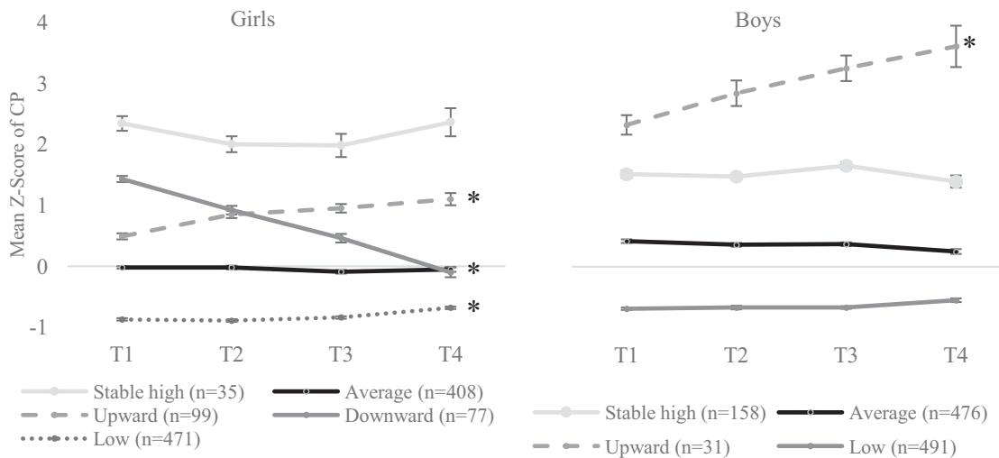
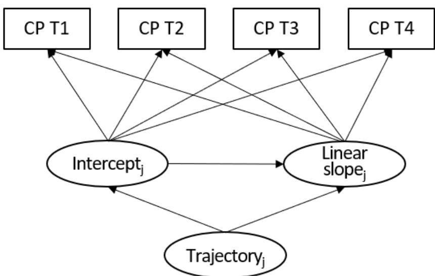

ORIGINAL PAPER

# Gender Differences in the Development of Children's Conduct Problems: A Four-Year Longitudinal Study

María Álvarez-Voces [1](http://orcid.org/0000-0003-0675-5538) ● Estrella Romero1

Accepted: 23 December 2024 / Published online: 30 January 2025 © The Author(s) 2025

### Abstract

1234567890();,:

1234567890();,:

Gender differences in the trajectories of conduct problems have received very little attention in the literature. The present four-year longitudinal study explores gender differences in conduct problems trajectories through early childhood, assessing gender-specific predictors and outcomes. We identified gender-separated conduct problems trajectories in a sample of 2246 young children (Mage in wave 1 = 4.25; 48.5% girls) using latent class growth analyses. We found five trajectories for girls (i.e., low, average, downward, upward, and stable high) and four for boys (i.e., low, average, stable high, and upward). Low parental warmth was related to the most problematic trajectories only in girls. The interpersonal psychopathic trait (grandiose-deceitful) was more pronounced in girls with higher conduct problems scores relative to other psychopathic traits, whereas in boys, the impulsive trait stood out. Meanwhile, boys' trajectories were more diverse in terms of negative outcomes (e.g., bullying, victimization) than those of girls. This study contributes to the body of work on heterogeneity in conduct problems by identifying different trajectories according to gender, and shows the relevance of gender in understanding the predictors, development, and outcomes of conduct problems.

Keywords Conduct problems ● Trajectories ● Childhood ● Gender ● Latent class growth analyses

### Highlights

- Researchers have widely studied conduct problems trajectories but have paid little attention to gender differences within them.
- We found four similar trajectories across genders, while we identified a downward trajectory only in girls.
- Low parental warmth was only related to the most problematic trajectories for girls.
- Psychopathic traits were related to the problematic trajectories across genders: grandiose-deceitful stood out in girls and impulsive-need for stimulation in boys.
- The most problematic trajectories were linked with poorer psychosocial outcomes across genders.

Conduct Problems (CP) in children are patterns of behaviors that can include aggression, destruction, defiance, temper tantrums, violation of the rights of others, and of ageappropriate norms or rules (American Psychiatric Association, [2013](#page-11-0)). They are the most prevalent disturbances in childhood and adolescence, resulting in numerous harmful consequences for the children/adolescents themselves, their families, and society in general. As such, CP are one of the most frequent motives for referring children to mental health services (Merikangas et al., [2022\)](#page-12-0).

A flourishing body of studies has addressed the issue of heterogeneity in the manifestations, etiologies and prognoses of CP, and experts have identified various developmental pathways based on age of onset, developmental course, and associated risk factors (Fanti, [2018](#page-12-0); Moffitt, [1993](#page-13-0)). Longitudinal research has identified several groups of CP trajectories, these including low, high but declining, increasing, and persistent high (Olson et al., [2017](#page-13-0)). Most children follow a normative trajectory, and many of those with early-onset CP tend to exhibit a significant decline later in development (Barker & Maughan, [2009\)](#page-11-0). However,

\* María Álvarez-Voces [mariaalvarez.voces@usc.es](mailto:mariaalvarez.voces@usc.es)

1 Underisk Group, Department of Clinical Psychology and Psychobiology, Institute of Psychology (IPsiUS), Faculty of Psychology, University of Santiago de Compostela, Santiago de Compostela, Spain

approximately 5% of children exhibit a persistent CP trajectory that lasts throughout adolescence (Morales et al., [2023\)](#page-13-0). This trajectory is related to higher future levels of CP and is one of the strongest predictors of substance abuse, antisocial behavior, and delinquency (Gutman et al., [2019](#page-12-0)).

While there has been substantial research interest in CP trajectories overall, there is still only limited understanding of their gender-specific characteristics. Due to the higher prevalence of CP in boys, earlier research focused predominantly on CP trajectories in boys, and indeed often overlooked gender differences (Brennan & Shaw., [2013](#page-11-0)). The scant literature on CP trajectories in girls emerged from pioneering studies in the 2000s, from which conclusions have been drawn below (Brennan & Shaw, [2013\)](#page-11-0). This specific area of study led to a vigorous debate as to whether the pattern of early-onset persistent was applicable to girls, or whether it was an exclusively male pattern (Silverthorn & Frick, [1999](#page-13-0)). Currently, those few available studies here tend to favor the idea of the existence of such an early onset persistent pattern in girls, with a lower prevalence than in boys, but with equal importance in terms of its impact on society. In recent research that does account for some gender differences, there is a tendency to model joint CP trajectories (i.e., to model global trajectories without separating these by gender). There are two main issues why mixed-gender models might cloud the overall picture: 1) girls who score higher in CP than their gender-specific reference group may be underestimated due to boy's higher CP levels, potentially misclassifying high-CP girls as "nonproblematic", and 2) more broadly, joint trajectory estimation might obscure gender-specific trajectories (Gutman et al., [2018\)](#page-12-0). This is especially significant in the case of girls, since there is evidence that girls desist in the use of overt aggression earlier than boys (Eliot, [2021](#page-11-0)).

Very few studies have analyzed CP trajectories separately by gender, and most of these do not begin from early childhood, but typically start at around 6–7 years. This timeframe might present challenges in identifying childhood onset patterns. Furthermore, such studies tend not to measure CP exactly, but rather assess factors like physical aggression, and often rely on teacher-reported information, which may be more limited than that from parents (Brennan & Shaw, [2013](#page-11-0); Gutman et al., [2018\)](#page-12-0). In seeking to overcome such limitations, Gutman et al. ([2018](#page-12-0)) found four distinct CP trajectories in both genders (i.e., low, earlyonset desisting, early-onset persistent and school-onset) in children from 3 to 11 years old, using parent-reported measures. Their findings support the claim that the classifications of CP trajectories in boys are applicable to girls, but that further refinements are needed to capture the true heterogeneity of the phenomenon.

Researchers have identified numerous predictors related to the childhood onset of CP, including low socioeconomic status (SES), low family positivity, and negative parenting practices (Shaw, [2013\)](#page-13-0). Likewise, studies have associated psychopathic traits in children such as Callous-Unemotional (CU), Grandiose-Deceitful (GD), and Impulsivity-Need for Stimulation (INS) with persistent and more severe pattern of CP (Klingzell et al., [2016](#page-12-0)). Some studies indicate that the early-onset persistent CP group shares certain temperamental (e.g., INS) and environmental (e.g., parental adversity) characteristics with the childhood-limited group (Odgers et al., [2008\)](#page-13-0). Others indicate that the key differences here lie in the range and severity of these early risks (being more pronounced in the early-onset persisting group) (Barker & Maughan, [2009\)](#page-11-0). Conversely, some research argues that specific features of the early-onset group (i.e., parental rejection and fearlessness) contribute to the persistence of CP (Shaw, [2013](#page-13-0)). Concerning gender-specific CP predictors, experts suggest that the increased vulnerability of boys to early onset of CP may be driven by individual factors (e.g., language delay and impulsivity) rather than family variables (Messer et al., [2006](#page-12-0)). However, the literature here is still very limited, and thus it remains unclear whether some child and family risk factors are uniquely associated with CP in one gender and not in the other. Further work on how early family and child variables correlate with different gender-specific trajectories of CP will contribute to a better understanding of the phenomenon. It will also allow for the development of interventions based on knowledge of the different causal mechanisms underlying CP in boys and girls (Brennan & Shaw, [2013](#page-11-0)).

CP are associated with negative outcomes such as the subsequent externalizing problems (e.g., aggression, bullying, substance abuse), internalizing problems (e.g., emotional regulation difficulties, victimization), social and family impairment, academic and occupational problems, as well as medical consequences (Hukkelberg et al., [2019;](#page-12-0) Kretschmer et al., [2014](#page-12-0); Lichtenstein et al., [2020\)](#page-12-0). Earlyonset persistent CP specifically present a significantly increased risk of adverse outcomes (Kretschmer et al., [2014](#page-12-0)). On the other hand, there is evidence that desisting trajectories present relatively normal outcomes in adolescence compared to the low trajectory, except in the case of higher self-reported aggression and poor academic outcomes (Bevilacqua et al., [2018;](#page-11-0) Xie et al., [2011\)](#page-13-0). Concerning gender differences in CP outcomes, some research suggests that they are similar across genders (Odgers et al., [2008](#page-13-0)), whereas elsewhere studies have reported that associations between CP in childhood and adverse outcomes tend to be stronger in boys (Lichtenstein et al., [2020\)](#page-12-0). This aligns with the observation that boys exhibit higher rates of bullying, overt aggression, and victimization (Casper et al., [2020](#page-11-0)). Yet, when it comes to relational aggression, the findings are less definitive: some studies report higher rates in girls (Kraft & Mayeux, [2018](#page-12-0)) and some in boys (Voulgaridou & Kokkinos, [2020](#page-13-0)), whereas others indicate no significant differences across genders (Espelage et al., [2018\)](#page-12-0). Nevertheless, it is important to consider the "gender paradox" and the "selective female affliction" in this context. These theories suggest that girls who develop a genderatypical disorder as a conduct disorder exhibit significantly more lifetime comorbidities such as depression and anxiety, more severe symptoms than boys, and greater overall impairment (Eme, [1992](#page-11-0); Konrad et al., [2022](#page-12-0); Loeber & Keenan, [1994\)](#page-12-0). Some researchers suggested that this phenomenon may be due to a higher accumulation of genetic and environmental risks in girls with conduct disorder (Berkout et al., [2011\)](#page-11-0). Another explanation is that the referral system may be more attuned to boys' CP, potentially leading to only the most severely deviant girls -often from highly adverse backgrounds- being referred (Eme, [1992\)](#page-11-0). Based on this, it appears that girls with high CP will perform worse than boys. However, further research is required to establish more consistent conclusions in this regard, given the limited research in this area (Konrad et al., [2022\)](#page-12-0).

## The Current Study

The present study uses longitudinal data collected over a four-year period with the aim of advancing our understanding of the course of CP in girls and boys by means of identifying gender-specific trajectories throughout childhood. We also seek to examine whether the predictors of these trajectories (i.e., family predictors such as SES, positive parenting, parental inconsistency, warmth, and child predictors such as psychopathic traits) and outcomes (i.e., bullying, victimization, relational aggression, emotional regulation, and emotional lability) are invariant in boys and girls. In this case, we use the term 'gender' rather than 'sex,' acknowledging that the two constructs are deeply intertwined at such a young age, making them difficult to fully disentangle (Hyde et al., [2019](#page-12-0)). Our choice is based on the focus of our analysis, which centers on psychological, social, and behavioral components rather than biological ones (Spears et al., [2020\)](#page-13-0). The study of trajectories and their predictors is essential for the early identification of children at risk of unfavorable outcomes as well as for understanding of the factors that differentiate them from those with more positive development. This knowledge will inform the implementation of tailored interventions and their optimal timing. The analysis of outcomes will also enable the prediction of associated problems, thus allowing for early intervention. Furthermore, the examination of gender differences in trajectories will refine predictive models and facilitate the development of interventions for gender-specific challenges. Our expectation is that there will be similar patterns of trajectories across genders but with some differences. More specifically, we hypothesize that a declining trajectory will only be found among the girls in our sample, in that the relevant sample of participants here covers the age group 7–11 years, and girls tend to desist from CP earlier than boys (Keenan & Shaw, [1997\)](#page-12-0). We also expect to find an early-onset persistent trajectory in girls as well as in boys, in line with recent work (Gutman et al., [2018](#page-12-0)). We make no assumptions about gender differences in early predictors and later outcomes, given the paucity of previous evidence.

## Methods

# Participants

This study uses data from 2246 children, from preschool through school age childhood (48.5% girls), who participated in the longitudinal ELISA Project conducted in Galicia (NW-Spain). For this study, four project waves were considered T1 (2017; Mage = 4.25, SD = 0.91, range = 3–6), T2 (2018; Mage = 5.34, SD = 0.92, range = 4–7), T3 (2019; Mage = 6.31, SD = 0.92, range = 4–8) and T4 (2022; Mage = 9.36, SD = 0.93, range = 7–11). The level of attrition in the sample was 14.4% between T1-T2, 22.7% between T1-T3 and 39.6% between T1-T4. Comparisons between children who participated in all waves and those who missed a follow-up revealed no statistically significant differences in terms of age (F(3, 2242) = 0.92, p = 0.43), gender (χ²(3) = 4.77, p = 0.189) or initial levels of CP (F(3, 2226) = 1.13, p = 0.335). Statistically significant differences were found in terms of SES (F(3, 2230) = 18.82, p < 0.001). Families who participated in all waves had higher SES, which is consistent with the findings of previous longitudinal research (Young et al., [2006](#page-13-0)). See Table S1 in the Supplementary Material for information on the sociodemographic characteristics of the sample and Table S2 for more detailed data on the sample size maintained at each wave.

# Procedure

The former Spanish Ministry of Economy and Competitiveness and the Bioethics Committee of the University of Santiago de Compostela approved the ELISA project. Initially, we contacted 126 public, charter and private schools, and 72 of these agreed to take part in the study. We invited families of the students from these institutions to participate, and approximately 25–50% of families from each school accepted. Only one of the principal caregivers for each subject completed the questionnaire, mostly mothers (87.3%). Teachers supervised the distribution and collection of the questionnaires. We collected the data during the spring and sent out reminders (first through the school and then by email). In general, participants had one month to complete the questionnaire. We pseudoanonymized the data and guaranteed the confidentiality of the information. We assigned a pseudonym ID to each participant, and only authorized team members had access to the identifying data. We obtained the informed consent in advance from each child's primary caregiver, and there was no monetary compensation for participation. Despite the wide variety of schools involved, we standardized the system for administering the questionnaires as far as possible. See [http://www.personalitydevelopmentcollaborative.org/](http://www.personalitydevelopmentcollaborative.org/project-page-elisa/) [project-page-elisa/](http://www.personalitydevelopmentcollaborative.org/project-page-elisa/) for details.

# Measures

#### Measures of CP (T1–T4)

Parents rated the Conduct Problem Scale based on DSM-IV criteria for oppositional defiant disorder and conduct disorder (Colins et al., [2014\)](#page-11-0). This scale has 10 items (e.g., "Has violated important rules in school/at home"; "Has beaten, torn, shoved, kicked, or thrown something on others without a reason"), with a five-point Likert response scale ranging from 1 (never) to 5 (very often). In this study, Cronbach α ranged from 0.86 to 0.88. For a detailed overview of the 10 symptoms included in the measure, please refer to Table S3 in the Supplementary Material.

#### Measures of predictors (T1)

We assessed the SES of parents by using ad hoc items (α = 0.66) relating to parental level of education (1 = without basic studies to 6 = postgraduate), family income (1 = serious problems making ends meet to 4 = well off) and a family's financial situation in facing daily overheads (1 = never worried to 5 = worried every day). We computed a mean of each of the Z-transformed variables to represent an SES composite. Other studies have used this measure and reported good psychometric adequacy (López-Romero et al., [2022](#page-12-0)). We measured positive parenting and inconsistency using the Alabama Parenting Questionnaire-Preschool Revision (APQ-Pr) (De la Osa et al., [2014](#page-11-0)). In the current study we used two of its subscales: one to measure positive parenting (12 items; α = 0.75), and another for parental inconsistency (seven items; α = 0.69). Participants rated each item on a five-point scale ranging from 1 (never) to 5 (always). We measured parental warmth through six items (α = 0.82) based on the Child Rearing Scale (Paterson & Sanson, [1999\)](#page-13-0), which has a five-point Likert response scale ranging from 1 (never) to 5 (always).

We used the parent-reported Child Problematic Traits Inventory (CPTI) (Colins et al., [2014](#page-11-0)) to measure children's psychopathic traits: GD (eight items; α = 0.80), CU (10 items; α = 0.84) and INS (10 items; α = 0.81). This scale has 28 items with a four-point Likert response scale ranging from 1 (does not apply at all) to 4 (applies very well).

#### Measures of outcomes (T4)

We measured parent-reported bullying and victimization using Barker's questionnaire (Barker et al., [2008\)](#page-11-0). Four items referred to bullying (α = 0.69) and four items to victimization (α = 0.89), with a 5-point Likert-type response scale ranging from 1 (never) to 5 (almost always). We assessed relational and overt aggression by means of the Crick questionnaire subscales (Crick, [1996](#page-11-0)). Seven items measure relational aggression (α = 0.80) and four measure overt aggression (α = 0.82), with a five-point Likert response scale ranging from 1 (never) to 5 (almost always). We used the Emotion Regulation Checklist (Shields & Cicchetti, [1995\)](#page-13-0) to measure emotional regulation (eight items; α = 0.70) and emotional lability/negativity (16 items; α = 0.84), using a four-point Likert response scale ranging from 1 (never) to 4 (almost always).

# Data Analysis

We performed Latent Class Growth Analyses (LCGA) separately by gender to identify CP developmental trajectories, and we compared linear and quadratic models. The following criteria guided the selection of the most appropriate model (Hickendorff et al., [2018\)](#page-12-0): a) lower levels of Akaike Information Criterion (AIC), Bayesian Information Criterion (BIC), and Sample-Size Adjusted BIC (SSABIC); b) high entropy values, and c) statistically significant values of Lo-Mendell-Rubin (LMR), LMR adjusted (LMRt), and Bootstrapped Likelihood Ratio Test (BLRT). We also considered the theoretical interpretability of each trajectory. In the case of discrepancies between the fit indices, we gave priority to the theoretical interpretability (Weller et al., [2020](#page-13-0)), the statistically significant level of BLRT, and the lowest levels of BIC and SSABIC (Nylund et al., [2007](#page-13-0)).

We addressed the problem of missing cases by using a full information maximum likelihood estimator. Researchers have shown that this method produces unbiased parameters compared to listwise detection, particularly in the case of random data loss and when there are higher rates of missing data (Enders & Bandalos, [2001\)](#page-12-0).

Given that participants were of differing ages at the beginning of the study, we studied the effect of age using Mehta & West's method to avoid estimation bias (Mehta & West, [2000](#page-12-0)). We found that age had a negligible effect.

We conducted ANOVA analyses to assess differences in predictors, CP levels, and outcomes of different trajectories

| and statistics Descriptive 1 Table | differences gender | the in | studied variables |        |      |                |        |       |                |        |                       |              |
|------------------------------------------------|-----------------------|-----------|----------------------|--------|------|----------------|--------|-------|----------------|--------|-----------------------|--------------|
| Measures                                       | range Scale        | Global    |                      |        | Boys |                |        | Girls |                |        | (df) t             | d Cohen's |
|                                                |                       | n         | (SD) Mean         | Median | n    | (SD) Mean   | Median | n     | (SD) Mean   | Median |                       |              |
| CP                                             |                       |           |                      |        |      |                |        |       |                |        |                       |              |
| T1a CP                                      | 1–5                   | 2230      | (0.52) 1.76       | 1.70   | 1145 | (0.54) 1.83 | 1.80   | 1085  | (0.48) 1.68 | 1.60   | (2216.90)*** 7.21  | 0.30         |
| T2a CP                                      |                       | 1894      | (0.51) 1.75       | 1.70   | 968  | (0.54) 1.82 | 1.80   | 926   | (0.47) 1.67 | 1.60   | (1875.94)*** 6.90  | 0.31         |
| T3a CP                                      |                       | 1716      | (0.50) 1.60       | 1.50   | 869  | (0.54) 1.69 | 1.60   | 847   | (0.42) 1.50 | 1.40   | (1640.32)*** 7.97  | 0.38         |
| T4a CP                                      |                       | 1328      | (0.44) 1.44       | 1.30   | 682  | (0.48) 1.49 | 1.40   | 646   | (0.39) 1.38 | 1.30   | (1301.08)*** 4.43  | 0.24         |
| (T1) Predictors                             |                       |           |                      |        |      |                |        |       |                |        |                       |              |
| variables Family                            |                       |           |                      |        |      |                |        |       |                |        |                       |              |
| status Socioeconomic                        |                       | 2234      | (0.71) 0          | 0.11   | 1147 | (0.72) 0    | 0.10   | 1087  | (0.70) 0    | 0.11   | (2232) 0.52        |              |
| Positive                                       | 1–5                   | 2228      | (0.35) 4.44       | 4.50   | 1144 | (0.36) 4.44 | 4.50   | 1084  | (0.35) 4.45 | 4.50   | (2226) −0.67       |              |
| Inconsistency                                  | 1–5                   | 2228      | (0.51) 2          | 2      | 1144 | (0.51) 2    | 2      | 1084  | (0.51) 1.99 | 2      | (2226) 0.58        |              |
| Warmth                                         | 0–5                   | 2228      | (0.38) 4.70       | 4.83   | 1144 | (0.40) 4.71 | 4.83   | 1084  | (0.39) 4.70 | 4.83   | (2226) 0.33        |              |
| variables Child                             |                       |           |                      |        |      |                |        |       |                |        |                       |              |
| Grandiose-Deceitful                            | 1–4                   | 2235      | (0.45) 1.41       | 1.25   | 1148 | (0.46) 1.42 | 1.25   | 1087  | (0.43) 1.39 | 1.25   | (2233) 1.46        |              |
| Callous-Unemotionala                           | 1–4                   | 2236      | (0.45) 1.42       | 1.30   | 1149 | (0.47) 1.47 | 1.30   | 1087  | (0.42) 1.38 | 1.30   | (2226.74)*** 4.68  | 0.20         |
| stimulationa for Impulsive-Need          | 1–4                   | 2236      | (0.56) 2.34       | 2.30   | 1149 | (0.56) 2.38 | 2.40   | 1087  | (0.55) 2.29 | 2.30   | (2234)*** 3.87     | 0.16         |
| (T4) Outcomes                               |                       |           |                      |        |      |                |        |       |                |        |                       |              |
| Bullyinga                                      | 1–5                   | 1330      | (0.36) 1.25       | 1      | 683  | (0.39) 1.30 | 1.25   | 647   | (0.32) 1.20 | 1      | (1306.3)*** 4.85   | 0.26         |
| Victimizationa                                 | 1–5                   | 1328      | (0.67) 1.53       | 1.25   | 681  | (0.72) 1.61 | 1.25   | 647   | (0.61) 1.44 | 1.25   | (1306.63)*** 4.78  | 0.26         |
| aggression Relational                       | 1–5                   | 1328      | (0.40) 1.32       | 1.14   | 682  | (0.40) 1.31 | 1.14   | 646   | (0.39) 1.33 | 1.14   | (1326) −0.91       |              |
| aggressiona Overt                           | 1–4                   | 1329      | (0.34) 1.15       | 1      | 682  | (0.39) 1.19 | 1      | 647   | (0.27) 1.10 | 1      | (1215.54)*** 5.33  | 0.29         |
| regulationa Emotional                       | 1–4                   | 1350      | (0.40) 3.50       | 3.63   | 694  | (0.42) 3.46 | 3.50   | 656   | (0.36) 3.55 | 3.63   | (1336.88)*** −4.20 | −0.23        |
| labilitya Emotional                         | 1–4                   | 1350      | (0.37) 1.65       | 1.63   | 694  | (0.40) 1.69 | 1.63   | 656   | (0.32) 1.60 | 1.56   | (1307.37)*** 4.77  | 0.26         |
| 0.001 < ***p                             |                       |           |                      |        |      |                |        |       |                |        |                       |              |

aWelch t-test is reported because Levene's test is significant (p < 0.05), suggesting a violation of the assumption of equal variances

in boys and girls, and we performed Multinomial Logistic Regressions (MLRs) to estimate the association between different predictors and trajectories of CP.

We carried out the analyses using MPlus 7 and IBM SPSS Statistics 25. To facilitate comparison and interpretation of the data, we standardized the scores across the whole sample, except in the case of MLRs.

## Results

# Descriptive Analyses

Table [1](#page-4-0) provides global descriptive statistics and gender differences in the variables studied. Boys consistently scored higher than girls in CP across all waves. With regard to predictors, there were no significant statistical differences, except for CU traits and INS, in which boys scored higher. Regarding outcomes, boys scored higher in bullying, victimization, overt aggression, and emotional lability and girls scored higher in emotional regulation. We found no gender differences in relational aggression.

# Trajectories of CP

Table 2 Fit indexes of linear

We analyze linear and quadratic models of one to five trajectories separately for each gender. The linear models showed superior fit (lower BIC), and are presented in Table 2. Table S4 in the Supplementary Material provides the fit indices for the quadratic models, while Fig. S1 shows the LCGM representation. Table [3](#page-6-0) shows the estimated parameters for the linear LCGA (i.e., intercept and slope), while Fig. [1](#page-7-0) displays the linear CP trajectories of girls and boys.

For girls, five trajectories comprised the best-fitting model. We chose this model due to its significant value of BLRT, alongside lower BIC and SSABIC values in comparison to previous models (Nylund et al., [2007\)](#page-13-0). Furthermore, we considered the theoretical interpretability in the selection process (Weller et al., [2020\)](#page-13-0). The low group was the largest (43.2%) and yielded slightly ascending but below the mean CP scores at all waves. The average group (37.4%) obtained stable and average scores. The upward group (9.1%) had moderate scores at T1 that increased significantly up to T4. The downward group (7.1%) had high CP scores at T1 but declined until they were at the mean by T4. Finally, the stable high group (3.2%) was characterized by high and stable scores throughout all waves. CP differences were statistically significant between trajectories at all waves (p < 0.001). ANOVA analyses showed no significant differences in girls' ages across trajectories at T1 (F(4, 1085) = 1.63, p = 0.164), T2 (F(4, 934) = 1.38, p = 0.238), T3 (F(4, 1024) = 1.34, p = 0.255) and T4 (F(4, 650) = 1.32, p = 0.198). In other words, girls from different trajectory groups had similar ages at all time points.

For boys, we selected the four-trajectory model based on several factors: a) the model demonstrated significant BLRT values, along with lower BIC and SSABIC values compared to previous models, indicating better statistical fit (Nylund et al., [2007\)](#page-13-0) and b) its theoretical interpretability surpassed that of the five-trajectory model (Weller et al., [2020](#page-13-0)). In the five-trajectory model, two trajectories closely resembled an "average" CP, leading to the choice of a more parsimonious model that offered clearer differentiation among trajectories. The low group was the largest (42.4%) and had scores below the mean. The average group (41.2%) had average scores. The stable high group (13.7%) was characterized by high and stable scores throughout all waves. Finally, the upward trend group (2.7%) presented very high CP scores from T1 that increased substantially

| trajectories for girls and boys |       | k | AIC       | BIC       | SSABIC    | Entropy | LMR p value | LMRt   | BLRT   |
|---------------------------------|-------|---|-----------|-----------|-----------|---------|----------------|--------|--------|
|                                 | Girls | 1 | 9210.72   | 9240.68   | 9221.63   |         |                |        |        |
|                                 |       | 2 | 8033.45   | 8078.39   | 8049.81   | 0.84    | <0.001         | <0.001 | <0.001 |
|                                 |       | 3 | 7534.18   | 7594.11   | 7555.99   | 0.83    | <0.001         | <0.001 | <0.001 |
|                                 |       | 4 | 7380.03   | 7454.93   | 7407.29   | 0.78    | <0.01          | 0.012  | <0.001 |
|                                 |       | 5 | 7315.14   | 7405.04   | 7347.86   | 0.78    | 0.134          | 0.143  | <0.001 |
|                                 | Boys  | 1 | 10,868.42 | 10,898.74 | 10,879.68 |         |                |        |        |
|                                 |       | 2 | 9637.08   | 9682.55   | 9653.96   | 0.82    | <0.001         | <0.001 | <0.001 |
|                                 |       | 3 | 9164.61   | 9225.24   | 9187.12   | 0.81    | 0.374          | 0.384  | <0.001 |
|                                 |       | 4 | 8944.83   | 9020.63   | 8972.98   | 0.78    | <0.001         | <0.001 | <0.001 |
|                                 |       | 5 | 8893.08   | 8984.03   | 8926.85   | 0.70    | 0.048          | 0.054  | <0.001 |
|                                 |       |   |           |           |           |         |                |        |        |

Bold indicates final profile solution

k number of profiles, AIC Akaike information criterion, BIC Bayesian information criterion, SSABIC sample size adjusted BIC, LMR Lo-Mendell-Rubin likelihood ratio test, LMRt LMR adjusted, BLRT bootstrapped likelihood ratio test

|                                | parameters Growth          | Girls                          |                  |                  |                    |                   | Boys               |                   |                   |                   |
|--------------------------------|-------------------------------|--------------------------------|------------------|------------------|--------------------|-------------------|--------------------|-------------------|-------------------|-------------------|
|                                |                               | Low                            | Average          | Upward           | Downward           | high Stable    | Low                | Average           | Upward            | High Stable    |
| problems Conduct            | Intercept                     |                                |                  |                  |                    |                   |                    |                   |                   |                   |
|                                | (SE) M                     | (0.04)*** −0.88             | (0.06) −0.05  | (0.17)** 0.54 | (0.124)*** 1.34 | (0.15)*** 2.23 | (0.05)*** −0.66 | (0.08)*** 0.38 | (0.21)*** 2.51 | (0.12)*** 1.43 |
|                                | UP] [LL, CI 95%      | −0.80] [−0.95,              | 0.05] [−0.15, | 0.82] [0.26,  | 1.54] [1.13,    | 2.47] [1.98,   | −0.58] [−0.74,  | 0.50] [0.25,   | 2.86] [2.17,   | 1.63] [1.23,   |
|                                | Slope                         |                                |                  |                  |                    |                   |                    |                   |                   |                   |
|                                | (SE) M                     | (0.01)*** 0.05              | (0.02) −0.02  | (0.07)** 0.21 | (0.07)*** −0.43 | (0.08) −0.02   | (0.01) 0.03     | (0.02) −0.04   | (0.12)** 0.37  | (0.05) 0.01    |
|                                | UP] [LL, CI 95%      | 0.07] [0.03,                | 0.02] [−0.05, | 0.31] [0.10,  | −0.32] [−0.55,  | 0.11] [−0.15,  | 0.05] [0,       | 0] [−0.07,     | 0.56] [0.18,   | 0.10] [−0.07,  |
| 95% CI 95%               | LL interval, confidence | upper UL limit, lower | limit            |                  |                    |                   |                    |                   |                   |                   |
| < ***p 0.01; < **p | 0.001                         |                                |                  |                  |                    |                   |                    |                   |                   |                   |

Table 3

Parameter

 estimates for the linear model of LCGA until T4. CP differences were statistically signi ficant between trajectories at all waves (p < 0.001). ANOVA analyses indicated no signi ficant differences in boys ' ages across trajectories at T1 ( F(3, 1152) = 1.87, p = 0.133), T2 ( F(3, 977) = 1.20, p = 0.308) and T4 ( F(3, 686) = 1.28, p = 0.281). We observed differences at T3 ( F(3, 1069) = 2.72, p = 0.043) but the Bonferroni post hoc test indicated no pairwise signi ficant differences. Thus, boys from different trajectory groups had similar ages at all time points. Tables S5 and S6 in the Supplementary Material show the differences in predictors, and levels of CP according to trajectory group for girls and boys.

# Predictors of CP Trajectories

Table [4](#page-8-0) shows the MLRs used to estimate the probability of girls and boys belonging to each "problematic " trajectory compared to the low group in relation to the predictors. First, we performed a multicollinearity test using variance in flation factors (VIF) to ensure that there were not two or more independent variables measuring the same phenomenon. All VIF values were less than 2.5, which is a strict criterion for considering multicollinearity (Johnston et al., [2018](#page-12-0)). Analysis revealed that the multinomial logistic regression models with seven predictors were signi ficant for both girls (χ²(28) = 409.07, p < 0.001) and boys (χ²(21) = 417.60, p < 0.001). The Nagelkerke R 2 indicated that the 34% for girls and the 35% for boys of the total variations in trajectory membership occurred due to the variations among the seven predictor variables. The results of the goodness-offit analysis reject the hypothesis of no fit, indicating that the model accurately predicted trajectory membership for both girls (Pearson χ²(4288) = 3981.10, p = 1 and Deviance χ²(4288) = 2289.03, p = 1) and boys (Pearson χ²(3372) = 2909.57, p = 1 and Deviance χ²(3372) = 2069.42, p = 1). In terms of parental variables, we found that low SES increased the chance of being on the average group compared to the low group only in girls. Low scores on positive parenting resulted in a higher probability of belonging to the problematic trajectories for both boys and girls except for the most problematic groups. Higher scores on inconsistent parenting increased the probability of belonging to the problematic trajectories for both boys and girls. Finally, lower scores on parental warmth increased the probability of belonging to the average group and to the most problematic trajectory only in girls. In relation to psychopathic traits, higher scores indicated a greater likelihood of the most problematic trajectories for both genders. Nevertheless, in girls of the stable high group, GD (OR = 13.39) stood out in comparison to CU (OR = 3.92) and INS (OR = 10.10). In boys of the upward group, INS (OR = 16.19) stood out compared to CU (OR = 4.45) and GD (OR = 3.67).

Fig. 1 Trajectories of CP in girls and boys. Y-axis indicates mean Z-scores of conduct problems; X-axis indicates the measurement time. Error bars represent standard errors. \*Indicates that the slope is significant at p < 0.05

# Outcomes of CP Trajectories

Regarding outcomes (see Table [5](#page-8-0)), girls in the stable high trajectory had significantly higher scores in emotional lability than those in the other trajectories. Similarly, girls in the stable high and upward trajectories showed higher levels of bullying, overt aggression, and relational aggression. Girls in the low and average groups had lower scores on victimization and emotional regulation than girls in the most problematic groups (i.e., upward, and stable high). Regarding boys' trajectories, those boys in the upward trend trajectory presented significantly higher scores in bullying, victimization, relational aggression, overt aggression, and emotional lability than in the other trajectories. This was followed by the stable high trajectory, the average group, and finally the low trajectory. The same was observed with emotional regulation, but in reverse.

## Discussion

The aim of the present study was to identify gender-specific trajectories of CP in young children and to examine whether the predictors and outcomes of developmental trajectories behaved similarly across genders.

Prior research (i.e., Gutman et al., [2018](#page-12-0)) has identified similar patterns of trajectories across genders, though with some distinctive nuances. In the present study, we identified five trajectories for girls (i.e., stable high, desisting, upward, average, and low) and four for boys (i.e., stable high, upward, average, and low). As hypothesized, the main difference was that girls exhibited a desisting trajectory, a pattern not found in boys. This difference might be attributed to societal and biological pressures on girls to desist from CP; also, perhaps girls initiate the desistance from CP at an earlier stage than boys (Keenan & Shaw, [1997](#page-12-0)), which would be in line with findings reported elsewhere on overt aggressive behavior (Eliot, [2021\)](#page-11-0).

Non-problematic trajectories were the most prevalent in both boys and girls, while the most problematic trajectories (i.e., stable high in girls and upward in boys) were the least prevalent, occurring in 3.2% of girls and 2.7% of boys. This finding is consistent with previous studies indicating that most children follow a normative trajectory (Gutman et al., [2018](#page-12-0)). As we hypothesized, we found the early-onset persistent CP trajectory in girls, in line with previous studies (Brennan & Shaw, [2013\)](#page-11-0). It should also be noted that the most problematic pattern in girls seems to be stabilized, whereas in boys it follows an upward trend.

Regarding the predictors of trajectories, we found that low SES did not relate to the most problematic trajectories of either boys or girls. This finding contrasts with the results of a previous meta-analysis that found an association between antisocial behavior and SES that was unaffected by gender (Piotrowska et al., [2015\)](#page-13-0). However, it is important to consider that this meta-analysis primarily utilized data from North America, which has a different context than Spain. Additionally, the sample in the present study is communitybased, so it would be inappropriate to generalize to a clinical level of antisocial behavior. Future studies should thoroughly investigate whether SES can indeed be considered a gender-specific risk factor.

With respect to other parental variables (i.e., parental inconsistency and positive parenting) our findings align with the literature. In general, negative parenting practices

| of MLRs 4 Table                                                                    | for trajectories                                                      | boys and girls                                                        |                                                                         |                                                                           |                                                                          |                                              |                                                                          |                                                                             |                                                                          |                                                                          |                                                                      |                                                                                           |                              |
|---------------------------------------------------------------------------------------------|--------------------------------------------------------------------------|-----------------------------------------------------------------------------|-------------------------------------------------------------------------|---------------------------------------------------------------------------|--------------------------------------------------------------------------|----------------------------------------------|--------------------------------------------------------------------------|-----------------------------------------------------------------------------|--------------------------------------------------------------------------|--------------------------------------------------------------------------|----------------------------------------------------------------------|-------------------------------------------------------------------------------------------|------------------------------|
|                                                                                             |                                                                          | Girls                                                                       |                                                                         |                                                                           |                                                                          |                                              |                                                                          |                                                                             | Boys                                                                     |                                                                          |                                                                      |                                                                                           |                              |
| (T1) Predictor                                                                           |                                                                          | Low vs. Average                                                       | Downward                                                                | Low vs.                                                                | vs. Upward                                                            | Low                                          | vs. high Stable                                                    | Low                                                                         | Low vs. Average                                                    | Stable                                                                   | Low vs. high                                                   | Low vs. Upward                                                                      |                              |
| variables Family                                                                         |                                                                          |                                                                             |                                                                         |                                                                           |                                                                          |                                              |                                                                          |                                                                             |                                                                          |                                                                          |                                                                      |                                                                                           |                              |
| status Socioeconomic                                                                     |                                                                          | 1.55]* [1.02, 1.26                                                    | 1.18                                                                    | 1.73] [0.80,                                                           | [0.84, 1.18                                                           | 1.65]                                        | [0.91, 1.61                                                           | 1 2.86]                                                                  | 1.23] [0.82,                                                          | 0.91                                                                     | 1.21] [0.69,                                                      | 1.24] [0.42, 0.72                                                                   |                              |
| Positive                                                                                    |                                                                          | 0.89]* [0.29, 0.51                                                    | 0.35                                                                    | 0.93]* [0.13,                                                          | [0.10, 0.24                                                           | 0.56]**                                      | [0.18, 0.81                                                           | 3.60]                                                                       | 0.90]* [0.32, 0.54                                                 | 0.27                                                                     | 0.55]*** [0.13,                                                   | 2.84] [0.15, 0.65                                                                   |                              |
| Inconsistency                                                                               |                                                                          | 2.37]** [1.26, 1.72                                                   | 3.11                                                                    | 5.37]*** [1.80,                                                        | [0.82, 1.34                                                           | 2.22]                                        | [1.03, 2.16                                                           | 4.50]*                                                                      | 2.37]*** [1.29, 1.75                                               | 2.21                                                                     | 3.42]*** [1.42,                                                   | 13.47]*** [2.50, 5.80                                                               |                              |
| Warmth                                                                                      |                                                                          | 0.79]** [0.28, 0.47                                                   | 0.58                                                                    | 1.35] [0.25,                                                           | [0.32, 0.69                                                           | 1.47]                                        | [0.06, 0.19                                                           | 0.62]**                                                                     | 1.14] [0.44, 0.71                                                  | 1.01                                                                     | 1.94] [0.52,                                                      | 2.35] [0.22, 0.71                                                                   |                              |
| variables Children's                                                                     |                                                                          |                                                                             |                                                                         |                                                                           |                                                                          |                                              |                                                                          |                                                                             |                                                                          |                                                                          |                                                                      |                                                                                           |                              |
| Grandiose-Deceitful                                                                         |                                                                          | 4.59]*** [1.76, 2.84                                                  | 7.59                                                                    | 15.08]*** [3.82,                                                       | [2.19, 4.18                                                           | 7.97]***                                     | [5.59, 13.39                                                          | 32.06]***                                                                   | 2.11] [0.93, 1.40                                                  | 3.04                                                                     | 5.07]*** [1.82,                                                   | 8.69]** [1.55, 3.67                                                                 |                              |
| Callous-Unemotional                                                                         |                                                                          | 1.84] [0.75, 1.18                                                     | 1.95                                                                    | 3.84] [0.99,                                                           | [1.06, 1.98                                                           | 3.67]*                                       | [1.60, 3.92                                                           | 9.61]**                                                                     | 3.45]*** [1.54, 2.30                                               | 2.71                                                                     | 4.54]*** [1.62,                                                   | 10.20]*** [1.94, 4.45                                                               |                              |
| for Impulsive-Need                                                                       | stimulation                                                              | 3.15]*** [1.68, 2.30                                                  | 4.35                                                                    | 7.86]*** [2.41,                                                        | [2.20, 3.65                                                           | 6.04]***                                     | [4.02, 10.10                                                          | 25.41]***                                                                   | 3.83]*** [2.04, 2.79                                               | 6.18                                                                     | 9.97]*** [3.83,                                                   | 44.25]*** [5.93, 16.19                                                              |                              |
| 0.01; Differences < are **p ratios 0.05; 5 Table Odds < *p | 0.001 Numbers outcomes < ***p Girls reported. in    | brackets to according in                                           | group 95% trajectory represent                                 | and confidence girls for                                         | intervals boys                                                        |                                              |                                                                          | Boys                                                                        |                                                                          |                                                                          |                                                                      |                                                                                           |                              |
|                                                                                             |                                                                          |                                                                             |                                                                         |                                                                           |                                                                          |                                              |                                                                          |                                                                             |                                                                          |                                                                          |                                                                      |                                                                                           |                              |
| (T4) Outcome                                                                             | Low                                                                      | Average                                                                     | Upward                                                                  | Downward                                                                  | high Stable                                                           | F(df)                                        | ηp²                                                                      | Low                                                                         | Average                                                                  | high Stable                                                           | Upward                                                               | F(df)                                                                                     | ηp²                          |
| aggression aggression Victimization Relational Bullying Overt                | (0.36)a (0.84)a (0.60)a −0.40(0.20)a −0.57 −0.31 −0.41 | (0.78)b (0.81)a (0.72)b (0.94)b −0.06 −0.15 −0.15 0.16 | (1.06)b (1.11)c (1.29)c (1.2)c 0.94 1.02 0.31 0.57 | (0.62)ab (0.81)b (1.02)ab (0.95)b −0.16 −0.13 0.06 0 | (1.67)c (0.99)b (1.51)c (1.91)c 1.42 0.67 1.25 1.09 | 81.85(4, 11.55(4, 49.25(4, 39.63(4, | 0.32 0.07 0.18 0.21 642)*** 642)*** 641)*** 642)*** | (0.65)a (0.68)a (0.58)a (0.9)a −0.34 −0.16 −0.35 −0.24 | (0.91)b (1.07)b (0.89)b (0.95)b 0.16 0.19 0.03 0.07 | (1.19)c (1.13)c (1.30)c (1.57)c 1.08 0.76 0.58 1.15 | (1.88)d (2.07)d (1.15)d (2.10)d 2.86 3.12 1.6 2 | 679)*** 677)*** 678)*** 678)*** 110.75(3, 30.67(3, 50.86(3, 97.83(3, | 0.12 0.30 0.33 0.18 |

Emotional regulation

Emotional lability The different letters in superscript

 indicate statistically

 significant

 differences

 (p < 0.05, Bonferroni

 post hoc test). \*\*\*p <0.001

 0.28 (0.91)a 0.14 (0.82)a

−0.55 (0.74)a 0 (0.75)b

−0.37 (0.98)bc 0.02 (0.8)ac

0.56 (0.74)c

0.09 (0.71)b

1.47 (0.69)d

60.87(4, 651)\*\*\* 0.26

−0.81 (1.17)b 12.2(4, 651)\*\*\*

 0.08 0.16 (0.89)a

−0.47 (0.78)a 0.27 (0.85)b

1.22 (1)c

2.69 (1.24)d

−0.15 (1.03)b −0.64 (1.23)c −1.59 (1.24)d

27.69(3, 690)\*\*\* 150.51(3, 690)\*\*\* 0.39

 0.10 linked to more problematic trajectories in boys and girls (Foster et al., [2022](#page-12-0); Shaw, [2013\)](#page-13-0), these echoing studies that found similar risk factors across genders (Barker & Maughan, [2009\)](#page-11-0). Positive parenting did not relate to the most problematic trajectories (i.e., stable high in girls and upward in boys) in either gender. However, it is possible that the small sample size of the most problematic trajectories may have contributed to the difficulty in obtaining significant differences. Parental warmth acted as a protective factor for the more problematic trajectory only for girls (i.e., stable high). Girls tend to be more relationshiporiented and more focused on gaining social approval (e.g., Gabriel & Gardner, [1999](#page-12-0)), so they may be particularly vulnerable to the effects of harsh parenting and low levels of parental warmth (Hipwell et al., [2008](#page-12-0)). Nevertheless, researchers need to delve deeper into this issue in future studies.

Psychopathic traits were associated with more problematic trajectories in both genders. However, a notable nuance also emerges: in the most problematic group of boys (i.e., upward trend) the INS component stands out, whereas in the most problematic group of girls (i.e., stable high) the GD component is notably more predictive than the other two. This is particularly relevant because high GD scores in girls increase the risk of belonging to the stable high group by 13.39 compared to the low group. This could be an indicator that the interpersonal component associated with manipulation and grandiosity is a typical manifestation of psychopathic traits in girls (Garcia et al., [2023\)](#page-12-0). Therefore, this component could serve as a pivotal indicator for identifying girls at a high risk of developing CP. Further research in this area is crucial, particularly considering that the interpersonal and impulsive-irresponsible components have received less attention as isolated constructs compared to other psychopathic indicators, such as CU (Salekin, [2017\)](#page-13-0).

When examining the differences between the desisting and stable high trajectories in girls, it should be noted that they lie in psychopathic traits rather than in parental variables. In other words, our findings indicate that elevated psychopathic traits are more characteristic of the persistent trajectory than the desisting one. This underscores support for the great importance of psychopathic traits in childhood for predicting future CP in girls as well as boys, especially since the role of psychopathic traits is less well known in girls (Verona & Vitale, [2019](#page-13-0)). It is therefore essential to identify these traits early in girls' lives to prevent future CP, considering that children's behavior is not perfectly stable, and that CP are particularly mutable (Veenstra et al., [2009](#page-13-0)). In the case of boys, we were not able to compare early-onset and persistent trajectories with the desisting one, since the latter was not found in our data.

With respect to outcomes, the trajectories of boys vary more than those of girls. That is, there are more differences among boy' trajectories in terms of bullying, victimization, relational aggression, overt aggression, emotional regulation, and emotional lability. Thus, boys with the worst CP trajectories show worse outcomes than those with the second-worst trajectories, and the latter perform worse than those with more average and low trajectories. Girls, by contrast, have scores that are less variable between the most problematic groups (i.e., stable high and upward). In boys, overt aggression is the type of aggression most associated with problematic trajectories, while in girls, relational aggression is more characteristic. However, there are no statistical differences across genders in relational aggression in the total sample. This is fully in line with existing evidence that relational aggression is more typical in female manifestations of disruptive behavior (Ackermann et al., [2019](#page-11-0); Verona & Vitale, [2019\)](#page-13-0). It is noteworthy here that low emotional regulation and high emotional lability related to the most problematic clusters in both genders, consistent with findings in the literature that indicate a high comorbidity between CP and internalizing symptoms (Lichtenstein et al., [2020\)](#page-12-0). However, boys from the most problematic trajectory present lower scores on emotional regulation and higher scores on emotional lability than girls from the most problematic trajectory. This appears to run contrary to a previous study which found that girls aged 9–18 with conduct disorder had higher rates of comorbidities with internalizing problems than boys with conduct disorder (Konrad et al., [2022](#page-12-0)). Also, in this sense it also appears that our results are not in line with the gender paradox (Eme, [1992;](#page-11-0) Loeber & Keenan, [1994\)](#page-12-0). Nevertheless, the present study differs from these previous ones in that it does not use clinical samples and focuses on an earlier period of development. Therefore, future research might usefully consider a broader age range to ascertain whether the present findings hold true, even in community samples. It would be useful to conduct research with a longer follow-up of the sample to observe the development of comorbidities in both genders over an extended period (Konrad et al., [2022](#page-12-0)).

The present study presents specific strengths for exploring gender-specific trajectories of CP in young children. First, we began from early childhood, a period of development rarely used as a starting point in the study of gender-specific trajectories of CP. In addition, we used longitudinal data to investigate predictors and outcomes of trajectories which have thus far received little attention in relation to gender. Second, we conducted separate trajectory analyses for boys and girls, which allowed us to identify more precisely the different patterns of CP development and to prevent girls on problematic trajectories from being "hidden" within the low trajectory of boys since they have lower clinical levels of CP.

Researchers should also consider certain limitations of this study going forward. First, we only used parentreported measures, and these may overestimate the magnitude and importance of the relationships because of shared method variance. Also, parents may report their own parenting behaviors with some influence from factors such as recall bias, limited insight into their own behaviors, or a subjective interpretation of the concepts in the questionnaires. Among the identified limitations, social desirability is one of the most significant. Thus, parents might have overestimated socially desirable traits (e.g., positive parenting) and underestimated undesirable ones (e.g., parental inconsistency) (Kuppens & Ceulemans, [2019](#page-12-0)). However, the measures used in this study are well-established, and previous research has shown that parenting behaviors assessed with the APQ align closely with independent observations of parents (Hawes & Dadds, [2006\)](#page-12-0). Also, although researchers consider parental reports optimal for assessing children's behavior (Frick et al., [2020\)](#page-12-0), incorporating multiple informants in future studies would enhance the robustness of the findings. Second, in that this is a longitudinal study the loss of participants is inevitable, and in this case the level of attrition between T1-T4 was 39.6%. Furthermore, there was a difference in SES between the participants who remained and those who withdrew from the study. This could introduce bias and limit the generalizability of the findings to lower SES children. Future studies should aim to retain participants from disadvantaged settings, as they are more likely to drop out of community longitudinal studies. Third, the profile of the sample, with children participating in the study at various ages, constitutes a limitation in terms of the possibility of direct comparisons with other studies that identify agespecific changes (e.g., school onset) (Gutman et al., [2018](#page-12-0)). However, as noted above, the assumption that age range had no influence on the results was tested and shown to be well-founded for our data. Finally, we drew the sample from a Spanish region (i.e., Galicia), which may affect the generalizability of the results to other contexts. Therefore, researchers should conduct further studies in diverse cultural contexts to evaluate whether the findings are consistent across different settings.

## Conclusions

We found gender differences in children's CP trajectories. The desisting trajectory appears exclusively in girls. SES does not relate to the most problematic trajectories across genders. Low warmth only predicts the most problematic trajectory in girls, while the remaining parental predictors behave similarly across genders. Psychopathic traits are strong predictors of membership in the most problematic trajectories for both genders. However, there are notable gender-based differences in the specific psychopathic traits that are most predictive. For example, in girls, GD was the most important predictor of problematic group membership, whereas in boys, INS was the strongest predictor. Trajectory membership proved to be a more effective discriminator for CP outcomes in boys than in girls. On a theoretical level, these findings suggest that looking deeper into gender differences is essential towards achieving a more thorough and realistic understanding of CP and towards constructing more comprehensive explanatory models (i.e., including how CP develops in girls, not just in boys). On a practical level, this study may contribute to improvements in the prevention and identification of CP in girls particularly, as well as to the adaptation and refinement of intervention programs. This is particularly important because girls are more likely to experience mental health issues during early and middle adolescence, including an increase in CP (Yoon et al., [2023\)](#page-13-0). The finding that the desisting trajectory is exclusive to the girls in the study suggests that they are more likely to exhibit short-term CP. This may imply the necessity for the implementation of distinct intervention strategies for girls and boys with early CP. Thus, a subset of girls may benefit from less intensive intervention, avoiding early labeling and reallocating resources to the higher-risk cases. Also, desisting trajectory merits special consideration, as it offers insights into the protective factors and conditions that foster resilience in the development of CP (Gutman et al., [2018](#page-12-0)). With respect to boys, the ascending group needs particular attention, since boys in this group exhibit the highest CP scores and constitute a high-risk profile for which greater effort should be devoted to identification and intervention (Morales et al., [2023](#page-13-0)). Regarding the practical implications of gender-specific needs, the present study reveals that girls are particularly sensitive to parental warmth. Therefore, it is essential to emphasize the emotional connection between parents and children in intervention on girls' CP. Additionally, the significance of the GD factor and the relational aggression in girls highlights the need to strengthen interpersonal components in interventions for those at risk of CP. Conversely, boys exhibit CU and INS traits as prominent risk factors, indicating that interventions should focus on enhancing their emotional competences and behavioral self-control. The results highlight the need for policies that prioritize the developmental diversity of CP in the design of educational and mental health interventions. This requires allocating resources in a manner that effectively meets the specific needs of each child, thus tailoring interventions to their unique requirements. Further research on gender differences in CP is essential not only to deepen our understanding in this area, but also to develop specific interventions that address the unique needs of each gender in mental health settings. This perspective is a promising approach that has shown positive results in previous interventions (Herrmann et al., [2023\)](#page-12-0).

# Data Availability

Data analyzed during the study are available from the corresponding author upon request.

Supplementary information The online version contains supplementary material available at <https://doi.org/10.1007/s10826-024-02999-5>.

Acknowledgements We would like to express our sincere gratitude to all the families and teachers who have made this project possible, as well as all the people who have worked on it over the years.

Author Contributions All authors contributed to the research and preparation of this manuscript.

Funding This study was supported by the projects PID2019-107897RB-I00 funded by MCIU/AEI/10.13039/501100011033, TED2021- 130824B-C22 funded by MCIU/AEI/10.13039/501100011033, and by the UE "NextGenerationEU"/PRTR, and ED431C (2022/17) funded by Xunta de Galicia. In addition, this study was supported by a grant provided by the University Teacher Training Program (MAV, Reference: FPU21/00552) funded by MICIU/AEI/10.13039/501100011033 and by FSE+. Open Access funding provided thanks to the CRUE-CSIC agreement with Springer Nature.

# Compliance with Ethical Standards

Conflict of Interest The authors declare no competing interests.

Ethical Approval Approval was obtained from the Bioethics Committee of the University of Santiago de Compostela and the Spanish Ministry of Economy and Competitiveness.

Informed Consent Written informed consent was obtained from the parents.

Publisher's note Springer Nature remains neutral with regard to jurisdictional claims in published maps and institutional affiliations.

Open Access This article is licensed under a Creative Commons Attribution 4.0 International License, which permits use, sharing, adaptation, distribution and reproduction in any medium or format, as long as you give appropriate credit to the original author(s) and the source, provide a link to the Creative Commons licence, and indicate if changes were made. The images or other third party material in this article are included in the article's Creative Commons licence, unless indicated otherwise in a credit line to the material. If material is not included in the article's Creative Commons licence and your intended use is not permitted by statutory regulation or exceeds the permitted use, you will need to obtain permission directly from the copyright holder. To view a copy of this licence, visit [http://creativecommons.](http://creativecommons.org/licenses/by/4.0/) [org/licenses/by/4.0/.](http://creativecommons.org/licenses/by/4.0/)

## References

- Ackermann, K., Kirchner, M., Bernhard, A., Martinelli, A., Anomitri, C., Baker, R., Baumann, S., Dochnal, R., Fernandez-Rivas, A., Gonzalez-Madruga, K., Herpertz-Dahlmann, B., Hervas, A., Jansen, L., Kapornai, K., Kersten, L., Kohls, G., Limprecht, R., Lazaratou, H., McLaughlin, A., Oldenhof, H., & Freitag, C. M. (2019). Relational aggression in adolescents with conduct disorder: Sex differences and behavioral correlates. Journal of Abnormal Child Psychology, 47(10), 1625–1637. [https://doi.org/](https://doi.org/10.1007/s10802-019-00541-6) [10.1007/s10802-019-00541-6.](https://doi.org/10.1007/s10802-019-00541-6)
- American Psychiatric Association, DSM-5 Task Force. (2013). Diagnostic and statistical manual of mental disorders: DSM-5™ (5th ed.). American Psychiatric Publishing, Inc. [https://doi.org/](https://doi.org/10.1176/appi.books.9780890425596) [10.1176/appi.books.9780890425596.](https://doi.org/10.1176/appi.books.9780890425596)
- Barker, E. D., & Maughan, B. (2009). Differentiating early-onset persistent versus childhood-limited conduct problem youth. The American Journal of Psychiatry, 166(8), 900–908. [https://doi.org/](https://doi.org/10.1176/appi.ajp.2009.08121770) [10.1176/appi.ajp.2009.08121770.](https://doi.org/10.1176/appi.ajp.2009.08121770)
- Barker, E. D., Arseneault, L., Brendgen, M., Fontaine, N., & Maughan, B. (2008). Joint development of bullying and victimization in adolescence: Relations to delinquency and self-harm. Journal of the American Academy of Child and Adolescent Psychiatry, 47(9), 1030–1038. [https://doi.org/10.1097/CHI.](https://doi.org/10.1097/CHI.ObO13e31817eec98) [ObO13e31817eec98](https://doi.org/10.1097/CHI.ObO13e31817eec98).
- Bevilacqua, L., Hale, D., Barker, E. D., & Viner, R. (2018). Conduct problems trajectories and psychosocial outcomes: A systematic review and meta-analysis. European Child & Adolescent Psychiatry, 27, 1239–1260. <https://doi.org/10.1007/s00787-017-1053-4>.
- Berkout, O. V., Young, J. N., & Gross, A. M. (2011). Mean girls and bad boys: Recent research on gender differences in conduct disorder. Aggression and Violent Behavior, 16(6), 503–511. [https://](https://doi.org/10.1016/j.avb.2011.06.001) [doi.org/10.1016/j.avb.2011.06.001](https://doi.org/10.1016/j.avb.2011.06.001).
- Brennan, L. M., & Shaw, D. S. (2013). Revisiting data related to the age of onset and developmental course of female conduct problems. Clinical Child and Family Psychology Review, 16(1), 35–58. <https://doi.org/10.1007/s10567-012-0125-8>.
- Casper, D. M., Card, N. A., & Barlow, C. (2020). Relational aggression and victimization during adolescence: A meta-analytic review of unique associations with popularity, peer acceptance, rejection, and friendship characteristics. Journal of Adolescence, 80, 41–52. <https://doi.org/10.1016/j.adolescence.2019.12.012>.
- Colins, O. F., Andershed, H., Frogner, L., Lopez-Romero, L., Veen, V., & Andershed, A. K. (2014). A new measure to assess psychopathic personality in children: The Child Problematic Traits Inventory. Journal of Psychopathology and Behavioral Assessment, 36(1), 4–21. <https://doi.org/10.1007/s10862-013-9385-y>.
- Crick, N. (1996). The role of overt aggression, relational aggression, and prosocial behavior in the prediction of children's future social adjustment. Child Development, 67, 2317–2327. [https://doi.org/](https://doi.org/10.1111/j.1467-8624.1996.tb01859.x) [10.1111/j.1467-8624.1996.tb01859.x](https://doi.org/10.1111/j.1467-8624.1996.tb01859.x).
- De la Osa, N., Granero, R., Penelo, E., Domènech, J. M., & Ezpeleta, L. (2014). Psychometric properties of the Alabama Parenting Questionnaire-Preschool Revision (APQ-Pr) in 3 year-old Spanish preschoolers. Journal of Child and Family Studies, 23(5), 776–784. [https://doi.org/10.1007/s10826-013-9730-5.](https://doi.org/10.1007/s10826-013-9730-5)
- Eliot, L. (2021). Brain development and physical aggression: How a small gender difference grows into a violence problem. Current Anthropology, 62(Suppl 23), S66–S78. <https://doi.org/10.1086/711705>.
- Eme, R. F. (1992). Selective female affliction in the developmental disorders of childhood: A literature review. Journal of Clinical Child Psychology, 21(4), 354–364. [https://doi.org/10.1207/](https://doi.org/10.1207/s15374424jccp2104_5) [s15374424jccp2104\\_5.](https://doi.org/10.1207/s15374424jccp2104_5)
- Enders, C. K., & Bandalos, D. L. (2001). The relative performance of full information maximum likelihood estimation for missing data in structural equation models. Structural Equation Modeling, 8(3), 430–457. [https://doi.org/10.1207/S15328007SEM0803\\_5](https://doi.org/10.1207/S15328007SEM0803_5).
- Espelage, D. L., Merrin, G. J., Hong, J. S., & Resko, S. M. (2018). Applying social cognitive theory to explore relational aggression across early adolescence: A within- and between-person analysis. Journal of Youth and Adolescence, 47(11), 2401–2413. [https://](https://doi.org/10.1007/s10964-018-0910-x) [doi.org/10.1007/s10964-018-0910-x.](https://doi.org/10.1007/s10964-018-0910-x)
- Fanti, K. A. (2018). Understanding heterogeneity in conduct disorder: A review of psychophysiological studies. Neuroscience and Biobehavioral Reviews, 91, 4–20. [https://doi.org/10.1016/j.](https://doi.org/10.1016/j.neubiorev.2016.09.022) [neubiorev.2016.09.022](https://doi.org/10.1016/j.neubiorev.2016.09.022).
- Foster, D., Rodrigues, M., Somir, I., Aziz, T., Patel, R., Ragunathan, S., Sokolovic, N., & Jenkins, J. (2022). Paternal positivity and child mental health: A meta-analysis. Journal of Child and Family Studies, 31, 2556–2570. [https://doi.org/10.1007/s10826-](https://doi.org/10.1007/s10826-022-02361-7) [022-02361-7.](https://doi.org/10.1007/s10826-022-02361-7)
- Frick, P. J., Barry, C. T., & Kamphaus, R. W. (2020). Clinical assessment of child and adolescent personality and behavior (4th ed.). Springer.
- Gabriel, S., & Gardner, W. L. (1999). Are there "his" and "hers" types of interdependence? The implications of gender differences in collective versus relational interdependence for affect, behavior, and cognition. Journal of Personality and Social Psychology, 77(3), 642–655. <https://doi.org/10.1037/0022-3514.77.3.642>.
- Garcia, M., Rouchy, E., Garcia, M., & Michael, G. (2023). The network structure of psychopathic personality traits in a community sample of young adult females. L'Encéphale, 49(4), 342–349. [https://doi.org/10.1016/j.encep.2022.02.004.](https://doi.org/10.1016/j.encep.2022.02.004)
- Gutman, L. M., Joshi, H., Parsonage, M., & Schoon, I. (2018). Gender-specific trajectories of conduct problems from ages 3 to 11. Journal of Abnormal Child Psychology, 46(7), 1467–1480. [https://doi.org/10.1007/s10802-017-0379-1.](https://doi.org/10.1007/s10802-017-0379-1)
- Gutman, L. M., Joshi, H., & Schoon (2019). Developmental trajectories of conduct problems and cumulative risk from early childhood to adolescence. Journal of Youth and Adolescence, 48, 181–198. [https://doi.org/10.1007/s10964-018-0971-x.](https://doi.org/10.1007/s10964-018-0971-x)
- Hawes, D. J., & Dadds, M. R. (2006). Assessing parenting practices through parent-report and direct observation during parenttraining. Journal of Child and Family Studies, 15(5), 555–568. [https://doi.org/10.1007/s10826-006-9029-x.](https://doi.org/10.1007/s10826-006-9029-x)
- Herrmann, L., Reiss, F., Becker-Hebly, I., Baldus, C., Gilbert, M., Stadler, G., Kaman, A., Graumann, L., & Ravens-Sieberer, U. R. (2023). Systematic review of gender-specific child and adolescent mental health care. Child Psychiatry and Human Development. [https://doi.org/10.1007/s10578-023-01506-z.](https://doi.org/10.1007/s10578-023-01506-z)
- Hickendorff, M., Edelsbrunner, P. A., McMullen, J., Schneider, M., & Trezise, K. (2018). Informative tools for characterizing individual differences in learning: Latent class, latent profile, and latent transition analysis. Learning and Individual Differences, 66, 4–15. <https://doi.org/10.1016/j.lindif.2017.11.001>.
- Hipwell, A., Keenan, K., Kasza, K., Loeber, R., Stouthamer-Loeber, M., & Bean, T. (2008). Reciprocal influences between girls' conduct problems and depression, and parental punishment and warmth: A six year prospective analysis. Journal of Abnormal Child Psychology, 36(5), 663–677. [https://doi.org/10.1007/s10802-007-9206-4.](https://doi.org/10.1007/s10802-007-9206-4)
- Hukkelberg, S., Keles, S., Ogden, T., & Hammerstrøm, K. (2019). The relation between behavioral problems and social competence: A correlational Meta-analysis. BMC Psychiatry, 19(1), 354. [https://](https://doi.org/10.1186/s12888-019-2343-9) [doi.org/10.1186/s12888-019-2343-9.](https://doi.org/10.1186/s12888-019-2343-9)
- Hyde, J. S., Bigler, R. S., Joel, D., Tate, C. C., & van Anders, S. M. (2019). The future of sex and gender in psychology: Five challenges to the gender binary. American Psychologist, 74(2), 171–193. <https://doi.org/10.1037/amp0000307>.
- Johnston, R., Jones, K., & Manley, D. (2018). Confounding and collinearity in regression analysis: A cautionary tale and an alternative procedure, illustrated by studies of British voting behaviour. Quality & Quantity, 52(4), 1957–1976. [https://doi.org/](https://doi.org/10.1007/s11135-017-0584-6) [10.1007/s11135-017-0584-6](https://doi.org/10.1007/s11135-017-0584-6).
- Kraft, C., & Mayeux, L. (2018). Associations among friendship jealousy, peer status, and relational aggression in early adolescence. The Journal of Early Adolescence, 38(3), 385–407. [https://doi.](https://doi.org/10.1177/0272431616670992) [org/10.1177/0272431616670992](https://doi.org/10.1177/0272431616670992).
- Keenan, K., & Shaw, D. (1997). Developmental and social influences on young girls' early problem behavior. Psychological Bulletin, 121(1), 95–113. [https://doi.org/10.1037/0033-2909.121.1.95.](https://doi.org/10.1037/0033-2909.121.1.95)
- Klingzell, I., Fanti, K. A., Colins, O. F., Frogner, L., Andershed, A. K., & Andershed, H. (2016). Early childhood trajectories of conduct problems and callous-unemotional traits: The role of fearlessness and psychopathic personality dimensions. Child Psychiatry and Human Development, 47(2), 236–247. [https://doi.org/10.1007/](https://doi.org/10.1007/s10578-015-0560-0) [s10578-015-0560-0.](https://doi.org/10.1007/s10578-015-0560-0)
- Konrad, K., Kohls, G., Baumann, S., Bernhard, A., Martinelli, A., Ackermann, K., Smaragdi, A., Gonzalez-Madruga, K., Wells, A., Rogers, J. C., Pauli, R., Clanton, R., Baker, R., Kersten, L., Prätzlich, M., Oldenhof, H., Jansen, L., Kleeven, A., Bigorra, A., Hervas, A., & Freitag, C. M. (2022). Sex differences in psychiatric comorbidity and clinical presentation in youths with conduct disorder. Journal of Child Psychology and Psychiatry, and Allied Disciplines, 63(2), 218–228. [https://doi.org/10.1111/](https://doi.org/10.1111/jcpp.13428) [jcpp.13428.](https://doi.org/10.1111/jcpp.13428)
- Kretschmer, T., Hickman, M., Doerner, R., Emond, A., Lewis, G., Macleod, J., Maughan, B., Munafò, M. R., & Heron, J. (2014). Outcomes of childhood conduct problem trajectories in early adulthood: Findings from the ALSPAC study. European Child & Adolescent Psychiatry, 23(7), 539–549. [https://doi.org/10.1007/](https://doi.org/10.1007/s00787-013-0488-5) [s00787-013-0488-5.](https://doi.org/10.1007/s00787-013-0488-5)
- Kuppens, S., & Ceulemans, E. (2019). Parenting styles: A closer look at a well-known concept. Journal of Child and Family Studies, 28, 168–181. <https://doi.org/10.1007/s10826-018-1242-x>.
- Lichtenstein, P., Cederlöf, M., Lundström, S., D'Onofrio, B. M., Anckarsäter, H., Larsson, H., & Pettersson, E. (2020). Associations between conduct problems in childhood and adverse outcomes in emerging adulthood: A longitudinal Swedish nationwide twin cohort. Journal of Child Psychology and Psychiatry, and Allied Disciplines, 61(7), 798–806. [https://doi.org/](https://doi.org/10.1111/jcpp.13169) [10.1111/jcpp.13169.](https://doi.org/10.1111/jcpp.13169)
- Loeber, R., & Keenan, K. (1994). Interaction between conduct disorder and its comorbid conditions: Effects of age and gender. Clinical Psychology Review, 14(6), 497–523. [https://doi.org/10.](https://doi.org/10.1016/0272-7358(94)90015-9) [1016/0272-7358\(94\)90015-9](https://doi.org/10.1016/0272-7358(94)90015-9).
- López-Romero, L., Colins, O., Fanti, K., Salekin, R. T., Romero, E., & Andershed, H. (2022). Testing the predictive and incremental validity of callous-unemotional traits versus the multidimensional psychopathy construct in preschool children. Journal of Criminal Justice, 80, 101744. [https://doi.org/10.1016/j.](https://doi.org/10.1016/j.jcrimjus.2020.101744) [jcrimjus.2020.101744.](https://doi.org/10.1016/j.jcrimjus.2020.101744)
- Mehta, P. D., & West, S. G. (2000). Putting the individual back into individual growth curves. Psychological Methods, 5(1), 23–43. <https://doi.org/10.1037/1082-989X.5.1.23>.
- Merikangas, K. R., Nakamura, E. F., & Kessler, R. C. (2022). Epidemiology of mental disorders in children and adolescents. Dialogues in Clinical Neuroscience, 11(1), 7–20. [https://doi.org/](https://doi.org/10.31887/DCNS.2009.11.1/krmerikangas) [10.31887/DCNS.2009.11.1/krmerikangas.](https://doi.org/10.31887/DCNS.2009.11.1/krmerikangas)
- Messer, J., Goodman, R., Rowe, R., Meltzer, H., & Maughan, B. (2006). Preadolescent conduct problems in girls and boys. Journal of the American Academy of Child and Adolescent Psychiatry, 45(2), 184–191. [https://doi.org/10.1097/01.chi.](https://doi.org/10.1097/01.chi.0000186403.13088.d8) [0000186403.13088.d8](https://doi.org/10.1097/01.chi.0000186403.13088.d8).
- Moffitt, T. E. (1993). Adolescence-limited and life-course-persistent antisocial behavior: A developmental taxonomy. Psychological Review, 100(4), 674–701.
- Morales, M. F., MacBeth, A., Swartzman, S., & Girard, L. C. (2023). Multi-trajectories of conduct problems, hyperactivity/inattention, and peer problems across childhood: Results from the Growing Up in Scotland Birth Cohort. Research on Child and Adolescent Psychopathology, 51(1), 55–69. [https://doi.org/10.1007/s10802-](https://doi.org/10.1007/s10802-022-00956-8) [022-00956-8.](https://doi.org/10.1007/s10802-022-00956-8)
- Nylund, K. L., Asparouhov, T., & Muthén, B. O. (2007). Deciding on the number of classes in latent class analysis and growth mixture modeling: A Monte Carlo simulation study. Structural Equation Modeling, 14(4), 535–569. [https://doi.org/10.1080/](https://doi.org/10.1080/10705510701575396) [10705510701575396](https://doi.org/10.1080/10705510701575396).
- Odgers, C. L., Moffitt, T. E., Broadbent, J. M., Dickson, N., Hancox, R. J., Harrington, H., Poulton, R., Sears, M. R., Thomson, W. M., & Caspi, A. (2008). Female and male antisocial trajectories: From childhood origins to adult outcomes. Development and Psychopathology, 20(2), 673–716. [https://doi.org/10.1017/](https://doi.org/10.1017/S0954579408000333) [S0954579408000333](https://doi.org/10.1017/S0954579408000333).
- Olson, S., Choe, D., & Sameroff, A. (2017). Trajectories of child externalizing problems between ages 3 and 10 years: Contributions of children's early effortful control, theory of mind, and parenting experiences. Development and Psychopathology, 29(4), 1333–1351. [https://doi.org/10.1017/S095457941700030X.](https://doi.org/10.1017/S095457941700030X)
- Paterson, G., & Sanson, A. (1999). The association of behavioural adjustment to temperament, parenting and family characteristics among 5-year-old children. Social Development, 8(3), 293–309. <https://doi.org/10.1111/1467-9507.00097>.
- Piotrowska, P. J., Stride, C. B., Croft, S. E., & Rowe, R. (2015). Socioeconomic status and antisocial behaviour among children and adolescents: A systematic review and meta-analysis. Clinical Psychology Review, 35, 47–55. [https://doi.org/10.1016/j.cpr.](https://doi.org/10.1016/j.cpr.2014.11.003) [2014.11.003](https://doi.org/10.1016/j.cpr.2014.11.003).
- Salekin, R. T. (2017). Research Review: What do we know about psychopathic traits in children? Journal of Child Psychology and Psychiatry, and Allied Disciplines, 58(11), 1180–1200. [https://](https://doi.org/10.1111/jcpp.12738) [doi.org/10.1111/jcpp.12738.](https://doi.org/10.1111/jcpp.12738)
- Shaw, D. S. (2013). Future directions for research on the development and prevention of early conduct problems. Journal of Clinical

Child & Adolescent Psychology, 42(3), 418–428. [https://doi.org/](https://doi.org/10.1080/15374416.2013.777918) [10.1080/15374416.2013.777918](https://doi.org/10.1080/15374416.2013.777918).

- Shields, A., & Cicchetti, D. (1995). Emotion regulation checklist [Database record]. APA PsycTests. [https://doi.org/10.1037/](https://doi.org/10.1037/t08132-000) [t08132-000](https://doi.org/10.1037/t08132-000).
- Silverthorn, P., & Frick, P. J. (1999). Developmental pathways to antisocial behavior: The delayed-onset pathway in girls. Development and Psychopathology, 11(1), 101–126. [https://doi.org/10.](https://doi.org/10.1017/s0954579499001972) [1017/s0954579499001972](https://doi.org/10.1017/s0954579499001972).
- Spears, C. S., Biefeld, S. D., & Tam, M. J. (2020). Gender in childhood. Cambridge University Press.
- Veenstra, R., Lindenberg, S., Verhulst, F. C., & Ormel, J. (2009). Childhood-limited versus persistent antisocial behavior: Why do some recover and others do not? The TRAILS study. The Journal of Early Adolescence, 29(5), 718–742. [https://doi.org/10.1177/](https://doi.org/10.1177/0272431608325501) [0272431608325501.](https://doi.org/10.1177/0272431608325501)
- Verona, E., & Vitale, J. (2019) Psychopathy in women. Assessment, manifestations, and etiology. In C. J. Patrick (Ed.), Handbook of psychopathy (2nd ed., pp. 509–528). Guilford Press.
- Voulgaridou, I., & Kokkinos, C. M. (2020). The mediating role of friendship jealousy and anxiety in the association between parental attachment and adolescents' relational aggression: A shortterm longitudinal cross-lagged analysis. Child Abuse & Neglect, 109, 104717. [https://doi.org/10.1016/j.chiabu.2020.104717.](https://doi.org/10.1016/j.chiabu.2020.104717)
- Weller, B. E., Bowen, N. K., & Faubert, S. J. (2020). Latent class analysis: A guide to best practice. Journal of Black Psychology, 46, 287–311. <https://doi.org/10.1177/0095798420930932>.
- Xie, H., Drabick, D. A., & Chen, D. (2011). Developmental trajectories of aggression from late childhood through adolescence: Similarities and differences across gender. Aggressive Behavior, 37(5), 387–404. <https://doi.org/10.1002/ab.20404>.
- Yoon, Y., Eisenstadt, M., Lereya, S. T., & Deighton, J. (2023). Gender difference in the change of adolescents' mental health and subjective wellbeing trajectories. European Child & Adolescent Psychiatry, 32(9), 1569–1578. [https://doi.org/10.1007/s00787-](https://doi.org/10.1007/s00787-022-01961-4) [022-01961-4.](https://doi.org/10.1007/s00787-022-01961-4)
- Young, A. F., Powers, J. R., & Bell, S. L. (2006). Attrition in longitudinal studies: Who do you lose?. Australian and New Zealand Journal of Public Health, 30(4), 353–361. [https://doi.org/10.](https://doi.org/10.1111/j.1467-842x.2006.tb00849.x) [1111/j.1467-842x.2006.tb00849.x.](https://doi.org/10.1111/j.1467-842x.2006.tb00849.x)

**Supplementary material: Gender differences in the development of children's conduct problems: A** 

**four-year longitudinal study**

| Sociodemographic characteristics | n     | Mean  | SD   | Range | %     |
|----------------------------------|-------|-------|------|-------|-------|
| Gender                           |       |       |      |       |       |
| Boy                              | 1,156 |       |      |       | 51.5% |
| Girl                             | 1,090 |       |      |       | 48.5% |
| Age                              | 2,246 | 4.25  | 0.91 | 3-6   |       |
| Nationality                      |       |       |      |       |       |
| Spanish                          | 2,116 |       |      |       | 94.2% |
| Others                           | 130   |       |      |       | 5.8%  |
| Parent age                       |       |       |      |       |       |
| Mothers                          | 2,235 | 38    | 4.64 | 22-54 |       |
| Fathers                          | 2,198 | 39.87 | 5.03 | 22.64 |       |
| Parent education                 |       |       |      |       |       |
| Mothers' education               |       |       |      |       |       |
| Postgraduate studies             | 178   |       |      |       | 8%    |
| University education             | 885   |       |      |       | 39.6% |
| Vocational training studies      | 647   |       |      |       | 28.9% |
| Non-compulsory high school       | 202   |       |      |       | 9%    |
| Compulsory school education      | 313   |       |      |       | 14%   |
| Less                             | 11    |       |      |       | 0.5%  |
| Fathers' education               |       |       |      |       |       |
| Postgraduate studies             | 134   |       |      |       | 6.1%  |
| University education             | 551   |       |      |       | 25.1% |
| Vocational training studies      | 638   |       |      |       | 29%   |
| Non-compulsory high school       | 212   |       |      |       | 9.6%  |
| Compulsory school education      | 620   |       |      |       | 28.2% |
| Without basic studies            | 44    |       |      |       | 2%    |

*Sociodemographic Characteristics of the Sample in T1 (n = 2,246)*

**Table S1** (Continued)

| Sociodemographic characteristics     | n     | Mean | SD | Range | %     |
|--------------------------------------|-------|------|----|-------|-------|
| Working outside the home             |       |      |    |       |       |
| Mothers                              | 1,718 |      |    |       | 77.3% |
| Fathers                              | 2,025 |      |    |       | 92.4% |
| Perception of household income level |       |      |    |       |       |
| Well off                             | 986   |      |    |       | 44.2% |
| Tightly                              | 1,077 |      |    |       | 48.3% |
| Struggling to make ends meet         | 140   |      |    |       | 6.3%  |
| Serious problems make ends meet      | 27    |      |    |       | 1.2%  |
| Family economic concerns             |       |      |    |       |       |
| Never                                | 906   |      |    |       | 40.8% |
| Less than once a month               | 502   |      |    |       | 22.5% |
| At least once a month                | 474   |      |    |       | 21.3% |
| Several times a month                | 277   |      |    |       | 12.5% |
| Practically everyday                 | 64    |      |    |       | 2.9%  |

| Sample size maintained | Global | Girls | Boys  |
|------------------------|--------|-------|-------|
| T1 (2017)              | 2,230  | 1,085 | 1,145 |
| T2 (2018)              | 1,894  | 926   | 968   |
| T3 (2019)              | 1,716  | 847   | 869   |
| T4 (2022)              | 1,328  | 646   | 682   |

*Sample Size Maintained at Each Data Collection*

*Conduct Problems Scale items (Colins et al., 2014)*

| Items                                                                                                                         | Never | Rarely | Sometimes | Often | Very often |
|-------------------------------------------------------------------------------------------------------------------------------|-------|--------|-----------|-------|---------------|
| 1. Has teased others                                                                                                          | 1     | 2      | 3         | 4     | 5             |
| 2. Has been in conflicts with adults                                                                                          |       |        |           |       |               |
| 3. Has violated important rules in school/at home                                                                             |       |        |           |       |               |
| 4. Has threatened someone                                                                                                     |       |        |           |       |               |
| 5. Has hit, scratched, shoved, or kicked someone or thrown something at someone, without obvious reasons                      |       |        |           |       |               |
| 6. Has hit, scratched, shoved, or kicked someone or thrown something at someone, when he/she has been provoked or stressed |       |        |           |       |               |
| 7. Has taken things without permission that belongs to someone else                                                           |       |        |           |       |               |
| 8. Has purposely broken or destroyed something                                                                                |       |        |           |       |               |
| 9. Has been very angry                                                                                                        |       |        |           |       |               |
| 10. Has interrupted/destroyed other children's games and activities                                                           |       |        |           |       |               |
| Note. Parents were asked to answer these questions in relation to the previous six months.                              |       |        |           |       |               |

|       | k | AIC      | BIC     | SSABIC   | Entropy | LMR   | LMRt    | BLRT  |
|-------|---|----------|---------|----------|---------|-------|---------|-------|
|       |   |          |         |          |         |       | p-value |       |
|       | 1 | 9211.40  | 9246.36 | 9224.12  |         |       |         |       |
|       | 2 | 8030.32  | 8085.25 | 8050.31  | .84     | <.001 | <.001   | <.001 |
| Girls | 3 | 7511.13  | 7586.04 | 7538.40  | .84     | <.010 | <.010   | <.001 |
|       | 4 | 7351.51  | 7446.39 | 7386.04  | .77     | .034  | .037    | <.001 |
|       | 5 | 7297.60  | 7412.46 | 7339.41  | .78     | .456  | .465    | <.001 |
|       | 1 | 10869.53 | 10904.9 | 10882.66 |         |       |         |       |
|       | 2 | 9638.66  | 9694.24 | 9659.30  | .82     | <.001 | <.001   | <.001 |
| Boys  | 3 | 9163.69  | 9239.48 | 9191.83  | .81     | .559  | .565    | <.001 |
|       | 4 | 8942.52  | 9038.52 | 8978.17  | .78     | <.001 | <.001   | <.001 |
|       | 5 | 8871.86  | 8988.07 | 8915.02  | .80     | .241  | .249    | <.001 |

*Quadratic Latent Class Growth Analysis Model Fit Indexes of Trajectories for Girls and Boys*

*Note. k* = number of profiles; AIC = Akaike Information Criterion; BIC = Bayesian Information Criterion; SSABIC = Sample -size adjusted BIC; LMR = Lo, Mendell and Rubin likelihood ratio

test; LMRt = LMR adjusted; BLRT = Bootstrap Likelihood Ratio Test.

#### **Figure S1**

*Representation of the Latent Class Growth Analysis*

*Note.*Representation of the Latent Class Growth Analysis assuming two latent growth factors (intercept and linear slope). CP = Conduct problems. T1 = Time 1; T2 = Time 2; T3 = Time 3; T4 = Time 4.

#### *Differences in Predictors and Levels of Conduct Problems According to Trajectory Group for Girls*

|                                | Low (43.2%)         | Average (37.4%) | Upward (9.1%)     | Downward (7.1%) | Stable high (3.2%) | F (df)              | ηp² |
|--------------------------------|---------------------|--------------------|-------------------|-----------------|--------------------|---------------------|-----|
| Conduct problems               |                     |                    |                   |                 |                    |                     |     |
| T1 (2017)                   | -0.87 (0.41)a       | -0.02 (0.44)b      | 0.56 (0.49)c      | 1.41 (0.45)d    | 2.39 (0.69)e       | 916.05 (4, 1080)*** | .74 |
| T2 (2018)                   | -0.89 (0.42)a       | -0.02 (0.55)b      | 0.88 (0.59)c      | 0.95 (0.58)c    | 2.07 (0.69)d       | 515.61 (4, 921)***  | .68 |
| T3 (2019)                   | -0.84 (0.34)a       | -0.09 (0.50)b      | 1 (0.61)c         | 0.44 (0.57)d    | 2.05 (0.95)e       | 461.36 (4, 842)***  | .68 |
| T4 (2022)                   | -0.68 (0.37)a       | -0.05 (0.60)b      | 1.15 (0.77)c      | -0.13 (0.53)b   | 2.48 (1.02)d       | 264.32 (4, 641)***  | .60 |
| Predictors (T1)             |                     |                    |                   |                 |                    |                     |     |
| Socioeconomic status           | -0.03 (0.98)a       | 0.05 (0.95)a       | a -0.06 (1.10) | -0.11 (0.95)a   | -0.10 (1.05)a      | 0.71 (4, 1082)      |     |
| Positive                       | a 0.30 (0.89) | -0.13 (0.96)b      | -0.31 (1.06)b     | -0.30 (1)b      | -0.35 (1.21)b      | 18.54 (4, 1079)***  | .06 |
| Inconsistency                  | -0.31 (0.93)a       | 0.12 (0.95)b       | 0.13 (1)bc        | 0.60 (0.98)d    | 0.66 (1.35)cd      | 25.94 (4, 1079)***  | .09 |
| Warmth                         | 0.25 (0.81)a        | -0.16 (1.02)b      | b -0.19 (1.10) | -0.25 (1.16)b   | (1.63)b -0.60   | 15.66 (4, 1079)***  | .06 |
| Grandiose-Deceitful            | -0.43 (0.70)a       | 0.04 (0.88)b       | 0.37 (1.14)c      | 0.79 (1.09)d    | 1.54 (1.16)e       | 79.96 (4, 1082)***  | .22 |
| Callous-Unemotional            | -0.39 (0.76)a       | -0.08 (0.86)b      | 0.27 (1.07)c      | (1.14)c 0.52 | (1.02)d 1.13    | 45.23 (4, 1082)***  | .14 |
| Impulsive-Need for stimulation | -0.48 (0.95)a       | b 0.05 (0.86)   | 0.35 (0.94)c      | 0.58 (0.85)cd   | d 1 (0.90)      | 53,42 (4, 1082)***  | .17 |
|                                |                     |                    |                   |                 |                    |                     |     |

*Note. Z*-scores were calculated on the whole sample for a better understanding of the meanings of the trajectories. Different letters in the superscripts indicate statistically significant differences (*p* < .05, Bonferroni *post hoc* test). \*\*\**p* <.001.

#### *Differences in Predictors and Levels of Conduct Problems According to Trajectory Group for Boys*

|                                | Low (42.4%)      | Average (41.2%) | Stable high (13.7%) | Upward (2.7%)       | F (df)              | ηp² |
|--------------------------------|---------------------|--------------------|---------------------|---------------------|---------------------|-----|
| Conduct problems               |                     |                    |                     |                     |                     |     |
| T1 (2017)                   | -0.69 (0.49)a       | (0.63)b 0.40    | 1.47 (0.78)c        | 2.56 (0.89)d        | 735.88 (3, 1141)*** | .62 |
| T2 (2018)                   | -0.68 (0.51)a       | 0.36 (0.57)b       | 1.49 (0.63)c        | 2.89 (1.11)d        | 751.38 (3, 964)***  | .68 |
| T3 (2019)                   | -0.66 (0.44)a       | 0.35 (0.58)b       | 1.60 (0.67)c        | 3.35 (1.02)d        | 811.77 (3, 865)***  | .74 |
| T4 (2022)                   | -0.55 (0.52)a       | 0.26 (0.74)b       | 1.39 (0.95)c        | 3.55 (1.33)d        | 309.49 (3, 678)***  | .59 |
| Predictors [T1]             |                     |                    |                     |                     |                     |     |
| Socioeconomic status           | a 0.08 (0.99) | (1.02)a 0.01    | -0.11 (1.02)ab      | b -0.54 (1.20)   | 4.54 (3, 1143)**    | .01 |
| Positive                       | 0.25 (0.94)a        | -0.15 (0.98)b      | -0.37 (1.17)bc      | -0.14 (0.83)ac      | 21.24 (3, 1140)***  | .05 |
| Inconsistency                  | -0.28 (0.98)a       | 0.14 (0.91)b       | 0.34 (0.97)b        | 0.93 (1.03)c        | 34.18 (3, 1140)***  | .08 |
| Warmth                         | 0.21 (0.91)a        | -0.12 (0.99)b      | -0.18 (1.13)b       | -0.16 (0.94)ab      | 11.90 (3, 1140)***  | .03 |
| Grandiose-Deceitful            | -0.32 (0.79)a       | 0.09 (0.93)b       | 0.69 (1.23)c        | 1.39 (1.44)d        | 71.05 (3, 1144)***  | .16 |
| Callous-Unemotional            | a -0.32 (0.78)   | 0.24 (1.04)b       | c 0.66 (1.02) | d 1.47 (1.69) | 72.69 (3, 1145)***  | .16 |
| Impulsive-Need for stimulation | -0.38 (0.93)a       | 0.25 (0.87)b       | (0.89)c 0.70     | 1.35 (0.87)d        | 93.50 (3, 1145)***  | .20 |

*Note. Z*-scores were calculated on the whole sample for a better understanding of the meanings of the trajectories. Different letters in superscript indicate statistically significant differences (*p*

<.05, Bonferroni *post hoc* test). \*\**p* <.01; \*\*\**p* <.001.