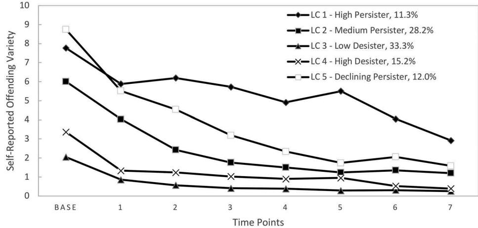

**ISSN: (Print) (Online) Journal homepage: [www.tandfonline.com/journals/rjcj20](https://www.tandfonline.com/journals/rjcj20?src=pdf)**

# **Specific theories of crime? A longitudinal assessment of the competing effects of psychopathy and self-control**

**Sultan Altikriti, Kalliopi Theocharidou & Christopher J. Sullivan**

**To cite this article:** Sultan Altikriti, Kalliopi Theocharidou & Christopher J. Sullivan (2020) Specific theories of crime? A longitudinal assessment of the competing effects of psychopathy and self-control, Journal of Crime and Justice, 43:5, 547-567, DOI: [10.1080/0735648X.2020.1727765](https://www.tandfonline.com/action/showCitFormats?doi=10.1080/0735648X.2020.1727765)

**To link to this article:** <https://doi.org/10.1080/0735648X.2020.1727765>

| + |
|---|
|   |
|   |
|   |

View [supplementary](https://www.tandfonline.com/doi/suppl/10.1080/0735648X.2020.1727765) material

Published online: 25 Feb 2020.

[Submit your article to this journal](https://www.tandfonline.com/action/authorSubmission?journalCode=rjcj20&show=instructions&src=pdf) 

| الاقار التقارير والتقارير والتقارير والتقارير والتقارير والتقارير والتقارير والتقارير والتقارير والتقارير والتقارير والتقارير والتقارير والتقارير والتقارير والتقارير والتقار | Art |
|-------------------------------------------------------------------------------------------------------------------------------------------------------------------------------|-----|
|-------------------------------------------------------------------------------------------------------------------------------------------------------------------------------|-----|

Article views: 1697

View related [articles](https://www.tandfonline.com/doi/mlt/10.1080/0735648X.2020.1727765?src=pdf)

View [Crossmark](http://crossmark.crossref.org/dialog/?doi=10.1080/0735648X.2020.1727765&domain=pdf&date_stamp=25%20Feb%202020) data

Citing [articles:](https://www.tandfonline.com/doi/citedby/10.1080/0735648X.2020.1727765?src=pdf) 2 View citing articles

## Specific theories of crime? A longitudinal assessment of the competing effects of psychopathy and self-control

Sultan Altikrit[i](http://orcid.org/0000-0002-2250-7393) , Kalliopi Theocharidou and Christopher J. Sullivan

School of Criminal Justice, University of Cincinnati, Cincinnati, USA

#### ABSTRACT

The association between psychopathic personality traits (PPTs) and offending behavior has been studied extensively. Self-control also enjoys strong empirical support in its association with antisocial behavior. Further, research has shown that those with higher PPTs and those with lower self-control are more likely to be antisocial and are more likely to have protracted criminal careers. The current study used latent class growth analysis to compare how PPTs and self-control predict membership in longitudinal offending trajectories among an all-male sample of adjudicated delinquents (n = 726) from the Pathways to Desistance data. The results indicated that PPTs predicted membership across the persistent offending and desisting groups more often than self-control. Selfcontrol, however, more often predicted membership within the persistent offending groups. Although both factors were among the most salient predictors of group membership, the results illustrated specific differences in how each factor can influence longitudinal patterns of offending.

#### ARTICLE HISTORY

Received 11 July 2019 Accepted 4 February 2020

#### KEYWORDS Longitudinal; psychopathy; self-control

### Introduction

Psychopathy is a constellation of personality traits associated with serious and chronic antisocial behavior. These traits include, among others, low self-control, callousness, lack of empathy, lack of guilt and remorse, egocentrism, and superficial charm (Hare [1991;](#page-18-0) Glenn et al. [2011\)](#page-17-0). Individuals with psychopathic personality traits (PPTs) display deficient affect; a trait associated with limited emotional depth (Habel et al. [2002](#page-18-1)). The limited ability of individuals bearing these traits to recognize negative emotions, such as sadness and fear, may result in a reduced capacity to feel empathy for others (Soderstrom [2003](#page-20-0)).

Considering the antisocial traits displayed in psychopathic individuals, it is not surprising that they often present long-term social and interpersonal dysfunction (Gretton, Hare, and Catchpole [2004\)](#page-18-2). This social dysfunction is apparent in the overrepresentation of individuals with PPTs in the criminal justice system. More specifically, while the prevalence of psychopathy is approximately 1-2% in the general population, studies show that it could be as high as 25% in the incarcerated population (Hare [1996;](#page-18-3) Hare and Neumann [2008](#page-18-4)). Notably, offenders with PPTs tend to have lengthier criminal careers (Vaughn and DeLisi [2008](#page-20-1)), with earlier onset and more convictions (Blackburn and Coid [1998](#page-17-1); Simourd and Hoge [2000\)](#page-20-2).

In a similar fashion, a number of studies suggest that low self-control is one of the most robust predictors of chronic criminal and antisocial behaviors (Pratt and Cullen [2000](#page-20-3); DeLisi et al. [2018\)](#page-17-2). Gottfredson and Hirschi ([1990](#page-18-5)) seminal work asserts that low self-control, characterized by the traits

CONTACT Sultan Altikriti altikrsn@ucmail.uc.edu School of Criminal Justice, University of Cincinnati, P.O. Box 210389, Cincinnati, OH, USA

Supplemental data for this article can be accessed [here.](https://doi.org/10.1080/0735648X.2020.1727765)

© 2020 Midwestern Criminal Justice Association

of impulsivity, risk-taking behaviors, lack of long-term goals, and lack of consideration for others, is the proximal cause of criminal involvement. Self-control, according to the authors, is a personality trait that remains stable throughout life. As such, individuals with low self-control will exhibit criminal and other analogous behaviors (e.g., smoking, reckless driving) in a consistent fashion throughout their life-course. Undoubtedly, there is an abundance of research on self-control; however, prior studies have mainly concentrated on cross-sectional tests. Only recently there has been a growing interest in testing the stability of self-control against other constructs (Diamond, Morris, and Piquero [2015;](#page-17-3) Barnes et al. [2017](#page-17-4)).

A limitation of previous research that has attempted to parse the unique contribution of PPTs and self-control is the reliance on cross-sectional research designs (DeLisi et al. [2018](#page-17-2)). The first limitation is that although PPTs and self-control may predict behavior cross-sectionally, with developmental changes in the relationship between these concepts and offending over time, the results may differ in a longitudinal study (Burt, Simons, and Simons [2006;](#page-17-5) Pratt et al. [2010](#page-20-4)). The second limitation is the inability to infer causal effects owing to the cross-sectional nature of the research design, where the temporal order of the main independent variables and the offending outcomes cannot be established (DeLisi et al. [2018](#page-17-2)). In the current study, we partially address these limitations by using variables from a baseline survey to predict offending outcomes over a series of follow-up waves to conduct a longitudinal test of the two general theories of crime: self-control and PPTs.

### Background

### Chronic offending

One of the most robust findings in criminological research is that criminal involvement increases during adolescence and early adulthood and decreases thereafter (Moffitt [1993\)](#page-18-6); however, a small percentage of offenders take on patterns marked by a chronic and violent trajectory (Corrado et al. [2015a](#page-17-6)). Empirical studies conducted in the United States and abroad regularly show that a small percentage of offenders are responsible for almost half the crimes committed. Although career criminality is well-documented for a small group of offenders, less is known about the etiology of chronic offending. Using a cohort of nearly 10,000 males, Wolfgang, Figlio, and Sellin [\(1972\)](#page-20-5) found that 6% was responsible for 52% of the total delinquency in their sample. Similarly, the Cambridge study, conducted by Farrington, Coid, and West [\(2009](#page-17-7)), indicated that a minority of the sample (7%) was accountable for the majority (52%) of offenses, and that these men had an average of 10 convictions, were involved in crime longer, had higher offending rates, and exhibited less successful life outcomes by age 48.

Moffitt ([1993](#page-18-6)), in her seminal work on the developmental taxonomies of antisocial behavior, discusses the empirical regularity of adolescent offending. That is, most individuals participate in some delinquency during adolescence, a behavior considered normative. Moffitt ([1993](#page-18-6)) termed these offenders as Adolescence-Limited (AL). However, and as other scholars have observed, Moffitt [\(1993\)](#page-18-6) also indicates the presence of a small group of offenders, labeled Life-Course-Persistent (LCP) offenders, who diverge from this pattern. LCP offenders begin their antisocial behavior earlier in life and continue their criminal involvement beyond adolescence. Moffitt [\(1993\)](#page-18-6) proposes different etiologies for the antisocial behaviors manifested in these two taxa. More specifically, AL offenders are 'trapped in a maturity gap, [and are] chronological hostages of a time warp between biological age and social age' (687). LCP offenders, on the other hand, are afflicted with developmental challenges (e.g., neuropsychological deficits and psychopathology), in combination with early family-related adversity. Research indicates that this small cadre of LCP offenders experience more severe mental health problems, symptoms of antisocial personality disorder, higher scores of neuroticism and callousness, and higher PPTs and low self-control (Moffitt et al. [2002\)](#page-19-0). These individuals are also involved in more serious and violent offenses and have higher conviction rates as adults (Moffitt et al. [2002\)](#page-19-0).

The etiologies of long-term offending and persistent antisocial behavior are still unclear. Risk factors previously identified include weak social bonds, antisocial peers, victimization, and drug and alcohol use (Savage, Ellis, and Kozey [2013](#page-20-6)). In addition to these risk factors, PPTs and low self-control have also been linked to stable patterns of offending and antisocial behavior from adolescence to adulthood (Vaughn and DeLisi [2008;](#page-20-1) DeLisi et al. [2018](#page-17-2)). Career criminality is used to describe offenders who engage in serious offenses, have high rates of offending, and offend for a longer period of time (Blumstein, Cohen, and Farrington [1988](#page-17-8)). Blumstein, Cohen, and Farrington [\(1988\)](#page-17-8) emphasize that the concept of career criminality is not a theory of crime, as it does not specify the causal factors of criminal behavior. However, identifying the characteristics of career criminality could be beneficial in understanding the etiology of long-term criminal involvement and could provide potential avenues for crime prevention. Empirical research has indicated that both psychopathy and low self-control are strong predictors of persistent, violent criminal careers.

#### Psychopathic personality traits

Individuals with PPTs are not only more likely to offend but are also more likely to commit violent and predatory crimes (Jones et al. [2006;](#page-18-7) Shaw and Porter [2012\)](#page-20-7). Although not all individuals with higher PPTs exhibit aggressive and violent behavior, individuals with such traits are disproportionately involved in violence (McCuish et al. [2015\)](#page-18-8), with evidence indicating that psychopathic offenders are responsible for approximately 50% of all violent crimes committed (Reidy, Shelley-Tremblay, and Lilienfeld [2011\)](#page-20-8). In addition to an increased risk for violent behavior, offenders with PPTs are also more likely to recidivate (Lynam et al. [2007](#page-18-9); Pedersen et al. [2010\)](#page-19-1). Approximately 80% of offenders with high PPTs scores have a violent reconviction, compare to 20% for non-psychopathic offenders (Harris, Skilling, and Rice [2001](#page-18-10); Gretton et al. [2001\)](#page-18-11).

The stability and rate of offending exhibited by psychopathic offenders have led some to suggest that career criminality and psychopathy theoretically overlap. For example, Vaughn and DeLisi ([2008](#page-20-9), 39) argue, 'researchers that investigated criminal careers and researchers that investigated psychopathy have arrived at the same general conclusion: a small cadre of extremely antisocial, violent, and criminal persons is responsible for most of the incidence of crime.' Supporting this contention, Hare ([1988](#page-18-12)) found that offenders with PPTs commit more crime, have longer criminal careers, and spend more time in prison than non-psychopathic offenders between the ages of 16 and 40, corroborating studies that suggest long-term stability in offending for those with PPTs.

In a similar vein, Hemphill et al. [\(1998\)](#page-18-13) investigated how well PPTs can predict recidivism and career criminality using a sample of 247 Canadian offenders. The results suggest that psychopathy is a strong predictor of both recidivism and severity of criminal involvement. Vaughn and DeLisi [\(2008\)](#page-20-1) found that offenders with PPTs had an excessive likelihood to belong to the career criminal classification compared to offenders without such traits. Lynam, Loeber, and Stouthamer-Loeber ([2008](#page-18-14)) utilized the Pittsburg Youth Study to examine whether other criminologically-relevant variables (e.g., demographics, parenting, peers, individual differences) moderate the stability of PPTs from age 13 to age 24. Their findings suggest that PPTs are fairly stable between 13–24, and this stability is not influenced by other correlates. DeLisi [\(2009\)](#page-17-9) argues that if PPTs are stable characteristics of antisocial individuals, 'it is likely to emerge as a central construct in the longitudinal study of offending over the life-span one with utility for understanding maladaptive behaviors among adults, adolescents, and children'.

#### Low self-control

Self-control is one of the most widely tested predictors of criminal and antisocial behavior (Pratt and Cullen [2000\)](#page-20-3). Since it was first introduced, the construct has been subjected to extensive empirical examination, with different designs, diverse samples, and age groups (DeLisi et al. [2018](#page-17-2); Pratt and Cullen [2000\)](#page-20-3). Prior studies suggest a strong empirical link between low self-control and various

criminal and antisocial acts and behaviors (Pratt and Cullen [2000](#page-20-3)), such as homicide (Piquero et al. [2005\)](#page-19-2), sexual offending (Clevenger, Navarro, and Jasinski [2016\)](#page-17-10), gang violence (Olate et al. [2015](#page-19-3)), and property offenses (Piquero and Tibbetts [1996;](#page-20-10) DeLisi [2001](#page-17-11)).

Gottfredson and Hirschi's ([1990](#page-18-15)) theoretical postulation asserts that self-control is a personality trait stable after childhood. Given the opportunity, individuals with low self-control will exhibit antisocial behaviors throughout their life spans; thus, low self-control could explain stability in offending. This premise has been subjected to empirical scrutiny, with studies providing mixed results. Steinberg et al. ([2008\)](#page-20-11) conducted a cross-sectional study of individuals ages 10 to 30 and found that impulsivity – a dimension of self-control – was at its highest at age 10, and steadily declined with older age. Risk-seeking was at its highest during adolescence and decreased during adulthood. Burt, Sweeten, and Simons [\(2014](#page-17-12)) tested the stability of risk-seeking and impulsivity – two dimensions of the self-control construct – using group-based trajectory modeling and a sample of individuals ages 10 to 25. The results show weak support for the stability thesis. Notably, Burt et al. [\(2014](#page-17-12)) also find different developmental patterns for impulsivity and risk-seeking, which has implications for criminal behavior. These results suggest that the self-control construct is not unidimensional, and that there is a need to disaggregate these two dimensions (Burt, Sweeten, and Simons [2014](#page-17-12)).

A meta-analysis conducted by Pratt and Cullen ([2000](#page-20-3)) provides substantial empirical support on the relationship between self-control and crime; however, the meta-analysis shows higher effects sizes for cross-sectional studies compared to longitudinal studies. The authors emphasize that their analysis does not provide empirical support for Gottfredson and Hirschi's [\(1990\)](#page-18-15) postulation that selfcontrol is a stable trait throughout the life-course. Thus, while low self-control is undoubtedly associated with antisocial behavior and criminal involvement, it is less clear how this trait influences chronic offending.

### Psychopathy versus self-control

While studies show that both personality constructs of PPTs and self-control are associated with an increased risk of criminal offending, there has been little effort to compare these two constructs in the same study (DeLisi et al. [2018](#page-17-2)). A study conducted by DeLisi et al. ([2018](#page-17-2)) aiming to bridge that gap found that low self-control had a significant relationship with violent offending, property offending, self-reported delinquency, and victimization. Although prior studies have suggested a relationship between psychopathy and violence, results from DeLisi et al. [\(2018\)](#page-17-2) show null results for psychopathy and violent offending. In line with previous studies and theoretical postulations, DeLisi et al. ([2018](#page-17-2)) found a positive relationship with psychopathy, low self-control, and chronic, serious criminal involvement (although the authors underscore that the effect sizes varied across outcome variables). As the study was cross-sectional, DeLisi et al. [\(2018\)](#page-17-2) call for future research that would overcome this limitation.

Although studies have investigated the link between PPTs and offending trajectories over time (e.g., Corrado et al. [2015b](#page-17-13); Dyck et al. [2013](#page-17-14); McCuish et al. [2014](#page-18-16); Piquero et al. [2012\)](#page-19-4), they used official arrest data as the outcome, which reflects differences in official apprehension rather than behavior, resulting in potentially downwardly biased offending trajectories. Moreover, some used community samples (e.g., Piquero et al. [2012\)](#page-19-4), limiting the proportion of individuals high in PPTs and chronic offending trajectories. The current study addresses these limitations by using latent class growth analysis to classify at-risk offenders using self-reported offending trajectories and using PPTs to predict the probability of group membership.

Considering the violent nature of offenders with PPTs, the study of psychopathy and stability of offending sheds light on the etiology of long-term offending patterns. As Vaughn and DeLisi [\(2008\)](#page-20-1) argue, prior studies on persistent and long-term offending have produced groups whose characteristics resemble those of individuals with high PPTs (e.g., early behavioral problems, juvenile delinquency, offending versatility), yet despite this theoretical overlap, studies have neglected the construct of psychopathy. As career criminality and psychopathy theoretically converge, psychopathy could provide a framework for better understanding the stability of offending over time. A longitudinal head-to-head comparison can provide a better understanding of the two constructs and how they influence longitudinal patterns of offending.

### The current study

There is an extensive literature for both concepts of psychopathy and self-control as predictors of offending and antisocial behavior. Given the similarity of these concepts, recent studies have assessed the impact of both on offending, contrasting their predictive power (DeLisi et al. [2018\)](#page-17-2). The current study extends this literature by assessing the impact of self-control and PPTs on the longitudinal patterns of offending. With mixed evidence on the stability of self-control and psychopathy over time, the effects of these concepts on offending may reveal different results when analyzed longitudinally rather than cross-sectionally. With this backdrop, our research question is: which construct is a better predictor of offending trajectories over time?

### Methods

### Analytic sample

The current study used data from the baseline survey and all subsequent waves in the Pathways to Desistance research project (see Mulvey, Schubert, and Piquero [2014](#page-19-5); Mulvey et al. [2010](#page-19-6)). The initial six waves of data collection took place every six months, accounting for three years of the study, and annually thereafter for four additional waves (See Schubert et al. [2004](#page-20-12)). To keep the recall periods uniform across all waves of data collection, we merged the shorter, six-month waves (waves 1 and 2, waves 3 and 4, and waves 5 and 6) to create eight successive one-year data collection periods from baseline to the final data collection period (see Gann, Sullivan, and Ilchi [2015;](#page-17-15) Monahan, Steinberg, and Cauffman [2009;](#page-19-7) Piquero et al. [2013](#page-19-8)).

We excluded females (n = 184) in line with previous research using this data, and other studies that have conducted LCGA on male-only samples (e.g., Huang et al. [2010;](#page-18-17) Kreuter and Muthén [2008\)](#page-18-18)[.1](#page-16-0) With the inclusion of two time-varying independent variables, delinquent peers and time at risk, 38% percent of the sample had missing variables across any of the waves. We address this by the list-wise exclusion of participants missing on the independent variables (n = 444)[.2](#page-16-1) We do not exclude on missingness for the dependent variable, following the recommendation of Nagin ([2005](#page-19-9)), using full-information maximum likelihood (FIML) to estimate results. Analyses using FIML generally yield comparable results to analyses using multiple imputation (Collins, Schafer, and Kam [2001\)](#page-17-16). The final analytic sample included n = 726 participants.

The age of the current sample ranged from 14 to 25 years old from the baseline to the last wave of interviews encompassing the majority of adolescence and emerging adulthood. Research has revealed that offending increases during early adolescence, peaks between the ages of 15 and 19, and sharply decreases when individuals reach their early 20s (Piquero, Farrington, and Blumstein [2007\)](#page-19-10). Therefore, although our sample does not have a follow-up period stretching into late adulthood, it captures the peak of the age-crime curve and a few years after. A benefit of using the Pathways data is that the sample resembles that of DeLisi et al. ([2018](#page-17-2)), who also assessed the effects of self-control and PPTs on offending, lending credibility to comparisons across these studies.

#### Measures

### Response variable

The response variable used in the current study is the variety of self-reported offending and analogous behavior. The variety of offending measure is the sum of the total categories of offending committed out of 22 categories in the Pathways data. To measure crime, the Pathways investigators used the Self-Report of Offending (SRO) measure for antisocial and illegal activities (see Huizinga, Esbensen, and Weiher [1991](#page-18-19)). We followed Mulvey et al. ([2010](#page-19-6)) in using the variety of crime measure over frequency for several reasons. First, to add another dimension to the desistance measure other than simple offense counts. Second, a variety score was used to mitigate the effects of offending outliers and reduce skewness. Third, a variety score is more reliable than a frequency score due to recall bias due to the difficulty of accurately recalling frequency compared to occurrence. Finally, a variety score gives equal weight to all crime types as compared to frequency scores, which overweigh less serious offending (see Elliott and Huizinga [1989\)](#page-17-17).

### Key predictors

The Hare Psychopathy Checklist: Youth Version (PCL:YV) was used as a measure for psychopathic personality traits (Forth, Kosson, and Hare [2003](#page-17-18)). The PCL:YV is designed to assess psychopathy in individuals ages 12 to 18 (Corrado et al. [2004](#page-17-19)). Although the PCL:YV is based on the Hare Psychopathy Checklist: Revised (PCL:R), the tool has been modified to reflect developmental functioning in adolescents (Neumann et al. [2006](#page-19-11)). The developers of the PCL:YV recommend 60–90 minute, semi-structured interviews to collect all required information. However, the Pathways to Desistance study was not able to accommodate lengthy interviews for the assessment of psychopathy. Given time restrictions, the researchers incorporated all questions from the PCL:YV interview guide into the Pathways baseline interview battery. The researchers used an open-ended format (as recommended by the developers of the PCL:YV; Forth, Kosson, and Hare [2003\)](#page-17-18) for nearly all questions. In addition, the researchers had access to file information such as court records and parent collateral interviews. The researchers combined information from interviews, collateral interviews, and court records in order to complete the PCL:YV rating. The researchers rated their version the same way as the original PCL:YV (i.e., 3-point ordinal scale, 0 = item does not apply to the youth, 1 = item applies to a certain extent, and 2 = item applies to the youth). These 20 items produced a 3-factor model, with satisfactory model fit (i.e., CFI = .94, TLI = .92, RMSEA = .06), and a 4-factor model that also had a good model fit (i.e., CFI = .92, TLI = .89, RMSEA = .06). The CFA was conducted only on the male sample (n = 1,170). Additionally, the Pathways interviewers underwent comprehensive training prior to administering the PCL:YV. Analyses of the PCL:YV exhibited a good intraclass correlation coefficient (ICC = .91) and good internal consistency (α score = .87).

Although several factors are encompassed under the PCL measure (see Neumann et al. [2006\)](#page-19-11), we use a unitary construct due to the high correlation between the two factors available in the Pathways (r = .55, p < .001) and several data restrictions. Specifically, although Forth, Kosson, and Hare [\(2003\)](#page-17-18) found support for a bifactorial PCL structure, the PCL-YV used in the Pathways has not replicated this finding. Instead, a 3- or 4-factor model best fit these data (Jones et al. [2006](#page-18-7)). We, therefore, retain the unitary construct given that this is the only available alternative in the Pathways data. This unitary construct is the sum of the 20 items, 8 items from factor 1, 9 items from factor 2, and 3 items that are not classified and therefore not included in the factor scores. These were summed to construct the final continuous measure, ranging from 0 to 36 (M = 15.96, SD = 7.53) with higher scores indicating higher levels of PPTs.

Self-control and impulsivity enjoy strong empirical support regarding their association to offending (see Pratt and Cullen [2000\)](#page-20-3). These personality traits are also purported to influence offending over the life course (Gottfredson and Hirschi [1990](#page-18-5); Nagin and Paternoster [2000](#page-19-12)). It is crucial that studies focusing on personality traits and longitudinal offending patterns control for effects of selfcontrol. The most critical element of self-control is impulsivity (Diamond, Morris, and Piquero [2015\)](#page-17-3), exemplified by findings that show impulsivity and self-control exhibit substantively similar longitudinal trajectories (Burt, Sweeten, and Simons [2014](#page-17-12)). Self-control was measured using a mean of the responses from False (= 1) to True (= 5) for eight questions tapping into impulsive actions (e.g., 'I say the first thing that comes into my mind without thinking enough about it'). The measure was coded from low impulse control (1) to high control (5) (M = 2.96, SD = .95) and exhibited adequate internal consistency (α = .76; Pathways Research Team).

### Covariates

Although it is impractical to include all possible covariates that influence offending trajectories, several measures across multiple domains of individual traits and characteristics, social contexts, and demographic variables were included as controls in the current study. Using the broad array of measures in the current study allows us to extricate the personal, contextual, and demographic predictors of offending trajectories, with a specific focus on PPTs and self-control as unique predictors. The Wechsler Abbreviated Scale of Intelligence (WASI) scale vocabulary and reasoning score was used as a covariate in the current study. Moffitt [\(1993\)](#page-18-6) proposed that neuropsychological deficits, in conjunction with adverse home environments, predispose individuals to protracted criminal careers and other negative outcomes. Subsequent studies have affirmed this proposition (Lynam, Moffitt, and Stouthamer-Loeber [1993;](#page-18-20) Moffitt [2006;](#page-19-13) Moffitt et al. [2002](#page-19-0); Moffitt, Lynam, and Silva [1994](#page-19-14)). The WASI scale was used to address confounding and to isolate the effect of PPTs from those of neurological deficits. As a measure of intelligence, the average WASI score of the sample was 80.21 (SD = 17.95) with a range of 40 to 131 (see [Table 1\)](#page-7-0). The scale is made of 42 items measuring the vocabulary score and 35 measuring the reasoning score (Wechsler [1999\)](#page-20-13)[.3](#page-16-2) Routine activities can affect exposure to offending opportunities and participation (Sherman, Gartin, and Buerger [1989](#page-20-14)) and research on the spatial distribution of crime indicates that opportunities and offending hotspots can be spatially concentrated over time (Weisburd, Morris, and Groff [2009\)](#page-20-15), influencing longitudinal patterns of offending. The four-item routine activities scale was framed from the Monitoring the Future Questionnaire and is intended to measure the frequency of unstructured socialization with peers (Osgood et al. [1996](#page-19-15)). With questions like 'How often did you get together with friends informally?', respondents had five Likert scale responses ranging from (1) Never to (5) Almost every day (M = 3.86, SD = 0.84). The routine activities scale displayed adequate internal consistency at baseline and subsequent waves (baseline α = .69). Neighborhood condition, a measure of neighborhood social and physical disorder, was used in the current study to control for neighborhood effects on the participant (Sampson and Raudenbush [1999\)](#page-20-16). A 21-item scale reflecting graffiti, litter, social disorder (public arguments and fights), and public drug use was used. Participants indicated how often then witnessed these indicators of social disorder, ranging from (1) Never to (4) Often (M = 2.35, SD = .753). Socioeconomic status was measured through parental education of biological mother and father (see Juhn et al. [2011](#page-18-21)) on a scale from 1 to 6, where higher values reflect lower levels of education. Age of the participants ranged from 14 to 19 at the time of the initial data

| Table 1. Descriptive Statistics of the variables in the analysis. Measures |       |       | Range    |
|-------------------------------------------------------------------------------|-------|-------|----------|
|                                                                               | M     | SD    |          |
| PPTs (PCL-YV)                                                                 | 15.69 | 7.53  | 0 – 36   |
| Scale of Intelligence                                                         | 80.21 | 17.95 | 40 – 131 |
| Impulsivity                                                                   | 2.93  | 0.93  | 1 – 5    |
| Routine Act                                                                   | 3.86  | 0.84  | 1 – 5    |
| Neighborhood                                                                  | 2.31  | 0.71  | 1 – 4    |
| Parent Education                                                              | 4.30  | 0.93  | 1 – 6    |
| Age                                                                           | 16.03 | 1.15  | 14 – 19  |
| White                                                                         | 0.22  | -     | -        |
| Black                                                                         | 0.39  | -     | -        |
| Hispanic and other                                                            | 0.39  | -     | -        |
|                                                                               |       |       |          |
| Time-Varying Covariates                                                       |       |       |          |
| (average across 8 waves)a Peer Influence                                   | 1.51  | 0.70  | 1 – 5    |
| Time at Risk                                                                  | 0.64  | 0.40  | 0 – 1    |
| Crime Variety                                                                 | 2.14  | 2.97  | 0 – 21   |

Notes. n = 726; a For space considerations, the averages of the time-varying covariates across the waves are listed.

collection. Three dichotomous race variables were included in the analysis encompassing White (22%), Black (39%), and Hispanic/other (39%).[4](#page-16-3)

The current study included two time-varying covariates in the modeling process: Peer Influence and Time at Risk. Prior studies have supported the association between delinquent peer influence on delinquent behavior (see Steinberg and Monahan [2007](#page-20-17)). Peer influence was measured as the mean of 19 questions with 5-point Likert scale responses regarding the prevalence of antisocial behavior among peers (e.g., 'How many of your friends have sold drugs?') and antisocial influence from peers (e.g., 'How many of your friends have suggested that you should sell drugs?'). Responses ranged from (1) None of them to (5) All of them. Descriptive statistics indicated that the participants did not have high delinquent peer association average across waves (M = 1.51, SD = 0.70, α = .94). Additionally, research has shown that time at risk, as measured by time in the community, predisposes individuals to more offending risk (Piquero et al. [2001](#page-19-16)). Being in the community can influence offending patterns by exposing participants to more offending opportunity and unstructured time or, conversely, being in confinement restricts participants to a controlled environment with limited offending opportunity. The current study includes time at risk as measured by the proportion of time spent in the community measured at each wave throughout the data collection period (M = .64, SD = .40).

### Analytic strategy

Latent class growth analysis (LCGA) was used in the current study to estimate the effects of PPTs, selfcontrol, and theoretically relevant covariates on longitudinal patterns of offending (Nagin [2005](#page-19-9); Nagin and Land [1993\)](#page-19-17). Latent class growth analysis results in discrete groupings of trajectories that are more tractable for analysis and interpretation. Although the resulting trajectories are approximated clusters of individuals who follow similar developmental trajectories (Nagin [1999](#page-19-18), [2005\)](#page-19-9), LCGA is used to extract a discrete approximation of more complex and nuanced patterns of reality (Nagin [1999;](#page-19-18) Sullivan and Piquero [2011\)](#page-20-18).

Latent class growth analysis in Mplus was used to estimate four unique models ranging from three to six trajectory groups. Mplus uses multinomial regression to produce the maximum likelihood estimates for the model parameters (see Jung and Wickrama [2008\)](#page-18-22). This allowed for the estimation of the effects of PPTs and self-control in predicting trajectories of offending, net of theoretically relevant covariates.[5](#page-16-4) These models were constructed using the outcome variable SRO variety measure, conditioned on the time-varying covariates, peer influence and time at risk, PPTs, self-control, and covariates. The initial task of establishing trajectories is both a qualitative and quantitative process. Nagin [\(2005\)](#page-19-9) recommends a combination of diagnostic statistics and the relevance and clarity of the models as evaluative tools in choosing the most appropriate model. Once the models were estimated, we assessed the fit of the models according to the criteria suggested by Nagin [\(2005\)](#page-19-9) and chose a final model that best fit these criteria, represented the underlying data, and facilitated the explication of the estimated results.

### Results

The variety SRO measure was not normally distributed, with more zeros than under the Poisson assumption, prompting us to use a zero-inflated Poisson distribution (Jones, Nagin, and Roeder [2001;](#page-18-23) Lambert [1992](#page-18-24)). When estimating the trajectories, we used both a quadratic and cubic function and retained the cubic function as the larger, significant polynomial in line with other studies using these data (Gann, Sullivan, and Ilchi [2015;](#page-17-15) Mulvey et al. [2010](#page-19-6)). [Table 2](#page-9-0) displays the diagnostics for each of the four models, ranging from a three-group (k = 3) model to a six-group model (k = 6). For each model, the sample-adjusted Bayesian information criterion (BIC), 'entropy' statistic, Lo-Mendell-Rubin (LMR) test, and mean latent class probabilities (LCP) are listed. These criteria, along with a qualitative examination of the resulting trajectories, were used in selecting the best fitting model.

| Latent Classes (k) | Sample-adjusted BIC | Entropy | LMR (p)        | Mean LC probabilities                    |
|-----------------------|------------------------|---------|----------------|------------------------------------------|
| 3                     | 20,056.61              | 0.859   | 565.427 (0.00) | 0.942, 0.932, 0.940                      |
| 4                     | 19,880.45              | 0.875   | 221.528 (0.03) | 0.932, 0.922, 0.923, 0.937               |
| 5                     | 19,764.72              | 0.815   | 161.744 (0.36) | 0.815, 0.939, 0.930, 0.921, 0.861        |
| 6                     | 19,635.54              | 0.802   | 175.058 (0.07) | 0.962, 0.868, 0.831, 0.813, 0.933, 0.892 |

Table 2. Fit statistics for 3- to 6-group LCGA models.

Notes. Group models were estimated using a cubic function; LMR = Lo–Mendell–Rubin index.

The results indicated that the BIC decreases systematically as the number of groups increases, indicating that, as expected, more groups provided a better fit (Nylund, Asparouhov, and Muthén [2007\)](#page-19-19). All models had minimum odds of correct classification above 5 for all groups, exceeding the recommended cutoff by Nagin ([2005](#page-19-9)). Additionally, the 'entropy' statistic suggested distinct placement into latent classes in all estimated models with adequate estimates ranging from .802 to .875 (Vermunt and Magidson [2005\)](#page-20-19). Furthermore, the Lo-Mendell-Rubin (LMR) test was used to compare each model to a more parsimonious model with k 1 latent classes. Significant results would indicate support for the more complex model (k) over the more parsimonious model (k – 1; Nylund, Asparouhov, and Muthén [2007](#page-19-19)). The LMR test rejected model 5 (k) in favor of the more parsimonious model 4 (k – 1); however, further inspection of the trajectories in models 4 and 5 indicated that the more parsimonious model 4 risked obfuscating a unique offending trajectory by assimilating it with the others. The LMR test also rejected model 6 for the more parsimonious model 5. Using these criteria, models 4 and 5 seemed the most appropriate as the final model.

To settle on a final model, we relied on a recommendation by Nylund, Asparouhov, and Muthén ([2007](#page-19-19)), using the bootstrapped likelihood ratio test (BLRT) to compare each model (k to k – 1). Similar to the LMR, the BLRT estimates the log likelihood difference distribution, providing a p-value that can be used to reject the null that k is not a better fit than k 1. The increase in model fit between the two comparison models indicated that model 5 is significantly a better fit compared to model 4 (H0 Loglikelihood Value = −9820.795; p < .001). Given these results, we followed Mulvey et al. ([2010](#page-19-6)) in choosing a five-group model as the optimal model. This choice was made due to the diagnostic criteria above and to avoid the unjustified assimilation of Latent Class 1 (11.3% of the sample) and Latent Class 5 (12%), which follow similar but diverging trajectories (see [Figure 1\)](#page-9-1). Although merging somewhat similar groups may be more parsimonious and facilitate comparisons across groups, it risks obfuscating real differences in trajectories and etiology.[6](#page-16-5)

Figure 1. Five-group unconditional trajectory model.

### Identification of latent classes

With the five latent class trajectories estimated in model 5, two broader patterns emerge. First, of the five latent classes, two desisted or hovered near desistance after a decline from the initial offending frequency at baseline (see [Figure 1](#page-9-1)). We refer to these as 'desisters' with a qualifying descriptor corresponding to their initial level of baseline offending.[7](#page-16-6) Second, three latent classes, accounting for nearly half of the sample, persisted in offending throughout the data collection period. These classes, termed 'persisters' for their protracted offending trajectories, are of central interest in the current paper and regarding the continuity of offending. To differentiate between persister groups, we apply additional descriptive terms corresponding to the initial level of offending and the shape of their trajectories over the data collection period, which are described below. The results section is organized to facilitate the discussion and comparison of these groups, reflecting the contrast between the persister and desister groups and within the persister group (see [Table 3\)](#page-10-0). Regarding the classification of groups, it is noteworthy that although different in some respects, the patterns observed in the current study resemble other patterns observed using these methods with the same data. Gann, Sullivan, and Ilchi [\(2015\)](#page-17-15), for example, arrive at four trajectories whereas Mulvey et al. ([2010](#page-19-6)) arrive at five. Overall, however, the patterns are similar across both studies and corroborate our findings on the existence of two main groupings: the desister and persister groups.

### Desisters

Latent Classes 3 and 4 were labeled 'low desister' (33.3% of the sample) and 'high desister' (15.2%), respectively, to distinguish them by initial offending rates. These groups, together comprising 48.5% of the sample, followed near-indistinguishable trajectories but for the higher offending level and delayed desistance for the high desister group. That is, the low desister group desisted almost entirely

|                     |               | High Desister |                   | Low Desister  |                   |
|---------------------|---------------|---------------|-------------------|---------------|-------------------|
| Reference Group     |               | b[SE]         | OR[CI]            | b[SE]         | OR[CI]            |
| Medium Persister    | PPTs          | −0.017[0.04]  | 0.983[0.91,1.06]  | −0.121*[0.04] | 0.886[0.81,0.97]  |
|                     | Self-control  | 0.160[0.26]   | 1.174[0.71,1.95]  | 0.563[0.29]   | 1.756[1.00,3.09]  |
|                     | Intelligence  | −0.017[0.02]  | 0.983[0.95,1.01]  | −0.008[0.01]  | 0.992[0.97,1.02]  |
|                     | Neighborhood  | 0.588[0.39]   | 1.800[0.84,3.88]  | −0.067[0.42]  | 0.935[0.41,2.14]  |
|                     | Age           | −0.482[0.27]  | 0.618[0.37,1.04]  | −0.246[0.29]  | 0.782[0.44,1.39]  |
|                     | Parent Edu.   | −0.339[0.33]  | 0.712[0.38,1.35]  | 0.003[0.26]   | 1.003[0.61,1.66]  |
|                     | Routine Acts. | −0.310[0.35]  | 0.733[0.37,1.45]  | −0.696[0.41]  | 0.499[0.22,1.12]  |
|                     | Black         | −0.418[0.65]  | 0.658[0.19,2.34]  | 0.463[0.44]   | 1.589[0.67,3.79]  |
|                     | White         | 0.958[0.65]   | 2.606[0.73,9.30]  | 0.562[0.62]   | 1.754[0.52,5.96]  |
| Declining Persister | PPTs          | −0.083*[0.04] | 0.920[0.86,0.99]  | −0.187*[0.05] | 0.829[0.76,0.91]  |
|                     | Self-control  | 0.910*[0.32]  | 2.484[1.32,4.66]  | 1.313*[0.37]  | 3.717[1.79,7.72]  |
|                     | Intelligence  | −0.031[0.02]  | 0.969[0.94,1.00]  | −0.021[0.02]  | 0.979[0.95,1.01]  |
|                     | Neighborhood  | 0.020[0.40]   | 1.020[0.47,2.22]  | −0.635[0.38]  | 0.530[0.25,1.12]  |
|                     | Age           | −0.176[0.27]  | 0.839[0.49,1.43]  | 0.060[0.24]   | 1.062[0.66,1.71]  |
|                     | Parent Edu.   | −0.172[0.34]  | 0.842[0.43,1.64]  | 0.171[0.25]   | 1.186[0.72,1.95]  |
|                     | Routine Acts. | −0.173[0.38]  | 0.841[0.40,1.77]  | −0.559[0.39]  | 0.572[0.26,1.24]  |
|                     | Black         | 1.161[0.83]   | 3.193[0.63,16.21] | 2.043*[0.68]  | 7.714[2.04,29.19] |
|                     | White         | 0.612[0.70]   | 1.844[0.47,7.29]  | 0.216[0.59]   | 1.241[0.39,3.92]  |
| High Persister      | PPTs          | −0.049[0.03]  | 0.952[0.89,1.01]  | −0.153*[0.04] | 0.858[0.79,0.93]  |
|                     | Self-control  | 0.234[0.24]   | 1.264[0.80,2.01]  | 0.637*[0.29]  | 1.891[1.06,3.36]  |
|                     | Intelligence  | −0.035*[0.01] | 0.966[0.94,0.99]  | −0.025*[0.01] | 0.975[0.96,0.99]  |
|                     | Neighborhood  | 0.133[0.35]   | 1.142[0.58,2.25]  | −0.522[0.32]  | 0.593[0.32,1.11]  |
|                     | Age           | −0.154[0.22]  | 0.857[0.56,1.31]  | 0.081[0.17]   | 1.084[0.78,1.52]  |
|                     | Parent Edu.   | −0.534[0.30]  | 0.586[0.32,1.06]  | −0.192[0.18]  | 0.825[0.58,1.18]  |
|                     | Routine Acts. | −0.222[0.29]  | 0.801[0.46,1.41]  | −0.608*[0.29] | 0.544[0.31,0.95]  |
|                     | Black         | −1.116[0.64]  | 0.328[0.09,1.15]  | −0.234[0.39]  | 0.791[0.37,1.69]  |
|                     | White         | 0.169[0.57]   | 1.184[0.39,3.63]  | −0.227[0.46]  | 0.797[0.33,1.95]  |

Table 3. Maximum Likelihood Estimates with Zero-Inflated Poisson (ZIP) – Persisters Versus Desisters.

Notes. PPTs = The Psychopathy Checklist: Youth Version (PCL-YV); n = 726; \*p < 0.05.

from any self-reported criminal activity after wave 3, while the high desister group converged with the low desister group nearing the final wave. These two groups were low in offending variety levels relative to the other trajectories and seem to follow Moffitt's [\(1993\)](#page-18-6) designation for the adolescent limited (AL) offenders, displaying a significant downward slope in offending trajectory (p < .05) in late adolescence and early adulthood.

### Persisters

Three persister classes emerged in model 5. Latent Class 5, the 'declining persister' group (12% of the sample), had the highest level of offending at baseline, with a steady decline in offending throughout the data collection period. This group remained high in offending variety toward the end of the study period relative to the other groups, with the exception of Latent Class 1, the 'high persister' group (11.3%). The high persister group had a high offending rate at baseline and exhibited a slow, intermittent decline in offending. After the first wave, this group became the highest offending group for the remainder of the data collection period. Latent Class 2, the 'medium persister' group (28.2%), had initial offending levels midway between the desister and persister groups and had a reduction in offending rates until wave 4, stabilizing thereafter. These three classes, comprising 51.5% of the sample, exhibited trajectory slopes that stabilized, as with the medium persister group, or diminished in the magnitude, as with the high persister and declining persister groups[.8](#page-16-7)

### Predictors of latent class membership

### Medium persister group

The medium persister group had lower initial offending rates than the other persister groups, but higher rates than the desister groups, and a stabilizing offending pattern toward the second half of the data collection period. This group showed no significant differences from the high desister group regarding the predictor variables in the model. That is, none of the variables included in the model differentially predicted membership in either trajectory. Additionally, they followed a similar trajectory with the exception of the high desister group desisting by the end of the data collection period. In contrast to the high desister group, PPTs were the only significant predictors of group membership for the low desister group in reference to the medium persister group (OR = .886, p < .05). Results indicated that a one unit increase in PPTs corresponded to nearly 11.4% decrease in the relative odds of belonging in the medium persister relative to the low desister group. None of the other factors differentially predicted group membership between the medium persister and the two desister groups.

### Declining persister group

In reference to the declining persister group, PPTs significantly predicted membership for both the high desister (OR = .920, p < .05) and the low desister (OR = .829, p < .05) groups. Self-control also significantly differentiated odds of membership in the high desister (OR = 2.484, p < .05) and the low desister (OR = 3.717, p < .05) groups. This indicated that those with less self-control are more likely to be in the declining persister group than either of the desisting groups. Additionally, being Black predicted greater likelihood of membership into the low desister group in reference to the high persisting group, with the Hispanic/Other category as the reference group (OR = 7.714, p < .05).

### High persister group

The high persister was only differentiated from the high desister group by the intelligence measure, although numerous factors differentiated it from the low desister group. Higher intelligence

corresponded with greater odds of membership into the high persister group relative to the high desister (OR = .966, p < .05) and the low desister groups (OR = .975, p < .05). Regarding PPTs, only the low desister group membership was distinguished (OR = .858, p < .05) from the high persister group. That is, having a one unit increase in PPTs resulted in nearly a 14% reduction in the relative odds of membership in the low desister group relative to the high persister group. The high desister group, on the other hand, had a non-significant 4.8% decrease in the odds of membership relative to the high persister group for each unit increase in PPTs (OR = .952). Self-control was also a significant predictor of between the high persister group and the low desister group (OR = 1.891, p < .05). In addition to PPTs and self-control, intelligence (OR = .975, p < .05) and routine activities (OR = .544, p < .05) both predicted membership into the low desister group in reference to the high persister group.

### Differences between persisters

[Table 4](#page-12-0) displays a comparison between the persister groups. The results indicated that PPTs no longer a significant predictor of group membership between the three persister groups. The medium persister group scored higher than those in the declining persister group on self-control, however (OR = 2.117, p < .05). Conversely, those with higher self-control had a decreased likelihood of membership in the high persister group over the declining persister group (OR = .509, p < .05). There was no difference between the medium persister and high persister groups in levels of self-control. Neighborhood condition predicted group member in both the declining persister group (OR = .567, p < .05) and the high persister group (OR = .634, p < .05) in reference to the medium persister group, where those in less disorderly neighborhoods were more likely to be in the medium persister group relative to the higher persister groups. Being Black also predicted group membership among the persistent trajectories in reference to the Hispanic/ others group. Specifically, being Black predicted a reduced likelihood of group membership in the high persister group in comparison with the medium persister (OR = .498, p < .05) and declining persister (OR = .103, p < .05) groups. In reference to the declining persister group, being Black predicted an increased likelihood of membership in the medium persister group (OR = 4.855, p < .05).

### Comparison of relative strength

Self-control and PPTs were both robust predictors of group membership. To assess the relative strength of the relationship between self-control, PPTs, and group trajectories, we partially standardized the

|                     |               |               | Medium Persister | Declining Persister |                  |  |
|---------------------|---------------|---------------|------------------|---------------------|------------------|--|
| Reference Group     |               | b[SE]         | OR[CI]           | b[SE]               | OR[CI]           |  |
| High Persister      | PPTs          | −0.032[0.03]  | 0.969[0.91,1.03] | 0.033[0.02]         | 1.034[0.99,1.08] |  |
|                     | Self-control  | 0.074[0.18]   | 1.077[0.76,1.53] | −0.676*[0.25]       | 0.509[0.31,0.83] |  |
|                     | Intelligence  | −0.018[0.01]  | 0.982[0.96,1.00] | −0.004[0.01]        | 0.996[0.97,1.02] |  |
|                     | Neighborhood  | −0.455*[0.22] | 0.634[0.41,0.98] | 0.113[0.23]         | 1.120[0.71,1.76] |  |
|                     | Age           | 0.328[0.18]   | 1.388[0.98,1.96] | 0.022[0.17]         | 1.022[0.73,1.43] |  |
|                     | Parent Edu.   | −0.195[0.17]  | 0.823[0.59,1.14] | −0.363[0.21]        | 0.696[0.46,1.04] |  |
|                     | Routine Acts. | 0.088[0.25]   | 1.092[0.66,1.80] | −0.048[0.28]        | 0.953[0.55,1.64] |  |
|                     | Black         | −0.697*[0.33] | 0.498[0.26,0.95] | −2.277*[0.61]       | 0.103[0.03,0.34] |  |
|                     | White         | −0.789[0.44]  | 0.454[0.19,1.07] | −0.443[0.46]        | 0.642[0.26,1.59] |  |
| Declining Persister | PPTs          | −0.066[0.03]  | 0.936[0.88,1.00] | -                   | -                |  |
|                     | Self-control  | 0.750*[0.27]  | 2.117[1.25,3.59] | -                   | -                |  |
|                     | Intelligence  | −0.014[0.01]  | 0.986[0.96,1.01] | -                   | -                |  |
|                     | Neighborhood  | −0.568*[0.27] | 0.567[0.34,0.95] | -                   | -                |  |
|                     | Age           | 0.306[0.21]   | 1.358[0.90,2.05] | -                   | -                |  |
|                     | Parent Edu.   | 0.168[0.22]   | 1.183[0.77,1.81] | -                   | -                |  |
|                     | Routine Acts. | 0.136[0.30]   | 1.146[0.63,2.08] | -                   | -                |  |
|                     | Black         | 1.580*[0.62]  | 4.855[1.44,16.4] | -                   | -                |  |
|                     | White         | −0.346[0.54]  | 0.708[0.25,2.04] | -                   | -                |  |

Table 4. Maximum Likelihood Estimates with Zero-Inflated Poisson (ZIP) – Persisters Versus Persisters.

Notes. PPTs = The Psychopathy Checklist: Youth Version (PCL-YV); n = 726; \*p < 0.05.

unstandardized logistic regression coefficient. Specifically, we relied on Menard's [\(2011\)](#page-18-25) formula [b\*A = (b)(sx)], where b\*A is the partially standardized coefficient, b is the unstandardized logistic regression coefficient, and sx is the standard deviation of the predictor, to calculate the partially standardized coefficients. Using the variance in the predictor but not the outcome, partially standardizes the estimates and facilitates the comparison of different predictors. This allows for the comparison of the relative magnitude of the influence of each predictor on the outcome, where the results represented the effect of one standard deviation change in the predictor on the logit of the outcome (see Menard [2011](#page-18-25)). The results indicated that in comparisons where both PPTs and self-control were significant, the self-control estimates were consistently larger than estimates for PPTs.

### Discussion

Both self-control and PPTs have been extensively tested for their ability to predict offending. Recently, there has been interest in assessing which concept better predicts antisocial behavior. DeLisi et al. ([2018](#page-17-2)) in a cross-sectional head-to-head test of the two theories found that although both constructs predicted offending, self-control predicted more forms of delinquency. The current study extends these findings by assessing the longitudinal association between self-control, PPTs, and longitudinal offending trajectories. In comparing PPTs and self-control longitudinally, we addressed several issues with prior research. For example, assessing the effects of these concepts on offending cross-sectionally may not accurately and fully represent the underlying relationships, which inevitably change over time as offending patterns fluctuate. Relatedly, using cross-sectional data weakens the underlying causal argument that one factor causes another. As a consequence of all variables being measured during one wave, temporal ordering is lost. In the current study, the use of a longitudinal design allows for more confidence in the temporal order of our independent and dependent variables – particularly when assessing over-time trajectories.

Additionally, our use of self-reported offending provides an alternative measure of offending behavior over time than previous research on offending trajectories that relied on official offending data, which may underrepresent the trajectories. Although self-reported offending has been found to be 'moderately' congruent with official arrest measures in the Pathways data, some waves do indicate a discrepancy, where self-report offending prevalence was higher than official rates (Piquero, Schubert, and Brame [2014\)](#page-19-20). This pattern is evident in work that exhibited how adjusting for different measures over time can influence offending trajectories in LGCA models (Piquero et al. [2001\)](#page-19-16). This divergence may influence the trajectories exhibited in the current study and the subsequent findings herein.

The multinomial logistic regression results revealed that, overall, the PPTs measure distinguished the persister groups from the desister groups in four of the six comparisons. Self-control, on the other hand, predicted membership in three of the six comparisons between desister and persister groups. The results also suggest that although both self-control and PPTs both predicted membership in several offending trajectories, there were differences in which offending trajectories are predicted by self-control and PPTs. That is, PPTs predicted membership between the high desister group and the declining persister group, in addition to predicting membership between the low desister group and all persister groups – high, declining, and medium persister groups. A different story emerges when comparing which factor predicts membership between the persister trajectories. Here we observed that PPTs do not differentiate between persister groups and that selfcontrol predicts group membership in two of the three comparisons. Specifically, higher self-control predicted membership in both the medium persister and high persister groups relative to the declining persister group.

Differences between self-control and PPTs in predicting membership also varied in magnitude, with self-control having larger partially standardized effect sizes. Specifically, in comparisons where both factors were significant predictors, we observed that the partially standardized coefficients for self-control were consistently larger than that for PPTs. These results are to be viewed with caution, however, as they compare the relative strength and not absolute magnitude of the effects. Although the results indicated that PPTs and self-control were among the strongest predictors of offending trajectories, a complex constellation of risk factors beyond PPTs predicted offending trajectories. In some cases, as between the high persister group and the declining persister group, only self-control predicted group membership; in others, such as the low desister and high persister groups, there were more numerous predictors. Findings indicated that the more aggressive offending trajectories tended to have a larger variety of risk factors that differentiate them from the desisting groups.

Regarding the results between and across groups, the medium persister group exhibited some unique qualities. This group, situated in the middle of the desisting and persisting trajectories, indicated few significant differences from the other groups. The only factor that predicted membership in the medium persister group in reference to the low desister group were PPTs, while no factors differentially predicted membership with the high desister group. This suggests that these two groups may be similar in both etiology and offending patterns over time, with the exception of the eventual desistance of the high desister group. An alternative possibility is that there are different mechanisms at work in causing desistance in these otherwise similar groups, which were not captured by our covariates. For example, there were more predictors that significantly differentiated the low desister group from the high persister (four predictors) than the high desister group (one predictor), suggesting that the cumulative effects of multiple risk factors further increase the odds of belonging to higher offending groups in comparison to the lower offending groups.

The results partially support the taxonomic notion that differences in kinds of risk factors, rather than differences in exposure amount, distinguish some of these trajectories. That is, the etiology of offending trajectories in the current sample were not uniform (e.g., self-control and routine activities for all the trajectories), but were varied and dependent on the specific trajectory (e.g., PPTs for one trajectory, self-control for another, and a variety of risk factors for yet another trajectory). Generally, this can be interpreted as qualified support for taxonomic theories of crime (e.g., Moffitt [1993\)](#page-18-6), which propose various predictors, over general theories, which propose a single risk factor (e.g., Gottfredson and Hirschi [1990\)](#page-18-5). However, the results herein, and from similar studies using LCGA, should be viewed with caution. That is, the classifications of groups obtained from LCGA are only approximations of a more nuanced reality. The resulting groups are statistical artifacts that facilitate analysis but should not be mistaken for actualized groups within the sample (Nagin [2005](#page-19-9); Skardhamar [2010\)](#page-20-20).

Results from the current study are in line with the risk principle of the Risk-Need-Responsivity (RNR) framework, where treatment and supervision should correspond to the offender's chances of recidivism (Polaschek [2012](#page-20-21)). The current study indicated that offending risk is higher for those with higher PPTs and lower self-control scores. Based on the results, offenders with these risk factors are arguably in need of more intensive rehabilitation services, supporting Bonta's [\(2002\)](#page-17-20) emphasis that there are unique treatment needs for those with antisocial or psychopathic personality traits. The implications of the current study support the notion that personality traits such as PPTs and selfcontrol predict differences in offending trajectories among an at-risk sample, with social factors also having effects within the persisting or desisting groups (e.g., social environment predicts low desister vs. high desister, where PPTs and other personality traits predict broader persister vs. desister class membership). The results herein are essential for future research regarding the differential mechanisms that underlie specific offending trajectories.

Regarding policy implications, we echo Farrington [\(1986\)](#page-17-21) that it is 'better to concentrate resources on the more serious crimes and ignore some of the more trivial ones, at least in the absence of evidence of escalation.' That is, more so than the adolescence-limited offenders, serious youthful offenders present an important policy group, especially with respect to persistence in offending (Laub and Sampson [2001](#page-18-26); Mulvey et al. [2004\)](#page-19-21). Even after adjudication, efforts to derail the formation of a persistent offending trajectory should be concentrated on those who exhibit more risk, such as offenders with higher levels of PPTs or lower levels of self-control. In light of the results from the current study, it is our recommendation that scholars and policymakers integrate both concepts of psychopathy and self-control in research on the etiology and stability of offending, as both proved to be strong and unique predictors of offending trajectories. Moreover, we see potential benefits in early intervention for youths with these risk factors, before trajectories take hold, in an effort to mitigate the mounting consequences of a population often neglected in policy decisions.

A limitation of the current study is that the analytic sample (n = 726) excluded cases based on missingness (n = 444) and gender (n = 184). Other studies have followed similar procedures, however, to deal with missingness (Gann, Sullivan, and Ilchi [2015](#page-17-15); Monahan, Steinberg, and Cauffman [2009](#page-19-7); Mulvey et al. [2010](#page-19-6)) and to isolate the male trajectories of offending, which often differ from female offending trajectories (Moffitt et al. [2002;](#page-19-0) Tibbetts and Piquero [1999\)](#page-20-22). We conduct a sensitivity analysis to partially allay this concern. Much of the missingness was due to the inclusion of time-varying covariates (peer influence and time at risk). Excluding these variables increased the sample to n = 1,093. This new sample size is missing only 77 (6.6%) of cases from the full male sample. Our sensitivity analyses revealed that the substantive conclusions regarding PPTs and selfcontrol were roughly the same. That is, even though there were some differences across the models, the overall differences regarding which concept – PPTs or self-control – significantly predicted group membership were not altered and our broader conclusions were the same. This is especially noteworthy given that the sample size difference and the exclusion of two variables did not substantively affect our conclusions.

Another limitation of using the current sample is that it may not accurately represent the general offending population. That is, the current sample may not be generalizable to the offending population as it includes only participants that have been arrested, charged, and convicted of an offense before the age of 18. The strength of using a sample such as the Pathways, however, is that it increases variation in the key predictor variable, PPTs. That is, although the general population comprises between 1-2% of individuals with psychopathy, the prevalence rate is nearly 25% among the prison population (Hare [1996;](#page-18-3) Hare and Neumann [2008;](#page-18-12) Neumann and Hare [2008](#page-19-22)). The concentration of PPTs among the offending population makes it more suitable for the study of PPTs and their association with offending trajectories. Even though the current sample consisted of adjudicated delinquents, these individuals do not represent the more serious psychopathic offenders typically studied. A sample with more serious and violent offenders may be more suitable for examining longitudinal patterns of offending for those with PPTs. Additionally, although the data collection process spans seven years, from adolescence into emerging adulthood, theories focusing on life course patterns of offending should examine years beyond that, going into late adulthood (e.g., Laub and Sampson [2003\)](#page-18-27)

Overall, the results in the current study revealed that both PPTs and self-control are among the most important predictors of offending trajectories. The results also revealed that the unique contributions of each construct differed depending on the reference trajectory. It seems, then, that neither predictor is superior, but that they may differentially predict trajectories of offending. Overall, selfcontrol seemed better at predicting differences within similar trajectories (i.e., within the persister trajectories) than differences across trajectories (i.e., across the persister and desister trajectories), whereas PPTs were better at predicting differences across groups but not within groups. These findings lend credence to some of the arguments that underpin these theories, where psychopathy is thought of as a good predictor of chronic offending relative to low or nonoffending (Shaw and Porter [2012](#page-20-7)), and self-control is conceptualized as a gradient that distinguishes between individuals on a continuum (Gottfredson and Hirschi [1990](#page-18-5)). PPTs, then, are arguably more valuable in differentiating only between persisting and desisting offenders, making PPTs a more selective target for policy and research seeking to specifically address chronic offending. This pattern is especially pressing given that although a large portion of offenders tend to desist at some point during adolescence and early adulthood, it seems that offenders with high PPTs and low self-control continue offending well past the typical criminological retirement age. These results highlight the importance of looking at individual differences when making predictions about offending trajectories, where these two general theories exhibited specific effects on offending patterns regarding persistence and desistance.

### Notes

- 1. Research on offending patterns often excludes females due to low prevalence rates (Mulvey et al. [2010;](#page-19-6) Piquero et al. [2013](#page-19-8)) and potential for substantially different offending trajectories from males (Moffitt et al. [2002;](#page-19-0) Moretti, Odgers, and Jackson [2004;](#page-19-23) Tibbetts and Piquero [1999\)](#page-20-22). Additionally, the prevalence of PPTs among females is lower than males (Sevecke, Lehmkuhl, and Krischer [2009\)](#page-20-23), reducing some of the benefits of using an all-male sample.
- 2. A series of t-tests indicated no significant differences among key independent variables between those excluded and those retained with the exception of PCL (M = 15.69 to 16.93, SD = 7.73, t = 1.96, d = 0.16), and wave 8 crime variety count variable (M = 1.00 to 1.34, SD = 1.96, t = 1.97, d = 0.17). Race was also found to be different across the analytic and excluded sample: proportion of White (22% to 15%), proportion of black (39% to 48%), and Hispanics and others (40% to 37%) (χ 2 = 13.76, p < .05, ϕ = .11).Although these differences were significant, they were minor to moderate in magnitude.
- 3. Cronbach's alpha was not listed on the Pathways website [\(https://www.pathwaysstudy.pitt.edu/](https://www.pathwaysstudy.pitt.edu/)).
- 4. We merge the Hispanic and Other groups due to the low prevalence of the Other category (4%). We use the new group as the reference group for our analysis.
- 5. We follow Gann, Sullivan, and Ilchi [\(2015\)](#page-17-15) in using random starting values (n = 500) to avoid local maxima.
- 6. In addition to the main models, sensitivity analyses, excluding the time-varying covariates, are displayed in A1 and A2 in the appendix. Results revealed that there were few differences (discrepancies in significance are emboldened) between the analytic sample (n = 726) and the larger sample used in the sensitivity analyses (n = 1,093).
- 7. We use Bushway et al.'s [\(2001\)](#page-17-22) definition of desistance: a reduction in offending rate from a nonzero level stabilizing at a rate empirically indistinguishable from zero.
- 8. Although these trajectories were classified as persisters, as they persisted in offending into emerging adulthood, the follow-up period was not sufficiently long to confirm persistence over the life course.

### Disclosure statement

No potential conflict of interest was reported by the authors.

### Funding

Funding for this study was provided by the University of Cincinnati School of Criminal Justice Summer Research Grant and the CECH Graduate Student and Faculty Mentoring Grant.

Data for the study were retrieved from the Pathways to Desistance study held in the National Archive of Criminal Justice Data at Inter-university Consortium for Political and Social Research. The original investigators were sponsored by Arizona Governor's Justice Commission (JBISA012244400), John D. and Catherine T. MacArthur Foundation, Pennsylvania Commission on Crime and Delinquency (2001- J05-011944, 2002-J04-13032, 2003-J04-14560, 2004-J04 -15849, 2005-J04-17071, 2006-J04-18272), Robert Wood Johnson Foundation (043357), Centers for Disease Control and Prevention, National Institute on Drug Abuse (R01 DA 019697 05), National Institute of Justice (1999-IJ-CX-0053, 2008-IJ-CX-0023), Office of Juvenile Justice and Delinquency Prevention (2000-MU-MU-0007, 2005-JK-FX-K001, 2007-MU-FX -0002), William Penn Foundation, and William T. Grant Foundation (99-2009-099).

### Notes on contributors

Sultan Altikriti is a doctoral candidate at the School of Criminal Justice at the University of Cincinnati. His research interests include developmental and life-course criminology, biosocial criminology, and deterrability.

Kalliopi Theocharidou, MSc, is a doctoral candidate in the School or Criminal Justice at the University of Cincinnati. She completed her Bachelor's degree in Sociology and Cognition in Amsterdam University College, and her Master's in Criminal Justice degree in the School of Criminal Justice at the University of Cincinnati. Her research interests include biosocial and life-course criminology.

Christopher J. Sullivan, PhD, is Professor and Graduate Program Director in the School of Criminal Justice at the University of Cincinnati. His main interests include juvenile justice and developmental, life-course criminology. He has published numerous peer-reviewed articles and invited book chapters and is the author of the 2019 book, Taking Juvenile Justice Seriously: Developmental Insights and System Challenges (Temple University Press). Dr. Sullivan is currently Co-Editor of the Journal of Research in Crime and Delinquency.

### ORCID

Sultan Altikriti http://orcid.org/0000-0002-2250-7393

### References

- Barnes, J. C., S. A. El Sayed, M. TenEyck, J. L. Nedelec, E. J. Connolly, J. A. Schwartz, B. B. Boutwell, J. P. Wright, K. M. Beaver, and N. E. Anderson. [2017](#page-2-0). "Estimating relative stability in developmental research: A critique of modern approaches and a novel method." Journal of quantitative criminology 33: 319–346. doi:[10.1007/s10940-016-9298-5.](https://doi.org/10.1007/s10940-016-9298-5)
- Blackburn, R., and J. W. Coid. [1998](#page-1-0). "Psychopathy and the dimensions of personality disorder in violent offenders." Personality and individual differences 25: 129–145. doi:[10.1016/S0191-8869\(98\)00027-0.](https://doi.org/10.1016/S0191-8869(98)00027-0)
- Blumstein, A., J. Cohen, and D. P. Farrington. [1988.](#page-3-0) "Longitudinal and criminal career research: Further clarifications." Criminology 26: 57–74. doi:[10.1111/crim.1988.26.issue-1.](https://doi.org/10.1111/crim.1988.26.issue-1)
- Bonta, J. [2002.](#page-14-0) "Offender risk assessment: Guidelines for selection and use." Criminal justice and behavior 29: 355–379. doi:[10.1177/0093854802029004002](https://doi.org/10.1177/0093854802029004002).
- Burt, C. H., G. Sweeten, and R. L. Simons. [2014.](#page-4-0) "Self-control through emerging adulthood: Instability, multidimensionality, and criminological significance." Criminology 52: 450–487. doi:[10.1111/crim.2014.52.issue-3.](https://doi.org/10.1111/crim.2014.52.issue-3)
- Burt, C. H., R. L. Simons, and L. G. Simons. [2006](#page-2-1). "A longitudinal test of the effects self-control: Negative evidence for the general theory of crime." Criminology 44: 353–395. doi:[10.1111/j.1745-9125.2006.00052.x](https://doi.org/10.1111/j.1745-9125.2006.00052.x).
- Bushway, S. D., A. R. Piquero, L. M. Broidy, E. Cauffman, and P. Mazerolle. [2001.](#page-16-6) "An Empirical Framework for Studying Desistance as a Process." Criminology 39: 491-516.
- Clevenger, S. L., J. N. Navarro, and J. L. Jasinski. [2016](#page-4-1). "A matter of low self-control? Exploring differences between child pornography possessors and child pornography producers/distributers using self-control theory." Sexual Abuse: A Journal of Research and Treatment 28: 555–571. doi:[10.1177/1079063214557173](https://doi.org/10.1177/1079063214557173).
- Collins, L. M., J. L. Schafer, and C. M. Kam. [2001.](#page-5-0) "A comparison of inclusive and restrictive strategies in modern missing data procedures." Psychological methods 6: 330. doi:[10.1037/1082-989X.6.4.330](https://doi.org/10.1037/1082-989X.6.4.330).
- Corrado, R. R., E. C. McCuish, S. D. Hart, and M. DeLisi. [2015b](#page-4-2). "The role of psychopathic traits and developmental risk factors on offending trajectories from early adolescence to adulthood: A prospective study of incarcerated youth." Journal of criminal justice 43: 357–368. doi:[10.1016/j.jcrimjus.2015.04.007](https://doi.org/10.1016/j.jcrimjus.2015.04.007).
- Corrado, R. R., G. M. Vincent, S. D. Hart, and I. M. Cohen. [2004.](#page-6-0) "Predictive validity of the Psychopathy Checklist: Youth Version for general and violent recidivism." Behavioral Sciences and the Law 22: 5–22. doi:[10.1002/\(ISSN\)1099-](https://doi.org/10.1002/(ISSN)1099-0798) [0798.](https://doi.org/10.1002/(ISSN)1099-0798)
- Corrado, R. R., M. DeLisi, S. D. Hart, and E. C. McCuish. [2015a](#page-2-2). "Can the causal mechanisms underlying chronic, serious, and violent offending trajectories be elucidated using the psychopathy construct?." Journal of criminal justice 43: 251–261. doi:[10.1016/j.jcrimjus.2015.04.006.](https://doi.org/10.1016/j.jcrimjus.2015.04.006)
- DeLisi, M. [2001](#page-4-3). "It's all in the record: Assessing self-control theory with an offender sample." Criminal justice review 26: 1–16. doi:[10.1177/073401680102600102.](https://doi.org/10.1177/073401680102600102)
- DeLisi, M. [2009.](#page-3-1) "Psychopathy is the unified theory of crime." Youth violence and juvenile justice 7 (3): 256–273. doi:[10.1177/1541204009333834](https://doi.org/10.1177/1541204009333834).
- DeLisi, M., J. Tostlebe, K. Burgason, M. Heirigs, and M. Vaughn. [2018](#page-1-1). "Self-control versus psychopathy: A head-to-head test of general theories of antisociality." Youth violence and juvenile justice 16 (1): 53–76. doi:[10.1177/](https://doi.org/10.1177/1541204016682998) [1541204016682998.](https://doi.org/10.1177/1541204016682998)
- Diamond, B., R. G. Morris, and A. R. Piquero. [2015.](#page-2-0) "Stability in the underlying constructs of self-control." Crime and delinquency 63 (3): 235–266. doi:[10.1177/0011128715603721.](https://doi.org/10.1177/0011128715603721)
- Dyck, H. L., M. A. Campbell, F. Schmidt, and J. L. Wershler. [2013.](#page-4-2) "Youth psychopathic traits and their impact on long-term criminal offending trajectories." Youth violence and juvenile justice 11: 230–248. doi:[10.1177/](https://doi.org/10.1177/1541204012469414) [1541204012469414.](https://doi.org/10.1177/1541204012469414)
- Elliott, D. S., and D. Huizinga. [1989](#page-6-1). "Improving self-reported measures of delinquency." In Cross-national research in selfreported crime and delinquency, edited by M. Klein, 155–186. Dordrecht, The Netherlands: Springer.
- Farrington, D. P. [1986.](#page-14-1) "Age and crime." Crime and Justice 7: 189–250. doi:[10.1086/449114](https://doi.org/10.1086/449114).
- Farrington, D. P., J. W. Coid, and D. J. West. [2009.](#page-2-3) "The development of offending from age 8 to age 50: Recent results from the Cambridge Study in Delinquent Development." Monatsschrift für Kriminologie und Strafrechtsreform 92: 160 −173. doi:[10.1515/mks-2009-922-306](https://doi.org/10.1515/mks-2009-922-306).
- Forth, A. E., D. Kosson, and R. D. Hare. [2003](#page-6-2). Psychopathy Checklist-Youth Version: Technical Manual. Toronto, Canada: Multi-Health Systems.
- Gann, S. M., C. J. Sullivan, and O. S. Ilchi. [2015](#page-5-1). "Elaborating on the effects of early offending: A study of factors that mediate the impact of onset age on long-term trajectories of criminal behavior." Journal of Developmental and Life Course Criminology 1: 63–86. doi:[10.1007/s40865-015-0003-4](https://doi.org/10.1007/s40865-015-0003-4).
- Glenn, A. L., A. Raine, R. A. Schug, Y. Gao, and D. A. Granger. [2011.](#page-1-2) "Increased testosterone-to-cortisol ratio in psychopathy." Journal of abnormal psychology 120: 389. doi:[10.1037/a0021407.](https://doi.org/10.1037/a0021407)

Gottfredson, M. R., and T. Hirschi. [1990](#page-1-3). A general theory of crime. Stanford, CA: Stanford University Press.

Gottfredson, M. R., and T. Hirschi. [1990](#page-4-4). A General Theory Of Crime. Stanford, CA: Stanford University Press.

- Gretton, H. M., M. McBride, R. D. Hare, R. O'Shaughnessy, and G. Kumka. [2001](#page-3-2). "Psychopathy and recidivism in adolescent sex offenders." Criminal justice and behavior 28: 427–449. doi:[10.1177/009385480102800403](https://doi.org/10.1177/009385480102800403).
- Gretton, H. M., R. D. Hare, and R. E. Catchpole. [2004](#page-1-4). "Psychopathy and offending from adolescence to adulthood: A 10-year follow-up." Journal of consulting and clinical psychology 72: 636–645. doi:[10.1037/0022-006X.72.4.636.](https://doi.org/10.1037/0022-006X.72.4.636)
- Habel, U., E. Kuhn, J. B. Salloum, H. Devos, and F. Schneider. [2002](#page-1-5). "Emotional processing¨ in psychopathic personality." Aggressive behavior 28: 394–400. doi:[10.1002/ab.80015.](https://doi.org/10.1002/ab.80015)
- Hare, R. D. [1991](#page-1-2). The Hare Psychopathy Checklist-Revised: Manual. North Tonawanda, NY: Multi-Health Systems.
- Hare, R. D. [1996](#page-1-6). "Psychopathy: A clinical construct whose time has come." Criminal justice and behavior 23: 25–54. doi:[10.1177/0093854896023001004](https://doi.org/10.1177/0093854896023001004).
- Hare, R. D., McPherson, L. M., and Forth, A. E. [1988.](#page-3-3) "Male psychopaths and their criminal careers." Journal of consulting and clinical psychology 56, 710-714. doi:[10.1037//0022-006x.56.5.710.](https://doi.org/10.1037//0022-006x.56.5.710)
- Hare, R. D., and C. S. Neumann. [2008](#page-1-6). "Psychopathy as a clinical and empirical construct." Annual review of clinical psychology 4: 217–246. doi:[10.1146/annurev.clinpsy.3.022806.091452](https://doi.org/10.1146/annurev.clinpsy.3.022806.091452).
- Harris, G. T., T. Skilling, and M. E. Rice. [2001](#page-3-2). "The construct of psychopathy." Crime and Justice 28: 197–264. doi:[10.1086/](https://doi.org/10.1086/652211) [652211.](https://doi.org/10.1086/652211)
- Hemphill, J. F., R. Templeman, S. Wong, and R. D. Hare. [1998.](#page-3-4) "Psychopathy and crime: Recidivism and criminal careers." In Psychopathy: Theory, research and implications for society, edited by D. J. Cooke, A. E. Forth, and R. D. Hare, 375–399. Dordrecht, Netherlands: Kluwer Academic.
- Huang, D., M. L. Brecht, M. Hara, and Y. I. Hser. [2010.](#page-5-2) "Influences of a covariate on growth mixture modeling." Journal of drug issues 40: 173–194. doi:[10.1177/002204261004000110](https://doi.org/10.1177/002204261004000110).
- Huizinga, D., F. A. Esbensen, and A. W. Weiher. [1991](#page-6-3). "Are there multiple paths to delinquency?" Journal of Criminal Law and Criminology, 82, 83–118.
- Jones, B., D. S. Nagin, and K. Roeder. [2001.](#page-8-0) "A SAS procedure based on mixture models for estimating developmental trajectories." Sociological methods & research 29: 374–393. doi:[10.1177/0049124101029003005.](https://doi.org/10.1177/0049124101029003005)
- Jones, S., E. Cauffman, J. D. Miller, and E. Mulvey. [2006.](#page-3-5) "Investigating different factor structures of the Psychopathy Checklist: Youth version: Confirmatory factor analytic findings." Psychological assessment 18: 33. doi:[10.1037/1040-](https://doi.org/10.1037/1040-3590.18.1.33) [3590.18.1.33.](https://doi.org/10.1037/1040-3590.18.1.33)
- Juhn, Y. J., T. J. Beebe, D. M. Finnie, J. Sloan, P. H. Wheeler, B. Yawn, and A. R. Williams. [2011](#page-7-1). "Development and initial testing of a new socioeconomic status measure based on housing data." Journal of Urban Health 88: 933–944. doi:[10.1007/s11524-011-9572-7](https://doi.org/10.1007/s11524-011-9572-7).
- Jung, T., and K. A. Wickrama. [2008](#page-8-1). "An introduction to latent class growth analysis and growth mixture modeling." Social and personality psychology compass 2: 302–317. doi:[10.1111/j.1751-9004.2007.00054.x.](https://doi.org/10.1111/j.1751-9004.2007.00054.x)
- Kreuter, F., and B. Muthén. [2008.](#page-5-3) "Analyzing criminal trajectory profiles: Bridging multilevel and group-based approaches using growth mixture modeling." Journal of quantitative criminology 24: 1–31. doi:[10.1007/s10940-](https://doi.org/10.1007/s10940-007-9036-0) [007-9036-0.](https://doi.org/10.1007/s10940-007-9036-0)
- Lambert, D. [1992.](#page-8-2) "Zero-inflated Poisson regression, with an application to defects in manufacturing." Technometrics 34: 1–14. doi:[10.2307/1269547](https://doi.org/10.2307/1269547).
- Laub, J. H., and R. J. Sampson. [2001](#page-14-2). "Understanding desistance from crime." Crime and Justice 28: 1–69. doi:[10.1086/](https://doi.org/10.1086/652208) [652208.](https://doi.org/10.1086/652208)
- Laub, J. H., and R. J. Sampson. [2003](#page-15-0). Shared beginnings, divergent lives: Delinquent boys to age 70. Cambridge, MA: Harvard University Press.
- Lynam, D. R., A. Caspi, T. E. Moffitt, R. Loeber, and M. Stouthamer-Loeber. [2007.](#page-3-6) "Longitudinal evidence that psychopathy scores in early adolescence predict adult psychopathy." Journal of abnormal psychology 116: 155. doi:[10.1037/0021-](https://doi.org/10.1037/0021-843X.116.1.155) [843X.116.1.155.](https://doi.org/10.1037/0021-843X.116.1.155)
- Lynam, D. R., R. Loeber, and M. Stouthamer-Loeber. [2008.](#page-3-7) "The stability of psychopathy from adolescence into adulthood: The search for moderators." Criminal justice and behavior 35: 228–243. doi:[10.1177/0093854807310153](https://doi.org/10.1177/0093854807310153).
- Lynam, D. R., T. E. Moffitt, and M. Stouthamer-Loeber. [1993](#page-7-2). "Explaining the relation between IQ and delinquency: Class, race, test motivation, school failure, or self-control?" Journal of abnormal psychology 102: 187–196. doi:[10.1037/0021-](https://doi.org/10.1037/0021-843X.102.2.187) [843X.102.2.187.](https://doi.org/10.1037/0021-843X.102.2.187)
- McCuish, E. C., R. Corrado, P. Lussier, and S. D. Hart. [2014.](#page-4-2) "Psychopathic traits and offending trajectories from early adolescence to adulthood." Journal of criminal justice 42: 66–76. doi:[10.1016/j.jcrimjus.2013.12.004.](https://doi.org/10.1016/j.jcrimjus.2013.12.004)
- McCuish, E. C., R. R. Corrado, S. D. Hart, and M. DeLisi. [2015.](#page-3-8) "The role of symptoms of psychopathy in persistent violence over the criminal career into full adulthood." Journal of criminal justice 43: 345–356. doi:[10.1016/j.](https://doi.org/10.1016/j.jcrimjus.2015.04.008) [jcrimjus.2015.04.008](https://doi.org/10.1016/j.jcrimjus.2015.04.008).
- Menard, S. [2011.](#page-13-0) "Standards for standardized logistic regression coefficients." Social Forces 89: 1409–1428. doi:[10.1093/](https://doi.org/10.1093/sf/89.4.1409) [sf/89.4.1409](https://doi.org/10.1093/sf/89.4.1409).
- Moffitt, T. E. [1993.](#page-2-4) "Adolescence-limited and life-course-persistent antisocial behavior: A developmental taxonomy." Psychological review 100: 674–701. doi:[10.1037/0033-295X.100.4.674.](https://doi.org/10.1037/0033-295X.100.4.674)
- Moffitt, T. E. [2006](#page-7-2). "A review of research on the taxonomy of life-course-persistent versus adolescence-limited antisocial behavior." In Taking Stock: The Status of Criminological Theory Advances in Criminological Theory, edited by F. T. Cullen, J. P. Wright, and K. R. Blevins, 277–311. 15th ed. New Brunswick, NJ: Transactions Publishers.
- Moffitt, T. E., A. Caspi, H. Harrington, and B. J. Milne. [2002.](#page-2-5) "Males on the life-course-persistent and adolescence-limited antisocial pathways: Follow-up at age 26 years." Development and psychopathology 14: 179–207. doi:[10.1017/](https://doi.org/10.1017/S0954579402001104) [S0954579402001104.](https://doi.org/10.1017/S0954579402001104)
- Moffitt, T. E., D. R. Lynam, and P. A. Silva. [1994](#page-7-3). "Neuropsychological tests predict persistent male delinquency." Criminology 1: 277–300. doi:[10.1111/j.1745-9125.1994.tb01155.x](https://doi.org/10.1111/j.1745-9125.1994.tb01155.x).
- Monahan, K. C., L. Steinberg, and E. Cauffman. [2009.](#page-5-4) "Affiliation with antisocial peers, susceptibility to peer influence, and antisocial behavior during the transition to adulthood." Developmental psychology 45: 1520–1530. doi:[10.1037/](https://doi.org/10.1037/a0017417) [a0017417.](https://doi.org/10.1037/a0017417)
- Moretti, M., C. Odgers, and M. Jackson, Eds.. [2004.](#page-16-8) Girls and aggression: Contributing factors and intervention principles. New York: Kluwer Academic/Plenum Press.
- Mulvey, E. P., C. A. Schubert, and A. Piquero ([2014](#page-5-5)). Pathways to desistance: Final technical report. Washington, DC.
- Mulvey, E. P., L. Steinberg, A. R. Piquero, M. Besana, J. Fagan, C. Schubert, and E. Cauffman. [2010.](#page-5-5) "Trajectories of desistance and continuity in antisocial behavior following court adjudication among serious adolescent offenders." Development and psychopathology 22: 453–475. doi:[10.1017/S0954579410000179.](https://doi.org/10.1017/S0954579410000179)
- Mulvey, E. P., L. Steinberg, J. Fagan, E. Cauffman, A. R. Piquero, L. Chassin, G. P. Knight, et al. [2004.](#page-14-2) "Theory and research on desistance from antisocial activity among serious adolescent offenders." Youth violence and juvenile justice. 2, 213–236. DOI [10.1177/1541204004265864](https://doi.org/10.1177/1541204004265864).
- Nagin, D. S. [1999](#page-8-3). "Analyzing developmental trajectories: A semi-parametric, group-based approach." Psychological methods 4: 139–157. doi:[10.1037/1082-989X.4.2.139.](https://doi.org/10.1037/1082-989X.4.2.139)
- Nagin, D. S. [2005](#page-5-6). Group-based modeling of development. Cambridge, MA: Harvard University Press.
- Nagin, D. S., and K. C. Land. [1993](#page-8-4). "Age, criminal careers, and population heterogeneity: Specification and estimation of a nonparametric, mixed Poisson model." Criminology 31: 327–362. doi:[10.1111/crim.1993.31.issue-3.](https://doi.org/10.1111/crim.1993.31.issue-3)
- Nagin, D. S., and R. Paternoster. [2000.](#page-6-4) "Population heterogeneity and state dependence: Future research." Journal of quantitative criminology 16: 117–144. doi:[10.1023/A:1007502804941](https://doi.org/10.1023/A:1007502804941).
- Neumann, C. S., D. S. Kosson, A. E. Forth, and R. D. Hare. [2006.](#page-6-5) "Factor structure of the Hare Psychopathy Checklist: Youth Version (PCL: YV) in incarcerated adolescents." Psychological assessment 18: 142–154. doi:[10.1037/1040-](https://doi.org/10.1037/1040-3590.18.2.142) [3590.18.2.142](https://doi.org/10.1037/1040-3590.18.2.142).
- Neumann, C. S., and R. D. Hare. [2008.](#page-15-1) "Psychopathic traits in a large community sample: Links to violence, alcohol use, and intelligence." Journal of consulting and clinical psychology. doi:[10.1037/0022-006X.76.5.893](https://doi.org/10.1037/0022-006X.76.5.893).
- Nylund, K. L., T. Asparouhov, and B. O. Muthén. [2007](#page-9-2). "Deciding on the number of classes in latent class analysis and growth mixture modeling: A Monte Carlo simulation study." Structural Equation Modeling: A Multidisciplinary Journal 14: 535–569. doi:[10.1080/10705510701575396.](https://doi.org/10.1080/10705510701575396)
- Olate, R., C. P. Salas-Wright, M. G. Vaughn, and M. Yu. [2015.](#page-4-1) "Preventing violence among gang-involved and high-risk youth in El Salvador: The role of school motivation and self-control." Deviant behavior 36: 259–275. doi:[10.1080/](https://doi.org/10.1080/01639625.2014.924364) [01639625.2014.924364](https://doi.org/10.1080/01639625.2014.924364).
- Osgood, D. W., J. K. Wilson, P. M. O'Malley, J. G. Bachman, and L. D. Johnston. [1996.](#page-7-4) "Routine activities and individual deviant behavior." American sociological review 61: 635–655. doi:[10.2307/2096397](https://doi.org/10.2307/2096397).
- Pedersen, L., C. Kunz, K. Rasmussen, and P. Elsass. [2010.](#page-3-6) "Psychopathy as a risk factor for violent recidivism: Investigating the Psychopathy Checklist Screening Version (PCL: SV) and the Comprehensive Assessment of Psychopathic Personality (CAPP) in a forensic psychiatric setting." International journal of forensic mental health 9: 308–315. doi:[10.1080/14999013.2010.526681.](https://doi.org/10.1080/14999013.2010.526681)
- Piquero, A. R., A. Blumstein, R. Brame, R. Haapanen, E. P. Mulvey, and D. S. Nagin. [2001.](#page-8-5) "Assessing the impact of exposure time and incapacitation on longitudinal trajectories of criminal offending." Journal of adolescent research 16: 54–74. doi:[10.1177/0743558401161005.](https://doi.org/10.1177/0743558401161005)
- Piquero, A. R., C. A. Schubert, and R. Brame. [2014.](#page-13-1) "Comparing official and self-report records of offending across gender and race/ethnicity in a longitudinal study of serious youthful offenders." Journal of Research in Crime and Delinquency 51: 526–556. doi:[10.1177/0022427813520445.](https://doi.org/10.1177/0022427813520445)
- Piquero, A. R., D. P. Farrington, and A. Blumstein. [2007](#page-5-7). Key issues in criminal career research: New analyses of the Cambridge study of delinquent development. Cambridge, UK: Cambridge University Press.
- Piquero, A. R., D. P. Farrington, N. M. G. Fontaine, G. Vincent, J. Coid, and S. Ullrich. [2012.](#page-4-5) "Childhood risk, offending trajectories, and psychopathy at age 48 years in the Cambridge Study in Delinquent Development." Psychology, Public Policy, and Law 18: 577–598. doi:[10.1037/a0027061.](https://doi.org/10.1037/a0027061)
- Piquero, A. R., J. MacDonald, A. Dobrin, L. E. Daigle, and F. T. Cullen. [2005](#page-4-6). "Self-control, violent offending, and homicide victimization: Assessing the general theory of crime." Journal of quantitative criminology 21: 55–71. doi:[10.1007/](https://doi.org/10.1007/s10940-004-1787-2) [s10940-004-1787-2.](https://doi.org/10.1007/s10940-004-1787-2)
- Piquero, A. R., K. C. Monahan, C. Glasheen, C. A. Schubert, and E. P. Mulvey. [2013.](#page-5-4) "Does time matter? Comparing trajectory concordance and covariate association using time-based and age-based assessments." Crime and delinquency 59: 738–763. doi:[10.1177/0011128712459491](https://doi.org/10.1177/0011128712459491).
- Piquero, A. R., and S. Tibbetts. [1996](#page-4-3). "Specifying the direct and indirect effects of low self-control and situational factors in offenders' decision making: Toward a more complete model of rational offending." Justice Quarterly 13: 481–510. doi:[10.1080/07418829600093061](https://doi.org/10.1080/07418829600093061).
- Polaschek, D. L. [2012.](#page-14-3) "An appraisal of the risk–need–responsivity (RNR) model of offender rehabilitation and its application in correctional treatment." Legal and Criminological Psychology 17: 1–17. doi:[10.1111/j.2044-](https://doi.org/10.1111/j.2044-8333.2011.02038.x) [8333.2011.02038.x](https://doi.org/10.1111/j.2044-8333.2011.02038.x).
- Pratt, T. C., and F. T. Cullen. [2000.](#page-1-1) "The empirical status of Gottfredson and Hirschi's general theory of crime: A metaanalysis." Criminology 38: 931–964. doi:[10.1111/crim.2000.38.issue-3.](https://doi.org/10.1111/crim.2000.38.issue-3)
- Pratt, T. C., F. T. Cullen, C. S. Sellers, L. Thomas Winfree, T. D. Madensen, L. E. Daigle, N. E. Fearn, and J. M. Gau. [2010.](#page-2-1) "The empirical status of social learning theory: A meta-analysis." Justice Quarterly 27: 765–802. doi:[10.1080/](https://doi.org/10.1080/07418820903379610) [07418820903379610.](https://doi.org/10.1080/07418820903379610)
- Reidy, D. E., J. F. Shelley-Tremblay, and S. O. Lilienfeld. [2011.](#page-3-9) "Psychopathy, reactive aggression, and precarious proclamations: A review of behavioral, cognitive, and biological research." Aggression and violent behavior 16: 512–524. doi:[10.1016/j.avb.2011.06.002.](https://doi.org/10.1016/j.avb.2011.06.002)
- Sampson, R. J., and S. W. Raudenbush. [1999.](#page-7-5) "Systematic social observation of public spaces: A new look at disorder in urban neighborhoods." American Journal of Sociology 105: 603–651. doi:[10.1086/210356.](https://doi.org/10.1086/210356)
- Savage, J., S. K. Ellis, and K. Kozey. [2013](#page-3-10). "A selective review of the risk factors for antisocial behavior across the transition to adulthood." Psychology 4: 1–7. doi:[10.4236/psych.2013.46A2001.](https://doi.org/10.4236/psych.2013.46A2001)
- Schubert, C. A., E. P. Mulvey, L. Steinberg, E. Cauffman, S. H. Losoya, T. Hecker, . . . G. P. Knight. [2004](#page-5-8). "Operational lessons from the pathways to desistance project." Youth violence and juvenile justice 2: 237–255. doi:[10.1177/](https://doi.org/10.1177/1541204004265875) [1541204004265875.](https://doi.org/10.1177/1541204004265875)
- Sevecke, K., G. Lehmkuhl, and M. K. Krischer. [2009.](#page-16-9) "Examining relations between psychopathology and psychopathy dimensions among adolescent female and male offenders." European Child and Adolescent Psychiatry 18: 85–95. doi:[10.1007/s00787-008-0707-7](https://doi.org/10.1007/s00787-008-0707-7).
- Shaw, J., and S. Porter. [2012](#page-3-5). "Forever a psychopath? Psychopathy and the criminal career trajectory." In Psychopathy and Law: A Practitioner's Guide, edited by J.-O. Nyholm and H. Häkkänen-Nyholm, 201–221. Chichester, UK: John Wiley & Sons.
- Sherman, L. W., P. R. Gartin, and M. E. Buerger. [1989.](#page-7-6) "Hot spots of predatory crime: Routine activities and the criminology of place." Criminology 27: 27–55. doi:[10.1111/crim.1989.27.issue-1.](https://doi.org/10.1111/crim.1989.27.issue-1)
- Simourd, D. J., and R. D. Hoge. [2000](#page-1-0). "Criminal psychopathy: A risk-and-need perspective." Criminal justice and behavior 27: 256–272. doi:[10.1177/0093854800027002007](https://doi.org/10.1177/0093854800027002007).
- Skardhamar, T. [2010.](#page-14-4) "Distinguishing facts and artifacts in group-based modeling." Criminology 48: 295–320. doi:[10.1111/crim.2010.48.issue-1.](https://doi.org/10.1111/crim.2010.48.issue-1)
- Soderstrom, H. [2003](#page-1-7). "Psychopathy as a disorder of empathy." European child & adolescent psychiatry 12: 249–252. doi:[10.1007/s00787-003-0338-y.](https://doi.org/10.1007/s00787-003-0338-y)
- Steinberg, L., D. Albert, E. Cauffman, M. Banich, S. Graham, and J. Woolard. [2008.](#page-4-7) "Age differences in sensation seeking and impulsivity as indexed by behavior and self-report: Evidence for a dual systems model." Developmental psychology 44: 1764–1778. doi:[10.1037/a0012955](https://doi.org/10.1037/a0012955).
- Steinberg, L., and K. C. Monahan. [2007.](#page-8-6) "Age differences in resistance to peer influence." Developmental psychology 43: 1531. doi:[10.1037/0012-1649.43.6.1531.](https://doi.org/10.1037/0012-1649.43.6.1531)
- Sullivan, C. J., and A. R. Piquero. [2011.](#page-8-7) "Criminal career research: A statistical and substantive comparison of growth modeling approaches." In Measuring crime and criminality, advances in criminological theory, edited by J. MacDonald. Vol. 17, 267-297. New York: Routledge.
- Tibbetts, S. G., and A. R. Piquero. [1999](#page-15-2). "The influence of gender, low birth weight and disadvantaged environment in predicting early onset of offending: A test of Moffit's interaction hypothesis." Criminology 37: 843–877. doi:[10.1111/](https://doi.org/10.1111/j.1745-9125.1999.tb00507.x) [j.1745-9125.1999.tb00507.x.](https://doi.org/10.1111/j.1745-9125.1999.tb00507.x)
- Vaughn, M. G., and M. DeLisi. [2008.](#page-1-8) "Were Wolfgang's chronic offenders psychopaths? On the convergent validity between psychopathy and career criminality." Journal of criminal justice 36: 33–42. doi:[10.1016/j.](https://doi.org/10.1016/j.jcrimjus.2007.12.008) [jcrimjus.2007.12.008](https://doi.org/10.1016/j.jcrimjus.2007.12.008).
- Vaughn, M. G., and M. DeLisi. [2008](#page-3-11). "Were Wolfgang's Chronic Offenders Psychopaths? on The Convergent Validity between Psychopathy and Career Criminality." Journal Of Criminal Justice36 : 33–42. doi: [10.1016/j.](https://doi.org/10.1016/j.jcrimjus.2007.12.008) [jcrimjus.2007.12.008](https://doi.org/10.1016/j.jcrimjus.2007.12.008).
- Vermunt, J. K., and J. Magidson. [2005](#page-9-3). Technical guide for Latent GOLD 4.0: Basic and advanced. Belmont, Massachusetts: Statistical Innovations.
- Wechsler, D. [1999](#page-7-7). Manual for the Wechsler abbreviated intelligence scale (WASI). San Antonio, TX: Psychological Corporation.
- Weisburd, D., N. A. Morris, and E. R. Groff. [2009.](#page-7-8) "Hot spots of juvenile crime: A longitudinal study of arrest incidents at street segments in Seattle, Washington." Journal of quantitative criminology 25: 443–467. doi:[10.1007/s10940-009-](https://doi.org/10.1007/s10940-009-9075-9) [9075-9.](https://doi.org/10.1007/s10940-009-9075-9)
- Wolfgang, M. E., R. M. Figlio, and T. Sellin. [1972](#page-2-6). Delinquency in a birth cohort. Chicago: University of Chicago Press.

### Appendix

Table A1. Sensitivity Analysis: Maximum Likelihood Estimates with Zero-Inflated Poisson (ZIP) – Persisters Versus Desisters.

|                     |               | High Desister |       |       | Low Desister |       |       |  |
|---------------------|---------------|---------------|-------|-------|--------------|-------|-------|--|
| Reference Group     |               |               | SE    | OR    |              | SE    | OR    |  |
| Medium Persister    | PPTs          | b −0.035   | 0.028 | 0.966 | b −0.173* | 0.052 | 0.841 |  |
|                     | Self-control  | 0.200         | 0.305 | 1.221 | 0.516        | 0.265 | 1.675 |  |
|                     | Intelligence  | −0.002        | 0.014 | 0.998 | −0.009       | 0.017 | 0.991 |  |
|                     | Neighborhood  | −0.031        | 0.221 | 0.969 | −0.132       | 0.264 | 0.876 |  |
|                     | Age           | −0.136        | 0.162 | 0.873 | 0.009        | 0.252 | 1.009 |  |
|                     | Parent Edu.   | 0.182         | 0.182 | 1.200 | 0.082        | 0.213 | 1.085 |  |
|                     | Routine Acts. | −0.382        | 0.343 | 0.682 | −0.949*      | 0.277 | 0.387 |  |
|                     | Black         | 0.397         | 0.321 | 1.487 | 0.424        | 0.455 | 1.528 |  |
|                     | White         | 0.744         | 0.397 | 2.104 | 0.330        | 0.447 | 1.391 |  |
| Declining Persister | PPTs          | −0.093*       | 0.024 | 0.911 | −0.231*      | 0.080 | 0.794 |  |
|                     | Self-control  | 0.490*        | 0.181 | 1.632 | 0.805*       | 0.168 | 2.237 |  |
|                     | Intelligence  | −0.011        | 0.009 | 0.989 | −0.018*      | 0.009 | 0.982 |  |
|                     | Neighborhood  | −0.433*       | 0.212 | 0.649 | −0.534*      | 0.224 | 0.586 |  |
|                     | Age           | 0.052         | 0.121 | 1.053 | 0.197        | 0.163 | 1.218 |  |
|                     | Parent Edu.   | 0.083         | 0.158 | 1.087 | −0.017       | 0.176 | 0.983 |  |
|                     | Routine Acts. | −0.489*       | 0.198 | 0.613 | −1.055*      | 0.22  | 0.348 |  |
|                     | Black         | 0.718*        | 0.350 | 2.050 | 0.744        | 0.442 | 2.104 |  |
|                     | White         | 0.436         | 0.386 | 1.547 | 0.023        | 0.453 | 1.023 |  |
| High Persister      | PPTs          | −0.100*       | 0.024 | 0.905 | −0.238*      | 0.077 | 0.788 |  |
|                     | Self-control  | 1.026*        | 0.192 | 2.790 | 1.342*       | 0.209 | 3.827 |  |
|                     | Intelligence  | −0.026*       | 0.010 | 0.974 | −0.032*      | 0.011 | 0.969 |  |
|                     | Neighborhood  | −0.656*       | 0.226 | 0.519 | −0.757*      | 0.247 | 0.469 |  |
|                     | Age           | 0.131         | 0.131 | 1.140 | 0.276        | 0.18  | 1.318 |  |
|                     | Parent Edu.   | 0.182         | 0.187 | 1.200 | 0.081        | 0.208 | 1.084 |  |
|                     | Routine Acts. | −0.190        | 0.205 | 0.827 | −0.756*      | 0.278 | 0.47  |  |
|                     | Black         | 0.803*        | 0.384 | 2.232 | 0.829        | 0.548 | 2.291 |  |
|                     | White         | 0.292         | 0.397 | 1.339 | −0.122       | 0.485 | 0.885 |  |

Notes. PPTs = The Psychopathy Checklist: Youth Version (PCL-YV); n = 1,093; \*p < 0.05.

| Table A2. Sensitivity Analysis: Maximum Likelihood Estimates with Zero-Inflated |  |  |  |  | Poisson (ZIP) – Persisters Versus Persisters. |
|---------------------------------------------------------------------------------|--|--|--|--|-----------------------------------------------|
|                                                                                 |  |  |  |  |                                               |

|                     |               | Medium Persister |       |       | Declining Persister |       |       |  |
|---------------------|---------------|------------------|-------|-------|---------------------|-------|-------|--|
| Reference Group     |               |                  | SE    | OR    |                     | SE    | OR    |  |
| High Persister      | PPTs          | b −0.065      | 0.035 | 0.937 | b −0.007         | 0.022 | 0.993 |  |
|                     | Self-control  | 0.826*           | 0.328 | 2.284 | 0.537*              | 0.214 | 1.711 |  |
|                     | Intelligence  | −0.023           | 0.012 | 0.977 | −0.014              | 0.010 | 0.986 |  |
|                     | Neighborhood  | −0.625*          | 0.253 | 0.535 | −0.223              | 0.217 | 0.800 |  |
|                     | Age           | 0.267            | 0.159 | 1.306 | 0.079               | 0.116 | 1.082 |  |
|                     | Parents Edu.  | 0.000            | 0.161 | 1.000 | 0.099               | 0.164 | 1.104 |  |
|                     | Routine Acts. | 0.193            | 0.343 | 1.213 | 0.299               | 0.209 | 1.349 |  |
|                     | Black         | 0.405            | 0.349 | 1.499 | 0.085               | 0.374 | 1.089 |  |
|                     | White         | −0.452           | 0.410 | 0.636 | −0.145              | 0.375 | 0.865 |  |
| Declining Persister | PPTs          | −0.058           | 0.037 | 0.944 | -                   | -     | -     |  |
|                     | Self-control  | 0.290            | 0.250 | 1.336 | -                   | -     | -     |  |
|                     | Intelligence  | −0.009           | 0.014 | 0.991 | -                   | -     | -     |  |
|                     | Neighborhood  | −0.402           | 0.222 | 0.669 | -                   | -     | -     |  |
|                     | Age           | 0.188            | 0.156 | 1.207 | -                   | -     | -     |  |
|                     | Parents Edu.  | −0.099           | 0.157 | 0.906 | -                   | -     | -     |  |
|                     | Routine Acts. | −0.106           | 0.290 | 0.899 | -                   | -     | -     |  |
|                     | Black         | 0.320            | 0.308 | 1.377 | -                   | -     | -     |  |
|                     | White         | −0.308           | 0.404 | 0.735 | -                   | -     | -     |  |

Notes. PPTs = The Psychopathy Checklist: Youth Version (PCL-YV); n = 1,093 \*p < 0.05.