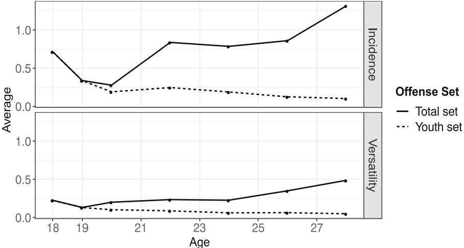
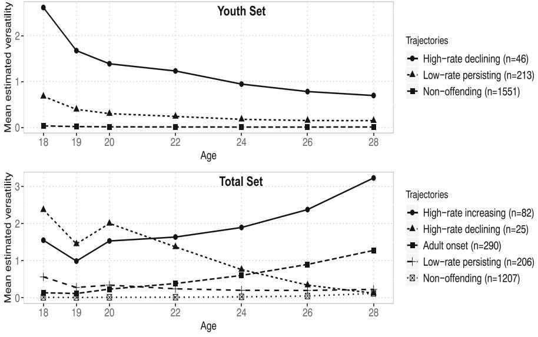
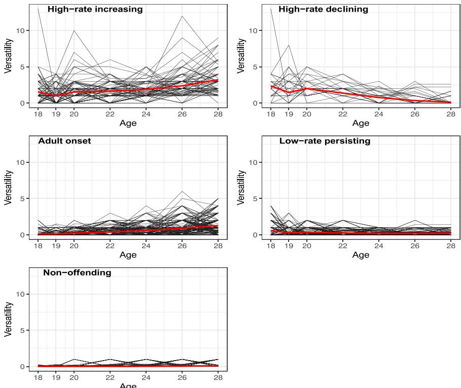
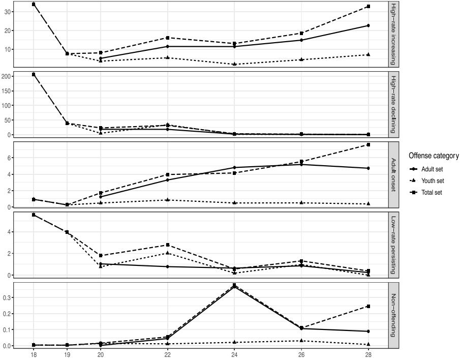
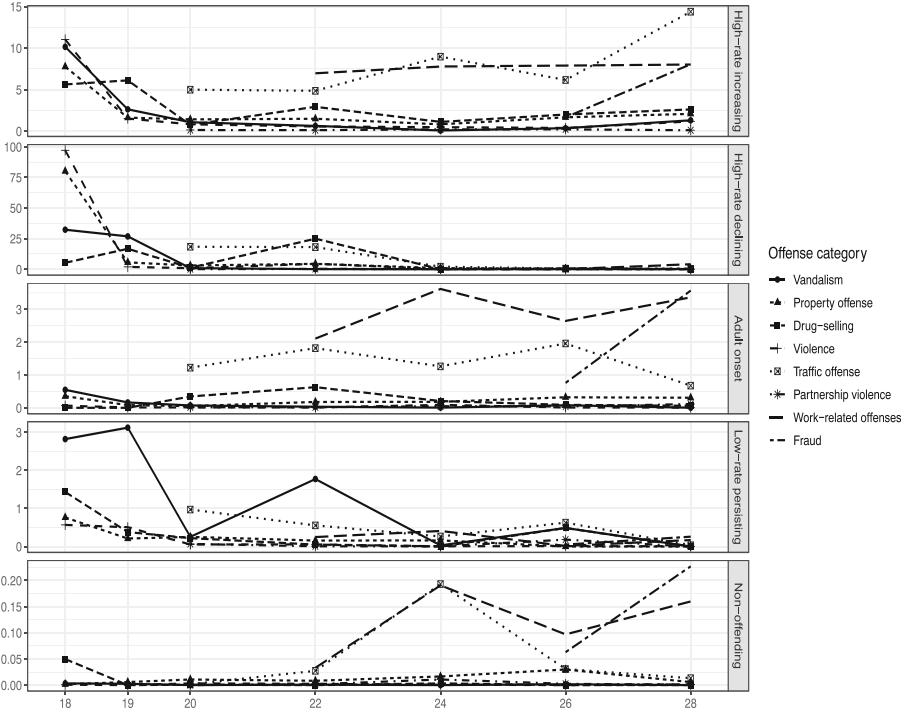

ORIGINAL ARTICLE Ope[n Access](http://crossmark.crossref.org/dialog/?doi=10.1007/s40865-020-00157-1&domain=pdf)

# Delinquency in Emerging Adulthood: Insights into Trajectories of Young Adults in a German Sample and Implications for Measuring Continuity of Offending

Georg Kessler1

Received: 3 July 2020 /Revised: 9 October 2020 /Accepted: 26 October 2020 # The Author(s) 2020 Published online: 6 November 2020 /

### Abstract

The majority of studies within the framework of Developmental and Life-Course Criminology focus on adolescence. There are even fewer studies that deal with heterotypic measures of delinquency. This study fills a gap in the literature by targeting exclusively the period of emerging adulthood (ages 18 to 28) and scrutinizing different trajectories and patterns of offending (offending portfolios) thereof. We discuss the topic of continuity of offending with changing opportunity structures for an adult population via contrast of one set of delinquent behaviors reflecting opportunity structures in adolescence (youth set) and one where adult-appropriate criminal activities were added (total set). We applied latent class growth analysis (LCGA) to both sets in a sample of 1810 German men and women aged 18 to 28 years. During emerging adulthood, average crime versatility and incidences increase slightly with items of the total set, while it decreases with only the youth set. LCGA on the total set reveals five meaningful trajectories with declining but also increasing slopes. Among these is one trajectory of innocuous adolescents, who start an offending career with mainly adult crimes during emerging adulthood. Of the sample, 45.25% reported at least one offense during that period. Traffic offenses and fraud are the most prevalent types of offending. While the sample's majority is considered non-offenders, emerging adults do not entirely cease to commit offenses. Instead, they shift their preference towards ageappropriate and covert ways to act anti-socially. Trajectory groups reflect proclivities towards either youth, adult, or a mix of both types of crime.

Keywords Emerging adulthood . LCGA . Heterotypic continuity

\* Georg Kessler [georg.kessler@uni](mailto:georg.kessler@uni-bielefeld.de)–bielefeld.de

1 Faculty of Sociology, Bielefeld University, P.O. 10 01 31, 33501 Bielefeld, Germany

### Introduction

Typically, criminological research and in particular research on the life-course is predominantly performed on adolescent samples because that is the densest area in the age-crime curve, while the period of adulthood—specifically young or "emerging" (Arnett [2000](#page-21-0)) adulthood—receives much less attention. To support this claim, we reanalyzed the results of Jennings and Reingle [\(2012](#page-21-0)). They reviewed extensively published articles on life-course delinquency trajectories between the years 1995 and 2012 (n = 105), of which 42 (40%) dealt with populations younger than 22 years, only 33 (31%) beyond that age. An even smaller share (n = 8; 8%) falls to studies, analyzing self-reported delinquency rather than official records.

Contrary to this deficit in research, Jolliffe et al. ([2017](#page-21-0)) collected relevant longitudinal studies to date, which (1) were based on a general community sample of at least 300 individuals; (2) started collecting information in childhood or early adolescence (age 13) and had follow-up information about offending up to at least age 30; (3) contained measures of self-reported or official offending; and (4) reported findings in English. They identified 55 longitudinal studies, which satisfied the criteria, twentyseven of which measured delinquency either as self-reports only or in combination with official-reports. The remaining 28 are based on official reporting only. Fourteen studies included results on trajectory models reflecting Moffitt's taxonomy (Moffitt [1993\)](#page-22-0). Together, the reviews show the imbalance between the potential of available data sources and the number of published articles on emerging adults. A lack of empirical studies with self-reported offending for that period constitutes the primary bias of the research. These facts notwithstanding, it remains yet to be seen whether this period warrants explicit attention and which pitfalls researchers will encounter in doing so.

### Criminogeneity in Emerging Adulthood

Viewing emerging adulthood (ages 18 to 26) as a distinct period between adolescence and adulthood is backed by empirical findings that generations born during and after the 1960s in Western countries experience increasing periods of youth and some blending of adolescence and adulthood (Arnett [2000\)](#page-21-0). Relative independence from social roles and normative expectations characterize this period. Various possible choices in life concerning love, work, and worldviews are available to emerging adults and can be freely adopted (Arnett [2000\)](#page-21-0).

This period also is criminologically of interest, as it is void neither of crime nor circumstances, personal characteristics, or interactions of both, which might induce it. As Eggleston Doherty ([2019](#page-21-0)) pointed out in a review of 15 US-based longitudinal studies on criminal justice contacts, that while on average, the age of desistance occurred clustered in the late 20s to early 30s, also a nontrivial number of individuals deviates from this typical pattern and keeps offending well beyond adolescence. Eggleston and Laub ([2002](#page-21-0)) initiated a revision of the aforementioned common research bias with their seminal study. They claimed the existence of a criminal trajectory of individuals with an adult onset of crime, which stands at odds with the suggestion that "antisocial behavior virtually requires childhood antisocial behavior; yet most antisocial children do not become antisocial adults" (Robins [1978:](#page-22-0) 611). A trajectory of very late adult onset would have to answer the question: If adolescence was the typical time for most delinquency to occur, why would somebody with no (visible) inclination to commit a crime in early adolescence start in late adolescence or even in adulthood? There is currently a vivid debate around the existence of an adult-onset group of individuals (Krohn et al. [2013;](#page-22-0) Beckley et al. [2016](#page-21-0); van Koppen [2018](#page-23-0)). Such a trajectory would also touch the issue of desistance: the "aging out of crime" usually entails entering traditional adult roles marked by a permanent job, marriage, and parenthood. However, some markers, such as stable employment, have become ever more challenging to achieve in today's employment market (Côté and Bynner [2008\)](#page-21-0), let alone finding a steady partner. Hill et al. ([2015](#page-21-0)) even argue that being exposed to the maturity gap (i.e., feeling to be an adult without the accompanying social roles, responsibilities, and markers; Moffitt [2006](#page-22-0)) seems to affect the risk to offend during this period.

Even earlier, scholars suggested that patterns of types of offending might be susceptible to shifts over the life-course. For instance, after analyzing the onset of offenses of FBI arrest data for the years 1940, 1960, and 1980, Steffensmeier et al. [\(1989\)](#page-23-0) rejected the idea that the age distribution of crime is invariant across crime types and over time (which is postulated by Gottfredson and Hirschi [1986](#page-21-0)). For instance, they reason that juveniles have higher incentives for low-yield involvement and high-risk behavior types represented by such offenses as burglary, robbery, and vandalism. These are often committed in peer groups, providing "thrills" and financial gains. They lead to peer acceptance, and perpetrators can rely on their physical strength. The older individuals become, the higher their stakes in conformity and rule-adherence are. However, aging does not prevent older individuals from getting involved in offenses with more significant gains and lower risk like embezzlement and fraud. Adults engaging in less visible variants of legitimate roles have a comparably greater opportunity to commit hidden crimes. For instance, business fraud, bribery, pricefixing, labor-union racketeering, or black market activities are also less likely to be reported to the authorities (Steffensmeier et al. [1989](#page-23-0)).

Similarly, Le Blanc and Fréchette [\(1989](#page-22-0)) found that the crime mix is very different in the first part of adolescence and the second half or even adulthood. Certain types of offenses are discarded or newly adopted with age. Loeber and Le Blanc [\(1990\)](#page-22-0) even speak of a hierarchical development of offending with an escalation of frequency and seriousness of offending. However, their theory falls short to model the dynamics of continuous offending in adulthood in the way Steffensmeier et al. [\(1989\)](#page-23-0) propose.

Le Blanc and Bouthillier [\(2003\)](#page-22-0) introduce the more age-flexible idea that the construct of deviant behavior framed within the deviant behavior syndrome is a hierarchical domain of actions with the four sub-constructs: covert, overt, authority conflict, and reckless behaviors. The syndrome manifests itself in different ways along the life span. Not only does this concept encompass a shift from overt to covert antisocial acts—as predicted by Steffensmeier et al. ([1989](#page-23-0))—but also it endows the construct with both continuity and change. Therefore, manifest behaviors, which represent measurements thereof, can either stay the same or change—in other words: be both homo- or heterotypic—throughout the life-course (Le Blanc [2005,](#page-22-0) [2012\)](#page-22-0).

### Measuring Delinquency Across Developmental Periods and Possible Pitfalls

This characteristic moves the argumentation to the precarious issue of measuring delinquency, which will be discussed twofold. First of all, the literature reviews presented earlier points out the salient difference between official- and self-reports. In part, the existence of an adult-onset trajectory might be an artifact due to official records. These, however, only inform on officially processed delinquent acts but necessarily skip all unregistered crime. This omission can lead to timely gaps between official and self-reported age of onset of 3–5 years (Kazemian and Farrington [2005;](#page-21-0) Moffitt et al. [2001](#page-22-0)). Therefore, self-reports capture the period of actual onset or desistance more validly.

Secondly, another issue concerning the measurement of delinquency is that of its continuity. Hitherto, longitudinal studies, which encompass several developmental periods, used—if at all—either of two strategies to maintain continuity of measurement: items were adapted across the age span to ensure that the measures were developmentally appropriate (e. g., Dunedin Multidisciplinary Health and Development Study; see Odgers et al. [2008\)](#page-22-0) or studies included new items with ageappropriate acts of delinquency (e.g., National Longitudinal Study of Adolescent Health; see Chen and Jaffee [2015](#page-21-0)). If the composition of items does not change at all, homotypic continuity is assumed. Consequently, the same behaviors measure the underlying construct (or in the words of Le Blanc, the "syndrome"). Therefore, it does not change its expression. Conversely, if the composition changes, this would entail an assumption about heterotypic continuity.

It is debatable whether the adaptation of items assumes homo- or heterotypic continuity. For instance, kicking and biting as a child and gang fighting in teenage years may be considered heterotypic expressions of violence (see Nagin and Tremblay [2001\)](#page-22-0). Still, if the point of reference is the construct "delinquency," we would argue, these would merely be adaptations of homotypic continuity, as violence is still part of the construct. Without this distinction of reference, some authors will find the existing terminology limiting and introduce new terms, e.g., Massoglia ([2006](#page-22-0)) uses "displacement" for individuals prioritizing drug use over violence over the life-course. In this example, the relevance of types of offenses for the construct might vary.

Nevertheless, the changed meaning of a construct might necessitate replacing or even adding new offenses. For example, only later in life, once we have taxable jobs, can we commit tax fraud. Including this behavior into the "syndrome" captures the heterotypic continuity of the construct. Introducing a new term, therefore, would not be warranted.

While Odgers et al. ([2008\)](#page-22-0) found that adapting items to maintain homotypic continuity does not diminish validity, they did not prove its necessity. However, restricting the strategy to adaption falls short to account for crime types, which become more relevant at a certain age, pointing to heterotypic offending. Supporting this argument from a slightly different angle, Piquero et al. [\(2002\)](#page-22-0) looked in their study on male parolees aged 17 to 28 years into differences in the rank orders between scales of arrests for violent and non-violent offending. They distinguished four offending patterns for the joint estimations of arrests for violent and non-violent types of offenses. The subjects assumed relatively stable rank orders between offense types. In general, those who ranked low on violent arrests also tended to rank low on non-violent arrests.

Nevertheless, this stability in rank orders was not perfect: in one trajectory, the rank order switched with increasing age, and another one was characterized by specialization for non-violent arrests. Consequently, there was barely any variation among the average violent arrests over time in this group. The relative stability in rank orders between average arrests for the types of offenses could be seen as tentative support for pooling offenses of different categories as the rank order will be steady. However, this analysis also suggests that specific individuals are specialized or change preferences over time while at large proclivities to commit either offense type overlap.

This example highlights three issues: (1) the two different sets of delinquent behaviors (i.e., violent and non-violent behavior leading to arrests) have congruous rank orders over time, which supports the idea of a hierarchical domain of behaviors (Le Blanc and Bouthillier [2003\)](#page-22-0). These behaviors could represent a single underlying construct. (2) This finding holds for the majority, but not for every individual: a change of rank orders between violent and non-violent offenses over time could indicate that a sub-group violates the assumption of homotypic continuity. Accordingly, it would require scrutinizing the heterotypic nature of delinquency in more detail. Massoglia [\(2006\)](#page-22-0) argued for a necessary re-evaluation of types of crimes included in crime indices for maturing participants. In his analysis of a probability sample of youths in US households, he detected a process of both desistance and—what he termed displacement of criminal activity. His understanding of "displacement" is very much in line with Loeber's and Le Blanc's work (Loeber and Le Blanc [1990](#page-22-0)) of offending's hierarchical development. Propensities for committing crimes correlate with an increase of seriousness—some individuals are moving from one type of crime to a more serious one—but it only partially dissipates for the less serious ones. Therefore, in part, displaced offenses precede the deceleration and mask desistance. A separation of displacement and desistance then is only possible with measures that capture this process.

On the other hand, and also more recently, Chen and Jaffee [\(2015\)](#page-21-0) scrutinized the continuity of self-reported offending behavior when sets of offense items for the dependent summary statistic changed. They used a prospective stage-sequential cohort study (National Longitudinal Study of Adolescent Health) of US males aged between 13 and 31 for their analysis. Specifically, they analyzed whether distinct trajectories derived from a latent class growth analysis (LCGA) across the entire age range exhibited a higher likelihood of reporting items belonging to an adolescent or adultspecific set. Both consistent and age-specific sets of offenses were the dependent variables for LCGA's growth parameters. The classification yielded five classes, one of which represented a trajectory that peaked in the mid-20s and the rest representing variations of Moffitt's taxonomy (Moffitt [1993\)](#page-22-0). Only two of five classes reported different offending rates for the adult-specific set: adult-peak and life-course persistent. While the latter had the highest rates for both sets, the former showed comparably low rates for the adolescent-specific and comparably high rates for the adult-specific set. This finding corroborates the notion that items belonging to sets that are more appropriate to either adolescents or adults have a class-specific contribution to overall crime.

The authors conclude that "[i]ncluding only those items that do not vary with age makes it unclear whether observed trajectories are a true function of age versus measurement bias stemming from omitted items. For example, a model may show that homotypic antisocial behavior has declined from adolescence into adulthood. However, the model will fail to capture whether a person is engaging in forms of crime that are typically observed only in adulthood (e. g., committing fraud). Such a model would give a misleading impression of desistance." (Chen and Jaffee [2015:](#page-21-0) 271). To summarize, adding or dropping new items to a summary score entails a possible (maybe also necessary) shift in the underlying concept.

This paper examines the period of emerging adulthood with a sample ranging between 18 to 28 years, thus overcoming the shortcomings and implications mentioned above. We will describe generic types of offending (also referred to as offending portfolios) for that period. Furthermore, we will demonstrate how two different sets of items, reflecting both typical behaviors for studies on adolescent populations and behaviors more relevant for an adult population, affect modeling a mixture of growth curve distributions. The mixture model is applied to account for heterogeneous patterns of propensities. We contrast both sets and identify underlying drivers of dynamics. Ensuing methodological concerns about changes in propensities for either set will be discussed. In contrast to many previous studies on emerging adults, self-reports rather than official data are the dependent variables to capture the age of onset and initiation of desistance validly.

## Data and Methods

### Sample

The current analysis uses data from the German prospective panel study "Crime in the Modern City" (CrimoC) (Boers et al. [2010;](#page-21-0) Seddig [2014](#page-22-0), [2016\)](#page-22-0). It is funded by the German Research Foundation and started in 2002 with the first representative survey targeting all seventh-grade pupils in Duisburg (Germany). The city's approximate population then totaled 500,000. Out of 57 schools, 40 agreed to participate in the study comprising 3910 pupils (consisting of approximately 70% of the population of seventh-grade pupils; 51% male; mean age, 13 years). The entire panel consists of 13 waves of annual (from age 20 onwards only biannual) cross-sectional surveys of respondents until age 30 linked via a personal code. The specific scope of the current research interest is on individuals participating at waves 6 to 12, spanning observations of an effective age range of 18 to 28 years on average. After excluding cases with an excess of more than one missing wave in the selected panel, the final analytical sample includes 1810 individuals. Panel attrition left 62% females and 38% males.

Duisburg is one of several cities in Germany's metropolitan conglomerate called the Ruhr area close to the Dutch and Belgian border, with approximately 5 million inhabitants and a population density of 1646/sq. km (4260/sq. mi). Historically, the entire area was characterized by heavy industry (mining and steel) until the 1970s with an economic shift afterward (away from mining and towards higher education and service and high-tech industries) and corresponding social dislocations in certain social strata since then. Duisburg's district Marxloh, which had attracted a vibrant migrant population over the past 40 years, gained a questionable reputation throughout the country for police reports on locally restricted no-go areas. Notwithstanding, the city's population is representative of other German major cities.

The criminal police summary 2019 of the interior ministry of North Rhine-Westphalia1 , the state to which Duisburg belongs, reports the lowest rate of crime for

1 <https://polizei.nrw/artikel/kriminalitaet-in-nordrhein-westfalen-2019-auf-niedrigstem-stand-seit-30-jahren> (last access: 30/09/2020)

30 years with a total of 1,227,929 registered offenses (r. o.). To name just a few, over the past 5 years, apartment break-ins (app. 26,800 r. o.), pickpocketing (app. 31,000 r. o.), violence (app. 44,000 r. o.), and street crime (app. 298,000 r. o.) continuously decreased, while offenses related to homicide (app. 400 r. o.), child pornography (app. 400 r. o.), and drug abuse (app. 69,000 r. o.) are rising.

### Measures

Since Short and Nye ([1957\)](#page-22-0) introduced self-reports on delinquent behavior as a measure for delinquency, scholars have studied the performance of different techniques on how to scale it. The summary statistic of summed yearly prevalences (versatility) offers a reasonable balance between the frequency of a crime and its seriousness. It has preferable properties for complex statistical models (Sweeten [2012](#page-23-0)), making versatility a suitable dependent variable for the ensuing latent growth curve analysis. As summed yearly frequency scores (incidences) are better suited to surmise the size of offending, they will serve to demonstrate the magnitude of offending for an in-depth description of each trajectory class' offense portfolio.

At every wave of the study, participants responded to the query whether they engaged in various antisocial behaviors since the 1st of January of the previous year. Items can be divided into such that already offer adolescents opportunities to break the law such as vandalism (tagging graffiti, scratching, and general vandalism), drug selling, property offenses (machine theft, shoplifting, bicycle theft, motor vehicle theft, theft out of vehicle, burglary, other thefts, and accepting stolen goods), and violence (aggravated assault without a weapon, aggravated assault with a weapon, purse snatching, and robbery), and those which are more suited for an adult opportunity structure like traffic offenses (driving without a permit, hit and run, drunk-driving), partnership violence, work-related offenses (illegal employment, illegal advantage over employer, and illegal advantage for employer), and fraud (false claims towards insurance or public agency, tax evasion, false representation for sales of goods, selling goods without intent to deliver, fraudulent inducement to contract, paying for service without bill, and illicit upload of content on the internet).

For illustrative purposes, we contrast two separate models representing the development of the respective propensity to commit two different sets of items. One model utilizes the youth set, which comprises vandalism, drug selling, property offenses, and violence. Another model represents the total set, which additionally also comprises the adult set with the categories: traffic offenses, partnership violence, work-related offenses, and fraud. The youth set items were asked from the first wave onward; those of the adult set were introduced incrementally (see Table [4](#page-20-0) in the Appendix for a detailed overview). Versatility scores for the youth set have a theoretical upper limit of 16 and an observed limit of 13, and the adult set is theoretically limited to 15. It reaches a maximum of six in the sample. Finally, the total set has a theoretical limit of 31 and an observed maximum of 13.

The continuous inclusion is likely to produce an additive effect via the study's design, to which the estimation of the curves' growth parameters will be sensitive. Therefore, increasing rates over time cannot be directly interpreted as increases in the latent propensity to commit crimes. A potential engagement in the newly introduced crimes previous to their inclusion in the study cannot be ruled out. For instance, a person might have been employed and paying taxes since age 16 and, therefore, might have already been producing fraudulent tax statements before this offense was introduced at wave 11 when the same person was 26 years old. All classes of trajectories extracted under the total set should exhibit either stationary slopes (due to displacement of former behaviors with new ones) or increasing ones (due to the additive effect) if the newly added items represent ubiquitous types of behavior. Interpretation of upswings in the curves needs to consider this potential additive effect rather than merely taking them at face value. An increase as such does not necessarily imply an increase in the underlying propensity to commit a crime. Instead, it would be safe to say that a propensity is present.

While offending for the youth set—as will be shown—decreases, an increase or at least stationary development under the total set could have several reasons. On the one hand, the propensity to report items from the adult set increases at a rate inverse to that for categories of the declining youth set. The diminishing propensity is more than substituted, implying that propensities have a specific etiology, and individuals are changing their predilection of one over another. They still exhibit norm-breaking behavior, but the corresponding behaviors changed (heterotypic continuity). On the other hand, the propensity to commit a youth set offense decreases, but the decline is leveling. The already existing propensity to commit an adult set offense becomes optional in later waves. It adds to the existing level of offending. Individuals with this behavior to report offending do not discriminate in their propensities, and they exhibit both homo- and heterotypic continuity. A third option is the case of individuals with zero propensity to commit a crime during adolescence. An increase in youth set offenses (which seems less likely) or an increase in adult set offenses could drive their criminal onset after adolescence. This instance would speak against the general assumption of homo- or heterotypic continuity of antisocial behavior. Decreasing slopes should pose a rare event under the assumption of heterotypic continuity, as these would represent individuals who had previously committed crimes but are continuously reporting fewer offenses. However, the number of potentially eligible ones, which are also better representing an adequate opportunity structure, continuously increases.

### Method

Previous developmental and life-course criminology findings pointed out that a single growth curve, which models the self-reported offending behavior for the entire population, is an insufficient model (Nagin [2005](#page-22-0); Piquero [2008\)](#page-22-0). Rather than assuming that all individuals represent the same population, this assumption is relaxed. A series of latent class growth analyses (LCGA, also known as the semi-parametric group-based modeling approach; Nagin [\(2005\)](#page-22-0)) is estimated instead. Using persons as units, LCGA assumes that there are unobserved but distinct groups of individuals who follow similar developmental trajectories captured by growth parameters (intercept and slope) (Muthén and Muthén [2000](#page-22-0)). Expecting non-linear development in the trajectories, we included a quadratic term in addition to a linear one in the current analysis. In LCGA, within-class variation in growth factors is restricted to zero. Individual estimation points are not allowed to deviate from their class-specific intercept and slopes. These represent distinct offending groups in the population rather than an underlying continuum thereof (Muthén and Muthén [2000](#page-22-0); for a critical appraisal of this assumption, see Erosheva et al. [2014](#page-21-0); Greenberg [2016](#page-21-0)).

To establish the correct number of classes, information criteria (AIC, BIC), Entropy, and the Lo-Mendell-Rubin likelihood ratio test (LMR-LRT) aided the substantially driven decision (Muthén and Muthén [2000;](#page-22-0) Nagin [2005](#page-22-0); Nylund et al. [2007\)](#page-22-0). Information criteria penalize redundant parameters, and models with lower value are preferred. Entropy values range from 0 to 1, with values close to 1 indicating greater clarity in the classification. A low p value of the LMR-LRT indicates that the k-1 class model must be rejected, and the k-class model can be accepted.

The models are estimated for the acceptable range of the data assuming a zeroinflated negative binomial distribution (ZINB) with the statistical software package Mplus 8.3 (Muthén and Muthén [2017](#page-22-0)) using full information maximum likelihood (FIML) estimation. The most likely posterior probabilities from the final solution assign individuals to trajectories for further analyses.

## Results

### Descriptives

Versatility and incidence reveal a similar trend despite small differences for observed means (see Fig. [1\)](#page-9-0). If only the youth set is scaled, the trend is falling, whereas the total set reveals an upswing from age 20 onward. More significant discrepancies between the different scales are visible within the latter set: the divide increases after age 20. Considering that the offense "drunk driving" was added in this wave, the increase in incidence compared with only a marginal increase in versatility confirms that versatility mitigates disproportional bursts in incidence. As there is no information on the seriousness of the offense committed (for example, whether the person was driving a bus, a truck, or a bicycle, or how high the alcohol blood level was), choosing versatility over incidence seems to be a more cautious approach.

The overall trend suggests that if we allow for new types of delinquency to enter our scales—ones that include more appropriate opportunities to offend for an adult population—we see that trends reverse, irrespective of the type of scaling technique applied. This outcome, in turn, should affect trajectories that emerge from our modeling procedure. Following the assumption of a mixture of distributions underlying the trajectory of observed sample means, we expect, on the one hand, that within the same set of offenses, constitutive down- and up-swings will vary significantly across trajectory classes. On the other hand, between offense sets, similar trajectories will express different dynamics, too.

### Model Comparison

Table [1](#page-9-0) displays the results for models with two to six classes across the youth and total set.

For the youth set, the first non-significant LMR-LRT compares a 3- to a 4-class model. Drops in AIC (from 6366 to 6345) and aBIC (from 6415 to 6403) between

Fig. 1 Means of versatility and incidence scales for different offense sets over time

these classes are comparably small. As expected, the Entropy rises, albeit the difference of 0.003 points is negligible. Considering that the general trend of sample means is sloping downwards and then stabilizing slightly above zero over time, we expect to see merely shades of this decrease depicted in the different trajectories. Therefore, three classes seem adequate to represent the underlying mixture of distributions constituting the growth parameters. The upper graph of Fig. [2](#page-10-0) shows the three curves including the number of individuals assigned to this trajectory by most likely class membership: high-rate declining (n = 46) starting at the highest level of mean offending at age 18 and decreasing continuously after that, low-rate declining (n = 213) starting at a lower average rate of offending and following a less steep decline, and finally nonoffending (n = 1551) with a quasi-stationary trend slightly above zero.

Selecting the correct number of classes for the total set is more challenging. The first non-significant LMR-LRT appears for comparing a 5- against a 4-class model and

|             |               | Classes    |            |            |            |            |  |  |  |
|-------------|---------------|------------|------------|------------|------------|------------|--|--|--|
| Offense Set | Statistics    | 2          | 3          | 4          | 5          | 6          |  |  |  |
| Youth set   | AIC           | 6452.088   | 6366.133   | 6344.454   | 6326.886   | 6326.860   |  |  |  |
|             | aBIC          | 6491.598   | 6414.940   | 6402.558   | 6394.286   | 6403.557   |  |  |  |
|             | Entropy       | 0.858      | 0.7800     | 0.7830     | 0.7710     | 0.7240     |  |  |  |
|             | LMR-LRT Value | 814.575    | 92.1160    | 29.0370    | 25.0110    | 8.9820     |  |  |  |
|             | p value       | 0.000      | 0.0281     | 0.5429     | 0.2320     | 0.8693     |  |  |  |
| Total set   | AIC           | 12,052.346 | 11,854.072 | 11,799.537 | 11,778.524 | 11,741.950 |  |  |  |
|             | aBIC          | 12,091.856 | 11,902.879 | 11,857.640 | 11,845.924 | 11,818.647 |  |  |  |
|             | Entropy       | 0.800      | 0.7130     | 0.7030     | 0.7140     | 0.7030     |  |  |  |
|             | LMR-LRT Value | 1236.838   | 204.1910   | 61.3230    | 28.3830    | 43.6120    |  |  |  |
|             | p value       | 0.000      | 0.0000     | 0.0189     | 0.2805     | 0.7984     |  |  |  |

Table 1 Comparison of model fit between 2 and 6 classes among Youth and total set

Fig. 2 Plotted estimated means per trajectory

favoring the latter. However, the former contains one trajectory that is, albeit, small (high-rate declining, n = 25, see the lower graph of Fig. 2), possibly redundant, and thus, it might contribute to a non-significant test result. However, the curve it follows is conspicuous enough to warrant its inclusion: it is the only one with a declining trend, which occurs after age 20—and as expected, it represents a rare occasion (high-rate declining, n = 25). Also, a model with five classes outperforms one with four classes considering AIC (11,779 to 11,800), aBIC (11,846 to 11,858), and Entropy (0.703 to 0.714). The shapes and distributions of the trajectories in question further guide the decision: non-offending (n = 1207) follows a quasi-stationary curve slightly above an average versatility of zero per wave. Two trajectories that follow a rising trend are highrate increasing (n = 82) and adult onset (n = 290). While the former starts at a slightly lower level in mean versatility than high-rate declining, it surpasses that from age 22 onward. It remains at the highest level of all trajectories after that. The trajectory adult onset derives its name from a seemingly innocuous start until age 19 and an ensuing slow increase in offending after that, surpassing the mean versatility level of high-rate declining after age 242 . Individuals following the trajectory low-rate persisting (n = 206) experience a slight drop between ages 18 and 19. The curve follows a nearly stationary level of offending marginally higher than that of non-offending. Both curves register a marginal upswing between ages 26 and 28. These findings suggest a solution with five classes as substantively and statistically optimal.

Analysis of the model's posterior probabilities reveals that a reduction in Entropy is caused mainly by a lack of a clear distinction between low-rate decreasing and non-

2 An analysis not presented here in further detail reveals that the population of adult onset comprises of approximately 53% individuals with a record of less than an average of 0.5 on their average versatility score for the entire period between ages 13 and 18 (this equates to less than three self-reported offenses during their 6 years of adolescence). This value is only surpassed by individuals assigned to the trajectory non-offending with 77%.

offending, which is understandable given the curves' proximity and nearly parallel pathway.

Another quality criterion for the classification is the visual inspection of the variability of observed and predicted outcomes around the predicted mean trajectories (Erosheva et al. [2014](#page-21-0)). Figure [3](#page-12-0) shows observed individual trajectories and estimated means of each class separately. Except for high-rate increasing, all classes display a relatively homogenous distribution of paths. Several individuals of high-rate increasing engage in a bi-modal trajectory with peaks shortly after the beginning and towards the end of the period indicating that the separation might profit from modeling an inflection point, which we will not follow up. The complexity of the current model seems adequate.

### Drivers of Curve Dynamics (Total Set Solution)

The primary goal of this paper is to describe and understand the model for the total set. As the items used in the youth set are a subset of the total set, trajectories based on them represent an offending propensity for this subset. The row percentages of Table [2](#page-13-0) represent the proportion of movers or stayers between the youth and the total set: high-rate increasing (5c-total) derives its largest share (58.54%) from lowrate persisting, 34.15% from high-rate declining, and surprisingly 7.32% (n = 6) from non-offending. Therefore, a majority within this trajectory has a declining propensity for youth set offenses, which adult set offenses more than compensate. Six nonoffending (3c-youth) individuals even seem to overcompensate with adult set offenses. These findings indicate the onset of heterotypic continuity for high-rate increasing (5c-total).

Sixty percent of high-rate declining (5c-total) are derived from high-rate declining (3c-youth), 40% from low-rate declining (3c-youth), and none from nonoffending. This trajectory is characterized by individuals with a mixture of propensities, with the majority displaying a steep decline in the propensity for youth set offenses, which is barely supplemented by an increase for adult offenses. Individuals in high-rate declining (5c-total) are characterized mainly by homotypic continuity of offending.

Adult onset (5c-total) draws its largest portion (79.31%) from non-offending (3cyouth), 20% from low-rate declining (3c-youth) and 0.65% (n = 2) from high-rate declining (3c-youth). The offending pattern reflects individuals with a relatively low propensity for offenses from the youth set and a necessarily higher one for those from the adult set. Adult onset (5c-total) does not exhibit continuity but the onset of a specialized offending type.

Low-rate persisting (5c-total) recruits the majority (55.83%) from non-offending (3c-youth), 43.69% from low-rate persisting (3c-youth), and one individual from high-rate declining (3c-youth). The already low propensity for youth set offenses seems to be reluctantly replaced by an equally low propensity for adult set offenses, not allowing for any growth or additive effect. Non-offenders (3c-youth) are reporting only marginally higher offending behavior under the total set. This finding partly contributes to the issue, as mentioned earlier, in distinguishing these trajectories. Findings indicate homotypic continuity of offending for this class of individuals.

Fig. 3 Estimated average (thick line) and observed individual versatility (thin lines) per trajectory

Non-offending (5c-total) shows the clearest distinction: 99.42% belong to the same class (3c-youth). Only 0.58% (n = 7) will join from low-rate decreasing. The evidence here does not allow any interpretation as no clear variation is visible.

Figure[4](#page-14-0) depicts the main driver for the curves of the trajectories. It displays the average incidences of the two sets for individuals assigned to each trajectory over time: after an initial increase in youth offenses among high-rate increasing, averages drop, but this is partly compensated for by increased infringements from the adult set. The trends of both averages resemble a near parallel pathway on different levels. An increase with an ensuing drop in the average of youth set offenses after age 20 is also visible for high-rate declining. Both averages follow the same trend on a very congruent and low level close to zero. Adult onset starts with barely any youth set offending. After age 20, averages of adult set offenses strongly increase, while the youth set offenses' averages barely exceed 1. Contrasted with high-rate increasing and high-rate declining, Low-rate declining delayed the decrease of youth set offending for 1 year after age 19 with oscillations around the declining trend of adult set offenses. Youth set crimes are nearly non-existent for non-offending. Adult set offending happens at only a marginally higher level considering the already tiny scale applied to the graph.

| Trajectory group     | Perc type | High-rate declining | 3 classes youth Low-rate declining | Non-offending  | Total          |
|----------------------|-----------|---------------------|---------------------------------------|----------------|----------------|
| High-rate increasing | Row       | 34.15% (28)         | 58.54% (48)                           | 7.32% (6)      | 100.00% (82)   |
|                      | Col       | 60.87% (28)         | 22.54% (48)                           | 0.39% (6)      | 4.53% (82)     |
|                      | Total     | 1.55% (28)          | 2.65% (48)                            | 0.33% (6)      | 4.53% (82)     |
| High-rate declining  | Row       | 60.00% (15)         | 40.00% (10)                           | 0.00% (0)      | 100.00% (25)   |
|                      | Col       | 32.61% (15)         | 4.69% (10)                            | 0.00% (0)      | 1.38% (25)     |
|                      | Total     | 0.83% (15)          | 0.55% (10)                            | 0.00% (0)      | 1.38% (25)     |
| Adult onset          | Row       | 0.69% (2)           | 20.00% (58)                           | 79.31% (230)   | 100.00% (290)  |
|                      | Col       | 4.35% (2)           | 27.23% (58)                           | 14.83% (230)   | 16.02% (290)   |
|                      | Total     | 0.11% (2)           | 3.20% (58)                            | 12.71% (230)   | 16.02% (290)   |
| Low-rate persisting  | Row       | 0.49% (1)           | 43.69% (90)                           | 55.83% (115)   | 100.00% (206)  |
|                      | Col       | 2.17% (1)           | 42.25% (90)                           | 7.41% (115)    | 11.38% (206)   |
|                      | Total     | 0.06% (1)           | 4.97% (90)                            | 6.35% (115)    | 11.38% (206)   |
| Non-offending        | Row       | 0.00% (0)           | 0.58% (7)                             | 99.42% (1200)  | 100.00% (1207) |
|                      | Col       | 0.00% (0)           | 3.29% (7)                             | 77.37% (1200)  | 66.69% (1207)  |
|                      | Total     | 0.00% (0)           | 0.39% (7)                             | 66.30% (1200)  | 66.69% (1207)  |
| Total                | Col       | 100.00% (46)        | 100.00% (213)                         | 100.00% (1551) | 100.00% (1810) |
|                      | Total     | 2.54% (46)          | 11.77% (213)                          | 85.69% (1551)  | 100.00% (1810) |

Table 2 Transition matrix between models 5-class total and 3-class youth offense set (percentages given, cell counts in brackets)

### Offense Portfolios Across Trajectories (Total Set Solution)

Table [3](#page-15-0) describes the more detailed contingency of offense categories with classes. It includes both mean incidences and prevalence rates. The mean incidences are calculated as the gross frequency within each group for the seven waves divided by the number of individuals assigned to each trajectory.3 Therefore, they depict the relative magnitude of offending for this period, given the sub-sample size. Prevalence rates add information on how many individuals are responsible for those mean incidences. This information helps to contextualize the intensity of offending and illustrates how homogenous offending propensities are within each class.

The column totals' prevalence rates suggest that offending at least once during the age period 18 to 28 is typical, except for individuals assigned to non-offending. Only 17.9% of these have done so. The offending population totals 45.25% of the observed sample, and they are responsible for 16.37 offenses on average. The mean incidences reflect a rank order of offending intensity among trajectories: High-rate declining leads with 304.24 scale points. With a considerable gap but at a relatively high-level, highrate increasing follows with 130.17 points. Adult onset joins after another drop to 24.16, tailed by low-rate persisting with 16.31 points. Non-offending takes up the lowest rank with 0.81 points.

3 These means only represent a person-mean over the entire period and do not reflect yearly averages of offending per person as there are 1- to 2-year gaps between waves.

Fig. 4 Average incidences of offense sets over time across trajectories (scales vary)

The row totals reflect the gross average frequency and prevalence rates for each offense category and offense set. On average, moderately fewer individuals have committed slightly more adult set than youth set crimes (9.06 and 24.14% vs. 7.40 and 33.87%). Indicating that offenses from the youth set might become less frequently reported over the life-course, but if committed, are declared with a higher average frequency during this period. Categories of the youth set are, on average, equally frequently reported (i.e., between 2.17 and 2.68). Among adult set offenses, traffic (3.89) and work-related offenses (3.74) are most frequent. Compared to general violence (2.34), violence in partnerships is a rare event (0.12). The most pervasive offenses reported are fraud (22.21%) and traffic offenses (20.66%), followed by drug selling (15.52%) and work-related offenses (14.31%). 9.01% and 8.23% reported at least once an act of general violence or vandalism, respectively. Only 4.36% committed a property offense and 3.87% violence in partnerships.

Regarding the relationship of youth set and adult set offenses across classes, high-rate increasing have the most balanced offense portfolio: their average incidence rates are 64.12 and 65.39, respectively, and both prevalence rates are above 95%. As a reminder, individuals in this class are a mixture of approximately 60% low-rate persisting (3c-youth) and 35% high-rate declining (3c-youth). A majority of individuals start at a high but declining offending level for youth set offenses. However, this decline is compensated for by an increase of adult set offenses. Figure [5](#page-16-0) reveals that this occurs mostly via traffic and work-related offenses and at age 28 with an increase of fraudulent activity (mainly attributable to the then included item of illicit uploads on the internet).

| Se t                      | O f fen teg se ca ory                      | ig h-r inc ing H te a rea s |                        | ig h-r de l in ing H te a c |                  | A du l t t on se |                        | is ing Lo te t w- ra p ers |                        | f fen d ing No n-o |                        | l To ta     |                        |
|------------------------------|--------------------------------------------------------------|-----------------------------------------------------|------------------------|--------------------------------------------------------|------------------|------------------------------------|------------------------|----------------------------------------------------|------------------------|-----------------------------------|------------------------|-------------------|------------------------|
|                              |                                                              | Inc                                                 | Pr ev               | Inc                                                    | Pr ev         | Inc                                | Pr ev               | Inc                                                | Pr ev               | Inc                               | Pr ev               | Inc               | Pr ev               |
| h Yo t t u se | da l ism Va n                                    | 1 6. 2 1                                   | 1. 2 2 % 5 | 6 0                                                 | 6 8 %      | 0. 9 1                       | 9. 6 6 %      | 8. 4 8                                       | 2 8. 1 6 % | 0. 0 1                      | 0. 3 3 %      | 2. 6 8      | 8. 2 3 %      |
|                              | Dr l l ing ug se                              | 2 1. 1 3                                   | 8 1. 7 1 % | 4 8. 5 2                                      | 9 6 %      | 1. 3 3                       | 1 9. 6 6 % | 2. 5 6                                       | 2 8. 6 4 % | 0. 0 5                      | 1. 5 7 %      | 2. 1 7      | 1 2. 4 9 % |
|                              | f fen Pr ty op er o se                  | 1 6. 8 4                                   | 3 4. 1 % 5 | 9 4. 0 8                                      | 6 0 %      | 1. 4 8                       | 3. 4 % 5      | 1. 4 5                                       | 1 1. 1 % 7 | 0. 0 8                      | 0. 2 % 5      | 2. 3 5      | 4. 3 6 %      |
|                              | V io len ce                                         | 1 5. 9 5                                   | 7 1. 9 5 % | 1 0 4. 3 2                                 | 7 6 %      | 0. 2 1                       | 1 7. 2 4 % | 1. 2                                            | 5 1. 4 6 % | 0. 0 1                      | 1. 4 1 %      | 2. 3 4      | 1 3. 8 7 % |
|                              | l h To ta t t y ou se                | 6 4. 1 2                                   | 9 8. 8 % 7 | 2 8 2 4 5.                                 | 1 0 0 % | 3. 8 8                       | 4 0. 3 4 % | 1 3. 4 4                                  | 8 8. 3 % 5 | 0. 0 9                      | 2. 6 % 5      | 9. 0 6      | 2 4. 1 4 % |
| A du l t t se | Tr f f ic f fen a o se               | 3 9. 3 4                                   | 8 5. 3 7 % | 3 9. 2 8                                      | 8 0 %      | 6. 9 4                       | 5 2. 4 1 % | 2. 4 5                                       | 3 6. 8 9 % | 0. 2 7                      | 4. 6 4 %      | 3. 8 9      | 2 0. 6 6 % |
|                              | h ip io len Pa tne r rs v ce      | 0. 7 8                                        | 2 5. 6 1 % | 0. 2 4                                           | 8 %           | 0. 2 4                       | 9. 6 6 %      | 0. 2 6                                       | 4. 8 5 %      | 0. 0 2                      | 0. 7 5 %      | 0. 1 2      | 3. 8 7 %      |
|                              | W k-r la d f fen te or e o ses | 3 0. 6 5                                   | 7 1. 9 5 % | 4. 2 8                                           | 2 0 %      | 1 1. 7 3                  | 4 6. 9 %      | 0. 8 4                                       | 8. 2 5 %      | 0. 4 8                      | 3. 4 8 %      | 3. 7 4      | 1 4. 3 1 % |
|                              | d Fr au                                                | 9. 7 1                                        | 7 8. 0 5 % | 0. 3 6                                           | 2 0 %      | 4. 3 3                       | 6 5. 1 7 % | 0. 3 1                                       | 1 3. 5 9 % | 0. 2 9                      | 9. 6 1 %      | 1. 3 7      | 2 2. 2 1 % |
|                              | To l du l ta t t a se                | 6 5. 3 9                                   | 9 6. 3 4 % | 3 9. 2 4                                      | 8 4 %      | 1 9. 2 6                  | 9 5. 1 7 % | 3. 5 8                                       | 4 7. 5 7 % | 0. 6 1                      | 1 1. 5 2 % | 7. 4           | 3 3. 8 7 % |
| l To ta t se     | l To ta t se                                     | 1 3 0. 1 7                              | 1 0 0 %       | 3 0 4. 2 4                                 | 1 0 0 % | 2 4. 1 6                  | 1 0 0 %       | 1 6. 3 1                                  | 1 0 0 %       | 0. 8 1                      | 1 7. 9 %      | 1 6. 3 7 | 4 5. 2 5 % |

|  | b le Ta 3 | inc i de M ean nc e o | f f fen d ts o se se an | len tes p rev a ce ra o | f in d iv i du ls a ev er | i ing t t co mm | f fen ts o se se | j tra tor acr os s ec y g | rou p s |
|--|--------------------|--------------------------------------------|-------------------------------------------------|----------------------------------------------|------------------------------------------------------|--------------------------------|---------------------------------|---------------------------------------------------|---------------|
|--|--------------------|--------------------------------------------|-------------------------------------------------|----------------------------------------------|------------------------------------------------------|--------------------------------|---------------------------------|---------------------------------------------------|---------------|

High-rate declining reports a—though declining—predilection of offenses from the youth set. Each assigned individual has committed at least one such offense (mainly driven by selling drugs). Together, they are, on average, responsible for 285.24 infringements, compared to an average of 39 and a prevalence rate of 84% for adult set offenses (mainly driven by traffic offenses). Individuals from this trajectory in the current 5-class solution originated to 60% from high-rate declining (3c-youth) and 40% from low-rate declining (3c-youth). As Fig. 5 shows, these class members start with the highest levels of violence and property offenses among all classes. They drop close to zero at age 19. Selling drugs reaches a one-time peak at age 22. The only adult set offenses committed are traffic-related, which merely happens until age 24.

Among adult-onset offenders, only 40.35% reported a youth set offense leading, on average, to 3.88 incidences compared to 95.17% and a mean of 19.26 adult set infringements. Members assigned to this trajectory have shown low to non-existent propensities to commit youth set offenses. Adult set offenses related to the workplace, traffic, or—towards age 28—to fraudulent activity are the primary sources of their criminal involvement.

Conversely, low-rate persisting has a higher propensity to commit youth set offenses: 88.35% declared at least one such offense leading to an average of 13.44 incidences, which can be explained mostly by acts of vandalism (average incidence = 8.48, prevalence = 28.16%). In contrast, only 47.57% reported an adult set offense with an average of 3.58, which is primarily driven by traffic offenses (average incidence = 2.45, prevalence = 36.89%). These findings explain how 56% of individuals assigned

Fig. 5 Average incidences of offense types over time across trajectories (scales vary)

to this trajectory originated in Non-offending (3c-youth). Averages of offense categories in Fig. [5](#page-16-0) reflect the trajectory's overall trend that the general propensity to commit any crime type is low. One set does not seem to substitute the other.

Among non-offending, only 2.65% committed a youth set offense compared to 11.52% who had done so with adult set offenses. A majority of the former offenders sold illegal drugs (1.99%). The majority of adult set offenders within this trajectory (9.61%) committed acts of fraud, followed by traffic (4.64%) and work-related offenses (3.48%).

### Discussion

The study scrutinized the outcome of a liberal inclusion (total set) of both youthand adult-appropriate offense items into a summary statistic of summed prevalences over time among a sample of young German adults aged 18 to 28 years. The most prevalent types of offenses committed during that period are fraud, traffic offenses, and work-related offenses. LCGA identified five different classes of trajectories: high-rate increasing (4.53%), high-rate declining (1.38%), adult onset (16.02%), low-rate persisting (11.38%), and non-offending (66.69%). The offending portfolios between trajectories differ and reflect combinations of homoand heterotypic continuity of offending. High-rate increasing, for example, seems not to discriminate between them at all. High-rate declining and low-rate persisting show a proclivity for the youth set. Adult onset (like some individuals in non-offending) primarily consists of individuals who barely are involved in any youth set offenses, yet exhibit a close to an exclusive propensity for adult set offenses. These findings are in line with the results of Piquero et al. ([2002](#page-22-0)) that rank order of different sets of offenses (i.e., violent and non-violent) correlated positively for most subjects, but not for a minority. LCGA made this visible and disentangled the mixture of propensities. Furthermore, it became evident that without appropriate measurement, it is not possible to unravel the dynamics of slopes from the bias introduced by the research design through a lack to account for the assumption of heterotypic continuity. In its most serious manifestation, researchers might falsely recognize a downward slope as desistance.

In her seminal paper, Moffitt ([1993](#page-22-0)) argues for the existence of two basic types of offenders: life-course persistent (LP) and adolescent limited (AL). Sampson and Laub [\(2003\)](#page-22-0) claim that there is no such thing as LP, but even the most hardened criminal is on the trajectory to desistance, given time. Moffitt [\(2006\)](#page-22-0) argues that LP may not represent individuals, who engage on a stable and high level in crime through all their lives, but instead with the highest propensity to commit an offense, notwithstanding the general decline of criminal activity, which comes with age. The current LCGA results on only the youth set show evidence for both claims: offending during emerging adulthood follows a declining path, yet levels can be differentiated (high-rate declining (3c-youth) and low-rate declining (3c-youth)). Approximately 14% of the sample belongs to either class.

The results of the division of levels are probably closer to those from the study of Nagin and Land [\(1993\)](#page-22-0), who distinguished between high and low-level chronics. This picture, however, changes once adult set offenses become the dependent variable. Trajectories with increasing slopes emerge. As already mentioned previously, the slope's inclination is not directly interpretable. Nonetheless, an increase represents a positive propensity to commit an offense, which means either a continuation or onset of offending. While high-rate increasing fits the description of LP, adult onset does not match the established taxonomy, neither in expected age of onset (i.e., 20 years) nor the types of crimes reported (i.e., mainly adult set offenses). Given the constraint of the CrimoC study design of asking adult offenses from age 20 onward and not earlier, this sets a lower limit to the expected age of onset for this trajectory and, therefore, must not necessarily reflect the real age of onset.

Likewise, the taxonomy does not account for individuals with a persistently low rate of mainly youth set offending during their period of emerging adulthood (low-rate persisting, 5c-total). Albeit, in the current study, they show a lack of clear statistical demarcation from non-offending. Therefore, they might be considered one of the taxonomy's variants with no further relevance. Furthermore, while most AL assumedly already merged with non-offending before the beginning of this study's observation period, a group of delayed AL (high-rate declining, 5c-total) could be distinguished. Their offense portfolio is marked by high initial levels of violence and property offenses at age 18, which drop to a level close to zero soon after that.

Chen and Jaffee ([2015](#page-21-0)) found similar results to the current study regarding individuals in their life-course persistent class, who had a very high rate of homotypic antisocial behavior (a set of offenses which had been kept consistent across all observations). It exhibited very high levels of adolescent-specific antisocial behavior and the highest levels of adult-specific antisocial behavior compared with the other classes. We can see this tendency reflected in high-rate increasing. The authors also identified a class termed Adolescent-limited, which displayed very high levels of homotypic (similar sets) and heterotypic (differing sets) antisocial behavior during adolescence. However, by the time they were in their early twenties, they engaged in about as much homotypic and heterotypic antisocial as the low class. That class fits the description of the High-rate Declining trajectory. Contrary to the class we named adult onset, which exhibited barely any prior offending to age 18, their adult-peak class already engaged in low but increasing levels of homotypic antisocial behavior, which peaked by their midtwenties, during adolescence. Nevertheless, they engaged in nearly as much adultspecific antisocial behavior as the life-course-persistent class, which is a close result of the current study.

The study also revealed that Steffensmeier et al. ([1989](#page-23-0)) reasonably depicted opportunity structures for an adult population and predicted offending types: emerging adults are tentatively more likely to report offenses from the adult set than from the youth set. The authors found evidence supporting their claim that if adults commit an offense, it will be covert and most likely yield monetary benefits (e. g., fraud, work-related offenses, and selling drugs). Traffic offenses are an exception to this rule because they lack any financial incentive. Steffensmeier et al. ([1989](#page-23-0)) reason within the rationalchoice paradigm: adults will be more willing to break the law if the gains are high and the detection risks are low. However, the rational choice is not to be mistaken for a cause to commit an offense in adulthood. If that were a generalizable cause, we should expect the majority of adults to commit adult set offenses on different levels. However, as the data indicate, non-offenders are the majority in emerging adulthood (approximately 67%). Factors other than subjective expected utility seem to be the majority's driving forces not to commit offenses.

### Limitations and Future Research

After disentangling the sources of different propensities, it would be interesting to understand why certain individuals display preferences for specific sets and when preferences start to change. Conditional LCGA includes covariates of interest and would be the proper method to do this. Similarly, future research needs to show whether this study's adult-onset group fits the already established literature (Krohn et al. [2013](#page-22-0); Beckley et al. [2016;](#page-21-0) Van Koppen [2018](#page-23-0)).

Considering the arguments of proponents of a static criminal propensity (e.g., Gottfredson and Hirschi [1990\)](#page-21-0), the current findings in light of other recent research suggests that a general process responsible for criminal involvement seems less likely. Consequentially, we encourage future research to unravel measurement properties of summary statistics based on different sets of offenses. The impact thereof on the conceptions of homotypic and heterotypic offending behavior is of vital interest for studying the transition between adolescence and adulthood and related criminal activities.

The current study did not look into the psychometric property of homo- and heterotypic measures (see Asendorpf [2017\)](#page-21-0) of the construct "delinquency." We stress for future research to differentiate the terminology concerning the concept under scrutiny, either the continuity of offense type or the "syndrome." Simultaneously, both types of continuity are measurement properties that need to be established rather than assumed.

We hope that this study familiarizes its audience with the potential and merit of the study of crime-related transitions from adolescence to adulthood and crime in adulthood per se.

Funding Open Access funding enabled and organized by Projekt DEAL. The German Research Foundation fully funded the study "Crime in the Modern City" (CrimoC).

Data Availability The corresponding author can provide data, the code for data transformation, and the code for the statistical analyses on demand.

### Compliance with Ethical Standards

Conflict of interest The authors declare that they have no conflict of interest.

Appendix

|                       | 8                      | of vehicle out Theft | dealing Drug                           |                          |                       |                                       |                                                        |                                                 |
|-----------------------|------------------------|-------------------------------|-------------------------------------------|--------------------------|-----------------------|---------------------------------------|--------------------------------------------------------|-------------------------------------------------|
|                       | 7                      | theft Motor-vehicle        | with assault weapon Aggrav. a |                          |                       |                                       |                                                        |                                                 |
|                       | 6                      | theft Bicycle              | a w/o assault weapon Aggrav.  |                          |                       |                                       | inducement contract Fraudul. to               |                                                 |
|                       | 5                      | Shoplifting                   | goods stolen Accepting              |                          |                       |                                       | in w/o deliver goods to Selling tent |                                                 |
|                       | 4                      | theft Machine              | thefts Other                           | violence                 |                       |                                       | representation goods) of (sale False       |                                                 |
|                       | 3                      | Vandalism                     | Burglary                                  | Partner                  |                       |                                       | evasion Tax                                         |                                                 |
|                       | 2                      | Scratching                    | Robbery                                   | run and Hit        | driving Drunk      | for advantage employer Ill.  | (public claims agency) False                  | media of proprietary upload Illicit |
| items of Number | 1                      | Graffiti                      | snatching Purse                        | permit w/o Driving | employment Illegal | over advantage employer Ill. | (insurance) claims False                         | service for bill Paying w/o         |
|                       | of inclusion Age | 13–28                         |                                           | 20–28                    | 22–28                 | 24–28                                 | 26–28                                                  | 28                                              |

Open Access This article is licensed under a Creative Commons Attribution 4.0 International License, which permits use, sharing, adaptation, distribution and reproduction in any medium or format, as long as you give appropriate credit to the original author(s) and the source, provide a link to the Creative Commons licence, and indicate if changes were made. The images or other third party material in this article are included in the article's Creative Commons licence, unless indicated otherwise in a credit line to the material. If material is not included in the article's Creative Commons licence and your intended use is not permitted by statutory regulation or exceeds the permitted use, you will need to obtain permission directly from the copyright holder. To view a copy of this licence, visit [http://creativecommons.org/licenses/by/4.0/](https://doi.org/).

### References

- Arnett, J. J. (2000). Emerging adulthood: A theory of development from the late teens through the twenties. American Psychologist, 55(5), 469–480. [https://doi.org/10.1037/0003-066X.55.5.469.](https://doi.org/10.1037/0003-066X.55.5.469)
- Asendorpf, J. (2017). Heterotypic stability. In V. Zeigler-Hill & K. Todd (Eds.), Encyclopedia of personality and individual differences. Shackelford: Springer International Publishing. [https://doi.org/10.1007/978-3-](https://doi.org/10.1007/978-3-319-28099-8_1861-1) [319-28099-8\\_1861-1.](https://doi.org/10.1007/978-3-319-28099-8_1861-1)
- Beckley, A. L., Caspi, A., Harrington, H., Houts, R. M., Mcgee, T. R., Morgan, N., Schroeder, F., Ramrakha, S., Poulton, R., & Moffitt, T. E. (2016). Adult-onset offenders: Is a tailored theory warranted? Journal of Criminal Justice, 46, 64–81. [https://doi.org/10.1016/j.jcrimjus.2016.03.001.](https://doi.org/10.1016/j.jcrimjus.2016.03.001)
- Boers, K., Reinecke, J., Seddig, D., & Mariotti, L. (2010). Explaining the development of adolescent violent delinquency. European Journal of Criminology, 7(6), 499–520. [https://doi.org/10.1177/](https://doi.org/10.1177/1477370810376572) [1477370810376572.](https://doi.org/10.1177/1477370810376572)
- Chen, F. R., & Jaffee, S. R. (2015). The heterogeneity in the development of Homotypic and heterotypic antisocial behavior. Journal of Developmental and Life-Course Criminology, 1(3), 269–288. [https://doi.](https://doi.org/10.1007/s40865-015-0012-3) [org/10.1007/s40865-015-0012-3](https://doi.org/10.1007/s40865-015-0012-3).
- Côté, J., & Bynner, J. M. (2008). Changes in the transition to adulthood in the UK and Canada: The role of structure and agency in emerging adulthood. Journal of Youth Studies, 11(3), 251–268. [https://doi.org/10.](https://doi.org/10.1080/13676260801946464) [1080/13676260801946464](https://doi.org/10.1080/13676260801946464).
- Eggleston Doherty, E. (2019). Age of onset of offending behavior. In D. P. Farrington, L. Kazemian, & A. R. Piquero (Eds.), The Oxford handbook of developmental and life-course criminology. New York: Oxford University Press.
- Eggleston, E. P., & Laub, J. H. (2002). The onset of adult offending: A neglected dimension of the criminal career. Journal of Criminal Justice, 30(6), 603–622. [https://doi.org/10.1016/S0047-2352\(02\)00193-9](https://doi.org/10.1016/S0047-2352(02)00193-9).
- Erosheva, E. A., Matsueda, R. L., & Telesca, D. (2014). Breaking bad: Two decades of life-course data analysis in criminology, developmental psychology, and beyond. Annual Review of Statistics and Its Application, 1(1), 301–332. [https://doi.org/10.1146/annurev-statistics-022513-115701.](https://doi.org/10.1146/annurev-statistics-022513-115701)
- Gottfredson, M. R., & Hirschi, T. (1986). The true value of lambda would appear to be zero: an essay on career criminals, criminal careers, selective incapacitation, cohort studies, and related topics. Criminology, 24(2), 213–234.
- Gottfredson, M. R., & Hirschi, T. (1990). A general theory of crime. Stanford: Stanford University Press.
- Greenberg, D. F. (2016). Criminal careers: discrete or continuous? Journal of Developmental; Life-Course Criminology, 2, 1. <https://doi.org/10.1007/s40865-016-0029-2>.
- Hill, J. M., Blokland, A. A. J., & van der Geest, V. R. (2015). Desisting from crime in emerging adulthood: Adult roles and the maturity gap. Journal of Research in Crime and Delinquency, 53(4), 506–535. [https://](https://doi.org/10.1177/0022427816628586) [doi.org/10.1177/0022427816628586](https://doi.org/10.1177/0022427816628586).
- Jennings, W. G., & Reingle, J. M. (2012). On the number and shape of developmental/life-course violence, aggression, and delinquency trajectories: a state-of-the-art review. Journal of Criminal Justice, 40(6), 472–489. [https://doi.org/10.1016/j.jcrimjus.2012.07.001.](https://doi.org/10.1016/j.jcrimjus.2012.07.001)
- Jolliffe, D., Farrington, D. P., Piquero, A. R., MacLeod, J. F., & van de Weijer, S. (2017). Prevalence of lifecourse-persistent, adolescence-limited, and late-onset offenders: A systematic review of prospective longitudinal studies. Aggression and Violent Behavior, 33, 4–14. [https://doi.org/10.1016/j.avb.2017.01.](https://doi.org/10.1016/j.avb.2017.01.002) [002.](https://doi.org/10.1016/j.avb.2017.01.002)
- Kazemian, L., & Farrington, D. P. (2005). Comparing the validity of prospective, retrospective, and official onset for different offending categories. Journal of Quantitative Criminology, 21(2), 127–147.
- Krohn, M. D., Gibson, C. L., & Thornberry, T. P. (2013). Under the protective bud the bloom awaits: A review of theory and research on adult-onset and late-blooming offenders. In C. L. Gibson & M. D. Krohn (Eds.), Handbook of life-course criminology: Emerging trends and directions for future research (pp. 183–200). New York: Springer New York. [https://doi.org/10.1007/978-1-4614-5113-6\\_11](https://doi.org/10.1007/978-1-4614-5113-6_11).
- Le Blanc, M. (2005). An integrated personal control theory of deviant behavior. In D. P. Farrington (Ed.), Integrated developmental and life-course theories of offending (pp. 125–163). Transaction Publishers.
- Le Blanc, M. (2012). Twenty-five years of developmental criminology: What we know, what we need to know. In R. Loeber (Ed.), The future of criminology (pp. 124–133). Oxford: Oxford Univ. Press.
- Le Blanc, M., & Bouthillier, C. (2003). A developmental test of the general deviance syndrome with adjudicated girls and boys using hierarchical confirmatory factor analysis. Criminal Behaviour and Mental Health, 13, 81–105.
- Le Blanc, M., & Fréchette, M. (Eds.). (1989). Male criminal activity from childhood through youth. Research in criminology. New York: Springer New York. [https://doi.org/10.1007/978-1-4612-3570-5.](https://doi.org/10.1007/978-1-4612-3570-5)
- Loeber, R., & Le Blanc, M. (1990). Toward a developmental criminology. Crime and Justice, 12, 375–473.
- Massoglia, M. (2006). Desistance or displacement? The changing patterns of offending from adolescence to young adulthood. Journal of Quantitative Criminology, 22(3), 215–239. [https://doi.org/10.1007/s10940-](https://doi.org/10.1007/s10940-006-9009-8) [006-9009-8.](https://doi.org/10.1007/s10940-006-9009-8)
- Moffitt, T. E. (1993). Adolescence-limited and life-course-persistent antisocial behavior: A developmental taxonomy. Psychological Review, 100(4), 674–701. <https://doi.org/10.1037/0033-295X.100.4.674>.
- Moffitt, T. E. (2006). Life-course-persistent versus adolescence-limited antisocial behavior. In D. Cicchetti & D. J. Cohen (Eds.), Developmental psychopathology: Risk, disorder, and adaptation (pp. 570–598). Hoboken: John Wiley & Sons.
- Moffitt, T. E., Avshalom, C., Rutter, M., & Silva, P. A. (2001). Sex differences in antisocial behaviour. Cambridge: Cambridge University Press.
- Muthén, B. O., & Muthén, L. K. (2000). Integrating person-centered and variable-centered analyses: Growth mixture modeling with latent trajectory classes. Alcoholism: Clinical and Experimental Research, 24(6), 882–891. <https://doi.org/10.1111/j.1530-0277.2000.tb02070.x>.
- Muthén, B. O., & Muthén, L. K. (2017). Mplus User's Guide. Los Angeles: Eighth Edi.
- Nagin, D. (2005). Group-based modeling of development. Cambridge: Harvard Univ. Press.
- Nagin, D. S., & Land, K. C. (1993). Age, criminal careers, and population heterogeneity: Specification and estimation of a nonparametric, mixed Poisson model. Criminology, 31(3), 327–362. [https://doi.org/10.](https://doi.org/10.1111/j.1745-9125.1993.tb01133.x) [1111/j.1745-9125.1993.tb01133.x](https://doi.org/10.1111/j.1745-9125.1993.tb01133.x).
- Nagin, D. S., & Tremblay, R. E. (2001). Analyzing developmental trajectories of distinct but related behaviors: A group-based method. Psychological Methods, 6(1), 18–33. [https://doi.org/10.1037//1082-](https://doi.org/10.1037//1082-989X.6.1.18) [989X.6.1.18](https://doi.org/10.1037//1082-989X.6.1.18).
- Nylund, K. L., Asparouhov, T., & Muthén, B. O. (2007). Deciding on the number of classes in latent class analysis and growth mixture modeling: A Monte Carlo simulation study. Structural Equation Modeling, 14(4), 535–569. <https://doi.org/10.1080/10705510701575396>.
- Odgers, C. L., Moffitt, T. E., Broadbent, J. M., Dickson, N., Hancox, R. J., Harrington, H., Poulton, R., Sears, M. R., Murray Thomson, W., & Caspi, A. (2008). Female and male antisocial trajectories: From childhood origins to adult outcomes. Development and Psychopathology, 20(2), 673–716. [https://doi.](https://doi.org/10.1017/S0954579408000333) [org/10.1017/S0954579408000333.](https://doi.org/10.1017/S0954579408000333)
- Piquero, A. R. (2008). Taking stock of developmental trajectories of criminal activity over the life course. In The Long (Ed.), View of crime: A synthesis of longitudinal research (pp. 23–78). New York: Springer New York. [https://doi.org/10.1007/978-0-387-71165-2\\_2](https://doi.org/10.1007/978-0-387-71165-2_2).
- Piquero, A. R., Brame, R., Mazerolle, P., & Haapanen, R. (2002). Crime in emerging adulthood. Criminology, 40(1), 137–170. <https://doi.org/10.1111/j.1745-9125.2002.tb00952.x>.
- Robins, L. N. (1978). Sturdy childhood predictors of adult antisocial behaviour: Replications from longitudinal studies. Psychological Medicine, 8(4), 611–622. <https://doi.org/10.1017/S0033291700018821>.
- Sampson, R. J., & Laub, J. H. (2003). Life-course desisters? Trajectories of crime among delinquent boys followed to age 70. Criminology, 41(3), 555–592. <https://doi.org/10.1111/j.1745-9125.2003.tb00997.x>.
- Seddig, D. (2014). Peer group association, the acceptance of norms and violent behaviour: a longitudinal analysis of reciprocal effects. European Journal of Criminology, 11(3), 319–339. [https://doi.org/10.1177/](https://doi.org/10.1177/1477370813496704) [1477370813496704.](https://doi.org/10.1177/1477370813496704)
- Seddig, D. (2016). Crime-inhibiting, interactional and co-developmental patterns of school bonds and the acceptance of legal norms. Crime & Delinquency, 62(8), 1046–1071. [https://doi.org/10.1177/](https://doi.org/10.1177/0011128715578503) [0011128715578503.](https://doi.org/10.1177/0011128715578503)
- Short, J. F., & Nye, I. F. (1957). Reported. Behavior as a Criterion of Deviant Behavior, 5(3), 207–213.
- Steffensmeier, D. J., Allan, E. A., Harer, M. D., & Streifel, C. (1989). Age and the distribution of crime. American Journal of Sociology, 94(4), 803–831.
- Sweeten, G. (2012). Scaling criminal offending. Journal of Quantitative Criminology, 28(3), 533–557. [https://](https://doi.org/10.1007/s10940-011-9160-8) [doi.org/10.1007/s10940-011-9160-8.](https://doi.org/10.1007/s10940-011-9160-8)
- van Koppen, M. V. (2018). Criminal career dimensions of juvenile- and adult-onset offenders. Journal of Developmental and Life-Course Criminology, 4(1), 92–119. <https://doi.org/10.1007/s40865-017-0074-5>.

Publisher's Note Springer Nature remains neutral with regard to jurisdictional claims in published maps and institutional affiliations.