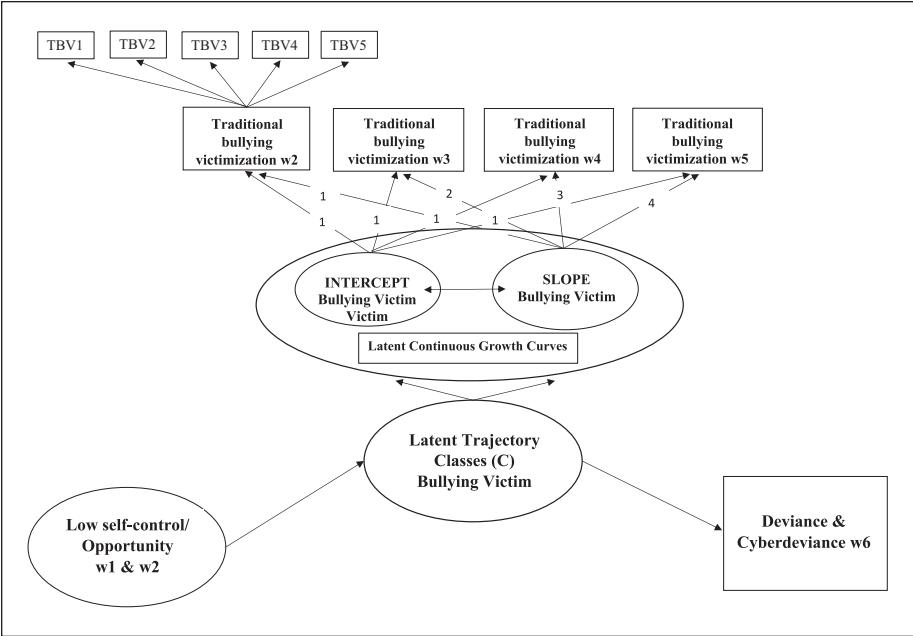
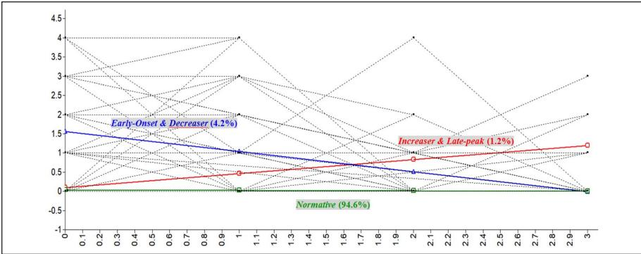
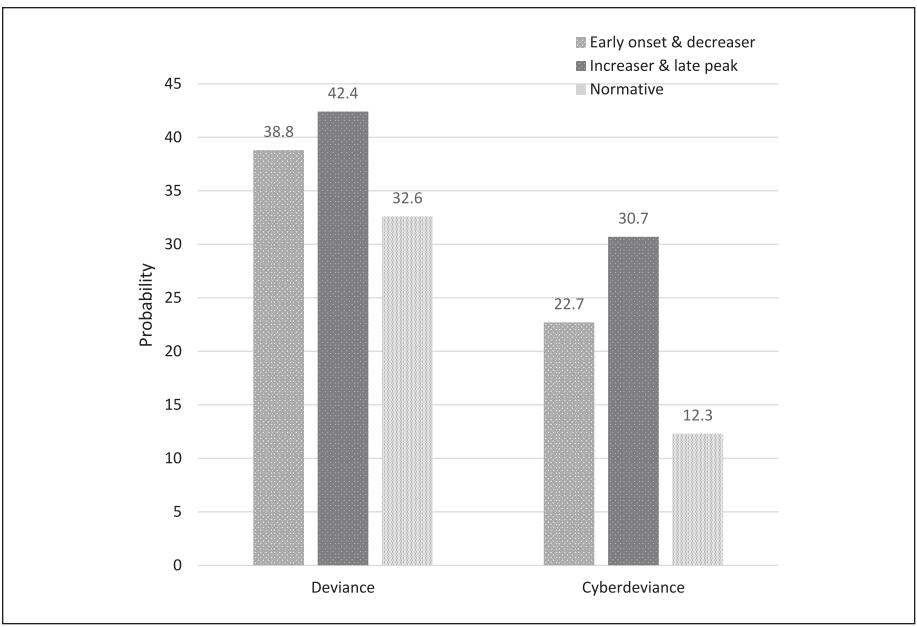

**1102793**IJOXXX10.1177/0306624X221102793International Journal of Offender Therapy and Comparative Criminology**Cho and Park**

*research-article*2022

**Explaining the Patterns of Bullying Victimization Trajectories: Assessing the Generality of Low Self-Control and Crime Opportunity Models to Bullying Victims**

https://doi.org/10.1177/0306624X221102793 International Journal of Offender Therapy and Comparative Criminology 2024, Vol. 68(10-11) 1074–1105 © The Author(s) 2022 Article reuse guidelines: [sagepub.com/journals-permissions](https://us.sagepub.com/en-us/journals-permissions) DOI: 10.1177/0306624X221102793 [journals.sagepub.com/home/ijo](https://journals.sagepub.com/home/ijo)

# **Sujung Cho1 and Insun Park2**

#### **Abstract**

This study hypothesizes that self-control and opportunity variables affect heterogeneity in developmental trajectories of bullying victimization. Using data from a follow-up study of 2,351 Korean adolescents, the study incorporates a latent class growth analysis approach to identify subgroups, each with a unique pattern of the trajectories. The model yields three subgroups of bullying victims: the early-onset and decreaser, the increaser and late-peak, and the normative groups. Results suggest that, compared to the normative group, the early-onset and decreasing group members manifest lower levels of self-control and engage in a greater range of delinquent behaviors. Also, the impact of low self-control on group membership was attenuated after controlling for those opportunity variables, indicating a partially mediating relationship. Social guardianship variables distinguished normative groups from other victim groups. Further, members of the increaser and late-peak group were more likely than the earlyonset and decreaser group members to engage in cyber deviance over the long-term.

#### **Keywords**

bullying victimization, developmental trajectories, social guardianship, low self-control, latent class growth analysis

#### **Corresponding Author:**

Sujung Cho, Department of Criminology and Criminal Justice, Southern Illinois University Carbondale, 1000 Faner Drive Faner Hall, Mail Code 4504, Carbondale, IL 62901, USA. Email: sujung.cho@siu.edu

1Southern Illinois University, Carbondale, USA 2University of Akron, OH, USA

### **Introduction**

Bullying is recognized as a serious problem because of its negative impact on physical and psychological problems among children and adolescents. A series of national studies confirmed that 20% to 56% of youths were involved in bullying, and more than 33% of them were victimized at least once or twice a month (Hertz et al., 2013; Lessne & Yanez, 2016). Substantial research indicates that victims of bullying are at high risk for physical injuries and adverse health conditions (Moore et al., 2017; Nansel et al., 2003), along with social and emotional problems, such as anxiety and depression (Gladstone et al., 2006; Menesini et al., 2009), and they are more likely to exhibit long-term problem behaviors, such as violence, delinquency, and risky online behavior (Cullen et al., 2008; Glassner & Cho, 2018; Hay et al., 2010; Kelly et al., 2015; Vaillancourt et al., 2013; Walrave & Heirman, 2011). Considering the high prevalence and serious consequences of bullying, it is essential to examine the etiology and developmental pathways of bullying victimization.

Research on victimization largely has relied on the lifestyle-routine activities (LRAT) framework (Cohen et al., 1981; Cohen & Felson, 1979; Hindelang et al., 1978; Meier & Miethe, 1993), though researchers recently incorporated personal characteristics, such as low self-control, into the LRAT approach to explain heterogeneity in bullying victimization (Augustine et al., 2002; Kulig et al., 2017). This integrative framework of low self-control and opportunity theory simultaneously considers the impact of situational factors and impulsive personalities on the variation of victimization risk. To date, however, little research has taken a *person-centered* developmental approach to the applicability of LRAT to bullying victimization. This developmental approach is relevant to analyzing adolescents whose physical, biological, and social shifts are most dynamic (Abbott, 1997; Arnett, 2000). In addition, the person-centered approach permits classifying youths into distinct subpopulations with similar behavioral patterns and then examining distinct etiologies.

This study extends the applicability of opportunity and low self-control framework to understanding the developmental mechanisms of bullying victimization. This study utilized a group-based trajectory model to categorize South Korean youths into subgroups, thereby accounting for the heterogeneity of victimization patterns over time. Subsequently, these groups were compared on their levels of low self-control and LRAT variables, with expanded measures of social guardianship. Additionally, developmental consequences of each victimization trajectory were examined to determine the likelihood of long-term deviance and cyber deviance. Overall, this article expands on the theoretical applicability of low self-control and LRAT to explain bullying victimization among non-Western youths within a *person-based* developmental perspective.

### **Literature Review**

### *Longitudinal Patterns of Bullying Victimization*

Longitudinal studies on victimization support the notion that there are more than two heterogeneous groups among the victims of violent crime (Higgins et al., 2009), school-based crime (Sullivan et al., 2011), and personal crimes (Y. Lee & Kim, 2017). Commonly found in these studies are small groups of individuals who are repeatedly victimized. Unlike the victim groups, the majority of youths, ranging from 60% to 80% of the samples, had zero to low experience of victimization, higher levels of selfcontrol, and stronger social bonds, and they did not engage in deviant lifestyles (Higgins et al., 2009; Y. Lee & Kim, 2017; Sullivan et al., 2011). Similarly, in most trajectory-based studies on bullying, a large portion of the sample (approximately 73%–85%) reported no to little victimization (Barker et al., 2008; Biggs et al., 2010; Brendgen et al., 2016; Griese et al., 2016; Haltigan & Vaillancourt, 2014; Sheppard et al., 2019; Sumter et al., 2012; Viau et al., 2020). This group represents the majority of youth who follow a normative development trajectory, often termed a "normative" group.

A group with a moderate/decreasing victimization trend was identified in some studies. In Haltigan and Vaillancourt's (2014) study of youth aged 10 to 14, approximately 16% of the sample had a moderate level of victimization initially, but it decreased afterwards. Youths in this group were distinguished from the low-victimization group in terms of reported psychopathological problems; they manifested higher levels of symptoms related to anxiety, depression, and ADHD (Haltigan & Vaillancourt, 2014). Griese et al. (2016) termed this group as "resilient" and located the reason for the decrease in their continued engagement in prosocial behavior. Taken together, these studies emphasize the importance of accounting for heterogeneity in the patterns of bullying victimization. Trajectory-based studies consistently emphasize the need to investigate intra-individual differences, in addition to inter-individual differences. Consistent with the literature, we expect to find a large normative group, a smaller group with high initial rates, and one or more groups with moderate and shifting rates.

### *Low Self-Control, Opportunity, and Bullying Victimization*

Researchers often use the opportunity perspective to explain individual-level variations in victimization risk. Opportunity theories focus on how changes in routine activities and lifestyles can alter the availability of suitable targets and decrease the presence of capable guardians, making crime more likely in certain contexts (Cohen & Felson, 1979; Cohen et al., 1981; Hindelang et al., 1978). More recently, Schreck (1999) demonstrated that opportunity theory can be expanded with Gottfredson and Hirschi's (1990) concept of low self-control. The initial hypotheses discussed how the level of self-control, developed in early childhood, can predict one's tendency to engage in antisocial behavior, which often provides immediate gratification and excitement without relatively little effort. The empirical evidence has been overwhelmingly supportive, demonstrating the link between low self-control and delinquency (Gibbs & Giever, 1995; Gibbs et al., 1998; Grasmick et al., 1993), bullying (Chui & Chan, 2015; Unnever & Cornell, 2003), and criminal acts (Burton et al., 1998; Polakowski, 1994). More recent formulation of the theory has been expanded to prediction of victimization; that is, individuals with lower levels of self-control are more short-sighted, impulsive, and more likely to be vulnerable to victimization (Gottfredson & Hirschi, 1990; Schreck, 1999). Low self-control and high impulsivity seem to make individuals more vulnerable by increasing the chance of engaging in risky lifestyles and also by undermining their ability to modify their lifestyles after victimization (Jennings et al., 2010; Schreck, 1999; Schreck et al., 2006).

These findings then imply that low self-control and opportunities (i.e., risky lifestyles) can be combined to construct a better explanation of victimization risks. This combined theory explains individual-level victimization risks as products of both situational factors and individual traits. Subsequently, scholars applied this integrative framework of low self-control and LRAT to cross-section samples of victimized youths. Research showed that an impulsive personality or low self-control increased the risk of school-based, violent victimization and bullying victimization (Augustine et al., 2002; Kulig et al., 2017); furthermore, engaging in delinquent activities and having exposure to delinquency increased vulnerability beyond the impact of low selfcontrol (Augustine et al., 2002; Kulig et al., 2017).

It is less clear whether this integrated opportunity perspective can be applied to a longitudinal sample of bullied youth. Previous trajectory-based studies examined covariates associated with distinct subgroups. For example, youths who belonged in the normative trajectory had low exposure to negative correlates across various social domains (e.g., low attachment to school and association with delinquent peers) and psychological symptoms (e.g., aggression and low self-control), while on the opposite trajectory, the chronic group maintained high rates of victimization during adolescence. A relatively small portion of the sample (2%–7%) fell into this category and was associated with various concurrent and distal psychosocial problems (e.g., Barker et al., 2008; Biggs et al., 2010; Brendgen et al., 2016; Griese et al., 2016; Haltigan & Vaillancourt, 2014; Sheppard et al., 2019). These findings suggest that victim groups are distinctively associated with various psychosocial variables. This study takes a more purposive approach in selecting the covariates that might distinguish subgroups of victims: grounded in an integrative theory of victimization, we test whether low self-control and lifestyle/routine-activities variables are predictive of different trajectories of bullying victimization.

### *The Role of Social Guardianship in Predicting Bullying Victimization*

Among the opportunity factors, social guardianship plays a key role in reducing the risk of victimization, especially among adolescents. In terms of social guardianship, Sullivan et al. (2011) found that *school bonding*, represented by the degree of attachment to school, teachers, and education, was an important factor in distinguishing low victimization groups from the high and escalating trajectory groups. Y. Lee and Kim (2017) identified three trajectories of victims among high school students: non-victim, sharp-decreasing, and decreasing victimization groups. The non-victim group, compared to other two victim groups, reported higher levels of parental supervision, peer attachment, and teacher attachment. These studies demonstrate the importance of social guardianship as a protective factor that insulates adolescents from becoming repeated victims on school grounds.

While attachment to parents and school can provide social support and resilience, youths spend significant time at school, where peers have been found to serve as a primary source of social guardianship. When conflict arises, this social support helps shield youths from experiencing high levels of stress due to conflict (Conners-Burrow et al., 2009; Frey & Röthlisberger, 1996). Children who learn social skills and attitudes necessary for navigating conflict situations also are better at resolving interpersonal conflicts that could have otherwise led to bullying. In fact, continued prosocial behavior was a significant predictor of a decreasing peer victimization trend (Griese et al., 2016). Conversely, negative social relationships can undermine children's abilities to engage in positive relationships with others, thus increasing the likelihood of interpersonal conflict (Shetgiri et al., 2012). Groups following a chronic and increasing trajectory reported unhealthy relationship with peers (Sheppard et al., 2019; Viau et al., 2020). Relatedly, *socially withdrawn behavior* can result in social isolation, which is a risk factor for victimization. In Spano and Nagy's (2005) research on violent victimization of rural adolescents, both social guardianship and social isolation significantly impacted the odds of becoming victims. Their findings suggest that the absence of a prosocial, peer network can increase the risk of victimization, regardless of the protective impact of parental supervision.

In sum, current evidence suggests that social guardianship may play a critical role in preventing bullying victimization, and it is important to cover all three areas of social guardianship (parent, teacher, and peer). In addition to prosocial bonds, a key element in establishing social guardianship is the ability (or lack thereof) to establish a meaningful, social relationships. Yet, little research has considered in the same model the role of parent, teacher, and peer relationships, along with a capacity to build a meaningful source of guardianship. We test the extent to which different domains of social guardianship affect bullying victimization risk, while controlling for low selfcontrol and risky lifestyles.

### *Consequences of Bullying Victimization*

It is well established that bullying has negative impacts on victims, and scholars have identified that one effect of victimization is an increased outward expression of problem behaviors. For example, over time, victims may adopt a coping skill that fosters the use of aggression to defend themselves (Dodge et al., 1990; Dodge & Schwartz, 1999). Evidence suggests a positive association between bullying victimization and externalizing behaviors that include relational violence, physical aggression, antisocial behavior, and delinquency (Cullen et al., 2008; Kelly et al., 2015; Vaillancourt et al., 2013; Walrave & Heirman, 2011; Walters & Espelage, 2018). The link between bullying victimization and problematic behavior appears robust, as similar results have been found when peer and teacher ratings were used in place of self-report (Farmer et al., 2015) and longitudinal and meta-analytic studies (Lösel & Bender, 2011; Reijntjes et al., 2011). Most relevant to the current study, longitudinal analyses of Korean youths revealed that bullying victimization was significantly associated with higher risks of delinquency and substance use (Glassner & Cho, 2018; Kim et al., 2019).

It is possible that prolonged exposure to bullying victimization could result in deviance in cyber space, including using the Internet to post offensive comments, distributing false information, hacking other people's computers, or illegally using someone else's identity on web sites (Hay et al., 2010; Walrave & Heirman, 2011). Relatedly, predictors of cyber deviance include bullying victimization, low self-control, association with deviant peers (Bae, 2017; B. H. Lee, 2018), which overlap with the predictors of offline deviance. On these grounds, we expect to find a link between bullying victimization and cyber deviance. Compared to the normative group, youths who were repeatedly exposed to bullying victimization are expected to be more likely to engage in deviance both off-line and on-line.

### *Present Study*

The present study contributes to longitudinal developmental research on bullying victimization through a systematic classification of a nationally representative sample of 2,351 Korean adolescents, who were divided into unobserved subgroups that capture distinct developmental trajectories of bullying victimization over a 5-year period. As identified in previous trajectory-based research on bullying victimization, we expect to find multiple subgroups with unique developmental trajectories among our sample of Korean youths.

This study also examines the impact of low self-control and opportunity variables (delinquent lifestyles and social guardianships) as integrated and exclusive forces on bullying victimization. This integrative framework has largely been applied to crosssectional samples of youths, and existing trajectory-based research on bullying victims has not employed a specific theoretical approach. Our research fills this gap by testing whether low self-control and LRAT theories can be applied to developmental trajectories of bullied victims. If supported, youths with repeated victimizations would be associated with lower levels of self-control, relative to other groups. Also consistent with the integrative approach, the predictive power of low self-control opportunity factors is expected to be significant but attenuated when the opportunity variables—measured by delinquent lifestyles and social guardianships—are incorporated in the model (i.e., mediating relationship). In doing so, we include multiple variables covering different domains (i.e., parent, teacher, and peer) of social guardianship, as well as the capacity to potentially form social guardianships (i.e., socially withdrawn behavior).

The strength of this study comes from using a non-Western sample. Previous research on victimization of South Korean youth had generally supported the relevance of low self-control and lifestyle-routine activities theories. Low self-control, low parental attachment, and delinquent peer association significantly increased the odds of personal victimization among elementary school youths (Cho & Wooldredge, 2018) and the odds of bullying victimization (Cho, 2018, 2019). Relatedly, Y. Lee and Kim (2017) identified victimization trajectories and established the relevance of guardianship variables among Korean high school students. This study extends prior research by focusing on social guardianship among younger adolescents, a stage when the impacts of social guardianship are more critical than they are for older adolescents. This expectation is empirically grounded (e.g., Spano & Nagy, 2005) and is derived from the phenomenon of "grouped thinking" observed by Y. Lee and Kim (2017). In a collectivistic cultural setting, a lack of ability to establish positive relationships with others is expected to correlate with being bullied among South Korean youths.

Finally, we examine whether victimization experiences can influence later delinquency, specifically whether the probability of deviance and cyber deviance varies across trajectory classes. Based on current evidence, the group with prolonged exposure to bullying victimization is expected to be associated with the highest involvement in offline and online deviance, compared to other groups. This examination will address the following research hypotheses.

**H1**: There would be more than one group, each having a unique pattern of developmental trajectories of bullying victimization.

**H2**: Low self-control and opportunity variables—delinquent lifestyles and social guardianships—would be independently predictive of class membership of developmental trajectories.

**H3**: Opportunity variables would mediate the relationship between low self-control and trajectory class membership.

**H4**: The probability of being involved in deviance and cyber deviance would vary on trajectory class membership.

# **Method**

### *Data and Sample*

Important to the present study is the use of longitudinal panel data that came from the National Youth Policy Institute's (NYPI) Korean Children and Youth Panel Survey (KCYPS). The sample for the KCYPS was selected using a multi-stage stratified cluster sampling technique to achieve a nationally representative sample of adolescents, while accounting for socioeconomic status, sex, and locational characteristics of the population. A total of 78 middle schools were selected from a list of national schools in 16 administrative districts. The schools were sampled proportionately to size, based on the average number of first-year middle-school students per class. Middle-school students and their parents were sampled in proportion to the number of students enrolled in selected middle schools in each administrative district. Group interviews of adolescents were administered at their schools, and questionnaires were administered to their parents. The original data collection that took place for the first analytic sample in Time 1 (Survey Year [SY] 2010) sampled about 2,351 adolescents who were 14 years old.

Among the sampled subjects, the KCYPS chose to capture these same subjects who were 15 years old, and a total of 2,280 responded to the SY2011 assessment. They were followed up until they were 20years old, and a total of 1,881 participated in SY2016. The current study incorporates six Times to establish temporal-order inference; Times 1 and 2 for covariates, Times 2 to 5 for developmental trajectories of bullying victimization, and Time 6 for distal outcomes. However, the last time (Time 7) was excluded because subjects were no longer adolescents. One of the common methodological issues in longitudinal panel design research is missing data/attrition of subjects over time. Approximately 20% of the follow-up rate was addressed by using a maximum likelihood estimator with robust standard errors (MLR) using a numerical iteration algorithm option in M*plus* 7.4, and thus, cases with missing values on all variables were included in the data analyses (Byrne, 2012; McKnight et al., 2007). Descriptive statistics and survey items of all variables for the analysis are shown in Table 1.

# *Measures*

*Conditioning variable. Bullying Victimization* was measured as a part of the four annual assessments from age 15 through age 18 (administered each year, 2011–2014) to assess developmental trajectories. At each follow-up, participants were asked whether they had experienced any of five different types of bullying victimization in the last year (see Table 1). Those items were summed to signify the variety of bullying victimization. Higher values on this variable reflect more experiences of bullying victimization.

# *Background Variables*

*Individual trait. Low self-control* was assessed in 2011 (Time 2), with six items administered. Grasmick et al. (1993) measured low self-control with a 24-item scale for six domains described by Gottfredson and Hirschi (1990): temper, simple tasks, risk seeking, physical activities, self-centeredness, and impulsivity. In this study, low self-control was measured with six items, tapping into impulsivity and temper from the original Grasmick et al. (1993) scale (see Table 1). Response options were on a four-point Likert scale, ranging from 1=very untrue to 4=very true. Therefore, the respondents who scored higher on the scale had less self-control (the original Grasmick et al., 1993 reverse coded the self-control construct). As a result of the satisfactory internal consistency (α=.810), a confirmatory factor analysis (CFA) was conducted to test how well those items represented a single construct, with higher values on this latent variable representing lower levels of self-control.

*Delinquent lifestyles. Delinquent involvement* was assessed with 11 items administered in 2011 (Time 2), asking participants if they had engaged in any of the various delinquent behaviors (see Table 1). Each item was coded 1 if the event occurred at least once, and 0 if there was no indication. An aggregate score was then calculated to signify whether the respondents had engaged in any of the types of delinquent acts (α=.679; the accepted value of Cronbach's alpha is .7; however, values above .6 are also considered acceptable; Taber, 2018; Van Griethuijsen et al., 2015). *Delinquent peer association* was assessed in 2011 (Time 2) on a continuous scale that asked participants about how many of their close friends engaged in 11 different delinquent

| mple (N=2,280). Description of the South Korean Youth Sa Table 1. |            |    |            |       |            |       |            |       |            |       |            |    |
|-------------------------------------------------------------------------|------------|----|------------|-------|------------|-------|------------|-------|------------|-------|------------|----|
|                                                                         | me 1 Ti |    | me 2 Ti |       | me 3 Ti |       | me 4 Ti |       | me 5 Ti |       | me 6 Ti |    |
| Variables                                                               | M          | SD | M          | SD    | M          | SD    | M          | SD    | M          | SD    | M          | SD |
| mization Traditional bullying victi                                  |            |    |            |       |            |       |            |       |            |       |            |    |
| Being severely teased or bantered by other people                       |            |    | 1.94       | 0.246 | 0.04       | 0.194 | 0.01       | 0.118 | 0.01       | 0.100 |            |    |
| Being collectively bullied by other people                              |            |    | 1.97       | 0.165 | 0.02       | 0.129 | 0.00       | 0.062 | 0.00       | 0.058 |            |    |
| Being severely beaten                                                   |            |    | 1.98       | 0.138 | 0.01       | 0.115 | 0.00       | 0.062 | 0.00       | 0.038 |            |    |
| Being threatened by other people                                        |            |    | 1.98       | 0.126 | 0.01       | 0.089 | 0.00       | 0.031 | 0.00       | 0.038 |            |    |
| Being robbed by other people                                            |            |    | 1.95       | 0.221 | 0.02       | 0.127 | 0.00       | 0.038 | 0.00       | 0.044 |            |    |
| w self-control T2 (α=.810) Lo                                        |            |    |            |       |            |       |            |       |            |       |            |    |
| mall mistakes made by others have easily upset me Even s             |            |    | 2.26       | 0.780 |            |       |            |       |            |       |            |    |
| over the past year                                                      |            |    |            |       |            |       |            |       |            |       |            |    |
| meone else was I have wanted to interfere with what so               |            |    | 2.14       | 0.764 |            |       |            |       |            |       |            |    |
| doing over the past year                                                |            |    |            |       |            |       |            |       |            |       |            |    |
| mall things mes when I find fault with s There are ti             |            |    | 2.17       | 0.790 |            |       |            |       |            |       |            |    |
| I've been fighting about minor issues                                   |            |    | 2.19       | 0.799 |            |       |            |       |            |       |            |    |
| m angry all day mes I a meti So                                |            |    | 2.14       | 0.847 |            |       |            |       |            |       |            |    |
| mes cry for no reason meti I so                                   |            |    | 1.87       | 0.813 |            |       |            |       |            |       |            |    |
| ment T2 (α=.679) Delinquent involve                                  |            |    |            |       |            |       |            |       |            |       |            |    |
| moking S                                                             |            |    | 0.06       | 0.241 |            |       |            |       |            |       |            |    |
| Drinking                                                                |            |    | 0.05       | 0.212 |            |       |            |       |            |       |            |    |
| Having unexcused absence                                                |            |    | 0.03       | 0.175 |            |       |            |       |            |       |            |    |
| way Running a                                                        |            |    | 0.03       | 0.159 |            |       |            |       |            |       |            |    |
| Severely teasing or bantering other friend                              |            |    | 0.06       | 0.242 |            |       |            |       |            |       |            |    |
| Collectively bullying                                                   |            |    | 0.03       | 0.174 |            |       |            |       |            |       |            |    |
| Gang fighting                                                           |            |    | 0.01       | 0.086 |            |       |            |       |            |       |            |    |
| Severely beating other people                                           |            |    | 0.03       | 0.173 |            |       |            |       |            |       |            |    |
|                                                                         |            |    |            |       |            |       |            |       |            |       |            |    |

*(continued)*

|                                                                | me 1 Ti |      | me 2 Ti |       | Ti | me 3 | me 4 Ti |    | me 5 Ti |    | me 6 Ti |    |
|----------------------------------------------------------------|------------|------|------------|-------|----|------|------------|----|------------|----|------------|----|
| Variables                                                      | M          | SD   | M          | SD    | M  | SD   | M          | SD | M          | SD | M          | SD |
| Threatening other friend                                       |            |      | 0.01       | 0.100 |    |      |            |    |            |    |            |    |
| Robbing                                                        |            |      | 0.02       | 0.123 |    |      |            |    |            |    |            |    |
| Stealing                                                       |            |      | 0.01       | 0.081 |    |      |            |    |            |    |            |    |
| Delinquent peer association T2 (α=.850)                        |            |      |            |       |    |      |            |    |            |    |            |    |
| moking S                                                    |            |      | 1.06       | 3.344 |    |      |            |    |            |    |            |    |
| Drinking                                                       |            |      | 0.53       | 2.070 |    |      |            |    |            |    |            |    |
| Having unexcused absence                                       |            |      | 0.37       | 1.929 |    |      |            |    |            |    |            |    |
| way Running a                                               |            |      | 0.26       | 1.022 |    |      |            |    |            |    |            |    |
| Severely teasing or bantering other friends                    |            |      | 0.50       | 2.593 |    |      |            |    |            |    |            |    |
| Collectively bullying                                          |            |      | 0.42       | 2.282 |    |      |            |    |            |    |            |    |
| Fighting                                                       |            |      | 0.12       | 1.237 |    |      |            |    |            |    |            |    |
| Severely beating other people                                  |            |      | 0.22       | 1.579 |    |      |            |    |            |    |            |    |
| Threatening other friends                                      |            |      | 0.16       | 1.491 |    |      |            |    |            |    |            |    |
| meone's things Taking or breaking so                        |            |      | 0.21       | 1.539 |    |      |            |    |            |    |            |    |
| mething Stealing so                                         |            |      | 0.16       | 1.408 |    |      |            |    |            |    |            |    |
| wn behavior T2 (α=.850) Socially withdra                    |            |      |            |       |    |      |            |    |            |    |            |    |
| m in front of many people wkward when I' I feel really a |            |      | 2.11       | 0.915 |    |      |            |    |            |    |            |    |
| mbarrassed on many occasions I feel e                       |            |      | 2.33       | 0.914 |    |      |            |    |            |    |            |    |
| I have difficulty expressing myself in front of others         |            |      | 2.14       | 0.881 |    |      |            |    |            |    |            |    |
| I feel shy                                                     |            |      | 2.18       | 0.896 |    |      |            |    |            |    |            |    |
| I don't like to assert myself in front of people               |            |      | 2.44       | 0.862 |    |      |            |    |            |    |            |    |
| Parent supervision T1 (α=.759)                                 |            |      |            |       |    |      |            |    |            |    |            |    |
| m w where I a When I go out, parents usually kno         | 3.37       | .737 |            |       |    |      |            |    |            |    |            |    |
| m doing w what I a When I go out, parents usually kno    | 3.22       | .778 |            |       |    |      |            |    |            |    |            |    |
| w when I return When I go out, parents usually kno          | 2.88       | .853 |            |       |    |      |            |    |            |    |            |    |

**Table 1. (continued)** *(continued)*

|                                                                     | me 1 Ti |       | Ti   | me 2  | me 3 Ti |    | me 4 Ti |    | Ti | me 5 | me 6 Ti |    |
|---------------------------------------------------------------------|------------|-------|------|-------|------------|----|------------|----|----|------|------------|----|
| Variables                                                           | M          | SD    | M    | SD    | M          | SD | M          | SD | M  | SD   | M          | SD |
| ment T1 (α=.819) Parent attach                                   |            |       |      |       |            |    |            |    |    |      |            |    |
| My parents are nice to me without constraint                        | 3.07       | .803  |      |       |            |    |            |    |    |      |            |    |
| ways treat me with love and affection My parents al              | 3.02       | .806  |      |       |            |    |            |    |    |      |            |    |
| me ways encouraged me when I had a hard ti My parents al      | 3.05       | .802  |      |       |            |    |            |    |    |      |            |    |
| ment mpli My parents give me a good co                        | 2.88       | .822  |      |       |            |    |            |    |    |      |            |    |
| Parent cares T2 (α=.770)                                            |            |       |      |       |            |    |            |    |    |      |            |    |
| m more mily thinks that I a meone in my fa Parents/so i | 2.96       | 0.893 |      |       |            |    |            |    |    |      |            |    |
| mportant than their job                                             |            |       |      |       |            |    |            |    |    |      |            |    |
| mily are interested in my life meone in my fa Parents/so      | 3.08       | 0.745 |      |       |            |    |            |    |    |      |            |    |
| meone provide for my clean clothes Parents/so                    | 3.20       | 0.719 |      |       |            |    |            |    |    |      |            |    |
| mily to meone in my fa w that there was parents/so I kne   | 3.28       | 0.702 |      |       |            |    |            |    |    |      |            |    |
| take care of me and protect me                                      |            |       |      |       |            |    |            |    |    |      |            |    |
| Student-teacher relationships T2 (α=.835)                           |            |       |      |       |            |    |            |    |    |      |            |    |
| m with a warm greeting When I meet my teacher, I greet hi        |            |       | 3.07 | 0.717 |            |    |            |    |    |      |            |    |
| mfortable talking to my teacher I feel co                        |            |       | 2.67 | 0.849 |            |    |            |    |    |      |            |    |
| It's nice to meet a teacher outside of school                       |            |       | 2.76 | 0.855 |            |    |            |    |    |      |            |    |
| My teacher is kind to me                                            |            |       | 2.97 | 0.781 |            |    |            |    |    |      |            |    |
| m teacher next year meroo I hope he/she will be my ho         |            |       | 2.55 | 1.015 |            |    |            |    |    |      |            |    |
| School connectedness T2 (α=.790)                                    |            |       |      |       |            |    |            |    |    |      |            |    |
| I do my best in my class                                            |            |       | 3.00 | 0.717 |            |    |            |    |    |      |            |    |
| wn the hall and stairs I don't run and walk quietly do           |            |       | 2.48 | 0.806 |            |    |            |    |    |      |            |    |
| I use school things as preciously as I do                           |            |       | 2.73 | 0.738 |            |    |            |    |    |      |            |    |
| m or cafeteria m good at keeping my order in the bathroo I'   |            |       | 2.85 | 0.777 |            |    |            |    |    |      |            |    |
|                                                                     |            |       |      |       |            |    |            |    |    |      |            |    |

1084

**Table 1.**

**(continued)**

*(continued)*

|                                                                                               | Ti   | me 1  | me 2 Ti |       | Ti | me 3 | Ti | me 4 | Ti | me 5 | me 6 Ti |       |
|-----------------------------------------------------------------------------------------------|------|-------|------------|-------|----|------|----|------|----|------|------------|-------|
| Variables                                                                                     | M    | SD    | M          | SD    | M  | SD   | M  | SD   | M  | SD   | M          | SD    |
| way tissues or trash, I make sure to put m in the trash bin w a When you thro the |      |       | 2.90       | 0.772 |    |      |    |      |    |      |            |       |
| males=1) Sex (                                                                             | 0.50 | 0.500 |            |       |    |      |    |      |    |      |            |       |
| School location (Seoul=1)                                                                     | 0.10 | 0.296 |            |       |    |      |    |      |    |      |            |       |
| mily structure (single parent=1) Fa                                                        | 0.11 | 0.316 |            |       |    |      |    |      |    |      |            |       |
| Deviance T6                                                                                   |      |       |            |       |    |      |    |      |    |      |            |       |
| moking S                                                                                   |      |       |            |       |    |      |    |      |    |      | 0.11       | 0.316 |
| Drinking                                                                                      |      |       |            |       |    |      |    |      |    |      | 0.27       | 0.446 |
| Having unexcused absence                                                                      |      |       |            |       |    |      |    |      |    |      | 0.06       | 0.243 |
| way Running a                                                                              |      |       |            |       |    |      |    |      |    |      | 0.01       | 0.093 |
| Severely teasing or bantering other friends                                                   |      |       |            |       |    |      |    |      |    |      | 0.02       | 0.122 |
| Collectively bullying                                                                         |      |       |            |       |    |      |    |      |    |      | 0.00       | 0.022 |
| Fighting                                                                                      |      |       |            |       |    |      |    |      |    |      | 0.00       | 0.022 |
| Severely beating other people                                                                 |      |       |            |       |    |      |    |      |    |      | 0.01       | 0.073 |
| Threatening other friends                                                                     |      |       |            |       |    |      |    |      |    |      | 0.00       | 0.049 |
| ms Robbing others' ite                                                                     |      |       |            |       |    |      |    |      |    |      | 0.00       | 0.038 |
| ms Stealing others' ite                                                                    |      |       |            |       |    |      |    |      |    |      | 0.00       | 0.022 |
| Cyberdeviance T6                                                                              |      |       |            |       |    |      |    |      |    |      |            |       |
| Intentionally circulating false information on internet bulletin boards                    |      |       |            |       |    |      |    |      |    |      | .00        | 0.066 |
|                                                                                               |      |       |            |       |    |      |    |      |    |      |            |       |
| m the Internet wnloaded fro ware do Using illegal soft                               |      |       |            |       |    |      |    |      |    |      | .10        | 0.298 |
| D or resident registration Using unauthorized internet I                                   |      |       |            |       |    |      |    |      |    |      | .01        | 0.088 |
| mber of other people nu                                                                    |      |       |            |       |    |      |    |      |    |      |            |       |
| Disguising sex or age at internet chatting                                                    |      |       |            |       |    |      |    |      |    |      | .02        | 0.138 |
| mputers or websites of other people Hacking co                                             |      |       |            |       |    |      |    |      |    |      | .00        | 0.031 |
| ms or Cursing or insulting other people on chat roo                                        |      |       |            |       |    |      |    |      |    |      | .03        | 0.171 |
| bulletin boards                                                                               |      |       |            |       |    |      |    |      |    |      |            |       |

behaviors during the previous year (α=.850, see Table 1). Those items were summed to signify the variety of delinquency in a peer group (the peers' total delinquency scores), with a higher value on this latent variable representing more peer delinquency. This variable measured indirect peer delinquency because it reflected the participants' beliefs and perceptions about their peers' delinquent behavior.

*Social guardianships. Socially withdrawn behavior* was assessed in 2011 (Time 2) as a risk factor, with five items administered. Response options were on a four-point Likert scale, ranging from 1=very untrue to 4=very true. As a result of the well-established concurrent validity (α=.850; see Hong et al., 2017), CFA was conducted, with higher values indicating higher levels of social isolation, representing extremely low levels of social guardianship (Spano & Nagy, 2005).

The survey items included several questions (adolescents' self-report measures) on the quality of relationships between adolescents and their parents (Cho et al., 2016). We factor analyzed these items to derive constructs of *parent supervision* and *parent attachment*, administered in 2010 (Time 1), as well as *parent cares*, administered in 2011 (Time 2), under the assumption that parents with strong ties to adolescents may be more attentive to their welfare. Response options were on a 4-point Likert scale, ranging from 1 = very untrue to 4 = very true. The satisfactory internal reliability of the items for each measure (respectively) demonstrated .759, .819, and .770. Higher scores indicated high levels of parent supervision, parent attachment, and parent cares.

In response to school climate, two variables—*student-teacher relationships* and *school connectedness* were assessed as social-environmental constructs predicting school-based bullying victimization (Gage et al., 2014). Both variables (respectively) were assessed using five items administered in 2011 (Time 2) on a 4-point Likert scale, ranging from 1=very untrue to 4=very true. A CFA was conducted to create each construct, with higher values representing higher levels of teacher attachment (α=.835) and greater levels of commitment to school rule (α=.790).

Socio-demographic characteristics (biological sex and family structure) and school location were included in the analyses. Biological sex was coded as 0=girls (50%) and 1=boys (50%), and family structure was coded as 1=single parent (11%) and 0=two parents. School location was assessed with a dichotomous response (1=Seoul and 0=others). About 10% of the students lived in Seoul.

*Distal outcome variables.* Deviance and cyber deviance were assessed during the sixth survey in 2015. All items of both outcomes examined for the analyses are described in Table 1. Dummy items of each outcome were summed and were recorded as a dichotomous variable to signify whether participants had engaged in any of the deviant and cyber deviance (respectively) since the age of 19. The rationalization for this scale is that derivation of latent trajectory classes is most successful when the observed items contain few response levels (Short & Nye, 1958). These binary distal outcomes had thresholds of classes, which can be converted into within-class probabilities (=1/1+EXP [threshold]) of each category for the binary distal outcomes. Overall, the

**Figure 1.** Latent class growth analysis model.

statistical significance of the differences in the thresholds was analyzed using a Wald chi-square equality test.

### *Analysis*

The purpose of the present study was to classify individuals into subgroups, each having a distinct pattern of developmental trajectories of bullying victimization and investigate antecedents and consequences related to subgroups. For this purpose, a latent class growth analysis (LCGA) approach, which is a data-driven analytic technique, was employed to identify heterogeneity in bullying victimization trajectories within an entire population using M*plus* 7.4 statistical software (Muthén & Muthén, 2015). Multinomial logistic regression models consisting of simultaneous pairs of logistic regression of the log-odds of membership in each class, contrasted with a chosen reference class were conducted to examine how individual trait and opportunity variables were associated with trajectory class membership and whether later behavioral problems varied, conditional on classes (shown in Figure 1).

Analyses were conducted in three stages. In the first stage, preliminary analyses, employing latent growth curve modeling (LGCM) were conducted to estimate developmental trajectories of bullying victimization, captured by allowing for continuous variability of two latent growth factors: (1) intercept (the average starting point) at age 15 and (2) slope (the rate of change) between the ages of 15 and 18. These factors were measured at four time points that were nearly equally spaced across 4 years. In the second stage, primary analyses were conducted with groupbased trajectory models derived from a LCGA for bullying victimization. The analyses of this stage proceeded in two steps. In the first step, multiple model-fit indices—the Akaike Information Criterion (AIC), the Bayesian Information Criterion (BIC), the sample-size adjusted BIC SABIC), consistent AIC (CAIC), and Approximate Weight of Evidence Criterion (AWE) and Lo-Mendell-Rubin likelihood ratio test (LMR-LRT), and the bootstrapped LRT (BLRT)—were evaluated to determine the final optimal solution (see the bottom of Table 4). The second step was the presentation of the multinomial logistic regression analyses to examine key covariates, self-control, and opportunity variables, which were hypothesized to be directly related to latent trajectory class membership. The real problem with the "classify-analyze" approach is that it ignores measurement errors/uncertainty rates/ misclassification rates for the most likely class of each individual, thus leading to biased estimates of the relationship of class membership with covariates. In other words, adding variables to subsequent models might provide additional information to the model enumeration process, which should cause the continued change of formation and interpretation of the trajectory groups. Thus, this study compiled information about classification quality—the logit values from Mplus output, entitled "Logits for the Classification Probabilities for the Most Likely Latent Class Membership (Column) by Latent Class (Row)," while determining the final optimal solution. The information was used in subsequent models where the means of each class were manually fixed using the logit values to address biased estimates and biased standard errors for the impacts of the covariates related to membership in the trajectory groups. Thus, the class formation and interpretation were not influenced by the subsequent addition of the covariates. In the last stage, we estimated probabilities of deviance and cyberdeviance, conditional on classes. Zero-order relationships between each predictor and other variables are presented in Table 2.

# **Results**

### *Stage I: Developmental Trajectories of Bullying Victimization*

Table 3 presents the overall average trend of bullying victimization over a 4-year period. Given the non-significant variance of the quadratic functions, estimates from the linear LGCM showed that adolescents averaged .104 (*p*<.001) bullying victimization at age 15, whereas the average decline in bullying victimization over the age period between 15 and 18 was −.032 (*p*<.001). There was significant variability across adolescents in bullying victimization slope (*residual variance*=.006, *p*<.001), indicating that inter-individual differences in developmental trajectories varied over time in different directions or at different rates. Some adolescents experienced increased bullying victimization, some adolescents' victimization decreased, and some rates remained stable over times.

| Variables                                                    | 1 | 2          | 3              | 4              | 5            | 6              | 7              | 8              | 9              | 10             | 11            | 12           | 13         | 14             | 15           | 16         | 17         | 18             |
|--------------------------------------------------------------|---|------------|----------------|----------------|--------------|----------------|----------------|----------------|----------------|----------------|---------------|--------------|------------|----------------|--------------|------------|------------|----------------|
| 1. Bullying victimization w2 2. Bullying victimization w3 | — | .27** — | .15** .22** | .13** .13** | .10** .03 | .17** .09** | .11** .08** | .10** .06** | −0.03 −0.01 | −.04* −.05* | −.04* −.01 | .06** .02 | .01 .01 | .06** .07** | −.01 −.01 | .02 .01 | .04 .02 | .10** .07** |
| 3. Bullying victimization w4                                 |   |            | —              | .09**          | .03          | .08**          | .08**          | .03            | .01            | .02            | −.01          | .02          | −0.02      | .06**          | .01          | −.01       | .01        | .06**          |
| 4. Bullying victimization w5                                 |   |            |                | —              | .02          | .01            | .02            | .05*           | .01            | −.01           | −.01          | .03          | .02        | −0.01          | −.02         | −.01       | .02        | .06**          |
| 5. Low self-control                                          |   |            |                |                | —            | .18**          | .11**          | .28**          | −.15**         | −.16**         | −.17**        | −.13**       | −.26**     | −0.03          | −.02         | .01        | .07**      | .01            |
| involvement w2 6. Delinquent                              |   |            |                |                |              | —              | .37**          | .01            | −.07**         | −.02           | −.03          | −.05*        | −.15**     | .15**          | −.04         | .08**      | .21**      | .09**          |
| 7. Delinquent peer association w2                         |   |            |                |                |              |                | —              | −.05*          | −.06**         | −.04           | −.01          | .02          | −.14**     | .14**          | .01          | .01        | .13**      | .10**          |
| 8. Socially withdrawn behavior w2                         |   |            |                |                |              |                |                | —              | −.11**         | −.15**         | −.14**        | −.15**       | −.06**     | −.01           | −.05*        | .03        | −.02       | .03            |
| 9. Parent supervision w1                                     |   |            |                |                |              |                |                |                | —              | .43**          | .32**         | .19**        | .20**      | −.04           | .05*         | −.10**     | −.08**     | −.0            |
| 10. Parent attachment w1                                     |   |            |                |                |              |                |                |                |                | —              | .33**         | .20**        | .17**      | .04*           | .03          | −.07**     | −.01       | .02            |
| 11. Parent cares w2                                          |   |            |                |                |              |                |                |                |                |                | —             | .26**        | .22**      | −.06**         | .01          | −.10**     | −.07**     | .01            |
| 12. Student-teacher relationships w2                      |   |            |                |                |              |                |                |                |                |                |               | —            | .44**      | .04            | .09**        | −.06**     | .01        | .01            |
| 13. School                                                   |   |            |                |                |              |                |                |                |                |                |               |              | —          | −.07**         | .10**        | −.07**     | −.04       | −.04           |
| connectedness w2                                             |   |            |                |                |              |                |                |                |                |                |               |              |            |                |              |            |            |                |
| 14. Sex (male=1)                                             |   |            |                |                |              |                |                |                |                |                |               |              |            | —              | −.05*        | .04*       | .28**      | .15**          |
| 15. School location                                          |   |            |                |                |              |                |                |                |                |                |               |              |            |                | —            | −.05*      | −.04       | .01            |
| 16. Family structure                                         |   |            |                |                |              |                |                |                |                |                |               |              |            |                |              | —          | .07**      | .04            |
| 17. Deviance w6                                              |   |            |                |                |              |                |                |                |                |                |               |              |            |                |              |            | —          | .17**          |
| 18. Cyberdeviance w6                                         |   |            |                |                |              |                |                |                |                |                |               |              |            |                |              |            |            | —              |
|                                                              |   |            |                |                |              |                |                |                |                |                |               |              |            |                |              |            |            |                |

**Table 2.**

Correlations Among the Study Variables.

\**p*≤.05. \*\**p*≤.01.

|                           | SABIC                      | 1,773.419                 |  |
|---------------------------|----------------------------|---------------------------|--|
| Model fit                 | BIC                        | 1,802.014                 |  |
|                           | AIC                        | 1,750.426                 |  |
|                           | r (intercept and slope) | −0.018*** (0.002)         |  |
|                           | Variance                   | 0.006*** (0.001)          |  |
| Linear slope              | Mean (M)                   | −0.032*** (0.003)         |  |
|                           | Variance                   | 0.058*** (0.005)          |  |
| Intercept (initial level) | Mean (M)                   | 0.104*** (0.008)          |  |
|                           |                            | victimization Bullying |  |

**Table 3.**Unconditional Latent Growth Curve Model of Bullying Victimization (*n*=2,280). *Note*. Values in parentheses are standard error of estimates. AIC=Akaike information criterion; BIC=Bayesian information criterion; SABIC=sample-size adjusted BIC. Boldface entries are unstandardized coefficients and reflect statistically significant coefficients.

\**p*≤.05. \*\**p*≤.01. \*\*\**p*≤.001)

**Table 4.** Model Fit Indexes for Latent Class Growth Analysis (*n*=2,280).

|              |                                     |       |           |           |           |           |           |          |                    | H0: K classes; H1: K+1 classes |                |            |         |                  |         |
|--------------|-------------------------------------|-------|-----------|-----------|-----------|-----------|-----------|----------|--------------------|--------------------------------|----------------|------------|---------|------------------|---------|
| Model (K) | LL                                  | N-par | AIC       | BIC       | SABIC     | CAIC      | WE A   | LRTS     | Adj LMR p-value | Bootstrapped p-value        | (K, K+1) BF | cmP (K) | SIC     | (SIC-max) Exp | Entropy |
|              | Latent class growth analysis (LCGA) |       |           |           |           |           |           |          |                    |                                |                |            |         |                  |         |
| 1–class      | −1,021.31                           | 6     | 2,054.61  | 2,089.00  | 2,069.94  | 2,095.00  | 2,153.40  | 3,365.90 | <.001              | <.001                          | 0.000          | 0.000      | −18,061 | 0.965            | 0.995   |
| 2–class      | 734.21                              | 9     | −1,450.42 | −1,398.83 | −1,427.43 | −1,389.83 | −1,302.25 | 907.93   | <.001              | <.001                          | 0.000          | 1.066      | −17,211 | 0.967            | 0.992   |
| 3–class      | 1,617.62                            | 12    | −3,211.25 | −3,142.46 | −3,180.59 | −3,130.46 | −3,013.68 | −291.45  | 0.696              | 1                              | 0.000          | 1.069      | −16,747 | 0.900            | 0.989   |
| 4–class      | 1,875.99                            | 15    | −3,721.99 | −3,636.01 | −3,683.67 | −3,621.01 | −3,475.03 | na       | na                 | na                             | na             | na         | na      | na               | na      |
|              |                                     |       |           |           |           |           |           |          |                    |                                |                |            |         |                  |         |

*Note*. LL=Model maximum log likelihood value (the value shown in bold indicates a model with the smallest LL value that perfectly fits the data); npar=number of free parameters estimated in the model; AIC=Akaike Information Criterion (the value shown in bold indicates the model with the smallest value); BIC=Bayesian Information Criterion (the value shown in bold indicates the model with the smallest value); SABIC=sample-size adjusted BIC (the value shown in bold indicates the model with the smallest value); CAIC=consistent AIC (the value shown in bold indicates the model with the smallest value); AWE=approximate weight of evidence criterion (the value shown in bold indicates the model with the smallest value); LRTS=likelihood ratio test statistics comparing a current model (*k* class) to a model with one more latent class (*k*+1 class); Adj LMR *p*-value=the adjusted Lo-Mendell-Rubin likelihood ratio test *p*-value (the value shown in bold represents the non-significant *p*-value, indicating the current model with the smaller number of classes is not rejected); Bootstrapped *p*-value=parametric bootstrapped *p*-value for the LRTS; BF=Bayes factor comparing the current model (*k* class) to a model with one more latent class (*k*+1 class; the value shown in bold indicates a model with the smallest number of classes that is favored over a model with one more latent class); cmP(*K*)=the approximate correct model probability compared to all models (the value shown in bold indicates any models with cmP(*K*)>.10, showing strong evidence for the correct model. LCGA=latent class growth analysis, where variances and covariances are freed to be estimated for all classes (class-varying variances and covariances).

**Figure 2.** Heterogeneous developmental trajectories of bullying victimization across four time points measurement period in unconditional LCGA.

### *Stage II. Group-Based Bullying Victimization Trajectories*

In our model search, one through four classes were specified. Table 4 presents all of our model selection criteria. Regarding AIC, BIC, SABIC, CAIC, AWE, lower values of those information criteria (IC) statistics indicated that a four-class solution was found to provide the best fit to the data. Additionally, both LMR-LRT and BLRT were used to compare two nested class models in assessing whether a *k*-class model (H0) demonstrates a better fit, compared to a *k*+1 class model (*H*1). Non-significant *p*-values indicated that *H*0 model (the three-class solution) was not rejected, providing evidence in support for the three-class solution. We determined the three-class solution as the most parsimonious, since there was no clear preference of one model selection criterion.

Figure 2 displays the three trajectories across the four-time period. Three trajectory classes emerged. The first group (4.2% of the sample), called an *early onset and decreaser* group consisted of adolescents who were initially high at age 15 and declined in bullying victimization thereafter. The second group (1.2%), called an *increaser and late-peak* group consisted of adolescents who increased through age 18. The third group (94.6%), called a *normative* group who consistently had a non/low trajectory pattern of victimization.

After model selection, multinomial logistic regression models were used to examine class-specific impacts of the theoretically derived variables for self-control and opportunity variables on trajectory class membership. Model I in Table 5 involved estimating pathways depicting low self-control while controlling for three control variables. The odds of belonging to the early-onset and decreaser group, compared to the normative group, were significantly higher for those with less self-control in early adolescence (*b*=1.153 at *p*<.001). Males were more likely to be members of the early-onset and decreaser group, compared to both the normative (*b*=0.72 at *p*<.01) and increaser and late peak (*b*=0.884 at *p*<.05) groups.

|                                                        |                                                                             |       | Model I                                                                   |       |                                                                                             |       |                                                                             |       | Model II                                                                  |           |                                                                                             |       |
|--------------------------------------------------------|-----------------------------------------------------------------------------|-------|---------------------------------------------------------------------------|-------|---------------------------------------------------------------------------------------------|-------|-----------------------------------------------------------------------------|-------|---------------------------------------------------------------------------|-----------|---------------------------------------------------------------------------------------------|-------|
|                                                        | Model 1                                                                     |       | Model 2                                                                   |       | Model 3                                                                                     |       | Model 4                                                                     |       | Model 5                                                                   |           | Model 6                                                                                     |       |
|                                                        | (4.2%) vs. normative decreaser group Early onset and group (94.6%) |       | vs. normative group peak group (1.2%) Increaser and late (94.6%) |       | and late peak group (4.2%) vs. increaser decreaser group Early onset and (1.2%) |       | (4.2%) vs. normative decreaser group Early onset and group (94.6%) |       | vs. normative group peak group (1.2%) Increaser and late (94.6%) |           | and late peak group (4.2%) vs. increaser decreaser group Early onset and (1.2%) |       |
|                                                        | B                                                                           | SE    | B                                                                         | SE    | B                                                                                           | SE    | B                                                                           | SE    | B                                                                         | SE        | B                                                                                           | SE    |
| Control variables Sex (male=1)                      | 0.720**                                                                     | 0.235 | −0.164                                                                    | 0.391 | 0.884*                                                                                      | 0.451 | 0.626*                                                                      | 0.294 | −0.262                                                                    | 0.407     | 0.888                                                                                       | 0.498 |
| School location (Seoul=1)                              | 0.320                                                                       | 0.526 | −0.922                                                                    | 1.011 | 1.243                                                                                       | 1.129 | 0.402                                                                       | 0.489 | −1.011                                                                    | 0.978     | 1.414                                                                                       | 1.080 |
| Family structure (single parent=1) Individual trait | 0.385                                                                       | 0.466 | 0.047                                                                     | 0.613 | 0.338                                                                                       | 0.777 | 0.207                                                                       | 0.361 | −0.041                                                                    | 0.553     | 0.248                                                                                       | 0.659 |
| Low self-control                                       | 1.153***                                                                    | 0.312 | 0.493                                                                     | 0.395 | 0.660                                                                                       | 0.497 | 0.694**                                                                     | 0.234 | 0.204                                                                     | 0.486     | 0.490                                                                                       | 0.526 |
| Delinquent lifestyles                                  |                                                                             |       |                                                                           |       |                                                                                             |       |                                                                             |       |                                                                           |           |                                                                                             |       |
| Delinquent involvement w2                              |                                                                             |       |                                                                           |       |                                                                                             |       | 0.285***                                                                    | 0.088 | 0.317*                                                                    | 0.150     | −0.031                                                                                      | 0.162 |
| Delinquent peer association w2                         |                                                                             |       |                                                                           |       |                                                                                             |       | 0.007                                                                       | 0.004 | −0.016                                                                    | 0.013     | 0.023                                                                                       | 0.014 |
| Social guardianships                                   |                                                                             |       |                                                                           |       |                                                                                             |       |                                                                             |       |                                                                           |           |                                                                                             |       |
| Socially withdrawn behavior w2                         |                                                                             |       |                                                                           |       |                                                                                             |       | 0.381                                                                       | 0.315 | 0.725*                                                                    | 0.409     | −0.344                                                                                      | 0.508 |
| Parent supervision w1                                  |                                                                             |       |                                                                           |       |                                                                                             |       | 0.110                                                                       | 0.298 | −0.399                                                                    | 0.508     | 0.510                                                                                       | 0.566 |
| Parent attachment w1                                   |                                                                             |       |                                                                           |       |                                                                                             |       | −0.792**                                                                    | 0.269 | 0.034                                                                     | 0.565     | −0.826                                                                                      | 0.632 |
| Parent cares w2                                        |                                                                             |       |                                                                           |       |                                                                                             |       | 0.045                                                                       | 0.306 | −0.368                                                                    | 0.439     | 0.412                                                                                       | 0.515 |
| Student-teacher relationships w2                       |                                                                             |       |                                                                           |       |                                                                                             |       | 0.707                                                                       | 0.429 | 0.900                                                                     | 0.556     | −0.194                                                                                      | 0.707 |
| School connectedness w2                                |                                                                             |       |                                                                           |       |                                                                                             |       | −0.041                                                                      | 0.666 | 0.580                                                                     | 0.683     | −0.620                                                                                      | 0.932 |
| Information criteria                                   |                                                                             |       |                                                                           |       |                                                                                             |       |                                                                             |       |                                                                           |           |                                                                                             |       |
| Akaike (AIC)                                           |                                                                             |       | −3,022.01                                                                 |       |                                                                                             |       |                                                                             |       |                                                                           | −3,024.46 |                                                                                             |       |
| Bayesian (BIC)                                         |                                                                             |       | −2,908.13                                                                 |       |                                                                                             |       |                                                                             |       |                                                                           | −2,819.54 |                                                                                             |       |
| Sample-size adjusted BIC                               |                                                                             |       | −2,971.67                                                                 |       |                                                                                             |       |                                                                             |       |                                                                           | −2,933.92 |                                                                                             |       |
|                                                        |                                                                             |       |                                                                           |       |                                                                                             |       |                                                                             |       |                                                                           |           |                                                                                             |       |

**Table 5.**Coefficients for Multinomial Logistic Regression of Latent Trajectory Class Membership on Time-invariant Predictors.

*Note*. Boldface entries are unstandardized coefficients and reflect statistically significant coefficients.\**p*≤.05. \*\**p*≤.01. \*\*\**p*≤.001.

Opportunity variables—delinquent lifestyles and social guardianships at Times 1 and 2—were added to Model II of Table 5 to examine their direct effect on class membership and mediating role in predicting the relationships between low self-control and class membership. The odds of belonging to the early-onset and decreaser group, compared to the normative group were higher for adolescents who were more frequently involved in delinquent behaviors (*b*=0.285 at *p*<.001) and who were less emotionally attached to their parents (*b*=−0.792 at *p*<.01) in early adolescence. The strength of low self-control in the early-onset and decreaser group remained significant (*b*=0.694 at *p*<.01), but its effect was attenuated after controlling for those opportunity variables. It indicated that the link between low self-control and increaser and late peak group membership was *partially* mediated by delinquent involvement and parent attachment. Males were more likely to be members of the early-onset and decreaser group, compared to the normative groups (*b*=0.626 at *p*<.05). Additionally, the odds of belonging to the increaser and late-peak group, compared to the normative group, were higher for adolescents who were more frequently involved in delinquent behaviors (*b*=0.317 at *p*<.05) and who exhibited social withdrawal (*b*=0.725 at *p*<.05) in early adolescence.

# *Stage III: Probabilities of Later Behavior, Conditional on Trajectory Class Membership*

Figure 3 displays within-class probabilities of each class for dichotomous distal outcomes at Time 6—deviance and cyberdeviance—conditional upon class membership. Wald chi-square tests were used to examine whether the bullying victimization trajectory groups/classes differed on the distal outcomes. The overall Wald chi-square test for deviance was not statistically significant (2.590 [2], *p*=.274), which indicated that, in general, the probabilities of engaging in deviance were similar across the three classes of bullying victimization trajectories. Notably, the test for cyberdeviance was significant (13.304 [2], *p*<.001), indicating the probabilities of cyberdeviance were different across the three classes. The increaser and late-peak group had the highest probability of cyberdeviance (30.7%), followed by the early onset and decreases group (22.7%) and the normative group (12.3%).

# **Discussion**

The purpose of the present study was threefold. First, we examined whether bullying victimization in South Korea was a dynamic process that followed latent class/groupbased trajectories. Second, we examined whether key covariates (social guardianship, self-control, and opportunity variables) significantly distinguished group-based trajectories of bullying victimization. Third, we estimated within-class probabilities of later deviance and cyber deviance, conditional upon group-based trajectories. Using 6-year panel data (2010–2015) from a sample of 2,351 Korean adolescents between the ages of 14 and 19 (7th–12th grades), we provided evidence supporting the integrated

**Figure 3.** Probabilities of deviance and cyberdeviance, varying on trajectory class membership. *Note*. The three-class optimal model was used. The threshold was converted into the probability (=1/1+EXP (threshold)) of individuals in this class having an outcome value of 1. AIC (Akaike Information Criterion)=−417.889 for deviance; −1,447.077 for cyberdeviance; BIC (Bayesian Information Criterion)=−331.688 for deviance; −1,360.876 for cyberdeviance; SABIC (sample-size adjusted BIC)=−379.346 for deviance; −1,408.534 for cyberdeviance. \**p*<.05. \*\**p*<.01. \*\*\**p*<.001.

approach of self-control and opportunity theories. Further, latent class growth analyses and multinomial logistic regression techniques were employed to analyze sample heterogeneity in bullying victimization trajectories and examine class-specific impacts of covariates among Korean adolescents. Four main findings and substantial implications emerged from these analyses.

First, the latent class growth analysis revealed the model that identified three distinct trajectories across the 5-year period, characterizing initial levels and trends of bullying victimization among Korean adolescents (Hypothesis 1). The results indicated that a small percentage of adolescents (4.2%) initially were high and showed a decreased pattern after age 15, called the early onset and decreaser group. Another group (1.2%), called the increaser and late-peak group, reported an increasing pattern through age 18. The majority of adolescents (94.6%) consistently showed a non/low trajectory pattern in adolescence. Relatively small group of youth reported a moderate-decreasing pattern or a chronic-increasing trend while most of the sample rarely experienced bullying victimization. Specifically, the percentage of the early onset and decreaser group was higher than the increaser and late peak group. As adolescents aged, they were more likely to have a declining pattern of victimization, rather than an increasing trend. These results corroborate the findings of previous work that reported three, rather than two, trajectories for bullying and peer victimization. For example, Barker et al. (2008) identified 85% in a low victimization trajectory, 10% in a decreasing trajectory, and only 5% in an increasing trend. Brendgen et al. (2016) found 62% had low victimization, 31% had decreasing victimization, and 7% experienced chronic victimization. Similarly, 40% of Dutch adolescents followed no/low peer victimization while 45% and 6% showed decreasing and chronic trends (Sumter et al., 2012). Consistent with the hypothesis, it is important to acknowledge dynamic patterns of bullying victimization during transitional periods and heterogeneity in the patterns of victimization.

Other scholars have identified fewer trajectories. Haltigan and Vaillancourt (2014) found two trajectories of traditional bullying victimization—low/declining (86%) and moderate/declining (14%). In a longitudinal study of youth in Quebec, 89.2% of the adolescents followed a low/decreasing trajectory and 10.8% followed a moderate/ chronic trajectory (Viau et al., 2020). The diverse findings suggest the importance of understanding sample selection when using group-based trajectory models. Some studies have jointly examined victimization and perpetration (Barker et al., 2008; Cho & Lee, 2019; Haltigan & Vaillancourt, 2014), or a dual trajectory of traditional/cyber victimization (Viau et al., 2020), while others focused solely on peer victimization (Sheppard et al., 2019; Sumter et al., 2012).

Another source of discrepancy could be different observational periods. The number of developmental trajectories of bullying victimization varies across studies, relying on the different age ranges (ages 11 and 15: Cho & Lee, 2019; Haltigan & Vaillancourt, 2014; ages 12/13–17: Barker et al., 2008; Sumter et al., 2012; Viau et al., 2020; or ages 12–19: Sheppard et al., 2019). Also, it is worthwhile to note that the different developmental course of cyber versus traditional bullying perpetration and victimization might cause these discrepancies. Cho and Lee (2019) found three distinct subgroups, each having a unique pattern of joint growth trajectories of bullying perpetration and victimization: bully-victims to low bully-victims transition (9.9%); moderate bully-victims to victim transition (6.8%); and a limited involvement/stable group (83.3%). Viau et al. (2020) examined joint trajectories of peer victimization in person and in cyberspace. They discovered two trajectories (low/increasing and high/decreasing) groups of cybervictimization and three trajectories (low/decreasing and moderate/ chronic) victimization of traditional forms. Some scholars have focused only on traditional victimization trajectories, finding two (Haltigan & Vaillancourt, 2014) or three trajectories (Barker et al., 2008; Brendgen et al., 2016; Sumter et al., 2012). This study examined bullying victimization trajectories during a relatively short developmental period spanning middle and high school. It should be noted that the pool of available victims of bullying is much larger in elementary school than in middle and high schools and that during the transition to early adulthood, most bullies desist from perpetration. Further, this study used low-risk adolescents with population-based samples. Examining whether these findings persist among high-risk victims of online and offline bullying across a longer period of time will be needed to determine generalizability across populations.

Second, the trends of bullying victimization trajectories also indicated that low self-control, delinquent lifestyles, and social guardianships affected class membership in the trajectories (Hypothesis 2). Adolescents with less self-control were more likely to be bullied at an early age, though they reported a declining pattern of bullying victimization thereafter. Also, compared to non-victims, adolescents who more engaged in more delinquent behaviors were initially high at age 15, declined in bullying victimization thereafter and increased through age 18. The analyses indicated that the direct effect of individual traits and social-environmental predictors on bullying victimization was supported for this sample. The findings are consistent with prior studies that demonstrated a link between low self-control and their initial proneness for crime (Cho et al., 2016; Gottfredson & Hirschi, 1990). Also, the findings support Schreck's (1999) application of the general theory of crime that stable personality traits (low self-control) may be relevant to victimization risk. Further, the findings offer strong support for opportunity theories (Meier & Miethe, 1993). Individuals who put themselves into situational and ecological circumstances can create or facilitate criminal opportunities by having contact with potential offenders, which leads to high risks of victimization. These findings are consistent with those in prior studies that tested risky lifestyles, such as criminal offending, considered a proxy measure of opportunity that enhances the contact between motivated offenders and possible victims (Cho, 2018, 2019; Cho et al., 2016; Moon & Alarid, 2015).

Regarding social guardianships, adolescents who were less emotionally attached to their parents were initially high at age 15 and declined in bullying victimization thereafter, while those who exhibited socially withdrawn behavior increased through age 18. These differences across subgroups of victims and social guardianships could be explained by several factors. First, it seems that relationship with parents may matter more than peer or teacher relationship during mid-adolescence. For the early-onset victims, parental attachment emerged as the most important factor in distinguishing the group from the normative trajectory. Prior studies have found that victims with high initial values of victimization reported significantly negative relationship with parents, and thus support this explanation (Griese et al., 2016; Viau et al.,2020). On the other hand, for the increaser/late-peak group, social withdrawal mattered more than parental attachment for bullying victimization risks. This result may be explained by the fact that the lack of social guardianship due to social skill deficiency and problematic behavior could make youths increasingly vulnerable to victimization. Brendgen et al. (2016) discovered that socially withdrawn behavior at the baseline predicted high-increasing peer victimization trajectory among Canadian youths. Other victim groups, including high-decreasing groups and low-decreasing groups, were not associated with internalizing problematic behaviors. It is intriguing that the early-onset group—the group most vulnerable to victimization at baseline due to having low selfcontrol, being involved in delinquency, and having low attachment to parents—gradually grew more resilient over the 4-year span. The late-peak group, while not different from the normative group in terms self-control and parental attachment, was weaker in social skills and continuously experienced bullying victimization. Parental attachment may be important during childhood and early adolescence, but peer relationships begin to take a more central role during later adolescence, thus impacting the late peak group.

It appears that those who lack social skills are increasingly disadvantaged over time, perpetuating a pattern of repeated victimization.

Of particular interest was the mediating mechanism. This study proposed and tested an approach that integrated self-control and opportunity theories, including individual traits and social environmental contexts with possible indirect relations to bullying victimization through engagement in delinquent lifestyles and a lack or absence of social guardianships. The results supported the partially mediating role of opportunity variables in predicting a link between low self-control and class membership of the trajectories (Hypothesis 3). It was found that the strength of low self-control in the early-onset and decreaser group remained significant, but its effect was attenuated by the presence of opportunity variables, compared to the normative group. Having low levels of self-control directly increased the likelihood of an early-onset victimization trajectory, while increased delinquency and decreased parent attachment indirectly increased the odds. Youths who possessed low self-control were more likely to be involved in delinquency and to be less emotionally attached to their parents, which, in turn, contributed to greater exposure to potential perpetrators through a lack of capable guardians. Still, it is worth noting that low self-control had the strongest effect, after considering other covariates. Together, these findings support the relevance of integrated theory of self-control and opportunity in explaining bullying victimization during adolescence (Augustine et al., 2002; Cho, 2018, 2019; Kulig et al., 2017; Moon & Alarid, 2015).

The last hypothesis estimated within-class probabilities of each class for deviance and cyber deviance (Hypothesis 4). The overall results revealed that members of the increaser and late peak group were more likely than those of the early onset and decreaser group to engage in later deviance and cyber deviance. This result is consistent with research that tested whether there was a relationship between traumatic experiences and development of offending behavior (McDougall & Vaillancourt, 2015), and other studies that found connections between peer victimization experience and externalizing problem behaviors (e.g., aggression, delinquency, or conduct disorders; Reijntjes et al., 2011; Smith et al., 2004; Yeung & Leadbeater, 2010). Individuals who experienced traumatic events were more likely to engage in criminal or antisocial behavior later in life. That is, individuals who had experienced such occurrences had difficulty overcoming immediate and long-term impacts in order to function normally later in their life. This finding adds weight to the argument that peer victimization can be difficult life experience among youths and could leave negative and long-lasting consequences.

Taken together, the findings emphasize the need to recognize heterogeneity in the longitudinal patterns of victimization. Subgroups of bullying victims that emerged in existing studies were largely confirmed in the Korean sample, and these groups diverged in their long-term developmental outcomes. In the absence of continued assessment, it will be challenging to distinguish subgroups that are uniquely correlated with self-control, delinquent lifestyles, and social guardianships, as well as developmental outcomes, such as risk of deviance and cyber deviance. Using baseline values to identify and implement interventions could result in false prediction and inefficient use of resources; therefore, as suggested by Schaeffer et al. (2003), stakeholders are advised to monitor and screen youths for problems at multiple time points when allocating interventions. Effective interventions should work to prevent social isolation, foster social skills, and facilitate conventional guardianships such as parental attachment (Espelage & Holt, 2001; Holt & Espelage, 2007). The current study highlighted the importance of social guardianship in repeated victimization, and social inhibition can hinder development of social guardianship (Rapee & Coplan, 2010), perpetuating the trajectory of repeated victimization (Graham et al., 2006). It is critical to focus on the late-peak group, since they were associated with the highest risk of later behavior problem.

Additionally, researchers are encouraged to implement person-centered approaches in understanding developmental courses of at-risk youths. The person-centered approach has been more extensively applied to research on offending and has contributed to expanding knowledge on developmental pathways and age-graded indicators of antisocial behavior (e.g., Bosick et al., 2015; Moffitt, 1993; Nagin, 2010; Nagin et al., 1995). Our findings illustrate that capturing integrated and complex process of youth aggression and victimization is feasible: the latent class growth analyses identified subpopulations with distinct developmental trajectories. Researchers interested in understanding the mechanisms associated with unobserved heterogeneity among subgroups and the processes that cause victimization to change or remain stable over time should employ group-based trajectory framework.

### *Limitations and Future Suggestions*

Although this study provided evidence that enriched the bullying victimization literature in South Korea, a few limitations warrant attention. First, the measurement of low self-control was not available at Time 1, and we had to use information provided in Time 2 (at age 15). However, we note that the general theory of crime assumes that low self-control is established early in life and remains stable thereafter; thus, our decision does not weaken the strengths of analysis. Second, for the statistical significance test of the mediation analysis, this study did not provide any numerical value for the strength of the mediating effect. Still, by assessing the difference in coefficients of low self-control before and after controlling for opportunity variables, we showed evidence that the hypothesized mediated effect of low self-control was non-zero. Future research should employ separate tests of the causal steps approach, involving causal steps, difference-in-coefficients, and product-of-coefficients (MacKinnon, 2000). Lastly, while this study examined individual-level, personal traits and opportunity variables, it did not address neighborhood-level factors related to bullying victimization. Criminal opportunities disproportionately affect bullying victimization, depending on neighborhood structural characteristics. Future research should conduct a multilevel analysis to examine the odds of bullying victimization across schools and neighborhoods (Wilcox et al., 2013).

### **Conclusion**

This study set out to contribute to longitudinal developmental research on bullying victimization. The findings from this study suggest that the integrated approach of self-control and opportunity theories could be applied to account for developmental trajectories of bullying victimization over time in South Korea. More specifically, in line with the typologies identified in previous research, parental attachment, low self-control, and self-reported delinquency are likely to influence adolescents in the early-onset and decreaser group, indicating that those with low self-control and involvement in delinquency earlier in life are more likely to put themselves into situations that may create or facilitate bullying opportunities, leading to higher risks of being victimized. Thus, the identification of certain key covariates early in life is important for understanding the context wherein victimization events take place. Further, this study shows that adolescents' outcomes later in life depend on trajectory class membership, for example, adolescents of the increaser and late-peak group were more likely to engage in cyber deviance. Thus, negative experiences in late childhood and early adolescence affect mental health and behaviors during the early adult years. As such, the developmental criminological perspective should receive attention to better understand adolescents' offending behavior and victimization experiences.

#### **Declaration of Conflicting Interests**

The author(s) declared no conflicts of interest with respect to the research, authorship, and/or publication of this article.

#### **Funding**

The author(s) received no financial support for the research and/or authorship of this article.

### **ORCID iD**

Sujung Cho https://orcid.org/0000-0001-6252-5521

#### **References**

Abbott, A. (1997). On the concept of turning point. *Comparative Social Research*, *16*, 85–106.

- Arnett, J. J. (2000). Emerging adulthood: A theory of development from the late teens through the twenties. *American Psychologist*, *55*(5), 469.
- Augustine, M. C., Wilcox, P., Ousey, G. C., & Clayton, R. R. (2002). Opportunity theory and adolescent school-based victimization. *Violence and Victims*, *17*(2), 233–253.
- Bae, S. M. (2017). The influence of strain factors, social control factors, self-control and computer use on adolescent cyber delinquency: Korean National Panel Study. *Children and Youth Services Review*, *78*, 74–80.
- Barker, E. D., Arseneault, L., Brendgen, M., Fontaine, N., & Maughan, B. (2008). Joint development of bullying and victimization in adolescence: Relations to delinquency and self-harm. *Journal of the American Academy of Child & Adolescent Psychiatry*, *47*(9), 1030–1038.
- Biggs, B. K., Vernberg, E., Little, T. D., Dill, E. J., Fonagy, P., & Twemlow, S. W. (2010). Peer victimization trajectories and their association with children's affect in late elementary school. *International Journal of Behavioral Development*, *34*(2), 136–146.
- Bosick, S. J., Bersani, B. E., & Farrington, D. P. (2015). Relating clusters of adolescent problems to adult criminal trajectories: A person-centered, prospective approach. *Journal of Developmental and Life-Course Criminology*, *1*(2), 169–188.
- Brendgen, M., Girard, A., Vitaro, F., Dionne, G., & Boivin, M. (2016). Personal and familial predictors of peer victimization trajectories from primary to secondary school. *Developmental Psychology*, *52*(7), 1103.
- Burton Jr, V. S., Cullen, F. T., Evans, T. D., Alarid, L. F., & Dunaway, R. G. (1998). Gender, self-control, and crime. *Journal of Research in Crime and Delinquency*, *35*(2), 123–147. <https://doi.org/10.1177/0022427898035002001>
- Byrne, B. M. (2012). *Structural equation modeling with Mplus: Basic concepts, applications, and programming*. Routledge.
- Cho, S. (2018). The impact of low self-control and delinquent peer associations on bullying perpetration and victimization among South Korean adolescents: Time-concurrent, timelagged, and latent growth curve modeling. *Journal of School Violence*, *17*(4), 500–520.
- Cho, S. (2019). Self-control, risky lifestyles, and bullying victimization among Korean youth: Estimating a second-order latent growth model. *Journal of Child and Family Studies*, *28*(8), 2131–2144.
- Cho, S., & Lee, J. R. (2019). Joint growth trajectories of bullying perpetration and victimization among Korean adolescents: Estimating a second-order growth mixture model-factor-ofcurves with low self-control and opportunity correlates. *Crime and Delinquency*, *66*(9), 1296–337.
- Cho, S., & Wooldredge, J. (2018). Direct and indirect effects of low self-control on the personal victimization of South Korean youth. *Journal of Youth Studies*, *21*(7), 958–982.
- Cho, S., Wooldredge, J., & Sun Park, C. (2016). Lifestyles/routine activities and bullying among South Korea youths. *Victim and Offenders*, *11*(2), 285–314.
- Chui, W. H., & Chan, H. C. O. (2015). Self-control, school bullying perpetration, and victimization among Macanese adolescents. *Journal of Child and Family Studies*, *24*(6), 1751–1761. <https://doi.org/10.1007/s10826-014-9979-3>
- Cohen, L. E., & Felson, M. (1979). Social change and crime rate trends: A routine activity approach. *American Sociological Review*, *44*(4), 588–608.
- Cohen, L. E., Kluegel, J. R., & Land, K. C. (1981). Social inequality and predatory criminal victimization: An exposition and test of a formal theory. *American Sociological Review*, *46*(5), 505–524. https://doi.org/10.2307/2094935
- Conners-Burrow, N. A., Johnson, D. L., Whiteside-Mansell, L., McKelvey, L., & Gargus, R. A. (2009). Adults matter: Protecting children from the negative impacts of bullying. *Psychology in the Schools*, *46*(7), 593–604.
- Cullen, F. T., Unnever, J. D., Hartman, J. L., Turner, M. G., & Agnew, R. (2008). Gender, bullying victimization, and juvenile delinquency: A test of general strain theory. *Victims and Offenders*, *3*(4), 346–364.
- Dodge, K. A., Bates, J. E., & Pettit, G. S. (1990). Mechanisms in the cycle of violence. *Science*, *250*(4988), 1678–1683.
- Dodge, K. A., & Schwartz, D. (1999). Social information processing mechanisms in aggressive behavior. In J. Breiling & J. Maser (Eds.), *Handbook of antisocial behavior* (pp. 171–180). Wiley.
- Espelage, D. L., & Holt, M. K. (2001). Bullying and victimization during early adolescence: Peer influences and psychosocial correlates. *Journal of Emotional Abuse*, *2*(2–3), 123–142.
- Farmer, T. W., Irvin, M. J., Motoca, L. M., Leung, M.-C., Hutchins, B. C., Brooks, D. S., & Hall, C. M. (2015). Externalizing and internalizing behavior problems, peer affiliations, and bullying involvement across the transition to middle school. *Journal of Emotional and Behavioral Disorders*, *23*(1), 3–16.
- Frey, C. U., & Röthlisberger, C. (1996). Social support in healthy adolescents. *Journal of Youth and Adolescence*, *25*(1), 17–31.
- Gage, N. A., Prykanowski, D. A., & Larson, A. (2014). School climate and bullying victimization: A latent class growth model analysis. *School Psychology Quarte*rly, *29*(3), 256.
- Gibbs, J. J., & Giever, D. (1995). Self-control and its manifestations among university students: An empirical test of Gottfredson and Hirschi's general theory. *Justice Quarterly*, *12*(2), 231–255.<https://doi.org/10.1080/07418829500092661>
- Gibbs, J. J., Giever, D., & Martin, J. S. (1998). Parental management and self-control: An empirical test of Gottfredson and Hirschi's general theory. *Journal of Research in Crime and Delinquency*, *35*(1), 40–70. <https://doi.org/10.1177/0022427898035001002>
- Gladstone, G. L., Parker, G. B., & Malhi, G. S. (2006). Do bullied children become anxious and depressed adults? A cross-sectional investigation of the correlates of bullying and anxious depression. *The Journal of Nervous and Mental Disease*, *194*(3), 201–208.
- Glassner, S. D., & Cho, S. (2018). Bullying victimization, negative emotions, and substance use: Utilizing general strain theory to examine the undesirable outcomes of childhood bullying victimization in adolescence and young adulthood. *Journal of Youth Studies*, *21*(9), 1232–1249.
- Gottfredson, M. R., & Hirschi, T. (1990). *A general theory of crime*: Stanford University Press.
- Graham, S., Bellmore, A. D., & Mize, J. (2006). Peer victimization, aggression, and their cooccurrence in middle school: Pathways to adjustment problems. *Journal of Abnormal Child Psychology*, *34*, 363–378. https://doi.org/10.1007/s10802-006-9030-2
- Grasmick, H. G., Tittle, C. R., Bursik, R. J. Jr., & Arneklev, B. J. (1993). Testing the core empirical implications of Gottfredson and Hirschi's general theory of crime. *Journal of Research in Crime and Delinquency*, *30*(1), 5–29.
- Griese, E. R., Buhs, E. S., & Lester, H. F. (2016). Peer victimization and prosocial behavior trajectories: Exploring sources of resilience for victims. *Journal of Applied Developmental Psychology*, *44*, 1–11.
- Haltigan, J. D., & Vaillancourt, T. (2014). Joint trajectories of bullying and peer victimization across elementary and middle school and associations with symptoms of psychopathology. *Developmental Psychology*, *50*(11), 2426.
- Hay, C., Meldrum, R., & Mann, K. (2010). Traditional bullying, cyber bullying, and deviance: A general strain theory approach. *Journal of Contemporary Criminal Justice*, *26*(2), 130–147.
- Hertz, M. F., Donato, I., & Wright, J. (2013). Bullying and suicide: A public health approach. *Journal of Adolescent Health*, *53*(1), S1–S3.
- Higgins, G. E., Jennings, W. G., Tewksbury, R., & Gibson, C. L. (2009). Exploring the link between low self-control and violent victimization trajectories in adolescents. *Criminal Justice and Behavior*, *36*(10), 1070–1084.
- Hindelang, M. J., Gottfredson, M. R., & Garofalo, J. (1978). *Victims of personal crime: An empirical foundation for a theory of personal victimization*. Ballinger.
- Holt, M. K., & Espelage, D. L. (2007). Perceived social support among bullies, victims, and bully-victims. *Journal of Youth and Adolescence*, *36*(8), 984–994.
- Hong, J. S., Kim, D. H., & Piquero, A. R. (2017). Assessing the links between punitive parenting, peer deviance, social isolation and bullying perpetration and victimization in South Korean adolescents. *Child Abuse & Neglect*, *73*, 63–70.
- Jennings, W. G., Higgins, G. E., Tewksbury, R., Gover, A. R., & Piquero, A. R. (2010). A longitudinal assessment of the victim-offender overlap. *Journal of Interpersonal Violence*, *25*(12), 2147–2174.<https://doi.org/10.1177/0886260509354888>
- Kelly, E. V., Newton, N. C., Stapinski, L. A., Slade, T., Barrett, E. L., Conrod, P. J., & Teesson, M. (2015). Suicidality, internalizing problems and externalizing problems among adolescent bullies, victims and bully-victims. *Preventive Medicine: An International Journal Devoted to Practice and Theory*, *73*, 100–105.
- Kim, D. H., Lee, J. M., Cho, S., Peguero, A. A., & Misuraca, J. A. (2019). From bullying victimization to delinquency in South Korean adolescents: Exploring the pathways using a nationally representative sample. *Children and Youth Services Review*, *98*, 305–311.
- Kulig, T. C., Pratt, T. C., Cullen, F. T., Chouhy, C., & Unnever, J. D. (2017). Explaining bullying victimization: Assessing the generality of the low self-control/risky lifestyle model. *Victims & Offenders*, *12*(6), 891–912.<https://doi.org/10.1080/15564886.2017.1307297>
- Lee, B. H. (2018). Explaining cyber deviance among school-aged youth. *Child Indicators Research*, *11*(2), 563–584.
- Lee, Y., & Kim, J. (2017). An examination of victimization trajectories among a sample of South Korean adolescents: Risk and protective factors. *Crime & Delinquency*, *63*(11), 1434–1457.
- Lessne, D., & Yanez, C. (2016). *Student reports of bullying: Results from the 2015 school crime supplement to the national crime victimization survey* [Web Tables, NCES 2017- 015]. National Center for Education Statistics.
- Lösel, F., & Bender, D. (2011). Emotional and antisocial outcomes of bullying and victimization at school: A follow-up from childhood to adolescence. *Journal of Aggression, Conflict and Peace Research*, *3*(2), 89–96.
- MacKinnon, D. P. (2000). Contrasts in multiple mediator models. In J. S. Rose, L. Chassin, C. C. Presson, & S. J. Sherman (Eds.), *Multivariate applications in substance use research: New methods for new questions* (pp. 141–160). Lawrence Erlbaum.
- McDougall, P., & Vaillancourt, T. (2015). Long-term adult outcomes of peer victimization in childhood and adolescence: Pathways to adjustment and maladjustment. *American Psychologist*, *70*(4), 300.
- McKnight, P., McKnight, K., Sidani, S., & Figueredo, A. (2007). *Missing data: A gentle introduction*. Guilford Press.
- Meier, R. F., & Miethe, T. D. (1993). Understanding theories of criminal victimization. *Crime and Justice*, *17*, 459–499.
- Menesini, E., Modena, M., & Tani, F. (2009). Bullying and victimization in adolescence: Concurrent and stable roles and psychological health symptoms. *The Journal of Genetic Psychology*, *170*(2), 115–134.
- Moffitt, T. E. (1993). Life-course-persistent and adolescence-limited antisocial behavior: A developmental taxonomy. *Psychological Review*, *100*(4), 674–701.
- Moon, B., & Alarid, L. F. (2015). School bullying, low self-control, and opportunity. *Journal of Interpersonal Violence*, *30*(5), 839–856.
- Moore, S. E., Norman, R. E., Suetani, S., Thomas, H. J., Sly, P. D., & Scott, J. G. (2017). Consequences of bullying victimization in childhood and adolescence: A systematic review and meta-analysis. *World Journal of Psychiatry*, *7*(1), 60.
- Muthén, L. K., & Muthén, B. O. (2015). *Mplus statistical software version 7.31*. Muthén & Muthén
- Nagin, D. S. (2010). Group-based trajectory modeling: An overview. In A. Piquero & D. Weisburd (Eds.), *Handbook of quantitative criminology* (pp. 53–67). Springer.
- Nagin, D. S., Farrington, D. P., & Moffitt, T. E. (1995). Life-course trajectories of different types of offenders. *Criminology*, *33*(1), 111–139.
- Nansel, T. R., Overpeck, M. D., Haynie, D. L., Ruan, W. J., & Scheidt, P. C. (2003). Relationships between bullying and violence among US youth. *Archives of Pediatrics & Adolescent Medicine*, *157*(4), 348–353.
- Polakowski, M. (1994). Linking self-and social control with deviance: Illuminating the structure underlying a general theory of crime and its relation to deviant activity. *Journal of Quantitative Criminology*, *10*(1), 41–78.<https://doi.org/10.1007/BF02221008>
- Rapee, R. M., & Coplan, R. J. (2010). Conceptual relations between anxiety disorder and fearful temperament. *New Directions for Child and Adolescent Development*, *127*, 17–31.
- Reijntjes, A., Kamphuis, J. H., Prinzie, P., Boelen, P. A., Van der Schoot, M., & Telch, M. J. (2011). Prospective linkages between peer victimization and externalizing problems in children: A meta-analysis. *Aggressive Behavior*, *37*(3), 215–222.
- Schaeffer, C. M., Petras, H., Ialongo, N., Poduska, J., & Kellam, S. (2003). Modeling growth in boys' aggressive behavior across elementary school: Links to later criminal involvement, conduct disorder, and antisocial personality disorder. *Developmental Psychology*, *39*(6), 1020.
- Schreck, C. J. (1999). Criminal victimization and low self-control: An extension and test of a general theory of crime. *Justice Quarterly*, *16*(3), 633–654.
- Schreck, C. J., Stewart, E. A., & Fisher, B. S. (2006). Self-control, victimization, and their influence on risky lifestyles: A longitudinal analysis using panel data. *Journal of Quantitative Criminology*, *22*(4), 319–340. <https://doi.org/10.1007/s10940-006-9014-y>
- Sheppard, C. S., Giletta, M., & Prinstein, M. J. (2019). Peer victimization trajectories at the adolescent transition: Associations among chronic victimization, peer-reported status, and adjustment. *Journal of Clinical Child & Adolescent Psychology*, *48*(2), 218–227.
- Shetgiri, R., Lin, H., Avila, R. M., & Flores, G. (2012). Parental characteristics associated with bullying perpetration in US children aged 10 to 17 years. *American Journal of Public Health*, *102*(12), 2280–2286.
- Short, J., & Nye, F. (1958). Extent of unrecorded juvenile delinquency tentative conclusions. *The Journal of Criminal Law, Criminology, and Police Science*, *4*, 296–302.
- Smith, P. K., Talamelli, L., Cowie, H., Naylor, P., & Chauhan, P. (2004). Profiles of nonvictims, escaped victims, continuing victims and new victims of school bullying. *British Journal of Educational Psychology*, *74*(4), 565–581.
- Spano, R., & Nagy, S. (2005). Social guardianship and social isolation: An application and extension of lifestyle/routine activities theory to rural adolescents. *Rural Sociology*, *70*(3), 414–437.
- Sullivan, C. J., Wilcox, P., & Ousey, G. C. (2011). Trajectories of victimization from early to mid-adolescence. *Criminal Justice and Behavior*, *38*(1), 85–104.
- Sumter, S. R., Baumgartner, S. E., Valkenburg, P. M., & Peter, J. (2012). Developmental trajectories of peer victimization: Off-line and online experiences during adolescence. *Journal of Adolescent Health*, *50*(6), 607–613.
- Taber, K. S. (2018). The use of Cronbach's alpha when developing and reporting research. *Research in Science Education*, *48*(1273), e96.
- Unnever, J. D., & Cornell, D. G. (2003). Bullying, self-control, and ADHD. *Journal of Interpersonal Violence*, *18*(2), 129–147. <https://doi.org/10.1111/j.1745-9125.2001.tb00938.x>
- Vaillancourt, T., Brittain, H. L., McDougall, P., & Duku, E. (2013). Longitudinal links between childhood peer victimization, internalizing and externalizing problems, and academic functioning: Developmental cascades. *Journal of Abnormal Child Psychology*, *41*(8), 1203–1215.
- Van Griethuijsen, R. A., van Eijck, M. W., Haste, H., den Brok, P. J., Skinner, N. C., Mansour, N., Savran Gencer, A., & BouJaoude, S. (2015). Global patterns in students' views of science and interest in science. *Research in Science Education*, *45*(4), 581–603.
- Viau, S.-J., Denault, A.-S., Dionne, G., Brendgen, M., Geoffroy, M.-C., Côté, S., Larose, S., Vitaro, F., Tremblay, R. E., & Boivin, M. (2020). Joint trajectories of peer cyber and traditional victimization in adolescence: A look at risk factors. *The Journal of Early Adolescence*, *40*(7), 936–965.
- Walrave, M., & Heirman, W. (2011). Cyberbullying: Predicting victimisation and perpetration. *Children & Society*, *25*(1), 59–72.
- Walters, G. D., & Espelage, D. L. (2018). From victim to victimizer: Hostility, anger, and depression as mediators of the bullying victimization–bullying perpetration association. *Journal of School Psychology*, *68*, 73–83.
- Wilcox, P., Gialopsos, B. M., & Land, K. C. (2013). Multilevel criminal opportunity. In F. T. Cullen & P. Wilcox (Eds.), *The Oxford handbook of criminological theory* (pp. 579–606). Oxford University Press.
- Yeung, R., & Leadbeater, B. (2010). Adults make a difference: The protective effects of parent and teacher emotional support on emotional and behavioral problems of peer-victimized adolescents. *Journal of Community Psychology*, *38*(1), 80–98.