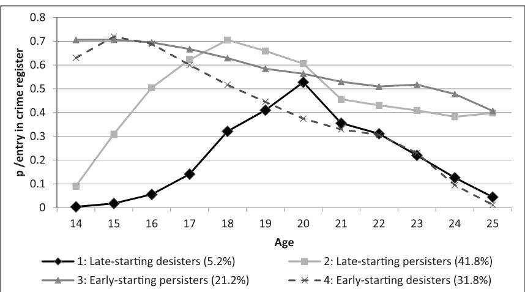

**8777[69](http://crossmark.crossref.org/dialog/?doi=10.1177%2F1477370819877769&domain=pdf&date_stamp=2019-10-16)**EUC0010.1177/1477370819877769European Journal of Criminology**Taefi and Hosser**

*research-article*2019

*Article*

# **Trajectories of delinquency among young adult prisoners**

https://doi.org/10.1177/1477370819877769 European Journal of Criminology © The Author(s) 2019 Article reuse guidelines: [sagepub.com/journals-permissions](https://uk.sagepub.com/en-gb/journals-permissions) DOI: 10.1177/1477370819877769[journals.sagepub.com/home/euc](https://journals.sagepub.com/home/euc) 2021, Vol. 18(6) 855–874

# **Anabel Taefi**

Hamburg University of Applied Police Sciences, Germany

# **Daniela Hosser**

Technical University of Braunschweig, Germany

#### **Abstract**

Using latent class growth analysis, this prospective longitudinal study aimed to identify different trajectories of delinquency among prisoners (*N* = 2352) of youth correctional facilities. Criminal behaviour was monitored with crime register data on individuals from ages 14 to 25. Analyses revealed four developmental pathways: early- and late-starting desisters (31.8 percent and 5.2 percent, respectively) and early- and late-starting persisters (21.2 percent and 41.8 percent, respectively). The effects of potential risk and protective factors from multiple domains (individual, family, peer and social factors) were analysed with analyses of variance and χ² tests for each of the distinct trajectory groups. The quantity of risk factors was higher throughout the observation period in the persisting groups. Cumulative disadvantages could often be found in the persistent trajectories when low social bonds and low commitment to social norms persisted until (early) adulthood. Similarly, higher social capital and social competencies were more prevalent among offenders who desisted from crime, regardless of the severity of their offences committed as adolescents.

#### **Keywords**

Juvenile delinquency trajectories, persistence, prisoners, risk factors

# **Introduction**

Developmental and life-course criminology focuses on between-individual differences as well as on stability and change in the development of delinquent behaviour across the lifespan (Farrington, 2003a, 2005). The field's main research tasks are the identification

**Corresponding author:**

Anabel Taefi, University of Applied Police Sciences, Carl-Cohn-Straße 39, Hamburg D-22297, Germany. Email: [anabel.taefi@polizei-studium.org](mailto:anabel.taefi@polizei-studium.org)

of developmental pathways to crime, the analysis of the influence of risk and protective factors during different life stages and the effects of critical life events, turning points or interventions in criminal behaviour (Farrington, 2015).1 In line with these tasks, the present article analyses the delinquency trajectories of registered offending of young highrisk offenders who were convicted and incarcerated at least once during adolescence or young adulthood. We used a prospective design in which self-reporting and official data were combined. The major 'career parameters' under focus were frequency and duration (Boers, 2007; Rocque et al., 2015) of registered offending. We thereby aimed to fill a research gap: frequent placement in residential environments or longer periods of imprisonment make young high-risk offenders a hard-to-reach population for regular surveys, thus they are often underrepresented in developmental studies of delinquent behaviour and are frequently summarized and described, for example, as *persistent, chronic offenders* without further differentiation.

# **Trajectories of delinquency: Theoretical concepts and empirical distinctions**

Although it has long been known that deviant and delinquent behaviour are a typical part of adolescents' individual development and hence the age–crime curve is universally valid (Rutter et al., 2001), it also is true that a small minority of the population accounts for the majority of all offences. These *high-level chronic offenders* start offending as early as in middle childhood (Farrington et al., 1998; Farrington and West, 1993; LeBlanc and Frechette, 1989; Moffitt, 1993; Wolfgang et al., 1972).

In 1993, Moffitt published the dual taxonomy of *life-course-persistent* and *adolescence-limited offending* in which the life-course-persistent offending type was described as exhibiting neuropsychological problems and (detrimental) interactions of biological factors with the social environment, thereby leading to antisocial behaviour, whereas adolescence-limited offending was linked to a maturity gap, mimicking and social learning. At the same time, Sampson and Laub (1993, 1997) described similar types of persistent and desisting offenders and introduced the concept of turning points to account for desistance. On the basis of Hirschi's theory of social bonds (1969), Sampson and Laub's theory explains how the structural context in which an individual grows up influences their social capital as well as their informal social controls. Low bonds with the family and rejection in school can result in early childhood delinquency. Subsequently, in later stages of development, different agents of informal social control shape the individual's behaviour (for example, peers, partners, co-workers). *State dependence* describes how, in each of the steps in antisocial development, there is an accumulation of disadvantages that further marginalize individuals and make consecutive deviant behaviour more likely, which explains stability. In Sampson and Laub's theory, changes in delinquency can be explained by transitions or turning points that go along with changes in a person's social capital, for example, increasing through a change in informal social control via a strong bond with a partner or institution (for example, employment or army) in early adulthood. The main factors of desistance from offending are described to be marriage or the presence of a stable relationship in adulthood, moving to a better neighbourhood, serving in the army or getting a satisfying job (Laub and Sampson, 2001).2 This rather sociological approach to the explanation of stability and change in delinquent behaviour can be seen as a valuable extension to Moffitt's dual taxonomy (1993). The accumulation of disadvantages may take its starting point from Moffitt's description, whereby the ability to create and hold formal and informal bonds may moderate the chances of desisting from a criminal career.

Since the formation of this theoretical foundation, life-course criminology has applied different types of trajectory analyses in order to gather a multitude of basic and specific knowledge concerning intra-individual stability or change in the development of delinquent behaviour over time (Farrington, 2003a). In longitudinal studies, the number of identified trajectories usually ranges between two and five, and these trajectories differ according to the method chosen as well as to the population targeted (Blokland et al., 2005; Boers and Reinecke, 2007; Bushway et al., 2003; Dahle, 2005; Evans et al., 2016; Farrington et al., 2006; Loeber et al.,1993; Moffitt, 1993; Moffitt et al., 1996; Murphy et al., 2012; Nagin and Land, 1993; Piquero, 2008; Prein and Schumann, 2003; Sampson and Laub, 2003; Stelly and Thomas, 2005; Thornberry, 2005; Walters, 2012). Typically, there is a large share of approximately 50 percent of non-delinquently involved (or at least hardly involved) individuals in these studies, which often focus on birth cohorts or the general population (see more recent publications, for example Boers et al., 2010; Gann et al., 2015; Murphy et al., 2012; Odgers et al., 2008, Piquero et al., 2010). If only studies using latent group-based trajectory models that identify unobserved heterogeneity in longitudinal datasets are taken into account, as was done in a systematic review by Jennings and Reingle (2012), a range of two to seven groups can be identified. Most of these studies describe three or four groups that overlap with Moffitt's dual taxonomy and basically distinguish between different *persisting* and *desisting* trajectories. In a re-analysis of male Dunedin data with Growth Mixture Models, three antisocially involved types were distinguished from one another when observing the age range of 7 to 26 years: 10.5 percent life-course persisters, 19.6 percent adolescent-onset offenders and 24.3 percent childhood-limited offenders were found (Odgers et al., 2008).

In addition to the above-mentioned studies addressing rather general populations, those explicitly focusing on samples of (partly even serious) offenders provide even more detailed knowledge about the specified trajectories. These studies also differentiate among trajectories according to high-rate chronic offenders with the highest frequency and most persistent trajectories and moderate or rare offenders who occasionally act (Blokland et al., 2005; Dahle, 2005; Sampson and Laub, 2003; Stelly and Thomas, 2005; Thornberry, 2005; Van der Geest et al., 2011; Wiesner et al., 2007), as well as latecomers to crime with a comparatively high age of onset (Dahle, 2005; Stelly and Thomas, 2005) and of course different types of 'age-limited'-offending desisters with different pathways (for example moderate or classic; Blokland et al., 2005; Bushway et al., 2003; Dahle, 2005; Sampson and Laub, 2003; Stelly and Thomas, 2005; Van der Geest et al., 2011). Studies with data covering very long observation periods have been particularly – but not exclusively – prone to demonstrating that there are offender subgroups that desist from offending for a longer period of time and then – at older ages – might begin again (Bushway et al., 2003; Sampson and Laub, 2003). This finding may also be true for shorter observation periods, but this information on intermittent trajectories might get lost due to the use of Growth Mixture Models and Latent Class Growth Analysis (LCGA), which simplify the variance by trying to fit the individuals into the models, as Bushway and Tahamont (2016) have recently argued.

### **Causes of stability and change**

The relative stability of deviance and delinquency from childhood to adulthood has been described in the above-mentioned concept of state dependence (Farrington, 1989, 1992; Tracy and Kempf-Leonard, 1996) or cumulative disadvantages (Sampson and Laub, 1993). In various works, involvement in delinquency has been shown to increase the probability of future offending because individual and social circumstances and chances are negatively impacted by the preceding behaviour (Farrington, 2015; Gann et al., 2015; Loeffler, 2013; Nagin and Paternoster, 1991; 2000; Nieuwbeerta et al., 2004). Hence, many recent studies have continued to find childhood risk factors and an early onset of offending to be the best predictors of persistent offending (Baglivio et al., 2015; Bosick et al., 2015; Day et al., 2014).

On the other hand, when comparing the risk factors of life-course-persistent offenders with those of adolescent-limited offenders in a meta-study comprising 48 studies, Assink et al. (2015) came to somewhat divergent conclusions. They summarized that criminal history and aggression have the strongest predicting effects on persistent delinquent behaviour, followed by alcohol/drug abuse, sexually deviant behaviour, relationships, emotional and behavioural problems and school/employment, whereas family-related factors and neuropsychological and physiological factors had rather small effects, and socio-demographic factors had only limited effects. Physical health factors and neighbourhood characteristics had limited effects as well, and the authors hence argued that what distinguishes both types of offenders may be the quantity and not the quality of the risk factors. This interpretation is interesting insofar as we can also apply it to the findings regarding the three trajectories of prison inmates from the German CRIME study (Dahle, 2005). All of the examined individuals had exhibited delinquent behaviour in adolescence: early active offenders primarily displayed social risk factors, age-limited intense offenders mainly displayed biological risk factors and persistent intense offenders showed risk factors in all areas. However, up to now, in accordance with Laub and Sampson (2001), it can be said that, for adult offenders, quality of work and bonds created by legal work facilitate desistance (Lageson and Uggen, 2013). The negative effect of imprisonment on employment fortunately seems to be rather short term (a one-year effect, as found by Van der Geest et al., 2011).

### **The present study**

This prospective study aimed to identify and characterize distinct trajectories of delinquency from age 14 to 25 in a sample of young prisoners. Theory and empirical evidence suggested that different trajectories varying in onset, duration and shape of the trajectory could be found in the data. We hypothesized that, at the end of our observation period (at the age of 25), one or more persistent trajectories would clearly be distinguishable from desisting pathway(s) and would be explainable by different patterns of risk factors. According to Moffitt's taxonomy, proximal protective factors should particularly facilitate desistance in late-starting groups of offenders without a multitude of adverse risk factors at a young age. It is unclear whether this assumption is also true for earlydeviant offenders or if they need an accumulation of social bonds in multiple areas in order to enable desistance when early and severe adverse risk factors have been present. This question has not yet been addressed by similar samples. Nonetheless, guided by assumptions resulting from the age-graded theory of informal social control, the areas of informal social control, social bonds and social capital – or their absence – in different stages of development were assumed to influence the probability of offending. Thus, the included risk factors in this study were the family, school and peer contexts, while the risk and protective factors that were collected after the prisoner's release from their first prison term focused on social bonds and social reintegration.

## **Data and methods**

### *Participants*

This study was conducted as a part of a prospective research project, the 'Hanover Prison Study' (funded by the Volkswagen Foundation, 1997–2003; Greve et al., 2004) and the subsequent study 'Developmental Consequences of Incarceration' (funded by the German Research Foundation, 2004–12). The projects examined the effects of a prison sentence on young adult offenders serving their first custodial sentence in a youth correctional facility (Hosser et al., 2008). Participants (*N* = 2405) were recruited from six northern German institutions located in several German federal states. All male inmates of German nationality who were incarcerated for the first time were asked to participate in the study if their prison term began between 1998 and 2001. According to prison staff, about 89 percent of inmates meeting the criteria agreed to participate; the only exclusion criterion was insufficient German language skills, which applied to both native as well as immigrated German citizens. Participation in the study was voluntary, and we assured confidentiality according to the criteria of informed consent. As compensation, participants received €10 and €40 for interviews during and after the prison term, respectively. The study was approved by the review boards of the prison administrations, the Ministers of Justice in the involved federal states and the National Data Protection Authorities. Moreover, the advisory board of the Criminological Research Institute of Lower Saxony provided an ethics review and approval for the study.

Sending an individual to a youth correctional facility is the last resort of the juvenile penal system and is rarely practised in Germany (6.7 percent of all convictions; Walkenhorst, 2010); hence, the sample can be regarded as a severe-offender population consisting of offenders with either long criminal careers before incarceration or very serious offences leading to their first prison term. During the first prison term, participants were interviewed three times. The first interview (*t*1) was conducted shortly after incarceration (usually within the first four weeks), the second interview (*t*2) about eight weeks after *t*1, and, if possible, a third interview (*t*3) took place as close as possible to release but could not be conducted in every case because some participants' release dates were changed at short notice. All three interviews were limited to 90 minutes each. Participants were interviewed up to four times after release from their first prison term. The first interview after their first term had been served (*t*4) usually occurred around three years after their release. In the event of a reconviction, another interview was conducted (*t*5), if possible. Furthermore, the studies' participants were interviewed twice via telephone (in liberty) instead of face-to-face in 2004–5 (*t*6) and during 2008 (*t*7). The latter method was chosen in order to regain contact with as many participants as possible. The intervals between interviews were unevenly spaced and, depending on the length of the first prison term, varied individually. In addition to the interviews, information from prisoners' personnel files from their first incarceration was also collected. The files contain all inmate-related information and decisions related to their prison term (among these, measures received, sanctions imposed and data on their personality and behaviour from the correctional officers' perspective) but can also hold information gathered during the criminal trial. The original sample size was reduced to 2352 participants because 53 participants who died before turning 25 were excluded.

At the time of imprisonment, the participants' ages ranged from 14.7 to 25.5 years (*M* = 19.3, *SD* = 2.1), which is consistent with German legislation that allows young offenders to be committed to youth correctional facilities up to the age of 24 and matches closely with the average age of young offenders in Germany, which is 20 (Dünkel and Geng, 2007). Participants served prison terms that averaged 1 year and 8 months (*SD* = 1 year 2 months, with range lying between 1 month and 9 years and 6 months3); 95 percent of all participants were released by 3 years and 9 months after their prison term started. Seven participants with long prison terms had not been released before the crime register data were gathered but have not been excluded from the analysis: nearly all of them exhibited at least one more entry after incarceration (extending their initial sentence) and they self-reported offending during their prison term – so recidivism was possible, although arguably not as 'successful' as a criminal career outside of prison.

The most serious offences for which the participants were sentenced (also referred to as *index crime* or *index offence*) were property offences (35.4 percent), bodily injury (32.4 percent), grievous bodily harm (14.7 percent), drug offences (4.7 percent), homicides (3.0 percent) and sexual offences (1.8 percent), with other offences (8.0 percent) such as traffic violations, driving without a licence or desertion from military service representing the remainder. Among the inmates, 46.7 percent were school dropouts and 46.8 percent were unemployed before imprisonment.

## *Measures*

*Registered offending.* Official data on offending were gathered at the German Federal Central Register, an institution operated by the German Federal Office of Justice, which administers a database that contains all legal decisions made in Germany. According to Section 4 of the Federal Central Criminal Register Act of 1971, all final rulings considering offences committed in Germany or by German citizens or residents abroad have to be entered into the German Federal Central Register (Bundesamt für Justiz, 2016). Registered offending is measured via the date of the entry in the crime register, which provides the date of the offence (or of the last offence; see below) and also enables the calculation of the speed of recidivism after release. Data from the Register were gathered in the year 2007.

Public prosecution can summarize a multiplicity of single offences in one investigation – for example in cases of massive offending – with the objective of accelerating and unitizing the investigations as regulated in the Guidelines for Criminal and Summary Proceedings. Offenders may therefore have committed several offences but have received only one entry in the crime register. As this appeared in the majority of entries in our crime register database, with often between 10 and 40 single offences summarized, we decided to dichotomize the outcome variable of registered offending for the LCGA calculation in order to obtain information only on the existence of at least one entry in each year of life ('yes' or 'no') beginning at the age of 14 (the age of criminal responsibility in Germany). Simplifying the data made these observations more comparable. Also, we decided not to exclude prison terms from the calculation of delinquency trajectories, since many participants gained new entries during their term, and violence is described as a frequent or sometimes even an everyday problem in German youth correctional facilities (Boxberg and Bögelein, 2015; Klatt et al., 2016; Neubacher et al., 2011).

*Self-reported criminal behaviour.* Information from interviewees' self-reports was used in order to assess undetected criminal activities after release, but is not included in the identification of delinquency trajectories. Each of the three interviews in freedom included up to 12 questions on five property offences (minor theft, theft of valuable goods, handling of stolen goods, burglary, breaking and entering a car), five violent offences (vandalism, robbery, bodily injury, grievous bodily harm, sex offences) and four other offences (driving under the influence, driving without a licence, drug offences, arson).4 If a participant gave information on only committing vandalism, minor theft or driving without a licence after release, this information was used to check whether any of the latent classes displayed a tendency towards petty offences when re-offending (petty offence: 'yes' or 'no'). Information on self-reported offending after release was added to the knowledge about criminal record data to obtain an 'overall recidivism rate'.

*Risk and protective factors.* In line with developmental theories, we chose several factors related to different developmental stages in the participants' lives that indicated severe childhood risk factors or early risk in family and school. Information on early-deviant behaviour was gathered from the prisoners' personal files. A binary variable (0 = no, 1 = yes) was used for information on a large variety of deviant behaviour and conduct problems in childhood and youth – such as delinquency before the age of criminal responsibility (14), aggressive behaviour in school, school absenteeism and psychiatric disorders or hospitalization (before age 16), documented in the files deriving as information from criminal proceedings or psychological or medical evaluation. All other information was gathered from self-reports in the interviews. Being placed in at least two foster homes during childhood or youth (0 = no, 1 = yes) has been included as a risk factor, since a single placement in foster care has a predominantly positive influence on children's personality development whereas frequent relocation has been shown to be rather harmful (Hansen, 1994). School dropout before first incarceration (0 = no, 1 = yes), being part of a steady gang before imprisonment (0 = no, 1 = yes) and age at first imprisonment were also chosen as risk factors because they represented socialization, environment and background factors in childhood and adolescence.

Factors that described life after first prison term focused instead on agents of socialization and participants' integration in conventional activities in young adulthood. These factors addressed social bonds and reintegration, proximal risk or protection factors and could hint at cumulative disadvantages. Information about unemployment (0 = no, 1 = yes) was gathered from the first interview after release, regardless of whether it was in freedom or if participants had been imprisoned again. Data on being in a stable relationship after release (0 = no, 1 = yes) and becoming a father after release (0 = no, 1 = yes) were combined from all interviews after the first prison term. The presence of debt higher than €500 (0 = no, 1 = yes), at least 'regular' (= more than monthly) use of hard drugs (and/or 'frequent' (= more than weekly) use of cannabis; 0 = no, 1 = yes) and at least

some information on a struggle with social reintegration. The scale 'normative orientation' combines mean values from the four interviews after first incarceration – *t*4 (α = .86), *t*5 (α = .85), *t*6 (α = .78) and *t*7 (α = .81). The scale was taken from the 'Attitudes Towards the Legitimacy of Law' and the 'Questionnaire on Prisonization' from Ortmann (1987) with 16 and 8 items (short version), respectively, which were complemented by five items from Seitz's 'Personality Questionnaire' (1983). Answers were to be given on a four-point Likert scale (1 = not at all, 2 = somewhat, 3 = highly, 4 = extremely).5

daily alcohol use (0 = no, 1 = yes) after release from the first prison term may provide

### *Analytical strategy*

In longitudinal datasets, LCGA (Nagin, 2005; Nagin and Land, 1993) was able to identify and summarize trajectories of similarly developing individuals in groups. In so doing, inter-individual differences in intra-individual change over time became visible (Nesselroade, 1991). LCGA has become one of the main methods of longitudinal data analysis, though this rise in popularity has been accompanied by some criticism and intense discussion (Kreuter and Muthén, 2008). Bushway and Tahamont (2016) have recently argued that, by trying to fit individuals into the models, too much of the variance between individuals might be lost and overlooked by researchers when interpreting the data. Skardhamar (2010) has pointed out that the method can instead be used exploratively (or to test taxonomic theories with discrete distributions) but not to test general theories of crime that assume continuous crime distributions – a question also posed by Greenberg (2016) in a current paper. Brame et al. (2012) categorically oppose this position by mentioning the multiplicity of possible models and data distributions in mixture modelling. However, they add that they agree with Skardhamar that it is a rather exploratory method but that the identification of groups is a modelling question; the meaningfulness of the interpretation of these groups is decidedly a theoretical question and, deductively, whether the groups described in theory can be found in the data (and can show the characteristics described in the theory) should be investigated. Bushway et al. (2009), Raudenbush (2005) and Sampson and Laub (2005) have discussed the impact of findings on policy-makers and whether they interpret the existence of a statistic of a chronic group of offenders to mean that a real, identifiably distinct group of offenders exists that is predetermined to be chronic offenders – and false conclusions may be drawn at a policy level.

In order to answer the research question defined here – to exploratively identify distinct delinquency trajectories as a first step to further differentiation in a high-risk sample – LCGA was chosen and conducted with the 'Proc Traj' procedure for LOGIT models (Jones et al., 2001; Jones and Nagin, 2007) and SAS Software.

A characterization of identified trajectories was conducted with SPSS 23 for Windows: the existence and distribution of possible risk and protective factors in the groups are examined by analyses of variance and χ² tests.

## **Results**

## *Identification of trajectories*

The parameters of several exploratively conducted LCGAs imply that, in line with previous research findings (see Bersani et al., 2009; Blokland et al., 2005; D'Unger et al., 1998; Kreuter and Muthén, 2008; Piquero et al., 2010), three to five delinquency trajectories can be found by using the same method and an observation period that also covers the phase of emerging adulthood. The most parsimonious and bestfitting model in line with theoretical assumptions on the shape of the groups – the four-group model – was chosen (BIC = −18,561.59, AIC = −18,512.61, *N* = 2352, see Figure 1).

The four groups could be distinguished by the onset and duration of the trajectories. They also differed in the mean number and range of entries in the Federal Register, in the speed of re-offending, and in the rate of reincarceration (Table 1).

The recidivism rate after release from first imprisonment was in total 87.6 percent for the whole sample; 54.6 percent of individuals were incarcerated again, which is in line with previous studies (Jehle et al., 2003).

**Figure 1.** Four-group model of delinquency trajectories (LCGA).

| Indicator                                          | Total                   | LSD (N = 123) | LSP (N = 983) | ESP (N = 499) | ESD (N = 747) | df | F     | p    |
|----------------------------------------------------|-------------------------|---------------------|---------------------|---------------------|---------------------|----|-------|------|
| M = N of registered offences (MIN–MAX) | 10.0 (0a – 32) | 4.4 (0–22)       | 10.6 (1–31)      | 13.3 (1–32)      | 7.8 (1–21)       | 3  | 243.3 | .000 |
| M = Speed of re offending: years (SD)     | 1.2 (1.2)            | 2.3 (1.8)        | 1.1 (1.2)        | 1.0 (1.0)        | 1.3 (0.1)        | 3  | 21.5  | .000 |
|                                                    |                         |                     |                     |                     |                     | df | χ²    | p    |
| Registered re offending (percent)               | 87.6                    | 53.7                | 92.7                | 99.6                | 78.6                | 3  | .343  | .000 |
| Reincarceration (percent)                       | 54.6                    | 17.1                | 58.2                | 72.1                | 44.3                | 3  | .268  | .000 |

**Table 1.** Career parameters by trajectory groups (*N* = 2352).

a Of the 2352 participants still alive in the year 2008, three had no entry in the crime register. All three were assigned to the group of late-starting desisters (LSD). Entries before incarceration must have already been erased owing to impunity at the time of the crime register retrieval.

### *Specification of the four-trajectory solution*

*Early-starting desisters* (ESD) made up nearly one-third of our sample (31.8 percent; *N* = 747, see Figure 1). Their trajectories began at age 14 with a very high probability of being registered, but, after peaking at age 15, their trajectories decreased steadily and rapidly. ESDs' absolute number of entries in the Register was accordingly relatively low (21; see Table 1).

*Early-starting persisters* (ESP) accounted for 21.2 percent (*N* = 499) and maintained a continuously high and only moderately decreasing probability of being recorded in the Federal Central Register. At age 14, these young men were the most criminally active – or the most often registered – offenders in comparison with all other groups.

*Late-starting desisters* (LSD) make up only 5.2 percent of our participants (*N* = 123). From ages 14 to 17 and again from 21 on, their likelihood of appearing in the Register was rather low. At their peak of registered offending, between ages 18 and 20, this group still had the lowest mean of registered offences in total (4.4; see Table 1).

*Late-starting persisters* (LSP) accounted for 41.8 percent (*N* = 983) of the sample. This large group was characterized by an escalation from a similarly low probability for registered offending at age 14 up to a very high likelihood at age 18. This probability remained high and exceeded the other three groups until age 20. Thereafter, their trajectory levelled off only moderately. Likewise, LSPs' mean value of the number of entries in the Crime Register was high, at 10.6.

### *Official versus self-reported crimes*

However, since trajectories were measured only via officially registered crime data, it is indeed possible that participants in the study were erroneously classified as desisters regardless of the fact that they were still violating the law. To estimate the proportion of misclassification, our study provided the opportunity to compare crime records with selfreported criminality for a part of the sample and to match the two sets of information. The results of this matching reveal that precisely half of the 12.4 percent of interviewees gave information on offending after release reported delinquent acts that had not been recorded in the crime register. Perhaps some of these criminal acts had been recorded but not entered in the crime register owing to negligibility, but this case would represent an exception. When taking this information into account, the overall recidivism rate would rise from 87.6 percent to 93.1 percent. Moreover, 24.3 percent of individuals with a new entry in the Register did not provide correct information on re-offending after their release. When subdivided by trajectory groups, ESDs' information about re-offending taken from the interviews corresponded best with the crime register data (only 16.6 percent provided incorrect information about their desistance).

### *Characterization of trajectories*

Furthermore, the four trajectory groups were characterized with reference to risk and protective factors. Table 2 gives a descriptive overview on the prevalence of these factors in each of the four trajectory groups.

ESDs mostly exhibited risk factors early in their biographies (see Table 2). Many of them had dropped out of school (63.4 percent), had lived in more than one foster home (16.4 percent) and displayed early deviant behaviour (45.4 percent). Also, they were youngest when imprisoned (18.1 years). Although only around 1.0 percent of the two persistent trajectory groups were homicide offenders, the proportion among ESDs was higher, at 4.6 percent. Taken together, nearly 60 percent of this group's index offences were violent or sex offences. Petty offences as recidivist acts after release were a bit more common throughout this group, at 11.1 percent, which may be one of the reasons their recidivism and reincarceration rates are comparatively low (see Table 1), although proximal protection factors are not completely widespread. It can only be presumed (but not tested with the data at hand) that their early offending might be connected to their stable group of friends (gang before imprisonment: 78.5 percent) as teenagers and that they stopped after 'ageing out'.

Property offending (38.6 percent), bodily injury (34.7 percent) and grievous bodily harm (14.5 percent) dominate the spectrum of ESPs' index offences, whereas homicide (1.0 percent) and sex offences (0.2 percent) were rarely among the offences they were sentenced for (see Table 2). They display a large number of risk factors: they were oftentimes placed in multiple foster homes (21.1 percent), and represented the highest percentage of persons with early deviance (51.8 percent) and a high rate of school dropouts (57.5 percent), which hints at further severe childhood risk factors. Additionally, they were particularly prone to exhibiting a lack of social bonds and reintegration after their first prison term. As adults, many of them failed to find employment (66.1 percent) and consumption of substances is exceedingly widespread in this group (drugs, 45.5 percent, and/or alcohol, 23.5 percent). They often had debts (86.4 percent), and, although the potentially protective factors of a stable relationship (82.8 percent) or fatherhood after release (62.8 percent) were widespread, they did not seem to contribute to desistance in the course of the observation period.

| Risk/protective factor                                             | LSD        | LSP        | ESP        | ESD        | All participants | df | F     | p    |
|--------------------------------------------------------------------|------------|------------|------------|------------|---------------------|----|-------|------|
| M = Age at imprisonment (SD), N = 2341                 | 21.1 (1.6) | 20.1 (1.7) | 19.1 (1.9) | 18.1 (1.9) | 19.3 (2.1)       | 3  | 208.9 | .000 |
| M = Normative orientation after release (SD), N = 1714 | 3.3 (0.5)  | 2.9 (0.6)  | 2.9 (0.5)  | 2.9 (0.5)  | 2.9 (0.5)        | 3  | 13.4  | .000 |
|                                                                    |            |            |            |            |                     | df | χ²    | p    |
| Early deviance (percent), N = 2193                           | 17.1       | 33.7       | 51.8       | 45.4       | 40.4                | 3  | .184  | .000 |
| Foster care (percent), N = 2313                              | 2.5        | 11.7       | 21.1       | 16.4       | 14.4                | 3  | .130  | .000 |
| School dropout (percent) , N = 2133                 | 27.1       | 43.6       | 57.5       | 63.4       | 51.5                | 3  | .209  | .000 |
| Clique before imprisonment , N = 2342 (percent)     | 68.0       | 70.1       | 72.3       | 78.5       | 73.1                | 3  | .086  | .001 |
| Frequent drug use after release (percent), N = 1616 | 24.4       | 36.6       | 45.5       | 40.3       | 39.1                | 3  | .097  | .002 |
| Unemployment after release (percent), N = 1485            | 38.7       | 59.0       | 66.1       | 56.8       | 58.9                | 3  | .117  | .000 |
| Debts after release (percent), N = 1714                      | 85.4       | 85.8       | 86.4       | 78.8       | 83.7                | 3  | .091  | .003 |
| Stable relationship after release (percent), N = 1720     | 82.0       | 80.9       | 82.8       | 80.4       | 81.2                | 3  | .023  | .816 |
| Daily drinking after release (percent), N = 1593          | 15.9       | 18.8       | 23.5       | 17.9       | 19.4                | 3  | .058  | .121 |
| Fatherhood after release (percent), N = 1769              | 70.2       | 60.2       | 62.8       | 58.3       | 60.7                | 3  | .056  | .131 |
| Recidivism: petty offence (percent), N = 889              | 8.3        | 8.2        | 7.6        | 11.1       | 8.9                 | 3  | .051  | .502 |
| Index offence                                                      |            |            |            |            |                     |    |       |      |
| Homicide (percent), N = 2339                                 | 13.9       | 1.5        | 1.0        | 4.6        | 3.0                 | 3  | .172  | .000 |
| Grievous bodily harm (percent), N = 2339                     | 13.1       | 15.8       | 14.5       | 16.6       | 14.7                | 3  | .029  | .057 |
| Bodily injury (percent), N = 2339                            | 17.2       | 30.6       | 34.7       | 35.8       | 32.4                | 3  | .091  | .000 |

**Table 2.** Risk and protective factors and characteristics of trajectory groups.

 *(Continued)*

| Risk/protective factor                     | LSD  | LSP  | ESP  | ESD  | All participants | df | F    | p    |
|--------------------------------------------|------|------|------|------|---------------------|----|------|------|
| Sex offence (percent), N = 2339      | 4.9  | 1.7  | 0.2  | 2.3  | 1.8                 | 3  | .081 | .002 |
| Property offence (percent), N = 2339 | 26.2 | 36.6 | 38.6 | 33.2 | 35.4                | 3  | .062 | .031 |

**Table 2.** (Continued)

LSDs were disproportionately often imprisoned as a result of serious violent (27.0 percent) and sex offences (4.9 percent). They were mainly defined by the lowest prevalence of risk factors (see Table 2). Early deviant behaviour was not as typical for them (17.1 percent) as it was for the other three groups. School dropouts (27.1 percent) and placement in multiple foster homes (2.5 percent) were rare among them, which means that early and severe childhood risk factors, family and school risk factors were not as prevalent among them as in the early-starting groups in particular. After release, social bonds and reintegration were high. LSDs exhibited the highest normative orientation of all groups (*M* = 3.3). They were often employed (61.3 percent) and became fathers after release (70.2 percent). As they were the oldest and had served the longest prison terms, desistance might have occurred as a classic process of ageing out. In contrast to the LSD group, LSPs' early risk factors were much wider spread (see Table 2) and most proximal risk factors were more prevalent, whereas proximal protection factors were less prevalent among the LSPs. Although their profile is not as distinct compared with the highly stressed ESP group, it can be assumed that cumulative disadvantages can also often be found among the participants in this group: 33.7 percent exhibited early-deviant behaviour, nearly half of them had dropped out of school (43.6 percent) and failed to find employment after release (59.0 percent).

# **Discussion**

Our study aimed at identifying and characterizing distinct trajectories of offending in a sample of German youth correctional facility inmates who had been incarcerated for the first time. Four trajectories were identified on the basis of the inmates' career parameters. The frequency and speed of recidivism differed between the four groups. Trajectory groups could be differentiated by risk (or protective) factors. Early delinquency and early risk factors in childhood were interwoven. An early start to delinquent behaviour often went hand in hand with placement in foster care and school dropout. Persistent offending was often accompanied by cumulative disadvantages (Sampson and Laub, 1993), as was particularly clear in the ESP group, which displayed a trajectory and risk profile especially reminiscent of Moffitt's life-course-persistent type (1993). Desistance seems to have been connected to proximal protective factors, such as employment and a high normative orientation, which may have resulted from pro-social bonds. For most offenders, impaired informal social bonds (with parents, schools and work and peers) seem to have weakened their social capital in the sense of Sampson and Laub's theory, since 60 percent of the entire sample consisted of persistent offenders with widespread risk factors in late childhood and youth. The prevalence of risk factors in both persistent groups was clearly higher than in the desisting groups. In this respect, the results may be compared with the Berlin CRIME study (Dahle, 2005), which came to a similar conclusion regarding the persistent intense-offender type (though it identified significantly fewer persistent offenders). Beginning with early deviance or residency in foster care, after release, persistent offenders exhibited low social bonds and a low commitment to social norms and social institutions, such as school, employment or forming a career. It seems that, without adequate intervention or intrinsic motivation, deviant development could not be cut off.

Notable effects seem to have emanated from employment after release (Falk et al., 2008; Lageson and Uggen, 2013). The moderating protective effect of a partnership or of children in young adulthood could not be confirmed with our data, which may be due to a lack of variance in the data because the majority of participants were constantly in relationships that they rated as being very stable and very happy, though some participants continued to move from one relationship to the next. Furthermore, it should be taken into account that some risk factors were chosen that can signify very different things in different circumstances. The age-graded theory of informal social control was stretched to its limit in this regard, and it has been criticized in current papers (see Rau, 2016; Zoutewelle-Terovan et al., 2014). Sampson and Laub have implied that marriage is a protective factor without taking a closer look at the quality of the relationship, and, as Na (2016) has recently pointed out, fatherhood can have a very divergent effect for adolescents or young adults.

The proportion of erroneous desisters among LSDs also revealed that they may commit offences that are not well controlled or pursued by law enforcement. Moreover, by living a well-integrated life, both desisting groups were able to break the cycle of becoming a regular suspect of formal social control, which has also been described by Moffitt (1993) for the adolescence-limited offender type. It is also possible that their offences more often ended with a case dismissal, which – for adults – was not entered in the crime register. This possibility may have been especially true for the ESD group, which committed unregistered petty offences.

As ESD and LSD trajectories have shown, committing serious violent crimes does not necessarily imply long-term delinquency. These results are in accordance with findings from studies addressing homicide offenders who lack a preceding criminal record (Dobash et al., 2007; Taefi et al., 2017). Some of these offenders are known to lack family risk factors and have attained a high level of education. Analyses at hand reveal that even serious violent offenders *can* reintegrate into society after having served a sentence because a considerable proportion of them possess the necessary abilities – the social capital and competencies – for reintegration. Some of these offenders – in this study, the LSD group – even exhibit the fewest risk factors in the course of their development. In the majority of cases, offenders with comparatively less serious offences seem to be confronted with far more severe and grievous developmental and socialization deficits. These offenders urgently need to be addressed via therapy in youth correctional facilities because only those who consider themselves to be part of society and act in accordance with social norms and values can be *re*integrated. Therefore, therapy should be a requirement for inmates not only based on the selection criterion of 'index offence' but also based on the severity of the individuals' socialization deficits and the seriousness of their delinquency trajectories.

Of course, the limitations of the present study must be taken into account. Often, we took a decision to reduce the complexity of the data gathered for this analysis, mainly owing to unevenly timed interview intervals. Also, the analysis of trajectories was limited to registered crime data. Although (registered) offending during the prison term is possible, one may argue that, compared with life outside, the chances of offending are at least limited. Hence, desistance was probably overrated in our analysis. Furthermore, as Payne and Piquero (2018) have pointed out in a recent paper, not only should the concordance or discordance of official records and self-reports be explored more often, but findings should reflect on developmental theory. Also, owing to the binary outcome variable of the trajectory analysis, no further differentiations of groups could be made with respect to low-level chronic or moderate persisters (Blokland et al., 2005; Dahle, 2005; Sampson and Laub, 2003; Stelly and Thomas, 2005; Thornberry, 2005; Van der Geest et al., 2011; Wiesner et al., 2007). Furthermore, with the data at hand, by observing the sample up to age 25, no hypotheses about intermittence or the stability of desistance could be addressed. Future studies should take this issue into account, gather data that exceed the developmental phase of emerging adulthood and especially try to tackle the obstacle of summarized offences in the crime register data, which limited our possibilities – although, then, only a much smaller sample size might be addressed and revised.

Furthermore, for the analysis at hand, dual interpretations should be considered relating to various factors. Debts can result from economic difficulties or criminal trials but can also derive from the purchase of a house. Children can be a sign of a happy and mature partnership but can also be a severe stress factor, for example if there is no stable income. Daily drinking can be considered off-limits or be socially accepted (for example, in the case of one beer after work), and even regular drug use can serve merely recreational purposes.

Future research should take a closer look at severe trajectories of offending since there is a wide variety of highly active perpetrators. In so doing, the quantity, quality and types of offences should be integrated in the analyses. Thus, correctional facilities, which still assign treatment to offenders based on the type of crime committed, could improve the allocation of resources and strengthen their role in becoming successful agents of offender reintegration.

#### **Funding**

The author(s) disclosed receipt of the following financial support for the research, authorship, and/ or publication of this article: The project was funded by the German Research Foundation, project ID 5410225.

#### **ORCID iD**

Anabel Taefi <https://orcid.org/0000-0002-7637-3327>

#### **Notes**

1. For more detailed overviews on developmental and life-course theories and research projects, see Farrington (2003b, 2005); Hawkins et al. (1998); Stelly and Thomas (2005); Thornberry (1997); Thornberry and Krohn (2003); Lahey et al. (2003).

- 2. For further important publications regarding desistance from a qualitative perspective, see, for example, Maruna (2001) and Farrall and Calverley (2006).
- 3. This information contains the actual time served; the sentenced time is slightly longer at approx. 2 years on average. This also explains a prisoner staying incarcerated for only 1 month, because many drug-addicted convicts with sentences of less than 2 years are transferred to therapy from prison.
- 4. Examples: 'Since our last interview, have you robbed anyone, that is, taken something from someone by force or under the threat of violence?' or 'Since our last interview, have you intentionally hurt someone with a gun, knife, cane or similar object?'
- 5. Items, for example: 'Generally speaking, police officers, prosecutors and judges are as criminal as the people they send to jail'; or 'If you want to get by, it pays to break the law.'

#### **References**

- Assink M, van der Put CE, Hoeve M, de Vries SL, Stams GJJ and Oort FJ (2015) Risk factors for persistent delinquent behavior among juveniles: A meta-analytic review. *Clinical Psychology Review* 42: 47–61.
- Baglivio MT, Wolff KT, Piquero AR and Epps N (2015) The relationship between adverse childhood experiences (ACE) and juvenile offending trajectories in a juvenile offender sample. *Journal of Criminal Justice* 43(3): 229–241.
- Blokland AAJ, Nagin D and Nieuwbeerta P (2005) Life span offending trajectories of a Dutch conviction cohort. *Criminology* 43(4): 919–954.
- Bersani BE, Nieuwbeerta P and Laub JH (2009) Predicting trajectories of offending over the life course: Findings from a Dutch conviction cohort. *Journal of Research in Crime and Delinquency* 46(4): 468–494.
- Boers K (2007) Hauptlinien der kriminologischen Längsschnittforschung. In: Boers K and Reinecke J (eds) *Delinquenz im Jugendalter*. Münster, New York: Waxmann, 4–32.
- Boers K and Reinecke J (eds) (2007) *Delinquenz im Jugendalter. Erkenntnisse einer Münsteraner Längsschnittstudie*. Münster, New York, München, Berlin: Waxmann.
- Boers K, Reinecke J, Mariotti L and Seddig D (2010) Explaining the development of adolescent violent delinquency. *European Journal of Criminology* 7(6): 499–520.
- Bosick SJ, Bersani BE and Farrington DP (2015) Relating clusters of adolescent problems to adult criminal trajectories: A person-centered, prospective approach. *Journal of Developmental and Life-Course Criminology* 1(2): 169–188.
- Boxberg V and Bögelein N (2015) Junge Inhaftierte als Täter und Opfer von Gewalt Subkulturelle Bedingungsfaktoren. *Zeitschrift für Jugendkriminalrecht und Jugendhilfe* 26(3): 241–247.
- Brame R, Paternoster R and Piquero AR (2012) Thoughts on the analysis of group-based developmental trajectories in criminology. *Justice Quarterly* 29(4): 469–490.
- Bundesamt für Justiz (2016) Das Bundeszentralregister. *URL* (accessed 21 September 2019): [https://www.bundesjustizamt.de/DE/Themen/Buergerdienste/BZR/Inhalt/Uebersicht\\_node.](https://www.bundesjustizamt.de/DE/Themen/Buergerdienste/BZR/Inhalt/Uebersicht_node.htmltrue) [htmltrue](https://www.bundesjustizamt.de/DE/Themen/Buergerdienste/BZR/Inhalt/Uebersicht_node.htmltrue)
- Bushway SD and Tahamont S (2016) Modeling long-term criminal careers: What happened to the variability? *Journal of Research in Crime and Delinquency* 53(3): 372–391.
- Bushway SD, Thornberry TP and Krohn MD (2003) Desistance as developmental process: A comparison of static and dynamic approaches. *Journal of Quantitative Criminology* 19(2): 129–153.
- Bushway SD, Sweeten G and Nieuwbeerta P (2009) Measuring long term individual trajectories of offending using multiple methods. *Journal of Quantitative Criminology* 25(3): 259–286.
- Dahle K-P (2005) Delinquenzverläufe über die Lebensspanne: Anwendungsperspektiven einer entwicklungsorientierten Sichtweise. In: Dahle KP and Volbert R (eds) *Entwicklungspsychologische Aspekte der Rechtspsychologie*. Göttingen: Hogrefe, 79–91.
- Day DM, Wanklyn SG and Yessine AK (2014) A review of terminological, conceptual, and methodological issues in the developmental risk factor literature for antisocial and delinquent behavior. *Child & Youth Care Forum* 43(1): 97–112.
- Dobash RP, Dobash RE, Cavanagh K, Smith D and Medina-Ariza J (2007) Onset of offending and life course among men convicted of murder. *Homicide Studies* 11(4): 243–271.
- Dünkel F and Geng B (2007) Aktuelle rechtsstaatliche Befunde zum Jugendstrafvollzug in Deutschland. Ergebnisse einer Erhebung bei den Jugendstrafanstalten zum 31.01.2006. *Zeitschrift für Jugendkriminalrecht Jugendhilfe* 2: 143–151.
- D'Unger AV, Land KC, McCall PL and Nagin DS (1998) How many latent classes of delinquent/ criminal careers? Results from mixed Poisson regression analyses of the London, Philadelphia and Racine cohort studies. *American Journal of Sociology* 103(6): 1593–1630.
- Evans SZ, Simons LG and Simons RL (2016) Factors that influence trajectories of delinquency throughout adolescence. *Journal of Youth and Adolescence* 45(1): 1–16.
- Falk A, Walkowitz G and Wirth W (2008) Do ex-offenders face discrimination in the labor market? Because of expected inferior reciprocity. Unpublished manuscript. URL (accessed 30 January 2017):<http://www.uni-graz.at>.
- Farrall S and Calverley A (2006) *Understanding Desistance from Crime. Emerging Theoretical Directions in Resettlement and Rehabilitation*. Berkshire: Open University Press.
- Farrington DP (1989) Self-reported and official offending from adolescence to adulthood. In: Klein MW (ed.) *Cross-National Research in Self-Reported Crime and Delinquency*. Dordrecht: Kluwer, 399–423.
- Farrington DP (1992) Criminal career research in the United Kingdom. *British Journal of Criminology* 32: 521–536.
- Farrington DP (2003a) Key results from the first forty years of the Cambridge Study in Delinquent Development. In: Thornberry TP and Krohn MD (eds) *Taking Stock of Delinquency – An Overview of Findings from Contemporary Longitudinal Studies*. New York: Kluwer, 137–183.
- Farrington DP (2003b) Developmental and life-course criminology: Key theoretical and empirical issues – The 2002 Sutherland Award Address. *Criminology* (41)2: 221–225.
- Farrington DP (2005) Introduction to integrated developmental and life-course theories of offending. In: Farrington DP (ed.) *Integrated and Developmental Life-Course Theories of Offending*. New Brunswick, NJ: Transaction Publishers, 3–14.
- Farrington DP (2015) Cross-national comparative research on criminal careers, risk factors, crime and punishment. *European Journal of Criminology* 12(4): 386–399.
- Farrington DP and West DJ (1993) Criminal, penal, and life histories of chronic offenders: Risk and protective factors and early identification. *Criminal Behavior and Mental Health* 3: 492–523.
- Farrington DP, Coid JW, Harnett LM, Jolliffe D, Soteriou N, Turner RE and West DJ (2006) *Criminal Careers up to Age 50 and Life Success up to Age 48: New Findings from the Cambridge Study in Delinquent Development*. Home Office Research Study, Development and Statistics Directorate No. 299. URL (accessed 21 September 2019): [https://www.](https://www.researchgate.net/profile/Jeremy_Coid/publication/237523020_Criminal_Careers_up_to_age_50_and_Life_Success_up_to_age_48_New_Findings_from_the_Cambridge_Study_in_Delinquent_Development/links/00463532c18d17dffa000000.pdf) [researchgate.net/profile/Jeremy\\_Coid/publication/237523020\\_Criminal\\_Careers\\_up\\_to\\_](https://www.researchgate.net/profile/Jeremy_Coid/publication/237523020_Criminal_Careers_up_to_age_50_and_Life_Success_up_to_age_48_New_Findings_from_the_Cambridge_Study_in_Delinquent_Development/links/00463532c18d17dffa000000.pdf) [age\\_50\\_and\\_Life\\_Success\\_up\\_to\\_age\\_48\\_New\\_Findings\\_from\\_the\\_Cambridge\\_Study\\_in\\_](https://www.researchgate.net/profile/Jeremy_Coid/publication/237523020_Criminal_Careers_up_to_age_50_and_Life_Success_up_to_age_48_New_Findings_from_the_Cambridge_Study_in_Delinquent_Development/links/00463532c18d17dffa000000.pdf) [Delinquent\\_Development/links/00463532c18d17dffa000000.pdf.](https://www.researchgate.net/profile/Jeremy_Coid/publication/237523020_Criminal_Careers_up_to_age_50_and_Life_Success_up_to_age_48_New_Findings_from_the_Cambridge_Study_in_Delinquent_Development/links/00463532c18d17dffa000000.pdf)
- Farrington DP, Lambert S and West DJ (1998) Criminal careers of two generations of family members in the Cambridge Study in Delinquent Development. *Studies on Crime and Crime Prevention* 7: 85–106.
- Gann SM, Sullivan CJ and Ilchi OS (2015) Elaborating on the effects of early offending: A study of factors that mediate the impact of onset age on long-term trajectories of criminal behavior. *Journal of Developmental and Life Course Criminology* I(1): 63–86.
- Greenberg DF (2016) Criminal careers: Discrete or continuous? *Journal of Developmental and Life-Course Criminology* 2(1): 5–44.
- Greve W, Enzmann D and Hosser D (2004) *Entwicklungsfolgen der Jugendstrafe. Eine längsschnittliche Untersuchung von erstmals inhaftierten Jugendlichen und Heranwachsenden*. Hannover: KFN. URL (accessed 2 November 2016): [http://wwwedit.kfn.de/versions/kfn/](http://wwwedit.kfn.de/versions/kfn/assets/entwicklungsfolgenvoll.pdf) [assets/entwicklungsfolgenvoll.pdf](http://wwwedit.kfn.de/versions/kfn/assets/entwicklungsfolgenvoll.pdf).
- Hansen G (1994) *Die Persönlichkeitsentwicklung von Kindern in Erziehungsheimen: Ein empirischer Beitrag zur Sozialisation durch Institutionen der öffentlichen Erziehungshilfe*. Weinheim: Dt. Studien-Verl.
- Hawkins JD, Herrenkohl T, Farrington DP, Brewer D, Catalano RF and Harachi TW (1998) A review of predictors of youth violence. In: Loeber R and Farrington DP (eds) *Serious and Violent Juvenile Offenders: Risk Factors and Successful Interventions*. Thousand Oaks, CA: Sage Publications, 106–146.
- Hirschi T (1969) *Causes of Delinquency*. Berkeley, CA: University of California Press.
- Hosser D, Windzio M and Greve W (2008) Shame and guilt as predictors of recidivism: A longitudinal study with young prisoners. *Criminal Justice and Behavior* 35: 138–152.
- Jehle J-M, Heinz W and Sutterer P (2003) *Legalbewährung nach strafrechtlichen Sanktionen Eine kommentierte Rückfallstatistik*. Mönchengladbach: Forum-Verlag Godesberg.
- Jennings WG and Reingle JM (2012) On the number and shape of developmental/life-course violence, aggression, and delinquency trajectories: A state-of-the-art review. *Journal of Criminal Justice* 40(6): 472–489.
- Jones BL and Nagin DS (2007) Advances in group-based trajectory modeling and an SAS procedure for estimating them. *Sociological Methods & Research* 35(4): 542–571.
- Jones BL, Nagin DS and Roeder K (2001) A SAS procedure based on mixture models for estimating developmental trajectories. *Sociological Methods & Research* 29(3): 374–393.
- Klatt T, Hagl S, Bergmann MC and Baier D (2016) Violence in youth custody: Risk factors of violent misconduct among inmates of German young offender institutions. *European Journal of Criminology* 13(6): 727–743.
- Kreuter F and Muthén B (2008) Analyzing criminal trajectory profiles: Bridging multilevel and group-based approaches using growth mixture modeling. *Journal of Quantitative Criminology* 24(1): 1–31.
- Lageson S and Uggen C (2013) How work affects crime and crime affects work over the life course. In Gibson CL and Krohn MD (eds) *Handbook of life-course criminology*. New York: Springer, pp. 201–212.
- Lahey BB, Moffitt TE and Caspi A (2003) *Causes of Conduct Disorder and Juvenile Delinquency*. New York: Guilford.
- Laub JH and Sampson RJ (2001) Understanding desistance from crime. *Crime and Justice* 28: 1–69.
- LeBlanc M and Frechette M (1989) *Male Criminal Activity from Childhood through Youth*. New York: Springer Verlag.
- Loeber R, Wung P, Keenan K, Giroux B, Stouthamer-Loeber M, Van Kammen WB and Maughan B (1993) Developmental pathways in disruptive child behavior. *Development and Psychopathology* 5: 101–132.
- Loeffler CE (2013) Does imprisonment alter the life course? Evidence on crime and employment from a natural experiment. *Criminology* 51(1): 137–166.
- Maruna S (2001) *Making Good: How Ex-convicts Reform and Rebuild Their Lives*. Washington, DC: American Psychological Association.
- Moffitt TE (1993) Adolescence-limited and life-course-persistent antisocial behavior: A developmental taxonomy. *Psychological Review* 100: 674–701.
- Moffitt TE, Caspi A, Dickson N, Silva PA and Stanton W (1996) Childhood-onset versus adolescence-onset antisocial conduct problems in males. Natural history from ages 3 to 18 years. *Development and Psychopathology* 8: 399–424.
- Murphy D, Brecht M-L, Huang D and Herbeck D (2012) Trajectories of delinquency from age 14 to 23 in the National Survey of Youth sample. *International Journal of Adolescence and Youth* 17(1): 47–62.
- Na C (2016) The consequences of fatherhood transition among disadvantaged male offenders: Does timing matter? *Journal of Developmental and Life-Course Criminology* 2: 182–208.
- Nagin D (2005) *Group-based Modeling of Development*. Cambridge, MA: Harvard University Press.
- Nagin DS and Land KC (1993) Age, criminal careers, and population heterogeneity: Specification and estimation of a nonparametric, mixed Poisson model. *Criminology* 31(3): 327–362.
- Nagin D and Paternoster R (1991) On the relationship of the past and the future participation in delinquency. *Criminology* 29(2): 163–189.
- Nagin D and Paternoster R (2000) Population heterogeneity and state dependence: State of the evidence and directions for future research. *Journal of Quantitative Criminology* 16(2): 117–144.
- Nesselroade JR (1991) Interindividual differences in intraindividual change. In: Collins LA and Horn JL (eds) *Best Methods for the Analysis of Change*. Washington, DC: American Psychological Association, 92–106.
- Neubacher F, Oelsner J, Boxberg V and Schmidt H (2011) Gewalt und Suizid im Strafvollzug – Ein längsschnittliches DFG-Projekt im thüringischen und nordrhein-westfälischen Jugendstrafvollzug. *Bewährungshilfe* 58(2): 133–146.
- Nieuwbeerta P, Blokland AAJ and Wittebrood K (2004) Eens crimineel, altijd crimineel? Een toetsing van 'kinds of people' en 'kinds of context' verklaringen voor de ontwikkeling van criminele carrières. *Tijdschrift voor Criminologie* 46(2): 210–232.
- Odgers CL, Moffitt TE, Broadbent JM, Dickson N, Hancox RJ, Harrington H, Poulton R, Sears MR, Thomas WM and Caspi A (2008) Female and male antisocial trajectories: From childhood origins to adult outcomes. *Development and Psychopathology* 20(02): 673–716.
- Ortmann R (1987) Resozialisierung im Strafvollzug (Kriminologische Forschungsberichte aus dem Max-Planck-Institut für ausländisches und internationales Strafrecht, Bd.*27)*. Freiburg i.Br.: Max-Planck-Institut.
- Payne JL and Piquero AR (2018) The concordance of self-reported and officially recorded criminal onset: Results from a sample of Australian prisoners. *Crime & Delinquency* 64(4): 448–471.
- Piquero AR, Farrington DP, Nagin DS and Moffitt T (2010) Trajectories of offending and their relation to life failure in late middle age: Findings from the Cambridge Study in Delinquent Development. *Journal of Research in Crime and Delinquency* 47(2): 151–173.
- Piquero AR (2008) Taking stock of developmental trajectories of criminal activity over the life course. In: Libermann AM (ed.) *The Long View of Crime: A Synthesis of Longitudinal Research*. New York: Springer, 23–78.
- Prein G and Schumann KF (2003) Dauerhafte Delinquenz und die Akkumulation von Nachteilen. In: Schumann KF (ed.) *Delinquenz im Lebensverlauf*. Bremer Längsschnittstudie zu Übergang von der Schule in den Beruf bei ehemaligen Hauptschülern (Vol. 2). Weinheim, München: Juventa, 181–208.
- Rau M (2016) Junge Migranten nach unbedingter Jugendstrafe Kriminologische und netzwerkanalytische Ein- und Ausblicke. *Neue Kriminalpolitik* 2(2016): 193–208.
- Raudenbush SW (2005) How do we study 'what happens next'? *The Annals of the American Academy of Political and Social Science* 602(1): 131–144.
- Rocque M, Posick C, Marshall IH and Piquero AR (2015) A comparative, cross-cultural criminal career analysis. *European Journal of Criminology* 12(4): 400–419.
- Rutter M, Giller H and Hagell A (2001) *Antisocial Behavior by Young People*. New York: Cambridge University Press.
- Sampson RJ and Laub JH (1993) *Crime in the Making: Pathways and Turning Points Through Life*. Cambridge, MA: Harvard University Press.
- Sampson RJ and Laub JH (1997) A life-course theory of cumulative disadvantage and the stability of delinquency. In: Thornberry TP (ed.) *Developmental Theories of Crime and Delinquency. Advances in Criminological Theory* (Vol. 7). New Brunswick, NJ: Transaction Publishers, 133–161.
- Sampson RJ and Laub JH (2003) Life-course desisters? Trajectories of crime among delinquent boys followed age 70. *Criminology* 41(3): 555–592.
- Sampson RJ and Laub JH (2005) Seductions of method: Rejoinder to Nagin and Tremblay's developments trajectory groups: Fact or fiction. *Criminology* 43(4): 905–913.
- Seitz W (1983) Zur Struktur und Erfassung der Persönlichkeit von Inhaftierten- am Beispiel eines inhaftierungsadäquaten Persönlichkeitsfragebogens. *Zeitschrift für Differentielle und Diagnostische Psychologie* 4: 261–281.
- Skardhamar T (2010) Distinguishing facts and artifacts in group-based modeling. *Criminology* 48(1): 295–320.
- Stelly W and Thomas J (2005) *Kriminalität im Lebenslauf*. URL (accessed 21 September 2019): [https://publikationen.uni-tuebingen.de/xmlui/bitstream/handle/10900/43716/pdf/Stelly\\_](https://publikationen.uni-tuebingen.de/xmlui/bitstream/handle/10900/43716/pdf/Stelly_Thomas_Kriminalitaet.pdf?sequence=1&isAllowed=y) [Thomas\\_Kriminalitaet.pdf?sequence=1&isAllowed=y](https://publikationen.uni-tuebingen.de/xmlui/bitstream/handle/10900/43716/pdf/Stelly_Thomas_Kriminalitaet.pdf?sequence=1&isAllowed=y).
- Taefi A, Kraus B and Görgen T (2017) Von der 'weißen Weste' zum multiplen Tötungsdelikt? Delinquente Entwicklungen vor schwersten Gewalttaten junger und jungerwachsener Täter. *Zeitschrift für Jugendkriminalrecht und Jugendgerichtshilfe* 1: 56–61.
- Thornberry TP (1997) *Developmental Theories of Crime and Delinquency*. New Brunswick, NJ: Transaction Publishers.
- Thornberry TP (2005) Explaining multiple patterns of offending across the life course and across generations. *The Annals of the American Academy of Political and Social Science* 602: 156–195.
- Thornberry TP and Krohn MD (2003) *Taking Stock of Delinquency An Overview of Findings from Contemporary Longitudinal Studies*. New York: Springer.
- Tracy PE and Kempf-Leonard K (1996) *Continuity and Discontinuity in Criminal Careers*. New York: Plenum.
- Van der Geest VR, Bijleveld CCJH and Blokland AAJ (2011) The effects of employment on longitudinal trajectories of offending: A follow-up of high-risk youth from 18 to 32 years of age. *Criminology* 49(4): 1195–1234.
- Walkenhorst P (2010) Jugendstrafvollzug. *Politik und Zeitgeschichte* 7: 15–21.
- Walters GD (2012) Developmental trajectories of delinquent behavior: One pattern or several? *Criminal Justice and Behavior* 39(9): 1192–1203.
- Wiesner M, Capaldi DM and Kim HK (2007) Arrest trajectories across a 17-year span for young men: Relation to dual taxonomies and self-reported offence trajectories. *Criminology* 45(4): 835–863.
- Wolfgang ME, Figlio RM and Selinn T (1972) *Delinquency in a Birth Cohort*. Chicago: University of Chicago Press.
- Zoutewelle-Terovan MV, Van der Geest V, Bijleveld C and Liefbroer AC (2014) Associations in criminal behaviour for married males and females at high risk of offending. *European Journal of Criminology* 11(3): 340–360.