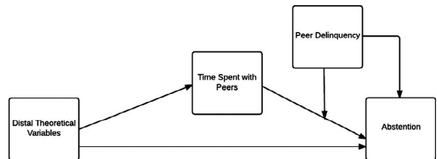
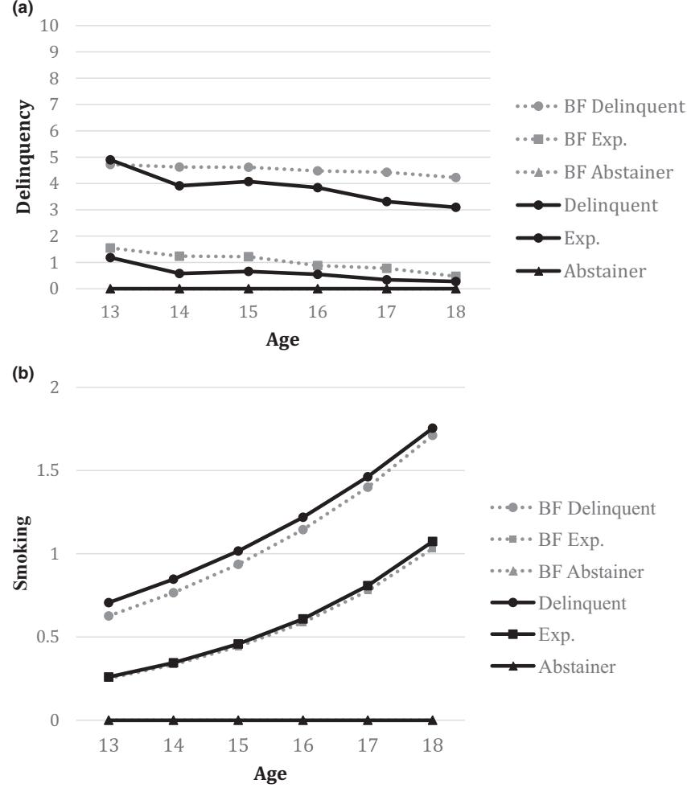
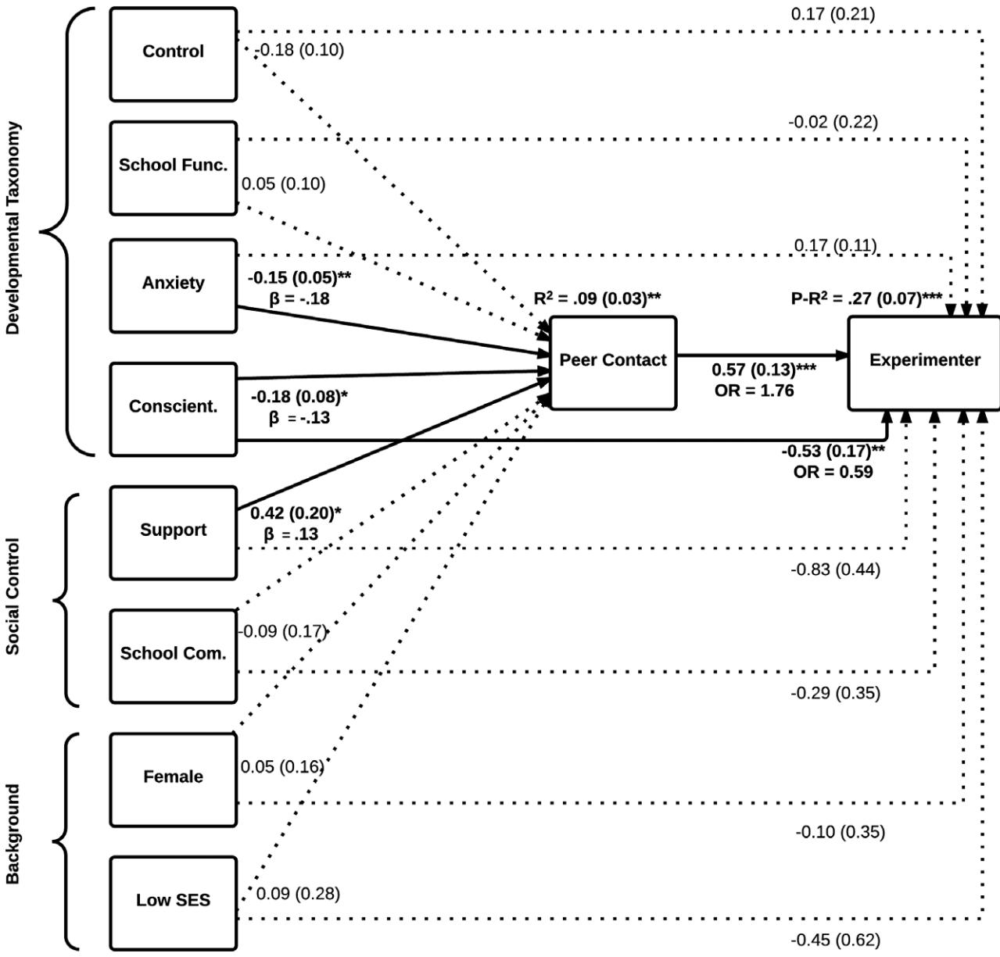
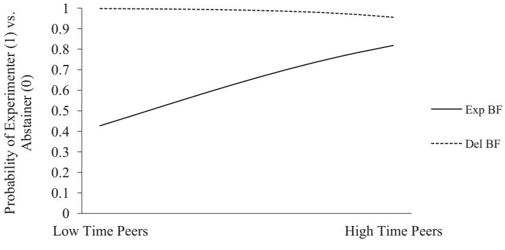
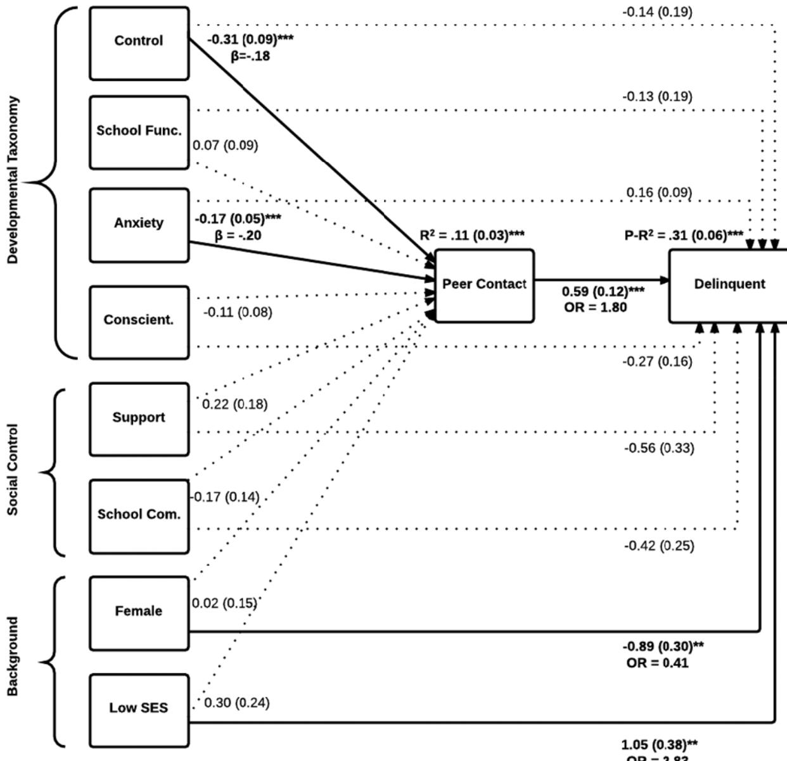

# Adolescent Abstention From Delinquency: Examining the Mediating Role of Time Spent With (Delinquent) Peers

Natalie Mercer, Loes Keijsers, Elisabetta Crocetti, and Susan Branje Utrecht University

Wim Meeus Utrecht University and Tilburg University

Research consistently identifies a group of adolescents who refrain from minor delinquency entirely. Known as abstainers, studying these adolescents is an underexplored approach to understanding adolescent minor delinquency. In this paper, we tested hypotheses regarding adolescent delinquency abstention derived from the developmental taxonomy model and social control theory in 497 adolescents (283 boys) aged 13–18 comparing three groups of adolescents: abstainers, experimenters, and a delinquent group. We found that the relation between adolescent abstention and personal characteristics (i.e., conscientiousness and anxiety) was (partially) mediated by the amount of time spent with peers. Furthermore, the level of best friend delinquency moderated the relation between time spent with peers and delinquency abstention. Results support aspects of both theoretical frameworks.

Minor delinquency is often considered normative during adolescence (Moffitt, 1993; Roisman, Monahan, Campbell, Steinberg, & Cauffman, 2010). Indeed, most youth engage in some level of delinquency, substance use, or other form of rule-breaking behavior (e.g., Brezina & Piquero, 2007). However, there is a small minority of adolescents (6%–15%), known as abstainers, who do not engage in any adolescent delinquent and rule-breaking behaviors (e.g., Brezina & Piquero, 2007; Chen & Adams, 2010; Johnson & Menard, 2012). There are two competing explanations for adolescent delinquency abstention. Whereas in the development taxonomy model, Moffitt (1993) suggested that abstainers may be a troubled (e.g., anxious, socially excluded) group of adolescents, in the social control theory, Hirschi (1969) indirectly suggested that abstainers may be adolescents with a host of protective factors (e.g., strong bonds to parents or school). However, empirical evidence regarding delinquency abstention is still scarce.

This study tested theoretically derived processes leading to delinquency abstention when compared to adolescents who experiment with some delinquent behavior, hereafter referred to as experimenting adolescents. By differentiating among groups of adolescents with regard to the level of delinquency they engage in (i.e., abstainers, experimenters, and more delinquent adolescents), we were able to move forward from comparisons between abstainers and nonabstainers, which may have produced potentially misleading results. For example, these comparisons may suggest that abstainers are unique when there may be overlap in certain traits with experimenting adolescents but not more delinquent adolescents (Brezina & Piquero, 2007). We also examined whether theoretically proposed mediation and moderation processes leading to abstention from delinquency are different from those that predict significant involvement in delinquency, when compared to experimenting with delinquency and rule breaking. These distinctions can provide important insight for intervention or prevention of different levels of delinquency in adolescence.

# Theoretical Framework for Adolescent Abstention

To better understand adolescent abstention, our research was framed by two competing theories the developmental taxonomy model and social control theory. First, according to the developmental taxonomy model (Moffitt, 1993; Moffitt, Caspi, Harrington, & Milne, 2002), adolescent delinquency is

Data from the RADAR study were used. RADAR has been financially supported by main grants from the Netherlands Organisation for Scientific Research (GB-MAGW 480-03-005, GB-MAGW 480-08-006), Stichting Achmea Slachtoffer en Samenleving (SASS), and various other grants from the Netherlands Organisation for Scientific Research, the VU University Amsterdam, and Utrecht University.

Requests for reprints should be sent to Natalie Mercer, Research Centre Adolescent Development, Utrecht University, P.O. Box 80125, 3508 TC Utrecht, The Netherlands. E-mail: n.c. mercer@uu.nl

© 2016 The Authors

Journal of Research on Adolescence © 2016 Society for Research on Adolescence DOI: 10.1111/jora.12246

comprised of two distinct groups: a minority of adolescents who are life-course-persistent offenders, and a larger group of adolescence-limited offenders. Two different developmental processes can explain these two groups of adolescents. The life-course-persistent offenders show forms of antisocial behavior from childhood throughout adulthood, which is thought to be caused by an interaction between persistent neurological problems and cumulative disadvantage in their environments. In contrast, the adolescence-limited offenders only participate in delinquency during adolescence, which is thought to be motivated by a desire for autonomy and independence that stems from the mismatch between their biological and social maturation (i.e., the maturity gap). Adolescence-limited offenders attempt to ease this gap by mimicking their (more delinquent) peers who appear to be more mature.

Because adolescent minor delinquency is considered to be an adaptive response to the maturity gap, the developmental taxonomy model suggests that abstainers may be poorly adjusted. For instance, abstainers may be excluded from these (delinquent) peers. Further, this exclusion from their peers may be related to structural barriers, such as parental control or rules, that not only prevent them from learning about delinquency but may also result in inadequate opportunities for peer interaction in general. Abstainers may also have characteristics that are considered "unattractive" by their peers, such as being unusually good students (Moffitt et al., 2002), or that leave them reluctant or unable to join these peer networks, such as anxiety or shyness (Moffitt, 1993). These hypotheses indicate that abstention may be the result of a unique set of personal and structural factors that limit adolescents' ability to engage in the "teenage social scene" (Moffitt, 1993, p. 689) and therefore their exposure to delinquent role models.

Second, according to the social control theory (Hirschi, 1969), people are inherently likely to perceive delinquency as rewarding. However, adolescents with something to lose, for example, strong bonds with parents or school, will evaluate delinquency and relationships with delinquent peers as costly because they may damage these social bonds. By comparison, adolescents with already weak or limited social bonds may perceive delinquency to be less costly. Therefore, contrary to the developmental taxonomy model, and given the assumption of one underlying pathway to delinquency, abstainers should possess more protective factors compared to adolescents who engage in any level of delinquency.

Together, these two theories provide a useful framework for the examination of adolescent abstention. For instance, according to both the developmental taxonomy model and social control theory, engaging in some level of delinquency and rule breaking during adolescence is normative. However, these two theories also create an interesting juxtaposition. In the developmental taxonomy model, adolescents who do not engage in normative delinquency may have unique and even potentially "maladaptive" characteristics that prevent their involvement in minor delinquency via limited access to their (delinquent) peers, whereas in the social control theory abstaining from delinquency is likely to be a reflection of a host of protective factors leading adolescents to avoid both delinquency and delinquent peers. In this paper, we build on these theoretical hypotheses, by testing them together while explicitly making the distinction between abstainers, experimenting adolescents, and other more delinquent adolescents. In doing so, we examine whether the mechanisms or characteristics that distinguish abstainers from experimenters are different than those that distinguish experimenters from delinquents (i.e., unique mechanisms, developmental taxonomy model) or whether there is one underlying process in which the greater the risk, the greater the likelihood of delinquency (i.e., dose–response relationship, social control theory).

#### Previous Research on Adolescent Abstention

Previous research on abstainers has supported certain aspects of both theories' hypotheses, leading to contradictory ideas about adolescent abstention. For instance, consistent with both theoretical frameworks, abstainers had fewer delinquent peers according to both adolescent-report (Brezina & Piquero, 2007; Owens & Slocum, 2015) and peerreport measures (Chen & Adams, 2010). However, when comparing abstainers and nonabstainers, abstainers were better off in the peer context than would have been expected based on the developmental taxonomy. Recent research finds that adolescent abstainers were not entirely socially excluded—they reported having friends (Chen & Adams, 2010). However, they had fewer friends (Chen & Adams, 2010), were rated as less popular by their peers (Mercer et al., 2015), and spent less time with these friends (Barnes, Beaver, & Piquero, 2011; Johnson & Menard, 2012). Further, peer acceptance of abstainers has been shown to increase after early adolescence (Rulison, Kreager, & Osgood, 2014).

Additionally, when it comes to parents, there is support for the developmental taxonomy model idea that parents may be a structural barrier to learning about delinquency. For instance, compared to nonabstainers, abstainers scored higher on a construct that measured whether their parents knew their friends, knew their whereabouts, or set limits on time spent with friends or curfews (Piquero, Brezina, & Turner, 2005).

Finally, regarding personal characteristics that may lead some adolescents to be either deemed as unattractive, unable, or unwilling to join their peers, some previous research has concluded that abstainers may be the compliant, good students who are seen as unpopular by other (more delinquent) adolescents (Piquero et al., 2005). Adolescent abstainers also scored higher in childhood on shyness, fearfulness, withdrawal, and compliance compared to nonabstainers (Owens & Slocum, 2015). However, abstainers also reported characteristics such as rationality, being less confrontational, and having better stress-related coping skills (Chen & Adams, 2010). On the one hand, according to the developmental taxonomy model, these characteristics may be related to a reluctance to socialize with (delinquent) peers, or may be seen as unattractive by other peers. On the other hand, they are inconsistent with the idea of abstainers having characteristics that are maladaptive. Therefore, it is necessary to consider both positive and negative intrapersonal factors in abstention.

Moreover, consistent with the social control theory, research has found that abstainers reported stronger bonds than nonabstainers. These findings are constant across different operationalizations of familial bonds: for example, involvement with family, parental attachment or parental support, as well as bonds with school (Brezina & Piquero, 2007; Chen & Adams, 2010; Owens & Slocum, 2015). Overall, previous research found that compared to nonabstainers, abstainers spent less time with their peers, who were also less delinquent, possessed stronger bonds to parents, school, and teachers, but also perceived more parental control, and were more controlled themselves: either in terms of anxious, constrained behavior, or, alternatively, in terms of rational, planned, organized behavior.

However, there were only a few studies that compare abstainers to different types of delinquent adolescents. In one of these studies, abstainers were found to lack social potency, a measure that represents decisiveness, persuasiveness, leadership abilities, and enjoying being the center of attention, but abstainers reported more planfulness compared to adolescents who engaged in some delinquency (Krueger et al., 1994). Additionally, Brezina and Piquero (2007) compared abstainers to a subgroup of nonabstainers who only engaged in underage drinking and found that abstainers scored higher on a measure of how wrong youth believed it would be to engage in certain delinquent types of delinquency (i.e., moral beliefs about delinquency) and on a measure of parental attachment. Abstainers also reported less time spent with peers and less peer delinquency compared to this subgroup. In contrast, results from the same study showed that when abstainers were compared to all nonabstaining adolescents, abstainers also reported more social bonds such as higher teacher attachment, more school commitment, and more family involvement. These additional differences are consistent with the social control theory, but were not present when compared only to underage drinkers. These results show the importance of examining abstainers compared to experimenters, in order not to underestimate the potential overlap in traits between abstainers and other adolescents.

Additionally, the hypothesized theoretically derived processes have yet to be systematically and simultaneously tested when comparing abstainers to adolescents who experiment with delinquency. Most specifically, in these studies, time spent with peers and peer delinquency were either considered predictors of abstention, or mean differences were examined. None of these previous studies have examined the mechanisms leading to abstention versus experimenting, while considering that time spent with peers could mediate the relation between structural barriers, personal characteristics, social bonds, and abstention. At the same time, it is also necessary to consider whether the level of peer delinquency moderates the relation between time spent with peers and abstention. These additions to the literature are necessary to better understand adolescent delinquency abstention.

# The Present Study

The primary aim of this study was to examine how abstainers compare to experimenting adolescents regarding hypotheses from these two contrasting theories on the processes proposed to underlie abstention. Figure 1 presents a model of these processes, including gender and parental occupation level (i.e., socioeconomic status [SES]) as control

FIGURE 1 Model depicting mediation and moderation hypotheses.

variables, as both are known to be predictors of delinquency (Odgers et al., 2008). Based on combined hypotheses from the developmental taxonomy model and social control theory, we examined whether

- (1) the relations between the more distal factors (i.e., structural barriers, personal characteristics, and social bonds) and adolescent abstention (vs. experimenting) would be mediated by the amount of time spent with peers, and
- (2) the relation between time spent with peers and adolescent abstention (vs. experimenting) would be moderated by the level of peer delinquency.

Looking at these two theories together moves us forward as it allows us to compare and contrast the mechanisms expected by group-based approaches to delinquency versus theories that expect one underlying pathway to delinquency. Therefore, we also examined whether these mediation and moderation hypotheses were unique to adolescent abstention, by conducting two models. First, we compared abstainers to experimenters; second, we conducted an identical model comparing experimenters to delinquent adolescents.

#### METHOD

#### Participants

This study used data from the RADAR project (Research on Adolescent Development and Relationships) a prospective multimethod, multi-informant, longitudinal cohort study designed to identify and examine both familial and peer influences on adolescent development. The RADAR Young sample consists of 497 Dutch adolescents (283 boys; 57%), their families, and best friends. Participants were recruited from 230 schools that were randomly selected from a list of regular primary education schools in the western and central regions of the Netherlands. Data collection began in 2006 when the target adolescents were in their first year of secondary school (Mage = 13.03, SD = 0.05). In the current paper, we made use of six annual waves of data covering ages 13–18.

Family composition and ethnic background were rather homogenous with 85% of adolescents living with both biological parents and 97% reporting their ethnicity to be Dutch Caucasian. Although families were selected from the general Dutch population, because good written knowledge of the Dutch language and the presence of both parents were preferred, these families differ from the general population on some characteristics. For example, approximately 89% of families reported that at least one parent had a medium to high-level occupation compared to 66% of the general Dutch population (Statistics Netherlands, 2006). Further, because one of the larger aims of the study is to examine abnormal adolescent development, adolescents scoring at or above the clinical range cutoff based on teacher ratings of problem behavior (Achenbach, 1991) during their last year at elementary school were oversampled. The present sample is largely similar to other Dutch nonclinical samples on measures of school commitment (Klimstra et al., 2011b); social anxiety (Crocetti, Hale, Fermani, Raaijmakers, & Meeus, 2009); conscientiousness (Klimstra, Crocetti, Hale, Fermani, & Meeus, 2011a); and maternal support (Keijsers, Frijns, Branje, & Meeus, 2009).

To examine our missing data, we tested whether Little's (1988) missing completely at random test was significant. Based on the acceptable v2 / df = 1.17 ratio (Bollen, 1989), we included people with partially missing data in our analyses using full information maximum likelihood in Mplus, when applicable.

## Procedure

Written information was sent to families' homes and adolescents were also invited to contact their best friends for participation. Once identified, best friends were also sent written information. Parents study participation. Trained researchers conducted annual assessments in the target adolescent family homes with the best friend present and ensured that the battery of paper questionnaires was filled out individually. Families and best friends received the equivalent of approximately \$150 USD at each wave. The Utrecht University Medical Ethical Board approved this study.

# Measures

Minor and serious delinquency. Delinquency was measured annually at six time points from age 13 to 18 using the Self-Report Delinquency Scale (Junger-Tas, Ribeaud, & Cruyff, 2004). Adolescents indicated whether they engaged in any of 30 different items, including minor items such as shoplifting, or theft from home or school, destroying or defacing property, as well as more serious items such as burglary, theft from out of a vehicle, threatening violence with a weapon, or selling hard drugs, in the past year. We recoded items dichotomously (0 = no and 1 = yes) and summed them to create a variety scale (0 = min. and 30 = max.). Variety scales show better internal consistency, higher stability over time, larger group differences, and stronger associations with conceptually related variables compared to frequency scales (Bendixen, Endresen, & Olweus, 2003). The Cronbach's alphas for the total 30-item delinquency scale ranged between .76 and .93 across six waves.

Smoking and marijuana use. We measured smoking and marijuana annually using two items at six time points from age 13 to age 18. Adolescents indicated how often they smoked cigarettes (0 = never tried and 8 = daily), and how often they used marijuana (0 = never and 13 = 40 times or more), in the past year. These two items were dichotomized (0 = never used, 1 = used) and summed to create a total variety scale (0 = min. and 2 = max.). The correlations between the two items ranged between .21 and .45, p < .001 at each wave. We labeled the combined item as smoking. The across wave correlations were acceptable, ranging from .62 to .80, p < .001.

Developmental taxonomy model. For all distal theoretical variables, we created a mean score using all six waves, when available. Maternal control was measured using the mean of the 5-item parental control measure (Stattin & Kerr, 2000). We included maternal control as a measure of a structural barrier that limits adolescents' possibilities to learn about delinquency. Sample items are "Do you need your mother's permission to come home late on a week night?" and "Does your mother demand to know how you spend your money?" (1 = never and 5 = always). The maternal control measurement was only available from age 14 onwards. The Cronbach's alphas for this scale at all five waves ranged between .82 and .91.

ADOLESCENT DELINQUENCY ABSTENTION 951

School affinity and functioning was included as a measure of both social and outcome-oriented functioning at school, which may be an "unattractive" personal quality in adolescence. This construct was measured using the mean of five items examining adolescents' school functioning relative to their peers, in the past week. For example, "Compared to your peers, how much do you enjoy school?" (1 = much worse and 10 = much better). The Cronbach's alphas for this scale ranged between .74 and .80 at all six waves.

Social anxiety was measured with the Screen for Child Related Emotional Disorders (SCARED; Birmaher et al., 1997). This scale includes four items such as "I feel nervous when I am going to parties, dances, or any place where there will be people that I don't know well" (1 = almost never and 3 = often). The Cronbach's alphas for this scale ranged between .78 and .86 across waves. The SCARED is a screening instrument for anxiety disorder symptom dimensions and scores do not reflect a clinical diagnosis (Hale, Raaijmakers, van Hoof, & Meeus, 2014).

Conscientiousness was measured using a shortened Dutch version of Goldberg's Big Five Personality Questionnaire (Gerris et al., 1998). Conscientiousness is defined as "the tendency to be organized, responsible, and hardworking" and is included as a conceptualization of positive characteristics previously found to be related to abstention, such as being compliant, well planned, and rational (Chen & Adams, 2010; Krueger et al., 1994). We used the mean of six items such as "I am accurate" (1 = completely untrue to 7 = completely true). The Cronbach's alphas for this scale ranged between .82 and .89 across waves.

Social control theory. Maternal support, which we included as a measure of the quality of the parent–child bond, was measured using the mean of the 8-item support subscale of the Network of Relationships Inventory (Furman & Buhrmester, 1985). The scale includes items such as "To what extent does your mother help you figure out or fix things?" (1 = little to not at all and 5 = as much as possible). The Cronbach's alphas for this scale ranged between .78 and .85 across waves.

School commitment was included as an indicator of the strength of bonds to school and was measured with the mean score of the 5-item subscale from the Utrecht-Management of Identity Commitments Scale (Crocetti, Rubini, & Meeus, 2008). Examples of commitment items are as follows: "My education gives me security in life" (1 = completely disagree to 5 = completely agree). For this scale, we only have measurements from age 14 onwards. The Cronbach's alphas for this scale ranged between .93 and .96 across waves.

Time spent with peers. Time spent with peers was measured using the Intensity of Peer Contact Scale (Weerman & Smeenk, 2005) at six waves with five items asking how often and for how long adolescents spend time with their peers outside of school and on the weekends. Adolescents indicated their answers on 3- or 4-point Likert scales, which were adjusted per item. For example, "How often do you spend time with your friends after school on week days?" (1 = almost never to 3 = 3 days or more). The items on this scale were summed (5 = min. and 16 = max.). The Cronbach's alphas for this scale ranged between .67 and .72 across waves. For analysis, a mean score across all waves was created.

Best friend delinquency and smoking. We measured the adolescents' best friends' report of their involvement in delinquency and smoking, using the identical measures that adolescents reported on. Therefore, best friend delinquency was measured annually at six waves from age 13 to 18 using the 30-item Self-Report Delinquency Scale (Junger-Tas et al., 2004). The Cronbach's alphas for the total 30-item best friend delinquency scale ranged between .82 and .89. Best friends also reported on smoking and marijuana use using the same two items measured annually at six waves from age 13 to 18. The correlations between the two items ranged between .30 and .49, p < .001 at each wave. The across = wave correlations were acceptable, ranging from .52 to .76, p < .001.

#### Analytic Strategy

We conducted all analyses in Mplus version 7.3(Muthen & Muthen, Los Angeles, CA, United States) using maximum likelihood Robust, except for the one-way analyses of variance (ANOVAs) that were conducted in SPSS version 22 (IBM Corporation, Armonk, NY, United States).

Constructing groups. Our first goal was to construct groups of adolescent abstainers and other delinquent adolescents in order to compare abstainers to these other groups. Further, because we were also testing moderation by level of best friend delinquency, we used best friend reported delinquency to construct separate groups of best friends as well. We conducted Poisson latent class growth analysis (LCGA; Nagin & Land, 1993) across six waves of delinquency and smoking data to construct typologies of delinquent adolescents and their best friends. In LCGA, people in the same group are considered homogenous in terms of their developmental trajectory. The following LCGA steps were completed twice, once for the target adolescents and once for the best friends. We constrained a class in the LCGA to have an intercept and slope of zero because we conceptualized abstainers as individuals who scored zero on all delinquency and smoking items, and who had a minimum of four out of the six waves of complete data. Five adolescents and 14 best friends were removed from the LCGA because they scored zero on all delinquency and smoking items, but they did not have a minimum of four out of six waves of data required for our definition of abstention.

Model selection for the ideal number of LCGA classes was determined by a number of criteria. First, the Vuong–Lo–Mendell–Rubin test assessed whether adding an additional class significantly improved the model fit. Second, the Bayesian information criterion (BIC) values should be lower than the BIC value for k 1 classes. Third, entropy scores were used to assess classification accuracy where scores closer to 1 indicate more accurate classification. Fourth, no class should be smaller than 5% of the sample. Fifth, we evaluated the parsimony of the class solutions by considering whether an additional class was an extension of a class in the k 1 solution. Finally, we also considered the theoretical expectations for the number of different groups. To test the validity of the adolescent groups constructed in the LCGA, we tested differences on theoretical variables with one-way ANOVAs.

#### Mediation and Moderation

The second goal of this study was to examine whether (1) the relation between distal theoretical factors (i.e., structural barriers, personal characteristics, and social bonds) and group membership was mediated by time spent with peers, and (2) whether the relation between time spent with peers

#### ADOLESCENT DELINQUENCY ABSTENTION 953

and group membership was moderated by best friends' delinquency. To address these aims, we conducted regression analyses. We conducted each analysis twice. First, we conducted a model comparing abstainers to experimenters. Second, we tested an identical model comparing experimenters to delinquent adolescents, in order to determine whether the theoretically derived processes were unique for the distinction between abstaining and experimenting adolescents. All steps in these analyses controlled for gender and parents' occupation level (SES).

Testing the mediating role of time spent with peers. In order to examine whether the relation between distal theoretical factors and group membership was mediated by the amount of time adolescents spent with their peers, we simultaneously tested whether distal variables were related to group membership, whether distal variables were related to time spent with peers, and whether time spent with peers mediated the links between distal variables and group membership. One mediation model was conducted with all of the distal variables entered at once. Indirect paths were calculated as a product of a\*b. Mplus makes use of the Delta method calculation of indirect effects.

Testing the moderating role of best friend delinquency. We also conducted a moderation analysis to test whether the relation between time spent with peers and group differs based on the level of best friend delinquency. First, we added dummy variables representing best friends' delinquency. Second, we included the two dummy variables representing best friends' delinquency and added two interaction terms between time spent with peers and the two dummy variables for best friends' delinquency.

Comparing models. Comparisons of path coefficients between the abstainer versus experimenter model and the experimenter versus delinquent model were conducted using z-tests (Paternoster, Brame, Mazerolle, & Piquero, 1998).

## RESULTS

#### Constructing Groups

Table 1 presents the model fit statistics for the LCGA for adolescents and their best friends. Considering the previously listed model selection criteria, we retained a three-class solution for both

TABLE 1 Summary of Poisson LCGA Models for Delinquency, and Smoking Ages 13–18 for Adolescents and Their Best friends

| Class        | BIC      | VLMR p | Entropy | Class %       |
|--------------|----------|--------|---------|---------------|
| Adolescents  |          |        |         |               |
| 1            | 16,689.8 | x      | x       | 100           |
| 2            | 15,813.1 | x      | .99     | 90, 10        |
| 3            | 13,287.3 | .00    | .96     | 66, 24, 10    |
| 4            | 12,878.2 | .16    | .91     | 55, 28, 10, 7 |
| Best friends |          |        |         |               |
| 1            | 17,500.8 | x      | x       | 100           |
| 2            | 16,814.0 | x      | .98     | 93, 7         |
| 3            | 14,589.7 | .00    | .93     | 63, 31, 6     |
| 4            | 14,133.9 | .21    | .90     | 56, 25, 13, 6 |
|              |          |        |         |               |

Note. LCGA = Poisson latent class growth analysis; VLMR = Vuong–Lo–Mendell–Rubin; BIC = Bayesian information criterion.

adolescents and their best friends. Due to the high entropy in the three-class model, no additional steps to reduce classification bias were necessary. The three-class solution was consistent with previous findings, because either three- and four-class solutions have been most frequently reported across different studies (Jennings & Reingle, 2012), as well as consistent with our theoretical expectations (Moffitt, 1993). Figure 2(a, b) presents the estimated means for each group for delinquency and smoking based on the exponentiated log rate values from the LCGA intercept and slope estimates.

In the adolescent three-class solution, the first group (n = 51, 10%) was comprised of a group of adolescents who met the criteria for abstainers characterized by scores of zero on all measures, across all waves. The second group was comprised of the majority of adolescents (n = 324; 66%), characterized by low initial levels of delinquency that decreased over time and low levels of smoking which linearly increased over time. Therefore, we labeled this class as experimenters. The third group of adolescents (n = 117; 24%) was characterized by a higher level of delinquency relative to other adolescents in early adolescence, which slowly declined. This group also showed an increase in smoking across adolescence. We labeled this group delinquent. The distribution and pattern of development among the three-class solution of best friends was highly similar to that of the adolescents (Figure 2a, b). Best friends also consisted of a group of abstainers (n = 30; 6%), experimenters (n = 292; 63%), and a delinquent group (n = 143, 31%).

In order to test the validity of the three adolescent groups constructed in the LCGA, we

FIGURE 2 (a) Estimates of adolescents' and best friends' delinquency across adolescence. Due to high similarity, best friend abstainers are not distinguishable from abstainers. (b) Estimates of adolescents' and best friends' cigarette and marijuana use across adolescence. Due to high similarity, best friend abstainers are not distinguishable from abstainers.

conducted one-way ANOVAs to examine mean differences between these groups on our hypothesized distal theoretical variables. Table 2 presents these means and standard deviations and ANOVA results, as well as gender and SES, and cross-tabulations with the best friend delinquency groups. Similar to previous research, the number of boys and the prevalence of low SES adolescents increased with the delinquency of each class (see Odgers et al., 2008).

## Mediation and Moderation

Abstainers versus experimenters. Consistent with the main aim of our study, we first tested our hypotheses in a model comparing abstainers versus experimenters.

Testing the mediating role of time spent with peers. Figure 3 presents the results of the mediation model for abstainers versus experimenters. Conscientiousness and social anxiety had a significant negative relation with time spent with peers, whereas mother support had a positive significant relation with time spent with peers. Time spent with peers was also related to a greater likelihood of being an experimenter compared to an abstainer. Both SES and gender were unrelated to group membership.

In terms of the mediation processes tested, higher conscientiousness was significantly related to a lower likelihood of becoming an experimenter, both directly and indirectly as higher levels of conscientiousness were also related to less time spent with peers. Furthermore, social anxiety was negatively and indirectly related to experimenting with delinquency. Higher social anxiety is related to a lower likelihood of being in the experimenting group via spending less time with peers. Although

|                        | Abstainer |       | Experimenter |      | Delinquent |                          |                           |
|------------------------|-----------|-------|--------------|------|------------|--------------------------|---------------------------|
|                        | M         | SD    | M            | SD   | M          | SD                       | F-test                    |
| Developmental taxonomy |           |       |              |      |            |                          |                           |
| Mother control         | 3.26a     | 0.85  | 3.23a        | 0.80 | 2.97b      | 0.80                     | F(2, 443) = 4.04*         |
| School functioning     | 6.93a     | 1.02  | 6.71a        | 0.86 | 6.34b      | 0.93                     | F(2, 442) = 9.00***       |
| Social anxiety         | 5.87a     | 1.61  | 5.91a        | 1.62 | 5.96a      | 1.51                     | F(2, 443) = 0.06          |
| Conscientiousness      | 4.62a     | 0.91  | 4.04b        | 0.97 | 3.62c      | 0.85                     | F(2, 442) = 19.59***      |
| Social control theory  |           |       |              |      |            |                          |                           |
| Mother support         | 3.89a     | 0.42  | 3.73b        | 0.45 | 3.55c      | 0.53                     | F(2, 443) = 10.31***      |
| School commitment      | 3.85a     | 0.53  | 3.68a        | 0.62 | 3.35b      | 0.69                     | F(2, 444) = 14.09***      |
| Mediator               |           |       |              |      |            |                          |                           |
| Time spent with peers  | 9.62c     | 1.47  | 10.58b       | 1.32 | 11.47a     | 1.18                     | F(2, 441) = 35.89***      |
| Outcome                |           |       |              |      |            |                          |                           |
| Delinquency            | 0.00c     | 0.00  | 0.64b        | 0.53 | 3.97a      | 2.30                     | F(2, 489) = 364.37***     |
| Smoking                | 0.00a     | 0.00  | 0.58b        | 0.46 | 1.14c      | 0.55                     | F(2, 489) = 123.61***     |
|                        |           | %     | %            |      | %          |                          | v2                        |
| Control variables      |           |       |              |      |            |                          |                           |
| Female                 |           | 53a   | 46a          |      | 30b        |                          |                           |
| 47b Male            |           | 54b   |              | 70a  |            | v2 (2, 492) = 11.42** |                           |
| 10a,b Low SES       |           | 8b    |              | 19a  |            |                          |                           |
| Medium/High SES        |           | 90a,b | 92a          |      | 81b        |                          | v2 (2, 484) = 10.47**  |
| Moderator              |           |       |              |      |            |                          |                           |
| Best friend abs.       | 27a       |       | 5b           |      | 1b         |                          |                           |
| Best friend exp.       |           | 71a   | 69a          |      | 42b        |                          |                           |
| Best friend del.       | 2c        |       |              | 26b  |            |                          | v2 (4, 460) = 85.14*** |

TABLE 2 Descriptives and Validation of the Adolescent Groups

Notes. Different superscripts indicate significant post hoc differences at p < .05. \*p < .05; \*\*p ≤ .01; \*\*\*p ≤ .001. Sample ranges: control (1.20–5.00); school functioning (3.73–9.70); social anxiety (4.00–11.67); conscientiousness (1.69–6.50); support (2.25–4.81); school commitment (1.28–5.00); Time spent with peers (5.50–14.83), smoking (0.00–2.00); delinquency (0.00–15.00).

[Correction added on November 25, 2016, after first online publication: In the top portion of Table 2: column 6, row 3, "3.34" was changed to "6.34"; column 8, row 12, "F(2, 491) = 364.37" was changed to "F(2, 489) = 364.37"; column 8, row 13, "F(2, 491) = 123.61" was changed to "F(2, 489) = 123.61." In the bottom portion of Table 2: column 3, row 3, "53" was changed to "54"; column 4, row 5, "82" was changed to "81."]

mother support was significantly related to time spent with peers, the indirect relation with group membership was nonsignificant.

Testing the moderating role of best friend delinquency. In order to test whether the level of best friend delinquency moderated the relation between time spent with peers and abstaining versus experimenting, we added four additional variables to the mediation model. First, we added two dummy variables to the model to test the main effect of best friend delinquency on adolescent group membership. These dummy variables represented being in the abstainer or delinquent group; therefore, experimenters served as the reference group. Having a best friend who is an abstainer decreased the odds of being an experimenter (b = 1.04, SE = 0.53, p = .049, odds ratio (OR) = 0.35) and having a best friend who is delinquent increased the odds of being an experimenter (b = 2.67, SE = 1.00, p = .008, OR = 14.56). Second, after testing the main effects of best friend delinquency, we added two interaction terms to the model, one between abstainer best friend and time spent with peers and another between delinquent best friend and time spent with peers. Therefore, best friend experimenters are also the reference group in each interaction. In this model, the relation between time spent with peers and group membership was not significantly moderated by having an abstaining (vs. experimenter) best friend (b = 0.47, SE = 0.28, p = .088) but was significantly moderated by having a delinquent (vs. experimenter) best friend (b = 1.76, SE = 0.29, p < .001; OR = 0.17). In the significant moderation by delinquent best friend (Figure 4), when adolescents had a delinquent best friend the amount of time spent with

FIGURE 3 Abstainers versus experimenters: unstandardized direct effects and standard errors for the mediation model. Significant direct effects are indicated in bold and include standardized coefficients. \*p < .05; \*\*p < .01; \*\*\*p ≤ .001. Indirect effects: conscientiousness (b = 0.10, SE = 0.05, p = .04); social anxiety (b = 0.09, SE = 0.04, p = .014); support (b = 0.24, SE = 0.13, p = .069).

peers did not affect the likelihood of being an abstainer versus an experimenter (i.e., ceiling effect of delinquent best friend). However, when the best friend was an experimenter, more time spent with peers increased the likelihood of being an experimenter versus an abstainer.

Experimenters versus delinquents. We also examined an identical theoretical model comparing experimenters to the delinquents, in order to determine how unique the processes leading to abstention versus experimentation were.

Testing the mediating role of time spent with peers. Two developmental taxonomy factors, namely social anxiety and perceived maternal control, were related to less time spent with peers (Figure 5). Time spent with peers was positively associated with belonging to the delinquent versus experimenter group. Contrary to the abstainer– experimenter model, none of the direct paths for

FIGURE 4 The effect of time spent with peers on the likelihood of becoming an abstainer versus an experimenter, moderated by delinquent (vs. experimenter) best friend.

the distal theoretical predictors were significant. However, having a low SES increased the likelihood of belonging to the delinquent group, whereas being female decreased this likelihood.

Regarding the mediation process, consistent with the abstainer–experimenter model, social anxiety had a negative indirect effect on the likelihood of belonging to the delinquent group. Unlike in the previous model, control also had a negative indirect effect on group membership.

Testing the moderating role of best friend delinquency. Using the identical steps to test for moderation as outlined above, we found that in the experimenter versus delinquent model, having a best friend who is an abstainer was not significantly related to group membership (b = 0.54, SE = 1.05, p = .607) but having a best friend who is delinquent increased the odds of being in the delinquent group (b = 0.86, SE = 0.29, p = .003, OR = 2.35). The relation between time spent with peers and group membership was not significantly moderated by having an abstainer best friend (b = 0.37, SE = 0.29, p = .212), or by having a delinquent best friend (b = 0.19, SE = 0.23, p = .425). The effect of time spent with peers on the odds of being in the delinquent group compared to the experimenting group does not differ with the level of best friend delinquency.

Z-tests of model coefficients. Z-test comparisons of path coefficients between the abstainer–experimenter and experimenter–delinquent models established that 2 out of 10 pathway coefficients significantly differed between models. Namely, SES was not related to the likelihood of abstention versus experimenting, whereas low SES was a significant predictor of belonging to the delinquent group compared to experimenting. The moderation of time spent with peers by delinquent best friends was significant in the abstainer–experimenter model but not the experimenter–delinquent model.

#### DISCUSSION

A small group of adolescents manage to avoid delinquency and rule breaking altogether. On the one hand, according to the developmental taxonomy model (Moffitt, 1993) abstainers may have structural barriers or personal characteristics that exclude them from the (delinquent) peer context when compared to adolescents who engage in minor delinquency. On the other hand, according to the social control theory (Hirschi, 1969) abstainers are likely to be well-adjusted adolescents who have protective factors such as strong bonds that aid them in managing to avoid both delinquency and delinquent peers. Combining these theoretical frameworks into one model, we examined whether the relations between structural barriers, personal characteristics, social bonds, and abstention were mediated by time spent with peers and whether, in turn, the relation between time spent with peers and abstention was moderated by the level of best friend delinquency.

In doing so, we found that abstainers possess characteristics (conscientiousness, social anxiety) that were related to spending less time with their peers. Furthermore, although there is much overlap in the processes that distinguish between abstaining, experimenting, and delinquent adolescents, the relation between time spent with peers and best friend delinquency may differ between different groups of adolescents leading to abstention or (more) delinquency. In other words, the amount of time spent with peers may be more or less strongly related to experimenting with delinquency depending on the level of best friend delinquency.

FIGURE 5 Experimenters versus delinquents: unstandardized direct effects and standard errors for the mediation model. Significant direct effects are indicated in bold and include standardized coefficients. \*p < .05; \*\*p < .01; \*\*\*p ≤ .001. Indirect effects: control (b = 0.18, SE = 0.06, p = .002); social anxiety (b = 0.10, SE = 0.03, p = .002).

[Correction added on November 25, 2016, after first online publication: In Figure 5, the path values between conscientiousness and time spent with peers were changed from 0.11 (0.08)\* to 0.11 (0.08), and the font-weight was changed to non-bold.]

#### Mediation and Moderation

In general, these results are in line with the developmental taxonomy model. For instance, social anxiety is indirectly related to increased likelihood of being an abstainer via less time spent with peers. Further, the positive personal characteristic of conscientiousness was also related to spending less time with peers and therefore a greater likelihood of abstention. Therefore, in line with Moffitt (1997), we would suggest that personal characteristics (i.e., anxiety or conscientiousness) may indeed be the most important factors related to abstainers' decreased participation in the (delinquent) peer context. Furthermore, we suggest that the presence of some nonclinical social anxiety symptoms may be a protective factor, when they lead to somewhat less time spent with peers but do not isolate adolescents, or otherwise impair (social) functioning (see also Nelemans et al., 2015). This is also in line with research suggesting that comorbid anxiety among youth who exhibit other externalizing problems such as ADHD may also be protective, as these youth had enhanced response to behavioral treatment outcomes compared to youth with ADHD without anxiety (MTA Cooperative Group, 1999).

However, the direct effect of conscientiousness may indicate that although personal characteristics may be an important factor in abstention from delinquency, rational, planned, controlled behavior as displayed in high levels of conscientiousness rather than high levels of anxiety could be related to a reluctance or disinterest in (delinquent) peers rather than an inability to engage in the peer context leading to exclusion. Similarly, previous research has also reported that abstainers have high levels of self-constraint in adolescence (Boutwell & Beaver, 2008) and conscientiousness in adulthood (Moffitt et al., 2002). Indeed, conscientiousness is thought to conceptually overlap with self-control (Duckworth, Tsukayama, & Kirby, 2013) and there is a wellestablished link between lower self-control and increased delinquency (Pratt & Cullen, 2000). However, self-control is widely used as an umbrella for related constructs of varying convergent validity (Duckworth et al., 2013). For instance, conscientiousness is thought to be composed of four facets: control, industriousness, responsibility, and orderliness (Eisenberg, Duckworth, Spinrad, & Valiente, 2014). Therefore, research should try to disentangle the facets that may be most predictive of abstention. Taken together, the possibility that abstainers have personal characteristics that do not exclude them from, but rather aid them in managing to avoid, the (delinquent) peer context and delinquent behaviors should be considered further.

In general, our results do not support the social control theory in terms of the factors that predict abstention. For instance, contrary to previous studies comparing abstainers and nonabstainers, we did not find evidence for school commitment or support as protective factors (e.g., Brezina & Piquero, 2007). Instead, we found that perceived mother support was related to increased time spent with peers, although the indirect effect on abstaining or experimenting was not significant.

Our results also suggest that, as could be expected, abstainers and more delinquent adolescents are very unlikely to have close relationships with each other (in our data, only one abstainer had a delinquent best friend, and one delinquent adolescent had an abstaining best friend). This finding implies there is a distance between these adolescent groups, consistent with the finding that peers are often similar in their delinquency during adolescence (Weerman, 2011). This is generally consistent with the hypothesis derived from the developmental taxonomy model that life-coursepersistent peers influence adolescence-limited adolescents and that abstainers may not have as much exposure to these life-course-persistent peers. However, this theory refers to a broad exposure to these more delinquent peers (e.g., classmates, older adolescents at school, the larger peer group) and does not imply that an adolescent would need to have a close relationship to mimic this more delinquent behavior. Perhaps, the influence of peer delinquency is intensified by the closeness of the relationship, in which case a best friend who is delinquent may be a salient influence to the adolescent's own delinquency (e.g., Weerman, 2011). Previous research suggested that it was not the time spent with peers, but rather the type of peers that time was spent with that mattered for delinquency abstention (Brezina & Piquero, 2007). Our finding of a ceiling effect of having a delinquent best friend on predicting experimenting versus abstaining corroborates this finding. This may suggest that time spent with peers is most relevant for abstention when adolescents have best friends who are not delinquent. This could be due to the possibility that having a delinquent best friend is enough exposure to delinquency to increase participation, whereas adolescents who do not have a delinquent best friend may gain this exposure more gradually via increased time with a potentially extended network.

# Comparing Models

In our direct model comparison, we did not find strong evidence that the process leading to abstention was entirely unique compared to the process leading to (more) delinquency as in these data only 2 out of 10 pathways were significantly different between models. Looking at both models, with the exception of conscientiousness predicting abstention, the general process for all adolescents appears to be that distal theoretical factors (although not identical) are mediated by time spent with peers. The finding of a general process across all adolescents is consistent with social control theory and other theories that expect one underlying pathway leading to delinquency (i.e., a dose–response relationship). However, the moderation effect of best friend delinquency differed between models: Increased time spent with peers is related to experimenting when the best friend is an abstainer or an experimenter. There was no moderation of time spent with peers in the experimenter–delinquent model. Further, having low SES was a strong predictor of being in the delinquent group, but did not distinguish between abstainers and experimenters.

#### Limitations and Suggestions for Future Research

The findings presented in this paper should be interpreted with the knowledge of the following limitations. First, although we aimed to simultaneously test two important theories and their hypotheses regarding abstention, we were not able to test all theoretically relevant hypotheses. For instance, we did not consider that abstainers might not experience the maturity gap (e.g., Dijkstra et al., 2015). It is important to consider that pubertal timing may impact either the type of best friends adolescents have or alternatively, the influence of these friends (Barnes et al., 2011; Piquero & Brezina, 2001). Second, latent class growth analyses hold the risk that sample-specific solutions are reported. Although we were able to replicate our adolescent solution among their best friends, this possibility should be considered. Third, although we did identify three classes, consistent with both previous research (e.g., Jennings & Reingle, 2012) and the expectations from the developmental taxonomy model, our two delinquent classes cannot be compared directly to adolescence-limited or life-course-persistent trajectories. This is because we do not have childhood or adult measures to confirm limited versus persistent behavior and because the delinquent class is both less delinquent and is comprised of a higher percentage of adolescents than would be expected in a life-course-persistent trajectory. Additionally, future research with the potential to include childhood measures as predictors of adolescent delinquency abstention would be beneficial, as in the current sample distal variables and delinquency are measured concurrently during adolescence. These analyses do not preclude the fact that delinquency may affect distal variables, and therefore conclusions regarding causality or developmental order cannot be drawn. Fourth, we did not have the power to run these analyses separately for each gender. Fifth, we conceptualized abstention as adolescents who did not engage in risky or delinquent behavior, but did not include alcohol use in our study due to the high number of adolescents in the Netherlands who have used alcohol by the age of 16 (85%; van Dorsselaer et al., 2010), suggesting that alcohol use is prominent and there is little variation among adolescents by age 18. Naturally, this may be different across different samples.

Sixth, the time spent with peers measure we used indicated how often and for how long adolescents spent time with their peers—but did not provide detailed information on what they are doing in this time, or whether or not this time is supervised or structured (e.g., Siennick & Osgood, 2012). The inclusion of more detailed measures of how time is spent with peers would be informative in future research. This is particularly true as prevention may benefit from focusing on the potential influence of friends or the types of activities in which time with friends is spent (e.g., Wolfe, Crooks, Chiodo, Hughes, & Ellis, 2012). However, and finally, the cell sizes in the moderation analyses were very small, because—as could be expected—abstainers and delinquents do not seem to associate as best friends. Whereas the moderation results are theoretically plausible, this limitation should be noted in any interpretation or extension of these findings.

## CONCLUSION

By comparing abstainers to experimenting adolescents, our study is one of the first to find, consistent with the developmental taxonomy, that social anxiety is indirectly related to abstention. Further, abstainers do report spending less time with their peers and are very unlikely to have delinquent best friends. Notably, conscientiousness is also directly related to delinquency abstention. However, these results do not necessarily suggest that abstention is maladaptive. Rather, abstainers may have (positive) personal characteristics that do not exclude them, but rather help them avoid the (delinquent) peer context and delinquency altogether. Furthermore, although the processes leading to abstention are generally similar to those leading to delinquency, they are not identical. Indeed, more research is needed to examine the types of activities in which abstainers spend time with their peers, the quality of their peer or best friend relationships, and individual differences in susceptibility to peer pressure from experimenting or delinquent (best) friends.

#### REFERENCES

- Achenbach, T. M. (1991). Integrative guide for the 1991 CBCL/4-18, YSR, and TRF profiles. Burlington: Department of Psychiatry, University of Vermont.
- Barnes, J., Beaver, K. M., & Piquero, A. R. (2011). A test of Moffitt's hypotheses of delinquency abstention. Criminal Justice and Behavior, 38, 690–709. doi[:10.1177/](http://dx.doi.org/10.1177/0093854811405282) [0093854811405282](http://dx.doi.org/10.1177/0093854811405282)
- Bendixen, M., Endresen, I. M., & Olweus, D. (2003). Variety and frequency scales of antisocial involvement: Which one is better? Legal and Criminological Psychology, 8, 135–150. doi:[10.1348/135532503322362924](http://dx.doi.org/10.1348/135532503322362924)
- Birmaher, B., Khetarpal, S., Brent, D., Cully, M., Balach, L., Kaufman, J., & Neer, S. M. (1997). The Screen for Child Anxiety Related Emotional Disorders (SCARED): Scale construction and psychometric characteristics. Journal of the American Academy of Child and Adolescent Psychiatry, 36, 545–553. doi[:10.1097/00004583-199704000-00018](http://dx.doi.org/10.1097/00004583-199704000-00018)
- Bollen, K. A. (1989). A new incremental fit index for general structural equation models. Sociological Methods and Research, 17, 303–316. doi:[10.1177/0049124189017](http://dx.doi.org/10.1177/0049124189017003004) [003004](http://dx.doi.org/10.1177/0049124189017003004)
- Boutwell, B. B., & Beaver, K. M. (2008). A biosocial explanation of delinquency abstention. Criminal Behavior and Mental Health, 18, 59–74. doi[:10.1002/cbm.678](http://dx.doi.org/10.1002/cbm.678)
- Brezina, T., & Piquero, A. R. (2007). Moral beliefs, isolation from peers, and abstention from delinquency. Deviant Behavior, 28, 433–465. doi:[10.1080/01639620701233324](http://dx.doi.org/10.1080/01639620701233324)
- Chen, X., & Adams, M. (2010). Are teen delinquency abstainers social introverts? A test of Moffitt's theory. Journal of Research in Crime and Delinquency, 47, 439– 468. doi:[10.1177/0022427810375575](http://dx.doi.org/10.1177/0022427810375575)
- Crocetti, E., Hale, W. W., Fermani, A., Raaijmakers, Q., & Meeus, W. (2009). Psychometric properties of the Screen for Child Anxiety Related Emotional Disorders (SCARED) in the general Italian adolescent population: A validation and a comparison between Italy and the Netherlands. Journal of Anxiety Disorders, 23, 824–829. doi[:10.1016/j.janxdis.2009.04.003](http://dx.doi.org/10.1016/j.janxdis.2009.04.003)
- Crocetti, E., Rubini, M., & Meeus, W. (2008). Capturing the dynamics of identity formation in various ethnic groups: Development and validation of a three-dimensional model. Journal of Adolescence, 31, 207–222. doi[:10.1016/j.adolescence.2007.09.002](http://dx.doi.org/10.1016/j.adolescence.2007.09.002)
- Dijkstra, J. K., Kretschmer, T., Pattiselanno, K., Franken, A., Harakeh, Z., Vollebergh, W., & Veenstra, R. (2015). Explaining adolescents' delinquency and substance use: A test of the maturity gap. Journal of Research in Crime and Delinquency, 52, 747–767. doi[:10.1177/0022427815582249](http://dx.doi.org/10.1177/0022427815582249)
- van Dorsselaer, S., de Looze, M., Vermeulen-Smit, E., de Roos, S., Verdurmen, J., ter Bogt, T., & Vollebergh, W. A. M. (2010). Gezondheid, welzijn en opvoeding van jongeren in Nederland: HBSC 2009. [Health, wellbeing, and upbringing of youth in the Netherlands]. Utrecht, The Netherlands: Trimbos-Instituut.
- Duckworth, A. L., Tsukayama, E., & Kirby, T. A. (2013). Is it really self-control? Examining the predictive power of the delay of gratification task. Personality and

Social Psychology Bulletin, 39, 843–855. doi:[10.1177/](http://dx.doi.org/10.1177/0146167213482589) [0146167213482589](http://dx.doi.org/10.1177/0146167213482589)

- Eisenberg, N., Duckworth, A. L., Spinrad, T. L., & Valiente, C. (2014). Conscientiousness: Origins in childhood? Developmental Psychology, 50, 1331–1349. doi:[10.1037/a0030977](http://dx.doi.org/10.1037/a0030977)
- Furman, W., & Buhrmester, D. (1985). Children's perceptions of the personal relationships in their social networks. Developmental Psychology, 21, 1016–1024. doi:[10.1037/0012-1649.21.6.1016](http://dx.doi.org/10.1037/0012-1649.21.6.1016)
- Gerris, J. R. M., Houtmans, M. J. M., Kwaaitaal-Roosen, E. M. G., Schipper, J. C., Vermulst, A. A., & Janssens, J. M. A. M. (1998). Parents, adolescents and young adults in Dutch families: A longitudinal study. Nijmegen, The Netherlands: University of Nijmegen, Institute of Family Studies.
- Hale, W. W. III, Raaijmakers, Q. A., van Hoof, A., & Meeus, W. H. (2014). Improving screening cut-off scores for DSM-5 adolescent anxiety disorder symptom dimensions with the Screen for Child Anxiety Related Emotional Disorders. Psychiatry Journal, 2014. Retrieved from [http://www.hindawi.com/journals/psychiatry/](http://www.hindawi.com/journals/psychiatry/2014/517527/) [2014/517527/](http://www.hindawi.com/journals/psychiatry/2014/517527/). doi[:10.1155/2014/517527](http://dx.doi.org/10.1155/2014/517527)
- Hirschi, T. (1969). Causes of delinquency. Berkeley: University of California Press.
- Jennings, W. G., & Reingle, J. M. (2012). On the number and shape of developmental/life-course violence, aggression, and delinquency trajectories: A state-ofthe-art review. Journal of Criminal Justice, 40, 472–489. doi:[10.1016/j.jcrimjus.2012.07.001](http://dx.doi.org/10.1016/j.jcrimjus.2012.07.001)
- Johnson, M. C., & Menard, S. (2012). A longitudinal study of delinquency abstention differences between life-course abstainers and offenders from adolescence into adulthood. Youth Violence and Juvenile Justice, 10, 278–291. doi[:10.1177/1541204011427714](http://dx.doi.org/10.1177/1541204011427714)
- Junger-Tas, J., Ribeaud, D., & Cruyff, M. J. (2004). Juvenile delinquency and gender. European Journal of Criminology, 1, 333–375. doi:[10.1177/1477370804044007](http://dx.doi.org/10.1177/1477370804044007)
- Keijsers, L., Frijns, T., Branje, S. J., & Meeus, W. (2009). Developmental links of adolescent disclosure, parental solicitation, and control with delinquency: Moderation by parental support. Developmental Psychology, 45, 1314–1327. doi[:10.1037/a0016693](http://dx.doi.org/10.1037/a0016693)
- Klimstra, T. A., Crocetti, E., Hale, W. W., III, Fermani, A., & Meeus, W. H. (2011a). Big five personality dimensions in Italian and Dutch adolescents: A cross-cultural comparison of mean-levels, sex differences, and associations with internalizing symptoms. Journal of Research in Personality, 45, 285–296. doi[:10.1016/j.jrp.2011.03.002](http://dx.doi.org/10.1016/j.jrp.2011.03.002)
- Klimstra, T. A., Crocetti, E., Hale, W. W., Kolman, A. I., Fortanier, E., & Meeus, W. H. (2011b). Identity formation in juvenile delinquents and clinically referred youth. Revue Europeenne de Psychologie Appliquee/European Review of Applied Psychology, 61, 123–130. doi:[10.1016/j.erap.2011.05.002](http://dx.doi.org/10.1016/j.erap.2011.05.002)
- Krueger, R. F., Schmutte, P. S., Caspi, A., Moffitt, T. E., Campbell, K., & Silva, P. A. (1994). Personality traits are linked to crime among men and women: Evidence

from a birth cohort. Journal of Abnormal Psychology, 103, 328–338. doi:[10.1037/0021-843X.103.2.328](http://dx.doi.org/10.1037/0021-843X.103.2.328)

- Little, R. J. (1988). A test of missing completely at random for multivariate data with missing values. Journal of the American Statistical Association, 83, 1198–1202. doi[:10.1080/01621459.1988.10478722](http://dx.doi.org/10.1080/01621459.1988.10478722)
- Mercer, N., Farrington, D. P., Ttofi, M. M., Keijsers, L., Branje, S., & Meeus, W. (2015). Childhood predictors and adult life success of adolescent delinquency abstainers. Journal of Abnormal Child Psychology. Advance online publication. doi:[10.1007/s10802-015-0061-4](http://dx.doi.org/10.1007/s10802-015-0061-4)
- Moffitt, T. E. (1993). Adolescence-limited and life-coursepersistent antisocial behavior: A developmental taxonomy. Psychological Review, 100, 674–701. doi[:10.1037/](http://dx.doi.org/10.1037/0033-295X.100.4.674) [0033-295X.100.4.674](http://dx.doi.org/10.1037/0033-295X.100.4.674)
- Moffitt, T. E. (1997). Adolescence-limited and life-coursepersistent offending: A complementary pair of developmental theories. In T. P. Thornberry (Ed.), Developmental theories of crime and delinquency: Advances in criminological theory (pp. 11–54). New Brunswick, NJ: Transaction Publishers.
- Moffitt, T. E., Caspi, A., Harrington, H., & Milne, B. J. (2002). Males on the life-course-persistent and adolescence-limited antisocial pathways: Follow-up at age 26 years. Development and Psychopathology, 14, 179–207. doi[:10.1017/S0954579402001104](http://dx.doi.org/10.1017/S0954579402001104)
- MTA Cooperative Group. (1999). Moderators and mediators of treatment response for children with attentiondeficit/hyperactivity disorder: The Multimodal Treatment Study of children with Attention-deficit/hyperactivity disorder. Archives of General Psychiatry, 56, 1088– 1096. doi:[10.1001/archpsyc.56.12.1088](http://dx.doi.org/10.1001/archpsyc.56.12.1088)
- Nagin, D. S., & Land, K. C. (1993). Age, criminal careers, and population heterogeneity: Specification and estimation of a nonparametric, mixed Poisson model. Criminology, 31, 327–362. doi[:10.1111/j.1745-9125.1993.tb01133.x](http://dx.doi.org/10.1111/j.1745-9125.1993.tb01133.x)
- Nelemans, S. A., Hale, W. W., III, Raaijmakers, Q. A., Branje, S. J., van Lier, P. A., & Meeus, W. H. (2015). Longitudinal associations between social anxiety symptoms and cannabis use throughout adolescence: The role of peer involvement. European Child and Adolescent Psychiatry. Advance online publication. doi[:10.1007/s00787-015-0747-8](http://dx.doi.org/10.1007/s00787-015-0747-8)
- Odgers, C. L., Moffitt, T. E., Broadbent, J. M., Dickson, N., Hancox, R. J., & Harrington, H. (2008). Female and male antisocial trajectories: From childhood origins to adult outcomes. Development and Psychopathology, 20, 673–716. doi:[10.1017/S0954579408000333](http://dx.doi.org/10.1017/S0954579408000333)
- Owens, J. G., & Slocum, L. A. (2015). Abstainers in adolescence and adulthood exploring the correlates of abstention using Moffitt's developmental taxonomy.

Crime and Delinquency, 61, 690–718. doi[:10.1177/00111](http://dx.doi.org/10.1177/0011128711427234) [28711427234](http://dx.doi.org/10.1177/0011128711427234)

- Paternoster, R., Brame, R., Mazerolle, P., & Piquero, A. (1998). Using the correct statistical test for the equality of regression coefficients. Criminology, 36, 859–866. doi:[10.1111/j.1745-9125.1998.tb01268.x](http://dx.doi.org/10.1111/j.1745-9125.1998.tb01268.x)
- Piquero, A. R., & Brezina, T. (2001). Testing Moffitt's account of adolescence-limited delinquency. Criminology, 39, 353–370. doi:[10.1111/j.1745-9125.2001.tb00926.x](http://dx.doi.org/10.1111/j.1745-9125.2001.tb00926.x)
- Piquero, A. R., Brezina, T., & Turner, M. G. (2005). Testing Moffitt's account of delinquency abstention. Journal of Research in Crime and Delinquency, 42, 27–54. doi:[10.1177/0022427804266559](http://dx.doi.org/10.1177/0022427804266559)
- Pratt, T. C., & Cullen, F. T. (2000). The empirical status of Gottfredson and Hirschi's general theory of crime: A meta-analysis. Criminology, 38, 931–964. doi:[10.1111/](http://dx.doi.org/10.1111/j.1745-9125.2000.tb00911.x) [j.1745-9125.2000.tb00911.x](http://dx.doi.org/10.1111/j.1745-9125.2000.tb00911.x)
- Roisman, G. I., Monahan, K. C., Campbell, S. B., Steinberg, L., & Cauffman, E. (2010). Is adolescence-onset antisocial behavior developmentally normative? Development and Psychopathology, 22, 295–311. doi:[10.1017/](http://dx.doi.org/10.1017/S0954579410000076) [S0954579410000076](http://dx.doi.org/10.1017/S0954579410000076)
- Rulison, K. L., Kreager, D. A., & Osgood, D. W. (2014). Delinquency and peer acceptance in adolescence: A within-person test of Moffitt's hypotheses. Developmental Psychology, 50, 2437–2448. doi[:10.1037/a0037966](http://dx.doi.org/10.1037/a0037966)
- Siennick, S. E., & Osgood, D. W. (2012). Hanging out with which friends? Friendship-level predictors of unstructured and unsupervised socializing in adolescence. Journal of Research on Adolescence, 22, 646–661. doi:[10.1111/j.1532-7795.2012.00812.x](http://dx.doi.org/10.1111/j.1532-7795.2012.00812.x)
- Statistics Netherlands. (2006). Standaard beroepenclassificatie 2006 [Standardized classification of occupations 1996– 2006]. Voorburg/Heerlen: Netherlands Central Bureau of Statistics.
- Stattin, H., & Kerr, M. (2000). Parental monitoring: A reinterpretation. Child Development, 71, 1072–1085. doi:[10.1111/1467-8624.00210](http://dx.doi.org/10.1111/1467-8624.00210)
- Weerman, F. M. (2011). Delinquent peers in context: A longitudinal network analysis of selection and influence effects. Criminology, 49, 253–286. doi:[10.1111/](http://dx.doi.org/10.1111/j.1745-9125.2010.00223.x) [j.1745-9125.2010.00223.x](http://dx.doi.org/10.1111/j.1745-9125.2010.00223.x)
- Weerman, F. M., & Smeenk, W. H. (2005). Peer similarity in delinquency for different types of friends: A comparison using two measurement methods. Criminology, 43, 499–524. doi:[10.1111/j.0011-1348.2005.00015.x](http://dx.doi.org/10.1111/j.0011-1348.2005.00015.x)
- Wolfe, D. A., Crooks, C. V., Chiodo, D., Hughes, R., & Ellis, W. (2012). Observations of adolescent peer resistance skills following a classroom-based healthy relationship program: A post-intervention comparison. Prevention Science, 13, 196–205. doi[:10.1007/s11121-011-0256-z](http://dx.doi.org/10.1007/s11121-011-0256-z)