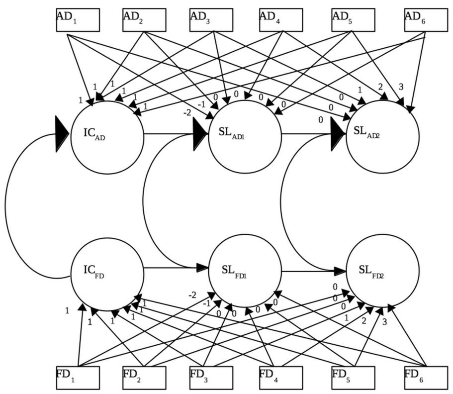
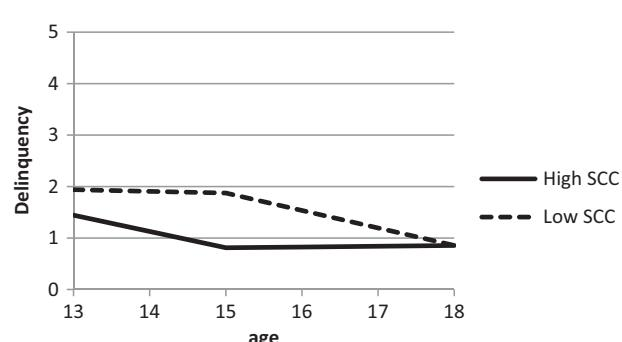

## EMPIRICAL RESEARCH

# The Longitudinal Role of Self-Concept Clarity and Best Friend Delinquency in Adolescent Delinquent Behavior

Emma K. V. Levey1 ● Claire F. Garandeau1 ● Wim Meeus1,2 ● Susan Branje1

Received: 13 November 2018 / Accepted: 6 February 2019 / Published online: 20 February 2019 © The Author(s) 2019

## Abstract

1234567890();,:

1234567890();,:

Adolescence tends to be characterized by a temporary peak in delinquent behavior, and friends in particular play a key role in the initiation and the development of delinquency. However, adolescents differ in their susceptibility to friends' influence on delinquency. Especially adolescents who are less certain about who they are might show more delinquent behavior, and might be more susceptible to their friends' behaviors, as friends are also crucial for adolescents' identity formation. In addition to examining the main effects of best friend's delinquency and self-concept clarity on the development of adolescents' delinquency, the current study scrutinized whether self-concept clarity moderated the longitudinal association between adolescents' and their best friends' self-reported delinquent behavior. The current study examined whether best friend delinquency and adolescent self-concept clarity were related to the development of adolescents' delinquency, and whether self-concept clarity moderated the relation between adolescent and best friend delinquency. Dutch adolescents (N = 497, Mage Wave 1 = 13 years, 287 boys) and their best friends participated across six annual waves. Both adolescents and best friends reported on their delinquency and adolescents reported on their self-concept clarity. Adolescent delinquency linearly declined, and although adolescents' and best friends' delinquency levels were related, changes in delinquency of adolescents and best friends were not. Adolescents low on self-concept clarity reported higher levels of delinquency. Selfconcept clarity also moderated the relation between adolescent and best friend delinquency levels, with stronger relations observed for adolescents with lower self-concept clarity. Future research should examine the protective role of self-concept clarity not only against delinquent behavior, but also against susceptibility to peer influence.

Keywords Self-concept clarity ● delinquency ● adolescence ● longitudinal ● best friend

## Introduction

On average, delinquent behavior tends to increase in early adolescence, peak in mid-adolescence, and decline in late adolescence (Moffitt [1993;](#page-12-0) Odgers et al. [2008](#page-12-0)). Most of this adolescent-limited delinquency concerns minor non-violent behaviors such as shoplifting, graffiti, and vandalism. One explanation for this temporary increase is the maturity gap: the discrepancy between adolescents' physiological age and their lack of adult privileges or personal autonomy (Moffitt [1993\)](#page-12-0). Adolescents' individuation process from the family might be hampered by institutional influences, which causes

\* Susan Branje [s.branje@uu.nl](mailto:s.branje@uu.nl)

- 1 Utrecht University, Utrecht, Netherlands
- 2 Tilburg University, Tilburg, Netherlands

frustration, which in turn leads adolescents to engage in behaviors that reflect independence, such as delinquent behaviors, in an attempt to express their maturity (Dijkstra et al. [2015\)](#page-11-0). Deviancy might thus become a normative part of the identity search.

However, not all adolescents follow this delinquency trajectory or exhibit delinquent behaviors to the same degree (Odgers et al. [2008\)](#page-12-0). Friends in particular play a key role in the initiation and the development of delinquency (e.g., Selfhout, Branje, and Meeus [2008;](#page-12-0) Slagt et al. [2015\)](#page-12-0). Adolescent delinquent behavior is positively associated with the delinquent behavior of their friends, due to adolescents' tendency to affiliate with similar others—selection effects—and to adolescents' tendency to conform to their friends' behaviors over time – socialization effects (Kandel [1978](#page-12-0)). However, adolescents differ in their tendency to select similar friends and their susceptibility to friends' influence on delinquency (Müller et al. [2016](#page-12-0); Slagt et al. [2015](#page-12-0)). Especially adolescents who are less certain about who they are might be more susceptible to their friends' behaviors, as friends are also crucial for adolescents' identity formation. In addition to examining the main effects of best friend's delinquency and self-concept clarity on the development of adolescents' delinquency, the current study examined whether self-concept clarity moderated the longitudinal association between adolescents' and their best friends' self-reported delinquent behavior.

## Development of Adolescent and Best Friend Delinquency

Ample research has shown that delinquency of adolescents is related to the delinquency of their friends (see Pratt et al. [2010\)](#page-12-0). A number of longitudinal studies found support for associated developmental changes - suggesting that adolescents and their friends not only select each other but also affect each other's delinquent behavior (e.g., Selfhout et al. [2008;](#page-12-0) Yu, Branje, Keijsers, Koot and Meeus [2013](#page-13-0)). For example, best friend deviant behavior was associated with higher delinquency in early adolescence (Mrug et al. [2014\)](#page-12-0) and also predicted future adolescent delinquent behaviors (Rees and Pogarsky [2011;](#page-12-0) Yu et al. [2013](#page-13-0)).

Socialization effects are thought to occur because conforming to friend behavior is both extrinsically and intrinsically rewarding for adolescents (Brechwald and Prinstein [2011\)](#page-11-0). Social learning theories emphasize that by modelling their friends' behavior, adolescents engage in behaviors that are directly reinforced by friends and are therefore socially rewarding (Akers [1998\)](#page-11-0). Social identity theories suggest that mimicking friends' delinquent behaviors is intrinsically rewarding as it can elicit support and acceptance, thereby contributing to a favorable self-identity (Leary and Baumeister [2000\)](#page-12-0). During adolescence, friends increasingly are primary sources of support that provide feedback and acceptance, which serves as a base for a sense of self. Therefore, best friend delinquency was expected to be positively related to adolescent delinquency.

### Self-Concept Clarity and Adolescent Delinquency

Personal characteristics can also play a role in the development of adolescent delinquency. This paper examined the role of self-concept clarity, which concerns how sure a person is of oneself (Schwartz et al. [2011](#page-12-0)). Self-concept clarity reflects the extent to which self-beliefs are clearly and confidently defined, internally consistent, and temporally stable (Campbell et al. [1996\)](#page-11-0). Self-concept clarity refers to the structural aspects of the self-concept (i.e., how the self-concept is organized and integrated in memory; McConnell and Strain [2007\)](#page-12-0) and it is distinct from but related to content dimensions of the self-concept. For example, self-concept clarity is positively related to selfesteem and negatively related to self-reflection (e.g., Campbell et al. [1996\)](#page-11-0). Self-concept clarity is related to identity (Campbell et al. [1996](#page-11-0); Schwartz et al. [2011\)](#page-12-0), as higher self-concept clarity has been linked to stronger identity commitments (Schwartz et al. [2011](#page-12-0)). Adolescent girls tend to have lower levels of self-concept clarity than boys, and whereas adolescent girls seem to have stable levels of self-concept clarity across adolescence; adolescent boys report a slight increase from age 13 to 17 with a minor decrease thereafter (Crocetti et al. [2016](#page-11-0)). Self-concept clarity is also related to several indices of psychosocial functioning, such as anxiety and depression (Schwartz et al. [2011](#page-12-0); Van Dijk et al. [2014](#page-13-0)).

Although links between adolescent self-concept clarity and delinquency have not been directly examined, research on identity development and adjustment suggests that questioning and rethinking one's sense of self is associated with higher delinquency. Weaker identity commitments are related to higher delinquency (Meeus, Van de Schoot, Keijsers, and Branje [2012\)](#page-12-0) and higher reconsideration of identity commitments has been related to both higher selfreported delinquency (Crocetti, Rubini, Luyckx, and Meeus [2008](#page-11-0); Mercer, Crocetti, Branje, van Lier and Meeus [2017](#page-12-0)) and more externalizing problems (Hatano, Sugimura and Crocetti [2016\)](#page-11-0). Further, young people who cannot vividly envision their future self are more likely to make delinquent choices (van Gelder, Hershfield and Nordgren [2013](#page-13-0)).

The link between identity and delinquency may be the result of developmental ambiguity and challenges (e.g., the maturity gap), if adolescents use delinquency as a means to explore their potential (self-) identity. Engaging in delinquency may also be a more general marker for difficulties in forming personal identity, a struggle which has been related to poorer adjustment in general (e.g., Meeus et al. [2012\)](#page-12-0). Delinquency has been theorized to be a way of dealing with a negative self-concept (Levy [1997\)](#page-12-0), and a more positive self-concept has been linked to lower assaultive delinquency (Bynum and Weiner [2002](#page-11-0)). Based on research on identity and delinquency as well as the link between selfconcept clarity and identity, self-concept clarity was expected to be negatively related to delinquency.

### The Moderating Role of Self Concept Clarity

Furthermore, some adolescents are more susceptible to the influence of delinquent friends than others (e.g., Yu et al. [2013](#page-13-0)). In order to prevent and reduce youth delinquency, it is essential to identify factors that make adolescents more or less susceptible to their friends' influence (Brechwald and Prinstein [2011](#page-11-0)). Research has found that more popular peers (Cohen and Prinstein [2006\)](#page-11-0) and friends with a resilient or over-controlling personality (Yu et al. [2013](#page-13-0)) exert more influence on adolescent delinquency. Adolescent parental attachment and childhood disruptiveness also moderate the link between adolescent and best friend delinquency (Vitaro et al. [2000\)](#page-13-0). A number of individual characteristics such as being male (Müller et al. [2016\)](#page-12-0), having low conscientiousness (Slagt et al. [2015\)](#page-12-0), low self-regulation (Gardner, Dishion, and Connell [2008](#page-11-0)), low autonomy (Allen, Chango, Szwedo, Schad, and Marston [2012](#page-11-0)) and high disinhibition (Goodnight, Bates, Newman, Dodge and Petit [2006\)](#page-11-0) also have been found to serve as risk factors for increased susceptibility to influence.

The current study examined self-concept clarity as moderator of the relation between adolescents' and their best friends' delinquency. A less certain self-concept is hypothesized to be related to increased susceptibility to external cues (Campbell [1990](#page-11-0)), and stronger identity commitments are theorized to be related to lower susceptibility to socialization effects (Brechwald and Prinstein [2011](#page-11-0)). Moreover, adolescents without identity commitments, or without motivation to explore new commitments, are thought to be more likely to conform to peer influence due to a lack of strong beliefs of their own (Para [2008](#page-12-0)). Therefore, adolescents' self-concept clarity is expected to affect the degree to which they are influenced by the delinquency of their friends, in that delinquency in adolescents with low self-concept clarity will be more strongly related to their best friends' delinquency than delinquency in adolescents with high self-concept clarity.

Self-concept clarity might affect the relation between adolescent and friend delinquency differentially across adolescence. Developmental changes in susceptibility to peers indirectly suggest that self-concept clarity may play a role in this susceptibility. Research has shown a curvilinear development for conformity to antisocial peer influence (Brown et al. [1986](#page-11-0)). Increased conformity to peers is observed in early adolescence only (Shulman, Laursen, Kalman and Karpovsky [1997](#page-12-0)). Resistance to antisocial peer influence increases across adolescence, with strongest growth in mid adolescence as compared to early and late adolescence (Steinberg and Monahan [2007\)](#page-13-0). Another study showed a linear increase in resistance to peer influence across adolescence (Sumter, Bokhorst, Steinberg, and Westenberg [2009](#page-13-0)). Therefore, the effect of friend influence on delinquency was expected to decrease with time. As selfconcept clarity increases throughout adolescence (Crocetti et al. [2016](#page-11-0); Wu, Watkins, and and Hattie [2010](#page-13-0)), the decrease in susceptibility to (delinquent) peer influence may be a function of psychosocial maturation in a broader sense (Brechwald and Prinstein [2011;](#page-11-0) Sumter et al. [2009\)](#page-13-0). Taken together, this previous research led us to hypothesize that adolescents whose self-concept is unstable and not clearly defined may be at an increased risk of engaging in delinquent behaviors and may be more easily influenced by friends' delinquent behavior.

## Current Study

The current study addressed two questions. First, using multivariate Latent Growth Curve Models it was examined whether best friend delinquency and self-concept clarity were related to adolescent delinquent behavior over time. The hypotheses were that best friend delinquency would be positively related to adolescent delinquency and the effect of best friend delinquency would decrease with time. Moreover, self-concept clarity was expected to be negatively related to adolescent delinquency. Second, using multigroup Latent Growth Curve Models it was investigated whether self-concept clarity moderated the longitudinal association between adolescent and best friend selfreported delinquent behavior. The hypothesis was that delinquency in adolescents with low self-concept clarity would be more strongly related to best friend delinquency in comparison to adolescents with high self-concept clarity.

## Methods

### Participants

The current study used the first six annual waves of data from 497 Dutch adolescents (56.9% boys) and their best friends, who participated in the ongoing Research on Adolescents and Relationships-Younger cohort (RADAR-Y) project (Van Lier et al. [2008](#page-13-0)). At Wave 1, the target adolescents were attending secondary school and had a mean age of 13 (SD = 0.46). Most adolescents lived with both biological parents (85%), were classified as having a medium to high socioeconomic status (89%) based on their caregivers' occupations, and reported their ethnicity to be Dutch-Caucasian (95%). At Wave 6, 372 adolescents still participated in the study. Best friends were on average 13 years-old at Wave 1, SD = 0.80, with 49.7% of them being male. Across waves, 78.6% of friendships were same-sex friendships. Adolescents did not always have a participating best friend at each wave (17.3%), and 18 adolescents did not have a participating best friend at any wave (3.6%). Further, 28.8% (n = 143) of adolescents reported having the same best friend at each wave.

Attrition analyses showed no significant difference on Wave 1 delinquency between adolescents who consistently participated (n = 372) and those who did not (n = 125), F (1, 465) = 1.47, p = .226, η2 = 0.00. However, those who did not consistently participate had significantly lower selfconcept clarity at Wave 1, F(1, 465) = 6.22, p = .013, η2 = 0.01, M = 3.29, SD = 0.65, compared to those who did, M = 3.46, SD = 0.63. Furthermore, non-consistent participants were slightly older at Wave 1, F(1, 465) = 7.76, p = .006, η2 = 0.02, M = 13.13, SD = 0.55, than consistent participants, M = 13.00, SD = 0.43. Attrition was not significantly related to gender, χ²(1) = 0.06, p = .806, ϕ = 0.03. Moreover, there were no significant differences on Wave 1 adolescent delinquency, F(1, 465) = 1.54, p = .215, η2 = 0.00, nor self-concept clarity, F(1, 465) = 2.95, p = .086, η2 = 0.01, between adolescents with a best friend participating at least once (n = 479) and those without (n = 18). Although Little's test for missing data was significant, χ²(1536) = 1931.85, p < .001, ϕ = 1.97, Little's test revealed a low χ²/df value of 1.26, showing a good fit of sample scores with or without using imputation methods (Bollen [1989](#page-11-0)). Thus, using Full Information Maximum Likelihood (FIML) within Mplus (Muthén and Muthén [1998](#page-12-0)–[2012\)](#page-12-0) was possible. Consequently, analyses were conducted upon the entire sample (N = 497).

### Procedure

Target adolescents were recruited from 230 schools that were randomly selected from a list of elementary schools in the western and central regions of the Netherlands (Van Lier et al. [2008](#page-13-0)). Once recruited, adolescents were asked to invite a best friend to participate in the study. Parents of the adolescent and best friend received a thorough description of the study and were informed that their data would be treated with confidentiality. The target adolescent, their parents, their best friend, and their best friend's parents all provided written active informed consent. Research assistants contacted the families to arrange a home visit (with yearly intervals), where adolescents and their best friend were administered questionnaires. Both adolescents and best friends received a monetary compensation of €15 for participating in each wave. Ethical permission was received from the University Medical Centre Utrecht ethical-medical committee.

### Measures

#### Self-reported delinquency

At each wave, adolescents and best friends completed the Dutch version of the Self-Report Delinquent Behavior questionnaire, based upon the International Self-Report Delinquency Study (Junger-Tas, Terlouw, and Klein [1994](#page-12-0)). This questionnaire consisted of 30 items including both minor (e.g., theft from home, vandalism) and serious offenses (e.g., burglary, selling hard drugs). For example, "In the last year, have you stolen a bike?" with answers being dichotomous (0 = no, 1 = yes). The sum score of all 30-items was used to create a variety scale for general delinquency as variety scales are generally preferred over frequency scales (e.g., Bendixen, Endresen, and Olweus [2003](#page-11-0)). More specifically, as minor offenses occur more frequently than serious offenses, frequency scales can result in a biased report, lower stability over time, and low internal consistency (Bendixen et al. [2003\)](#page-11-0). Reliabilities ranged from Cronbach's α = .76 to Cronbach's α = .93 for adolescents, and from Cronbach's α = = .82 to Cronbach's α = = .89 for best friends, across six waves, and were all acceptable (Cronbach's α = >.70; Field [2009\)](#page-11-0).

#### Self-concept clarity

Each wave, adolescents completed a Dutch version of the Self-Concept Clarity scale (Campbell et al. [1996\)](#page-11-0). Participants indicated how strongly they agreed with 12 statements on a five-point scale (1 = really disagree, to 5 = really agree). Example items include "I rarely have the feeling that different aspects of my personality conflict with each other" and "In general I have a clear image of who and what I am". Sum scores were computed so that higher scores reflected higher levels of self-concept clarity. Scale reliability, construct validity, and criterion validity have previously been found adequate (Campbell et al. [1996](#page-11-0)). Further, research with Dutch adolescents has shown good internal consistency (Van Dijk et al. [2014\)](#page-13-0). In the current sample, good scale reliabilities were found for all waves (α = .83 to .92).

### Analytic Strategy

#### Development of adolescent and best friend delinquency

Structural equation modelling in Mplus 7.2 (Muthén and Muthén [1998](#page-12-0)–[2012](#page-12-0)) was used to conduct the analyses. Longitudinal trajectories of self-reported adolescent and best friend delinquent behavior were examined using multivariate Latent Growth Curve Models (LGCM). As data from adolescent and best friends were interdependent, the Olsen and Kenny ([2006\)](#page-12-0) approach, which can deal with the interdependence of data, was used. As quadratic curvilinear trajectories can be difficult to interpret and compare across multiple trajectories, piecewise latent growth analysis (Muthén and Muthén [1998](#page-12-0)–[2012\)](#page-12-0) was used to examine adolescent and best friend delinquency development. To fit these models, the delinquency trajectory was divided into two linear segments, with a shared intercept and two separate slopes, representing ages 13–15 and 16–18 (see Fig. [1](#page-4-0)). This cut-off was chosen as it represents the age where delinquent behavior peaks before declining (Moffitt [1993](#page-12-0); Odgers et al. [2008](#page-12-0)).

Model fit was evaluated using the following guidelines: the Root Mean Square Error of Approximation (RMSEA) should be under .08 and .05 for acceptable and good fit respectively (MacCallum, Browne, and Sugawara [1996\)](#page-12-0), Fig. 1 Linear growth piecewise model containing intercepts (ICAD, ICFD) slopes (SLAD1, SLAD2, SLFD1, SLFD2), and associations between adolescent (AD) and friend (FD) delinquent behavior

the Standardized Root Mean Square Residual (SRMR) should be under .08, and the Comparative Fit Index (CFI) should be above .90 and .95 for acceptable and good fit respectively (Hu and Bentler [1999](#page-12-0)). As the delinquency data were negatively skewed, the Maximum Likelihood Ratio estimator and the Satorra and Bentler ([2001\)](#page-12-0) chisquare difference test (ΔχSB 2 ) method were used to compare models.

#### Self-concept clarity and delinquency

A Latent Class Growth Analysis (LCGA) within Mplus 7.2 (Muthén and Muthén [1998](#page-12-0)–[2012\)](#page-12-0) was used as a sophisticated method to distinguish groups of high and low selfconcept clarity adolescents. The resulting self-concept clarity classes were used within multi-group modelling, along with Wald tests, to examine whether adolescent delinquency development differs for adolescents with either high or low self-concept Clarity. To test the moderation effect of self-concept clarity on the longitudinal relation between adolescent and best friend delinquent behavior, correlations of adolescents' intercept with best friends' intercept, and of adolescents' slopes from ages 13-15 and from ages 16-18 with best friends' slopes, were compared with univariate Wald tests.

Fig. 2 Development of adolescent delinquency per self-concept clarity group

**age**

## Results

### Distinguishing High versus Low Self-concept Clarity

The goal of this study was to examine whether adolescents with either high or low self-concept clarity show different development of delinquent behavior and differential associations with best friend delinquent behavior. Therefore, first, a Latent Class Growth Analysis (LCGA) within Mplus Table 1 Means of adolescent delinquency and best friend delinquent behavior across waves

|                      | Wave 1 M(SD) | Wave 2 M(SD) | Wave 3 M(SD) | Wave 4 M(SD) | Wave 5 M(SD) | Wave 6 M(SD) |
|----------------------|-----------------|-----------------|-----------------|-----------------|-----------------|-----------------|
| Adolescent           | 1.86(3.07)      | 1.27(2.61)      | 1.42(2.69)      | 1.28(2.65)      | 0.92(1.80)      | 0.93(2.89)      |
| Best friend          | 2.35(3.08)      | 2.05(3.21)      | 2.10(3.16)      | 1.81(2.73)      | 1.74(3.07)      | 1.56(3.23)      |
| Adolescent low SCC*  | 2.03(2.87)      | 1.67(3.05)a     | 1.91(3.01)b     | 1.56(2.62)c     | 1.03(1.78)      | 0.98(2.61)      |
| Adolescent high SCC* | 1.71(3.24)      | 0.92(2.10)a     | 0.99(2.29)b     | 1.03(2.66)c     | 0.82(1.81)      | 0.88(3.12)      |

Values for adolescents with high versus low SCC with the same subscript significantly differ at p < .05. \*SCC = self-concept clarity

7.2 (Muthén and Muthén [1988](#page-12-0)–[2012](#page-12-0)) was conducted as a sophisticated method to distinguish groups of high and low self-concept clarity adolescents.

A piecewise model allowing curvilinear change had excellent fit, χ2 (12) = 28.68, p = .004, RMSEA = .053, CFI = .985, SRMR = .056, and fitted significantly better than a linear model, ΔχSB 2 (4) = 42.38, p < .001. The twoclass solution was acceptable with an entropy of .80 (>.70; Reinecke [2006\)](#page-12-0), and fitted significantly better than a oneclass solution, parametric bootstrapped likelihood ratio test (4) = 892.10, p < .001. The first class could be characterized as low self-concept clarity group (n = 235), with an intercept mean of 2.96, SE = 0.07, p < .001. In this group, selfconcept clarity significantly decreased from ages 13–15, Mslope = −0.06, SE = 0.03, p = .044, but was stable between ages 16–18, Mslope = −0.04, SE = 0.04, p = .021. The second class could be characterized as high selfconcept clarity group (n = 262), with an intercept mean of 3.99, SE = 0.06, p < .001. In this group, self-concept clarity significantly increased between ages 13–15, Mslope = 0.12, SE = 0.02, p < .001, but was stable from ages 16–18, Mslope = −0.00, SE = 0.02, p = .799. Class membership of selfconcept clarity was significantly related to adolescent gender, with girls being more likely to be in the lower selfconcept clarity group, B = −0.15, SEB = 0.05, p = .001, β = −.15, but not to best friend stability as defined by adolescents reporting having the same best friends across all six years, B = 0.02, SEB = 0.04, p = .618, β = .02.

### Preliminary Analyses

Correlations of adolescent and best friend delinquent behavior and self-concept clarity were examined at each wave. Adolescent and best friend delinquency were significantly moderately correlated at Waves 1 through 5, with r's ranging from .23, p < .001 to .31, p < .001, but not at Wave 6 (r = .05, p = .326). Mean scores suggested that best friends were more delinquent at all waves compared to target adolescents, and that delinquency showed a linear decline across adolescence (see Table 1). Self-concept clarity was significantly but weakly related to adolescent delinquency at Waves 2 to 5, with r's ranging from −.10, p = .030, to −.14, p = .006, but not at Waves 1 (r = .01, p

= .912) and 6 (r = −.04, p = .371). Furthermore, independent samples t-tests between low and high self-concept clarity adolescents (see Table 1) revealed significant differences in adolescent delinquency at Waves 2, 3, and 4, with low self-concept clarity adolescents reporting higher delinquency scores at each wave compared to high selfconcept clarity adolescents.

## Adolescent and Best Friend Delinquency Development

Development of adolescent and best friend delinquent behavior was examined using a multivariate piecewise latent growth curve model (LGCM). This model had excellent fit, χ2 (51) = 75.10, p = .016, RMSEA = .031, CFI = .956, SRMR = .050, and was significantly better than a linear model, ΔχSB 2 (13) = 30.79, p = .004. A quadratic model also fitted the data well, supporting curvilinear development and the choice of a piecewise model, χ2 (51) = 82.06, p = .004, RMSEA = .035, CFI = .943, SRMR = .051.

#### Testing for indistinguishable dyads

Because adolescent and best friend data are interdependent, it was tested whether adolescents and friends were indistinguishable using the Olsen and Kenny ([2006\)](#page-12-0) approach for modelling LGCM for interchangeable dyads. When dyad members are indistinguishable, the development of delinquency is similar for adolescents and friends. A model with latent means, latent variances, and residual variances constrained to be equal across adolescent and best friend was compared to an unconstrained model. The constrained model, in which dyad members share a common intercept, developmental pattern and developmental variance, demonstrated unacceptable fit to the data (see Model 2 - Table [2](#page-6-0)), and fitted the data significantly worse than the unconstrained model. Therefore, dyad members were not completely indistinguishable in development of delinquency. Subsequent analyses, in which paths were constrained in a stepwise procedure comparing to the unconstrained model, revealed that adolescents and best friends were distinguishable on intercept means and residual Table 2 Fit statistics of, and model comparisons between, models used to check for dyadic interdependence in delinquency development

| Model                                                       | χ2 (df) | p     | RMSEA | CFI  | SRMR | *ΔχSB2 (df) | p     |
|-------------------------------------------------------------|------------|-------|-------|------|------|----------------|-------|
| Model 1: Unconstrained piecewise growth model (Baseline) | 75.10(51)  | .016  | .031  | .956 | .050 |                |       |
| Model 2: Constrained piecewise growth model                 | 147.98(63) | <.001 | .052  | .844 | .107 |                |       |
| Model 2 vs Model 1                                          |            |       |       |      |      | 48.83(12)      | <.001 |
| Model 3: Intercept means constrained                        | 87.24(52)  | .002  | .037  | .935 | .056 |                |       |
| Model 1 vs Model 3                                          |            |       |       |      |      | 23.27(1)       | <.001 |
| Model 4: Slope 1 and 2 means constrained                    | 76.68(53)  | .018  | .030  | .956 | .050 |                |       |
| Model 1 vs Model 4                                          |            |       |       |      |      | .34(2)         | .844  |
| Model 5: Latent variances constrained                       | 71.62(54)  | .055  | .026  | .968 | .050 |                |       |
| Model 1 vs Model 5                                          |            |       |       |      |      | .41(3)         | .938  |
| Model 6: Residual variances constrained                     | 127.43(57) | <.001 | .050  | .871 | .091 |                |       |
| Model 1 vs Model 6                                          |            |       |       |      |      | 23.01(6)       | <.001 |
| Model 7: Final model                                        | 73.26(56)  | .061  | .025  | .968 | .050 |                |       |

\*Chi squared difference tests were conducted using the Satorra & Bentler ([2001](#page-12-0)) approach to account for the use of the MLR estimator within Mplus.

variances, but indistinguishable on slope means and intercept and slope variances (see Table 2). Thus, adolescents and best friends reported different average levels of delinquency, but similar developmental changes. The fit of this final model, with constrained slope means and variances, was excellent.

#### Stable versus unstable friends

It was further examined whether development and associations between adolescent and best friend delinquency significantly differed for adolescents with a stable best friend across all six waves (n = 143) versus adolescents with unstable best friends (n = 354). There was no significant difference in model fit between the constrained and unconstrained model, ΔχSB 2 (12) = 14.26, p = .284, and therefore it was concluded that development of delinquency in friendship dyads did not differ depending on best friend stability.

#### Delinquency development

For adolescents and best friends, delinquency levels (intercept mean) significantly differed from zero, and best friends' delinquency level was significantly higher than adolescents' delinquency level (see Table 3). Adolescents and best friends showed, on average, a significant decline in delinquency from ages 13–15 and from ages 16–18 (see Table 3). There was no significant difference in growth strength (slope means) between delinquency from ages 13– 15 and ages 16–18, ΔχSB 2 (1) = .22, p = .64.

For both adolescents and best friends, intercepts were moderately significantly positively correlated with the slope from Waves 1 till 3, but negatively with the slope from Waves 4 till 6 (see Table 3). Thus, for both adolescents and

Table 3 Model parameter estimates of the final dyadic developmental model of delinquency

| Model parameters       | Adolescent      |       | Best friend     |       |  |
|------------------------|-----------------|-------|-----------------|-------|--|
|                        | M(SE)           | p     | M(SE)           | p     |  |
| Latent means           |                 |       |                 |       |  |
| Intercept              | 1.39a (0.11) | <.001 | 2.12a (0.12) | <.001 |  |
| Slope 1b               | −0.15(0.06)     | .007  | −0.15(0.08)     | .007  |  |
| Slope 2c               | −0.19(0.04)     | <.001 | −0.19(0.04)     | <.001 |  |
| Latent variances       | σ2 (SE)      | p     | σ2 (SE)      | p     |  |
| Intercept variance     | 5.32(0.86)      | <.001 | 5.32(0.86)      | <.001 |  |
| Slope 1b variance      | 1.15(0.33)      | <.001 | 1.15(0.33)      | <.001 |  |
| Slope 2c variance      | 0.54(0.15)      | <.001 | 0.54(0.15)      | <.001 |  |
| Correlations           | r               | p     | r               | p     |  |
| Intercept with slope 1 | .36             | .030  | .30             | .013  |  |
| Intercept with slope 2 | −.79            | <.001 | −.57            | <.001 |  |
| Slope 1 with slope 2   | −.24            | .318  | .03             | .871  |  |

a These two values significantly differ from each other at p < .001

b Slope for waves one till three

c Slope for waves three till six

best friends, a higher delinquency level was related to a less steep decline in delinquency from ages 13-15, but to a steeper decline between ages 16 till 18.

### Associations between adolescents' and best friends' delinquency

The intercept of best friend delinquency was moderately significantly positively correlated with the intercept of adolescent delinquency, r = .38, p < .001, showing that higher levels of best friends' delinquency were related to higher levels of adolescent delinquency. However, there was no significant relation between adolescents' and best friends' growth from ages 13-15, r = .24, p = .170, and ages 16-18, r = .29, p = .137.

### The Moderating Role of Self-Concept Clarity

#### Self-concept clarity and adolescent delinquency

As the goal of the current study was to test whether adolescent delinquency developed differentially for adolescents with low versus high self-concept clarity, a multigroup LCGM for low and high self-concept clarity groups was fit based on the previous dyadic model, with different latent means and residual variances, but similar latent variances for adolescents and best friends. As gender was significantly related to self-concept clarity class, gender was regressed on the growth factors of delinquency to control for gender. Model fit of this baseline model was good, χ2 (125) = 191.02, p < .001, RMSEA = .047, CFI = .923, SRMR = .076. Table 4 shows model coefficients for adolescent and best friend delinquency development per self-concept clarity group (see also Fig. [2](#page-4-0)).

Wald tests were used to examine differences in intercepts and slopes of adolescent delinquency in the low and high self-concept clarity groups. The intercept of delinquency significantly differed between self-concept clarity groups, χ2 (1) = 4.15, p = .042. More specifically, high self-concept clarity adolescents had a lower delinquency level compared to low self-concept clarity adolescents. Although adolescents with low self-concept clarity showed stability in delinquency from ages 13-15 and adolescents with high self-concept clarity significantly declined, the slopes of the two groups did not significantly differ, χ2 (1) = 1.29, p = .257. Similarly, there was no significant difference between the slopes of the two groups from the ages 16-18, χ2 (1) = 3.00, p = .083.

### Self-concept clarity and adolescents' susceptibility to friends

To test the moderation effect of self-concept clarity on the longitudinal relation between adolescent and best friend delinquent behavior, correlations of adolescents' intercept with best friends' intercept, and of adolescents' slope from ages 13-15 and from ages 16-18 with the best friends' slope, were compared with three univariate Wald tests. There was a significant moderation effect of self-concept clarity on the correlation between adolescents' and best friends' delinquency intercepts, χ2 (1) = 4.038, p = .045. More specifically, for low self-concept clarity adolescents, the correlation between adolescents' and friends' intercept of delinquency was significantly stronger than for high selfconcept clarity adolescents. The delinquency intercept of low self-concept clarity adolescents was significantly and positively correlated with friends' intercept of delinquency, r = .40, p = < .001, whereas this correlation was not significant for high self-concept clarity adolescents, r = .25, p

Table 4 Model parameter estimates of the final multigroup delinquency developmental model

| Model parameters          | Adolescents  |       | Best friends |       |  |  |  |
|---------------------------|--------------|-------|--------------|-------|--|--|--|
| Low self-concept clarity  |              |       |              |       |  |  |  |
| Latent means              | M(SE)        | p     | M(SE)        | p     |  |  |  |
| Intercept                 | 3.05(0.59)a  | <.001 | 4.10(0.68)   | <.001 |  |  |  |
| Slope 1b                  | −0.04(0.29)  | .881  | −0.04(0.29)  | .881  |  |  |  |
| Slope 2c                  | −0.32 (0.21) | .134  | −0.32 (0.21) | .134  |  |  |  |
| Latent variances          | σ2 (SE)   | p     | σ2 (SE)   | p     |  |  |  |
| Intercept                 | 6.48(1.18)   | <.001 | 6.48(1.18)   | <.001 |  |  |  |
| Slope 1b                  | 1.54(0.46)   | .001  | 1.54(0.46)   | .001  |  |  |  |
| Slope 2c                  | 0.62(0.18)   | <.001 | 0.62(0.18)   | <.001 |  |  |  |
| Correlations              | r            | p     | r            | p     |  |  |  |
| Intercept with slope 1    | .64          | <.001 | .38          | .008  |  |  |  |
| Intercept with slope 2    | −.91         | <.001 | −.62         | .001  |  |  |  |
| Slope 1 with slope 2      | −.62         | <.001 | .09          | .734  |  |  |  |
| High self-concept clarity |              |       |              |       |  |  |  |
| Latent means              | M(SE)        | p     | M(SE)        | p     |  |  |  |
| Intercept                 | 1.67(0.34)a  | <.001 | 1.95(0.19)   | <.001 |  |  |  |
| Slope 1b                  | -0.46(0.23)  | .044  | -0.46(0.23)  | .044  |  |  |  |
| Slope 2c                  | 0.13(0.15)   | .377  | 0.13(0.15)   | .377  |  |  |  |
| Latent variances          | σ2 (SE)   | p     | σ2 (SE)   | p     |  |  |  |
| Intercept                 | 3.33(1.14)   | .004  | 3.33(1.14)   | .004  |  |  |  |
| Slope 1b                  | 0.72(0.44)   | .102  | 0.72(0.44)   | .102  |  |  |  |
| Slope 2c                  | 0.37(0.21)   | .074  | 0.37(0.21)   | .074  |  |  |  |
| Correlations              | r            | p     | r            | p     |  |  |  |
| Intercept with Slope 1    | −.23         | .626  | .08          | .782  |  |  |  |
| Intercept with Slope 2    | −.58         | .003  | −.53         | .009  |  |  |  |
| Slope 1 with Slope 2      | .50          | .421  | .14          | .756  |  |  |  |

a These paths significantly differ across groups at p < .010

b Slope for waves one till three

c Slope for waves three till six

= .066. However, there was no significant moderation effect on the relation between adolescent and best friend developmental slope between ages 13–15, χ2 (1) = 0.06, p = .806, and between ages 16-18, χ2 (1) = 0.04, p = .838. For both adolescents with low and adolescents with high selfconcept clarity, the slopes were not significantly correlated, for adolescents with low self-concept clarity rages 13–15 = .22, p = .257, and rages 16–18 = .20, p = .486, and for adolescents with high self-concept clarity rages 13–15 = .61, p = .114, and rages 16–18 = .45, p = .102.

## Discussion

Delinquent behavior tends to peak in adolescence (Moffitt [1993](#page-12-0); Odgers et al. [2008](#page-12-0)), and friends are thought to play a key role in the initiation and the development of delinquency (e.g., Selfhout et al. [2008](#page-12-0)). However, not all adolescents exhibit delinquent behaviors to the same degree (Odgers et al. [2008](#page-12-0)), and adolescents differ in their tendency to select similar friends and their susceptibility to friends' influence on delinquency (Müller et al. [2016](#page-12-0); Slagt et al. [2015\)](#page-12-0). Conforming to friend behavior is both extrinsically and intrinsically rewarding for adolescents (Brechwald and Prinstein [2011](#page-11-0)) and can contribute to a favorable self-identity (Leary and Baumeister [2000\)](#page-12-0). Adolescents who are less certain about who they are—i.e., have lower self-concept clarity—might be more susceptible than others to their friends' behaviors. The current study examined the role of best friends' delinquency and adolescents' selfconcept clarity on development of adolescent delinquency, and the moderating role of self-concept clarity on the longitudinal association between adolescents' and their best friends' delinquency. Based on previous research, the expectation was that adolescent and best friend delinquency would be related, and that higher self-concept clarity would be related to lower delinquency, but also to a lower susceptibility to influence by best friends' delinquency patterns.

Contrary to the expected curvilinear development of adolescent delinquency often characterized by an increase until the age of 15 followed by a decline in late adolescence (e.g., Moffitt [1993](#page-12-0)), in the current study delinquency declined linearly across adolescence for both adolescents and their best friends. Moreover, although adolescent and best friend delinquency levels were significantly correlated as hypothesized, their developmental changes over time were not. In line with expectations, adolescents who scored higher on self-concept clarity had lower levels of delinquency than adolescents who scored lower on self-concept clarity. Finally, the relation between adolescents' level of delinquency (thus not the developmental changes) and their best friend's level of delinquency was significantly moderated by self-concept clarity. The association between adolescent and best friends' delinquency levels was stronger for low self-concept clarity adolescents. Therefore, selfconcept clarity may be a protective factor not only against delinquency, but also against susceptibility to peer influence.

## Adolescent and Best Friend Delinquency Development

In line with the hypothesis, higher average best friend delinquency was related to a higher average level of adolescent delinquency. There was a moderate, stable association between adolescent and best friend delinquency over the course of adolescence. However, developmental changes in adolescent and best friend delinquency were not related. Although the finding of a significant association in delinquency levels is consistent with previous studies showing a link between adolescent and friend delinquency (Guo et al. [2015](#page-11-0); Weerman and Smeenk [2005\)](#page-13-0), the absence of a significant association between adolescent and best friend developmental changes is discordant with the literature. Several studies have found a significant link between adolescent and best friend delinquency development (Selfhout et al. [2008](#page-12-0) (for boys); McGloin [2009](#page-12-0); Vitaro et al. [2000](#page-13-0)).

While friends' delinquency is a well-established predictor of adolescent delinquency (Pratt et al. [2010](#page-12-0); Weerman and Smeenk [2005\)](#page-13-0), there are some plausible explanations for why there was no relation between the development of delinquency in adolescents and their best friends. The first explanation is related to the distinction between two different types of peer influence: situational influence and socialization influence (Hoeben and Weerman [2016](#page-11-0)). Whereas the current study examined the relation between best friends' delinquency and adolescent delinquency (e.g., tapping into socialization effects), it is plausible that situational peer influences on delinquency may play a stronger role within delinquency development than the socialization influence of best friends' delinquent behavior. For example, time spent in unstructured socializing with peers, a robust predictor of adolescent delinquency, is thought to influence changes in delinquent behavior via processes such as reinforcement, provocation, and instigation in the immediate situation (e.g., Hoeben and Weerman [2016\)](#page-11-0). In this regard, situational peer influence may be a more salient predictor of developmental change than the long-term attitudinal and socialization influences of best friends, which may be better predictors of delinquency level. Indeed, recent experimental research suggests that even brief exposure to previously unknown deviant peers can increase deviant behavior in young people (Gallupe et al. [2016](#page-11-0); Paternoster, McGloin, Nguyen, and Thomas [2013](#page-12-0)). This provides strong causal evidence for the saliency of situational peer influences on adolescent delinquency and shows the importance of examining time spent in unsupervised, unstructured settings for understanding withinadolescent changes in delinquency development.

Further, the importance of situational peer influences on delinquent development may also account for the unexpected linear decline in delinquency reported by both adolescents and their best friends. While time spent with peers in public and unsupervised contexts has the strongest impact on adolescent delinquency (Weerman, Bernasco, Bruinsma and Pauwels [2015\)](#page-13-0), recent increases in adolescents' internet use and gaming habits (e.g., De Looze et al. [2014](#page-11-0)) may play a role in keeping adolescents inside the parental home, instead of outside where delinquent acts are generally committed. Additionally, time spent socializing on the streets and in open spaces has been shown to decline with age in adolescence (Hoeben and Weerman [2014](#page-11-0)). This decline in both delinquency and time spent in unstructured socializing is consistent with a decrease in both selfreported and registered offences among Dutch adolescents (Van der Laan and Goudriaan [2016](#page-13-0)). Overall, general changes in how adolescents seem to be spending their time and the potentially related decreases in delinquency seen in Dutch youth are not only in line with the current study's findings, but also provide support for the need to distinguish situational effects from socialization effects when investigating peer influence on delinquency.

A second explanation for the fact that there was no relation between developmental changes in adolescent and best friend delinquency is related to considering only best friend delinquency. For instance, research has shown that delinquency of good friends and peer groups (Haynie [2002\)](#page-11-0) as well as romantic partners (Lonardo, Giordano, Longmore and Manning [2009\)](#page-12-0) are related to adolescent delinquency. Further, the peer proximity hypothesis argues that close friends are more influential than general distant peers (Paek [2009\)](#page-12-0). While there is some evidence that more proximate contacts matter more than distal contacts (Guo et al. [2015](#page-11-0); Payne and Cornwell [2007\)](#page-12-0), other research suggests that, under some circumstances, peer groups may have a stronger influence than best friend delinquency (Rees and Pogarsky [2011\)](#page-12-0). Indeed, to understand the role of peers on delinquency, multiple characteristics of the social network as a whole should be taken into consideration (Haynie [2001](#page-11-0)). Finally, it is plausible that various characteristics of peer networks and peer relationships may be differentially related to situational and socialization influence mechanisms. Together, they may be especially relevant for disentangling influences on level of delinquency versus changes in delinquency development.

## Self-Concept Clarity and Adolescent Delinquent Behavior

Consistent with the hypothesis, the results showed that adolescents with low self-concept clarity reported higher levels of delinquency. Although the difference did not reach significance, adolescents low in self-concept clarity seemed to decline in delinquency at a later age than adolescents with high self-concept clarity, which seems to reflect a catch-up effect. Certainly, high self-concept clarity adolescents may be more self-assured and thereby have a stronger ability to avoid peer influence at a younger age than adolescents who are low in self-concept clarity. This mechanism might in part account for their lower levels of, and significant decline in, delinquency.

In line with the hypothesis that personal characteristics are related to adolescent susceptibility to peer influence (e.g., Gardner et al. [2008;](#page-11-0) Goodnight et al. [2006](#page-11-0)), selfconcept clarity affected the relation between adolescent and best friend delinquency. For low self-concept clarity adolescents, the correlation between adolescents' and friends' intercept (but not slope) of delinquency was significantly stronger than for high self-concept clarity adolescents. This finding is consistent with previous research that has suggested that low self-concept clarity adolescents are more susceptible to external effects (Campbell [1990\)](#page-11-0). Relatedly, adolescents with weaker identity commitments show increased conformity as they do not have strict beliefs to follow (Para [2008\)](#page-12-0). Therefore, adolescents who are low on self-concept clarity may be more susceptible to delinquent friend influences in order to gain a sense of conformity.

Further, the findings regarding self-concept clarity have implications for delinquency interventions, which could differ in effectiveness depending on adolescent self-concept clarity levels. It is possible that interventions aimed at increasing self-concept clarity may reduce delinquency levels directly or indirectly through weakening the link between adolescent and their friend's delinquent behavior. Moreover, adolescents whose self-concept clarity is heightened through interventions may be less inclined to partake in delinquent behavior exhibited by their friends as they are less likely to be influenced by their friend's beliefs and acts. The utility of these interventions can also be inferred from research on juvenile delinquents who have been shown to have weaker identity commitments (Klimstra et al. [2011\)](#page-12-0), which has been found to be related to lower self-concept clarity (Schwartz et al. [2011\)](#page-12-0). Future research should certainly consider further exploring the processes underlying self-concept clarity and delinquency to better understand this relation and its potential for delinquency prevention. Finally, because high self-concept clarity is also associated with indicators of positive adjustment such as lower depression and anxiety (van Dijk et al. [2014](#page-13-0)), efforts to increase self-concept clarity in adolescents may prove to be far-reaching in promoting healthy adolescent development.

### Limitations and Future Directions

Despite the use of a longitudinal design with multiinformant data, the current study also has a number of limitations. One limitation concerns the administration of self-reports instead of official criminal records, which can lead to biased answers. Although every effort was made to ensure the confidentiality of the participants' answers, adolescents might have felt more pressured than their best friends to respond in a socially desirable manner due to the physical closeness of their parents during survey administration (Van de Mortel [2008](#page-13-0)). This could have contributed to the finding of a lower mean level of delinquency in target adolescents in comparison to their best friends. Nevertheless, self-reports have been shown to be a valid method of collecting delinquency data (Jolliffe et al. [2003](#page-12-0); Thornberry and Krohn [2000\)](#page-13-0), as the relatively minor delinquent acts reported by the adolescents in this study is mostly not of serious criminal nature and might not be registered in official reports. Furthermore, the use of friends' self-reports for friends' data removed the risk of shared observer variance. Second, the sample consisted of well-adjusted adolescents from the general population who primarily engaged in acts of minor delinquency with a limited number of more seriously delinquent adolescents and best friends, and who mostly lived in families classified as medium-to-high socioeconomic status with two parents. Had there been a larger range of self-concept clarity and delinquency scores, the examined effects may have been stronger. Also, delinquent behavior is often context-specific and might be impacted by other factors, such as the family environment, the school, or the larger peer group. It will be important for future research to examine whether the effects of self-concept clarity on delinquency and susceptibility to friends' delinquency still hold in at-risk populations, such as low-income adolescents living in violent neighborhoods. Self-concept clarity might be less influential for individuals in environments where delinquent behavior is more normative or even adaptive.

With regard to prevention and intervention strategies, no program has to our knowledge been specifically designed to improve self-concept clarity. Nevertheless, the literature on identity formation offers a few promising avenues for future research (see Schwartz, Meca, and Petrova [2017\)](#page-12-0). For example, asking individuals to write about their past while encouraging them to perceive negative events as learning opportunities might help them form a clearer self-concept (see Pennebaker [1997](#page-12-0)). Moreover, reminding individuals of their mortality has been found to promote the development of a more integrated sense of self (Landau, Greenberg, Sullivan, Routledge, and Arndt [2009](#page-12-0)) by helping them see the bigger picture when it comes to their own life narrative. Future studies could test the direct effects of such approaches on adolescents' self-concept clarity and investigate whether these effects indirectly influence their engagement in delinquent behaviors.

## Conclusion

Although delinquent behavior tends to peak in adolescence (Moffitt [1993\)](#page-12-0), not all adolescents show similar levels of delinquent behavior (Odgers et al. [2008\)](#page-12-0), and adolescents differ in their susceptibility to friends' influence on delinquency (Müller et al. [2016](#page-12-0); Slagt et al. [2015\)](#page-12-0). Adolescents who have lower self-concept clarity might be more susceptible than others to their friends' behaviors. The current study examined the role of best friends' delinquency and adolescents' self-concept clarity on development of adolescent delinquency, and the moderating role of selfconcept clarity on the longitudinal association between adolescents' and their best friends' delinquency. The findings showed that delinquency levels were positively related between adolescents and their best friends, but developmental changes were not. A higher level of self-concept clarity was associated with lower delinquency in late adolescence. Additionally, self-concept clarity was a significant moderator of the relation between adolescent and best friend delinquency levels, with higher self-concept clarity reducing the association of best friend delinquency with adolescent delinquency. The results point to the importance of further disentangling mean-level from developmental change as well as the role of situational and long-term socialization influence effects in better understanding the relationship between peers and delinquency. Finally, the finding that adolescents' delinquency is related to their self-concept clarity highlights the importance of personal characteristics as one of the most important reasons why some adolescents manage to avoid delinquency (Moffitt [1997](#page-12-0)). Future research should attempt to further investigate the potential of self-concept clarity as protective factor against both delinquency and susceptibility to peer influence.

### Data Availability

The data that support the findings of this study are available from DANS, titled: Research on adolescent development and relationships (young cohort), https://doi.org/10.17026/ dans-zrb-v5wp. Restrictions apply to the availability of these data, which were used under license for the current study, and so are not publicly available. However, data are available from the authors upon reasonable request.

#### Acknowledgements

Authors' Contributions E.K.V.L. participated in the design of the study, performed the statistical analysis, and drafted the manuscript; S. B. conceived of the study, participated in its design and coordination, participated in the interpretation of the data and helped to draft the manuscript; C.F.G. helped to draft the manuscript and participated in the interpretation of the data; W.M. provided feedback on the manuscript. All authors read and approved the final manuscript.

Funding Data of the RADAR study were used. RADAR has been financially supported by main grants from the Netherlands Organisation for Scientific Research (GB-MAGW 480-03-005, GB-MAGW 480-08-006), and Stichting Achmea Slachtoffer en Samenleving (SASS), a grant from the Netherlands Organisation for Scientific Research to the Consortium Individual Development (CID; 024.001.003), and various other grants from the Netherlands Organisation for Scientific Research, the VU University Amsterdam, and Utrecht University.

### Compliance with Ethical Standards

Conflict of interest The authors declare that they have no conflict of interest.

Ethical approval All procedures performed in studies involving human participants were in accordance with the ethical standards of the institutional and/or national research committee and with the 1964 Helsinki declaration and its later amendments or comparable ethical standards. The board of the local research institute, the Medical Ethical Committee of the Utrecht Medical Centre and the VU Medical Centre, The Netherlands, approved this study.

Informed consent Active written informed consent was obtained from all individual participants included in the study, for each wave separately after explaining their role and their rights in the study and before starting data collection.

Publisher's note: Springer Nature remains neutral with regard to jurisdictional claims in published maps and institutional affiliations.

Open Access This article is distributed under the terms of the Creative Commons Attribution 4.0 International License [\(http://crea](http://creativecommons.org/licenses/by/4.0/) [tivecommons.org/licenses/by/4.0/](http://creativecommons.org/licenses/by/4.0/)), which permits use, duplication, adaptation, distribution, and reproduction in any medium or format, as long as you give appropriate credit to the original author(s) and the source, provide a link to the Creative Commons license, and indicate if changes were made.

## References

- Akers, R. L. (1998). Social Learning and Social Structure: A General Theory of Crime and Deviance. Boston: Northeastern University Press.
- Allen, J. P., Chango, J., Szwedo, D., Schad, M., & Marston, E. (2012). Predictors of susceptibility to peer influence regarding substance use in adolescence. Child Development, 83, 337–350. [https://doi.](https://doi.org/10.1111/j.1467-8624.2011.01682.x) [org/10.1111/j.1467-8624.2011.01682.x](https://doi.org/10.1111/j.1467-8624.2011.01682.x).
- Bendixen, M., Endresen, I. M., & Olweus, D. (2003). Variety and frequency scales of antisocial involvement: which one is better? Legal and Criminological Psychology, 8, 135–150. [https://doi.](https://doi.org/10.1348/135532503322362924) [org/10.1348/135532503322362924.](https://doi.org/10.1348/135532503322362924)
- Bollen, K. A. (1989). A new incremental fit index for general structural equation models. Sociol Methods & Research, 17, 303–316. [https://doi.org/10.1177/0049124189017003004.](https://doi.org/10.1177/0049124189017003004)
- Brechwald, W. A., & Prinstein, M. J. (2011). Beyond homophily: a decade of advances in understanding peer influence processes. Journal of Research on Adolescence, 21, 166–179. [https://doi.](https://doi.org/10.1111/j.1532-7795.2010.00721.x) [org/10.1111/j.1532-7795.2010.00721.x](https://doi.org/10.1111/j.1532-7795.2010.00721.x).
- Brown, B. B., Clasen, D. R., & Eicher, S. A. (1986). Perceptions of peer pressure, peer conformity dispositions, and self-reported behavior among adolescents. Develomental Psychology, 22, 521– 530. <https://doi.org/10.1037/0012-1649.22.4.521>.
- Bynum, E. G., & Weiner, R. I. (2002). Self-concept and violent delinquency in urban African-American adolescent males. Psychological Reports, 90, 477–486. [https://doi.org/10.2466/PR0.90.](https://doi.org/10.2466/PR0.90.2.477-486) [2.477-486.](https://doi.org/10.2466/PR0.90.2.477-486)
- Campbell, J. D., Trapnell, P. D., Heine, S. J., Katz, I. M., Lavallee, L. F., & Lehman, D. R. (1996). Self-concept clarity: measurement, personality correlates, and cultural boundaries. Journal of Personality and Social Psychology, 70, 141–156. [https://doi.org/10.](https://doi.org/10.1037/0022-3514.70.1.141) [1037/0022-3514.70.1.141.](https://doi.org/10.1037/0022-3514.70.1.141)
- Campbell, J. D. (1990). Self-esteem and clarity of the self-concept. Journal of Personality and Social Psychology, 59, 538–549. [https://doi.org/10.1037/0022-3514.59.3.538.](https://doi.org/10.1037/0022-3514.59.3.538)
- Cohen, G. L., & Prinstein, M. J. (2006). Peer contagion of aggression and health risk behavior among adolescent males: an experimental investigation of effects on public conduct and private attitudes. Child Development, 77, 967–983. [https://doi.org/10.](https://doi.org/10.1111/j.1467-8624.2006.00913.x) [1111/j.1467-8624.2006.00913.x](https://doi.org/10.1111/j.1467-8624.2006.00913.x).
- Crocetti, E., Rubini, M., Luyckx, K., & Meeus, W. (2008). Identity formation in early and middle adolescence from various ethnic groups: from three dimensions to five statuses. Journal of Youth and Adolscence, 37, 983–996. [https://doi.org/10.1007/s10964-](https://doi.org/10.1007/s10964-007-9222-2) [007-9222-2](https://doi.org/10.1007/s10964-007-9222-2).
- Crocetti, E., Rubin, M., Branje, S., Koot, H. M., & Meeus, W. (2016). Self-concept clarity in adolescents and parents: a six-wave longitudinal and multi-informant study on development and intergenerational transmission. Journal of Personality, 84, 580– 593. <https://doi.org/10.1111/jopy.1281>.
- De Looze. M., Van Dorsselaer, S., De Roos, S., Verdurmen, J. Stevens, G., Gommans, R., Vollebergh, W. (2014). Gezondheid, welzijn en opvoeding van jongeren in Nederland, HBSC2013. Utrecht: Universiteit Utrecht.
- Dijkstra, J. K., Kretschmer, T., Pattiselanno, K., Franken, A., Harakeh, Z., Vollebergh, W., & Veenstra, R. (2015). Explaining adolescents' delinquency and substance use: a test of the maturity gap: The SNARE study. Journal of Research in Crime and Delinquency, 52, 747–767. [https://doi.org/10.1177/0022427815582249.](https://doi.org/10.1177/0022427815582249)
- Field, A. P. (2009). Discovering statistics using IBM SPSS Statistics: And sex and drugs and rock 'n' roll (3rd ed.) London: Sage Publications.
- Gallupe, O., Nguyen, H., Bouchard, M., Schulenberg, J. L., Chenier, A., & Cook, K. D. (2016). An experimental test of deviant modelling. Journal of Research in Crime and Delinquency, 53, 482–505. [https://doi.org/10.1177/0022427815625093.](https://doi.org/10.1177/0022427815625093)
- Gardner, T. W., Dishion, T. J., & Connell, A. M. (2008). Adolescent self-regulation as resilience: Resistance to antisocial behavior within the deviant peer context. Journal of Abnormal Child Psychology, 36, 273–284. [https://doi.org/10.1007/s10802-007-](https://doi.org/10.1007/s10802-007-9176-6) [9176-6](https://doi.org/10.1007/s10802-007-9176-6).
- Goodnight, J. A., Bates, J. E., Newman, J. P., Dodge, K. A., & Petit, G. S. (2006). The interactive influence of friend deviance, disinhibition tendencies, and gender on the emergence of externalizing behavior during early and middle adolescence. Journal of Abnormal Psychology, 34, 573–583. [https://doi.org/10.1007/](https://doi.org/10.1007/s10802-006-9036-9) [s10802-006-9036-9.](https://doi.org/10.1007/s10802-006-9036-9)
- Guo, G., Li, Y., Owen, C., Wang, H., & Duncan, G. J. (2015). A natural experiment of peer influences on youth alcohol use. Social Science Research, 52, 193–207. [https://doi.org/10.1016/j.ssresea](https://doi.org/10.1016/j.ssresearch.2015.01.002) [rch.2015.01.002](https://doi.org/10.1016/j.ssresearch.2015.01.002).
- Hatano, K., Sugimura, K., & Crocetti, E. (2016). Looking at the dark and bright sides of identity formation: new insights from adolescents and emerging adults in Japan. Journal of Adolescence, 47, 156–168. [https://doi.org/10.1016/j.adolescence.2015.09.008.](https://doi.org/10.1016/j.adolescence.2015.09.008)
- Haynie, D. L. (2001). Delinquent peers revisited: does network structure matter? American Journal of Sociology, 106, 1013– 1057. [https://doi.org/10.1086/320298.](https://doi.org/10.1086/320298)
- Haynie, D. L. (2002). Friendship networks and delinquency: the relative nature of peer delinquency. Journal of Quantitative Criminology, 18, 99–134. [https://doi.org/10.1023/A:1015227414929.](https://doi.org/10.1023/A:1015227414929)
- Hoeben, E., & Weerman, F. (2016). Why is involvement in unstructured socializing related to adolescent delinquency? Criminology, 54, 242–281. <https://doi.org/10.1111/1745-9125.12105>.
- Hoeben, E., & Weerman, F. (2014). Situational conditions and adolescent offending: does the impact of unstructured socializing depend on its location. European Journal of Criminology, 11, 481–499. [https://doi.org/10.1177/1477370813509346.](https://doi.org/10.1177/1477370813509346)
- Hu, L., & Bentler, P. M. (1999). Cutoff criteria for fit indexes in covariance structure analysis: conventional criteria versus new alternatives. Structural Equation Modelling: A Multidisciplinary Journal, 6, 1–55. [https://doi.org/10.1080/10705519909540118.](https://doi.org/10.1080/10705519909540118)
- Jolliffe, D., Farrington, D. P., Hawkins, J. D., Catalano, R. F., Hill, K. G., & Kosterman, R. (2003). Predictive, concurrent, prospective and retrospective validity of self-reported delinquency. Criminal Behavior and Mental Health, 13, 179–197. [https://doi.org/10.](https://doi.org/10.1002/cbm.541) [1002/cbm.541.](https://doi.org/10.1002/cbm.541)
- Junger-Tas, J., Terlouw, G., & Klein, M. W. (1994). Delinquent behavior among young people in the western world. First results of the international self-report delinquency study. Amsterdam: Kugler Publications.
- Kandel, D. B. (1978). Homophily, selection, and socialization in adolescent friendships. American Journal of Sociology, 84, 427–436.
- Klimstra, T. A., Crocetti, E., Hale, W. W., Kolman, A. I. M., Fortanier, E., & Meeus, W. H. J. (2011). Identity formation in juvenile delinquents and clinically referred youth. European Review of Applied Psychology, 61, 123–130. [https://doi.org/10.1016/j.erap.](https://doi.org/10.1016/j.erap.2011.05.002) [2011.05.002](https://doi.org/10.1016/j.erap.2011.05.002).
- Landau, M. J., Greenberg, J., Sullivan, D., Routledge, C., & Arndt, J. (2009). The protective identity: evidence that mortality salience heightens the clarity and coherence of the self-concept. Journal of Experimental Social Psychology, 45, 796–807.
- Levy, K. S. C. (1997). The contribution of self-concept in the etiology of adolescent delinquency. Adolescence, 32, 671–686.
- Leary, M. & Baumeister, R. (2000). The nature and function of selfesteem: Sociometer theory. [https://doi.org/10.1016/S0065-2601](https://doi.org/10.1016/S0065-2601(00)80003-9) [\(00\)80003-9](https://doi.org/10.1016/S0065-2601(00)80003-9).
- Lonardo, R. A., Giordano, P. C., Longmore, M. A., & Manning, W. D. (2009). Parents, friends, and romantic partners: Enmeshment in deviant networks and adolescent delinquency involvement. Journal of Youth and Adolescence, 38, 367–383. [https://doi.org/](https://doi.org/10.1007/s10964-008-9333-4) [10.1007/s10964-008-9333-4](https://doi.org/10.1007/s10964-008-9333-4).
- MacCallum, R. C., Browne, M. W., & Sugawara, H. M. (1996). Power analysis and determination of sample size for covariance structure modelling. Psychological Methods, 1, 130–149. [https://doi.org/](https://doi.org/10.1037/1082-989X.1.2.130) [10.1037/1082-989X.1.2.130.](https://doi.org/10.1037/1082-989X.1.2.130)
- McConnell, A. R., & Strain, L. M. (2007). Content and structure of the self-concept. In C. Sedikides & S. J. Spencer (Eds.), Frontiers of social psychology. The self (pp. 51–73). New York: Psychology Press.
- McGloin, J. M. (2009). Delinquency balance: revisiting peer influence. Criminology, 47, 439–477. [https://doi.org/10.1111/j.1745-9125.](https://doi.org/10.1111/j.1745-9125.2009.00146.x) [2009.00146.x.](https://doi.org/10.1111/j.1745-9125.2009.00146.x)
- Mercer, N., Crocetti, E., Branje, S., Van Lier, P., & Meeus, W. (2017). Linking delinquency and personal identity formation across adolescence: examining between- and within-person associations. Developmental Psychology, 53, 2182–2194. [https://doi.org/10.](https://doi.org/10.1037/dev0000351) [1037/dev0000351](https://doi.org/10.1037/dev0000351).
- Meeus, W., Van de Schoot, R., Keijsers, L., & Branje, S. (2012). Identity statuses as developmental trajectories: a five-wave longitudinal study in early-to-middle and middle-to-late adolescents. Journal of Youth and Adolscence, 41, 1008–1021. [https://](https://doi.org/10.1007/s10964-011-9730-y) [doi.org/10.1007/s10964-011-9730-y.](https://doi.org/10.1007/s10964-011-9730-y)
- Moffitt, T. E. (1993). Adolescence-limited and life-course-persistent antisocial behavior: a developmental taxonomy. Psychological Review, 100, 674–701. [https://doi.org/10.1037/0033-295X.100.4.](https://doi.org/10.1037/0033-295X.100.4.674) [674.](https://doi.org/10.1037/0033-295X.100.4.674)
- Moffitt, T. E (1997). Adolescence-limited and life-course-persistent offending: a complementary pair of developmental theories. In: In T. P. Thornberry (Ed.) Developmental theories of crime and delinquency. Advances in criminological theory. (pp. 11–54). New Brunswick: Transaction Publishers.
- Mrug, S., Elliott, M. N., Davies, S., Tortolero, S. R., Cuccaro, P., & Schuster, M. A. (2014). Early puberty, negative peer influence,

and problem behaviors in adolescent girls. Pediatrics, 133, 7–14. [https://doi.org/10.1542/peds.2013-0628.](https://doi.org/10.1542/peds.2013-0628)

- Muthén, L.K., & Muthén, B.O. (1998–2012). Mplus User's Guide (7 th edn.). Los Angeles, CA: Muthén & Muthén.
- Müller, C. M., Hofmann, V., & Arm, S. (2016). Susceptibility to classmates' influence on delinquency during early adolescence. The Journal of Early Adolscence, 37, 1221–1253. [https://doi.org/](https://doi.org/10.1177/0272431616653475) [10.1177/0272431616653475.](https://doi.org/10.1177/0272431616653475)
- Odgers, C. L., Moffitt, T. E., Broadbent, J. M., Dickson, N., Hancox, R. J., Harrington, H., & Caspi, A. (2008). Female and male antisocial trajectories: from childhood origins to adult outcomes. Development and Psychopathology, 20, 673–716. [https://doi.org/](https://doi.org/10.1017/S0954579408000333) [10.1017/S0954579408000333](https://doi.org/10.1017/S0954579408000333).
- Olsen, J. A., & Kenny, D. A. (2006). Structural equation modelling with interchangeable dyads. Psychological Methods, 11, 127– 141. <https://doi.org/10.1037/1082-989X.11.2.127>.
- Paek, H. (2009). Differential effects of different peers: Further evidence of the peer proximity thesis in perceived peer influence on college students' smoking. Journal of Communication, 59, 434– 455. [https://doi.org/10.1111/j.1460-2466.2009.01423.x.](https://doi.org/10.1111/j.1460-2466.2009.01423.x)
- Para, E. A. (2008). The role of social support in identity formation: a literature review. Graduate Journal of Counseling Psychology, 1, 97–105.
- Paternoster, R., McGloin, J. M., Nguyen, H., & Thomas, K. J. (2013). The causal impact of exposure to deviant peers: an experimental investigation. Journal of Research in Crime and Delinquency, 50, 476–503. [https://doi.org/10.1177/0022427812444274.](https://doi.org/10.1177/0022427812444274)
- Payne, D. C., & Cornwell, B. (2007). Reconsidering peer influences on delinquency: do less proximate contacts matter? Journal of Quantitative Criminology, 23, 123–149. [https://doi.org/10.1007/](https://doi.org/10.1007/s10940-006-9022-y) [s10940-006-9022-y.](https://doi.org/10.1007/s10940-006-9022-y)
- Pennebaker, J. W. (1997). Writing about emotional experiences as a therapeutic process. Psychological Science, 8, 162–166.
- Pratt, T. C., Cullen, F. T., Sellers, C. S., Thomas Winfree, Jr, L., Madensen, T. D., Daigle, L. E., & Gau, J. M. (2010). The empirical status of social learning theory: a meta-analysis. Justice Quarterly, 27, 765–802. [https://doi.org/10.1080/](https://doi.org/10.1080/07418820903379610) [07418820903379610](https://doi.org/10.1080/07418820903379610).
- Rees, C., & Pogarsky, G. (2011). One bad apple may not spoil the whole bunch: best friends and adolescent delinquency. Journal of Quantitative Criminology, 27, 197–223. [https://doi.org/10.1007/](https://doi.org/10.1007/s10940-010-9103-9) [s10940-010-9103-9.](https://doi.org/10.1007/s10940-010-9103-9)
- Reinecke, J. (2006). Longitudinal analysis of adolescents' deviant and delinquent behavior: applications of latent class growth curves and growth mixture models. Methodology, 2, 100–112. [https://](https://doi.org/10.1027/1614-2241.2.3.100) [doi.org/10.1027/1614-2241.2.3.100.](https://doi.org/10.1027/1614-2241.2.3.100)
- Satorra, A., & Bentler, P. M. (2001). A scaled difference chi-square test statistic for moment structure analysis. Psychometrika, 66, 507–514. <https://doi.org/10.1007/BF02296192>.
- Schwartz, S. J., Klimstra, T. A., Luyckx, K., Hale, W. J. I., Frijns, T., Oosterwegel, A., & Meeus, W. H. J. (2011). Daily dynamics of personal identity and self-concept clarity. European Journal of Personality, 25, 373–385. [https://doi.org/10.1002/per.798.](https://doi.org/10.1002/per.798)
- Schwartz, S.J., Meca, A., & Petrova, M. (2017). Who am I and why does it matter? Linking personal identity and self-concept clarity. In: Lodi-Smith J., DeMarree K. (eds) Self-Concept Clarity. Cham: Springer. [https://doi.org/10.1007/978-3-319-71547-6\\_8](https://doi.org/10.1007/978-3-319-71547-6_8)
- Selfhout, M. H. W., Branje, S. J. T., & Meeus, W. H. J. (2008). The development of delinquency and perceived friendship quality in adolescent best friendship dyads. Journal of Abnormal Child Psychology, 36, 471–485. <https://doi.org/10.1007/s10802-007-9193-5>.
- Shulman, S., Laursen, B., Kalman, Z., & Karpovsky, S. (1997). Adolescent intimacy revisited. Journal of Youth and Adolescence, 26, 597–617. [https://doi.org/10.1023/A:1024586006966.](https://doi.org/10.1023/A:1024586006966)
- Slagt, M., Dubas, J. S., Deković, M., Haselager, G. J. T., & Van Aken, M. A. G. (2015). Longitudinal associations between delinquent

behavior of friends and behavior of adolescents: moderation by adolescent personality traits. European Journal of Personality, 29, 468–477. <https://doi.org/10.1002/per.2001>.

- Steinberg, L., & Monahan, K. C. (2007). Age differences in resistance to peer influence. Developmental Psychology, 43, 1531–1543. <https://doi.org/10.1037/0012-1649.43.6.1531>.
- Sumter, S. R., Bokhorst, C. L., Steinberg, L., & Westenberg, P. M. (2009). The developmental pattern of resistance to peer influence in adolescence: will the teenager ever be able to resist?. Journal of Adolescence, 32, 1009–1021. [https://doi.org/10.1016/j.](https://doi.org/10.1016/j.adolescence.2008.08.010) [adolescence.2008.08.010](https://doi.org/10.1016/j.adolescence.2008.08.010).
- Thornberry, T., & Krohn, M. (2000). The self-report method for measuring delinquency and crime. Criminal Justice, 4, 33–83.
- Van der Laan, A., & Goudriaan, H. (2016). Monitor Jeugdcriminaliteit. Ontwikkelingen in de jeugdcriminaliteit (pp. 2007–2015). Den Haag: WODC.
- Van de Mortel, T. F. (2008). Faking it: social desirability response bias in self-report research. Australian Journal of Advanced Nursing, 25, 40–48.
- Van Dijk, M. P. A., Branje, S., Keijsers, L., Hawk, S. T., Hale, W. W. I. I. I., & Meeus, W. (2014). Self-concept clarity across adolescence: longitudinal associations with open communication with parents and internalizing symptoms. Journal of Youth and Adolescence, 43, 1861–1876. [https://doi.org/10.1007/s10964-013-0055-x.](https://doi.org/10.1007/s10964-013-0055-x)
- Van Gelder, J. L., Hershfield, H. E., & Nordgren, L. F. (2013). Vividness of the future self predicts delinquency. Psychological Science, 24, 974–980. [https://doi.org/10.1177/0956797612465197.](https://doi.org/10.1177/0956797612465197)
- Van Lier, P. A. C., Frijns, T., Blokland, E. D. E., Neumann, A., Koot, H. M., & Meeus, W. (2008). The RADAR Study: Design, Description of Sample and Validation of Cohort Assignment. Unpublished manuscript. Research Centre Adolescent Development. Utrecht: University Utrecht.
- Vitaro, F., Brendgen, M., & Tremblay, R. E. (2000). Influence of deviant friends on delinquency: Searching for moderator variables. Journal of Abnormal Child Psychology, 28, 313–325. [https://doi.org/10.1023/A:1005188108461.](https://doi.org/10.1023/A:1005188108461)
- Weerman, F. M., Bernasco, W., Bruinsma, G. J. N., & Pauwels, L. J. R. (2015). When is spending time with peers related to delinquency? The importance of where, what and with whom. Crime & Delinquency, 61, 1386–1413. [https://doi.org/10.1177/](https://doi.org/10.1177/0011128713478129) [0011128713478129.](https://doi.org/10.1177/0011128713478129)
- Weerman, F. M., & Smeenk, W. H. (2005). Peer similarity in delinquency for different types of friends: a comparison using two

measurement methods. Criminology, 43, 499–524. [https://doi.](https://doi.org/10.1111/j.0011-1348.2005.00015.x) [org/10.1111/j.0011-1348.2005.00015.x](https://doi.org/10.1111/j.0011-1348.2005.00015.x).

- Wu, J., Watkins, D., & Hattie, J. (2010). Self-concept clarity: a longitudinal study of Hong Kong adolescents. Personality and Individual Differences, 48, 277–282. [https://doi.org/10.1016/j.pa](https://doi.org/10.1016/j.paid.2009.10.011) [id.2009.10.011](https://doi.org/10.1016/j.paid.2009.10.011).
- Yu, R., Branje, S. J. T., Keijsers, L. G. M. T., Koot, H. M., & Meeus, W. H. J. (2013). Pals, problems, and personality: the moderating role of personality in the longitudinal association between adolescents' and best friends' delinquency. Journal of Personality, 81, 499–509. [https://doi.org/10.1111/jopy.12027.](https://doi.org/10.1111/jopy.12027)

Emma Levey graduated from the Research Master Development and Socialisation in Childhood and Adolescence at Utrecht University. She currently is a Junior psychologist/advisor at NOA.

Claire Garandeau is a Senior Research Fellow in the Department of Psychology and Speech-Language Pathology, University of Turku, Finland. Her work focuses on the causes and consequences of bullying behavior in school, and on the development of anti-bullying interventions.

Wim Meeus is an emeritus professor at Utrecht University and Tilburg University, The Netherlands. His major research interests include identity and relationship development.

Susan Branje is a professor at the Department of Youth and Family, Utrecht University. Her work focuses on understanding the developmental changes in adolescents' relationships with parents, siblings, friends, and romantic partners and the associations with adolescent adjustment.