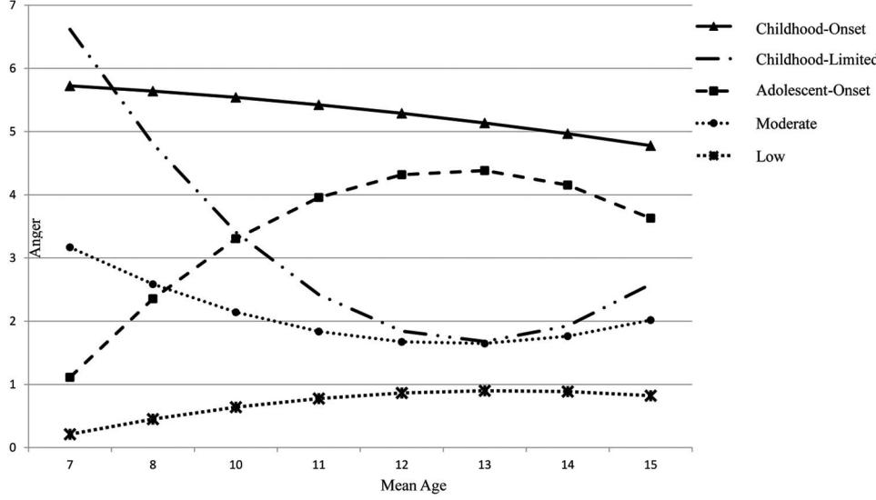
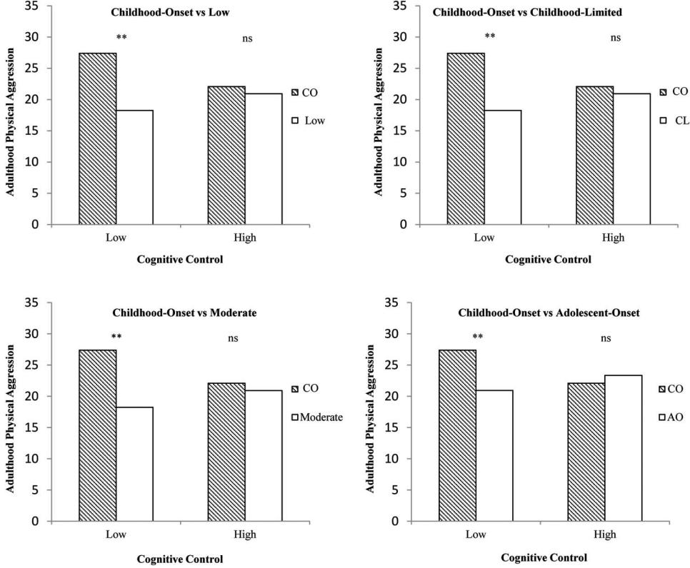
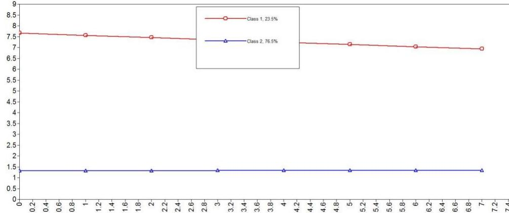
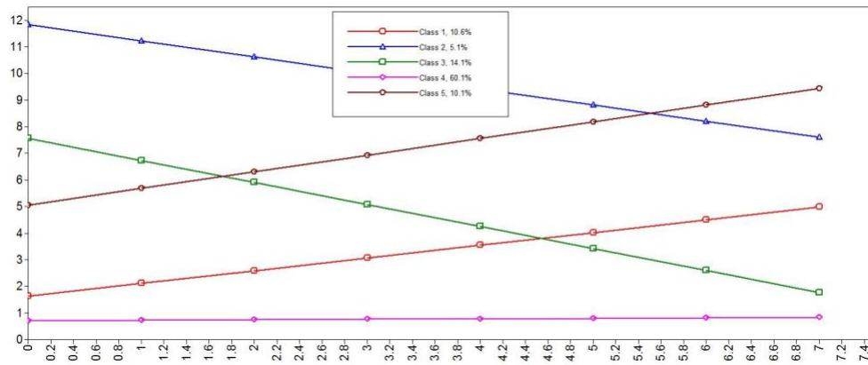

# Chronic Anger as a Precursor to Adult Antisocial Personality Features: The Moderating Influence of Cognitive Control

Samuel W. Hawes, Susan B. Perlman, and Amy L. Byrd

University of Pittsburgh

Adrian Raine University of Pennsylvania

# Rolf Loeber and Dustin A. Pardini University of Pittsburgh

Anger is among the earliest occurring symptoms of mental health, yet we know little about its developmental course. Further, no studies have examined whether youth with persistent anger are at an increased risk of exhibiting antisocial personality features in adulthood, or how cognitive control abilities may protect these individuals from developing such maladaptive outcomes. Trajectories of anger were delineated among 503 boys using annual assessments from childhood to middle adolescence (ages -7–14). Associations between these trajectories and features of antisocial personality in young adulthood (age -28) were examined, including whether cognitive control moderates this association. Five trajectories of anger were identified (i.e., childhood-onset, childhood-limited, adolescent-onset, moderate, and low). Boys in the childhood-onset group exhibited the highest adulthood antisocial personality features (e.g., psychopathy, aggression, criminal charges). However, boys in this group were buffered from these problems if they had higher levels of cognitive control during adolescence. Findings were consistent across measures from multiple informants, replicated across distinct time periods, and remained when controlling for general intelligence and prior antisocial behavior. This is the first study to document the considerable heterogeneity in the developmental course of anger from childhood to adolescence. As hypothesized, good cognitive control abilities protected youth with persistent anger problems from developing antisocial personality features in adulthood. Clinical implications and future directions are discussed.

#### *General Scientific Summary*

Findings from this study highlight important differences in the developmental course of anger from childhood to adolescence. Early manifestations of anger were associated with antisocial personality features assessed prospectively in adulthood. Notably, youth exhibiting a pattern of chronic anger beginning in childhood were at particularly high risk for displaying adult antisocial personality features, but only when coupled with poor cognitive control assessed during adolescence.

*Keywords:* anger, antisocial, cognitive control, development

*Supplemental materials:* http://dx.doi.org[/10.1037/abn0000129.supp](http://dx.doi.org/10.1037/abn0000129.supp)

Anger is a severe and prevalent form of emotion dysregulation wherein even minor provocations elicit responses that range from mild annoyance to rage [\(Spielberger, Reheiser, & Sydeman, 1995\)](#page-10-0).

Often arising in response to experiencing frustration, anger is one of the earliest emerging and most commonly occurring mental health symptoms [\(Hawkins & Cougle, 2011;](#page-9-0) [Watson, O'Hara, &](#page-10-1) [Stuart, 2008\)](#page-10-1). However, despite being one of the most frequently cited pathological emotions [\(Watson et al., 2008\)](#page-10-1), existing research into the development of anger is remarkably sparse [\(Leibenluft & Stoddard, 2013;](#page-9-1) [Stringaris & Goodman, 2009a\)](#page-10-2). Indeed, no study has characterized the developmental course of anger across childhood and adolescence. This is a considerable limitation, particularly as evidence suggests childhood-onset anger that follows a persistent and severe course may increase risk for developing antisocial personality features [\(Caprara, Paciello,](#page-9-2) [Gerbino, & Cugini, 2007;](#page-9-2) [Deater-Deckard, Petrill, & Thompson,](#page-9-3) [2007;](#page-9-3) [Leibenluft & Stoddard, 2013\)](#page-9-1), especially when coupled with poor top-down regulatory capabilities [\(Siever, 2008\)](#page-10-3). To address these limitations, the current study provides the first investigation into individual differences in developmental pathways of child and adolescent anger. Further, prospective associations with adult antisocial personality features are examined, while also considering

This article was published Online First November 30, 2015.

Samuel W. Hawes, Susan B. Perlman, and Amy L. Byrd, Department of Psychiatry, University of Pittsburgh; Adrian Raine, Department of Criminology, University of Pennsylvania; Rolf Loeber and Dustin A. Pardini, Department of Psychiatry, University of Pittsburgh.

Dustin A. Pardini is now at the School of Criminology and Criminal Justice, Arizona State University.

Grant support provided by the National Institute of Mental Health (MH51091-01A1, MH094467, MH48890, MH50778, MH078039-01A1), National Institute on Drug Abuse (DA411018), and the Office of Juvenile Justice and Delinquency Prevention (96-MU-FX-0012).

Correspondence concerning this article should be addressed to Samuel W. Hawes, Department of Psychiatry, University of Pittsburgh, Sterling Plaza, Suite 404, 201 North Craig Street, Pittsburgh, PA 15213. E-mail: [Samuel.hawes@upmc.edu](mailto:Samuel.hawes@upmc.edu)

the potential moderating influence of top-down cognitive control abilities.

Prior to continuing, a few considerations of terminology often used to describe the construct of anger, as well as its application in the current study are warranted. Although definitions in the literature are varied, most consider anger to be a negatively valenced, approach-oriented construct that emerges in response to negative emotional stimuli [\(Carver & Harmon-Jones, 2009\)](#page-9-4). As an affective phenomenon, it has been described as an emotion [\(Harmon-Jones,](#page-9-5) [2004\)](#page-9-5) and mood state [\(Rusting & Nolen-Hoeksema, 1998\)](#page-10-4), whereas at other times it has been more generally referred to as a temperamental or trait-like characterisitic [\(Wilkowski & Robin](#page-10-5)[son, 2007\)](#page-10-5). In addition, it is often used interchangeably with terms such as irritabilty and reactive aggression [\(Blair, 2012;](#page-8-0) [De Pauw &](#page-9-6) [Mervielde, 2010;](#page-9-6) [Drabick & Gadow, 2012;](#page-9-7) but see [\(Leibenluft &](#page-9-1) [Stoddard, 2013\)](#page-9-1). Importantly however, psychometric work has demonstrated that measures intended to assess each of these distinct concepts are strongly correlated and likely tap the same underyling construct [\(Martin, Watson, & Wan, 2000;](#page-9-8) [Wilkowski](#page-10-5) [& Robinson, 2007;](#page-10-5) [Wilkowski, Robinson, Gordon, & Troop-](#page-10-6)[Gordon, 2007\)](#page-10-6). Rather than focusing on more fine grained distinctions (though an unquestionably important area of investigation), it is this more general construct with which the current study is concerned. That said, it should be noted that anger assessed in the current study is construed as being an approach-oriented and negatively valenced construct that is more heavily focused on emotional, as opposed behavioral content (see Measures section).

# **Establishing Longitudinal Invariance**

Existing studies focused on continuity and change in anger are sparse, and we are aware of none that have considered fundamental measurement issues such as longitudinal invariance. To convincingly argue that individuals undergo change in some construct (e.g., anger) across development, a critical prerequisite for researchers is to first establish longitudinal measurement invariance. Indeed, this is a central issue across a number of scientific fields, as a lack of invariance can lead to spurious conclusions [\(Bors](#page-8-1)[boom, 2006;](#page-8-1) [Horn & McArdle, 1992\)](#page-9-9). In brief, longitudinal invariance requires that items on a given measure operate consistently across repeated assessments [\(Horn & McArdle, 1992\)](#page-9-9). In the absence of invariance, change over time in a construct may result from variations in item functioning, rather than "true" developmental change [\(Obradovic, Pardini, Long, & Loeber, 2007](#page-9-10) ´ ).

# **Emergence and Developmental Course of Anger**

We are aware of only two studies that have examined developmental trajectories of anger or related symptoms. A recent study by [Wiggins, Mitchell, Stringaris, and Leibenluft \(2014\)](#page-10-7) delineated trajectories of irritability, focusing on emotional (e.g., "stubborn, sullen or irritable," "sudden changes in mood or feelings"), rather than behavioral facets of the construct. Study findings demonstrated five distinct trajectories of irritability (low decreasing, moderate decreasing, high decreasing, high increasing, stable high) among children assessed at 3, 5, and 9 years of age. In the other study, [Caprara et al. \(2007\)](#page-9-2) examined irritability, defined by impulsive and aggressive reactivity to frustration, from adolescence into early adulthood (ages 12–20). This study provided evidence of four underlying irritability trajectories (low, moderate decreasing, moderate, and stable high).

Importantly, each of these studies were comprised of a small subgroup of individuals displaying childhood-onset symptoms of anger that remained persistently high across development. Accumulating evidence suggests a unique etiological pathway may account for the early emergence and continuity of anger inherent to this childhood-onset subgroup [\(Caprara et al., 2007\)](#page-9-2). More specifically, research indicates that this developmental trajectory is markedly driven by underlying neurobiological factors, compared to more transient pathways (e.g., adolescent-onset and childhoodlimited trajectories; [\(Caprara et al., 2007;](#page-9-2) [Wiggins et al., 2014\)](#page-10-7). Biological vulnerabilities such as genetically conferred risk and atypical neurocognitive development are considered to exert substantial influence, leading to a rather immutable and severe course of anger [\(Caprara et al., 2007;](#page-9-2) [Caspi, Roberts, & Shiner, 2005;](#page-9-11) [Siever, 2008;](#page-10-3) [Wilkowski & Robinson, 2007\)](#page-10-5).

In addition to a chronically high subgroup, each of these studies also provided evidence of a subset of individuals having initially high levels of anger that dissipated over time. Research suggests that early environmental factors (e.g., trauma, poor parenting) may play a pivotal role in the early emergence of anger among this subgroup [\(Caprara et al., 2007;](#page-9-2) [Veenstra, Lindenberg, Verhulst, &](#page-10-8) [Ormel, 2009;](#page-10-8) [Wiggins et al., 2014\)](#page-10-7). In contrast to anger that remains persistently high, symptoms among this pathway remit as individual's self-regulatory and cognitive control capacities undergo more normative improvement [\(Caprara et al., 2007;](#page-9-2) [Wiggins](#page-10-7) [et al., 2014\)](#page-10-7). Finally, the principal difference between these two previous studies is the finding of an increasing trajectory among the childhood sample, but not the adolescence to adulthood study. It is perhaps likely that the early increases seen in the childhood sample eventually level-off or even subside into more consistently moderate or even low-level symptoms during later development. In these cases, some individuals may maintain persistently high levels of anger, whereas others come to demonstrate a pattern more in-line with adolescent-limited types of conceptualizations [\(Moffitt, 1993\)](#page-9-12).

Although these studies have provided important insights, research into the developmental course of anger that spans across childhood and adolescence remains markedly absent. Indeed, the need for research to address this limitation was highlighted by [Wiggins et al. \(2014\).](#page-10-7) These authors noted that the increased emergence of psychopathology during this transitional period makes such research essential for identifying individuals most in need of treatment and intervention services.

# **Antisocial Outcomes and the Influence of Cognitive Control**

Anger is a central feature and key *DSM* criterion of antisocial personality disorder. Yet, little is known about how the presence of anger during early development may predict adult antisocial personality features. Some research indicates that although anger is associated with antisocial features during earlier periods of development, this relationship may diminish by adulthood [\(Stringaris, Cohen, Pine,](#page-10-9) [& Leibenluft, 2009\)](#page-10-9). In contrast, other evidence suggests that individuals who experience an early onset and chronic pattern of anger may be at a particularly high risk for demonstrating adult antisocial features [\(Boylan, Vaillancourt, & Szatmari, 2012;](#page-8-2) [Broidy et al., 2003;](#page-8-3) [Caprara et al., 2007;](#page-9-2) [Leibenluft & Stoddard, 2013\)](#page-9-1). This parallels a substantial body of research showing that mental health problems that follow a childhood-onset and persistent course lead to heightened risk for a range of deleterious outcomes [\(Kessler et al., 2007;](#page-9-13) [Kessler &](#page-9-14) [Wang, 2008;](#page-9-14) [Kim-Cohen et al., 2003;](#page-9-15) [Post et al., 2010\)](#page-10-10). To date, however, there has been no direct investigation into the relationship between the early developmental course of anger and subsequent features of adult antisocial personality.

Although childhood-onset anger that persists across development may enhance risk for later antisocial features, not all individuals following this trajectory will experience this outcome. Delineating factors that may moderate the link between early anger and subsequent psychopathology has been pointed to as a critical next step for investigators [\(Leibenluft & Stoddard, 2013\)](#page-9-1). To this extent, evidence suggests that individuals experiencing chronically high anger may confer even greater risk of displaying subsequent antisocial features if they also demonstrate poor cognitive control capabilties [\(Caprara et al., 2007;](#page-9-2) [Zelazo & Cunningham, 2007\)](#page-10-11).

Cognitive control processes (e.g., response suppression, attentional-set switching, reversal learning) allow for voluntary planned behavior across differing contexts and to varying goals [\(Luna, Padmanabhan, & O'Hearn, 2010\)](#page-9-16). According to "double-hit" conceptualizations, deficits in cognitive control may further limit an individual's ability to manage their anger and adapt their behavior in response to frustrating events, serving to amplify their engagement in antisocial behaviors [\(Caprara et al., 2007;](#page-9-2) [Siever, 2008\)](#page-10-3). Importantly, cognitive control has been shown to be widely available by the time individuals reach adolescence (though with continual refinement and specialization into early adulthood; [Luna et al., 2010;](#page-9-16) [Paniak, Miller,](#page-10-12) [Murphy, & Patterson, 1996;](#page-10-12) [Paulsen, Hallquist, Geier, & Luna, 2015;](#page-10-13) [Rosselli & Ardila, 1993\)](#page-10-14). Thus, among persons demonstrating chronic anger problems, those who also exhibit poor cognitive control during adolescence (when such functions are largely available at near adult levels), may be at an increased risk for demonstrating a severe pattern of antisocial behaviors into adulthood.

# **Current Study**

The current study investigated (a) developmental pathways of anger among boys (*n* 503) from childhood to adolescence (ages -7–14); (b) the association between these pathways and adult antisocial personality features; and (c) the moderating influence of cognitive control. It was hypothesized that a relatively small group of youth would exhibit a childhood-onset course of anger that remained high across development. Individuals exhibiting this pattern of anger were hypothesized to be at particularly increased risk for adult antisocial outcomes if they did not demonstrate adequate levels of cognitive control in adolescence.

# **Method**

# **Participants and Procedures**

.88), at which time cognitive control abilities were assessed. Antisocial personality outcome data was collected during adulthood follow-up assessments (*M* 28.54, *SD* 2.58), and was available for 88% (*n* 289) of participants (see Missing Data section). All procedures were reviewed and approved by the Institutional Review Board at the University of Pittsburgh. Written informed consent was obtained from parents and/or youth prior to each assessment. (Further details regarding the study sample can be found in Supplement 1 and [Loeber, Farrington, Stouthamer-](#page-9-17)[Loeber, and Van Kammen, 1998.\)](#page-9-17)

# **Measures**

Descriptive information for studies measures is provided in Supplemental Table S1.

**Anger.** An extended version of the Teacher Report Form (TRF; [Achenbach & Edelbrock, 1986\)](#page-8-4) was used to assess anger. Four items from this measure were used to index participants' tendency to experience anger and have difficulties managing their emotional reactivity (e.g., "easily frustrated," "stubborn, sullen or irritable," "temper tantrums," "sudden changes in mood or feelings"). Past research using these items to assess anger provides evidence in support of construct validity [\(Kim, Mullineaux, Allen,](#page-9-18) [& Deater-Deckard, 2010;](#page-9-18) [Stringaris, Maughan, Copeland,](#page-10-15) [Costello, & Angold, 2013;](#page-10-15) [Stringaris & Goodman, 2009a,](#page-10-2) [2009b\)](#page-10-16). Items were rated on a 3-point scale ranging from 0 (*not true*) to 2 (*very true*), with the items being summed to create a total anger score. The internal consistency of this measure was high across each of the eight follow-up assessments in the current study (s range .82–.90).1

Prior research suggests that using teacher reported ratings of these items may provide several benefits [\(Kim et al., 2010\)](#page-9-18). Specifically, when measured over time, it provides a characterization of children's typical pattern of behavior using multiple changing informants, eliminating any informant-specific response biases.2 This is particularly important as the use of a single informant can result in shared method variance and lead to inflated associations between aspects of temperament and prospective outcomes in developmentally focused research [\(Sanson, Hemphill, & Smart,](#page-10-17) [2004\)](#page-10-17). Second, the school environment is a setting where youth face situations that often elicit frustration and anger, including dealing with peer provocation, authority figures, and increasing academic demands. Teacher informants provide valuable insight into the developmental course of anger while taking into account this important context-specific information [\(Kim et al., 2010;](#page-9-18) [Mangelsdorf, Schoppe, & Buur, 2000\)](#page-9-19).

**Cognitive control.** Cognitive control was assessed using a computerized version of the Wisconsin Card Sorting Test (WCST; [Heaton, Chelune, Talley, Kay, & Curtis, 1993\)](#page-9-20). This task has been used extensively to measure aspects of executive functioning in both clinical practice and research [\(Lezak, Howieson, Loring,](#page-9-21) [Hannay, & Fischer, 2004\)](#page-9-21). During the task, participants sort 64

Participants were 503 boys (40.6% Caucasian; 55.7% African American) from the youngest cohort of the longstanding Pittsburgh Youth Study. The current study delineated trajectories of anger across eight annual assessments from childhood (*M* 6.90, *SD* .55) to middle adolescence (*M* 14.01, *SD* .55). Of the 503 boys included in the trajectory analyses, 330 took part in a neurobiological substudy during adolescence (*M* 16.15, *SD*

1 See Supplemental Analyses at the end of the Results section for a more thorough evaluation of the psychometric properties of the anger construct

used in this study. 2 It should be noted that teacher assessment was completed by the participant's current teacher on a yearly basis. Thus, anger was assessed across multiple informants (generally eight different teacher informants) during childhood and adolescence, for each participant.

cards according to changing matching rules (i.e., color, shape, or number). Participants must learn the matching rule by trial and error as the computer provides feedback about the correctness of their responses. After 10 consecutive correct responses, the sorting rule changes without the participant's knowledge, which then requires the participant to identify the new sorting rule. Number of perseverative errors was the outcome of interest, as perseverative responding has been linked to frontal lobe dysfunction and is considered to tap into multiple facets of cognitive control abilities (e.g., response supression, reversal learning, set shifting; [Heaton et](#page-9-20) [al., 1993;](#page-9-20) [Lezak et al., 2004\)](#page-9-21).

# **Adult Outcomes (Age 28)**

**Anger and physical aggression.** The Anger and Physical Aggression subscales from the Buss–Perry Aggression Questionnaire (BPAQ; [Buss & Perry, 1992\)](#page-8-5) were used to assess these features in adulthood. Items on this measure are rated on a 5-point scale from 1 (*never or hardly applies to me*) to 5 (*very often applies to me*). The seven-item Anger subscale of the BPAQ was used as an index of adult anger as it contained items similar in content to those found in the teacher-report measure administered in the current study (e.g., "When frustrated, I let my irritation show"; "I have trouble controlling my temper"). In contrast, the Physical Aggression subscale consists of nine items that are associated with harming others and destroying objects when angry or provoked (e.g., "Given enough provocation, I may hit another person"; "I have become so mad that I have broken things"). Severe aggression is a feature of antisocial and psychopathic personality disorder (i.e., poor behavioral control, criminal versatility) in adulthood. The internal consistencies for the Anger ( .79) and Physical Aggression ( .77) subscales were acceptable.

**Psychopathic personality.** Psychopathic personality features were assessed using the short-form of Self-Report Psychopathy scale [\(Paulhus, Neumann, & Hare, in press\)](#page-10-18). This scale consists of 28 items assessing participants' general tendency to be callous/ unemotional, deceitful/manipulative, impulsive/irresponsible, and engage in an antisocial lifestyle (e.g., "I never feel guilty over hurting others"; "I've often done something dangerous just for the thrill of it"). Each item is rated on a 5-point scale ranging from 1 (*disagree strongly*) to 5 (*agree strongly*), with items being summed to create a total psychopathy score. This measure has been shown to exhibit convergent validity, as well as predict future criminal offending in young adult males [\(Neumann & Pardini, 2014\)](#page-9-22). The internal consistency of total score was high in the current study ( .92). Additional analyses examining associations with SRP facet level data are provided in the online supplementary tables.

**Antisocial personality disorder.** Symptoms of antisocial personality disorder were assessed using the Computerized Diagnostic Interview Schedule, fourth edition (CDIS-IV; [Helzer & Robins,](#page-9-23) [1988\)](#page-9-23). The CDIS-IV is a structured interview that uses a series of standardized probes and follow-up questions to gather information about *DSM–IV* disorder symptoms participants. It has demonstrated evidence of reliability and construct validity in previous investigations (for a review, see [Malgady, Rogler, & Tryon, 1992\)](#page-9-24). As part of the CDIS-IV, participants self-reported on adult symptoms of ASPD (e.g., deceitfulness, lack of remorse, anger, and aggressiveness). A negative binomial model was used in analyses using this outcome due to the count nature of this variable. Estimates are provided as predicted mean counts.

**Adult criminal charges.** Official criminal records were used to assess total number of adulthood (i.e., after age 18) criminal charges (besides minor traffic offenses). Records were gathered from the Pennsylvania State Police and the Federal Bureau of Investigation for charges that occurred out of Pennsylvania. These records reflect charges until February, 2012, at which time participants were an average of 31 years old.

#### **Control Variables (Age** -**16)**

Several variables collected at the time of the cognitive control follow-up assessment (-16 years of age) were used as control variables in the current study.

**Demographics.** Participants completed questionnaires that provided information regarding their age and race/ethnicity.

**IQ.** Full-scale IQ was estimated using the Vocabulary, Information, Block Design, and Picture Completion subtests of the Wechsler Intelligence Scale for Children [\(Wechsler, 1991\)](#page-10-19). It is a widely used measure of general intelligence for children aged 6 –16.

**Aggressive behavior.** The Reactive–Proactive Aggression Questionnaire [\(Raine et al., 2006\)](#page-10-20) subscales were used to assess early aggression. This self-report instrument consists of 12 items indexing proactive aggression and 11 items measuring reactive aggression. Each item is scored based on frequency of occurrence, using a 3-point scale ranging from 0 (*never*) to 2 (*often*). The internal consistencies for the reactive ( .84) and proactive ( .85) aggression scales were high.

**Early psychopathic features.** Early features of psychopathy were assessed using the 41-item parent report Childhood Psychopathy Scale (CPS; [Lynam, 1997\)](#page-9-25)). The 41-item CPS was originally developed to identify Psychopathy Checklist-Revised (PCL–R; [Hare, 2003\)](#page-9-26) personality characteristics during childhood and adolescence. The CPS includes 2- to 4-item scales used to operationalize 12 of the 20 PCL-R items. Three items on the CPS scale ("easily frustrated," "temper tantrums," "sudden changes in mood or feelings") were removed due to their overlap with items used to assess anger. There were no differences in study results dependent on the inclusion or exclusion of these items from the CPS. The internal consistency for the total CPS score was high ( .91).

**Prior charges.** Official records of charges concurrent with and prior to the cognitive control assessment were collected. All juvenile records were collected from the Allegheny County Juvenile Court's and the Pennsylvania Juvenile Court Judges' Commission.

# **Data Analytic Plan**

Initial analyses were conducted to assess the longitudinal measurement invariance of the anger construct across the study period. This included assessing factor structure of the anger measure separately at each measurement period. Next thresholds and loadings of the same item was constrained to equality across each different assessment point. This model was then compared to a model wherein thresholds and loadings for each item were free to vary across time [\(Horn & McArdle, 1992\)](#page-9-9). The relative fit between these competing nested models was examined via a corrected chi-square difference test for weighted least squares estimation using the DIFFTEST procedure in Mplus 7 [\(Muthén & Muthén,](#page-9-27) [1998 –2012\)](#page-9-27). However, as the chi-square difference test has been shown to be sensitive to sample size and violations of normality [\(Brannick, 1995\)](#page-8-6), a second method for comparing nested models based on absolute fit indices in invariance testing was implemented. Specifically, changes in comparative fit index (CFI) equal to or less than .01, and changes in root mean square error of approximation (RMSEA) of equal to or less than .015, have been proposed as demonstrating evidence metric invariance [\(Cheung &](#page-9-28) [Rensvold, 2002\)](#page-9-28). (For a more thorough review of the steps conducted as part of this procedure, see [\(Hawes, Mulvey, Schubert, &](#page-9-29) [Pardini, 2014.](#page-9-29))

Latent class growth analysis (LCGA) was used to identify trajectories of anger from childhood to adolescence using Mplus 7.0 software. LCGA is a person-centered method that identifies latent subgroups of individuals who follow similar developmental trajectories [\(Jung & Wickrama, 2008\)](#page-9-30). Models were specified using maximum likelihood estimation with standard errors and a chi-square statistic that is robust to nonnormality, which allows for missing data under the assumption it is missing at random. The best class solution was chosen based on classification accuracy [\(Muthen, 2004\)](#page-9-31), Bayesian information criterion [\(Schwarz, 1978\)](#page-10-21), the bootstrapped likelihood ratio test [\(Feng & McCulloch, 1996\)](#page-9-32) interpretability, and parsimony. Individuals were assigned to their most likely class using their posterior probability of group membership.

Subsequent to the LCGA analyses, main effects and interactions between anger trajectory groups and cognitive control scores predicting each adulthood outcome were examined using the generalized linear model function in SPSS version 20. In line with study hypotheses, the primary analyses focused on contrasting the childhood-onset group with each of the additional trajectory groups. Significant interactions were probed by inspecting adulthood outcome scores among the anger subgroups at low (1 *SD*), moderate (mean), and high levels (1 *SD*) of cognitive control. In accordance with current best practices [\(Simmons, Nelson, & Si](#page-10-22)[monsohn, 2011\)](#page-10-22), results are presented with covariates included and excluded from all analyses. Study control variables are discussed further in the Measures section above.

# **Missing data**

Of the 503 individuals in the overall sample, 330 were included in the cognitive control follow-up study (at age -16). No significant differences were found in the composition of anger trajectory groups when including the full sample (*n* 503) compared to when using only indivdiuals in the substudy (*n* 330; see results section). Among the 330 individuals included in the follow-up substudy, 289 had adulthood outcome data available (at age -28). No differences on any demographic or control variables were found between those individuals included in the substudy who had available outcome data (*n* 289) and those participants included in the substudy, but missing data for the outcome assessment (*n* 41). Among all individuals having available outcome data, there were no differences on any adulthood outcomes between individuals included in the substudy (*n* 289) or those from the original overall sample who were not included in the substudy (*n* 110). When predicting adulthood outcomes, only the 289 substudy participants with complete data were included. No differences on anger scores at any assessment wave or for any demographic variable were found between those individuals included in the substudy who had available outcome data (*n* 289) compared to all other participants from the original sample (*n* 214).

# **Results**

To investigate longitudinal invariance of the anger construct across the study period, a baseline configural model was initially specified. This model consisted of the unidimensional anger construct being fit at each assessment wave, and item loadings and thresholds allowed to vary across time. The baseline model provided a good fit to the data (2 538.98, *df* 436, *p* .001; CFI .994, Tucker-Lewis index [TLI] .994, RMSEA .022). Next, a more parsimonious metric invariance model was specified that constrained loadings and thresholds of identical items to remain equivalent across all assessment waves. As with the configural model, the metric invariance model revealed excellent fit (2 589.67, *df* 478, *p* .001; CFI .994, TLI .994, RMSEA .022).

There were no differences in the absolute fit indices of these two models, although the chi-square difference test did produce a marginially significant difference (2 59.04, *df* 42, *p* .042). However, as previously discussed in the Method section, the chi-square difference test has been shown to be overly sensitive to model rejection [\(Brannick, 1995;](#page-8-6) [Cheung & Rensvold, 2002\)](#page-9-28). Therefore, in conjunction with the lack of any substantive change noted among absolute fit indices of the configural and metric invariance models, these results were considered to support longitudinal invariance of the the anger construct.

# **Latent Class Growth Analysis**

Results from the unconditional growth model revealed the inclusion of a quadratic slope factor improved upon the linear model (Satorra-Bentler: 2 (4) 30.43) and resulted in good overall fit, 2 (27) 38.88, *p* .064; CFI .983; RMSEA .030. A 5-class LCGA solution emerged as optimal based on model fit indices and entropy values (see Table S2), while also producing theoretically meaningful groups (see [Figure 1;](#page-5-0) childhood-onset (*n* 38; 7.2%), childhood-limited (*n* 28; 5.5%), adolescent-onset (*n* 96; 19.1%), moderate (*n* 54; 10.7%), low (*n* 286; 56.9%). As an extra precaution, trajectory groups were also modeled using only the 330 individuals included in the cognitive control follow-up. Results from these analyses were nearly identical: childhood-onset (*n* 26; 7.9%), childhood-limited (*n* 21; 6.4%), adolescentonset (*n* 61; 18.5%), moderate (*n* 29; 8.8%), and low (*n* 193; 58.5%).

# **Anger Trajectories and Cognitive Control Predicting Adult Outcomes**

Main effects and interactions of anger dysregulation trajectory group and cognitive control as predictors of adult antisocial personality outcomes are presented in [Table 1.](#page-6-0) There was no main effect of cognitive control predicting any outcome. In contrast, anger trajectory group predicted adulthood physical aggression, anger, and total criminal charges, but not adult psychopathic or

*Figure 1.* Trajectories of anger across childhood and middle adolescence.

antisocial personality. The mean score on each of the adulthood outcomes for each anger trajectory group is provided in Supplemental Table S3.

There was a significant interaction between anger trajectory groups and cognitive control for each adulthood outcome (see [Table 1\)](#page-6-0).3 Interactions between the childhood-onset group and each of the additional trajectory groups were probed separately. Findings demonstrated that at low levels of cognitive control, boys in the childhood-onset group were consistently higher on each antisocial outcome compared to the low, childhood-limited, moderate, and adolescent-onset groups. The magnitude of these effects generally ranged from moderate to large (Cohen's *d* range .17 to 1.32; average Cohen's *d* .76). However, at high levels of cognitive control no differences were found between the childhood-onset group and any other anger trajectory group on any adulthood outcomes (see [Table 2;](#page-6-1) [Figure 2\)](#page-7-0).4 Participant's demographic (i.e., age, ethnicity, IQ) and early antisocial factors (i.e., aggression, psychopathy, offending) were controlled for in each of these analyses. However, in line with current best practices [\(Sim](#page-10-22)[mons et al., 2011\)](#page-10-22), results are also presented with these controls excluded from the analyses (see Supplemental Tables S5 and S6). Study findings remained unchanged after excluding study covariates.

# **Supporting Analyses Examining IQ and Adolescent Antisocial Features**

As an additional check, all analyses were rerun using IQ scores in place of cognitive control to determine whether study findings were not better accounted for by more general differences in intelligence. These analyses revealed no significant main or interaction effects of IQ predicting any adult outcome (results available upon request). Further, we also examined if similar main effect and interaction results were found when using trajectory group membership and cognitive control to predict antisocial features in adolescence. These analyses were conducted by treating control variables from our primary analyses (i.e., reactive/proactive aggression, early psychopathic features, prior criminal charges) as outcome variables (still controlling for participant demographics of age, ethnicity, and IQ as done in all primary study analyses. Findings were largely consistent with those found with adult outcomes (see Supplemental Tables S7 and S8). That is, individuals exhibiting childhood-onset anger also displayed more antisocial features during adolescence than any other trajectory groups at low, but only at low levels of cognitive control.

# **Supplemental Analyses: Further Evaluation of the Anger Construct**

To examine the psychometric properties of the anger measure and ensure that the this construct was distinct from other potentially related constructs (conduct problems, interpersonal callousness, hyperactivity/impulsivity, and anxiety), a series of confirmatory factor analytic models were conducted using Mplus 7.0 [\(Muthén & Muthén, 1998 –2012\)](#page-9-27). The conduct problem, hyperactivity/impulsivity, and anxiety scales each consisted of five items and have been rated by clinicians as being very consistent with symptoms of the corresponding scales [\(Achenbach, Dumenci, &](#page-8-7) [Rescorla, 2003\)](#page-8-7). The 8-item interpersonal callousness scale as-

3 In addition to the primary study outcomes, we also examined interactions between the anger trajectory groups and cognitive control with the SRP psychopathy measure at the facet level (i.e., callous, interpersonal, erratic lifestyle, antisocial). This data is reported as part of the online

supplementary information (Supplemental Table S4). 4 Although the current study focused on comparisons with the childhood-onset chronic group, we also compared each of the other four trajectory groups with each other separately (i.e., six combinations) at the three levels of cognitive control (low, moderate, high), for all five outcomes. This resulted in a total of 90 comparisons (6 3 5), across which only three marginally significant differences (.01 *p*s .05) were found. Results available upon request.

| 7 | 0 |
|---|---|

Table 1

|                                       | Physical aggression |    | Anger   |       | Psychopathy |         | ASPD  |    | Charges |       |    |         |       |    |         |
|---------------------------------------|---------------------|----|---------|-------|-------------|---------|-------|----|---------|-------|----|---------|-------|----|---------|
|                                       | 2                   | df | p value | 2     | df          | p value | 2     | df | p value | 2     | df | p value | 2     | df | p value |
| Step 1                                |                     |    |         |       |             |         |       |    |         |       |    |         |       |    |         |
| Trajectory group                      | 14.64               | 4  | .005    | 15.46 | 4           | .004    | 1.36  | 4  | .85     | 2.45  | 4  | .65     | 10.66 | 4  | .03     |
| Cognitive control                     | .16                 | 1  | .69     | .20   | 1           | .65     | .01   | 1  | .93     | 1.08  | 1  | .29     | .11   | 1  | .73     |
| Step 2                                |                     |    |         |       |             |         |       |    |         |       |    |         |       |    |         |
| Trajectory Group Cognitive Control | 14.21               | 4  | .007    | 9.32  | 4           | .05     | 26.59 | 4  | .001    | 20.86 | 4  | .001    | 19.57 | 4  | .001    |

*Main Effects and Interactions of Anger Trajectory Group and Cognitive Control on Adult Antisocial Features*

*Note.* Above analyses control for participant demographics (age, ethnicity, IQ) and early antisocial features (reactive/proactive aggression, psychopathy, offending) as described in the Method and Results sections. ASPD antisocial personality disorder.

sesses aspects of the interpersonal and affective features of adult psychopathy in youth [\(Pardini, Obradovic, & Loeber, 2006\)](#page-10-23). Model fit was assessed using the CFI, TLI, and RMSEA.

The model fit of the anger construct at each of the 8 assessment waves in the current study ranged from acceptable to excellent (CFIs .99 –1.00; TLIs .99 –1.00; RMSEAs .03–.09). Data collected during participant's screening phase was used to examine a series of CFA models that included the anger construct, as well as the conduct problems, interpersonal callousness, hyperactivity/impulsivity, and anxiety constructs. When all items were examined together, results indicated that a five-factor model consisting of separate anger, conduct problems, interpersonal callousness, hyperactivity/impulsivity, and anxiety constructs provided the best fit to the data (CFI .97; TLI .96; RMSEA .04). All items exhibited significant loadings on their respective factors (*p*s .001). Explorations of alternative configurations with items across constructs, loading onto single factors (e.g., anger and hyperactivity-impulsivity; anger and conduct problems) significantly degraded model fit. The estimated variance inflation factor for each predictor was -2.7, indicating that model parameters were not substantially biased by multicollinearity.

Several additional analyses were conducted to evaluate the degree of potential overlap between the anger construct and conduct problems. At each assessment wave, a two-factor model with these items specified to load onto distinct, yet

Table 2

*Anger Trajectory Group Scores on Adulthood Outcomes at High, Moderate, and Low Levels of Cognitive Control*

|                       | Low (1 SD cognitive control) |                                       |              | Moderate (mean cognitive control) |                            |                                       |              | High (1 SD cognitive control) |                            |                                       |              |            |
|-----------------------|------------------------------|---------------------------------------|--------------|-----------------------------------|----------------------------|---------------------------------------|--------------|-------------------------------|----------------------------|---------------------------------------|--------------|------------|
|                       | CO trajectory mean (SE)   | Comparison trajectory mean (SE) | Mean diff | p value                        | CO trajectory mean (SE) | Comparison trajectory mean (SE) | Mean diff | p value                    | CO trajectory mean (SE) | comparison trajectory mean (SE) | Mean diff | p value |
| Physical aggression   |                              |                                       |              |                                   |                            |                                       |              |                               |                            |                                       |              |            |
| CO vs. Low            | 27.40 (1.83)                 | 20.98 (.66)                           | 6.41         | .001                              | 24.82 (1.10)               | 20.81 (.45)                           | 4.01         | .001                          | 22.09 (1.25)               | 20.62 (.61)                           | 1.46         | .30        |
| CO vs. CL             |                              | 20.06 (1.48)                          | 7.34         | .002                              |                            | 21.98 (1.94)                          | 2.84         | .20                           |                            | 24.01 (2.97) 1.92                     |              | .55        |
| CO vs. Moderate       |                              | 18.25 (1.00)                          |              | 9.15 .001                         |                            | 19.54 (1.26)                          | 5.27         | .001                          |                            | 20.92 (1.69)                          | 1.17         | .57        |
| CO vs. AO             |                              | 20.95 (.85)                           | 6.45         | .001                              |                            | 22.12 (.80)                           | 2.70         | .04                           |                            | 23.35 (1.26) 1.26                     |              | .47        |
| Anger                 |                              |                                       |              |                                   |                            |                                       |              |                               |                            |                                       |              |            |
| CO vs. Low            | 19.04 (1.36)                 | 13.55 (.59)                           |              | 5.49 .001                         | 16.72 (1.19)               | 13.44 (.40)                           | 3.27         | .01                           | 14.25 (1.54)               | 13.33 (.54)                           | .92          | .57        |
| CO vs. CL             |                              | 11.67 (.74)                           |              | 7.36 .001                         |                            | 12.02 (1.12)                          | 4.69         | .004                          |                            | 12.39 (2.08)                          | 1.86         | .47        |
| CO vs. Moderate       |                              | 11.92 (.71)                           |              | 7.11 .001                         |                            | 12.21 (.89)                           | 4.50         | .002                          |                            | 12.51 (1.23)                          | 1.74         | .36        |
| CO vs. AO             |                              | 14.11 (.88)                           | 4.93         | .002                              |                            | 14.72 (.80)                           | 1.99         | .16                           |                            | 15.37 (1.23) 1.11                     |              | .57        |
| Psychopathic features |                              |                                       |              |                                   |                            |                                       |              |                               |                            |                                       |              |            |
| CO vs. Low            | 70.54 (4.22)                 | 59.14 (1.92) 11.39                    |              | .01                               | 61.54 (3.43)               | 57.88 (1.09)                          | 3.66         | .31                           | 52.01 (4.34)               | 56.54 (1.50) 4.53                     |              | .32        |
| CO vs. CL             |                              | 55.07 (5.02) 15.46                    |              | .01                               |                            | 59.56 (4.74)                          | 1.98         | .73                           |                            | 64.31 (8.02) 12.30                    |              | .17        |
| CO vs. Moderate       |                              | 54.90 (2.05) 15.63                    |              | .001                              |                            | 58.07 (2.43)                          | 3.47         | .40                           |                            | 61.42 (3.15) 9.41                     |              | .08        |
| CO vs. AO             |                              | 54.11 (2.54) 16.43                    |              | .001                              |                            | 58.37 (2.06)                          | 3.16         | .41                           |                            | 62.90 (3.44) 10.89                    |              | .05        |
| ASPD                  |                              |                                       |              |                                   |                            |                                       |              |                               |                            |                                       |              |            |
| CO vs. Low            | 2.85 (.45)                   | 2.27 (.26)                            | .57          | .26                               | 2.48 (.28)                 | 2.14 (.15)                            | .34          | .28                           | 2.14 (.32)                 | 2.01 (.21)                            | .13          | .73        |
| CO vs. CL             |                              | .96 (.38)                             | 1.89         | .001                              |                            | 1.86 (.51)                            | .62          | .27                           |                            | 3.73 (1.87) 1.58                      |              | .40        |
| CO vs. Moderate       |                              | 1.37 (.31)                            | 1.48         | .006                              |                            | 2.45 (.38)                            | .03          | .93                           |                            | 4.53 (1.13) 2.38                      |              | .04        |
| CO vs. AO             |                              | 1.70 (.29)                            | 1.15         | .03                               |                            | 2.48 (.24)                            | .29          | .39                           |                            | 2.87 (.43)                            | .72          | .15        |
| Total charges         |                              |                                       |              |                                   |                            |                                       |              |                               |                            |                                       |              |            |
| CO vs. Low            | 16.12 (3.24)                 | 8.06 (1.38)                           | 8.05         | .02                               | 13.25 (2.44)               | 8.04 (.86)                            | 5.20         | .04                           | 10.21 (3.29)               | 8.02 (1.24)                           | 2.18         | .54        |
| CO vs. CL             |                              | 6.46 (3.43)                           | 9.65         | .04                               |                            | 6.40 (2.94)                           | 6.84         | .07                           |                            | 6.35 (5.09)                           | 3.86         | .52        |
| CO vs. Moderate       |                              | 7.02 (2.31)                           | 9.09         | .02                               |                            | 9.92 (2.33)                           | 3.32         | .32                           |                            | 13.00 (3.31) 2.78                     |              | .55        |
| CO vs. AO             |                              | 13.08 (2.35)                          | 3.03         | .44                               |                            | 13.11 (2.44)                          | .14          | .96                           |                            | 13.14 (2.27) 2.92                     |              | .46        |

*Note.* CO childhood-onset; CL childhood-limited; AO adolescent-onset; Mean diff Mean difference based on pairwise comparison least significant difference (LSD). Above analyses control for participant demographics (age, ethnicity, IQ) and early antisocial features (reactive/proactive aggression, psychopathy, offending) as described in the Method and Results sections. ASPD antisocial personality disorder.

*Figure 2.* Graph of the association between cognitive control and adulthood outcomes by anger trajectory group. -*p* .01. ns *p* .05.

correlated anger and conduct problem constructs was an improvement over a model having these items load onto a single factor as indicated by increases in CFI, decreases in RMSEA, and significant chi-square difference tests (see Supplemental Table S9). Correlations between these conduct problems and anger across each assessment wave ranged from *r*s .71–.77, indicating approximately 50% shared variance among these constructs (see Supplemental Table S10). Finally, analyses were conducted to provide comparisons with similarly specified trajectories of conduct problems. A two-class trajectory appeared to provide the best solution for the Conduct Problem construct (see Supplemental Table S11 and Supplemental Figure S1). However, we also present results from a five-class model since this number of trajectory groups emerged as the best solution for Anger (Supplemental Figure S2). Analyses indicated that there were no significant interactions between conduct problem trajectory groups (using either the two-class of five-class solution) and cognitive control when predicting the adult antisocial outcomes (see Supplemental Table S12). In addition, when the models involving anger were rerun controlling for conduct problem trajectory group membership, four of the five reported interactions remained significant (see Supplemental Table S13). The only exception was the interaction involving official criminal charges in adulthood (*p* .12), although probing of the interaction revealed the same general trend observed for the other adulthood outcomes. Further details regarding these analyses are available upon request.

# **Discussion**

This is the first study to characterize the considerable developmental heterogeneity in boys' levels of anger from childhood to middle adolescence. It also represents the first study to examine how early manifestations of anger are associated with antisocial personality features in adulthood. Consistent with hypotheses, boys who displayed a childhood-onset pattern of anger were at highest risk for exhibiting features of antisocial personality in adulthood (e.g., psychopathic traits, physical aggression, persistent criminal offending), but only if they exhibited poor cognitive control as adolescents.

# **Stability and Change in Dysregulated Anger Across Development**

Establishing invariance is exceedingly important, particularly for longitudinal studies, as measures that operate inconsistently across time can lead to distorted and inaccurate conclusions. In the current study, evidence of longitudinal invariance provides added confidence in the study measure and results delineating the developmental course of anger. Although anger is often conceptualized as a stable temperamental trait, current findings indicate that youth who display difficulties regulating their anger are a heterogeneous group. Specifically, nearly half of boys with high levels of anger in early elementary school no longer displayed these problems by middle adolescence. In contrast, approximately 20% of boys exhibited features of anger as they transitioned into the teenage years. Importantly youth in this adolescent-onset group were not at increased risk for exhibiting high levels of anger reactivity in adulthood, unlike boys who exhibited problems with anger from childhood into adolescence. Research suggests that atypical neurobiological development may be particularly influential in the development of this rather incalcitrant etiological pathway of childhood-onset anger [\(Caprara et al., 2007;](#page-9-2) [Siever, 2008;](#page-10-3) [Wilkowski & Robinson, 2007\)](#page-10-5).

# **Chronic Dysregulated Anger, Cognitive Control, and Antisocial Personality Features**

Findings consistently indicated that youth exhibiting childhoodonset anger were at increased risk of displaying features of antisocial personality in adulthood if they exhibited poor cognitive control in middle adolescence. Cognitive control impacts an individual's ability to regulate emotions and alter behavioral responses [\(Zelazo & Cunningham, 2007\)](#page-10-11), and often begins to reach adultlike levels during adolescence [\(Paulsen et al., 2015\)](#page-10-13). Thus, poor cognitive control and regulatory abilities in middle adolescence (when these functions are available at near adulthood levels) may act as a marker of the relationship between a chronic developmental course of anger and future antisocial behaviors. These findings are in line with other research suggesting that increased anger coupled with poor cognitive control can lead to explosive aggression and antisocial behaviors (e.g., [Blair, 2012;](#page-8-0) [Caprara et al.,](#page-9-2) [2007;](#page-9-2) [Siever, 2008\)](#page-10-3).

# **Strengths and Limitations**

This study was characterized by a number of strengths including a developmentally focused longitudinal design, the use of multiple informants to assess anger (i.e., different teachers at each annual assessment), multiple sources to measure antisocial personality (i.e., official records, parent-report, self-report), and replication of results across distinct time periods (i.e., replication at age -16 assessment). However, several limitations should also be noted. The study focused on a community sample of at-risk boys and results may not generalize to girls and more severe clinical populations. In addition, anger was limited in terms of item content and only collected until middle adolescence. However, it is worth noting that scales with nearly identical item content have been used in prior studies investigating anger in youth. In addition, analyses in the current study also indicated that the items indexed the same construct from childhood to adolescence (i.e., longitudinal invariance). The assessment of cognitive control was based on performance during a single task administered in middle adolescence. As correlations among executive functioning tasks are often low (e.g., [Miyake, Friedman, Emerson, et al., 2000\)](#page-9-33), replication of these findings using alternative measures of is critical. Such analyses may provide additional insight into the specific mechanisms underlying the moderation effects demonstrated in the current study. That is, are these findings specific to cognitive control as assessed by the WCST, or do they extend to a more generalizable and higher-order factor of executive function, in a similar vein as [Miyake and Friedman's \(2012\)](#page-9-34) "unity" and "diversity" characterizations. Future work assessing change in cognitive control across development is also necessary. Finally, primary analyses predicting adult antisocial outcomes only included a subset of participants with complete data.

As pointed out by [Sher, Jackson, and Steinley \(2011\),](#page-10-24) generalizing findings from mixture models should be carried out with caution, and the potential for overextraction of classes should always considered [\(Bauer & Curran, 2003\)](#page-8-8). Importantly, the trajectory groups delineated in the current study are consistent prior research into the developmental course of anger during childhood [\(Wiggins et al., 2014\)](#page-10-7) and adolescence [\(Caprara et al., 2007\)](#page-9-2). Though subgroups were relatively small in some instances, this is expected as such patterns of psychopathology are by their nature atypical. Further, classes were differentiated on study outcomes in theoretically meaningful ways, particularly the childhood-onset group. This said, these cautions should be noted and the current results need to be replicated.

# **Clinical Implications and Future Directions**

This is the first study to demonstrate that there is considerable heterogeneity in the developmental course of anger among boys. Findings suggest that youth who exhibit a childhood-onset pattern of anger coupled with poor cognitive control are at particularly high risk for displaying antisocial personality features in adulthood. Future research may wish to examine the effectiveness of programs designed to enhance cognitive control and executive function skills in reducing long-term antisocial outcomes among youth with persistent difficulties regulating their anger.

# **References**

- Achenbach, T. M., Dumenci, L., & Rescorla, L. A. (2003). DSM-oriented and empirically based approaches to constructing scales from the same item pools. *Journal of Clinical Child and Adolescent Psychology, 32,* 328 –340. [http://dx.doi.org/10.1207/S15374424JCCP3203\\_02](http://dx.doi.org/10.1207/S15374424JCCP3203_02)
- Achenbach, T. M., & Edelbrock, C. (1986). *Manual for the teacher's report form and teacher version of the child behavior profile*. Burlington: Department of Psychiatry, University of Vermont.
- Bauer, D. J., & Curran, P. J. (2003). Distributional assumptions of growth mixture models: Implications for overextraction of latent trajectory classes. *Psychological Methods, 8,* 338 –363. [http://dx.doi.org/10.1037/](http://dx.doi.org/10.1037/1082-989X.8.3.338) [1082-989X.8.3.338](http://dx.doi.org/10.1037/1082-989X.8.3.338)
- Blair, R. J. (2012). Considering anger from a cognitive neuroscience perspective. *Wiley Interdisciplinary Reviews: Cognitive Science, 3,* 65– 74. <http://dx.doi.org/10.1002/wcs.154>
- Borsboom, D. (2006). When does measurement invariance matter? *Medical Care, 44*(11, Suppl 3), S176 –S181. [http://dx.doi.org/10.1097/01.mlr](http://dx.doi.org/10.1097/01.mlr.0000245143.08679.cc) [.0000245143.08679.cc](http://dx.doi.org/10.1097/01.mlr.0000245143.08679.cc)
- Boylan, K., Vaillancourt, T., & Szatmari, P. (2012). Linking oppositional behaviour trajectories to the development of depressive symptoms in childhood. *Child Psychiatry and Human Development, 43,* 484 – 497. <http://dx.doi.org/10.1007/s10578-011-0277-7>
- Brannick, M. T. (1995). Critical comments on applying covariance structure modeling. *Journal of Organizational Behavior, 16,* 201–213. [http://](http://dx.doi.org/10.1002/job.4030160303) [dx.doi.org/10.1002/job.4030160303](http://dx.doi.org/10.1002/job.4030160303)
- Broidy, L. M., Nagin, D. S., Tremblay, R. E., Bates, J. E., Brame, B., Dodge, K. A.,... Vitaro, F. (2003). Developmental trajectories of childhood disruptive behaviors and adolescent delinquency: A six-site, cross-national study. *Developmental Psychology, 39,* 222–245. [http://dx](http://dx.doi.org/10.1037/0012-1649.39.2.222) [.doi.org/10.1037/0012-1649.39.2.222](http://dx.doi.org/10.1037/0012-1649.39.2.222)
- Buss, A. H., & Perry, M. (1992). The aggression questionnaire. *Journal of Personality and Social Psychology, 63,* 452– 459. [http://dx.doi.org/10](http://dx.doi.org/10.1037/0022-3514.63.3.452) [.1037/0022-3514.63.3.452](http://dx.doi.org/10.1037/0022-3514.63.3.452)
- Caprara, G. V., Paciello, M., Gerbino, M., & Cugini, C. (2007). Individual differences conducive to aggression and violence: Trajectories and correlates of irritability and hostile rumination through adolescence. *Aggressive Behavior, 33,* 359 –374. <http://dx.doi.org/10.1002/ab.20192>
- Carver, C. S., & Harmon-Jones, E. (2009). Anger is an approach-related affect: Evidence and implications. *Psychological Bulletin, 135,* 183– 204. <http://dx.doi.org/10.1037/a0013965>
- Caspi, A., Roberts, B. W., & Shiner, R. L. (2005). Personality development: Stability and change. *Annual Review of Psychology, 56,* 453– 484. <http://dx.doi.org/10.1146/annurev.psych.55.090902.141913>
- Cheung, G. W., & Rensvold, R. B. (2002). Evaluating goodness-of-fit indexes for testing measurement invariance. *Structural Equation Modeling, 9,* 233–255. [http://dx.doi.org/10.1207/S15328007SEM0902\\_5](http://dx.doi.org/10.1207/S15328007SEM0902_5)
- Deater-Deckard, K., Petrill, S. A., & Thompson, L. A. (2007). Anger/ frustration, task persistence, and conduct problems in childhood: A behavioral genetic analysis. *Journal of Child Psychology and Psychiatry, 48,* 80 – 87. <http://dx.doi.org/10.1111/j.1469-7610.2006.01653.x>
- De Pauw, S. S. W., & Mervielde, I. (2010). Temperament, personality and developmental psychopathology: A review based on the conceptual dimensions underlying childhood traits. *Child Psychiatry and Human Development, 41,* 313–329. [http://dx.doi.org/10.1007/s10578-009-](http://dx.doi.org/10.1007/s10578-009-0171-8) [0171-8](http://dx.doi.org/10.1007/s10578-009-0171-8)
- Drabick, D. A., & Gadow, K. D. (2012). Deconstructing oppositional defiant disorder: Clinic-based evidence for an anger/irritability phenotype. *Journal of the American Academy of Child and Adolescent Psychiatry, 51,* 384 –393. <http://dx.doi.org/10.1016/j.jaac.2012.01.010>
- Feng, Z. D., & McCulloch, C. E. (1996). Using bootstrap likelihood ratios in finite mixture models. *Journal of the Royal Statistical Society. Series B. Methodological, 58,* 609 – 617.
- Hare, R. D. (2003). *Hare Psychopathy Checklist-Revised (PCL-R)* (2nd ed.). North Toawanda, NY: Multi-Health Systems Inc.
- Harmon-Jones, E. (2004). On the relationship of frontal brain activity and anger: Examining the role of attitude toward anger. *Cognition and Emotion, 18,* 337–361. <http://dx.doi.org/10.1080/02699930341000059>
- Hawes, S., Mulvey, E., Schubert, C., & Pardini, D. (2014). Structural coherence and temporal stability of psychopathic personality features during emerging adulthood in serious adolescent offenders. *Journal of Abnormal Psychology, 123,* 623– 633. [http://dx.doi.org/10.1037/](http://dx.doi.org/10.1037/a0037078) [a0037078](http://dx.doi.org/10.1037/a0037078)
- Hawkins, K. A., & Cougle, J. R. (2011). Anger problems across the anxiety disorders: Findings from a population-based study. *Depression and Anxiety, 28,* 145–152. <http://dx.doi.org/10.1002/da.20764>
- Heaton, R. K., Chelune, G. J., Talley, J. L., Kay, G. G., & Curtis, G. (1993). *Wisconsin Card Sorting Test (WCST) manual revised and expanded*. Odessa, FL: Psychological Assessment Resources Inc.
- Helzer, J. E., & Robins, L. N. (1988). The diagnostic interview schedule: Its development, evolution, and use. *Social Psychiatry and Psychiatric Epidemiology, 23,* 6 –16. <http://dx.doi.org/10.1007/BF01788437>
- Horn, J. L., & McArdle, J. J. (1992). A practical and theoretical guide to measurement invariance in aging research. *Experimental Aging Research, 18*(3– 4), 117–144. <http://dx.doi.org/10.1080/03610739208253916>
- Jung, T., & Wickrama, K. A. S. (2008). An introduction to latent class growth analysis and growth mixture modeling. *Social and Personality Psychology Compass, 2,* 302–317.
- Kessler, R. C., Amminger, G. P., Aguilar-Gaxiola, S., Alonso, J., Lee, S., & Ustün, T. B. (2007). Age of onset of mental disorders: A review of recent literature. *Current Opinion in Psychiatry, 20,* 359 –364. [http://dx](http://dx.doi.org/10.1097/YCO.0b013e32816ebc8c) [.doi.org/10.1097/YCO.0b013e32816ebc8c](http://dx.doi.org/10.1097/YCO.0b013e32816ebc8c)
- Kessler, R. C., & Wang, P. S.. (2008). The Descriptive Epidemiology of Commonly Occurring Mental Disorders in the United States. *Annual Review of Public Health, 29,* 115–129.
- Kim, J., Mullineaux, P. Y., Allen, B., & Deater-Deckard, K. (2010). Longitudinal studies of anger and attention span: Context and informant

effects. *Journal of Personality, 78,* 419 – 440. [http://dx.doi.org/10.1111/](http://dx.doi.org/10.1111/j.1467-6494.2010.00621.x) [j.1467-6494.2010.00621.x](http://dx.doi.org/10.1111/j.1467-6494.2010.00621.x)

- Kim-Cohen, J., Caspi, A., Moffitt, T. E., Harrington, H., Milne, B. J., & Poulton, R. (2003). Prior juvenile diagnoses in adults with mental disorder: Developmental follow-back of a prospective-longitudinal cohort. *Archives of General Psychiatry, 60,* 709 –717. [http://dx.doi.org/10](http://dx.doi.org/10.1001/archpsyc.60.7.709) [.1001/archpsyc.60.7.709](http://dx.doi.org/10.1001/archpsyc.60.7.709)
- Leibenluft, E., & Stoddard, J. (2013). The developmental psychopathology of irritability. *Development and Psychopathology, 25,* 1473–1487. [http://](http://dx.doi.org/10.1017/S0954579413000722) [dx.doi.org/10.1017/S0954579413000722](http://dx.doi.org/10.1017/S0954579413000722)
- Lezak, M. D., Howieson, D. B., Loring, D. W., Hannay, H. J., & Fischer, J. S. (2004). *Neuropsychological assessment*. New York, NY: Oxford University Press.
- Loeber, R., Farrington, D. P., Stouthamer-Loeber, M., & Van Kammen, W. B. (1998). *Antisocial behavior and mental health problems: Explanatory factors in childhood and adolescence*. New York, NY: Routledge.
- Luna, B., Padmanabhan, A., & O'Hearn, K. (2010). What has fMRI told us about the development of cognitive control through adolescence? *Brain and Cognition, 72,* 101–113. [http://dx.doi.org/10.1016/j.bandc.2009.08](http://dx.doi.org/10.1016/j.bandc.2009.08.005) [.005](http://dx.doi.org/10.1016/j.bandc.2009.08.005)
- Lynam, D. R. (1997). Pursuing the psychopath: Capturing the fledgling psychopath in a nomological net. *Journal of Abnormal Psychology, 106,* 425– 438. <http://dx.doi.org/10.1037/0021-843X.106.3.425>
- Malgady, R. G., Rogler, L. H., & Tryon, W. W. (1992). Issues of validity in the Diagnostic Interview Schedule. *Journal of Psychiatric Research, 26,* 59 – 67. [http://dx.doi.org/10.1016/0022-3956\(92\)90016-H](http://dx.doi.org/10.1016/0022-3956%2892%2990016-H)
- Mangelsdorf, S. C., Schoppe, S. J., & Buur, H. (2000). The meaning of parental reports: A contextual approach to the study of temperament and behavior problems in childhood. In V. Molfese & D. Molfese (Eds.), *Temperament and personality development across the life span* (pp. 121–140). Mahwah, NJ: Lawrence Erlbaum Associates, Inc.
- Martin, R., Watson, D., & Wan, C. K. (2000). A three-factor model of trait anger: Dimensions of affect, behavior, and cognition. *Journal of Personality, 68,* 869 – 897. <http://dx.doi.org/10.1111/1467-6494.00119>
- Miyake, A., & Friedman, N. P. (2012). The nature and organization of individual differences in executive functions four general conclusions. *Current Directions in Psychological Science, 21,* 8 –14. [http://dx.doi](http://dx.doi.org/10.1177/0963721411429458) [.org/10.1177/0963721411429458](http://dx.doi.org/10.1177/0963721411429458)
- Miyake, A., Friedman, N. P., Emerson, M. J., Witzki, A. H., Howerter, A., & Wager, T. D. (2000). The unity and diversity of executive functions and their contributions to complex "frontal lobe" tasks: A latent variable analysis. *Cognitive Psychology, 41,* 49 –100. [http://dx.doi.org/10.1006/](http://dx.doi.org/10.1006/cogp.1999.0734) [cogp.1999.0734](http://dx.doi.org/10.1006/cogp.1999.0734)
- Moffitt, T. E. (1993). Adolescence-limited and life-course-persistent antisocial behavior: A developmental taxonomy. *Psychological Review, 100,* 674 –701. <http://dx.doi.org/10.1037/0033-295X.100.4.674>
- Muthen, B. (2004). Latent variable analysis. Growth mixture modeling and related techniques for longitudinal data. In D. Kaplan (Ed.), *Handbook of quantitative methodology for the social sciences* (pp. 345–368). Newbury Park, CA: Sage. [http://dx.doi.org/10.4135/9781412986311](http://dx.doi.org/10.4135/9781412986311.n19) [.n19](http://dx.doi.org/10.4135/9781412986311.n19)
- Muthén, L. K., & Muthén, B. O. (1998 –2012). *Mplus user's guide* (7th ed.). Los Angeles, CA: Muthén & Muthén.
- Neumann, C. S., & Pardini, D. (2014). Factor structure and construct validity of the Self-Report Psychopathy (SRP) scale and the Youth Psychopathic Traits Inventory (YPI) in young men. *Journal of Personality Disorders, 28,* 419 – 433.
- Obradovic, J., Pardini, D. A., Long, J. D., & Loeber, R. (2007). Measuring ´ interpersonal callousness in boys from childhood to adolescence: An examination of longitudinal invariance and temporal stability. *Journal of Clinical Child and Adolescent Psychology, 36,* 276 –292. [http://dx.doi](http://dx.doi.org/10.1080/15374410701441633) [.org/10.1080/15374410701441633](http://dx.doi.org/10.1080/15374410701441633)

This

- Paniak, C., Miller, H. B., Murphy, D., & Patterson, L. (1996). Canadian developmental norms for 9 to 14 year-olds on the Wisconsin Card Sorting Test. *Canadian Journal of Rehabilitation, 9,* 233–237.
- Pardini, D., Obradovic, J., & Loeber, R. (2006). Interpersonal callousness, ´ hyperactivity/impulsivity, inattention, and conduct problems as precursors to delinquency persistence in boys: A comparison of three gradebased cohorts. *Journal of Clinical Child and Adolescent Psychology, 35,* 46 –59. [http://dx.doi.org/10.1207/s15374424jccp3501\\_5](http://dx.doi.org/10.1207/s15374424jccp3501_5)
- Paulhus, D., Neumann, C. S., & Hare, R. D. (in press). *Manual for the Self-Report of Psychopathy (SRP-III) Scale*: Toronto, Canada: Multi-Health Systems.
- Paulsen, D. J., Hallquist, M. N., Geier, C. F., & Luna, B. (2015). Effects of incentives, age, and behavior on brain activation during inhibitory control: A longitudinal fMRI study. *Developmental Cognitive Neuroscience, 11,* 105–115.
- Post, R. M., Leverich, G. S., Kupka, R. W., Keck, P. E., Jr., McElroy, S. L., Altshuler, L. L.,... Nolen, W. A. (2010). Early-onset bipolar disorder and treatment delay are risk factors for poor outcome in adulthood. *Journal of Clinical Psychiatry, 71,* 864 – 872. [http://dx.doi.org/10.4088/](http://dx.doi.org/10.4088/JCP.08m04994yel) [JCP.08m04994yel](http://dx.doi.org/10.4088/JCP.08m04994yel)
- Raine, A., Dodge, K., Loeber, R., Gatzke-Kopp, L., Lynam, D., Reynolds, C., . . . Liu, J. (2006). The Reactive-Proactive Aggression Questionnaire: Differential correlates of reactive and proactive aggression in adolescent boys. *Aggressive Behavior, 32,* 159 –171. [http://dx.doi.org/10.1002/ab](http://dx.doi.org/10.1002/ab.20115) [.20115](http://dx.doi.org/10.1002/ab.20115)
- Rosselli, M., & Ardila, A. (1993). Developmental norms for the Wisconsin Card Sorting Test in 5-to 12-year-old children. *Clinical Neuropsychologist, 7,* 145–154. <http://dx.doi.org/10.1080/13854049308401516>
- Rusting, C. L., & Nolen-Hoeksema, S. (1998). Regulating responses to anger: Effects of rumination and distraction on angry mood. *Journal of Personality and Social Psychology, 74,* 790 – 803. [http://dx.doi.org/10](http://dx.doi.org/10.1037/0022-3514.74.3.790) [.1037/0022-3514.74.3.790](http://dx.doi.org/10.1037/0022-3514.74.3.790)
- Sanson, A., Hemphill, S. A., & Smart, D. (2004). Connections between temperament and social development: A review. *Social Development, 13,* 142–170. <http://dx.doi.org/10.1046/j.1467-9507.2004.00261.x>
- Schwarz, G. (1978). Estimating the dimension of a model. *Annals of Statistics, 6,* 461– 464. <http://dx.doi.org/10.1214/aos/1176344136>
- Sher, K. J., Jackson, K. M., & Steinley, D. (2011). Alcohol use trajectories and the ubiquitous cat's cradle: Cause for concern? *Journal of Abnormal Psychology, 120,* 322–335. <http://dx.doi.org/10.1037/a0021813>
- Siever, L. J. (2008). Neurobiology of aggression and violence. *The American Journal of Psychiatry, 165,* 429 – 442. [http://dx.doi.org/10.1176/](http://dx.doi.org/10.1176/appi.ajp.2008.07111774) [appi.ajp.2008.07111774](http://dx.doi.org/10.1176/appi.ajp.2008.07111774)
- Simmons, J. P., Nelson, L. D., & Simonsohn, U. (2011). False-positive psychology: Undisclosed flexibility in data collection and analysis allows presenting anything as significant. *Psychological Science, 22,* 1359 –1366. <http://dx.doi.org/10.1177/0956797611417632>
- Spielberger, C. D., Reheiser, E. C., & Sydeman, S. J. (1995). Measuring the experience, expression, and control of anger. *Issues in Comprehen-*

*sive Pediatric Nursing, 18,* 207–232. [http://dx.doi.org/10.3109/](http://dx.doi.org/10.3109/01460869509087271) [01460869509087271](http://dx.doi.org/10.3109/01460869509087271)

- Stringaris, A., Cohen, P., Pine, D. S., & Leibenluft, E. (2009). Adult outcomes of youth irritability: A 20-year prospective community-based study. *The American Journal of Psychiatry, 166,* 1048 –1054. [http://dx](http://dx.doi.org/10.1176/appi.ajp.2009.08121849) [.doi.org/10.1176/appi.ajp.2009.08121849](http://dx.doi.org/10.1176/appi.ajp.2009.08121849)
- Stringaris, A., & Goodman, R. (2009a). Longitudinal outcome of youth oppositionality: Irritable, headstrong, and hurtful behaviors have distinctive predictions. *Journal of the American Academy of Child & Adolescent Psychiatry, 48,* 404 – 412. [http://dx.doi.org/10.1097/CHI](http://dx.doi.org/10.1097/CHI.0b013e3181984f30) [.0b013e3181984f30](http://dx.doi.org/10.1097/CHI.0b013e3181984f30)
- Stringaris, A., & Goodman, R. (2009b). Three dimensions of oppositionality in youth. *Journal of Child Psychology and Psychiatry, 50,* 216 – 223. <http://dx.doi.org/10.1111/j.1469-7610.2008.01989.x>
- Stringaris, A., Maughan, B., Copeland, W. S., Costello, E. J., & Angold, A. (2013). Irritable mood as a symptom of depression in youth: Prevalence, developmental, and clinical correlates in the Great Smoky Mountains Study. *Journal of the American Academy of Child & Adolescent Psychiatry, 52,* 831– 840. <http://dx.doi.org/10.1016/j.jaac.2013.05.017>
- Veenstra, R., Lindenberg, S., Verhulst, F. C., & Ormel, J. (2009). Childhoodlimited versus persistent antisocial behavior why do some recover and others do not? The TRAILS study. *The Journal of Early Adolescence, 29,* 718 –742. <http://dx.doi.org/10.1177/0272431608325501>
- Watson, D., O'Hara, M. W., & Stuart, S. (2008). Hierarchical structures of affect and psychopathology and their implications for the classification of emotional disorders. *Depression and Anxiety, 25,* 282–288. [http://dx](http://dx.doi.org/10.1002/da.20496) [.doi.org/10.1002/da.20496](http://dx.doi.org/10.1002/da.20496)
- Wechsler, D. (1991). *Wechsler Intelligence Scale for Children* (3rd ed.). San Antonio, TX: Psychological Corporation.
- Wiggins, J. L., Mitchell, C., Stringaris, A., & Leibenluft, E. (2014). Developmental trajectories of irritability and bidirectional associations with maternal depression. *Journal of the American Academy of Child and Adolescent Psychiatry, 53,* 1191–1205, 1205.e1–1205.e4. [http://dx](http://dx.doi.org/10.1016/j.jaac.2014.08.005) [.doi.org/10.1016/j.jaac.2014.08.005](http://dx.doi.org/10.1016/j.jaac.2014.08.005)
- Wilkowski, B. M., & Robinson, M. D. (2007). The cognitive basis of trait anger and reactive aggression: An integrative analysis. *Personality and Social Psychology Review, 12,* 3–21. [http://dx.doi.org/10.1177/](http://dx.doi.org/10.1177/1088868307309874) [1088868307309874](http://dx.doi.org/10.1177/1088868307309874)
- Wilkowski, B. M., Robinson, M. D., Gordon, R. D., & Troop-Gordon, W. (2007). Tracking the evil eye: Trait anger and selective attention within ambiguously hostile scenes. *Journal of Research in Personality, 41,* 650 – 666. <http://dx.doi.org/10.1016/j.jrp.2006.07.003>
- Zelazo, P. D., & Cunningham, W. A. (2007). *Executive function: Mechanisms underlying emotion regulation*. New York, NY: Guilford Press.

Received May 13, 2015 Revision received October 9, 2015 Accepted October 20, 2015 -

# **Supplemental Materials**

# **Chronic Anger as a Precursor to Adult Antisocial Personality Features: The Moderating Influence of**

# **Cognitive Control**

**by S. Hawes et al., 2015,** *Journal of Abnormal Psychology* **http://dx.doi.org/10.1037/abn0000129**

# **Supplementary Online Content**

**Table S1.** Descriptive Statistics

**Table S2.** Model fit for Anger Trajectory Latent Class Growth Analyses

**Table S3.** Main Effect Results Indicating Adult Antisocial Personality Features Scores for the Anger Trajectory Groups

**Table S4.** Main Effects and Interactions of Anger Trajectory Group and Cognitive Control on SRP Facets

**Table S5.** Main Effects and Interactions of Anger Trajectory Group and Cognitive Control on Adult Outcomes (without Covariates)

**Table S6.** Anger Trajectory Group Predicting Adult Outcomes at High, Moderate, and Low Cognitive Control (without Covariates)

**Table S7.** Main Effects and Interactions of Anger Trajectory Group and Cognitive Control on Adolescent Control Variables

**Table S8.** Anger Trajectory Group Scores on Adolescent Control Variables at High, Moderate, and Low Levels of Cognitive Control

**Table S9.** Anger and Conduct Problem Items Factor Analysis

**Table S10.** Correlations between Anger and Conduct Problems across Assessments

**Table S11.** Model fit for Conduct Problem Trajectory Latent Class Growth Analyses

**Table S12.** Interactions between Conduct Problem Trajectory Groups and Cognitive Control on Adult Antisocial Features

**Table S13.** Anger and Cognitive Control Interaction on Adult Antisocial Features controlling for Conduct Problem Trajectory Group

**Figure S1.** Conduct Problems 2-Class LCGA Solution

**Figure S2.** Conduct Problems 5-Class LCGA Solution

Chronic Anger 35

# **Table S1.** *Descriptive Statistics*

|                          | (Mean & SD) by Anger Trajectory Group |                |                |                |                |  |  |  |  |
|--------------------------|---------------------------------------|----------------|----------------|----------------|----------------|--|--|--|--|
| Control Variables        | Low                                   | CL             | Moderate       | AO             | CO             |  |  |  |  |
| Age                      | 16.08 (.87)CO                         | 16.10 (.80)    | 16.31 (1.04)   | 16.14 (.88)    | 16.63 (.81)L   |  |  |  |  |
| Race (%African-American) | 51                                    | 81             | 76             | 68             | 85             |  |  |  |  |
| IQ                       | 96.80 (17.28)CL, M, AO, CO,           | 85.75 (18.93)L | 82.40 (15.57)L | 84.01 (17.51)L | 82.14 (11.92)L |  |  |  |  |
| Cognitive Control        | 7.62 (5.73)                           | 10.61 (5.20)   | 11.24 (8.59)   | 8.18 (5.18)    | 9.15 (8.04)    |  |  |  |  |
| Childhood Psychopathy    | 3.86 (1.92)AO                         | 4.73 (1.93)    | 4.30 (1.80)    | 4.89 (2.04)L   | 4.60 (1.88)    |  |  |  |  |
| Proactive Aggression     | 2.02 (2.41)CL, AO                     | 5.90 (5.84)L   | 3.15 (3.13)    | 3.68 (4.26)L   | 3.69 (4.15)    |  |  |  |  |
| Reactive Aggression      | 6.55 (3.76)                           | 8.71 (5.87)    | 7.08 (4.39)    | 8.17 (4.45)    | 8.00 (4.40)    |  |  |  |  |
| Prior Charges            | 2.13 (5.13)CO                         | 3.28 (5.72)    | 4.41 (9.55)    | 3.86 (5.72)    | 7.80 (9.26)L   |  |  |  |  |

Notes: CO = Childhood-Onset; CL = Childhood-Limited; AO = Adolescent-Onset; Superscript letters (L=Low; CL=Childhood-Limited; M=Moderate; AO=Adolescent-Onset; CO=Childhood-Onset) indicate which subgroup means are significantly different from each other based on pairwise comparisons at p < .05

|         | BIC      | Entropy | BLRT  |
|---------|----------|---------|-------|
| 2-Class | 15323.40 | .88     | <.001 |
| 3-Class | 15183.46 | .87     | <.001 |
| 4-Class | 15060.51 | .89     | <.001 |
| 5-Class | 14986.93 | .90     | <.001 |

**Table S2.** *Model fit of LCGA for Anger Trajectories*

BIC=Sample size adjusted Bayesian Information Criterion. BIC is an index used to compare the fit of two or more models estimated from the same data set and smaller values are preferred. Entropy values close to 1 indicate clear delineation of classes. BLRT=Bayesian Likelihood Ratio Test. *p*-values less than 0.05 indicate that the model is significantly better than a model with 1 fewer classes.

|                           | (Mean & SE) by Anger Trajectory Group |                   |                   |                  |                          |            |  |  |  |
|---------------------------|---------------------------------------|-------------------|-------------------|------------------|--------------------------|------------|--|--|--|
| Adult Antisocial Outcomes | Low                                   | CL                | Moderate          | AO               | CO                       | Omnibus χ2 |  |  |  |
| Physical Aggression       | 20.76 (.44)CO                         | 21.88 (1.78)      | 18.92 (1.15)CO    | 22.11 (.82)      | 24.73 (1.26)L, M         | .01        |  |  |  |
| Anger                     | 13.43 (.39)CO                         | 11.85 (.90)AO, CO | 12.00 (.79)AO, CO | 14.75 (.81)CL, M | 16.69 (1.29)L, CL, M, AO | .004       |  |  |  |
| Psychopathy               | 57.58 (1.06)                          | 57.95 (4.45)      | 56.26 (2.31)      | 58.58 (2.16)     | 61.37 (4.04)             | .85        |  |  |  |
| ASPD                      | 2.10 (.15)                            | 1.72 (.48)        | 2.21 (.36)        | 2.22 (.24)       | 2.51 (.33)               | .69        |  |  |  |
| Total Charges             | 7.70 (.90)AO                          | 9.05 (2.84)       | 8.68 (2.29)       | 13.24 (1.58)L    | 12.88 (2.57)             | .03        |  |  |  |

**Table S3.** *Main Effect Results Indicating Adult Antisocial Personality Features Scores for the Anger Trajectory Groups* 

Notes: CO = Childhood-Onset; CL = Childhood-Limited; AO = Adolescent-Onset; Superscript letters (L=Low; CL=Childhood-Limited; M=Moderate; AO=Adolescent-Onset; CO=Childhood-Onset) indicate which subgroup means are significantly different from each other based on pairwise comparisons at p < .05.

|                                      | Psychopathy |    |         |        | Callous |         |        | Interpersonal |         |        | Erratic Lifestyle |         |        | ASPD |         |  |
|--------------------------------------|-------------|----|---------|--------|---------|---------|--------|---------------|---------|--------|-------------------|---------|--------|------|---------|--|
|                                      | 2 χ      | df | p-value | 2 χ | df      | p-value | 2 χ | df            | p-value | 2 χ | df                | p-value | 2 χ | df   | p-value |  |
| Step1                                |             |    |         |        |         |         |        |               |         |        |                   |         |        |      |         |  |
| Trajectory Group                     | 1.36        | 4  | .85     | .99    | 4       | .91     | 1.04   | 4             | .90     | 3.71   | 4                 | .44     | 3.68   | 4    | .45     |  |
| Cognitive Control                    | 0.01        | 1  | .93     | .02    | 1       | .87     | .00    | 1             | .99     | .06    | 1                 | .80     | .51    | 1    | .47     |  |
| Step2                                |             |    |         |        |         |         |        |               |         |        |                   |         |        |      |         |  |
| Trajectory Group X Cognitive Control | 26.59       | 4  | < .001  | 39.98  | 4       | < .001  | 7.06   | 4             | .13     | 27.15  | 4                 | < .001  | 20.39  | 4    | < .001  |  |

**Table S4.** *Main Effects and Interactions of Anger Trajectory Group and Cognitive Control on SRP Facets*

Notes: Above analyses control for participant demographics (age, ethnicity, IQ) and early antisocial features (reactive/proactive aggression, psychopathy, offending) as described in the method and results sections.

|                                      | Physical Aggression |    |         |        | Anger |         |        | Psychopathy |         |        | ASPD |         |        | Charges |         |  |
|--------------------------------------|---------------------|----|---------|--------|-------|---------|--------|-------------|---------|--------|------|---------|--------|---------|---------|--|
|                                      | 2 χ              | df | p-Value | 2 χ | df    | p-Value | 2 χ | df          | p-Value | 2 χ | df   | p-Value | 2 χ | df      | p-Value |  |
| Step1                                |                     |    |         |        |       |         |        |             |         |        |      |         |        |         |         |  |
| Trajectory Group                     | 27.10               | 4  | < .001  | 18.27  | 4     | .001    | 5.48   | 4           | .24     | 12.48  | 4    | .01     | 24.13  | 4       | < .001  |  |
| Cognitive Control                    | .02                 | 1  | .87     | .54    | 1     | .46     | 0.01   | 1           | .95     | .52    | 1    | .47     | .90    | 1       | .34     |  |
| Step2                                |                     |    |         |        |       |         |        |             |         |        |      |         |        |         |         |  |
| Trajectory Group X Cognitive Control | 24.22               | 4  | < .001  | 10.39  | 4     | .03     | 24.43  | 4           | < .001  | 24.18  | 4    | < .001  | 26.40  | 4       | < .001  |  |

**Table S5**. *Main Effects and Interactions of Anger Trajectory Group and Cognitive Control on Adulthood Antisocial Features- Covariates Excluded from Model*

|                       |                  | Low (-1 SD Cognitive Control) |       | Moderate | (mean Cognitive Control) |                          |      | High (+1 SD Cognitive Control) |                  |                          |        |         |
|-----------------------|------------------|-------------------------------|-------|----------|--------------------------|--------------------------|------|--------------------------------|------------------|--------------------------|--------|---------|
|                       | CO Trajectory | Comparison Trajectory      | Mean  |          | CO Trajectory         | Comparison Trajectory | Mean |                                | CO Trajectory | Comparison Trajectory | Mean   |         |
|                       | Mean (SE)        | Mean (SE)                     | Diff  | p-Value  | Mean (SE)                | Mean (SE)                | Diff | p-Value                        | Mean (SE)        | Mean (SE)                | Diff   | p-Value |
| Physical Aggression   |                  |                               |       |          |                          |                          |      |                                |                  |                          |        |         |
| CO vs. Low            | 28.86 (1.93)     | 21.16 (0.64)                  | 7.69  | < .001   | 26.18 (1.18)             | 20.44 (0.43)             | 5.74 | < .001                         | 23.35 (1.39)     | 19.68 (.59)              | 1.51   | .02     |
| CO vs. CL             |                  | 20.90 (1.40)                  | 7.95  | .001     |                          | 23.74 (1.64)             | 2.44 | .23                            |                  | 26.75 (2.44)             | 2.80   | .23     |
| CO vs. Moderate       |                  | 18.86 (1.07)                  | 9.99  | < .001   |                          | 20.52 (1.32)             | 5.66 | .001                           |                  | 22.28 (1.77)             | 2.25   | .63     |
| CO vs. AO             |                  | 22.86 (.87)                   | 6.61  | .002     |                          | 23.92 (0.77)             | 2.89 | .04                            |                  | 24.39 (1.24)             | 1.86   | .58     |
| Anger                 |                  |                               |       |          |                          |                          |      |                                |                  |                          |        |         |
| CO vs. Low            | 19.35 (1.49)     | 13.47 (.57)                   | 5.87  | < .001   | 16.99 (1.24)             | 13.14 (0.36)             | 3.84 | .003                           | 14.48 (1.66)     | 12.79 (0.50)             | 1.68   | .33     |
| CO vs. CL             |                  | 11.53 (.72)                   | 7.81  | < .001   |                          | 12.78 (1.06)             | 4.20 | .01                            |                  | 14.10 (1.87)             | .38    | .88     |
| CO vs. Moderate       |                  | 12.07 (.59)                   | 7.28  | < .001   |                          | 12.42 (.78)              | 4.56 | .002                           |                  | 12.79 (1.06)             | 1.69   | .39     |
| CO vs. AO             |                  | 14.99 (.95)                   | 4.36  | .01      |                          | 15.44 (1.24)             | 1.54 | .29                            |                  | 15.91 (1.21)             | -1.43  | .48     |
| Psychopathic Features |                  |                               |       |          |                          |                          |      |                                |                  |                          |        |         |
| CO vs. Low            | 73.45 (4.13)     | 58.44 (1.87)                  | 4.54  | .001     | 65.04 (3.63)             | 57.29 (1.08)             | 7.75 | .04                            | 56.13 (4.63)     | 56.07 (1.38)             | .05    | .99     |
| CO vs. CL             |                  | 56.09 (4.38)                  | 6.02  | .004     |                          | 61.53 (4.38)             | 3.51 | .54                            |                  | 67.30 (7.46)             | -11.17 | .20     |
| CO vs. Moderate       |                  | 56.01 (2.57)                  | 4.87  | < .001   |                          | 58.63 (3.06)             | 6.41 | .17                            |                  | 61.40 (3.83)             | -5.27  | .38     |
| CO vs. AO             |                  | 56.57 (2.64)                  | 4.90  | .001     |                          | 60.88 (2.06)             | 4.15 | .33                            |                  | 65.45 (3.70)             | -9.32  | .12     |
| ASPD                  |                  |                               |       |          |                          |                          |      |                                |                  |                          |        |         |
| CO vs. Low            | 3.59 (0.40)      | 2.48 (0.28)                   | 1.11  | .02      | 3.27 (0.35)              | 2.20 (0.16)              | 1.06 | .006                           | 2.96 (0.45)      | 1.95 (0.20)              | 1.00   | .05     |
| CO vs. CL             |                  | 1.03 (0.37)                   | 2.56  | < .001   |                          | 2.30 (0.61)              | .96  | .17                            |                  | 5.40 (2.57)              | -2.44  | .35     |
| CO vs. Moderate       |                  | 1.52 (0.38)                   | 2.06  | < .001   |                          | 2.99 (0.49)              | .28  | .64                            |                  | 6.10 (1.69)              | -3.14  | .07     |
| CO vs. AO             |                  | 2.19 (0.40)                   | 1.40  | .02      |                          | 2.82 (0.27)              | .44  | .32                            |                  | 3.68 (0.56)              | -.72   | .32     |
| Total Charges         |                  |                               |       |          |                          |                          |      |                                |                  |                          |        |         |
| CO vs. Low            | 19.87 (3.44)     | 9.17 (1.44)                   | 10.69 | .004     | 16.43 (2.54)             | 7.32 (.90)               | 9.11 | .001                           | 12.79 (3.48)     | 5.36 (1.22)              | 7.43   | .05     |
| CO vs. CL             |                  | 11.37 (3.63)                  | 8.49  | .09      |                          | 10.81 (3.10)             | 5.62 | .16                            |                  | 10.22 (5.34)             | 2.57   | .69     |
| CO vs. Moderate       |                  | 9.30 (2.46)                   | 10.56 | .01      |                          | 12.83 (2.49)             | 3.60 | .31                            |                  | 16.57 (3.53)             | -3.77  | .44     |
| CO vs. AO             |                  | 15.50 (2.47)                  | 4.36  | .30      |                          | 15.36 (1.56)             | 1.07 | .72                            |                  | 15.21 (2.43)             | -2.41  | .57     |

**Table S6**. *Anger Trajectory Group Scores on Adulthood Outcomes at High, Moderate, and Low Levels of Cognitive Control- Covariates Excluded from Model*

Notes: CO = Childhood-Onset; CL = Childhood-Limited; AO = Adolescent-Onset; Mean Diff = Mean Difference based on pairwise comparison least significant difference (LSD); No covariates were included in these analyses

|                                      |        |    | Reactive Aggression | Proactive Aggression |    |         | Childhood Psychopathy |    |         |        | Prior Charges |         |  |
|--------------------------------------|--------|----|---------------------|----------------------|----|---------|-----------------------|----|---------|--------|---------------|---------|--|
|                                      | 2 χ | df | p-Value             | 2 χ               | df | p-Value | 2 χ                | df | p-Value | 2 χ | df            | p-Value |  |
| Step1                                |        |    |                     |                      |    |         |                       |    |         |        |               |         |  |
| Trajectory Group                     | 7.16   | 4  | .12                 | 10.53                | 4  | .03     | 13.45                 | 4  | .009    | 7.17   | 4             | .12     |  |
| Cognitive Control                    | 5.68   | 1  | .02                 | 6.81                 | 1  | .01     | .021                  | 1  | .88     | .527   | 1             | .46     |  |
| Step2                                |        |    |                     |                      |    |         |                       |    |         |        |               |         |  |
| Trajectory Group X Cognitive Control | 18.10  | 4  | .001                | 6.06                 | 4  | .19     | 22.66                 | 4  | < .001  | 9.29   | 4             | .05     |  |
|                                      |        |    |                     |                      |    |         |                       |    |         |        |               |         |  |

**Table S7**. *Main Effects and Interactions of Anger Trajectory Group and Cognitive Control on Adolescent Control Variables*

Notes: All above analyses control for participant demographics (age, ethnicity, IQ).

|                       | Low (-1 SD Cognitive Control) |                          |      |         | Moderate         | (mean Cognitive Control) |       |         | High (+1 SD Cognitive Control) |                          |       |         |
|-----------------------|-------------------------------|--------------------------|------|---------|------------------|--------------------------|-------|---------|--------------------------------|--------------------------|-------|---------|
|                       | CO Trajectory              | Comparison Trajectory | Mean |         | CO Trajectory | Comparison Trajectory | Mean  |         | CO Trajectory               | Comparison Trajectory | Mean  |         |
|                       | Mean (SE)                     | Mean (SE)                | Diff | p-Value | Mean (SE)        | Mean (SE)                | Diff  | p-Value | Mean (SE)                      | Mean (SE)                | Diff  | p-Value |
| Reactive Aggression   |                               |                          |      |         |                  |                          |       |         |                                |                          |       |         |
| CO vs. Low            | 8.35 (.99)                    | 5.94 (.47)               | 5.04 | .02     | 7.92 (.83)       | 6.46 (.30)               | 2.68  | .10     | 7.49 (1.08)                    | 6.98 (.44)               | .17   | .67     |
| CO vs. CL             |                               | 6.04 (1.13)              | 2.47 | .11     |                  | 10.10 (.98)              | 2.98  | .08     |                                | 14.16 (1.72)             | 10.85 | .001    |
| CO vs. Moderate       |                               | 6.36 (.82)               | 2.50 | .11     |                  | 7.51 (.81)               | .13   | .71     |                                | 8.65 (1.12)              | .58   | .44     |
| CO vs. AO             |                               | 7.96 (.84)               | .09  | .75     |                  | 8.03 (.53)               | .01   | .91     |                                | 8.09 (.80)               | .20   | .65     |
| Proactive Aggression  |                               |                          |      |         |                  |                          |       |         |                                |                          |       |         |
| CO vs. Low            | 4.08 (.79)                    | 1.92 (.37)               | 6.29 | .01     | 3.35 (.66)       | 2.13 (.24)               | 2.89  | .09     | 2.61 (.87)                     | 2.34 (.36)               | .07   | .77     |
| CO vs. CL             |                               | 4.08 (.91)               | .00  | .99     |                  | 6.66 (.78)               | 10.70 | .001    |                                | 9.24 (1.38)              | 16.54 | <.001   |
| CO vs. Moderate       |                               | 2.42 (.66)               | 2.69 | .10     |                  | 3.25 (.65)               | .01   | .91     |                                | 4.07 (.90)               | 1.40  | .23     |
| CO vs. AO             |                               | 2.82 (.68)               | 1.51 | .21     |                  | 3.43 (.43)               | .01   | .91     |                                | 4.04 (.65)               | 1.75  | .18     |
| Childhood Psychopathy |                               |                          |      |         |                  |                          |       |         |                                |                          |       |         |
| CO vs. Low            | 5.61 (.72)                    | 3.10 (.29)               | 2.50 | .001    | 4.61 (.58)       | 3.37 (.19)               | 1.23  | .05     | 3.54 (.81)                     | 3.66 (.31)               | -.12  | .89     |
| CO vs. CL             |                               | 2.58 (.53)               | 3.03 | .001    |                  | 4.02 (.65)               | .58   | .50     |                                | 5.54 (.95)               | -1.99 | .11     |
| CO vs. Moderate       |                               | 4.73 (.62)               | .87  | .35     |                  | 4.23 (.65)               | .37   | .66     |                                | 3.69 (.79)               | -.15  | .89     |
| CO vs. AO             |                               | 4.77 (.87)               | .84  | .44     |                  | 4.99 (.45)               | -.38  | .58     |                                | 5.22 (.63)               | -1.68 | .10     |
| Prior Charges         |                               |                          |      |         |                  |                          |       |         |                                |                          |       |         |
| CO vs. Low            | 11.49 (3.33)                  | 2.46 (.77)               | 9.02 | .008    | 7.79 (2.00)      | 2.08 (.51)               | 5.70  | .006    | 3.86 (2.12)                    | 1.67 (.58)               | 2.18  | .32     |
| CO vs. CL             |                               | 2.10 (1.27)              | 9.39 | .008    |                  | 2.84 (1.16)              | 4.94  | .03     |                                | 3.62 (1.45)              | .23   | .92     |
| CO vs. Moderate       |                               | 3.46 (1.79)              | 8.03 | .03     |                  | 5.58 (2.68)              | 2.20  | .50     |                                | 7.82 (3.91)              | -3.96 | .37     |
| CO vs. AO             |                               | 4.44 (1.62)              | 7.04 | .05     |                  | 3.31 (.78)               | 4.47  | .03     |                                | 2.10 (.87)               | 1.75  | .44     |

**Table S8**. *Anger Trajectory Group Scores on Adolescent Control Variables at High, Moderate, and Low Levels of Cognitive Control*

Notes: CO = Childhood-Onset; CL = Childhood-Limited; AO = Adolescent-Onset; Mean Diff = Mean Difference based on pairwise comparison least significant difference (LSD); Analyses control for participant demographics (age, ethnicity, IQ).

|     |      | Single Factor | Two Factor |       |       | Chi-Square Diff Test |       |
|-----|------|---------------|------------|-------|-------|----------------------|-------|
| Age | CFI  | RMSEA         | CFI        | RMSEA | χ2    | df                   | p     |
| 7   | .984 | .103          | .996       | .052  | 48.78 | 1                    | <.001 |
| 8   | .988 | .101          | .997       | .047  | 55.06 | 1                    | <.001 |
| 9   | .986 | .110          | .996       | .055  | 49.16 | 1                    | <.001 |
| 10  | .987 | .104          | .996       | .058  | 51.04 | 1                    | <.001 |
| 11  | .988 | .107          | .996       | .063  | 50.59 | 1                    | <.001 |
| 12  | .986 | .094          | .995       | .056  | 42.20 | 1                    | <.001 |
| 13  | .984 | .101          | .994       | .063  | 52.38 | 1                    | <.001 |
| 14  | .986 | .091          | .996       | .052  | 41.02 | 1                    | <.001 |

**Table S9**. *Anger and Conduct Problem Items Factor Analysis*

|          |            |            |            | Conduct  | Conduct  | Conduct  | Conduct  | Conduct  |
|----------|------------|------------|------------|----------|----------|----------|----------|----------|
|          | Conduct    | Conduct    | Conduct    | Problems | Problems | Problems | Problems | Problems |
|          | Problems 7 | Problems 8 | Problems 9 | 10       | 11       | 12       | 13       | 14       |
| Anger 7  | .71        |            |            |          |          |          |          |          |
| Anger 8  |            | .74        |            |          |          |          |          |          |
| Anger 9  |            |            | .73        |          |          |          |          |          |
| Anger 10 |            |            |            | .77      |          |          |          |          |
| Anger 11 |            |            |            |          | .77      |          |          |          |
| Anger 12 |            |            |            |          |          | .76      |          |          |
| Anger 13 |            |            |            |          |          |          | .72      |          |
| Anger 14 |            |            |            |          |          |          |          | .74      |

**Table S10**. *Correlations between Anger and Conduct Problems across Assessments* 

|                                    | ABIC  | Entropy | LRT    | VLRT   | BLRT   |
|------------------------------------|-------|---------|--------|--------|--------|
| Teacher Report- Youngest Cohort |       |         |        |        |        |
| 2-Class                            | 18193 | .94     | < .001 | < .001 | < .001 |
| 3-Class                            | 18014 | .88     | .12    | .13    | < .001 |
| 4-Class                            | 17884 | .90     | .66    | .66    | < .001 |
| 5-Class                            | 17836 | .86     | .18    | .19    | < .001 |

**Table S11**. *Model fit for Conduct Problem Trajectory Latent Class Growth Analyses*

ABIC=Sample size adjusted Bayesian Information Criterion. BIC is an index used to compare the fit of two or more models estimated from the same data set and smaller values are preferred. Entropy values close to 1 indicate clear delineation of classes. LRT= Likelihood Ratio Test; VLRT=Vuong Likelihood Ratio Test; BLRT=Bayesian Likelihood Ratio Test. *p*-values less than 0.05 indicate that the model is significantly better than a model with 1 fewer classes.

|                                         | Physical Aggression |    |         |        | Anger Psychopathy |         |        |    |         | ASPD   |    |         |        | Charges |         |  |
|-----------------------------------------|---------------------|----|---------|--------|----------------------|---------|--------|----|---------|--------|----|---------|--------|---------|---------|--|
|                                         | 2 χ              | df | p-value | 2 χ | df                   | p-value | 2 χ | df | p-value | 2 χ | df | p-value | 2 χ | df      | p-value |  |
| Conduct Problems 2-Class X Cog. Control | .001                | 1  | .98     | .065   | 1                    | .79     | .013   | 1  | .90     | .655   | 1  | .42     | .185   | 1       | .67     |  |
| Conduct Problems 5-Class X Cog. Control | 2.63                | 4  | .62     | 4.26   | 4                    | .37     | 2.15   | 4  | .71     | 3.64   | 4  | .45     | .261   | 4       | .99     |  |

**Table S12**. *Interactions between Conduct Problem Trajectory Groups and Cognitive Control on Adult Antisocial Features*

|                                                                                              | Physical Aggression |    |         |        | Anger Psychopathy |         |        |    |         | ASPD   |    | Charges |        |    |         |
|----------------------------------------------------------------------------------------------|---------------------|----|---------|--------|----------------------|---------|--------|----|---------|--------|----|---------|--------|----|---------|
|                                                                                              | 2 χ              | df | p-value | 2 χ | df                   | p-value | 2 χ | df | p-value | 2 χ | df | p-value | 2 χ | df | p-value |
| Anger Trajectory X Cognitive Control (controlling for 2-Class Conduct Problem Trajectory) |                     |    |         |        |                      |         |        |    |         |        |    |         |        |    |         |
|                                                                                              | 24.91               | 4  | < .001  | 11.02  | 4                    | .02     | 24.61  | 4  | < .001  | 16.75  | 4  | < .01   | 7.26   | 4  | .12     |
| Anger Trajectory X Cognitive Control (controlling for 5-Class Conduct Problem Trajectory) |                     |    |         |        |                      |         |        |    |         |        |    |         |        |    |         |
|                                                                                              | 24.16               | 4  | < .001  | 11.15  | 4                    | .02     | 24.18  | 4  | < .001  | 16.10  | 4  | < .01   | 7.13   | 4  | .12     |

**Table S13**. *Anger Trajectory Group and Cognitive Control Interaction on Adult Antisocial Features Controlling for Conduct Problem Trajectory Group*

*Figure S1*. Conduct Problems 2 -Class LCGA Solution

#### *Figure S2*. Conduct Problems 5 -Class LCGA Solution

