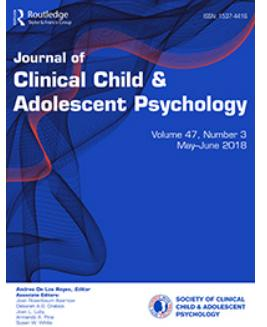

**Journal of Clinical Child & Adolescent Psychology**

**ISSN: 1537-4416 (Print) 1537-4424 (Online) Journal homepage: [www.tandfonline.com/journals/hcap20](https://www.tandfonline.com/journals/hcap20?src=pdf)**

# **Interpersonal Callousness from Childhood to Adolescence: Developmental Trajectories and Early Risk Factors**

**Amy L. Byrd, Samuel W. Hawes, Rolf Loeber & Dustin A. Pardini**

**To cite this article:** Amy L. Byrd, Samuel W. Hawes, Rolf Loeber & Dustin A. Pardini (2018) Interpersonal Callousness from Childhood to Adolescence: Developmental Trajectories and Early Risk Factors, Journal of Clinical Child & Adolescent Psychology, 47:3, 467-482, DOI: [10.1080/15374416.2016.1144190](https://www.tandfonline.com/action/showCitFormats?doi=10.1080/15374416.2016.1144190)

**To link to this article:** <https://doi.org/10.1080/15374416.2016.1144190>

| 45 | 0 |     | P  |
|----|---|-----|----|
|    |   |     |    |
|    |   | 100 | 11 |
|    |   |     |    |

Published online: 21 Apr 2016.

[Submit your article to this journal](https://www.tandfonline.com/action/authorSubmission?journalCode=hcap20&show=instructions&src=pdf) 

View related [articles](https://www.tandfonline.com/doi/mlt/10.1080/15374416.2016.1144190?src=pdf)

View [Crossmark](http://crossmark.crossref.org/dialog/?doi=10.1080/15374416.2016.1144190&domain=pdf&date_stamp=21%20Apr%202016) data

Citing [articles:](https://www.tandfonline.com/doi/citedby/10.1080/15374416.2016.1144190?src=pdf) 5 View citing articles

## Interpersonal Callousness from Childhood to Adolescence: Developmental Trajectories and Early Risk Factors

Amy L. Byrd

Department of Psychiatry, University of Pittsburgh School of Medicine

Samuel W. Hawes

School of Criminology and Criminal Justice, Arizona State University

## Rolf Loeber

Department of Psychiatry, University of Pittsburgh School of Medicine

## Dustin A. Pardini

School of Criminology and Criminal Justice, Arizona State University

Youth with a callous interpersonal style, consistent with features of adult psychopathy (e.g., lack of guilt, deceitful), are at risk for exhibiting severe and protracted antisocial behaviors. However, no studies have examined changes that occur in interpersonal callousness (IC) from childhood to adolescence, and little is known about the influence of early child, social, and contextual factors on trajectories of IC. The current study examined distinct patterns of IC across childhood and adolescence and associations with early risk factors. Participants were an at-risk sample of 503 boys (56% African American) assessed annually from around ages 7–15. Analyses examined child (anger dysregulation, fearfulness), social (peer, family, maltreatment), and contextual (psychosocial adversity) factors associated with teacher-reported IC trajectories across childhood and adolescence. Using latent class growth analysis, five trajectories of IC were identified (early-onset chronic, childhood-limited, adolescent-onset, moderate, low). Approximately 10% of boys followed an early-onset chronic trajectory, and a roughly equal percent of youth followed childhood-limited trajectory (10%) or an adolescent-onset trajectory (12%) of IC across development. Specifically, half of the boys with high IC in childhood did not continue to exhibit significant levels of these features into adolescence, whereas an equal proportion of youth with low IC in childhood demonstrated increasing levels during the transition to adolescence. Boys in the early-onset chronic group were characterized by the most risk factors and were differentiated from those with childhoodlimited and adolescent-onset IC only by higher conduct problems, fearlessness, and emotional abuse/neglect. Findings are discussed in terms of developmental models of IC and several avenues for early targeted interventions.

A growing body of research suggests that youth who exhibit features akin to the interpersonal (e.g., superficial charm, deceitful behavior) and affective (e.g., callousness, lack of empathy/remorse) features of adult psychopathy, referred to hereafter as interpersonal callousness (IC), appear to be at risk for severe and protracted forms of antisocial behaviors (Byrd, Loeber, & Pardini, [2012;](#page-14-0) Frick, Ray, Thornton, & Kahn, [2013b](#page-14-0)). Although many suggest that early emerging features of IC represent relatively stable personality traits, no longitudinal studies have examined whether systematic developmental changes in IC occur from childhood to

Correspondence should be addressed to Amy L. Byrd, University of Pittsburgh, Sterling Plaza, Suite 408, 201 North Craig Street, Pittsburgh, PA 15213. E-mail: alb202@pitt.edu

adolescence, a period marked by considerable changes in social and emotional development. Moreover, despite growing evidence that early child, social, and contextual factors may influence the development and persistence of IC over time (e.g., Frick et al., [2013b\)](#page-14-0), there has yet to be a prospective evaluation of their impact on the development of IC during this important developmental transition.

#### STABILITY OF IC

Whereas some evidence from longitudinal research has shown IC to demonstrate moderate to high degrees of stability from late childhood into adolescence (Frick, Kimonis, Dandreaux, & Farell, [2003](#page-14-0); Obradović, Pardini, Long, & Loeber, [2007](#page-16-0)) and from adolescence into adulthood (Lynam, Loeber, & Stouthamer-Loeber, [2008](#page-15-0)), the majority of work in this area is limited by a focus on rank-order stability. This more traditional analytic approach is designed to evaluate between-individual or "rank-order" change by focusing on an individual's relative placement in a group across time and as such, provides little information about within-individual change. For example, although an individual scoring high on IC in childhood may show significant decreases over time, their "rank-order" in the group may not change, resulting in relatively high stability estimates despite notable within-individual change. Although estimates of rank-order stability undoubtedly advance our understanding of the development of these characteristics, they can result in fundamental misinterpretations that substantial or meaningful changes in IC are nonexistent.

In contrast to claims that features of IC are fairly intractable, recent research utilizing more person-oriented analyses has documented considerable within-individual variability in IC across adolescence (Pardini & Loeber, [2008\)](#page-16-0) and significant variation in group-based trajectories during both childhood (Fontaine, McCrory, Boivin, Moffitt, & Viding, [2011\)](#page-14-0) and adolescence (Baskin-Sommers, Waller, Fish, & Hyde, [2015;](#page-14-0) Salihovic, Özdemir, & Kerr, [2013\)](#page-16-0). Collectively, these studies have demonstrated the importance of delineating groups of youth with more chronic, stable forms of IC from those youth who evidence significant and systematic change over time. However, these investigations have focused on relatively short time spans (about four years) during discrete developmental periods (childhood or adolescence), with no known studies examining variability in the development of IC across childhood and adolescence. In light of theory and research suggesting that the early onset of these features are particularly problematic, longitudinal investigations that examine variability in IC across this developmental transition are crucial for expanding our understanding of potential change in these features over time. This is particularly relevant when considering early risk factors and potential associations with varying trajectories of IC across childhood and adolescence. Given research documenting that various child, social, and contextual factors may place youth at heightened risk for developing of IC over time (e.g., Fontaine et al., [2011](#page-14-0); Salihovic et al., [2013](#page-16-0); see more details next), enhancing our understanding of these associations has important implications for early prevention and intervention efforts.

#### CHILD CHARACTERISTICS AND IC

Considerable research has documented associations between specific child characteristics, namely, temperamental features and psychopathology symptoms, and IC. For example, youth with a fearless temperament tend to be relatively insensitive to punishment, which is believed to impede the internalization of moral emotions (i.e., empathy, guilt) that guide prosocial behavior and, in turn, engender a greater propensity for the development of IC (Kochanska, Gross, Lin, & Nichols, [2002](#page-15-0)). Conversely, increased anxiety has been shown to promote the development of empathy and guilt and is associated with low levels of IC in some studies (Frick, Lilienfeld, Ellis, Loney, & Silverthorn, [1999](#page-14-0); Pardini, Lochman, & Powell, [2007\)](#page-16-0), suggesting that anxiety may protect some youth from developing IC. In addition, higher levels of anger dysregulation and impulsivity are often found in youth exhibiting IC (Frick et al., [2013b](#page-14-0)), and researchers have posited that these characteristics may increase risk for the development or persistence of IC over time (see Lynam, [1997;](#page-15-0) Lynam & Gudonis, [2005](#page-15-0); Hawes et al., [2016](#page-15-0)). Along these lines, higher levels of conduct problems and attention-deficit hyperactivity disorder (ADHD) symptoms are often found to co-occur with IC in youth (Frick, Ray, Thornton, & Kahn, [2013a,](#page-14-0) [2014](#page-14-0)); however, it is less clear if the co-occurrence of these characteristics stems from shared or unique underlying mechanisms and whether their early presence places youth at heightened risk for the persistence of IC over time. Although the extant literature documents associations between IC and a variety of child characteristics, large-scale prospective studies that examine their impact on varying trajectories of IC are limited.

#### PEER INFLUENCES AND IC

Indirect evidence suggests that affiliation with deviant peers may reinforce the development of a callous interpersonal style. Longitudinal studies have shown that increases in peer delinquency are related to more tolerant beliefs about the acceptability of antisocial behavior, including causing serious harm to others (Pardini, Loeber, & Stouthamer-Loeber, [2005\)](#page-16-0). Similarly, antisocial adolescents with high levels of IC are prone to affiliate with delinquent peers (Pardini & Loeber, [2008\)](#page-16-0). Although this relationship is likely bidirectional, antisocial peers could model and reinforce deceitful and callous behaviors as part of a "deviancy training" process (Dishion, Spracklen, Andrews, & Patterson, [1996\)](#page-14-0) and increase risk for the development and persistence of IC over time. There is also some evidence that peer rejection could foster the development of IC. Fontaine and colleagues [\(2011\)](#page-14-0) reported that youth with high levels of IC tended to have problems getting along with peers, and Barker and Salekin [\(2012\)](#page-14-0) found that experiencing peer victimization predicted increases in IC, especially among those youth with high levels of irritability. It is possible that early experiences of rejection lead some youth to become emotionally detached from their peers and less concerned about the detrimental impact of their behavior. Taken together this research highlights the need to examine whether early peer influences are associated with distinct developmental patterns of IC across childhood and adolescence.

#### PARENTING PRACTICES AND IC

Accumulating evidence indicates that children who are exposed to negative parenting practices (e.g., poor parent– child relationship, poor communication, harsh discipline) may be prone to developing a callous interpersonal style. Research suggests that young children who experience low warmth and harsh forms of discipline display less guilt following transgressions (Kochanska et al., [2002\)](#page-15-0) and are less concerned about the feelings of others (Hastings, Zahn-Waxler, Robinson, Usher, & Bridges, [2000](#page-15-0)). Along these lines, an overly negative and harsh parenting style has been found to predict increases in IC (for review, see Waller, Gardner, & Hyde, [2013](#page-16-0)), whereas a warm and supportive parent–child relationship has been linked to the internalization of prosocial norms (Kochanska & Murray, [2000](#page-15-0)) and can serve to ameliorate levels of IC over time (Frick et al., [2003;](#page-14-0) Pardini et al., [2007\)](#page-16-0). Of importance, the link between parenting and the development of IC does not seem to be solely accounted for by child-driven effects (Waller et al., [2013\)](#page-16-0), making the influence of early parenting practices on the development of IC across childhood and adolescence worthy of continued investigation.

## MALTREATMENT, PSYCHOSOCIAL ADVERSITY, AND IC

Several studies have documented consistent associations between various forms of early maltreatment and IC in adults (Marshall & Cooke, [1999;](#page-15-0) Poythress, Skeem, & Lilienfeld, [2006](#page-16-0)) and youth (Kerig, Bennett, Thompson, & Becker, [2012;](#page-15-0) Kimonis, Fanti, Isoma, & Donoghue, [2013](#page-15-0)). Theoretically, researchers have speculated that physical abuse may impede emotional development and foster an emotionally detached callous interpersonal style (Porter, [1996](#page-16-0)), whereas emotional deprivation, neglect, and even severe forms of psychosocial adversity may

create an emotionally barren learning environment that serves to cultivate the development of IC over time (McCord & McCord, [1956](#page-15-0)). Emerging empirical work in this area has shown associations between physical abuse and emotional abuse/neglect and the presence of IC in youth (Gostisha et al., [2014\)](#page-15-0), as well as its development over time (Davis, Ammons, Dahl, & Kliewer, [2015](#page-14-0); Kimonis, Centifanti, Allen, & Frick, [2014](#page-15-0)). In addition, research has identified prospective links between psychosocial adversity, including high levels of chaos in the home (Fontaine et al., [2011\)](#page-14-0) and low socioeconomic status (Barker, Oliver, Viding, Salekin, & Maughan, [2011\)](#page-14-0), and the development of IC. However, to date, there are no studies evaluating associations between early maltreatment or psychosocial adversity and patterns of IC across childhood and adolescence.

#### CURRENT STUDY

Growing evidence suggests that there is considerable heterogeneity in IC over time; however, the extant literature has examined trajectories of IC over relatively short periods (about four years) and during distinct developmental windows in childhood (Fontaine et al., [2011](#page-14-0)) and adolescence (Baskin-Sommers et al., [2015;](#page-14-0) Salihovic et al., [2013](#page-16-0)), with no published studies examining developmental patterns of these characteristics from childhood to adolescence. Moreover, no longitudinal studies have examined the impact of early risk factors on the development of IC across this important development transition. As such, the current study sought to build upon previous research by addressing these limitations. Aims were twofold: first, to characterize divergent patterns IC from childhood to adolescence, and second, to examine early child (e.g., fearlessness, anger dysregulation), social (e.g., peer, family, maltreatment), and contextual (e.g., psychosocial adversity) factors that may be associated with distinct trajectories of IC across these developmental periods. These aims were investigated using the Pittsburgh Youth Study (PYS) and, importantly, build on previous work examining IC in this sample. Specifically, prior research in this sample has focused on (a) a psychometric evaluation of IC demonstrating the validity of this construct as distinct from other externalizing behaviors (i.e., comparison of factor analytic models across time; Pardini, Obradović, & Loeber, [2006\)](#page-16-0), (b) a methodological investigation assessing longitudinal measurement invariance and rank-order (i.e., between-individual) stability of parent- and teacher-reported IC (Obradovic et al., [2007\)](#page-16-0), and (c) a single study that utilized the oldest cohort of the PYS to examine parenting and peer factors as predictors of an unconditional (one-class) growth model of IC during adolescence (ages 14–18; Pardini & Loeber, [2008](#page-16-0)). The current study expands on this research to include the first and only examination of within-individual change across an 8-year developmental window using latent-class trajectory modeling. In addition, this study utilized the youngest cohort of the PYS to allow for an examination of early risk factors in childhood that may be associated with potential changes in IC across the transition to adolescence. The extensive developmental span covered by the PYS and its prospective design allows for the first empirical investigation to address the aforementioned aims.

#### METHOD

#### Participants

Participants were part of the PYS, an ongoing longitudinal study of boys initially recruited from the Pittsburgh public schools (Loeber, Farrington, Stouthamer-Loeber, & Van Kammen, [1998](#page-15-0)). This study focused on the youngest cohort of boys selected from a larger pool of 1,165 enrolled first graders in 1987–1988. A screening assessment using parent, teacher, and youth reports of conduct problems was conducted, and those boys rated in the top 30% on behavior problems (n = 256), as well as a roughly equal number of kids randomly selected from the remainder (n = 247), were selected for longitudinal follow-up. Boys selected for follow-up averaged 7 years of age at screening (SD = 0.55) and were predominately Caucasian (40.6%) or African American (55.7%). The primary caretaker for most boys was their biological mother (89.5%). Primary caretakers also included biological father (3.7%), grandmother (3.1%), or some other relative (3.7%). Further demographic information can be found in Loeber et al. ([1998](#page-15-0)).

#### Procedure

Following the initial screening assessment, the youngest cohort was assessed semiannually for the first 4 years and then annually for the next several years. Early childhood risk factors in the current study were obtained during the first and second follow-up assessments, when the boys were approximately 7 (M = 7.46, SD = .55) and 8 (M = 7.98, SD = .54) years of age, respectively. Court-reported child maltreatment data were collected for all participants using official records from the Children and Youth Services (CYS) offices of Allegheny County, Pennsylvania. Reports of IC were obtained from teachers in the spring of each year during the second, fourth, and sixth biannual assessments and the following four annual assessments, when the boys were between the approximate ages of 8 (M = 7.98, SD = .54) and 15 (M = 15.07, SD = .56). Participant retention was high for each of the assessments, ranging from 84.9% to 92.6%. Procedures were reviewed and approved by the Institution Review Board at the University of Pittsburgh. Written informed consent was obtained from parents and/or youth prior to each assessment.

#### Measures

IC. IC was measured using eight items from an extended version of the Teacher Report Form (Achenbach & Edelbrock, [1986\)](#page-14-0) at each of the eight follow-up assessments just described. This scale was previously validated using a confirmatory factor analysis within the PYS (Pardini et al., [2006\)](#page-16-0). The scale consists of eight items assessing an interpersonal style characterized by deceitfulness, a lack of remorse or guilt, manipulation, superficial charm, grandiosity, and an inability to accept responsibility after misbehaving. All items were rated on a 3-point scale from 0 (not true) to 2 (very true) and then summed to create a total score. The IC scale has shown evidence of longitudinal invariance (Obradović et al., [2007](#page-16-0)), correlates highly with the interpersonal and affective facets of psychopathy assessed using the Child Psychopathy Scale (Pardini & Loeber, [2008](#page-16-0)), and predicts adult psychopathy (Burke, Loeber, & Lahey, [2007](#page-14-0)) as well persistent delinquency into early adulthood (Byrd et al., [2012](#page-14-0)). Teacher-reported IC has been used in a number of studies and shows correlates similar to those seen with self-reported and parent-reported IC (for a review, see Frick et al., [2014\)](#page-14-0). The internal consistency for this construct was high across each of the eight follow-up assessments in this study (α range = .91–.94).

#### Childhood Risk Factors

To avoid potential confounds due to shared method variance, risk factors were obtained via parent- or childreport and official record. All variables were summed and averaged across the two semiannual assessments just described, with higher scores representing increased levels of problem behaviors. The only exception was maltreatment (assessed via court record from birth). All variables are described in more detail next.

Demographics. Parents completed a demographic questionnaire that asked about the child's age and race (coded African American = 1, 0 = Caucasian/other).

Child characteristics. All child characteristics were evaluated using parent-report of the Child Behavior Checklist (Achenbach, [1991\)](#page-14-0), which assesses aspects of externalizing and internalizing problems in youth. Items were rated on a 3-point scale ranging from 0 (not true) to 2 (very true or often true). Parents reported on eight items assessing conduct problems (e.g., "physically attacks people" or "steals"), which demonstrated moderate to good internal consistency at both childhood assessments (α = .82, α = .79, respectively). Anger dysregulation was measured using six items (e.g., "easily frustrated," "behaves explosively and unpredictably") and the internal consistency for this construct was good at both childhood assessments (α = .81, α = .80, respectively). Eleven items were used to assess ADHD symptoms (e.g., "impulsive or acts without thinking," "can't concentrate, can`t pay attention for long"). This scale exhibited good internal consistency at both assessments (α = .87, α = .86, respectively). Fearlessness was assessed using one item measured at each of the two assessments assessment (i.e., "is daring"). Anxiety problems were measured using seven items (e.g., "too fearful or anxious"), although estimates of internal consistency were low across both childhood assessments (α = .57, α = .54, respectively).

## Peer Factors

Peer delinquency. Youth were administered the Peer Delinquency Scale (Loeber et al., [1998\)](#page-15-0) to assess the number of the participants' friends who engage in various delinquent behaviors. Participants rated how many of their friends engaged in 12 delinquent behaviors (e.g., stealing, fighting, substance use) in the past 6 months using a 5-point scale from 0 (none of them) to 4 (all of them). The internal consistency for this construct was moderate to good across both childhood assessments (α = .88, α = .79, respectively).

Peer rejection. Levels of peer rejection were measured using four items from the parent-reported Child Behavior Checklist (e.g., "disliked by peers"), and items were rated on a 3-point Likert rating scale of 0 (not true), 1 (sometimes true), and 2 (very true). This parent-reported scale has been utilized in previous research linking peer rejection to externalizing behaviors in youth (for examples, see Bagwell, Molina, Pelham, & Hoza, [2001;](#page-14-0) Humphrey, Storch, & Geffken, [2007;](#page-15-0) McCloskey & Stuewig, [2001](#page-15-0); Mesman & Koot, [2000](#page-15-0)). The internal consistency for this construct was moderate across both childhood assessments (α = .75, α = .65, respectively).

#### Parenting Factors

Poor parent–child relationship. This construct was measured using the Child Relationship with Parent Scale (Loeber et al., [1998\)](#page-15-0), comprising 16 items that ask parents how often they perceive their relationship in positive and negative terms (e.g., "How often have you wished you had never had him?"). Items were rated on a 3-point Likert scale of 1 (almost never), 2 (sometimes), and 3 (often). The internal consistency was moderate to good across both childhood assessments (α = .83, α = .79, respectively).

Poor communication. The Revised Parent– Adolescent Communication Form (Loeber et al., [1998\)](#page-15-0) asks parents how often they discuss issues with their child in an open and supportive manner (e.g., "When you are having a problem with your son, do you give him the silent treatment?"). Parents responded to 17 items using a 3-point Likert scale of 0 (almost never), 1 (sometimes), and 2 (always). This scale displayed moderate to good levels of internal consistency across both childhood assessments (α = .84, α = .78, respectively).

Harsh discipline. One item from the Discipline Scale (Loeber et al., [1998\)](#page-15-0) was used to examine the use of physical punishment (i.e., "If your son does something that he is not allowed to do or that you don't like, do you slap or spank him, or hit him with something?") Parents responded using a 3-point Likert rating scale of 1 (almost never), 2 (sometimes), and 3 (often). This one-item construct has been used in several published studies using the PYS data set. It demonstrates moderate stability over time (Loeber et al., [2000](#page-15-0)) and predicts conduct problems, antisocial behavior, and violence (Loeber, Farrington, Stouthamer-Loeber, & White, [2008;](#page-15-0) Loeber et al., [2005;](#page-15-0) Pardini, Fite, & Burke, [2008\)](#page-16-0).

#### Maltreatment

Court-reported child maltreatment data were collected from official records at the CYS offices of Allegheny County, Pennsylvania. This information covered the time span from the participant's birth to 15 years of age. The current study focused on referrals or substantiated maltreatment that occurred at or prior to age 8, in line with other study variables just described. Consistent with previous research, all referred and substantiated cases were classified into categories of maltreatment according to the Maltreatment Classification System (Barnett, Manly, & Cicchetti, [1993](#page-14-0)), and this included all forms of significant child maltreatment that required investigation and/or intervention by CYS (e.g., physical abuse, emotional abuse, failure to provide, lack of supervision). The current study focused specifically on physical abuse and emotional abuse/neglect. To ensure accuracy and consistency, 16% of the coded records were extracted and independently coded by an additional staff member. Agreement was above 96% on all cases, and any discrepancies were resolved by the coding supervisor (see Stouthamer-Loeber, Loeber, Homish, & Wei, [2001,](#page-16-0) for additional details).

#### Psychosocial Adversity

A cumulative index of psychosocial adversity was created by summing the following eight factors associated with family disruption, stress, and poverty within the past year (all parent-reported unless otherwise noted): (a) change in caretaker, (b) high number children in home (dichotomized at upper 25%), (c) interviewer reported housing quality (dichotomized at upper 25%), (d) child moved residence, (e) one or no biological parent(s) in home, (f) neighborhood crime/disadvantage (dichotomized at upper 25%), (g) parent perceived stress (dichotomized at upper 25%), and (h) receipt of financial public assistance.

## Data Analytic Plan

First, latent class growth analysis (LCGA; Jung & Wickrama, [2008](#page-15-0)) was employed to identify trajectories of IC from childhood to adolescence. LCGA is a person-centered method that identifies latent classes of individuals who follow similar developmental trajectories, allowing for an examination of individual patterns of stability and change across time. IC trajectories were estimated from a series of one- to six-class LCGA models. Identification of the best fitting model was based on interpretability, parsimony, and theoretical justification. Model fit was assessed according to entropy values (Muthén, [2004](#page-15-0)) and parsimony indices including the Bayesian Information Criterion (Schwarz, [1978\)](#page-16-0) and the Bootstrapped Likelihood Ratio Test (BLRT; Feng & McCulloch, [1996](#page-14-0)), with BLRT being most consistent in its ability to identify the correct class solution (Nylund, Asparouhov, & Muthén, [2007](#page-15-0)). All analyses were conducted in Mplus 6.0 (Muthén & Muthén, [1998](#page-15-0)– [2011](#page-15-0)) using full information maximum likelihood estimation with standard errors and a chi-square statistic that is robust to non-normality.

After identifying the best latent class solution, individuals were assigned into their most likely class based on posterior probability values. Next, child, social, and contextual factors were used to predict class membership using univariate multinomial logistic regressions conducted in SPSS version 20 (SPSS, Inc., Chicago, IL). Continuous variables were converted to z scores prior to analyses to allow for a direct comparison of observed effects. Significant omnibus tests were probed and class comparisons of interest were examined (see next). Finally, for each comparison of interest, those factors that demonstrated significant associations in univariate analyses were entered into a multivariate multinomial logistic regression to examine their unique predictive utility.

#### RESULTS

Initial examination of an unconditional growth model of IC scores revealed that the addition of a quadratic slope factor to the linear model significantly improved fit, Satorra-Bentler: Δχ2 (4) = 52.55, and resulted in overall good model fit, χ 2 (27) = 47.36, p = .009; comparative fit index = .97, Tucker-Lewis index = .97, root mean square error of approximation = .039. The mean estimated intercept (M = 2.91, SE = 0.17) and linear slope (M = 0.65, SE = 0.97) were significant in the positive direction (ps < .001), whereas a negative quadratic slope factor (M = –0.08; SE = .01) was also significant (p < .001). It is important that statistically significant variance estimates were found for the intercept (δ2 = 8.23, p < .001), linear slope (δ2 = 1.11, p = .007), and quadratic slope (δ2 = 0.02, p = .019), indicating significant within-individual variability in initial levels of IC and change over time.

## Latent Class Growth Analysis of IC

Following examination of the single-class model, latent classes of IC were explored in a stepwise fashion, beginning with a two-class solution and ending with a six-class solution. The LCGA model that best fit the data according to parsimony, interpretability, entropy, Bayesian Information Criterion, and BLRT indices was a five-class model (Table 1). The six-class model was rejected because it included classes with an exceedingly small number of participants (less than 5% of total sample). In the five-class solution, the total sample size for each of the five classes exceeded 10% of the total sample, and the trajectories were similar to those observed in a previous study (Fontaine et al., [2011](#page-14-0)). Posterior probabilities (PP) for each of the five classes ranged from 0.82 to 0.93 and are specified next.

[Figure 1](#page-7-0) depicts the five-class model. The first class, with 52 participants (10.3%; PP = 0.90), showed high initial values of IC, which remained relatively stable over time ("early-onset chronic" [EOC]). The second class included 49 participants (10.1%; PP = 0.88) and showed initially high levels of IC that decreased across development ("childhood-limited"). The third class

|         | BIC       | Entropy | BLRT   |
|---------|-----------|---------|--------|
| 2-Class | 19487.120 | 0.838   | 0.0000 |
| 3-Class | 19328.914 | 0.861   | 0.0000 |
| 4-Class | 19186.770 | 0.822   | 0.0000 |
| 5-Class | 19095.853 | 0.840   | 0.0000 |

TABLE 1 Model Fit of Latent Class Growth Analysis for Interpersonal Callousness Trajectories

Note. The BIC is an index used to compare the fit of two or more models estimated from the same data set and smaller values are preferred. Entropy values close to 1 indicate clear delineation of classes. BLRT signifies that the model is significantly better than a model with one fewer class when p values are less than .05. BIC = sample size adjusted Bayesian Information Criterion; BLRT = Bootstrapped Likelihood Ratio.

FIGURE 1 Trajectories of interpersonal callousness.

included 58 participants (11.8%; PP = 0.85) and showed initially low levels of IC that increased over time ("adolescent-onset"). The fourth class included 82 participants (17.4%; PP = 0.82) and demonstrated moderate levels of IC, which, despite some fluctuation, remained relatively moderate across development ("moderate"). The fifth class included 260 participants (50.4%; PP = 0.93), and these individuals demonstrated consistently low levels of IC over time ("low"). Observed means and standard deviations for IC by trajectory group are presented in [Table 2](#page-8-0).

#### Predicting Trajectory Class Membership

[Table 3](#page-9-0) presents the means and standard deviations for each of the childhood risk factors by trajectory group membership. Four contrasts believed to be the most informative with regard to the development of IC were examined and included all possible comparisons with the EOC group ([Table 4\)](#page-10-0). Results from univariate analyses are presented first, followed by findings from multivariate analyses [\(Table 5\)](#page-11-0). Additional group contrasts are available upon request from the study authors.

#### EOC versus Low

In univariate analyses, youth following the EOC trajectory were characterized by higher levels of all child characteristics with the exception of anxiety problems. Boys in the EOC group suffered more peer rejection and had more delinquent peers compared to boys with low IC. The EOC group experienced more negative parenting as indexed by a poor parent–child relationship, poor parent–child communication, and harsh discipline. Youth in the EOC group were more likely to suffer maltreatment (both physical abuse and emotional/abuse neglect) and experienced higher levels of psychosocial adversity. Boys in the EOC group were also more likely to be African American. In multivariate analyses, high levels of fearlessness, conduct problems, peer delinquency, and psychosocial adversity remained significant after accounting for other factors.

#### EOC versus Childhood-Limited

Boys in the EOC trajectory group had higher levels of conduct problems and were more fearless than boys with decreasing levels of IC. Boys in the EOC group were more likely to have experienced emotional abuse/neglect in childhood and had higher rates of psychosocial adversity relative to boys with decreasing levels of IC. Boys in the EOC group were also more likely to be African American than boys in the childhood limited group. In multivariate analyses, all significant predictors were reduced to nonsignificance, though conduct problems showed trend level significance (p = .07).

#### EOC versus Adolescent-Onset

Boys exhibiting EOC patterns of IC had higher conduct problems and were rated as more fearless than boys with increasing levels of IC. Those in the EOC group also experienced more peer rejection and were more likely to suffer emotional abuse/neglect in childhood relative to those in the adolescent-onset group. In multivariate analyses, only emotional abuse/neglect remained significant and fearlessness demonstrated trend level significance (p = .08).

#### EOC versus Moderate

Boys in the EOC group were more likely to experience emotional abuse/neglect in childhood and had higher rates of psychosocial adversity relative to boys with moderate levels of IC. These findings were reduced to nonsignificance in multivariate analyses.

|                              |              |                        |         |       |               |                   |               |                 | M           | Age      |             |           |                  |        |            |        |      |
|------------------------------|--------------|------------------------|---------|-------|---------------|-------------------|---------------|-----------------|-------------|----------|-------------|-----------|------------------|--------|------------|--------|------|
|                              |              | 8                      |         | 9     |               | 10                |               | 11              |             | 12       |             | 13        |                  | 14     |            | 15     |      |
| Trajectories                 | N of % | M                      | SD      | M     | SD            | M                 | SD            | M               | SD          | M        | SD          | M         | SD               | M      | SD         | M      | SD   |
| Chronic Early-Onset       | 10.30%       | 6.99a                  | 4.17    | 8.18a | 4.76          | 10.52a            | 4.14          | 10.72a          | 4.37        | 11.20a   | 3.84        | 10.57a    | 3.72             | 10.69a | 3.74       | 10.22a | 3.40 |
| Childhood-Limited            | 10.10%       | 10.54b                 | 2.57    | 7.58a | 4.87          | 6.41b             | 4.63          | 5.58b           | 4.22        | 3.99b    | 4.26        | 3.11b     | 3.32             | 5.39b  | 4.73       | 3.51b  | 3.55 |
| Adolescent-Onset             | 11.80%       | 1.75c                  | 2.18    | 2.39b | 2.96          | 3.94c             | 4.10          | 3.97b           | 3.40        | 5.27b,c  | 4.20        | 6.17c     | 4.54             | 7.35c  | 4.34       | 10.59a | 3.07 |
| Moderate                     | 17.40%       | 3.26d                  | 2.51    | 5.39c | 3.77          | 7.31b             | 4.41          | 7.86c           | 4.53        | 6.85c    | 4.31        | 6.04c     | 4.55             | 4.62b  | 3.82       | 1.82c  | 1.75 |
| Low                          | 50.40%       | 0.68e                  | 1.36    | 1.09b | 1.90          | 1.68d             | 2.74          | 1.49d           | 2.75        | 1.30d    | 2.23        | 1.58d     | 2.57             | 1.69d  | 3.11       | 1.11c  | 1.73 |
| sample Total              |              | 2.85                   | 3.91    | 3.37  | 4.20          | 4.29              | 4.74          | 4.22            | 4.80        | 4.04     | 4.69        | 3.93      | 4.52             | 4.17   | 4.71       | 3.48   | 4.41 |
| designated Means Note. | with         | subscript different | letters | are   | significantly | from different | other each | .05) < (p | on based | pairwise | comparisons | according | Hochberg's to | GT2    | procedure. |        |      |

| Means | 2 TABLE | Membership Group Trajectory by Callousness Interpersonal of Deviations Standard and |
|-------|------------|----------------------------------------------------------------------------------------------------------------|
|       |            |                                                                                                                |

|                                              |         | and Means       | Standard | of Deviations  | Childhood | Factors Risk             | Trajectory Trajectory by | Group Group    | Membership    |           |      |       |      |
|----------------------------------------------|---------|--------------------|----------|-------------------|-----------|-----------------------------|--------------------------------|-------------------|---------------|-----------|------|-------|------|
|                                              |         | EOC                |          | CL                |           | AO                          |                                | M                 |               | L         |      | Total |      |
|                                              | N       | M/%                | SD       | M/%               | SD        | M/%                         | SD                             | M/%               | SD            | M/%       | SD   | M/%   | SD   |
| Variables Demographic                     |         |                    |          |                   |           |                             |                                |                   |               |           |      |       |      |
| Age                                          | 501     | 7.79               | 0.60     | 7.87              | 0.56      | 7.79                        | 0.52                           | 7.76              | 0.56          | 7.65      | 0.52 | 7.72  | 0.55 |
| American) (African Race                | 501     | 85%                | —        | 67%               | —         | 72%                         | —                              | 70%               | —             | 47%       | —    | 59%   | —    |
| Characteristics Child                     |         |                    |          |                   |           |                             |                                |                   |               |           |      |       |      |
| Fearlessness                                 | 501     | 0.52               | 0.44     | 0.34              | 0.44      | 0.34                        | 0.42                           | 0.38              | 0.42          | 0.29      | 0.39 | 0.34  | 0.41 |
| Dysregulation Anger                       | 501     | 2.74               | 2.45     | 2.37              | 2.11      | 2.31                        | 2.05                           | 2.93              | 2.46          | 1.92      | 2.01 | 2.26  | 2.18 |
| Problems Conduct                          | 501     | 3.48               | 3.06     | 1.88              | 1.82      | 2.13                        | 2.06                           | 2.88              | 2.76          | 1.28      | 1.67 | 1.93  | 2.25 |
| Problems ADHD                             | 501     | 8.63               | 4.30     | 7.81              | 4.37      | 7.86                        | 3.73                           | 9.31              | 4.14          | 5.95      | 3.75 | 7.18  | 4.15 |
| Problems Anxiety                          | 501     | 1.44               | 1.37     | 1.43              | 1.13      | 1.54                        | 1.15                           | 1.68              | 1.30          | 1.44      | 1.36 | 1.49  | 1.31 |
| Factors Peer                              |         |                    |          |                   |           |                             |                                |                   |               |           |      |       |      |
| Delinquency Peer                          | 477     | 8.47               | 5.15     | 8.24              | 5.24      | 6.57                        | 4.62                           | 8.13              | 5.36          | 4.86      | 4.46 | 6.33  | 5.03 |
| Rejection Peer                            | 501     | 1.71               | 1.29     | 1.32              | 1.52      | 1.18                        | 1.23                           | 1.36              | 1.27          | 0.90      | 1.08 | 1.13  | 1.23 |
| Factors Parenting                         |         |                    |          |                   |           |                             |                                |                   |               |           |      |       |      |
| Relationship Parent–Child Poor         | 501     | 8.24               | 4.46     | 7.82              | 4.35      | 6.90                        | 4.33                           | 8.21              | 4.95          | 5.29      | 3.83 | 6.51  | 8.31 |
| Communication Poor                        | 501     | 26.48              | 4.36     | 25.82             | 4.38      | 25.54                       | 4.51                           | 26.06             | 4.28          | 23.86     | 4.04 | 24.88 | 4.33 |
| Discipline Harsh                          | 501     | 1.87               | 0.41     | 1.78              | 0.51      | 1.82                        | 0.43                           | 1.74              | 0.44          | 1.63      | 0.45 | 1.71  | 0.46 |
| Adversity and Maltreatment             |         |                    |          |                   |           |                             |                                |                   |               |           |      |       |      |
| Abuse Physical                            | 501     | 15%                | —        | 12%               | —         | 7%                          | —                              | 10%               | —             | 5%        | —    | 8%    | —    |
| Abuse/Neglect Emotional                   | 501     | 37%                | —        | 16%               | —         | 16%                         | —                              | 20%               | —             | 11%       | —    | 16%   | —    |
| Adversity Psychosocial                    | 484     | 3.04               | 1.44     | 2.20              | 1.37      | 2.57                        | 1.38                           | 2.42              | 1.41          | 1.56      | 1.48 | 2.04  | 1.53 |
| Chronic; Early-Onset = EOC Note. | = CL | Childhood-Limited; | = AO  | Adolescent-Onset; | = M    | low; = L moderate; | = ADHD                      | Attention-Deficit | Hyperactivity | Disorder. |      |       |      |

TABLE 3 StandardDeviationsofChildhoodRiskFactorsbyTrajectoryGroup TRAJECTORIES OF INTERPERSONAL CALLOUSNESS 475

|                                                 |                                                     | Logistic Multinomial Univariate        | Regressions                                           |                                     |                                          |
|-------------------------------------------------|-----------------------------------------------------|----------------------------------------------|-------------------------------------------------------|-------------------------------------|------------------------------------------|
|                                                 |                                                     |                                              | Comparisons Group Planned                       |                                     |                                          |
| Trajectories                                    | MLR 2 χ                                       | L vs. OR EOC                        | CL vs. OR EOC                                | AO vs. OR EOC              | M vs. OR EOC                    |
| Variables Demographic                        |                                                     |                                              |                                                       |                                     |                                          |
| American) (African Race Age            | 41.23** 10.91*                                   | 6.22** 1.31                               | 2.67* 0.88                                         | 2.09 1.01                        | 1.06 2.41                             |
| Characteristics Child                        |                                                     |                                              |                                                       |                                     |                                          |
| Fearlessness                                    | 13.70**                                             | 1.69**                                       | 1.51*                                                 | 1.48*                               | 1.35                                     |
| Dysregulation Anger                          | 16.42**                                             | 1.46**                                       | 1.17                                                  | 1.20                                | 0.93                                     |
| Problems Conduct                             | 62.17**                                             | 2.71**                                       | 1.77**                                                | 1.56*                               | 1.17                                     |
| Problems ADHD                                | 55.82**                                             | 2.04**                                       | 1.23                                                  | 1.21                                | 0.85                                     |
| Problems Anxiety                             | 2.24                                                | 1.00                                         | 0.99                                                  | 1.07                                | 0.84                                     |
| Factors Peer                                 |                                                     |                                              |                                                       |                                     |                                          |
| Delinquency Peer                             | 48.65**                                             | 2.15**                                       | 1.04                                                  | 1.41                                | 1.06                                     |
| Rejection Peer                               | 24.36**                                             | 1.85**                                       | 1.28                                                  | 1.42*                               | 1.24                                     |
| Factors Parenting                            |                                                     |                                              |                                                       |                                     |                                          |
| Relationship Parent–Child Poor            | 46.82**                                             | 2.05**                                       | 1.08                                                  | 1.32                                | 1.01                                     |
| Communication Poor                           | 32.05**                                             | 1.88**                                       | 1.16                                                  | 1.24                                | 1.10                                     |
| Discipline Harsh                             | 19.72**                                             | 1.73**                                       | 1.24                                                  | 1.12                                | 1.35                                     |
| Adversity and Maltreatment                |                                                     |                                              |                                                       |                                     |                                          |
| Abuse Physical                               | 9.17                                                | 3.76**                                       | 1.30                                                  | 2.46                                | 1.68                                     |
| Abuse/Neglect Emotional                      | 18.58**                                             | 4.59**                                       | 2.95*                                                 | 3.14*                               | 2.38*                                    |
| Adversity Psychosocial                       | 60.38                                               | 2.85**                                       | 1.78**                                                | 1.38                                | 1.53*                                    |
| were variables continuous All Note. | an represent OR that so standardized | with associated odds in increase | predictor. the in change unit 1SD a | Logistic Multinomial = MLR | ratio; odds = OR Regression; |

TABLE 4 EOC = Early-Onset Chronic; CL = Childhood-Limited; AO = Adolescent-Onset; M = moderate; L = low; ADHD = Attention-Deficit Hyperactivity Disorder. \*p<.05.\*\*p<.01.

|                                |           |            | Planned Group Comparisons |           |
|--------------------------------|-----------|------------|---------------------------|-----------|
| Trajectories                   | EOC vs. L | EOC vs. CL | EOC vs. AO                | EOC vs. M |
| Child Characteristics          | OR        | OR         | OR                        | OR        |
| Fearlessness                   | 1.63*     | 1.43       | 1.46†                     | —–        |
| Anger Dysregulation            | 0.60      | —–         | —–                        | —–        |
| Conduct Problems               | 2.17**    | 1.51†      | 1.24                      | —–        |
| ADHD Problems                  | 1.65†     | —–         | —–                        | —–        |
| Peer Factors                   |           |            |                           |           |
| Peer Delinquency               | 1.47*     | —–         | —–                        | —–        |
| Peer Rejection                 | 0.96      | —–         | 1.11                      | —–        |
| Parenting Factors              |           |            |                           |           |
| Poor Parent–Child Relationship | 0.88      | —–         | —–                        | —–        |
| Poor Communication             | 1.38      | —–         | —–                        | —–        |
| Harsh Discipline               | 1.24      | —–         | ——–                       | —–        |
| Maltreatment & Adversity       |           |            |                           |           |
| Physical Abuse                 | 1.09      | —–         | —–                        | —–        |
| Emotional Abuse/Neglect        | 2.21      | 2.00       | 2.81*                     | 1.97      |
| Psychosocial Adversity         | 1.67*     | 1.46       | —–                        | 1.27      |
| 2 MLR: χ                    | 196.49**  | 134.82**   | 129.09**                  | 82.64**   |

TABLE 5 Multivariate Multinomial Logistic Regressions

Note. Each column represents a separate multivariate logistic regression including only those predictors that were significant in univariate analyses, with race and age entered as covariates. All continuous variables were standardized so that OR represent an increase in odds associated with a 1SD unit change in the predictor. EOC = Early-Onset Chronic; L = low; OR = odds ratio; CL = Childhood-Limited; AO = Adolescent-Onset; M = moderate; ADHD = Attention-Deficit Hyperactivity Disorder; MLR = Multinomial Logistic Regression.

\*p < .05. \*\* p < .01. † p < .10.

#### DISCUSSION

The current investigation is the first to examine and identify latent developmental trajectories of IC from childhood to adolescence. Findings support results from recent research demonstrating significant within-individual variability in IC across development (e.g., Fontaine et al., [2011;](#page-14-0) Pardini & Loeber, [2008\)](#page-16-0) and offer a unique characterization of different patterns of change across the critical transition into adolescence. Results indicate that among boys who exhibited initially high levels of IC, approximately half displayed chronically high levels across development and the remainder showed a decreasing pattern over time. In addition, a proportion of boys with low levels of IC in childhood experienced drastic increases in these features over time and, in adolescence, exhibited levels of IC equivalent to those in the EOC group. These results build on earlier work by demonstrating distinct developmental pathways across an 8-year period spanning from childhood to adolescence and underscore the developmental heterogeneity in youth exhibiting high levels of IC. Specifically, results highlight the potential for change in these features over time and emphasize the importance of refraining from deterministic clinical predictions in the

absence of longitudinal assessment, as well as the need to better understand variation in the mechanisms underlying developmental pathways to IC.

Along these lines, this is the first prospective study to examine links between early child, social, and contextual risk factors and divergent developmental trajectories of IC from childhood into adolescence. In line with previous research, the small proportion of youth that demonstrated consistently high levels of IC were characterized by more risk factors than any other group. Relative to boys with low IC, youth with high, chronic levels of IC demonstrated higher levels of temperamental risk (i.e., fearlessness, anger dysregulation) and externalizing psychopathology (i.e., CP, ADHD), had more problematic peer relationships (i.e., peer delinquency, peer rejection), were exposed to more negative parenting (e.g., poor parent–child relationships, dysfunctional communication, harsh discipline), and experienced early maltreatment as well as high levels of psychosocial adversity. This replicates previous research that has shown consistent associations between these factors and the presence of IC in youth (for reviews, see Frick et al., [2014;](#page-14-0) Frick & White, [2008](#page-15-0); Waller et al., [2013\)](#page-16-0) and points to a wide range of potential targets for intervention (Hawes, Price, & Dadds, [2014](#page-15-0)). Of interest, boys with high, chronic levels of IC did not differ from the other groups in terms of anxiety symptoms, and this stands in contrast to prior work suggesting that youth with IC may be buffered against anxiety problems (Frick et al., [1999](#page-14-0); Pardini et al., [2007](#page-16-0)). It is possible that this lack of association is related to the poor internal consistency of our anxiety measure or low concordance rates between parent–child reports of anxiety symptoms (Miller, Martinez, Shumka, & Baker, [2014\)](#page-15-0).

It is also noteworthy that when accounting for the shared variance between predictors in multivariate analyses, only fearlessness, conduct problems, peer delinquency, and psychosocial adversity offered incremental predictive utility in the differentiation between youth with high, chronic levels of IC and youth with low IC. Although this may suggests that the presence of these factors in childhood are particularly potent in terms of increasing risk for the persistence of high IC across childhood and adolescence, it is also important to consider indirect or mediating mechanisms that may be accounting for these effects. For example, it is possible that deleterious links between broader psychosocial risk and IC may be mediated through the impacts of psychosocial adversity on parenting or other social factors (see Belsky, [1984\)](#page-14-0), and emerging work in this area is beginning to examine indirect effects of broader contextual factors (e.g., Waller et al., [2015\)](#page-16-0). Moreover, associations between peer delinquency and IC may be operating as part of a "deviancy training" process (Dishion et al., [1996](#page-14-0)) whereby antisocial peers model and reinforce deceitful and callous behaviors, increasing risk for the development and persistence of IC over time. Potential mediating mechanisms warrant further investigation.

Most intriguing are those factors (or lack thereof) that differentiate boys with high and stable levels of IC from those who exhibited drastic decreasing and increasing patterns of IC over time. Fearlessness was one of the only risk factors to differentiate early-onset chronic IC from childhood-limited and adolescent-onset IC, though this finding was reduced to trend-level significance in multivariate analyses. This is in line with the theory linking low levels of temperamental fear to reduced emotional arousal and punishment insensitivity, two characteristics thought to be essential to the internalization of moral beliefs that guide prosocial behavior (Fowles & Kochanska, [2000](#page-14-0); Kochanska, [1994\)](#page-15-0) and indicative of increased risk for the development of conduct problems (Byrd, Loeber, & Pardini, [2014\)](#page-14-0). Along these lines, youth in the EOC group also evidenced the highest levels of conduct problems in childhood, which is consistent with research documenting strong overlap between these features (Frick et al., [2013b](#page-14-0)). Although it is quite clear that the presence of both conduct problems and IC place youth at a particularly high risk for maladaptive outcomes (Frick et al., [2014\)](#page-14-0), the impact of conduct problems on the developmental course IC warrants continued investigation. While IC is often conceptualized as a precursor to the development conduct problems, it is feasible that conduct problems and engagement in antisocial behaviors serve to reinforce a callous interpersonal style. As such, better understanding the dynamic interaction between IC and conduct problems across development is an important next step.

In addition, youth following the EOC trajectory were more likely to experience maltreatment in childhood, specifically emotional abuse/neglect, and high levels of psychosocial adversity relative to all groups, though these associations were reduced to nonsignificance in some multivariate analyses. Theory and emerging research suggests that physical or emotional abuse, neglect, and extreme psychosocial adversity may obstruct emotional development and promote the manifestation of IC over time (e.g., Barker et al., [2011;](#page-14-0) Kimonis, Fanti, et al., [2013](#page-15-0)). Extreme instances of early deprivation have been linked to atypical, accelerated development of the amygdala and amygdala-prefrontal circuitry (Gee et al., [2013](#page-15-0); Tottenham, [2014\)](#page-16-0) and abnormalities in neuroaffective processing have been a focus of research on youth with IC for the past decade (De Brito et al., [2009](#page-14-0); Jones, Laurens, Herba, Barker, & Viding, [2009](#page-15-0); Marsh et al., [2008](#page-15-0); for review, see Hyde, Shaw, & Hariri, [2013](#page-15-0); Pardini et al., [2014\)](#page-16-0). Moving forward, it may be important to examine this as a mechanism mediating the associations found here and in previous research, as it highlights the necessity of a more nuanced examination of these processes as they unfold across development.

Of importance, the current findings raise questions about alternative (or multifaceted) pathways to the development of IC. Although many of the risk factors examined served to differentiate youth following a chronic, high trajectory from those with low levels of IC, the current study failed to identify any factors that provided unique predictive utility in differentiating youth with chronically high levels of IC, from those youth with more malleable patterns of IC as evidenced by increasing or decreasing levels from childhood into adolescence. It is possible that longitudinal investigations of risk factors more proximal to the time at which change in IC is most salient (decreasing or increasing) may further elucidate our understanding of youth following alternative developmental trajectories of IC. In addition, examining the dynamic nature of these risk factors over time, as they change and transact with youth demonstrating IC, may also be particularly important. Finally, assessing potential interactions between child-specific characteristics and social and contextual factors may serve to better our understanding of how these complex developmental processes are serving to impact the development and persistence of IC over time.

#### Limitations

The current study was characterized by a number of strengths, including a prospective longitudinal design spanning a large window (i.e., 8 years) during an important developmental transition; a large, racially diverse sample; and the use of multiple informants (teachers, parents, youth, official record). However, there are several noteworthy limitations. First, the present study focused on a community sample of at-risk boys, limiting generalizability to girls and clinical populations. Second, although LCGA is useful for characterizing differing developmental patterns of behavior across multiple years (Rhebergen et al., [2012\)](#page-16-0), trajectory groups are latent and should not be reified. Participants were classified into trajectory groups based on the posterior probabilities of each individual's most likely group membership. For this reason, these groups represent approximations of individual subject's developmental course of IC (Odgers et al., [2007](#page-16-0)). In addition, although strengths and weaknesses have been associated with the use of distinct types of informant report measures (e.g., teacher, parent, youth), the use of teacher-reported IC in the current study provided a multiple-informant assessment of IC across time. Moreover, as several predictor variables were assessed via parent-report, the use of teacher-reported IC provides the additional benefit of reducing shared method variance between the study predictors (e.g., fearlessness, conduct problems) and outcomes (i.e., IC trajectories). Nonetheless, there is currently no "gold standard" for IC informant. In light of some research suggesting differences in the stability and predictive utility of IC based on type of informant (Pardini & Loeber, [2008](#page-16-0); Roose, Bijttebier, Decoene, Claes, & Frick, [2010](#page-16-0)), the current results should be replicated using alternative or combined informant methods.

Another important limitation is that the measurement of IC used in the current study is not directly comparable to more prominent measures of this construct, such as the CU traits scale from the Antisocial Processes Screening Device (Frick & Hare, [2001\)](#page-14-0) or the newly adopted "lack of prosocial emotions" specifier that was recently added to conduct disorder in the Diagnostic and Statistical Manual of Mental Disorders (5th ed.; American Psychiatric Association, [2013;](#page-14-0) Frick & Moffitt, [2010\)](#page-14-0). Because items indexing IC were obtained post hoc from archival data, none of the items adequately assessed lack of empathy or unemotionality, and findings should be interpreted with this in mind. Nonetheless, the IC construct has been validated using all three cohorts of the PYS (Pardini et al., [2006](#page-16-0)) and shows structural and metric invariance across childhood and adolescence (Obradović et al., [2007](#page-16-0)). In addition, this construct correlates highly with the interpersonal and affective facets of psychopathy (Pardini & Loeber, [2008\)](#page-16-0) and has been found to predict persistent delinquency into early adulthood (Byrd et al., [2012](#page-14-0)), adult

psychopathy (Burke et al., [2007](#page-14-0)), and antisocial personality (Pardini & Loeber, [2008](#page-16-0)).

Last, the nature of the current study design is limited in several ways. First, it does not allow for the examination of IC onset and associated causal pathways. As such, the predictors examined in the current study cannot be interpreted as causal in terms of onset or maintenance of IC and instead were being examined as factors that are associated with increased risk for the development and persistence of IC across childhood and adolescence. Moreover, these predictors, assessed at two time points in middle childhood, were examined for unidirectional associations with the IC trajectories over 8 years. This ignores potential changes in these risk factors over time and the dynamic/transactional relationships that exist between various social factors and the development of IC (Pardini et al., [2008](#page-16-0); Waller et al., [2013](#page-16-0)). Finally, the current study did not permit the examination of genetic risk, and it is possible that the significant associations seen in the current study are being driven by genetic effects. Given the literature on the heritability and genetic risk for the development and persistence of IC (e.g., Viding, Jones, Paul, Moffitt, & Plomin, [2008](#page-16-0); Viding & McCrory, [2012](#page-16-0)), this is a noteworthy limitation and should be addressed in future studies.

#### Clinical Implications and Future Directions

The current study broadens our understanding of the development of IC across childhood and adolescence. Expanding on previous research, results delineated a small group of youth that remained high on IC across 8 years, and consistent with prior studies these youth were characterized by the highest levels of almost all child, social, and contextual risk factors (e.g., Fontaine et al., [2011](#page-14-0)). Although it is notable that few factors remained significant after accounting for the overlapping variance of predictors, intervention research suggests that targeting multiple domains of risk may lead to improvements in IC over time, with treatments facilitating improvements in parenting practices, and child social skills and problem solving leading to reductions IC (Haas et al., [2011;](#page-15-0) Kolko & Pardini, [2010](#page-15-0); Pasalich, Witkiewitz, McMahon, Pinderhughes, & Conduct Problems Prevention Research Group, [2015](#page-16-0); Waller et al., [2013](#page-16-0)). Congruent with emerging research, the current study also highlights the importance of addressing early forms of emotional abuse/neglect and broader psychosocial adversity interventions for children with high levels of IC (e.g., Kimonis et al., [2014;](#page-15-0) Kimonis, Cross, Howard, & Donoghue, [2013](#page-15-0)), which could include larger scale policy changes that focus on psychosocial disadvantage or interventions strategies directly targeting trauma exposure.

Moving forward, it is important for clinicians and researchers alike to recognize that a sizable portion of children with high IC will not continue to exhibit these features and that children with initially low levels of IC may go on to exhibit these features in adolescence. With this in mind, generalizations about an individual's future levels of IC based on an isolated assessment are significantly limited. Although early prevention and intervention efforts are warranted and show promising effects for youth with high IC (Waller et al., [2013\)](#page-16-0), clinical pessimism about the absolute stability of these characteristics should be tempered in light of documented variability and the potential impact that psychosocial factors may have on these features over time.

#### FUNDING

This work was supported in part by funding from the National Institute on Drug Abuse (DA411018), National Institute on Mental Health (MH 48890, MH 50778), the Office of Juvenile Justice and Delinquency Prevention (96- MU-FX-0012), and the Pennsylvania Department of Health (SAP 4100043365). Additionally, funding from the National Institute of Mental Health (T32 MH018269, T32 MH018951) helped to support this work.

#### REFERENCES

- Achenbach, T. M. (1991). Manual for child behavior checklist/ 4-18 and 1991 profile. Burlington: University of Vermont, Department of Psychiatry.
- Achenbach, T. M., & Edelbrock, C. (1986). Manual for the teacher's report form and teacher version of the child behavior profile. Burlington: University of Vermont, Department of Psychiatry.
- American Psychiatric Association. (2013). Diagnostic and statistical manual of mental disorders (5th ed.). Washington, DC: Author.
- Bagwell, C. L., Molina, B. S., Pelham, W. E., & Hoza, B. (2001). Attention-deficit hyperactivity disorder and problems in peer relations: Predictions from childhood to adolescence. Journal of the American Academy of Child & Adolescent Psychiatry, 40, 1285–1292. doi:[10.1097/00004583-200111000-00008](http://dx.doi.org/10.1097/00004583-200111000-00008)
- Barker, E. D., Oliver, B. R., Viding, E., Salekin, R. T., & Maughan, B. (2011). The impact of prenatal maternal risk, fearless temperament and early parenting on adolescent callous–unemotional traits: A 14-year longitudinal investigation. Journal of Child Psychology and Psychiatry, 52, 878–888. doi:[10.1111/jcpp.2011.52.issue-8](http://dx.doi.org/10.1111/jcpp.2011.52.issue-8)
- Barker, E. D., & Salekin, R. T. (2012). Irritable oppositional defiance and callous unemotional traits: Is the association partially explained by peer victimization? Journal of Child Psychology and Psychiatry, 53, 1167–1175. doi:[10.1111/jcpp.2012.53.issue-11](http://dx.doi.org/10.1111/jcpp.2012.53.issue-11)
- Barnett, D., Manly, J. T., & Cicchetti, D. (1993). Defining child maltreatment: The interface between policy and research. Child Abuse, Child Development, and Social Policy, 8, 7–73.
- Baskin-Sommers, A. R., Waller, R., Fish, A. M., & Hyde, L. W. (2015). Callous-unemotional traits trajectories interact with earlier conduct problems and executive control to predict violence and substance use among

high risk male adolescents. Journal of Abnormal Child Psychology, 43(8), 1–13.

- Belsky, J. (1984). The determinants of parenting: A process model. Child Development, 55, 83–96. doi:[10.2307/1129836](http://dx.doi.org/10.2307/1129836)
- Burke, J. D., Loeber, R., & Lahey, B. B. (2007). Adolescent conduct disorder and interpersonal callousness as predictors of psychopathy in young adults. Journal of Clinical Child & Adolescent Psychology, 36, 334–346. doi:[10.1080/15374410701444223](http://dx.doi.org/10.1080/15374410701444223)
- Byrd, A., Loeber, R., & Pardini, D. (2013). Antisocial behavior, psychopathic features and abnormalities in reward and punishment processing in youth. Clinical Child and Family Psychology Review, 17(2), 1–32.
- Byrd, A. L., Loeber, R., & Pardini, D. A. (2012). Understanding desisting and persisting forms of delinquency: The unique contributions of disruptive behavior disorders and interpersonal callousness. Journal of Child Psychology and Psychiatry, 53, 371–380. doi:[10.1111/j.1469-7610.2011.02504.x](http://dx.doi.org/10.1111/j.1469-7610.2011.02504.x)
- Davis, T., Ammons, C., Dahl, A., & Kliewer, W. (2015). Community violence exposure and callous–unemotional traits in adolescents: Testing parental support as a promotive versus protective factor. Personality and Individual Differences, 77, 7–12. doi:[10.1016/j.paid.2014.12.024](http://dx.doi.org/10.1016/j.paid.2014.12.024)
- De Brito, S. A., Mechelli, A., Wilke, M., Laurens, K. R., Jones, A. P., Barker, G. J., … Viding, E. (2009). Size matters: Increased grey matter in boys with conduct problems and callous–unemotional traits. Brain, 132, 843–852. doi:[10.1093/brain/awp011](http://dx.doi.org/10.1093/brain/awp011)
- Dishion, T. J., Spracklen, K. M., Andrews, D. W., & Patterson, G. R. (1996). Deviancy training in male adolescent friendships. Behavior Therapy, 27, 373–390. doi:[10.1016/S0005-7894\(96\)80023-2](http://dx.doi.org/10.1016/S0005-7894(96)80023-2)
- Feng, Z. D., & McCulloch, C. E. (1996). Using bootstrap likelihood ratios in finite mixture models. Journal of the Royal Statistical Society. Series B (Methodological), 609–617.
- Fontaine, N. M. G., McCrory, E. J. P., Boivin, M., Moffitt, T. E., & Viding, E. (2011). Predictors and outcomes of joint trajectories of callous–unemotional traits and conduct problems in childhood. Journal of Abnormal Psychology, 120, 730–742. doi:[10.1037/a0022620](http://dx.doi.org/10.1037/a0022620)
- Fowles, D. C., & Kochanska, G. (2000). Temperament as a moderator of pathways to conscience in children: The contribution of electrodermal activity. Psychophysiology, 37, 788–795. doi:[10.1111/psyp.2000.37.issue-6](http://dx.doi.org/10.1111/psyp.2000.37.issue-6)
- Frick, P. J., & Hare, R. D. (2001). The psychopathy screening device. Toronto, Canada: MultiHealth Systems.
- Frick, P. J., Kimonis, E. R., Dandreaux, D. M., & Farell, J. M. (2003). The 4 year stability of psychopathic traits in non-referred youth. Behavioral Sciences & the Law, 21, 713–736. doi:[10.1002/\(ISSN\)1099-0798](http://dx.doi.org/10.1002/(ISSN)1099-0798)
- Frick, P. J., Lilienfeld, S. O., Ellis, M., Loney, B., & Silverthorn, P. (1999). The association between anxiety and psychopathy dimensions in children. Journal of Abnormal Child Psychology, 27, 383–392. doi:[10.1023/A:1021928018403](http://dx.doi.org/10.1023/A:1021928018403)
- Frick, P. J., & Moffitt, T. E. (2010). A proposal to the DSM-V childhood disorders and the ADHD and disruptive behavior disorders work groups to include a specifier to the diagnosis of conduct disorder based on the presence of callous–unemotional traits (pp. 1–36). Washington, DC: American Psychiatric Association.
- Frick, P. J., Ray, J. V., Thornton, L. C., & Kahn, R. E. (2013a). Annual research review: A developmental psychopathology approach to understanding callous–unemotional traits in children and adolescents with serious conduct problems. Journal of Child Psychology and Psychiatry, 55(6), 532–548.
- Frick, P. J., Ray, J. V., Thornton, L. C., & Kahn, R. E. (2013b). Can callous–unemotional traits enhance the understanding, diagnosis, and treatment of serious conduct problems in children and adolescents? A comprehensive review. Psychological Bulletin, 140, 1–57. doi:[10.1037/a0033076](http://dx.doi.org/10.1037/a0033076)
- Frick, P. J., Ray, J. V., Thornton, L. C., Kahn, R. E., Frick, P. J., Lilienfeld, S. O., … Silverthorn, P. (2014). Annual research review: A developmental psychopathology approach to understanding callous–unemotional

traits in children and adolescents with serious conduct problems. Journal of Abnormal Child Psychology, 27, 383–392. doi:[10.1111/jcpp.12152](http://dx.doi.org/10.1111/jcpp.12152)

- Frick, P. J., & White, S. F. (2008). Research review: The importance of callous–unemotional traits for developmental models of aggressive and antisocial behavior. Journal of Child Psychology and Psychiatry, 49, 359–375. doi:[10.1111/j.1469-7610.2007.01862.x](http://dx.doi.org/10.1111/j.1469-7610.2007.01862.x)
- Gee, D. G., Gabard-Durnam, L. J., Flannery, J., Goff, B., Humphreys, K. L., Telzer, E. H., … Tottenham, N. (2013). Early developmental emergence of human amygdala–prefrontal connectivity after maternal deprivation. Proceedings of the National Academy of Sciences, 110, 15638–15643. doi:[10.1073/pnas.1307893110](http://dx.doi.org/10.1073/pnas.1307893110)
- Gostisha, A. J., Vitacco, M. J., Dismukes, A. R., Brieman, C., Merz, J., & Shirtcliff, E. A. (2014). Beyond physiological hypoarousal: The role of life stress and callous–unemotional traits in incarcerated adolescent males. Hormones and Behavior, 65, 469–479. doi:[10.1016/j.yhbeh.2014.03.016](http://dx.doi.org/10.1016/j.yhbeh.2014.03.016)
- Haas, S. M., Waschbusch, D. A., Pelham, W. E., King, S., Andrade, B. F., & Carrey, N. J. (2011). Treatment response in CP/ADHD children with callous/unemotional traits. Journal of Abnormal Child Psychology, 39, 541–552. doi:[10.1007/s10802-010-9480-4](http://dx.doi.org/10.1007/s10802-010-9480-4)
- Hastings, P. D., Zahn-Waxler, C., Robinson, J., Usher, B., & Bridges, D. (2000). The development of concern for others in children with behavior problems. Developmental Psychology, 36, 531–546. doi:[10.1037/0012-1649.36.5.531](http://dx.doi.org/10.1037/0012-1649.36.5.531)
- Hawes, S. W., Perlman, S. B., Byrd, A. L., Raine, A., Loeber, R., & Pardini, D. A. (2016). Chronic anger as a precursor to adult antisocial personality features: The moderating influence of cognitive control. Journal of Abnormal Psychology, 125(1), 64–74.
- Hawes, D. J., Price, M. J., & Dadds, M. R. (2014). Callous–unemotional traits and the treatment of conduct problems in childhood and adolescence: A comprehensive review. Clinical Child and Family Psychology Review, 17, 248–267. doi:[10.1007/s10567-014-0167-1](http://dx.doi.org/10.1007/s10567-014-0167-1)
- Humphrey, J. L., Storch, E. A., & Geffken, G. R. (2007). Peer victimization in children with attention-deficit hyperactivity disorder. Journal of Child Health Care, 11, 248–260. doi:[10.1177/1367493507079571](http://dx.doi.org/10.1177/1367493507079571)
- Hyde, L. W., Shaw, D. S., & Hariri, A. R. (2013). Understanding youth antisocial behavior using neuroscience through a developmental psychopathology lens: Review, integration, and directions for research. Developmental Review, 33, 168–223. doi:[10.1016/j.dr.2013.06.001](http://dx.doi.org/10.1016/j.dr.2013.06.001)
- Jones, A. P., Laurens, K. R., Herba, C. M., Barker, G. J., & Viding, E. (2009). Amygdala hypoactivity to fearful faces in boys with conduct problems and callous–unemotional traits. American Journal of Psychiatry, 166, 95–102. doi:[10.1176/appi.ajp.2008.07071050](http://dx.doi.org/10.1176/appi.ajp.2008.07071050)
- Jung, T., & Wickrama, K. (2008). An introduction to latent class growth analysis and growth mixture modeling. Social and Personality Psychology Compass, 2, 302–317. doi:[10.1111/j.1751-9004.2007.00054.x](http://dx.doi.org/10.1111/j.1751-9004.2007.00054.x)
- Kerig, P. K., Bennett, D. C., Thompson, M., & Becker, S. P. (2012). "Nothing really matters": Emotional numbing as a link between trauma exposure and callousness in delinquent youth. Journal of Traumatic Stress, 25, 272–279. doi:[10.1002/jts.21700](http://dx.doi.org/10.1002/jts.21700)
- Kimonis, E. R., Centifanti, L. C., Allen, J. L., & Frick, P. J. (2014). Reciprocal influences between negative life events and callous–unemotional traits. Journal of Abnormal Child Psychology, 42, 1287–1298. doi:[10.1007/s10802-014-9882-9](http://dx.doi.org/10.1007/s10802-014-9882-9)
- Kimonis, E. R., Cross, B., Howard, A., & Donoghue, K. (2013). Maternal care, maltreatment and callous–unemotional traits among urban male juvenile offenders. Journal of Youth and Adolescence, 42, 165–177. doi:[10.1007/s10964-012-9820-5](http://dx.doi.org/10.1007/s10964-012-9820-5)
- Kimonis, E. R., Fanti, K. A., Isoma, Z., & Donoghue, K. (2013). Maltreatment profiles among incarcerated boys with callous–unemotional traits. Child Maltreatment, 18, 108–121. doi:[10.1177/1077559513483002](http://dx.doi.org/10.1177/1077559513483002)
- Kochanska, G. (1994). Beyond cognition: Expanding the search for the early roots of internalization and conscience. Developmental Psychology, 30, 20–22. doi:[10.1037/0012-1649.30.1.20](http://dx.doi.org/10.1037/0012-1649.30.1.20)
- Kochanska, G., Gross, J. N., Lin, M. H., & Nichols, K. E. (2002). Guilt in young children: Development, determinants, and relations with a

broader system of standards. Child Development, 73, 461–482. doi:[10.1111/1467-8624.00418](http://dx.doi.org/10.1111/1467-8624.00418)

- Kochanska, G., & Murray, K. T. (2000). Mother–child mutually responsive orientation and conscience development: From toddler to early school age. Child Development, 71, 417–431. doi:[10.1111/cdev.2000.71.issue-2](http://dx.doi.org/10.1111/cdev.2000.71.issue-2)
- Kolko, D. J., & Pardini, D. A. (2010). ODD dimensions, ADHD, and callous–unemotional traits as predictors of treatment response in children with disruptive behavior disorders. Journal of Abnormal Psychology, 119, 713–725. doi:[10.1037/a0020910](http://dx.doi.org/10.1037/a0020910)
- Loeber, R., Drinkwater, M., Yin, Y., Anderson, S. J., Schmidt, L. C., & Crawford, A. (2000). Stability of family interaction from ages 6 to 18. Journal of Abnormal Child Psychology, 28, 353–369. doi:[10.1023/A:1005169026208](http://dx.doi.org/10.1023/A:1005169026208)
- Loeber, R., Farrington, D. P., Stouthamer-Loeber, M., & Van Kammen, W. B. (1998). Antisocial behavior and mental health problems: Explanatory factors in childhood and adolescence. Mahwah, NJ: Erlbaum.
- Loeber, R., Farrington, D. P., Stouthamer-Loeber, M., & White, H. R. (2008). Violence and serious theft: Development and prediction from childhood to adulthood. New York, NY: Routledge.
- Loeber, R., Pardini, D., Homish, D. L., Wei, E. H., Crawford, A. M., Farrington, D. P., … Rosenfeld, R. (2005). The prediction of violence and homicide in young men. Journal of Consulting and Clinical Psychology, 73, 1074–1088. doi:[10.1037/0022-006X.73.6.1074](http://dx.doi.org/10.1037/0022-006X.73.6.1074)
- Lynam, D. R. (1997). Pursuing the psychopath: Capturing the fledgling psychopath in a nomological net. Journal of Abnormal Psychology, 106, 425–438. doi:[10.1037/0021-843X.106.3.425](http://dx.doi.org/10.1037/0021-843X.106.3.425)
- Lynam, D. R., & Gudonis, L. (2005). The development of psychopathy. Annual Review of Clinical Psychology, 1, 381–407. doi:[10.1146/annurev.](http://dx.doi.org/10.1146/annurev.clinpsy.1.102803.144019) [clinpsy.1.102803.144019](http://dx.doi.org/10.1146/annurev.clinpsy.1.102803.144019)
- Lynam, D. R., Loeber, R., & Stouthamer-Loeber, M. (2008). The stability of psychopathy from adolescence into adulthood: The search for moderators. Criminal Justice and Behavior, 35, 228– 243. doi:[10.1177/0093854807310153](http://dx.doi.org/10.1177/0093854807310153)
- Marsh, A. A., Finger, E. C., Mitchell, D. G. V., Reid, M. E., Sims, C., Kosson, D. S., … Blair, R. J. R. (2008). Reduced amygdala response to fearful expressions in children and adolescents with callous–unemotional traits and disruptive behavior disorders. American Journal of Psychiatry, 165, 712–720. doi:[10.1176/appi.ajp.2007.07071145](http://dx.doi.org/10.1176/appi.ajp.2007.07071145)
- Marshall, L. A., & Cooke, D. J. (1999). The childhood experiences of psychopaths: A retrospective study of familial and societal factors. Journal of Personality Disorders, 13, 211–225. doi:[10.1521/pedi.1999.](http://dx.doi.org/10.1521/pedi.1999.13.3.211) [13.3.211](http://dx.doi.org/10.1521/pedi.1999.13.3.211)
- McCloskey, L. A., & Stuewig, J. (2001). The quality of peer relationships among children exposed to family violence. Development and Psychopathology, 13, 83–96. doi:[10.1017/S0954579401001067](http://dx.doi.org/10.1017/S0954579401001067)
- McCord, W. M., & McCord, J. (1956). Psychopathy and delinquency. New York, NY: Grune & Stratton.
- Mesman, J., & Koot, H. M. (2000). Child-reported depression and anxiety in preadolescence: I. Associations with parent- and teacher-reported problems. Journal of the American Academy of Child & Adolescent Psychiatry, 39, 1371–1378. doi:[10.1097/00004583-200011000-00011](http://dx.doi.org/10.1097/00004583-200011000-00011)
- Miller, L. D., Martinez, Y. J., Shumka, E., & Baker, H. (2014). Multiple informant agreement of child, parent, and teacher ratings of child anxiety within community samples. Canadian Journal of Psychiatry. Revue Canadienne de Psychiatrie, 59, 34.
- Muthén, B. (2004). Latent variable analysis. Growth mixture modeling and related techniques for longitudinal data. In D. Kaplan (Ed.), Handbook of quantitative methodology for the social sciences (pp. 345–368). Newbury Park, CA: Sage.
- Muthén, L. K., & Muthén, B. O. (1998–2011). Mplus User's Guide. Sixth Edition. Los Angeles, CA: Muthén & Muthén.
- Nylund, K. L., Asparouhov, T., & Muthén, B. O. (2007). Deciding on the number of classes in latent class analysis and growth mixture modeling: A Monte Carlo simulation study. Structural Equation Modeling: A Multidisciplinary Journal, 14, 535–569. doi:[10.1080/10705510701575396](http://dx.doi.org/10.1080/10705510701575396)
- Obradović, J., Pardini, D. A., Long, J. D., & Loeber, R. (2007). Measuring interpersonal callousness in boys from childhood to adolescence: An examination of longitudinal invariance and temporal stability. Journal of Clinical Child & Adolescent Psychology, 36, 276–292. doi:[10.1080/15374410701441633](http://dx.doi.org/10.1080/15374410701441633)
- Odgers, C. L., Caspi, A., Broadbent, J. M., Dickson, N., Hancox, R. J. Harrington, H., … Moffitt T. E. (2007). Prediction of differential adult health burden by conduct problem subtypes in males. Archives of General Psychiatry, 64, 476–484.
- Pardini, D., Fite, P. J., & Burke, J. (2008). Bidirectional associations between parenting practices and conduct problems in boys from childhood to adolescence: The moderating effect of age and African-American ethnicity. Journal of Abnormal Child Psychology, 36, 647–662. doi:[10.1007/s10802-007-9162-z](http://dx.doi.org/10.1007/s10802-007-9162-z)
- Pardini, D. A., Lochman, J. E., & Powell, N. (2007). The development of callous–unemotional traits and antisocial behavior in children: Are there shared and/or unique predictors? Journal of Clinical Child & Adolescent Psychology, 36, 319–333. doi:[10.1080/15374410701444215](http://dx.doi.org/10.1080/15374410701444215)
- Pardini, D. A., & Loeber, R. (2008). Interpersonal callousness trajectories across adolescence: Early social influences and adult outcomes. Criminal Justice & Behavior, 35, 173–196. doi:[10.1177/0093854807310157](http://dx.doi.org/10.1177/0093854807310157)
- Pardini, D. A., Loeber, R., & Stouthamer-Loeber, M. (2005). developmental shifts in parent and peer influences on boys' beliefs about delinquent behavior. Journal of Research on Adolescence, 15, 299–323. doi:[10.1111/jora.2005.15.issue-3](http://dx.doi.org/10.1111/jora.2005.15.issue-3)
- Pardini, D. A., Obradović, J., & Loeber, R. (2006). Interpersonal callousness, hyperactivity/impulsivity, inattention, and conduct problems as precursors to delinquency persistence in boys: A comparison of three grade-based cohorts. Journal of Clinical Child & Adolescent Psychology, 35, 46–59. doi:[10.1207/s15374424jccp3501\\_5](http://dx.doi.org/10.1207/s15374424jccp3501%5F5)
- Pardini, D. A., Raine, A., Erickson, K., & Loeber, R. (2014). Lower amygdala volume in men is associated with childhood aggression, early psychopathic traits, and future violence. Biological Psychiatry, 75(1), 73–80.
- Pasalich, D. S., Witkiewitz, K., McMahon, R. J., Pinderhughes, E. E., & Conduct Problems Prevention Research Group. (2015). Indirect effects of the fast track intervention on conduct disorder symptoms and callous– unemotional traits: Distinct pathways involving discipline and warmth. Journal of Abnormal Child Psychology, 44(3), 1–11.
- Porter, S. (1996). Without conscience or without active conscience? The etiology of psychopathy revisited. Aggression and Violent Behavior, 1, 179–189. doi:[10.1016/1359-1789\(95\)00010-0](http://dx.doi.org/10.1016/1359-1789(95)00010-0)
- Poythress, N. G., Skeem, J. L., & Lilienfeld, S. O. (2006). Associations among early abuse, dissociation, and psychopathy in an offender sample. Journal of Abnormal Psychology, 115, 288–297. doi:[10.1037/0021-843X.115.2.288](http://dx.doi.org/10.1037/0021-843X.115.2.288)
- Rhebergen, D., Lamers, F., Spijker, J., De Graaf, R., Beekman, A. T. F., & Penninx, B. W. J. H. (2012). Course trajectories of unipolar depressive disorders identified by latent class growth analysis. Psychological Medicine, 42, 1383–1396. doi:[10.1017/S0033291711002509](http://dx.doi.org/10.1017/S0033291711002509)
- Roose, A., Bijttebier, P., Decoene, S., Claes, L., & Frick, P. J. (2010). Assessing the affective features of psychopathy in adolescence: A further validation of the inventory of callous and unemotional traits. Assessment, 17, 44–57. doi:[10.1177/1073191109344153](http://dx.doi.org/10.1177/1073191109344153)
- Salihovic, S., Özdemir, M., & Kerr, M. (2013). Trajectories of adolescent psychopathic traits. Journal of Psychopathology and Behavioral Assessment, 36(1), 47–59.
- Schwarz, G. (1978). Estimating the dimension of a model. The Annals of Statistics, 6, 461–464. doi:[10.1214/aos/1176344136](http://dx.doi.org/10.1214/aos/1176344136)
- Stouthamer-Loeber, M., Loeber, R., Homish, D., & Wei, E. (2001). Maltreatment of boys and the development of disruptive and delinquent behavior. Development and Psychopathology, 13, 941–955.
- Tottenham, N. (2014). The importance of early experiences for neuroaffective development. In The neurobiology of childhood (pp. 109– 129). Berlin, Heidelberg: Springer.
- Viding, E., Jones, A. P., Paul, J. F., Moffitt, T. E., & Plomin, R. (2008). Heritability of antisocial behaviour at 9: Do callous–unemotional traits matter? Developmental Science, 11, 17–22. doi:[10.1111/desc.2008.11.issue-1](http://dx.doi.org/10.1111/desc.2008.11.issue-1)
- Viding, E., & McCrory, E. J. (2012). Genetic and neurocognitive contributions to the development of psychopathy. Development and Psychopathology, 24, 969–983. doi:[10.1017/S095457941200048X](http://dx.doi.org/10.1017/S095457941200048X)
- Waller, R., Gardner, F., & Hyde, L. W. (2013). What are the associations between parenting, callous–unemotional traits, and antisocial behavior in youth? A systematic review of evidence. Clinical Psychology Review, 33, 593–608. doi:[10.1016/j.cpr.2013.03.001](http://dx.doi.org/10.1016/j.cpr.2013.03.001)
- Waller, R., Shaw, D. S., Neiderhiser, J. M., Ganiban, J. M., Natsuaki, M. N., Reiss, D., … Hyde, L. W. (2015). Toward an understanding of the role of the environment in the development of early callous behavior. Journal of Personality. Advance online publication. doi:[10.1111/jopy.12221](http://dx.doi.org/10.1111/jopy.12221)