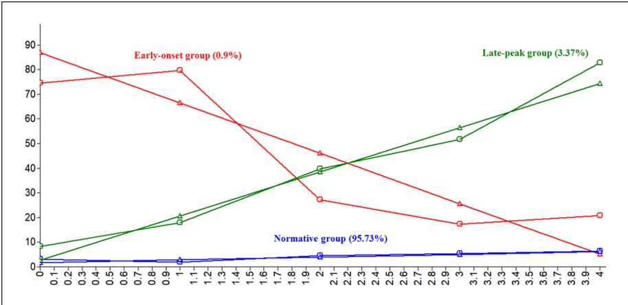

**1001617** CCJXXX10.1177/10439862211001617Journal of Contemporary Criminal Justice**Cho et al.**

*research-article*2021

#### *Article*

**Developmental Trajectories of Delinquent Peer Association Among Korean Adolescents: A Latent Class Growth Analysis Approach to Assessing Peer Selection and Socialization Effects on Online and Offline Crimes**

https://doi.org/10.1177/10439862211001617 Journal of Contemporary Criminal Justice 2021, Vol. 37(3) 379–405 © The Author(s) 2021 Article reuse guidelines: [sagepub.com/journals-permissions](https://us.sagepub.com/en-us/journals-permissions) DOI: 10.1177/10439862211001617 [journals.sagepub.com/home/ccj](https://journals.sagepub.com/home/ccj)

# **Sujung Cho1, Brett Lacey1, and Youngsik Kim2**

#### **Abstract**

The relationship between peers and delinquency has been taken as evidence for selection and socialization effects in the etiology of adolescents. Accumulating evidence suggests that both effects are involved. This study examines whether adolescents' aggressive propensities and behaviors predict their peers (selection) and whether peers' propensities and behaviors predict adolescents' behaviors (socialization). The latent class growth analysis approach revealed three distinct subgroups: an earlyonset group (0.9%); a late-peak group (3.37%); and a normative group (95.73%). Both selection and socialization effects were supported using a longitudinal Korean adolescent self-report. The results showed that adolescents with less self-control who are online more frequently and exhibit higher levels of traditional bullying and delinquency were more likely to be members of both the early-onset and late-peak groups compared with the normative group. Also, the aggressive behaviors fully mediated the link between aggressive propensities and delinquent peer associations. Furthermore, adolescents in the late-peak group (but not those in the early-onset group) were associated with a greater likelihood of online and offline delinquency,

1 Southern Illinois University Carbondale, IL, USA 2 Seowon University, Chungju-si, Republic of Korea

#### **Corresponding Author:**

Sujung Cho, Department of Criminology and Criminal Justice, Southern Illinois University Carbondale, 1000 Faner Drive Faner Hall, Mail Code 4504, Carbondale, IL 62901, USA. Email: [sujung.cho@siu.edu](mailto:sujung.cho@siu.edu)

but cyberbullying and traditional bullying in late adolescence levels were high in both groups' members.

#### **Keywords**

peer selection, peer socialization, latent class growth analysis, delinquent peer association, online and offline bullying and delinquency

#### **Introduction**

With recent advancements of technology, new forms of criminal and delinquent acts have emerged, including the now widespread phenomenon of cyberbullying. Cyberbullying can be defined as "using information and communication technologies to repeatedly harm, harass, hurt, and/or embarrass a target" (Peter & Petermann, 2018). Similar to other types of offending, it is hypothesized that those who participate and are victimized in cyberbullying have peers with similar behaviors. Previous studies have shown that children and adolescents form and maintain associations with peers who demonstrate like behaviors including bullying (Espelage et al., 2007). The homophily hypothesis has been tested using multiple frameworks including the selection hypothesis or population heterogeneity (Espelage et al., 2007; Turanovic & Young, 2016), the socialization model or state dependence (Birkett & Espelage, 2015; Poteat & Espelage, 2007), and an integration of both models called the interaction model (Wong et al., 2013) . Research aiming to determine whether selection or socialization is more related to delinquency in gangs showed support for both models (Wong et al., 2013). Other empirical studies have found support of theoretical propositions for state dependence and population heterogeneity, as well as an interaction model integrating both (Cho & Wooldredge, 2016; Ttofi et al., 2012; Young & Rees, 2013).

Despite the mounting volume of research on traditional forms of bullying (i.e., physical, verbal, social), cyberbullying research maintains a narrow scope with little empirical efforts having been made to identify patterns of cyberbullying developmental trajectories (Olweus & Limber, 2018). Also, the growing tendency in developmental criminology is to subdivide the offender population and examine distinct causal influences at different stages of the criminal career (Sampson & Laub, 2017). Little is known about person-centered approaches that abstain from predetermined cutoff points and instead depend upon observed response patterns. For these reasons, this study investigates distinct patterns of group-based trajectories of cyberbullying using a 6-year longitudinal panel dataset of Korean adolescents between the ages of 14 and 19. It also uses a person-centered approach better suited to identify particular response patterns compared with variable-based approaches such as mean-based cutoff values. Thus, it is hypothesized that the person-centered approach is less prone to distortion and misclassification as this approach relies upon response patterns of observed variables to assign to unobserved classes or groups (Ryoo et al., 2015). In other words, causal factors might vary across the life course: Certain factors in childhood influence persistent offenders in adulthood, whereas other factors explain adolescent-limited offenders called age-specific offenders.

Despite the group-based trajectories of crime, the fundamental argument of those studies (Laub & Sampson, 1993; Moffitt, 1993) is that developmental trajectories of crime (persistence and desistence from offending) can be understood within the same theoretical framework (Sampson & Laub, 2005). The purpose of the present study is to identify developmentally similar classes of individuals in terms of delinquent peer association. In addition, this study examines correlates and consequences within socialization and selection models, conditional on the latent trajectory class membership. This study seeks to test the impact of individual traits (e.g., self-control) and opportunity factors (e.g., online and offline delinquency) as the same or similar aggressive propensities and behaviors between Korean adolescents and their peers beginning at the age of 15 on delinquent peer association trajectory class membership in adolescence. Also, it examines how the odds of engaging in bullying and delinquency in early adulthood differ among class membership. Furthermore, the study employs a latent class growth analysis approach, using a 6-year longitudinal panel data drawn from a national survey of Korean adolescents between the ages of 14 and 19. It is expected that delinquent peer association may be underway, but not stable in adolescence, and that correlates and consequences of delinquent peer association trajectories differ throughout populations. To summarize, this study seeks to apply an alternative analytic technique to address several empirical and methodological limitations of previous studies that use a single composite variable of delinquent peer association at a single point in time.

# **Theoretical Framework**

# *Peer Selection, Socialization, and Social Interaction Models*

Developmental and life course theories examine the etiology of behaviors and their change over time (Farrington, 2003). Three theoretical models are used to explain patterns of association with delinquent peers during childhood and adolescence: (a) selection (population heterogeneity) model, (b) socialization (state dependence) model, and (c) social interaction model (Thornberry, 1987).

*Selection model.* The peer selection model refers to a process of selecting peers who exhibit the same or similar propensities of aggression, including those who engage in bullying (Cho et al., 2017; Espelage et al., 2003). Population heterogeneity refers to the differences in propensity to engage in criminal behavior (Nagin & Paternoster, 1991). Existing empirical research further supports that a relationship exists with negative traits leading to self-selection to engage in risky situations or offending. Nagin and Land (1993) found that preadolescent individuals who possessed negative traits in other areas were more likely to have later issues. Population heterogeneity was further supported in studies showing that youth who participated in antisocial activities were more likely to participate later in drug use (Hamil-Luker et al., 2004). A 2016 metanalysis on cyberbullying victimization and perpetration showed that aggressive cognition, antisocial personalities, and negative peer influences all produced an increased likelihood of cyberbullying victimization and perpetration (Guo, 2016).

Research exists that criminal propensity drawn from population heterogeneity (e.g., low self-control) predicts peer delinquency and delinquent peer associations that are generally interpreted as selection effects, called homophily (Cho et al., 2017). Homophily refers to similarities between individuals and their associates (Young & Rees, 2013). Homophily is often referred to as a selective mixing or the "selection hypothesis" (Hogue & Steinberg, 1995; Kandel, 1978). Homophily most often occurs when relationships are formed between people who share perceived similarities in character traits (Young & Rees, 2013). Makarios et al. (2017) found that youth exhibiting the most population heterogeneity were also the most likely to experience the negative effects of delinquency.

*Socialization model.* Peer delinquency has also been associated with an adolescent's own delinquency, known as socialization effects. Peer socialization refers to a process in which peers who influence one another become more similar over time. Some theorists suggest that people have criminal trajectories, and there might be turning points in their life course (Elder, 1986; Laub & Sampson, 1993). This view takes a difference stance toward the idea of stable traits over the life course and suggests that change in propensity is possible through social processes such as friendship, marriage, or employment (Laub & Sampson, 1993). In contrast to population heterogeneity perspectives, state dependence perspectives assume that the predispositions of individuals might not be as significant as previously thought (Nagin & Paternoster, 2000). According to these perspectives, social processes account for the differences in offending behavior (Bushway et al., 1999; Nagin & Paternoster, 1991). The social context in which people live explains the onset or change in the levels of offending.

Studies examining state dependence have shown that social processes may influence cyberbullying victimization and perpetration (Festl et al., 2013; Wachs et al., 2017). Adolescents who believed they would be punished for their actions by a parent or other authority figure are less likely to participate in bullying and cyberbullying (Hinduja & Patchin, 2013). Dehue et al. (2012) found that adolescents were less likely to participate in cyberbullying and bullying when authoritative parents or responsive victims were present. State dependence was further supported showing that individuals who would face negative social consequences or be labeled bullies were less likely to continue bullying behaviors. However, the increased likelihood of maintaining anonymity while online makes it more likely for individuals to cyberbully (Mishna et al., 2009). In alignment with state dependence, maintaining anonymity while online increased likelihood of continuing cyberbullying.

Previous empirical findings indicated that state dependence may not be the primary determinant of behavioral stability, but could explain behavioral change over time (Barnes & Boutwell, 2012). In support of the state dependence perspective, results indicated that individuals in different environments showed significantly different behavioral changes across four waves (Barnes & Boutwell, 2012). Additional works have shown that state dependence can lead to changes in offending behaviors as the same input characteristics have shown to lead to different offending behaviors (Giordano et al., 2007; Hay & Forrest, 2008).

Finally, the two processes may not be mutually exclusive and could play a role at different points of the process, which is referred to as social interaction model (Clay-Warner et al., 2016; Nagin & Paternoster, 2000). Thornberry's (1987) interactional theory supports both state dependence and population heterogeneity. Interactional theory introduced the idea of reciprocal effects of social interactions. According to Thornberry (1987), individual behavior is shaped by social interaction with various groups such as family and peers.

Other research tested the validity of both perspectives for explaining longitudinal variation in criminal offending (Agnew et al., 2002; Nagin & Farrington, 1992; Ousey & Wilcox, 2007; Sampson & Laub, 2005; Wright et al., 2001). Collectively, these studies support state dependence, population heterogeneity, and their integration. In the state dependence perspective, initial crime may lead to subsequent acts of criminality (Nagin & Paternoster, 2000). When an individual commits a crime without apprehension, they are more likely to commit further crimes as the constraints to commit crime are lessened and incentives are strengthened as they were not sanctioned or punished (Nagin & Paternoster, 2000).

The population heterogeneity perspective states that offending among individuals differs according to the presence of antisocial characteristics (Ousey et al., 2011). It is established early in life and remains stable (Nagin & Paternoster, 2000). A key disparity is that state dependence can be influenced by later life events while population heterogeneity attributes changes in the commission of crime to the antisocial characteristic effecting other areas of life that cause negative life events (Nagin & Paternoster, 2000). Nagin and Paternoster (2000) argued that a mixture of both generate criminal behavior and desistance. State dependence would argue that bullying may have a causal effect on later violence. Conversely, population heterogeneity would indicate that bullying was related to later violence due to latent antisocial tendencies (Ttofi et al., 2012).

Research has determined that the integration of population heterogeneity and state dependence is positively and significantly related to a later perpetration of cyberbullying (Cho & Galehan, 2020). Their findings proposed that individual traits may indicate later cyber behaviors such as bullying perpetration. Prior research on traditional bullying has shown that theoretical assertions of both population heterogeneity and state dependence are related to bullying victimization (Cho & Wooldredge, 2016). Their research provided evidence supporting the integration of both perspectives that antisocial characteristics and lifestyle changes were significantly related to bullying victimization. Longitudinal analyses found that state dependence and population heterogeneity work together in contributing to the risk of repeated bullying victimization (Clay-Warner et al., 2016). Findings further indicated that state dependence levels vary among individuals with differing levels of risk of victimization.

### *Cultural Context of Cyberbullying Among South Korean Youth*

Research examining cyberbullying in the cultural context of South Korean youth has yet to be conducted in a theoretical framework directly addressing all components of the selection, socialization, and interaction processes. One recent South Korean study compared the developmental pathways and motives of cyberbullying in comparison to traditional bullying (Kim et al., 2017). Results showed that cyberbullying and traditional bullying have similar developmental trajectories and also show strong associations with types of bullying and peer-related predictors.

A 2018 metanalysis examining 38 studies on cyberbullying in South Korea determined multiple important relationships between peer-related correlates and cyberbullying (Lee et al., 2018). From a perpetration perspective, peer-related stress, number of delinquent peers, and the severity of violence from prior victimization were all factors related to peer delinquency. Findings indicated that those with higher levels of peer-related stress and more delinquent peers were more likely to cyberbully (Lee et al., 2018). It was also determined that those who associated with delinquent peers were more likely to experience cyberbullying victimization (Nam & Chang, 2011).

Several studies have examined the relationship between population heterogeneity and both traditional and cyberbullying (Kim et al., 2017; Yang et al., 2006, 2013). Yang et al. (2006) found that adolescents with anxiety and low self-esteem were more likely to bully. Research indicated that low self-esteem, low body satisfaction, anxiety, depression, and maladjustment increased the likelihood of being bullied or cyberbullied (Yang et al., 2006, 2013). An examination of cyberbullying and regular bullying using a Korean sample supported the selection process by indicating that adolescents with low self-control were more likely to participate in cyberbullying (Kim et al., 2017).

Research related to the relationship between state dependence and bullying in South Korea found a negative relationship between parental supervision and cyberbullying/traditional bullying (Kim et al., 2017) aligning with the state dependence perspective. Conversely, individuals who have participated in prior traditional bullying were more likely to participate in cyberbullying (Kim et al., 2017). The socialization effects of peer victimization and conflict with parents were shown to be related to an increase of cyberbullying perpetration among South Korean adolescents and young adults (Moon et al., 2012). An additional study of South Korean adolescents showed multiple relationships between socialization and bullying perpetration and victimization (Hong et al., 2017). Results indicated that punitive parenting measures were related to an increase in bullying perpetration and social withdrawal affected bullying perpetration via delinquent peer association (Hong et al., 2017).

#### *Developmental Trajectories of Delinquent Peer Association*

Previous works in developmental research have indicated a relationship exists between the development of externalizing behaviors in adolescents who also participate in delinquent peer groups (Agnew, 1991; Elliott et al., 1985). The timing of onset of delinquent peer association in relation to prevalence, the age which individuals began offending, and fluctuations in the frequency of delinquency throughout adolescence all are areas of importance in examining delinquent peer group trajectories (Lacourse et al., 2006; Monahan et al., 2009).

A longitudinal analysis focusing on delinquency in Canadian adolescents examined relationships between the onset of delinquent peer association and committing acts of delinquency (Pepler et al., 2010). Findings indicated that delinquent peer association increased the odds of following the trajectories which indicated the highest levels of delinquency. Additional research is needed to further scrutinize the relationships between the onset of delinquent peer association and the commission of delinquent acts. Other longitudinal analyses showed that as deviant peer association increased, substance abuse also increased (Yoon et al., 2019). Results indicated a decrease in delinquency as the level of deviant peers decreased. As previous studies have indicated, levels of delinquency and antisocial behavior significantly change throughout life (Moffitt, 1993; Sampson & Laub, 1995). For most, adolescence marks the high point of delinquency and delinquent peer association. As such, it is necessary to further examine the impact of delinquent peer association trajectories on delinquency. Previous research has supported state dependence, population heterogeneity, and the interaction model (Cho & Galehan, 2020; Cho & Wooldredge, 2016; Clay-Warner et al., 2016). This study aims to further these findings by examining both the selection and socialization models of delinquent peer associations employing analyses that address limitations in prior research.

# *Present Study*

The purpose of this study is to address empirical and methodological limitations of previous studies by identifying subgroups of Korean adolescents who showed differentiated profiles. Selection and socialization models are employed to explain the observed consistency on correlates and consequences of delinquent peer association trajectories, using a 6-year longitudinal panel data drawn from a national survey of Korean adolescents between the ages of 14 and 19. For the selection model (population heterogeneity), this study examines whether adolescents who are identified as aggressive tend to associate with others with the same or similar aggressive propensities and behaviors. For the socialization model, the study also examines whether association with delinquent peers predisposes adolescents to engage in online and offline bullying and delinquency later. This examination will address the following research hypotheses:

**Hypothesis 1 (H1)**: There would be more than one group, each having a unique pattern of developmental trajectories of delinquent peer association.

**Hypothesis 2 (H2)**: Aggressive propensities (low self-control, social withdrawal, and depression) and behaviors (online lifestyles, cyberbullying perpetration, cyber delinquency, traditional bullying perpetration, and delinquency) at Wave 2 would be independently predictive of class membership of developmental trajectories.

**Hypothesis 3 (H3)**: Aggressive behaviors would *partially* or *fully* mediate the relationship between aggressive propensities and class membership of developmental trajectories.

**Hypothesis 4 (H4)**: The probability of being involved in online and offline bullying and delinquency would vary on class membership of developmental trajectories.

# **Method**

#### *Data and Sample*

Data for this study were analyzed from a 6-year follow-up study of the Korean Children and Youth Panel Survey (KCYPS; 2010–2015), compiled by the National Youth Policy Institute (NYPI). The KCYPS sample was drawn using a multistage stratified cluster sampling design in which students were selected from 78 middle schools in 16 administrative districts (including Seoul metropolitan city and 14 metropolitan cities and provinces). Those schools were proportionately sampled to their sizes based on the average number of seventh-grade students per class for the first wave (2010). Students and their parents or guardians were sampled proportionately to the average number of students enrolled in selected schools. A face-to-face survey was administered to students in the schools, whereas a telephone survey was given to their parents or guardians. For the second wave (2011), a personal interview survey was conducted after locating each student who participated during the first survey period in 2010. A telephone interview survey was conducted for their parents or guardians. The procedures of data collection from the third wave to the sixth wave were the same as those for the second wave.

In total, 2,351 students were selected from 2010 in the first wave, and of the participants, 2,280, 2,259, 2,108, 2,091, and 2,058, responded to the survey from 2011 through 2015, respectively. The attrition rate over time was 12%, meaning that approximately 12% of the original sample dropped out of the study at some point during the 7-year period. Maximum likelihood estimation with robust standard errors (MLR) was used to address the attrition rate (missing data) within the sample across time, assuming that data are missing-at-random. All of the data in the sample were included to estimate model parameters, and variables were allowed to be included in the analyses to be related to patterns of missing data by using a numerical iteration algorithm option (e.g., INTEGRATION = MONTECARLO) in Mplus (McKnight et al., 2007). All variables examined for the analyses are described in Table 1.

# *Measures*

*Distal outcome variables.* Two different types of online (cyberbullying perpetration, cyber delinquency) and offline crimes (traditional bullying perpetration and delinquency) were assessed during the sixth survey in 2015. Respondents were asked during the last survey if they had engaged in each of the various online and offline acts (see Table 1) since the age of 19. Each item was coded 1 if the event occurred at least

|                                                                                                                               |       | Wave 2 | Wave 3       | Wave 4       | Wave 5       | Wave 6       | Wave 7        |
|-------------------------------------------------------------------------------------------------------------------------------|-------|--------|--------------|--------------|--------------|--------------|---------------|
| Variable                                                                                                                      | Range | M (SD) | M (SD)       | M (SD)       | M (SD)       | M (SD)       | M (SD)        |
| Distal outcome variable                                                                                                       |       |        |              |              |              |              |               |
| Cyberbullying perpetration w6                                                                                                 |       |        |              |              |              |              |               |
| Have you ever intentionally circulated false information on the Internet message boards about others during the last year? | 2–30  |        |              |              |              |              | 18.0 (14.24)  |
| Have you ever cursed/insulted other people through chats/message boards during the last year?                                 | 1–300 |        |              |              |              |              | 26.6 (54.3)   |
| Cyber delinquency w6                                                                                                          |       |        |              |              |              |              |               |
| Using illegal software downloaded from the Internet during the last year during the last year                                 | 1–100 |        |              |              |              |              | 7.99 (14.2)   |
| Using unauthorized internet ID or resident registration number of other people during the last year                           | 1–25  |        |              |              |              |              | 6.14 (8.95)   |
| Disguising sex or age at internet chatting during the last year                                                               | 1–20  |        |              |              |              |              | 5.76 (5.99)   |
| Hacking computers or websites of other people during the last year                                                            | 0–1   |        |              |              |              |              | 1.00 (0.000)  |
| Traditional bullying perpetration w6                                                                                          |       |        |              |              |              |              |               |
| Severely teasing or bantering other people                                                                                    |       |        |              |              |              |              | 12.97 (24.69) |
| Collectively bullying                                                                                                         |       |        |              |              |              |              | 1.00 (0.00)   |
| Severely beating other people                                                                                                 |       |        |              |              |              |              | 2.73 (3.35)   |
| Threatening other people                                                                                                      |       |        |              |              |              |              | 1.60 (0.89)   |
| Delinquency w6                                                                                                                |       |        |              |              |              |              |               |
| Smoking                                                                                                                       | sns   |        |              |              |              |              | 18.07 (59.01) |
| Drinking                                                                                                                      |       |        |              |              |              |              | 8.58 (5.94)   |
| Having unexcused absence                                                                                                      |       |        |              |              |              |              | 10.86 (22.16) |
| Running away                                                                                                                  |       |        |              |              |              |              | 4.64 (4.07)   |
| Fighting                                                                                                                      |       |        |              |              |              |              | 5.00 (0.00)   |
| Robbing others' items                                                                                                         |       |        |              |              |              |              |               |
| Stealing others' items                                                                                                        |       |        |              |              |              |              | 3.00 (2.83)   |
| Conditioning variable                                                                                                         |       |        |              |              |              |              |               |
| Delinquent peer associations (total n)                                                                                        |       |        |              |              |              |              |               |
| Smoking                                                                                                                       | 1–50  |        | 1.54 (5.414) | 2.63 (6.487) | 2.98 (7.299) | 3.71 (10.03) | 5.56 (10.64)  |
| Drinking                                                                                                                      |       |        | 0.75 (8.308) | 2.19 (5.525) | 2.82 (6.123) | 4.29 (10.16) | 13.23 (20.7)  |
| Having unexcused absence                                                                                                      |       |        | 0.32 (1.201) | 0.39 (1.271) | 0.50 (3.421) | 0.66 (3.15)  |               |
| Running away                                                                                                                  |       |        | 0.22 (0.908) | 0.21 (0.897) | 0.18 (1.366) | 0.09 (0.541) |               |
| Severely teasing or bantering other friends                                                                                   |       |        | 0.27 (1.511) | 0.26 (1.648) | 0.22 (2.087) | 0.14 (1.211) | 0.04 (0.396)  |
| Collectively bullying                                                                                                         |       |        | 0.16 (1.011) | 0.13 (1.027) | 0.15 (1.989) | 0.06 (0.955) | 0.01 (0.175)  |
| Fighting                                                                                                                      |       |        | 0.06 (0.644) | 0.04 (0.911) | 0.05 (0.653) | 0.01 (0.206) | 0.02 (0.485)  |
|                                                                                                                               |       |        |              |              |              |              | (continued)   |

**Table 1.**Description of the South Korean Youth Sample (*N*= 2,351).

|                                                                                  |       | Wave 2       | Wave 3       | Wave 4       | Wave 5       | Wave 6       | Wave 7       |
|----------------------------------------------------------------------------------|-------|--------------|--------------|--------------|--------------|--------------|--------------|
| Variable                                                                         | Range | M (SD)       | M (SD)       | M (SD)       | M (SD)       | M (SD)       | M (SD)       |
| Severely beating other people                                                    |       |              | 0.12 (1.058) | 0.06 (0.474) | 0.06 (0.508) | 0.03 (0.357) | 0.01 (0.136) |
| Threatening other friends                                                        |       |              | 0.09 (1.025) | 0.02 (0.178) | 0.03 (0.367) | 0.02 (0.315) | 0.00 (0.144) |
| Taking or breaking someone's things                                              |       |              | 0.11 (1.012) | 0.03 (0.336) | 2.98 (0.332) | 0.02 (0.272) | 0.00 (0.118) |
| Stealing something                                                               |       |              | 0.07 (0.755) | 0.04 (0.311) | 2.82 (0.670) | 0.02 (0.14)  | 0.01 (0.245) |
| Low self-control w2                                                              |       |              |              |              |              |              |              |
| I may hit other people when I feel annoyed                                       | 1–4   | 2.26 (0.780) |              |              |              |              |              |
| I fight more frequently than others do                                           |       | 2.19 (0.799) |              |              |              |              |              |
| I am often seized by an impulse to throw an object whenever I get angry          |       | 2.17 (0.790) |              |              |              |              |              |
| Sometimes I can't suppress an impulse to hit other people                        |       | 2.14 (0.764) |              |              |              |              |              |
| I easily get angry over little things when people stand me up                    |       | 2.14 (0.847) |              |              |              |              |              |
| I lose my temper whenever I get angry                                            |       | 1.87 (0.813) |              |              |              |              |              |
| Social withdrawal w2                                                             |       |              |              |              |              |              |              |
| I feel embarrassed on many occasions                                             | 1–4   | 2.33 (0.914) |              |              |              |              |              |
| I have difficulty expressing myself in front of others                           |       | 2.14 (0.881) |              |              |              |              |              |
| I feel shy                                                                       |       | 2.18 (0.896) |              |              |              |              |              |
| I don't like to assert myself in front of people                                 |       | 2.44 (0.862) |              |              |              |              |              |
| Depression w2                                                                    |       |              |              |              |              |              |              |
| I am a worm and disheartened                                                     | 1–4   | 2.00 (0.784) |              |              |              |              |              |
| Sometimes I feel extremely sad and gloomy with no apparent reason                |       | 1.94 (0.828) |              |              |              |              |              |
| I have many worries                                                              |       | 2.27 (0.924) |              |              |              |              |              |
| Sometimes I feel suicidal with no apparent reason                                |       | 1.69 (0.792) |              |              |              |              |              |
| Sometimes I cry                                                                  |       | 1.96 (0.893) |              |              |              |              |              |
| I believe that everything will be due to me, even when I get involved in trouble |       | 2.05 (0.850) |              |              |              |              |              |
| Sometimes I feel extremely lonely with no apparent reason                        |       | 1.92 (0.899) |              |              |              |              |              |
| I am not interested in anything                                                  |       | 1.75 (0.755) |              |              |              |              |              |
| I get stressed by dissatisfaction over my future                                 |       | 1.88 (0.847) |              |              |              |              |              |
| I get stressed by hard work                                                      |       | 1.84 (0.815) |              |              |              |              |              |
| Online lifestyles by computer w2 (degree of usage)                               |       |              |              |              |              |              |              |
| Chatting online or using online messenger service                                | 1–4   | 2.76 (1.123) |              |              |              |              |              |
| Using e-mail                                                                     |       | 2.14 (0.922) |              |              |              |              |              |
| Acting sns                                                                       |       | 2.48 (1.138) |              |              |              |              |              |
|                                                                                  |       |              |              |              |              |              |              |

*(continued)*

**Table 1. (continued)**

388

|                                                                                                                               |       | Wave 2       | Wave 3 | Wave 4 | Wave 5 | Wave 6 | Wave 7 |
|-------------------------------------------------------------------------------------------------------------------------------|-------|--------------|--------|--------|--------|--------|--------|
| Variable                                                                                                                      | Range | M (SD)       | M (SD) | M (SD) | M (SD) | M (SD) | M (SD) |
| Buying goods or bartering online                                                                                              |       | 1.91 (1.001) |        |        |        |        |        |
| Using an online bulletin board                                                                                                |       | 2.50 (1.047) |        |        |        |        |        |
| Visiting adult sites                                                                                                          |       | 1.36 (0.704) |        |        |        |        |        |
| Delinquency w2                                                                                                                |       |              |        |        |        |        |        |
| Smoking                                                                                                                       | 1–300 | 12.49 (32.9) |        |        |        |        |        |
| Drinking                                                                                                                      | 1–20  | 2.66 (2.933) |        |        |        |        |        |
| Having unexcused absence                                                                                                      | 1–20  | 3.11 (3.962) |        |        |        |        |        |
| Running away                                                                                                                  | 1–15  | 3.47 (3.197) |        |        |        |        |        |
| Fighting                                                                                                                      | 1–3   | 1.59 (.712)  |        |        |        |        |        |
| Robbing others' items                                                                                                         | 1–10  | 3.17 (2.915) |        |        |        |        |        |
| Stealing others' items                                                                                                        | 1–5   | 2.00 (1.363) |        |        |        |        |        |
| Traditional bullying perpetration w2                                                                                          |       |              |        |        |        |        |        |
| Severely teasing or bantering other people                                                                                    | 0–1   | 0.03 (0.242) |        |        |        |        |        |
| Collectively bullying                                                                                                         |       | 0.03 (0.174) |        |        |        |        |        |
| Severely beating other people                                                                                                 |       | 0.01 (0.173) |        |        |        |        |        |
| Threatening other people                                                                                                      |       | 0.03 (0.100) |        |        |        |        |        |
| Cyber deviance w2                                                                                                             |       |              |        |        |        |        |        |
| Using illegal software downloaded from the Internet                                                                           | 0–1   | 0.30 (0.460) |        |        |        |        |        |
| Using unauthorized internet ID or resident registration number of other people                                                |       | 0.06 (0.245) |        |        |        |        |        |
| Disguising sex or age at internet chatting                                                                                    |       | 0.15 (0.357) |        |        |        |        |        |
| Hacking computers or websites of other                                                                                        |       | 0.02 (0.125) |        |        |        |        |        |
| Cyberbullying perpetration w2                                                                                                 |       |              |        |        |        |        |        |
| Have you ever intentionally circulated false information on the Internet message boards about others during the last year? | 1–4   | 3.46 (6.43)  |        |        |        |        |        |
| Have you ever cursed/insulted other people through chats/message boards during the last year?                                 | 1–4   | 3.04 (0.821) |        |        |        |        |        |
| Control variables                                                                                                             |       |              |        |        |        |        |        |
| Sex (males vs. females)                                                                                                       |       | 2.0 (1.0)    |        |        |        |        |        |
| School location (Seoul = 1)                                                                                                   | 0–1   | 0.10 (0.296) |        |        |        |        |        |
|                                                                                                                               |       |              |        |        |        |        |        |

# **Table 1. (continued)**

once, and 0 if there was no indication. All indicators were summed and dichotomized to signify whether the respondents had engaged in any of the types of online and offline delinquent acts.

*Intervening variable. Delinquent peer association* was measured as a part of the five annual assessments from age 15 through age 19 (administered in 2011 and each year through 2015) to assess developmental trajectories. At each follow-up, respondents were asked how many of their friends had engaged in each type of 11 acts in the last year (See Table 1). Those items were summed to signify the variety of delinquency in a peer group (the peers' total delinquency scores). A higher value on this variable reflects more behaviors of peer delinquency.

*Background variables.* The study assessed eight background variables, including three aggression propensities (low self-control, social withdrawal, depression) and five aggressive behaviors (online lifestyles, cyberbullying perpetration, cyber delinquency, traditional bullying perpetration, and delinquency). Table 1 presents all items of each latent variable on five-point Likert-type scales, ranging from 1 = very untrue to 5 = very true. Reflecting aggressive propensities, *low self-control* was assessed with six items (Arneklev et al., 1993) and administered in 2011 (during the second survey). With the satisfactory internal reliability of those items (α = . ) 81 , a confirmatory factor analysis (CFA) was conducted to create a single construct with a high value on this variable reflecting less self-control. *Depression* was assessed with 10 items (Oh et al., 1998) and administered in 2011. A higher value on the latent variable, created by a CFA (α = .90), reflected a higher level of depression. *Social withdrawal* was assessed using five items (Hong et al., 2017) and was administered in 2011. CFA was conducted to create a single latent variable (α = .85), a high value on this variable reflected a higher socially withdrawn behavior.

Reflecting aggressive behaviors, *online lifestyles by computer* were assessed using six items in 2011 (Navarro & Jasinski, 2012; Ngo & Paternoster, 2011; see Table 2). Response options for all of the items of this variable were assessed on a 5-point Likert-type scale, ranging from 1 (*never*) through 5 (*often*). With the internal consistency for online lifestyles by a computer (α = .72) and a smartphone (α = .70), CFA was conducted to create a single variable with a higher value reflecting more frequent engagement in online lifestyles on either a computer or smartphone. Two different types of online (cyberbullying perpetration, cyber delinquency) and offline crimes (Traditional bullying perpetration and delinquency) were assessed in 2011 (during the second survey). All items of these variables were the same as those of the distal outcomes.

Two demographic variables (gender, school location) were included as control variables into each model. Gender was represented by a dummy variable, with 1 reflecting male adolescents. Also, school location was assessed using a dichotomous response (1 = Seoul and 0 = others). Age was excluded in this analysis because the data at each wave had the same graded subjects.

| Variables                                                                                                                                                                                                                                                                                                                                                                                                                | 1 | 2           | 3                     | 4                           | 5                                     | 6                                                | 7                                                            | 8                                                                    | 9                                                                               | 10                                                                                          | 11                                                                                                    | 12                                                                                                              | 13                                                                                                                |
|--------------------------------------------------------------------------------------------------------------------------------------------------------------------------------------------------------------------------------------------------------------------------------------------------------------------------------------------------------------------------------------------------------------------------|---|-------------|-----------------------|-----------------------------|---------------------------------------|--------------------------------------------------|--------------------------------------------------------------|----------------------------------------------------------------------|---------------------------------------------------------------------------------|---------------------------------------------------------------------------------------------|-------------------------------------------------------------------------------------------------------|-----------------------------------------------------------------------------------------------------------------|-------------------------------------------------------------------------------------------------------------------|
| 8. Traditional bullying perpetration w2 mization w2 11. Cyberbullying perpetration w2 1. Cyberbullying perpetration w7 13. School location (Seoul = 1) 9. Traditional bullying victi 10. Cyber-delinquency w2 wal w2 w self-control w2 Online-lifestyles w2 male = 1) 2. Cyber deviance w7 7. Delinquency w2 5. Depression w2 4. Social withdra 12. Gender ( 3. Lo 6. | 1 | .504** 1 | .079** .062** 1 | .292** .020 .041 1 | .458** .529** .026 .021 1 | .164** .138** –.004 –.029 –.011 1 | .096** .072** .171** .087** .084** –.013 1 | .098** .089** .138** .058** .753** .052* .018 1 | .072** .063** .109** .097** .194** .178** .211** .014 1 | .104** .154** .178** .079** .157** .133** .262** .232** .133** 1 | .102** .094** .162** .067** .122** .119** .246** .226** .123** .786** 1 | .083** .078** –.129** –.197** .114** .132** .068** .116** .117** –.040 –.003 1 | –.055* –.046* –.051* –.044* –.045* –.027 –.007 –.009 –.015 .028 –.014 –.020 1 |
|                                                                                                                                                                                                                                                                                                                                                                                                                          |   |             |                       |                             |                                       |                                                  |                                                              |                                                                      |                                                                                 |                                                                                             |                                                                                                       |                                                                                                                 |                                                                                                                   |

**Table 2.** Correlations Among the Study Variables.

\**p* ≤ .05. \*\**p* ≤ .01.

# *Analytic Strategy*

The present study employed latent class growth analysis (LCGA) where the categorical class variable is regressed on background variables (aggressive propensities and behaviors), using a multinomial logistic regression analysis, which consists of simultaneous pairs of logistic regression of the log-odds of membership in each class, contrasted with a chosen reference class. Data analyses proceeded in a series of two stages.

In the first stage, growth curves were estimated for developmental trajectories of delinquent peer associations, captured by allowing for continuous variability of two latent factors: (a) the intercept (the initial level/ average starting point) and (b) the slope (the rate of change). In the second stage, LCGA was employed to identify model heterogeneity in patterns of developmental trajectories of delinquent peer associations within an entire population. The analysis of this stage proceeded in three steps. The number of classes exhibiting distinct patterns of developmental trajectories were determined in the first step. A series of LCGA models was conducted to determine the final optimal model by evaluating multiple model fit indices Akaike information criterion (AIC), Bayesian information criterion (BIC), sample size–adjusted BIC (SABIC), consistent AIC (CAIC), approximate weight of evidence criterion (AWE), Lo-Mendell-Rubin likelihood ratio test (LMR-LRT), and the bootstrapped LRT (BLRT) (see the bottom of Table 4).

In the second step of this stage, after determining each subject's most likely class membership, theoretically relevant background variables were added in the multinomial logistic regression model. Adding variables might provide additional information in class enumeration process, which should cause the continued change of formation and interpretation of latent classes (Li & Hser, 2011; Lubke & Muthén, 2007). For this reason, this study compiled information about classification quality (e.g., the logit values) after determination of the final optimal solution. Then, the information was used in a subsequent model (i.e., the means of each class model were fixed at the logit values) to address biased estimates and biased standard errors for the relationship of class memberships with other background variables. Thus, the class formation and interpretation were not influenced by the subsequent addition of variables. In the last step, the selected model was used to test the hypothesized model about theoretically relevant background variables (selection model) and distal outcomes (socialization model), depending on the latent trajectory class membership.

The present study has five objectives:

- 1. An unconditional latent growth curve model, assuming the homogeneous delinquent peer association trajectory in adolescence.
- 2. An unconditional LCGA identifying a certain number of classes with distinct class-specific trajectories of delinquent peer association.
- 3. A conditional LCGA incorporating background variables (e.g., aggressive propensities and behaviors), examining how the variables are related to

latent trajectory class membership of delinquent peer association throughout adolescence.

- 4. A conditional LCGA examining whether the impact of aggressive propensities on delinquent peer association trajectory is mediated by aggressive behaviors.
- 5. A LCGA incorporating distal outcome variables (online and offline crimes), estimating the probabilities of those variables in early adulthood, conditional on the latent trajectory class membership.

Zero-order relationships between each predictor and other variables are present in Table 2.

# **Results**

# *Developmental Trajectories of Delinquent Peer Associations*

In the first stage, growth factors were estimated to examine developmental trajectories of delinquent peer association over a 5-year period. Estimates from the linear model revealed that adolescents averaged 2.790 (*p* < .001) delinquent peer association at the initial level, while the average increase in delinquent peer association across five waves was 1.401 (*p* < .001). In addition, the significant variances of both growth factors indicated that inter-individual differences in the developmental trajectories varied at different rates and in different directions, representing sample heterogeneity of the trajectories (*b* = 60.321; *b* = 12.779 at *p* < .001, respectively).

# *Group-Based Trajectories of Delinquent Peer Associations*

In the second stage, with the analysis for the optimal solution, multiple model fit indices were first evaluated for subsequent models in which the variances of the growth factors within a class are not allowed to vary (no within-class heterogeneity; see Table 3). Regarding the AIC, the BIC, the SABIC, CAIC, and AWE, lower values of those information criteria (IC) statistics indicate better fit. BIC works best across the range of conditions. The overall best model was the four LCGA class solution with the smallest value of AIC, BIC, the sample size–adjusted BIC, CAIC, and AWE. Also, the LMR-LRT and BLRT were used to compare two nested class models in assessing whether a k-class model (H0) demonstrates a better fit compared with a k+1 class model (H1). Significant *p* values indicate that the k+1 class model should be accepted. However, the nonsignificant *p* values of LMR-LRT and BLRT indicated that H0 model (the 3 class) was not rejected, providing evidence in support for the 3-class model. Three trajectory classes emerged: (a) one with initially high and decreasing pattern of delinquent peer association over time, called an early-onset group (0.9%); (b) one increasing pattern and late-peak, called a late-peak group (3.37%); and (c) one non/ low trajectory pattern, called a normative group (95.73%) that consistently associated

| Table 3.     |                                     |       |          | Model Fit Indexes for Latent Class Gro                                                                          |          | wth Analysis and Gro |          |         | w Mixture Model (n | = 2272).                                                                                                                                                                                                                                      |                                |        |          |                  |         |
|--------------|-------------------------------------|-------|----------|-----------------------------------------------------------------------------------------------------------------|----------|----------------------|----------|---------|--------------------|-----------------------------------------------------------------------------------------------------------------------------------------------------------------------------------------------------------------------------------------------|--------------------------------|--------|----------|------------------|---------|
|              |                                     |       |          |                                                                                                                 |          |                      |          |         |                    |                                                                                                                                                                                                                                               | H0: K classes; H1: K+1 classes |        |          |                  |         |
| Model (K) | LL                                  | N-par | AIC      | BIC                                                                                                             | SABIC    | CAIC                 | AWE      | LRTS    | Adj LMR p value | Bootstrapped p value                                                                                                                                                                                                                       | BF (K, K+1)                 | cmP(K) | SIC      | (SIC-max) Exp | Entropy |
|              | Latent class growth analysis (LCGA) |       |          |                                                                                                                 |          |                      |          |         |                    |                                                                                                                                                                                                                                               |                                |        |          |                  |         |
| 1-class      | –43525.051                          | 7     | 87064.10 | 87104.23                                                                                                        | 87081.99 | 8266.30              | 8334.43  | 2181.01 | <.001              | <.001                                                                                                                                                                                                                                         | 0.000                          | 0.000  | –18061.2 | 0.965            | 0.988   |
| 2-class      | –42387.532                          | 10    | 84795.06 | 84852.38                                                                                                        | 84820.61 | 84862.38             | 84959.70 | 1238.05 | <.001              | <.001                                                                                                                                                                                                                                         | 0.000                          | 1.066  | –17211.4 | 0.967            | 0.988   |
| 3-class      | –41741.821                          | 13    | 83509.64 | 83584.16                                                                                                        | 83542.85 | 83597.16             | 83723.67 | 964.28  | 0.244              | 0.049                                                                                                                                                                                                                                         | 0.000                          | 1.069  | –16747   | 0.9              | 0.989   |
| 4-class      | –41238.897                          | 16    | 82509.80 | 82601.50                                                                                                        | 82550.67 | 82617.50             | 82773.22 | 11.74   | 0.6955             | 0.6667                                                                                                                                                                                                                                        | 0.000                          | 0.994  | –16564.8 | 0.905            | 0.988   |
|              | Growth mixture model (GMM)          |       |          |                                                                                                                 |          |                      |          |         |                    |                                                                                                                                                                                                                                               |                                |        |          |                  |         |
| 1-class      | –42876.795                          | 10    | 85773.59 | 85830.91                                                                                                        | 85799.14 | 85840.91             | 85938.23 | na      | na                 | na                                                                                                                                                                                                                                            | na                             | na     | na       | na               | na      |
|              |                                     |       |          |                                                                                                                 |          |                      |          |         |                    | Note. LL = model maximum log likelihood value (the value shown in bold indicates a model with the smallest LL value that perfectly fits the data); N-par = number of free                                                                     |                                |        |          |                  |         |
|              |                                     |       |          |                                                                                                                 |          |                      |          |         |                    | parameters estimated in the model; AIC = the Akaike information criterion (the value shown in bold indicates the model with the smallest value); BIC = the Bayesian information                                                               |                                |        |          |                  |         |
|              |                                     |       |          | smallest value); CAIC = consistent AIC (the value shown in bold indicates the model with the smallest value); A |          |                      |          |         |                    | WE = approximate weight of evidence criterion (the value shown criterion (the value shown in bold indicates the model with the smallest value); SABIC = the sample size–adjusted BIC (the value shown in bold indicates the model with the |                                |        |          |                  |         |
|              |                                     |       |          |                                                                                                                 |          |                      |          |         |                    | in bold indicates the model with the smallest value); LRTS = likelihood ratio test statistics comparing a current model (k class) to a model with one more latent class (k+1 class);                                                          |                                |        |          |                  |         |
|              |                                     |       |          |                                                                                                                 |          |                      |          |         |                    | Adj LMR p value = the adjusted Lo-Mendell-Rubin likelihood ratio test p value (the value shown in bold represents the nonsignificant p value, indicating the current model with                                                               |                                |        |          |                  |         |
|              |                                     |       |          |                                                                                                                 |          |                      |          |         |                    | the smaller number of classes is not rejected); Bootstrapped p value = parametric bootstrapped p value for the LRTS; BF = Bayes factor comparing the current model (k class) to                                                               |                                |        |          |                  |         |

*Note.* LL = model maximum log likelihood value (the value shown in bold indicates a model with the smallest LL value that perfectly fits the data); N-par = number of free parameters estimated in the model; AIC = the Akaike information criterion (the value shown in bold indicates the model with the smallest value); BIC = the Bayesian information criterion (the value shown in bold indicates the model with the smallest value); SABIC = the sample size–adjusted BIC (the value shown in bold indicates the model with the smallest value); CAIC = consistent AIC (the value shown in bold indicates the model with the smallest value); AWE = approximate weight of evidence criterion (the value shown in bold indicates the model with the smallest value); LRTS = likelihood ratio test statistics comparing a current model (k class) to a model with one more latent class (k+1 class); Adj LMR *p* value = the adjusted Lo-Mendell-Rubin likelihood ratio test *p* value (the value shown in bold represents the nonsignificant *p* value, indicating the current model with the smaller number of classes is not rejected); Bootstrapped *p* value = parametric bootstrapped *p* value for the LRTS; BF = Bayes factor comparing the current model (k class) to a model with one more latent class (k+1 class) (the value shown in bold indicates a model with the smallest number of classes that is favored over a model with one more latent class); cmP(K) = the approximate correct model probability compared with all models (the value shown in bold indicates any models with cmP(K) > .10, showing strong evidence for the correct model. LCGA = latent class growth analysis; GMM = growth mixture model, where variances and covariances are freed to be estimated for all classes (class-varying variances and covariances).

**Figure 1.** Developmental trajectories of peer delinquency across five time point period in unconditional latent class growth analysis.

with nondelinquent peers in adolescence. Figure 1 displays three different patterns of developmental trajectories of peer delinquency across five time points.

#### *Impacts of Aggressive Propensities and Behaviors in the Selection Model*

To examine the impacts of background variables at W2 on trajectory class membership of delinquent peer association, aggressive propensities variables (low self-control, social withdrawal, depression) were added into Model 1 in Table 4. The odds of belonging to the early-onset and late-peak groups compared with the normative group were significantly higher for those with low self-control in early adolescence (*b* = 1.921 at *p* < .001 for the early-onset group; *b* = 0.878 at *p* < .01 for the late-peak group). Males were more likely to be members of both groups, compared with the normative group (*b* = 1.997 at *p* < .01 for the early-onset group; *b* = 2.594 at *p* < .001 for the late-peak group).

Aggressive behavior variables (online lifestyles, cyberbullying perpetration, cyber delinquency, traditional bullying perpetration, delinquency) were added in Model 2 to their direct effect on class membership and mediating role in predicting the relationships between aggressive propensities and class membership. The odds of belonging to the late-peak group compared with the reference group were higher for adolescents who more frequently engaged in online lifestyles on either a computer or smartphone (*b* = 0.136 at *p* < .01) and who committed traditional bullying perpetration and delinquency (*b* = 1.209 at *p* < .01; *b* = 0.786 at *p* < .001). The strength of low self-control in the early-onset and late-peak groups was rendered nonsignificant after controlling for those aggressive behavior variables compared with the normative group.

| Coefficients for the Regression of Latent Trajectory Class Me Table 4.                            |                                           |                        | mbership on Ti                                           |       |                                           |                        | me-Invariant Predictors (Mediation Analysis).            |       |
|------------------------------------------------------------------------------------------------------|-------------------------------------------|------------------------|----------------------------------------------------------|-------|-------------------------------------------|------------------------|----------------------------------------------------------|-------|
|                                                                                                      |                                           |                        | Model 1                                                  |       |                                           |                        | Model 2                                                  |       |
|                                                                                                      | Early-onset group group (95.73 (0.9 | %) vs. normative %) | (3.37%) vs. normative Late-peak group group (95.73 | %)    | Early-onset group group (95.73 (0.9 | %) vs. normative %) | (3.37%) vs. normative Late-peak group group (95.73 | %)    |
| Variables                                                                                            | B                                         | SE                     | B                                                        | SE    | B                                         | SE                     | B                                                        | SE    |
| male = 1) Gender (                                                                                | 1.997**                                   | 0.753                  | 2.594***                                                 | 0.585 | 1.69                                      | 1.058                  | 2.543***                                                 | 0.519 |
| School location (Seoul = 1)                                                                          | 0.367                                     | 0.692                  | –1.342                                                   | 0.755 | 1.295                                     | 1.282                  | –0.921                                                   | 0.757 |
| w self-control w2 Lo                                                                              | 1.921***                                  | 0.497                  | 0.878**                                                  | 0.316 | 1.315                                     | 1.239                  | 0.744                                                    | 0.408 |
| wal w2 Social withdra                                                                             | –0.93                                     | 0.508                  | –0.52                                                    | 0.304 | –0.251                                    | 0.875                  | –0.391                                                   | 0.299 |
| Depression w2                                                                                        | –0.202                                    | 0.686                  | 0.344 –                                               | 0.403 | –0.959                                    | 0.896                  | –0.557                                                   | 0.376 |
| Online lifestyles w2                                                                                 |                                           |                        |                                                          |       | 0.015                                     | 0.172                  | 0.136**                                                  | 0.046 |
| Cyberbullying perpetration w2                                                                        |                                           |                        |                                                          |       | –0.013                                    | 0.59                   | 0.401                                                    | 0.447 |
| Cyber delinquency w2                                                                                 |                                           |                        |                                                          |       | 0.316                                     | 0.266                  | –0.186                                                   | 0.203 |
| Traditional bullying perpetration w2                                                                 |                                           |                        |                                                          |       | –0.755                                    | 1.045                  | 1.209**                                                  | 0.407 |
| Delinquency w2                                                                                       |                                           |                        |                                                          |       | 0.82                                      | 0.534                  | 0.786***                                                 | 0.158 |
| Information criteria                                                                                 |                                           |                        |                                                          |       |                                           |                        |                                                          |       |
| C) Akaike (AI                                                                                     |                                           | 83293.21               |                                                          |       |                                           | 80748.17               |                                                          |       |
| C) Bayesian (BI                                                                                   |                                           | 83425.00               |                                                          |       |                                           | 80936.25               |                                                          |       |
| C mple size– adjusted BI Sa                                                                    |                                           | 83351.93               |                                                          |       |                                           | 80831.41               |                                                          |       |
| Note. Values in parentheses are standard error of estimates. The models test the selection model. SE |                                           |                        |                                                          |       |                                           |                        | = standard error; AIC = Akaike information criterion;    |       |

BIC = Bayesian information criterion.

\**p*

≤ .05. \*\**p*

≤ .01. \*\*\**p* ≤ .001.

### *Probabilities of Distal Outcomes in the Socialization Model*

The LCGA three-solution model incorporated later online and offline bullying and delinquency at Wave 6 to estimate the probabilities of those variables, conditional on trajectory class membership (see Table 5). Both the early-onset and late-peak groups had a substantially high probability of cyberbullying (0.2% of the early-onset group; 5.1% of the late-peak group) and traditional bullying perpetration (6.9% of the earlyonset group; 4.4% of the late-peak group). However, the late-peak group had a high probability of cyber delinquency (12.9%) and delinquency (71.1%).

# **Discussion**

Previous research has found that delinquent peer association is a strong force that can cause delinquent behavior in adolescence. Adolescents learn to commit delinquent behavior when peers commit crime and cannot understand the consequences. The current study attempted to examine empirical support for peer influence on the development of self-report delinquency and vice versa. Specifically, this study employed the mixed theoretical model of population heterogeneity (the selection model) and state dependence (the socialization model) as well as an alternative approach (latent class growth analysis) to assess the observed consistency between individual behavior (selfreport delinquency) and social environments (delinquent peer association). Based on the assumption that delinquent peer association may be underway, but remain unstable in adolescence, the study identified subgroups or classes of Korean adolescents who showed differentiated profiles on delinquent peer association trajectories. This study investigated aggressive propensities and behaviors, conditional on the latent trajectory class membership of delinquent peer association through adolescence. Also, the study granted causal priority of the class membership of developmental trajectories to online and offline bullying and delinquency in early adulthood.

The first hypothesis of this study was to examine delinquent peer association trajectories from age 15 to age 19. Surveys administered in 2011 and each year through 2015 identify a certain number of classes, each having the unique patterns of developmental trajectories. Three classes emerged: An early-onset group (0.9%), demonstrating initially high levels at Grade 8 and thereafter a decreasing pattern of delinquent peer association; a late-peak group (3.37%), demonstrating an increasing and latepeak pattern by 12th grade; and a normative group (95.73%), demonstrating the association with nondelinquent peers throughout the 5-year interval. This finding is consistent with Cho's study (2021) and Cho and Lee (2020). The first group, called the early-onset-decreasing group, included adolescents who only exhibited early association with delinquent peers (i.e., at grade 8) but not thereafter. The second group, labeled the late onset group, comprised adolescents who started associating with delinquent peers by 12th grade. Finally, the last group, called the nonoffending group, did not associate with delinquent peers throughout the 5-year interval. However, these findings are inconsistent with Moffitt's (1993) "dual taxonomy theory"—adolescentlimited offenders, demonstrating that delinquency begins and ends in adolescence and life-course persistent offenders, stating that delinquent adolescents who begin

|                                          |                                  | Online-cri           | me w6                     |                      |                                         | Offline cri          | me w6                     |                      |
|------------------------------------------|----------------------------------|----------------------|---------------------------|----------------------|-----------------------------------------|----------------------|---------------------------|----------------------|
|                                          | perpetration w6 Cyberbullying |                      | delinquency w6 Cyber   |                      | Traditional bullying perpetration w6 |                      | w6                        | Delinquency          |
| mes Distal outco                      | Early onset %) (0.9        | Late peak (3.37%) | Early onset %) (0.9 | Late peak (3.37%) | Early onset %) (0.9               | Late peak (3.37%) | Early onset %) (0.9 | Late peak (3.37%) |
| Probability Threshold                 | 6.100*** .002                 | 2.928*** .051     | 0.808 .308             | 1.912*** .129     | 2.603** .069                         | 3.076*** .044     | .506 –0.023            | –0.902*** .711    |
| Information criteria C) Akaike (AI | 84095.94                         |                      | 85072.915                 |                      | 83882.23                                |                      |                           | 86045.98             |
| C) Bayesian (BI                       | 84187.66                         |                      | 85164.625                 |                      | 83973.94                                |                      |                           | 86137.69             |
| C mple size–adjusted BI Sa         | 84136.82                         |                      | 85113.791                 |                      | 83923.1                                 |                      |                           | 86086.86             |

**Table 5.** The Probability Structures of Binary Distal Outcome of Cyberbullying Perpetration and Cyber Deviance. *Note.* Unstandardized coefficients are shown; values in parentheses are standard error of estimates; the 3-class optimal model was used. The threshold was converted into the probability (= 1 / 1+EXP (threshold)) of individuals in this class having an outcome value of 1. The models test the socialization model. AIC = Akaike information criterion; BIC = Bayesian information criterion. \**p*< .05. \*\**p*< .01. \*\*\**p*< .001.

offending behavior at an early age and continue offending into adulthood. Nagin (2005) also suggested two groups—the life-course persistent trajectory, showing a "flat rate" of criminal offending, and adolescent-limited trajectory, stating an increase and decline when adolescents age.

The inconsistent results indicate the importance of sample selection. Findings from Moffitt (1993) and Nagin (2005) of the two distinct groups of developmental trajectories work primarily with delinquent or high-risk samples/official arrest records for successively longer periods of follow-up (Tzoumakis et al., 2013; Van Der Geest et al., 2009). However, Cho and Lee (2020) worked with self-report surveys of general populations/juvenile nonoffenders for a shorter follow-up period. In other words, the number of developmental trajectories of delinquent behavior varies across studies, relying on different types of offending behaviors, observational periods, and use of the sample data (self-reported versus official data). Thus, one would not expect the numbers, sizes, and patterns of latent class trajectories to remain constant across samples (Nagin & Odgers, 2010).

The second hypothesis was to examine whether adolescents' delinquent peer association trajectories would differ on aggressive propensities and behaviors assessed from 14-year-old adolescents. The results from multinomial regressions support the underlying assumption of the selection model that aggressive propensities and behaviors significantly distinguished class membership. Korean adolescents with less selfcontrol were more likely to be members of the early-onset and late-peak groups, compared with the normative group. Also, risky lifestyles (online lifestyles, traditional bullying, and offline delinquency) were significant among adolescents in the late-peak group. These findings are consistent with previous studies, showing that individuals who exhibit low self-control and/or online lifestyles and offline bullying and delinquency were more likely to select their peers who were similar to each other (Cho et al., 2017; Kim et al., 2017).

Of particular interest is the mediating mechanism; the multinomial logistic regression results support the fully mediating role of aggressive behavior for the link between aggressive propensities and class membership of delinquent peer association trajectories in the late-peak groups. It was found that low self-control was rendered insignificant with the presence of aggressive behaviors. It indicates that early aggressive behaviors play a significant role in the dynamic social process since the timing (i.e., the age of onset) of delinquent behavior set the fundamental path of the behavioral trajectories as a starting point. For this reason, it is theoretically important to explain the variation in the timing of onset in delinquent behavior. Adolescents' life may be dynamic during early adolescence, and thus, it is worthwhile to identify a social setting where delinquency is learned and reinforced to influence the dynamic social process.

The last hypothesis was to estimate the probabilities of online and offline bullying and delinquency in early adulthood, conditional on the latent trajectory class membership. The rise in later cyber and traditional bullying was significant but not unique to a certain group since a general increase in cyber and traditional bullying for *both* the early-onset and late-peak groups was observed at Grade 12 in comparison to the normative group. However, Korean adolescents who demonstrated an increasing and late-peak trend of delinquent peer association at Grade 12 reported the highest probability of online and offline delinquent behavior during late adolescence among the three groups. These findings are consistent with other studies in that adolescents who associate with delinquent peers tend to influence each other as the result of continued association (Barnes & Boutwell, 2012; Hay & Forrest, 2008; Young & Rees, 2013). Online and offline delinquent behavior at later ages might be considered as a by-product of a common practice of Korean adolescents' social roles during a dynamic process of socialization.

# *Limitations and Directions for Future Research*

This study has several limitations. This study examined the individual-level factors but not the community-level factors regarding delinquency. Criminal opportunities disproportionately affect delinquency, depending on area characteristics. For future research, it would be necessary to conduct a multilevel analysis to examine the odds of delinquency across schools and communities (Wilcox et al., 2013). In addition, gender differences in delinquency have been found in previous studies because criminal propensity and social interaction factors shape differences in potential offenders' perceptions of their future behaviors. However, this study did not examine the gender gap on these associations. These limitations aside, this study emphasizes the importance of criminal propensity and social interaction factors on peer relationships as well as peer relationships on delinquency among South Korean adolescents. It is imperative that researchers consider intervention programs that target not only adolescents' peer relationships but also individual trait characteristics and family relationships.

# **Conclusion**

This study highlights heterogeneity in Korean adolescents' association with delinquent peers, using a person-centered approach (latent class growth analysis) to test the peer selection and socialization models on online and offline bullying and delinquency. The findings largely support both models that Korean adolescents with online lifestyles and aggressive behaviors (traditional bullying perpetration and offline delinquent behavior) were more likely to choose their peers based on their status. Also, delinquent peer association was related to increases in online and offline bullying and delinquency. More specifically, Korean adolescents demonstrating an increasing and late-peak trend of delinquent peer association at Grade 12 were more likely to engage in online and offline delinquent behavior during late adolescence. These findings indicate that the association with delinquent peers is representative of this social setting among adolescents that forms a bidirectionally reinforcing causal inference that leads to an increase of delinquency over time. Based on these findings, juvenile delinquency prevention and intervention strategies would be useful to reduce delinquency not only among delinquent adolescents but also adolescents in proximity to delinquent groups. Also, the strategies would be improved by identifying social factors that influence delinquency varying through different stages of life.

#### **Declaration of Conflicting Interests**

The author(s) declared no potential conflicts of interest with respect to the research, authorship, and/or publication of this article.

#### **Funding**

The author(s) received no financial support for the research, authorship, and/or publication of this article.

#### **References**

- Agnew, R. (1991). The interactive effects of peer variables on delinquency. *Criminology*, *29*(1), 47–72.
- Agnew, R., Brezina, T., Wright, J. P., & Cullen, F. T. (2002). Strain, personality traits, and delinquency: Extending general strain theory. *Criminology*, *40*(1), 43–72.
- Arneklev, B. J., Grasmick, H. G., Tittle, C. R., & Bursik, R. J. (1993). Low self-control and imprudent behavior. *Journal of Quantitative Criminology*, *9*(3), 225–247.
- Barnes, J. C., & Boutwell, B. B. (2012). On the relationship of past to future involvement in crime and delinquency: A behavior genetic analysis. *Journal of Criminal Justice*, *40*(1), 94–102.
- Birkett, M., & Espelage, D. L. (2015). Homophobic name-calling, peer-groups, and masculinity: The socialization of homophobic behavior in adolescents. *Social Development*, *24*(1), 184–205.
- Bushway, S., Brame, R., & Paternoster, R. (1999). Assessing stability and change in criminal offending: A comparison of random effects, semiparametric, and fixed effects modeling strategies. *Journal of Quantitative Criminology*, *15*(1), 23–61.
- Cho, S. (2021). Modeling the reciprocal relationships between group-based developmental trajectories of peer delinquency and self-reported delinquency during adolescence: An application of interactional theory. *Criminal Justice and Behavior*, *48*(2), 234–255.
- Cho, S., & Galehan, J. (2020). Stressful life events and negative emotions on delinquency among Korean youth: An empirical test of general strain theory assessing longitudinal mediation analysis. *International Journal of Offender Therapy and Comparative Criminology*, *64*(1), 38–62.
- Cho, S., Hong, J. S., Sterzing, P. R., & Woo, Y. (2017). Parental attachment and bullying in South Korean adolescents: Mediating effects of low self-control, deviant peer associations, and delinquency. *Crime & Delinquency*, *63*(9), 1168–1188.
- Cho, S., & Lee, Y. H. (2020). Assessing self-control and strain of delinquent peer association trajectories within developmental perspectives: A latent class growth analysis approach. *Children and Youth Services Review*, *109*, Article 104745.
- Cho, S., & Wooldredge, J. (2016). The link between juvenile offending and victimization: Sources of change over time in bullying victimization risk among South Korean adolescents. *Children and Youth Services Review*, *71*, 119–129.
- Clay-Warner, J., Bunch, J. M., & McMahon-Howard, J. (2016). Differential vulnerability: Disentangling the effects of state dependence and population heterogeneity on repeat victimization. *Criminal Justice and Behavior*, *43*(10), 1406–1429.
- Dehue, F., Bolman, C., Vollink, T., & Pouwelse, M. (2012). Cyberbullying and traditional bullying in relation to adolescents' perception of parenting. *Journal of Cybertherapy & Rehabilitation*, *5*(1), 25–34.
- Elder, G. H. (1986). Military times and turning points in men's lives. *Developmental Psychology*, *22*(2), 233–245.
- Elliott, D. S., Huizinga, D., & Ageton, S. S. (1985). *Explaining delinquency and drug use*. SAGE.
- Espelage, D. L., Green, H. D., Jr., & Wasserman, S. (2007). Statistical analysis of friendship patterns and bullying behaviors among youth. *New Directions for Child and Adolescent Development*, *2007*(118), 61–75.
- Espelage, D. L., Holt, M. K., & Henkel, R. R. (2003). Examination of peer-group contextual effects on aggression during early adolescence. *Child Development*, *74*(1), 205–220.
- Farrington, D. P. (2003). Developmental and life-course criminology: Key theoretical and empirical issues—The 2002 Sutherland Award address. *Criminology*, *41*(2), 221–225.
- Festl, R., Scharkow, M., & Quandt, T. (2013). Problematic computer game use among adolescents, younger and older adults. *Addiction*, *108*(3), 592–599.
- Giordano, P. C., Schroeder, R. D., & Cernkovich, S. A. (2007). Emotions and crime over the life course: A neo-Meadian perspective on criminal continuity and change. *American Journal of Sociology*, *112*(6), 1603–1661.
- Guo, S. (2016). A meta-analysis of the predictors of cyberbullying perpetration and victimization. *Psychology in the Schools*, *53*(4), 432–453.
- Hamil-Luker, J., Land, K. C., & Blau, J. (2004). Diverse trajectories of cocaine use through early adulthood among rebellious and socially conforming youth. *Social Science Research*, *33*(2), 300–321.
- Hay, C., & Forrest, W. (2008). Self-control theory and the concept of opportunity: The case for a more systematic union. *Criminology*, *46*(4), 1039–1072.
- Hinduja, S., & Patchin, J. W. (2013). Social influences on cyberbullying behaviors among middle and high school students. *Journal of Youth and Adolescence*, *42*(5), 711–722.
- Hogue, A., & Steinberg, L. (1995). Homophily of internalized distress in adolescent peer groups. *Developmental Psychology*, *31*(6), 897–906.
- Hong, J. S., Kim, D. H., & Piquero, A. R. (2017). Assessing the links between punitive parenting, peer deviance, social isolation and bullying perpetration and victimization in South Korean adolescents. *Child Abuse & Neglect*, *73*, 63–70.
- Kandel, D. B. (1978). Homophily, selection, and socialization in adolescent friendships. *American Journal of Sociology*, *84*(2), 427–436.
- Kim, J., Song, H., & Jennings, W. G. (2017). A distinct form of deviance or a variation of bullying? Examining the developmental pathways and motives of cyberbullying compared with traditional bullying in South Korea. *Crime & Delinquency*, *63*(12), 1600–1625.
- Lacourse, E., Nagin, D. S., Vitaro, F., Côté, S., Arseneault, L., & Tremblay, R. E. (2006). Prediction of early-onset deviant peer group affiliation: A 12-year longitudinal study. *Archives of General Psychiatry*, *63*(5), 562–568.
- Laub, J. H., & Sampson, R. J. (1993). Turning points in the life course: Why change matters to the study of crime. *Criminology*, *31*(3), 301–325.
- Lee, J. M., Hong, J. S., Yoon, J., Peguero, A. A., & Seok, H. J. (2018). Correlates of adolescent cyberbullying in South Korea in multiple contexts: A review of the literature and implications for research and school practice. *Deviant Behavior*, *39*(3), 293–308.
- Li, L., & Hser, Y. I. (2011). On inclusion of covariates for class enumeration of growth mixture models. *Multivariate Behavioral Research*, *46*(2), 266–302.
- Lubke, G., & Muthén, B. O. (2007). Performance of factor mixture models as a function of model size, covariate effects, and class-specific parameters. *Structural Equation Modeling*, *14*(1), 26–47.
- Makarios, M., Cullen, F. T., & Piquero, A. R. (2017). Adolescent criminal behavior, population heterogeneity, and cumulative disadvantage: Untangling the relationship between adolescent delinquency and negative outcomes in emerging adulthood. *Crime & Delinquency*, *63*(6), 683–707.
- McKnight, P. E., McKnight, K. M., Sidani, S., & Figueredo, A. J. (2007). *Missing data: A gentle introduction*. Guilford Press.
- Mishna, F., Saini, M., & Solomon, S. (2009). Ongoing and online: Children and youth's perceptions of cyber bullying. *Children and Youth Services Review*, *31*(12), 1222–1228.
- Moffitt, T. E. (1993). Adolescence-limited and life-course-persistent antisocial behavior: A developmental taxonomy. *Psychological Review*, *100*(4), 674–701.
- Monahan, K. C., Steinberg, L., & Cauffman, E. (2009). Affiliation with antisocial peers, susceptibility to peer influence, and antisocial behavior during the transition to adulthood. *Developmental Psychology*, *45*(6), 1520–1530.
- Moon, B., Morash, M., & McCluskey, J. D. (2012). General strain theory and school bullying: An empirical test in South Korea. *Crime & Delinquency*, *58*(6), 827–855.
- Nagin, D. S. (2005). *Group-based modeling of development*. Harvard University Press.
- Nagin, D. S., & Farrington, D. P. (1992). The stability of criminal potential from childhood to adulthood. *Criminology*, *30*(2), 235–260.
- Nagin, D. S., & Land, K. C. (1993). Age, criminal careers, and population heterogeneity: Specification and estimation of a nonparametric, mixed Poisson model. *Criminology*, *31*(3), 327–362.
- Nagin, D. S., & Odgers, C. L. (2010). Group-based trajectory modeling (nearly) two decades later. *Journal of Quantitative Criminology*, *26*(4), 445–453.
- Nagin, D. S., & Paternoster, R. (1991). On the relationship of past to future participation in delinquency. *Criminology*, *29*(2), 163–189.
- Nagin, D. S., & Paternoster, R. (2000). Population heterogeneity and state dependence: State of the evidence and directions for future research. *Journal of Quantitative Criminology*, *16*(2), 117–144.
- Nam, J. S., & Chang, J. H. (2011). A study on the cyber violence victimization of juveniles: Focusing on the juvenile delinquency factor and local community factor. *Korea Association of Criminal Psychology*, *7*(3), 101–119.
- Navarro, J. N., & Jasinski, J. L. (2012). Going cyber: Using routine activities theory to predict cyberbullying experiences. *Sociological Spectrum*, *32*(1), 81–94.
- Ngo, F. T., & Paternoster, R. (2011). Cybercrime victimization: An examination of individual and situational level factors. *International Journal of Cyber Criminology*, *5*(1), 773–793.
- Oh, K., Lee, H., Hong, K., & Ha, E. (1998). *Tests of K-CBCL reliability and validity*. Central Adjustment Research.
- Olweus, D., & Limber, S. P. (2018). Some problems with cyberbullying research. *Current Opinion in Psychology*, *19*, 139–143.
- Ousey, G. C., & Wilcox, P. (2007). The interaction of antisocial propensity and life-course varying predictors of delinquent behavior: Differences by method of estimation and implications for theory. *Criminology*, *45*(2), 313–354.
- Ousey, G. C., Wilcox, P., & Fisher, B. S. (2011). Something old, something new: Revisiting competing hypotheses of the victimization-offending relationship among adolescents. *Journal of Quantitative Criminology*, *27*(1), 53–84.
- Pepler, D. J., Jiang, D., Craig, W. M., & Connolly, J. (2010). Developmental trajectories of girls' and boys' delinquency and associated problems. *Journal of Abnormal Child Psychology*, *38*(7), 1033–1044.
- Peter, I. K., & Petermann, F. (2018). Cyberbullying: A concept analysis of defining attributes and additional influencing factors. *Computers in Human Behavior*, *86*, 350–366.
- Poteat, V. P., & Espelage, D. L. (2007). Predicting psychosocial consequences of homophobic victimization in middle school students. *The Journal of Early Adolescence*, *27*(2), 175–191.
- Ryoo, J. H., Wang, C., & Swearer, S. M. (2015). Examination of the change in latent statuses in bullying behaviors across time. *School Psychology Quarterly*, *30*(1), 105–122.
- Sampson, R. J., & Laub, J. H. (1995). *Crime in the making: Pathways and turning points through life*. Harvard University Press.
- Sampson, R. J., & Laub, J. H. (2005). A life-course view of the development of crime. *The Annals of the American Academy of Political and Social Science*, *602*(1), 12–45.
- Sampson, R. J., & Laub, J. H. (2017). A general age-graded theory of crime: Lessons learned and the future of life-course criminology. In D. P. Farrington (Ed.), *Integrated developmental and life-course theories of offending* (pp. 165–182). Routledge.
- Thornberry, T. P. (1987). Toward an interactional theory of delinquency. *Criminology*, *25*(4), 863–892.
- Ttofi, M. M., Farrington, D. P., & Lösel, F. (2012). School bullying as a predictor of violence later in life: A systematic review and meta-analysis of prospective longitudinal studies. *Aggression and Violent Behavior*, *17*(5), 405–418.
- Turanovic, J. J., & Young, J. T. (2016). Violent offending and victimization in adolescence: Social network mechanisms and homophily. *Criminology*, *54*(3), 487–519.
- Tzoumakis, S., Lussier, P., Blanc, M. L., & Davies, G. (2013). Onset, offending trajectories, and crime specialization in violence. *Youth Violence and Juvenile Justice*, *11*(2), 143–164.
- Van Der Geest, V., Blokland, A., & Bijleveld, C. (2009). Delinquent development in a sample of high-risk youth: Shape, content, and predictors of delinquent trajectories from age 12 to 32. *Journal of Research in Crime and Delinquency*, *46*(2), 111–143.
- Wachs, S., Bilz, L., Fischer, S. M., & Wright, M. F. (2017). Do emotional components of alexithymia mediate the interplay between cyberbullying victimization and perpetration? *International Journal of Environmental Research and Public Health*, *14*(12), Article 1530.
- Wilcox, P., Gialopsos, B. M., & Land, K. C. (2013). Multilevel criminal opportunity. In F. T. Cullen & P. Wilcox (Eds.), *The Oxford handbook of criminological theory* (pp. 579–601). New York, NY: Oxford University Press.
- Wong, I. W. J., Toh, D. P., Hung, P. P. L., & Ang, R. P. (2013). Delinquency in gangs: Selection or socialization? *Aggression and Violent Behavior*, *18*(6), 784–791.
- Wright, B. R. E., Caspi, A., Moffitt, T. E., & Silva, P. A. (2001). The effects of social ties on crime vary by criminal propensity: A life-course model of interdependence. *Criminology*, *39*(2), 321–348.
- Yang, S. J., Kim, J. M., Kim, S. W., Shin, I. S., & Yoon, J. S. (2006). Bullying and victimization behaviors in boys and girls at South Korean primary schools. *Journal of the American Academy of Child & Adolescent Psychiatry*, *45*, 69–77.
- Yang, S. J., Stewart, R., Kim, J. M., Kim, S. W., Shin, I. S., Dewey, M. E., . . . Yoon, J. S. (2013). Differences in predictors of traditional and cyber-bullying: A 2-year longitudinal study in Korean school children. *European Child & Adolescent Psychiatry*, *22*(5), 309–318.
- Yoon, D., Yoon, S., Yoon, M., & Snyder, S. M. (2019). Developmental trajectories of deviant peer affiliation in adolescence: Associations with types of child maltreatment and substance use. *Children and Youth Services Review*, *105*, Article 104446.
- Young, J. T., & Rees, C. (2013). Social networks and delinquency in adolescence: Implications for life-course criminology. In C. L. Gibson & M. D. Krohn (Eds.), *Handbook of life-course criminology* (pp. 159–180). Springer.

#### **Author Biographies**

**Sujung Cho** is an assistant professor in the Department of Criminology Criminal Justice at Southern Illinois University Carbondale. She is working on developmental research, which presupposes developmental determinism where childhood delinquent behavior leads to patterns of peer delinquency trajectories or, alternatively, patterns of peer delinquency trajectories influence late adolescent delinquent behavior.

**Brett Lacey** is a PhD candidate at Southern Illinois University Carbondale in the Department of Criminology Criminal Justice. His research interests include alcohol, drugs, and crime, law and society, pretextual investigatory stops, creating attribution scales, and delinquent peer association developmental trajectories.

**Youngsik Kim** is an associate professor in the Department of Police Administration at the Seowon University. His research areas include police reforms, crime prevention policies police, and corruption. He is currently involved in a longitudinal study of police reforms and the strategy of introducing local police system in South Korea.