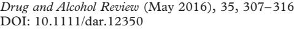
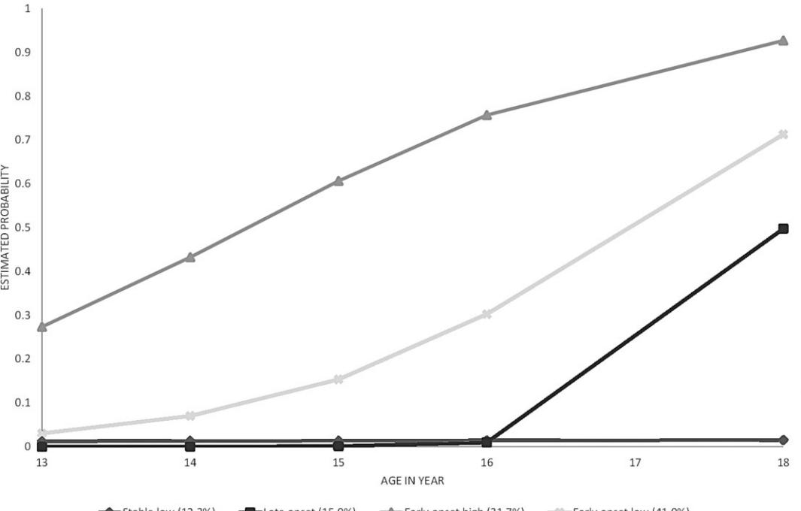
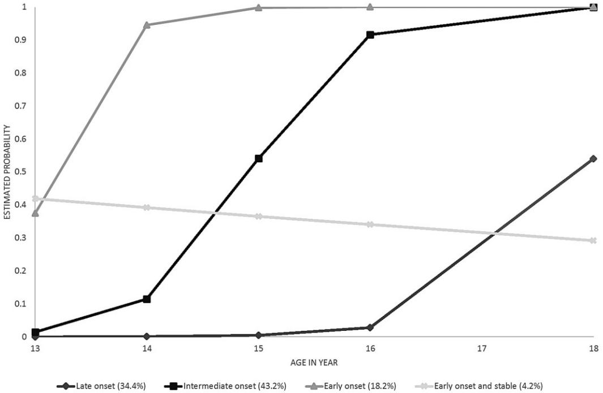

# **Trajectories of alcohol use and association with symptoms of depression from early to late adolescence: The Norwegian Longitudinal Health Behaviour Study**

#### JENS CHRISTOFFER SKOGEN1,2, ANN KRISTIN KNUDSEN3,4, MARI HYSING5 , BENTE WOLD6 & BØRGE SIVERTSEN1,5,7

1 *Department of Public Mental Health, Division of Mental Health, Norwegian Institute of Public Health, Bergen, Norway,* 2 *Alcohol and Drug ResearchWestern Norway, Stavanger University Hospital, Stavanger, Norway,* 3 *Department of Health Registries, Norwegian Institute of Public Health, Bergen, Norway,* 4 *Department of Global Public Health and Primary Care, University of Bergen, Bergen, Norway,* 5 *Regional Centre for Child andYouth Mental Health and ChildWelfare, Uni Research Health, Bergen, Norway,* 6 *Department of Health Promotion and Development, Faculty of Psychology, University of Bergen, Bergen, Norway, and* 7 *Department of Psychiatry, Helse Fonna HF, Haugesund, Norway*

## **Abstract**

bs\_bs\_banner

*Introduction and Aims.Adolescence is a period in which many have an onset of alcohol use, but there is much heterogeneity in the individual development of alcohol use. Further, there is a general increase in depressive symptoms from early to late adolescence,but less is known about how different alcohol habit trajectories are associated with symptoms of depression.The aims of the present study were: to identify trajectories of alcohol consumption and drinking to intoxication during adolescence (age 13–18 years); and examine to what extent the different trajectories of alcohol use were associated with symptoms of depression over the same age span, from early to late adolescence. Methods. Data from the Norwegian Longitudinal Health Behaviour Study were employed. Latent class growth analyses were employed to identify different trajectories of both alcohol consumption and drinking to intoxication.The resulting trajectories for each participant were used to estimate the gender-adjusted association between different development of alcohol use and symptoms of depression. Results. Four trajectories of both alcohol consumption and drinking to intoxication were identified. The trajectories with an early onset of alcohol consumption or drinking to intoxication were associated with higher levels of depressive symptoms compared with late onset or stable low use trajectories. Conclusions. The findings from the present study suggest that early onset developmental trajectories of alcohol use are associated with depression.Therefore,broad assessment and interventions targeting both alcohol and depression may be indicated among early onset alcohol users, especially if they report increasing levels of consumption.*[Skogen JC, Knudsen AK, Hysing M, Wold B, Sivertsen B. Trajectories of alcohol use and association with symptoms of depression from early to late adolescence: The Norwegian Longitudinal Health Behaviour Study. *Drug Alcohol Rev* 2016;35:307–316]

**Key words:** alcohol use, intoxication, adolescence, depression, development.

### **Introduction**

Alcohol problems and mental health problems frequently co-occur in adolescents [1]. A recent crosssectional study concluded that a range of alcohol and drug use indicators were consistently associated with more mental health problems among 16- to 19-yearolds [2].

Adolescence is a developmental period in which many start to drink alcohol. There is, however, much heterogeneity in the individual developmental trajectory of alcohol use [3–7]. At least three trajectories have been identified among adolescents: a low or non-using trajectory, a persistently high-using trajectory, and a trajectory of initial low and then increasing levels of use, with the latter group usually being the largest [8].

Jens Christoffer Skogen PhD, Senior Researcher, Ann Kristin Knudsen PhD, Researcher, Mari Hysing PhD, Senior Researcher, BenteWold PhD, Professor, Børge Sivertsen PhD, Senior Researcher. Correspondence to Dr Jens Christoffer Skogen, Department of Health Registries, Norwegian Institute of Public Health. Postal address: Kalfarveien 31, Bergen 5018, Norway. Tel: +47 53 20 41 04; Fax: +47 22353605; E-mail: [jens.christoffer.skogen@fhi.no;](mailto:jens.christoffer.skogen@fhi.no) [jensskogen@gmail.com](mailto:jensskogen@gmail.com)

Received 21 May 2015; accepted for publication 5 September 2015.

Increasers can be subcategorised into early versus late peakers [6]. A potential limitation of previous research investigating developmental heterogeneity is that most studies have focused on only one aspect of alcohol use, such as binge drinking, alcohol consumption or alcohol problems. While these aspects overlap, they have been shown to be differentially associated with various outcomes, including mental health problems. Frequency of binge drinking seems, for example, to be more consistently associated with mental health problems than mere alcohol consumption [9–12].

From early to late adolescence there is also a general increase in depressive symptoms, and depression is among the most prevalent mental health problems in this age group [1,13]. While some longitudinal studies have linked early depressive symptoms to later alcohol use [14], other studies have not found this association [15,16]. In terms of alcohol problems, evidence suggests that these are generally preceded by depressive symptoms [17–21].

Our understanding of the complexity of the association between alcohol use and depression remains limited [17,21,22], but there is reason to believe that early onset of alcohol use, and high levels of alcohol use is associated with later poor mental health, as well as functional, economic and social problems [23–31]. However, variability in alcohol use trajectories may be differentially associated with symptoms of depression. A deeper understanding of how specific alcohol use trajectories are linked to depressive symptoms during adolescence may help to identify vulnerable groups, and target interventions appropriately.

Based on these considerations, we aimed to identify trajectories of alcohol consumption and drinking to intoxication from age 13–18 years, and examine to what extent the different trajectories of alcohol use were associated with symptoms of depression over the same age span, from early to late adolescence.

### **Methods**

#### *Study population*

The present study employs data from the Norwegian Longitudinal Health Behaviour Study (NLHB). NLHB is a nine-wave, cluster-sample research study which followed a cohort of adolescents from 13 (1990) to 30 years (2007) with a total sample of *n* = 1242. Overall, the study sample is considered representative of the birth-cohort attending ordinary school with regard to gender and residence distribution [32]. Regarding attrition, a previous study did not find any differences between responders and non-responders across waves for symptoms of depression, smoking, alcohol use, body mass index or parental socioeconomic status [33]. More girls did, however, complete all waves compared with boys. A more detailed description of the sampling procedures and data collection methods used in NLHB can be found elsewhere [34,35].

The questionnaires were distributed to the participants by their respective schools in the first waves (ages 13–15). For the later waves, questionnaires were mailed to the participants' home addresses. This paper employs data for the years 1990–1995 (ages 13–16, and 18 years), effectively ranging from early adolescence to the legal drinking age in Norway [36]. As the number of valid responses differed between the two measures of alcohol use, the total number of participants available for our analyses was 1102 for measures of alcohol consumption and 1095 for drinking to intoxication.

NLHB was approved by the Norwegian Data Inspectorate and the Regional Committee for Medical Research Ethics in Western Norway.

#### *Instruments*

*Gender.* Gender was reported in the first data collection wave, and reiterated at the time of each follow-up in order to assess gender distribution for each wave.

*Alcohol variables.* Alcohol consumption measures were available at ages 13–16 and 18 years. At each wave, four questions assessed the frequency of alcohol consumption, asking the respondents 'How often do you drink X?', where X denoted winecooler, beer, wine or liquor.The response categories for each question was 'Never', 'Less than once a month', 'Every month' and 'Every week'. For the purpose of the present study, a single four-level variable, ranging from never to every week for each wave was constructed, based on the highest reported frequency of consumption irrespective of the four types of beverage.

Drinking to intoxication was measured by a single question 'How often have you been drunk the last 6 months?' At each wave, the first three response categories were identical ('No time', '1 time' and '2–4 times'), but the number of categories differed between some of the waves, and the highest possible frequency category changed from '≥11' to '≥25' times between waves. For the latent class growth analyses (LCGA), drinking to intoxication was recoded to a binary variable indicating 'No time' versus '≥1 times' to ensure comparable measures between waves.

*Symptoms of depression.* Symptoms of depression were assessed using a 7-item depression inventory [37], which includes questions regarding feelings of hopelessness and feelings of sadness without any obvious

**Table 1.** *List of questions included in the 7-item depression inventory*

| Item # | Question                                                                                |  |  |  |
|--------|-----------------------------------------------------------------------------------------|--|--|--|
| 1      | 'I often feel depressed without knowing why'                                            |  |  |  |
| 2      | 'Sometimes I think everything is so hopeless that I don't feel like doing anything'  |  |  |  |
| 3      | 'I don't think I have anything to look forward to'                                      |  |  |  |
| 4      | 'Sometimes I am just so depressed that I feel like staying in bed for the whole day' |  |  |  |
| 5      | 'I am often sad without seeing any reason for it'                                       |  |  |  |
| 6      | 'I think my life is mostly miserable'                                                   |  |  |  |
| 7      | 'Sometimes I think my life is not worth living'                                         |  |  |  |

All responses were rated on a 6-point scale. Response options: 'Does not apply at all', 'Does not apply well', 'Applies somewhat', 'Applies fairly well', 'Applies well' and 'Applies exactly'.

reason (Table 1). Cronbach's α ranged 0.81–0.90 across all waves, which indicate a high internal consistency [38].

### *Statistical procedure*

*LCGAs.* LCGA was employed to identify different trajectories of both frequency of alcohol consumption, and of drinking to intoxication from ages 13–18 years [39]. LCGA is a person-centred approach that in a probabilistically manner assigns individuals to latent classes based on similar patterns of observed longitudinal data [40]. Using LCGA, repeated measurements of observed variables are used as indicators of individual's change, most commonly represented by two latent variables; intercept and slope [40]. The purpose of the LCGA in the present study was to identify the optimal number of trajectories for the indicators 'alcohol consumption' and 'drinking to intoxication' from age 13–18 years. The LCGA models were specified with factor loadings corresponding to distance in time from wave 1 (1990; specified as '0') to wave 5 (1995; specified as '5') for the intercept and slope.The '0' for the slope growth factor at wave 1 defines the intercept growth factor as an initial status factor [39]. Six models were estimated for both indicators separately, ranging from a 1-class to a 6-class model. Final models were conditioned on gender [3]. The models identified were similar when including information regarding living situation and parental occupational status in the LCGA (data not shown). For each of the six classes, model fit was evaluated using the Akaike and Bayesian Information Criterion (AIC; BIC),Vuon–Lo– Mendell–Rubin likelihood ratio test (VLM-LRT), bootstrap likelihood ratio test and entropy values. Iterative comparisons of AIC- and BIC-values between the different models were performed, starting with the 1-class model, where lower values indicated a better fit between the proposed model and the actual data.When the iterative comparisons yielded a non-significant VLM-LRT statistic, this indicated that one less class was preferable. In order to assess the robustness of the VLM-LRT statistic, at least six models were computed for both indicators ('alcohol consumption' and 'drinking to intoxication'). The entropy values were compared, with values closer to 1.0 reflecting a higher classification accuracy [41]. Conversely, an entropy value closer to zero is a cause for concern as it implies that posterior probabilities does not separate well between trajectories [41]. After iterative comparisons, the estimated models were visually inspected, and the retained models were chosen based on the model fit in concert with coherence, interpretability and parsimony. All LCGAs were computed using Mplus 7.1 [42] and the full information maximum likelihood estimator for handling of missing information [42].

*Association between trajectories and symptoms of depression.* The estimated class membership for each participant of the retained models for 'alcohol consumption' and 'drinking to intoxication' were saved and migrated to Stata version 13.1 [43]. In Stata, the information about assigned class membership was merged with the remainder of the dataset, and the gender-adjusted association between different trajectories and symptoms of depression were computed for ages 13–18 years. In order to ease comparison, the mean depression score was standardised [mean: 0, standard deviation (SD): 1] at each wave, and the class membership variables were employed as categorical indicators in multiple linear regression analyses.

### **Results**

Among the total number of participants 45.6% were female, with a comparable gender distribution across waves (Table S1). The unstandardised mean scores of depression were relatively stable across waves, while alcohol consumption and drinking to intoxication increased steeply during the age span (Table S1).

### *Trajectories of alcohol consumption and drinking to intoxication*

For both alcohol consumption and drinking to intoxication, the successive comparisons suggested that fourclass models should be retained (Table 2). For both measures, we returned to a four-class model since the fit of the five-class model was not significantly better according to the VLMR-LRT-test (both *P* > 0.05).This choice was further supported as the additional classes

|                                |                      |               |                 |         |                  | MR VL         | estimated Lowest                          | estimated                                               |
|--------------------------------|----------------------|---------------|-----------------|---------|------------------|------------------|----------------------------------------------|---------------------------------------------------------|
| classes of Number        | AIC                  | BIC           | BLRT            | Entropy | MR-LRT VL     | Adjusted-LRT     | probability mbership me class of | probability mbership me class Highest of |
| consumption Alcohol         | 102) 1 = (n |               |                 |         |                  |                  |                                              |                                                         |
| 1                              | 098.355 10        | 0128.385 1 | N/A             | N/A     | N/A              | N/A              | N/A                                          | N/A                                                     |
| 2                              | 197.356 9         | 247.405 9  | 0.001 < P | 0.709   | 0.0001 < P | 0.0001 < P | 0.894                                        | 0.931                                                   |
| 3                              | 085.366 9         | 155.434 9  | 0.001 < P | 0.611   | 0.0015 = P | 0.0018 = P | 0.793                                        | 0.839                                                   |
| 4                              | 023.069 9         | 113.157 9  | 0.001 < P | 0.637   | 0.0060 = P | 0.0070 = P | 0.712                                        | 0.837                                                   |
| 5                              | 997.827 8         | 107.934 9  | 0.001 < P | 0.667   | 0.2244 = P | 0.2367 = P | 0.694                                        | 0.814                                                   |
| 6                              | 973.397 8         | 103.524 9  | 0.001 < P | 0.635   | 0.2462 = P | 0.2531 = P | 0.668                                        | 0.796                                                   |
| intoxication to Drinking | 095) 1 = (n |               |                 |         |                  |                  |                                              |                                                         |
| 1                              | 537.841 4         | 557.835 4  | 0.001 < P | N/A     | N/A              | N/A              | N/A                                          | N/A                                                     |
| 2                              | 873.535 3         | 913.523 3  | 0.001 < P | 0.655   | 0.0001 < P | 0.0001 < P | 0.869                                        | 0.914                                                   |
| 3                              | 783.636 3         | 843.619 3  | 0.001 < P | 0.597   | 0.0008 = P | 0.0010 = P | 0.741                                        | 0.875                                                   |
| 4                              | 749.539 3         | 829.515 3  | 0.001 < P | 0.703   | 0.0003 = P | 0.0003 = P | 0.778                                        | 0.850                                                   |
| 5                              | 748.820 3         | 848.790 3  | 0.051 = P | 0.627   | 0.2497 = P | 0.2603 = P | 0.722                                        | 0.905                                                   |
| 6                              | 748.783 3         | 868.747 3  | 0.500 = P | 0.618   | 0.1618 = P | 0.1698 = P | 0.638                                        | 0.805                                                   |

6© 2015 Australasian Professional Society on Alcohol and other Drugs

variableY

all waves and those who dropped

Bootstrapped

likelihood

 ratio test. Bold indicates

 likelihood

 test; N/A, not

 the retained models.

 relies on other variables

 on the values ofY itself. No baseline

 out over time during the data collection

differences

 in our study. AIC, Akaike

 likelihood

 ratio

applicable;VLMR-LRT,Vuon-Lo-Mendell-Rubin

 on the variables

 of alcohol use and

information

 criteria; BIC, Bayesian

test;VLMR

depression

 were noted for those who

Adjusted-LRT,Vuon–Lo–Mendell–Rubin

information

 criteria; BLRT,

 adjusted

completed

only differed with regard to level of alcohol use, and not with regard to the shape of the curves. Although the AIC- and BIC-values continued to decrease, the bootstrap likelihood ratio test–statistic was significant with the addition of classes for alcohol consumption, and the AIC-value continued to decrease for drinking to intoxication, the changes were small, and a simultaneous decrease in entropy and/or non-significant VLMR-LRT-tests were observed. In addition, the four-class model was theoretically more meaningful than the fiveand six-class model, as the additional trajectories only differed quantitatively from the trajectories in the fourmodel solutions.

The trajectories of alcohol consumption were labelled as follows: 'stable low' (12.3%), 'late onset' (15.0%), 'early onset high' (31.7%), and 'early onset low' (41.0%; Figure 1). There were more male participants in the categories 'stable low', 'late onset' and 'early onset high' (*P* values 0.003–0.037), while there was no difference in the gender distribution for 'early onset low' (*P* = 0.582; Table 3). For drinking to intoxication (Figure 2), the following labels were assigned: 'late onset' (34.4%), 'intermediate onset' (43.2%), 'early onset' (18.2%) and 'early onset and stable' (4.2%;Table 3). In the category 'late onset', there were more male participants (*P* < 0.001) while the remaining categories had a more even gender distribution (*P* values 0.136–1.000).

At the legal age of 18 years, 25.5% of all participants reported weekly alcohol consumption (the highest frequency that could be reported). This was not reported by anyone in the 'stable low' trajectory, while 13.5% in the 'late onset', 18.6% in the 'early onset low' and 53.7% in the 'early onset high' trajectory reported weekly consumption at age 18.

Further, a total of 31.8% of the participants reported being intoxicated ≥11 times in the last 6 months at age 18. This type of alcohol use also differed between trajectories, and was reported by 10.5% in the 'early onset and stable' trajectory, 11.3% in the 'late onset' trajectory, 40.9% in the 'intermediate onset' trajectory and 57.4% in the 'early onset' trajectory.

## *Trajectories of alcohol use and symptoms of depression*

Symptoms of depression differed between trajectories both for alcohol consumption and for drinking to intoxication. For the alcohol consumption measure, increased symptom levels of depression was reported at all time-points in the 'early onset high' trajectory compared with the 'stable low' (0.33–0.46 SD), while the 'early onset low' trajectory reported increased levels of depression at age 18 years (0.24 SD; Table 4). For the drinking to intoxication measure, the 'early onset' trajectory reported increased symptom levels of

**Figure 1.** *Developmental trajectories of alcohol consumption (≥monthly) from ages 13–18 years.*

|            | Alcohol consumption, class number      |                               |                             |                                      |
|------------|----------------------------------------|-------------------------------|-----------------------------|--------------------------------------|
|            | 1—Stable low (CI 95%)                  | 2—Late onset (CI 95%)         | 3—Early onset high (CI 95%) | 4—Early onset low (CI 95%)        |
| Female (%) | 35.3% (26.6–45.1)                      | 39.7% (32.7–47.0)             | 44.4% (39.2–49.7)           | 51.3% (46.8–55.8)                    |
|            | Drinking to intoxication, class number |                               |                             |                                      |
|            | 1—Late onset (CI 95%)                  | 2—Intermediate onset (CI 95%) | 3—Early onset (CI 95%)      | 4—Early onset and stable (CI 95%) |
| Female (%) | 37.6% (33.0–42.5)                      | 52.0% (47.5–56.5)             | 50.0% (42.9–57.1)           | 35.7% (20.2–55.0)                    |

**Table 3.** *Gender distribution of trajectories of alcohol consumption and drinking to intoxication*

One-sample binomial tests were employed to test the observed distribution of male and female participants in each class compared with a hypothesised 50:50 distribution. Bold indicates significant difference from the hypothesised distribution (*P* < 0.05). CI, confidence interval.

depression at ages 13–15 and 18 years compared with the 'late onset' trajectory (0.26–0.34 SD), while the 'early onset and stable' trajectory reported increased levels of depression at ages 13, 14 and 16 years (0.56– 0.60 SD; Table 5).

#### **Discussion**

This study investigated the heterogeneity in the developmental trajectories of alcohol consumption and drinking to intoxication, and the trajectories' association with depression from early adolescence to the legal drinking age in Norway. Four trajectories of alcohol consumption and drinking to intoxication were identified, where only the 'early onset high' trajectory of alcohol consumption was consistently associated with higher levels of depressive symptoms across all waves, from early to late adolescence. All of the trajectories with an early onset of alcohol consumption or drinking to intoxication were, however, associated with higher

© 2015 Australasian Professional Society on Alcohol and other Drugs

**Figure 2.** *Developmental trajectories of drinking to intoxication from ages 13–18 years.*

**Table 4.** *Gender-adjusted association between different alcohol consumption trajectories and symptoms of depression at ages 13, 14, 15, 16 and 18 years*

| Class number       | Age 13 (n = 663)   | Age 14 (n = 926)   | Age 15 (n = 859)   | Age 16 (n = 687)   | Age 18 (n = 770)   |
|--------------------|--------------------|--------------------|--------------------|--------------------|--------------------|
| 1—Stable low       | Reference          | Reference          | Reference          | Reference          | Reference          |
| 2—Late onset       | 0.12 (−0.19, 0.42) | 0.20 (−0.06, 0.46) | 0.14 (−0.12, 0.41) | 0.16 (−0.12, 0.44) | 0.11 (−0.16, 0.38) |
| 3—Early onset high | 0.33 (0.05, 0.61)  | 0.46 (0.22, 0.70)  | 0.40 (0.16–0.65)   | 0.35 (0.10, 0.61)  | 0.37 (0.13, 0.61)  |
| 4—Early onset low  | 0.10 (−0.17, 0.37) | 0.16 (−0.07, 0.39) | 0.15 (−0.09, 0.39) | 0.09 (−0.16, 0.33) | 0.24 (0.02, 0.47)  |

Regression coefficients are estimated as difference in standard deviations from reference group. Patterns of significance were identical for the crude regression models. Bold indicates significant associations (*P* < 0.05).

**Table 5.** *Gender-adjusted association between different drinking to intoxication trajectories and symptoms of depression at ages 13, 14, 15, 16 and 18 years*

| Class #                  | Age 13 (n = 663)   | Age 14 (n = 925)   | Age 15 (n = 858)   | Age 16 (n = 687)   | Age 18 (n = 768)   |
|--------------------------|--------------------|--------------------|--------------------|--------------------|--------------------|
| 1—Late onset             | Reference          | Reference          | Reference          | Reference          | Reference          |
| 2—Intermediate onset     | 0.03 (−0.14, 0.20) | 0.03 (−0.12, 0.17) | 0.04 (−0.11, 0.19) | 0.10 (−0.07, 0.26) | 0.08 (−0.08, 0.24) |
| 3—Early onset            | 0.26 (0.05, 0.47)  | 0.34 (0.17, 0.52)  | 0.30 (0.11, 0.49)  | 0.16 (−0.06, 0.37) | 0.27 (0.06, 0.48)  |
| 4—Early onset and stable | 0.56 (0.11, 1.01)  | 0.60 (0.21, 0.99)  | 0.29 (−0.12, 0.69) | 0.56 (0.11, 1.01)  | 0.23 (−0.22, 0.68) |

Regression coefficients are estimated as difference in standard deviations from reference group. Patterns of significance were identical for the crude regression models. Bold indicates significant associations (*P* < 0.05).

levels of depressive symptoms compared with stable low or late onset trajectories at least at some waves.

## *Alcohol trajectories*

For both alcohol consumption and drinking to intoxication, trajectories with early onset and late onset were identified, a finding largely in line with previous studies of adolescent drinking trajectories [5]. The 'early onset low' trajectory was the largest for alcohol consumption (41.0%) followed by 'early onset high' (31.7%), while the largest trajectories for drinking to intoxication was 'intermediate onset' (43.2%) and 'late onset' (34.4%). For both alcohol measures, the smallest group was the stable group. This is in accordance with the existing literature documenting that adolescence is the predominant period of initiation and escalation of alcohol use [3,44]. Furthermore, the identification of dominating trajectories characterised by increasing alcohol use is also supported by previous findings in Norwegian samples [2,9], as well as the finding that a high proportion of adolescents are drinking to intoxication.

Looking at the gender distribution in the different trajectories, there is an indication that somewhat more male participants compared with female participants consume alcohol frequently from early adolescence, which is in line with previous reports [45]. Earlier onset of drinking to intoxication was more evenly distributed among male and female participants, similar to previously reported results [45]. Furthermore, male participants were somewhat overrepresented in the 'late onset' trajectory with regard to drinking to intoxication. Overall, gender differences were evident, but not consistently so, which is in line with previous research stemming from Norwegian samples [2,9] and an LCGA of a German sample [6].

Previous research has consistently shown that alcohol use in the late adolescence and early adulthood is characterised by heavy episodic drinking in Northern Europe [45,46], and early onset of drinking to intoxication is often followed by a steep increase in frequency of this behaviour during adolescence [30,31].This tendency was supported in our sample, where more than half of the 'early onset' intoxication-trajectory reported being intoxicated ≥11 times the last 6 months at age 18. Further, the 'early onset high' alcohol consumptiontrajectory was also associated with an escalation culminating into at least weekly alcohol consumption at age 18. This is of concern, as it is likely that many of these will engage in weekly heavy drinking [30,31]. This pattern of alcohol use co-occurs with a time when the adolescents move away from parental supervision and restrictions, and when their freedom is increased. Considering the potential negative consequences, including functional, economic and psychosocial problems and the immediate high risk of accidents and violence of such high frequency of alcohol consumption and/or drinking to intoxication early in adult life [47], it seems evident that early onset and escalation of alcohol use is a considerable public health concern [30,31].

### *Trajectories: associations with symptoms of depression*

The current study indicates a consistent association between alcohol consumption and depressive symptoms, which is in line with a recent cross-sectional study that demonstrated a strong association between depression and alcohol consumption [2]. The usefulness of early onset in itself as an indicator in alcohol research has been questioned [12]. However, the trajectories of early onset of alcohol consumption, and of drinking to intoxication were characterised by increase in these behaviours across waves in our study, and these trajectories were associated with higher levels of depressive symptoms compared with stable low or late onset trajectories.Thus a trajectory characterised by early onset followed by increased levels of consumption or intoxication may be useful indicators of other adverse conditions, such as depression, in these individuals, although the direction of the association is unknown. It is little doubt that depression is associated with alcohol-related problems, both in the short- and long-term [48], and a number of potential explanations for this have been posited, including a tendency to use alcohol as a coping strategy and using alcohol in an effort to dampen negative affectivity among depressed individuals [49,50]. Also, both symptoms of depression and problems related to alcohol use may have a common pathway through genetic and/or environmental influences [51– 55]. Although our data are not suited to shed any light on the direction of causality, they may increase our knowledge about the complexity of the alcohol use– depression association.

### *Implications for public health initiatives*

The evidence for heterogeneity in alcohol trajectories among Norwegian adolescents suggests that different preventive measures should be considered for the different subgroups. For instance, those with an early onset of drinking to intoxication are likely to escalate this behaviour rather rapidly, and are more likely to report depressive symptoms. Furthermore, as the increase seemed to occur in the first few intervening years between 13 and 18 years of age, the optimal window for intervention is 13 years or earlier [6]. Likewise, the individuals in the 'early onset high' trajectory of alcohol consumption consistently reported more symptoms of depression at all waves in this study. It is likely that for this group, both interventions aimed at preventing or delaying alcohol onset in combination with harm-reduction and reduction of depressive symptoms are particularly important (e.g. [12,56]). Early prevention and treatment of depression may have the added effect of preventing the development of problematic alcohol use among adolescents, as indicated in a randomised controlled trial showing a secondary benefit of depression treatment on subsequent alcohol use disorders [57].

Other trajectories, such as those with a late onset may require little or no tailored intervention beyond the existing universal intervention strategies. Furthermore, the study indicates that having an earlier onset of alcohol consumption is not necessarily associated with depressive symptoms at the time of alcohol onset, as evidenced by the 'early onset low' trajectory. However, it should be noted that also this group reported increased levels of depression at age 18 compared with those with a late onset of alcohol consumption. In sum, the findings in this study suggest that preventive strategies which are able to both focus on delaying the onset of alcohol use and harm-reduction, while also targeting those with an early onset of drinking to intoxication should be considered a primary public health task in relation to adolescent health [12,56].

### *Strengths and limitations*

The employment of a longitudinal study design to identify trajectories of alcohol use from early adolescence to the legal drinking age, and the possibility to compare different trajectories' association with symptoms of depression are primary strengths of the present study. Also, the inclusion of a measure of frequency of alcohol use and drinking to intoxication allowed for the identification of developmental trajectories related to different dimensions of alcohol use. Conversely, the present study has several limitations. Firstly, the measurements of alcohol consumption were based on fixed categories related to frequency of alcohol consumption, which negated any direct conversion to the actual alcohol consumption in standard units, and may have induced underreporting due to lack of specificity. Arguably, it would have been preferable to be able to also calculate the consumption of alcohol in standard units, as it has been done in previous research in this area [6]. Secondly, while the questions of drinking to intoxication were phrased identically at all waves, they had differences in the fixed response categories. Due to this, it was deemed necessary to use this variable as a binary variable in the LCGA, only discriminating between those responding 'no' versus 'yes'. Thirdly, the inventory used for measuring symptoms of depression is not a well-validated questionnaire, which may limit generalisability. The content of the questionnaire, does however hold face-value, and includes major symptoms of depression such as feelings of hopelessness and feelings of sadness without any obvious reason. Furthermore, it has been successfully employed in previous studies [32,33,58,59] and psychometric assessment of the inventory have approximated other, more wellknown depression scales [60]. Also, the questionnaire have a high internal consistency as well as an acceptable temporal stability between total scores [33]. Fourthly, the final models for alcohol consumption and drinking to intoxication had entropy values that were rather low indicating that the discrimination between the different classes was not optimal. Inspection of the estimated probability of class membership, however, indicated that the discrimination of the classes were sufficient to allow for meaningful interpretation. Fifthly, although the age range of 13–18 years covers an important period, based on the present findings it seems evident that it would have been preferable to have information about the variables of interest preceding this age range in order to assess initial onset of alcohol consumption for all participants [30,31].

### **Conclusions**

Using data from a longitudinal study with five waves from ages 13–18, we identified four different prototypic trajectories of frequency of alcohol consumption and drinking to intoxication. The identified trajectories indicated that an early onset with later increase of both alcohol consumption and drinking to intoxication is associated with a higher risk of symptoms of depression. The findings from the present study and from previous research suggest that different developmental trajectories of alcohol use imply different and sometimes targeted intervention strategies.

### **Acknowledgements**

The Norwegian Longitudinal Health Behaviour Study was started up and administered by the Research Centre of Health Promotion, Faculty of Psychology at the University of Bergen.We would like to acknowledge the initiatives of Professor Knut-Inge Klepp, who was the founder of the study and Professor BenteWold who is currently the coordinator.

#### **References**

- [1] Merikangas KR, He JP, Burstein M, *et al*. Lifetime prevalence of mental disorders in U.S. adolescents: results from the National Comorbidity Survey Replication–Adolescent Supplement (NCS-A). J Am Acad Child Adolesc Psychiatry 2010;49:980–9.
- [2] Skogen JC, Sivertsen B, Lundervold AJ, Stormark KM, Jakobsen R, Hysing M. Alcohol and drug use among

adolescents: and the co-occurrence of mental health problems. Ung@hordaland, a population-based study. BMJ Open 2014;4:e005357.

- [3] Feldman BJ, Masyn KE, Conger RD. New approaches to studying problem behaviors: a comparison of methods for modeling longitudinal, categorical adolescent drinking data. Dev Psychol 2009;45:652–76.
- [4] Toumbourou JW, Williams IR, Snow PC, White VM. Adolescent alcohol-use trajectories in the transition from high school. Drug Alcohol Rev 2003;22:111–16.
- [5] Van Der Vorst H, Vermulst AA, Meeus WH, Dekovic´ M, Engels RC. Identification and prediction of drinking trajectories in early and mid-adolescence. J Clin Child Adolesc Psychol 2009;38:329–41.
- [6] Wiesner M, Weichold K, Silbereisen RK. Trajectories of alcohol use among adolescent boys and girls: identification, validation, and sociodemographic characteristics. Psychol Addict Behav 2007;21:62–75.
- [7] Jackson KM, Sher KJ, Schulenberg JE. Conjoint developmental trajectories of young adult alcohol and tobacco use. J Abnorm Psychol 2005;114:612–26.
- [8] Sher KJ, Jackson KM, Steinley D. Alcohol use trajectories and the ubiquitous cat's cradle: cause for concern? J Abnorm Psychol 2011;120:322–35.
- [9] Strandheim A, Holmen TL, Coombes L, Bentzen N. Alcohol intoxication and mental health among adolescents—a population review of 8983 young people, 13–19 years in North-Trøndelag, Norway: the Young-HUNT Study. Child Adolesc Psychiatry Ment Health 2009;3:18.
- [10] Skogen JC, Knudsen AK, Mykletun A, Nesvåg S, Øverland S. Alcohol consumption, problem drinking, abstention and disability pension award. The Nord-Trøndelag Health Study (HUNT). Addiction 2012;107:98–108.
- [11] Lim SS, Vos T, Flaxman AD, *et al*. A comparative risk assessment of burden of disease and injury attributable to 67 risk factors and risk factor clusters in 21 regions, 1990– 2010: a systematic analysis for the Global Burden of Disease Study 2010. Lancet 2012;380:2224–60.
- [12] Kuntsche E, Rossow I, Engels R, Kuntsche S. Is 'age at first drink' a useful concept in alcohol research and prevention? We doubt that. Addiction 2015. doi: 10.1111/add.12980. [Epub 5 Jul 2015].
- [13] Hankin BL, Abramson LY, Moffitt TE, Silva PA, McGee R, Angell KE. Development of depression from preadolescence to young adulthood: emerging gender differences in a 10-year longitudinal study. J Abnorm Psychol 1998;107:128–40.
- [14] McCarty CA, Wymbs BT, King KM, *et al*. Developmental consistency in associations between depressive symptoms and alcohol use in early adolescence. J Stud Alcohol Drugs 2012;73:444–53.
- [15] Mason WA, Hitchings JE, Spoth RL. Emergence of delinquency and depressed mood throughout adolescence as predictors of late adolescent problem substance use. Psychol Addict Behav 2007;21:13–24.
- [16] Fergusson DM, Woodward LJ. Mental health, educational, and social role outcomes of adolescents with depression. Arch Gen Psychiatry 2002;59:225–31.
- [17] O'Neil KA, Conner BT, Kendall PC. Internalizing disorders and substance use disorders in youth: comorbidity, risk, temporal order, and implications for intervention. Clin Psychol Rev 2011;31:104–12.
- [18] Mushquash AR, Stewart SH, Sherry SB, Sherry DL, Mushquash CJ, Mackinnon AL. Depressive symptoms are a

vulnerability factor for heavy episodic drinking: a shortterm, four-wave longitudinal study of undergraduate women. Addict Behav 2013;38:2180–6.

- [19] Kuntsche E, Muller S. Why do young people start drinking? Motives for first-time alcohol consumption and links to risky drinking in early adolescence. Eur Addict Res 2012;18:34–9.
- [20] Crum RM, Green KM, Storr CL, *et al*. Depressed mood among youth reporting alcohol use: associations with subsequent alcohol involvement from childhood through young adulthood. Arch Gen Psychiatry 2008;65:702–12.
- [21] Pape H, Norström T. Associations between emotional distress and heavy drinking among young people: a longitudinal study. Drug Alcohol Rev 2015. doi: 10.1111/dar.12290. [Epub 19 Jun 2015].
- [22] Trim RS, Meehan BT, King KM, Chassin L. The relation between adolescent substance use and young adult internalizing symptoms: findings from a high-risk longitudinal sample. Psychol Addict Behav 2007;21:97–107.
- [23] Gruber E, DiClemente RJ, Anderson MM, Lodico M. Early drinking onset and its association with alcohol use and problem behavior in late adolescence. Prev Med 1996;25:293–300.
- [24] Hingson RW, Heeren T, Winter MR. Age at drinking onset and alcohol dependence: age at onset, duration, and severity. Arch Pediatr Adolesc Med 2006;160:739–46.
- [25] Hingson R, Heeren T, Winter MR, Wechsler H. Early age of first drunkenness as a factor in college students' unplanned and unprotected sex attributable to drinking. Pediatrics 2003;111:34–41.
- [26] Pedersen W, Skrondal A. Alcohol consumption debut: predictors and consequences. J Stud Alcohol 1998;59:32–42.
- [27] Ellickson PL, Tucker JS, Klein DJ. Ten-year prospective study of public health problems associated with early drinking. Pediatrics 2003;111:949–55.
- [28] Townsend L, Flisher A, King G. A systematic review of the relationship between high school dropout and substance use. Clin Child Fam Psychol Rev 2007;10:295–317.
- [29] Hingson R, Kenkel D. Social, Health, and Economic Consequences of Underage Drinking. In: Bonnie RJ, O'Connell ME, National Research Council (US) and Institute of Medicine (US) Committee on Developing a Strategy to Reduce and Prevent Underage Drinking, eds. Reducing underage drinking: a collective responsibility. Washington, DC: National Academies Press, 2004.
- [30] Foster KT, Hicks BM, Iacono WG, McGue M. Alcohol use disorder in women: risks and consequences of an adolescent onset and persistent course. Psychol Addict Behav 2014;28:322–35.
- [31] Hicks BM, Iacono WG, McGue M. Consequences of an adolescent onset and persistent course of alcohol dependence in men: adolescent risk factors and adult outcomes. Alcohol Clin Exp Res 2010;34:819–33.
- [32] Anderssen N. Physical activity of young people in a public health perspective: stability, change and social influences. Bergen: Faculty of Psychology, University of Bergen, 1995. Thesis submitted in partial fulfilment of the requirements for the degree of Doctor Psychologiae.
- [33] Hayley AC, Skogen JC, Sivertsen B, *et al*. Symptoms of depression and difficulty initiating sleep from early adolescence to early adulthood: a longitudinal study. Sleep 2015. PMID:26194578. [Epub 13 Jul 2015].
- [34] Jakobsen R. Stages of progression in noncoital sexual interactions among young adolescents: an application of the Mokken scale analysis. Int J Behav Dev 1997;21:537–53.
- [35] Birkeland MS, Torsheim T, Wold B. A longitudinal study of the relationship between leisure-time physical activity and depressed mood among adolescents. Psychol Sport Exerc 2009;10:25–34.
- [36] International Center for Alcohol Policies (ICAP). Minimum age limits worldwide. 2010. Available at: [http://](http://icap.org/PolicyIssues/YoungPeoplesDrinking/PolicyTableMinimumAgeLimitsWorldwide/tabid/206/Default.aspx) [icap.org/PolicyIssues/YoungPeoplesDrinking/](http://icap.org/PolicyIssues/YoungPeoplesDrinking/PolicyTableMinimumAgeLimitsWorldwide/tabid/206/Default.aspx) [PolicyTableMinimumAgeLimitsWorldwide/tabid/206/](http://icap.org/PolicyIssues/YoungPeoplesDrinking/PolicyTableMinimumAgeLimitsWorldwide/tabid/206/Default.aspx) [Default.aspx](http://icap.org/PolicyIssues/YoungPeoplesDrinking/PolicyTableMinimumAgeLimitsWorldwide/tabid/206/Default.aspx) (accessed 25 September 2015).
- [37] Alsaker FD, Dundas I, Olweus D. A growth curve approach to the study of parental relations and depression in adolescence. Seattle, WA: Biannual Meetings of the Society for research in Child Development, 1991.
- [38] Prince M. Measurement in psychaitry. In: Prince M, Stewart R, Ford T, Hotopf M, eds. Practical psychiatric epidemiology. London: Oxford University Press, 2003:13– 41.
- [39] Jung T, Wickrama KAS. An introduction to latent class growth analysis and growth mixture modeling. Soc Personal Psychol Compass 2008;2:302–17.
- [40] Berlin KS, Parra GR, Williams NA. An introduction to latent variable mixture modeling (part 2): longitudinal latent class growth analysis and growth mixture models. J Pediatr Psychol 2014;39:188–203.
- [41] Ramaswamy V, Desarbo WS, Reibstein DJ, Robinson WT. An empirical pooling approach for estimating marketing mix elasticities with PIMS data. Mark Sci 1993;12:103–24.
- [42] Muthén LK, Muthén BO. 1998–2012. Mplus user's guide, Seventh edn. Los Angeles, CA: Muthén & Muthén, 2012.
- [43] StataCorp. Statistical software: release 13.1. College Station, TX: StataCorp LP, 2014.
- [44] Colder CR, Campbell RT, Ruel E, Richardson JL, Flay BR. A finite mixture model of growth trajectories of adolescent alcohol use: predictors and consequences. J Consult Clin Psychol 2002;70:976–85.
- [45] Hibell B, Guttormsson U, Ahlström S, *et al*. The 2011 ESPAD report: substance use among students in 36 European countries. Stockholm: The Swedish Council for Information on Alcohol and Other Drugs (CAN), 2012.
- [46] Danielsson AK, Wennberg P, Hibell B, Romelsjö A. Alcohol use, heavy episodic drinking and subsequent problems among adolescents in 23 European countries: does the prevention paradox apply? Addiction 2012;107:71–80.
- [47] Kuendig H. Empty glasses and broken bones: epidemiological studies on alcohol and injuries treated at an emergency department in Switzerland. Thesis for doctoral degree (PhD). Karolinska Institutet: Gothenburg. 2009.
- [48] Goodman A, Joyce R, Smith JP. The long shadow cast by childhood physical and mental problems on adult life. Proc Natl Acad Sci U S A 2011;108:6032–7.
- [49] Stewart SH, Devine H. Relations between personality and drinking motives in young adults. Pers Individ Dif 2000;29:495–511.
- [50] Kassel JD, Jackson SI, Unrod M. Generalized expectancies for negative mood regulation and problem drinking among college students. J Stud Alcohol 2000;61:332–40.
- [51] Nash SG, McQueen A, Bray JH. Pathways to adolescent alcohol use: family environment, peer influence, and parental expectations. J Adolesc Health 2005;37:19–28.
- [52] Catanzaro SJ, Laurent J. Perceived family support, negative mood regulation expectancies, coping, and adolescent alcohol use: evidence of mediation and moderation effects. Addict Behav 2004;29:1779–97.
- [53] Tambs K, Harris JR, Magnus P. Genetic and environmental contributions to the correlation between alcohol consumption and symptoms of anxiety and depression. Results from a bivariate analysis of Norwegian twin data. Behav Genet 1997;27:241–50.
- [54] Boden JM, Fergusson DM. Alcohol and depression. Addiction 2011;106:906–14.
- [55] Kushner MG, Abrams K, Borchardt C. The relationship between anxiety disorders and alcohol use disorders: a review of major perspectives and findings. Clin Psychol Rev 2000;20:149–71.
- [56] May C. Resistance to peer group pressure: an inadequate basis for alcohol education. Health Educ Res 1993;8:159– 65.
- [57] Curry JF, Wells KC, Lochman JE, Craighead WE, Nagy PD. Cognitive-behavioral intervention for depressed, substance-abusing adolescents: development and pilot testing. J Am Acad Child Adolesc Psychiatry 2003;42:656– 65.
- [58] Holsen I, Kraft P, Røysamb E. The relationship between body image and depressed mood in adolescence: a 5-year longitudinal study. J Health Psychol 2001;6:613–27.
- [59] Tjora T, Hetland J, Aarø LE, Wold B, Wiium N, Øverland S. The association between smoking and depression from adolescence to adulthood. Addiction 2014;109:1022–30.
- [60] Holsen I, Kraft P, Vittersø J. Stability in depressed mood in adolescence: results from a 6-year longitudinal panel study. J Youth Adolesc 2000;29:61–78.

#### **Supporting information**

Additional Supporting Information may be found in the online version of this article at the publisher's website:

**Table S1.** Gender distribution, mean depression score and proportion of monthly alcohol consumption and drinking to intoxication across ages 13–18.

Copyright of Drug & Alcohol Review is the property of Wiley-Blackwell and its content may not be copied or emailed to multiple sites or posted to a listserv without the copyright holder's express written permission. However, users may print, download, or email articles for individual use.

Supplemental table 1: Gender distribution, mean depression score and proportion of monthly alcohol consumption and drinking to intoxication across ages 13 to 18.

| Age (year)      | Gender (% female) | Mean depression score, | Weekly alcohol  | Drinking to intoxication |
|-----------------|-------------------|------------------------|-----------------|--------------------------|
|                 |                   | range 1-6 (SD)         | consumption (%) | ≥11 times last 6 months  |
|                 |                   |                        |                 | (%)                      |
| 13 years (1990) | 44.8%             | 2.3 (0.9)              | 1.1%            | 0.4%                     |
| 14 years (1991) | 44.6%             | 2.2 (1.0)              | 5.1%            | 3.0%                     |
| 15 years (1992) | 44.6%             | 2.4 (1.1)              | 9.1%            | 7.9%                     |
| 16 years (1993) | 48.0%             | 2.1 (1.0)              | 10.8%           | 13.2%                    |
| 18 years (1995) | 50.6%             | 2.4 (1.1)              | 25.5%           | 31.8%                    |