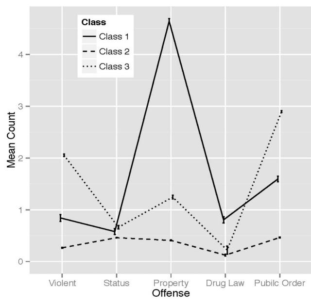
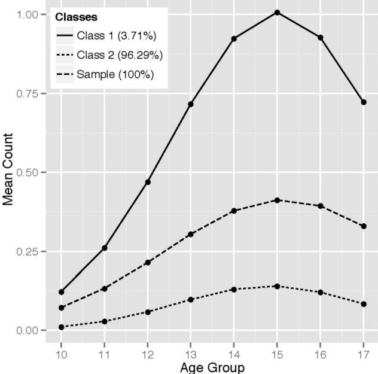

# Violent Offending Among Juveniles: A 7-Year Longitudinal Study of Recidivism, Desistance, and Associations With Mental Health

Sascha Hein University of Houston

Baptiste Barbot Pace University and Yale University

Amanda Square and John Chapman Yale University

Catherine Foley Geib Connecticut Judicial Branch, Court Support Services Division

## Elena L. Grigorenko University of Houston

Serious and violent offending among juveniles is a consistent concern of researchers, practitioners, and policymakers, yet the development of violent offending remains poorly understood because of limited availability of relevant data, small sample sizes, and shortage of longitudinal data sets. This study analyzed developmental patterns of violent offending over 7 years in the complete population of court-referred youth in Connecticut between 2006 and 2012 (*N* - 58,678; mean age at first offense - 14.7 years). This unique dataset provided several key findings: First, results from a latent class growth analysis showed that violent crimes peaked at age 14 –15, with high-rate adolescent offenders (3.7% of the sample) accounting for 31.9% of all violent offenses. Further, 74.2% of this group desisted from violent crimes in adulthood. Higher levels of self-reported anger/irritability slightly increased the odds of violent recidivism (odds ratio, OR - 1.09), where higher levels of depression/anxiety depressed the odds (OR - 0.89). The overrepresentation of males, non-Hispanic Black, and Hispanic youth among high-rate adolescence offenders were traceable through adolescence but not beyond the age of 18. Together, these finding may help to inform new delinquency interventions that target the needs of this proportionally small group of violent adolescent offenders accounting for a large amount of violent crimes.

*Keywords:* juvenile delinquency, gender differences, ethnic differences, violent crimes, latent class growth analysis (LCGA)

*Supplemental materials:* http://dx.doi.org[/10.1037/lhb0000241.supp](http://dx.doi.org/10.1037/lhb0000241.supp)

Juvenile delinquency is a common and troublesome phenomenon worldwide [\(Cox, Allen, Hanser, & Conrad, 2013\)](#page-9-0). In the United States, about 1.47 million juveniles were arrested in 2011, accounting for 12.7% of all violent crimes nationwide (e.g., homicide, sexual assault, robbery, aggravated assault, arson, and kidnapping; [Snyder & Mulako-Wangota, 2011\)](#page-10-0). Regarding the developmental patterns of criminal acts, the existence of an age-crime curve that peaks during adolescence has been well documented (e.g., [Landsheer & van Dijkum, 2005\)](#page-9-1). The rate and severity of offenses occurring during this developmental period are particularly predictive of later offenses [\(Overbeek, Vollebergh, Meeus, Engels, & Luijpers, 2001\)](#page-9-2). Developmental criminological research (e.g., [Le Blanc, 2012\)](#page-9-3) has contributed to our understanding of many forms of acting-out and delinquent behaviors along the life-course, helping to describe their onset, patterns of continuity and extinction. From this literature, it is evident that not all forms of juvenile delinquency lead to an adult criminal career (e.g., [Moffitt, 2006\)](#page-9-4) and

(Brown-Coxe fellowship to Sascha Hein), and by Award No. R305H140050 (PI: ELG), awarded by the Institute of Education Sciences, U.S. Department of Education. The opinions, findings, and conclusions or recommendations expressed in this publication are those of the author(s) and do not necessarily reflect those of the Department of Justice or the Department of Education. We thank Theodore Square and Peter Kochol for their support with data organization and management, and Andrew and Christopher Silhavy for their help with coding the violent offenses.

Correspondence concerning this article should be addressed to Elena L. Grigorenko, University of Houston, Health and Biomedical Sciences Building, Houston, TX 77204. E-mail: [elena.grigorenko@times.uh.edu](mailto:elena.grigorenko@times.uh.edu)

This article was published Online First April 6, 2017.

Sascha Hein, Department of Psychological, Health, and Learning Sciences, University of Houston; Baptiste Barbot, Department of Psychology, Pace University, and Child Study Center, Yale University; Amanda Square and John Chapman, Child Study Center, Yale University; Catherine Foley Geib, Connecticut Judicial Branch, Court Support Services Division; Elena L. Grigorenko, Department of Psychology, Texas Institute of Measurement, Evaluation, and Statistics, University of Houston.

This project was supported by Award No. 2013-JF-FX-0018 (PI: ELG), awarded by the National Institute of Justice, Office of Justice Programs, U.S. Department of Justice, as well as by the Yale School of Medicine

that the adolescent-crime "peak" represents partly a developmentally grounded phenomenon [\(Barbot & Hunter, 2012;](#page-8-0) [Knight et al., 2009\)](#page-9-5). This peak is characterized by an overall increase of all types of crimes, including violent crimes, as aggressive and antisocial behaviors may be manifested in multiple new contexts in adolescence (e.g., romantic relationships; [Dodge, Coie, & Lynam, 2008\)](#page-9-6). The increase in violent crime in adolescence results from both an increase of crimes for youth who have had a history of violence and aggression before adolescence, and the onset of violent crimes in youth without a history of violent behavior.

Despite this evident increase in adolescence, violent offenses among juveniles are rare and mainly committed by a small group of frequent and chronic offenders [\(Piquero, Jennings, & Barnes,](#page-9-7) [2012\)](#page-9-7). Violent offenses are particularly concerning because they represent an overt pathway toward serious delinquency including violent and chronic offending during adolescence [\(Loeber, Slot, &](#page-9-8) [Stouthamer-Loeber, 2006\)](#page-9-8), and increasing the likelihood of later adult offenses and arrests [\(Blokland & Palmen, 2016\)](#page-9-9). Violent and serious offending in adulthood is associated with an earlier age of onset of criminal behavior [\(DeLisi, 2006\)](#page-9-10), extensive criminal careers [\(Piquero, Brame, & Lynam, 2004\)](#page-9-11), and male gender and African American race [\(Baglivio, Jackowski, Greenwald, & How](#page-8-1)[ell, 2014\)](#page-8-1), among other factors.

Although developmental taxonomies of criminal offending are improving, less is known about the constellation of risk factors explaining the progression of distinct forms of juvenile delinquency. The most robust predictors of juvenile recidivism are age of onset of criminal behavior [\(Mulder, Brand, Bullens, & van](#page-9-12) [Marle, 2011\)](#page-9-12), age at first offense [\(D. E. Barrett & Katsiyannis,](#page-9-13) [2016\)](#page-9-13), and the number of prior juvenile court referrals and commitments [\(Snyder & Sickmund, 2006\)](#page-10-1). Among the many criminogenic risk factors for juvenile delinquency (e.g., poverty, familial history of criminality, and influence of delinquent peers), mental health problems are typically given particular consideration, as major mental disorders are associated with persistence in violent crimes [\(Falk et al., 2014\)](#page-9-14).

Mental health problems are highly prevalent in youth involved in the juvenile justice system [\(Wasserman, McReynolds,](#page-10-2) [Schwalbe, Keating, & Jones, 2010\)](#page-10-2), with rates of any psychiatric disorders of 60 –70% compared with 20% in community samples [\(Teplin, Abram, McClelland, Dulcan, & Mericle,](#page-10-3) [2002\)](#page-10-3). Externalizing (e.g., conduct disorder, oppositional defiant disorder, and attention deficit hyperactivity disorder) and internalizing (e.g., major depression, anxiety) problems, as well as posttraumatic stress disorder symptom severity [\(E. L. Bar](#page-9-15)[rett, Teesson, & Mills, 2014\)](#page-9-15) and psychotic symptoms are among the disorders found to be more prevalent [\(Fazel, Doll, &](#page-9-16) [Långström, 2008\)](#page-9-16). The substantial mental health needs in this group suggests that there is an association between certain mental health disorders and criminality, as well as between psychopathology and the seriousness of recidivism [\(Mulder,](#page-9-17) [Brand, Bullens, & Van Marle, 2010\)](#page-9-17). In an effort to prevent juvenile violent offenses that may mark the onset of violent criminal careers, research is needed to better identify the risk factors associated with different types of violent juvenile offenders, and particularly, mental health risk factors that can be detected and treated early.

## **The Current Study**

The current study had three aims: (a) to investigate the frequency of violent criminal offenses in a complete population of court-involved juveniles over the course of 7 years; (b) to examine whether gender, race and ethnicity, age at first offense, and mental health factors explain differences between one-time and repeated violent offenders; (c) to ascertain the developmental course of violent offending over time, identifying subgroups of juveniles with varying trajectories, and to link these trajectories to juveniles' gender, race and ethnicity, and mental health.

## **Method**

## **Sample**

We analyzed a longitudinal statewide dataset of every criminal case record of all youth (*N* - 58,678) who committed at least one offense between January 1, 2006, and December 31, 2012. The Connecticut (CT) Judicial Branch, Court Support Services Division (CSSD), provided data for these juveniles. To examine continuation of violent offending into adulthood, the scope of the data included: (a) all juvenile courts in CT, and (b) the adult court and probation system in CT. CSSD periodically matches data of juveniles who have been involved in their system with the records of the CT State Police. These data were used to determine adult offending.

Males (61.6%) were overrepresented compared with females (38.4%). Self-identified race and ethnicity included White non-Hispanic (48.5%), Black non-Hispanic (28.6%), Hispanic (21.6%), Asian/Pacific Islander (1.0%), and American Indian/Alaskan Native (0.2%). This information was unavailable for 2.3% of the sample. The age at first offense ranged from 6.03 to 25.77 years (*M* - 14.71 years, *SD* - 1.66). There were 69 individuals who committed their first offense above age 18. For instance, the individual who committed the first offense at the age of 25.77 years was arrested for the possession of controlled substances (0.5 to 4 ounces of Marijuana). While these are valid cases to the extent that we were able to verify their case records, we cannot report the specific reasons that led to them being treated in the juvenile justice system. To count and compare the number of offenses across different offense types, we included all 58,678 individuals in the analysis. However, to model age trends, we focused on youth who committed their first offense between age 10 and 17 years (*n* - 57,847; 98.6% of the total sample) because of the rarity of violent offenses in young children. The mean age at the first violent offense was 14.91 years (*SD* - 1.57). The eligibility for free or reduced lunch at school (63.1% eligible) was used as a proxy for socioeconomic status (SES).

## **Indicators**

**Counts of violent offenses.** Violent offenses were classified according to the taxonomy used by the Office for Juvenile Justice and Delinquency Prevention (OJJDP; [Puzzanchera, Adams, &](#page-10-4) [Hockenberry, 2012\)](#page-10-4). Broadly defined, violent offenses included all crimes against persons, specifically, criminal homicide (e.g., murder, nonnegligent, and vehicular manslaughter), robbery (including home invasion), assault (e.g., aggravated battery, felonious as-

This

sault), violent sex offenses (e.g., sexual assault and related offenses), and other person offenses (e.g., reckless endangerment, kidnapping, and strangulation).

Accordingly, we first grouped offenses committed between the age of 10 and 17 into five categories to derive a count of five types of violent offenses: homicide, robbery, assault, violent sexual offenses, and other crimes against persons (e.g., reckless endangerment, strangulation, and threatening). These five indicators were also added up into a single count variable to gauge the overall occurrence of violent offenses between 10 to 17 years of age. For comparison, we counted all offenses in the categories of status offenses (e.g., truancy, runaway), property offenses (e.g., burglary, arson), drug law violations (e.g., sale of certain illegal drugs), and crimes against public order (e.g., nonviolent sex offenses, breach of peace). Because a juvenile can be referred to court for multiple offenses, the counts for each unique court referral were based on the most serious offense as indicated by the CT general statutes. Offenses handled in the adult court system were accounted for if juveniles committed a violent and/or serious offense between the age of 14 and 17. Finally, each offense category (i.e., violent offenses and other offense types mentioned above) was disaggregated into counts for eight different age bands (i.e., 10- to 17-yearolds).

**Massachusetts Youth Screening Instrument—Version 2 (MAYSI-2; [Grisso & Barnum, 2001\)](#page-9-18).** The MAYSI-2 is a routinely used and well-validated screening instrument for 12 to 17-year-olds entering the juvenile justice system [\(Archer,](#page-8-2) [Simonds-Bisbee, Spiegel, Handel, & Elkins, 2010\)](#page-8-2) and in detention settings [\(Ford, Chapman, Pearson, Borum, & Wolpaw, 2008\)](#page-9-19). It is a standardized 52-item, true-false, paper-and-pencil (in English and Spanish) or computer-administered (in English) youth self-report measure. It consists of seven scales including Alcohol/ Drug Use, Angry-Irritable, Depressed-Anxious, Somatic Complaints, Suicide Ideation, Thought Disturbance, and Traumatic Experiences. Threshold scores (with score ranges designated as "Caution" and "Warning") assist in the identification of youth with potential mental health problems in need of additional psychiatric evaluation, immediate attention, and possible intervention.

MAYSI data were available for a subsample of 10,105 juveniles who had completed at least one MAYSI between the age of 12 and 17. If a juvenile had completed more than one MAYSI between the age of 12 and 17, scores obtained at multiple occasions were averaged to capture baseline mental health level during the court involvement history. While the MAYSI is meticulously administered in CTs detention centers (since 2009 for some, and 2011 for others, accounting for a large portion of the missing data), youth on probation may refuse to fill out the inventory. The subsample with available data had similar demographics compared with the whole sample (gender: 64.7% male; race and ethnicity: 46.3% White, non-Hispanic; 30.8% Black non-Hispanic; 21.6% Hispanic; 1.1% Asian/Pacific Islander, 0.2% American Indian/Alaskan Native, and 0.4% unknown). However, this subsample was marginally younger at their first offense (*M*MAYSI - 14.52, *SD* - 1.71; *M*Remaining - 14.74, *SD* - 1.64, *t*(14235.91) - 11.78, Cohen's *d* - 0.13) and included slightly more males (64.7%) compared with the group of juveniles who did not complete the MAYSI (60.9%; 2 (1) - 50.20, *p* .001). These differences prompted us to use age at first offense, gender and race/ethnicity as covariates in all analyses involving the MAYSI scales.

## **Analyses**

We analyzed the data in three steps. First, we conducted descriptive univariate analysis of the offense frequency of the five types of violent offenses as well as the four other types of offenses. Confidence intervals (95% CI) were derived based on 1,000 bootstrap samples. Next, a latent class analysis (LCA; [Hagenaars &](#page-9-20) [McCutcheon, 2002\)](#page-9-20) was performed using the five offense variables (i.e., violent offenses, status offenses, property offenses, drug law violations, and crimes against public order) to group juveniles showing a highly similar offense profile in the same class, but qualitatively different from juveniles in other classes. We modeled three solutions (two classes, three classes, and four classes), and used the Akaike Information Criterion (AIC), sample-size adjusted Bayesian Information Criterion (BIC), the [Lo, Mendell, and Rubin](#page-9-21) [\(2001\)](#page-9-21) likelihood ratio test (LMR-LRT) and the bootstrap likelihood ratio test (BLRT) to determine the model with the best fit to the data [\(Nylund, Asparouhov, & Muthén, 2007\)](#page-9-22). Lower AIC and BIC estimates indicate a better fit of the model to the data compared with models with higher AIC and BIC. A significant LMR-LRT and BLRT indicate that k classes fit better to the data compared with k-1 classes. Besides statistical criteria, we considered the interpretability and theoretical relevance of the selected model (e.g., a considerable number of juveniles within a class) as well as the average probabilities of individuals' class membership.

Second, we conducted two types of analyses: (a) a zero-inflated Poisson regression (accounting for the excess of zeros in the counts of violent offenses) to examine associations between the frequency of violent offenses and age at first offense, gender, race and ethnicity, and the MAYSI subscales; and (b) a logistic regression to identify factors that discriminate one-time violent offenders from recidivists.

Third, we estimated a zero-inflated Poisson latent growth curve model (LGCM) based on the counts of violent offenses in the eight age groups (10 to 17 years) as indicators. Given the patterns observed in previous studies (i.e., an increase of offending behavior into adolescence, followed by a decrease into adulthood), we tested two competing models with different functional forms of change in the rate of violent offending: (a) a model containing intercept and linear slope (time scores set to 0, 1, 2, 3, 4, 5, 6, and 7), and (b) an extension of the first model, adding a latent variable modeling a quadratic trend (time scores set to 0, 1, 4, 9, 16, 25, 36 and 49) that is sought to capture a decrease in violent offenses. Having identified the best fitting model based on the AIC and BIC, we then supplemented this approach with a latent class growth analysis (LCGA) of groups with similar growth patterns of violent offending. This person-centered analysis had three goals: (a) to estimate the probability that each juvenile belongs to a distinct class with other juveniles who share common trajectories; (b) to discern differences by gender, race/ethnicity and mental health factors of juveniles associated with each particular developmental course; and (c) to examine differences between violent reoffenders and desisting juveniles based on the identified developmental trajectories. Consistent with the LCGA approach, within-class variances were fixed to zero by fixing the variance of the intercept and slope(s) in both the count and the inflation part of the models to zero. Differences between the identified classes were examined with regard to gender and race/ethnicity, as well as the incidence of violent offending as an adult (i.e., over the age of 18).

**Data acquisition design.** As typical for the work with statewide administrative data, by design, data were censored as defined by the juvenile's age at offense in the span of available data. For example, individuals who were younger than 10 years at their first offense at the final date of available data have only recently entered the juvenile justice system and were missing information for all age bands (10 –17 years of age). Individuals who were younger than 11 at the final date of available data only have information available for age 10 but not for ages 11–17. Individuals younger than 12 have data for ages 10 and 11, and so forth. Similarly, juveniles who were 17 or older at the first date of data acquisition (January 1, 2006) were missing offense counts from age 10 to 16, juveniles who were older than 16 have missing values on offense counts for ages 10 to 15, and so forth. Because of this study design, youth who were older at the beginning of the study period potentially have more data on adult offending available compared with younger youth. The present study was approved by the University of Houston's as well as Yale University's Institutional Review Boards.

## **Results**

## **Descriptive Statistics and the Prevalence of Violent Offenses**

[Table 1](#page-3-0) presents the descriptive statistics of five offense types: violent offenses, status offenses, property offenses, drug law violations, and crimes against public order. Assault was the most frequently committed violent offense (22.15% of the sample of 58,678 individuals committed one or more assaults), while homicide was the least prevalent violent offense (0.18%). Among other offense types, crimes against public order were the most common offense (committed by 55.35% of the sample) and drug law violations were the least common (committed by 13.79% of the sample). Regarding the patterns of repeated offending, the highest percentage of juveniles committing two or more offenses was observed for crimes against public order (27.39% of the sample), while 13.95% of the sample committed two or more violent offenses. Overall, there were 16,809 juveniles who committed a

Table 1 *Descriptive Statistics of Violent and Other Types of Offenses*

total of 25,508 violent offenses. [Table 2](#page-4-0) shows the counts of youth who committed at least one offense in each of the five main offense categories by gender and racial/ethnic background.

The percentage of committed crimes was plotted for each offense type by age group to describe developmental trends (see [Figure 1\)](#page-4-1). The prevalence of offenses increases with age across all types with a peak at age 15 (except for drug related offenses that continue to increase slightly after age 15), followed by a steep decrease at age 16 and 17. Together, 14- and 15-year-olds account for about half (45.6%) of all offenses committed by 10- to 17-year old juveniles.

## **Identification of Offender Profiles**

The offender profiles across the five offense types were analyzed with a zero-inflated Poisson LCA. Results showed that a three-class model fit best to the data, as indicated by lower estimates for the AIC (two classes: 521,858.7; three classes: 517,816.7), BIC (two classes: 521,957.4; three classes: 517,969.3), a significant LMR-LRT test (*p* .001), and a significant BLRT (*p* .001). The four-class model showed a lower AIC (515,439.3) and lower BIC (515,645.9) compared with a three-class model, but also resulted in a lower entropy estimate (0.622 vs. 0.892). Thus, the three-class model was retained for further analyses, with average classification probabilities of 0.831 for Class 1, 0.973 for Class 2, and 0.821 for Class 3.

[Figure 2](#page-4-2) shows mean offense counts by class for the five offense types. On average, youth in Class 1 (*n* - 1,494; 2.55%; henceforth "property offenders") showed elevated levels of violent offenses (*M* - 0.84) and crimes against public order (*M* - 1.59) compared with Class 2, the highest mean level for property offenses (*M* - 4.64) and drug law violations (*M* - 0.80) among all three classes, and a similarly low mean level of status offenses (*M* - 0.58) as the other classes. Juveniles in Class 2 (henceforth "low-level offenders") represent the largest group (*n* - 52,696; 89.81%), characterized by overall low mean levels across the five offense types (*M*Violent - 0.27, *M*Status - 0.46, *M*Property - 0.41, *M*Drug - 0.12, *M*Public order - 0.46). Juveniles in Class 3 (*n* - 4,488, 7.65%; henceforth "violent offenders") showed the highest mean levels of

|                             |        |        |      |      |       | One offense |        | Two or more offenses |       |
|-----------------------------|--------|--------|------|------|-------|-------------|--------|-------------------------|-------|
| Offense type                | n      | Freq.  | Max. | M    | SD    | %           | n      | %                       | n     |
| Violent offenses            |        |        |      |      |       |             |        |                         |       |
| Homicide                    | 70     | 88     | 2    | .002 | .046  | .089        | 52     | .031                    | 18    |
| Robbery                     | 1,469  | 1,998  | 24   | .03  | .288  | 1.979       | 1,161  | .525                    | 308   |
| Assault                     | 11,978 | 16,452 | 16   | .280 | .682  | 15.573      | 9,138  | 4.840                   | 2,840 |
| Sex offenses                | 985    | 1,185  | 16   | .020 | .180  | 1.435       | 842    | .244                    | 143   |
| Other                       | 4,970  | 5,785  | 6    | .099 | .352  | 7.347       | 4,311  | 1.123                   | 659   |
| Total                       | 16,809 | 25,508 | 26   | .435 | .914  | 20.284      | 11,902 | 8.363                   | 4,907 |
| Status offenses             | 21,111 | 28,232 | 9    | .481 | .767  | 27.186      | 15,952 | 8.792                   | 5,159 |
| Property offenses           | 22,388 | 35,724 | 46   | .609 | 1.200 | 27.077      | 15,888 | 11.077                  | 6,500 |
| Drug law violations         | 7,196  | 8,941  | 15   | .152 | .468  | 10.154      | 5,958  | 2.110                   | 1,238 |
| Crimes against public order | 24,825 | 41,354 | 20   | .705 | 1.159 | 27.566      | 16,175 | 14.742                  | 8,650 |

*Note. N* - 58,678. *n* the number of youth who committed at least one offense. Freq. the number of offenses per category (this includes repeat offenders). The total number of offenses (based on the most serious charge per unique court referrals) in the five categories is 139,759.

| Table 2 |                                                           |  |  |  |
|---------|-----------------------------------------------------------|--|--|--|
|         | Five Main Offense Categories by Gender and Race/Ethnicity |  |  |  |

| Gender & Race/Ethnicity        | Violent offenses | Status offenses | Property offenses | Drug law violations | Crimes against public order |  |
|--------------------------------|------------------|-----------------|-------------------|---------------------|--------------------------------|--|
| Gender                         |                  |                 |                   |                     |                                |  |
| Male                           | 11,254 (67%)     | 10,832 (53.5%)  | 15,006 (67.2%)    | 5,980 (83.3%)       | 15,860 (64%)                   |  |
| Female                         | 5,555 (33%)      | 9,396 (46.5%)   | 7,382 (32.8%)     | 1,216 (16.7%)       | 8,965 (36%)                    |  |
| Cramer's V (95% CI)            | .07 [.06–.08]    | .13 [.12–.14]   | .09 [.08–.10]     | .17 [.16–.17]       | .04 [.03–.05]                  |  |
| Race and ethnicity             |                  |                 |                   |                     |                                |  |
| White, non-Hispanic            | 6,345 (38%)      | 8,952 (44.3%)   | 10,323 (46.7%)    | 4,264 (59.8%)       | 10,482 (42.6%)                 |  |
| Black, non-Hispanic            | 6,340 (38%)      | 4,953 (24.5%)   | 7,325 (33.1%)     | 1,710 (24%)         | 8,489 (34.5%)                  |  |
| Hispanic                       | 3,853 (23.1%)    | 6,036 (29.8%)   | 4,214 (19.1%)     | 1,096 (15.4%)       | 5,388 (21.9%)                  |  |
| American Indian/Alaskan Native | 36 (.2%)         | 78 (.4%)        | 32 (.1%)          | 13 (.2%)            | 51 (.2%)                       |  |
| Asian/Pacific Islander         | 112 (.7%)        | 209 (1%)        | 225 (1%)          | 52 (.7%)            | 168 (.7%)                      |  |
| Cramer's V (95% CI)            | .15 [.14–.16]    | .15 [.14–.16]   | .08 [.08–.09]     | .09 [.08–.10]       | .13 [.12–.13]                  |  |

*Note.* Statistics in the cells reflect the total number of youth committing at least one offense with percentages within each offense category in parentheses. CI confidence interval.

violent offenses (*M* - 2.05) and crimes against public order (*M* - 2.90) in the sample, had a higher level of property offenses (*M* - 1.25) than low-level offenders, and showed overall low levels of status offenses (*M* - 0.66) and drug law violations (*M* -0.22).

Males were overrepresented among property offenders (90.2%) as well as among violent offenders (70.3%) whereas gender was more balanced in low-level offenders (60.0% male), 2 (2) - 717.58, *p* .001, Cramer's V - .11 (95% CI [.105–.117]). Race and ethnicity differences were observed across classes (2 (8) - 1298.76, *p* .001, Cramer's V - .11 (95% CI [.101–.113]), with Black non-Hispanic juveniles being overrepresented among violent offenders (48.0%, i.e., 1.68 times higher than in the overall sample) and property offenders (39.4%, i.e., 1.38 times higher than in the overall sample). Hispanic youth were also overrepresented among violent offenders (24.8%).

## **Repeated Violent Offending and Mental Health Factors**

All analyses presented here were conducted on the subsample of individuals with available MAYSI data (*n* - 10,105). [Table 3](#page-5-0) shows descriptive statistics of the MAYSI subscales. The sample was characterized by an overall low level of alcohol and drug use, compared with higher levels on the angry-irritable, depressedanxious and somatic complaints subscales.

Zero-inflated Poisson regression models were utilized to predict the number of violent offenses using demographic variables as

*Figure 1.* Percentage of each crime category per age group. Percentages are expressed in relation to the number of recorded crimes per offense category (all most serious charges per unique court referral). For example, violent offenses committed by 15-year-olds accounted for 25.7% of all violent crimes recorded in the study span.

*Figure 2.* Mean offense count for five offense types for three classes of juvenile offenders. Class 1 represents 2.55% of the sample. Class 2 represents 89.81% of the sample. Class 3 represents 7.65% of the sample.

This document is copyrighted

This article is intended solely

 by the American

Psychological

 Association

 or one of its allied publishers.

Table 3 *Descriptive Statistics of the MAYSI Subscales*

| Subscale | Cronbach's (items) | % Caution | % Warning | % Caution or warning | Min. | Max. | M    | SD   |
|----------|-----------------------|-----------|-----------|-------------------------|------|------|------|------|
| AD       | .81 (8)               | 6.42      | .92       | 7.34                    | 0    | 8    | .76  | 1.49 |
| AI       | .81 (9)               | 21.12     | 6.80      | 27.92                   | 0    | 9    | 2.90 | 2.66 |
| DA       | .74 (9)               | 17.31     | 4.66      | 21.97                   | 0    | 9    | 1.45 | 1.83 |
| SC       | .71 (6)               | 32.55     | 3.96      | 36.51                   | 0    | 6    | 2.06 | 1.75 |
| SI       | .86 (5)               | 3.01      | 5.70      | 8.71                    | 0    | 5    | .36  | 1.01 |

*Note*. *n* - 10,105. For individuals with multiple available Massachusetts Youth Screening Instrument— Version 2 (MAYSI-2) assessments, Cronbach's is based on the first MAYSI-2 administration. Percentages of individuals scoring the "caution" or "warning" range is based on the mean of all MAYSI-2 administrations. AD alcohol and drug use; AI angry-irritable; DA depressed-anxious; SC somatic complaints; SI - suicide ideation. Range of "caution" scores: AD - 4 – 6; AI - 5–7; DA - 3–5; SC - 3–5; SI - 2. Range of "warning" scores: AD - 7– 8; AI - 8 –9; DA - 6 –9; SC - 6; SI -3–5.

covariates (gender, race/ethnicity, and age at first offense) and the MAYSI scores as the focal variables (see [Table 4\)](#page-5-1). One-unit increases in scores on the alcohol/drug use subscale of the MAYSI increases the count of violent offenses by 1.06 units. Somatic complaints decreased the number of violent offenses (OR - 0.95). Regarding the demographic variables, results showed that the count of violent offenses for Black, non-Hispanic and Hispanic juveniles increases by 1.63 and 1.34, respectively, compared with White, non-Hispanic juveniles. Moreover, for each unit (i.e., 2.4 months) decrease in the age at first offense, the log count of violent offenses increases by 1.18.

Finally, a logistic regression analysis was conducted to identify factors that discriminate one-time violent offenders from recidivists (i.e., juveniles who committed any type of violent offense and reoffend with at least one more violent offense; see [Table 5\)](#page-6-0). Results showed that the predictors in this model as a whole fit significantly better than the null model without predictors, 2 (11) - 1435.49, *p* .001. Regarding the MAYSI subscales, one unit increase in scores on the angry-irritable scale increase the log odds of reoffending by 0.10, whereas one unit increases in the depressed-anxious scale and the somatic complaints scale decreased the log odds of recidivism by 0.10 and 0.04 units.

Race and ethnicity also contributed significantly to the prediction of group probabilities (Wald(4) - 218.02, *p* .001). Specifically, the odds of Black, non-Hispanic juveniles recidivating with a violent offense were 2.14 times higher as compared with White, non-Hispanic youth. Similarly, the odds of Hispanic juveniles recidivating were 1.50 times higher as compared with White, non-Hispanic youth. Moreover, juveniles who were younger at their first offense (regardless of the type of offense) were more likely to be violent reoffenders. One unit (i.e., 2.4 months) decrease in the age at first offense increased the log odds of violent reoffending by 0.317. For comparison of gender- or race/ethnicity-specific associations of mental health with violent offending, Supplemental Tables 2–5 show the same analyses reported here broken out for males versus females, and for the three largest racial/ethnic groups. Most noticeably, alcohol/ drug use was associated with a higher likelihood of violent recidivism among girls (*B* - 0.12, *p* .001) but not boys (*B* - 0.02, *p* -.45).

Table 4

| Zero-Inflated Regression of Violent Offense Counts |  |  |  |  |
|----------------------------------------------------|--|--|--|--|
|----------------------------------------------------|--|--|--|--|

|                                         | Count model |     |      | Zero-inflation model |              |      |      |      |
|-----------------------------------------|-------------|-----|------|----------------------|--------------|------|------|------|
| Predictor                               | B           | SE  | p    | OR                   | 95% CI       | B    | SE   | p    |
| Intercept                               | 2.09        | .18 | .001 | 8.08                 | [5.60–11.47] | 4.47 | .52  | .001 |
| Free/reduced lunch (yes)                | .51         | .07 | .001 | 1.67                 | [1.47–1.90]  | .01  | .15  | .96  |
| Gender (female)                         | .03         | .04 | .49  | .97                  | [.90–1.05]   | .25  | .10  | .02  |
| Race/Ethnicity (Black)                  | .41         | .05 | .001 | 1.51                 | [1.38–1.65]  | .35  | .11  | .002 |
| Race/Ethnicity (Hispanic)               | .22         | .05 | .001 | 1.24                 | [1.12–1.38]  | .08  | .13  | .54  |
| Race/Ethnicity (American Indian/Alaskan |             |     |      |                      |              |      |      |      |
| Native)                                 | .37         | .39 | .34  | 1.45                 | [.68–3.12]   | .30  | .81  | .71  |
| Race/Ethnicity (Asian/Pacific Islander) | .75         | .37 | .04  | .47                  | [.23–.97]    | 1.83 | 2.67 | .49  |
| Age at first offense                    | .19         | .01 | .001 | .83                  | [.81–.85]    | .29  | .03  | .001 |
| Alcohol/drug use                        | .06         | .01 | .001 | 1.07                 | [1.04–1.09]  | .01  | .03  | .66  |
| Angry irritable                         | .01         | .01 | .54  | 1.01                 | [.99–1.03]   | .15  | .03  | .001 |
| Depressed anxious                       | .02         | .02 | .23  | .98                  | [.95–1.01]   | .16  | .04  | .001 |
| Somatic complaints                      | .05         | .01 | .001 | .95                  | [.93–.98]    | .00  | .03  | .90  |
| Suicide ideation                        | .01         | .02 | .57  | .99                  | [.94–1.03]   | .06  | .06  | .33  |

*Note.* OR odds ratio; CI confidence interval. Log-likelihood (*df* - 24) - 10,310. Reference categories are male (gender) and White, non-Hispanic (ethnicity).

| Table 5                                                             |  |  |  |
|---------------------------------------------------------------------|--|--|--|
| Logistic Regression Predicting the Likelihood of Violent Recidivism |  |  |  |

| Predictor                               | B    | SE  | p    | OR    | 95% CI        |
|-----------------------------------------|------|-----|------|-------|---------------|
| Intercept                               | 4.03 | .22 | .001 | 56.00 | [36.23–86.85] |
| Free/reduced lunch (yes)                | .49  | .06 | .001 | 1.63  | [1.45–1.83]   |
| Gender (female)                         | .20  | .05 | .001 | .82   | [.74–.90]     |
| Race/Ethnicity (Black)                  | .62  | .06 | .001 | 1.87  | [1.68–2.08]   |
| Race/Ethnicity (Hispanic)               | .25  | .06 | .001 | 1.28  | [1.14–1.45]   |
| Race/Ethnicity (American Indian/Alaskan |      |     |      |       |               |
| Native)                                 | .14  | .52 | .78  | 1.15  | [.39–3.08]    |
| Race/Ethnicity (Asian/Pacific Islander) | .17  | .25 | .50  | .85   | [.51–1.35]    |
| Age at first offense                    | .36  | .02 | .001 | .70   | [.68–.72]     |
| Alcohol/drug use                        | .06  | .02 | .001 | 1.06  | [1.03–1.09]   |
| Angry irritable                         | .09  | .01 | .001 | 1.09  | [1.07–1.12]   |
| Depressed anxious                       | .12  | .02 | .001 | .89   | [.86–.92]     |
| Somatic complaints                      | .04  | .02 | .006 | .96   | [.93–.99]     |
| Suicide ideation                        | .03  | .03 | .36  | 1.03  | [.97–1.08]    |
|                                         |      |     |      |       |               |

*Note*. *n* - 10,058 (i.e., individuals with available demographic information and Massachusetts Youth Screening Instrument—Version 2 [MAYSI-2] data). OR odds ratio; CI confidence interval. Nagelkerke *R*2 - .182. Reference categories were male (gender) and White, non-Hispanic (race/ethnicity).

## **Developmental Trajectories of Violent Offending**

Based on the portrayed developmental pattern of violent offenses, we tested different functional forms of growth in violent offending over time in a LGCM. The purpose of this analysis was twofold: (a) to determine the model (Model 1: linear slope, Model 2: linear and quadratic trends) that best captures the developmental trajectories of violent offending from age 10 to 17; and (b) to conduct a LGCA to determine whether one or multiple groups account for the observed developmental trajectories of violent offenders. Results showed that the model with linear and quadratic trends fit better to the data (AIC - 178,937.4, BIC - 178,991.3) than a model with a linear slope only (AIC - 181,384.4, BIC - 181,420.4), with an intercept of 0.07, mean linear trend of 1.97 and a mean quadratic trend of 0.94.

Using this model as the baseline for a LCGA, we identified two classes of juveniles who qualitatively differed in their mean growth of violent offending between the age of 10 and 17 (see supplemental Table 1 for the results of two, three, and four class solutions). This two-class model maps the developmental patterns of violent crimes significantly better than a one-class model, as indicated by a lower AIC (175,479.475) and BIC (175,569.264) and a significant LMR-LRT (*p* .001) and BLRT (*p* .001). Although a three-class model showed a significant improvement in model fit over a two-class model, the average posterior classification probabilities for the third class (.764) was rather low and indicated a substantial probability of membership in two classes, and, thus, did not justify choosing this model over a two-class model. [Figure 3](#page-6-1) shows the trajectory of the mean count of violent offenses for the full sample as estimated in the LGCM as well as the trajectories of the two-class model.

Juveniles in Class 1 are characterized by an evident peak of violent offending in adolescence (age 14 –15), followed by a decline in violent offending at the age of 16 and 17 (i.e., high-rate adolescence peak). Although the class of high-rate adolescence peak juveniles constitutes a small proportion (3.7% of the sample, *n* - 2,176) of the overall sample, they accounted for 31.9% of all violent offenses recorded for juveniles in the age of 10 to 17. The majority of youth (Class 2, 96.3%) followed a pattern that can be described with a low peak of violent offending in adolescence (age 14 –15, i.e., low-rate adolescence peak).

Small differences between both classes were observed regarding the levels of mental health factors in the subsample of juveniles with available data. High-rate adolescence peak offenders had higher scores on the alcohol/drug use subscale compared with

*Figure 3.* Mean violent offense count by age group for two classes of violent offenders. Using the time scores and mean estimates of intercept, linear and quadratic trends of the respective class from a latent class growth analysis (LCGA), counts were calculated as the product of Exp(Mean Intercept) - Exp(Mean linear trend - Time score linear) - Exp(Mean quadratic trend -Time score quadratic).

low-rate adolescence peak offenders (*M*High-rate - 0.93, *SD* - 1.71; *M*Low-rate - 0.76, *SD* - 1.46; *t*(794.14) - 2.67, *p* - .008, Cohen's *d* - 0.11, 95% CI [0.04 –0.19]). However, compared with high-rate adolescence peak offenders, low-rate adolescence peak offenders had higher scores on the depressed-anxious subscale (*M*High-rate - 1.26, *SD* - 1.68; *M*Low-rate - 1.48, *SD* - 1.83; *t*(846.91) - 3.32, *p* - .001, Cohen's *d* - 0.12, 95% CI [0.04 –0.20]), higher scores on the somatic complaints subscale (*M*High-rate - 1.65, *SD* - 1.72; *M*Low-rate - 2.10, *SD* - 1.73; *t*(10103) - 6.80, *p* .001, Cohen's *d* - 0.26, 95% CI [0.18 –0.34]), and higher scores on the suicide ideation subscale (*M*High-rate - 0.28, *SD* - 0.84; *M*Low-rate - 0.38, *SD* - 1.02; *t*(880.66) - 2.86, *p* - .004, Cohen's *d* - 0.10, 95% CI [0.02–0.18]).

Males were overrepresented among high-rate adolescence peak offenders (74.2%) compared with low-rate adolescence peak offenders (61.1%), 2 (1) - 153.30, *p* .001, Cramer's V - .05 (95% CI [.043–.058]). Regarding race and ethnicity, Black, non-Hispanic juveniles were overrepresented among high-rate adolescence peak offenders (51.1%) compared low-rate adolescence peak offenders (27.7%), as were Hispanic youth (24.0% vs. 21.6%), 2 (4) - 696.11, *p* .001, Cramer's V - .11 (95% CI [.102–.118]).

## **Desistance From Violent Offending in Adulthood**

As apparent from the decline in the age-crime curve after age 15, not all high-rate adolescence peak offenders continue to commit violent offenses in adulthood. Although these juveniles were almost three times as likely to commit a violent offense beyond age 18 (25.8%) compared with low-rate adolescence peak offenders (7.3%; 2 (1) - 983.34, *p* .001, Cramer's V - .13, 95% CI [.12–.14]), this finding highlights that the majority of youth (74.2% in Class 1 and 92.7% in Class 2) did not reoffend as an adult.

To further elucidate the differences between violent reoffenders based on these trajectories, we compared two subgroups of highrate adolescence peak offenders (Class 1) with regard to the MAYSI-2 variables, gender, race and ethnicity, age at first offense, and age at first violent offense: youth who committed at least one violent offense as an adult (i.e., age 18 or older) and youth who did not (i.e., desistance from violent offending as an adult). Results showed no differences between high-rate adolescence peak offenders who recidivate as an adult and those who do not with regard to gender and mental health. To analyze race and ethnicity differences, American Indian/Alaskan Native and Asian/Pacific Islander were combined in one group to avoid biases because of small cell sizes. Results showed no significant race and ethnicity differences between violent reoffenders in adulthood and desisting juveniles. Taken together, the overrepresentation of males, Black, non-Hispanic, and Hispanic youth in the class with a peak of violent offending in adolescence were traceable up to adulthood but not beyond the age of 18 among high-peak adolescence offenders.

## **Discussion**

Consistent with prior evidences in the literature [\(Dodge et al.,](#page-9-6) [2008;](#page-9-6) [Landsheer & van Dijkum, 2005\)](#page-9-1), the descriptive analysis of the violent crimes committed by juveniles in CT during the years 2006 –2012 clearly confirms a "peak" of offenses around age 15. Moreover, the frequency of all types of crime appears to increase noticeably from early adolescence to age 15, and concerns all types of crimes including violent crimes. After the peak at age 15, the prevalence of all offenses reduces at or below the level of 14-yearolds, except for the drug offenses, which is the only offense type that is not associated with a decrease in prevalence after age 15.

A closer look into the types of violent offenses further elucidates these developmental trends: Assault accounts for most of the increase of violent offenses during the adolescence "peak," while sex offenses and homicides remain extremely rare with a relatively stable prevalence across age groups. This result mirrors longitudinal findings (e.g., [Brame, Nagin, & Tremblay, 2001\)](#page-9-23) showing that trajectories of physical aggression are particularly unstable, with a common temporary elevation during "normative" adolescence turmoil (i.e., not incarcerated juveniles samples). Together, these results are consistent with the fact that some of the developmental changes in the peak of the adolescence "crisis" place youth at risk for externalizing behaviors [\(Knight et al., 2009\)](#page-9-5). These changes include neurobiological changes [\(Steinberg, 2008\)](#page-10-5), psychosocial changes [\(Barbot & Hunter, 2012\)](#page-8-0), contextual changes [\(Dodge et al., 2008\)](#page-9-6), as well as increased susceptibility to deviant peers influence [\(Monahan, Steinberg, & Cauffman, 2009\)](#page-9-24).

Adding to the body of research showing the relationship between mental health and juvenile delinquency, the present study elicited differences (of small, yet significant magnitude) between high-rate adolescence peak offenders characterized with higher anger-irritability and alcohol and drug use, and low-rate adolescence peak offenders, showing higher depression-anxious, somatic complaints and suicidal ideation, as measured by the MAYSI. Similarly, anger-irritability increased the odds of reoffending with another violent crime, whereas depression/anxiety and somatic complaints decreased such odds. The literature suggests that clinical depression is associated with an increased risk of violent crime [\(Fazel et al., 2015\)](#page-9-25). However, the literature examining the association between psychiatric traits and violent crime is limited. It is plausible that an individual's ability to feel remorse, guilt, and worry about his or her performance might reflect normative reactions to the committed offense and, therefore, decrease the odds of reoffending (and increase the odds of desistance). Another explanation for this difference is that violent crimes may be underreported. Therefore, the difference may pertain only to those charged with violent reoffending rather than those who have engaged in repeated violent criminal behaviors. Furthermore, although individuals with higher levels of mental health needs may commit crimes at disproportionate rates, the offenses may not be directly related to disorder symptoms but stemming from third factors and needs such as homelessness, poverty and unemployment that result in less severe crimes [\(Peterson, Skeem, Kennealy, Bray, & Zvonk](#page-9-26)[ovic, 2014\)](#page-9-26). Moreover, individuals with higher mental health needs are more often the victim experiencing higher rates of domestic, community, and sexual violence than the general population [\(Khalifeh et al., 2015\)](#page-9-27). However, how these factors might relate to violent offending warrants further exploration.

Regarding gender, racial, and ethnicity differences, it is well acknowledged that males commit violent crime at higher rates than do females. In this sample, males were overrepresented among violent and property offenders, as well as in the class characterized by the peak of violent offending in adolescence. However, the count of violent offenses was not significantly associated with gender. A possible explanation for this finding is that the gender gap in violent offending has narrowed over time in youths, except for high-level adolescent offenders. Another explanation is that, although arrests for both male and female youth have decreased in recent years, the rates of decreases are lower for females than for males [\(Lauritsen, Heimer, & Lynch, 2009\)](#page-9-28). In this sample, Black, non-Hispanic, and Hispanic juveniles were overrepresented among violent and property offenders as compared with White, non-Hispanic juveniles. This overrepresentation of minority youth, particularly for violent crimes, is in accordance with national data [\(Puzzanchera, 2013\)](#page-10-6). Additionally, in this analysis, Black and Hispanic racial and ethnic backgrounds were found to be among the significant factors in discriminating one-time violent offenders from recidivists, which is in direct contrast with the findings from a recent meta-analysis [\(Piquero, Jennings, Diamond, & Reingle,](#page-10-7) [2015\)](#page-10-7). Reasons for this discrepancy include the use of adult offender samples in most of the studies in the meta-analysis, different indicators of violent behavior than the ones used in the present study (e.g., domestic violence), and follow-up periods to measure recidivism that ranged from 6 months to 10 years. Yet, the link between violent reoffending and race and ethnicity may be attributable to factors not considered in this analysis. For instance, other research studies have found that the association between juvenile recidivism in general and non-White race does not remain significant after addressing variables such as SES [\(Cottle, Lee, &](#page-9-29) [Heilbrun, 2001\)](#page-9-29). In our analyses, we controlled for an imperfect measure of SES as operationalized by eligibility for free and reduced lunch in school. Arguably, other indicators of SES (e.g., family income) should be taken into account. Moreover, the associations between race/ethnicity and violent offending might represent an accumulation of risks located at multiple contextual levels, as differences in offending between Whites and minority groups have been linked to community disadvantage [\(McNulty & Bellair,](#page-9-30) [2003\)](#page-9-30), residential inequality [\(Sampson & Wilson, 1995\)](#page-10-8), and social cohesion in community contexts [\(Sampson, Raudenbush, &](#page-10-9) [Earls, 1997\)](#page-10-9). Identifying these factors may help to dissect the association between ethnic and racial groups and violent reoffenses, to inform appropriate prevention and interventions.

Despites numerous strengths of this study, including the unique use of a statewide-scale dataset that allowed a comprehensive analysis of developmental trends in violent offending in relation to mental health, two limitations have to be acknowledged. First, despite the benefit of a large set of official and statewide data, the availability of this data is dependent on police and judicial discretion and victim willingness to report to the authorities. Selfreported offending or incidents of victimization may provide additional insights into the developmental patterns of violent offending, but these measures underlie recall and social desirability issues. Moreover, the validity and scope of self-reported offenses might vary by the context in which the offense is committed. For instance, violent and serious offenses among girls often involve arrests for assaults and robbery in gang contexts or offenses against persons and domestic violence such as pushing, hitting or throwing an object at the guardian, in which case females are more likely to be arrested than males [\(Chesney-Lind & Pasko,](#page-9-31) [2013\)](#page-9-31).

Second, the present study sought to examine developmental trends of the frequency of violent offending. However, additivity of offenses may not be accurate given the sensitivity to least serious offenses. Other studies have relied on variety or itemresponse theory (IRT) scaled measures that could disentangle specialization and versatility among juvenile offenders [\(Sweeten,](#page-10-10) [2012\)](#page-10-10). However, IRT models could not be applied to the present data because of the overall low count of extreme forms of violent offenses, leading to model convergence and parameter estimation problems.

## **Conclusion**

Violent offenses constitute an evident behavior among other types of delinquent and deviant behavior. However, repeated violent offending remains a rare phenomenon, hampering the robust inference of the developmental course of violent offending across the formative years of adolescence. Despite the potential underestimation of violent offending because of the use of administrative data, the study presented here is unique in that it used a statewide longitudinal dataset that encompasses the entire population of court-involved youth, allowing for the investigation of the magnitude and the age-patterns of violent offending in conjunction with mental health needs of more than 10,000 individuals. Contrary to studies that have used selected samples of juvenile and outlined a great diversity of (nonviolent) offense trajectories in adolescence, this study elicited for the first time the clear distinction between two classes of violent offenders (high-rate vs. low-rate). The existence of a group of few violent offenders (emerging as early as 12 years of age, and peaking between the age of 14 –15 years) that accounts for a large proportion of violent offenses highlights the implications for appropriate delinquency interventions for different subgroups of youth [\(Eisner & Malti, 2012\)](#page-9-32). This is particularly important given that many high-risk juvenile offenders do not receive an evidence-based intervention such as multisystemic therapy [\(Borduin, Dopp, & Taylor, 2013\)](#page-9-33). Thus, there is a need to maximize the effort to differentiate and tailor interventions to meet specific needs of violent offenders. Moreover, given that some youth persist with violent behavior into adulthood, it is important to examine the long-term effects of such interventions and to determine potential mechanisms of change. The present study has offered some preliminary insights toward this endeavor, by eliciting key demographics, mental health conditions and other individual factors associated with heightened risk for the most serious forms of criminal careers.

## **References**

- Archer, R. P., Simonds-Bisbee, E. C., Spiegel, D. R., Handel, R. W., & Elkins, D. E. (2010). Validity of the Massachusetts Youth Screening Instrument-2 (MAYSI-2) scales in juvenile justice settings. *Journal of Personality Assessment, 92,* 337–348. [http://dx.doi.org/10.1080/](http://dx.doi.org/10.1080/00223891.2010.482009) [00223891.2010.482009](http://dx.doi.org/10.1080/00223891.2010.482009)
- Baglivio, M. T., Jackowski, K., Greenwald, M. A., & Howell, J. C. (2014). Serious, violent, and chronic juvenile offenders: A statewide analysis of prevalence and prediction of subsequent recidivism using risk and protective factors. *Criminology & Public Policy, 13,* 83–116. [http://dx.doi](http://dx.doi.org/10.1111/1745-9133.12064) [.org/10.1111/1745-9133.12064](http://dx.doi.org/10.1111/1745-9133.12064)
- Barbot, B., & Hunter, S. R. (2012). Developmental changes in adolescence and risks for delinquency. In E. L. Grigorenko (Ed.), *Handbook of juvenile forensic psychology and psychiatry* (pp. 11–34). New York, NY: Springer. [http://dx.doi.org/10.1007/978-1-4614-0905-2\\_2](http://dx.doi.org/10.1007/978-1-4614-0905-2_2)
- Barrett, D. E., & Katsiyannis, A. (2016). Juvenile offending and crime in early adulthood: A large sample analysis. *Journal of Child and Family Studies, 25,* 1086 –1097. <http://dx.doi.org/10.1007/s10826-015-0304-6>
- Barrett, E. L., Teesson, M., & Mills, K. L. (2014). Associations between substance use, post-traumatic stress disorder and the perpetration of violence: A longitudinal investigation. *Addictive Behaviors, 39,* 1075– 1080. <http://dx.doi.org/10.1016/j.addbeh.2014.03.003>
- Blokland, A. A. J., & Palmen, H. (2016). Criminal career patterns. In R. Loeber, M. Hoeve, N. W. Slot, & P. H. van der Laan (Eds.), *Persisters and desisters in crime from adolescence into adulthood* (pp. 13–50). New York, NY: Routledge.
- Borduin, C. M., Dopp, A. R., & Taylor, E. K. (2013). Evidence-based interventions for serious and violent juvenile offenders. In L. A. Craig, T. A. Gannon, & L. Dixon (Eds.), *What works in offender rehabilitation: An evidence-based approach to assessment and treatment. West Sussex,* United Kingdom: Wiley-Blackwell. [http://dx.doi.org/10.1002/](http://dx.doi.org/10.1002/9781118320655.ch11) [9781118320655.ch11](http://dx.doi.org/10.1002/9781118320655.ch11)
- Brame, B., Nagin, D. S., & Tremblay, R. E. (2001). Developmental trajectories of physical aggression from school entry to late adolescence. *Journal of Child Psychology and Psychiatry, 42,* 503–512. [http://dx.doi](http://dx.doi.org/10.1111/1469-7610.00744) [.org/10.1111/1469-7610.00744](http://dx.doi.org/10.1111/1469-7610.00744)
- Chesney-Lind, M., & Pasko, L. (2013). *The female offender: Girls, women, and crime*. Los Angeles, CA: SAGE. [http://dx.doi.org/10.4135/](http://dx.doi.org/10.4135/9781483387567) [9781483387567](http://dx.doi.org/10.4135/9781483387567)
- Cottle, C. C., Lee, R. J., & Heilbrun, K. (2001). The prediction of criminal recidivism in juveniles: A meta-analysis. *Criminal Justice and Behavior, 28,* 367–394. <http://dx.doi.org/10.1177/0093854801028003005>
- Cox, S. M., Allen, J. M., Hanser, R. D., & Conrad, J. J. (2013). *Juvenile justice: A guide to theory, policy, and practice*. Thousand Oaks, CA: SAGE Publications.
- DeLisi, M. (2006). Zeroing in on early arrest onset: Results from a population of extreme career criminals. *Journal of Criminal Justice, 34,* 17–26. <http://dx.doi.org/10.1016/j.jcrimjus.2005.11.002>
- Dodge, K. A., Coie, J. D., & Lynam, D. (2008). Aggression and antisocial behavior in youth. In W. Damon & R. M. Lerner (Eds.), *Child and adolescent development: An advanced course* (pp. 437– 472). Hoboken, NJ: Wiley.
- Eisner, M., & Malti, T. (2012). The future of research on evidence-based developmental violence prevention in Europe-Introduction to the focus section. *International Journal of Conflict and Violence, 6,* 166 –175.
- Falk, O., Wallinius, M., Lundström, S., Frisell, T., Anckarsäter, H., & Kerekes, N. (2014). The 1% of the population accountable for 63% of all violent crime convictions. *Social Psychiatry and Psychiatric Epidemiology, 49,* 559 –571. <http://dx.doi.org/10.1007/s00127-013-0783-y>
- Fazel, S., Doll, H., & Långström, N. (2008). Mental disorders among adolescents in juvenile detention and correctional facilities: A systematic review and metaregression analysis of 25 surveys. *Journal of the American Academy of Child & Adolescent Psychiatry, 47,* 1010 –1019.
- Fazel, S., Wolf, A., Chang, Z., Larsson, H., Goodwin, G. M., & Lichtenstein, P. (2015). Depression and violence: A Swedish population study. *The Lancet Psychiatry, 2,* 224 –232. [http://dx.doi.org/10.1016/S2215-](http://dx.doi.org/10.1016/S2215-0366%2814%2900128-X) [0366\(14\)00128-X](http://dx.doi.org/10.1016/S2215-0366%2814%2900128-X)
- Ford, J., Chapman, J., Pearson, G., Borum, R., & Wolpaw, J. (2008). Psychometric status and clinical utility of the MAYSI-2 with girls and boys in juvenile detention. *Journal of Psychopathology and Behavioral Assessment, 30,* 87–99. <http://dx.doi.org/10.1007/s10862-007-9058-9>
- Grisso, T., & Barnum, R. (2001). *Massachusetts Youth Screening Instrument: Second version (MAYSI-2*). Worcester, MA: University of Massachusetts Medical School.
- Hagenaars, J. A., & McCutcheon, A. L. (Eds.). (2002). *Applied latent class analysis*. Cambridge, United Kingdom: Cambridge University Press. <http://dx.doi.org/10.1017/CBO9780511499531>
- Khalifeh, H., Johnson, S., Howard, L. M., Borschmann, R., Osborn, D., Dean, K.,... Moran, P. (2015). Violent and non-violent crime against

adults with severe mental illness. *The British Journal of Psychiatry, 206,* 275–282. <http://dx.doi.org/10.1192/bjp.bp.114.147843>

- Knight, G. P., Vargas-Chanes, D., Losoya, S. H., Cota-Robles, S., Chassin, L., & Lee, J. M. (2009). Acculturation and enculturation trajectories among Mexican-American adolescent offenders. *Journal of Research on Adolescence, 19,* 625– 653. [http://dx.doi.org/10.1111/j.1532-7795.2009](http://dx.doi.org/10.1111/j.1532-7795.2009.00614.x) [.00614.x](http://dx.doi.org/10.1111/j.1532-7795.2009.00614.x)
- Landsheer, J. A., & van Dijkum, C. (2005). Male and female delinquency trajectories from pre through middle adolescence and their continuation in late adolescence. *Adolescence, 40,* 729 –748.
- Lauritsen, J. L., Heimer, K., & Lynch, J. P. (2009). Trends in the gender gap in violent offending: New evidence from the National Crime Victimization Survey. *Criminology, 47,* 361–399. [http://dx.doi.org/10.1111/](http://dx.doi.org/10.1111/j.1745-9125.2009.00149.x) [j.1745-9125.2009.00149.x](http://dx.doi.org/10.1111/j.1745-9125.2009.00149.x)
- Le Blanc, M. (2012). Twenty-five years of developmental criminology: What we know, what we need to know. In R. Loeber & B. C. Welsh (Eds.), *The future of criminology* (pp. 124 –133). Oxford: Oxford University Press. [http://dx.doi.org/10.1093/acprof:oso/9780199917938.003](http://dx.doi.org/10.1093/acprof:oso/9780199917938.003.0016) [.0016](http://dx.doi.org/10.1093/acprof:oso/9780199917938.003.0016)
- Lo, Y., Mendell, N. R., & Rubin, D. B. (2001). Testing the number of components in a normal mixture. *Biometrika, 88,* 767–778. [http://dx.doi](http://dx.doi.org/10.1093/biomet/88.3.767) [.org/10.1093/biomet/88.3.767](http://dx.doi.org/10.1093/biomet/88.3.767)
- Loeber, R., Slot, N. W., & Stouthamer-Loeber, M. (2006). A threedimensional, cumulative developmental model of serious delinquency. In P.-O. H. Wikström & R. Sampson (Eds.), *The explanation of crime: Contexts and mechanisms* (pp. 153–194). Cambridge, United Kingdom: Cambridge University Press.
- McNulty, T. L., & Bellair, P. E. (2003). Explaining racial and ethnic differences in serious adolescent violent behavior. *Criminology, 41,* 709 –747. <http://dx.doi.org/10.1111/j.1745-9125.2003.tb01002.x>
- Moffitt, T. E. (2006). Life-course persistent versus adolescence-limited antisocial behavior. In D. Cicchetti & D. J. Cohen (Eds.), *Developmental psychopathology: Risk, disorder, and adaptation* (Vol. 3, pp. 570 –598). New York, NY: Wiley.
- Monahan, K. C., Steinberg, L., & Cauffman, E. (2009). Affiliation with antisocial peers, susceptibility to peer influence, and antisocial behavior during the transition to adulthood. *Developmental Psychology, 45,* 1520 –1530. <http://dx.doi.org/10.1037/a0017417>
- Mulder, E., Brand, E., Bullens, R., & Van Marle, H. (2010). A classification of risk factors in serious juvenile offenders and the relation between patterns of risk factors and recidivism. *Criminal Behaviour and Mental Health, 20,* 23–38. <http://dx.doi.org/10.1002/cbm.754>
- Mulder, E., Brand, E., Bullens, R., & van Marle, H. (2011). Risk factors for overall recidivism and severity of recidivism in serious juvenile offenders. *International Journal of Offender Therapy and Comparative Criminology, 55,* 118 –135. <http://dx.doi.org/10.1177/0306624X09356683>
- Nylund, K. L., Asparouhov, T., & Muthén, B. O. (2007). Deciding on the number of classes in latent class analysis and growth mixture modeling: A Monte Carlo simulation study. *Structural Equation Modeling, 14,* 535–569. <http://dx.doi.org/10.1080/10705510701575396>
- Overbeek, G., Vollebergh, W. A. M., Meeus, W. H. J., Engels, R. C. M. E., & Luijpers, E. T. (2001). Course, co-occurrence, and longitudinal associations of emotional disturbance and delinquency from adolescence to young adulthood: A three-wave six-year study. *Journal of Youth and Adolescence, 30,* 401– 426. <http://dx.doi.org/10.1023/A:1010441131941>
- Peterson, J. K., Skeem, J., Kennealy, P., Bray, B., & Zvonkovic, A. (2014). How often and how consistently do symptoms directly precede criminal behavior among offenders with mental illness? *Law and Human Behavior, 38,* 439 – 449. <http://dx.doi.org/10.1037/lhb0000075>
- Piquero, A. R., Brame, R., & Lynam, D. (2004). Studying criminal career length through early adulthood among serious offenders. *Crime & Delinquency, 50,* 412– 435. <http://dx.doi.org/10.1177/0011128703260333>
- Piquero, A. R., Jennings, W. G., & Barnes, J. C. (2012). Violence in criminal careers: A review of the literature from a developmental life-
- <http://dx.doi.org/10.1016/j.avb.2012.02.008> Piquero, A. R., Jennings, W. G., Diamond, B., & Reingle, J. M. (2015). A systematic review of age, sex, ethnicity, and race as predictors of violent recidivism. *International Journal of Offender Therapy and Comparative Criminology, 59,* 5–26. <http://dx.doi.org/10.1177/0306624X13514733>
- Puzzanchera, C. (2013). *Juvenile arrests 2011*. Washington, DC: Office of Juvenile Justice and Deliquency Prevention.
- Puzzanchera, C., Adams, B., & Hockenberry, S. (2012). *Juvenile court statistics 2009*. Pittsburgh, PA: National Center for Juvenile Justice.
- Sampson, R. J., Raudenbush, S. W., & Earls, F. (1997). Neighborhoods and violent crime: A multilevel study of collective efficacy. *Science, 277,* 918 –924. <http://dx.doi.org/10.1126/science.277.5328.918>
- Sampson, R. J., & Wilson, W. J. (1995). Toward a theory of race, crime, and urban inequality. In J. Hagan & R. D. Peterson (Eds.), *Crime and inequality* (pp. 37–54). Stanford, CT: Stanford University Press.
- Snyder, H. N., & Mulako-Wangota, J. (2011). *Bureau of Justice Statistics (Arrests by Age in the U. S., 2011)*. Generated using the Arrest Data Analysis Tool at [http://www.bjs.gov.](http://www.bjs.gov) Retrieved from [http://www.bjs](http://www.bjs.gov/index.cfm?ty=datool&surl=/arrests/index.cfm) [.gov/index.cfm?ty](http://www.bjs.gov/index.cfm?ty=datool&surl=/arrests/index.cfm)datool&surl-/arrests/index.cfm
- Snyder, H. N., & Sickmund, M. (2006). *Juvenile offenders and victims: 2006 national report*. Pittsburgh, PA: National Center for Juvenile Justice.
- Steinberg, L. (2008). A social neuroscience perspective on adolescent risk-taking. *Developmental Review, 28,* 78 –106. [http://dx.doi.org/10](http://dx.doi.org/10.1016/j.dr.2007.08.002) [.1016/j.dr.2007.08.002](http://dx.doi.org/10.1016/j.dr.2007.08.002)
- Sweeten, G. (2012). Scaling criminal offending. *Journal of Quantitative Criminology, 28,* 533–557. [http://dx.doi.org/10.1007/s10940-011-](http://dx.doi.org/10.1007/s10940-011-9160-8) [9160-8](http://dx.doi.org/10.1007/s10940-011-9160-8)
- Teplin, L. A., Abram, K. M., McClelland, G. M., Dulcan, M. K., & Mericle, A. A. (2002). Psychiatric disorders in youth in juvenile detention. *Archives of General Psychiatry, 59,* 1133–1143. [http://dx.doi.org/](http://dx.doi.org/10.1001/archpsyc.59.12.1133) [10.1001/archpsyc.59.12.1133](http://dx.doi.org/10.1001/archpsyc.59.12.1133)
- Wasserman, G. A., McReynolds, L. S., Schwalbe, C. S., Keating, J. M., & Jones, S. A. (2010). Psychiatric disorder, comorbidity, and suicidal behavior in juvenile justice youth. *Criminal Justice and Behavior, 37,* 1361–1376. <http://dx.doi.org/10.1177/0093854810382751>

Received May 26, 2016 Revision received January 27, 2017 Accepted January 31, 2017 -